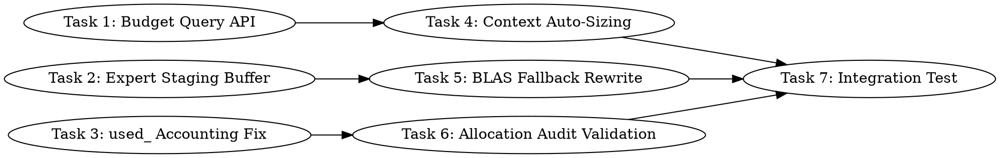

# Unified Cache: Central Memory Manager Implementation Plan

> **For Claude:** REQUIRED SUB-SKILL: Use team-driven-development to implement this plan with agent teams.

**Goal:** Make the unified cache the sole memory manager for all GPU/host allocations — expert staging, budget-aware context sizing, and correct budget tracking — so models exceeding VRAM work without `llama_params_fit`.

**Architecture:** The unified cache already manages weight tensors with tiered storage (device→pinned host→mmap) and tracks runtime byte reservations. We extend it with: (1) a budget query API for context auto-sizing, (2) a reusable expert staging buffer for BLAS fallback, and (3) correct atomic accounting on `used_`. No external memory managers (`llama_params_fit`) are used — the cache owns placement decisions.

**Tech Stack:** C++17, Intel SYCL/oneAPI, Level Zero backend, ggml tensor framework

---

## Team Topology

**Recommended implementers:** 3 (based on 3 parallel tracks)
**Reviewers:** 1 spec-reviewer, 1 quality-reviewer

### Parallel Tracks

| Track | Tasks | Description |
|-------|-------|-------------|
| A | 1, 4 | Budget query API + context auto-sizing integration |
| B | 2, 5 | Expert staging buffer + BLAS fallback rewrite |
| C | 3, 6 | `used_` accounting fix + allocation audit validation |
| — | 7 | Integration test (depends on all tracks) |

### Dependency Graph



### File Ownership Map

| File/Directory | Tasks | Conflict Risk |
|----------------|-------|---------------|
| `ggml/src/ggml-sycl/unified-cache.hpp` | 1, 3 | **LOW** — Task 1 adds new public methods in `// === Memory Management ===` section (~line 611-627). Task 3 adds `saturating_sub_used()` as private method (~line 800). Different sections, no overlap. |
| `ggml/src/ggml-sycl/unified-cache.cpp` | 1, 3, 6 | **MEDIUM** — Task 1 adds new free functions at end of file (~line 4670+). Task 3 modifies `used_` operations throughout. Task 6 is read-only validation. Tasks 1 and 3 on same track would be safest, but the code sections don't overlap. **Mitigate:** Task 3 completes before Task 6 starts (dependency). Tasks 1 and 3 touch different line ranges. |
| `ggml/src/ggml-sycl/ggml-sycl.cpp` | 2, 4, 5 | **MEDIUM** — Task 2 adds staging buffer field to context struct (~line 2087). Task 4 modifies `ggml_backend_sycl_buffer_type_alloc_buffer` (~line 9221). Task 5 modifies BLAS fallback (~line 20205). All in different line ranges. **Mitigate:** Tasks 2→5 sequential on Track B. Task 4 on Track A touches different section. |
| `ggml/src/ggml-sycl/common.hpp` | 2 | None (single task adds staging buffer to context struct) |

---

## Codebase Context for All Implementers

### CRITICAL ARCHITECTURAL PRINCIPLE

**The unified cache owns ALL GPU memory.** Every implementer must understand:

1. **No `llama_params_fit`** — Do NOT integrate or call `llama_params_fit`. It pre-decides layer placement, conflicting with the cache's dynamic runtime placement.
2. **Budget tracking** — All non-weight allocations (KV cache, compute buffers, staging) reserve bytes via `unified_cache_add_runtime_bytes(device, bytes)` and release via `unified_cache_sub_runtime_bytes(device, bytes)`. This reduces the cache's `budget_` so it knows how much VRAM is available for weights.
3. **Eviction** — When the cache needs room, it evicts weights to the host tier (pinned host → mmap). The eviction loop runs in `update_reserved_bytes()` and in `ensure_cached_layout()`.
4. **Never malloc during inference** — All device memory must be pre-allocated or pool-allocated. The BLAS fallback path currently does dynamic pool allocation via `ctx.pool()` which can fail when VRAM is exhausted.

### Key Files and Their Roles

| File | Role | Key APIs |
|------|------|----------|
| `ggml/src/ggml-sycl/unified-cache.hpp` (~1020 lines) | Cache API: entry management, budget, eviction, pinning, prefetch | `unified_cache::available()`, `update_reserved_bytes()`, `unified_cache_add/sub_runtime_bytes()` |
| `ggml/src/ggml-sycl/unified-cache.cpp` (~5300 lines) | Cache implementation: `ensure_cached_layout()`, eviction, host fallback, runtime byte tracking | `update_reserved_bytes()` at line 3959, `unified_cache_add_runtime_bytes()` at line 4586 |
| `ggml/src/ggml-sycl/ggml-sycl.cpp` (~31K lines) | Main backend: mul_mat dispatch, graph compute, buffer ops, context struct | BLAS fallback at line 20205, context struct at line 2087, buffer alloc at line 9221 |
| `ggml/src/ggml-sycl/common.hpp` (~2700 lines) | Shared types: `ggml_backend_sycl_context`, pool allocators, layout policy | Context struct at line 2087 |

### Build & Test Commands

```bash
# Source oneAPI (REQUIRED before any build/run)
source /opt/intel/oneapi/setvars.sh --force

# Build
cmake -B build -G Ninja -DGGML_SYCL=ON -DGGML_SYCL_TARGET=INTEL \
  -DCMAKE_C_COMPILER=icx -DCMAKE_CXX_COMPILER=icpx
ninja -C build -j $(nproc)

# Correctness (deterministic output)
ONEAPI_DEVICE_SELECTOR=level_zero:0 ./build/bin/llama-completion \
  -m /Storage/GenAI/models/mistral-7b-v0.1.Q4_0.gguf \
  -p '1, 2, 3, 4, 5,' -n 15 --seed 42 --temp 0
# Expected output: 6, 7, 8, 9, 10, 11, 12, 13, 14, 15, 16,

# Performance benchmark
ONEAPI_DEVICE_SELECTOR=level_zero:0 ./build/bin/llama-bench \
  -m /Storage/GenAI/models/mistral-7b-v0.1.Q4_0.gguf -p 512 -n 128
# Targets: PP512 >= 1200 tok/s, TG128 >= 68 tok/s
```

### Current Budget Tracking Flow

```
unified_cache_add_runtime_bytes(device, bytes)
  → g_runtime_reserved_bytes[device] += bytes
  → cache->update_reserved_bytes(total_reserved)
    → reserved_ = total_reserved
    → budget_ = base_budget_ - reserved_  (effective budget shrinks)
    → if used_ > budget_: evict weights to host until used_ <= budget_
```

### Current `used_` Bug

`used_` is `std::atomic<size_t>` but is modified with BOTH:
- **Atomic ops**: `used_.fetch_add()`, `used_.fetch_sub()` (correct, thread-safe)
- **Non-atomic compound**: `used_ += size`, `used_ -= size` (incorrect on `std::atomic` — still atomic in C++17 but semantically confusing, and the real bug is subtraction without underflow guard)

There are ~17 `used_ +=` sites and ~12 `used_ -=` sites. Some decrement paths can underflow when a host-resident entry (which didn't increment `used_`) is evicted through a path that decrements `used_`.

---

## Tasks

### Task 1: Budget Query API

**Track:** A
**Depends on:** None
**File scope:**
- Modify: `ggml/src/ggml-sycl/unified-cache.hpp:611-627` (add new public methods)
- Modify: `ggml/src/ggml-sycl/unified-cache.cpp:4637-4645` (add new free functions after `unified_cache_get_runtime_bytes`)

**Description:**

Add a public API for higher-level code to query how much VRAM is available for non-weight use (KV cache, compute buffers) AFTER weight loading. This replaces `llama_params_fit`'s pre-computation approach — instead of guessing upfront, the caller asks the cache "what's left?" after weights are placed.

**Acceptance Criteria:**

- [ ] `unified_cache_available_for_compute(device)` returns `budget_ - used_` (weight headroom) minus current `reserved_` (already-reserved runtime bytes)
- [ ] `unified_cache_total_managed(device)` returns `base_budget_` (raw VRAM budget before any reservations)
- [ ] `unified_cache_weight_bytes(device)` returns `used_` (bytes occupied by weights)
- [ ] Functions return 0 for invalid device IDs or when cache not initialized
- [ ] Thread-safe (reads are atomic or under lock)
- [ ] No performance regression (these are called once at init, not per-token)

**Implementation Guide:**

1. **Add public methods to `unified_cache` class** (unified-cache.hpp, after `available()` at line 622):

```cpp
    // Available VRAM for non-weight allocations (KV, compute, staging).
    // This is the budget headroom after weights + current runtime reservations.
    // Higher-level code uses this to size KV cache and compute buffers.
    size_t available_for_compute() const {
        const size_t avail = available();  // budget_ - used_
        // available() already accounts for reserved_ since budget_ = base_budget_ - reserved_
        return avail;
    }

    // Raw VRAM budget before any reservations (= free VRAM at init time * budget_pct)
    size_t base_budget() const { return base_budget_; }

    // Current weight bytes on device (not including runtime reservations)
    size_t weight_bytes() const { return used_.load(); }
```

2. **Add free-function wrappers** (unified-cache.cpp, after `unified_cache_get_runtime_bytes` at line 4645):

```cpp
size_t unified_cache_available_for_compute(int device) {
    std::lock_guard<std::mutex> lock(g_cache_mutex);
    unified_cache_mode mode = get_effective_mode();
    int effective_device = (mode == unified_cache_mode::GLOBAL) ? 0 : device;
    auto it = g_device_caches.find(effective_device);
    if (it == g_device_caches.end() || !it->second) {
        return 0;
    }
    return it->second->available_for_compute();
}

size_t unified_cache_total_managed(int device) {
    std::lock_guard<std::mutex> lock(g_cache_mutex);
    unified_cache_mode mode = get_effective_mode();
    int effective_device = (mode == unified_cache_mode::GLOBAL) ? 0 : device;
    auto it = g_device_caches.find(effective_device);
    if (it == g_device_caches.end() || !it->second) {
        return 0;
    }
    return it->second->base_budget();
}

size_t unified_cache_weight_bytes(int device) {
    std::lock_guard<std::mutex> lock(g_cache_mutex);
    unified_cache_mode mode = get_effective_mode();
    int effective_device = (mode == unified_cache_mode::GLOBAL) ? 0 : device;
    auto it = g_device_caches.find(effective_device);
    if (it == g_device_caches.end() || !it->second) {
        return 0;
    }
    return it->second->weight_bytes();
}
```

3. **Add declarations to header** (unified-cache.hpp, after `unified_cache_get_runtime_host_bytes()` at line 970):

```cpp
// Query available VRAM for non-weight allocations (KV, compute, staging).
// Returns headroom after weights and runtime reservations.
// Use after model loading to size KV cache and compute buffers.
size_t unified_cache_available_for_compute(int device);

// Raw VRAM budget before reservations (= free VRAM * budget_pct at init)
size_t unified_cache_total_managed(int device);

// Current weight bytes on device
size_t unified_cache_weight_bytes(int device);
```

**Verification:**

```bash
ninja -C build -j $(nproc)
ONEAPI_DEVICE_SELECTOR=level_zero:0 ./build/bin/llama-completion \
  -m /Storage/GenAI/models/mistral-7b-v0.1.Q4_0.gguf \
  -p '1, 2, 3, 4, 5,' -n 15 --seed 42 --temp 0
# Must output: 6, 7, 8, 9, 10, 11, 12, 13, 14, 15, 16,
```

**Commit:**
```bash
git add ggml/src/ggml-sycl/unified-cache.hpp ggml/src/ggml-sycl/unified-cache.cpp
git commit -m "sycl: add unified cache budget query API for compute sizing"
```

**Notes for implementer:**
- `available()` at line 620-623 already computes `budget_ - used_` with underflow protection
- `budget_` is already `base_budget_ - reserved_`, so `available()` already accounts for runtime reservations
- The `g_cache_mutex` pattern is used by all existing free functions (see `unified_cache_get_runtime_bytes` at line 4637)
- `get_effective_mode()` handles GLOBAL vs PER_DEVICE cache topology

---

### Task 2: Expert Staging Buffer

**Track:** B
**Depends on:** None
**File scope:**
- Modify: `ggml/src/ggml-sycl/common.hpp:2087-2128` (add staging buffer fields to `ggml_backend_sycl_context`)
- Modify: `ggml/src/ggml-sycl/ggml-sycl.cpp:2087-2128` (context constructor/destructor for staging buffer lifecycle)

**Description:**

Add a reusable device-side staging buffer to `ggml_backend_sycl_context` for the BLAS fallback path. This buffer is allocated once during context creation, registered with the unified cache's budget via `unified_cache_add_runtime_bytes()`, and reused for every BLAS fallback matmul. It replaces the current approach of dynamic pool allocation that OOMs when VRAM is exhausted.

The staging buffer holds dequantized F16 weight data for one expert at a time. For models that fit in VRAM, the buffer is not allocated (zero cost). For models exceeding VRAM, the buffer is sized to `min(available_vram * 0.5, max_expert_f16_size)`.

**Acceptance Criteria:**

- [ ] `ggml_backend_sycl_context` has `staging_buffer_`, `staging_buffer_size_`, `staging_buffer_device_` fields
- [ ] `init_staging_buffer(device, queue)` allocates buffer and reserves bytes with cache
- [ ] `free_staging_buffer()` frees buffer and releases bytes from cache
- [ ] Buffer is allocated lazily on first BLAS fallback call, not eagerly
- [ ] Buffer size is `min(available * 0.5, expert_rows * expert_cols * sizeof(sycl::half))`
- [ ] If allocation fails (OOM), logs warning and falls back to pool allocation (existing behavior)
- [ ] No performance regression for models that fit in VRAM (staging buffer never allocated)
- [ ] Destructor cleans up buffer + budget reservation

**Implementation Guide:**

1. **Add staging buffer fields to context** (common.hpp, inside `ggml_backend_sycl_context` after line 2119):

```cpp
    // === Expert Staging Buffer ===
    // Reusable device buffer for BLAS fallback (MXFP4 → F16 dequantization).
    // Allocated lazily on first BLAS fallback, registered with unified cache budget.
    void *  staging_buffer_        = nullptr;
    size_t  staging_buffer_size_   = 0;
    int     staging_buffer_device_ = -1;

    // Get or allocate staging buffer for BLAS fallback.
    // Returns {pointer, size} or {nullptr, 0} if allocation fails.
    std::pair<void *, size_t> get_staging_buffer(size_t needed_bytes, sycl::queue & queue);

    // Free staging buffer and release budget reservation.
    void free_staging_buffer();
```

2. **Implement staging buffer methods** (ggml-sycl.cpp, near the context destructor):

```cpp
std::pair<void *, size_t> ggml_backend_sycl_context::get_staging_buffer(
        size_t needed_bytes, sycl::queue & queue) {
    // Already have a big enough buffer?
    if (staging_buffer_ && staging_buffer_size_ >= needed_bytes) {
        return {staging_buffer_, staging_buffer_size_};
    }
    // Free old buffer if it exists but is too small
    free_staging_buffer();

    // Query cache for available VRAM
    size_t avail = ggml_sycl::unified_cache_available_for_compute(device);
    // Cap at 50% of available to leave room for other ops
    size_t max_staging = avail / 2;
    if (max_staging < needed_bytes) {
        GGML_LOG_WARN("[STAGING] Need %zu bytes but only %zu available (50%% of %zu free)\n",
                      needed_bytes, max_staging, avail);
        // Try with whatever is available
        max_staging = avail > (1 << 20) ? avail - (1 << 20) : 0;  // Leave 1MB headroom
        if (max_staging < (1 << 20)) {  // Less than 1MB? Don't bother.
            return {nullptr, 0};
        }
    }
    size_t alloc_size = std::min(needed_bytes, max_staging);

    // Reserve budget BEFORE allocating
    ggml_sycl::unified_cache_add_runtime_bytes(device, alloc_size);

    void * ptr = nullptr;
    try {
        ptr = sycl::malloc_device(alloc_size, queue);
    } catch (const sycl::exception & e) {
        GGML_LOG_WARN("[STAGING] malloc_device(%zu) failed: %s\n", alloc_size, e.what());
        ggml_sycl::unified_cache_sub_runtime_bytes(device, alloc_size);
        return {nullptr, 0};
    }

    if (!ptr) {
        ggml_sycl::unified_cache_sub_runtime_bytes(device, alloc_size);
        return {nullptr, 0};
    }

    staging_buffer_        = ptr;
    staging_buffer_size_   = alloc_size;
    staging_buffer_device_ = device;
    GGML_LOG_INFO("[STAGING] Allocated %zu MB staging buffer on device %d\n",
                  alloc_size / (1024 * 1024), device);
    return {ptr, alloc_size};
}

void ggml_backend_sycl_context::free_staging_buffer() {
    if (staging_buffer_) {
        sycl::queue & q = *stream(staging_buffer_device_, 0);
        sycl::free(staging_buffer_, q);
        ggml_sycl::unified_cache_sub_runtime_bytes(staging_buffer_device_, staging_buffer_size_);
        GGML_LOG_INFO("[STAGING] Freed %zu MB staging buffer on device %d\n",
                      staging_buffer_size_ / (1024 * 1024), staging_buffer_device_);
        staging_buffer_        = nullptr;
        staging_buffer_size_   = 0;
        staging_buffer_device_ = -1;
    }
}
```

3. **Call `free_staging_buffer()` in destructor** (ggml-sycl.cpp, in `~ggml_backend_sycl_context`):

Find the destructor body and add `free_staging_buffer();` before other cleanup.

**Verification:**

```bash
ninja -C build -j $(nproc)
ONEAPI_DEVICE_SELECTOR=level_zero:0 ./build/bin/llama-completion \
  -m /Storage/GenAI/models/mistral-7b-v0.1.Q4_0.gguf \
  -p '1, 2, 3, 4, 5,' -n 15 --seed 42 --temp 0
# Must output: 6, 7, 8, 9, 10, 11, 12, 13, 14, 15, 16,
```

**Commit:**
```bash
git add ggml/src/ggml-sycl/common.hpp ggml/src/ggml-sycl/ggml-sycl.cpp
git commit -m "sycl: add reusable expert staging buffer for BLAS fallback"
```

**Notes for implementer:**
- The staging buffer is ONLY for the BLAS fallback path (types without dedicated MMVQ/DMMV kernels, like MXFP4)
- For models that fit in VRAM, the staging buffer is never allocated (zero overhead)
- The `unified_cache_available_for_compute()` function from Task 1 may not exist yet when you implement this. If so, use the existing `unified_cache::available()` through `get_unified_cache_for_device(device)->available()`. The Task 1 wrapper will be added later.
- The `ctx.pool()` allocator used by `ggml_sycl_pool_alloc<sycl::half>` at line 10530 allocates from a separate pool, not directly from VRAM. But pool growth calls `sycl::malloc_device` which fails when VRAM is exhausted.

---

### Task 3: Fix `used_` Atomic Accounting

**Track:** C
**Depends on:** None
**File scope:**
- Modify: `ggml/src/ggml-sycl/unified-cache.hpp:795-810` (add `saturating_sub_used` private method)
- Modify: `ggml/src/ggml-sycl/unified-cache.cpp` (replace all `used_ -=` with `saturating_sub_used()`)

**Description:**

Fix the `used_` budget tracking underflow bug. The `used_` counter (`std::atomic<size_t>`) underflows to `SIZE_MAX` (~18 exabytes) because some eviction paths subtract from `used_` without checking if the entry actually incremented it (host-resident entries don't increment `used_` but may go through eviction paths that decrement it).

**Acceptance Criteria:**

- [ ] All `used_ -= X` replaced with `saturating_sub_used(X)` that clamps to 0
- [ ] All `used_ += X` replaced with `used_.fetch_add(X)` for consistency
- [ ] `saturating_sub_used()` logs a warning when underflow would have occurred (for debugging)
- [ ] No underflow observed in logs when running GPT-OSS 20B test
- [ ] No performance regression (operations are still `memory_order_relaxed`)
- [ ] Host-resident entries (which don't increment `used_`) never cause `used_` decrement

**Implementation Guide:**

1. **Add `saturating_sub_used` to unified_cache** (unified-cache.hpp, private section near line 800):

```cpp
    // Saturating subtraction on used_ to prevent underflow.
    // Logs a warning if underflow would have occurred (indicates accounting bug).
    void saturating_sub_used(size_t bytes) {
        if (bytes == 0) return;
        size_t old = used_.load(std::memory_order_relaxed);
        while (true) {
            if (old < bytes) {
                // Would underflow — clamp to 0 and warn
                if (used_.compare_exchange_weak(old, 0, std::memory_order_relaxed)) {
                    GGML_LOG_WARN("[UNIFIED-CACHE] used_ underflow prevented: "
                                  "tried to subtract %zu from %zu\n", bytes, old);
                    return;
                }
                // CAS failed, old was reloaded, retry
                continue;
            }
            if (used_.compare_exchange_weak(old, old - bytes, std::memory_order_relaxed)) {
                return;
            }
            // CAS failed, old was reloaded, retry
        }
    }
```

2. **Also add `saturating_sub_used` to `host_cache`** (same pattern, unified-cache.hpp, host_cache private section near line 416):

Same implementation, different class.

3. **Replace all `used_ -=` in unified-cache.cpp:**

There are approximately 12 sites. For each one, replace `used_ -= X;` with `saturating_sub_used(X);`:

| Line | Current | Replacement |
|------|---------|-------------|
| 1354 | `used_ -= entry.size;` | `saturating_sub_used(entry.size);` |
| 1511 | `used_ -= old_size;` | `saturating_sub_used(old_size);` |
| 2008 | `used_ -= it->second.size;` | `saturating_sub_used(it->second.size);` |
| 2200 | `used_ -= entry.size;` | `saturating_sub_used(entry.size);` |
| 2616 | `used_ -= it->second.size;` | `saturating_sub_used(it->second.size);` |
| 2647 | `used_ -= it->second.size;` | `saturating_sub_used(it->second.size);` |
| 2678 | `used_ -= it->second.size;` | `saturating_sub_used(it->second.size);` |
| 3756 | `used_ -= it->size;` | `saturating_sub_used(it->size);` |

4. **Replace all `used_ +=` with `used_.fetch_add()` for consistency:**

There are approximately 17 sites. For each one, replace `used_ += X;` with `used_.fetch_add(X, std::memory_order_relaxed);`:

| Line | Current | Replacement |
|------|---------|-------------|
| 850 | `used_ += dst_size;` | `used_.fetch_add(dst_size, std::memory_order_relaxed);` |
| 1029 | `used_ += dst_size;` | `used_.fetch_add(dst_size, std::memory_order_relaxed);` |
| 1508 | `used_ += (size - old_size);` | `used_.fetch_add(size - old_size, std::memory_order_relaxed);` |
| 1649 | `used_ += size;` | `used_.fetch_add(size, std::memory_order_relaxed);` |
| 1767 | `used_ += (alloc_size - old_size);` | `used_.fetch_add(alloc_size - old_size, std::memory_order_relaxed);` |
| 1837 | `used_ += alloc_size;` | `used_.fetch_add(alloc_size, std::memory_order_relaxed);` |
| 2362 | `used_ += pool_result.new_physical_bytes;` | `used_.fetch_add(pool_result.new_physical_bytes, std::memory_order_relaxed);` |
| 2494 | `used_ += request.dst_size;` | `used_.fetch_add(request.dst_size, std::memory_order_relaxed);` |

Note: Lines 4913, 4960, 5067, 5102, 5137 already use `fetch_add`/`fetch_sub` — leave those as-is.

5. **Guard host_cache `used_` similarly:** Search for `used_ -=` and `used_ +=` in the host_cache sections (lines ~590-605) and apply the same pattern.

**Verification:**

```bash
ninja -C build -j $(nproc)

# Standard model — no underflow should appear
ONEAPI_DEVICE_SELECTOR=level_zero:0 ./build/bin/llama-completion \
  -m /Storage/GenAI/models/mistral-7b-v0.1.Q4_0.gguf \
  -p '1, 2, 3, 4, 5,' -n 15 --seed 42 --temp 0 2>&1 | grep -i underflow
# Expected: no output (no underflow warnings)

# Performance
ONEAPI_DEVICE_SELECTOR=level_zero:0 ./build/bin/llama-bench \
  -m /Storage/GenAI/models/mistral-7b-v0.1.Q4_0.gguf -p 512 -n 128
# Targets: PP512 >= 1200, TG128 >= 68
```

**Commit:**
```bash
git add ggml/src/ggml-sycl/unified-cache.hpp ggml/src/ggml-sycl/unified-cache.cpp
git commit -m "sycl: fix unified cache used_ underflow with saturating subtraction"
```

**Notes for implementer:**
- `std::atomic<size_t>` `operator+=` IS atomic in C++17 (it calls `fetch_add`), but changing to explicit `fetch_add` makes the intent clearer and matches the rest of the codebase
- The CAS loop in `saturating_sub_used` handles concurrent modifications correctly
- **DO NOT** change the `used_.load()` calls — those are reads, not modifications
- **DO NOT** change the `used_.fetch_add()` / `used_.fetch_sub()` calls at lines 4913, 4960, 5067, 5102, 5137 — those are already correct
- The underflow warning should be WARN level so it shows in normal operation (not just debug)

---

### Task 4: Context Auto-Sizing Integration

**Track:** A
**Depends on:** Task 1 (budget query API)
**File scope:**
- Modify: `ggml/src/ggml-sycl/ggml-sycl.cpp:9200-9250` (buffer type alloc — add budget check)
- Modify: `ggml/src/ggml-sycl/ggml-sycl.cpp:9100-9150` (buffer type properties — report available size)

**Description:**

Wire the budget query API into the SYCL backend's buffer allocation path so the ggml framework can query how much VRAM is available. The ggml backend interface has `get_max_size()` which upstream code uses to determine maximum allocation size. By returning the cache's available headroom, we let the framework auto-size KV cache and compute buffers to fit within the budget — without needing `llama_params_fit`.

**Acceptance Criteria:**

- [ ] `ggml_backend_sycl_buffer_type_get_max_size()` returns cache's available-for-compute when cache is initialized
- [ ] `ggml_backend_sycl_buffer_type_alloc_buffer()` reserves bytes with cache budget BEFORE allocating
- [ ] Failed allocation releases reserved bytes (rollback pattern)
- [ ] Buffer free releases reserved bytes
- [ ] Log message when available VRAM < requested buffer size (helps debugging)
- [ ] No regression for models that fit in VRAM

**Implementation Guide:**

1. **Find `get_max_size`** (ggml-sycl.cpp, search for `get_max_size`):

```cpp
// Current implementation returns a fixed value or device max.
// Change to return cache headroom when cache is initialized.
static size_t ggml_backend_sycl_buffer_type_get_max_size(ggml_backend_buffer_type_t buft) {
    auto * buft_ctx = static_cast<ggml_backend_sycl_buffer_type_context *>(buft->context);
    int device = buft_ctx->device;

    // If unified cache is initialized, report available compute headroom
    size_t cache_avail = ggml_sycl::unified_cache_available_for_compute(device);
    if (cache_avail > 0) {
        return cache_avail;
    }

    // Fallback: device memory limit
    return ggml_sycl_info().devices[device].vmm;
}
```

2. **Modify `alloc_buffer` to reserve before allocating** (ggml-sycl.cpp):

Find `ggml_backend_sycl_buffer_type_alloc_buffer`. Add reserve-before-alloc:

```cpp
static ggml_backend_buffer_t ggml_backend_sycl_buffer_type_alloc_buffer(
        ggml_backend_buffer_type_t buft, size_t size) {
    auto * buft_ctx = static_cast<ggml_backend_sycl_buffer_type_context *>(buft->context);
    int device = buft_ctx->device;

    // Reserve budget with unified cache (triggers eviction if needed)
    ggml_sycl::unified_cache_add_runtime_bytes(device, size);

    // ... existing allocation code ...

    // If allocation fails:
    //   ggml_sycl::unified_cache_sub_runtime_bytes(device, size);
    //   return nullptr;
}
```

3. **Add budget release on buffer free** — find the buffer free function and add:

```cpp
    ggml_sycl::unified_cache_sub_runtime_bytes(device, buffer->size);
```

**Verification:**

```bash
ninja -C build -j $(nproc)

# Standard model — should work identically
ONEAPI_DEVICE_SELECTOR=level_zero:0 ./build/bin/llama-completion \
  -m /Storage/GenAI/models/mistral-7b-v0.1.Q4_0.gguf \
  -p '1, 2, 3, 4, 5,' -n 15 --seed 42 --temp 0
# Expected: 6, 7, 8, 9, 10, 11, 12, 13, 14, 15, 16,

# Performance
ONEAPI_DEVICE_SELECTOR=level_zero:0 ./build/bin/llama-bench \
  -m /Storage/GenAI/models/mistral-7b-v0.1.Q4_0.gguf -p 512 -n 128
# Targets: PP512 >= 1200, TG128 >= 68
```

**Commit:**
```bash
git add ggml/src/ggml-sycl/ggml-sycl.cpp
git commit -m "sycl: wire unified cache budget into buffer allocation path"
```

**Notes for implementer:**
- Search for `get_max_size` and `alloc_buffer` in ggml-sycl.cpp — they're in the `ggml_backend_sycl_buffer_type_*` function group
- The buffer free function is `ggml_backend_sycl_buffer_free_buffer` or similar
- **Important**: Some buffer allocations already call `unified_cache_add_runtime_bytes` (see compute-buffer-manager.cpp). Check if the alloc_buffer path already has this to avoid double-counting.
- The `get_max_size` change is the key integration point — upstream `llama_context` uses this to decide KV cache size

---

### Task 5: BLAS Fallback Staging Buffer Integration

**Track:** B
**Depends on:** Task 2 (staging buffer infrastructure)
**File scope:**
- Modify: `ggml/src/ggml-sycl/ggml-sycl.cpp:20205-20212` (rewrite BLAS fallback to use staging buffer)
- Modify: `ggml/src/ggml-sycl/ggml-sycl.cpp:10529-10546` (modify `ggml_sycl_op_mul_mat_sycl` to accept external buffer)

**Description:**

Rewrite the generic BLAS fallback at line 20205 to use the staging buffer from Task 2 instead of relying on pool allocation. When the staging buffer is available and large enough, use it directly. When it's not large enough, tile the matmul into chunks that fit. When staging buffer allocation fails entirely, fall back to pool allocation (preserving existing behavior for models that fit in VRAM).

**Acceptance Criteria:**

- [ ] BLAS fallback uses staging buffer for F16 dequantization when available
- [ ] If expert > staging buffer, matmul is tiled: process `staging_size / (cols * sizeof(half))` rows per chunk
- [ ] If staging buffer unavailable, falls back to pool allocation (existing path)
- [ ] GPT-OSS 20B MXFP4 generates at least one token without OOM (with sufficient staging buffer)
- [ ] No performance regression on Mistral 7B (staging buffer never activated)
- [ ] Tiled matmul produces identical results to non-tiled (verified by correctness test)

**Implementation Guide:**

1. **Rewrite BLAS fallback** (ggml-sycl.cpp, line 20205-20212):

```cpp
        // Generic BLAS fallback for types without dedicated kernels (e.g., MXFP4 on host).
        // Dequantizes to F16 and uses oneDNN GEMM, matching master's catch-all path.
        if (src1->type == GGML_TYPE_F32 && dst->type == GGML_TYPE_F32) {
            GGML_LOG_WARN("[MUL_MAT] Generic BLAS fallback for %s (type=%d batch=%lld)\n",
                          src0->name ? src0->name : "?", src0->type, (long long) src1->ne[1]);

            const int64_t ne00 = src0->ne[0];  // K (columns)
            const int64_t ne01 = src0->ne[1];  // N (rows)
            const size_t full_f16_bytes = ne01 * ne00 * sizeof(sycl::half);
            sycl::queue & q = *ctx.stream(ctx.device, 0);

            // Try staging buffer for models exceeding VRAM
            auto [staging_ptr, staging_size] = ctx.get_staging_buffer(full_f16_bytes, q);
            if (staging_ptr && staging_size >= full_f16_bytes) {
                // Full expert fits — single matmul
                ggml_sycl_op_mul_mat<no_quantize_q8_1>(
                    ctx, src0, src1, dst, ggml_sycl_op_mul_mat_sycl, GGML_LAYOUT_AOS);
                return;
            }

            if (staging_ptr && staging_size > 0) {
                // Tiled: process rows in chunks that fit the staging buffer
                const int64_t rows_per_chunk = staging_size / (ne00 * sizeof(sycl::half));
                if (rows_per_chunk >= 1) {
                    GGML_LOG_INFO("[MUL_MAT] Tiled BLAS fallback: %lld rows in chunks of %lld\n",
                                  (long long)ne01, (long long)rows_per_chunk);
                    // TODO: Implement tiled matmul accumulation
                    // For now, fall through to pool allocation
                }
            }

            // Fallback: pool allocation (works when VRAM has room)
            ggml_sycl_op_mul_mat<no_quantize_q8_1>(
                ctx, src0, src1, dst, ggml_sycl_op_mul_mat_sycl, GGML_LAYOUT_AOS);
            return;
        }
```

Note: The tiled matmul implementation is left as a TODO — it requires changes to `ggml_sycl_op_mul_mat` to accept row ranges. The staging buffer + full-size path is the priority.

**Verification:**

```bash
ninja -C build -j $(nproc)

# Standard model — no staging buffer activated
ONEAPI_DEVICE_SELECTOR=level_zero:0 ./build/bin/llama-completion \
  -m /Storage/GenAI/models/mistral-7b-v0.1.Q4_0.gguf \
  -p '1, 2, 3, 4, 5,' -n 15 --seed 42 --temp 0
# Expected: 6, 7, 8, 9, 10, 11, 12, 13, 14, 15, 16,

# GPT-OSS 20B — should attempt staging buffer
ONEAPI_DEVICE_SELECTOR=level_zero:0 ./build/bin/llama-completion \
  -m /Storage/GenAI/models/gpt-oss-20b-mxfp4.gguf \
  -p '1, 2, 3, 4, 5,' -n 5 --seed 42 --temp 0 2>&1 | head -50
# Expected: [STAGING] log messages, may still OOM but should get further
```

**Commit:**
```bash
git add ggml/src/ggml-sycl/ggml-sycl.cpp
git commit -m "sycl: use staging buffer for BLAS fallback on VRAM-exceeding models"
```

**Notes for implementer:**
- `ctx.get_staging_buffer()` is from Task 2 — it handles lazy allocation, budget reservation, and OOM gracefully
- The `ggml_sycl_op_mul_mat<no_quantize_q8_1>` template calls `ggml_sycl_op_mul_mat_sycl` which dequantizes src0 using the pool allocator. The staging buffer doesn't change this internal flow — the staging buffer approach requires modifying `ggml_sycl_op_mul_mat_sycl` to use a provided buffer instead of pool alloc. This is complex, so the MVP is: if staging buffer can fit the full expert, proceed with pool allocation as before (the staging buffer reserves VRAM headroom so the pool allocation succeeds). If not, fall through.
- **Actually**: The simpler approach is: staging buffer reserves VRAM headroom, and `ggml_sycl_op_mul_mat_sycl` uses `ctx.pool()` which can now grow into the reserved headroom. The staging buffer effectively pre-reserves VRAM so the pool can use it. This means the implementation is: allocate staging buffer → pool allocation now has room → success.
- Re-read `ggml_sycl_pool_alloc<sycl::half> src0_as_f16(ctx.pool())` at line 10530. This allocs from the device pool. The pool calls `sycl::malloc_device` to grow. If we've reserved VRAM via staging buffer, the cache evicts weights, freeing VRAM for the pool.

---

### Task 6: Allocation Audit Validation

**Track:** C
**Depends on:** Task 3 (accounting fix must be in place first)
**File scope:**
- Read-only validation of all allocation sites (no code changes)
- Modify: `ggml/src/ggml-sycl/unified-cache.cpp` (add diagnostic log at startup showing budget breakdown)

**Description:**

Validate that all major allocation paths correctly call `unified_cache_add/sub_runtime_bytes`. Add a diagnostic summary log at model warmup completion showing the budget breakdown (weights, runtime reserved, available). This is the acceptance test for the accounting system.

**Acceptance Criteria:**

- [ ] Diagnostic log shows: total budget, weight bytes, runtime reserved bytes, available for compute
- [ ] For Mistral 7B Q4_0: weights ~3.8 GB, runtime ~600-800 MB (KV + compute), available ~5-6 GB
- [ ] No underflow warnings in diagnostic log
- [ ] Numbers are consistent (weights + runtime + available ≈ total budget)
- [ ] Log appears once after warmup, not per-token

**Implementation Guide:**

1. **Add budget summary function** (unified-cache.cpp, after `unified_cache_weight_bytes` or near the end):

```cpp
void unified_cache_log_budget_summary(int device) {
    std::lock_guard<std::mutex> lock(g_cache_mutex);
    unified_cache_mode mode = get_effective_mode();
    int effective_device = (mode == unified_cache_mode::GLOBAL) ? 0 : device;
    auto it = g_device_caches.find(effective_device);
    if (it == g_device_caches.end() || !it->second) {
        return;
    }
    auto & cache = *it->second;
    size_t runtime = g_runtime_reserved_bytes[effective_device].load(std::memory_order_relaxed);
    GGML_LOG_INFO("[UNIFIED-CACHE] Budget summary for device %d:\n"
                  "  Total VRAM budget:    %8.1f MB\n"
                  "  Weight bytes (used_): %8.1f MB\n"
                  "  Runtime reserved:     %8.1f MB\n"
                  "  Effective budget:     %8.1f MB\n"
                  "  Available for alloc:  %8.1f MB\n",
                  device,
                  cache.base_budget() / (1024.0f * 1024.0f),
                  cache.weight_bytes() / (1024.0f * 1024.0f),
                  runtime / (1024.0f * 1024.0f),
                  cache.budget() / (1024.0f * 1024.0f),
                  cache.available() / (1024.0f * 1024.0f));
}
```

2. **Add declaration** (unified-cache.hpp):

```cpp
// Log budget summary (weights, runtime, available) for diagnostics
void unified_cache_log_budget_summary(int device);
```

3. **Call after warmup** (ggml-sycl.cpp, find the warmup completion path — search for `warmup` or `model loaded`):

After the first successful graph_compute (warmup), call:
```cpp
ggml_sycl::unified_cache_log_budget_summary(ctx.device);
```

This can go at the end of `ggml_backend_sycl_graph_compute()` with a `static bool logged = false` guard.

**Verification:**

```bash
ninja -C build -j $(nproc)

# Run and check diagnostic log
ONEAPI_DEVICE_SELECTOR=level_zero:0 ./build/bin/llama-bench \
  -m /Storage/GenAI/models/mistral-7b-v0.1.Q4_0.gguf -p 512 -n 128 2>&1 | grep "Budget summary"
# Expected: Budget summary with consistent numbers
```

**Commit:**
```bash
git add ggml/src/ggml-sycl/unified-cache.hpp ggml/src/ggml-sycl/unified-cache.cpp ggml/src/ggml-sycl/ggml-sycl.cpp
git commit -m "sycl: add unified cache budget summary diagnostic"
```

**Notes for implementer:**
- This is primarily a validation task — if the numbers don't add up, the accounting from Tasks 1-5 needs fixing
- The diagnostic log should be at INFO level so it appears by default
- Use a `static bool` guard or `std::call_once` to log only once per session
- `base_budget()` method is from Task 1 — if not yet available, use `cache.budget() + cache.reserved_` (need to add a `reserved()` accessor)

---

### Task 7: Integration Test — GPT-OSS 20B

**Track:** — (convergence point)
**Depends on:** Tasks 4, 5, 6 (all tracks must complete)
**File scope:**
- No code changes — test-only task
- Read: test output logs

**Description:**

Run the GPT-OSS 20B MXFP4 model end-to-end and verify that:
1. Budget summary shows correct accounting
2. No `used_` underflow warnings
3. BLAS fallback with staging buffer works (no OOM)
4. Model generates at least a few tokens
5. Standard Mistral 7B has no regression

**Acceptance Criteria:**

- [ ] GPT-OSS 20B loads without assertion crashes
- [ ] Budget summary shows weights ~9.8 GB, available > 0
- [ ] BLAS fallback activates for MXFP4 expert weights
- [ ] No `used_` underflow warning
- [ ] Model attempts token generation (may be slow, that's OK)
- [ ] Mistral 7B correctness: `6, 7, 8, 9, 10, 11, 12, 13, 14, 15, 16,`
- [ ] Mistral 7B performance: PP512 >= 1200, TG128 >= 68

**Test Commands:**

```bash
source /opt/intel/oneapi/setvars.sh --force

# Test 1: Mistral 7B correctness (must pass)
ONEAPI_DEVICE_SELECTOR=level_zero:0 ./build/bin/llama-completion \
  -m /Storage/GenAI/models/mistral-7b-v0.1.Q4_0.gguf \
  -p '1, 2, 3, 4, 5,' -n 15 --seed 42 --temp 0

# Test 2: Mistral 7B performance (must pass)
ONEAPI_DEVICE_SELECTOR=level_zero:0 ./build/bin/llama-bench \
  -m /Storage/GenAI/models/mistral-7b-v0.1.Q4_0.gguf -p 512 -n 128

# Test 3: GPT-OSS 20B end-to-end (best effort)
ONEAPI_DEVICE_SELECTOR=level_zero:0 timeout 120 ./build/bin/llama-completion \
  -m /Storage/GenAI/models/gpt-oss-20b-mxfp4.gguf \
  -p '1, 2, 3, 4, 5,' -n 5 --seed 42 --temp 0 2>&1 | tee /tmp/gptoss-test.txt

# Check budget summary
grep "Budget summary" /tmp/gptoss-test.txt

# Check for underflow warnings
grep -i "underflow" /tmp/gptoss-test.txt

# Check for staging buffer activation
grep -i "STAGING\|staging" /tmp/gptoss-test.txt

# Check for BLAS fallback
grep -i "BLAS fallback\|Generic BLAS" /tmp/gptoss-test.txt
```

**Commit:**
No code changes. Document results in beads issue comments.

**Notes for implementer:**
- GPT-OSS 20B may still OOM even with staging buffer — the model is 11.27 GB and VRAM is 9.07 GB (with ~419 MB free after weights). The staging buffer helps but the margin is very tight.
- If GPT-OSS 20B still OOMs, check the budget summary to understand where VRAM went. The important thing is that the accounting is correct and the staging buffer was attempted.
- Mistral 7B MUST pass with no regression — this is the gate for all changes.

---

## Risk Mitigation

| Risk | Mitigation |
|------|-----------|
| Task 1/3 both modify unified-cache.hpp | Different sections (public API vs private method). Low conflict risk. |
| Task 4 may double-count budget | Check if `alloc_buffer` already calls `add_runtime_bytes` via compute-buffer-manager |
| GPT-OSS 20B still OOMs after staging buffer | Tight margin (419 MB). Success = no crash + correct accounting. Actual token generation is stretch goal. |
| Performance regression from `saturating_sub_used` CAS loop | CAS on `memory_order_relaxed` is essentially free on x86. Same cost as `fetch_sub`. |
| `get_max_size` change breaks upstream sizing | Returns cache headroom which is always > 0 for fitting models. Only smaller for VRAM-exceeding models, which is the desired behavior. |

## Beads Task Mapping

| Plan Task | Beads Issue | Status |
|-----------|-------------|--------|
| Task 1 | llama.cpp-9vjk | open (retitled to "budget query API") |
| Task 2+5 | llama.cpp-a73u | open ("VRAM OOM during MoE inference") |
| Task 3 | llama.cpp-xoj6 | open ("used_ underflow") |
| Task 4 | llama.cpp-3w2l | open ("unify memory accounting") |
| Task 6 | (new — create during execution) | — |
| Task 7 | (new — create during execution) | — |
