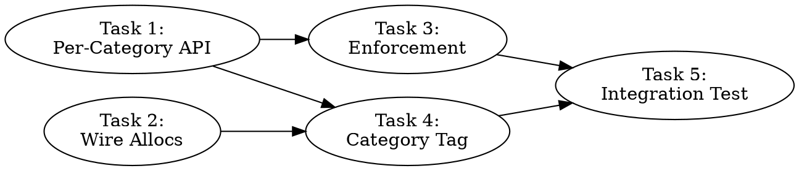

# Unified SYCL Memory Accounting Implementation Plan

> **For Claude:** REQUIRED SUB-SKILL: Use team-driven-development to implement this plan with agent teams.

**Goal:** Complete `llama.cpp-3w2l` by wiring all remaining untracked allocations to the unified cache budget, adding per-category diagnostic breakdowns, and implementing budget enforcement with graceful degradation.

**Architecture:** The unified cache is the central memory manager. All VRAM allocations must call `unified_cache_add_runtime_bytes()` / `unified_cache_sub_runtime_bytes()` so the budget accurately reflects physical memory pressure. A new `runtime_category` enum enables per-category diagnostics. A `budget_exceeded_` flag plus optional strict mode provides graceful degradation under memory pressure.

**Tech Stack:** C++ (SYCL/oneAPI), ggml tensor library

---

## Team Topology

**Recommended implementers:** 2 (based on 2 parallel tracks)
**Reviewers:** 1 spec-reviewer, 1 quality-reviewer

### Parallel Tracks

| Track | Tasks | Description |
|-------|-------|-------------|
| A | 1, 3 | Unified cache API: per-category tracking + budget enforcement |
| B | 2 | Wire remaining untracked allocations at call sites |
| — | 4, 5 | Convergence: category tagging + integration test |

### Dependency Graph



### File Ownership Map

| File/Directory | Tasks | Conflict Risk |
|----------------|-------|---------------|
| `ggml/src/ggml-sycl/unified-cache.hpp` | 1, 3 | Sequential (same track) |
| `ggml/src/ggml-sycl/unified-cache.cpp` | 1, 3 | Sequential (same track) |
| `ggml/src/ggml-sycl/unified-kernel.hpp` | 2 | None (single task) |
| `ggml/src/ggml-sycl/unified-kernel.cpp` | 2, 4 | Sequential (4 after 2) |
| `ggml/src/ggml-sycl/ggml-sycl.cpp` | 2, 4 | Sequential (4 after 2) |
| `ggml/src/ggml-sycl/common.cpp` | 2 | None (single task) |
| `ggml/src/ggml-sycl/compute-buffer-manager.cpp` | 4 | None (single task) |

---

## Critical Context for All Implementers

### Build & Run

```bash
# ALWAYS source oneAPI first
source /opt/intel/oneapi/setvars.sh --force

# Build
ninja -C build -j $(nproc)

# Correctness test (deterministic output)
ONEAPI_DEVICE_SELECTOR=level_zero:0 ./build/bin/llama-completion \
  -m /Storage/GenAI/models/mistral-7b-v0.1.Q4_0.gguf \
  -p '1, 2, 3, 4, 5,' -n 15 --seed 42 --temp 0
# Expected stdout: "1, 2, 3, 4, 5, 6, 7, 8, 9, 10, 11, 12, 13, 14, 15, 16, 17, 18, 19, 20,"

# Performance benchmark
ONEAPI_DEVICE_SELECTOR=level_zero:0 ./build/bin/llama-bench \
  -m /Storage/GenAI/models/mistral-7b-v0.1.Q4_0.gguf -p 512 -n 128
# Targets: PP512 >= 1200 tok/s, TG128 >= 68 tok/s
```

**CRITICAL**: Always use `ONEAPI_DEVICE_SELECTOR=level_zero:0` to select the Arc B580. Without this, multi-GPU mode will hang.

**CRITICAL**: Wait 30-60 seconds between benchmark runs. Back-to-back runs cause thermal throttling (70→2.4 tok/s).

### Key Architecture Concepts

- `g_runtime_reserved_bytes[device]` is an `std::atomic<size_t>` tracking total runtime (non-weight) VRAM reservations per device
- `unified_cache::update_reserved_bytes()` recalculates `budget_ = base_budget_ - reserved_` and evicts weights if needed
- `unified_cache_add_runtime_bytes()` takes the `g_cache_mutex`, increments the counter, and calls `update_reserved_bytes()`
- `unified_cache_sub_runtime_bytes()` does the reverse with saturating subtraction (prevents underflow)
- The host memory has a separate counter: `g_runtime_reserved_host_bytes`
- `ggml_sycl_malloc_host()` wrapper already calls `unified_cache_add_runtime_host_bytes()`
- `ggml_sycl_host_free()` wrapper already calls `unified_cache_sub_runtime_host_bytes()`

### Audit Findings (what's already tracked vs gaps)

**Already tracked** (no changes needed):
- Pinned pool chunks — use `ggml_sycl_malloc_host()` wrapper which tracks
- KV buffer allocations — `ggml-sycl.cpp:6148`
- Compute buffer manager — `compute-buffer-manager.cpp:252,284`
- Expert staging buffer — `ggml-sycl.cpp:9569`
- BLAS fallback reservation — `ggml-sycl.cpp:20291`
- Persistent kernel buffers — `unified-kernel.cpp:5328` (`runtime_tracked_bytes_`)
- All `sycl_ext_malloc_device()` call sites
- All `ggml_sycl_malloc_device()` call sites

**Untracked gaps** (this plan fixes):
- Persistent TG `temp_device_allocs` (~9 call sites in `ggml-sycl.cpp`, variable sizes)
- `get_rows_pool` in UnifiedKernel (`unified-kernel.cpp:6005`)
- PP transfer buffers shared-context path (`common.cpp:1766-1767`, two allocations)

---

### Task 1: Per-Category Runtime Tracking API

**Track:** A
**Depends on:** None
**File scope:**
- Modify: `ggml/src/ggml-sycl/unified-cache.hpp:1000-1016`
- Modify: `ggml/src/ggml-sycl/unified-cache.cpp:41,4596-4674,4722-4788`

**Description:**

Add a `runtime_category` enum to classify VRAM runtime allocations by purpose (KV, compute, staging, graph, other). Add a parallel per-category diagnostic array alongside the existing total counter. Modify the `add/sub_runtime_bytes` function signatures with a default parameter for backward compatibility. Enhance `log_budget_summary()` to show per-category breakdown.

The per-category array is purely diagnostic — the existing `g_runtime_reserved_bytes` total continues to drive all budget calculations. This ensures zero risk to the critical budget path.

**Acceptance Criteria:**

- [ ] `runtime_category` enum defined in `unified-cache.hpp`
- [ ] `g_runtime_cat_bytes` diagnostic array tracks per-category reservations
- [ ] `unified_cache_add_runtime_bytes(device, bytes)` still works unchanged (default = OTHER)
- [ ] `unified_cache_add_runtime_bytes(device, bytes, runtime_category::KV_CACHE)` correctly tracks category
- [ ] `unified_cache_sub_runtime_bytes` mirrors the same signature change
- [ ] `unified_cache_log_budget_summary()` prints per-category breakdown
- [ ] `unified_cache_get_runtime_bytes_by_category(device, cat)` query function added
- [ ] Build succeeds with zero warnings
- [ ] Correctness test passes with expected output
- [ ] No performance regression (PP512 >= 1200, TG128 >= 68)

**Implementation Guide:**

1. **Add `runtime_category` enum to `unified-cache.hpp`**

In `ggml/src/ggml-sycl/unified-cache.hpp`, after the `alloc_hint` enum (line 1007), add:

```cpp
// Classification of runtime (non-weight) VRAM reservations for diagnostics.
// Used with unified_cache_add_runtime_bytes() to track where VRAM is consumed.
enum class runtime_category : uint8_t {
    KV_CACHE = 0,  // KV buffer allocations
    COMPUTE  = 1,  // Compute buffer pool + scratch
    STAGING  = 2,  // Expert staging, DMA staging, BLAS fallback
    GRAPH    = 3,  // Persistent TG temp allocs, get_rows_pool
    OTHER    = 4,  // Everything else (default for backward compat)
    COUNT    = 5
};
```

2. **Modify function signatures in `unified-cache.hpp`**

Change lines 1010-1011 from:
```cpp
void   unified_cache_add_runtime_bytes(int device, size_t bytes);
void   unified_cache_sub_runtime_bytes(int device, size_t bytes);
```
to:
```cpp
void   unified_cache_add_runtime_bytes(int device, size_t bytes,
                                       runtime_category cat = runtime_category::OTHER);
void   unified_cache_sub_runtime_bytes(int device, size_t bytes,
                                       runtime_category cat = runtime_category::OTHER);
```

Add after `unified_cache_get_runtime_bytes` (line 1012):
```cpp
size_t unified_cache_get_runtime_bytes_by_category(int device, runtime_category cat);
```

3. **Add per-category diagnostic array in `unified-cache.cpp`**

After line 41 (`static std::array<std::atomic<size_t>, GGML_SYCL_MAX_DEVICES> g_runtime_reserved_bytes{};`), add:

```cpp
static std::atomic<size_t> g_runtime_cat_bytes[GGML_SYCL_MAX_DEVICES][static_cast<int>(runtime_category::COUNT)]{};
```

4. **Modify `unified_cache_add_runtime_bytes` in `unified-cache.cpp`**

Change the function signature at line 4596 and add per-category tracking:

```cpp
void unified_cache_add_runtime_bytes(int device, size_t bytes, runtime_category cat) {
    if (bytes == 0) {
        return;
    }
    std::lock_guard<std::mutex> lock(g_cache_mutex);
    unified_cache_mode          mode             = get_effective_mode();
    int                         effective_device = (mode == unified_cache_mode::GLOBAL) ? 0 : device;
    if (effective_device < 0 || effective_device >= GGML_SYCL_MAX_DEVICES) {
        return;
    }
    const size_t new_total =
        g_runtime_reserved_bytes[effective_device].fetch_add(bytes, std::memory_order_relaxed) + bytes;
    g_runtime_cat_bytes[effective_device][static_cast<int>(cat)].fetch_add(bytes, std::memory_order_relaxed);
    auto it = g_device_caches.find(effective_device);
    if (it != g_device_caches.end()) {
        const size_t baseline = g_runtime_reserved_baseline[effective_device].load(std::memory_order_relaxed);
        const size_t adjusted = new_total > baseline ? new_total - baseline : 0;
        it->second->update_reserved_bytes(adjusted);
    }
}
```

5. **Modify `unified_cache_sub_runtime_bytes` in `unified-cache.cpp`**

Change at line 4616:

```cpp
void unified_cache_sub_runtime_bytes(int device, size_t bytes, runtime_category cat) {
    if (bytes == 0) {
        return;
    }
    std::lock_guard<std::mutex> lock(g_cache_mutex);
    unified_cache_mode          mode             = get_effective_mode();
    int                         effective_device = (mode == unified_cache_mode::GLOBAL) ? 0 : device;
    if (effective_device < 0 || effective_device >= GGML_SYCL_MAX_DEVICES) {
        return;
    }
    size_t cur  = g_runtime_reserved_bytes[effective_device].load(std::memory_order_relaxed);
    size_t next = cur > bytes ? cur - bytes : 0;
    g_runtime_reserved_bytes[effective_device].store(next, std::memory_order_relaxed);
    // Saturating subtract from per-category counter
    size_t cat_cur  = g_runtime_cat_bytes[effective_device][static_cast<int>(cat)].load(std::memory_order_relaxed);
    size_t cat_next = cat_cur > bytes ? cat_cur - bytes : 0;
    g_runtime_cat_bytes[effective_device][static_cast<int>(cat)].store(cat_next, std::memory_order_relaxed);
    auto it = g_device_caches.find(effective_device);
    if (it != g_device_caches.end()) {
        const size_t baseline = g_runtime_reserved_baseline[effective_device].load(std::memory_order_relaxed);
        const size_t adjusted = next > baseline ? next - baseline : 0;
        it->second->update_reserved_bytes(adjusted);
    }
}
```

6. **Add `unified_cache_get_runtime_bytes_by_category`**

After `unified_cache_get_runtime_bytes` (line 4645), add:

```cpp
size_t unified_cache_get_runtime_bytes_by_category(int device, runtime_category cat) {
    std::lock_guard<std::mutex> lock(g_cache_mutex);
    unified_cache_mode          mode             = get_effective_mode();
    int                         effective_device = (mode == unified_cache_mode::GLOBAL) ? 0 : device;
    if (effective_device < 0 || effective_device >= GGML_SYCL_MAX_DEVICES) {
        return 0;
    }
    if (static_cast<int>(cat) >= static_cast<int>(runtime_category::COUNT)) {
        return 0;
    }
    return g_runtime_cat_bytes[effective_device][static_cast<int>(cat)].load(std::memory_order_relaxed);
}
```

7. **Enhance `unified_cache_log_budget_summary` with per-category breakdown**

In `unified_cache_log_budget_summary` (line 4722), after the existing budget summary log (line 4751), add the per-category breakdown:

```cpp
    // Per-category runtime breakdown
    static const char * cat_names[] = {"KV_CACHE", "COMPUTE", "STAGING", "GRAPH", "OTHER"};
    GGML_LOG_INFO("[UNIFIED-CACHE] Runtime breakdown for device %d:\n", device);
    for (int c = 0; c < static_cast<int>(runtime_category::COUNT); c++) {
        const size_t cat_bytes = g_runtime_cat_bytes[effective_device][c].load(std::memory_order_relaxed);
        if (cat_bytes > 0) {
            GGML_LOG_INFO("  %-12s %8.1f MB\n", cat_names[c], cat_bytes / (1024.0f * 1024.0f));
        }
    }
    // Show untagged delta (total - sum of categories)
    size_t cat_sum = 0;
    for (int c = 0; c < static_cast<int>(runtime_category::COUNT); c++) {
        cat_sum += g_runtime_cat_bytes[effective_device][c].load(std::memory_order_relaxed);
    }
    if (rt > cat_sum + (1024 * 1024)) {  // >1 MB untagged
        GGML_LOG_INFO("  %-12s %8.1f MB (tracked outside categories)\n",
                      "UNTAGGED", (rt - cat_sum) / (1024.0f * 1024.0f));
    }
```

**Verification:**

```bash
source /opt/intel/oneapi/setvars.sh --force
ninja -C build -j $(nproc)
# Correctness (budget summary appears in stderr)
ONEAPI_DEVICE_SELECTOR=level_zero:0 ./build/bin/llama-completion \
  -m /Storage/GenAI/models/mistral-7b-v0.1.Q4_0.gguf \
  -p '1, 2, 3, 4, 5,' -n 15 --seed 42 --temp 0
# Verify: output still "6, 7, 8, 9, 10, ..."
# Verify: budget summary now shows "Runtime breakdown" with category lines
```

**Commit:**

```bash
git add ggml/src/ggml-sycl/unified-cache.hpp ggml/src/ggml-sycl/unified-cache.cpp
git commit -m "sycl: add per-category runtime tracking to unified cache budget diagnostics"
```

**Notes for implementer:**
- The default parameter `runtime_category::OTHER` ensures ALL existing call sites compile without changes
- The per-category array `g_runtime_cat_bytes` is diagnostic only — `g_runtime_reserved_bytes` continues to be the authoritative total
- `cat_names[]` array size must match `runtime_category::COUNT`
- Use `static_cast<int>()` for enum-to-index conversion throughout

---

### Task 2: Wire Remaining Untracked Allocations

**Track:** B
**Depends on:** None
**File scope:**
- Modify: `ggml/src/ggml-sycl/unified-kernel.hpp:443,2652,2662`
- Modify: `ggml/src/ggml-sycl/unified-kernel.cpp:5842-5845,5848-5854,5895-5901,5986-5995,5998-6007,6024-6037`
- Modify: `ggml/src/ggml-sycl/ggml-sycl.cpp:26057-26075,26222-26228,26589-26600,27846-27862,28496-28501,28590-28595`
- Modify: `ggml/src/ggml-sycl/common.cpp:1741-1800`

**Description:**

Wire three categories of untracked device/host allocations to the budget:
1. **Persistent TG temp_device_allocs** — ~9 call sites in `ggml-sycl.cpp` that use raw `sycl::malloc_device()` and register via `kernel.add_temp_device_alloc()`. Add size tracking to the alloc API and budget accounting on alloc/free.
2. **get_rows_pool** — `unified-kernel.cpp:6005` grows a device buffer without tracking. Add delta tracking.
3. **PP transfer buffers** — `common.cpp:1766-1767` allocates host memory via raw `sycl::malloc_host()` in the shared-context path, bypassing `ggml_sycl_host_malloc()`. Add host budget tracking.

**Acceptance Criteria:**

- [ ] `add_temp_device_alloc(void* ptr, size_t bytes)` signature updated with size parameter
- [ ] `PersistentPlan::temp_device_allocs` changed to `std::vector<std::pair<void*, size_t>>`
- [ ] Total temp alloc bytes tracked; `unified_cache_add_runtime_bytes()` called on alloc, `sub` on free
- [ ] `get_rows_pool` growth/free tracked with `add/sub_runtime_bytes()`
- [ ] PP transfer buffer shared-context path calls `add/sub_runtime_host_bytes()`
- [ ] All 9 `add_temp_device_alloc` call sites updated with size parameter
- [ ] All temp_device_alloc free paths (`cancel_persistent`, `begin_plan_update`, `execute_persistent`, `invalidate_plan_cache`) call `sub_runtime_bytes`
- [ ] Build succeeds with zero warnings
- [ ] Correctness test passes
- [ ] No performance regression (PP512 >= 1200, TG128 >= 68)

**Implementation Guide:**

#### 2a: Change temp_device_allocs to track sizes

1. **Modify `PersistentPlan` in `unified-kernel.hpp:443`**

Change:
```cpp
    std::vector<void *> temp_device_allocs;
```
to:
```cpp
    std::vector<std::pair<void *, size_t>> temp_device_allocs;
    size_t temp_device_alloc_bytes = 0;
```

2. **Modify `cached_temp_device_allocs_` in `unified-kernel.hpp:2662`**

Change:
```cpp
    std::vector<void *>              cached_temp_device_allocs_;
```
to:
```cpp
    std::vector<std::pair<void *, size_t>> cached_temp_device_allocs_;
    size_t                                 cached_temp_device_alloc_bytes_ = 0;
```

3. **Modify `add_temp_device_alloc` in `unified-kernel.cpp:5842-5845`**

Change:
```cpp
void UnifiedKernel::add_temp_device_alloc(void * ptr) {
    if (current_plan_ && ptr) {
        current_plan_->temp_device_allocs.push_back(ptr);
    }
}
```
to:
```cpp
void UnifiedKernel::add_temp_device_alloc(void * ptr, size_t bytes) {
    if (current_plan_ && ptr) {
        current_plan_->temp_device_allocs.push_back({ptr, bytes});
        current_plan_->temp_device_alloc_bytes += bytes;
        if (device_id_ >= 0) {
            ggml_sycl::unified_cache_add_runtime_bytes(device_id_, bytes);
        }
    }
}
```

4. **Update the declaration in `unified-kernel.hpp`**

Find the `add_temp_device_alloc` declaration and change:
```cpp
void add_temp_device_alloc(void * ptr);
```
to:
```cpp
void add_temp_device_alloc(void * ptr, size_t bytes);
```

5. **Modify `cancel_persistent` in `unified-kernel.cpp:5848-5855`**

Change:
```cpp
void UnifiedKernel::cancel_persistent() {
    if (current_plan_) {
        for (void * ptr : current_plan_->temp_device_allocs) {
            sycl::free(ptr, queue_);
        }
        current_plan_->temp_device_allocs.clear();
    }
    current_plan_.reset();
}
```
to:
```cpp
void UnifiedKernel::cancel_persistent() {
    if (current_plan_) {
        if (current_plan_->temp_device_alloc_bytes > 0 && device_id_ >= 0) {
            ggml_sycl::unified_cache_sub_runtime_bytes(device_id_, current_plan_->temp_device_alloc_bytes);
        }
        for (auto & [ptr, sz] : current_plan_->temp_device_allocs) {
            sycl::free(ptr, queue_);
        }
        current_plan_->temp_device_allocs.clear();
        current_plan_->temp_device_alloc_bytes = 0;
    }
    current_plan_.reset();
}
```

6. **Modify `begin_plan_update` in `unified-kernel.cpp:5895-5908`**

Change the free loop:
```cpp
        for (void * ptr : current_plan_->temp_device_allocs) {
            sycl::free(ptr, queue_);
        }
```
to:
```cpp
        if (current_plan_->temp_device_alloc_bytes > 0 && device_id_ >= 0) {
            ggml_sycl::unified_cache_sub_runtime_bytes(device_id_, current_plan_->temp_device_alloc_bytes);
        }
        for (auto & [ptr, sz] : current_plan_->temp_device_allocs) {
            sycl::free(ptr, queue_);
        }
```

7. **Modify `invalidate_plan_cache` in `unified-kernel.cpp:5986-5995`**

Change:
```cpp
void UnifiedKernel::invalidate_plan_cache() {
    plan_cache_valid_ = false;
    cached_ops_.clear();
    cached_plan_template_ = {};
    for (void * ptr : cached_temp_device_allocs_) {
        if (ptr) {
            sycl::free(ptr, queue_);
        }
    }
    cached_temp_device_allocs_.clear();
}
```
to:
```cpp
void UnifiedKernel::invalidate_plan_cache() {
    plan_cache_valid_ = false;
    cached_ops_.clear();
    cached_plan_template_ = {};
    if (cached_temp_device_alloc_bytes_ > 0 && device_id_ >= 0) {
        ggml_sycl::unified_cache_sub_runtime_bytes(device_id_, cached_temp_device_alloc_bytes_);
    }
    for (auto & [ptr, sz] : cached_temp_device_allocs_) {
        if (ptr) {
            sycl::free(ptr, queue_);
        }
    }
    cached_temp_device_allocs_.clear();
    cached_temp_device_alloc_bytes_ = 0;
}
```

8. **Modify `execute_persistent` cache + free in `unified-kernel.cpp:6024-6037`**

Change:
```cpp
    if (!plan_cache_valid_) {
        copy_plan_shape(*current_plan_, cached_plan_template_);
        cached_ops_ = current_plan_->operations;
        cached_temp_device_allocs_ = current_plan_->temp_device_allocs;
        current_plan_->temp_device_allocs.clear();
        plan_cache_valid_ = true;
        GGML_SYCL_DEBUG("[PERSISTENT-TG] Plan cached: %zu operations\n", cached_ops_.size());
    }

    for (void * ptr : current_plan_->temp_device_allocs) {
        sycl::free(ptr, queue_);
    }
    current_plan_->temp_device_allocs.clear();
```
to:
```cpp
    if (!plan_cache_valid_) {
        copy_plan_shape(*current_plan_, cached_plan_template_);
        cached_ops_ = current_plan_->operations;
        cached_temp_device_allocs_ = current_plan_->temp_device_allocs;
        cached_temp_device_alloc_bytes_ = current_plan_->temp_device_alloc_bytes;
        current_plan_->temp_device_allocs.clear();
        current_plan_->temp_device_alloc_bytes = 0;
        // Budget stays reserved — ownership transfers to cached allocs
        plan_cache_valid_ = true;
        GGML_SYCL_DEBUG("[PERSISTENT-TG] Plan cached: %zu operations\n", cached_ops_.size());
    }

    // Free non-cached temp allocs (these are from plan update, not first build)
    if (current_plan_->temp_device_alloc_bytes > 0 && device_id_ >= 0) {
        ggml_sycl::unified_cache_sub_runtime_bytes(device_id_, current_plan_->temp_device_alloc_bytes);
    }
    for (auto & [ptr, sz] : current_plan_->temp_device_allocs) {
        sycl::free(ptr, queue_);
    }
    current_plan_->temp_device_allocs.clear();
    current_plan_->temp_device_alloc_bytes = 0;
```

#### 2b: Update all call sites of `add_temp_device_alloc`

In `ggml/src/ggml-sycl/ggml-sycl.cpp`, update each call site:

**Line 26065** — materialized tensor (bytes is known at line 26056):
```cpp
// BEFORE:
kernel.add_temp_device_alloc(dst_ptr);
// AFTER:
kernel.add_temp_device_alloc(dst_ptr, bytes);
```

**Line 26075** — StridedCopyMeta:
```cpp
// BEFORE:
kernel.add_temp_device_alloc(meta_dev);
// AFTER:
kernel.add_temp_device_alloc(meta_dev, sizeof(StridedCopyMeta));
```

**Line 26228** — host-to-device staging (bytes is the parameter):
```cpp
// BEFORE:
kernel.add_temp_device_alloc(dev_ptr);
// AFTER:
kernel.add_temp_device_alloc(dev_ptr, bytes);
```

**Lines 26599-26600** — ROPE cos/sin (half_dim * sizeof(float) each):
```cpp
// BEFORE:
kernel.add_temp_device_alloc(d_cos);
kernel.add_temp_device_alloc(d_sin);
// AFTER:
kernel.add_temp_device_alloc(d_cos, half_dim * sizeof(float));
kernel.add_temp_device_alloc(d_sin, half_dim * sizeof(float));
```

**Lines 27861-27862** — same pattern, second ROPE path:
```cpp
// BEFORE:
kernel.add_temp_device_alloc(d_cos);
kernel.add_temp_device_alloc(d_sin);
// AFTER:
kernel.add_temp_device_alloc(d_cos, half_dim * sizeof(float));
kernel.add_temp_device_alloc(d_sin, half_dim * sizeof(float));
```

**Line 28501** — SetRowsMeta:
```cpp
// BEFORE:
kernel.add_temp_device_alloc(meta_dev);
// AFTER:
kernel.add_temp_device_alloc(meta_dev, sizeof(SetRowsMeta));
```

**Line 28595** — StridedCopyMeta for CONT:
```cpp
// BEFORE:
kernel.add_temp_device_alloc(meta_dev);
// AFTER:
kernel.add_temp_device_alloc(meta_dev, sizeof(StridedCopyMeta));
```

#### 2c: Wire get_rows_pool tracking

In `ggml/src/ggml-sycl/unified-kernel.cpp`, modify `get_rows_stable_ptr` (line 5998):

```cpp
void * UnifiedKernel::get_rows_stable_ptr(size_t bytes) {
    if (bytes <= get_rows_pool_size_ && get_rows_pool_) {
        return get_rows_pool_;
    }
    // Free old pool and untrack
    if (get_rows_pool_) {
        if (get_rows_pool_size_ > 0 && device_id_ >= 0) {
            ggml_sycl::unified_cache_sub_runtime_bytes(device_id_, get_rows_pool_size_);
        }
        sycl::free(get_rows_pool_, queue_);
    }
    get_rows_pool_ = sycl::malloc_device(bytes, queue_);
    get_rows_pool_size_ = get_rows_pool_ ? bytes : 0;
    // Track new pool
    if (get_rows_pool_size_ > 0 && device_id_ >= 0) {
        ggml_sycl::unified_cache_add_runtime_bytes(device_id_, get_rows_pool_size_);
    }
    return get_rows_pool_;
}
```

Also update `free_persistent_buffers` (line 5355) which already frees get_rows_pool:
```cpp
// Currently:
if (get_rows_pool_) { sycl::free(get_rows_pool_, queue_); get_rows_pool_ = nullptr; get_rows_pool_size_ = 0; }
// Change to:
if (get_rows_pool_) {
    if (get_rows_pool_size_ > 0 && device_id_ >= 0) {
        ggml_sycl::unified_cache_sub_runtime_bytes(device_id_, get_rows_pool_size_);
    }
    sycl::free(get_rows_pool_, queue_);
    get_rows_pool_ = nullptr;
    get_rows_pool_size_ = 0;
}
```

#### 2d: Wire PP transfer buffer tracking (shared-context path)

In `ggml/src/ggml-sycl/common.cpp`, function `ggml_sycl_pp_alloc_buffers`:

**Free path (lines 1743-1752)** — add sub before free for shared context:
```cpp
    for (int i = 0; i < 2; i++) {
        if (g_pp_transfer_buf[i] != nullptr) {
            if (g_pp_shared_context != nullptr) {
                ggml_sycl::unified_cache_sub_runtime_host_bytes(g_pp_transfer_buf_size);
                sycl::free(g_pp_transfer_buf[i], *g_pp_shared_context);
            } else {
                ggml_sycl_host_free(g_pp_transfer_buf[i]);
            }
            g_pp_transfer_buf[i] = nullptr;
        }
        g_pp_pending_event[i].reset();
    }
```

Note: `ggml_sycl_host_free()` already calls `unified_cache_sub_runtime_host_bytes()` so only the shared-context path needs the explicit call.

**Alloc path (lines 1765-1778)** — add tracking after alloc:
```cpp
    if (g_pp_shared_context != nullptr) {
        try {
            g_pp_transfer_buf[0] = sycl::malloc_host(alloc_size, *g_pp_shared_context);
            g_pp_transfer_buf[1] = sycl::malloc_host(alloc_size, *g_pp_shared_context);
            // Track both buffers in host budget
            ggml_sycl::unified_cache_add_runtime_host_bytes(alloc_size);
            ggml_sycl::unified_cache_add_runtime_host_bytes(alloc_size);
        } catch (const sycl::exception & e) {
            GGML_LOG_ERROR("SYCL PP: Failed to allocate host buffers in shared context: %s\n", e.what());
            if (g_pp_transfer_buf[0]) {
                sycl::free(g_pp_transfer_buf[0], *g_pp_shared_context);
            }
            if (g_pp_transfer_buf[1]) {
                sycl::free(g_pp_transfer_buf[1], *g_pp_shared_context);
            }
            g_pp_transfer_buf[0] = g_pp_transfer_buf[1] = nullptr;
            return false;
        }
    }
```

Note: The fallback path (lines 1781-1782) uses `ggml_sycl_host_malloc()` which already tracks, so no change needed there.

**Error cleanup paths (lines 1770-1776, 1786-1799)** — must also sub if shared context was used. Check: the error paths at 1770-1776 are inside the try block where tracking was already done, so we need rollback:
```cpp
        } catch (const sycl::exception & e) {
            GGML_LOG_ERROR("SYCL PP: Failed to allocate host buffers in shared context: %s\n", e.what());
            if (g_pp_transfer_buf[0]) {
                ggml_sycl::unified_cache_sub_runtime_host_bytes(alloc_size);
                sycl::free(g_pp_transfer_buf[0], *g_pp_shared_context);
            }
            if (g_pp_transfer_buf[1]) {
                ggml_sycl::unified_cache_sub_runtime_host_bytes(alloc_size);
                sycl::free(g_pp_transfer_buf[1], *g_pp_shared_context);
            }
            g_pp_transfer_buf[0] = g_pp_transfer_buf[1] = nullptr;
            return false;
        }
```

Similarly, the null-check cleanup (lines 1785-1799): if the shared-context path allocated non-null bufs but the second was null, sub tracking. The simplest correct approach: track AFTER confirming both allocations succeeded. Move the tracking calls after the try block and the null check:

```cpp
    if (g_pp_shared_context != nullptr) {
        try {
            g_pp_transfer_buf[0] = sycl::malloc_host(alloc_size, *g_pp_shared_context);
            g_pp_transfer_buf[1] = sycl::malloc_host(alloc_size, *g_pp_shared_context);
        } catch (const sycl::exception & e) {
            GGML_LOG_ERROR("SYCL PP: Failed to allocate host buffers in shared context: %s\n", e.what());
            if (g_pp_transfer_buf[0]) {
                sycl::free(g_pp_transfer_buf[0], *g_pp_shared_context);
            }
            if (g_pp_transfer_buf[1]) {
                sycl::free(g_pp_transfer_buf[1], *g_pp_shared_context);
            }
            g_pp_transfer_buf[0] = g_pp_transfer_buf[1] = nullptr;
            return false;
        }
    } else { ... }

    if (g_pp_transfer_buf[0] == nullptr || g_pp_transfer_buf[1] == nullptr) {
        // cleanup (existing code)...
        return false;
    }

    // Track successfully allocated shared-context buffers
    if (g_pp_shared_context != nullptr) {
        ggml_sycl::unified_cache_add_runtime_host_bytes(alloc_size);
        ggml_sycl::unified_cache_add_runtime_host_bytes(alloc_size);
    }
```

This is the safest approach — only track after both allocations confirmed non-null.

**Verification:**

```bash
source /opt/intel/oneapi/setvars.sh --force
ninja -C build -j $(nproc)
ONEAPI_DEVICE_SELECTOR=level_zero:0 ./build/bin/llama-completion \
  -m /Storage/GenAI/models/mistral-7b-v0.1.Q4_0.gguf \
  -p '1, 2, 3, 4, 5,' -n 15 --seed 42 --temp 0
# Verify correct output
ONEAPI_DEVICE_SELECTOR=level_zero:0 ./build/bin/llama-bench \
  -m /Storage/GenAI/models/mistral-7b-v0.1.Q4_0.gguf -p 512 -n 128
# Verify PP512 >= 1200, TG128 >= 68
```

**Commit:**

```bash
git add ggml/src/ggml-sycl/unified-kernel.hpp ggml/src/ggml-sycl/unified-kernel.cpp \
       ggml/src/ggml-sycl/ggml-sycl.cpp ggml/src/ggml-sycl/common.cpp
git commit -m "sycl: wire persistent TG temp allocs, get_rows_pool, and PP transfer buffers to budget"
```

**Notes for implementer:**
- The `add_temp_device_alloc` function signature change will cause compilation errors at all call sites — this is intentional, it forces you to find and update every call
- When modifying the free paths, the `temp_device_alloc_bytes` counter tracks the TOTAL for the plan, so you only need one `sub_runtime_bytes` call per plan free, not per pointer
- For `execute_persistent`, the first plan execution transfers ownership from `current_plan_` to cached allocs — the budget stays reserved (no sub+re-add needed)
- `g_pp_transfer_buf_size` stores the allocated size per buffer (set at line 1805), use it for the free-path `sub_runtime_host_bytes` calls
- The `ggml_sycl_host_free()` wrapper already handles `sub_runtime_host_bytes` for the non-shared-context path, so only the shared-context path needs explicit tracking

---

### Task 3: Budget Enforcement

**Track:** A
**Depends on:** Task 1
**File scope:**
- Modify: `ggml/src/ggml-sycl/unified-cache.hpp:404-409`
- Modify: `ggml/src/ggml-sycl/unified-cache.cpp:3959-3987`
- Modify: `ggml/src/ggml-sycl/common.cpp:340-360` (ggml_sycl_malloc_device wrapper)

**Description:**

Currently when `update_reserved_bytes()` triggers eviction but cannot free enough weights (`used_ > budget_` after eviction exhausted), it silently continues. Add: (1) a `budget_exceeded_` flag on the cache, (2) a warning log, and (3) an optional `GGML_SYCL_MEMORY_STRICT=1` env var that makes the malloc wrapper check the flag before allocating.

**Acceptance Criteria:**

- [ ] `budget_exceeded_` bool flag added to `unified_cache` class
- [ ] `update_reserved_bytes()` sets flag + logs warning when eviction cannot bring `used_` under `budget_`
- [ ] Flag is cleared when `used_` drops back under `budget_` (e.g., after successful eviction)
- [ ] `GGML_SYCL_MEMORY_STRICT=1` env var read once and cached
- [ ] `ggml_sycl_malloc_device()` checks flag in strict mode and returns nullptr with error log
- [ ] `is_budget_exceeded()` public accessor added
- [ ] Default behavior (non-strict) unchanged — just warning log
- [ ] Build succeeds, correctness test passes, no performance regression

**Implementation Guide:**

1. **Add `budget_exceeded_` flag to `unified_cache` in `unified-cache.hpp`**

In the unified_cache class, after `update_reserved_bytes` declaration (around line 409), add to the public section:

```cpp
    bool is_budget_exceeded() const { return budget_exceeded_; }
```

In the private section (after `budget_` declaration), add:

```cpp
    bool budget_exceeded_ = false;
```

2. **Add free function to check budget exceeded from outside**

In `unified-cache.hpp`, after `unified_cache_log_budget_summary` declaration (line 1028):

```cpp
bool unified_cache_is_budget_exceeded(int device);
```

3. **Modify `update_reserved_bytes` in `unified-cache.cpp:3959-3987`**

After the eviction loop (line 3977), change:

```cpp
        const size_t used = used_.load();
        if (used > budget_) {
            GGML_SYCL_DEBUG("[UNIFIED-CACHE] Cache usage (%.1f MB) exceeds budget (%.1f MB) after reserving %.1f MB\n",
                          used / (1024.0f * 1024.0f), budget_ / (1024.0f * 1024.0f), reserved_ / (1024.0f * 1024.0f));
        }
```

to:

```cpp
        const size_t used = used_.load();
        if (used > budget_) {
            if (!budget_exceeded_) {
                GGML_LOG_WARN("[UNIFIED-CACHE] Budget exceeded: used %.1f MB > budget %.1f MB, "
                              "eviction exhausted (reserved %.1f MB)\n",
                              used / (1024.0f * 1024.0f), budget_ / (1024.0f * 1024.0f),
                              reserved_ / (1024.0f * 1024.0f));
            }
            budget_exceeded_ = true;
        } else {
            budget_exceeded_ = false;
        }
```

4. **Implement `unified_cache_is_budget_exceeded` in `unified-cache.cpp`**

After `unified_cache_log_budget_summary` (around line 4789):

```cpp
bool unified_cache_is_budget_exceeded(int device) {
    std::lock_guard<std::mutex> lock(g_cache_mutex);
    unified_cache_mode mode             = get_effective_mode();
    int                effective_device = (mode == unified_cache_mode::GLOBAL) ? 0 : device;
    if (effective_device < 0 || effective_device >= GGML_SYCL_MAX_DEVICES) {
        return false;
    }
    auto it = g_device_caches.find(effective_device);
    if (it == g_device_caches.end() || !it->second) {
        return false;
    }
    return it->second->is_budget_exceeded();
}
```

5. **Add strict mode check to `ggml_sycl_malloc_device` in `common.cpp`**

Find `ggml_sycl_malloc_device` (around line 340). At the top of the function, before the allocation:

```cpp
void * ggml_sycl_malloc_device(size_t size, sycl::queue & queue, const char * tag) try {
    // Strict mode: refuse allocation if budget is already exceeded
    static const bool strict_mode = ([] {
        const char * env = getenv("GGML_SYCL_MEMORY_STRICT");
        return env && (env[0] == '1');
    })();
    if (strict_mode) {
        int device = ggml_sycl_get_device_id_from_queue(queue);
        if (ggml_sycl::unified_cache_is_budget_exceeded(device)) {
            GGML_LOG_ERROR("[SYCL] MEMORY_STRICT: refusing allocation of %zu bytes on device %d "
                           "(budget exceeded, tag=%s)\n", size, device, tag ? tag : "?");
            return nullptr;
        }
    }
    void * ptr = nullptr;
    // ... existing allocation code ...
```

**Verification:**

```bash
source /opt/intel/oneapi/setvars.sh --force
ninja -C build -j $(nproc)

# Test 1: Normal mode — no behavioral change
ONEAPI_DEVICE_SELECTOR=level_zero:0 ./build/bin/llama-completion \
  -m /Storage/GenAI/models/mistral-7b-v0.1.Q4_0.gguf \
  -p '1, 2, 3, 4, 5,' -n 15 --seed 42 --temp 0

# Test 2: Strict mode with normal budget — should work identically
GGML_SYCL_MEMORY_STRICT=1 ONEAPI_DEVICE_SELECTOR=level_zero:0 \
  ./build/bin/llama-completion \
  -m /Storage/GenAI/models/mistral-7b-v0.1.Q4_0.gguf \
  -p '1, 2, 3, 4, 5,' -n 15 --seed 42 --temp 0

# Test 3: Strict mode with low budget — should fail gracefully (not crash)
GGML_SYCL_MEMORY_STRICT=1 GGML_SYCL_VRAM_BUDGET_PCT=10 \
  ONEAPI_DEVICE_SELECTOR=level_zero:0 \
  ./build/bin/llama-completion \
  -m /Storage/GenAI/models/mistral-7b-v0.1.Q4_0.gguf \
  -p 'Hello' -n 1 --seed 42 --temp 0 2>&1
# Expected: graceful error messages, no segfault or OOM abort
```

**Commit:**

```bash
git add ggml/src/ggml-sycl/unified-cache.hpp ggml/src/ggml-sycl/unified-cache.cpp \
       ggml/src/ggml-sycl/common.cpp
git commit -m "sycl: add budget enforcement with GGML_SYCL_MEMORY_STRICT env var"
```

**Notes for implementer:**
- `budget_exceeded_` is NOT atomic — it's always accessed under `rw_mutex_` inside `update_reserved_bytes` (write) or under `g_cache_mutex` (read via free function). This is safe.
- The static lambda for `strict_mode` is evaluated once on first call (thread-safe in C++11+)
- `ggml_sycl_get_device_id_from_queue()` is the standard way to get device from queue — already used extensively in the codebase
- The strict mode check adds negligible overhead (one bool check in the non-strict path)

---

### Task 4: Category Tagging at Existing Call Sites

**Track:** — (convergence)
**Depends on:** Task 1, Task 2
**File scope:**
- Modify: `ggml/src/ggml-sycl/ggml-sycl.cpp:6148,9569,20291`
- Modify: `ggml/src/ggml-sycl/compute-buffer-manager.cpp:252,284`
- Modify: `ggml/src/ggml-sycl/unified-kernel.cpp:5328`

**Description:**

Now that Task 1 provides the `runtime_category` enum with backward-compatible defaults, tag the most significant existing `unified_cache_add_runtime_bytes` call sites with their appropriate categories. This doesn't change behavior — it populates the per-category diagnostic counters so `log_budget_summary` shows useful breakdowns.

Only tag high-impact call sites. The many smaller sites can remain `OTHER` — they're ephemeral per-graph temporaries that net to zero outside graph execution.

**Acceptance Criteria:**

- [ ] KV buffer allocation tagged with `runtime_category::KV_CACHE`
- [ ] Compute buffer allocations tagged with `runtime_category::COMPUTE`
- [ ] Expert staging and BLAS fallback tagged with `runtime_category::STAGING`
- [ ] Persistent kernel buffers tagged with `runtime_category::GRAPH`
- [ ] Persistent TG temp allocs (from Task 2) tagged with `runtime_category::GRAPH`
- [ ] get_rows_pool (from Task 2) tagged with `runtime_category::GRAPH`
- [ ] Budget summary shows meaningful per-category breakdown
- [ ] Build succeeds, correctness test passes, no performance regression

**Implementation Guide:**

Each change is a single-line edit adding a third parameter to an existing `unified_cache_add_runtime_bytes()` or `unified_cache_sub_runtime_bytes()` call.

1. **KV buffer allocation** — `ggml-sycl.cpp:6148`

```cpp
// BEFORE:
        ggml_sycl::unified_cache_add_runtime_bytes(buft_ctx->device, size);
// AFTER:
        ggml_sycl::unified_cache_add_runtime_bytes(buft_ctx->device, size, ggml_sycl::runtime_category::KV_CACHE);
```

Also tag the corresponding `sub` call in the buffer destructor. Search for `counts_runtime_bytes` in the destructor (around line 2994-3000) and tag it:

```cpp
// BEFORE:
            ggml_sycl::unified_cache_sub_runtime_bytes(ctx->device, ctx->size);
// AFTER:
            ggml_sycl::unified_cache_sub_runtime_bytes(ctx->device, ctx->size, ggml_sycl::runtime_category::KV_CACHE);
```

Note: The buffer destructor handles both KV and non-KV buffers via the `counts_runtime_bytes` flag. Since KV is the primary user, tagging as KV_CACHE is acceptable. If more precision is needed later, add a `category` field to the buffer context.

2. **Compute buffer manager** — `compute-buffer-manager.cpp:252,284`

```cpp
// Line 252 — allocate_new_buffer:
// BEFORE:
    ggml_sycl::unified_cache_add_runtime_bytes(device_id_, size);
// AFTER:
    ggml_sycl::unified_cache_add_runtime_bytes(device_id_, size, ggml_sycl::runtime_category::COMPUTE);

// Line 257 — rollback:
// BEFORE:
        ggml_sycl::unified_cache_sub_runtime_bytes(device_id_, size);
// AFTER:
        ggml_sycl::unified_cache_sub_runtime_bytes(device_id_, size, ggml_sycl::runtime_category::COMPUTE);

// Line 261 — nullptr rollback:
// BEFORE:
        ggml_sycl::unified_cache_sub_runtime_bytes(device_id_, size);
// AFTER:
        ggml_sycl::unified_cache_sub_runtime_bytes(device_id_, size, ggml_sycl::runtime_category::COMPUTE);

// Line 273 — grow_scratch free old:
// BEFORE:
        ggml_sycl::unified_cache_sub_runtime_bytes(device_id_, scratch_capacity_);
// AFTER:
        ggml_sycl::unified_cache_sub_runtime_bytes(device_id_, scratch_capacity_, ggml_sycl::runtime_category::COMPUTE);

// Line 284 — grow_scratch alloc new:
// BEFORE:
        ggml_sycl::unified_cache_add_runtime_bytes(device_id_, new_size);
// AFTER:
        ggml_sycl::unified_cache_add_runtime_bytes(device_id_, new_size, ggml_sycl::runtime_category::COMPUTE);

// Line 287 — grow_scratch nullptr rollback:
// BEFORE:
            ggml_sycl::unified_cache_sub_runtime_bytes(device_id_, new_size);
// AFTER:
            ggml_sycl::unified_cache_sub_runtime_bytes(device_id_, new_size, ggml_sycl::runtime_category::COMPUTE);
```

3. **Expert staging** — `ggml-sycl.cpp:9569`

```cpp
// BEFORE:
    ggml_sycl::unified_cache_add_runtime_bytes(device, alloc_size);
// AFTER:
    ggml_sycl::unified_cache_add_runtime_bytes(device, alloc_size, ggml_sycl::runtime_category::STAGING);
```

Tag the corresponding sub call (around line 9575):
```cpp
// BEFORE:
        ggml_sycl::unified_cache_sub_runtime_bytes(device, alloc_size);
// AFTER:
        ggml_sycl::unified_cache_sub_runtime_bytes(device, alloc_size, ggml_sycl::runtime_category::STAGING);
```

4. **BLAS fallback reservation** — `ggml-sycl.cpp:20291,20293`

```cpp
// Line 20291 BEFORE:
            ggml_sycl::unified_cache_add_runtime_bytes(ctx.device, f16_bytes);
// AFTER:
            ggml_sycl::unified_cache_add_runtime_bytes(ctx.device, f16_bytes, ggml_sycl::runtime_category::STAGING);

// Line 20293 BEFORE:
            ggml_sycl::unified_cache_sub_runtime_bytes(ctx.device, f16_bytes);
// AFTER:
            ggml_sycl::unified_cache_sub_runtime_bytes(ctx.device, f16_bytes, ggml_sycl::runtime_category::STAGING);
```

5. **Persistent kernel buffers** — `unified-kernel.cpp:5328,5338`

```cpp
// Line 5328 — alloc tracking:
// BEFORE:
        ggml_sycl::unified_cache_add_runtime_bytes(device_id_, total_bytes);
// AFTER:
        ggml_sycl::unified_cache_add_runtime_bytes(device_id_, total_bytes, ggml_sycl::runtime_category::GRAPH);

// Line 5338 — free tracking:
// BEFORE:
        ggml_sycl::unified_cache_sub_runtime_bytes(device_id_, runtime_tracked_bytes_);
// AFTER:
        ggml_sycl::unified_cache_sub_runtime_bytes(device_id_, runtime_tracked_bytes_, ggml_sycl::runtime_category::GRAPH);
```

6. **Tag new call sites from Task 2** — `unified-kernel.cpp` and `ggml-sycl.cpp`

In `add_temp_device_alloc` (modified in Task 2):
```cpp
// BEFORE (from Task 2):
            ggml_sycl::unified_cache_add_runtime_bytes(device_id_, bytes);
// AFTER:
            ggml_sycl::unified_cache_add_runtime_bytes(device_id_, bytes, ggml_sycl::runtime_category::GRAPH);
```

In all the `sub_runtime_bytes` calls added in Task 2's cancel/invalidate/execute paths:
```cpp
// BEFORE:
            ggml_sycl::unified_cache_sub_runtime_bytes(device_id_, ...);
// AFTER:
            ggml_sycl::unified_cache_sub_runtime_bytes(device_id_, ..., ggml_sycl::runtime_category::GRAPH);
```

In `get_rows_stable_ptr` (modified in Task 2):
```cpp
// Both add and sub calls:
            ggml_sycl::unified_cache_add_runtime_bytes(device_id_, get_rows_pool_size_, ggml_sycl::runtime_category::GRAPH);
            ggml_sycl::unified_cache_sub_runtime_bytes(device_id_, get_rows_pool_size_, ggml_sycl::runtime_category::GRAPH);
```

**Verification:**

```bash
source /opt/intel/oneapi/setvars.sh --force
ninja -C build -j $(nproc)
ONEAPI_DEVICE_SELECTOR=level_zero:0 ./build/bin/llama-completion \
  -m /Storage/GenAI/models/mistral-7b-v0.1.Q4_0.gguf \
  -p '1, 2, 3, 4, 5,' -n 15 --seed 42 --temp 0 2>&1
# Verify: budget summary now shows category breakdown with KV_CACHE, COMPUTE, etc.
# Verify: UNTAGGED line should be smaller (most bytes now categorized)
```

**Commit:**

```bash
git add ggml/src/ggml-sycl/ggml-sycl.cpp ggml/src/ggml-sycl/compute-buffer-manager.cpp \
       ggml/src/ggml-sycl/unified-kernel.cpp
git commit -m "sycl: tag major runtime byte allocations with budget categories"
```

**Notes for implementer:**
- Use `ggml_sycl::runtime_category::X` (fully qualified) at all call sites since the callers are outside the `ggml_sycl` namespace
- Always tag both `add` and `sub` with the SAME category — mismatched categories will cause per-category counter drift
- Leave ephemeral per-graph temporaries (the many small allocs in `common.hpp` matmul paths) as `OTHER` — they're numerous but net to zero between graph executions
- After tagging, the `UNTAGGED` line in the budget summary should be much smaller — ideally under 100 MB for steady-state inference

---

### Task 5: Integration Test & Verification

**Track:** — (convergence)
**Depends on:** Task 3, Task 4
**File scope:**
- No source changes — verification only

**Description:**

Run comprehensive verification to confirm all changes work correctly together: correctness test (deterministic output), budget summary inspection (per-category breakdown), strict mode test (graceful failure under low budget), and performance benchmark (no regression).

**Acceptance Criteria:**

- [ ] Correctness test outputs expected counting sequence
- [ ] Budget summary shows per-category breakdown with at least KV_CACHE, COMPUTE, GRAPH categories populated
- [ ] UNTAGGED delta in budget summary is small (< 100 MB steady-state)
- [ ] `GGML_SYCL_MEMORY_STRICT=1` with normal budget works identically
- [ ] `GGML_SYCL_MEMORY_STRICT=1` with `GGML_SYCL_VRAM_BUDGET_PCT=10` fails gracefully (no crash/OOM)
- [ ] PP512 >= 1200 tok/s (no regression from baseline 1244)
- [ ] TG128 >= 68 tok/s (no regression from baseline 70.6)

**Implementation Guide:**

1. **Build**

```bash
source /opt/intel/oneapi/setvars.sh --force
ninja -C build -j $(nproc)
```

2. **Correctness test with budget summary inspection**

```bash
ONEAPI_DEVICE_SELECTOR=level_zero:0 ./build/bin/llama-completion \
  -m /Storage/GenAI/models/mistral-7b-v0.1.Q4_0.gguf \
  -p '1, 2, 3, 4, 5,' -n 15 --seed 42 --temp 0 2>/tmp/budget_summary.txt
```

Check stdout for correct output: `6, 7, 8, 9, 10, ...`

Check `/tmp/budget_summary.txt` for:
- `[UNIFIED-CACHE] Budget summary for device 0:` header
- `[UNIFIED-CACHE] Runtime breakdown for device 0:` header
- Category lines like `KV_CACHE     xxx.x MB`
- `COMPUTE      xxx.x MB`
- `GRAPH        xxx.x MB`
- Small or absent `UNTAGGED` line

3. **Strict mode — normal budget**

```bash
GGML_SYCL_MEMORY_STRICT=1 ONEAPI_DEVICE_SELECTOR=level_zero:0 \
  ./build/bin/llama-completion \
  -m /Storage/GenAI/models/mistral-7b-v0.1.Q4_0.gguf \
  -p '1, 2, 3, 4, 5,' -n 15 --seed 42 --temp 0
```

Should produce identical output — strict mode is only active when budget is exceeded.

4. **Strict mode — low budget (graceful failure)**

```bash
GGML_SYCL_MEMORY_STRICT=1 GGML_SYCL_VRAM_BUDGET_PCT=10 \
  ONEAPI_DEVICE_SELECTOR=level_zero:0 \
  ./build/bin/llama-completion \
  -m /Storage/GenAI/models/mistral-7b-v0.1.Q4_0.gguf \
  -p 'Hello' -n 1 --seed 42 --temp 0 2>&1 | head -50
```

Expected: error messages about budget exceeded and/or host fallback. NOT a segfault or OOM abort.

5. **Performance benchmark**

```bash
# Wait 60 seconds if other tests just ran (thermal throttling prevention)
sleep 60
ONEAPI_DEVICE_SELECTOR=level_zero:0 ./build/bin/llama-bench \
  -m /Storage/GenAI/models/mistral-7b-v0.1.Q4_0.gguf -p 512 -n 128
```

Targets: PP512 >= 1200, TG128 >= 68.

If TG128 < 60, wait 60 seconds and re-run — likely thermal throttling.

**Commit:**

No commit needed — this is verification only. If all tests pass, the implementation is complete.

**Notes for implementer:**
- Budget summary is only printed via `GGML_LOG_INFO` — it appears in `llama-completion` stderr but NOT in `llama-bench` (which suppresses info logs)
- The 30% budget test from the original plan may cause the model to fall back to host-resident mode (all weights on host memory), which is extremely slow but functional — a 90-second timeout is appropriate
- If the strict-mode low-budget test crashes, that's a real bug — the enforcement path should return nullptr, not abort
