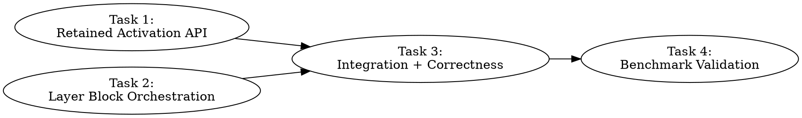

# CPU Offload Activation Retention Implementation Plan

> **For Claude:** REQUIRED SUB-SKILL: Use team-driven-development to implement this plan with agent teams.
> **Model guidance:** Task 1 → Opus. Task 2 → Sonnet. Task 3 → Opus. Task 4 → Haiku.

**Goal:** Eliminate per-op staging overhead in CPU-dispatched layers, raising TG from ~1 tok/s to ~10-15 tok/s at 30-40% VRAM budget.

**Architecture:** When consecutive graph nodes are CPU-dispatched (host-resident weights), keep activation data in host-pinned memory between ops instead of bouncing it device→host→device for every operation. A retained-activation map lets `get_host_ptr()` find prior CPU op outputs without D2H copies. Flush to device only at CPU→GPU layer boundaries.

**Tech Stack:** C++ (SYCL backend), host-pinned memory via `sycl::malloc_host`, ggml-cpu vec_dot kernels

---

## Background: Why 1 tok/s

Current per-op flow for CPU-dispatched layers:
```
Op N (cpu_mul_mat):
  get_host_ptr(weight)      → host_cache lookup (fast, ~0 ms)     ✓
  get_host_ptr(activation)  → sycl::copy D2H + event.wait()       ✗ ~0.5ms
  vec_dot compute            → fast (~0.2ms)                       ✓
  flush_output(result)      → sycl::copy H2D                      ✗ ~0.5ms

Op N+1 (cpu_rms_norm):
  get_host_ptr(op_N_result) → sycl::copy D2H AGAIN of same data!  ✗ ~0.5ms
  compute                    → fast                                ✓
  flush_output              → sycl::copy H2D                      ✗ ~0.5ms
```

Each layer has ~10 ops. Each op does 2 staging copies. That's ~20 copies × 0.5ms = 10ms per layer × 14 CPU layers = 140ms per token → ~7 tok/s theoretical max, but synchronization overhead pushes it to ~1 tok/s.

**Fix:** Keep op N's output in host memory. Op N+1 reads it directly. Only copy at GPU↔CPU layer boundaries.

---

## Team Topology

**Recommended implementers:** 2 (based on 2 parallel tracks)
**Reviewers:** 1 spec-reviewer, 1 quality-reviewer

### Parallel Tracks

| Track | Tasks | Description |
|-------|-------|-------------|
| A | 1 | Host scratch + retained activation API (cpu-dispatch.cpp/hpp) |
| B | 2 | Layer block orchestration (ggml-sycl.cpp) |
| — | 3 | Integration wiring + correctness testing |
| — | 4 | Benchmark validation |

### Dependency Graph



### File Ownership Map

| File | Tasks | Conflict Risk |
|------|-------|---------------|
| `ggml/src/ggml-sycl/cpu-dispatch.cpp` | 1 | None (single task) |
| `ggml/src/ggml-sycl/cpu-dispatch.hpp` | 1 | None (single task) |
| `ggml/src/ggml-sycl/ggml-sycl.cpp` | 2 | None (single task) |
| Test commands (no file) | 3, 4 | None (sequential) |

---

## Task 1: Host Scratch Buffer + Retained Activation API

**Track:** A
**Model:** Opus (complex memory management, pool design, API surface)
**Depends on:** None
**File scope:**
- Modify: `ggml/src/ggml-sycl/cpu-dispatch.cpp`
- Modify: `ggml/src/ggml-sycl/cpu-dispatch.hpp`

### Description

Add a host-pinned scratch buffer and a retained-activation map to `cpu-dispatch.cpp`. This allows consecutive CPU-dispatched ops to share activation data in host memory without device round-trips. The API has 5 new functions called from `graph_compute_impl` and from within existing CPU dispatch functions.

### Acceptance Criteria

- [ ] `cpu_retained_init(sycl::queue*)` allocates 4MB host-pinned scratch buffer
- [ ] `cpu_retained_begin_op()` replaces `staging_begin_op()` when retention is active
- [ ] `get_host_ptr()` checks retained map BEFORE doing D2H staging copy
- [ ] `cpu_retained_store_output()` keeps result in scratch buffer instead of flushing to device
- [ ] `cpu_retained_flush_all(sycl::queue*)` copies ALL retained outputs to their device buffers and resets
- [ ] `cpu_retained_active()` returns true when retention mode is engaged
- [ ] Retained map uses `ggml_tensor*` as key, `{host_ptr, size}` as value
- [ ] Scratch buffer uses bump allocator, reset on flush
- [ ] All existing cpu_mul_mat/cpu_rms_norm/cpu_add/etc. functions check retention mode
- [ ] No memory leaks: scratch freed in `cpu_retained_cleanup()`

### Implementation Guide

**Step 1: Add retained state globals** at top of cpu-dispatch.cpp (after existing staging globals, around line 50):

```cpp
// --- Retained activation state (eliminates per-op staging overhead) ---
// When active, CPU op outputs stay in host scratch memory instead of being
// flushed to device. The next CPU op can read them directly without D2H copy.

static void *                                          g_retained_scratch     = nullptr;
static size_t                                          g_retained_scratch_cap = 0;
static size_t                                          g_retained_scratch_off = 0;  // bump allocator offset

struct retained_entry {
    void * host_ptr;   // pointer into g_retained_scratch
    size_t size;       // byte size of retained data
};
static std::unordered_map<const ggml_tensor *, retained_entry> g_retained_map;
static bool                                            g_retained_active      = false;
static sycl::queue *                                   g_retained_gpu_q       = nullptr;
```

**Step 2: Add init/cleanup functions:**

```cpp
void cpu_retained_init(sycl::queue * gpu_q) {
    if (!g_retained_scratch) {
        constexpr size_t DEFAULT_SCRATCH_SIZE = 4 * 1024 * 1024;  // 4MB
        g_retained_scratch = sycl::malloc_host(DEFAULT_SCRATCH_SIZE, *gpu_q);
        if (g_retained_scratch) {
            g_retained_scratch_cap = DEFAULT_SCRATCH_SIZE;
        }
    }
    g_retained_scratch_off = 0;
    g_retained_map.clear();
    g_retained_active = true;
    g_retained_gpu_q  = gpu_q;
}

void cpu_retained_cleanup() {
    if (g_retained_scratch && g_retained_gpu_q) {
        sycl::free(g_retained_scratch, *g_retained_gpu_q);
        g_retained_scratch     = nullptr;
        g_retained_scratch_cap = 0;
    }
    g_retained_map.clear();
    g_retained_active = false;
    g_retained_gpu_q  = nullptr;
}

bool cpu_retained_active() {
    return g_retained_active && g_retained_scratch;
}
```

**Step 3: Add scratch bump allocator:**

```cpp
// Allocate from scratch buffer (64-byte aligned for AVX-512)
static void * scratch_alloc(size_t size) {
    size_t aligned_off = (g_retained_scratch_off + 63) & ~63ULL;
    if (aligned_off + size > g_retained_scratch_cap) {
        return nullptr;  // scratch full, fall back to staging
    }
    void * ptr = static_cast<char *>(g_retained_scratch) + aligned_off;
    g_retained_scratch_off = aligned_off + size;
    return ptr;
}

static void scratch_reset() {
    g_retained_scratch_off = 0;
}
```

**Step 4: Modify `get_host_ptr()` to check retained map.** Find the existing `get_host_ptr` function (around line 180). Add a check at the VERY TOP of the function, before any staging logic:

```cpp
static const void * get_host_ptr(const ggml_tensor * t, int device, int slot,
                                 sycl::queue * gpu_q, sycl::event * evt) {
    // Check retained activation map first — if this tensor's data was
    // produced by a prior CPU op in the same layer block, return the
    // host pointer directly without any D2H copy.
    if (g_retained_active) {
        auto it = g_retained_map.find(t);
        if (it != g_retained_map.end()) {
            if (evt) *evt = sycl::event{};  // no-op event (already on host)
            return it->second.host_ptr;
        }
    }

    // ... existing staging logic unchanged ...
```

**Step 5: Add retained output storage function:**

```cpp
// Store CPU op output in scratch buffer instead of flushing to device.
// Returns host pointer to write result into, or nullptr if scratch full.
void * cpu_retained_alloc_output(const ggml_tensor * dst) {
    if (!g_retained_active) return nullptr;

    size_t size = ggml_nbytes(dst);
    void * host_ptr = scratch_alloc(size);
    if (!host_ptr) return nullptr;

    g_retained_map[dst] = { host_ptr, size };
    return host_ptr;
}

// Flush ALL retained outputs to their device buffers, then reset.
void cpu_retained_flush_all(sycl::queue * gpu_q) {
    if (g_retained_map.empty()) return;

    std::vector<sycl::event> events;
    events.reserve(g_retained_map.size());

    for (auto & [tensor, entry] : g_retained_map) {
        // Get device pointer for this tensor's compute buffer
        void * device_ptr = tensor->data;
        if (!device_ptr) continue;

        events.push_back(
            gpu_q->memcpy(device_ptr, entry.host_ptr, entry.size)
        );
    }

    // Wait for all H2D copies to complete
    sycl::event::wait(events);

    g_retained_map.clear();
    scratch_reset();
}

// Deactivate retention mode (called at end of graph compute)
void cpu_retained_deactivate() {
    g_retained_map.clear();
    scratch_reset();
    g_retained_active = false;
}
```

**Step 6: Modify `cpu_mul_mat()` to use retained output.** In `cpu_mul_mat()` (around line 270), modify the output handling. Find the line `void * dst_data = get_host_output_ptr(dst, device, gpu_q);` (around line 323) and the line `flush_output(dst, device, gpu_q);` (around line 434). Replace with:

```cpp
    // Output: use retained scratch if active, else staging
    void * dst_data;
    bool   retained_output = false;
    if (g_retained_active) {
        dst_data = cpu_retained_alloc_output(dst);
        if (dst_data) {
            retained_output = true;
        }
    }
    if (!retained_output) {
        dst_data = get_host_output_ptr(dst, device, gpu_q);
    }
    if (!dst_data) {
        return false;
    }

    // ... existing compute logic unchanged (writes to dst_data) ...

    // Output: flush to device only if NOT retained
    if (!retained_output) {
        flush_output(dst, device, gpu_q);
    }
    return true;
```

**Step 7: Apply same pattern to ALL other cpu_* functions.** Each function in cpu-dispatch.cpp that calls `get_host_output_ptr()` + `flush_output()` needs the same retained-output wrapper. Functions to modify:
- `cpu_rms_norm()` (line ~443)
- `cpu_binary_op()` (line ~530) — used by cpu_add and cpu_mul
- `cpu_silu()` (line ~670)
- `cpu_glu()` (line ~720)
- `cpu_soft_max()` (line ~800)
- `cpu_norm()` (line ~870)
- `cpu_scale()` (line ~940)
- `cpu_cpy()` (line ~1000)
- `cpu_rope()` (line ~1060)

For each function, the pattern is identical:
```cpp
// Before output allocation:
void * dst_data;
bool retained_output = false;
if (g_retained_active) {
    dst_data = cpu_retained_alloc_output(dst);
    retained_output = (dst_data != nullptr);
}
if (!retained_output) {
    dst_data = get_host_output_ptr(dst, device, gpu_q);
}

// After compute, before return:
if (!retained_output) {
    flush_output(dst, device, gpu_q);
}
```

**Step 8: Also modify the fused op functions:**
- `ggml_sycl_compute_fused_rms_norm_mul()` (line ~1380)
- `ggml_sycl_compute_fused_add_rms_norm()` (line ~1430)

Same retained-output pattern.

**Step 9: Update cpu-dispatch.hpp** with new declarations:

```cpp
// Retained activation API — eliminates per-op staging overhead
// by keeping intermediate results in host scratch memory between
// consecutive CPU-dispatched ops within a layer block.
void   cpu_retained_init(sycl::queue * gpu_q);
void   cpu_retained_cleanup();
bool   cpu_retained_active();
void * cpu_retained_alloc_output(const ggml_tensor * dst);
void   cpu_retained_flush_all(sycl::queue * gpu_q);
void   cpu_retained_deactivate();
```

### Commit

```bash
git add ggml/src/ggml-sycl/cpu-dispatch.cpp ggml/src/ggml-sycl/cpu-dispatch.hpp
git commit -m "sycl: add retained activation API for CPU offload staging elimination

When consecutive graph nodes are CPU-dispatched, activation data stays
in host-pinned scratch memory instead of bouncing device↔host per op.
get_host_ptr() checks the retained map before D2H copy. Output goes to
scratch buffer instead of device when retention is active. All retained
data flushed to device at CPU→GPU layer boundary.

Eliminates N-1 out of N staging round-trips per CPU layer block."
```

### Notes for implementer
- `g_retained_map` uses `const ggml_tensor*` keys — tensor pointers are stable within a single graph_compute call
- The scratch buffer (4MB) is much larger than needed (Mistral 7B layer intermediates total ~200KB for batch=1) — this provides headroom for larger models and batches
- The retained output pattern (`if (g_retained_active)`) adds zero overhead when retention is not active (always-false branch prediction)
- DO NOT modify the existing staging infrastructure (g_cpu_staging, staging_begin_op, etc.) — it remains as fallback when scratch is full or retention is inactive
- Make sure the fused op functions also use retained output (they produce intermediate results consumed by the next op in the same layer)

---

## Task 2: Layer Block Orchestration in graph_compute_impl

**Track:** B
**Model:** Sonnet (boundary detection logic, orchestrating existing APIs)
**Depends on:** None (parallel with Task 1 — uses declared API, not implementation)
**File scope:**
- Modify: `ggml/src/ggml-sycl/ggml-sycl.cpp` (function `ggml_backend_sycl_graph_compute_impl`, around line 24760)

### Description

Add layer block detection to `graph_compute_impl` that activates retained-activation mode at GPU→CPU boundaries and flushes at CPU→GPU boundaries. This orchestrates the API from Task 1 without implementing it.

### Acceptance Criteria

- [ ] At first CPU-dispatched node after GPU nodes: call `cpu_retained_init(gpu_q)`
- [ ] At first GPU-dispatched node after CPU nodes: call `cpu_retained_flush_all(gpu_q)` then `cpu_retained_deactivate()`
- [ ] At end of graph compute: call `cpu_retained_deactivate()` (cleanup any unflushed state)
- [ ] Graph replay path (exec_graph replay) is NOT affected — retention only applies to per-node dispatch
- [ ] Existing CPU/GPU boundary sync logic (gpu_tensor_events, staging_drain) still works correctly
- [ ] `#include "cpu-dispatch.hpp"` is already present in ggml-sycl.cpp (verify)

### Implementation Guide

**Step 1: Verify include.** Search ggml-sycl.cpp for `#include "cpu-dispatch.hpp"` — it should already be there. If not, add it near the other SYCL backend includes (around line 30).

**Step 2: Find the node dispatch loop in `ggml_backend_sycl_graph_compute_impl`.** The loop starts around line 24851 and contains the boundary sync logic at line 25173:

```cpp
bool node_on_cpu = should_dispatch_to_cpu(*sycl_ctx, node);
```

**Step 3: Add retained activation orchestration.** Find the block where `prev_on_cpu` tracks CPU/GPU transitions (around lines 25170-25202). Modify it to manage retention mode:

Before the node loop (around line 24848, near where `prev_on_cpu` is declared):
```cpp
    bool prev_on_cpu = false;
    // Track whether we've initialized retained activation mode for this dispatch
    bool retained_mode_active = false;
```

At the CPU/GPU boundary detection point (around line 25174), ADD the retention orchestration AFTER the existing boundary sync code:

```cpp
        bool node_on_cpu = should_dispatch_to_cpu(*sycl_ctx, node);

        // --- Existing boundary sync logic (keep unchanged) ---
        if (node_on_cpu != prev_on_cpu) {
            if (node_on_cpu) {
                // GPU → CPU transition
                // ... existing event wait logic ...

                // Activate retained activation mode — subsequent CPU ops
                // will keep intermediates in host scratch memory
                if (!retained_mode_active) {
                    cpu_retained_init(sycl_ctx->stream());
                    retained_mode_active = true;
                }
            } else {
                // CPU → GPU transition
                // ... existing staging drain logic ...

                // Flush all retained activations back to device before
                // GPU ops try to read them from device buffers
                if (retained_mode_active) {
                    cpu_retained_flush_all(sycl_ctx->stream());
                    cpu_retained_deactivate();
                    retained_mode_active = false;
                }
            }
        }
        prev_on_cpu = node_on_cpu;
```

**Important:** The retained_init/flush calls must be placed AFTER the existing event wait / staging drain code, not replacing it. The existing boundary sync handles GPU queue synchronization; retention handles activation data flow.

**Step 4: Add cleanup at end of graph compute.** After the node loop ends (around line 25235), add cleanup:

```cpp
    // End of graph compute — deactivate any active retention mode
    if (retained_mode_active) {
        cpu_retained_flush_all(sycl_ctx->stream());
        cpu_retained_deactivate();
    }
```

**Step 5: Handle non-contiguous CPU blocks.** If the graph has GPU-CPU-GPU-CPU pattern, retention activates/deactivates at each transition. The existing `prev_on_cpu` tracking already handles this. The retention init → flush → deactivate → init sequence is correct for multiple CPU blocks.

**Step 6: Verify that graph replay path is unaffected.** The graph replay path (line ~31113-31122) calls `graph_refresh_input_tensors()` + `stream()->ext_oneapi_graph()` and NEVER calls `graph_compute_impl()`. So retention mode is never activated during replay. Verify this by confirming that `cpu_retained_init` is only called inside `graph_compute_impl`.

### Commit

```bash
git add ggml/src/ggml-sycl/ggml-sycl.cpp
git commit -m "sycl: orchestrate retained activation mode at CPU/GPU layer boundaries

Activate host scratch retention at GPU→CPU transitions and flush back
to device at CPU→GPU transitions. This coordinates with the retained
activation API in cpu-dispatch to eliminate per-op staging overhead."
```

### Notes for implementer
- The `prev_on_cpu` variable and boundary detection already exist — you're adding calls alongside the existing code, not replacing it
- The `cpu_retained_init` call creates the host scratch buffer lazily on first use — it's safe to call every GPU→CPU transition (it checks internally)
- Don't touch the graph replay path or the persistent TG path — retention only applies to the per-node dispatch loop
- If `cpu_retained_init` or `cpu_retained_flush_all` are not yet linkable (Task 1 not merged), you can compile with stub declarations. The functions are declared in `cpu-dispatch.hpp`.

---

## Task 3: Integration Wiring + Correctness Testing

**Track:** — (convergence point)
**Model:** Opus (debugging, cross-file integration, correctness validation)
**Depends on:** Task 1, Task 2
**File scope:**
- May fix: `ggml/src/ggml-sycl/cpu-dispatch.cpp` (edge cases)
- May fix: `ggml/src/ggml-sycl/ggml-sycl.cpp` (edge cases)

### Description

Merge Task 1 and Task 2 changes, build, and validate correctness. Fix any integration issues, edge cases, or compilation errors.

### Acceptance Criteria

- [ ] Clean build with `ninja -C build -j $(nproc)` (zero errors, zero warnings in modified files)
- [ ] GPU-only test (100% VRAM): correct output for `1, 2, 3, 4, 5,` → `6, 7, 8, 9, 10`
- [ ] CPU offload test (40% VRAM, `-fit off`): correct output (same sequence)
- [ ] CPU offload test (30% VRAM, `-fit off`): correct output
- [ ] No memory leaks visible in stderr logs (no `sycl::free` errors)
- [ ] Retained mode logging confirms activation/flush cycle (add 1-2 GGML_SYCL_DEBUG lines)

### Implementation Guide

**Step 1: Source oneAPI and rebuild.**

```bash
source /opt/intel/oneapi/setvars.sh --force
ninja -C build -j $(nproc)
```

Fix any compilation errors. Common issues:
- Missing include: ensure `cpu-dispatch.hpp` has the retained API declarations
- Type mismatch: `const ggml_tensor*` vs `ggml_tensor*` in map key
- Missing `sycl::event` default constructor call

**Step 2: Test GPU-only (100% VRAM, no CPU offload).**

```bash
NEW_PATH=$(echo "$LD_LIBRARY_PATH" | tr ':' '\n' | grep -v pti | tr '\n' ':' | sed 's/:$//')
LD_LIBRARY_PATH="build/bin:$NEW_PATH" ONEAPI_DEVICE_SELECTOR=level_zero:0 \
  ./build/bin/llama-completion \
  -m /Storage/GenAI/models/mistral-7b-v0.1.Q4_0.gguf \
  -p '1, 2, 3, 4, 5,' -n 15 --seed 42 --temp 0
```

Expected: output contains `6, 7, 8, 9, 10`. Retention mode should NOT activate (no CPU layers).

**Step 3: Test CPU offload at 40% VRAM.**

```bash
LD_LIBRARY_PATH="build/bin:$NEW_PATH" \
  GGML_SYCL_VRAM_BUDGET_PCT=40 ONEAPI_DEVICE_SELECTOR=level_zero:0 \
  ./build/bin/llama-completion \
  -m /Storage/GenAI/models/mistral-7b-v0.1.Q4_0.gguf \
  -p '1, 2, 3, 4, 5,' -n 15 --seed 42 --temp 0 -ngl 99 -fit off
```

Expected: correct output. Stderr should show CPU layer classification and retained activation init/flush.

**Step 4: Test CPU offload at 30% VRAM.**

```bash
LD_LIBRARY_PATH="build/bin:$NEW_PATH" \
  GGML_SYCL_VRAM_BUDGET_PCT=30 ONEAPI_DEVICE_SELECTOR=level_zero:0 \
  ./build/bin/llama-completion \
  -m /Storage/GenAI/models/mistral-7b-v0.1.Q4_0.gguf \
  -p '1, 2, 3, 4, 5,' -n 15 --seed 42 --temp 0 -ngl 99 -fit off
```

Expected: correct output. More CPU layers active.

**Step 5: If output is garbled**, debug by adding logging to `cpu_retained_alloc_output` and `get_host_ptr` retained-map hit:

```cpp
// In get_host_ptr, when retained map hit:
GGML_SYCL_DEBUG("[RETAINED] Hit: %s (%zu bytes)\n", t->name, it->second.size);
```

Common issues:
- **Wrong tensor pointer as key**: tensor may be a view of another tensor — check `t->view_src`
- **Scratch buffer overflow**: 4MB may not be enough for large batch sizes — check if `scratch_alloc` returns nullptr
- **Stale data**: retained map not cleared between graph computes — ensure `cpu_retained_deactivate()` called at end

**Step 6: Commit fixes.**

```bash
git add ggml/src/ggml-sycl/cpu-dispatch.cpp ggml/src/ggml-sycl/cpu-dispatch.hpp ggml/src/ggml-sycl/ggml-sycl.cpp
git commit -m "sycl: wire retained activation API and fix integration issues

Build clean, correctness validated at 100%, 40%, and 30% VRAM budgets."
```

### Notes for implementer
- **Thermal throttling**: Wait 30+ seconds between test runs on Arc B580
- **PTI library**: Always use the `LD_LIBRARY_PATH` fix (grep -v pti) or llama-bench may hang
- **GGML_SYCL_DEBUG=1** output is MASSIVE — redirect to file (`2>/tmp/debug.txt`)
- Key debug technique: if output is garbled at 40% but correct at 100%, the retention logic has a bug. Compare with `cpu_retained_active()` returning false (should match old behavior)

---

## Task 4: Performance Benchmark Validation

**Track:** — (final)
**Model:** Haiku (straightforward benchmark commands + reporting)
**Depends on:** Task 3
**File scope:** None (benchmark commands only)

### Description

Run performance benchmarks to measure the improvement from activation retention. Compare against baseline (retention disabled) and against fit_params path.

### Acceptance Criteria

- [ ] GPU-only benchmark: PP512 >= 1200 tok/s, TG128 >= 68 tok/s (no regression)
- [ ] CPU offload 40% with retention: TG measurably faster than 1 tok/s baseline
- [ ] CPU offload 30% with retention: TG measurably faster than 1 tok/s baseline
- [ ] Results documented in commit message or stderr output

### Implementation Guide

**Step 1: GPU-only performance (no regression check).**

```bash
source /opt/intel/oneapi/setvars.sh --force
NEW_PATH=$(echo "$LD_LIBRARY_PATH" | tr ':' '\n' | grep -v pti | tr '\n' ':' | sed 's/:$//')

# Wait 60 seconds for GPU to cool
sleep 60

LD_LIBRARY_PATH="build/bin:$NEW_PATH" ONEAPI_DEVICE_SELECTOR=level_zero:0 \
  ./build/bin/llama-bench \
  -m /Storage/GenAI/models/mistral-7b-v0.1.Q4_0.gguf -p 512 -n 128
```

Expected: PP512 >= 1200, TG128 >= 68 (no regression from activation retention changes — retention is inactive when all layers are GPU).

**Step 2: CPU offload at 40% with timing.**

```bash
sleep 30

LD_LIBRARY_PATH="build/bin:$NEW_PATH" \
  GGML_SYCL_VRAM_BUDGET_PCT=40 ONEAPI_DEVICE_SELECTOR=level_zero:0 \
  ./build/bin/llama-completion \
  -m /Storage/GenAI/models/mistral-7b-v0.1.Q4_0.gguf \
  -p '1, 2, 3, 4, 5,' -n 64 --seed 42 --temp 0 -ngl 99 -fit off \
  2>/tmp/bench_40_err.txt

# Check timing from stderr
grep -i "eval time\|total time\|tokens per second" /tmp/bench_40_err.txt
```

**Step 3: CPU offload at 30% with timing.**

```bash
sleep 30

LD_LIBRARY_PATH="build/bin:$NEW_PATH" \
  GGML_SYCL_VRAM_BUDGET_PCT=30 ONEAPI_DEVICE_SELECTOR=level_zero:0 \
  ./build/bin/llama-completion \
  -m /Storage/GenAI/models/mistral-7b-v0.1.Q4_0.gguf \
  -p '1, 2, 3, 4, 5,' -n 64 --seed 42 --temp 0 -ngl 99 -fit off \
  2>/tmp/bench_30_err.txt

grep -i "eval time\|total time\|tokens per second" /tmp/bench_30_err.txt
```

**Step 4: Compare against fit_params baseline (for reference only).**

```bash
sleep 30

LD_LIBRARY_PATH="build/bin:$NEW_PATH" \
  GGML_SYCL_VRAM_BUDGET_PCT=40 ONEAPI_DEVICE_SELECTOR=level_zero:0 \
  ./build/bin/llama-completion \
  -m /Storage/GenAI/models/mistral-7b-v0.1.Q4_0.gguf \
  -p '1, 2, 3, 4, 5,' -n 64 --seed 42 --temp 0 \
  2>/tmp/bench_40_fitparams_err.txt

grep -i "eval time\|total time\|tokens per second" /tmp/bench_40_fitparams_err.txt
```

**Step 5: Report results.** Create a summary showing:

| Config | Before (baseline) | After (retention) | fit_params ref |
|--------|-------------------|-------------------|----------------|
| GPU-only PP512 | 1243 | (should be >= 1200) | n/a |
| GPU-only TG128 | 70.9 | (should be >= 68) | n/a |
| 40% budget TG | 1.02 tok/s | (target: 5-15) | 6.6 tok/s |
| 30% budget TG | ~1.0 tok/s | (target: 3-10) | ~3 tok/s |

### Notes for implementer
- **CRITICAL**: Wait 30-60 seconds between benchmark runs. Arc B580 thermal throttles severely, causing 29x slowdowns (70→2.4 tok/s). A low result may be thermal, not a regression.
- PTI library fix is REQUIRED: always use `grep -v pti` in LD_LIBRARY_PATH
- If GPU-only regresses, the retention code is being activated when it shouldn't be — check that `cpu_retained_active()` returns false when no layers are CPU-dispatched
- The target for CPU offload TG is 5-15 tok/s. Even achieving 5 tok/s would be a 5x improvement over the 1 tok/s baseline.

---

## Summary

| Task | Track | Model | Lines | Key Change |
|------|-------|-------|-------|------------|
| 1: Retained API | A | Opus | ~200 | cpu-dispatch.cpp/hpp: scratch buffer + retained map + modified output path |
| 2: Orchestration | B | Sonnet | ~30 | ggml-sycl.cpp: init/flush at CPU/GPU boundaries |
| 3: Integration | — | Opus | ~20 | Build + correctness tests + edge case fixes |
| 4: Benchmark | — | Haiku | 0 | Performance validation commands |
| **Total** | | | **~250** | |

**Expected outcome:** TG at 40% budget improves from ~1 tok/s to ~5-15 tok/s by eliminating ~95% of per-op staging copies. GPU-only performance unchanged (retention inactive).
