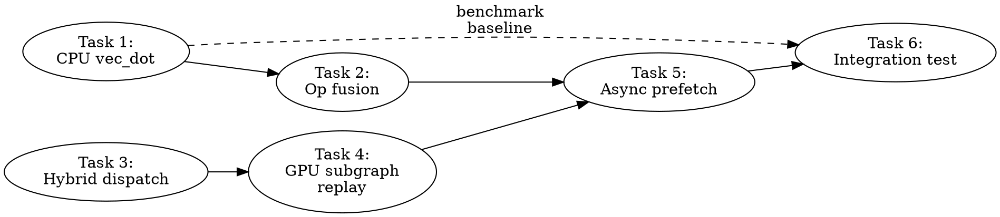

# CPU/GPU Mixed-Mode TG Optimization Plan

> **For Claude:** REQUIRED SUB-SKILL: Use team-driven-development to implement this plan with agent teams.

**Goal:** Improve token generation speed from 1.67 tok/s to 5-15 tok/s in mixed CPU/GPU mode (30% VRAM budget) through 5 complementary optimizations.

**Architecture:** Replace dequant+BLAS GEMV with quantized dot products (3-8x), fuse consecutive element-wise ops to halve staging (5-10%), wire async weight prefetch for memory overlap (15-30%), enable hybrid per-op dispatch for lightweight ops (variable), and implement GPU subgraph replay for the GPU portion of the graph (minor).

**Tech Stack:** ggml-cpu vec_dot API, SYCL event-based staging, oneDNN BLAS fallback, SYCL command graphs

---

## Team Topology

**Recommended implementers:** 2 (based on 2 parallel tracks by file ownership)
**Reviewers:** 1 spec-reviewer, 1 quality-reviewer

### Parallel Tracks

| Track | Tasks | Description | Primary File |
|-------|-------|-------------|--------------|
| A | 1, 2 | CPU compute optimizations (vec_dot + fusion) | cpu-dispatch.cpp |
| B | 3, 4 | GPU dispatch improvements (hybrid + subgraph) | ggml-sycl.cpp |
| — | 5 | Async prefetch (convergence, touches both files) | cpu-dispatch + ggml-sycl + layer-streaming |
| — | 6 | Integration test + benchmark validation | test + benchmark |

### Dependency Graph



### File Ownership Map

| File/Directory | Tasks | Conflict Risk |
|----------------|-------|---------------|
| `ggml/src/ggml-sycl/cpu-dispatch.cpp` | 1, 2, 5 | Sequential (Track A then convergence) |
| `ggml/src/ggml-sycl/cpu-dispatch.hpp` | 2 | None |
| `ggml/src/ggml-sycl/ggml-sycl.cpp` | 3, 4, 5 | Sequential (Track B then convergence) |
| `ggml/src/ggml-sycl/layer-streaming.cpp` | 5 | None (convergence only) |
| `ggml/src/ggml-sycl/layer-streaming.hpp` | 5 | None (convergence only) |
| `tests/test-sycl-cpu-tg.cpp` | 6 | None (final task) |

---

## Task 1: CPU Quantized Dot Product Fast Path (Option 1)

**Track:** A
**Depends on:** None
**Priority:** P0 — Expected 3-8x TG improvement (1.67 → 5-12 tok/s)
**File scope:**
- Modify: `ggml/src/ggml-sycl/cpu-dispatch.cpp:29-30` (add include)
- Modify: `ggml/src/ggml-sycl/cpu-dispatch.cpp:200-332` (cpu_mul_mat function)

### Description

Replace the dequantize-to-F32 + dnnl_sgemm path with ggml's hand-optimized quantized dot product functions for small M (token generation, M≤4). For Q4_0 weights with M=1:

- **Current**: Dequant all N×K weights to F32 (64 MB buffer) → call `dnnl_sgemm` for M=1 GEMV
- **New**: Quantize 1×K activations from F32 to Q8_0 (4 KB) → call `vec_dot` per output row (no weight dequant)

### API Reference (from research)

```cpp
// ggml/include/ggml-cpu.h:113-120
struct ggml_type_traits_cpu {
    ggml_from_float_t  from_float;     // F32 → quantized type
    ggml_vec_dot_t     vec_dot;        // Quantized dot product
    enum ggml_type     vec_dot_type;   // Type to quantize activations to
    int64_t            nrows;          // Rows processable simultaneously
};
const struct ggml_type_traits_cpu * ggml_get_type_traits_cpu(enum ggml_type type);

// ggml/include/ggml-cpu.h:110-111
typedef void (*ggml_vec_dot_t)(int n, float * s, size_t bs,
    const void * x, size_t bx, const void * y, size_t by, int nrc);

// ggml/include/ggml.h:2436
typedef void (*ggml_from_float_t)(const float * x, void * y, int64_t k);

// ggml/include/ggml.h:818
size_t ggml_row_size(enum ggml_type type, int64_t ne);
```

**Supported types with vec_dot**: Q4_0, Q4_1, Q5_0, Q5_1, Q8_0, Q2_K, Q3_K, Q4_K, Q5_K, Q6_K, IQ2_XXS, IQ2_XS, IQ2_S, IQ3_XXS, IQ3_S, IQ1_S, IQ1_M, IQ4_NL, IQ4_XS, TQ1_0, TQ2_0, MXFP4, F16, F32, BF16.

**Thread safety**: vec_dot functions are pure (no global state, all stack-local variables with SIMD registers). Safe to call from SYCL backend context.

### Acceptance Criteria

- [ ] For M≤4 with quantized weights that have vec_dot, uses quantized dot product instead of dequant+sgemm
- [ ] For M>4 or types without vec_dot, falls through to existing dnnl_sgemm path
- [ ] F32 weights still use the existing direct pointer + sgemm path
- [ ] F16 weights use vec_dot (F16 has vec_dot_type=F16, vec_dot=ggml_vec_dot_f16)
- [ ] Default VRAM (no CPU offload) produces correct output: `1, 2, 3, 4, 5, 6, 7, 8, 9, 10`
- [ ] 30% VRAM budget produces correct output (same sequence)
- [ ] Performance: TG128 at 30% budget >= 5 tok/s (was 1.67)
- [ ] No regression: default PP512 >= 1200, TG128 >= 68

### Implementation Guide

**Step 1: Add include**

At line 30 of `cpu-dispatch.cpp`, after `#include "ggml-backend.h"`:

```cpp
#include "ggml-cpu.h"
```

This is safe — `ggml-sycl.cpp` already includes it at line 52, and both link into the same process.

**Step 2: Add vec_dot fast path to cpu_mul_mat**

Replace the compute section inside `cpu_mul_mat` (after staging wait at line 260, before flush at line 329). The key change replaces lines 278-326 (the dequant buffer allocation, batch loop with dequant+sgemm):

```cpp
    // For small M (TG batch=1..4), use quantized dot product when available.
    // This avoids dequantizing the entire N×K weight matrix to F32 and replaces
    // dnnl_sgemm GEMV with direct quantized vec_dot (e.g., Q4_0 × Q8_0).
    // Benefits: ~5x less memory bandwidth (quantized reads), no BLAS overhead,
    // L1-friendly access pattern (one 2KB weight row + 4KB activation per dot).
    const auto * cpu_traits = src0_quantized ? ggml_get_type_traits_cpu(src0->type) : nullptr;
    const bool   use_vec_dot = (M <= 4 && cpu_traits && cpu_traits->vec_dot);

    ggml_from_float_t from_float_fn = nullptr;
    size_t            q_row_size    = 0;
    std::vector<uint8_t> src1_q_buf;

    if (use_vec_dot) {
        const ggml_type vec_dot_type = cpu_traits->vec_dot_type;
        const auto * vdt_cpu_traits  = ggml_get_type_traits_cpu(vec_dot_type);
        from_float_fn = vdt_cpu_traits ? vdt_cpu_traits->from_float : nullptr;
        if (from_float_fn) {
            q_row_size = ggml_row_size(vec_dot_type, K);
            src1_q_buf.resize(static_cast<size_t>(M) * q_row_size);
        }
    }

    // Dequant/conversion buffer for non-F32 weights (only for GEMM fallback path)
    std::vector<float> src0_f32_buf;
    if (src0_quantized && !use_vec_dot) {
        src0_f32_buf.resize(static_cast<size_t>(N) * K);
    }

    for (int64_t i13 = 0; i13 < ne13; i13++) {
        for (int64_t i12 = 0; i12 < ne12; i12++) {
            const int64_t i02 = i12 % ne02;
            const int64_t i03 = i13 % ne03;

            const char * src0_batch = static_cast<const char *>(src0_data)
                                      + i02 * nb02 + i03 * nb03;
            const float * src1_batch = reinterpret_cast<const float *>(
                static_cast<const char *>(src1_data) + i12 * nb12 + i13 * nb13);
            float * dst_batch = reinterpret_cast<float *>(
                static_cast<char *>(dst_data) + i12 * nb2 + i13 * nb3);

            if (use_vec_dot && from_float_fn) {
                // Quantized dot product path: quantize activations, then vec_dot
                // per output element.  No weight dequantization needed.
                for (dnnl_dim_t m = 0; m < M; m++) {
                    from_float_fn(src1_batch + m * K,
                                  src1_q_buf.data() + m * q_row_size,
                                  K);
                }

                for (dnnl_dim_t n = 0; n < N; n++) {
                    const void * weight_row = src0_batch + n * nb01;
                    for (dnnl_dim_t m = 0; m < M; m++) {
                        float dot_result = 0.0f;
                        cpu_traits->vec_dot(
                            static_cast<int>(K), &dot_result, sizeof(float),
                            weight_row, 0,
                            src1_q_buf.data() + m * q_row_size, 0,
                            1);
                        dst_batch[m * ldc + n] = dot_result;
                    }
                }
            } else {
                // GEMM fallback: dequantize weights to F32, then dnnl_sgemm
                const float * weight_f32;
                dnnl_dim_t    weight_ld = K;

                if (src0_f32) {
                    weight_f32 = reinterpret_cast<const float *>(src0_batch);
                    weight_ld  = static_cast<dnnl_dim_t>(nb01 / sizeof(float));
                } else {
                    for (dnnl_dim_t row = 0; row < N; row++) {
                        const void * row_data = src0_batch + row * nb01;
                        type_traits->to_float(row_data, src0_f32_buf.data() + row * K, K);
                    }
                    weight_f32 = src0_f32_buf.data();
                }

                dnnl_sgemm('T', 'N', N, M, K,
                           1.0f, weight_f32, weight_ld, src1_batch, K,
                           0.0f, dst_batch, ldc);
            }
        }
    }
```

**Step 3: Update file header comment**

At line 8, change:
```
// MUL_MAT uses dnnl_sgemm (pure CPU BLAS, no SYCL queue required) after
// dequantizing weights to F32 via ggml type traits.  Element-wise ops
```
To:
```
// MUL_MAT uses quantized vec_dot (e.g., Q4_0×Q8_0) for small M (TG), or
// dnnl_sgemm for larger M (PP) after dequantizing to F32.  Element-wise ops
```

### Verification

```bash
source /opt/intel/oneapi/setvars.sh --force
ninja -C build -j $(nproc)

# Test 1: Default (all VRAM) correctness
ONEAPI_DEVICE_SELECTOR=level_zero:0 ./build/bin/llama-completion \
  -m /Storage/GenAI/models/mistral-7b-v0.1.Q4_0.gguf \
  -p '1, 2, 3, 4, 5,' -n 15 --seed 42 --temp 0
# Expected: 6, 7, 8, 9, 10, 11, 12, 13, 14, 15

# Test 2: 30% VRAM budget (CPU offload active)
GGML_SYCL_VRAM_BUDGET_PCT=30 ONEAPI_DEVICE_SELECTOR=level_zero:0 \
  ./build/bin/llama-completion \
  -m /Storage/GenAI/models/mistral-7b-v0.1.Q4_0.gguf \
  -p '1, 2, 3, 4, 5,' -n 15 --seed 42 --temp 0 -fit off
# Expected: same correct sequence

# Test 3: Benchmark (wait 30s for thermal cooldown)
sleep 30
ONEAPI_DEVICE_SELECTOR=level_zero:0 ./build/bin/llama-bench \
  -m /Storage/GenAI/models/mistral-7b-v0.1.Q4_0.gguf -p 512 -n 128
# Expected: PP512 >= 1200, TG128 >= 68

# Test 4: CPU offload benchmark
sleep 30
GGML_SYCL_VRAM_BUDGET_PCT=30 ONEAPI_DEVICE_SELECTOR=level_zero:0 \
  ./build/bin/llama-bench \
  -m /Storage/GenAI/models/mistral-7b-v0.1.Q4_0.gguf -p 512 -n 128 -fa off
# Expected: TG128 >= 5 tok/s (was 1.67)
```

### Commit

```bash
git add ggml/src/ggml-sycl/cpu-dispatch.cpp
git commit -m "sycl: use quantized vec_dot for CPU MUL_MAT with small M (TG fast path)"
```

### Notes for implementer

- `ggml_get_type_traits_cpu()` returns NULL for unknown types — always null-check
- `cpu_traits->vec_dot` is NULL for Q8_1 and Q8_K — the `use_vec_dot` check handles this
- The `from_float` function for vec_dot_type quantizes F32 → Q8_0 (or Q8_K for K-quants)
- Q8_0 blocks are 34 bytes per 32 elements: `ggml_row_size(Q8_0, 4096)` = 4352 bytes
- For K-quant types (Q2_K..Q6_K), vec_dot_type is Q8_K, not Q8_0
- The existing staging system is unchanged — vec_dot reads from the same staged host pointers
- WARNING: After rebuilding, wait 30+ seconds before benchmarking (Arc B580 thermal throttling)

---

## Task 2: CPU Op Fusion (Option 3)

**Track:** A
**Depends on:** Task 1 (same file, sequential changes)
**Priority:** P2 — Expected 5-10% improvement on top of Task 1
**File scope:**
- Modify: `ggml/src/ggml-sycl/cpu-dispatch.cpp:1155-1185` (dispatch switch)
- Modify: `ggml/src/ggml-sycl/cpu-dispatch.cpp` (add fused handlers)
- Modify: `ggml/src/ggml-sycl/cpu-dispatch.hpp` (add fused op declarations)

### Description

Fuse consecutive element-wise operations on the CPU path to eliminate intermediate staging round-trips. Currently each op does: stage-in → compute → stage-out (flush). Fusing N ops saves N-1 intermediate flushes.

**Target fusions** (from graph analysis, ops per transformer layer on CPU):

| Fusion | Ops | Staging Saved | Frequency |
|--------|-----|---------------|-----------|
| RMS_NORM + MUL | ops 0-1, 8-9 | 1 flush + 1 stage-in | 2x per layer |
| ADD + RMS_NORM | ops 7-8 boundary | 1 flush + 1 stage-in | 1x per layer (between blocks) |

### Implementation Approach

**Look-ahead fusion in dispatch**: Instead of dispatching each op individually, peek at the next graph node. If it forms a fusible pair AND both would dispatch to CPU, execute the fused handler and skip the next node.

The fusion detection happens in `ggml-sycl.cpp:graph_compute_impl` (the node loop), NOT in cpu-dispatch.cpp. The cpu-dispatch.cpp file provides the fused kernel implementations.

**New fused handlers to add in cpu-dispatch.cpp:**

1. `cpu_fused_rms_norm_mul(ctx, rms_dst, mul_dst)` — Computes RMS normalization and element-wise multiply in one pass, single staging round-trip
2. `cpu_fused_add_rms_norm(ctx, add_dst, rms_dst)` — Computes residual addition and normalization, outputs both results

**Fusion detection in ggml-sycl.cpp:** In the `graph_compute_impl` node loop (around line 25169), before dispatching a CPU node:

```cpp
// Peek ahead for fusible CPU op pairs
if (cpu_offload_active && node_on_cpu && i + 1 < cgraph->n_nodes) {
    ggml_tensor * next = cgraph->nodes[i + 1];
    if (next && should_dispatch_to_cpu(*sycl_ctx, next)) {
        if (node->op == GGML_OP_RMS_NORM && next->op == GGML_OP_MUL &&
            next->src[0] == node) {
            // Fuse RMS_NORM + MUL
            if (ggml_sycl_compute_fused_rms_norm_mul(*sycl_ctx, node, next)) {
                i++;  // Skip next node
                continue;
            }
        }
    }
}
```

### Acceptance Criteria

- [ ] Fused RMS_NORM+MUL produces identical output to sequential execution
- [ ] Fused ADD+RMS_NORM produces identical output to sequential execution
- [ ] Non-fusible op sequences still work correctly (fallback to individual dispatch)
- [ ] Default VRAM mode unaffected (fusion only activates on CPU path)
- [ ] Correctness test passes at 30% budget

### Verification

Same as Task 1 verification commands — correctness + no regression.

### Commit

```bash
git add ggml/src/ggml-sycl/cpu-dispatch.cpp ggml/src/ggml-sycl/cpu-dispatch.hpp \
        ggml/src/ggml-sycl/ggml-sycl.cpp
git commit -m "sycl: fuse RMS_NORM+MUL and ADD+RMS_NORM on CPU dispatch path"
```

### Notes for implementer

- The fused kernel reads inputs once, computes both ops, writes output once → saves 1 staging round-trip
- RMS_NORM+MUL fusion: the MUL's src[0] must be the RMS_NORM's output (check `next->src[0] == node`)
- ADD+RMS_NORM fusion: the RMS_NORM's src[0] must be the ADD's output
- Keep individual handlers working as fallback — fusion is optional
- The fusion detection must skip the fused node in the graph loop (`i++` or mark as fused)
- Reference: GPU fusion patterns at ggml-sycl.cpp:24881-25020 — follow the same detection patterns

---

## Task 3: Hybrid Per-Op Dispatch (Option 4)

**Track:** B
**Depends on:** None
**Priority:** P3 — Variable improvement, reduces unnecessary CPU dispatch for lightweight ops
**File scope:**
- Modify: `ggml/src/ggml-sycl/ggml-sycl.cpp:23469-23520` (compute_forward dispatch)

### Description

Currently, ALL ops in a CPU-classified layer dispatch to CPU. But lightweight ops (SCALE, NORM) have tiny data and would be faster staying on GPU even with the PCIe staging cost. This task adds per-op cost overrides to the dispatch logic.

### Implementation

In `ggml_sycl_compute_forward` (line 23512 of ggml-sycl.cpp), add an op-type check before CPU dispatch:

```cpp
// Override: keep lightweight ops on GPU even for CPU layers
// These ops have tiny tensors (1×4096) where GPU compute < staging overhead
static bool should_force_gpu(const ggml_tensor * dst) {
    switch (dst->op) {
        case GGML_OP_SCALE:
            return true;  // Trivial scalar multiply, staging overhead >> compute
        default:
            return false;
    }
}

// In compute_forward, before the CPU dispatch check:
if (should_dispatch_to_cpu(ctx, dst) && !should_force_gpu(dst)) {
    if (ggml_sycl_compute_forward_cpu(ctx, dst)) {
        return true;
    }
}
```

### Acceptance Criteria

- [ ] SCALE ops in CPU layers execute on GPU instead of CPU
- [ ] No correctness regression at any VRAM budget level
- [ ] CPU layers with overridden ops handle GPU↔CPU transitions correctly
- [ ] Configurable via env var (GGML_SYCL_HYBRID_DISPATCH=0 to disable)

### Verification

Same correctness tests as Task 1. Performance improvement is hard to measure in isolation — validates with Task 6 benchmark.

### Commit

```bash
git add ggml/src/ggml-sycl/ggml-sycl.cpp
git commit -m "sycl: hybrid per-op dispatch — keep lightweight ops on GPU for CPU layers"
```

### Notes for implementer

- Start conservative — only SCALE initially. ROPE and SOFT_MAX can be added later after profiling
- Each override adds GPU↔CPU transitions. Currently there are 2 transitions per token (contiguous layers). Adding per-op overrides could increase to 4-8 transitions per token
- Each transition costs ~20-35µs (per-tensor events). If overrides cause 6 extra transitions that's ~200µs — only worth it if the GPU savings exceed that
- The `should_force_gpu` function should be inline for zero dispatch overhead

---

## Task 4: GPU Subgraph Replay (Option 5)

**Track:** B
**Depends on:** Task 3 (same file, sequential changes)
**Priority:** P4 — Minor TG improvement, moderate PP improvement
**File scope:**
- Modify: `ggml/src/ggml-sycl/ggml-sycl.cpp:30582-30593` (graph replay gate)
- Modify: `ggml/src/ggml-sycl/ggml-sycl.cpp:24721-25300` (graph_compute_impl)

### Description

Currently, graph replay is ENTIRELY disabled when any CPU layers exist (gate at line 30582-30593). This means all ~1158 nodes dispatch individually even though ~500 of them are GPU-only. This task enables graph replay for the contiguous GPU-only segment.

### Implementation Approach

**Phase 1 (this task):** Enable graph replay for the GPU-only prefix (layers 0..N-1 before the first CPU layer). Most models with partial offload have a contiguous GPU prefix.

In `ggml_backend_sycl_graph_compute` (line 30582):

```cpp
if (has_cpu_layers) {
    // Instead of disabling graphs entirely, find the GPU-only prefix
    int first_cpu_node = find_first_cpu_node(cgraph, *sycl_ctx);
    if (first_cpu_node > 50) {  // Worth replaying if > 50 GPU nodes
        // Record graph for nodes [0, first_cpu_node)
        // Execute CPU nodes [first_cpu_node, n_nodes) individually
    } else {
        compute_impl();  // Not enough GPU nodes to justify replay
    }
}
```

### Acceptance Criteria

- [ ] GPU prefix (layers before first CPU layer) replays via SYCL graph
- [ ] CPU suffix executes individually with proper boundary sync
- [ ] Graph hash tracks the prefix boundary for invalidation
- [ ] Falls back to full individual dispatch if GPU prefix too small (<50 nodes)
- [ ] No correctness regression

### Verification

Same correctness tests. Performance improvement measurable at 70-80% VRAM budget (many GPU layers, few CPU layers).

### Commit

```bash
git add ggml/src/ggml-sycl/ggml-sycl.cpp
git commit -m "sycl: enable GPU subgraph replay for GPU-only prefix in mixed mode"
```

### Notes for implementer

- The GPU prefix ends at the first node where `should_dispatch_to_cpu()` returns true
- Graph recording captures only GPU ops — CPU ops are NOT recordable
- Input tensor refresh (`graph_refresh_input_tensors`) must only refresh tensors used by the GPU prefix
- The graph hash must include the prefix length to detect topology changes
- This optimization matters more for PP (batch>4 routes everything to GPU even with CPU layers) than TG
- SYCL command graph recording requires the same queue — all GPU ops must use `sycl_ctx->stream()`

---

## Task 5: Async Weight Prefetch for CPU Layers (Option 2)

**Track:** — (convergence point)
**Depends on:** Task 2 (cpu-dispatch.cpp done), Task 4 (ggml-sycl.cpp done)
**Priority:** P1 — Expected 15-30% improvement on top of Task 1
**File scope:**
- Modify: `ggml/src/ggml-sycl/cpu-dispatch.cpp` (add layer tracking + prefetch calls)
- Modify: `ggml/src/ggml-sycl/ggml-sycl.cpp` (wire prefetch in graph loop)
- Modify: `ggml/src/ggml-sycl/layer-streaming.cpp` (extend prefetch for host cache)

### Description

While a CPU layer computes (~30-70ms after Task 1), prefetch the next layer's weights into CPU L2/L3 cache using `__builtin_prefetch()` or `_mm_prefetch()`. The layer streaming infrastructure already has `layer_streaming_prefetch_next()` but it prefetches to GPU device memory. This task adds CPU cache prefetch for the host-resident weight path.

### Existing API (layer-streaming.cpp)

```cpp
// Already exists but targets device memory:
void layer_streaming_prefetch_next(int device_id, int layer_id, sycl::queue & queue);
void layer_streaming_ensure_layer(int device_id, int layer_id, sycl::queue & queue);
```

### Implementation Approach

**Add CPU cache prefetch** in `cpu-dispatch.cpp`:

1. Track current layer ID in CPU dispatch path (extract from weight tensor name via `extract_layer_id`)
2. At start of first MUL_MAT per CPU layer, issue `_mm_prefetch()` for next layer's weight addresses
3. Weight addresses are available from unified cache host_cache entries

```cpp
// New function in cpu-dispatch.cpp
static void prefetch_next_cpu_layer(int current_layer_id, int device) {
    int next_layer = current_layer_id + 1;
    // Get host pointers for next layer's weights from unified cache
    // Issue _mm_prefetch(_MM_HINT_T1) for each weight tensor's first cache line
    // This warms L2 while current layer's MUL_MATs execute
}
```

### Acceptance Criteria

- [ ] First MUL_MAT in each CPU layer triggers prefetch of next layer's weights
- [ ] Prefetch uses `_mm_prefetch(_MM_HINT_T1)` (L2 cache hint)
- [ ] No prefetch for last CPU layer (no next layer to prefetch)
- [ ] No correctness regression
- [ ] Measurable reduction in L2 cache misses (profile with VTune if available)

### Verification

Same correctness tests. Performance improvement measured by comparing 30% budget TG before/after.

### Commit

```bash
git add ggml/src/ggml-sycl/cpu-dispatch.cpp ggml/src/ggml-sycl/ggml-sycl.cpp \
        ggml/src/ggml-sycl/layer-streaming.cpp
git commit -m "sycl: async CPU cache prefetch for next layer weights during CPU compute"
```

### Notes for implementer

- `_mm_prefetch` is Intel-specific (x86). Use `__builtin_prefetch` for portability
- Prefetch only the first few cache lines per weight tensor (enough to trigger hardware prefetcher)
- Weight tensors for next layer: attn_q, attn_k, attn_v, attn_output, ffn_gate, ffn_up, ffn_down (7 tensors)
- Each weight's host pointer comes from `host_cache::get(key, ..., GGML_LAYOUT_AOS)`
- Don't prefetch more than L2 capacity (~2 MB on Arrow Lake) — prefetch selectively

---

## Task 6: Integration Test & Benchmark Validation

**Track:** — (final convergence)
**Depends on:** Task 5 (all optimizations complete)
**Priority:** P0 — Validates everything works together
**File scope:**
- Run: benchmark commands (no new files)
- Create: beads issue with benchmark results

### Description

Run the full test matrix to validate correctness and measure cumulative performance improvement across all optimizations.

### Test Matrix

```bash
source /opt/intel/oneapi/setvars.sh --force

# === Correctness Tests ===

# 1. Default (all VRAM)
ONEAPI_DEVICE_SELECTOR=level_zero:0 ./build/bin/llama-completion \
  -m /Storage/GenAI/models/mistral-7b-v0.1.Q4_0.gguf \
  -p '1, 2, 3, 4, 5,' -n 15 --seed 42 --temp 0

# 2. CPU offload (30% budget)
GGML_SYCL_VRAM_BUDGET_PCT=30 ONEAPI_DEVICE_SELECTOR=level_zero:0 \
  ./build/bin/llama-completion \
  -m /Storage/GenAI/models/mistral-7b-v0.1.Q4_0.gguf \
  -p '1, 2, 3, 4, 5,' -n 15 --seed 42 --temp 0 -fit off

# 3. HOST_COMPUTE mode
GGML_SYCL_HOST_COMPUTE=1 GGML_SYCL_VRAM_BUDGET_PCT=30 \
  ONEAPI_DEVICE_SELECTOR=level_zero:0 ./build/bin/llama-completion \
  -m /Storage/GenAI/models/mistral-7b-v0.1.Q4_0.gguf \
  -p '1, 2, 3, 4, 5,' -n 15 --seed 42 --temp 0 -fit off

# === Performance Benchmarks (30s cooldown between each) ===

# 4. Default benchmark (no regression check)
sleep 30 && ONEAPI_DEVICE_SELECTOR=level_zero:0 ./build/bin/llama-bench \
  -m /Storage/GenAI/models/mistral-7b-v0.1.Q4_0.gguf -p 512 -n 128

# 5. CPU offload benchmark (improvement check)
sleep 30 && GGML_SYCL_VRAM_BUDGET_PCT=30 ONEAPI_DEVICE_SELECTOR=level_zero:0 \
  ./build/bin/llama-bench \
  -m /Storage/GenAI/models/mistral-7b-v0.1.Q4_0.gguf -p 512 -n 128 -fa off
```

### Expected Results

| Config | Metric | Before | Target |
|--------|--------|--------|--------|
| Default | PP512 | 1245 | >= 1200 (no regression) |
| Default | TG128 | 70.95 | >= 68 (no regression) |
| 30% budget | TG128 | 1.67 | >= 5 (3x improvement from Task 1 alone) |
| 30% budget | PP512 | 285 | >= 250 (no regression) |

### Acceptance Criteria

- [ ] All 3 correctness tests produce correct output
- [ ] Default benchmark shows no regression (within thermal variance)
- [ ] 30% budget TG shows measurable improvement (target >= 5 tok/s)
- [ ] Results documented in beads issue

### Commit

No code changes. Document results in beads issue closure.
