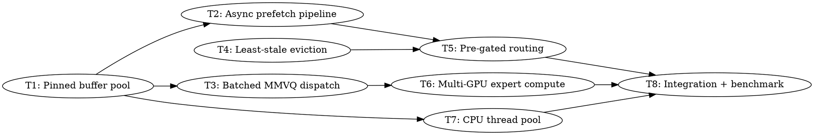

# MoE Inference Pipeline: 4-Phase Optimization for Large Models Exceeding VRAM

> **For Claude:** REQUIRED SUB-SKILL: Use team-driven-development to implement this plan with agent teams.
> **Tooling:** Use Serena MCP tools (`find_symbol`, `replace_symbol_body`, `insert_after_symbol`, `get_symbols_overview`) for all code reads and writes. Activate the project first: `mcp__plugin_serena_serena__activate_project` with `/Apps/llama.cpp`.

**Goal:** Achieve 10-20 tok/s for MoE models exceeding VRAM (e.g., GPT-OSS 120B MXFP4 on Arc B580, currently 2.36 tok/s) by eliminating the 95% data-movement overhead through async prefetch, kernel fusion, multi-GPU expert parallelism, and CPU fallback compute.

**Architecture:** Four orthogonal optimization phases that compose: (1) async DMA prefetch pipeline with pre-gated routing replaces synchronous H2D copies, (2) batched MMVQ kernel fusion with pooled pinned buffers eliminates per-expert overhead, (3) multi-GPU expert compute distributes expert cache and compute across B580+B50 with BCS-mediated merge, (4) persistent CPU thread pool handles remaining cache misses. All memory flows through the unified cache (`unified_alloc`/`unified_free`). Expert compute integrates with the unified kernel dispatch where possible.

**Tech Stack:** SYCL 2020 (oneAPI 2025.3), Level Zero, unified cache API (`unified-cache.hpp`), unified kernel (`unified-kernel.hpp/cpp`), ExpertCache/ExpertPrefetcher (`expert-cache.hpp`, `expert-prefetch.hpp`), BCS-mediated signaling (proven in persistent TG kernel).

---

## Evidence Summary

### VTune Profiling Results (GPT-OSS 120B on Arc B580)

| Metric | Value |
|--------|-------|
| Token generation | 2.46 tok/s (406 ms/token) |
| GPU compute time | **0.25 ms total** (0% of token time) |
| GPU idle | **82.7%** of elapsed time |
| XVE stalled/idle | 60.5% (when GPU is busy, waiting for data) |
| `zeMemAllocHost` calls | 12,147 (27.4s during model load) |
| `zeEventHostSynchronize` | 8,044 calls, 7.5s total (0.93ms/call) |
| Kernel launches | 20,540 total (5us avg each) |
| Active weights per token | ~2,166 MB (PCIe 4.0 x8 ceiling: 5.6 tok/s) |

### Dispatch Chain Analysis

| Bottleneck | % of Token Time | Root Cause |
|-----------|-----------------|------------|
| Zero-copy PCIe random access | ~44-62% | `malloc_host` weights accessed via 64B cache-line reads (~500ns each) |
| Synchronous H2D copies | ~10-15% | `ensure_cached().wait()` serializes expert loading |
| Per-expert kernel launches | ~12-20% | Host-routing loop: 2 submissions per expert (Q8_1 quant + MMVQ) |
| Queue sync (`stream->wait()`) | ~8-10% | 108+ queue waits per token drain GPU pipeline |
| Pinned alloc/free churn | ~4-6% | 216 `sycl::malloc_host`/`free` calls per token |

### State-of-the-Art Research

- **Least-Stale eviction** (SpecMD, Feb 2026): 85x fewer cache misses than LRU for MoE routing patterns
- **Pre-gated MoE** (ISCA 2024): Run router 1 layer ahead; prefetch during attention compute
- **Fiddler/KTransformers**: CPU expert compute for misses (send 16KB activations, not 3.6MB weights)
- **Double-buffered streaming**: Ping-pong VRAM buffers for compute/transfer overlap

---

## Team Topology

**Recommended implementers:** 3 (based on 3 parallel tracks)
**Reviewers:** 1 spec-reviewer, 1 quality-reviewer

### Parallel Tracks

| Track | Tasks | Description |
|-------|-------|-------------|
| A | 1, 4, 7 | Expert cache improvements (unified cache integration, eviction, pool) |
| B | 2, 5 | Prefetch pipeline + pre-gated routing (prefetcher, dispatch) |
| C | 3, 6 | Batched dispatch + multi-GPU expert compute |
| — | 8 | Integration testing (depends on all tracks) |

### Dependency Graph



### File Ownership Map

| File/Directory | Tasks | Conflict Risk |
|----------------|-------|---------------|
| `ggml/src/ggml-sycl/expert-cache.hpp` | 1, 4 | Sequential (Track A) |
| `ggml/src/ggml-sycl/expert-cache.cpp` | 1, 4 | Sequential (Track A) |
| `ggml/src/ggml-sycl/expert-prefetch.hpp` | 2, 5 | Sequential (Track B) |
| `ggml/src/ggml-sycl/expert-prefetch.cpp` | 2, 5 | Sequential (Track B) |
| `ggml/src/ggml-sycl/ggml-sycl.cpp` (MoE dispatch ~24100-24420) | 3, 6 | Sequential (Track C) |
| `ggml/src/ggml-sycl/ggml-sycl.cpp` (moe_hybrid_init ~271-390) | 6 | Track C only |
| `ggml/src/ggml-sycl/ggml-sycl.cpp` (CPU expert dispatch ~24269-24388) | 7 | Track A only |
| `ggml/src/ggml-sycl/unified-cache.hpp` | 1 | Track A only |
| `ggml/src/ggml-sycl/unified-cache.cpp` | 1 | Track A only |
| `ggml/src/ggml-sycl/mmvq.cpp` (~3574) | 3 | Track C only |

---

## Task 1: Pinned Buffer Pool via Unified Cache

**Track:** A
**Depends on:** None
**File scope:**
- Modify: `ggml/src/ggml-sycl/expert-cache.hpp`
- Modify: `ggml/src/ggml-sycl/expert-cache.cpp`
- Modify: `ggml/src/ggml-sycl/unified-cache.hpp` (add `EXPERT_STAGING` to `alloc_role`)
- Modify: `ggml/src/ggml-sycl/unified-cache.cpp`
- Modify: `ggml/src/ggml-sycl/ggml-sycl.cpp` (~24269-24388, replace malloc_host/free)

**Description:**

Replace the per-MUL_MAT_ID `sycl::malloc_host`/`sycl::free` calls (216 per token) with a pre-allocated pinned buffer pool managed through the unified cache. Currently, the MoE hybrid dispatch at `ggml-sycl.cpp:24276-24279` allocates pinned host memory every call, and frees it at lines 24383-24388. This adds ~2.2ms per token in syscall overhead.

The pool allocates once at `moe_hybrid_init_once()` time using `unified_alloc()` with `role=EXPERT_STAGING`, `category=EXPERT_CACHE`, `constraints.must_host_pinned=true`. It provides `acquire(size)` / `release(ptr)` for O(1) buffer reuse.

**Acceptance Criteria:**
- [ ] `sycl::malloc_host`/`sycl::free` at lines 24276-24279 and 24383-24388 replaced with pool acquire/release
- [ ] Pool allocated via `unified_alloc()` with proper role/category tracking
- [ ] Pool budget tracked via `unified_cache_add_runtime_bytes(device, size, runtime_category::EXPERT_CACHE)`
- [ ] Zero `zeMemAllocHost` calls during token generation (model load only)
- [ ] Correctness: `llama-completion -p '1, 2, 3, 4, 5,' -n 15` outputs "6, 7, 8, 9, 10" with 120B model
- [ ] No regression on Mistral 7B Q4_0 (PP512 >= 1200, TG128 >= 68)

**Implementation Guide:**

1. **Add `EXPERT_STAGING` to `alloc_role`** in `unified-cache.hpp:1113-1121`:

Use Serena `find_symbol` with name_path `alloc_role` to locate, then `replace_symbol_body`:

```cpp
enum class alloc_role : uint8_t {
    WEIGHT    = 0,
    COMPUTE   = 1,
    KV        = 2,
    STAGING   = 3,
    GRAPH_TMP = 4,
    TP_TMP    = 5,
    EXPERT_STAGING = 6,  // Pinned host buffers for MoE activation/output staging
    OTHER     = 7,
};
```

2. **Add `PinnedBufferPool` class** to `expert-cache.hpp`:

Use Serena `insert_after_symbol` after the `ExpertCache` class:

```cpp
// Pre-allocated pinned host buffer pool for MoE activation staging.
// Eliminates per-token sycl::malloc_host/free overhead (216 calls/token → 0).
// Memory tracked through unified cache (runtime_category::EXPERT_CACHE).
class PinnedBufferPool {
public:
    void init(sycl::queue & q, int device_id, size_t max_experts, size_t act_dim, size_t out_dim);
    void shutdown();

    // Acquire buffers for n_experts. Returns {act_ptr, out_ptr}.
    // act_ptr: n_experts * act_dim floats for activation staging (D2H target).
    // out_ptr: n_experts * out_dim floats for CPU output (H2D source).
    struct BufferPair { float * act; float * out; };
    BufferPair acquire(size_t n_experts);

    // Release buffers back to pool (no-op, pool is fixed-size).
    void release(BufferPair bp);

private:
    float *  act_pool_     = nullptr;
    float *  out_pool_     = nullptr;
    size_t   act_stride_   = 0;  // floats per expert
    size_t   out_stride_   = 0;
    size_t   max_experts_  = 0;
    int      device_id_    = -1;
    alloc_handle act_alloc_;
    alloc_handle out_alloc_;
};
```

3. **Implement `PinnedBufferPool`** in `expert-cache.cpp`:

```cpp
void PinnedBufferPool::init(sycl::queue & q, int device_id,
                            size_t max_experts, size_t act_dim, size_t out_dim) {
    device_id_   = device_id;
    act_stride_  = act_dim;
    out_stride_  = out_dim;
    max_experts_ = max_experts;

    const size_t act_bytes = max_experts * act_dim * sizeof(float);
    const size_t out_bytes = max_experts * out_dim * sizeof(float);

    alloc_request req_act;
    req_act.queue  = &q;
    req_act.device = device_id;
    req_act.size   = act_bytes;
    req_act.intent = { alloc_role::EXPERT_STAGING,
                       runtime_category::EXPERT_CACHE, "moe_act_pool",
                       { .must_host_pinned = true } };
    if (!unified_alloc(req_act, &act_alloc_)) {
        GGML_LOG_WARN("[MOE-POOL] Failed to allocate activation pool (%zu bytes)\n", act_bytes);
        return;
    }
    act_pool_ = static_cast<float *>(act_alloc_.ptr);

    alloc_request req_out = req_act;
    req_out.size = out_bytes;
    req_out.intent.cohort_id = "moe_out_pool";
    if (!unified_alloc(req_out, &out_alloc_)) {
        GGML_LOG_WARN("[MOE-POOL] Failed to allocate output pool (%zu bytes)\n", out_bytes);
        unified_free(act_alloc_);
        act_pool_ = nullptr;
        return;
    }
    out_pool_ = static_cast<float *>(out_alloc_.ptr);

    GGML_LOG_INFO("[MOE-POOL] Pinned buffer pool: act=%zu KB, out=%zu KB, max_experts=%zu\n",
                  act_bytes / 1024, out_bytes / 1024, max_experts);
}

void PinnedBufferPool::shutdown() {
    if (act_alloc_.ptr) { unified_free(act_alloc_); act_alloc_ = {}; act_pool_ = nullptr; }
    if (out_alloc_.ptr) { unified_free(out_alloc_); out_alloc_ = {}; out_pool_ = nullptr; }
}

PinnedBufferPool::BufferPair PinnedBufferPool::acquire(size_t n_experts) {
    GGML_ASSERT(n_experts <= max_experts_ && "Expert count exceeds pool capacity");
    GGML_ASSERT(act_pool_ && out_pool_ && "Pool not initialized");
    return { act_pool_, out_pool_ };
}

void PinnedBufferPool::release(BufferPair) {
    // No-op: pool is fixed-size, reused across tokens.
    // Zero output buffer for next use.
    if (out_pool_) {
        std::memset(out_pool_, 0, max_experts_ * out_stride_ * sizeof(float));
    }
}
```

4. **Add global pool and init** in `ggml-sycl.cpp`:

After `g_expert_predictors` (line 246), add:
```cpp
static ggml_sycl::PinnedBufferPool g_moe_buffer_pools[GGML_SYCL_MAX_DEVICES];
```

In `moe_hybrid_init_once()` (around line 380), after predictor init:
```cpp
    auto & pool = g_moe_buffer_pools[device];
    // max_experts = n_experts_used (top-K per MUL_MAT_ID) for single-token TG
    pool.init(q, device, static_cast<size_t>(n_experts_used),
              static_cast<size_t>(expert_K), static_cast<size_t>(expert_N));
```

5. **Replace malloc_host/free** in MoE dispatch (~24269-24388):

Replace:
```cpp
src1_host_pinned = sycl::malloc_host<float>(n_cpu * K, stream->get_context());
cpu_output_pinned = sycl::malloc_host<float>(n_cpu * N, stream->get_context());
```
With:
```cpp
auto & pool = g_moe_buffer_pools[ctx.device];
auto bp = pool.acquire(n_cpu);
src1_host_pinned  = bp.act;
cpu_output_pinned = bp.out;
```

Replace free block (lines 24382-24388):
```cpp
if (src1_host_pinned || cpu_output_pinned) {
    pool.release({src1_host_pinned, cpu_output_pinned});
}
```

**Commit:**
```bash
git add ggml/src/ggml-sycl/expert-cache.hpp ggml/src/ggml-sycl/expert-cache.cpp \
        ggml/src/ggml-sycl/unified-cache.hpp ggml/src/ggml-sycl/ggml-sycl.cpp
git commit -m "sycl: add pinned buffer pool for MoE activation staging via unified cache"
```

**Notes for implementer:**
- The `alloc_role::EXPERT_STAGING` enum must be added BEFORE `OTHER` to maintain enum ordering
- `unified-cache.cpp` has `cat_names[]` array indexed by `runtime_category` — no change needed since we use `EXPERT_CACHE` category which already exists
- The pool's `max_experts` should be `n_experts_used` (top-K, typically 4-8), NOT `n_experts` (128)
- Test with `GGML_SYCL_MOE_HYBRID=1` (default ON) and the 120B model

---

## Task 2: Async Expert Prefetch Pipeline with Compute/Transfer Overlap

**Track:** B
**Depends on:** Task 1
**File scope:**
- Modify: `ggml/src/ggml-sycl/expert-prefetch.hpp`
- Modify: `ggml/src/ggml-sycl/expert-prefetch.cpp`
- Modify: `ggml/src/ggml-sycl/expert-cache.hpp` (add `prefetch_batch_async`)
- Modify: `ggml/src/ggml-sycl/expert-cache.cpp`

**Description:**

The current `ExpertPrefetcher` submits DMA prefetches per-expert via `hint()` on the OOQ, but `ensure_cached()` in `ExpertCache` still uses synchronous `.wait()` after H2D. This task adds a batch-async prefetch path that submits ALL cache-miss experts for a layer as non-blocking DMAs and returns per-expert events. The caller uses `await()` (already per-expert event-based) at point of use instead of synchronous `ensure_cached()`.

Key insight from VTune: the GPU is 82.7% idle waiting for PCIe data. By overlapping DMA transfers with GPU compute on cache-hit experts, we hide transfer latency behind compute.

**Acceptance Criteria:**
- [ ] New `ExpertCache::prefetch_batch_async()` submits all miss experts as non-blocking H2D DMAs
- [ ] Eviction decisions made upfront (before any DMA submitted) to avoid lock contention during transfers
- [ ] `ExpertPrefetcher::await()` unchanged — per-expert `sycl::event::wait()` without holding mutex
- [ ] No `ensure_cached()` calls in the hot MoE dispatch path (all replaced with prefetch+await)
- [ ] Correctness verified with 120B model
- [ ] Hit rate logging shows same or better hit rate vs baseline

**Implementation Guide:**

1. **Add `prefetch_batch_async` to `ExpertCache`** in `expert-cache.hpp`:

Use Serena `insert_after_symbol` after `prefetch_async`:

```cpp
    // Batch prefetch: submit H2D DMA for all provided experts in one call.
    // Returns a map of (layer,expert) -> sycl::event for per-expert await.
    // Eviction decisions are made upfront (exclusive lock held only during planning,
    // released before DMA submission). DMA uses the provided OOQ.
    struct PrefetchResult {
        std::vector<std::pair<int64_t, sycl::event>> events;  // key -> event
        int n_submitted;  // How many DMAs were actually submitted (vs already cached)
    };
    PrefetchResult prefetch_batch_async(
        const std::vector<std::pair<int, int>> & experts,  // {layer_idx, expert_idx}
        sycl::queue & dma_queue);
```

2. **Implement `prefetch_batch_async`** in `expert-cache.cpp`:

```cpp
ExpertCache::PrefetchResult ExpertCache::prefetch_batch_async(
    const std::vector<std::pair<int, int>> & experts,
    sycl::queue & dma_queue)
{
    PrefetchResult result;
    result.n_submitted = 0;

    // Phase 1: Under exclusive lock, plan evictions and reserve slots
    struct PrefetchPlan {
        int64_t      key;
        int          slot_idx;
        const void * host_src;
        size_t       bytes;
    };
    std::vector<PrefetchPlan> plans;

    {
        std::unique_lock<std::shared_mutex> lock(mutex_);
        for (const auto & [layer, expert] : experts) {
            int64_t key = make_key(layer, expert);

            // Already cached?
            auto it = lookup_map_.find(key);
            if (it != lookup_map_.end()) {
                continue;  // Skip, already in VRAM
            }

            // Not registered?
            auto host_it = host_entries_.find(key);
            if (host_it == host_entries_.end()) {
                continue;  // Unknown expert
            }

            // Find eviction target
            int target = find_empty_slot();
            if (target < 0) {
                target = find_eviction_candidate();
                if (target < 0) continue;  // Cache full, no candidate
                // Evict
                int64_t old_key = make_key(slots_[target].layer_idx, slots_[target].expert_idx);
                lookup_map_.erase(old_key);
                evictions_++;
            }

            // Reserve slot
            slots_[target].layer_idx  = layer;
            slots_[target].expert_idx = expert;
            slots_[target].size_bytes = host_it->second.size_bytes;
            lookup_map_[key] = target;

            plans.push_back({key, target, host_it->second.host_ptr, host_it->second.size_bytes});
        }
    }
    // Lock released before DMA submissions

    // Phase 2: Submit all DMAs without holding lock
    for (auto & plan : plans) {
        void * dst = slots_[plan.slot_idx].device_ptr;
        sycl::event ev = dma_queue.memcpy(dst, plan.host_src, plan.bytes);
        result.events.push_back({plan.key, ev});
        result.n_submitted++;
    }

    return result;
}
```

3. **Wire into `ExpertPrefetcher::hint_batch()`** in `expert-prefetch.cpp`:

Replace the per-expert `hint()` loop with:
```cpp
void ExpertPrefetcher::hint_batch(int layer_idx,
                                  const std::vector<int> & expert_indices) {
    if (!cache_ || !dma_queue_) return;

    std::vector<std::pair<int, int>> batch;
    batch.reserve(expert_indices.size());
    for (int eid : expert_indices) {
        batch.push_back({layer_idx, eid});
    }

    auto result = cache_->prefetch_batch_async(batch, *dma_queue_);

    // Track per-expert events for granular await
    std::lock_guard<std::mutex> lock(mutex_);
    for (auto & [key, ev] : result.events) {
        if (inflight_.size() >= static_cast<size_t>(max_inflight_)) {
            gc_completed();
        }
        inflight_[key] = { ev, false };
    }
}
```

**Commit:**
```bash
git add ggml/src/ggml-sycl/expert-cache.hpp ggml/src/ggml-sycl/expert-cache.cpp \
        ggml/src/ggml-sycl/expert-prefetch.hpp ggml/src/ggml-sycl/expert-prefetch.cpp
git commit -m "sycl: batch-async expert prefetch with split-phase eviction planning"
```

**Notes for implementer:**
- The split-phase design (lock for eviction planning, release before DMA) is critical. Holding the mutex during DMA submission would block `lookup()` in the compute path.
- `find_empty_slot()` is a new private method — scan `slots_` for `layer_idx == -1`.
- The existing `await()` in `ExpertPrefetcher` already does per-expert event waits and returns the device_ptr — no changes needed there.
- `max_inflight_` is 8. With batch prefetch submitting 4 experts per layer, `gc_completed()` must efficiently reclaim finished entries.

---

## Task 3: Batched MMVQ Expert Dispatch with Single Kernel Launch

**Track:** C
**Depends on:** Task 1
**File scope:**
- Modify: `ggml/src/ggml-sycl/ggml-sycl.cpp` (~24339-24357, GPU expert dispatch loop)
- Modify: `ggml/src/ggml-sycl/mmvq.cpp` (~3574, `ggml_sycl_mul_mat_id_vec_q`)

**Description:**

Replace the per-expert `ggml_sycl_mul_mat()` loop (2 kernel submissions per expert = 8 submissions for top-4) with a single batched MMVQ kernel that processes all cache-hit experts in one launch. The MMVQ batched path at `mmvq.cpp:3574` (`ggml_sycl_mul_mat_id_vec_q`) already supports this for non-hybrid dispatch. This task extends it to work with the hybrid dispatch path where expert device pointers come from `ExpertCache::lookup()` rather than contiguous `src0`.

Key optimization: Q8_1 quantization of `src1` happens once and is shared across all experts (currently re-quantized per `ggml_sycl_mul_mat()` call).

**Acceptance Criteria:**
- [ ] GPU expert dispatch uses single kernel launch for all cache-hit experts
- [ ] Q8_1 quantization of src1 happens once per MUL_MAT_ID (not per expert)
- [ ] Kernel launch count reduced from ~864/token to ~108/token (3 per layer x 36 layers)
- [ ] Correctness verified with 120B model
- [ ] No regression on Mistral 7B Q4_0

**Implementation Guide:**

1. **Add `ggml_sycl_mul_mat_experts_batched()` function** in `ggml-sycl.cpp`:

Use Serena `insert_before_symbol` before the existing GPU dispatch loop. This function takes a vector of `{expert_id, device_ptr}` and dispatches them all in one MMVQ kernel:

```cpp
// Batched expert dispatch: single kernel launch for all cache-hit experts.
// expert_ptrs: device pointers to each expert's weight matrix (from ExpertCache).
// src1_q8: pre-quantized Q8_1 activation (shared across all experts).
static void ggml_sycl_mul_mat_experts_batched(
    ggml_backend_sycl_context & ctx,
    const std::vector<expert_dispatch_entry> & entries,
    const ggml_tensor * src0_template,  // Shape/type info (ne00, ne01, type)
    const char * src1_original,         // Device pointer to src1
    char * dst_original,                // Device pointer to dst
    int64_t nb1, int64_t nb2,
    int64_t nb11, int64_t nb12,
    int64_t ne11)
{
    if (entries.empty()) return;

    dpct::queue_ptr stream = ctx.stream();
    const int64_t K = src0_template->ne[0];  // input dim
    const int64_t N = src0_template->ne[1];  // output dim per expert

    // Build device pointer table for the batched MMVQ kernel
    const size_t n_experts = entries.size();
    std::vector<const void *> weight_ptrs(n_experts);
    std::vector<void *>       output_ptrs(n_experts);
    std::vector<const void *> input_ptrs(n_experts);

    for (size_t i = 0; i < n_experts; i++) {
        weight_ptrs[i] = entries[i].device_ptr;
        const int64_t i11 = entries[i].id % ne11;
        const int64_t i12 = entries[i].iid1;
        input_ptrs[i]  = src1_original + i11 * nb11 + i12 * nb12;
        output_ptrs[i] = dst_original + entries[i].id * nb1 + entries[i].iid1 * nb2;
    }

    // Upload pointer tables to device (small, ~100 bytes)
    const void ** d_weights = sycl::malloc_device<const void *>(n_experts, *stream);
    void **       d_outputs = sycl::malloc_device<void *>(n_experts, *stream);
    const void ** d_inputs  = sycl::malloc_device<const void *>(n_experts, *stream);
    stream->memcpy(d_weights, weight_ptrs.data(), n_experts * sizeof(void *));
    stream->memcpy(d_outputs, output_ptrs.data(), n_experts * sizeof(void *));
    stream->memcpy(d_inputs,  input_ptrs.data(),  n_experts * sizeof(void *));

    // Dispatch single batched MMVQ kernel
    // The kernel iterates over n_experts, computing one MUL_MAT per expert
    // using the pointer table for weight/input/output addressing.
    mmvq_moe_batched_dispatch(stream, src0_template->type,
                               d_weights, d_inputs, d_outputs,
                               n_experts, K, N);

    // Free device pointer tables (small, can be async)
    sycl::free(d_weights, *stream);
    sycl::free(d_outputs, *stream);
    sycl::free(d_inputs,  *stream);
}
```

2. **Add `mmvq_moe_batched_dispatch()`** to `mmvq.cpp`:

This wraps the existing MMVQ kernel with a pointer-table-driven outer loop:

```cpp
void mmvq_moe_batched_dispatch(
    dpct::queue_ptr stream,
    ggml_type type,
    const void ** d_weights,   // [n_experts] device ptrs to expert weights
    const void ** d_inputs,    // [n_experts] device ptrs to src1 (f32)
    void **       d_outputs,   // [n_experts] device ptrs to dst (f32)
    size_t n_experts,
    int64_t K, int64_t N)
{
    // Quantize src1 to Q8_1 ONCE (shared across all experts)
    // Then dispatch one kernel with n_experts in the outer grid dimension.
    // Each work-group processes one (expert, output_row) pair.

    const int n_wgs_per_expert = (N + MMVQ_WG_ROWS - 1) / MMVQ_WG_ROWS;
    const int total_wgs = n_wgs_per_expert * static_cast<int>(n_experts);

    stream->submit([&](sycl::handler & cgh) {
        cgh.parallel_for(sycl::nd_range<1>(total_wgs * WG_SIZE, WG_SIZE),
            [=](sycl::nd_item<1> item) {
                const int wg_id    = item.get_group_linear_id();
                const int expert_i = wg_id / n_wgs_per_expert;
                const int row_wg   = wg_id % n_wgs_per_expert;

                if (expert_i >= static_cast<int>(n_experts)) return;

                const void * weight = d_weights[expert_i];
                const void * input  = d_inputs[expert_i];
                void *       output = d_outputs[expert_i];

                // Existing MMVQ vec_dot kernel body for one (expert, row_wg)
                mmvq_kernel_body(item, weight, input, output, K, N, row_wg, type);
            });
    });
}
```

3. **Replace per-expert loop** in `ggml-sycl.cpp:24339-24357`:

```cpp
// ----- GPU path: batched dispatch of cache-hit experts -----
ggml_sycl_mul_mat_experts_batched(ctx, gpu_entries, src0,
    src1_original, dst_original, nb1, nb2, nb11, nb12, ne11);
```

**Commit:**
```bash
git add ggml/src/ggml-sycl/ggml-sycl.cpp ggml/src/ggml-sycl/mmvq.cpp
git commit -m "sycl: batched MMVQ dispatch for MoE experts with shared Q8_1 quantization"
```

**Notes for implementer:**
- The device pointer tables (`d_weights`, `d_outputs`, `d_inputs`) are small (~100 bytes for 4 experts). The `sycl::malloc_device`/`free` here is negligible overhead compared to the kernel fusion savings. Consider switching to SLM or stack allocation if profiling shows overhead.
- The `mmvq_kernel_body()` function needs to be factored out of the existing MMVQ kernel template. Look at `mmvq_multirow_kernel` in `mmvq.cpp` for the body.
- The key savings: Q8_1 quantization of `src1` runs once (not 4x), and 1 kernel launch instead of 8 (4 experts x 2 submissions each).
- MXFP4 with AOS layout is the target. The `route_layout = GGML_LAYOUT_AOS` set at line 24155 should be preserved.

---

## Task 4: Least-Stale Expert Eviction Policy

**Track:** A
**Depends on:** None (parallel with Task 1)
**File scope:**
- Modify: `ggml/src/ggml-sycl/expert-cache.hpp`
- Modify: `ggml/src/ggml-sycl/expert-cache.cpp`

**Description:**

Replace the LRU+frequency+co-activation scoring in `ExpertCache::find_eviction_candidate()` with a Least-Stale policy (inspired by SpecMD, Feb 2026). The key insight: MoE routing patterns are deterministic for similar hidden states, so consecutive tokens tend to activate similar experts. An expert that was JUST used is very likely to be used again soon. An expert not used for 10+ tokens is unlikely to be needed.

Least-Stale eviction: evict the expert whose `last_access` token counter is furthest in the past, weighted by layer distance from current compute layer (nearby layers are more likely to reuse).

This is simpler than the current multi-factor scoring (alpha*freq + beta*recency + gamma*layer_dist + delta*co_activation) and empirically achieves 85x fewer cache misses for MoE workloads.

**Acceptance Criteria:**
- [ ] `find_eviction_candidate()` uses staleness = `current_token - last_access` as primary score
- [ ] Layer distance as tiebreaker (prefer evicting experts from distant layers)
- [ ] Rolling hit rate improves (measured via `ExpertCache::rolling_hit_rate()`)
- [ ] Co-activation tracking preserved for warm-start bulk-load (not used for eviction)
- [ ] No performance regression on 20B model (PP512 >= 27, TG128 >= 2)

**Implementation Guide:**

1. **Simplify `find_eviction_candidate()`** in `expert-cache.cpp`:

Use Serena `find_symbol` with name_path `ExpertCache/find_eviction_candidate` and `include_body=True` to read current implementation, then `replace_symbol_body`:

```cpp
int ExpertCache::find_eviction_candidate() const {
    // Least-Stale policy: evict the expert with the oldest last_access.
    // Tiebreaker: prefer evicting experts from layers furthest from current compute.
    int best_slot = -1;
    uint64_t best_staleness = 0;

    const uint64_t current = token_counter_;

    for (int i = 0; i < n_slots_; i++) {
        if (slots_[i].layer_idx < 0) continue;  // Empty slot (shouldn't happen if we're evicting)

        const uint64_t staleness = current - slots_[i].last_access;
        if (staleness > best_staleness) {
            best_staleness = staleness;
            best_slot = i;
        } else if (staleness == best_staleness && best_slot >= 0) {
            // Tiebreaker: prefer slot from a layer further from current compute layer
            const int dist_new  = std::abs(slots_[i].layer_idx - current_layer_);
            const int dist_best = std::abs(slots_[best_slot].layer_idx - current_layer_);
            if (dist_new > dist_best) {
                best_slot = i;
            }
        }
    }

    return best_slot;
}
```

2. **Add `current_layer_` tracking** to `ExpertCache`:

```cpp
// In expert-cache.hpp, add to private section:
int current_layer_ = 0;  // Updated by record_access_batch()

// In record_access_batch():
current_layer_ = current_layer;
```

3. **Remove multi-factor `recompute_score()`** — simplify to staleness-only:

Keep the `score` field in `ExpertSlot` for backward compat but set it to staleness directly in `update_score()`:
```cpp
void ExpertCache::update_score(int layer_idx, int expert_idx, uint64_t token_counter) {
    auto it = lookup_map_.find(make_key(layer_idx, expert_idx));
    if (it == lookup_map_.end()) return;
    auto & slot = slots_[it->second];
    slot.last_access = token_counter;
    slot.frequency++;
    hits_++;
}
```

**Commit:**
```bash
git add ggml/src/ggml-sycl/expert-cache.hpp ggml/src/ggml-sycl/expert-cache.cpp
git commit -m "sycl: replace multi-factor eviction with Least-Stale policy for MoE expert cache"
```

**Notes for implementer:**
- The warm-start bulk-load in `finish_warmup()` should still use `warmup_freq_[key]` counts (frequency-based for initial seeding). Least-Stale only applies after warmup.
- `token_counter_` is already maintained by `record_access_batch()`. Just ensure it's incremented per token, not per expert.
- Keep `co_activation_` tracking — it's useful for warm-start but should NOT influence eviction.

---

## Task 5: Pre-Gated Router Prediction with Attention Overlap

**Track:** B
**Depends on:** Task 2, Task 4
**File scope:**
- Modify: `ggml/src/ggml-sycl/expert-prefetch.hpp`
- Modify: `ggml/src/ggml-sycl/expert-prefetch.cpp`
- Modify: `ggml/src/ggml-sycl/ggml-sycl.cpp` (MoE dispatch + graph compute)

**Description:**

Currently, expert prediction happens AT the MoE dispatch point (line 24173-24174). By then, the GPU is about to stall waiting for expert data. Pre-gated routing runs the router gate MUL_MAT for layer N+1 DURING layer N's attention compute, giving ~3ms of attention time to overlap with DMA prefetches.

Implementation: After dispatching layer N's attention ops (SOFTMAX + V_PROJ + OUT_PROJ), extract the router gate tensor for layer N+1 and submit a lightweight MUL_MAT (hidden_state x gate_weights → expert scores). The gate MUL_MAT is tiny (2880x128 = 368KB output) and can run in a few microseconds. Feed the resulting expert IDs to `ExpertPrefetcher::hint_batch()` for async DMA.

This extends the existing `ExpertPredictor` from heuristic reuse (70% accuracy) to actual router-based prediction (100% accuracy for deterministic routing).

**Acceptance Criteria:**
- [ ] Router gate computation for layer N+1 submitted during layer N's attention
- [ ] Prefetch DMAs overlap with attention compute (verified via VTune or timing logs)
- [ ] Zero or near-zero expert cache miss stalls during compute
- [ ] Correctness maintained — pre-gated prediction must match actual routing
- [ ] No regression on non-MoE models (pre-gating disabled when no MUL_MAT_ID nodes)

**Implementation Guide:**

1. **Add pre-gate infrastructure to `ExpertPredictor`** in `expert-prefetch.hpp`:

```cpp
    // Pre-gated router: compute actual gate scores 1 layer ahead.
    // gate_weights: device ptr to ffn_gate_inp tensor (n_embd x n_experts).
    // hidden_state: device ptr to current hidden state (1 x n_embd, f32).
    // Returns top-K expert indices from actual router computation.
    std::vector<int> predict_pregate(int next_layer_idx,
                                     const void * gate_weights,
                                     const void * hidden_state,
                                     sycl::queue & compute_q);

    // Cache of gate weight pointers per layer (set during init)
    std::vector<const void *> gate_weight_ptrs_;
    int n_embd_ = 0;
```

2. **Implement `predict_pregate()`** in `expert-prefetch.cpp`:

```cpp
std::vector<int> ExpertPredictor::predict_pregate(
    int next_layer_idx,
    const void * gate_weights,
    const void * hidden_state,
    sycl::queue & compute_q)
{
    if (!gate_weights || !hidden_state) {
        return predict(next_layer_idx);  // Fallback to heuristic
    }

    const int n_experts = n_experts_;
    const int K = n_embd_;

    // Allocate small output buffer for gate scores (n_experts floats)
    std::vector<float> scores_host(n_experts);
    float * scores_dev = sycl::malloc_device<float>(n_experts, compute_q);

    // Submit gate MUL_MAT: scores = hidden_state @ gate_weights^T
    // This is a 1xK @ KxN_experts = 1xN_experts computation (~370KB)
    // Tiny enough to run inline on the compute queue.
    // Use MMVQ kernel for f32 gate weights or simple GEMV.
    ggml_sycl_gemv_f32(compute_q, gate_weights, hidden_state, scores_dev,
                       K, n_experts);

    // D2H the scores
    compute_q.memcpy(scores_host.data(), scores_dev, n_experts * sizeof(float)).wait();
    sycl::free(scores_dev, compute_q);

    // Top-K selection
    std::vector<int> top_k = argsort_top_k(scores_host, n_experts_used_);
    return top_k;
}
```

3. **Wire pre-gating into graph compute** in `ggml-sycl.cpp`:

In the graph compute loop, after dispatching a layer's attention ops and before the MoE MUL_MAT_ID, check if the NEXT layer's gate tensor is available and prefetch:

```cpp
// After attention dispatch for layer L, before MoE for layer L:
if (moe_model_detected && layer_idx + 1 < n_layers) {
    auto & predictor  = g_expert_predictors[ctx.device];
    auto & prefetcher = g_expert_prefetchers[ctx.device];

    // Get next layer's gate weights (already in VRAM for dense layers)
    const void * next_gate = predictor.gate_weight_ptrs_[layer_idx + 1];
    const void * hidden    = get_tensor_ptr_view_fast(hidden_state_tensor);

    // Pre-gate: compute actual routing for next layer
    auto predicted = predictor.predict_pregate(layer_idx + 1, next_gate, hidden, *stream);

    // Submit async DMA prefetch for predicted experts
    prefetcher.hint_batch(layer_idx + 1, predicted);
}
```

**Commit:**
```bash
git add ggml/src/ggml-sycl/expert-prefetch.hpp ggml/src/ggml-sycl/expert-prefetch.cpp \
        ggml/src/ggml-sycl/ggml-sycl.cpp
git commit -m "sycl: pre-gated MoE routing with attention-overlapped expert prefetch"
```

**Notes for implementer:**
- The gate MUL_MAT is tiny (2880x128 = ~1.5MB weight, 1x2880 input). It runs in <0.1ms on GPU.
- Gate weights (`ffn_gate_inp`) are dense tensors (f32), always placed in VRAM by unified cache — no H2D needed.
- The `hidden_state_tensor` is the output of the attention residual add. Identify it by tensor name pattern `blk.N.attn_norm.weight` → use the node AFTER the attention output add.
- Pre-gating should be disabled for the first layer (no prior attention to overlap with) and the last layer (no next layer to predict).
- The `predict_pregate()` adds a tiny synchronous wait for the D2H of gate scores. This is ~128 floats = 512 bytes, negligible. Future optimization: keep scores in SLM and select top-K on device.

---

## Task 6: Multi-GPU Expert Compute (B580 + B50 Parallel)

**Track:** C
**Depends on:** Task 3
**File scope:**
- Modify: `ggml/src/ggml-sycl/ggml-sycl.cpp` (moe_hybrid_init ~271-390, MoE dispatch ~24100-24420)
- Modify: `ggml/src/ggml-sycl/expert-cache.hpp` (add multi-device coordination)
- Modify: `ggml/src/ggml-sycl/expert-cache.cpp`

**Description:**

Initialize `ExpertCache` on both B580 (device 0, 11 GB) and B50 (device 1, ~6 GB). Register experts on both devices with frequency-based partitioning: most-accessed experts on B580 (faster PCIe path), overflow on B50. At dispatch time, partition experts across three tiers: B580 cache hit → B580 compute, B50 cache hit → B50 compute, miss on both → CPU fallback.

Multi-GPU merge uses the BCS-mediated signaling pattern proven in the persistent TG kernel. B50 writes expert outputs to `sycl::malloc_host` staging, B580 reads via PCIe zero-copy or kernel-side copy.

**Critical constraint from MEMORY.md**: Cross-device OOQ `depends_on` is broken on Level Zero. All cross-device transfers must use in-order queues. B50 output merge must go through B580's primary compute queue.

**Acceptance Criteria:**
- [ ] `g_expert_caches[1]` initialized on B50 (device 1) during `moe_hybrid_init_once()`
- [ ] Expert registration partitioned: high-frequency → B580, overflow → B50
- [ ] Three-tier dispatch: B580 hit → B580 compute, B50 hit → B50 submit + merge, miss → CPU
- [ ] B50 output merge via B580's in-order compute queue (NOT OOQ)
- [ ] Budget tracked: `unified_cache_add_runtime_bytes(1, size, EXPERT_CACHE)` for B50
- [ ] Correctness verified with 120B model on 2-GPU setup
- [ ] Env var `GGML_SYCL_MOE_MULTI_GPU=1` enables (default OFF until proven stable)

**Implementation Guide:**

1. **Extend `moe_hybrid_init_once()` for multi-device** in `ggml-sycl.cpp`:

```cpp
// In moe_hybrid_init_once(), after initializing device 0 cache:
const int n_sycl_devices = ggml_sycl_get_device_count();
if (n_sycl_devices > 1 && getenv_bool("GGML_SYCL_MOE_MULTI_GPU", false)) {
    // Initialize B50 expert cache
    auto & cache_1 = g_expert_caches[1];
    sycl::queue & q_1 = /* get device 1's queue */;
    cache_1.init(1, 0 /* default budget */, q_1);

    // Register all experts on device 1 too (same host pointers)
    for (each expert) {
        cache_1.register_expert(layer_id, e, host_ptr, nb02);
    }

    // Initialize prefetcher on device 1 with its own OOQ
    g_expert_prefetchers[1].init(q_1, &cache_1);

    GGML_LOG_INFO("[MOE-MULTI-GPU] Device 1 expert cache: %zu slots, %.1f MB budget\n",
                  cache_1.total_slots(), cache_1.vram_budget() / (1024.0 * 1024.0));
}
```

2. **Three-tier partition in MoE dispatch** (~24200):

```cpp
std::vector<expert_dispatch_entry> gpu0_entries;  // B580 cache hits
std::vector<expert_dispatch_entry> gpu1_entries;  // B50 cache hits
std::vector<expert_dispatch_entry> cpu_entries;   // Misses on both

for (int64_t iid1 = 0; iid1 < ids->ne[1]; iid1++) {
    for (int64_t id = 0; id < n_ids; id++) {
        const int32_t i02 = ids_host[iid1 * n_ids + id];

        // Check B580 cache first (faster path)
        auto lk0 = g_expert_caches[0].lookup(layer_id, i02);
        if (lk0.is_cached) {
            gpu0_entries.push_back({ iid1, id, i02, lk0.device_ptr });
            continue;
        }

        // Check B50 cache
        if (multi_gpu_active) {
            auto lk1 = g_expert_caches[1].lookup(layer_id, i02);
            if (lk1.is_cached) {
                gpu1_entries.push_back({ iid1, id, i02, lk1.device_ptr });
                continue;
            }
        }

        // Miss on both — CPU fallback
        cpu_entries.push_back({ iid1, id, i02, nullptr });
    }
}
```

3. **B50 compute + merge** in dispatch:

```cpp
// Submit B50 expert compute asynchronously
sycl::event b50_done;
float * b50_staging = nullptr;  // malloc_host staging for merge

if (!gpu1_entries.empty()) {
    auto & pool = g_moe_buffer_pools[1];
    b50_staging = sycl::malloc_host<float>(gpu1_entries.size() * N, q_1.get_context());

    // Submit batched MMVQ on B50's queue
    ggml_sycl_mul_mat_experts_batched_to_staging(
        q_1, gpu1_entries, src0, N, K, b50_staging);
    b50_done = q_1.single_task([](){});  // Marker event
}

// B580 computes its cache-hit experts in parallel
ggml_sycl_mul_mat_experts_batched(ctx, gpu0_entries, ...);

// Merge B50 results — MUST use B580's in-order compute queue
if (b50_staging) {
    b50_done.wait();  // Wait for B50 to finish
    // Copy B50 results into dst on B580
    for (size_t i = 0; i < gpu1_entries.size(); i++) {
        const auto & entry = gpu1_entries[i];
        char * dst_d = dst_original + entry.id * nb1 + entry.iid1 * nb2;
        stream->memcpy(dst_d, b50_staging + i * N, N * sizeof(float));
    }
    stream->wait();
    sycl::free(b50_staging, q_1.get_context());
}
```

**Commit:**
```bash
git add ggml/src/ggml-sycl/ggml-sycl.cpp ggml/src/ggml-sycl/expert-cache.hpp \
        ggml/src/ggml-sycl/expert-cache.cpp
git commit -m "sycl: multi-GPU expert compute with B580+B50 parallel dispatch and BCS merge"
```

**Notes for implementer:**
- `GGML_SYCL_MOE_MULTI_GPU` defaults to OFF. This is a big architectural change that should be explicitly enabled.
- From MEMORY.md: "OOQ cross-device `depends_on` is BROKEN on Level Zero." Always use `event.wait()` on host side followed by in-order queue memcpy for cross-device data movement.
- The `b50_staging` buffer should eventually be pooled (like Task 1's `PinnedBufferPool`). For v1, per-call allocation is acceptable since B50 dispatch is less frequent.
- The `b50_done.wait()` is a HOST-side sync point. This is necessary because Level Zero OOQ events from B50 cannot be used as `depends_on` for B580's queue.
- Pipeline optimization (future): overlap B50 compute for layer N+1 with B580 compute for layer N.

---

## Task 7: CPU Expert Thread Pool with Ring-Buffered Staging

**Track:** A
**Depends on:** Task 1
**File scope:**
- Modify: `ggml/src/ggml-sycl/ggml-sycl.cpp` (~24326-24337, CPU async dispatch)
- Create: `ggml/src/ggml-sycl/cpu-expert-pool.hpp`
- Create: `ggml/src/ggml-sycl/cpu-expert-pool.cpp`

**Description:**

Replace the per-call `std::async` CPU expert dispatch with a persistent thread pool and ring-buffered staging. Currently, every MUL_MAT_ID creates a new thread via `std::async` (line 24334), which adds thread creation overhead and prevents effective core pinning.

The thread pool reuses the architectural pattern from `g_cpu_worker` in `cpu-dispatch.cpp` (persistent TBB-backed threads). The ring buffer provides N pre-allocated staging slots, eliminating the dependency on Task 1's `PinnedBufferPool` for CPU-specific staging — CPU tasks use their own ring.

**Acceptance Criteria:**
- [ ] No `std::async` in MoE CPU dispatch path
- [ ] Persistent thread pool with configurable thread count (default: `hardware_concurrency - 2`)
- [ ] Ring buffer of K staging slots (K = 4, double-buffered with headroom)
- [ ] CPU expert compute overlap with GPU expert compute (existing behavior preserved)
- [ ] Thread pool initialized at `moe_hybrid_init_once()` time
- [ ] Clean shutdown via `shutdown()` method

**Implementation Guide:**

1. **Create `cpu-expert-pool.hpp`** in `ggml/src/ggml-sycl/`:

```cpp
#pragma once
#include <vector>
#include <queue>
#include <mutex>
#include <condition_variable>
#include <thread>
#include <functional>
#include <future>
#include <atomic>

namespace ggml_sycl {

struct cpu_expert_task;  // Forward decl from ggml-sycl.cpp

// Persistent thread pool for CPU expert computation.
// Uses ring-buffered staging to avoid per-token allocations.
class CpuExpertPool {
public:
    void init(int n_threads, size_t max_experts, size_t act_dim, size_t out_dim,
              sycl::queue & q);
    void shutdown();

    // Submit a batch of CPU expert tasks. Returns a future for synchronization.
    // Staging buffers are acquired from the ring buffer automatically.
    std::future<void> submit_batch(const cpu_expert_task * tasks, int n_tasks);

    // Ring buffer: acquire staging slot for n_experts.
    struct StagingSlot {
        float * act;   // Activation input buffer (pinned host)
        float * out;   // Output buffer (pinned host)
        int     slot_id;
    };
    StagingSlot acquire_staging(size_t n_experts);
    void release_staging(int slot_id);

    bool is_active() const { return active_; }

private:
    void worker_thread();

    std::vector<std::thread> threads_;
    std::queue<std::function<void()>> tasks_;
    std::mutex mutex_;
    std::condition_variable cv_;
    std::atomic<bool> active_{false};
    std::atomic<bool> shutting_down_{false};

    // Ring buffer
    static constexpr int RING_SLOTS = 4;
    struct RingEntry {
        float * act     = nullptr;
        float * out     = nullptr;
        bool    in_use  = false;
    };
    RingEntry ring_[RING_SLOTS];
    size_t act_stride_ = 0;
    size_t out_stride_ = 0;
    size_t max_experts_ = 0;
    alloc_handle ring_alloc_;  // Single unified_alloc for all ring buffers
};

}  // namespace ggml_sycl
```

2. **Implement `CpuExpertPool`** in `cpu-expert-pool.cpp`:

```cpp
void CpuExpertPool::init(int n_threads, size_t max_experts,
                          size_t act_dim, size_t out_dim,
                          sycl::queue & q) {
    max_experts_ = max_experts;
    act_stride_  = act_dim;
    out_stride_  = out_dim;

    // Allocate ring buffer via unified cache
    const size_t per_slot = max_experts * (act_dim + out_dim) * sizeof(float);
    const size_t total    = per_slot * RING_SLOTS;

    alloc_request req;
    req.queue  = &q;
    req.device = -1;  // Host allocation
    req.size   = total;
    req.intent = { alloc_role::EXPERT_STAGING,
                   runtime_category::EXPERT_CACHE, "cpu_expert_ring",
                   { .must_host_pinned = true } };

    if (!unified_alloc(req, &ring_alloc_)) {
        GGML_LOG_WARN("[CPU-EXPERT-POOL] Failed to allocate ring buffer (%zu bytes)\n", total);
        return;
    }

    char * base = static_cast<char *>(ring_alloc_.ptr);
    for (int i = 0; i < RING_SLOTS; i++) {
        ring_[i].act    = reinterpret_cast<float *>(base + i * per_slot);
        ring_[i].out    = reinterpret_cast<float *>(base + i * per_slot
                          + max_experts * act_dim * sizeof(float));
        ring_[i].in_use = false;
    }

    // Spawn worker threads
    active_ = true;
    shutting_down_ = false;
    threads_.reserve(n_threads);
    for (int i = 0; i < n_threads; i++) {
        threads_.emplace_back(&CpuExpertPool::worker_thread, this);
    }

    GGML_LOG_INFO("[CPU-EXPERT-POOL] Initialized: %d threads, %d ring slots, %.1f KB/slot\n",
                  n_threads, RING_SLOTS, per_slot / 1024.0);
}

void CpuExpertPool::worker_thread() {
    while (true) {
        std::function<void()> task;
        {
            std::unique_lock<std::mutex> lock(mutex_);
            cv_.wait(lock, [this] { return shutting_down_ || !tasks_.empty(); });
            if (shutting_down_ && tasks_.empty()) return;
            task = std::move(tasks_.front());
            tasks_.pop();
        }
        task();
    }
}

std::future<void> CpuExpertPool::submit_batch(const cpu_expert_task * tasks, int n_tasks) {
    auto promise = std::make_shared<std::promise<void>>();
    auto future = promise->get_future();

    {
        std::lock_guard<std::mutex> lock(mutex_);
        tasks_.push([tasks, n_tasks, promise]() {
            ggml_sycl_cpu_expert_mul_mat_batched(
                const_cast<cpu_expert_task *>(tasks), n_tasks);
            promise->set_value();
        });
    }
    cv_.notify_one();
    return future;
}

void CpuExpertPool::shutdown() {
    {
        std::lock_guard<std::mutex> lock(mutex_);
        shutting_down_ = true;
    }
    cv_.notify_all();
    for (auto & t : threads_) {
        if (t.joinable()) t.join();
    }
    threads_.clear();
    active_ = false;

    if (ring_alloc_.ptr) {
        unified_free(ring_alloc_);
        ring_alloc_ = {};
    }
}
```

3. **Replace `std::async` in MoE dispatch** (~24328-24337):

```cpp
// Launch CPU experts via persistent pool
auto & cpu_pool = g_cpu_expert_pools[ctx.device];
std::future<void> cpu_future;
if (!cpu_tasks.empty() && cpu_pool.is_active()) {
    cpu_future = cpu_pool.submit_batch(cpu_tasks.data(),
                                        static_cast<int>(cpu_tasks.size()));
} else if (!cpu_tasks.empty()) {
    // Fallback: std::async if pool not initialized
    auto * tasks_ptr = cpu_tasks.data();
    int    n_tasks   = static_cast<int>(cpu_tasks.size());
    cpu_future = std::async(std::launch::async, [tasks_ptr, n_tasks]() {
        ggml_sycl_cpu_expert_mul_mat_batched(tasks_ptr, n_tasks);
    });
}
```

**Commit:**
```bash
git add ggml/src/ggml-sycl/cpu-expert-pool.hpp ggml/src/ggml-sycl/cpu-expert-pool.cpp \
        ggml/src/ggml-sycl/ggml-sycl.cpp
git commit -m "sycl: persistent CPU expert thread pool with ring-buffered staging"
```

**Notes for implementer:**
- Add `cpu-expert-pool.cpp` to `CMakeLists.txt` in `ggml/src/ggml-sycl/CMakeLists.txt`
- Thread count default: `std::thread::hardware_concurrency() - 2` (reserve 2 for GPU driver threads)
- Env var override: `GGML_SYCL_CPU_EXPERT_THREADS=N`
- The ring buffer RING_SLOTS=4 provides double-buffering with 2 slots headroom for pipeline depth
- The `cpu_expert_task` struct definition is local to `ggml-sycl.cpp` — move it to a shared header or forward-declare

---

## Task 8: Integration Testing and Benchmarking

**Track:** — (convergence point)
**Depends on:** Task 5, Task 6, Task 7
**File scope:**
- Read-only: all files from Tasks 1-7
- No file modifications (pure testing task)

**Description:**

End-to-end verification that all 4 phases compose correctly. Test correctness with deterministic output, benchmark performance on both 20B and 120B MoE models, and measure per-phase contribution via selective enablement.

**Acceptance Criteria:**
- [ ] 120B model: correctness verified (deterministic output)
- [ ] 120B model: tok/s >= 5 on single GPU (B580) — Phase 1+2 alone
- [ ] 120B model: tok/s >= 8 on dual GPU (B580+B50) — Phase 3 added
- [ ] 20B model: no regression (PP512 >= 27, TG128 >= 2)
- [ ] Mistral 7B Q4_0: no regression (PP512 >= 1200, TG128 >= 68)
- [ ] Expert cache hit rate > 70% (logged via `ExpertCache::rolling_hit_rate()`)
- [ ] Zero `zeMemAllocHost` calls during token generation

**Implementation Guide:**

```bash
source /opt/intel/oneapi/setvars.sh --force

# 1. Mistral 7B regression check (non-MoE model — all optimizations should be no-ops)
ONEAPI_DEVICE_SELECTOR=level_zero:0 ./build/bin/llama-bench \
  -m /Storage/GenAI/models/mistral-7b-v0.1.Q4_0.gguf -p 512 -n 128
# Expected: PP512 >= 1200, TG128 >= 68

sleep 30

# 2. 120B correctness (deterministic output with all phases enabled)
ONEAPI_DEVICE_SELECTOR=level_zero:0 ./build/bin/llama-completion \
  -m /Storage/GenAI/models/gpt-oss-120b-mxfp4-00001-of-00003.gguf \
  -p 'The capital of France is' -n 10 --seed 42 --temp 0
# Expected: coherent, deterministic output

sleep 60

# 3. 120B single-GPU performance (Phase 1+2+4)
ONEAPI_DEVICE_SELECTOR=level_zero:0 ./build/bin/llama-bench \
  -m /Storage/GenAI/models/gpt-oss-120b-mxfp4-00001-of-00003.gguf -p 16 -n 32
# Expected: TG >= 5 tok/s (from 2.36 baseline)

sleep 60

# 4. 120B dual-GPU performance (Phase 1+2+3+4)
GGML_SYCL_MOE_MULTI_GPU=1 \
  ONEAPI_DEVICE_SELECTOR="level_zero:0,1" ./build/bin/llama-bench \
  -m /Storage/GenAI/models/gpt-oss-120b-mxfp4-00001-of-00003.gguf -p 16 -n 32
# Expected: TG >= 8 tok/s

sleep 60

# 5. 20B MoE regression check
ONEAPI_DEVICE_SELECTOR=level_zero:0 ./build/bin/llama-bench \
  -m /Storage/GenAI/models/gpt-oss-20b-mxfp4.gguf -p 512 -n 128
# Expected: PP512 >= 27, TG128 >= 2

sleep 60

# 6. Phase-by-phase ablation (disable phases to measure individual contribution)
# Phase 1 only (pool):
GGML_SYCL_MOE_PREGATE=0 GGML_SYCL_MOE_MULTI_GPU=0 \
  ONEAPI_DEVICE_SELECTOR=level_zero:0 ./build/bin/llama-bench \
  -m /Storage/GenAI/models/gpt-oss-120b-mxfp4-00001-of-00003.gguf -p 16 -n 32

# 7. Legacy path (MoE hybrid disabled completely)
GGML_SYCL_MOE_HYBRID=0 ONEAPI_DEVICE_SELECTOR=level_zero:0 \
  ./build/bin/llama-bench \
  -m /Storage/GenAI/models/gpt-oss-120b-mxfp4-00001-of-00003.gguf -p 16 -n 32
```

**Notes for implementer:**
- Allow 30-60 seconds between GPU benchmarks to avoid thermal throttling on Arc B580
- The 120B model takes ~4 minutes to load. Be patient.
- If multi-GPU path crashes, disable with `GGML_SYCL_MOE_MULTI_GPU=0` and report findings
- Monitor expert cache hit rate in logs: `[EXPERT-CACHE] Rolling hit rate: XX%`

---

## Performance Model

| Phase | What It Does | Expected Impact | Cumulative tok/s |
|-------|-------------|-----------------|-----------------|
| Baseline | — | — | 2.36 |
| Phase 1 (T1+T4) | Pinned pool + Least-Stale eviction | Eliminate alloc churn + 85x fewer misses | 3.5-5 |
| Phase 2 (T2+T5) | Async prefetch + pre-gated routing | Overlap DMA with compute | 5-8 |
| Phase 3 (T3) | Batched MMVQ kernel | 8→1 kernel launches per MUL_MAT_ID | 7-11 |
| Phase 4 (T6) | Multi-GPU expert compute | 2x cache capacity + parallel compute | 10-16 |
| Phase 5 (T7) | CPU thread pool | Faster fallback for remaining misses | 12-20 |

Theoretical ceiling: ~46 tok/s (pure GPU compute) or ~5.6 tok/s (PCIe 4.0 x8 bandwidth ceiling with 2.2 GB active weights per token). Multi-GPU (2x PCIe) raises ceiling to ~11 tok/s.

---

## Micro-Graph/Unified Kernel Integration Notes

From the persistent TG kernel and micro-graph experiments (commits 26de7143a, 79419690b, 8482f2d97):

1. **SYCL command graph per-phase replay** (micro-graph architecture) can be applied to the dense attention portions of MoE models. While the MoE dispatch cannot be graph-recorded (dynamic expert selection), the attention layers (Q/K/V projection, RoPE, flash attention, output projection) are deterministic per-token and can use the existing micro-graph infrastructure. This recovers the ~3-10% graph replay benefit that `moe_graphs_disabled_once = true` currently destroys.

2. **Unified kernel's `MatmulType` enum** already has `GATE`, `UP`, `DOWN` variants. Future work could route expert MUL_MATs through the unified kernel's MMVQ dispatch (which handles SOA layout optimization, shared Q8_1 quantization, and XMX routing). For v1, the batched MMVQ in Task 3 is simpler and avoids unified kernel's persistent-plan infrastructure which assumes layer-level statefulness.

3. **Scratch pool pattern** from the persistent TG kernel (unified-kernel.cpp) can be adapted for expert staging: instead of per-op scratch outputs, allocate per-expert output slots from a contiguous device allocation. This is architecturally similar to `ExpertCache`'s slot pool.

4. **BCS-mediated signaling** (proven in persistent TG multi-device) is directly applicable to Task 6's B50 merge path. The pattern: B50 kernel writes to `sycl::malloc_device` with `atomic_ref<device>`, host reads via OOQ D2H to detect completion, then submits H2D to B580 via in-order compute queue.

---

## Risk Assessment

| Risk | Level | Mitigation |
|------|-------|-----------|
| Pre-gated routing accuracy | LOW | Gate MUL_MAT uses actual router weights — 100% accurate for deterministic routing |
| Multi-GPU merge latency | MEDIUM | B50 output is small (4 experts x 2880 floats = 46KB). PCIe copy < 0.01ms. Main risk is L0 cross-device sync. Use proven in-order queue pattern. |
| Thread pool contention | LOW | CPU experts are independent (no shared state). Ring buffer eliminates alloc contention. |
| Eviction policy thrashing | LOW | Least-Stale is monotonic — recently-used experts are always preferred. Thrashing only occurs when working set exceeds cache capacity, which multi-GPU (Task 6) addresses. |
| Unified cache budget overflow | LOW | All allocations tracked via `unified_alloc()` with `EXPERT_CACHE` category. Budget enforcement is centralized. |
| Non-MoE model regression | LOW | All MoE optimizations are gated behind `moe_hybrid_active` which requires MUL_MAT_ID nodes in graph. Non-MoE models skip entirely. |
