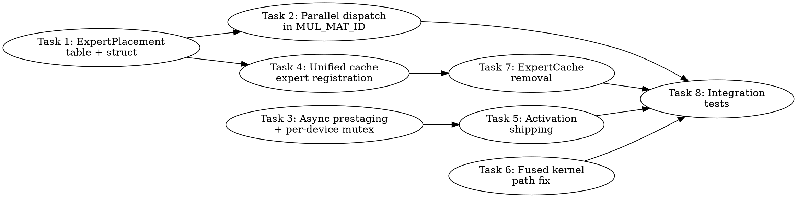

# MoE Expert Parallelism: Team Implementation Plan

> **For Claude:** REQUIRED SUB-SKILL: Use team-driven-development to implement this plan with agent teams.

**Goal:** Replace the dual ExpertCache/unified_cache expert system with a single unified path, then add multi-device parallel expert dispatch with activation shipping.

**Architecture:** All expert weights flow through the unified cache (host-pinned AOS canonical → device SOA hot cache). The ExpertPlacement table replaces ExpertCache lookups. MUL_MAT_ID dispatches experts to GPU0/GPU1/CPU in parallel based on where their weights reside.

**Tech Stack:** SYCL/DPC++, oneDNN, TBB, Intel Level Zero

**Design Document:** `docs/plans/2026-03-01-moe-expert-distribution.md`

---

## Team Topology

**Recommended implementers:** 3 (based on 3 parallel tracks)
**Reviewers:** 1 spec-reviewer, 1 quality-reviewer

### Parallel Tracks

| Track | Tasks | Description |
|-------|-------|-------------|
| A | 1, 4, 7 | ExpertPlacement + unified cache expert registration + ExpertCache removal |
| B | 2, 5 | Multi-device parallel dispatch in MUL_MAT_ID + activation shipping |
| C | 3, 6 | Async staging + oneDNN per-device mutex + fused kernel path fix |
| — | 8 | Integration tests (depends on all tracks) |

### Dependency Graph



### File Ownership Map

| File/Directory | Tasks | Conflict Risk |
|----------------|-------|---------------|
| `unified-cache.hpp` (new types only) | 1 | None (additive) |
| `unified-cache.cpp` (placement table methods) | 1, 4 | Sequential (same track) |
| `ggml-sycl.cpp:moe_hybrid_init_once` | 4 | None (single task) |
| `ggml-sycl.cpp:ggml_sycl_mul_mat_id` (lines 24054-25390) | 2 | None (single task) |
| `ggml-sycl.cpp:update_moe_ptr_table` (lines 18813-19086) | 3 | None (single task) |
| `ggml-sycl.cpp:mul_mat_id_fused` (lines 22815-22984) | 6 | None (single task) |
| `gemm.hpp` (mutex change) | 3 | None (single task) |
| `expert-cache.cpp/hpp` | 7 | None (deletion task) |
| `expert-prefetch.cpp/hpp` | 7 | None (refactor task) |
| `ggml-sycl.cpp:globals` (lines 229-284) | 2, 7 | Low (2 reads, 7 removes) |
| `CMakeLists.txt` | — | No edit needed (uses glob) |
| `tests/` | 8 | None (new files) |

---

## Task Details

### Task 1: ExpertPlacement Table Data Structures

**Track:** A
**Depends on:** None
**File scope:**
- Modify: `ggml/src/ggml-sycl/unified-cache.hpp` (add ~80 lines, new types section)
- Modify: `ggml/src/ggml-sycl/unified-cache.cpp` (add ~120 lines, placement table methods)
- Test: Build-only verification (types are consumed by later tasks)

**Description:**

Define the `ExpertPlacement` struct and `ExpertPlacementTable` class that will replace `ExpertCache::lookup()`. The placement table maps `(layer_id, expert_id)` → placement info (device, pointers, size, popularity). It is owned by the unified cache and populated during `moe_hybrid_init_once()` (Task 4).

This is the foundational data structure that all other tasks consume. It must be generic — no hardcoded model dimensions, device counts, or expert sizes.

**Acceptance Criteria:**

- [ ] `ExpertPlacement` struct defined with `device_id`, `device_ptr`, `host_ptr`, `weight_bytes`, `popularity_rank` fields
- [ ] `ExpertPlacementTable` class with `set()`, `get()`, `size()`, `n_layers()`, `n_experts()` methods
- [ ] Thread-safe (shared_mutex for concurrent reads during dispatch)
- [ ] O(1) lookup via hash map keyed on `(layer_id, expert_id)`
- [ ] No hardcoded dimensions — all sizes from constructor parameters
- [ ] Builds successfully with `ninja -C build`

**Implementation Guide:**

Add the following to `unified-cache.hpp`, after the `cache_layout_result` struct (around line 283):

```cpp
// --- Expert Placement Table (replaces ExpertCache::lookup) ---

struct ExpertPlacement {
    int    device_id      = -1;      // 0..n_gpu-1 for GPU, -1 = CPU-only
    void * device_ptr     = nullptr; // SOA device pointer (nullptr if CPU-only)
    void * host_ptr       = nullptr; // AOS host-pinned pointer (always valid after init)
    size_t weight_bytes   = 0;       // Per-expert weight size in bytes
    int    popularity_rank = -1;     // 0 = most popular, -1 = unranked
    bool   is_valid() const { return host_ptr != nullptr; }
};

class ExpertPlacementTable {
public:
    ExpertPlacementTable() = default;

    // Initialize with model dimensions (called once during moe_hybrid_init_once)
    void init(int n_layers, int n_experts_per_layer);

    // Set placement for a specific expert (called during registration)
    void set(int layer_id, int expert_id, const ExpertPlacement & placement);

    // Get placement (hot path — shared lock, O(1))
    ExpertPlacement get(int layer_id, int expert_id) const;

    // Update device pointer after SOA upload (Task 4)
    void set_device_ptr(int layer_id, int expert_id, int device_id, void * ptr);

    // Update popularity rank (called after warmup profiling)
    void set_popularity(int layer_id, int expert_id, int rank);

    // Query dimensions
    int  n_layers() const { return n_layers_; }
    int  n_experts() const { return n_experts_; }
    bool is_initialized() const { return n_layers_ > 0; }

    // Iteration for bulk operations (load, profile, eviction)
    // Returns all experts for a given layer, sorted by popularity_rank
    std::vector<std::pair<int, ExpertPlacement>> get_layer_experts(int layer_id) const;

private:
    // IMPORTANT: layer_id is a FNV-1a 32-bit hash — must use 64-bit key
    int64_t make_key(int layer_id, int expert_id) const {
        return (int64_t(layer_id) << 32) | int64_t(uint32_t(expert_id));
    }

    mutable std::shared_mutex                        mutex_;
    std::unordered_map<int64_t, ExpertPlacement>     table_;
    int                                          n_layers_  = 0;
    int                                          n_experts_ = 0;
};
```

Add to `unified-cache.cpp`, in a new section after the existing `prestage_routed_experts()`:

```cpp
// --- ExpertPlacementTable implementation ---

void ExpertPlacementTable::init(int n_layers, int n_experts_per_layer) {
    std::unique_lock lock(mutex_);
    n_layers_  = n_layers;
    n_experts_ = n_experts_per_layer;
    table_.reserve(static_cast<size_t>(n_layers) * n_experts_per_layer);
}

void ExpertPlacementTable::set(int layer_id, int expert_id,
                                const ExpertPlacement & placement) {
    std::unique_lock lock(mutex_);
    table_[make_key(layer_id, expert_id)] = placement;
}

ExpertPlacement ExpertPlacementTable::get(int layer_id, int expert_id) const {
    std::shared_lock lock(mutex_);
    auto it = table_.find(make_key(layer_id, expert_id));
    if (it != table_.end()) {
        return it->second;
    }
    return {};  // Invalid placement (device_id = -1, ptrs = nullptr)
}

void ExpertPlacementTable::set_device_ptr(int layer_id, int expert_id,
                                           int device_id, void * ptr) {
    std::unique_lock lock(mutex_);
    auto it = table_.find(make_key(layer_id, expert_id));
    if (it != table_.end()) {
        it->second.device_id  = device_id;
        it->second.device_ptr = ptr;
    }
}

void ExpertPlacementTable::set_popularity(int layer_id, int expert_id, int rank) {
    std::unique_lock lock(mutex_);
    auto it = table_.find(make_key(layer_id, expert_id));
    if (it != table_.end()) {
        it->second.popularity_rank = rank;
    }
}

std::vector<std::pair<int, ExpertPlacement>>
ExpertPlacementTable::get_layer_experts(int layer_id) const {
    std::shared_lock lock(mutex_);
    std::vector<std::pair<int, ExpertPlacement>> result;
    for (int e = 0; e < n_experts_; e++) {
        auto it = table_.find(make_key(layer_id, e));
        if (it != table_.end()) {
            result.push_back({e, it->second});
        }
    }
    std::sort(result.begin(), result.end(),
              [](const auto & a, const auto & b) {
                  return a.second.popularity_rank < b.second.popularity_rank;
              });
    return result;
}
```

Also add a global accessor to `unified-cache.hpp` (near line 1480, after `prestage_routed_experts`):

```cpp
// Global expert placement table (one per process, all devices share)
ExpertPlacementTable & get_expert_placement_table();
```

And in `unified-cache.cpp`:

```cpp
ExpertPlacementTable & get_expert_placement_table() {
    static ExpertPlacementTable table;
    return table;
}
```

**Commit:**

```bash
git add ggml/src/ggml-sycl/unified-cache.hpp ggml/src/ggml-sycl/unified-cache.cpp
git commit -m "sycl: add ExpertPlacement table data structures for unified MoE dispatch"
```

**Notes for implementer:**
- The `layer_id` here is the FNV hash used by the existing `ExpertCache` — NOT sequential. The `make_key()` function must handle these large hash values. Consider using `int64_t` or `uint64_t` if FNV hashes exceed 16-bit range (they do — they're 32-bit). Fix: `make_key` should concatenate the two ints into a 64-bit key.
- The `shared_mutex` is critical for TG performance — dispatch reads placement during every MUL_MAT_ID. Never hold exclusive lock during dispatch.
- Don't add `#include <shared_mutex>` if it's already included via `unified-cache.hpp`'s existing headers.
- Check the existing `expert_key` struct in `expert-cache.hpp` for reference on how layer/expert keys are composed.

---

### Task 2: Multi-Device Parallel Dispatch in MUL_MAT_ID

**Track:** B
**Depends on:** Task 1 (ExpertPlacement table)
**File scope:**
- Modify: `ggml/src/ggml-sycl/ggml-sycl.cpp` lines 24976-25133 (hybrid dispatch partition)
- Modify: `ggml/src/ggml-sycl/ggml-sycl.cpp` lines 25138-25390 (GPU dispatch paths)
- Test: Correctness via `llama-completion` with GPT-OSS 120B

**Description:**

Replace the hardcoded 2-GPU partition logic (B580/B50) with a generic N-device dispatch that reads from the ExpertPlacement table. Currently the code has separate `gpu_entries`, `gpu1_entries`, `cpu_entries` vectors with hardcoded `expert_cache` and `expert_cache1` lookups. Replace with a dynamic `vector<vector<ExpertWork>> gpu_work(n_gpu)` plus `cpu_work`, driven by placement table queries.

The ExpertCache lookups at lines 25062-25112 are replaced with `get_expert_placement_table().get(layer_id, expert_id)`. The partition decision becomes: `if (placement.device_id >= 0) → gpu_work[placement.device_id]` else `→ cpu_work`.

**Acceptance Criteria:**

- [ ] Dispatch uses `ExpertPlacementTable::get()` instead of `ExpertCache::lookup()`
- [ ] Works with 1, 2, or N GPU devices (no hardcoded device indices)
- [ ] CPU fallback for experts with `device_id == -1` or no device pointer
- [ ] GPU dispatch paths per device use that device's queue (not hardcoded `ctx.stream()`)
- [ ] Existing `dispatch_cpu_and_scatter()` helper reused for CPU path
- [ ] Access score updates go to placement table, not ExpertCache
- [ ] Regression test: `ONEAPI_DEVICE_SELECTOR=level_zero:0 llama-completion -m mistral-7b-v0.1.Q4_0.gguf -p '1, 2, 3, 4, 5,' -n 15 --seed 42 --temp 0` still works (non-MoE model)

**Implementation Guide:**

In `ggml-sycl.cpp`, replace the standard hybrid path (lines 24997-25133) with:

```cpp
// ---------------------------------------------------------------
// Standard hybrid path: placement-table-driven multi-device dispatch
// ---------------------------------------------------------------

// --- Expert prediction + prefetch (unchanged from existing code) ---
auto & prefetcher = g_expert_prefetchers[ctx.device];
auto & predictor  = g_expert_predictors[ctx.device];
// ... (keep existing prediction/prefetch logic at lines 25002-25057)

// --- Partition by device using placement table ---
auto & placement_table = get_expert_placement_table();
const int n_gpu = ggml_sycl_info().device_count;

// Per-device work lists (generic N-device, not hardcoded 2)
std::vector<std::vector<expert_dispatch_entry>> per_gpu_entries(n_gpu);
std::vector<expert_dispatch_entry> cpu_entries;

for (int64_t iid1 = 0; iid1 < ids->ne[1]; iid1++) {
    for (int64_t id = 0; id < n_ids; id++) {
        const int32_t i02 = ids_host[static_cast<size_t>(iid1 * n_ids + id)];
        GGML_ASSERT(i02 >= 0 && i02 < n_as);

        auto placement = placement_table.get(layer_id, i02);

        if (placement.device_id >= 0 && placement.device_id < n_gpu
            && placement.device_ptr != nullptr) {
            per_gpu_entries[placement.device_id].push_back(
                { iid1, id, i02, placement.device_ptr });
        } else {
            // CPU fallback: host_ptr from placement table, or raw mmap
            cpu_entries.push_back({ iid1, id, i02, nullptr });
        }
    }
}

GGML_SYCL_DEBUG("[MoE-PARALLEL] L%d:", layer_id);
for (int d = 0; d < n_gpu; d++) {
    GGML_SYCL_DEBUG(" GPU%d=%zu", d, per_gpu_entries[d].size());
}
GGML_SYCL_DEBUG(" CPU=%zu\n", cpu_entries.size());

// --- CPU path (reuse existing dispatch_cpu_and_scatter helper) ---
dispatch_cpu_and_scatter(cpu_entries);

// --- GPU paths (dispatch per device) ---
// Primary GPU (device 0): batched MMVQ, same as existing gpu_entries path
if (!per_gpu_entries[0].empty()) {
    // ... (reuse existing GPU0 batched MMVQ dispatch at lines 25142-25370)
}

// Secondary GPUs (device 1+): dispatch via activation shipping (Task 5)
for (int d = 1; d < n_gpu; d++) {
    if (!per_gpu_entries[d].empty()) {
        dispatch_experts_secondary_gpu(ctx, d, per_gpu_entries[d],
                                        src0, src1, dst, nb1, nb2,
                                        K, N, n_ids);
    }
}
```

The `dispatch_experts_secondary_gpu()` function is a stub in this task (calls `dispatch_cpu_and_scatter` as fallback). Task 5 fills it in with actual activation shipping.

**Commit:**

```bash
git add ggml/src/ggml-sycl/ggml-sycl.cpp
git commit -m "sycl: replace ExpertCache partition with placement-table-driven N-device dispatch"
```

**Notes for implementer:**
- The existing `gpu_entries` variable at line 25065 uses `expert_dispatch_entry { iid1, id, expert_id, cached_ptr }`. Reuse this struct.
- Keep `g_expert_caches` reads as a fallback path under `#ifdef GGML_SYCL_LEGACY_EXPERT_CACHE` (this ifdef is added in Task 7).
- The FNV-hash `layer_id` is already computed at line 24535. Pass it directly to `placement_table.get()`.
- Don't remove the `expert_cache->update_score()` calls yet — Task 7 handles that.
- Non-MoE models never enter this code path (guarded by `use_expert_cache` check at line 24538).

---

### Task 3: Async Prestaging + Per-Device oneDNN Mutex

**Track:** C
**Depends on:** None
**File scope:**
- Modify: `ggml/src/ggml-sycl/ggml-sycl.cpp` lines 18813-19086 (`update_moe_ptr_table`)
- Modify: `ggml/src/ggml-sycl/unified-cache.cpp` lines 6135-6170 (`prestage_routed_experts`)
- Modify: `ggml/src/ggml-sycl/gemm.hpp` lines 229-235 (mutex)
- Test: Build + performance comparison with MoE model

**Description:**

Two independent improvements:

**3a: Async prestaging.** Remove the `(void) queue_ptr;` in `prestage_routed_experts()` (unified-cache.cpp:6154) and actually use the queue for async H2D. The current code calls `ensure_cached_layout()` which does a synchronous `.wait()` per expert. Instead, collect all fill events and return them to the caller.

**3b: Per-device oneDNN mutex.** The current `DnnlGemmWrapper::exec_mutex()` in `gemm.hpp:229` returns a single shared mutex for ALL GPU devices. This serializes B580 and B50 GEMM dispatch. Make it per-device so multi-GPU expert dispatch can overlap.

**Acceptance Criteria:**

- [ ] `prestage_routed_experts()` uses `queue_ptr` for async staging (no more `(void) queue_ptr;`)
- [ ] `update_moe_ptr_table()` uses `depends_on(staging_events)` instead of `stream->wait()` at line 18852
- [ ] `DnnlGemmWrapper::exec_mutex()` returns per-device mutex based on queue's device ID
- [ ] No regression on Mistral 7B PP512/TG128 performance
- [ ] GPU doesn't hang waiting for staging completion

**Implementation Guide:**

**3a: Async prestaging** — In `unified-cache.cpp`, around line 6154:

```cpp
// BEFORE:
(void) queue_ptr;  // queue_ptr is UNUSED, staging is sync
// ... loop calls ensure_cached_layout() with synchronous wait

// AFTER:
sycl::queue * staging_queue = static_cast<sycl::queue *>(queue);
std::vector<sycl::event> staging_events;
// ... loop calls ensure_cached_layout() which returns cache_layout_result
// Collect result.event into staging_events
// Return staging_events to caller via prestage_result extension
```

**3b: Per-device mutex** — In `gemm.hpp`, around line 229:

```cpp
// BEFORE:
static std::mutex & exec_mutex(const queue_ptr & q) {
    return (q == ggml_sycl_get_cpu_queue()) ? exec_mutex_cpu() : exec_mutex_gpu();
}

// AFTER:
static std::mutex & exec_mutex(const queue_ptr & q) {
    if (q == ggml_sycl_get_cpu_queue()) return exec_mutex_cpu();
    // Per-GPU device mutex (allows parallel B580+B50 GEMM)
    static std::array<std::mutex, GGML_SYCL_MAX_DEVICES> gpu_mutexes;
    int dev_id = ggml_sycl_get_device_id_from_queue(q);
    return gpu_mutexes[std::min(dev_id, (int)gpu_mutexes.size() - 1)];
}
```

**Commit:**

```bash
git add ggml/src/ggml-sycl/ggml-sycl.cpp ggml/src/ggml-sycl/unified-cache.cpp \
       ggml/src/ggml-sycl/gemm.hpp
git commit -m "sycl: make prestaging async and oneDNN mutex per-device for MoE parallelism"
```

**Notes for implementer:**
- `ensure_cached_layout()` already returns a `cache_layout_result` with an `event` field (unified-cache.hpp:274). Currently the event is `.wait()`'d synchronously inside the function at line 3068 of unified-cache.cpp. Making this truly async requires also making the fill execution async — may need a new `ensure_cached_layout_async()` variant, or a `bool async` parameter.
- For `update_moe_ptr_table()`: replace the `stream->wait()` at line 18852 with collecting events from `ensure_cached_layout()` and using `depends_on(events)` on the subsequent kernel submission. The pointer table H2D copy (line 19068) must depend on all staging events.
- Do NOT use `ext_oneapi_submit_barrier()` — known to corrupt Level Zero event state. Use `depends_on(event)` on the H2D memcpy submission instead.
- `dpct::dev_mgr::instance().get_device_id()` does NOT exist in this codebase (no DPCT). Use `ggml_sycl_get_device_id_from_queue()` from compute-buffer-manager.cpp:22, or hash the `sycl::device` object.

---

### Task 4: Unified Cache Expert Registration

**Track:** A
**Depends on:** Task 1 (ExpertPlacement table)
**File scope:**
- Modify: `ggml/src/ggml-sycl/ggml-sycl.cpp` lines 289-631 (`moe_hybrid_init_once`)
- Modify: `ggml/src/ggml-sycl/unified-cache.cpp` (new registration helper)
- Test: Model load with GPT-OSS 120B, verify placement table populated

**Description:**

Modify `moe_hybrid_init_once()` to register ALL expert weights through the unified cache and populate the ExpertPlacement table, instead of calling `ExpertCache::register_expert()`. The flow:

1. Scan graph for MUL_MAT_ID nodes (existing code at line 351)
2. For each expert: call `host_cache::ensure_cached_alloc()` with `MOE_EXPERT` type to pin in host memory
3. For hot experts (popularity ranked): call `unified_cache::ensure_cached_layout()` to upload SOA to VRAM
4. Populate `ExpertPlacementTable` with device/host pointers and metadata

This task also determines GPU expert slot capacity at runtime: `slots_per_device = (vram_free - reserved) / expert_bytes`.

**Acceptance Criteria:**

- [ ] `ExpertPlacementTable` is fully populated after `moe_hybrid_init_once()` completes
- [ ] All experts have valid `host_ptr` (pinned or mmap alias)
- [ ] Hot experts have valid `device_ptr` (SOA in VRAM)
- [ ] Slot count is computed from runtime VRAM query, not hardcoded
- [ ] Model load completes without OOM crash for GPT-OSS 120B
- [ ] Debug logging shows placement summary (N on GPU0, M on GPU1, K on CPU)
- [ ] Dense Mistral 7B load is unaffected (no MUL_MAT_ID nodes → skip)

**Implementation Guide:**

Replace the `cache.register_expert()` calls in `moe_hybrid_init_once()` (around line 495) with:

```cpp
// Step 1: Initialize placement table
auto & placement_table = get_expert_placement_table();
placement_table.init(n_moe_layers, n_experts);

// Step 2: Register all experts in host cache (pinned AOS)
auto * cache = get_unified_cache_for_device(0);  // Primary device cache
for (int layer = 0; layer < n_moe_layers; layer++) {
    int hash_layer_id = moe_layer_ids[layer];  // FNV hash from existing scan
    for (int e = 0; e < n_experts; e++) {
        const void * mmap_ptr = expert_host_ptrs[layer][e];  // existing
        size_t expert_bytes = expert_sizes[layer];             // nb02 from scan

        ggml_sycl_cache_id key = ggml_sycl_get_moe_expert_cache_key_from_parts(
            model_id, hash_layer_id, e, expert_bytes);

        bool needs_fill = false;
        bool pinned = false;
        cache_location location;
        void * host_ptr = cache->ensure_cached_alloc(
            key, mmap_ptr, expert_bytes, expert_bytes,
            cache_entry_type::MOE_EXPERT, hash_layer_id, e,
            GGML_LAYOUT_AOS, false, &needs_fill, &pinned, &location, nullptr);

        if (needs_fill && host_ptr) {
            memcpy(host_ptr, mmap_ptr, expert_bytes);
        }

        ExpertPlacement placement{};
        placement.device_id    = -1;  // CPU-only initially
        placement.host_ptr     = host_ptr ? host_ptr : const_cast<void*>(mmap_ptr);
        placement.weight_bytes = expert_bytes;
        placement_table.set(hash_layer_id, e, placement);
    }
}

// Step 3: Compute VRAM slots per device and upload hot experts
for (int dev = 0; dev < n_gpu; dev++) {
    auto * cache = get_unified_cache(dev);
    size_t vram_free = 0, vram_total = 0;
    dpct::dev_mgr::instance().get_device(dev)
        .get_device_info().get_device_mem_alloc_size(&vram_free);
    // Or: dpct::dev_mgr::get_memory_info(dev, &vram_free, &vram_total);

    size_t reserved = cache->reserved_bytes();
    size_t available = (vram_free > reserved) ? vram_free - reserved : 0;
    int slots = static_cast<int>(available / expert_bytes_max);

    fprintf(stderr, "[MoE-INIT] Device %d: %zu MB available, %d expert slots "
                    "(%zu MB each)\n", dev, available >> 20, slots,
                    expert_bytes_max >> 20);

    // Upload top-N experts by uniform distribution initially
    // (runtime profiling can rerank later)
    int uploaded = 0;
    for (int layer = 0; layer < n_moe_layers && uploaded < slots; layer++) {
        int hash_layer_id = moe_layer_ids[layer];
        for (int e = 0; e < n_experts && uploaded < slots; e++) {
            auto p = placement_table.get(hash_layer_id, e);
            if (p.device_id >= 0) continue;  // Already on another GPU

            // Upload to device SOA
            // ... call ensure_cached_layout() with fill_fn for SOA reorder
            // ... on success, update placement_table.set_device_ptr()
            uploaded++;
        }
    }
}
```

**Commit:**

```bash
git add ggml/src/ggml-sycl/ggml-sycl.cpp ggml/src/ggml-sycl/unified-cache.cpp
git commit -m "sycl: register MoE experts via unified cache and populate placement table"
```

**Notes for implementer:**
- Keep the existing `ExpertCache::register_expert()` calls under `#ifdef GGML_SYCL_LEGACY_EXPERT_CACHE` for now (Task 7 removes them).
- `ggml_sycl_get_moe_expert_cache_key()` exists at lines 3229-3276. Uses `name_hash + cache_uuid + expert_id` via `ggml_sycl_hash_combine()`. May need a variant that doesn't require a `ggml_tensor*`.
- `get_shared_host_cache()` does NOT exist. Access the host cache through `get_unified_cache_for_device(dev)` (unified-cache.hpp:1069) or follow the existing pattern in `moe_hybrid_init_once()` which uses `ExpertCache::register_expert()` (to be replaced).
- The `expert_host_ptrs[layer][e]` and `expert_sizes[layer]` arrays are already computed in the existing `moe_hybrid_init_once()` loop at lines 351-495. Reuse those.
- Initial popularity is uniform (expert 0 = rank 0, expert 127 = rank 127). The existing `ExpertPredictor::record_access_batch()` will provide actual frequency data after warmup.

---

### Task 5: Activation Shipping for Secondary GPUs

**Track:** B
**Depends on:** Task 3 (async staging + per-device mutex)
**File scope:**
- Modify: `ggml/src/ggml-sycl/ggml-sycl.cpp` (new function `dispatch_experts_secondary_gpu`)
- Test: Correctness with `ONEAPI_DEVICE_SELECTOR="level_zero:0,1"`

**Description:**

Implement the `dispatch_experts_secondary_gpu()` function stubbed in Task 2. For each expert assigned to a secondary GPU:

1. Copy the activation vector (tiny: `K * sizeof(float)`) from primary GPU to a host-pinned staging buffer (D2H)
2. Copy from host-pinned staging to the secondary GPU's device memory (H2D)
3. Dispatch GEMM on the secondary GPU's queue using weights already in that device's VRAM
4. Copy the result back (tiny: `N * sizeof(float)`) from secondary GPU to host-pinned staging
5. Copy from host-pinned staging to primary GPU's destination tensor (H2D to primary)

Use the existing ring-buffered staging pattern from tensor split (`g_split_staging`, `MERGE_RING_SIZE`) to prevent data races between overlapping MoE layers.

**Acceptance Criteria:**

- [ ] Activation shipping works for arbitrarily-sized activations (K * sizeof(float), from tensor metadata)
- [ ] Results are scattered to correct positions in the output tensor
- [ ] No cross-device `depends_on` on OOQ (known broken on Level Zero) — use in-order queues
- [ ] Ring-buffered staging prevents data races across layers
- [ ] Host-pinned staging buffers allocated once and reused
- [ ] Correct output verified via `llama-completion` deterministic test

**Implementation Guide:**

```cpp
// New function in ggml-sycl.cpp, near the existing GPU1 dispatch at lines 25200+

static void dispatch_experts_secondary_gpu(
    ggml_backend_sycl_context & ctx,
    int                         target_device,
    const std::vector<expert_dispatch_entry> & entries,
    const ggml_tensor * src0,
    const ggml_tensor * src1,
    ggml_tensor *       dst,
    int64_t nb1, int64_t nb2,
    int64_t K, int64_t N, int64_t n_ids)
{
    if (entries.empty()) return;

    // Get secondary device queue (in-order — critical for cross-device correctness)
    auto & dev = dpct::dev_mgr::instance().get_device(target_device);
    sycl::queue * secondary_q = &dev.default_queue();

    // Ring-buffered staging (reuse tensor split pattern)
    static constexpr int RING_SIZE = 8;
    static thread_local int ring_idx = 0;
    static thread_local float * act_staging[RING_SIZE] = {};
    static thread_local float * out_staging[RING_SIZE] = {};

    // Lazy init staging buffers (host-pinned, accessible by all devices)
    int slot = ring_idx++ % RING_SIZE;
    if (!act_staging[slot]) {
        act_staging[slot] = (float *)sycl::malloc_host(
            K * sizeof(float), secondary_q->get_context(), secondary_q->get_device());
        out_staging[slot] = (float *)sycl::malloc_host(
            N * sizeof(float), secondary_q->get_context(), secondary_q->get_device());
    }

    // For each expert on secondary GPU:
    for (const auto & entry : entries) {
        // 1. D2H: activation from primary GPU → host-pinned staging
        const float * src1_device = /* get src1 device ptr for this token */;
        ctx.stream()->memcpy(act_staging[slot], src1_device, K * sizeof(float));
        ctx.stream()->wait();  // Must complete before secondary reads

        // 2. H2D: host-pinned staging → secondary GPU (no cross-device dep needed)
        // The staging buffer is host-pinned (malloc_host) — secondary GPU reads via PCIe

        // 3. Dispatch GEMM on secondary queue
        // entry.cached_ptr is the SOA device pointer on target_device
        // Use MMVQ kernel or oneDNN GEMM depending on batch size
        // K and N come from src0->ne[0] and src0->ne[1]

        // 4. D2H result: secondary GPU → host-pinned staging
        secondary_q->memcpy(out_staging[slot], /* result ptr */, N * sizeof(float));
        secondary_q->wait();

        // 5. H2D scatter: host-pinned staging → primary GPU dst
        char * dst_d = (char *)dst->data + entry.iid1 * nb1 + entry.id * nb2;
        ctx.stream()->memcpy(dst_d, out_staging[slot], N * sizeof(float));
    }
}
```

**Commit:**

```bash
git add ggml/src/ggml-sycl/ggml-sycl.cpp
git commit -m "sycl: implement activation shipping for multi-GPU MoE expert dispatch"
```

**Notes for implementer:**
- `sycl::malloc_host` with the secondary queue's context ensures the staging buffer is accessible by both GPUs. On Level Zero, `malloc_host` from any context is accessible by all devices via PCIe zero-copy.
- For the GEMM on secondary GPU: the simplest path is to reuse the existing MMVQ kernel dispatch code, passing the secondary queue. The key insight is that `entry.cached_ptr` already points to SOA weights in the secondary GPU's VRAM.
- The initial implementation does `stream->wait()` between D2H and secondary GEMM. This is correct but suboptimal — a more advanced version could overlap multiple expert computations with activation transfers.
- The output scatter (step 5) goes through the primary GPU's in-order queue, which is correct for cross-device data visibility.
- Ring buffer size 8 should be sufficient — there are at most `top_k` (typically 2-8) active experts per layer.

---

### Task 6: Fused Kernel Path Fix for Unified Cache Weights

**Track:** C
**Depends on:** None (but benefits from Task 4's placement table)
**File scope:**
- Modify: `ggml/src/ggml-sycl/ggml-sycl.cpp` lines 22815-22984 (`ggml_sycl_mul_mat_id_fused`)
- Test: PP performance with GPT-OSS 120B

**Description:**

Fix the fused MoE kernel path (`ggml_sycl_mul_mat_id_fused()`) to accept unified-cache-managed device pointers. Currently it rejects any weights that aren't `sycl::usm::alloc::device` (line 22899), but mmap'd weights return `unknown`. After Task 4, expert weights in VRAM are `sycl::malloc_device` (device USM), so the fused path should work.

The fix is to check the placement table first: if `placement.device_ptr != nullptr`, the weights are in device VRAM and can be used by the fused kernel.

**Acceptance Criteria:**

- [ ] Fused kernel path accepts unified-cache-managed device pointers
- [ ] PP batch > 1 uses fused kernel when all active experts are device-resident
- [ ] Falls back to MMVQ path when any expert is CPU-only
- [ ] No regression on PP performance for Mistral 7B (non-MoE, never hits this path)

**Implementation Guide:**

In `ggml_sycl_mul_mat_id_fused()` at line 22899:

```cpp
// BEFORE:
// Check that all expert weights are in device memory
for (int e = 0; e < n_as; e++) {
    const void * expert_ptr = (const char *)src0->data + e * nb02;
    if (sycl::get_pointer_type(expert_ptr, sycl_ctx) != sycl::usm::alloc::device) {
        return false;  // Can't fuse — weights not on device
    }
}

// AFTER:
// Check placement table — all active experts must be device-resident
auto & placement_table = get_expert_placement_table();
if (placement_table.is_initialized()) {
    // Verify all routed experts have device pointers
    for (int64_t iid1 = 0; iid1 < ids->ne[1]; iid1++) {
        for (int64_t id = 0; id < n_ids; id++) {
            const int32_t expert_id = ids_host[iid1 * n_ids + id];
            auto placement = placement_table.get(layer_id, expert_id);
            if (!placement.device_ptr) {
                return false;  // Expert not in VRAM — can't fuse
            }
        }
    }
    // All experts device-resident — build pointer array from placement table
    // instead of src0->data offsets
}
```

Also update the expert weight pointer construction to use `placement.device_ptr` (SOA) instead of `src0->data + e * nb02` (mmap AOS).

**Commit:**

```bash
git add ggml/src/ggml-sycl/ggml-sycl.cpp
git commit -m "sycl: enable fused MoE kernel for unified-cache device-resident experts"
```

**Notes for implementer:**
- The `layer_id` variable must be computed before this function is called. Check if `moe_cache_layer_id(src0->name)` is available in this scope. If not, add it.
- The fused kernel currently reads expert weights as contiguous blocks at `src0->data + e * nb02`. With the placement table, each expert has its own `device_ptr`. The kernel launch must be adapted to use a pointer array (`void * expert_ptrs[n_as]`) instead of base+stride.
- For MXFP4 SOA kernels (`launch_fused_moe_mxfp4_soa`), the weights are already expected in SOA layout — which is what the unified cache provides. This should be a straightforward pointer substitution.
- If `placement_table.is_initialized()` is false (non-MoE model), fall through to the existing check.

---

### Task 7: ExpertCache Removal and Code Cleanup

**Track:** A
**Depends on:** Task 4 (unified cache expert registration)
**File scope:**
- Delete: `ggml/src/ggml-sycl/expert-cache.cpp`
- Delete: `ggml/src/ggml-sycl/expert-cache.hpp`
- Modify: `ggml/src/ggml-sycl/ggml-sycl.cpp` (remove ~15 ExpertCache references)
- Modify: `ggml/src/ggml-sycl/expert-prefetch.cpp` (remove ExpertCache dependency)
- Modify: `ggml/src/ggml-sycl/expert-prefetch.hpp` (remove ExpertCache dependency)
- Modify: `ggml/src/ggml-sycl/unified-cache.hpp` (update comment)
- Modify: `ggml/src/ggml-sycl/CMakeLists.txt` (remove expert-cache.cpp from build)
- Test: Full test suite + correctness verification

**Description:**

Remove the `ExpertCache` class entirely now that all expert management goes through the unified cache + placement table. This is a two-step process:

1. First commit: Add `#ifdef GGML_SYCL_LEGACY_EXPERT_CACHE` around all ExpertCache code. Build without the define to verify nothing breaks.
2. Second commit: Delete the guarded code, delete the files, update CMakeLists.txt.

Also refactor `ExpertPrefetcher` to use the unified cache instead of `ExpertCache`. The `ExpertPredictor` is already independent of ExpertCache (uses only `last_experts_`, `freq_table_`).

**Acceptance Criteria:**

- [ ] `expert-cache.cpp` and `expert-cache.hpp` deleted
- [ ] `ExpertPrefetcher` uses unified cache `ensure_cached_layout()` for async prefetch (instead of `ExpertCache::prefetch_async()`)
- [ ] `ExpertPredictor` unchanged (already independent)
- [ ] All `g_expert_caches[]` references removed from `ggml-sycl.cpp`
- [ ] `CMakeLists.txt` no longer lists `expert-cache.cpp`
- [ ] No compile errors, no link errors
- [ ] Correctness verified: `llama-completion` deterministic test with GPT-OSS 120B
- [ ] No performance regression on Mistral 7B (non-MoE, should be unaffected)

**Implementation Guide:**

**Step 1: Ifdef guard**

In `ggml-sycl.cpp`, wrap ExpertCache references:

```cpp
// Line 223: conditional include
#ifdef GGML_SYCL_LEGACY_EXPERT_CACHE
#include "ggml-sycl/expert-cache.hpp"
#endif

// Line 233: conditional globals
#ifdef GGML_SYCL_LEGACY_EXPERT_CACHE
static ggml_sycl::ExpertCache g_expert_caches[GGML_SYCL_MAX_DEVICES];
static ggml_sycl::ExpertCache * ggml_sycl_get_expert_cache(int device) { ... }
static void ggml_sycl_init_expert_cache(int device, ...) { ... }
#endif

// Lines 25062-25063: conditional lookup
#ifdef GGML_SYCL_LEGACY_EXPERT_CACHE
auto * expert_cache  = ggml_sycl_get_expert_cache(ctx.device);
auto * expert_cache1 = g_moe_multi_gpu_active ? ggml_sycl_get_expert_cache(1) : nullptr;
#endif
```

Similarly in `expert-prefetch.hpp`:
```cpp
#ifdef GGML_SYCL_LEGACY_EXPERT_CACHE
#include "expert-cache.hpp"
// ... ExpertCache * cache_ member
#endif
```

Build: `ninja -C build` (must succeed without define).

**Step 2: Delete and clean**

```bash
rm ggml/src/ggml-sycl/expert-cache.cpp ggml/src/ggml-sycl/expert-cache.hpp
```

CMakeLists.txt uses `file(GLOB GGML_SOURCES_SYCL "*.cpp")` — deleting the .cpp file is sufficient, no CMakeLists.txt edit needed.

Remove all `#ifdef GGML_SYCL_LEGACY_EXPERT_CACHE` blocks (they're dead code now).

Refactor `ExpertPrefetcher`:
- Replace `ExpertCache * cache_` member with a reference to the unified cache
- `hint()` calls `unified_cache::ensure_cached_layout()` on the OOQ instead of `ExpertCache::prefetch_async()`
- `await()` waits on the `cache_layout_result.event` instead of `ExpertCache::prefetch_async()` event

**Commits:**

```bash
# Step 1
git add ggml/src/ggml-sycl/ggml-sycl.cpp ggml/src/ggml-sycl/expert-prefetch.hpp \
       ggml/src/ggml-sycl/expert-prefetch.cpp
git commit -m "sycl: ifdef-guard ExpertCache code for removal validation"

# Step 2
git add -A ggml/src/ggml-sycl/
git commit -m "sycl: remove ExpertCache, refactor ExpertPrefetcher to unified cache"
```

**Notes for implementer:**
- There are 6+ locations in ggml-sycl.cpp referencing ExpertCache globals. Use `grep -n 'expert_cache' ggml/src/ggml-sycl/ggml-sycl.cpp` to find them all. The plan doc (Phase 2e) lists exact line numbers.
- The `ExpertPrefetcher::hint()` method currently calls `cache_->prefetch_async(layer, expert, *dma_queue_)`. The unified cache equivalent is `ensure_cached_layout(request, deps)` where `request.layout = GGML_LAYOUT_SOA` and the fill_fn does AOS→SOA reorder.
- `ExpertPredictor` does NOT depend on ExpertCache at all — its `predict()`, `record_actual()`, and `predict_pregate()` methods use only internal state (`last_experts_`, `freq_table_`, `gate_weight_ptrs_`). Leave it completely unchanged.
- `PinnedBufferPool` (expert-cache.hpp:316-362) IS used by dispatch_cpu_and_scatter for activation/output staging. Must be moved to a separate header (e.g. `pinned-buffer-pool.hpp`) before deleting expert-cache.hpp.
- `CpuExpertPool` is ALREADY in its own file `cpu-expert-pool.hpp:32` (NOT in expert-cache.hpp). No need to move it.

---

### Task 8: Integration Tests and End-to-End Verification

**Track:** — (convergence point)
**Depends on:** Tasks 2, 5, 6, 7
**File scope:**
- Create: `tests/test-sycl-moe-expert-parallelism.cpp`
- Test: All verification commands from the plan doc

**Description:**

Write and run the full integration test suite for MoE expert parallelism. This includes:

1. **Correctness test**: Deterministic output from `llama-completion` with GPT-OSS 120B matches expected sequence
2. **Multi-device test**: B580 + B50 parallel dispatch produces correct results
3. **CPU fallback test**: Experts not in VRAM correctly dispatched to CPU
4. **Regression test**: Mistral 7B PP512/TG128 performance not degraded
5. **Placement table test**: Verify expert distribution across devices matches expectations

Also run the de-risking tests from the plan doc (Test 1-5) if not already executed.

**Acceptance Criteria:**

- [ ] GPT-OSS 120B produces coherent text output (not garbage)
- [ ] Multi-GPU dispatch logs show experts on GPU0, GPU1, and CPU
- [ ] Mistral 7B: PP512 >= 1300 tok/s, TG128 >= 68 tok/s (no regression)
- [ ] No SEGFAULT, no hangs, no OOM crashes
- [ ] All `ctest` tests pass

**Implementation Guide:**

Run the following verification commands (from the plan doc):

```bash
source /opt/intel/oneapi/setvars.sh --force

# 1. Correctness (single GPU, deterministic)
ONEAPI_DEVICE_SELECTOR=level_zero:0 ./build/bin/llama-completion \
  -m /Storage/GenAI/models/gpt-oss-120b-mxfp4-00001-of-00003.gguf \
  -p "The capital of France is" -n 20 --seed 42 --temp 0
# Expected: coherent continuation

sleep 60

# 2. Multi-device expert parallelism
ONEAPI_DEVICE_SELECTOR="level_zero:0,1" ./build/bin/llama-completion \
  -m /Storage/GenAI/models/gpt-oss-120b-mxfp4-00001-of-00003.gguf \
  -p "1, 2, 3, 4, 5," -n 15 --seed 42 --temp 0
# Expected: "6, 7, 8, 9, 10"

sleep 60

# 3. Performance benchmark
ONEAPI_DEVICE_SELECTOR="level_zero:0,1" ./build/bin/llama-bench \
  -m /Storage/GenAI/models/gpt-oss-120b-mxfp4-00001-of-00003.gguf \
  -c 4096 -n 32
# Target: TG > 15 tok/s

sleep 60

# 4. Regression check (non-MoE model)
ONEAPI_DEVICE_SELECTOR=level_zero:0 ./build/bin/llama-bench \
  -m /Storage/GenAI/models/mistral-7b-v0.1.Q4_0.gguf -p 512 -n 128
# Target: PP512 >= 1300, TG128 >= 68

# 5. Unit tests
ctest --test-dir build --output-on-failure -j $(nproc)
```

**Commit:**

```bash
git add tests/test-sycl-moe-expert-parallelism.cpp
git commit -m "test: add MoE expert parallelism integration tests"
```

**Notes for implementer:**
- Wait 60 seconds between GPU benchmarks to avoid thermal throttling on Arc B580 (known issue — see MEMORY.md).
- The GPT-OSS 120B model is a 3-part split GGUF. Use the first shard path; llama.cpp auto-discovers the other shards.
- If multi-device test hangs, try with `GGML_SYCL_DEBUG=1` to see where dispatch stalls. Check that cross-device memcpy uses in-order queue (known Level Zero OOQ issue).
- Performance targets are estimates from the architecture plan. If TG is below 15 tok/s but above 8 tok/s, that's still significant progress over the 3.1 tok/s baseline.

---

## Build and Verify

```bash
# Full rebuild after all tasks
source /opt/intel/oneapi/setvars.sh --force
cmake -B build -G Ninja -DGGML_SYCL=ON -DGGML_SYCL_TARGET=INTEL \
  -DCMAKE_C_COMPILER=icx -DCMAKE_CXX_COMPILER=icpx
ninja -C build -j $(nproc)
ctest --test-dir build --output-on-failure -j $(nproc)
```
