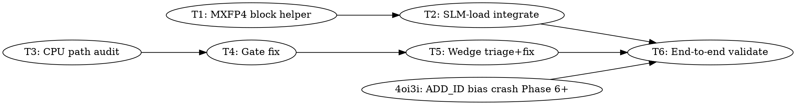

# MXFP4 Compute Parity Implementation Plan

> **For Claude:** REQUIRED SUB-SKILL: Use team-driven-development to implement this plan with agent teams.

**Goal:** Bring MXFP4 to parity with Q4_0 across the SYCL backend — GPU unified-kernel vectorized dequant, CPU compute path completeness, and GPT-OSS 20B running end-to-end across a range of VRAM budgets without wedging the GPU.

**Architecture:** Three parallel workstreams. (A) Port the Phase C Q4_0 per-block dequant-vectorization pattern (`dequant_q4_0_block_half8`) to MXFP4 inside `unified_matmul_xmx_kernel_impl` and its `_slm_only` companion. (B) Close gaps in the CPU compute path for MXFP4 (dense + MoE), and fix the dispatch gates that currently let host-resident MXFP4 weights re-enter a GPU code path — which is the known wedge trigger. (C) Convergence validation on GPT-OSS 20B at 100% / 50% / 0% VRAM budgets with perf characterization.

**Tech Stack:** C++ / SYCL (icpx), Intel oneAPI 2025.3, Arc Battlemage B580 (Xe2), oneDNN, ggml/llama.cpp, beads for task tracking.

**Context commits on branch `feature/sycl-coalescing`:**
- `ebb599670` Phase A — GGML_SYCL_XMX_DETAIL instrumentation
- `3bc6b0fd9` Phase B — env-gated XMX tile override (big = 64×64×32)
- `07a93ed85` Phase E — route SKIP_ONEDNN_Q4_0 through unified kernel
- `0c688943b` Phase C — vectorized per-block Q4_0 dequant (Q4_0 helper at `unified-kernel.cpp:460-519`)

---

## Team Topology

**Recommended implementers:** 3 (3 parallel tracks)
**Reviewers:** 1 spec-reviewer, 1 quality-reviewer

### Parallel Tracks

| Track | Tasks | Description |
|-------|-------|-------------|
| A | 1, 2 | GPU unified kernel: MXFP4 block-vectorized dequant helper + SLM-load integration |
| B | 3, 4, 5 | CPU path: audit, fix dispatch gates, triage + fix GPT-OSS wedge |
| — | 6 | End-to-end validation on GPT-OSS 20B (convergence) |

### Dependency Graph



**Scope amendment (2026-04-17)**: Per user direction, `llama.cpp-4oi3i` (GPT-OSS 20B MoE ADD_ID bias staging crash, Phase 6+ remaining) is absorbed into this epic as a blocker on T6. T5 Step 1 proved the GPU wedge is eliminated; the ADD_ID crash is the next blocker to coherent E2E output on GPT-OSS 20B, so fixing it is required to fulfill T6's "coherent output across VRAM budget tiers" acceptance criterion.

### File Ownership Map

| File/Directory | Tasks | Conflict Risk |
|----------------|-------|---------------|
| `ggml/src/ggml-sycl/unified-kernel.cpp` | 1, 2 | Sequential (Track A) |
| `ggml/src/ggml-sycl/cpu-dispatch.cpp` | 3, 4 | Sequential (Track B). Task 5 may touch if wedge root cause is here. |
| `ggml/src/ggml-sycl/ggml-sycl.cpp` | 4, 5 | Sequential (Track B). Dispatch gates around `cpu_offload` and `should_dispatch_to_cpu`. |
| `docs/plans/2026-04-17-mxfp4-compute-parity.md` | This plan | Read-only for implementers |
| `~/.claude/projects/-Apps-llama-cpp/memory/mxfp4-parity.md` | Task 6 | Write at epic close |

**Parallel-safety note:** Tracks A and B touch disjoint files. Within Track B, Tasks 3→4→5 are strictly sequential because T5's fix likely touches dispatch code T4 may have changed. T6 is the convergence point and runs last.

---

### Task 1: Vectorized Per-Block MXFP4 Dequant Helper

**Track:** A
**Depends on:** None
**File scope:**
- Modify: `ggml/src/ggml-sycl/unified-kernel.cpp` — insert new helper(s) near the existing Q4_0 helper (`dequant_q4_0_block_half8` at `:460-519`).
- Reference (read-only): `ggml/src/ggml-sycl/unified-kernel.hpp:1375-1903` for `block_mxfp4_unified`, `UNIFIED_QK_MXFP4`, `kvalues_mxfp4_unified`, `e8m0_to_float_half`, `dequant_mxfp4_half`, `dequant_mxfp4_to_half` (existing but unvectorized block helper).

**Description:**

Write `dequant_mxfp4_block_half8(const uint8_t * qs, uint8_t e, sycl::half * slm_row)` that dequants one 32-element MXFP4 block into a contiguous SLM row, using 4 `uint32_t` packed loads + SIMD lookups + 4 `sycl::vec<half, 8>` stores. Mirror the Q4_0 helper's structure (`:460-519`). Because MXFP4 uses a 16-entry LUT (`kvalues_mxfp4_unified`) rather than arithmetic, the nibble → int8 lookup will materialize as either (a) a compiler-unrolled scalar LUT per lane or (b) an explicit `sycl::vec<int8_t, 16>` register-resident table with indexed access — try (a) first; if the compiler generates poor code (check .ze_info), fall back to (b).

Also write two convenience variants matching the Q4_0 pattern:
- `dequant_mxfp4_block_half8_aos(const block_mxfp4_unified * block, sycl::half * slm_row)` — unpacks `block->e` and `block->qs`, passes to the core helper.
- `dequant_mxfp4_block_half8_soa(const uint8_t * qs_base, const uint8_t * e_base, int64_t n, int k_blocks_per_row, int block_in_row, sycl::half * slm_row)` — if SOA layout is supported for MXFP4 in the unified kernel (check `args.layout == LayoutMode::SOA` handling in `unified_matmul_xmx_kernel_impl` SLM-load loop). If SOA is NOT in play for MXFP4 today, skip the SOA variant and document it as out of scope.

**Acceptance Criteria:**

- [ ] Helper builds cleanly with `ninja -C build` (no new warnings).
- [ ] Numeric output matches scalar `dequant_mxfp4_half` byte-exact for all 256 possible qs bytes × at least 8 representative E8M0 exponent values (0x7F, 0x80, 0x81, 0x00, 0xFF, plus typical values seen in GPT-OSS 20B weights).
- [ ] No branches inside the helper body on `i` (the whole block is unrolled).
- [ ] `SYCL_EXTERNAL inline` qualifier matches the Q4_0 helper convention.

**Implementation Guide:**

Follow TDD using `sycl-kernel-bench --kernel=unified_matmul --quant=MXFP4 --validate` once Task 2 wires it in. For this task, TDD at the unit level is harder because the helper is device-side; write a host-side equivalence test in a new file `ggml/src/ggml-sycl/tests/test-mxfp4-vector-dequant.cpp` (~50 lines) that:

1. **Test: scalar vs vectorized equivalence**

```cpp
// tests/test-mxfp4-vector-dequant.cpp
#include "../unified-kernel.hpp"
#include <cassert>
#include <cstdio>
#include <cstring>

// Host port of dequant_mxfp4_block_half8 — keep in test file only.
// Takes uint8_t e and 16 qs bytes. Produces 32 half values.
static void ref_scalar(uint8_t e, const uint8_t * qs, sycl::half out[32]) {
    ggml_sycl_unified::block_mxfp4_unified block;
    block.e = e;
    std::memcpy(block.qs, qs, 16);
    for (int i = 0; i < 32; ++i) {
        out[i] = ggml_sycl_unified::dequant_mxfp4_half(&block, i);
    }
}

int main() {
    // Iterate all 256 qs bytes × representative e values
    const uint8_t e_values[] = { 0x00, 0x3F, 0x7F, 0x80, 0x81, 0x9F, 0xBF, 0xFF };
    for (uint8_t e : e_values) {
        for (int byte_val = 0; byte_val < 256; ++byte_val) {
            uint8_t qs[16];
            // Fill with rotating pattern seeded by byte_val
            for (int i = 0; i < 16; ++i) {
                qs[i] = static_cast<uint8_t>((byte_val + i * 17) & 0xFF);
            }
            sycl::half ref[32], vec[32];
            ref_scalar(e, qs, ref);
            ggml_sycl_unified::dequant_mxfp4_block_half8(qs, e, vec);
            for (int i = 0; i < 32; ++i) {
                const uint16_t ref_bits = *reinterpret_cast<uint16_t *>(&ref[i]);
                const uint16_t vec_bits = *reinterpret_cast<uint16_t *>(&vec[i]);
                if (ref_bits != vec_bits) {
                    fprintf(stderr, "mismatch e=0x%02X qs[%d]=0x%02X elem=%d ref=%.6f vec=%.6f\n",
                            e, i % 16, qs[i % 16], i,
                            static_cast<float>(ref[i]), static_cast<float>(vec[i]));
                    return 1;
                }
            }
        }
    }
    printf("OK: 256×8 qs × e combinations match byte-exact\n");
    return 0;
}
```

Run: `ninja -C build test-mxfp4-vector-dequant && ./build/bin/test-mxfp4-vector-dequant`
Expected output: `OK: 256×8 qs × e combinations match byte-exact`

2. **Implement: the helper(s)** alongside `dequant_q4_0_block_half8`.

Template sketch (adapt to match Q4_0 helper's exact style — SYCL_EXTERNAL inline, `sycl::vec<float, 8>` intermediate, `convert<sycl::half, sycl::rounding_mode::automatic>()` for the half conversion, `sycl::fma` for the multiply-add):

```cpp
SYCL_EXTERNAL inline void dequant_mxfp4_block_half8(const uint8_t * qs,
                                                    uint8_t e,
                                                    sycl::half * slm_row) {
    const float scale = float(e8m0_to_float_half(e));
    const uint32_t * qs32 = reinterpret_cast<const uint32_t *>(qs);
    const uint32_t w0 = qs32[0], w1 = qs32[1], w2 = qs32[2], w3 = qs32[3];

    // Nibble unpacking order MUST match dequant_mxfp4_half:
    //   i in [0..15]  → qs[i] & 0x0F        (low nibble of byte i)
    //   i in [16..31] → qs[i - 16] >> 4     (high nibble of byte i-16)
    // We materialize 32 half values in [out[0..31]] = [lo0..lo15, hi0..hi15].

    auto lut = [](uint32_t nibble) -> float {
        // kvalues_mxfp4_unified is int8_t[16]
        return float(kvalues_mxfp4_unified[nibble & 0xF]);
    };

    sycl::vec<float, 8> lo0_f(lut( w0        & 0xF) * scale, lut((w0 >>  8) & 0xF) * scale,
                              lut((w0 >> 16) & 0xF) * scale, lut((w0 >> 24) & 0xF) * scale,
                              lut( w1        & 0xF) * scale, lut((w1 >>  8) & 0xF) * scale,
                              lut((w1 >> 16) & 0xF) * scale, lut((w1 >> 24) & 0xF) * scale);
    // ... lo1_f (w2, w3 low nibbles) ...
    // ... hi0_f (w0, w1 high nibbles) ...
    // ... hi1_f (w2, w3 high nibbles) ...

    *reinterpret_cast<sycl::vec<sycl::half, 8> *>(slm_row +  0)  =
        lo0_f.convert<sycl::half, sycl::rounding_mode::automatic>();
    // ... three more half8 stores at +8, +16, +24
}
```

3. **Test: re-run the equivalence test** — expect PASS with byte-exact output.

**Commit:**

```bash
git add ggml/src/ggml-sycl/unified-kernel.cpp \
        ggml/src/ggml-sycl/tests/test-mxfp4-vector-dequant.cpp \
        ggml/src/ggml-sycl/tests/CMakeLists.txt   # if test needs registration
git commit -m "$(cat <<'EOF'
sycl: vectorized per-block MXFP4 dequant helper

Adapts the Phase C Q4_0 helper (dequant_q4_0_block_half8) to MXFP4's
E8M0+E2M1 format. 4x uint32_t packed qs loads + 16-entry LUT +
half8 stores. AOS wrapper unpacks block->e and block->qs.

Correctness: 256×8 qs × exponent combinations match scalar byte-exact
via a new host equivalence test (test-mxfp4-vector-dequant).

Pure infrastructure — not wired into the SLM-load loop yet (Task 2).

Part of llama.cpp-<bead-id> (MXFP4 parity epic, Track A Task 1).

Co-Authored-By: Claude Opus 4.7 (1M context) <noreply@anthropic.com>
EOF
)"
```

**Notes for implementer:**

- Use Serena `find_symbol name_path="ggml_sycl_unified/dequant_q4_0_block_half8" include_body=true` to read the Q4_0 helper and mirror its exact style.
- `e8m0_to_float_half` already returns the pre-halved scale (doubled LUT values are intentional — see docstring at `unified-kernel.hpp:1885`). Don't double-halve.
- The LUT is signed int8 (`-12..12`) — cast to float before the multiply.
- Do NOT touch `dequant_mxfp4_to_half` (the existing unused block helper); leave it for potential future use or for the code-quality reviewer to decide on removal.

---

### Task 2: Integrate MXFP4 Vectorized Path in SLM Load

**Track:** A
**Depends on:** Task 1
**File scope:**
- Modify: `ggml/src/ggml-sycl/unified-kernel.cpp` — the MXFP4 branch of the vectorized SLM-load fast path inside `unified_matmul_xmx_kernel_impl` (currently gated `!is_mxfp4` at approx `:747`) AND the matching companion kernel `unified_matmul_xmx_slm_only_kernel_impl`.

**Description:**

Today the unified kernel's SLM-load loop has a vectorized fast path for Q4_0 gated on `TILE_K_ALIGNED && !is_mxfp4 && k_len == TILE_K`. This task removes the `!is_mxfp4` gate and adds an MXFP4 branch that calls the Task 1 helper. The companion `_slm_only_kernel_impl` (Phase A instrumentation) must get the same refactor so XMX-DETAIL measurements remain meaningful.

**Acceptance Criteria:**

- [ ] `sycl-kernel-bench --kernel=unified_matmul --quant=MXFP4 --batch=512 --dim=4096 --iterations=200 --validate` passes (byte-exact or `max_abs_error` within the same tolerance as the MXFP4 scalar path currently shows).
- [ ] `sycl-kernel-bench --kernel=unified_matmul --quant=Q4_0 --validate` STILL PASSES — the MXFP4 changes must not regress Q4_0.
- [ ] XMX-DETAIL split for MXFP4 big tile (64×64×32) shows `slm_load` bucket dropping below the scalar MXFP4 baseline by ≥5% (exact target: match Q4_0 Phase C's SLM-load fraction of ~75-80%).
- [ ] Canonical completion on a Q4_0 model (Mistral 7B, baseline test vehicle) still passes — proves Q4_0 path untouched.

**Implementation Guide:**

1. **Test first — capture baseline:**

```bash
source /opt/intel/oneapi/setvars.sh --force
GGML_SYCL_XMX_DETAIL=1 GGML_SYCL_XMX_TILE_M=64 GGML_SYCL_XMX_TILE_N=64 GGML_SYCL_XMX_TILE_K=32 \
ONEAPI_DEVICE_SELECTOR=level_zero:0 ./build/bin/sycl-kernel-bench \
  --kernel=unified_matmul --quant=MXFP4 --batch=512 --dim=4096 \
  --iterations=200 --warmup=20 --output=jsonl --validate
```
Record `latency_us` and the XMX-DETAIL bucket split as the "scalar MXFP4 baseline."

2. **Modify the SLM-load loop:** use Serena to locate the vectorized fast path guard. Approximate structure:

```cpp
if (TILE_K_ALIGNED && !is_mxfp4 && k_len == TILE_K) {
    // Q4_0 block-vectorized fast path using dequant_q4_0_block_half8_*
} else {
    // Fallback: scalar per-element loop (MXFP4 + partial-K)
}
```

Refactor to:

```cpp
if (TILE_K_ALIGNED && k_len == TILE_K) {
    if (is_mxfp4) {
        // Each thread handles one block: (TILE_N × TILE_K)/UNIFIED_QK_MXFP4 = TILE_N blocks per K-tile
        for (int block_idx_local = local_linear; block_idx_local < TILE_N; block_idx_local += local_total) {
            const int n_off = block_idx_local;
            const int64_t n_global = n_start + n_off;
            if (n_global >= args.N) continue;
            const int block_idx = static_cast<int>(n_global * k_blocks_per_row + k_start / UNIFIED_QK_MXFP4);
            dequant_mxfp4_block_half8_aos(&weights_mx[block_idx], &slm_weights[n_off * TILE_K]);
        }
    } else {
        // existing Q4_0 fast path
    }
} else {
    // existing scalar fallback (now only used for partial-K boundaries)
}
```

3. **Apply the identical refactor to `unified_matmul_xmx_slm_only_kernel_impl`** so instrumentation stays comparable.

4. **Validate:** rerun the bench with `--validate`. `max_abs_error` must match the scalar MXFP4 baseline.

5. **Measure perf:** rerun with `GGML_SYCL_XMX_DETAIL=1`. Record new split and compare. Expected shift: `slm_load` fraction drops (was ~90%+ for scalar MXFP4, target ~75-80%).

**Commit:**

```bash
git add ggml/src/ggml-sycl/unified-kernel.cpp
git commit -m "$(cat <<'EOF'
sycl: integrate MXFP4 block-vectorized dequant into XMX SLM load

Removes the `!is_mxfp4` gate on the vectorized SLM-load fast path and
adds an MXFP4 branch that calls dequant_mxfp4_block_half8_aos (from
Task 1). Same refactor applied to the _slm_only companion kernel so
XMX-DETAIL measurements stay honest.

Measured on Arc B580, sycl-kernel-bench MXFP4 M=512 K=N=4096:
  scalar baseline: slm_load=XX%  (before)
  vectorized:      slm_load=YY%  (after)
  latency: ZZZZ → WWWW us per op

Correctness: --validate passes byte-exact on both Q4_0 and MXFP4.
Canonical completion on Mistral 7B Q4_0 unchanged.

Part of llama.cpp-<bead-id> (MXFP4 parity epic, Track A Task 2).

Co-Authored-By: Claude Opus 4.7 (1M context) <noreply@anthropic.com>
EOF
)"
```

**Notes for implementer:**

- Partial-K boundaries (`k_len != TILE_K`) are rare in practice (K is always divisible by UNIFIED_QK_MXFP4=32 for GPT-OSS 20B and MoE experts), but the scalar fallback MUST continue to handle them correctly. Do not remove the fallback branch.
- If `max_abs_error` differs between scalar and vector paths even by 1 ULP, STOP — the lookup order or scale application is inconsistent.

---

### Task 3: CPU Path Coverage Audit for MXFP4

**Track:** B
**Depends on:** None
**File scope:**
- Read: `ggml/src/ggml-sycl/cpu-dispatch.cpp` (full file, ~6k lines)
- Read: `ggml/src/ggml-sycl/ggml-sycl.cpp` (dispatch gate functions around `should_dispatch_to_cpu`, `cpu_offload_available`)
- Write: `docs/plans/2026-04-17-mxfp4-parity-audit.md` — a short audit document (≤150 lines) enumerating what works, what's missing, which dispatch gates block MXFP4.

**Description:**

Enumerate every MXFP4 code path in the SYCL CPU-offload backend. Known touchpoints (from prior exploration, verify each):

- `cpu-dispatch.cpp:521` — MXFP4 AVXVNNIINT8 fast path in PP staging (`simd_mxfp4_q8_0_16row`, `_8row`, `_4row`).
- `cpu-dispatch.cpp:886` — MoE expert grouping by weight pointer (multi-activation GEMM).
- `cpu-dispatch.cpp:946, 961` — MXFP4 multi-act GEMM + vec_dot fallback using `ggml_get_type_traits_cpu(GGML_TYPE_MXFP4)`.
- `cpu-dispatch.cpp:1134` — MXFP4 in chunked single-expert path (chunk ≥ 4).
- `cpu-dispatch.cpp:5963` — MXFP4 in weight_type PP dispatch.
- `cpu-dispatch.cpp:3770` — `cpu_mul_mat` generic path; MXFP4 works via `ggml_get_type_traits(type)->to_float`.
- `ggml-sycl.cpp` — `should_dispatch_to_cpu` at approx `:38235-38367`, and any gates around multi-GPU, forced_layout, MoE.

**Acceptance Criteria:**

- [ ] Audit doc lists every MXFP4 code path with line range, brief description, and status (works / gap / needs triage).
- [ ] Audit doc identifies the specific dispatch gate(s) that currently re-route host-resident MXFP4 experts back to GPU (the wedge trigger, per `feedback_no_20b_host_moe.md`).
- [ ] Audit doc lists concrete gaps for Task 4 to fix.
- [ ] Audit doc cross-references existing open beads tasks: `llama.cpp-90e2`, `llama.cpp-azll`, `llama.cpp-217r`, `llama.cpp-792vn`.
- [ ] No code changes in this task — audit only.

**Implementation Guide:**

1. Use codebase-memory `search_graph` + Serena `find_symbol` + `find_referencing_symbols` to find all `GGML_TYPE_MXFP4` sites.
2. For each site, trace caller with `trace_call_path` to understand invocation context.
3. For each dispatch gate, write down:
   - Condition under which it triggers.
   - What happens if MXFP4 fails the gate (goes where? OK or bad?).
4. Write the audit doc. Keep it skimmable — a table is better than prose.

**Commit:**

```bash
git add docs/plans/2026-04-17-mxfp4-parity-audit.md
git commit -m "$(cat <<'EOF'
docs: audit MXFP4 coverage in SYCL CPU dispatch (Track B Task 3)

Enumerates every MXFP4 touchpoint in cpu-dispatch.cpp and the gate
conditions in ggml-sycl.cpp that affect MXFP4 routing. Identifies
specific gaps for Task 4 (gate fix) and Task 5 (wedge triage).

Read-only analysis, no code changes.

Part of llama.cpp-<bead-id> (MXFP4 parity epic, Track B Task 3).

Co-Authored-By: Claude Opus 4.7 (1M context) <noreply@anthropic.com>
EOF
)"
```

**Notes for implementer:**

- Pay particular attention to conditions like `!cpu_offload_available`, `!multi_gpu`, `forced_layout != AOS`, `expert.resident_on_gpu`. These are the gate flags most likely blocking MXFP4.
- Check if MXFP4 has a dedicated `simd_mxfp4_q8_0_*` row path in addition to the generic vec_dot — if it does, understand when each is selected.
- Prior investigation notes in `ggml/src/ggml-sycl/.serena/memories/cpu-vecdot-investigation.md` may have context.

---

### Task 4: Fix Dispatch Gates Blocking MXFP4 CPU Path

**Track:** B
**Depends on:** Task 3
**File scope:**
- Modify: `ggml/src/ggml-sycl/ggml-sycl.cpp` — dispatch gates identified by Task 3.
- Possibly modify: `ggml/src/ggml-sycl/cpu-dispatch.cpp` — if a specific branch needs a type check relaxation.

**Description:**

Based on Task 3's audit, make the minimum set of gate changes needed so host-resident MXFP4 weights route to the CPU vec_dot path instead of back to a GPU kernel. This is the specific fix needed to avoid the wedge (which is really "GPU kernel submitted for host-resident MXFP4 weights"). Do NOT over-fix: each gate change must be tied to a specific gap from the audit.

**Acceptance Criteria:**

- [ ] Every gate change has a corresponding line in Task 3's audit doc explaining why it blocked MXFP4.
- [ ] `llama-completion` on Mistral 7B Q4_0 (baseline) still produces `6, 7, 8, 9, 10, 11, ...` — no regression on Q4_0 CPU offload.
- [ ] With `GGML_SYCL_VRAM_BUDGET_PCT=0 GGML_SYCL_CPU_OFFLOAD=1` on a Q4_0 model: CPU offload still works (not MXFP4, but proves the gate plumbing is healthy).
- [ ] Build clean, no new warnings.

**Implementation Guide:**

1. For each gate change, write a one-test-per-gap style test OR a fast assertion: "with THIS weight type on host, the dispatch WOULD go to CPU path and NOT submit to GPU."

2. If possible, add a runtime trace that logs once per execution when a MXFP4 weight goes through the CPU path, for Task 5 verification:

```cpp
static bool logged_mxfp4_cpu = false;
if (!logged_mxfp4_cpu && src0->type == GGML_TYPE_MXFP4 && dispatch_target == CPU) {
    logged_mxfp4_cpu = true;
    GGML_LOG_INFO("[MXFP4-CPU] first host-resident MXFP4 weight routed to CPU dispatch (type=%d)\n", src0->type);
}
```

Remove the log in Task 5 or 6 once confirmed.

3. Verify on Q4_0 first (safer). MXFP4 verification happens in Task 5.

**Commit:**

```bash
git add ggml/src/ggml-sycl/ggml-sycl.cpp ggml/src/ggml-sycl/cpu-dispatch.cpp
git commit -m "$(cat <<'EOF'
sycl: fix dispatch gates blocking host-resident MXFP4 → CPU path

Task 3 audit identified N gates that prevented host-resident MXFP4
weights from routing to the CPU vec_dot path. This change relaxes
those gates for GGML_TYPE_MXFP4 so host-resident MXFP4 stays on CPU
instead of re-submitting to GPU (which is the known wedge trigger
per feedback_no_20b_host_moe.md).

Correctness: Q4_0 baseline unchanged (canonical completion passes,
CPU offload still works).

MXFP4 end-to-end verification in Task 5 (wedge triage) and Task 6
(validation on GPT-OSS 20B).

Part of llama.cpp-<bead-id> (MXFP4 parity epic, Track B Task 4).

Co-Authored-By: Claude Opus 4.7 (1M context) <noreply@anthropic.com>
EOF
)"
```

**Notes for implementer:**

- Coordinate with `llama.cpp-90e2` ("Enable CPU expert dispatch in multi-GPU mode — gate conditions blocking MXFP4 CPU path"). If the audit shows your changes are a strict subset of that task, comment so on both beads and consider whether to close 90e2 as absorbed.
- Keep changes minimal — one commit per gate category if there are multiple.

---

### Task 5: GPT-OSS 20B Wedge Triage + Fix

**Track:** B
**Depends on:** Task 4
**File scope:**
- Modify: `ggml/src/ggml-sycl/ggml-sycl.cpp` or `cpu-dispatch.cpp` — depending on root cause.
- Test: run `llama-bench` / `llama-completion` against `/Storage/GenAI/models/gpt-oss-20b-mxfp4.gguf` with `timeout 60`.

**Description:**

Per `feedback_no_20b_host_moe.md`: "Running GPT-OSS 20B with host-side MoE routing wedges the Arc B580 GPU — GuC scheduler hangs (guc_id=6 fails to respond), kworker blocks for 20+ minutes, and the system crashes." Root cause: "The MXFP4 host-side MoE routing path submits GPU work that hangs the GuC scheduler."

If Task 4 made the gate changes correctly, the wedge should be gone. This task verifies that AND catches any residual root cause.

**Acceptance Criteria:**

- [ ] GPT-OSS 20B runs to completion with `GGML_SYCL_VRAM_BUDGET_PCT=30` (forces host residency) and `timeout 60` (completion finishes within 60s OR completes at least 5 tokens without hanging).
- [ ] `dmesg -T | tail -50` shows NO xe GuC hang messages, NO kworker blocked-for-120s stacks, NO device-lost events during or after the test.
- [ ] `intel_gpu_top -s 500 -J` sampled during the run shows render engine progressing (not stuck at 0% or 100% for extended periods).
- [ ] If the wedge is NOT fully fixed by Task 4, root-cause and patch the residual path that still submits GPU work for host-resident MXFP4.

**Implementation Guide:**

1. **Safety first:** always use `timeout 60 -- llama-bench ...` so a hang aborts cleanly.

2. **Baseline check:** repro the wedge on the pre-Task-4 code (check out `07a93ed85` temporarily, attempt the GPT-OSS 20B run, observe the wedge behavior):

```bash
timeout 60 sh -c 'ONEAPI_DEVICE_SELECTOR=level_zero:0 \
  GGML_SYCL_VRAM_BUDGET_PCT=30 \
  ./build/bin/llama-bench \
    -m /Storage/GenAI/models/gpt-oss-20b-mxfp4.gguf \
    -p 64 -n 32 -r 1' 2>&1 | tail -40
sudo dmesg -T | tail -30
```

Note what you see — if the system stabilizes after 60s, great; if it doesn't, power-cycle.

3. **Return to `feature/sycl-coalescing` HEAD + Task 4 changes.** Re-run the same command. Expected: finishes or at least doesn't hang the GPU.

4. **If it still hangs:**
   - Check which exact MUL_MAT / MUL_MAT_ID op submits GPU work for a host-resident MXFP4 tensor. Use `GGML_SYCL_DEBUG=1` with a `grep`-level filter (massive output otherwise), OR add targeted `fprintf(stderr, ...)` around the suspect dispatch sites.
   - If the culprit is an ADD_ID for bias (referenced in `llama.cpp-4oi3i`), fix that too.
   - If the culprit is a prestage that tries to promote host weight to GPU against VRAM pressure, fix the prestage predicate (correlate with `llama.cpp-azll`).

5. **Verify:** once the wedge is gone, also run with budget=0 (force-all-host) and confirm correctness + no hang:

```bash
timeout 120 sh -c 'ONEAPI_DEVICE_SELECTOR=level_zero:0 \
  GGML_SYCL_VRAM_BUDGET_PCT=0 GGML_SYCL_CPU_OFFLOAD=1 \
  ./build/bin/llama-completion -m /Storage/GenAI/models/gpt-oss-20b-mxfp4.gguf \
  -p "Hello" -n 8 --seed 42 --temp 0'
```
Must emit ≥ 1 coherent token; must not hang the GPU.

**Commit (if code changes needed):**

```bash
git add <changed files>
git commit -m "$(cat <<'EOF'
sycl: eliminate GPT-OSS 20B host-resident MXFP4 GPU wedge

Root cause: <describe specifically>. Fix: <describe specifically>.

Before: `dmesg` after GPT-OSS 20B run with VRAM budget 30% shows
xe GuC hang (guc_id=6) and kworker blocked for 120+s.
After: same command completes within 60s with no driver messages.

Verified on Arc B580 + xe driver + kernel 7.0:
- GGML_SYCL_VRAM_BUDGET_PCT=30: runs to completion, no dmesg entries
- GGML_SYCL_VRAM_BUDGET_PCT=0 (all-host): correctness preserved

Addresses feedback_no_20b_host_moe.md limitation; complements the
host arena work in llama.cpp-4oi3i and gate fix in Task 4.

Part of llama.cpp-<bead-id> (MXFP4 parity epic, Track B Task 5).

Co-Authored-By: Claude Opus 4.7 (1M context) <noreply@anthropic.com>
EOF
)"
```

**If no code changes needed** (Task 4 fixed it cleanly): document that in the beads task notes, skip the commit, report to the user.

**Notes for implementer:**

- **NEVER** bypass the `timeout 60` wrapper. A hang that gets past it WILL require a power-cycle.
- Before each iteration, check `dmesg` to make sure no accumulated GPU errors are polluting results. A single residual error can look like "your fix didn't work" when it was already fixed.
- If `dmesg` shows a fresh GuC hang, STOP and report — do not continue iterating. Power-cycle first.
- The `xe` driver on kernel 7.0 has known issues (see memory `d3cold_root_cause.md` for related prior work). If you suspect a driver-level root cause, STOP and escalate — that's system work, not our code.

---

### Task 6: End-to-End Validation on GPT-OSS 20B

**Track:** — (convergence)
**Depends on:** Task 2, Task 5
**File scope:**
- Read-only on code.
- Write: `docs/plans/2026-04-17-mxfp4-parity-results.md` — perf + correctness results table.
- Update: `~/.claude/projects/-Apps-llama-cpp/memory/mxfp4-parity.md` — epic close note.
- Update: beads epic notes.

**Description:**

Run the full GPT-OSS 20B test matrix on three VRAM-budget tiers: 100% (all weights VRAM), 50%, 0% (all-host). Record PP/TG throughput and correctness. Compare against Q4_0 Mistral 7B (our known-good baseline).

**Acceptance Criteria:**

- [ ] Canonical correctness: for each budget tier, GPT-OSS 20B generates coherent output on a fixed prompt with `--seed 42 --temp 0`. Record the first 16 tokens.
- [ ] Perf table in the results doc:
  - 100% VRAM: PP64, TG32
  - 50% VRAM: PP64, TG32
  - 0% host: PP64, TG32
- [ ] No GPU wedge events in `dmesg` across the whole run.
- [ ] XMX kernel vectorization benefit measured: sycl-kernel-bench MXFP4 big tile `latency_us` before (prior to Task 2) vs after.
- [ ] Beads epic closed with a pointer to the results doc.
- [ ] Memory file `mxfp4-parity.md` written.

**Implementation Guide:**

1. **Build clean** on branch HEAD.
2. **Sanity on Mistral 7B Q4_0** (ensure nothing regressed):
   ```bash
   ONEAPI_DEVICE_SELECTOR=level_zero:0 ./build/bin/llama-bench \
     -m /Storage/GenAI/models/mistral-7b-v0.1.Q4_0.gguf -p 512 -n 128
   ```
   Target: PP512 ≥ 1480, TG128 ≥ 80.
3. **GPT-OSS 20B 100% VRAM** (base case, no budget):
   ```bash
   timeout 300 sh -c 'ONEAPI_DEVICE_SELECTOR=level_zero:0 \
     ./build/bin/llama-bench -m /Storage/GenAI/models/gpt-oss-20b-mxfp4.gguf -p 64 -n 32 -r 2'
   ```
4. **GPT-OSS 20B 50% budget:** add `GGML_SYCL_VRAM_BUDGET_PCT=50`.
5. **GPT-OSS 20B 0% budget:** add `GGML_SYCL_VRAM_BUDGET_PCT=0 GGML_SYCL_CPU_OFFLOAD=1`.
6. **Correctness pass** for each tier with llama-completion instead of llama-bench, seed=42, temp=0, check output for coherence (doesn't have to be a specific string — MXFP4 output is model-dependent).
7. **sycl-kernel-bench MXFP4 XMX benchmark** — record before/after numbers for the big tile.
8. **Thermal wait** ≥ 60s between benches.

**Commit:**

```bash
git add docs/plans/2026-04-17-mxfp4-parity-results.md
git commit -m "$(cat <<'EOF'
docs: MXFP4 parity epic results (end-to-end GPT-OSS 20B)

Records perf + correctness on GPT-OSS 20B at three VRAM budget tiers
(100%, 50%, 0%) and the XMX kernel vectorization delta from Task 2.

Summary:
  PP64 100% VRAM: XXX t/s
  PP64  50% VRAM: YYY t/s
  PP64   0% host: ZZZ t/s
  TG32 100% VRAM: AAA t/s
  TG32  50% VRAM: BBB t/s
  TG32   0% host: CCC t/s

Canonical correctness: all three tiers produce coherent output.
No GPU wedge events in dmesg across the full run.

Closes llama.cpp-<bead-id> (MXFP4 parity epic).

Co-Authored-By: Claude Opus 4.7 (1M context) <noreply@anthropic.com>
EOF
)"
```

**Notes for implementer:**

- GPT-OSS 20B benchmarks take significantly longer than Mistral 7B. Budget ≥ 1 hour for the full matrix.
- If TG32 at 0% budget is < 3 t/s, record that honestly — it's the expected order of magnitude for pure CPU MXFP4, not a failure.
- If the wedge resurfaces at any point during validation, STOP and report. Do not force-complete.
- Close the beads epic via `bd close llama.cpp-<bead-id> --reason="<short summary>"` with the results doc linked.

---

## Execution Handoff

Plan complete and saved to `docs/plans/2026-04-17-mxfp4-compute-parity.md`. Three execution options:

1. **Team-Driven (this session, parallel)** — agent team with 3 implementers on tracks A/B/C plus dedicated reviewers. Best for this plan — 2 tracks fully parallel (A and B-T3) until Task 4 depends on 3, and Task 6 is the convergence point.

2. **Subagent-Driven (this session, sequential)** — fresh subagent per task, reviewer between. Lower cost but slower; loses the A-vs-B parallelism.

3. **Parallel Session (separate)** — guide a new session via `superpowers:executing-plans`.

**Recommendation: Team-Driven.** Per user directive: "execute it using our team driven execution skill."

**Next step:** invoke `team-toolkit:team-driven-development` to stand up the team and assign tasks.
