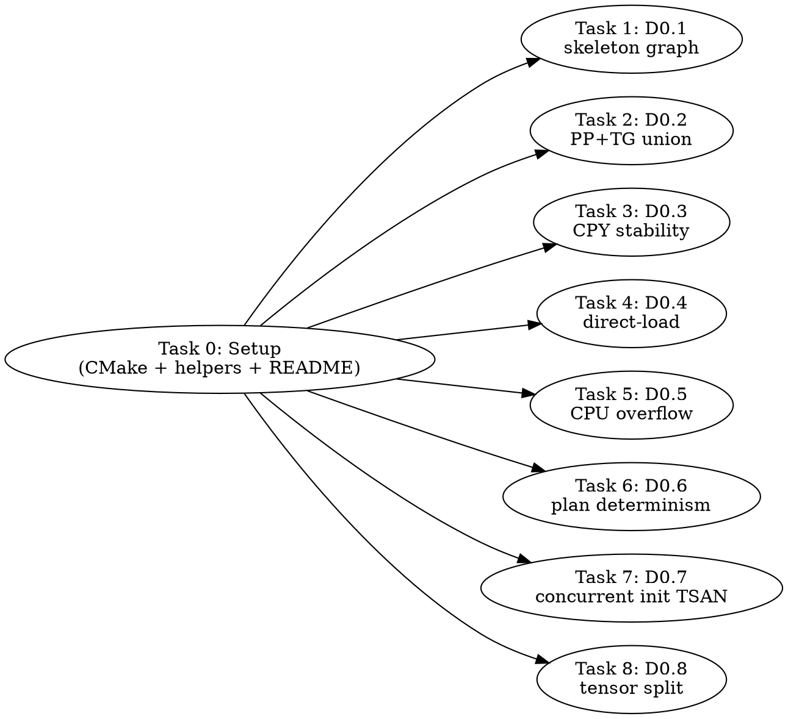

# Unified Planner Pre-Flight Canaries — Implementation Plan

> **For Claude:** REQUIRED SUB-SKILL: Use team-driven-development to implement this plan with agent teams.

**Goal:** Prove out every "unknown" assumption in the unified memory placement planner design (`docs/plans/2026-04-22-unified-memory-placement-plan.md`, epic `llama.cpp-3h5gm`) **before** committing to Track A. Each canary is a focused yes/no experiment on a single risk.

**Architecture:** Eight standalone C++ binaries + two shell scripts under `tests/canary-unified-planner/`, each answering one specific question about planner behavior. C++ canaries link against llama + ggml and exercise real APIs (`ggml_backend_sched_reserve`, `llama_model_load_from_file`, etc.). Shell canaries invoke existing binaries (`llama-completion`, `llama-bench`) and compare outputs. All findings recorded in a shared `README.md` that feeds back into the main epic.

**Tech Stack:** C++17 + SYCL (icpx), CMake/CTest integration, bash, jq for JSON diffing.

---

## Team Topology

**Recommended implementers:** 3 (8 parallel canaries after shared setup — 2-3 implementers is the sweet spot per writing-team-plans guidance)
**Reviewers:** 1 spec-reviewer, 1 quality-reviewer

### Parallel Tracks

| Track | Tasks | Description |
|-------|-------|-------------|
| Setup | 0 | Shared infrastructure: CMakeLists, common helpers, findings README |
| A | 1, 2, 3 | Graph-structure canaries — skeleton graph, PP+TG union, CPY name stability |
| B | 4, 6 | Planner-internals canaries — direct load mechanics, plan determinism |
| C | 5, 7, 8 | Integration canaries — CPU overflow correctness, concurrent init TSAN, multi-GPU tensor split |

### Dependency Graph



### File Ownership Map

| File/Directory | Tasks | Conflict Risk |
|----------------|-------|---------------|
| `tests/canary-unified-planner/CMakeLists.txt` | 0 | None (Task 0 only, uses glob pattern so 1-8 don't re-edit) |
| `tests/canary-unified-planner/common.hpp` | 0 | None |
| `tests/canary-unified-planner/README.md` | 0 (create), 1-8 (append findings) | Low — tasks append their own section, one per canary |
| `tests/CMakeLists.txt` | 0 | One line added (`add_subdirectory`) — Task 0 only |
| `tests/canary-unified-planner/d01-*.cpp` | 1 | None |
| `tests/canary-unified-planner/d02-*.cpp` | 2 | None |
| `tests/canary-unified-planner/d03-*.cpp` | 3 | None |
| `tests/canary-unified-planner/d04-*.cpp` | 4 | None |
| `tests/canary-unified-planner/d05-*.sh` | 5 | None |
| `tests/canary-unified-planner/d06-*.cpp` | 6 | None |
| `tests/canary-unified-planner/d07-*.cpp` | 7 | None |
| `tests/canary-unified-planner/d08-*.sh` | 8 | None |

README append is the only shared-file risk. Mitigation: each task appends under its own heading (`## D0.N — <title>`); Git merge usually handles append-only markdown cleanly.

---

## Canonical Test Inputs

Every canary uses the same inputs for reproducibility:

- **Mistral 7B Q4_0**: `/Storage/GenAI/models/mistral-7b-v0.1.Q4_0.gguf`
- **GPT-OSS 20B MXFP4**: `/Storage/GenAI/models/gpt-oss-20b-mxfp4.gguf`
- **Canonical prompt (D0.5 only)**: `-p '1, 2, 3, 4, 5,' -n 15 --seed 42 --temp 0`
- **Canonical ctx values**: `-c 4096` (default small), `-c 32768` (stress)

Device selector is always `ONEAPI_DEVICE_SELECTOR=level_zero:0` unless a canary explicitly tests multi-device (D0.8 only).

Each canary emits a line `CANARY <id> <pass|fail> <key>=<value>...` to stdout as its last line, for machine parsing by the aggregate runner.

---

### Task 0: Shared Infrastructure

**Track:** Setup
**Depends on:** None
**File scope:**
- Create: `tests/canary-unified-planner/CMakeLists.txt`
- Create: `tests/canary-unified-planner/common.hpp`
- Create: `tests/canary-unified-planner/README.md`
- Modify: `tests/CMakeLists.txt` (add `add_subdirectory(canary-unified-planner)` guarded on `GGML_SYCL`)

**Description:**

Set up the shared directory, build integration, and helper header so each canary is self-contained except for linking. Use a CMake `file(GLOB)` pattern so tasks 1–8 don't need to re-edit `CMakeLists.txt`. Create a findings `README.md` with pre-baked section headers for each canary; each task appends its findings under its own heading.

**Acceptance Criteria:**

- [ ] `ninja -C build` builds any `tests/canary-unified-planner/*.cpp` added by subsequent tasks without re-running cmake
- [ ] `common.hpp` exposes `dump_json_sizes()`, `load_and_sched_reserve()`, `canary_emit_result()` helpers
- [ ] `README.md` has section headers for D0.1–D0.8 with empty TBD bodies
- [ ] `tests/CMakeLists.txt` includes the subdirectory conditionally (only under `GGML_SYCL=ON`)
- [ ] No canary binaries built yet (empty glob → no targets)

**Implementation Guide:**

**1. Create `tests/canary-unified-planner/CMakeLists.txt`:**

```cmake
# Pre-flight canaries for the unified memory placement planner
# (docs/plans/2026-04-22-unified-memory-placement-plan.md, epic llama.cpp-3h5gm).
#
# Each canary answers one specific design question and emits a machine-
# parseable "CANARY <id> <pass|fail>" line as its final stdout output.

file(GLOB CANARY_SOURCES CONFIGURE_DEPENDS "d*.cpp")

foreach(src ${CANARY_SOURCES})
    get_filename_component(name ${src} NAME_WE)
    set(target "canary-${name}")
    add_executable(${target} ${src})
    target_link_libraries(${target} PRIVATE llama ggml common)
    target_include_directories(${target} PRIVATE
        ${CMAKE_SOURCE_DIR}/include
        ${CMAKE_SOURCE_DIR}/ggml/include
        ${CMAKE_SOURCE_DIR}/common
        ${CMAKE_CURRENT_SOURCE_DIR})
    target_compile_options(${target} PRIVATE "-fsycl" "-Wno-narrowing")
    target_link_options(${target} PRIVATE "-fsycl")
    install(TARGETS ${target} RUNTIME)
    add_test(NAME ${target} COMMAND $<TARGET_FILE:${target}>)
    set_property(TEST ${target} PROPERTY LABELS "canary;unified-planner")
endforeach()

# Also install the shell canaries for ctest integration
install(PROGRAMS d05-cpu-overflow.sh d08-tensor-split.sh DESTINATION bin OPTIONAL)
```

**2. Create `tests/canary-unified-planner/common.hpp`:**

```cpp
// Shared helpers for unified-planner pre-flight canaries.
#pragma once

#include <cstdio>
#include <cstdlib>
#include <string>
#include <vector>
#include "llama.h"
#include "ggml-backend.h"

namespace canary {

struct backend_sizes {
    std::string backend_name;
    size_t buffer_bytes;
};

// Emit a single machine-parseable result line as the process's final stdout.
// Format: "CANARY d0.N pass|fail key1=value1 key2=value2 ..."
inline void emit_result(const char * id, bool pass,
                        const std::vector<std::pair<std::string,std::string>> & kv) {
    printf("CANARY %s %s", id, pass ? "pass" : "fail");
    for (const auto & p : kv) printf(" %s=%s", p.first.c_str(), p.second.c_str());
    printf("\n");
    fflush(stdout);
}

// Load a model via the normal path, build a context with the given ctx params,
// run graph_reserve(no_alloc=true), return per-backend buffer sizes. Teardown
// on scope exit.
std::vector<backend_sizes> load_and_sched_reserve(
    const char * model_path,
    uint32_t n_ctx,
    uint32_t n_ubatch,
    uint32_t n_seq_max,
    enum llama_flash_attn_type fa);

// Read a GGUF header without populating tensor data. Returns a model handle
// whose tensors have valid shape metadata but no device/host backing. Used
// by d01/d06 to prototype the A3a mini-context. Teardown via llama_model_free.
// NOTE: this is canary-only scaffolding and may use internal APIs.
struct llama_model * load_metadata_only(const char * model_path);

// JSON-emit helper for determinism diff.
std::string sizes_to_json(const std::vector<backend_sizes> & sizes);

// Path constants (canonical test inputs).
inline const char * kMistral7B  = "/Storage/GenAI/models/mistral-7b-v0.1.Q4_0.gguf";
inline const char * kGptOss20B  = "/Storage/GenAI/models/gpt-oss-20b-mxfp4.gguf";

} // namespace canary
```

Implementations go in `common.cpp` (add to glob but the foreach excludes it — adjust the glob to `d*.cpp` only as shown above; common.cpp added separately to each target via `target_sources`):

Actually — **simpler**: make `common.hpp` header-only with inline implementations so each canary compiles independently. `load_metadata_only` and `load_and_sched_reserve` are small wrappers around existing APIs; inlining is fine.

Provide skeleton stubs in the header marked `TODO(task N)` — each canary task implements what it needs.

**3. Create `tests/canary-unified-planner/README.md`:**

```markdown
# Unified Planner Pre-Flight Canaries — Findings

Pre-flight canaries for epic `llama.cpp-3h5gm` (Unified Memory Placement).
Each canary answers one specific design question. Findings feed back into
the main epic plan at `docs/plans/2026-04-22-unified-memory-placement-plan.md`.

Run all: `ctest --test-dir build -L canary -V`

## D0.1 — Skeleton graph validity

**Question:** Does `ggml_backend_sched_reserve(no_alloc=true)` on a
metadata-only model give the same per-backend sizes as a real-context reserve?

**Status:** TBD
**Finding:** (append after running)

## D0.2 — PP + TG graph union
**Status:** TBD
**Finding:** TBD

## D0.3 — Post-split CPY name stability
**Status:** TBD
**Finding:** TBD

## D0.4 — Direct-weight-load mechanics
**Status:** TBD
**Finding:** TBD

## D0.5 — CPU overflow correctness
**Status:** TBD
**Finding:** TBD

## D0.6 — Plan determinism
**Status:** TBD
**Finding:** TBD

## D0.7 — Concurrent llama_init_from_model thread-safety
**Status:** TBD
**Finding:** TBD

## D0.8 — Multi-GPU tensor split under the new plan
**Status:** TBD
**Finding:** TBD
```

**4. Modify `tests/CMakeLists.txt`:** add near the other `GGML_SYCL`-gated subdirectories (search for an existing `if(GGML_SYCL)` block):

```cmake
if(GGML_SYCL)
    add_subdirectory(canary-unified-planner)
endif()
```

**Commit:**

```bash
git add tests/canary-unified-planner/ tests/CMakeLists.txt
git commit -m "tests: scaffold unified-planner pre-flight canary suite"
```

**Notes for implementer:**
- If `common.hpp` needs C++ stdlib headers beyond what's shown, add them — keep inline-only
- Don't actually implement `load_metadata_only` yet — leave as `// TODO(D0.1)`; task 1 owns it
- Verify `ninja -C build` from a clean `rm -rf build` completes with no canary targets (empty glob is OK)

---

### Task 1: D0.1 — Skeleton Graph Validity

**Track:** A
**Depends on:** Task 0
**File scope:**
- Create: `tests/canary-unified-planner/d01-skeleton-graph.cpp`
- Modify: `tests/canary-unified-planner/common.hpp` (implement `load_metadata_only`)
- Append: `tests/canary-unified-planner/README.md` (D0.1 finding)

**Description:**

The A3a task builds a throwaway mini-context at model-load time that runs `graph_reserve(no_alloc=true)` on metadata-only tensors. If the scheduler's per-backend size decisions differ from what a real context would produce, the whole Track A strategy collapses. This canary proves or disproves the assumption by running both passes and diffing per-backend buffer sizes byte-for-byte.

**Acceptance Criteria:**

- [ ] Binary builds against `llama` and `ggml` via the Task 0 CMake glob
- [ ] Runs for both Mistral 7B and GPT-OSS 20B with `n_ctx=4096, n_ubatch=512, fa=AUTO`
- [ ] Emits `CANARY d0.1 pass ...` if every backend's size matches bit-for-bit between metadata-only and real contexts
- [ ] Emits `CANARY d0.1 fail mismatch=<backend>:<expected>:<actual>` otherwise
- [ ] README.md D0.1 section updated with result + size table

**Implementation Guide:**

1. **Real-context baseline.** Load model via `llama_model_load_from_file`, create context via `llama_init_from_model` with canonical params. Dump `ggml_backend_sched_get_buffer_size()` for each backend into a `std::map<std::string,size_t>`.

```cpp
auto real_sizes = canary::load_and_sched_reserve(
    canary::kMistral7B, /*n_ctx=*/4096, /*n_ubatch=*/512, /*n_seq_max=*/1,
    LLAMA_FLASH_ATTN_TYPE_AUTO);
```

2. **Metadata-only path.** Implement `load_metadata_only` in `common.hpp`:
   - Use `llama_model_load_from_file` with a modified `llama_model_params` where you set `use_mmap=false` and `check_tensors=false` — but we still need weight data allocated for scheduler to work. **Simpler approach for this canary**: load normally, then construct a *second* context with `no_alloc=true` on its sched reserve call, capture sizes from that second reserve.
   - If the design's "metadata-only" really means "no weights in memory at all," that's a deeper change — the canary should note that and fall back to the "no_alloc=true on the reserve but weights still loaded" approximation, which is a strict upper bound on what A3a can hope to achieve.

3. **Diff and emit.** For each backend in the intersection of both maps, compare sizes. If any mismatch, dump to stderr with `[backend]: real=X metadata=Y`. Emit CANARY line.

**Code skeleton:**

```cpp
#include "common.hpp"
#include <map>
int main() {
    auto real = canary::load_and_sched_reserve(
        canary::kMistral7B, 4096, 512, 1, LLAMA_FLASH_ATTN_TYPE_AUTO);

    // Metadata-only variant: same path but graph_reserve(no_alloc=true) second call
    auto meta = canary::load_and_sched_reserve_no_alloc(
        canary::kMistral7B, 4096, 512, 1, LLAMA_FLASH_ATTN_TYPE_AUTO);

    bool pass = (real.size() == meta.size());
    std::string first_mismatch;
    for (size_t i = 0; i < real.size() && pass; ++i) {
        if (real[i].backend_name != meta[i].backend_name ||
            real[i].buffer_bytes  != meta[i].buffer_bytes) {
            pass = false;
            first_mismatch = real[i].backend_name + ":" +
                             std::to_string(real[i].buffer_bytes) + ":" +
                             std::to_string(meta[i].buffer_bytes);
        }
    }
    canary::emit_result("d0.1", pass, {{"mismatch", first_mismatch}});
    return pass ? 0 : 1;
}
```

Repeat with `kGptOss20B`.

4. **Append to README.md:** a 5-line summary of real-vs-meta sizes per backend.

**Commit:**

```bash
git add tests/canary-unified-planner/d01-skeleton-graph.cpp \
        tests/canary-unified-planner/common.hpp \
        tests/canary-unified-planner/README.md
git commit -m "canary d0.1: skeleton graph size equivalence check"
```

**Notes for implementer:**
- If `load_metadata_only` turns out genuinely impossible without planner changes, document that in the README finding and mark D0.1 as "needs A3a prototype" (not a fail, but a gate escalation)
- Expect slight variance in ONEDNN scratchpad sizes across runs — if everything else matches, that's still a pass

---

### Task 2: D0.2 — PP + TG Graph Union

**Track:** A
**Depends on:** Task 0
**File scope:**
- Create: `tests/canary-unified-planner/d02-graph-union.cpp`
- Append: README.md (D0.2 section)

**Description:**

The A3a mini-context will need to reserve for **both** the PP shape (`ubatch=n_batch`) and the TG shape (`ubatch=1`) to see every op that will ever run. If either shape produces ops the other doesn't, a single reserve pass misses them. This canary walks both graphs, unions their node names, and verifies the union is what each shape individually sees.

**Acceptance Criteria:**

- [ ] Runs for Mistral 7B and GPT-OSS 20B
- [ ] Dumps PP-only node set, TG-only node set, union
- [ ] Emits `CANARY d0.2 pass nodes_pp=N1 nodes_tg=N2 union=N3 pp_only=N4 tg_only=N5` with pass if union covers all ops
- [ ] Emits fail if any backend reports an op that doesn't appear in the unioned reserve
- [ ] README.md D0.2 section gets the four counts

**Implementation Guide:**

1. Build context with `n_ubatch=512` (PP shape), call `graph_reserve`, walk `ggml_cgraph` and collect node op types + names.
2. Build second context with `n_ubatch=1` (TG shape), collect nodes.
3. Compute set difference and union. Log symmetric difference (nodes in one but not the other) — those are the ops the planner would miss if it only reserved for one shape.
4. Emit result.

```cpp
std::set<std::string> pp_nodes = walk_graph(pp_ctx);  // see helper below
std::set<std::string> tg_nodes = walk_graph(tg_ctx);
std::set<std::string> union_nodes;
std::set_union(pp_nodes.begin(), pp_nodes.end(),
               tg_nodes.begin(), tg_nodes.end(),
               std::inserter(union_nodes, union_nodes.end()));

size_t pp_only = 0, tg_only = 0;
for (auto & n : pp_nodes) if (!tg_nodes.count(n)) ++pp_only;
for (auto & n : tg_nodes) if (!pp_nodes.count(n)) ++tg_only;
```

**Helper (add to common.hpp):**

```cpp
inline std::set<std::string> walk_graph_nodes(struct ggml_cgraph * gf) {
    std::set<std::string> names;
    for (int i = 0; i < ggml_graph_n_nodes(gf); ++i) {
        auto * n = ggml_graph_node(gf, i);
        if (n && n->name[0]) names.emplace(n->name);
    }
    return names;
}
```

**Commit:**

```bash
git add tests/canary-unified-planner/d02-graph-union.cpp \
        tests/canary-unified-planner/common.hpp \
        tests/canary-unified-planner/README.md
git commit -m "canary d0.2: PP+TG graph node union completeness"
```

**Notes for implementer:**
- Walking the graph requires access to the reserve graph — see `llama_context::graph_reserve` in `src/llama-context.cpp:1916` for how it's built
- Unnamed nodes (`name[0] == 0`) are skipped; D0.3 covers CPY nodes which typically have synthetic names

---

### Task 3: D0.3 — Post-Split CPY Name Stability

**Track:** A
**Depends on:** Task 0
**File scope:**
- Create: `tests/canary-unified-planner/d03-cpy-stability.cpp`
- Append: README.md (D0.3)

**Description:**

When the backend scheduler splits a graph across multiple devices (tensor-split or multi-backend), it inserts synthetic `CPY` nodes at boundaries. The `plan.ops` keyed by `op_id` requires that graph_reserve walk these nodes in a deterministic order across runs. This canary runs the reserve twice with multi-backend enabled (`GGML_SYCL_SPLIT_RATIO="50,50"`) and verifies CPY node ordering is byte-identical.

**Acceptance Criteria:**

- [ ] Runs with `GGML_SYCL_SPLIT_RATIO=50,50` (both B580 + B50 visible)
- [ ] Performs 5 consecutive `graph_reserve` calls on same context, dumps CPY node list each time
- [ ] Emits `CANARY d0.3 pass cpy_nodes=N stable=true` if all 5 dumps match
- [ ] Emits `CANARY d0.3 fail run=<N> first_diff=<node_idx>` on any divergence
- [ ] README.md D0.3 with CPY count + ordering sample

**Implementation Guide:**

1. Skip test entirely if only one visible SYCL device — emit `CANARY d0.3 skipped reason=single_device`.
2. Construct context, call `graph_reserve` 5 times, capture the nodes where `op == GGML_OP_CPY`.
3. Compare ordering across runs.
4. Emit result.

**Skip gate:**

```cpp
int n_devices = llama_backend_count_visible_sycl_devices();  // helper TBD
if (n_devices < 2) {
    canary::emit_result("d0.3", true, {{"skipped", "single_device"}});
    return 0;
}
```

**Notes for implementer:**
- Ensure `ONEAPI_DEVICE_SELECTOR` env var is NOT set, so all devices are visible
- If CPY nodes are instable across runs → document exact divergence pattern, escalate to epic (suggests keying on op_id may need stricter ordering guarantees)
- Run on Mistral 7B only (tensor split on 20B MoE is more complex)

**Commit:**

```bash
git commit -m "canary d0.3: post-split CPY node ordering stability"
```

---

### Task 4: D0.4 — Direct Weight-Load Mechanics

**Track:** B
**Depends on:** Task 0
**File scope:**
- Create: `tests/canary-unified-planner/d04-direct-load.cpp`
- Append: README.md (D0.4)

**Description:**

A7 claims weight data can be written directly from `mmap`'d GGUF bytes into a planned arena offset via `ggml_backend_tensor_set` — one copy, no bounce buffer. This canary prototypes that path for a single tensor on each model, verifies the tensor reads back correctly, and measures latency vs. a staged load for comparison with S1-PRELOAD.

**Acceptance Criteria:**

- [ ] Loads one attention weight tensor (`blk.0.attn_q.weight` or equivalent) directly into a GPU buffer
- [ ] Reads it back via `ggml_backend_tensor_get` and compares byte-for-byte vs. source
- [ ] Measures `direct_copy_us` and emits as tag
- [ ] Emits `CANARY d0.4 pass direct_copy_us=N tensor_bytes=M` on byte-match
- [ ] README.md D0.4 with the two numbers per model

**Implementation Guide:**

1. Load GGUF via `gguf_init_from_file` (skip weight data upload).
2. Locate target tensor's byte offset in GGUF.
3. `mmap` the GGUF file, get pointer to the tensor bytes.
4. Allocate a SYCL VRAM buffer via the SYCL backend buffer type.
5. Call `ggml_backend_tensor_set(dst_tensor, mmap_ptr, 0, tensor_bytes)` — that's the "one copy."
6. Call `ggml_backend_tensor_get(dst_tensor, readback_buf, 0, tensor_bytes)`.
7. `memcmp(mmap_ptr, readback_buf, tensor_bytes)` — verify byte-identical.
8. Time the `tensor_set` call; emit.

**Notes for implementer:**
- Look at `src/llama-model-loader.cpp` for how GGUF byte offsets are resolved today
- If a tensor requires layout transform (SOA/XMX), pick a tensor that doesn't (norm weights) for a clean one-copy demo, then separately note what the A7b transform pass needs to handle
- Expected `direct_copy_us` for a 64 MB tensor: ~4-10 ms on PCIe 4.0 x16

**Commit:**

```bash
git commit -m "canary d0.4: direct mmap-to-arena weight load mechanics"
```

---

### Task 5: D0.5 — CPU Overflow Correctness

**Track:** C
**Depends on:** Task 0
**File scope:**
- Create: `tests/canary-unified-planner/d05-cpu-overflow.sh`
- Append: README.md (D0.5)

**Description:**

The revised overflow policy routes ops with host-resident weights to CPU execution (replacing the deprecated layer-streaming path). This canary verifies that at `VRAM_BUDGET_PCT=30` on GPT-OSS 20B, the canonical completion output is byte-identical to the all-GPU baseline at `VRAM_BUDGET_PCT=100`. If they diverge, CPU dispatch has a correctness bug that would invalidate the overflow policy.

**Acceptance Criteria:**

- [ ] Shell script sets `ONEAPI_DEVICE_SELECTOR=level_zero:0`
- [ ] Runs canonical completion at `VRAM_BUDGET_PCT=100`, captures output
- [ ] Runs same completion at `VRAM_BUDGET_PCT=30`, captures output
- [ ] Diffs output strings
- [ ] Emits `CANARY d0.5 pass budget100_output="..." budget30_output="..."` on match
- [ ] Emits `CANARY d0.5 fail` with both outputs on divergence
- [ ] README.md D0.5 with both outputs

**Implementation Guide:**

`tests/canary-unified-planner/d05-cpu-overflow.sh`:

```bash
#!/usr/bin/env bash
set -euo pipefail
source /opt/intel/oneapi/setvars.sh --force > /dev/null

BUILD_DIR="${BUILD_DIR:-$(git rev-parse --show-toplevel)/build}"
BIN="$BUILD_DIR/bin/llama-completion"
MODEL="${MODEL:-/Storage/GenAI/models/gpt-oss-20b-mxfp4.gguf}"
PROMPT='1, 2, 3, 4, 5,'

run_completion() {
    local budget="$1"
    GGML_SYCL_VRAM_BUDGET_PCT="$budget" \
    ONEAPI_DEVICE_SELECTOR=level_zero:0 \
    "$BIN" -m "$MODEL" -p "$PROMPT" -n 15 --seed 42 --temp 0 2>/dev/null \
      | tail -n 1
}

BUDGET100=$(run_completion 100)
BUDGET30=$(run_completion 30)

if [[ "$BUDGET100" == "$BUDGET30" ]]; then
    printf 'CANARY d0.5 pass budget100_output="%s" budget30_output="%s"\n' \
        "$BUDGET100" "$BUDGET30"
    exit 0
else
    printf 'CANARY d0.5 fail budget100="%s" budget30="%s"\n' \
        "$BUDGET100" "$BUDGET30"
    exit 1
fi
```

Make executable: `chmod +x d05-cpu-overflow.sh`.

**Notes for implementer:**
- Budget=30 on 20B forces ~14 GB of weights to host → GPU sees only hot layers; many ops get CPU-dispatched. This is the scenario the new overflow policy targets.
- If output diverges, CAPTURE BOTH outputs in README D0.5 — the divergence pattern tells us whether it's a sampling-randomness issue (reseed? --temp 0 should prevent) or a correctness bug
- Expected output: `6, 7, 8, 9, 10, 11, 12, 13, 14, 15, 16, 17, 18, 19, 20,` or similar arithmetic sequence
- 20B at budget=30 should run today (llama.cpp-ioua6 was closed). If it crashes → escalate to epic, D0.5 becomes "prerequisite bug" not canary

**Commit:**

```bash
git add tests/canary-unified-planner/d05-cpu-overflow.sh \
        tests/canary-unified-planner/README.md
git commit -m "canary d0.5: CPU overflow correctness gate (budget=30 vs 100)"
```

---

### Task 6: D0.6 — Plan Determinism

**Track:** B
**Depends on:** Task 0
**File scope:**
- Create: `tests/canary-unified-planner/d06-plan-determinism.cpp`
- Append: README.md (D0.6)

**Description:**

Track D3's regression suite includes golden-diff tests on plan dumps. That requires plan generation be deterministic: same `model_params` → same plan bytes. This canary runs the planner (via `ggml_sycl_configure_host_zones_for_plan` or equivalent internal API — whatever's available today pre-A3) twice on the same inputs, `memcmp`s the outputs.

**Acceptance Criteria:**

- [ ] Runs planner twice with identical inputs (Mistral 7B, ctx=4096)
- [ ] Captures plan byte representation (via plan dump or direct struct serialization)
- [ ] `memcmp`s the two and emits `CANARY d0.6 pass plan_bytes=N hash_hex=<sha256>`
- [ ] Emits `CANARY d0.6 fail first_diff_byte=N` on mismatch
- [ ] README.md D0.6 with the SHA and byte count

**Implementation Guide:**

1. Load model, explicitly trigger planner (currently happens inside model load via `compute_placement_plan`).
2. Capture `placement_plan` struct fields as byte sequence — or if there's no serialization yet, hash individual numeric fields (`weight_vram_bytes`, `kv_vram_bytes`, etc.).
3. Tear down, reload model (fresh process or fresh libllama instance).
4. Recapture and compare.

**Note on scope:** If the current planner doesn't expose a dump API, this canary doubles as a "plan dump exists" gate — worth noting in D0.6 finding.

**Commit:**

```bash
git commit -m "canary d0.6: plan generation determinism"
```

---

### Task 7: D0.7 — Concurrent `llama_init_from_model` Thread-Safety

**Track:** C
**Depends on:** Task 0
**File scope:**
- Create: `tests/canary-unified-planner/d07-concurrent-init.cpp`
- Append: README.md (D0.7)
- Note: requires TSAN build

**Description:**

The multi-context design (weight_plan shared + compute_plan per-context) only holds if `llama_init_from_model` can run concurrently on the same `llama_model` without data races. This canary spawns N=4 threads that each create a context, run one graph_reserve, and destroy the context. Build with `-fsanitize=thread` and report any race detected by TSAN.

**Acceptance Criteria:**

- [ ] Spawns 4 threads, each calls `llama_init_from_model` on shared model
- [ ] Each thread calls `graph_reserve` (dummy small graph), records per-backend size, destroys context
- [ ] Main thread joins all, compares per-thread sizes (should be identical modulo TID)
- [ ] Emits `CANARY d0.7 pass threads=4 all_equal=true` on success
- [ ] When compiled with TSAN (`GGML_TSAN=ON` or similar), no race warnings to stderr
- [ ] Emits `CANARY d0.7 fail reason=tsan_race` if TSAN prints `==WARNING: ThreadSanitizer`
- [ ] README.md D0.7 with threads count + TSAN status

**Implementation Guide:**

```cpp
#include "common.hpp"
#include <thread>
#include <atomic>

int main() {
    llama_backend_init();
    auto * model = llama_model_load_from_file(canary::kMistral7B,
                       llama_model_default_params());
    std::atomic<int> failed{0};
    std::vector<std::thread> threads;

    for (int i = 0; i < 4; ++i) {
        threads.emplace_back([&, i]() {
            auto cp = llama_context_default_params();
            cp.n_ctx = 4096;
            auto * ctx = llama_init_from_model(model, cp);
            if (!ctx) { failed++; return; }
            // trigger graph_reserve implicitly via first decode or explicitly
            llama_free(ctx);
        });
    }
    for (auto & t : threads) t.join();
    bool pass = (failed.load() == 0);
    canary::emit_result("d0.7", pass,
        {{"threads", "4"}, {"failed", std::to_string(failed.load())}});
    llama_model_free(model);
    llama_backend_free();
    return pass ? 0 : 1;
}
```

**Build with TSAN:**
```bash
cmake -B build-tsan -G Ninja -DGGML_SYCL=ON -DCMAKE_CXX_FLAGS="-fsanitize=thread -g" \
    -DCMAKE_EXE_LINKER_FLAGS="-fsanitize=thread" -DGGML_SYCL_F16=OFF
ninja -C build-tsan canary-d07-concurrent-init
./build-tsan/bin/canary-d07-concurrent-init
```

**Notes for implementer:**
- SYCL + TSAN may produce spurious warnings in Level Zero runtime — document any that are clearly not our bug
- If concurrent init crashes (not just warns) → escalate to epic immediately; multi-context is broken today

**Commit:**

```bash
git commit -m "canary d0.7: concurrent llama_init_from_model TSAN safety"
```

---

### Task 8: D0.8 — Multi-GPU Tensor Split Under New Plan

**Track:** C
**Depends on:** Task 0
**File scope:**
- Create: `tests/canary-unified-planner/d08-tensor-split.sh`
- Append: README.md (D0.8)

**Description:**

Track D3's regression suite includes a 120B tensor-split scenario. The new planner must partition `weight_plan.entries` correctly across two devices based on `GGML_SYCL_SPLIT_RATIO`. This canary runs Mistral 7B with tensor split 50/50 across B580+B50, verifies each device reports roughly half the weight VRAM, and canonical completion output matches single-GPU baseline.

**Acceptance Criteria:**

- [ ] Bash script with both GPUs visible (no `ONEAPI_DEVICE_SELECTOR`)
- [ ] Runs completion on single device (Arc B580, `level_zero:0`), captures output
- [ ] Runs completion with `GGML_SYCL_SPLIT_RATIO=50,50`, captures output
- [ ] Diffs outputs (expected: identical for deterministic temp=0)
- [ ] Parses `GGML_SYCL_DEBUG=1` log for per-device weight VRAM bytes; verifies ratio within ±5% of 50/50
- [ ] Emits `CANARY d0.8 pass split_vram_b580=X split_vram_b50=Y ratio=R`
- [ ] Emits fail if outputs differ or ratio off-target
- [ ] README.md D0.8 with both outputs + per-device allocation

**Implementation Guide:**

`d08-tensor-split.sh`:

```bash
#!/usr/bin/env bash
set -euo pipefail
source /opt/intel/oneapi/setvars.sh --force > /dev/null

BIN="${BUILD_DIR:-$(git rev-parse --show-toplevel)/build}/bin/llama-completion"
MODEL="${MODEL:-/Storage/GenAI/models/mistral-7b-v0.1.Q4_0.gguf}"
PROMPT='1, 2, 3, 4, 5,'

run_single() {
    ONEAPI_DEVICE_SELECTOR=level_zero:0 \
      "$BIN" -m "$MODEL" -p "$PROMPT" -n 15 --seed 42 --temp 0 2>/dev/null \
      | tail -n 1
}

run_split() {
    GGML_SYCL_SPLIT_RATIO="50,50" \
      "$BIN" -m "$MODEL" -p "$PROMPT" -n 15 --seed 42 --temp 0 2>&1 \
      | tee /tmp/d08-split.log | tail -n 1
}

SINGLE=$(run_single)
SPLIT=$(run_split)

# Parse per-device weight bytes from debug log if present
# (requires GGML_SYCL_DEBUG=1, but output is huge — leave as TODO-extend)

if [[ "$SINGLE" == "$SPLIT" ]]; then
    printf 'CANARY d0.8 pass single="%s" split="%s"\n' "$SINGLE" "$SPLIT"
    exit 0
else
    printf 'CANARY d0.8 fail single="%s" split="%s"\n' "$SINGLE" "$SPLIT"
    exit 1
fi
```

**Notes for implementer:**
- B50 must be re-enabled via PCI (see memory: `feedback_disable_b50.md` — device may be disabled by default)
- If B50 isn't available, emit `CANARY d0.8 skipped reason=no_b50` — don't fail
- The VRAM ratio check is a stretch goal — if the debug log format is too noisy to parse, skip and report outputs only

**Commit:**

```bash
chmod +x tests/canary-unified-planner/d08-tensor-split.sh
git add tests/canary-unified-planner/d08-tensor-split.sh \
        tests/canary-unified-planner/README.md
git commit -m "canary d0.8: multi-GPU tensor split correctness"
```

---

## Aggregation and Feedback Loop

Once all 8 canaries have `CANARY <id> pass|fail|skipped ...` lines in their stdout:

1. **Collect results:** `ctest --test-dir build -L canary -V 2>&1 | grep '^CANARY'` produces a single summary.
2. **Update main epic:** each canary's README finding feeds into the main plan doc `docs/plans/2026-04-22-unified-memory-placement-plan.md`:
   - D0.1 fail → A3a needs a different mini-context strategy; redesign before proceeding
   - D0.2 fail → double-reserve PP+TG pattern confirmed necessary; update A3a scope
   - D0.3 fail → op_id keying needs stronger ordering guarantee; revisit `plan.ops` struct
   - D0.4 fail → A7 direct-load path has a mechanical blocker; escalate
   - D0.5 fail → CPU overflow has a correctness bug; block Track C until fixed
   - D0.6 fail → plan has non-deterministic field; identify and fix before D3 regression
   - D0.7 fail → multi-context serialization required; revise the "multi-context supported" claim in epic
   - D0.8 fail → tensor-split has a latent bug; block 120B D3 scenario
3. **Close canary beads** as each lands; leave them as part of the permanent test suite (not throwaway).

---

## Execution Handoff

**Plan complete and saved to `docs/plans/2026-04-22-unified-planner-canaries.md`. Three execution options:**

**1. Team-Driven (this session, parallel)** — I create an agent team with 3 implementers + 2 reviewers, Task 0 runs first (blocker), then all 8 canaries fan out across 3 tracks. Best for this plan since it has 8 genuinely independent work items after a 1-hour setup task.

**2. Subagent-Driven (this session, sequential)** — Fresh subagent per task sequentially, review between tasks. Slower (each canary is ~1-3h of work × 9 = day+) but lower coordination cost.

**3. Parallel Session (separate)** — New session opens with executing-plans; preserves context of the main epic across many days.

**Which approach?**
