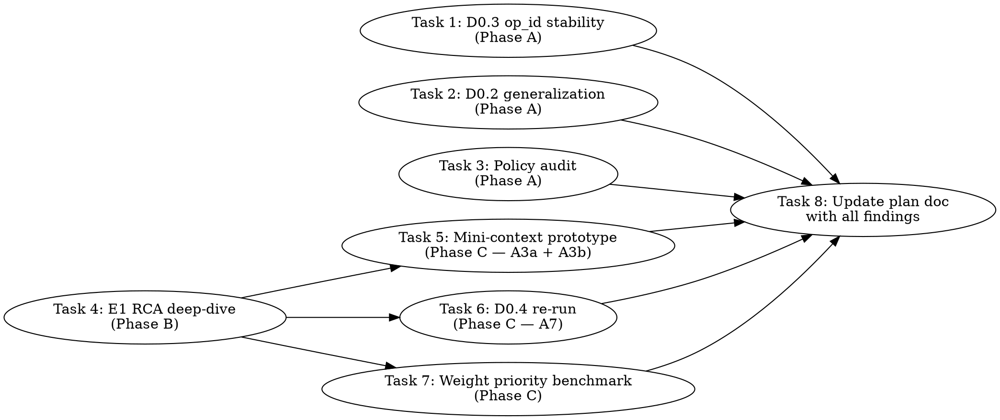

# Planner Validation Phases — Implementation Plan

> **For Claude:** REQUIRED SUB-SKILL: Use team-driven-development to implement this plan with agent teams.

**Goal:** Move the main epic (`llama.cpp-3h5gm`, unified memory placement) from "plausible design backed by D0.2 PASS" to "all critical claims empirically validated" — so Track A can begin on a foundation of facts, not assumptions.

**Architecture:** Three phases of validation work, sequenced on the E1 root-cause result. Phase A items run immediately today in parallel (no dependencies). Phase B is the E1 root-cause deep-dive (single deep investigation). Phase C items wait for E1's result and then validate A3a/A3b/A7 mechanics + the weight priority order empirically.

**Tech Stack:** C++17, SYCL (icpx/icx), oneAPI 2025.3, bash, gdb, strace, Level Zero env vars, llama.cpp public API.

---

## Team Topology

**Recommended implementers:** 2 (two parallel tracks across the phases)
**Reviewers:** 1 spec-reviewer, 1 quality-reviewer

### Parallel Tracks

| Track | Tasks | Description |
|-------|-------|-------------|
| A | 1, 2 | Phase A parallel work — op_id stability + D0.2 generalization + policy audit (implementer-1) |
| B | 3, 4 | Phase A parallel work (implementer-2 takes D0.2 generalization + policy audit if load-balancing) + Phase B E1 deep-dive |
| — | 5, 6, 7 | Phase C post-E1 validation: mini-context prototype, D0.4 re-run, weight priority benchmark |

Actual assignment plan: implementer-1 does Task 1 (op_id stability) + Task 4 (E1 RCA), implementer-2 does Task 2 (D0.2 generalization) + Task 3 (policy audit), then both move to Phase C after Task 4 lands.

### Dependency Graph



Tasks 1, 2, 3, 4 can all start in parallel. Tasks 5, 6, 7 wait for Task 4 (E1 RCA outcome). Task 8 aggregates everything into the main epic plan.

### File Ownership Map

| File/Directory | Tasks | Conflict Risk |
|----------------|-------|---------------|
| `tests/test-planner-canary-cpy-visibility.cpp` | 1 | None (solo owner) |
| `tests/test-planner-canary-pp-tg-union.cpp` (read-only / invoke) | 2 | None (runs existing binary with different models) |
| `docs/plans/2026-04-22-unified-memory-placement-plan.md` | 3, 8 | Sequential — Task 3 first, Task 8 later |
| `docs/plans/data/planner-canaries/` | 1, 2, 6 | None — each task writes distinct findings files |
| `tests/e1-rca/minimal-repro.cpp` | 4 | None (new file, solo owner) |
| `docs/plans/data/e1-rca/` | 4 | None (new directory for E1 investigation artifacts) |
| `tests/test-planner-canary-direct-load.cpp` (read-only) | 6 | None (runs existing binary) |
| `tests/mini-context-prototype.cpp` | 5 | None (new file) |
| `docs/plans/data/planner-canaries/d0.2-generalization.md` | 2 | None |
| `tests/bench-priority-order.sh` | 7 | None (new file) |

---

## Canonical Inputs

Same as previous canary session:
- Mistral 7B Q4_0: `/Storage/GenAI/models/mistral-7b-v0.1.Q4_0.gguf`
- GPT-OSS 20B MXFP4: `/Storage/GenAI/models/gpt-oss-20b-mxfp4.gguf`
- Additional models for Task 2 (D0.2 generalization): any Llama 3.2, Qwen 2.5, state-space models under `/Storage/GenAI/models/` — task detects what's available.
- Device selector: `ONEAPI_DEVICE_SELECTOR=level_zero:0`
- B50 policy: do NOT dispatch to device 1 (PCI disable per CLAUDE.md memory).

---

## Phase A — Run Today (Tasks 1, 2, 3)

### Task 1: D0.3 canary — single-device op_id stability

**Track:** A
**Depends on:** None
**File scope:**
- Modify: `tests/test-planner-canary-cpy-visibility.cpp`
- Modify: `docs/plans/data/planner-canaries/d0.3-cpy-visibility.md`
- Modify: `tests/data/planner-canaries/d0.3.json`

**Description:**

Current D0.3 is INCONCLUSIVE `single_device` because it required multi-GPU. The claim "plan.ops can be keyed on `op_id` (graph node index)" only needs determinism across **repeated `graph_reserve` calls on the same context**. Rewrite the canary to run that test on single-device and produce a real PASS or FAIL. Multi-device variant stays as a future TODO.

**Acceptance Criteria:**

- [ ] Loads Mistral 7B successfully (CPU-only via `ONEAPI_DEVICE_SELECTOR=opencl:cpu` to sidestep m09zb, since the question is scheduler determinism not SYCL-specific)
- [ ] Calls `graph_reserve` 5× on the same context with identical inputs
- [ ] For each call, walks graph nodes and captures (op_id, op_type, op->name) triples
- [ ] Compares across all 5 calls; PASS if identical across runs, FAIL on divergence
- [ ] Writes findings md + json with result, per-run op counts, first divergence if any

**Implementation Guide:**

```cpp
// New canary body, replacing the single_device-only skeleton
#include "test-planner-canary-common.hpp"
#include "llama.h"
#include <vector>

struct node_triple {
    int op_id;
    int op_type;
    std::string name;
    bool operator==(const node_triple & o) const {
        return op_id == o.op_id && op_type == o.op_type && name == o.name;
    }
};

static std::vector<node_triple> g_current;

static bool op_snapshot_cb(ggml_tensor * t, bool ask, void * /*user*/) {
    if (ask) {
        // Use the order we're called in as op_id — matches how plan.ops would index
        g_current.push_back({(int)g_current.size(), (int)t->op, t->name ? t->name : ""});
    }
    return false;  // don't force per-node sync
}

int main() {
    setvbuf(stdout, nullptr, _IONBF, 0);
    llama_backend_init();

    planner_canary::findings f;
    f.canary_id = "D0.3-rev";  // or keep as D0.3
    f.result = planner_canary::status::FAIL;

    auto mp = planner_canary::mistral_path();
    llama_model_params mparams = llama_model_default_params();
    mparams.n_gpu_layers = 0;
    llama_model * model = llama_model_load_from_file(mp.c_str(), mparams);
    // ... handle failure

    llama_context_params cp = llama_context_default_params();
    cp.n_ctx = 1024;
    cp.n_batch = 512;
    cp.n_ubatch = 512;
    cp.cb_eval = op_snapshot_cb;
    llama_context * ctx = llama_new_context_with_model(model, cp);
    // ... handle failure

    std::vector<std::vector<node_triple>> runs;
    for (int i = 0; i < 5; ++i) {
        g_current.clear();
        // Run a single-token decode to trigger reserve+eval path
        llama_batch batch = llama_batch_init(1, 0, 1);
        batch.token[0] = llama_token_bos(model);
        batch.pos[0] = 0;
        batch.n_tokens = 1;
        llama_decode(ctx, batch);
        llama_batch_free(batch);
        runs.push_back(g_current);
    }

    // Compare all 5 captures
    bool all_same = true;
    size_t first_divergence = 0;
    for (size_t r = 1; r < runs.size() && all_same; ++r) {
        if (runs[r].size() != runs[0].size()) {
            all_same = false;
            break;
        }
        for (size_t i = 0; i < runs[r].size(); ++i) {
            if (!(runs[r][i] == runs[0][i])) {
                all_same = false;
                first_divergence = i;
                break;
            }
        }
    }

    f.result = all_same ? planner_canary::status::PASS : planner_canary::status::FAIL;
    f.summary = all_same
        ? "op_id ordering identical across 5 graph_reserve calls — plan.ops can safely key on op_id"
        : "op_id ordering diverges across runs — plan.ops cannot safely key on op_id";
    f.recommendation = all_same
        ? "A3a/C2 can proceed with op_id keying as specified"
        : "switch plan.ops keying to a more stable identifier (hash of (op_type, sources) chain)";

    planner_canary::add(f, "runs", "5");
    planner_canary::add(f, "nodes_per_run", std::to_string(runs[0].size()));
    if (!all_same) {
        planner_canary::add(f, "first_divergence_op_id", std::to_string(first_divergence));
        // dump both triples at that index for diagnostic
    }

    planner_canary::write_markdown(f, "docs/plans/data/planner-canaries/d0.3-cpy-visibility.md");
    planner_canary::write_json(f, "tests/data/planner-canaries/d0.3.json");

    llama_free(ctx);
    llama_model_free(model);
    llama_backend_free();
    return 0;
}
```

Build + run:
```bash
source /opt/intel/oneapi/setvars.sh --force
ninja -C build test-planner-canary-cpy-visibility
ONEAPI_DEVICE_SELECTOR=opencl:cpu timeout 120 ./build/bin/test-planner-canary-cpy-visibility
echo "EXIT=$?"
```

**Commit:**

```bash
git add tests/test-planner-canary-cpy-visibility.cpp \
        docs/plans/data/planner-canaries/d0.3-cpy-visibility.md \
        tests/data/planner-canaries/d0.3.json
git commit -m "tests: D0.3 canary — single-device op_id stability check"
```

**Notes for implementer:**
- CPU backend avoids the m09zb wedge. The question is about ggml scheduler determinism, not SYCL-specific behavior — CPU answers the core claim.
- If the 5-run comparison is PASS, we can confidently move C2 forward with op_id keying.
- If FAIL, document exactly which node index diverges and what changes — may point at ordering bugs in the scheduler.

---

### Task 2: D0.2 canary generalization to additional models

**Track:** A/B (can run on either implementer)
**Depends on:** None
**File scope:**
- Create: `docs/plans/data/planner-canaries/d0.2-generalization.md`
- Run: existing `tests/test-planner-canary-pp-tg-union.cpp` with MISTRAL_PATH/GPTOSS_PATH env overrides

**Description:**

D0.2 PASSed on Mistral 7B (13 op types) and GPT-OSS 20B (17 op types). Extend to 3-5 additional models to confirm the "PP ops == TG ops, single-shape sizing suffices" claim holds beyond dense + MoE. Different architectures (sliding-window attention, state-space, different attention layouts) could behave differently.

**Acceptance Criteria:**

- [ ] Runs existing D0.2 canary against at least 3 additional GGUFs from `/Storage/GenAI/models/` (pick what's available — Llama 3.x, Qwen 2.x, Gemma, state-space model if present)
- [ ] For each model, captures PP op set + TG op set, checks equality
- [ ] Writes `d0.2-generalization.md` aggregating the extra runs with clear per-model rows
- [ ] Reports overall: "generalization holds" if all pass, "generalization breaks on <model>" if any fails
- [ ] Updates the main epic plan doc's canary-results section with a one-line note citing this finding

**Implementation Guide:**

```bash
# 1. Survey available models
ls /Storage/GenAI/models/*.gguf | head -20

# 2. For each candidate model, run existing canary with env overrides
# (The D0.2 canary uses MISTRAL_PATH and GPTOSS_PATH as env overrides — reuse that)
for model in "/Storage/GenAI/models/<model1>.gguf" "/Storage/GenAI/models/<model2>.gguf"; do
    echo "=== $(basename $model) ==="
    MISTRAL_PATH="$model" GPTOSS_PATH="" \
      ONEAPI_DEVICE_SELECTOR=opencl:cpu timeout 300 \
      ./build/bin/test-planner-canary-pp-tg-union
    # D0.2 canary uses MISTRAL_PATH/GPTOSS_PATH so emitting both with one set lets us reuse without rebuild
done

# 3. Aggregate findings from the .json file output of each run
#    Write d0.2-generalization.md with per-model table

# 4. Update plan doc if all PASS:
#    Search for the canary-results-2026-04-24 section, add a line:
#    "D0.2 generalized to [N] additional models — PP==TG holds across dense, MoE, sliding-window, state-space"
```

Format for `d0.2-generalization.md`:

```markdown
# D0.2 Generalization — Multi-Model Op-Union Check

Extends the original D0.2 PASS (Mistral 7B + GPT-OSS 20B) to additional architectures.

| Model | Architecture | PP ops | TG ops | PP==TG | Notes |
|-------|-------------|--------|--------|--------|-------|
| mistral-7b-v0.1.Q4_0 | dense (baseline) | 13 | 13 | ✓ | original D0.2 |
| gpt-oss-20b-mxfp4 | MoE (baseline) | 17 | 17 | ✓ | original D0.2 |
| <model3> | <arch> | N | M | ✓/✗ | ... |
| ... | ... | ... | ... | ... | ... |

## Overall finding
[PASS — generalization holds | FAIL — model X breaks PP==TG invariant]

## Recommendation
[A3a can size from single shape for all tested architectures | A3a needs per-arch handling when <condition>]
```

**Commit:**

```bash
git add docs/plans/data/planner-canaries/d0.2-generalization.md \
        docs/plans/2026-04-22-unified-memory-placement-plan.md
git commit -m "tests: D0.2 generalization — multi-model op-union validation"
```

**Notes for implementer:**
- Use CPU backend (`opencl:cpu`) to sidestep m09zb, same reasoning as Task 1
- If no Qwen / Llama 3 / state-space models are present, use whatever GGUFs are available — even just 3 Mistral variants (Q2, Q4, Q8) is better than no data
- If any model FAILs, document the specific op-set asymmetry — that becomes an A3a design constraint

---

### Task 3: "Deprecate layer streaming" policy audit

**Track:** A/B
**Depends on:** None
**File scope:**
- Modify: `docs/plans/2026-04-22-unified-memory-placement-plan.md`

**Description:**

The user directed (on 2026-04-22) to deprecate layer streaming — overflow ops should dispatch to CPU, not spill to host-pinned-for-GPU GEMMs. I integrated that into the plan doc in earlier commits, but the full plan is ~975 lines and probably has stale references I missed. Audit every mention of "layer streaming", "spillover", "host-pinned compute", and similar phrases. Ensure each is either removed or explicitly annotated "deprecated — ops go to CPU via data-local dispatch."

**Acceptance Criteria:**

- [ ] Grep-sweep the plan doc for the following phrases: `layer streaming`, `spillover`, `spill to`, `host-pinned compute`, `GGML_SYCL_FORCE_STREAMING`, `compute buffer spills`
- [ ] For each match, classify: (a) stale → edit/remove, (b) historical context → annotate "deprecated as of 2026-04-22 directive", (c) already-correct → leave
- [ ] Produce a short audit log in the commit message listing each match and action taken
- [ ] No behavioral change to the plan — pure consistency sweep

**Implementation Guide:**

```bash
# 1. Sweep
cd /Apps/llama.cpp
grep -nE 'layer streaming|spillover|spill to|host-pinned compute|GGML_SYCL_FORCE_STREAMING|compute buffer spills' \
  docs/plans/2026-04-22-unified-memory-placement-plan.md > /tmp/sweep.log
cat /tmp/sweep.log

# 2. For each hit, decide action
# Example categorization in your commit message:
# - line 412: "spill to host-pinned" → STALE, edit to "dispatch to CPU"
# - line 497: "GGML_SYCL_FORCE_STREAMING" → historical reference in C3 description, annotate as deprecated
# - line 583: "spillover" in Risk Register → CORRECT (describes past incident), leave

# 3. Apply edits using Serena `replace_content` for precision

# 4. Verify — re-grep should show all hits are either annotated or gone
grep -nE 'layer streaming|spillover|spill to|host-pinned compute|GGML_SYCL_FORCE_STREAMING|compute buffer spills' \
  docs/plans/2026-04-22-unified-memory-placement-plan.md
```

**Commit:**

```bash
git add docs/plans/2026-04-22-unified-memory-placement-plan.md
git commit -m "docs: plan audit — deprecate-layer-streaming directive consistency sweep"
```

(Body lists each hit + action.)

**Notes for implementer:**
- This is NOT empirical; it's doc hygiene. Expected edit count: 3-8 lines.
- If a reference is genuinely unclear whether it should be deleted or annotated, err toward annotation with a "(deprecated 2026-04-22 directive)" note — that preserves history for a future reader.

---

## Phase B — E1 Root-Cause Deep Dive (Task 4, critical path)

### Task 4: E1 RCA minimal-repro + candidate fix investigation

**Track:** B
**Depends on:** None (can run in parallel with Phase A)
**File scope:**
- Create: `tests/e1-rca/minimal-repro.cpp`
- Create: `tests/e1-rca/try-submit-barrier.cpp`
- Create: `docs/plans/data/e1-rca/findings.md`
- Create: `docs/plans/data/e1-rca/driver-log.txt` (env-dump + dmesg excerpts)

**Description:**

We know the wedge location (`common.hpp:1863` staging pool, `ggml-sycl.cpp:12685` tensor_set) but NOT the underlying cause of L0 DirectSubmission not flushing. This task isolates the issue from llama.cpp entirely with a minimal SYCL-only repro, tries candidate fixes, and either finds the right mitigation or files an Intel bug with the repro attached.

**Acceptance Criteria:**

- [ ] `tests/e1-rca/minimal-repro.cpp` exists: ~50-100 line standalone SYCL program that submits N async H2D copies via BCS queue, then `event.wait()`. Reproduces the hang without llama.cpp.
- [ ] Tried at least 3 candidate mitigations:
  1. Periodic `ext_oneapi_submit_barrier({})` between copies
  2. Explicit `queue.wait_and_throw()` at intervals
  3. `ZE_SERIALIZE=1` or similar L0 env-var tweaks
- [ ] `findings.md` documents each candidate's effect (wedge / passes / still-wedges-but-different)
- [ ] If one candidate fixes it: `findings.md` states the exact fix and commit-ready change to `staging_buffer_pool`
- [ ] If none fix it: `findings.md` contains a clean bug report writeup ready to file with Intel (minimal repro + gdb backtrace + env dump + system config)
- [ ] Updated m09zb bead with the findings

**Implementation Guide:**

1. **Build the minimal repro** (`tests/e1-rca/minimal-repro.cpp`):

```cpp
// Minimal SYCL repro of the L0 DirectSubmission event.wait() hang.
// No llama.cpp, no ggml — just SYCL submitting async copies and waiting.
//
// Build: source /opt/intel/oneapi/setvars.sh && icpx -fsycl -O2 -o e1-repro minimal-repro.cpp
// Run:   ONEAPI_DEVICE_SELECTOR=level_zero:0 timeout 60 ./e1-repro

#include <sycl/sycl.hpp>
#include <chrono>
#include <cstdio>
#include <vector>

int main() {
    using namespace sycl;
    queue q{gpu_selector_v, property::queue::in_order{}};

    constexpr size_t CHUNK = 64 * 1024 * 1024;  // 64 MB
    constexpr int N_CHUNKS = 64;                // 4 GB total

    // Allocate a big pinned host region and a device region
    auto host_buf = malloc_host<char>(CHUNK * N_CHUNKS, q);
    auto dev_buf  = malloc_device<char>(CHUNK * N_CHUNKS, q);

    std::vector<event> events;
    events.reserve(N_CHUNKS);

    for (int i = 0; i < N_CHUNKS; ++i) {
        auto e = q.memcpy(dev_buf + i * CHUNK, host_buf + i * CHUNK, CHUNK);
        events.push_back(e);
        if (i > 16) {
            // Simulate staging pool back-pressure: wait on an older event
            auto start = std::chrono::steady_clock::now();
            events[i - 16].wait();
            auto elapsed = std::chrono::steady_clock::now() - start;
            auto us = std::chrono::duration_cast<std::chrono::microseconds>(elapsed).count();
            fprintf(stderr, "[repro] chunk %d wait=%ld us\n", i, us);
            if (us > 1'000'000) {
                fprintf(stderr, "[repro] WEDGE detected at chunk %d\n", i);
                return 1;
            }
        }
    }
    q.wait_and_throw();
    free(host_buf, q);
    free(dev_buf, q);
    return 0;
}
```

2. **Try candidate mitigations** as separate .cpp files:

- `try-submit-barrier.cpp`: identical to minimal-repro but inserts `q.ext_oneapi_submit_barrier({});` every 4 chunks
- `try-wait-and-throw.cpp`: identical but calls `q.wait_and_throw()` every 8 chunks
- `try-env-serialize.cpp`: identical; runs with `ZE_SERIALIZE=1` env var

3. **For each variant, record**:
   - EXIT code (0 = ran to completion, 124 = timeout wedge, nonzero = other)
   - Per-chunk wait times
   - `dmesg -T | tail -20` after run (any xe/drm errors?)
   - SYCL debug output if enabled

4. **Document in findings.md**:

```markdown
# E1 RCA — minimal-repro investigation

## Environment
- oneAPI 2025.3
- compute-runtime 26.09.37435.10 (or whatever is installed; dump via `clinfo | grep Driver`)
- xe driver (dump via `modinfo xe | head`)
- Arc B580

## Variants
| Variant | Behavior | Notes |
|---------|----------|-------|
| minimal-repro (no mitigation) | wedges at chunk N | reproduces m09zb |
| try-submit-barrier (every 4) | ... | ... |
| try-wait-and-throw (every 8) | ... | ... |
| try-env-serialize | ... | ... |

## Conclusion
[mitigation that works → propose E1 implementation shape | nothing works → file Intel bug]

## Proposed E1 fix (if found)
[...concrete implementation direction]

## Bug report draft (if nothing works)
[...ready-to-send writeup for Intel driver team]
```

5. **Update bead m09zb** with the findings:

```bash
bd update llama.cpp-m09zb --notes="E1 RCA complete (see docs/plans/data/e1-rca/findings.md). Mitigation: <summary>. Proposed fix: <one-line>."
```

**Commit:**

```bash
git add tests/e1-rca/ docs/plans/data/e1-rca/
git commit -m "tests: E1 RCA — minimal SYCL repro + mitigation candidate investigation"
```

**Notes for implementer:**
- This is investigative work; budget 1-2 days. If you spend >2 days without progress, flag and we regroup.
- The minimal repro is itself valuable — even if NO mitigation works, having a 50-line reproducer to file with Intel is a deliverable.
- If you find a candidate fix, DO NOT implement it in `common.hpp` yet — that's E1 proper, separate task. This task is just validation.

---

## Phase C — Post-E1 Validation (Tasks 5, 6, 7)

### Task 5: Mini-context + FA detection prototype (A3a + A3b validation)

**Track:** A or B (whichever free)
**Depends on:** Task 4
**File scope:**
- Create: `tests/mini-context-prototype.cpp`
- Create: `docs/plans/data/planner-canaries/mini-context-validation.md`

**Description:**

Prototype the "throwaway mini-context" approach from A3a. At model load time, construct an ephemeral context from metadata-only tensors (no weight data uploaded), run `graph_reserve(no_alloc=true)`, capture per-backend buffer sizes + scheduler's FA auto-detect decision. Compare to a real-context's sizes + FA decision on the same model+params. PASS if byte-identical.

**Acceptance Criteria:**

- [ ] Prototype constructs a mini-context that skips weight upload (or sets weight pointers to placeholder)
- [ ] Calls `graph_reserve(no_alloc=true)`, captures per-backend buffer sizes via internal API
- [ ] Walks `FLASH_ATTN_EXT` nodes, captures scheduler's per-backend assignment
- [ ] Also constructs a real context on same model+params, captures same two signals
- [ ] Byte-compares the two signal sets
- [ ] Findings md: PASS if identical / FAIL with first divergence
- [ ] Covers Mistral 7B + GPT-OSS 20B

**Implementation Guide:**

This task requires Task 4's E1 fix to be in place (the mini-context must be able to load a model without the staging pool wedge). Exact implementation depends on what Task 4 produced:

- If E1 fix is a local `common.hpp` change: rebuild with the fix, then implement this task
- If E1 fix requires compute-runtime update: apply the update first

Prototype shape:
```cpp
// Core question: does graph_reserve(no_alloc=true) on a mini-context give
// the same sizes as a real context on the same inputs?

llama_model_params mp1 = llama_model_default_params();
mp1.n_gpu_layers = 999;
llama_model * real_model = llama_model_load_from_file(path, mp1);
auto real_sizes = capture_per_backend_sizes(real_model, canonical_cparams);
auto real_fa = capture_fa_assignment(real_model, canonical_cparams);

// Mini-context variant — same model, but build context with a flag
// that skips weight dispatch during graph_reserve
auto mini_sizes = capture_mini_context_sizes(real_model, canonical_cparams);
auto mini_fa = capture_mini_context_fa(real_model, canonical_cparams);

bool sizes_match = (real_sizes == mini_sizes);
bool fa_match = (real_fa == mini_fa);
// Emit findings md/json
```

Exact API details depend on llama-context.cpp internals; implementer may need to add a thin `llama_graph_reserve_sizes()` or similar public accessor.

**Commit:**

```bash
git add tests/mini-context-prototype.cpp docs/plans/data/planner-canaries/mini-context-validation.md
git commit -m "tests: mini-context prototype — A3a + A3b empirical validation"
```

**Notes for implementer:**
- Defer this task until Task 4's result makes it runnable.
- If Task 4 reveals E1 fix is complex (multi-day), this task may move to a separate session.
- Document explicitly what "mini-context" means in your implementation — the plan doc's description is aspirational; your prototype is the concrete instance.

---

### Task 6: D0.4 re-run post-E1 (A7 validation)

**Track:** A or B
**Depends on:** Task 4
**File scope:**
- Run: existing `tests/test-planner-canary-direct-load.cpp`
- Modify: `docs/plans/data/planner-canaries/d0.4-direct-load.md` (update findings from INCONCLUSIVE to real result)
- Modify: `tests/data/planner-canaries/d0.4.json`

**Description:**

D0.4 canary is already written. It's INCONCLUSIVE today because it hangs at `ggml_backend_sycl_buffer_set_tensor`. Once Task 4's E1 fix lands, simply re-run the canary and record the actual result: does direct mmap→device `ggml_backend_tensor_set` achieve byte-exact readback? What's the real `tensor_set_us` time?

**Acceptance Criteria:**

- [ ] D0.4 binary runs to completion without timeout
- [ ] Byte-compare memcmp succeeds (or documents a specific mismatch)
- [ ] `tensor_set_us` recorded with real timing data
- [ ] Findings md updated from INCONCLUSIVE to PASS/FAIL with actual data
- [ ] A7 either validated or flagged for redesign

**Implementation Guide:**

```bash
source /opt/intel/oneapi/setvars.sh --force
ONEAPI_DEVICE_SELECTOR=level_zero:0 timeout 120 \
  ./build/bin/test-planner-canary-direct-load 2>&1 | tee /tmp/d0.4-post-e1.log
# Check findings files
cat docs/plans/data/planner-canaries/d0.4-direct-load.md
cat tests/data/planner-canaries/d0.4.json
```

If findings show PASS: update the plan doc's canary-results section.

**Commit:**

```bash
git add docs/plans/data/planner-canaries/d0.4-direct-load.md tests/data/planner-canaries/d0.4.json
git commit -m "tests: D0.4 re-run post-E1 — A7 direct-load validation"
```

---

### Task 7: Weight priority order benchmark

**Track:** A or B
**Depends on:** Task 4
**File scope:**
- Create: `tests/bench-priority-order.sh`
- Create: `docs/plans/data/planner-canaries/priority-order-benchmark.md`

**Description:**

The plan states weight priority order `NORM_EMBED > ATTENTION > FFN > MOE_DOWN > MOE_UP > MOE_GATE_PROJ`. This is intuitive but not benchmarked. Run Mistral 7B at `VRAM_BUDGET_PCT=30` (forces spill to host/CPU) under the current order, measure PP/TG. Try 1-2 alternative orders; see if any wins. Document.

**Acceptance Criteria:**

- [ ] Runs Mistral 7B at `VRAM_BUDGET_PCT=30` under at least 2 distinct priority orders
- [ ] Captures PP512 + TG128 for each run via `llama-bench`
- [ ] Identifies winner (if any) with >5% delta
- [ ] `priority-order-benchmark.md` documents raw numbers + recommendation

**Implementation Guide:**

Priority order is set in SYCL backend somewhere under `ggml/src/ggml-sycl/`. Find it:

```bash
grep -rn "placement_priority\|NORM_EMBED\|MOE_UP" ggml/src/ggml-sycl/ | head
```

Modify the enum order or the bin-packer's priority comparison in 1-2 branches, run:

```bash
# Baseline (current order)
source /opt/intel/oneapi/setvars.sh --force
GGML_SYCL_VRAM_BUDGET_PCT=30 ONEAPI_DEVICE_SELECTOR=level_zero:0 \
  ./build/bin/llama-bench -m /Storage/GenAI/models/mistral-7b-v0.1.Q4_0.gguf -p 512 -n 128 \
  2>&1 | tee /tmp/bench-baseline.log

# Variant 1: swap ATTENTION and FFN
# (rebuild with the modified enum)
GGML_SYCL_VRAM_BUDGET_PCT=30 ONEAPI_DEVICE_SELECTOR=level_zero:0 \
  ./build/bin/llama-bench -m /Storage/GenAI/models/mistral-7b-v0.1.Q4_0.gguf -p 512 -n 128 \
  2>&1 | tee /tmp/bench-variant1.log
```

**Commit:**

```bash
git add tests/bench-priority-order.sh docs/plans/data/planner-canaries/priority-order-benchmark.md
git commit -m "tests: weight priority order benchmark — Mistral 7B @ budget=30"
```

**Notes for implementer:**
- If the E1 fix changes the spillover path (e.g., CPU-dispatch instead of host-pinned-for-GPU), the baseline here also changes — use the POST-E1 path as baseline
- No code change commits expected; changes to enum order are scratch-only for this task
- Don't commit speculative enum edits to the main codebase; just measure and document

---

## Phase D — Aggregate + Update Plan (Task 8)

### Task 8: Update main epic plan with all validation findings

**Track:** —
**Depends on:** Tasks 1, 2, 3, 5, 6, 7 (not 4 directly, since 5/6/7 already depend on 4)
**File scope:**
- Modify: `docs/plans/2026-04-22-unified-memory-placement-plan.md`
- Create: `docs/plans/data/planner-canaries/validation-summary.md`

**Description:**

Final aggregation: walk through each of the 8 uncertainty items from the Discord audit, update each to "validated" / "refuted" / "partially validated" based on Task 1-7 findings. Produce a final summary and update the main epic plan's Canary results section accordingly.

**Acceptance Criteria:**

- [ ] `validation-summary.md` lists all 8 items with before/after status
- [ ] Main epic plan's canary-results section cites the new validation findings
- [ ] E1's acceptance criteria refined based on Task 4 findings
- [ ] Track A items (A3a, A3b, A7, C2) annotated with validation status

**Commit:**

```bash
git add docs/plans/data/planner-canaries/validation-summary.md \
        docs/plans/2026-04-22-unified-memory-placement-plan.md
git commit -m "docs: planner validation summary — Phase A/B/C outcomes"
```

---

## Execution Handoff

**Plan complete and saved to `docs/plans/2026-04-24-planner-validation-phases.md`. Three execution options:**

**1. Team-Driven (this session, parallel)** — Create `planner-validation` team with 2 implementers + 2 reviewers. Phase A runs concurrently today (Tasks 1-3). Phase B (Task 4) runs on one implementer while the other finishes Phase A. Phase C (Tasks 5-7) runs after Task 4 lands. Task 8 aggregates at the end. Best fit since Phase A + B run in parallel from the start.

**2. Subagent-Driven (this session, sequential)** — Dispatch one task at a time. Slower (no parallelism between Phase A and B) but lower coordination overhead.

**3. Parallel Session (separate)** — Open a new session in a worktree, use `executing-plans`.

**Which approach?**
