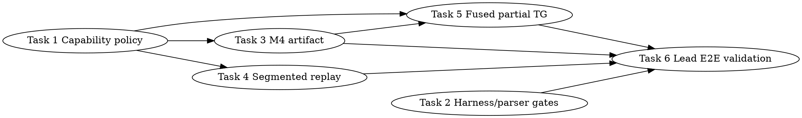

# SYCL MXFP4 MoE Aggressive TG Capability-Driven Optimization Plan

> **For Claude:** REQUIRED SUB-SKILL: Use team-driven-development to implement this plan with agent teams.

**Tracker:** `llama.cpp-kr62`

**Goal:** Add an opt-in, capability-driven SYCL MXFP4 MoE TG path that reaches B50 GPT-OSS 20B MXFP4 `TG128 >= 45 tok/s`, allows at most ~5% `PP512` regression versus same-build safe env, and keeps B580/Mistral correctness/no-fatal/no-regression gates green without hardware-name-specific policy branches.

**Architecture:** Keep the current safe env and `s77a` partial-route behavior as fallbacks. Add a narrow aggressive TG policy that is default-off, derives tile/subgroup/SLM decisions from `ggml_sycl_info().devices[device].xmx_caps`, first removes known launch/artifact overhead, then adds a lane-compacted partial TG fused path for `num_tokens == 1` / `total_batches < exec_n`. Partial TG must never enter `grouped-packed-q8-m2-device`; that full-tile grouped path stays guarded by `total_batches >= exec_n`.

**Tech Stack:** C++17/SYCL, Intel XMX/ESIMD DPAS, existing unified-cache `mem_handle` ownership, Python parser tests, bash gate harness, CTest.

**Test Infrastructure:**
- Source contract binary: `tests/test-sycl-moe-sequence-graphlet-policy.cpp`
- Parser tests: `tests/test-sycl-moe-profile-parser.py`
- Gate harness: `scripts/sycl-b50-gptoss-moe-gates.sh`
- Allocation policy: `scripts/check-sycl-alloc-usage.sh ggml/src/ggml-sycl`
- Targeted builds: `./scripts/sycl-build.sh llama-bench test-sycl-moe-sequence-graphlet-policy`
- Lead-only hardware/model gates on this workstation: B50 GPT-OSS and B580 Mistral commands from the harness.

---

## Current Anchors And Baseline

Current `s77a` validation logdir: `/tmp/s77a_partial_route_b50_20260626_075557`.

Current same-build numbers:

| Mode | PP512 tok/s | TG128 tok/s | Notes |
| --- | ---: | ---: | --- |
| Safe env | 1207.62 | 31.49 | Known-good phase/down path |
| Partial opt-in | 1193.08 | 32.69 | `diag.path.partial-packed-q8-m2-device=72`, fatal zero |

Relevant source anchors:
- Capability query struct: `ggml/src/ggml-sycl/xmx-esimd-common.hpp:70-86`
- Capability-derived fused config pattern: `ggml/src/ggml-sycl/moe-xmx-fused.hpp:70-109`
- Partial grouping env/log helpers: `ggml/src/ggml-sycl/mmvq.cpp:8370-8399`
- Existing M2 packed-Q8 submit seam: `ggml/src/ggml-sycl/mmvq.cpp:10516-10548`
- Existing M4 artifact submit overload pattern: `ggml/src/ggml-sycl/mmvq.cpp:10556-10588`
- Existing M2 kernel body / GLU store: `ggml/src/ggml-sycl/mmvq.cpp:6880-7090`
- Existing Q8 artifact store pattern in direct-Q8 kernel: `ggml/src/ggml-sycl/mmvq.cpp:7601-7647`
- Current XMX tiled branch and partial route: `ggml/src/ggml-sycl/mmvq.cpp:13003-13445`
- Current GLU-Q8 diagnostics: `ggml/src/ggml-sycl/mmvq.cpp:13539-13622`
- Graphlet counters: `ggml/src/ggml-sycl/ggml-sycl.cpp:439-456`
- Direct graphlet replay counter: `ggml/src/ggml-sycl/ggml-sycl.cpp:78768-78769`
- Segmented graphlet replay counter: `ggml/src/ggml-sycl/ggml-sycl.cpp:81682-81750`
- Harness grouped profile matrix: `scripts/sycl-b50-gptoss-moe-gates.sh:458-471`
- Parser bench/path/fatal options: `scripts/parse-sycl-moe-profile.py:350-456`
- Current source contract area: `tests/test-sycl-moe-sequence-graphlet-policy.cpp:891-1025`

Hard constraints:
- No B50/B580 hard-coded fast-path branches. B50/B580 are validation targets only.
- Production allocations must flow through unified-cache/mem_handle APIs; no raw `sycl::malloc_*` outside unified-cache implementation.
- Workers do not run hardware/model gates; lead-only and serial.
- Defaults remain unaffected until promotion gates pass.
- Stop hardware gates after `UR_RESULT_ERROR_DEVICE_LOST` or watchdog until fresh boot/reset.

---

## Team Topology

**Recommended implementers:** 4

**Reviewers:** 1 spec-reviewer, 1 quality-reviewer

### Parallel Tracks

| Track | Tasks | Description |
| --- | --- | --- |
| A | 1 | Capability-driven aggressive TG policy and source contracts |
| B | 2 | Parser/harness gates for TG>=45, PP regression, and portability validation |
| C | 3 | M4 GLU-Q8 artifact handoff optimization for current partial route |
| D | 4 | Segmented graph replay activation/evidence for aggressive TG |
| E | 5 | Lane-compacted fused partial TG kernel candidate using queried capabilities |
| Lead | 6 | End-to-end B50/B580 validation and tracker closure decision |

Tasks 1 and 2 can run in parallel. Tasks 3 and 4 depend on Task 1 because they consume the aggressive policy labels/env. Task 5 depends on Tasks 1 and 3 because it needs the capability policy and M4 artifact seam. Task 6 depends on all implementation/review tasks.

### Dependency Graph



### File Ownership Map

| File | Tasks | Conflict Risk |
| --- | --- | --- |
| `ggml/src/ggml-sycl/mmvq.cpp` | 1, 3, 5 | High: one writer at a time; Tasks 1 -> 3 -> 5 sequential |
| `ggml/src/ggml-sycl/ggml-sycl.cpp` | 4 | Medium: graphlet path only |
| `tests/test-sycl-moe-sequence-graphlet-policy.cpp` | 1, 2, 3, 4, 5 | High: one reviewer/lead reconciles additions after each task |
| `scripts/parse-sycl-moe-profile.py` | 2 | Low |
| `tests/test-sycl-moe-profile-parser.py` | 2 | Low |
| `scripts/sycl-b50-gptoss-moe-gates.sh` | 2 | Low/medium |
| `docs/plans/2026-06-26-sycl-moe-aggressive-tg-capability-driven.md` | Lead | Low |

---

## Testable Behaviors

1. Aggressive TG path is default-off.
2. Aggressive TG path uses queried capabilities (`xmx_caps`, subgroup support, work-group limits, SLM) rather than device-name branches.
3. Partial TG (`total_batches < exec_n`) never enters `grouped-packed-q8-m2-device`.
4. Aggressive TG parser/harness can require `tg128 >= 45`.
5. Aggressive TG parser/harness can enforce `PP512 >= 95%` of same-build safe env.
6. Harness runs B50 GPT-OSS speed gate and B580 Mistral correctness/no-regression gates.
7. M4 packed-Q8 path can publish a GLU-Q8 artifact, changing diagnostics from `fused_reject=no-kernel-q8` to `saved_launches=1` when eligible.
8. Aggressive TG graph replay must prove segmented or fused saved-submit evidence; direct per-node graphlet replay alone is insufficient.
9. Lane-compacted partial TG kernel is selected only when capability and shape gates pass; otherwise fallback is current `partial-packed-q8-m2-device` / `partial-direct-q8-device`.
10. Lead end-to-end validation records B50 `TG128 >= 45`, `PP512` within 5% of safe env, B580/Mistral no-fatal/no-regression, and no catastrophic path labels.

---

## Tasks

### Task 1: Capability-Driven Aggressive TG Policy

**Track:** A

**Depends on:** None

**File scope:**
- Modify: `ggml/src/ggml-sycl/mmvq.cpp:8370-8399`, `ggml/src/ggml-sycl/mmvq.cpp:13003-13445`
- Modify: `tests/test-sycl-moe-sequence-graphlet-policy.cpp:992-1025`

**Description:** Add a default-off aggressive TG policy helper that derives eligibility and tile settings from existing `xmx_caps`. This task does not add new math. It creates the capability-driven switch and labels that later tasks use. It must not mention B50/B580 in runtime policy.

**Acceptance Criteria:**
- [ ] `GGML_SYCL_MOE_AGGRESSIVE_TG=1` is required for the aggressive path.
- [ ] `mxfp4_moe_aggressive_tg_config_for_device()` uses `ggml_sycl_info().devices[device].xmx_caps` and `xmx_capabilities_match_int8_tile()`.
- [ ] Runtime policy contains no device-name conditionals (`B50`, `B580`, `Arc Pro`, `Arc B580`).
- [ ] `device_grouped_shape` still requires `total_batches >= exec_n`.
- [ ] Partial TG fallback labels remain `partial-packed-q8-m2-device` / `partial-direct-q8-device`.

#### RED: Write These Failing Tests

Append this function to `tests/test-sycl-moe-sequence-graphlet-policy.cpp` after the existing partial-route contract near line 992, and call it from `main()` before `PASS`:

```cpp
static int test_aggressive_tg_policy_is_capability_driven_and_default_off() {
    const std::string mmvq = read_file("ggml/src/ggml-sycl/mmvq.cpp");

    CHECK(contains(mmvq, "GGML_SYCL_MOE_AGGRESSIVE_TG"),
          "aggressive TG must have a narrow explicit opt-in env");
    CHECK(contains(mmvq, "mxfp4_moe_aggressive_tg_config_for_device"),
          "aggressive TG must centralize capability-derived policy");
    CHECK(contains(mmvq, "ggml_sycl_info().devices[device].xmx_caps") ||
              contains(mmvq, "ggml_sycl_info().devices[ctx.device].xmx_caps"),
          "aggressive TG policy must query xmx_caps at runtime");
    CHECK(contains(mmvq, "xmx_capabilities_match_int8_tile") &&
              contains(mmvq, "xmx_capabilities_support_sub_group"),
          "aggressive TG policy must gate on queried int8 tile and subgroup support");
    CHECK(!contains(mmvq, "B50") && !contains(mmvq, "B580") &&
              !contains(mmvq, "Arc Pro") && !contains(mmvq, "Arc B580"),
          "runtime policy must not branch on hardware marketing/device names");

    const std::string device_shape = required_region(
        mmvq, "const bool device_grouped_shape", "if (device_grouped_shape)");
    CHECK(contains(device_shape, "total_batches >= exec_n"),
          "partial TG must remain fail-closed away from grouped device path");

    return 0;
}
```

Add to `main()`:

```cpp
    if (int rc = test_aggressive_tg_policy_is_capability_driven_and_default_off()) return rc;
```

**Verify RED:**

```bash
./scripts/sycl-build.sh test-sycl-moe-sequence-graphlet-policy
./build/bin/test-sycl-moe-sequence-graphlet-policy
```

Expected RED: build succeeds, test fails because `GGML_SYCL_MOE_AGGRESSIVE_TG` and `mxfp4_moe_aggressive_tg_config_for_device` are missing.

#### GREEN: Implement Minimal Code

Add this helper block in `ggml/src/ggml-sycl/mmvq.cpp` immediately after `mxfp4_moe_partial_device_grouping_log()` near line 8378:

```cpp
static bool mxfp4_moe_aggressive_tg_requested() {
    static const bool requested = []() {
        const char * env = std::getenv("GGML_SYCL_MOE_AGGRESSIVE_TG");
        return env && std::atoi(env) != 0;
    }();
    return requested;
}

struct mxfp4_moe_aggressive_tg_config {
    bool        eligible      = false;
    const char * reject       = "disabled";
    int         repeat        = GGML_SYCL_MXFP4_MOE_XMX_M;
    int         exec_n        = GGML_SYCL_MXFP4_MOE_XMX_N;
    int         k_per         = GGML_SYCL_MXFP4_MOE_XMX_K;
    int         subgroup      = GGML_SYCL_MXFP4_MOE_XMX_SG;
    int         tile_n_total  = 0;
    int         tiles_n       = 0;
    size_t      slm_budget    = 0;
};

static mxfp4_moe_aggressive_tg_config mxfp4_moe_aggressive_tg_config_for_device(int device) {
    mxfp4_moe_aggressive_tg_config cfg;
    if (!mxfp4_moe_aggressive_tg_requested()) {
        return cfg;
    }
    const auto & xmx_caps = ggml_sycl_info().devices[device].xmx_caps;
    cfg.slm_budget       = xmx_caps.slm_size;
    cfg.tiles_n          = xmx_caps.optimal_tiles_n;
    cfg.tile_n_total     = static_cast<int>(xmx_caps.N) * xmx_caps.optimal_tiles_n;
    if (!xmx_caps.supported) {
        cfg.reject = "xmx-unsupported";
        return cfg;
    }
    if (!xmx_caps.supports_int8) {
        cfg.reject = "int8-unsupported";
        return cfg;
    }
    if (!xmx_capabilities_match_int8_tile(xmx_caps, cfg.repeat, cfg.exec_n, cfg.k_per)) {
        cfg.reject = "tile-mismatch";
        return cfg;
    }
    if (!xmx_capabilities_support_sub_group(xmx_caps, cfg.subgroup)) {
        cfg.reject = "subgroup-unsupported";
        return cfg;
    }
    if (xmx_caps.optimal_tiles_n <= 0 || cfg.tile_n_total < cfg.repeat || (cfg.tile_n_total % cfg.repeat) != 0) {
        cfg.reject = "tile-n-invalid";
        return cfg;
    }
    cfg.eligible = true;
    cfg.reject   = "none";
    return cfg;
}
```

In the XMX tiled branch near `ggml/src/ggml-sycl/mmvq.cpp:13027`, derive the config once:

```cpp
        const auto aggressive_tg_cfg = mxfp4_moe_aggressive_tg_config_for_device(ctx.device);
```

Do not route anything new yet. Later tasks consume `aggressive_tg_cfg`.

**Verify GREEN:**

```bash
./scripts/sycl-build.sh test-sycl-moe-sequence-graphlet-policy
./build/bin/test-sycl-moe-sequence-graphlet-policy
scripts/check-sycl-alloc-usage.sh ggml/src/ggml-sycl
git diff --check -- ggml/src/ggml-sycl/mmvq.cpp tests/test-sycl-moe-sequence-graphlet-policy.cpp
```

Expected: all pass.

#### REFACTOR

No refactor beyond keeping the helper block local to `mmvq.cpp`. Do not expose this in headers until another translation unit needs it.

#### Gotchas

- Do not cache values that depend on the selected SYCL device globally across devices.
- Do not branch on device names or PCI IDs.
- Do not weaken `device_grouped_shape total_batches >= exec_n`.
- Do not change default behavior when `GGML_SYCL_MOE_AGGRESSIVE_TG` is unset.

#### Commit

```bash
git add ggml/src/ggml-sycl/mmvq.cpp tests/test-sycl-moe-sequence-graphlet-policy.cpp
git commit -m "sycl: add capability-driven aggressive moe tg policy"
```

---

### Task 2: Parser And Harness Gates For Aggressive TG

**Track:** B

**Depends on:** None

**File scope:**
- Modify: `scripts/parse-sycl-moe-profile.py:350-456`
- Modify: `tests/test-sycl-moe-profile-parser.py:112-153`, `tests/test-sycl-moe-profile-parser.py:164-205`
- Modify: `scripts/sycl-b50-gptoss-moe-gates.sh:26-38`, `scripts/sycl-b50-gptoss-moe-gates.sh:250-302`, `scripts/sycl-b50-gptoss-moe-gates.sh:372-471`
- Modify: `tests/test-sycl-moe-sequence-graphlet-policy.cpp:891-955`

**Description:** Add validation support for the aggressive TG target: require `TG128 >= 45`, require `PP512` within 5% of same-build safe env, require aggressive path evidence, forbid catastrophic grouped path, and run B580/Mistral correctness/no-regression gates. Full threshold perf remains diagnostic-free.

**Acceptance Criteria:**
- [ ] Parser supports `--require-bench-within-pct TEST CANDIDATE_LOG BASELINE_LOG MAX_REGRESSION_PCT`.
- [ ] Harness has `--mode b50-aggressive-tg` and `--mode aggressive-suite`.
- [ ] B50 aggressive perf check requires `tg128 >= 45`, `tg128` present, fatal zero, and `PP512` within 5% of safe env.
- [ ] B50 aggressive diag check requires `diag.path.aggressive-partial` or `diag.path.aggressive-partial-fused-tg` and forbids `grouped-packed-q8-m2-device`.
- [ ] B580/Mistral count/perf gates run in `aggressive-suite` without aggressive hardware-name policy.

#### RED: Write These Failing Tests

Append to `tests/test-sycl-moe-profile-parser.py` before the manual test runner list:

```python
def test_parser_require_bench_within_pct_passes_when_candidate_within_limit() -> None:
    with tempfile.TemporaryDirectory() as td:
        tmp = Path(td)
        candidate = tmp / "candidate.stdout"
        baseline = tmp / "safe.stdout"
        candidate.write_text("| pp512 | 1193.08 ± 1.00 |\n| tg128 | 45.25 ± 0.20 |\n")
        baseline.write_text("| pp512 | 1207.62 ± 1.00 |\n| tg128 | 31.49 ± 0.20 |\n")
        out = run_parser(
            candidate,
            "--require-bench-within-pct",
            "pp512",
            str(candidate),
            str(baseline),
            "5",
        )
        assert "bench.pp512.tps_x100 119308" in out


def test_parser_require_bench_within_pct_fails_when_candidate_regresses_too_far() -> None:
    with tempfile.TemporaryDirectory() as td:
        tmp = Path(td)
        candidate = tmp / "candidate.stdout"
        baseline = tmp / "safe.stdout"
        candidate.write_text("| pp512 | 1100.00 ± 1.00 |\n| tg128 | 45.25 ± 0.20 |\n")
        baseline.write_text("| pp512 | 1207.62 ± 1.00 |\n")
        result = run_parser_result(
            candidate,
            "--require-bench-within-pct",
            "pp512",
            str(candidate),
            str(baseline),
            "5",
        )
        assert result.returncode == 10
        assert "bench pp512 regression too large" in result.stdout
```

Append to the harness dry-run test section:

```python
def test_aggressive_suite_dry_run_contains_speed_and_portability_gates() -> None:
    with tempfile.TemporaryDirectory() as td:
        logdir = Path(td) / "logs"
        result = subprocess.run(
            [
                "bash",
                str(HARNESS),
                "--mode",
                "aggressive-suite",
                "--dry-run",
                "--logdir",
                str(logdir),
            ],
            cwd=ROOT,
            text=True,
            capture_output=True,
            check=False,
        )
        assert result.returncode == 0, result.stderr
        out = result.stdout
        assert "GGML_SYCL_MOE_AGGRESSIVE_TG=1" in out
        assert "--require-bench-min tg128 45" in out
        assert "--require-bench-within-pct pp512" in out
        assert "--forbid-diag-path grouped-packed-q8-m2-device" in out
        assert "b580_aggressive_mistral" in out
        assert "GGML_SYCL_MOE_GLU_Q8_PUBLISH_DIAG=1" not in out.split("b50_aggressive_perf", 1)[1].split("\n", 1)[0]
```

Add a source contract in `tests/test-sycl-moe-sequence-graphlet-policy.cpp`:

```cpp
static int test_aggressive_tg_harness_gates() {
    const std::string harness = read_file("scripts/sycl-b50-gptoss-moe-gates.sh");
    const std::string parser  = read_file("scripts/parse-sycl-moe-profile.py");

    CHECK(contains(parser, "--require-bench-within-pct"),
          "parser must enforce PP regression against same-build safe env");
    CHECK(contains(harness, "aggressive-suite") && contains(harness, "b50-aggressive-tg"),
          "harness must expose aggressive TG gate modes");
    CHECK(contains(harness, "GGML_SYCL_MOE_AGGRESSIVE_TG=1"),
          "aggressive gate must use the narrow aggressive TG opt-in");
    CHECK(contains(harness, "--require-bench-min tg128 45"),
          "B50 aggressive gate must require TG128 >= 45 tok/s");
    CHECK(contains(harness, "--forbid-diag-path grouped-packed-q8-m2-device"),
          "aggressive gate must forbid catastrophic grouped partial path");
    CHECK(contains(harness, "--require-bench-within-pct pp512"),
          "aggressive gate must enforce PP512 <= 5% regression");
    CHECK(contains(harness, "b580_aggressive_mistral"),
          "aggressive suite must include B580/Mistral portability gates");
    return 0;
}
```

Call it from `main()`.

**Verify RED:**

```bash
python3 -m pytest tests/test-sycl-moe-profile-parser.py -q
./scripts/sycl-build.sh test-sycl-moe-sequence-graphlet-policy
./build/bin/test-sycl-moe-sequence-graphlet-policy
```

Expected RED: parser tests fail on missing option; source contract fails on missing harness modes.

#### GREEN: Implement Minimal Code

In `scripts/parse-sycl-moe-profile.py`, add this parser argument after `--require-bench-test`:

```python
    parser.add_argument(
        "--require-bench-within-pct",
        action="append",
        nargs=4,
        default=[],
        metavar=("TEST", "CANDIDATE_LOG", "BASELINE_LOG", "MAX_REGRESSION_PCT"),
        help="exit nonzero unless candidate TEST throughput is within MAX_REGRESSION_PCT below baseline",
    )
```

Add helper functions before `main()`:

```python
def best_bench_tps_from_path(path: Path, test: str) -> float:
    counters = collections.Counter()
    for log in iter_log_files([str(path)]):
        file_counters, _ = summarize_file(log)
        counters.update(file_counters)
    return counters.get(bench_tps_key(test), 0) / 100.0
```

Add validation in `main()` before `require_no_fatal_markers`:

```python
    for test, candidate_log, baseline_log, max_pct_text in args.require_bench_within_pct:
        max_pct = float(max_pct_text)
        candidate = best_bench_tps_from_path(Path(candidate_log), test)
        baseline = best_bench_tps_from_path(Path(baseline_log), test)
        if baseline <= 0.0:
            print(f"error: baseline bench {test} missing for regression check: {baseline_log}")
            return 10
        floor = baseline * (1.0 - max_pct / 100.0)
        if candidate < floor:
            print(
                f"error: bench {test} regression too large: "
                f"candidate={candidate:.2f} baseline={baseline:.2f} max_pct={max_pct:.2f} floor={floor:.2f}"
            )
            return 10
```

In `scripts/sycl-b50-gptoss-moe-gates.sh`:

1. Extend usage and mode validation with `b50-aggressive-tg|aggressive-suite`.
2. Add env arrays in `main()` after `grouped_decode_env`:

```bash
    local -a aggressive_tg_env=(
        GGML_SYCL_MOE_AGGRESSIVE_TG=1
    )
    local -a aggressive_tg_diag_env=(
        "${aggressive_tg_env[@]}"
        GGML_SYCL_MOE_GLU_Q8_PUBLISH_DIAG=1
        GGML_SYCL_GRAPH_DIAG=1
    )
```

3. Add check helpers near grouped decode checks:

```bash
run_aggressive_tg_diag_path_check() {
    local name="$1"
    local log_base="$2"
    run_cmd "$name" python3 scripts/parse-sycl-moe-profile.py --no-lines \
        --require-diag-path aggressive-partial \
        --forbid-diag-path grouped-packed-q8-m2-device --require-no-fatal-markers \
        "$LOGDIR/${log_base}.stderr"
}

run_aggressive_tg_perf_check() {
    local name="$1"
    local perf_base="$2"
    local safe_base="$3"
    run_cmd "$name" python3 scripts/parse-sycl-moe-profile.py --no-lines \
        --require-bench-test tg128 --require-bench-min tg128 45 \
        --require-bench-within-pct pp512 "$LOGDIR/${perf_base}.stdout" "$LOGDIR/${safe_base}.stdout" 5 \
        --require-no-fatal-markers \
        "$LOGDIR/${perf_base}.stdout" "$LOGDIR/${perf_base}.stderr"
}
```

4. Add mode body before final `echo`:

```bash
    if [[ "$MODE" == "b50-aggressive-tg" || "$MODE" == "aggressive-suite" ]]; then
        run_b50_gptoss_bench b50_aggressive_safe_perf "${safe_env[@]}"
        run_b50_gptoss_diag_bench b50_aggressive_diag "${aggressive_tg_diag_env[@]}"
        run_aggressive_tg_diag_path_check b50_aggressive_diag_path_check b50_aggressive_diag
        run_b50_gptoss_bench b50_aggressive_perf "${aggressive_tg_env[@]}"
        run_aggressive_tg_perf_check b50_aggressive_perf_check b50_aggressive_perf b50_aggressive_safe_perf
    fi

    if [[ "$MODE" == "aggressive-suite" ]]; then
        run_b580_mistral_count_gate b580_aggressive_mistral_count
        run_b580_mistral_bench b580_aggressive_mistral_default_perf
        run_b580_mistral_bench b580_aggressive_mistral_perf "${aggressive_tg_env[@]}"
        run_default_candidate_fatal_check b580_aggressive_mistral_fatal_check b580_aggressive_mistral_perf
    fi
```

**Verify GREEN:**

```bash
python3 -m pytest tests/test-sycl-moe-profile-parser.py -q
bash -n scripts/sycl-b50-gptoss-moe-gates.sh
./scripts/sycl-build.sh test-sycl-moe-sequence-graphlet-policy
./build/bin/test-sycl-moe-sequence-graphlet-policy
scripts/sycl-b50-gptoss-moe-gates.sh --mode aggressive-suite --dry-run --logdir /tmp/aggressive_tg_dryrun
```

Expected: parser/source tests pass; dry-run shows B50 safe perf, B50 aggressive diag/path, B50 aggressive perf/check, and B580/Mistral gates.

#### REFACTOR

If the dry-run line for `b50_aggressive_perf` includes `GGML_SYCL_MOE_GLU_Q8_PUBLISH_DIAG=1`, split env arrays so threshold perf stays diagnostic-free.

#### Gotchas

- `--require-bench-within-pct` intentionally reads candidate and baseline paths separately; do not rely on aggregate totals because aggregate cannot tell safe from candidate.
- Keep `--require-no-fatal-markers` on stderr as well as stdout.
- Do not run B50/B580 gates as a worker.

#### Commit

```bash
git add scripts/parse-sycl-moe-profile.py tests/test-sycl-moe-profile-parser.py scripts/sycl-b50-gptoss-moe-gates.sh tests/test-sycl-moe-sequence-graphlet-policy.cpp
git commit -m "test: gate aggressive sycl moe tg performance"
```

---

### Task 3: M4 GLU-Q8 Artifact Handoff For Partial TG

**Track:** C

**Depends on:** Task 1

**File scope:**
- Modify: `ggml/src/ggml-sycl/mmvq.cpp:7300-7647`
- Modify: `ggml/src/ggml-sycl/mmvq.cpp:10556-10588`
- Modify: `ggml/src/ggml-sycl/mmvq.cpp:13415-13445`
- Modify: `ggml/src/ggml-sycl/mmvq.cpp:13539-13622`
- Modify: `tests/test-sycl-moe-sequence-graphlet-policy.cpp:992-1025`

**Description:** Current validation showed `diag.fused_reject.no-kernel-q8=72`, so the partial packed-Q8 path still publishes a GLU tensor without saving the down-stage launch. A read-only prep review found the earlier M2 artifact idea unsafe: `QK8_1 == 32`, while M2 with `Repeat=8` covers only `2 * Repeat == 16` rows per work-item, so M2 would create half-block/race hazards. Use the existing M4 artifact-capable path instead because M4 covers `4 * Repeat == 32` rows and already writes the Q8_1 artifact layout correctly.

**Acceptance Criteria:**
- [ ] The source contract explicitly forbids adding a Q8_1 artifact store to M2 unless a future implementation proves a true 32-row M2-derived variant.
- [ ] Aggressive artifact path uses existing `mxfp4_pair_glu_xmx_tiled_dpas_m4_submit<repeat>` with non-null `dst_q8_soa` and positive `q8_row_size`, or an equivalently 32-row-safe submit.
- [ ] Artifact path only activates when `aggressive_tg_cfg.eligible`, `num_tokens == 1`, `0 < total_batches < exec_n`, `n_gpu_entries == total_batches`, valid device ids/strides, `grouped_down_q8 != nullptr`, and `(ne01 % QK8_1) == 0`.
- [ ] Aggressive partial path label becomes `aggressive-partial-packed-q8-m4-artifact` when artifact store succeeds.
- [ ] Diagnostics report `saved_launches=1` only when a real Q8 artifact destination is passed; otherwise existing fallback labels remain.
- [ ] Aggressive artifact allocation does not rely on quarantined `GGML_SYCL_MOE_GLU_Q8_FUSED_XMX_UNSAFE`.

#### RED: Write These Failing Tests

Add this function to `tests/test-sycl-moe-sequence-graphlet-policy.cpp`:

```cpp
static int test_aggressive_tg_m4_artifact_handoff_contract() {
    const std::string mmvq = read_required_file("ggml/src/ggml-sycl/mmvq.cpp");
    const std::string m2_kernel = required_region(
        mmvq, "static sycl::event mxfp4_pair_glu_xmx_tiled_dpas_m2_sycl", "template <int Repeat>",
        "M2 kernel region");
    const std::string m4_submit = required_region(
        mmvq, "static sycl::event mxfp4_pair_glu_xmx_tiled_dpas_m4_submit", "template <int Repeat>",
        "M4 submit region");
    const std::string xmx_branch = required_region(
        mmvq, "if (!used_direct_xmx && weight_layout == GGML_LAYOUT_XMX_TILED)",
        "if (weight_layout == GGML_LAYOUT_XMX_TILED && !used_xmx_tiled_dpas)",
        "XMX tiled branch");

    CHECK(!contains(m2_kernel, "dst_q8_soa") && !contains(m2_kernel, "q8_row_size"),
          "M2 must not write Q8_1 artifacts because it covers only 16 rows for Repeat=8");
    CHECK(contains(m4_submit, "dst_q8_soa") && contains(m4_submit, "q8_row_size"),
          "M4 submit must remain the artifact-capable 32-row path");
    CHECK(contains(xmx_branch, "aggressive-partial-packed-q8-m4-artifact"),
          "aggressive artifact path must use a stable M4 artifact label");
    CHECK(contains(xmx_branch, "aggressive_tg_cfg.eligible") && contains(xmx_branch, "num_tokens == 1") &&
              contains(xmx_branch, "total_batches < exec_n") && contains(xmx_branch, "n_gpu_entries == total_batches") &&
              contains(xmx_branch, "ne01 % QK8_1"),
          "aggressive M4 artifact route must be capability, partial-shape, and Q8-block gated");
    CHECK(!contains(required_region(xmx_branch, "aggressive-partial-packed-q8-m4-artifact",
                                    "partial-packed-q8-m2-device", "aggressive artifact route"),
                    "GGML_SYCL_MOE_GLU_Q8_FUSED_XMX_UNSAFE"),
          "aggressive artifact route must not depend on quarantined unsafe fused-XMX env");
    return 0;
}
```

Call it from `main()`.

**Verify RED:**

```bash
./scripts/sycl-build.sh test-sycl-moe-sequence-graphlet-policy
./build/bin/test-sycl-moe-sequence-graphlet-policy
```

Expected RED: test fails because the aggressive M4 artifact route and label do not exist.

#### GREEN: Implement Minimal Code

1. Do **not** modify `mxfp4_pair_glu_xmx_tiled_dpas_m2_sycl()` to write Q8 artifacts. Leave M2 artifact-free.

2. Add a safe aggressive-only artifact destination in the XMX tiled branch around `mmvq.cpp:12960-12975`, before the current `grouped_down_q8`/activation buffer logic. Use existing `mmvq_alloc_device_scratch()` and `local_temps.add()` ownership, not raw SYCL allocation:

```cpp
    const bool aggressive_tg_requested_local = mxfp4_moe_aggressive_tg_requested();
    void * aggressive_down_q8 = nullptr;
    ggml_sycl::mem_handle aggressive_down_q8_handle;
    if (aggressive_tg_requested_local && fused_glu_q8_candidate && grouped_down_q8 == nullptr) {
        aggressive_down_q8 = mmvq_alloc_device_scratch(required_size, *stream,
                                                       "mmvq_moe_aggressive_partial_down_q8",
                                                       aggressive_down_q8_handle);
        if (aggressive_down_q8) {
            local_temps.add(std::move(aggressive_down_q8_handle));
        }
    }
```

3. In the non-grouped partial packed path near `mmvq.cpp:13420`, add:

```cpp
                const bool aggressive_partial_artifact = aggressive_tg_cfg.eligible && partial_device_grouped_route &&
                                                         aggressive_down_q8 != nullptr && num_tokens == 1 &&
                                                         total_batches > 0 && total_batches < exec_n &&
                                                         n_gpu_entries == total_batches && ids_device && ids_nb0 > 0 &&
                                                         ids_nb1 > 0 && (ne01 % QK8_1) == 0;
```

4. If `aggressive_partial_artifact` is true, submit the existing M4 artifact path instead of M2:

```cpp
                if (aggressive_partial_artifact) {
                    kernel_event = mxfp4_pair_glu_xmx_tiled_dpas_m4_submit<repeat>(
                        *stream, gate_ptrs_device, up_ptrs_device, b_packed, y_scales, glu_d, ids_device,
                        gate_bias_device, up_bias_device, ne00, ne01, static_cast<int>(total_batches),
                        static_cast<int>(num_tokens), ids_nb0, ids_nb1, glu_dst->nb[1], glu_dst->nb[2],
                        gate_bias_nb1, up_bias_nb1, glu_op, alpha, limit, tile_n_total, pack_event,
                        aggressive_down_q8, glu_q8_row_size);
                    fused_glu_q8_used = true;
                    grouped_down_q8 = aggressive_down_q8;
                    xmx_tiled_path = "aggressive-partial-packed-q8-m4-artifact";
                } else {
                    kernel_event = mxfp4_pair_glu_xmx_tiled_dpas_m2_submit<repeat>(
                        *stream, gate_ptrs_device, up_ptrs_device, b_packed, y_scales, glu_d, ids_device,
                        gate_bias_device, up_bias_device, ne00, ne01, static_cast<int>(total_batches),
                        static_cast<int>(num_tokens), ids_nb0, ids_nb1, glu_dst->nb[1], glu_dst->nb[2], gate_bias_nb1,
                        up_bias_nb1, glu_op, alpha, limit, tile_n_total, pack_event);
                    xmx_tiled_path = partial_device_grouped_route ? "partial-packed-q8-m2-device" : "packed-q8-m2";
                }
```

5. Ensure existing GLU-Q8 diagnostics see `fused_glu_q8_used=true` and the aggressive label, so `saved_launches=1` is emitted only for the artifact route.

**Verify GREEN:**

```bash
./scripts/sycl-build.sh llama-bench test-xmx-moe-mxfp4 test-sycl-moe-sequence-graphlet-policy
source /opt/intel/oneapi/setvars.sh --force && ctest --test-dir build -R 'xmx-moe-mxfp4|test-sycl-moe-sequence-graphlet-policy' --output-on-failure
scripts/check-sycl-alloc-usage.sh ggml/src/ggml-sycl
git diff --check -- ggml/src/ggml-sycl/mmvq.cpp tests/test-sycl-moe-sequence-graphlet-policy.cpp
```

Expected: all pass. No hardware/model gates by worker.

#### REFACTOR

If the M4 artifact route is correct but slower than M2 in lead hardware logs, file a new spike for a true 32-row M2-derived artifact design. Do not implement a 16-row Q8_1 writer in this task.

#### Gotchas

- `QK8_1 == 32`; M2 with `Repeat=8` covers only 16 rows. Do not write Q8_1 from M2.
- Do not alias `q8_src` and `dst_q8_soa`; comments near `mmvq.cpp:12963` warn that aliasing can corrupt activation Q8.
- Ensure `fused_glu_q8_used` is true only when an artifact destination was actually passed.
- `saved_launches=1` must be real, not a diagnostic-only label.
- The aggressive artifact destination must be mem_handle-owned through `mmvq_alloc_device_scratch()`/`local_temps`, not raw allocation.

#### Commit

```bash
git add ggml/src/ggml-sycl/mmvq.cpp tests/test-sycl-moe-sequence-graphlet-policy.cpp
git commit -m "sycl: publish q8 artifact from aggressive mxfp4 tg path"
```

---

### Task 4: Segmented Graph Replay Evidence For Aggressive TG

**Track:** D

**Depends on:** Task 1

**File scope:**
- Modify: `ggml/src/ggml-sycl/ggml-sycl.cpp:439-456`
- Modify: `ggml/src/ggml-sycl/ggml-sycl.cpp:81000-81304`
- Modify: `ggml/src/ggml-sycl/ggml-sycl.cpp:81682-81750`
- Modify: `tests/test-sycl-moe-sequence-graphlet-policy.cpp:520-610`, `tests/test-sycl-moe-sequence-graphlet-policy.cpp:891-955`

**Description:** Current diagnostics show many direct graphlet replays and zero segmented replay. For aggressive TG, direct per-node replay alone is not an optimized substrate. This task makes aggressive TG require segmented replay evidence or a true fused saved-launch path before a promotion candidate can pass.

**Acceptance Criteria:**
- [ ] `GGML_SYCL_MOE_AGGRESSIVE_TG=1` participates in sequence graphlet mode hash.
- [ ] Aggressive TG diagnostics can distinguish direct replay from segmented replay.
- [ ] Parser/harness aggressive activation check rejects direct-only replay when no fused saved-launch counter exists.
- [ ] Existing safe/default behavior is unchanged when aggressive env is unset.

#### RED: Write These Failing Tests

Add to `tests/test-sycl-moe-sequence-graphlet-policy.cpp`:

```cpp
static int test_aggressive_tg_requires_segmented_or_fused_evidence() {
    const std::string sycl    = read_file("ggml/src/ggml-sycl/ggml-sycl.cpp");
    const std::string parser  = read_file("scripts/parse-sycl-moe-profile.py");
    const std::string harness = read_file("scripts/sycl-b50-gptoss-moe-gates.sh");

    CHECK(contains(sycl, "GGML_SYCL_MOE_AGGRESSIVE_TG"),
          "aggressive TG env must participate in graphlet policy/mode hash");
    CHECK(contains(sycl, "sequence_graphlet_segmented_replay_calls") &&
              contains(sycl, "sequence_graphlet_direct_replay_calls"),
          "graph diagnostics must expose segmented and direct replay counters");
    CHECK(contains(parser, "--require-aggressive-optimized-substrate"),
          "parser must reject direct-only aggressive replay evidence");
    CHECK(contains(harness, "--require-aggressive-optimized-substrate"),
          "aggressive harness must require segmented/fused saved-launch evidence");
    return 0;
}
```

Add parser tests in `tests/test-sycl-moe-profile-parser.py`:

```python
def test_parser_aggressive_optimized_substrate_rejects_direct_only() -> None:
    with tempfile.TemporaryDirectory() as td:
        tmp = Path(td) / "diag.stderr"
        tmp.write_text(
            "[GRAPH-DIAG] phase=TG sequence_graphlet_direct_replay_calls=3816 "
            "sequence_graphlet_segmented_replay_calls=0 sequence_graphlet_replay=3816\n"
        )
        result = run_parser_result(tmp, "--require-aggressive-optimized-substrate")
        assert result.returncode == 11
        assert "aggressive optimized substrate missing" in result.stdout


def test_parser_aggressive_optimized_substrate_accepts_segmented_or_saved_launch() -> None:
    with tempfile.TemporaryDirectory() as td:
        tmp = Path(td) / "diag.stderr"
        tmp.write_text(
            "[GRAPH-DIAG] phase=TG sequence_graphlet_direct_replay_calls=12 "
            "sequence_graphlet_segmented_replay_calls=48 sequence_graphlet_replay=60\n"
            "[MOE-GLU-Q8-DIAG] action=fused-store path=aggressive-partial-packed-q8-m4-artifact saved_launches=1\n"
        )
        out = run_parser(tmp, "--require-aggressive-optimized-substrate")
        assert "counter.sequence_graphlet_segmented_replay_calls 48" in out
```

**Verify RED:**

```bash
python3 -m pytest tests/test-sycl-moe-profile-parser.py -q
./scripts/sycl-build.sh test-sycl-moe-sequence-graphlet-policy
./build/bin/test-sycl-moe-sequence-graphlet-policy
```

Expected RED: parser option missing; source contract fails.

#### GREEN: Implement Minimal Code

1. In `scripts/parse-sycl-moe-profile.py`, add `--require-aggressive-optimized-substrate` boolean. Implement:

```python
def aggressive_optimized_substrate(counters: collections.Counter[str]) -> bool:
    segmented = counters.get("counter.sequence_graphlet_segmented_replay_calls", 0)
    saved = counters.get("diag.action.fused-store", 0)
    saved_launches = counters.get("saved_launches", 0)
    aggressive_paths = sum(
        value for key, value in counters.items()
        if key.startswith("diag.path.aggressive-partial")
    )
    return segmented > 0 or (aggressive_paths > 0 and (saved > 0 or saved_launches > 0))
```

Add return code 11 with message `error: aggressive optimized substrate missing` if false.

2. In `ggml/src/ggml-sycl/ggml-sycl.cpp`, include aggressive env in `moe_sequence_graphlet_mode_hash()` near lines 20318-20331:

```cpp
    mix_env("GGML_SYCL_MOE_AGGRESSIVE_TG");
```

3. Ensure the existing segmented replay path at `ggml-sycl.cpp:81682-81750` is not bypassed when aggressive env is set. If an aggressive fast path has a fused saved-launch path, diagnostics may pass without segmented replay, but direct-only replay must fail parser activation.

4. In `scripts/sycl-b50-gptoss-moe-gates.sh`, add `--require-aggressive-optimized-substrate` to `run_aggressive_tg_diag_path_check()` from Task 2.

**Verify GREEN:**

```bash
python3 -m pytest tests/test-sycl-moe-profile-parser.py -q
bash -n scripts/sycl-b50-gptoss-moe-gates.sh
./scripts/sycl-build.sh test-sycl-moe-sequence-graphlet-policy
./build/bin/test-sycl-moe-sequence-graphlet-policy
git diff --check -- ggml/src/ggml-sycl/ggml-sycl.cpp scripts/parse-sycl-moe-profile.py scripts/sycl-b50-gptoss-moe-gates.sh tests/test-sycl-moe-profile-parser.py tests/test-sycl-moe-sequence-graphlet-policy.cpp
```

Expected: all pass.

#### REFACTOR

Do not rewrite graphlet recording in this task. This task is an evidence gate plus mode-hash isolation. If segmented replay still stays zero in lead hardware logs, Task 5 must provide fused saved-launch evidence.

#### Gotchas

- Direct replay counters can be nonzero; they are rejected only when they are the only evidence.
- Mode hash must include aggressive env so cached graphlets recorded under safe env are not replayed under aggressive env.
- Do not add drain waits to force correctness; drain waits can destroy TG speed.

#### Commit

```bash
git add ggml/src/ggml-sycl/ggml-sycl.cpp scripts/parse-sycl-moe-profile.py scripts/sycl-b50-gptoss-moe-gates.sh tests/test-sycl-moe-profile-parser.py tests/test-sycl-moe-sequence-graphlet-policy.cpp
git commit -m "test: require optimized substrate for aggressive moe tg"
```

---

### Task 5: Lane-Compacted Fused Partial TG Candidate

**Track:** E

**Depends on:** Tasks 1 and 3

**File scope:**
- Modify: `ggml/src/ggml-sycl/mmvq.cpp:5816-5874`
- Modify: `ggml/src/ggml-sycl/mmvq.cpp:6880-7090`
- Modify: `ggml/src/ggml-sycl/mmvq.cpp:10516-10548`
- Modify: `ggml/src/ggml-sycl/mmvq.cpp:13003-13445`
- Modify: `ggml/src/ggml-sycl/mmvq.cpp:13539-13622`
- Modify: `tests/test-sycl-moe-sequence-graphlet-policy.cpp:992-1025`

**Description:** Add the actual aggressive candidate: a lane-compacted partial TG path that avoids full grouped `exec_n` lane waste and uses capability-derived tile settings. The first version may reuse the existing pack kernel plus M4 artifact path from Task 3; if that does not reach 45, this task adds a fused `pack+pair-GLU+artifact` submit that still writes the same `dst_glu` and Q8_1 artifact outputs.

**Acceptance Criteria:**
- [ ] New label `aggressive-partial-fused-tg` exists and is only reachable under `GGML_SYCL_MOE_AGGRESSIVE_TG=1`.
- [ ] Activation predicate requires `aggressive_tg_cfg.eligible`, `num_tokens == 1`, `0 < total_batches < exec_n`, `n_gpu_entries == total_batches`, valid device ids/strides, and XMX tiled layout.
- [ ] No grouped metadata arrays are allocated for partial TG.
- [ ] No raw SYCL allocation is introduced.
- [ ] Fallback to `partial-packed-q8-m2-device` / `partial-direct-q8-device` remains intact.
- [ ] Diagnostics include `path=aggressive-partial-fused-tg`, `active_rows`, `exec_n`, `tile_n_total`, and `saved_launches`.

#### RED: Write These Failing Tests

Add to `tests/test-sycl-moe-sequence-graphlet-policy.cpp`:

```cpp
static int test_aggressive_partial_fused_tg_contract() {
    const std::string mmvq = read_file("ggml/src/ggml-sycl/mmvq.cpp");
    const std::string xmx_branch = required_region(
        mmvq, "if (!used_direct_xmx && weight_layout == GGML_LAYOUT_XMX_TILED)",
        "if (weight_layout == GGML_LAYOUT_XMX_TILED && !used_xmx_tiled_dpas)");

    CHECK(contains(mmvq, "aggressive-partial-fused-tg"),
          "aggressive partial fused TG path must have stable diagnostic label");
    CHECK(contains(xmx_branch, "aggressive_tg_cfg.eligible") && contains(xmx_branch, "total_batches < exec_n") &&
              contains(xmx_branch, "num_tokens == 1") && contains(xmx_branch, "n_gpu_entries == total_batches"),
          "aggressive partial fused TG must be shape/capability gated");
    CHECK(!contains(required_region(xmx_branch, "aggressive-partial-fused-tg", "partial-packed-q8-m2-device"),
                    "mxfp4_build_grouped_metadata_from_ids_sycl"),
          "aggressive partial fused TG must not build grouped metadata");
    CHECK(contains(mmvq, "mxfp4_pair_glu_xmx_tiled_partial_fused_tg_submit") ||
              contains(mmvq, "aggressive_artifact"),
          "aggressive path must either submit fused partial TG kernel or use M4 artifact fast path");
    CHECK(contains(mmvq, "active_rows=") && contains(mmvq, "tile_n_total="),
          "aggressive diagnostics must expose active rows and capability-derived tile_n_total");
    return 0;
}
```

Call it from `main()`.

**Verify RED:**

```bash
./scripts/sycl-build.sh test-sycl-moe-sequence-graphlet-policy
./build/bin/test-sycl-moe-sequence-graphlet-policy
```

Expected RED: fails because the fused label and diagnostics do not exist.

#### GREEN: Implement Minimal Code

Implement the candidate in two steps inside one task; stop after step 1 only if local non-hardware gates fail.

**Step 1: Aggressive artifact fast path label.** In `mmvq.cpp:13420-13445`, after Task 3 adds the M4 artifact route, route the aggressive-eligible artifact path:

```cpp
                const bool aggressive_partial_fast_path = aggressive_tg_cfg.eligible && partial_device_grouped_route;
                const bool aggressive_artifact = aggressive_partial_fast_path && grouped_down_q8 != nullptr &&
                                                 (ne01 % QK8_1) == 0;
```

Set label:

```cpp
                xmx_tiled_path = aggressive_artifact ? "aggressive-partial-fused-tg" :
                                  (partial_device_grouped_route ? "partial-packed-q8-m2-device" : "packed-q8-m2");
```

This is allowed only when the selected code path is the Task 3 M4 artifact-capable submit (or an equivalently 32-row-safe submit) that publishes a valid `QK8_1` artifact while producing pair-GLU output, saving the downstream publish/launch.

**Step 2: If code review requires a distinct submit symbol, add a thin wrapper around the M4 artifact-capable submit.** The wrapper must forward to `mxfp4_pair_glu_xmx_tiled_dpas_m4_submit<Repeat>` (or the Task 3 helper around it) with non-null `dst_q8_soa` and positive `q8_row_size`. Do not wrap `mxfp4_pair_glu_xmx_tiled_dpas_m2_submit()` for Q8 artifact publishing; M2 remains artifact-free unless a future task proves a true 32-row M2-derived variant.

Add a bounded diagnostic line next to `mxfp4_moe_partial_device_grouping_log()` or in the existing Q8 diagnostic block:

```cpp
fprintf(stderr,
        "[MOE-AGGRESSIVE-TG] action=accept path=%s active_rows=%lld exec_n=%d tile_n_total=%d saved_launches=%d\n",
        xmx_tiled_path, (long long) total_batches, exec_n, aggressive_tg_cfg.tile_n_total,
        aggressive_artifact ? 1 : 0);
```

Gate this diagnostic behind `GGML_SYCL_MOE_GLU_Q8_PUBLISH_DIAG` or `GGML_SYCL_GRAPH_DIAG`, and cap it with an atomic counter like the partial grouping log.

**Verify GREEN:**

```bash
./scripts/sycl-build.sh llama-bench test-xmx-moe-mxfp4 test-sycl-moe-sequence-graphlet-policy
source /opt/intel/oneapi/setvars.sh --force && ctest --test-dir build -R 'xmx-moe-mxfp4|test-sycl-moe-sequence-graphlet-policy' --output-on-failure
scripts/check-sycl-alloc-usage.sh ggml/src/ggml-sycl
git diff --check -- ggml/src/ggml-sycl/mmvq.cpp tests/test-sycl-moe-sequence-graphlet-policy.cpp
```

Expected: all pass.

#### REFACTOR

If Step 1 reaches the target in lead validation, do not add a larger kernel in this sprint. If Step 1 is correct but below 45, create a follow-up task that fuses `mxfp4_dpas_pack_q8_single_col_groups_sycl()` with a 32-row-safe compute/artifact loop so Q8 pack and pair-GLU/artifact become one submit. That follow-up must start with a new source contract and lead profile evidence showing pack submit overhead is material.

#### Gotchas

- The label `aggressive-partial-fused-tg` must mean a real saved launch or fused artifact store, not just the old path renamed.
- Do not make `GGML_SYCL_MOE_AGGRESSIVE_TG` imply `GGML_SYCL_MOE_GROUPED_DECODE`.
- Do not build grouped metadata for partial TG.
- Capability values must come from `xmx_caps`; no hard-coded B50/B580 policy.
- This task can improve speed without meeting 45 alone; Task 6 decides whether the sprint succeeded.

#### Commit

```bash
git add ggml/src/ggml-sycl/mmvq.cpp tests/test-sycl-moe-sequence-graphlet-policy.cpp
git commit -m "sycl: add aggressive partial moe tg fused artifact path"
```

---

### Task 6: Lead-Owned End-To-End Validation And Decision

**Track:** Lead

**Depends on:** Tasks 1, 2, 3, 4, 5 and independent SPEC/QUALITY reviews

**File scope:**
- No code edits unless validation finds a blocker and lead files a follow-up task.
- Update tracker: `llama.cpp-kr62`

**Description:** Run standard gates on the real workstation. Workers must not run these hardware/model commands.

**Acceptance Criteria:**
- [ ] Parser tests pass.
- [ ] Harness bash syntax passes.
- [ ] Source contract CTest passes.
- [ ] Alloc policy passes.
- [ ] B50 GPT-OSS count gate passes.
- [ ] B50 aggressive TG perf passes: `TG128 >= 45`, `PP512 >= 95%` of same-build safe env, fatal zero.
- [ ] B50 aggressive diag proves path evidence and forbids `grouped-packed-q8-m2-device`.
- [ ] B580/Mistral correctness/no-fatal/no-regression gates pass.
- [ ] If device-lost/watchdog occurs, stop and mark validation blocked until reboot/reset.

#### RED: Validation Fails Before Implementation

Before implementation, this command must fail because aggressive mode is missing or cannot hit `TG128 >= 45`:

```bash
source /opt/intel/oneapi/setvars.sh --force
scripts/sycl-b50-gptoss-moe-gates.sh --mode aggressive-suite --logdir /tmp/sycl_aggressive_tg_pre_$(date +%Y%m%d_%H%M%S)
```

Expected RED: nonzero exit due missing path evidence or `tg128 < 45`.

#### GREEN: Run Final Validation

After all tasks and reviews pass, run:

```bash
python3 -m pytest tests/test-sycl-moe-profile-parser.py -q
bash -n scripts/sycl-b50-gptoss-moe-gates.sh
./scripts/sycl-build.sh llama-bench test-sycl-moe-sequence-graphlet-policy
source /opt/intel/oneapi/setvars.sh --force && ctest --test-dir build -R test-sycl-moe-sequence-graphlet-policy --output-on-failure
scripts/check-sycl-alloc-usage.sh ggml/src/ggml-sycl
```

Then lead-only hardware gates:

```bash
source /opt/intel/oneapi/setvars.sh --force
scripts/sycl-b50-gptoss-moe-gates.sh --mode aggressive-suite --logdir /tmp/sycl_aggressive_tg_$(date +%Y%m%d_%H%M%S)
```

Expected GREEN:
- `generated.count_exact.true 1` for GPT-OSS count gate.
- `fatal.total 0` across B50/B580 aggressive logs.
- `diag.path.aggressive-partial-fused-tg > 0` or `diag.path.aggressive-partial-packed-q8-m4-artifact > 0`.
- `diag.path.grouped-packed-q8-m2-device` absent.
- `bench.tg128.tps_x100 >= 4500` for B50 aggressive perf.
- B50 aggressive `pp512` is at least 95% of `b50_aggressive_safe_perf`.
- B580/Mistral gates complete with no fatal markers and no material regression.

#### REFACTOR

If B50 reaches 45 but B580 regresses, do not promote. Keep the path opt-in, file a B580 portability follow-up, and record the exact capability/fallback evidence.

#### Gotchas

- Do not continue hardware gates after `UR_RESULT_ERROR_DEVICE_LOST`, `[SYCL-WATCHDOG]`, or a wedged process.
- Do not run `sycl-ls` as a health probe on this workstation.
- Full threshold perf must not include diagnostic envs.
- A passing B50 speed gate is not default promotion; default promotion needs a separate promotion-candidate task and review.

#### Commit

Validation evidence is not committed unless logs are summarized in docs. Tracker update command:

```bash
LOGDIR=/tmp/sycl_aggressive_tg_YYYYMMDD_HHMMSS
SUMMARY=$(python3 scripts/parse-sycl-moe-profile.py --no-lines "$LOGDIR" | tr '\n' '; ')
codescout task comment add llama.cpp-kr62 --author lead --body "Aggressive TG validation logdir=$LOGDIR summary=$SUMMARY"
```

---

## End-to-End Validation (on the user's machine) — MANDATORY

**Environment:** `/Apps/llama.cpp` on this workstation, Intel oneAPI sourced from `/opt/intel/oneapi/setvars.sh`, B50 selected with `ONEAPI_DEVICE_SELECTOR=level_zero:1`, B580 selected with `ONEAPI_DEVICE_SELECTOR=level_zero:0`, models under `/Storage/GenAI/models/`.

**Steps Claude runs itself:**

1. Non-hardware gates:

```bash
python3 -m pytest tests/test-sycl-moe-profile-parser.py -q
bash -n scripts/sycl-b50-gptoss-moe-gates.sh
./scripts/sycl-build.sh llama-bench test-sycl-moe-sequence-graphlet-policy
source /opt/intel/oneapi/setvars.sh --force && ctest --test-dir build -R test-sycl-moe-sequence-graphlet-policy --output-on-failure
scripts/check-sycl-alloc-usage.sh ggml/src/ggml-sycl
```

Expected: all pass.

2. Lead-only real hardware/model gate:

```bash
source /opt/intel/oneapi/setvars.sh --force
scripts/sycl-b50-gptoss-moe-gates.sh --mode aggressive-suite --logdir /tmp/sycl_aggressive_tg_$(date +%Y%m%d_%H%M%S)
```

Expected observable output in parser summaries:
- `fatal.total 0`
- `generated.count_exact.true 1` for GPT-OSS count gate
- B50 aggressive `bench.tg128.tps_x100 >= 4500`
- B50 aggressive `bench.pp512` within 5% of same-build safe env
- `diag.path.grouped-packed-q8-m2-device` absent
- aggressive path label present
- B580/Mistral count/perf gates complete with no fatal markers

**Steps requiring the user:** None planned. If the GPU enters device-lost/watchdog state, the user may need to reboot/reset the machine; the agent must stop gates and report the blocked state rather than continue.

**Observed success:** The lead records the logdir and summary in `llama.cpp-kr62`, including B50 `PP512/TG128`, safe env `PP512/TG128`, B580/Mistral results, path labels, and fatal marker totals.

Automated tests passing is necessary but not sufficient; the real B50/B580 model gates are mandatory before declaring the plan successful.

---

## Spec Self-Review

### Coverage scan

Every approved design element has an owning task:
- Capability-driven default-off policy: Task 1
- No hardware-name branches: Task 1 source contract
- Standard speed/correctness gates: Task 2 and Task 6
- PP <=5% regression check: Task 2 and Task 6
- M4 Q8 artifact optimization: Task 3
- Segmented/fused optimized evidence: Task 4
- Lane-compacted/fused partial TG candidate: Task 5
- B50/B580 real validation: Task 6
- Tracker update: Task 6

### Junior-implementable scan

Each task names exact files and current line anchors, includes RED test code, GREEN implementation edits, verify commands, gotchas, and commit commands. Task 5 explicitly uses the Task 3 M4 artifact-capable path as the first fused candidate, avoiding an unbounded new-kernel gap.

### Placeholder scan

This plan contains no unresolved fill-in fields. Follow-up creation in Task 5 is conditional on measured performance after implementing the concrete fused artifact candidate, not a missing design requirement.

### Internal consistency

Tasks sharing `mmvq.cpp` are sequential: Task 1 -> Task 3 -> Task 5. Parser/harness work is parallel. Lead validation depends on all tasks and reviews.

### Scope check

This is a single aggressive TG sprint with one concrete candidate path and validation. Default promotion is intentionally out of scope and must be a separate task after success.

### Ambiguity check

The acceptance target is explicit: capability-driven opt-in, B50 GPT-OSS `TG128 >=45`, `PP512` no more than 5% below same-build safe env, B580/Mistral correctness/no-fatal/no-regression, no catastrophic grouped partial path.
