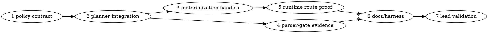

# SYCL MXFP4 Single XMX_TILED Gate/Up Layout Plan

> **For Claude:** REQUIRED SUB-SKILL: Use team-driven-development to implement this plan with agent teams.

**Goal:** Make GPT-OSS MXFP4 MoE gate/up use one persistent VRAM layout (`GGML_LAYOUT_XMX_TILED`) that both PP and TG consume directly, with no persistent SOA duplicate and no per-token gate/up prepack copy.

**Architecture:** Gate/up MXFP4 expert tensors are materialized once into XMX_TILED during planned placement/materialization. Unified-cache `mem_handle` leases remain the ownership source of truth; pointer tables are transient launch ABI views rebuilt from XMX_TILED handles. PP and TG must both prove they consume XMX_TILED directly before the path is eligible.

**Tech Stack:** llama.cpp SYCL backend, Intel oneAPI/SYCL ESIMD XMX DPAS, unified-cache weight planner, C++ unit tests, Python profile parser tests, lead-owned B50/B580 gates.

**Test Infrastructure:** Existing C++ tests under `tests/` are built from `ggml/src/ggml-sycl/CMakeLists.txt:1166-1216`; existing parser tests are in `tests/test-sycl-moe-profile-parser.py:1-220`; B50 model gates are lead-only via `scripts/sycl-b50-gptoss-moe-gates.sh`.

---

## Research and Code Backing

### Web-backed facts

- `https://huggingface.co/openai/gpt-oss-20b/raw/main/config.json` reports GPT-OSS 20B as `num_hidden_layers=24`, `hidden_size=2880`, `intermediate_size=2880`, `num_local_experts=32`, and `num_experts_per_tok=4`.
- `https://raw.githubusercontent.com/openai/gpt-oss/main/README.md` says the models were post-trained with **MXFP4 quantization of the MoE weights** and that GPT-OSS 20B fits within 16GB-class memory.
- Intel oneAPI ESIMD/XMX DPAS public headers describe DPAS as the Intel Xe Matrix Extensions API; local installed header `/opt/intel/oneapi/compiler/2025.3/include/sycl/ext/intel/esimd/xmx/dpas.hpp:1-180` shows DPAS accepts integer precisions down to 4-bit/8-bit but not an MXFP4-native public type in this installed compiler.
- Intel Level Zero programming guide (`https://oneapi-src.github.io/level-zero-spec/level-zero/latest/core/PROG.html`) describes host/device/shared USM and device-local memory; this supports the project rule that user USM/pinned memory is managed through runtime memory APIs, not direct raw ownership in dispatch code.
- Upstream llama.cpp SYCL docs (`https://raw.githubusercontent.com/ggml-org/llama.cpp/master/docs/backend/SYCL.md`) describe SYCL as oneAPI/DPC++ plus oneAPI Level Zero for Intel GPUs and mention recent fused MoE work.

### Current code facts

- XMX_TILED MXFP4 MoE layout selection exists in `ggml/src/ggml-sycl/common.hpp:851-914`.
- MXFP4-to-XMX_TILED conversion kernels exist in `ggml/src/ggml-sycl/moe-tile-convert.cpp:24-105` and `ggml/src/ggml-sycl/moe-tile-convert.cpp:105-180`.
- Unified-cache bulk expert tensor staging can allocate one WEIGHT allocation and publish per-expert `mem_handle` views at `ggml/src/ggml-sycl/unified-cache.cpp:3407-3676`.
- Planner support for `GGML_LAYOUT_XMX_TILED` exists at `ggml/src/ggml-sycl/unified-cache.cpp:14772-14846` and `ggml/src/ggml-sycl/unified-cache.cpp:14888-14935`.
- The planner currently rewrites gate/up XMX_TILED to SOA for PP safety at `ggml/src/ggml-sycl/unified-cache.cpp:15183-15255` and documents this at `ggml/src/ggml-sycl/unified-cache.cpp:16887-16891`.
- Runtime phase materialization can bulk materialize XMX_TILED and remember per-expert storage handles at `ggml/src/ggml-sycl/ggml-sycl.cpp:45750-45870`.
- TG gate/up dispatch already accepts `GGML_LAYOUT_XMX_TILED` at `ggml/src/ggml-sycl/mmvq.cpp:15933-15979`.
- The rejected gate/up prepack route copied `35,251,200` bytes/layer/token and measured about `25.7 ms/token` extra across 24 layers. It must not be promoted.

---

## Team Topology

**Recommended implementers:** 3 maximum concurrently. Most C++ planner/runtime tasks are sequential because they share `common.hpp`, `unified-cache.cpp`, and `mmvq.cpp`; parser/docs tasks can run in parallel after Task 1.

**Reviewers:** Fresh SPEC reviewer first, then fresh QUALITY reviewer. Every reviewer issue is blocking.

### Parallel Tracks

| Track | Tasks | Description |
|-------|-------|-------------|
| A | 1, 2, 3, 5 | C++ policy, planner integration, runtime dispatch invariants |
| B | 4 | Parser and dry-run gate evidence for single-layout proof mode |
| C | 6 | Documentation and lead validation harness wiring |
| Lead | 7 | Real B50/B580 validation on the user's machine |

### Dependency Graph



### File Ownership Map

| File | Tasks | Conflict Risk |
|------|-------|---------------|
| `ggml/src/ggml-sycl/common.hpp` | 1 | Low; pure policy helper near existing layout policy |
| `tests/test-sycl-moe-xmx-tiled-single-layout-policy.cpp` | 1 | New file |
| `ggml/src/ggml-sycl/CMakeLists.txt` | 1, 4 | Medium; Task 4 must rebase if Task 1 changes the same `_residency_test` CMake list |
| `ggml/src/ggml-sycl/unified-cache.cpp` | 2, 3 | High; sequential only |
| `ggml/src/ggml-sycl/unified-cache.hpp` | 2 | Low; test-visible planner result declarations if needed |
| `ggml/src/ggml-sycl/ggml-sycl-test.hpp` | 2, 3 | Medium; sequential with C++ helpers |
| `tests/test-sycl-moe-xmx-tiled-single-layout-planner.cpp` | 2 | New file |
| `tests/test-sycl-moe-xmx-tiled-materialization.cpp` | 3 | New file |
| `ggml/src/ggml-sycl/mmvq.cpp` | 5 | High; current worktree has uncommitted profiling experiment that must be removed before this task starts |
| `scripts/parse-sycl-moe-profile.py` | 4 | Low |
| `tests/test-sycl-moe-profile-parser.py` | 4 | Low |
| `scripts/sycl-b50-gptoss-moe-gates.sh` | 6 | Low; lead-only runtime command additions |
| `docs/backend/SYCL.md` | 6 | Low |
| `activation/mxfp4-tg-runtime-baseline.md` | 6 | Low |
| `docs/plans/2026-06-29-sycl-mxfp4-single-xmx-tiled-gateup.md` | 6 | Low; update only after implementation facts exist |

---

## Preflight Required Before Task 1

The current worktree has an uncommitted `ggml/src/ggml-sycl/mmvq.cpp` experiment from profiling the rejected prepack route. Before assigning implementation tasks, the lead must either revert that diff or turn it into an explicit reviewed task. The single-layout work must not inherit temporary `GGML_SYCL_MOE_GATEUP_PREPACK_TRACE` debug code.

**Lead command:**

```bash
cd /Apps/llama.cpp-mxfp4-tg-runtime
git status --short
git diff -- ggml/src/ggml-sycl/mmvq.cpp
```

**Expected before Task 1 starts:** no uncommitted `mmvq.cpp` profiling/metadata-relaxation diff unless a separate cleanup commit has already landed and passed SPEC + QUALITY review.

---

## Tasks

### Task 1: Add a pure single-layout gate/up policy contract

**Track:** A
**Depends on:** Preflight

**File scope:**
- Modify: `ggml/src/ggml-sycl/common.hpp:851-914`
- Create: `tests/test-sycl-moe-xmx-tiled-single-layout-policy.cpp`
- Modify: `ggml/src/ggml-sycl/CMakeLists.txt:1166-1216`

**Description:** Add a testable pure policy helper that decides whether a gate/up MXFP4 expert tensor may use XMX_TILED as the only persistent PP+TG layout. This helper must not query devices or read cached process env internally; tests pass env/capability facts explicitly.

**Acceptance Criteria:**
- [ ] Env is default-off.
- [ ] Only MXFP4 gate/up entries may select single XMX_TILED.
- [ ] DOWN and dense weights reject.
- [ ] PP support is mandatory when PP rows exceed one.
- [ ] TG support is mandatory.
- [ ] Accepted result says `layout=GGML_LAYOUT_XMX_TILED`, `requires_soa_alternate=false`, and route label `xmx-tiled-single-gateup`.

#### RED: Write These Failing Tests

Create `tests/test-sycl-moe-xmx-tiled-single-layout-policy.cpp`:

```cpp
#include "ggml-sycl/common.hpp"
#include "ggml-sycl/unified-cache.hpp"

#include <cstdio>
#include <cstring>

#define CHECK(cond, msg)                                                        \
    do {                                                                        \
        if (!(cond)) {                                                          \
            std::fprintf(stderr, "FAIL: %s:%d: %s\n", __FILE__, __LINE__, msg); \
            return 1;                                                           \
        }                                                                       \
    } while (0)

static ggml_sycl::mxfp4_moe_single_gateup_layout_policy_input base_input() {
    ggml_sycl::mxfp4_moe_single_gateup_layout_policy_input in{};
    in.env_value        = "1";
    in.type             = GGML_TYPE_MXFP4;
    in.role             = ggml_sycl::expert_tensor_role::GATE;
    in.requested_layout = GGML_LAYOUT_XMX_TILED;
    in.device_resident  = true;
    in.xmx_int8_ok      = true;
    in.shape_aligned    = true;
    in.pp_rows          = 2048;
    in.pp_supported     = true;
    in.tg_supported     = true;
    return in;
}

static int test_default_off() {
    auto in      = base_input();
    in.env_value = nullptr;
    auto out     = ggml_sycl::mxfp4_moe_single_gateup_layout_policy(in);
    CHECK(!out.accepted, "unset env must reject");
    CHECK(std::strcmp(out.reason, "env") == 0, "unset env reason must be env");
    CHECK(out.requires_soa_alternate, "env-off must preserve current SOA safety behavior");

    in           = base_input();
    in.env_value = "0";
    out          = ggml_sycl::mxfp4_moe_single_gateup_layout_policy(in);
    CHECK(!out.accepted, "zero env must reject");
    CHECK(std::strcmp(out.reason, "env") == 0, "zero env reason must be env");
    return 0;
}

static int test_accepts_gate_and_up_when_pp_and_tg_are_supported() {
    auto gate = ggml_sycl::mxfp4_moe_single_gateup_layout_policy(base_input());
    CHECK(gate.accepted, "gate must accept when all proof facts are true");
    CHECK(gate.layout == GGML_LAYOUT_XMX_TILED, "accepted layout must be XMX_TILED");
    CHECK(!gate.requires_soa_alternate, "accepted single-layout proof must not require SOA alternate");
    CHECK(std::strcmp(gate.route_label, "xmx-tiled-single-gateup") == 0, "route label must be stable");

    auto in  = base_input();
    in.role  = ggml_sycl::expert_tensor_role::UP;
    auto up  = ggml_sycl::mxfp4_moe_single_gateup_layout_policy(in);
    CHECK(up.accepted, "up must accept under same proof facts");
    CHECK(!up.requires_soa_alternate, "up must not require SOA alternate when accepted");
    return 0;
}

static int test_rejects_unsafe_roles_shapes_and_missing_proofs() {
    auto in = base_input();
    in.role = ggml_sycl::expert_tensor_role::DOWN;
    auto out = ggml_sycl::mxfp4_moe_single_gateup_layout_policy(in);
    CHECK(!out.accepted && std::strcmp(out.reason, "role") == 0, "down role must reject");

    in      = base_input();
    in.type = GGML_TYPE_Q4_0;
    out     = ggml_sycl::mxfp4_moe_single_gateup_layout_policy(in);
    CHECK(!out.accepted && std::strcmp(out.reason, "type") == 0, "non-MXFP4 type must reject");

    in               = base_input();
    in.shape_aligned = false;
    out              = ggml_sycl::mxfp4_moe_single_gateup_layout_policy(in);
    CHECK(!out.accepted && std::strcmp(out.reason, "shape") == 0, "unaligned shape must reject");

    in              = base_input();
    in.pp_supported = false;
    out             = ggml_sycl::mxfp4_moe_single_gateup_layout_policy(in);
    CHECK(!out.accepted && std::strcmp(out.reason, "pp") == 0, "missing PP proof must reject");
    CHECK(out.requires_soa_alternate, "missing PP proof must preserve SOA safety fallback");

    in              = base_input();
    in.tg_supported = false;
    out             = ggml_sycl::mxfp4_moe_single_gateup_layout_policy(in);
    CHECK(!out.accepted && std::strcmp(out.reason, "tg") == 0, "missing TG proof must reject");
    return 0;
}

int main() {
    if (test_default_off() != 0) {
        return 1;
    }
    if (test_accepts_gate_and_up_when_pp_and_tg_are_supported() != 0) {
        return 1;
    }
    if (test_rejects_unsafe_roles_shapes_and_missing_proofs() != 0) {
        return 1;
    }
    std::puts("single-layout XMX_TILED gate/up policy tests passed");
    return 0;
}
```

Add `test-sycl-moe-xmx-tiled-single-layout-policy` to the `_residency_test` list in `ggml/src/ggml-sycl/CMakeLists.txt:1166-1189`.

**Verify RED:**

```bash
./scripts/sycl-build.sh test-sycl-moe-xmx-tiled-single-layout-policy
```

Expected: compile fails because `mxfp4_moe_single_gateup_layout_policy_input`, `mxfp4_moe_single_gateup_layout_policy_result`, and `mxfp4_moe_single_gateup_layout_policy()` do not exist.

#### GREEN: Implement Minimal Code

In `ggml/src/ggml-sycl/common.hpp`, after `struct mxfp4_moe_layout_decision` and before `ggml_sycl_select_mxfp4_moe_layout()`, add:

```cpp
namespace ggml_sycl {

struct mxfp4_moe_single_gateup_layout_policy_input {
    const char *       env_value        = nullptr;
    ggml_type          type             = GGML_TYPE_COUNT;
    expert_tensor_role role             = expert_tensor_role::UNKNOWN;
    ggml_layout_mode   requested_layout = GGML_LAYOUT_AOS;
    bool               device_resident  = false;
    bool               xmx_int8_ok      = false;
    bool               shape_aligned    = false;
    size_t             pp_rows          = 0;
    bool               pp_supported     = false;
    bool               tg_supported     = false;
};

struct mxfp4_moe_single_gateup_layout_policy_result {
    bool             accepted               = false;
    bool             requires_soa_alternate = true;
    ggml_layout_mode layout                  = GGML_LAYOUT_SOA;
    const char *     reason                  = "env";
    const char *     route_label             = "fallback";
};

static inline bool mxfp4_moe_single_gateup_layout_env_enabled(const char * env_value) {
    return env_value != nullptr && std::atoi(env_value) != 0;
}

static inline bool mxfp4_moe_gateup_role(expert_tensor_role role) {
    return role == expert_tensor_role::GATE || role == expert_tensor_role::UP;
}

static inline mxfp4_moe_single_gateup_layout_policy_result mxfp4_moe_single_gateup_layout_policy(
    const mxfp4_moe_single_gateup_layout_policy_input & in) {
    mxfp4_moe_single_gateup_layout_policy_result out{};
    if (!mxfp4_moe_single_gateup_layout_env_enabled(in.env_value)) {
        out.reason = "env";
        return out;
    }
    if (in.type != GGML_TYPE_MXFP4) {
        out.reason = "type";
        return out;
    }
    if (!mxfp4_moe_gateup_role(in.role)) {
        out.reason = "role";
        return out;
    }
    if (in.requested_layout != GGML_LAYOUT_XMX_TILED) {
        out.reason = "layout";
        return out;
    }
    if (!in.device_resident || !in.xmx_int8_ok) {
        out.reason = "device";
        return out;
    }
    if (!in.shape_aligned) {
        out.reason = "shape";
        return out;
    }
    if (in.pp_rows > 1 && !in.pp_supported) {
        out.reason = "pp";
        return out;
    }
    if (!in.tg_supported) {
        out.reason = "tg";
        return out;
    }
    out.accepted               = true;
    out.requires_soa_alternate = false;
    out.layout                  = GGML_LAYOUT_XMX_TILED;
    out.reason                  = "none";
    out.route_label             = "xmx-tiled-single-gateup";
    return out;
}

}  // namespace ggml_sycl
```

If `expert_tensor_role` is not visible in `common.hpp` at this point, move the helper to `ggml/src/ggml-sycl/unified-cache.hpp` immediately after `expert_tensor_role_name()` at `unified-cache.hpp:109-130` and include that header in the test instead.

**Verify GREEN:**

```bash
./scripts/sycl-build.sh test-sycl-moe-xmx-tiled-single-layout-policy
./build/bin/test-sycl-moe-xmx-tiled-single-layout-policy
```

Expected: binary prints `single-layout XMX_TILED gate/up policy tests passed`.

#### REFACTOR

Keep the helper pure and inline. Do not read process env from inside the helper; production code passes `std::getenv("GGML_SYCL_MOE_GATEUP_SINGLE_XMX")`.

**Verify still GREEN:** same commands as GREEN.

#### Gotchas

- `common.hpp` may not already know `expert_tensor_role`; use `unified-cache.hpp` if compilation proves that dependency direction is wrong.
- Do not make `GGML_SYCL_XMX_MOE` imply this mode. The new mode is stricter and single-layout only.
- Do not reference B50 devices in tests; this is a pure CPU/compile policy test.

#### Commit

```bash
git add ggml/src/ggml-sycl/common.hpp ggml/src/ggml-sycl/unified-cache.hpp ggml/src/ggml-sycl/CMakeLists.txt tests/test-sycl-moe-xmx-tiled-single-layout-policy.cpp
git commit -m "test(sycl): add MXFP4 single XMX_TILED gateup policy"
```

---

### Task 2: Integrate single-layout policy into the planner

**Track:** A
**Depends on:** Task 1

**File scope:**
- Modify: `ggml/src/ggml-sycl/unified-cache.cpp:14772-14846`
- Modify: `ggml/src/ggml-sycl/unified-cache.cpp:15128-15255`
- Modify: `ggml/src/ggml-sycl/unified-cache.cpp:16887-16891`
- Modify: `ggml/src/ggml-sycl/ggml-sycl-test.hpp:41-59`
- Create: `tests/test-sycl-moe-xmx-tiled-single-layout-planner.cpp`
- Modify: `ggml/src/ggml-sycl/CMakeLists.txt:1166-1189`

**Description:** Wire the policy into the placement planner so opt-in single-layout mode does not rewrite XMX_TILED gate/up to SOA and does not add full SOA gate/up alternates. This task proves the decision with a no-GPU test helper.

**Acceptance Criteria:**
- [ ] Default behavior remains current-safe: XMX_TILED gate/up still needs SOA for PP unless the new env is enabled.
- [ ] With `GGML_SYCL_MOE_GATEUP_SINGLE_XMX=1` and PP/TG proof facts true, planner helper returns no SOA promotion.
- [ ] DOWN tensors are unchanged.
- [ ] The planner log distinguishes `single_xmx_gateup=1` from legacy prompt SOA promotion.

#### RED: Write These Failing Tests

Create `tests/test-sycl-moe-xmx-tiled-single-layout-planner.cpp`:

```cpp
#include "ggml-sycl/ggml-sycl-test.hpp"
#include "ggml-sycl/unified-cache.hpp"

#include <cstdio>
#include <cstring>

#define CHECK(cond, msg)                                                        \
    do {                                                                        \
        if (!(cond)) {                                                          \
            std::fprintf(stderr, "FAIL: %s:%d: %s\n", __FILE__, __LINE__, msg); \
            return 1;                                                           \
        }                                                                       \
    } while (0)

static ggml_sycl::test_moe_single_xmx_planner_input base_input() {
    ggml_sycl::test_moe_single_xmx_planner_input in{};
    in.single_xmx_env       = "1";
    in.role                 = ggml_sycl::expert_tensor_role::GATE;
    in.type                 = GGML_TYPE_MXFP4;
    in.current_layout       = GGML_LAYOUT_XMX_TILED;
    in.device_resident      = true;
    in.device_xmx_int8_ok   = true;
    in.shape_aligned        = true;
    in.pp_rows              = 2048;
    in.pp_xmx_supported     = true;
    in.tg_xmx_supported     = true;
    in.current_default_wants_pp_soa = true;
    return in;
}

static int test_default_keeps_pp_soa_rewrite() {
    auto in              = base_input();
    in.single_xmx_env    = nullptr;
    auto out             = ggml_sycl::test_moe_single_xmx_planner_decision(in);
    CHECK(out.needs_pp_soa, "default path must keep PP SOA protection");
    CHECK(out.adds_soa_alternate, "default path may still add SOA alternate/protection");
    CHECK(!out.single_xmx_selected, "default path must not select single XMX mode");
    CHECK(std::strcmp(out.reason, "env") == 0, "default rejection reason must be env");
    return 0;
}

static int test_opt_in_suppresses_pp_soa_for_gate_and_up() {
    auto gate = ggml_sycl::test_moe_single_xmx_planner_decision(base_input());
    CHECK(gate.single_xmx_selected, "gate must select single XMX mode");
    CHECK(!gate.needs_pp_soa, "gate must not be rewritten to SOA in proof mode");
    CHECK(!gate.adds_soa_alternate, "gate must not get a full SOA alternate in proof mode");
    CHECK(std::strcmp(gate.reason, "none") == 0, "accepted reason must be none");

    auto in = base_input();
    in.role = ggml_sycl::expert_tensor_role::UP;
    auto up = ggml_sycl::test_moe_single_xmx_planner_decision(in);
    CHECK(up.single_xmx_selected, "up must select single XMX mode");
    CHECK(!up.needs_pp_soa, "up must not be rewritten to SOA in proof mode");
    CHECK(!up.adds_soa_alternate, "up must not get a full SOA alternate in proof mode");
    return 0;
}

static int test_down_and_missing_pp_proof_stay_safe() {
    auto in = base_input();
    in.role = ggml_sycl::expert_tensor_role::DOWN;
    auto down = ggml_sycl::test_moe_single_xmx_planner_decision(in);
    CHECK(!down.single_xmx_selected, "down must not use gate/up single-layout mode");
    CHECK(down.needs_pp_soa, "down follows existing safety decision in this helper input");

    in = base_input();
    in.pp_xmx_supported = false;
    auto no_pp = ggml_sycl::test_moe_single_xmx_planner_decision(in);
    CHECK(!no_pp.single_xmx_selected, "missing PP proof must reject single-layout mode");
    CHECK(no_pp.needs_pp_soa, "missing PP proof must keep PP SOA protection");
    CHECK(std::strcmp(no_pp.reason, "pp") == 0, "missing PP proof reason must be pp");
    return 0;
}

int main() {
    if (test_default_keeps_pp_soa_rewrite() != 0) {
        return 1;
    }
    if (test_opt_in_suppresses_pp_soa_for_gate_and_up() != 0) {
        return 1;
    }
    if (test_down_and_missing_pp_proof_stay_safe() != 0) {
        return 1;
    }
    std::puts("single-layout XMX_TILED planner tests passed");
    return 0;
}
```

Add `test-sycl-moe-xmx-tiled-single-layout-planner` to the `_residency_test` list in `ggml/src/ggml-sycl/CMakeLists.txt:1166-1189`.

**Verify RED:**

```bash
./scripts/sycl-build.sh test-sycl-moe-xmx-tiled-single-layout-planner
```

Expected: compile fails because the test helper structs/functions do not exist.

#### GREEN: Implement Minimal Code

In `ggml/src/ggml-sycl/ggml-sycl-test.hpp:41-59`, add:

```cpp
struct test_moe_single_xmx_planner_input {
    const char *             single_xmx_env                 = nullptr;
    expert_tensor_role       role                           = expert_tensor_role::UNKNOWN;
    ggml_type                type                           = GGML_TYPE_COUNT;
    ggml_layout_mode         current_layout                 = GGML_LAYOUT_AOS;
    bool                     device_resident                = false;
    bool                     device_xmx_int8_ok             = false;
    bool                     shape_aligned                  = false;
    size_t                   pp_rows                        = 0;
    bool                     pp_xmx_supported               = false;
    bool                     tg_xmx_supported               = false;
    bool                     current_default_wants_pp_soa   = false;
};

struct test_moe_single_xmx_planner_result {
    bool         single_xmx_selected = false;
    bool         needs_pp_soa        = true;
    bool         adds_soa_alternate  = true;
    const char * reason              = "env";
};

test_moe_single_xmx_planner_result test_moe_single_xmx_planner_decision(
    const test_moe_single_xmx_planner_input & in);
```

In `ggml/src/ggml-sycl/unified-cache.cpp`, near `planner_moe_layout_needs_pp_soa_on_device()`, add a local adapter:

```cpp
static ggml_sycl::mxfp4_moe_single_gateup_layout_policy_result planner_single_xmx_gateup_policy(
    const placement_entry & entry,
    ggml_layout_mode layout,
    int device_id,
    const placement_kv_info & kv_info,
    const ggml_sycl_placement_envelope * envelope,
    bool pp_supported,
    bool tg_supported) {
    ggml_sycl::mxfp4_moe_single_gateup_layout_policy_input in{};
    in.env_value        = std::getenv("GGML_SYCL_MOE_GATEUP_SINGLE_XMX");
    in.type             = entry.type;
    in.role             = entry.expert_role;
    in.requested_layout = layout;
    in.device_resident  = entry.on_device && entry.target_device == device_id;
    in.xmx_int8_ok      = device_id >= 0 && device_id < ggml_sycl_info().device_count &&
                          ggml_sycl_info().devices[device_id].xmx_caps.supports_int8;
    in.shape_aligned    = entry.ne[0] > 0 && (entry.ne[0] % QK_MXFP4) == 0;
    in.pp_rows          = planner_expected_moe_pp_rows(kv_info, envelope);
    in.pp_supported     = pp_supported;
    in.tg_supported     = tg_supported;
    return ggml_sycl::mxfp4_moe_single_gateup_layout_policy(in);
}
```

Then in `planner_moe_layout_needs_pp_soa_on_device()` before the existing `if (layout == GGML_LAYOUT_XMX_TILED && !planner_moe_xmx_tiled_pp_proof_enabled())` branch, compute:

```cpp
const bool pp_supported = planner_moe_primary_executor_supports_pp_layout_on_device(entry, layout, device_id, kv_info, envelope);
const bool tg_supported = planner_moe_primary_executor_supports_layout_on_device(entry, layout, device_id);
const auto single_xmx   = planner_single_xmx_gateup_policy(entry, layout, device_id, kv_info, envelope, pp_supported, tg_supported);
if (single_xmx.accepted) {
    return false;
}
```

Keep the existing fallback logic after this block. Do not delete the current safe PP SOA rewrite.

Implement the test helper in the same file without device queries:

```cpp
namespace ggml_sycl {

test_moe_single_xmx_planner_result test_moe_single_xmx_planner_decision(
    const test_moe_single_xmx_planner_input & in) {
    mxfp4_moe_single_gateup_layout_policy_input policy{};
    policy.env_value        = in.single_xmx_env;
    policy.type             = in.type;
    policy.role             = in.role;
    policy.requested_layout = in.current_layout;
    policy.device_resident  = in.device_resident;
    policy.xmx_int8_ok      = in.device_xmx_int8_ok;
    policy.shape_aligned    = in.shape_aligned;
    policy.pp_rows          = in.pp_rows;
    policy.pp_supported     = in.pp_xmx_supported;
    policy.tg_supported     = in.tg_xmx_supported;
    const auto p = mxfp4_moe_single_gateup_layout_policy(policy);

    test_moe_single_xmx_planner_result out{};
    out.single_xmx_selected = p.accepted;
    out.needs_pp_soa        = p.accepted ? false : in.current_default_wants_pp_soa;
    out.adds_soa_alternate  = p.accepted ? false : in.current_default_wants_pp_soa;
    out.reason              = p.reason;
    return out;
}

}  // namespace ggml_sycl
```

Update the comment at `unified-cache.cpp:16887-16891` to state that `GGML_SYCL_MOE_GATEUP_SINGLE_XMX=1` is the explicit proof path that skips prompt-SOA promotion only when PP and TG XMX_TILED support are both proven.

**Verify GREEN:**

```bash
./scripts/sycl-build.sh test-sycl-moe-xmx-tiled-single-layout-planner
./build/bin/test-sycl-moe-xmx-tiled-single-layout-planner
```

Expected: binary prints `single-layout XMX_TILED planner tests passed`.

#### REFACTOR

Keep the legacy `GGML_SYCL_XMX_TILED_PP_PROOF` behavior intact. The new `GGML_SYCL_MOE_GATEUP_SINGLE_XMX` mode is stricter: accepted gate/up entries must not require or budget SOA alternates.

**Verify still GREEN:** same commands as GREEN.

#### Gotchas

- Static env helpers in `unified-cache.cpp` cache env values on first use; tests must use pure helper inputs and not mutate real env mid-process.
- Do not make DOWN tensors participate in the gate/up single-layout policy.
- Do not force XMX_TILED if `planner_moe_primary_executor_supports_pp_layout_on_device()` rejects the row count.

#### Commit

```bash
git add ggml/src/ggml-sycl/unified-cache.cpp ggml/src/ggml-sycl/ggml-sycl-test.hpp ggml/src/ggml-sycl/CMakeLists.txt tests/test-sycl-moe-xmx-tiled-single-layout-planner.cpp
git commit -m "feat(sycl): gate MoE gateup planner on single XMX layout proof"
```

---

### Task 3: Prove materialization keeps XMX_TILED handles complete without a persistent SOA duplicate

**Track:** A
**Depends on:** Task 2

**File scope:**
- Modify: `ggml/src/ggml-sycl/ggml-sycl.cpp:45750-45870`
- Modify: `ggml/src/ggml-sycl/common.hpp:3080-3140`
- Modify: `ggml/src/ggml-sycl/ggml-sycl-test.hpp:41-90`
- Create: `tests/test-sycl-moe-xmx-tiled-materialization.cpp`
- Modify: `ggml/src/ggml-sycl/CMakeLists.txt:1166-1189`

**Description:** Add no-GPU testable invariants for the existing bulk XMX materialization flow: all expert handles must be XMX_TILED, ready-event retained, and conflicting SOA handles not required after successful single-layout materialization.

**Acceptance Criteria:**
- [ ] Test helper can simulate 32 expert handles with stable identities and ready events.
- [ ] Complete XMX_TILED handle set reports complete.
- [ ] Missing handle, wrong layout, or host-resident handle reports incomplete.
- [ ] Single-layout mode reports `release_soa_after_xmx=true` only after XMX_TILED materialization success.

#### RED: Write These Failing Tests

Create `tests/test-sycl-moe-xmx-tiled-materialization.cpp`:

```cpp
#include "ggml-sycl/ggml-sycl-test.hpp"

#include <cstdio>

#define CHECK(cond, msg)                                                        \
    do {                                                                        \
        if (!(cond)) {                                                          \
            std::fprintf(stderr, "FAIL: %s:%d: %s\n", __FILE__, __LINE__, msg); \
            return 1;                                                           \
        }                                                                       \
    } while (0)

static int test_complete_xmx_handle_set() {
    ggml_sycl::test_moe_xmx_tiled_materialization_input in{};
    in.n_experts                 = 32;
    in.expected_layout           = GGML_LAYOUT_XMX_TILED;
    in.handles_present           = 32;
    in.handles_device_resident   = 32;
    in.handles_matching_layout   = 32;
    in.ready_events_present      = 32;
    in.single_xmx_mode           = true;
    in.materialization_succeeded = true;
    auto out = ggml_sycl::test_moe_xmx_tiled_materialization_invariants(in);
    CHECK(out.complete, "complete handle set must be accepted");
    CHECK(out.release_soa_after_xmx, "single-layout success must release SOA source");
    CHECK(out.reason_code == 0, "success reason code must be zero");
    return 0;
}

static int test_incomplete_sets_reject() {
    auto base = ggml_sycl::test_moe_xmx_tiled_materialization_input{};
    base.n_experts                 = 32;
    base.expected_layout           = GGML_LAYOUT_XMX_TILED;
    base.handles_present           = 32;
    base.handles_device_resident   = 32;
    base.handles_matching_layout   = 32;
    base.ready_events_present      = 32;
    base.single_xmx_mode           = true;
    base.materialization_succeeded = true;

    auto missing = base;
    missing.handles_present = 31;
    auto out = ggml_sycl::test_moe_xmx_tiled_materialization_invariants(missing);
    CHECK(!out.complete && out.reason_code == 1, "missing handle must reject");

    auto host = base;
    host.handles_device_resident = 31;
    out = ggml_sycl::test_moe_xmx_tiled_materialization_invariants(host);
    CHECK(!out.complete && out.reason_code == 2, "host handle must reject");

    auto wrong_layout = base;
    wrong_layout.handles_matching_layout = 31;
    out = ggml_sycl::test_moe_xmx_tiled_materialization_invariants(wrong_layout);
    CHECK(!out.complete && out.reason_code == 3, "wrong layout must reject");

    auto no_event = base;
    no_event.ready_events_present = 31;
    out = ggml_sycl::test_moe_xmx_tiled_materialization_invariants(no_event);
    CHECK(!out.complete && out.reason_code == 4, "missing ready event must reject");
    return 0;
}

static int test_no_soa_release_until_success() {
    ggml_sycl::test_moe_xmx_tiled_materialization_input in{};
    in.n_experts                 = 32;
    in.expected_layout           = GGML_LAYOUT_XMX_TILED;
    in.handles_present           = 32;
    in.handles_device_resident   = 32;
    in.handles_matching_layout   = 32;
    in.ready_events_present      = 32;
    in.single_xmx_mode           = true;
    in.materialization_succeeded = false;
    auto out = ggml_sycl::test_moe_xmx_tiled_materialization_invariants(in);
    CHECK(!out.complete, "failed materialization must not be complete");
    CHECK(!out.release_soa_after_xmx, "failed materialization must not release SOA source");
    return 0;
}

int main() {
    if (test_complete_xmx_handle_set() != 0) {
        return 1;
    }
    if (test_incomplete_sets_reject() != 0) {
        return 1;
    }
    if (test_no_soa_release_until_success() != 0) {
        return 1;
    }
    std::puts("single-layout XMX_TILED materialization invariant tests passed");
    return 0;
}
```

Add `test-sycl-moe-xmx-tiled-materialization` to `ggml/src/ggml-sycl/CMakeLists.txt:1166-1189`.

**Verify RED:**

```bash
./scripts/sycl-build.sh test-sycl-moe-xmx-tiled-materialization
```

Expected: compile fails because `test_moe_xmx_tiled_materialization_input`, result, and helper do not exist.

#### GREEN: Implement Minimal Code

In `ggml/src/ggml-sycl/ggml-sycl-test.hpp`, add:

```cpp
struct test_moe_xmx_tiled_materialization_input {
    int              n_experts                 = 0;
    ggml_layout_mode expected_layout           = GGML_LAYOUT_AOS;
    int              handles_present           = 0;
    int              handles_device_resident   = 0;
    int              handles_matching_layout   = 0;
    int              ready_events_present      = 0;
    bool             single_xmx_mode           = false;
    bool             materialization_succeeded = false;
};

struct test_moe_xmx_tiled_materialization_result {
    bool complete              = false;
    bool release_soa_after_xmx = false;
    int  reason_code           = 0;
};

test_moe_xmx_tiled_materialization_result test_moe_xmx_tiled_materialization_invariants(
    const test_moe_xmx_tiled_materialization_input & in);
```

In `ggml/src/ggml-sycl/ggml-sycl.cpp`, add inside `namespace ggml_sycl` near the other test helpers at `ggml-sycl.cpp:19835`:

```cpp
test_moe_xmx_tiled_materialization_result test_moe_xmx_tiled_materialization_invariants(
    const test_moe_xmx_tiled_materialization_input & in) {
    test_moe_xmx_tiled_materialization_result out{};
    if (in.n_experts <= 0 || in.handles_present != in.n_experts) {
        out.reason_code = 1;
        return out;
    }
    if (in.handles_device_resident != in.n_experts) {
        out.reason_code = 2;
        return out;
    }
    if (in.expected_layout != GGML_LAYOUT_XMX_TILED || in.handles_matching_layout != in.n_experts) {
        out.reason_code = 3;
        return out;
    }
    if (in.ready_events_present != in.n_experts) {
        out.reason_code = 4;
        return out;
    }
    if (!in.materialization_succeeded) {
        out.reason_code = 5;
        return out;
    }
    out.complete              = true;
    out.release_soa_after_xmx = in.single_xmx_mode;
    out.reason_code           = 0;
    return out;
}
```

Then update the real materialization path in `ggml-sycl.cpp:45750-45870` so the existing `released_soa_source` logic is explicitly guarded by the new single-layout mode after successful XMX_TILED materialization. The final behavior must be:

```cpp
const bool single_xmx_gateup = std::getenv("GGML_SYCL_MOE_GATEUP_SINGLE_XMX") &&
                               std::atoi(std::getenv("GGML_SYCL_MOE_GATEUP_SINGLE_XMX")) != 0 &&
                               (moe_classify_tensor(src0->name) == MOE_TENSOR_GATE ||
                                moe_classify_tensor(src0->name) == MOE_TENSOR_UP);
```

Use `single_xmx_gateup` only for release/logging decisions. Do not release SOA before the bulk stage succeeds unless the current code already safely does so and rollback proves SOA is restored. If the existing pre-stage release remains, the code must preserve the current rollback-to-SOA path without change.

**Verify GREEN:**

```bash
./scripts/sycl-build.sh test-sycl-moe-xmx-tiled-materialization
./build/bin/test-sycl-moe-xmx-tiled-materialization
```

Expected: binary prints `single-layout XMX_TILED materialization invariant tests passed`.

#### REFACTOR

If the same env read is needed in multiple files, add `ggml_sycl_moe_gateup_single_xmx_enabled()` as a static helper in each translation unit rather than adding global mutable state.

**Verify still GREEN:** same commands as GREEN.

#### Gotchas

- Do not introduce direct `sycl::malloc_device`, `sycl::free`, raw TLSF calls, or side caches. All ownership must stay in unified-cache `mem_handle`s.
- Do not release SOA if XMX_TILED materialization fails; rollback must restore the safe default.
- A handle set is not complete until every expert has a device-resident XMX_TILED handle and the ready event is retained.

#### Commit

```bash
git add ggml/src/ggml-sycl/ggml-sycl.cpp ggml/src/ggml-sycl/common.hpp ggml/src/ggml-sycl/ggml-sycl-test.hpp ggml/src/ggml-sycl/CMakeLists.txt tests/test-sycl-moe-xmx-tiled-materialization.cpp
git commit -m "test(sycl): prove single XMX_TILED gateup materialization invariants"
```

---

### Task 4: Add parser and dry-run gates for single-layout evidence and forbidden SOA fallback

**Track:** B
**Depends on:** Task 2

**File scope:**
- Modify: `scripts/parse-sycl-moe-profile.py:216-230` and `scripts/parse-sycl-moe-profile.py:548-730`
- Modify: `tests/test-sycl-moe-profile-parser.py:1-220`
- Modify: `scripts/sycl-b50-gptoss-moe-gates.sh:22-40` and dry-run mode handling near existing modes

**Description:** Teach the parser/harness to require explicit single-layout evidence and reject logs that show SOA gate/up fallback when the proof mode is being validated.

**Acceptance Criteria:**
- [ ] Parser counts `single_xmx_gateup=1` placement/materialization lines.
- [ ] Parser counts `profile.mxfp4_tg.path.xmx-tiled-single-gateup` and `profile.mxfp4_pp.path.xmx-tiled-single-gateup`.
- [ ] New gate `--require-single-xmx-gateup` fails if no single-layout evidence appears.
- [ ] New gate `--forbid-gateup-soa-fallback` fails on `single_xmx_gateup=0`, `promoted_soa`, or `last_path=packed-q8-m2` when the single-layout proof gate is requested.
- [ ] Harness dry-run prints a lead-only mode that includes the new env and parser gates but does not run GPU in dry-run.

#### RED: Write These Failing Tests

Append to `tests/test-sycl-moe-profile-parser.py`:

```python
def test_parser_requires_single_xmx_gateup_evidence() -> None:
    with tempfile.TemporaryDirectory() as tmp_raw:
        tmp = pathlib.Path(tmp_raw)
        (tmp / "profile.stderr").write_text(
            "[PLACEMENT-MOE] single_xmx_gateup=1 tensor=blk.0.ffn_gate_exps.weight layout=xmx_tiled soa_alternate=0\n"
            "[MOE-PHASE-LAYOUT] tensor=blk.0.ffn_gate_exps.weight target=xmx_tiled single_xmx_gateup=1 materialized=32/32 complete=1\n"
            "[MXFP4-MOE-TG-PROFILE] calls=72 total=6.000 ms kernel=5.500 ms gateup_glu=4.100 ms/48 down=0.700 ms/24 last_path=xmx-tiled-single-gateup\n"
            "[MXFP4-MOE-PP-PROFILE] calls=24 gateup=48 down=24 entries=8192 batches=8192 last_path=xmx-tiled-single-gateup\n"
        )
        out = run_parser(tmp, "--require-single-xmx-gateup")
        assert "placement.single_xmx_gateup 1" in out
        assert "phase.single_xmx_gateup.complete 1" in out
        assert "profile.mxfp4_tg.path.xmx-tiled-single-gateup 1" in out
        assert "profile.mxfp4_pp.path.xmx-tiled-single-gateup 1" in out


def test_parser_rejects_missing_single_xmx_gateup_when_required() -> None:
    with tempfile.TemporaryDirectory() as tmp_raw:
        tmp = pathlib.Path(tmp_raw)
        (tmp / "profile.stderr").write_text(
            "[MXFP4-MOE-TG-PROFILE] calls=72 total=6.000 ms kernel=5.500 ms gateup_glu=5.700 ms/48 down=0.700 ms/24 last_path=packed-q8-m2\n"
        )
        result = run_parser_result(tmp, "--require-single-xmx-gateup")
        assert result.returncode != 0
        assert "error: single XMX_TILED gate/up evidence missing" in result.stdout


def test_parser_forbids_gateup_soa_fallback_in_single_xmx_mode() -> None:
    with tempfile.TemporaryDirectory() as tmp_raw:
        tmp = pathlib.Path(tmp_raw)
        (tmp / "profile.stderr").write_text(
            "[PLACEMENT-MOE] PP primary gate/up layouts prepared before packing: device=1 promoted_soa=64 no_layout_bytes=0\n"
            "[MXFP4-MOE-TG-PROFILE] calls=72 total=6.000 ms kernel=5.500 ms gateup_glu=5.700 ms/48 down=0.700 ms/24 last_path=packed-q8-m2\n"
        )
        result = run_parser_result(tmp, "--forbid-gateup-soa-fallback")
        assert result.returncode != 0
        assert "error: gate/up SOA fallback present in single-layout proof mode" in result.stdout
```

Add dry-run assertion for the new harness mode:

```python
def test_harness_dry_run_single_xmx_gateup_mode_includes_required_gates() -> None:
    out = run_harness_dry_run("single-xmx-gateup")
    assert "GGML_SYCL_MOE_GATEUP_SINGLE_XMX=1" in out
    assert "--require-single-xmx-gateup" in out
    assert "--forbid-gateup-soa-fallback" in out
```

**Verify RED:**

```bash
python3 -m pytest tests/test-sycl-moe-profile-parser.py -q
```

Expected: new tests fail because parser flags and harness mode do not exist.

#### GREEN: Implement Minimal Code

In `scripts/parse-sycl-moe-profile.py`, add regex/counting for:

```python
SINGLE_XMX_GATEUP_RE = re.compile(r"\bsingle_xmx_gateup=(?P<value>[01])\b")
PROMOTED_SOA_RE = re.compile(r"\bpromoted_soa=(?P<count>\d+)\b")
```

Inside the line loop, increment:

```python
single = SINGLE_XMX_GATEUP_RE.search(line)
if single:
    counters[f"placement.single_xmx_gateup.{single.group('value')}"] += 1
    if single.group("value") == "1":
        counters["placement.single_xmx_gateup"] += 1
if "[MOE-PHASE-LAYOUT]" in line and "single_xmx_gateup=1" in line and "complete=1" in line:
    counters["phase.single_xmx_gateup.complete"] += 1
promoted = PROMOTED_SOA_RE.search(line)
if promoted and int(promoted.group("count")) > 0:
    counters["placement.gateup.promoted_soa"] += int(promoted.group("count"))
if "last_path=packed-q8-m2" in line:
    counters["profile.gateup.soa_fallback_path"] += 1
```

Add argparse flags:

```python
parser.add_argument("--require-single-xmx-gateup", action="store_true")
parser.add_argument("--forbid-gateup-soa-fallback", action="store_true")
```

Add gate checks after aggregation:

```python
if args.require_single_xmx_gateup:
    if total.get("placement.single_xmx_gateup", 0) <= 0 and total.get("phase.single_xmx_gateup.complete", 0) <= 0:
        print("error: single XMX_TILED gate/up evidence missing")
        failed = True
if args.forbid_gateup_soa_fallback:
    if total.get("placement.gateup.promoted_soa", 0) > 0 or total.get("profile.gateup.soa_fallback_path", 0) > 0:
        print("error: gate/up SOA fallback present in single-layout proof mode")
        failed = True
```

In `scripts/sycl-b50-gptoss-moe-gates.sh`, add mode `single-xmx-gateup` to help text and dry-run command assembly. It must include:

```bash
GGML_SYCL_MOE_GATEUP_SINGLE_XMX=1
GGML_SYCL_MOE_PHASE_MATERIALIZE=1
GGML_SYCL_MOE_PHASE_BULK_XMX=1
GGML_SYCL_MOE_DOWN_SUM_DIRECT=1
GGML_SYCL_MXFP4_TG_PROFILE=1
GGML_SYCL_MXFP4_PP_PROFILE=1
```

The parser invocation for that mode must include:

```bash
--require-single-xmx-gateup --forbid-gateup-soa-fallback --require-no-fatal-markers --require-mxfp4-profile-evidence
```

**Verify GREEN:**

```bash
python3 -m pytest tests/test-sycl-moe-profile-parser.py -q
bash scripts/sycl-b50-gptoss-moe-gates.sh --mode single-xmx-gateup --dry-run --logdir /tmp/single_xmx_dryrun
```

Expected: pytest passes; dry-run prints commands only and includes the env/gates above.

#### REFACTOR

Keep parser counters additive and backward-compatible. Existing modes must not require single-layout evidence.

**Verify still GREEN:** same commands as GREEN.

#### Gotchas

- Do not run the non-dry-run harness in worker tasks.
- `packed-q8-m2` is allowed in default routes but forbidden only when `--forbid-gateup-soa-fallback` is explicitly passed.
- Parser must still accept old logs unless the new gates are supplied.

#### Commit

```bash
git add scripts/parse-sycl-moe-profile.py tests/test-sycl-moe-profile-parser.py scripts/sycl-b50-gptoss-moe-gates.sh
git commit -m "test(sycl): gate single XMX_TILED gateup evidence"
```

---

### Task 5: Make PP/TG runtime evidence identify direct XMX_TILED gate/up consumption

**Track:** A
**Depends on:** Task 3 and Task 4

**File scope:**
- Modify: `ggml/src/ggml-sycl/mmvq.cpp:15933-15979`
- Modify: `ggml/src/ggml-sycl/mmvq.cpp:16198-16888`
- Modify: `ggml/src/ggml-sycl/ggml-sycl.cpp:22398-22410`
- Modify: `ggml/src/ggml-sycl/tests/test-xmx-moe-mxfp4.cpp:405-540`

**Description:** Ensure the runtime path labels direct XMX_TILED gate/up consumption as `xmx-tiled-single-gateup` in proof mode and fails closed if XMX_TILED pointer-table handles are missing. This task does not add per-token prepack.

**Acceptance Criteria:**
- [ ] TG path label uses `xmx-tiled-single-gateup` only when `weight_layout == GGML_LAYOUT_XMX_TILED`, single-layout env is enabled, and direct XMX_TILED pointer-table handles are present.
- [ ] PP validator/logs can emit `single_xmx_gateup=1` for XMX_TILED gate/up proof mode.
- [ ] The route does not call `mxfp4_moe_gateup_prepack_selected_rows_submit()`.
- [ ] Existing `test-xmx-moe-mxfp4 --cpu-reference-only` still passes.

#### RED: Write These Failing Tests

Extend `ggml/src/ggml-sycl/tests/test-xmx-moe-mxfp4.cpp` near existing gateup prepack tests at `test-xmx-moe-mxfp4.cpp:405-540` with a CPU-only route-label/policy test:

```cpp
static bool test_single_xmx_gateup_route_label_contract() {
    TEST_BEGIN("single_xmx_gateup_route_label_contract");
    ggml_sycl::mxfp4_moe_single_gateup_layout_policy_input in{};
    in.env_value        = "1";
    in.type             = GGML_TYPE_MXFP4;
    in.role             = ggml_sycl::expert_tensor_role::GATE;
    in.requested_layout = GGML_LAYOUT_XMX_TILED;
    in.device_resident  = true;
    in.xmx_int8_ok      = true;
    in.shape_aligned    = true;
    in.pp_rows          = 2048;
    in.pp_supported     = true;
    in.tg_supported     = true;
    const auto out = ggml_sycl::mxfp4_moe_single_gateup_layout_policy(in);
    TEST_ASSERT(out.accepted, "single XMX gate/up policy should accept proof input");
    TEST_ASSERT(std::strcmp(out.route_label, "xmx-tiled-single-gateup") == 0,
                "single XMX route label must be stable for parser/harness evidence");
    TEST_ASSERT(!out.requires_soa_alternate, "single XMX route must not require SOA alternate");
    return true;
}
```

Call it from `main()` in CPU-reference-only mode before GPU tests.

**Verify RED:**

```bash
./scripts/sycl-build.sh test-xmx-moe-mxfp4
./build/bin/test-xmx-moe-mxfp4 --cpu-reference-only
```

Expected: fails until Task 1 helper is available and included correctly in this test target.

#### GREEN: Implement Minimal Code

In `mmvq.cpp`, add a local helper near existing env helpers:

```cpp
static bool mxfp4_moe_gateup_single_xmx_enabled() {
    static const bool enabled = []() {
        const char * env = std::getenv("GGML_SYCL_MOE_GATEUP_SINGLE_XMX");
        return env && std::atoi(env) != 0;
    }();
    return enabled;
}
```

In `mmvq_moe_batched_dispatch_pair_glu_mxfp4_soa()`, when `weight_layout == GGML_LAYOUT_XMX_TILED` and the path uses direct XMX_TILED DPAS/pointer-table dispatch, set:

```cpp
if (mxfp4_moe_gateup_single_xmx_enabled() && weight_layout == GGML_LAYOUT_XMX_TILED) {
    profile_path = "xmx-tiled-single-gateup";
}
```

This assignment must be placed only after the XMX_TILED dispatch has been selected and must not label fallback SOA or `packed-q8-m2` paths.

In the PP validation/log area around `ggml-sycl.cpp:22398-22410`, when the XMX original-layout validator runs on a gate/up tensor and `GGML_SYCL_MOE_GATEUP_SINGLE_XMX=1`, add `single_xmx_gateup=1` to the emitted line. Do not emit it for DOWN tensors.

Remove or leave untouched the rejected prepack route, but ensure this task does not call or enable `GGML_SYCL_MOE_GATEUP_PREPACK`.

**Verify GREEN:**

```bash
./scripts/sycl-build.sh test-xmx-moe-mxfp4
./build/bin/test-xmx-moe-mxfp4 --cpu-reference-only
git grep -n "mxfp4_moe_gateup_prepack_selected_rows_submit" ggml/src/ggml-sycl/mmvq.cpp
```

Expected: CPU reference test passes; grep shows only the existing rejected opt-in prepack code path and no new call sites introduced by this task.

#### REFACTOR

Keep route labels centralized as string constants if multiple files need them. Do not add a broad global env helper unless more than two translation units need it.

**Verify still GREEN:** same commands as GREEN.

#### Gotchas

- A label is evidence. Never label a fallback path as `xmx-tiled-single-gateup`.
- Do not relax metadata gates that were added only for the rejected prepack profiling experiment.
- `clang-format-19 --dry-run -Werror ggml/src/ggml-sycl/mmvq.cpp ggml/src/ggml-sycl/ggml-sycl.cpp ggml/src/ggml-sycl/tests/test-xmx-moe-mxfp4.cpp` is a QUALITY blocker.

#### Commit

```bash
git add ggml/src/ggml-sycl/mmvq.cpp ggml/src/ggml-sycl/ggml-sycl.cpp ggml/src/ggml-sycl/tests/test-xmx-moe-mxfp4.cpp
git commit -m "feat(sycl): label direct single XMX_TILED gateup route"
```

---

### Task 6: Document single-layout proof mode and lead-only validation commands

**Track:** C
**Depends on:** Task 4 and Task 5

**File scope:**
- Modify: `docs/backend/SYCL.md`
- Modify: `activation/mxfp4-tg-runtime-baseline.md`
- Modify: `docs/plans/2026-06-29-sycl-mxfp4-single-xmx-tiled-gateup.md`

**Description:** Document the new proof-mode contract, rejected prepack evidence, and exact lead-only validation commands. This task makes it impossible for reviewers to confuse per-token prepack with single persistent XMX_TILED layout.

**Acceptance Criteria:**
- [ ] Docs state `GGML_SYCL_MOE_GATEUP_SINGLE_XMX=1` is opt-in/default-off.
- [ ] Docs state no persistent SOA gate/up duplicate is allowed in this mode.
- [ ] Docs state workers must not run B50/B580/model gates.
- [ ] Docs include parser requirements: `--require-single-xmx-gateup --forbid-gateup-soa-fallback`.
- [ ] Docs preserve rejected prepack finding: ~35 MB/layer/token, ~25.7 ms/token extra.

#### RED: Write These Failing Checks

Run before editing:

```bash
grep -R "GGML_SYCL_MOE_GATEUP_SINGLE_XMX" docs/backend/SYCL.md activation/mxfp4-tg-runtime-baseline.md docs/plans/2026-06-29-sycl-mxfp4-single-xmx-tiled-gateup.md
grep -R "forbid-gateup-soa-fallback" docs/backend/SYCL.md activation/mxfp4-tg-runtime-baseline.md docs/plans/2026-06-29-sycl-mxfp4-single-xmx-tiled-gateup.md
```

Expected: both commands fail before documentation is added.

#### GREEN: Implement Minimal Documentation

Add to `docs/backend/SYCL.md` under SYCL environment variables:

```markdown
| `GGML_SYCL_MOE_GATEUP_SINGLE_XMX=1` | Experimental GPT-OSS MXFP4 gate/up proof mode. Requires gate/up experts to use one persistent `GGML_LAYOUT_XMX_TILED` VRAM layout consumed by both PP and TG. No persistent SOA gate/up duplicate and no per-token gate/up prepack are allowed. Default OFF. |
```

Add to `activation/mxfp4-tg-runtime-baseline.md` after the rejected prepack section:

```markdown
### Single persistent XMX_TILED gate/up proof route

The next approved route is `GGML_SYCL_MOE_GATEUP_SINGLE_XMX=1`: materialize gate/up experts once as `GGML_LAYOUT_XMX_TILED`, rebuild pointer tables from XMX_TILED `mem_handle` leases, and require PP/TG route evidence that no SOA gate/up fallback is used. This route is distinct from rejected `GGML_SYCL_MOE_GATEUP_PREPACK=1`, which copied 35,251,200 bytes/layer/token and measured about 25.7 ms/token extra across 24 layers.
```

Add an implementation-status section to this plan file after all task commits land, replacing the initial "pending" status with actual commit hashes and log paths.

**Verify GREEN:**

```bash
grep -R "GGML_SYCL_MOE_GATEUP_SINGLE_XMX" docs/backend/SYCL.md activation/mxfp4-tg-runtime-baseline.md docs/plans/2026-06-29-sycl-mxfp4-single-xmx-tiled-gateup.md
grep -R "forbid-gateup-soa-fallback" docs/backend/SYCL.md activation/mxfp4-tg-runtime-baseline.md docs/plans/2026-06-29-sycl-mxfp4-single-xmx-tiled-gateup.md
git diff --check
```

Expected: grep finds the new env/gate text; `git diff --check` passes.

#### REFACTOR

No refactor needed.

#### Gotchas

- Do not claim default-on or promotion. This is proof-mode only until lead validation passes.
- Do not erase the rejected prepack route evidence; it is important negative evidence.

#### Commit

```bash
git add docs/backend/SYCL.md activation/mxfp4-tg-runtime-baseline.md docs/plans/2026-06-29-sycl-mxfp4-single-xmx-tiled-gateup.md
git commit -m "docs(sycl): document single XMX_TILED gateup proof mode"
```

---

### Task 7: Lead-owned end-to-end validation on B50, then B580 if B50 passes

**Track:** Lead
**Depends on:** Tasks 1-6, SPEC review pass, QUALITY review pass

**File scope:**
- No worker-owned code changes.
- Lead records results in `activation/mxfp4-tg-runtime-baseline.md` and this plan file.

**Description:** Run the finished proof mode on the actual B50 GPT-OSS environment. Workers must not run this task.

**Acceptance Criteria:**
- [ ] Count gate output starts exact `: 1, 2, 3, 4, 5` or accepted canonical equivalent from existing parser.
- [ ] Fatal markers are absent.
- [ ] Parser reports single XMX_TILED gate/up evidence.
- [ ] Parser reports no gate/up SOA fallback.
- [ ] B50 PP512 remains `>=1100 tok/s`.
- [ ] B50 TG128 is `>=45 tok/s`, or lead explicitly records near-target evidence and blocks promotion.
- [ ] B580 Mistral/GPT-OSS validation is not run until B50 count/fatal/perf evidence is safe.

#### RED: Confirm gate fails before real proof evidence exists

Lead command after build, before trusting performance:

```bash
python3 scripts/parse-sycl-moe-profile.py --no-lines \
  --require-single-xmx-gateup \
  --forbid-gateup-soa-fallback \
  /tmp/nonexistent-single-xmx-proof-log
```

Expected: nonzero with missing log input. This confirms the parser gate is active.

#### GREEN: Run B50 count and bench

```bash
cd /Apps/llama.cpp-mxfp4-tg-runtime
set +u
source /opt/intel/oneapi/setvars.sh --force
set -u
./scripts/sycl-build.sh llama-cli llama-bench

LOG_DIR="/tmp/sycl_single_xmx_gateup_b50_$(date +%Y%m%d_%H%M%S)"
mkdir -p "$LOG_DIR"

ONEAPI_DEVICE_SELECTOR=level_zero:1 \
GGML_SYCL_MOE_GATEUP_SINGLE_XMX=1 \
GGML_SYCL_MOE_PHASE_MATERIALIZE=1 \
GGML_SYCL_MOE_PHASE_BULK_XMX=1 \
GGML_SYCL_MOE_DOWN_SUM_DIRECT=1 \
GGML_SYCL_MXFP4_TG_PROFILE=1 \
GGML_SYCL_MXFP4_PP_PROFILE=1 \
./build/bin/llama-cli \
  -m /Storage/GenAI/models/gpt-oss-20b-mxfp4.gguf -ngl 99 \
  -cnv -st --simple-io --no-display-prompt \
  --chat-template-kwargs '{"reasoning_effort":"medium"}' \
  --reasoning-format none --reasoning-budget 0 \
  -p 'Count from 1 to 5. Answer with only: 1, 2, 3, 4, 5' \
  -n 48 --seed 42 --temp 0 \
  > "$LOG_DIR/count.stdout" 2> "$LOG_DIR/count.stderr"

python3 scripts/parse-sycl-moe-profile.py --no-lines \
  --require-no-fatal-markers \
  --require-mxfp4-profile-evidence \
  --require-single-xmx-gateup \
  --forbid-gateup-soa-fallback \
  "$LOG_DIR"

ONEAPI_DEVICE_SELECTOR=level_zero:1 \
GGML_SYCL_MOE_GATEUP_SINGLE_XMX=1 \
GGML_SYCL_MOE_PHASE_MATERIALIZE=1 \
GGML_SYCL_MOE_PHASE_BULK_XMX=1 \
GGML_SYCL_MOE_DOWN_SUM_DIRECT=1 \
GGML_SYCL_MXFP4_TG_PROFILE=1 \
GGML_SYCL_MXFP4_PP_PROFILE=1 \
./build/bin/llama-bench \
  -m /Storage/GenAI/models/gpt-oss-20b-mxfp4.gguf -ngl 99 -fa 1 \
  -p 512 -n 128 \
  > "$LOG_DIR/bench.stdout" 2> "$LOG_DIR/bench.stderr"

python3 scripts/parse-sycl-moe-profile.py --no-lines \
  --require-no-fatal-markers \
  --require-mxfp4-profile-evidence \
  --require-single-xmx-gateup \
  --forbid-gateup-soa-fallback \
  --require-bench-min pp512 1100 \
  --require-bench-min tg128 45 \
  "$LOG_DIR"
```

**Expected GREEN:** Parser gates pass and bench meets floors.

#### REFACTOR

If B50 count passes but TG is below 45, do not promote. Record profile evidence and open a follow-up route task. If there is any fatal/device-lost marker, hard-disable the new mode and revert or fix before any further testing.

#### Gotchas

- Use `set +u` while sourcing oneAPI; `set -u` trips on unset oneAPI variables.
- Do not run `sycl-ls` or old comparison binaries.
- Do not run multi-GPU selector/P2P checks in this task.
- `.beads/beads.db` may become dirty from tracker updates; restore it before status/push checks if unrelated.

#### Commit

Only after successful validation evidence is recorded:

```bash
git add activation/mxfp4-tg-runtime-baseline.md docs/plans/2026-06-29-sycl-mxfp4-single-xmx-tiled-gateup.md
git commit -m "test(sycl): record single XMX_TILED gateup validation"
```

---

## End-to-End Validation (on the user's machine) — MANDATORY

> Run AFTER all task tests pass, BEFORE declaring the work done. Owned by the lead at teardown.

**Environment:** `/Apps/llama.cpp-mxfp4-tg-runtime`, Intel oneAPI sourced, Arc Pro B50 selected with `ONEAPI_DEVICE_SELECTOR=level_zero:1`, model `/Storage/GenAI/models/gpt-oss-20b-mxfp4.gguf`, patched Level Zero runtime on this workstation.

**Steps Claude runs itself:** Task 7 commands above. Claude can run them from the lead session because the lead owns B50/model validation.

**Steps requiring the user:** None expected.

**Observed success:** Count output starts with the canonical GPT-OSS count answer, parser reports `fatal.total 0`, parser reports single XMX_TILED gate/up evidence, parser rejects no SOA fallback, `pp512 >= 1100`, and `tg128 >= 45`.

Automated tests passing is necessary but not sufficient; this proof must run on the real B50 environment.

---

## Spec Self-Review Result

1. **Coverage scan:** Every approved design element has an owning task: policy (Task 1), planner no-SOA rewrite (Task 2), materialization handle invariants (Task 3), parser/harness proof gates (Task 4), runtime path evidence (Task 5), docs (Task 6), real B50 validation (Task 7).
2. **Junior-implementable scan:** Each task lists exact files, line ranges, RED tests, GREEN code, commands, gotchas, and commit paths.
3. **Placeholder scan:** No unresolved placeholder markers or incomplete task blocks are left. Unknown hardware performance is isolated to lead-owned Task 7.
4. **Internal consistency:** Shared C++ files are sequential on Track A; parser/docs are parallel only after dependencies are satisfied.
5. **Scope check:** The plan is focused on one route: single persistent XMX_TILED gate/up layout. Fused gate+up allocation and expanded DPAS-ready storage are explicitly out of scope.
6. **Ambiguity check:** `GGML_SYCL_MOE_GATEUP_SINGLE_XMX=1` is the only new proof-mode env. It does not imply default-on and does not authorize SOA duplicates.
7. **Sizing scan:** Tasks are split by behavior: policy, planner, materialization, parser/harness, runtime evidence, docs, validation.
