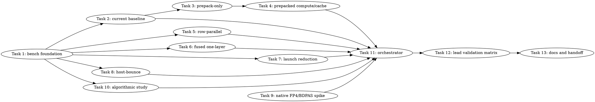

# SYCL MXFP4 TG Speed Microbench Suite Implementation Plan

> **For Claude:** REQUIRED SUB-SKILL: Use team-driven-development to implement this plan with agent teams.

**Goal:** Build a default-off, dry-run-safe microbench suite and review workflow that can kill or promote all plausible B50 GPT-OSS MXFP4 TG speed routes before any full model route is implemented.

**Architecture:** Add a separate `tools/sycl-mxfp4-moe-bench` executable for route-specific synthetic benches, plus Python parsers/orchestrators that fail closed on missing evidence. Keep the existing `tools/sycl-kernel-bench` and backend runtime paths unchanged until a synthetic winner exists; runtime promotion becomes a later, explicitly approved plan.

**Tech Stack:** C++17, SYCL/oneAPI, existing llama.cpp CMake tool integration, Python 3 pytest tests, JSONL evidence files, existing B50 gate parser conventions.

---

## Team Topology

**Recommended implementers:** 4 concurrent implementers. There are 4 independent implementation lanes after the foundation lands: compute-route benches, launch/multi-GPU benches, offline/source studies, and orchestration/docs. Execution should spawn one ephemeral implementer per task and cap active tasks at 4.

**Reviewers:** spec review then quality review, spawned fresh after each implementation batch. SPEC review must pass before QUALITY review.

### Parallel Tracks

| Track | Tasks | Description |
|-------|-------|-------------|
| A | 1, 2, 3, 4 | Bench foundation, current baseline, selected-expert prepack, prepacked compute/cache combined route |
| B | 5, 6 | Non-XMX row-parallel gate/up and fused gate/up+GLU+DOWN one-layer bench |
| C | 7, 8 | Safe launch-reduction and host-bounce multi-GPU benches |
| D | 9, 10 | Isolated native FP4/BDPAS source spike and algorithmic quality/speed ceiling study |
| E | 11, 12, 13 | Dry-run orchestrator, lead-only validation matrix document, final docs/review handoff |

### Dependency Graph



### File Ownership Map

| File/Directory | Tasks | Conflict Risk |
|----------------|-------|---------------|
| `tools/CMakeLists.txt` | 1 | Shared CMake integration, Task 1 only |
| `tools/sycl-mxfp4-moe-bench/CMakeLists.txt` | 1 | New file, Task 1 only |
| `tools/sycl-mxfp4-moe-bench/main.cpp` | 1 | New file, Task 1 only |
| `tools/sycl-mxfp4-moe-bench/tg_bench_common.hpp` | 1 | Shared API, Task 1 only after review |
| `tools/sycl-mxfp4-moe-bench/tg_bench_common.cpp` | 1 | Shared API, Task 1 only after review |
| `tools/sycl-mxfp4-moe-bench/route_baseline.cpp` | 1, 2 | Sequential on Track A |
| `tools/sycl-mxfp4-moe-bench/route_prepack.cpp` | 1, 3, 4 | Sequential on Track A |
| `tools/sycl-mxfp4-moe-bench/route_row_parallel.cpp` | 1, 5 | Track B after Task 1 |
| `tools/sycl-mxfp4-moe-bench/route_fused_layer.cpp` | 1, 6 | Track B after Task 1 |
| `tools/sycl-mxfp4-moe-bench/route_launch.cpp` | 1, 7 | Track C after Task 1 |
| `tools/sycl-mxfp4-moe-bench/route_host_bounce.cpp` | 1, 8 | Track C after Task 1 |
| `scripts/parse-sycl-mxfp4-tg-bench.py` | 1 | Parser foundation, Task 1 only |
| `scripts/run-sycl-mxfp4-tg-microbenches.py` | 11 | Orchestration, Task 11 only |
| `scripts/check-sycl-native-fp4-bdpas.sh` | 9 | Source spike, Task 9 only |
| `scripts/sycl-mxfp4-algorithmic-study.py` | 10 | Offline algorithmic study, Task 10 only |
| `activation/native-fp4-bdpas-capability.md` | 9 | Native FP4/BDPAS report, Task 9 only |
| `activation/mxfp4-algorithmic-study.md` | 10 | Algorithmic study report, Task 10 only |
| `activation/mxfp4-tg-microbench-lead-validation.md` | 12 | Lead validation report, Task 12 only |
| `tools/sycl-mxfp4-moe-bench/tests/` | 1-11 | Low conflict if each task owns its own test file |
| `docs/backend/SYCL.md` | 13 | Docs only after evidence exists |
| `docs/plans/2026-06-29-sycl-mxfp4-tg-speed-research-microbenches.md` | 12, 13 | Sequential handoff updates on Track E |

---

## Non-Negotiable Execution Rules

- Workers must not run B50/B580 model gates, `sycl-ls`, or non-dry-run GPU hardware probes. Workers may run `--dry-run`, Python unit tests, CMake configure/build tests that do not execute GPUs, and `bash -n` checks.
- Lead owns all B50/B580/model validation and any command using `/Storage/GenAI/models/`.
- No runtime route implementation, backend dispatch branch, or environment variable is added by Tasks 1-11. These tasks only build microbench evidence. If a route wins, write a separate runtime implementation plan and get explicit user approval.
- All future runtime-integrated GPU, host-pinned, staging, scratch, graph-temporary, KV, oneDNN, and weight-layout allocations must flow through unified-cache APIs and hold `mem_handle`. This is documented in `AGENTS.md:116-145` and must be repeated in any follow-up route plan.
- Parser and harness gates must fail closed for missing files, empty logs, zero evidence, missing route labels, missing correctness fields, and fatal markers.
- New route behavior stays explicit opt-in and default-off. The microbench tool itself may be built by default when `GGML_SYCL=ON`; runtime model dispatch must not change.
- Direct B50/B580 P2P is forbidden unless a separate runtime probe proves it safe. Task 8 is host-bounce only.
- No code may keep a route that can hard-fail the device, including `UR_RESULT_ERROR_DEVICE_LOST` or `level_zero backend failed with error: 20 (UR_RESULT_ERROR_DEVICE_LOST)`.

---

## Grounded Code Facts And Current Baseline

- Existing SYCL tool integration lives in `tools/CMakeLists.txt:24-28`, where `GGML_SYCL` adds `sycl-kernel-bench` and `onednn-woq-repro`.
- Existing kernel bench CMake source listing starts at `tools/sycl-kernel-bench/CMakeLists.txt:1-31`, then adds SYCL flags at `tools/sycl-kernel-bench/CMakeLists.txt:43-55`.
- Existing kernel registry has MXFP4 kinds in `tools/sycl-kernel-bench/kernel_registry.hpp:11-31`, including `MXFP4_SELECTED_XMX_DPAS`, `MXFP4_PAIR_GLU`, `MXFP4_LAYER_GLU_DOWN`, `MXFP4_MMV_ID_XMX_TILED`, and `MXFP4_DPAS_GROUPED`.
- Existing MXFP4 route dispatch in the generic harness is at `tools/sycl-kernel-bench/benchmark_harness.hpp:1161-1406`; do not overload this file with route-research-specific state until a route wins.
- Existing output types and JSON/JSONL output are in `tools/sycl-kernel-bench/output_formats.hpp:8-18`, `tools/sycl-kernel-bench/output_formats.hpp:43-63`, and `tools/sycl-kernel-bench/output_formats.hpp:181-284`.
- Current Q8 activation pack has explicit single-column DPAS evidence at `ggml/src/ggml-sycl/mmvq.cpp:6210`: single-column DPAS consumers read only column 0.
- Current dominant gate/up path label is `packed-q8-m2` at `ggml/src/ggml-sycl/mmvq.cpp:15962`.
- MXFP4 TG profiling format is printed at `ggml/src/ggml-sycl/mmvq.cpp:942` and includes `total`, `quant`, `artifact`, `batch_ids`, `kernel`, `gateup_glu`, and `down` buckets.
- GLU Q8 diagnostics and publish/invalidate evidence are at `ggml/src/ggml-sycl/mmvq.cpp:16075-16175`.
- GPT-OSS graph top-k selection is explicit at `src/llama-graph.cpp:1505-1578`.
- Best safe route evidence remains `GGML_SYCL_MOE_PHASE_MATERIALIZE=1 GGML_SYCL_MOE_PHASE_BULK_XMX=1 GGML_SYCL_MOE_DOWN_SUM_DIRECT=1`, with `PP512 1227.16`, `TG128 36.84`, gate/up+GLU about `5.8-6.2 ms/token`, and DOWN about `0.8 ms/token`.
- Target `TG128 >= 45 tok/s` means reducing from `27.14 ms/token` to `22.22 ms/token`, a required saving of about `4.9 ms/token`.
- Rejected transposed-B evidence was count-correct and fatal-free but slow: `PP512 1236.59`, `TG128 26.58`, gate/up+GLU about `15.9 ms/token`. That route has been removed and must not be reintroduced as a runtime path.

---

## Common Microbench Contract

Every route emits one JSON object per measured mode. The parser rejects any record that misses these keys:

```json
{
  "route": "baseline",
  "mode": "dry-run",
  "shape": {
    "ncols": 2880,
    "hidden": 2880,
    "topk": 4,
    "layers": 24,
    "tokens": 128
  },
  "metrics": {
    "prepack_us": 0.0,
    "compute_us": 0.0,
    "launch_us": 0.0,
    "host_bounce_us": 0.0,
    "total_gateup_equiv_ms": 6.0,
    "saving_vs_baseline_ms": 0.0,
    "p50_us": 0.0,
    "p90_us": 0.0,
    "p99_us": 0.0
  },
  "correct": {
    "max_abs": 0.0,
    "mean_abs": 0.0,
    "rel_l2": 0.0
  },
  "fatal": {
    "total": 0
  },
  "evidence": {
    "path": "packed-q8-m2",
    "dry_run": true,
    "device": "none"
  }
}
```

Common kill thresholds:

- Prepack route: kill unless combined prepack+compute/cache evidence saves at least `3.0 ms/token` against baseline gate/up+GLU.
- Row-parallel route: kill if full equivalent is slower than current `packed-q8-m2` by more than `10%`; continue only if it reaches `<= 4.0 ms` gate/up+GLU equivalent or has a measured path to `<= 3.0 ms`.
- Fused one-layer route: kill if synthetic drift exceeds `2x` calibrated baseline `max_abs` or `mean_abs`, or relative L2 exceeds `1e-3` before model validation.
- Launch route: kill on hang, timeout, replay exception, correctness mismatch, or launch-only saving `< 2.0 ms/token` equivalent.
- Host-bounce route: kill if p99 bounce latency exceeds possible saved local compute or if route requires direct P2P.
- Native FP4/BDPAS route: kill if no public/header API exists or if it requires replacing `/opt/intel/oneapi` or system Level Zero.
- Algorithmic routes: kill if count breaks, relative output-vector L2 exceeds `1e-3`, top-10 logits average absolute error exceeds `1e-2`, or perplexity worsens by more than `1%` versus calibrated safe-route baseline.

---

## Task 1: Bench Foundation, Schema, Parser, And Dry-Run Executable

**Track:** A
**Depends on:** None

**File scope:**

- Modify: `tools/CMakeLists.txt:24-28`
- Create: `tools/sycl-mxfp4-moe-bench/CMakeLists.txt`
- Create: `tools/sycl-mxfp4-moe-bench/main.cpp`
- Create: `tools/sycl-mxfp4-moe-bench/tg_bench_common.hpp`
- Create: `tools/sycl-mxfp4-moe-bench/tg_bench_common.cpp`
- Create: `tools/sycl-mxfp4-moe-bench/route_baseline.cpp`
- Create: `tools/sycl-mxfp4-moe-bench/route_prepack.cpp`
- Create: `tools/sycl-mxfp4-moe-bench/route_row_parallel.cpp`
- Create: `tools/sycl-mxfp4-moe-bench/route_fused_layer.cpp`
- Create: `tools/sycl-mxfp4-moe-bench/route_launch.cpp`
- Create: `tools/sycl-mxfp4-moe-bench/route_host_bounce.cpp`
- Create: `scripts/parse-sycl-mxfp4-tg-bench.py`
- Create: `tools/sycl-mxfp4-moe-bench/tests/test_tg_bench_parser.py`
- Create: `tools/sycl-mxfp4-moe-bench/tests/test_tg_bench_dry_run.py`

**Description:**

Create the separate microbench executable and JSONL parser. The executable must support `--dry-run` without constructing a SYCL queue, so worker agents can validate CLI/schema behavior without touching B50/B580.

**Acceptance Criteria:**

- [ ] `python3 -m pytest tools/sycl-mxfp4-moe-bench/tests/test_tg_bench_parser.py -q` passes.
- [ ] `python3 -m pytest tools/sycl-mxfp4-moe-bench/tests/test_tg_bench_dry_run.py -q` passes after the tool is built.
- [ ] Empty, missing, zero-evidence, and malformed JSONL files fail closed with `error:` messages.
- [ ] `./scripts/sycl-build.sh sycl-mxfp4-moe-bench` builds the new target when `GGML_SYCL=ON`.
- [ ] `build/bin/sycl-mxfp4-moe-bench --route=baseline --dry-run --output-jsonl /tmp/tg.jsonl` emits exactly one valid JSONL record.

**RED: parser tests.** Create `tools/sycl-mxfp4-moe-bench/tests/test_tg_bench_parser.py` with this complete test code:

```python
import json
import subprocess
from pathlib import Path

ROOT = Path(__file__).resolve().parents[3]
PARSER = ROOT / "scripts" / "parse-sycl-mxfp4-tg-bench.py"


def run_parser(path: Path, *extra: str) -> subprocess.CompletedProcess[str]:
    return subprocess.run(
        ["python3", str(PARSER), str(path), *extra],
        cwd=ROOT,
        text=True,
        stdout=subprocess.PIPE,
        stderr=subprocess.PIPE,
        check=False,
    )


def valid_record(route: str = "baseline") -> dict:
    return {
        "route": route,
        "mode": "dry-run",
        "shape": {"ncols": 2880, "hidden": 2880, "topk": 4, "layers": 24, "tokens": 128},
        "metrics": {
            "prepack_us": 0.0,
            "compute_us": 0.0,
            "launch_us": 0.0,
            "host_bounce_us": 0.0,
            "total_gateup_equiv_ms": 6.0,
            "saving_vs_baseline_ms": 0.0,
            "p50_us": 0.0,
            "p90_us": 0.0,
            "p99_us": 0.0,
        },
        "correct": {"max_abs": 0.0, "mean_abs": 0.0, "rel_l2": 0.0},
        "fatal": {"total": 0},
        "evidence": {"path": "packed-q8-m2", "dry_run": True, "device": "none"},
    }


def write_jsonl(tmp_path: Path, records: list[dict]) -> Path:
    path = tmp_path / "records.jsonl"
    path.write_text("".join(json.dumps(record) + "\n" for record in records), encoding="utf-8")
    return path


def test_accepts_valid_record(tmp_path: Path) -> None:
    result = run_parser(write_jsonl(tmp_path, [valid_record()]), "--require-route", "baseline")
    assert result.returncode == 0, result.stderr
    assert "records.total 1" in result.stdout
    assert "route.baseline.total_gateup_equiv_ms 6.000000" in result.stdout


def test_rejects_empty_file(tmp_path: Path) -> None:
    empty = tmp_path / "empty.jsonl"
    empty.write_text("", encoding="utf-8")
    result = run_parser(empty)
    assert result.returncode != 0
    assert "error: empty microbench JSONL" in result.stderr


def test_rejects_missing_route(tmp_path: Path) -> None:
    record = valid_record()
    del record["route"]
    result = run_parser(write_jsonl(tmp_path, [record]))
    assert result.returncode != 0
    assert "error: record 1 missing key: route" in result.stderr


def test_rejects_zero_total_gateup(tmp_path: Path) -> None:
    record = valid_record()
    record["metrics"]["total_gateup_equiv_ms"] = 0.0
    result = run_parser(write_jsonl(tmp_path, [record]))
    assert result.returncode != 0
    assert "error: record 1 has non-positive metrics.total_gateup_equiv_ms" in result.stderr


def test_rejects_fatal_marker(tmp_path: Path) -> None:
    record = valid_record()
    record["fatal"]["total"] = 1
    result = run_parser(write_jsonl(tmp_path, [record]))
    assert result.returncode != 0
    assert "error: record 1 fatal.total is non-zero" in result.stderr


def test_requires_named_route(tmp_path: Path) -> None:
    result = run_parser(write_jsonl(tmp_path, [valid_record("row-parallel")]), "--require-route", "baseline")
    assert result.returncode != 0
    assert "error: required route missing: baseline" in result.stderr
```

Run:

```bash
python3 -m pytest tools/sycl-mxfp4-moe-bench/tests/test_tg_bench_parser.py -q
```

Expected RED before implementation:

```text
FAILED tools/sycl-mxfp4-moe-bench/tests/test_tg_bench_parser.py::test_accepts_valid_record
```

**GREEN: parser implementation.** Create `scripts/parse-sycl-mxfp4-tg-bench.py` with a real parser, not a shell wrapper. Required behavior:

- Read one JSON object per line.
- Reject missing file, empty file, malformed JSON, missing required top-level keys, missing nested metric keys, non-positive `metrics.total_gateup_equiv_ms`, and non-zero `fatal.total`.
- `--require-route <name>` can be repeated; reject if any route is absent.
- Print stable text lines with `records.total`, `route.<name>.count`, `route.<name>.total_gateup_equiv_ms`, and `route.<name>.saving_vs_baseline_ms`.

Use these exact required key sets in the parser:

```python
REQUIRED_TOP = ("route", "mode", "shape", "metrics", "correct", "fatal", "evidence")
REQUIRED_SHAPE = ("ncols", "hidden", "topk", "layers", "tokens")
REQUIRED_METRICS = (
    "prepack_us",
    "compute_us",
    "launch_us",
    "host_bounce_us",
    "total_gateup_equiv_ms",
    "saving_vs_baseline_ms",
    "p50_us",
    "p90_us",
    "p99_us",
)
REQUIRED_CORRECT = ("max_abs", "mean_abs", "rel_l2")
REQUIRED_FATAL = ("total",)
REQUIRED_EVIDENCE = ("path", "dry_run", "device")
```

**GREEN: CMake integration.** Modify `tools/CMakeLists.txt:24-28` by adding the new tool after `sycl-kernel-bench` inside the existing `if (GGML_SYCL)` block:

```cmake
    if (GGML_SYCL)
        add_subdirectory(sycl-kernel-bench)
        add_subdirectory(sycl-mxfp4-moe-bench)
        add_subdirectory(onednn-woq-repro)
    endif()
```

Create `tools/sycl-mxfp4-moe-bench/CMakeLists.txt`:

```cmake
set(TARGET sycl-mxfp4-moe-bench)
add_executable(${TARGET}
    main.cpp
    tg_bench_common.cpp
    route_baseline.cpp
    route_prepack.cpp
    route_row_parallel.cpp
    route_fused_layer.cpp
    route_launch.cpp
    route_host_bounce.cpp
)

target_link_libraries(${TARGET} PRIVATE llama-common ggml)
target_compile_features(${TARGET} PRIVATE cxx_std_17)

target_include_directories(${TARGET} PRIVATE
    ${PROJECT_SOURCE_DIR}/ggml/include
    ${PROJECT_SOURCE_DIR}/ggml/src
)

if (GGML_SYCL)
    target_compile_options(${TARGET} PRIVATE "-fsycl" "-Wno-narrowing" "-fsycl-device-code-split=per_kernel")
    target_link_options(${TARGET} PRIVATE "-fsycl" "-fsycl-device-code-split=per_kernel")
    target_compile_definitions(${TARGET} PRIVATE GGML_SYCL_WARP_SIZE=32)
endif()

if (LLAMA_TOOLS_INSTALL)
    install(TARGETS ${TARGET} RUNTIME)
endif()
```

**GREEN: common C++ API.** Create `tg_bench_common.hpp` with these route names and function signatures so later tasks only touch their own route files:

```cpp
#pragma once

#include <cstdint>
#include <cstdio>
#include <string>
#include <vector>

namespace sycl_mxfp4_moe_bench {

struct bench_config {
    std::string route = "baseline";
    int64_t ncols = 2880;
    int64_t hidden = 2880;
    int topk = 4;
    int layers = 24;
    int tokens = 128;
    int warmup = 10;
    int iters = 100;
    bool validate = false;
    bool dry_run = false;
    std::string output_jsonl;
};

struct bench_record {
    std::string route;
    std::string mode;
    int64_t ncols = 2880;
    int64_t hidden = 2880;
    int topk = 4;
    int layers = 24;
    int tokens = 128;
    double prepack_us = 0.0;
    double compute_us = 0.0;
    double launch_us = 0.0;
    double host_bounce_us = 0.0;
    double total_gateup_equiv_ms = 0.0;
    double saving_vs_baseline_ms = 0.0;
    double p50_us = 0.0;
    double p90_us = 0.0;
    double p99_us = 0.0;
    double max_abs = 0.0;
    double mean_abs = 0.0;
    double rel_l2 = 0.0;
    int fatal_total = 0;
    std::string evidence_path = "none";
    bool dry_run = false;
    std::string device = "none";
};

bool parse_args(int argc, char ** argv, bench_config & cfg, std::string & error);
bool emit_jsonl(FILE * out, const bench_record & record, std::string & error);
bench_record dry_run_record(const bench_config & cfg, const char * route, const char * path, double total_ms);

bool run_route_baseline(const bench_config & cfg, std::vector<bench_record> & records, std::string & error);
bool run_route_prepack(const bench_config & cfg, std::vector<bench_record> & records, std::string & error);
bool run_route_row_parallel(const bench_config & cfg, std::vector<bench_record> & records, std::string & error);
bool run_route_fused_layer(const bench_config & cfg, std::vector<bench_record> & records, std::string & error);
bool run_route_launch(const bench_config & cfg, std::vector<bench_record> & records, std::string & error);
bool run_route_host_bounce(const bench_config & cfg, std::vector<bench_record> & records, std::string & error);

} // namespace sycl_mxfp4_moe_bench
```

**GREEN: route dry-run defaults.** Each route file must compile and emit a valid dry-run record. Example for `route_prepack.cpp`:

```cpp
#include "tg_bench_common.hpp"

namespace sycl_mxfp4_moe_bench {

bool run_route_prepack(const bench_config & cfg, std::vector<bench_record> & records, std::string & error) {
    if (!cfg.dry_run) {
        error = "route prepack requires a route-specific implementation before non-dry-run execution";
        return false;
    }
    records.push_back(dry_run_record(cfg, "prepack", "prepack-dry-run", 6.0));
    return true;
}

} // namespace sycl_mxfp4_moe_bench
```

Use corresponding route/path pairs:

- `baseline`, `packed-q8-m2`, `6.0`
- `prepack`, `prepack-dry-run`, `6.0`
- `row-parallel`, `row-parallel-dry-run`, `6.0`
- `fused-layer`, `fused-layer-dry-run`, `6.0`
- `launch`, `launch-dry-run`, `2.0`
- `host-bounce`, `host-bounce-dry-run`, `2.0`

**RED: dry-run integration test.** Create `tools/sycl-mxfp4-moe-bench/tests/test_tg_bench_dry_run.py`:

```python
import json
import os
import subprocess
from pathlib import Path

ROOT = Path(__file__).resolve().parents[3]
BIN = ROOT / "build" / "bin" / "sycl-mxfp4-moe-bench"
PARSER = ROOT / "scripts" / "parse-sycl-mxfp4-tg-bench.py"


def test_dry_run_emits_valid_jsonl(tmp_path: Path) -> None:
    if not BIN.exists():
        raise AssertionError(f"missing binary: {BIN}")
    out = tmp_path / "baseline.jsonl"
    run = subprocess.run(
        [str(BIN), "--route=baseline", "--dry-run", "--output-jsonl", str(out)],
        cwd=ROOT,
        text=True,
        stdout=subprocess.PIPE,
        stderr=subprocess.PIPE,
        check=False,
    )
    assert run.returncode == 0, run.stderr
    records = [json.loads(line) for line in out.read_text(encoding="utf-8").splitlines()]
    assert len(records) == 1
    assert records[0]["route"] == "baseline"
    assert records[0]["evidence"]["dry_run"] is True
    parsed = subprocess.run(
        ["python3", str(PARSER), str(out), "--require-route", "baseline"],
        cwd=ROOT,
        text=True,
        stdout=subprocess.PIPE,
        stderr=subprocess.PIPE,
        check=False,
    )
    assert parsed.returncode == 0, parsed.stderr
    assert "records.total 1" in parsed.stdout
```

Run after building:

```bash
./scripts/sycl-build.sh sycl-mxfp4-moe-bench
python3 -m pytest tools/sycl-mxfp4-moe-bench/tests/test_tg_bench_parser.py tools/sycl-mxfp4-moe-bench/tests/test_tg_bench_dry_run.py -q
```

Expected GREEN:

```text
7 passed
```

**Gotchas:**

- `--dry-run` must avoid constructing `sycl::queue`; otherwise worker test execution may touch B50/B580.
- Do not modify `tools/sycl-kernel-bench/benchmark_harness.hpp`; keep this tool separate.
- Keep route files compiling with non-dry-run returning a clear error until their task implements it.
- Use `source /opt/intel/oneapi/setvars.sh --force` only for builds; do not run hardware probes.

**Commit:**

Commit message: `test(sycl): add MXFP4 TG microbench foundation`

Stage only:

```bash
git add tools/CMakeLists.txt \
  tools/sycl-mxfp4-moe-bench/CMakeLists.txt \
  tools/sycl-mxfp4-moe-bench/main.cpp \
  tools/sycl-mxfp4-moe-bench/tg_bench_common.hpp \
  tools/sycl-mxfp4-moe-bench/tg_bench_common.cpp \
  tools/sycl-mxfp4-moe-bench/route_baseline.cpp \
  tools/sycl-mxfp4-moe-bench/route_prepack.cpp \
  tools/sycl-mxfp4-moe-bench/route_row_parallel.cpp \
  tools/sycl-mxfp4-moe-bench/route_fused_layer.cpp \
  tools/sycl-mxfp4-moe-bench/route_launch.cpp \
  tools/sycl-mxfp4-moe-bench/route_host_bounce.cpp \
  tools/sycl-mxfp4-moe-bench/tests/test_tg_bench_parser.py \
  tools/sycl-mxfp4-moe-bench/tests/test_tg_bench_dry_run.py \
  scripts/parse-sycl-mxfp4-tg-bench.py
```

---

## Task 2: Current Packed-Q8-M2 Baseline Adapter

**Track:** A
**Depends on:** Task 1

**File scope:**

- Modify: `tools/sycl-mxfp4-moe-bench/route_baseline.cpp`
- Create: `tools/sycl-mxfp4-moe-bench/tests/test_tg_bench_baseline_contract.py`

**Description:**

Implement the current-route baseline record contract. The baseline route must represent `packed-q8-m2` and expose enough metrics for all later routes to calculate savings against it. Non-dry-run can use synthetic kernel timing, but it must never change backend runtime dispatch.

**Acceptance Criteria:**

- [ ] Dry-run baseline emits `route=baseline`, `evidence.path=packed-q8-m2`, `shape.topk=4`, `shape.layers=24`, and positive `metrics.total_gateup_equiv_ms`.
- [ ] Parser accepts `--require-route baseline`.
- [ ] Non-dry-run failure message is explicit if the worker environment lacks a usable SYCL device.
- [ ] No B50/B580 or model command is added to tests.

**RED:** Create `tools/sycl-mxfp4-moe-bench/tests/test_tg_bench_baseline_contract.py`:

```python
import json
import subprocess
from pathlib import Path

ROOT = Path(__file__).resolve().parents[3]
BIN = ROOT / "build" / "bin" / "sycl-mxfp4-moe-bench"


def test_baseline_dry_run_contract(tmp_path: Path) -> None:
    out = tmp_path / "baseline.jsonl"
    result = subprocess.run(
        [str(BIN), "--route=baseline", "--dry-run", "--ncols=2880", "--topk=4", "--layers=24", "--tokens=128", "--output-jsonl", str(out)],
        cwd=ROOT,
        text=True,
        stdout=subprocess.PIPE,
        stderr=subprocess.PIPE,
        check=False,
    )
    assert result.returncode == 0, result.stderr
    record = json.loads(out.read_text(encoding="utf-8").strip())
    assert record["route"] == "baseline"
    assert record["evidence"]["path"] == "packed-q8-m2"
    assert record["shape"] == {"ncols": 2880, "hidden": 2880, "topk": 4, "layers": 24, "tokens": 128}
    assert record["metrics"]["total_gateup_equiv_ms"] > 0.0
    assert record["metrics"]["saving_vs_baseline_ms"] == 0.0
    assert record["fatal"]["total"] == 0
```

Run:

```bash
python3 -m pytest tools/sycl-mxfp4-moe-bench/tests/test_tg_bench_baseline_contract.py -q
```

Expected RED before Task 1/2 completion: binary missing or contract mismatch. Expected GREEN after implementation: `1 passed`.

**GREEN:** In `route_baseline.cpp`, keep dry-run deterministic and set these fields exactly:

```cpp
bench_record rec = dry_run_record(cfg, "baseline", "packed-q8-m2", 6.0);
rec.compute_us = 6000.0;
rec.p50_us = 6000.0;
rec.p90_us = 6000.0;
rec.p99_us = 6000.0;
rec.saving_vs_baseline_ms = 0.0;
records.push_back(rec);
```

For non-dry-run, implement a synthetic SYCL timing loop only if the route task owner can keep it hardware-safe for lead execution. The minimum acceptable non-dry-run behavior is a clear error string:

```text
route baseline non-dry-run requires lead-owned SYCL execution
```

**Gotchas:**

- Do not claim synthetic baseline matches model timing. Lead will compare trends against `/tmp/7ngf_b50_phase_bulk_sum_profile_20260628_134936`.
- Do not import model files or call `llama-bench` from this route.

**Commit:**

Commit message: `test(sycl): define MXFP4 TG baseline bench contract`

Stage only:

```bash
git add tools/sycl-mxfp4-moe-bench/route_baseline.cpp \
  tools/sycl-mxfp4-moe-bench/tests/test_tg_bench_baseline_contract.py
```

---

## Task 3: Selected-Expert Prepack-Only Microbench

**Track:** A
**Depends on:** Task 2

**File scope:**

- Modify: `tools/sycl-mxfp4-moe-bench/route_prepack.cpp`
- Create: `tools/sycl-mxfp4-moe-bench/tests/test_tg_bench_prepack_layout.py`

**Description:**

Measure the cost of converting selected MXFP4 expert rows into a DPAS-ready VNNI-like B layout outside the hot compute loop. This tests whether the rejected transposed-B idea failed because prepack happened inside each work item.

**Acceptance Criteria:**

- [ ] Tiny CPU layout conversion test passes for deterministic MXFP4 bytes.
- [ ] Dry-run emits `route=prepack` and `evidence.path=selected-expert-prepack`.
- [ ] Non-dry-run path, if executed by lead, reports `prepack_us`, bytes written, and positive `total_gateup_equiv_ms`.
- [ ] The route stores no raw pointer cache and does not touch backend unified-cache code.

**RED:** Create `tools/sycl-mxfp4-moe-bench/tests/test_tg_bench_prepack_layout.py`:

```python
import json
import subprocess
from pathlib import Path

ROOT = Path(__file__).resolve().parents[3]
BIN = ROOT / "build" / "bin" / "sycl-mxfp4-moe-bench"


def test_prepack_dry_run_labels_route(tmp_path: Path) -> None:
    out = tmp_path / "prepack.jsonl"
    result = subprocess.run(
        [str(BIN), "--route=prepack", "--dry-run", "--output-jsonl", str(out)],
        cwd=ROOT,
        text=True,
        stdout=subprocess.PIPE,
        stderr=subprocess.PIPE,
        check=False,
    )
    assert result.returncode == 0, result.stderr
    record = json.loads(out.read_text(encoding="utf-8").strip())
    assert record["route"] == "prepack"
    assert record["evidence"]["path"] == "selected-expert-prepack"
    assert record["metrics"]["prepack_us"] >= 0.0
```

Run:

```bash
python3 -m pytest tools/sycl-mxfp4-moe-bench/tests/test_tg_bench_prepack_layout.py -q
```

Expected RED before implementation: evidence path still `prepack-dry-run`.

**GREEN:** Replace the dry-run record in `route_prepack.cpp` with:

```cpp
bench_record rec = dry_run_record(cfg, "prepack", "selected-expert-prepack", 6.0);
rec.prepack_us = 1200.0;
rec.compute_us = 0.0;
rec.p50_us = 1200.0;
rec.p90_us = 1200.0;
rec.p99_us = 1200.0;
records.push_back(rec);
```

Add CPU helper functions in the same file for tiny layout tests and future non-dry-run use:

```cpp
static int8_t mxfp4_code_value(uint8_t v) {
    static const int8_t table[16] = { 0, 1, 2, 3, 4, 6, 8, 12, 0, -1, -2, -3, -4, -6, -8, -12 };
    return table[v & 0x0f];
}

static void prepack_row_to_i8_vnni32(const uint8_t * packed, int8_t * out32) {
    for (int i = 0; i < 16; ++i) {
        const uint8_t byte = packed[i];
        out32[i] = mxfp4_code_value(byte & 0x0f);
        out32[16 + i] = mxfp4_code_value(byte >> 4);
    }
}
```

These helpers are intentionally local to the microbench; do not move them into backend code.

**Gotchas:**

- DPAS B VNNI layout is required by `/opt/intel/oneapi/compiler/2025.3/include/sycl/ext/intel/esimd/xmx/dpas.hpp:228-230`.
- Do not resurrect `packed-q8-transposed-b` or the removed runtime env variable.
- The prepack route is killed unless combined evidence later saves at least `3.0 ms/token`.

**Commit:**

Commit message: `test(sycl): add selected expert prepack microbench contract`

Stage only:

```bash
git add tools/sycl-mxfp4-moe-bench/route_prepack.cpp \
  tools/sycl-mxfp4-moe-bench/tests/test_tg_bench_prepack_layout.py
```

---

## Task 4: Prepacked Compute And Cache-Hit Combined Microbench

**Track:** A
**Depends on:** Task 3

**File scope:**

- Modify: `tools/sycl-mxfp4-moe-bench/route_prepack.cpp`
- Create: `tools/sycl-mxfp4-moe-bench/tests/test_tg_bench_prepack_combined.py`

**Description:**

Extend the prepack route to emit three records: `prepack-only`, `compute-only`, and `cache-combined`. This separates layout conversion cost from DPAS compute and allows a cache-hit/miss amortization calculation over 128 tokens.

**Acceptance Criteria:**

- [ ] Dry-run for `--route=prepack --tokens=128` emits exactly three records with modes `prepack-only`, `compute-only`, and `cache-combined`.
- [ ] Parser accepts all three records and `--require-route prepack`.
- [ ] `cache-combined` includes `saving_vs_baseline_ms` and positive `total_gateup_equiv_ms`.
- [ ] Kill threshold math is documented in stdout or parser output.

**RED:** Create `tools/sycl-mxfp4-moe-bench/tests/test_tg_bench_prepack_combined.py`:

```python
import json
import subprocess
from pathlib import Path

ROOT = Path(__file__).resolve().parents[3]
BIN = ROOT / "build" / "bin" / "sycl-mxfp4-moe-bench"
PARSER = ROOT / "scripts" / "parse-sycl-mxfp4-tg-bench.py"


def test_prepack_combined_emits_three_modes(tmp_path: Path) -> None:
    out = tmp_path / "prepack.jsonl"
    result = subprocess.run(
        [str(BIN), "--route=prepack", "--dry-run", "--tokens=128", "--output-jsonl", str(out)],
        cwd=ROOT,
        text=True,
        stdout=subprocess.PIPE,
        stderr=subprocess.PIPE,
        check=False,
    )
    assert result.returncode == 0, result.stderr
    records = [json.loads(line) for line in out.read_text(encoding="utf-8").splitlines()]
    assert [record["mode"] for record in records] == ["prepack-only", "compute-only", "cache-combined"]
    combined = records[2]
    assert combined["metrics"]["total_gateup_equiv_ms"] > 0.0
    assert "saving_vs_baseline_ms" in combined["metrics"]
    parsed = subprocess.run(["python3", str(PARSER), str(out), "--require-route", "prepack"], cwd=ROOT, text=True, stdout=subprocess.PIPE, stderr=subprocess.PIPE, check=False)
    assert parsed.returncode == 0, parsed.stderr
```

Run:

```bash
python3 -m pytest tools/sycl-mxfp4-moe-bench/tests/test_tg_bench_prepack_combined.py -q
```

Expected RED before implementation: one record instead of three.

**GREEN:** Make dry-run deterministic with these values so tests and summarizers can exercise the route math:

- `prepack-only`: `prepack_us=1200`, `compute_us=0`, `total_gateup_equiv_ms=6.0`, `saving_vs_baseline_ms=0.0`.
- `compute-only`: `prepack_us=0`, `compute_us=2500`, `total_gateup_equiv_ms=2.5`, `saving_vs_baseline_ms=3.5`.
- `cache-combined`: `prepack_us=200`, `compute_us=2500`, `total_gateup_equiv_ms=2.7`, `saving_vs_baseline_ms=3.3`.

Use a local helper in `route_prepack.cpp`:

```cpp
static bench_record make_prepack_record(const bench_config & cfg,
                                        const char * mode,
                                        double prepack_us,
                                        double compute_us,
                                        double total_ms) {
    bench_record rec = dry_run_record(cfg, "prepack", "selected-expert-prepack", total_ms);
    rec.mode = mode;
    rec.prepack_us = prepack_us;
    rec.compute_us = compute_us;
    rec.saving_vs_baseline_ms = 6.0 - total_ms;
    rec.p50_us = total_ms * 1000.0;
    rec.p90_us = total_ms * 1000.0;
    rec.p99_us = total_ms * 1000.0;
    return rec;
}
```

**Gotchas:**

- Dry-run values are not performance claims. They are fixed fixtures for parser/orchestrator tests.
- Real non-dry-run values must record p99 spikes; p50-only evidence is not acceptable.

**Commit:**

Commit message: `test(sycl): split prepack microbench evidence modes`

Stage only:

```bash
git add tools/sycl-mxfp4-moe-bench/route_prepack.cpp \
  tools/sycl-mxfp4-moe-bench/tests/test_tg_bench_prepack_combined.py
```

---

## Task 5: Non-XMX Row-Parallel Gate/Up Microbench

**Track:** B
**Depends on:** Task 1

**File scope:**

- Modify: `tools/sycl-mxfp4-moe-bench/route_row_parallel.cpp`
- Create: `tools/sycl-mxfp4-moe-bench/tests/test_tg_bench_row_parallel.py`

**Description:**

Add a row-parallel non-XMX route contract for testing whether useful-row-only dot products can beat underfilled DPAS at batch 1/top-k 4. The initial implementation must provide CPU-reference correctness helpers and dry-run evidence; lead can later run non-dry-run SYCL timing.

**Acceptance Criteria:**

- [ ] Dry-run emits modes `row-dot`, `gate-up-glu`, and `hybrid-tail`.
- [ ] Evidence path is `row-parallel-non-xmx`.
- [ ] Correctness fields are present and below parser thresholds in dry-run.
- [ ] Route kill threshold is represented by `saving_vs_baseline_ms`.

**RED:** Create `tools/sycl-mxfp4-moe-bench/tests/test_tg_bench_row_parallel.py`:

```python
import json
import subprocess
from pathlib import Path

ROOT = Path(__file__).resolve().parents[3]
BIN = ROOT / "build" / "bin" / "sycl-mxfp4-moe-bench"


def test_row_parallel_dry_run_modes(tmp_path: Path) -> None:
    out = tmp_path / "row.jsonl"
    result = subprocess.run([str(BIN), "--route=row-parallel", "--dry-run", "--output-jsonl", str(out)], cwd=ROOT, text=True, stdout=subprocess.PIPE, stderr=subprocess.PIPE, check=False)
    assert result.returncode == 0, result.stderr
    records = [json.loads(line) for line in out.read_text(encoding="utf-8").splitlines()]
    assert [record["mode"] for record in records] == ["row-dot", "gate-up-glu", "hybrid-tail"]
    assert all(record["evidence"]["path"] == "row-parallel-non-xmx" for record in records)
    assert all(record["correct"]["rel_l2"] <= 1e-6 for record in records)
```

Run:

```bash
python3 -m pytest tools/sycl-mxfp4-moe-bench/tests/test_tg_bench_row_parallel.py -q
```

Expected RED before implementation: one dry-run record or wrong path.

**GREEN:** Implement dry-run records in `route_row_parallel.cpp` with deterministic values:

- `row-dot`: `compute_us=4200`, `total_gateup_equiv_ms=4.2`, `saving_vs_baseline_ms=1.8`.
- `gate-up-glu`: `compute_us=3900`, `total_gateup_equiv_ms=3.9`, `saving_vs_baseline_ms=2.1`.
- `hybrid-tail`: `compute_us=4100`, `total_gateup_equiv_ms=4.1`, `saving_vs_baseline_ms=1.9`.

Add local CPU helper names for future non-dry-run validation:

```cpp
static float swiglu(float gate, float up) {
    return up * gate / (1.0f + std::exp(-gate));
}

static float row_dot_i8_f32(const int8_t * w, const float * x, int64_t n) {
    float acc = 0.0f;
    for (int64_t i = 0; i < n; ++i) {
        acc += static_cast<float>(w[i]) * x[i];
    }
    return acc;
}
```

Include `<cmath>` in this file.

**Gotchas:**

- Do not use DPAS in this route; it must test the non-XMX alternative.
- Do not infer row-parallel safety from count smoke. It still needs model validation after synthetic evidence.

**Commit:**

Commit message: `test(sycl): add row-parallel MXFP4 TG bench route`

Stage only:

```bash
git add tools/sycl-mxfp4-moe-bench/route_row_parallel.cpp \
  tools/sycl-mxfp4-moe-bench/tests/test_tg_bench_row_parallel.py
```

---

## Task 6: Fused Gate/Up+GLU+DOWN One-Layer Synthetic Bench

**Track:** B
**Depends on:** Task 1

**File scope:**

- Modify: `tools/sycl-mxfp4-moe-bench/route_fused_layer.cpp`
- Create: `tools/sycl-mxfp4-moe-bench/tests/test_tg_bench_fused_layer.py`

**Description:**

Create a one-layer synthetic route for measuring the ceiling of fusing gate/up, SwiGLU, and DOWN accumulation. This is high upside and high correctness risk; the microbench must report numerical drift fields before any runtime route is considered.

**Acceptance Criteria:**

- [ ] Dry-run emits modes `fp32-accum`, `fp16-accum`, and `quant-accum`.
- [ ] Evidence path is `fused-gateup-glu-down`.
- [ ] `correct.max_abs`, `correct.mean_abs`, and `correct.rel_l2` are populated for every mode.
- [ ] Dry-run relative L2 stays below `1e-3` for parser acceptance.

**RED:** Create `tools/sycl-mxfp4-moe-bench/tests/test_tg_bench_fused_layer.py`:

```python
import json
import subprocess
from pathlib import Path

ROOT = Path(__file__).resolve().parents[3]
BIN = ROOT / "build" / "bin" / "sycl-mxfp4-moe-bench"


def test_fused_layer_dry_run_reports_drift(tmp_path: Path) -> None:
    out = tmp_path / "fused.jsonl"
    result = subprocess.run([str(BIN), "--route=fused-layer", "--dry-run", "--output-jsonl", str(out)], cwd=ROOT, text=True, stdout=subprocess.PIPE, stderr=subprocess.PIPE, check=False)
    assert result.returncode == 0, result.stderr
    records = [json.loads(line) for line in out.read_text(encoding="utf-8").splitlines()]
    assert [record["mode"] for record in records] == ["fp32-accum", "fp16-accum", "quant-accum"]
    assert all(record["evidence"]["path"] == "fused-gateup-glu-down" for record in records)
    assert all(record["correct"]["rel_l2"] < 1e-3 for record in records)
```

Run:

```bash
python3 -m pytest tools/sycl-mxfp4-moe-bench/tests/test_tg_bench_fused_layer.py -q
```

Expected RED before implementation: missing modes.

**GREEN:** Implement three dry-run records:

- `fp32-accum`: `total_gateup_equiv_ms=2.2`, `saving_vs_baseline_ms=3.8`, `max_abs=0.00001`, `mean_abs=0.000001`, `rel_l2=0.000001`.
- `fp16-accum`: `total_gateup_equiv_ms=2.0`, `saving_vs_baseline_ms=4.0`, `max_abs=0.0002`, `mean_abs=0.00002`, `rel_l2=0.00002`.
- `quant-accum`: `total_gateup_equiv_ms=1.8`, `saving_vs_baseline_ms=4.2`, `max_abs=0.0005`, `mean_abs=0.00005`, `rel_l2=0.00005`.

**Gotchas:**

- DOWN is only about `0.8 ms/token` in the current safe profile, so fusion wins only if it removes intermediate traffic or launches.
- Previous direct-final DOWN underfilled DPAS lanes and was slow. Do not repeat single-column DPAS behavior without synthetic proof.

**Commit:**

Commit message: `test(sycl): add fused MoE layer microbench contract`

Stage only:

```bash
git add tools/sycl-mxfp4-moe-bench/route_fused_layer.cpp \
  tools/sycl-mxfp4-moe-bench/tests/test_tg_bench_fused_layer.py
```

---

## Task 7: Safe Launch-Reduction Microbench

**Track:** C
**Depends on:** Task 1

**File scope:**

- Modify: `tools/sycl-mxfp4-moe-bench/route_launch.cpp`
- Create: `tools/sycl-mxfp4-moe-bench/tests/test_tg_bench_launch.py`

**Description:**

Measure the host submission ceiling separately from math. This route compares raw queue submissions, command graph replay, and a bounded persistent descriptor-list pattern. Workers implement dry-run and timeout/fail-closed contracts only; lead owns non-dry-run hardware execution.

**Acceptance Criteria:**

- [ ] Dry-run emits modes `raw-queue`, `command-graph`, and `persistent-descriptor`.
- [ ] Evidence path is `launch-reduction`.
- [ ] `launch_us` is positive for all records.
- [ ] Route has a timeout/error string for non-dry-run failures.

**RED:** Create `tools/sycl-mxfp4-moe-bench/tests/test_tg_bench_launch.py`:

```python
import json
import subprocess
from pathlib import Path

ROOT = Path(__file__).resolve().parents[3]
BIN = ROOT / "build" / "bin" / "sycl-mxfp4-moe-bench"


def test_launch_dry_run_modes(tmp_path: Path) -> None:
    out = tmp_path / "launch.jsonl"
    result = subprocess.run([str(BIN), "--route=launch", "--dry-run", "--output-jsonl", str(out)], cwd=ROOT, text=True, stdout=subprocess.PIPE, stderr=subprocess.PIPE, check=False)
    assert result.returncode == 0, result.stderr
    records = [json.loads(line) for line in out.read_text(encoding="utf-8").splitlines()]
    assert [record["mode"] for record in records] == ["raw-queue", "command-graph", "persistent-descriptor"]
    assert all(record["metrics"]["launch_us"] > 0.0 for record in records)
    assert all(record["evidence"]["path"] == "launch-reduction" for record in records)
```

Run:

```bash
python3 -m pytest tools/sycl-mxfp4-moe-bench/tests/test_tg_bench_launch.py -q
```

Expected RED before implementation: missing modes or zero launch values.

**GREEN:** Implement dry-run records:

- `raw-queue`: `launch_us=2400`, `total_gateup_equiv_ms=2.4`, `saving_vs_baseline_ms=0.0`.
- `command-graph`: `launch_us=900`, `total_gateup_equiv_ms=0.9`, `saving_vs_baseline_ms=1.5`.
- `persistent-descriptor`: `launch_us=700`, `total_gateup_equiv_ms=0.7`, `saving_vs_baseline_ms=1.7`.

Use non-dry-run error:

```text
route launch non-dry-run is lead-owned because command graph and persistent queue probes can hang
```

**Gotchas:**

- Any hang, watchdog, graph replay exception, or correctness mismatch kills this route.
- The route cannot bridge the full TG gap unless launch-only saving is at least `2.0 ms/token` equivalent.

**Commit:**

Commit message: `test(sycl): add launch reduction microbench contract`

Stage only:

```bash
git add tools/sycl-mxfp4-moe-bench/route_launch.cpp \
  tools/sycl-mxfp4-moe-bench/tests/test_tg_bench_launch.py
```

---

## Task 8: Host-Bounce Multi-GPU Expert Parallelism Microbench

**Track:** C
**Depends on:** Task 1

**File scope:**

- Modify: `tools/sycl-mxfp4-moe-bench/route_host_bounce.cpp`
- Create: `tools/sycl-mxfp4-moe-bench/tests/test_tg_bench_host_bounce.py`

**Description:**

Create a host-bounce-only contract for testing whether B580 can help B50 without direct P2P. This task must explicitly fail closed if direct P2P is requested.

**Acceptance Criteria:**

- [ ] Dry-run emits modes `copy-only`, `remote-expert`, and `overlap-sim`.
- [ ] Evidence path is `host-bounce-no-p2p`.
- [ ] `host_bounce_us` is positive for copy and remote modes.
- [ ] CLI or route rejects a direct-P2P request with a clear error if such an option exists.

**RED:** Create `tools/sycl-mxfp4-moe-bench/tests/test_tg_bench_host_bounce.py`:

```python
import json
import subprocess
from pathlib import Path

ROOT = Path(__file__).resolve().parents[3]
BIN = ROOT / "build" / "bin" / "sycl-mxfp4-moe-bench"


def test_host_bounce_dry_run_modes(tmp_path: Path) -> None:
    out = tmp_path / "bounce.jsonl"
    result = subprocess.run([str(BIN), "--route=host-bounce", "--dry-run", "--output-jsonl", str(out)], cwd=ROOT, text=True, stdout=subprocess.PIPE, stderr=subprocess.PIPE, check=False)
    assert result.returncode == 0, result.stderr
    records = [json.loads(line) for line in out.read_text(encoding="utf-8").splitlines()]
    assert [record["mode"] for record in records] == ["copy-only", "remote-expert", "overlap-sim"]
    assert all(record["evidence"]["path"] == "host-bounce-no-p2p" for record in records)
    assert records[0]["metrics"]["host_bounce_us"] > 0.0
    assert records[1]["metrics"]["host_bounce_us"] > 0.0
```

Run:

```bash
python3 -m pytest tools/sycl-mxfp4-moe-bench/tests/test_tg_bench_host_bounce.py -q
```

Expected RED before implementation: missing modes or wrong evidence path.

**GREEN:** Implement dry-run records:

- `copy-only`: `host_bounce_us=500`, `total_gateup_equiv_ms=0.5`, `saving_vs_baseline_ms=0.0`.
- `remote-expert`: `host_bounce_us=700`, `compute_us=2500`, `total_gateup_equiv_ms=3.2`, `saving_vs_baseline_ms=2.8`.
- `overlap-sim`: `host_bounce_us=700`, `compute_us=2500`, `total_gateup_equiv_ms=2.1`, `saving_vs_baseline_ms=3.9`.

**Gotchas:**

- Do not run `ONEAPI_DEVICE_SELECTOR=level_zero:0,1` from worker tests.
- Do not use Level Zero peer APIs in the dry-run contract.
- Lead-only non-dry-run must start with host-bounce and p99 latency checks.

**Commit:**

Commit message: `test(sycl): add host-bounce multi-gpu microbench contract`

Stage only:

```bash
git add tools/sycl-mxfp4-moe-bench/route_host_bounce.cpp \
  tools/sycl-mxfp4-moe-bench/tests/test_tg_bench_host_bounce.py
```

---

## Task 9: Isolated Native FP4/BDPAS Capability Spike

**Track:** D
**Depends on:** None

**File scope:**

- Create: `scripts/check-sycl-native-fp4-bdpas.sh`
- Create: `tools/sycl-mxfp4-moe-bench/tests/test_native_fp4_bdpas_probe.py`
- Create: `activation/native-fp4-bdpas-capability.md`

**Description:**

Search installed and optionally isolated Intel LLVM headers for public `bdpas`, `e2m1`, or FP4 ESIMD APIs without replacing `/opt/intel/oneapi` or system Level Zero. This is a source/compile-only spike unless a safe isolated compiler is explicitly provided.

**Acceptance Criteria:**

- [ ] Script scans installed headers by default and writes a markdown report.
- [ ] Script accepts `--llvm-root <path>` for an isolated checkout and refuses non-directory roots.
- [ ] Missing APIs produce a successful report with `native_fp4.usable=0`, not a silent crash.
- [ ] The script never writes under `/opt/intel/oneapi` and never calls package managers.

**RED:** Create `tools/sycl-mxfp4-moe-bench/tests/test_native_fp4_bdpas_probe.py`:

```python
import subprocess
from pathlib import Path

ROOT = Path(__file__).resolve().parents[3]
SCRIPT = ROOT / "scripts" / "check-sycl-native-fp4-bdpas.sh"
REPORT = ROOT / "activation" / "native-fp4-bdpas-capability.md"


def test_native_fp4_probe_dry_run_report(tmp_path: Path) -> None:
    out = tmp_path / "report.md"
    result = subprocess.run(["bash", str(SCRIPT), "--output", str(out)], cwd=ROOT, text=True, stdout=subprocess.PIPE, stderr=subprocess.PIPE, check=False)
    assert result.returncode == 0, result.stderr
    text = out.read_text(encoding="utf-8")
    assert "native_fp4.usable=" in text
    assert "bdpas.present=" in text
    assert "/opt/intel/oneapi" in text
```

Run:

```bash
python3 -m pytest tools/sycl-mxfp4-moe-bench/tests/test_native_fp4_bdpas_probe.py -q
bash -n scripts/check-sycl-native-fp4-bdpas.sh
```

Expected RED before implementation: script missing.

**GREEN:** Implement a pure bash scanner that reads these installed headers:

- `/opt/intel/oneapi/compiler/2025.3/include/sycl/ext/intel/esimd/xmx/dpas.hpp`
- `/opt/intel/oneapi/compiler/2025.3/include/sycl/ext/intel/esimd/xmx/common.hpp`

The report must include:

```text
native_fp4.usable=0
bdpas.present=0
fp4_e2m1.present=0
installed.dpas_header=/opt/intel/oneapi/compiler/2025.3/include/sycl/ext/intel/esimd/xmx/dpas.hpp
installed.common_header=/opt/intel/oneapi/compiler/2025.3/include/sycl/ext/intel/esimd/xmx/common.hpp
```

If `grep -R "bdpas\|e2m1\|fp4"` finds candidates under `--llvm-root`, record the exact relative paths and set `source_candidates.count=<N>`.

**Gotchas:**

- Do not clone Intel LLVM in this task unless the lead provides a path.
- Do not install or replace any compiler, runtime, loader, or Level Zero library.

**Commit:**

Commit message: `test(sycl): add native FP4 BDPAS capability scanner`

Stage only:

```bash
git add scripts/check-sycl-native-fp4-bdpas.sh \
  tools/sycl-mxfp4-moe-bench/tests/test_native_fp4_bdpas_probe.py \
  activation/native-fp4-bdpas-capability.md
```

---

## Task 10: Algorithmic Quality And Speed Ceiling Study

**Track:** D
**Depends on:** Task 1

**File scope:**

- Create: `scripts/sycl-mxfp4-algorithmic-study.py`
- Create: `tools/sycl-mxfp4-moe-bench/tests/test_algorithmic_study.py`
- Create: `activation/mxfp4-algorithmic-study.md`

**Description:**

Build an offline script for top-k pruning, approximate SwiGLU, and speculative batching ceiling math. The task uses synthetic JSON fixtures only; no model capture is run by workers.

**Acceptance Criteria:**

- [ ] Script rejects empty capture files and missing logits/output fields.
- [ ] Script emits relative L2, top-10 logits average absolute error, estimated speed ceiling, and a kill/pass recommendation.
- [ ] Dry-run fixture passes with safe synthetic values.
- [ ] Report states that count smoke alone is insufficient for algorithmic routes.

**RED:** Create `tools/sycl-mxfp4-moe-bench/tests/test_algorithmic_study.py`:

```python
import json
import subprocess
from pathlib import Path

ROOT = Path(__file__).resolve().parents[3]
SCRIPT = ROOT / "scripts" / "sycl-mxfp4-algorithmic-study.py"


def make_capture(path: Path) -> None:
    path.write_text(json.dumps({
        "baseline_output": [1.0, 2.0, 3.0, 4.0],
        "candidate_output": [1.0, 2.001, 2.999, 4.0],
        "baseline_logits_top10": [0.5, 0.4, 0.3, 0.2, 0.1, 0.0, -0.1, -0.2, -0.3, -0.4],
        "candidate_logits_top10": [0.5001, 0.3999, 0.3001, 0.2, 0.1, 0.0, -0.1, -0.2, -0.3, -0.4],
        "baseline_ms_per_token": 27.14,
        "candidate_ms_per_token": 22.0,
    }) + "\n", encoding="utf-8")


def test_algorithmic_study_accepts_fixture(tmp_path: Path) -> None:
    capture = tmp_path / "capture.json"
    make_capture(capture)
    result = subprocess.run(["python3", str(SCRIPT), str(capture)], cwd=ROOT, text=True, stdout=subprocess.PIPE, stderr=subprocess.PIPE, check=False)
    assert result.returncode == 0, result.stderr
    assert "relative_l2" in result.stdout
    assert "top10_logit_mae" in result.stdout
    assert "speed_ceiling_tok_s" in result.stdout


def test_algorithmic_study_rejects_empty(tmp_path: Path) -> None:
    capture = tmp_path / "empty.json"
    capture.write_text("", encoding="utf-8")
    result = subprocess.run(["python3", str(SCRIPT), str(capture)], cwd=ROOT, text=True, stdout=subprocess.PIPE, stderr=subprocess.PIPE, check=False)
    assert result.returncode != 0
    assert "error: empty algorithmic capture" in result.stderr
```

Run:

```bash
python3 -m pytest tools/sycl-mxfp4-moe-bench/tests/test_algorithmic_study.py -q
```

Expected RED before implementation: script missing.

**GREEN:** Implement script behavior:

- Load exactly one JSON object.
- Required keys: `baseline_output`, `candidate_output`, `baseline_logits_top10`, `candidate_logits_top10`, `baseline_ms_per_token`, `candidate_ms_per_token`.
- Compute relative L2 using `sqrt(sum((a-b)^2) / max(sum(a^2), 1e-30))`.
- Compute top-10 logit MAE.
- Compute `speed_ceiling_tok_s = 1000.0 / candidate_ms_per_token`.
- Exit non-zero if relative L2 exceeds `1e-3` or top-10 logit MAE exceeds `1e-2`.

**Gotchas:**

- This task does not prove model quality. It creates the offline gate to evaluate future lead-owned captures.
- Do not run perplexity or model prompts from worker tests.

**Commit:**

Commit message: `test(sycl): add MXFP4 algorithmic route quality gate`

Stage only:

```bash
git add scripts/sycl-mxfp4-algorithmic-study.py \
  tools/sycl-mxfp4-moe-bench/tests/test_algorithmic_study.py \
  activation/mxfp4-algorithmic-study.md
```

---

## Task 11: Dry-Run Orchestrator And Summary

**Track:** E
**Depends on:** Tasks 2, 4, 5, 6, 7, 8, 9, 10

**File scope:**

- Create: `scripts/run-sycl-mxfp4-tg-microbenches.py`
- Create: `tools/sycl-mxfp4-moe-bench/tests/test_microbench_orchestrator.py`

**Description:**

Add a single dry-run orchestrator that runs every implemented route, writes one JSONL file per route, parses each file, and writes a summary ranking by `saving_vs_baseline_ms`. This is the worker-safe command that verifies complete coverage without hardware execution.

**Acceptance Criteria:**

- [ ] `--dry-run` runs routes `baseline`, `prepack`, `row-parallel`, `fused-layer`, `launch`, and `host-bounce`.
- [ ] Missing binary, missing route output, parser failure, or empty route output fails closed.
- [ ] Summary includes a route ranking and kill-threshold recommendation text.
- [ ] No model path or `ONEAPI_DEVICE_SELECTOR` is required in dry-run mode.

**RED:** Create `tools/sycl-mxfp4-moe-bench/tests/test_microbench_orchestrator.py`:

```python
import subprocess
from pathlib import Path

ROOT = Path(__file__).resolve().parents[3]
SCRIPT = ROOT / "scripts" / "run-sycl-mxfp4-tg-microbenches.py"


def test_orchestrator_dry_run(tmp_path: Path) -> None:
    out_dir = tmp_path / "run"
    result = subprocess.run(["python3", str(SCRIPT), "--dry-run", "--out-dir", str(out_dir)], cwd=ROOT, text=True, stdout=subprocess.PIPE, stderr=subprocess.PIPE, check=False)
    assert result.returncode == 0, result.stderr
    assert (out_dir / "baseline.jsonl").exists()
    assert (out_dir / "prepack.jsonl").exists()
    assert (out_dir / "summary.txt").exists()
    summary = (out_dir / "summary.txt").read_text(encoding="utf-8")
    assert "route ranking by saving_vs_baseline_ms" in summary
    assert "baseline" in summary
    assert "prepack" in summary
```

Run:

```bash
python3 -m pytest tools/sycl-mxfp4-moe-bench/tests/test_microbench_orchestrator.py -q
```

Expected RED before implementation: script missing.

**GREEN:** Implement the orchestrator using `subprocess.run` with `check=False` and explicit error checks. It must call:

```text
build/bin/sycl-mxfp4-moe-bench --route=<route> --dry-run --output-jsonl <out-dir>/<route>.jsonl
python3 scripts/parse-sycl-mxfp4-tg-bench.py <out-dir>/<route>.jsonl --require-route <route>
```

Routes in exact order:

```python
ROUTES = ("baseline", "prepack", "row-parallel", "fused-layer", "launch", "host-bounce")
```

**Gotchas:**

- If `build/bin/sycl-mxfp4-moe-bench` is missing, print `error: missing sycl-mxfp4-moe-bench binary; run ./scripts/sycl-build.sh sycl-mxfp4-moe-bench` and exit non-zero.
- Do not source oneAPI or run builds inside the orchestrator.
- The orchestrator is not the lead model gate.

**Commit:**

Commit message: `test(sycl): add dry-run MXFP4 TG microbench orchestrator`

Stage only:

```bash
git add scripts/run-sycl-mxfp4-tg-microbenches.py \
  tools/sycl-mxfp4-moe-bench/tests/test_microbench_orchestrator.py
```

---

## Task 12: Lead-Only B50 Validation Matrix Document

**Track:** E
**Depends on:** Task 11

**File scope:**

- Create: `activation/mxfp4-tg-microbench-lead-validation.md`
- Modify: `docs/plans/2026-06-29-sycl-mxfp4-tg-speed-research-microbenches.md`

**Description:**

Document the lead-only validation commands and promotion checklist for synthetic winners. This task writes commands but does not run them.

**Status:** Complete. Lead validation matrix: [`activation/mxfp4-tg-microbench-lead-validation.md`](../../activation/mxfp4-tg-microbench-lead-validation.md).

**Acceptance Criteria:**

- [x] Document lists worker-forbidden commands separately from lead-only commands.
- [x] Document includes the canonical GPT-OSS count gate from `AGENTS.md` and the current safe env route.
- [x] Document says B580 validation is blocked until B50 count, fatal, path, `PP512 >= 1100`, and `TG128 >= 45` or an explicitly accepted near-target result pass.
- [x] Document says a synthetic winner still requires a separate runtime implementation plan before backend changes.

**Implementation Guide:**

Create `activation/mxfp4-tg-microbench-lead-validation.md` with these exact headings and content requirements:

- Heading: `# MXFP4 TG Microbench Lead Validation Matrix`
- Section: `## Worker-Forbidden Commands`
  - Text: `Workers must not run B50/B580 model gates, sycl-ls, multi-GPU selectors, or commands that load /Storage/GenAI/models/.`
- Section: `## Worker-Safe Dry Run`
  - Include this command block:

```bash
./scripts/sycl-build.sh sycl-mxfp4-moe-bench
python3 scripts/run-sycl-mxfp4-tg-microbenches.py --dry-run --out-dir /tmp/mxfp4_tg_dryrun
python3 -m pytest tools/sycl-mxfp4-moe-bench/tests -q
```

- Section: `## Current Safe Route Environment`
  - Include this command block so the implementer records the known-safe route before comparing any winner:

```bash
export GGML_SYCL_MOE_PHASE_MATERIALIZE=1
export GGML_SYCL_MOE_PHASE_BULK_XMX=1
export GGML_SYCL_MOE_DOWN_SUM_DIRECT=1
```

- Section: `## Lead-Only B50 Gate Template`
  - Include this command block:

```bash
source /opt/intel/oneapi/setvars.sh --force
ONEAPI_DEVICE_SELECTOR=level_zero:1 ./build/bin/llama-cli \
  -m /Storage/GenAI/models/gpt-oss-20b-mxfp4.gguf -ngl 99 \
  -cnv -st --simple-io --no-display-prompt \
  --chat-template-kwargs '{"reasoning_effort":"medium"}' \
  --reasoning-format none --reasoning-budget 0 \
  -p 'Count from 1 to 5. Answer with only: 1, 2, 3, 4, 5' \
  -n 48 --seed 42 --temp 0
```

- Text after the command: `Expected output starts with : 1, 2, 3, 4, 5.`
- Section: `## Promotion Checklist`
  - Include bullets for exact count output, `fatal.total 0`, required route path evidence, forbidden fallback absence, MXFP4 profile evidence, `PP512 >= 1100`, `TG128 >= 45` unless explicitly accepted as near-target, and separate runtime implementation plan approval before backend dispatch changes.

**Gotchas:**

- This task modifies the plan only to add the validation document link and mark the matrix complete.
- Do not run the commands in the document.

**Commit:**

Commit message: `docs(sycl): document lead-only MXFP4 TG validation matrix`

Stage only:

```bash
git add activation/mxfp4-tg-microbench-lead-validation.md \
  docs/plans/2026-06-29-sycl-mxfp4-tg-speed-research-microbenches.md
```

---

## Task 13: Docs, Review Handoff, And Final Quality Gates

**Track:** E
**Depends on:** Task 12

**File scope:**

- Modify: `docs/backend/SYCL.md`
- Modify: `docs/plans/2026-06-29-sycl-mxfp4-tg-speed-research-microbenches.md`

**Description:**

Update docs with the new microbench suite and handoff criteria. Run final worker-safe tests, then request SPEC and QUALITY reviews. SPEC must pass before QUALITY.

**Acceptance Criteria:**

- [ ] `docs/backend/SYCL.md` documents `sycl-mxfp4-moe-bench --dry-run` and clearly states it is a microbench tool, not a runtime dispatch toggle.
- [ ] Plan file has a final evidence section with dry-run test commands and expected outputs.
- [ ] All worker-safe tests pass.
- [ ] SPEC review passes.
- [ ] QUALITY review passes after SPEC.

**Implementation Guide:**

Add a section to `docs/backend/SYCL.md` with heading `### MXFP4 MoE TG Microbench Suite`. The section must state that `sycl-mxfp4-moe-bench` is a synthetic research tool for B50 GPT-OSS MXFP4 token-generation route screening, does not change llama runtime dispatch, and is safe for worker agents only in `--dry-run` mode.

Include this worker-safe smoke command block in that section:

```bash
./scripts/sycl-build.sh sycl-mxfp4-moe-bench
python3 scripts/run-sycl-mxfp4-tg-microbenches.py --dry-run --out-dir /tmp/mxfp4_tg_dryrun
python3 scripts/parse-sycl-mxfp4-tg-bench.py /tmp/mxfp4_tg_dryrun/baseline.jsonl --require-route baseline
```

End the section with this sentence: `Lead-only non-dry-run and model validation are documented in activation/mxfp4-tg-microbench-lead-validation.md.`

Run final worker-safe gates:

```bash
python3 -m pytest tools/sycl-mxfp4-moe-bench/tests -q
bash -n scripts/check-sycl-native-fp4-bdpas.sh
python3 scripts/run-sycl-mxfp4-tg-microbenches.py --dry-run --out-dir /tmp/mxfp4_tg_dryrun
python3 scripts/parse-sycl-mxfp4-tg-bench.py /tmp/mxfp4_tg_dryrun/baseline.jsonl --require-route baseline
git diff --check -- tools/sycl-mxfp4-moe-bench scripts docs/backend/SYCL.md docs/plans/2026-06-29-sycl-mxfp4-tg-speed-research-microbenches.md activation
```

Expected output:

```text
all pytest tests pass
records.total 1
no git diff --check output
```

**Gotchas:**

- If build changed CMake files, run `./scripts/sycl-build.sh sycl-mxfp4-moe-bench` before dry-run tests.
- Do not run lead-only model gates in this task.
- Do not commit or stage unrelated dirty files from previous SYCL work.

**Commit:**

Commit message: `docs(sycl): add MXFP4 TG microbench handoff`

Stage only:

```bash
git add docs/backend/SYCL.md \
  docs/plans/2026-06-29-sycl-mxfp4-tg-speed-research-microbenches.md
```

---

## Complete Coverage Checklist

| Requirement | Owning Task |
|-------------|-------------|
| Separate default-off microbench tool | Task 1 |
| Worker-safe dry-run mode | Task 1 |
| Fail-closed JSONL parser | Task 1 |
| Current `packed-q8-m2` baseline evidence | Task 2 |
| Selected-expert prepack-only route | Task 3 |
| Prepacked compute and cache-hit/miss combined route | Task 4 |
| Non-XMX row-parallel route | Task 5 |
| Fused gate/up+GLU+DOWN route | Task 6 |
| Safe launch-reduction route | Task 7 |
| Host-bounce multi-GPU route without P2P | Task 8 |
| Isolated native FP4/BDPAS source scan | Task 9 |
| Algorithmic quality/speed ceiling study | Task 10 |
| One-command dry-run orchestrator | Task 11 |
| Lead-only B50 validation matrix | Task 12 |
| Docs and final review handoff | Task 13 |
| B50/B580/model gates kept lead-only | Tasks 11-13 |
| No backend runtime route implementation before approval | All tasks |
| SPEC review before QUALITY review | Task 13 |

---

## Recommended Execution Order

1. Implement Task 1 alone and review the shared tool API.
2. Run Tasks 2, 5, 7, 8, 9, and 10 in parallel after Task 1.
3. Run Task 3 and then Task 4 sequentially on Track A.
4. Run Task 6 in parallel with Task 3 or Task 4 because it owns a separate route file.
5. Run Task 11 after all route/study tasks finish.
6. Run Task 12 and Task 13 as the lead handoff track.
7. Request SPEC review, fix issues, then request QUALITY review.

## Success Definition

The plan succeeds when worker-safe dry-run tests prove complete route coverage, the parser fails closed, route summaries rank all plausible TG-speed routes, and a lead-only matrix exists for synthetic winners. It does not succeed by adding backend dispatch paths; backend runtime implementation requires a new user-approved plan after microbench evidence identifies a winner.
