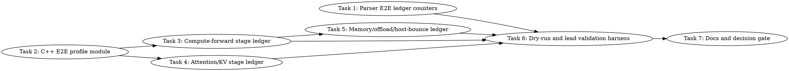

# SYCL GPT-OSS MXFP4 End-to-End Decode Profiling Implementation Plan

> **For Claude:** REQUIRED SUB-SKILL: Use team-driven-development to implement this plan with agent teams.

**Goal:** Add a default-off, correctness-safe end-to-end TG decode stage ledger for GPT-OSS MXFP4 so optimization decisions are based on full pipeline evidence rather than MoE-only timings.

**Architecture:** Introduce a lightweight SYCL E2E profile module that records host submit time, optional event/device time, bytes, call counts, and path labels by decode stage. Wire it into the existing graph/compute, MoE, flash-attention/KV, unified-cache, CPU offload, and host-bounce surfaces without changing allocation ownership or default runtime behavior. Extend the existing parser and harnesses so lead-owned B50/B580/model validation can prove PP preservation, TG bottleneck distribution, out-of-VRAM safety, CPU sharing behavior, and multi-GPU host-bounce behavior before any optimization is promoted.

**Tech Stack:** C++17, SYCL/oneAPI, llama.cpp SYCL backend, Python 3 pytest, bash harnesses, existing codescout task tracker.

---

## Team Topology

**Recommended implementers:** 3 concurrent (based on 3 parallel tracks — execution spawns one ephemeral implementer PER TASK)
**Reviewers:** spec + quality, spawned FRESH per review (not a standing pair; see team-driven-development)

### Parallel Tracks

| Track | Tasks | Description |
|-------|-------|-------------|
| A | 1, 6 | Parser support and dry-run/lead validation harness |
| B | 2 | Reusable C++ E2E profile module and unit test |
| C | 3, 5 | `ggml-sycl.cpp` graph/compute/offload/memory integration |
| D | 4 | Flash-attention, KV, and packed-K profile integration |
| E | 7 | Documentation, evidence table, and follow-up decision gate |

### Dependency Graph



### File Ownership Map

| File/Directory | Tasks | Conflict Risk |
|----------------|-------|---------------|
| `scripts/parse-sycl-moe-profile.py` | 1 | None |
| `tests/test-sycl-moe-profile-parser.py` | 1 | None |
| `ggml/src/ggml-sycl/e2e-profile.hpp` | 2 | None, new file |
| `ggml/src/ggml-sycl/e2e-profile.cpp` | 2 | None, new file |
| `tests/test-sycl-e2e-profile.cpp` | 2 | None, new file |
| `ggml/src/ggml-sycl/CMakeLists.txt:1176-1192` | 2 | None, one CMake insertion |
| `ggml/src/ggml-sycl/ggml-sycl.cpp:70877-71434` | 3 | Sequential with Task 5 because both touch this file |
| `tests/test-sycl-e2e-profile-compute-forward-source.py` | 3 | None, new file |
| `ggml/src/ggml-sycl/fattn.cpp:2028-2098,2382-2400,2797-2870` | 4 | None |
| `tests/test-sycl-e2e-profile-fattn-source.py` | 4 | None, new file |
| `ggml/src/ggml-sycl/ggml-sycl.cpp:15791-15896,70639-71088` | 5 | Sequential after Task 3 |
| `ggml/src/ggml-sycl/unified-cache.cpp:2559-2605,13692-13812` | 5 | None |
| `tests/test-sycl-e2e-profile-memory-source.py` | 5 | None, new file |
| `scripts/sycl-gptoss-e2e-profile-matrix.sh` | 6 | None, new file |
| `docs/backend/SYCL.md` | 7 | None, docs only |
| `docs/plans/2026-06-30-sycl-gptoss-mxfp4-e2e-decode-profiling.md` | 7 | Same plan file, append final evidence section only |

---

## Current Evidence Anchors

Use these exact runtime/code facts while implementing. Do not invent APIs.

- Existing MoE TG profile accumulator and print live in `ggml/src/ggml-sycl/mmvq.cpp:1242-1368`; the current `[MXFP4-MOE-TG-PROFILE]` line already records `pack=`, `gateup_glu=`, `down=`, and `last_path=`.
- `ggml_sycl_compute_forward()` starts at `ggml/src/ggml-sycl/ggml-sycl.cpp:70877`; CPU fallback is checked at `ggml-sycl.cpp:70982`; `GGML_OP_MUL_MAT` is handled at `ggml-sycl.cpp:71310`; `GGML_OP_MUL_MAT_ID` is handled at `ggml-sycl.cpp:71319`; `GGML_OP_FLASH_ATTN_EXT` is handled at `ggml-sycl.cpp:71428`.
- Existing graph diagnostics are emitted by `ggml_sycl_graph_diag_report()` in `ggml/src/ggml-sycl/ggml-sycl.cpp:533-610` and include keys such as `phase=TG`, `use_graph=0`, and `has_exec=0`.
- Existing MoE-profile summary prints `Avg GPU dispatch/token` at `ggml/src/ggml-sycl/ggml-sycl.cpp:13698`, but it is MoE-focused and does not provide a complete decode stage ledger.
- Flash-attention dispatch debug and path selection are in `ggml/src/ggml-sycl/fattn.cpp:2028-2098`; the flash-attention entry point is `ggml_sycl_flash_attn_ext()` at `fattn.cpp:2797`; packed-K sidecar allocation and `mem_handle::from_owned_alloc()` retention are in `fattn.cpp:433-521`.
- `mem_handle` ownership rules are in `ggml/src/ggml-sycl/mem-handle.hpp:31-160`; instrumentation must not use raw pointers as ownership tokens or cache keys.
- KV placement policy and env override are in `ggml/src/ggml-sycl/kv-tier-manager.cpp:191-317`.
- Unified-cache graph guard and host fallback are in `ggml/src/ggml-sycl/unified-cache.cpp:298,2353,2559-2605`; zone allocation accounting is in `unified-cache.cpp:13692-13812`.
- Peer host-bounce measurement is in `ggml/src/ggml-sycl/ggml-sycl.cpp:15791-15896`; direct P2P must remain disabled unless a separate runtime probe proves it safe.

---

## Task 1: Parser E2E TG Stage Ledger Counters

**Track:** A
**Depends on:** None
**File scope:**
- Modify: `scripts/parse-sycl-moe-profile.py:205-260` for regexes and `:384-470` for line parsing
- Modify: `scripts/parse-sycl-moe-profile.py:116-136` for gate detection and `:640-760` for argparse gates
- Modify: `tests/test-sycl-moe-profile-parser.py:1008-1066` by appending new parser tests after the existing MXFP4 pack-profile tests

**Description:**
Teach the existing parser to ingest a new E2E TG ledger format without breaking old MoE-only logs. This task owns parser counters and gates only; it does not touch C++ runtime instrumentation.

**Acceptance Criteria:**

- [ ] Parser extracts `[SYCL-E2E-TG-PROFILE]` summary counters.
- [ ] Parser extracts one or more `[SYCL-E2E-TG-STAGE]` rows with stage, call count, host time, device time, byte count, and optional path.
- [ ] `--require-e2e-profile-evidence` fails closed when no E2E profile line exists.
- [ ] `--require-e2e-stage attention` fails closed when the `attention` stage is missing.
- [ ] Existing parser tests still pass.

**Implementation Guide:**

Follow TDD.

1. **RED: add parser tests.**

Append this exact test code to `tests/test-sycl-moe-profile-parser.py` after `test_parser_extracts_mxfp4_tg_down_pack_profile_counter()`:

```python
def test_parser_extracts_e2e_tg_stage_ledger() -> None:
    with tempfile.TemporaryDirectory() as tmp:
        write_log(
            tmp,
            "[SYCL-E2E-TG-PROFILE] tokens=1 ops=512 moe_calls=72 total_host=18.250 ms total_device=7.125 ms\n"
            "[SYCL-E2E-TG-STAGE] stage=moe calls=72 host=0.900 ms device=6.500 ms bytes=0 last_path=packed-q8-m2\n"
            "[SYCL-E2E-TG-STAGE] stage=attention calls=32 host=0.450 ms device=0.500 ms bytes=1048576 last_path=xmx_v2_f16_pp_ncols32\n"
            "[SYCL-E2E-TG-STAGE] stage=graph calls=1 host=0.125 ms device=0.000 ms bytes=0 last_path=use_graph_0\n",
        )
        out = run_parser(tmp, "--require-e2e-profile-evidence", "--require-e2e-stage", "moe", "--require-e2e-stage", "attention")
        assert "profile.e2e_tg.tokens 1" in out
        assert "profile.e2e_tg.ops 512" in out
        assert "profile.e2e_tg.moe_calls 72" in out
        assert "profile.e2e_tg.host_ms_x1000 18250" in out
        assert "profile.e2e_tg.device_ms_x1000 7125" in out
        assert "profile.e2e_tg.stage.moe.calls 72" in out
        assert "profile.e2e_tg.stage.moe.device_ms_x1000 6500" in out
        assert "profile.e2e_tg.stage.attention.bytes 1048576" in out
        assert "profile.e2e_tg.path.packed-q8-m2 1" in out
        assert "profile.e2e_tg.path.xmx_v2_f16_pp_ncols32 1" in out


def test_parser_require_e2e_profile_evidence_fails_closed() -> None:
    with tempfile.TemporaryDirectory() as tmp:
        write_log(tmp, "[MXFP4-MOE-TG-PROFILE] calls=72 soa=0 coalesced=0 aos=0 dpas=48 i8=6 total=6.000 ms quant=0.100 ms artifact=0.000 ms batch_ids=0.000 ms pack=0.050 ms kernel=5.850 ms gateup_glu=5.400 ms/48 down=0.450 ms/24 last_path=packed-q8-m2\n")
        result = run_parser_result(tmp, "--require-e2e-profile-evidence")
        assert result.returncode == 1
        assert "error: E2E TG profile evidence missing" in result.stdout


def test_parser_require_e2e_stage_fails_closed() -> None:
    with tempfile.TemporaryDirectory() as tmp:
        write_log(
            tmp,
            "[SYCL-E2E-TG-PROFILE] tokens=1 ops=512 moe_calls=72 total_host=18.250 ms total_device=7.125 ms\n"
            "[SYCL-E2E-TG-STAGE] stage=moe calls=72 host=0.900 ms device=6.500 ms bytes=0 last_path=packed-q8-m2\n",
        )
        result = run_parser_result(tmp, "--require-e2e-stage", "attention")
        assert result.returncode == 1
        assert "error: required E2E TG stage missing: attention" in result.stdout
```

Run:

```bash
cd /Apps/llama.cpp-mxfp4-tg-runtime
python3 -m pytest tests/test-sycl-moe-profile-parser.py::test_parser_extracts_e2e_tg_stage_ledger -q
```

Expected RED output:

```text
FAILED tests/test-sycl-moe-profile-parser.py::test_parser_extracts_e2e_tg_stage_ledger
```

The failure must be from missing E2E counters or unknown CLI options, not a syntax error.

2. **GREEN: add regexes and counters.**

In `scripts/parse-sycl-moe-profile.py`, add these regexes immediately after `MXFP4_TG_PROFILE_RE`:

```python
E2E_TG_PROFILE_RE = re.compile(
    r"\[SYCL-E2E-TG-PROFILE\]\s+tokens=(?P<tokens>\d+)\s+ops=(?P<ops>\d+)"
    r"\s+moe_calls=(?P<moe_calls>\d+)\s+total_host=(?P<host>[0-9.]+) ms"
    r"\s+total_device=(?P<device>[0-9.]+) ms"
)
E2E_TG_STAGE_RE = re.compile(
    r"\[SYCL-E2E-TG-STAGE\]\s+stage=(?P<stage>[A-Za-z0-9_+-]+)"
    r"\s+calls=(?P<calls>\d+)\s+host=(?P<host>[0-9.]+) ms"
    r"\s+device=(?P<device>[0-9.]+) ms\s+bytes=(?P<bytes>\d+)"
    r"(?:\s+last_path=(?P<path>[A-Za-z0-9_./+-]+))?"
)
```

In the per-line parser loop, add this exact block after existing MXFP4 profile parsing and before fatal marker parsing:

```python
            e2e_profile = E2E_TG_PROFILE_RE.search(line)
            if e2e_profile:
                counters["profile.e2e_tg.tokens"] += int(e2e_profile.group("tokens"))
                counters["profile.e2e_tg.ops"] += int(e2e_profile.group("ops"))
                counters["profile.e2e_tg.moe_calls"] += int(e2e_profile.group("moe_calls"))
                counters["profile.e2e_tg.host_ms_x1000"] += int(round(float(e2e_profile.group("host")) * 1000.0))
                counters["profile.e2e_tg.device_ms_x1000"] += int(round(float(e2e_profile.group("device")) * 1000.0))

            e2e_stage = E2E_TG_STAGE_RE.search(line)
            if e2e_stage:
                stage = e2e_stage.group("stage")
                counters[f"profile.e2e_tg.stage.{stage}.calls"] += int(e2e_stage.group("calls"))
                counters[f"profile.e2e_tg.stage.{stage}.host_ms_x1000"] += int(round(float(e2e_stage.group("host")) * 1000.0))
                counters[f"profile.e2e_tg.stage.{stage}.device_ms_x1000"] += int(round(float(e2e_stage.group("device")) * 1000.0))
                counters[f"profile.e2e_tg.stage.{stage}.bytes"] += int(e2e_stage.group("bytes"))
                path = e2e_stage.group("path")
                if path:
                    counters[f"profile.e2e_tg.path.{path}"] += 1
```

3. **GREEN: add fail-closed gates.**

Extend `gate_args_requested()` to include:

```python
        or args.require_e2e_profile_evidence
        or args.require_e2e_stage
```

Add argparse options near the existing MXFP4 gates:

```python
    parser.add_argument("--require-e2e-profile-evidence", action="store_true")
    parser.add_argument("--require-e2e-stage", action="append", default=[])
```

Add gate checks near the existing `--require-mxfp4-profile-evidence` check:

```python
    if args.require_e2e_profile_evidence and counters.get("profile.e2e_tg.tokens", 0) <= 0:
        errors.append("E2E TG profile evidence missing")
    for stage in args.require_e2e_stage:
        if counters.get(f"profile.e2e_tg.stage.{stage}.calls", 0) <= 0:
            errors.append(f"required E2E TG stage missing: {stage}")
```

Run:

```bash
cd /Apps/llama.cpp-mxfp4-tg-runtime
python3 -m pytest tests/test-sycl-moe-profile-parser.py -q
```

Expected GREEN output:

```text
90 passed
```

The exact number may be higher if other parser tests have been added by earlier tasks; all tests in the file must pass.

**Commit:**

```bash
git add scripts/parse-sycl-moe-profile.py tests/test-sycl-moe-profile-parser.py
git commit -m "test(sycl): parse end-to-end TG profile ledger"
```

**Gotchas:**

- Keep the parser backward-compatible with logs that only contain `[MXFP4-MOE-TG-PROFILE]`; old logs must not require E2E counters unless `--require-e2e-profile-evidence` is passed.
- Use integer `ms_x1000` counters, matching existing parser style around `profile.mxfp4_tg.pack_ms_x1000` in `tests/test-sycl-moe-profile-parser.py:1008-1035`.
- Do not add semantic interpretation in the parser. It should count evidence and fail closed on missing required rows only.

---

## Task 2: Reusable C++ E2E TG Profile Module

**Track:** B
**Depends on:** None
**File scope:**
- Create: `ggml/src/ggml-sycl/e2e-profile.hpp`
- Create: `ggml/src/ggml-sycl/e2e-profile.cpp`
- Create: `tests/test-sycl-e2e-profile.cpp`
- Modify: `ggml/src/ggml-sycl/CMakeLists.txt:1176-1192` to add `test-sycl-e2e-profile` to the existing `RESIDENCY_TEST_SYCL_OPTIONS` test list

**Description:**
Add a small C++ profiling utility that is default-off, CPU-only until called by runtime code, and safe for unit tests without opening a SYCL device. It records aggregate decode stage counters and prints the exact line formats parsed by Task 1.

**Acceptance Criteria:**

- [ ] `GGML_SYCL_E2E_TG_PROFILE` is default-off and enabled only by a nonzero env string.
- [ ] Stage names are stable and include `dispatch`, `cpu_dispatch`, `non_moe_matmul`, `moe`, `attention`, `kv`, `elementwise`, `graph`, `cache`, `transfer`, and `other`.
- [ ] `GGML_OP_MUL_MAT_ID` classifies as `moe`, `GGML_OP_FLASH_ATTN_EXT` classifies as `attention`, KV-named `GGML_OP_SET_ROWS` classifies as `kv`, and `GGML_OP_MUL_MAT` classifies as `non_moe_matmul`.
- [ ] Unit test does not construct a `sycl::device`, does not touch `/Storage/GenAI/models`, and does not require `ONEAPI_DEVICE_SELECTOR`.

**Implementation Guide:**

1. **RED: add the unit test first.**

Create `tests/test-sycl-e2e-profile.cpp`:

```cpp
#include "e2e-profile.hpp"
#include "ggml.h"

#include <cassert>
#include <cstdio>
#include <cstdlib>
#include <cstring>

int main() {
    using namespace ggml_sycl;

    assert(!e2e_tg_profile_enabled_from_env(nullptr));
    assert(!e2e_tg_profile_enabled_from_env(""));
    assert(!e2e_tg_profile_enabled_from_env("0"));
    assert(e2e_tg_profile_enabled_from_env("1"));

    assert(std::strcmp(e2e_tg_stage_name(e2e_tg_stage::MOE), "moe") == 0);
    assert(std::strcmp(e2e_tg_stage_name(e2e_tg_stage::ATTENTION), "attention") == 0);
    assert(std::strcmp(e2e_tg_stage_name(e2e_tg_stage::NON_MOE_MATMUL), "non_moe_matmul") == 0);

    assert(e2e_tg_stage_from_op(GGML_OP_MUL_MAT_ID, "blk.0.ffn_gate_exps.weight") == e2e_tg_stage::MOE);
    assert(e2e_tg_stage_from_op(GGML_OP_FLASH_ATTN_EXT, "blk.0.attn") == e2e_tg_stage::ATTENTION);
    assert(e2e_tg_stage_from_op(GGML_OP_SET_ROWS, "cache_k_l0") == e2e_tg_stage::KV);
    assert(e2e_tg_stage_from_op(GGML_OP_MUL_MAT, "blk.0.attn_q.weight") == e2e_tg_stage::NON_MOE_MATMUL);
    assert(e2e_tg_stage_from_op(GGML_OP_ADD, "blk.0.ffn_down") == e2e_tg_stage::ELEMENTWISE);

    e2e_tg_profile_reset_for_tests();
    e2e_tg_profile_record(e2e_tg_stage::MOE, "packed-q8-m2", 10.0, 20.0, 64, 2);
    e2e_tg_profile_record(e2e_tg_stage::ATTENTION, "xmx_v2_f16_pp_ncols32", 3.0, 4.0, 128, 1);
    const e2e_tg_profile_snapshot snap = e2e_tg_profile_snapshot_for_tests();
    assert(snap.tokens == 0);
    assert(snap.ops == 3);
    assert(snap.moe_calls == 2);
    assert(snap.stages[static_cast<size_t>(e2e_tg_stage::MOE)].calls == 2);
    assert(snap.stages[static_cast<size_t>(e2e_tg_stage::MOE)].bytes == 64);
    assert(snap.stages[static_cast<size_t>(e2e_tg_stage::ATTENTION)].host_us == 3.0);

    e2e_tg_profile_flush_for_tests(stderr);
    e2e_tg_profile_reset_for_tests();
    return 0;
}
```

Add `test-sycl-e2e-profile` to the `foreach(_residency_test` list in `ggml/src/ggml-sycl/CMakeLists.txt:1176-1192`.

Run:

```bash
cd /Apps/llama.cpp-mxfp4-tg-runtime
set +u; source /opt/intel/oneapi/setvars.sh --force >/tmp/e2e_profile_setvars.log 2>&1; set -u
./scripts/sycl-build.sh test-sycl-e2e-profile
```

Expected RED output:

```text
fatal error: 'e2e-profile.hpp' file not found
```

2. **GREEN: create `e2e-profile.hpp`.**

Create `ggml/src/ggml-sycl/e2e-profile.hpp` with this content:

```cpp
#pragma once

#include "ggml.h"

#include <array>
#include <chrono>
#include <cstdint>
#include <cstdio>

namespace ggml_sycl {

enum class e2e_tg_stage : uint8_t {
    DISPATCH = 0,
    CPU_DISPATCH,
    NON_MOE_MATMUL,
    MOE,
    ATTENTION,
    KV,
    ELEMENTWISE,
    GRAPH,
    CACHE,
    TRANSFER,
    OTHER,
    COUNT,
};

struct e2e_tg_stage_accum {
    uint64_t    calls     = 0;
    double      host_us   = 0.0;
    double      device_us = 0.0;
    uint64_t    bytes     = 0;
    const char * last_path = "unknown";
};

struct e2e_tg_profile_snapshot {
    uint64_t tokens    = 0;
    uint64_t ops       = 0;
    uint64_t moe_calls = 0;
    std::array<e2e_tg_stage_accum, static_cast<size_t>(e2e_tg_stage::COUNT)> stages{};
};

bool e2e_tg_profile_enabled_from_env(const char * env);
bool e2e_tg_profile_enabled();
const char * e2e_tg_stage_name(e2e_tg_stage stage);
e2e_tg_stage e2e_tg_stage_from_op(ggml_op op, const char * tensor_name);
void e2e_tg_profile_record(e2e_tg_stage stage,
                           const char * path,
                           double       host_us,
                           double       device_us = 0.0,
                           uint64_t     bytes     = 0,
                           uint64_t     calls     = 1);
void e2e_tg_profile_record_cache_event(const char * path, uint64_t bytes, double host_us);
void e2e_tg_profile_record_transfer(const char * path, uint64_t bytes, double host_us, double device_us);
void e2e_tg_profile_flush_if_ready(FILE * out = stderr);
void e2e_tg_profile_force_flush(FILE * out = stderr);
void e2e_tg_profile_reset_for_tests();
e2e_tg_profile_snapshot e2e_tg_profile_snapshot_for_tests();
void e2e_tg_profile_flush_for_tests(FILE * out);

class e2e_tg_scope {
  public:
    e2e_tg_scope(e2e_tg_stage stage, const char * path, bool enabled = e2e_tg_profile_enabled()) :
        enabled_(enabled), stage_(stage), path_(path ? path : "unknown"), start_(clock::now()) {}

    ~e2e_tg_scope() {
        if (!enabled_) {
            return;
        }
        const auto end = clock::now();
        const double host_us = std::chrono::duration<double, std::micro>(end - start_).count();
        e2e_tg_profile_record(stage_, path_, host_us, 0.0, 0, 1);
    }

    e2e_tg_scope(const e2e_tg_scope &)            = delete;
    e2e_tg_scope & operator=(const e2e_tg_scope &) = delete;

  private:
    using clock = std::chrono::high_resolution_clock;

    bool              enabled_ = false;
    e2e_tg_stage      stage_   = e2e_tg_stage::OTHER;
    const char *      path_    = "unknown";
    clock::time_point start_{};
};

}  // namespace ggml_sycl
```

3. **GREEN: create `e2e-profile.cpp`.**

Create `ggml/src/ggml-sycl/e2e-profile.cpp` with this content:

```cpp
#include "e2e-profile.hpp"

#include <algorithm>
#include <atomic>
#include <cstdlib>
#include <cstring>

namespace ggml_sycl {
namespace {

thread_local e2e_tg_profile_snapshot g_e2e_tg_profile;

bool tensor_name_contains(const char * name, const char * needle) {
    return name && needle && std::strstr(name, needle) != nullptr;
}

bool tensor_name_is_kv(const char * name) {
    return tensor_name_contains(name, "cache_k") || tensor_name_contains(name, "cache_v") ||
           tensor_name_contains(name, "kv") || tensor_name_contains(name, "KQ_mask");
}

}  // namespace

bool e2e_tg_profile_enabled_from_env(const char * env) {
    return env != nullptr && env[0] != '\0' && std::atoi(env) != 0;
}

bool e2e_tg_profile_enabled() {
    static const bool enabled = e2e_tg_profile_enabled_from_env(std::getenv("GGML_SYCL_E2E_TG_PROFILE"));
    return enabled;
}

const char * e2e_tg_stage_name(e2e_tg_stage stage) {
    switch (stage) {
        case e2e_tg_stage::DISPATCH:        return "dispatch";
        case e2e_tg_stage::CPU_DISPATCH:    return "cpu_dispatch";
        case e2e_tg_stage::NON_MOE_MATMUL:  return "non_moe_matmul";
        case e2e_tg_stage::MOE:             return "moe";
        case e2e_tg_stage::ATTENTION:       return "attention";
        case e2e_tg_stage::KV:              return "kv";
        case e2e_tg_stage::ELEMENTWISE:     return "elementwise";
        case e2e_tg_stage::GRAPH:           return "graph";
        case e2e_tg_stage::CACHE:           return "cache";
        case e2e_tg_stage::TRANSFER:        return "transfer";
        case e2e_tg_stage::OTHER:           return "other";
        case e2e_tg_stage::COUNT:           return "count";
    }
    return "unknown";
}

e2e_tg_stage e2e_tg_stage_from_op(ggml_op op, const char * tensor_name) {
    if (tensor_name_is_kv(tensor_name)) {
        return e2e_tg_stage::KV;
    }
    switch (op) {
        case GGML_OP_MUL_MAT_ID:
            return e2e_tg_stage::MOE;
        case GGML_OP_FLASH_ATTN_EXT:
            return e2e_tg_stage::ATTENTION;
        case GGML_OP_MUL_MAT:
            return e2e_tg_stage::NON_MOE_MATMUL;
        case GGML_OP_SET_ROWS:
        case GGML_OP_SET_ROWS_PAGED:
            return e2e_tg_stage::KV;
        case GGML_OP_ADD:
        case GGML_OP_ADD1:
        case GGML_OP_ADD_ID:
        case GGML_OP_GLU:
        case GGML_OP_NORM:
        case GGML_OP_RMS_NORM:
        case GGML_OP_ROPE:
        case GGML_OP_SCALE:
        case GGML_OP_SILU:
        case GGML_OP_SOFT_MAX:
        case GGML_OP_ARGSORT:
        case GGML_OP_TOP_K:
            return e2e_tg_stage::ELEMENTWISE;
        default:
            return e2e_tg_stage::OTHER;
    }
}

void e2e_tg_profile_record(e2e_tg_stage stage,
                           const char * path,
                           double       host_us,
                           double       device_us,
                           uint64_t     bytes,
                           uint64_t     calls) {
    if (stage == e2e_tg_stage::COUNT) {
        stage = e2e_tg_stage::OTHER;
    }
    auto & slot = g_e2e_tg_profile.stages[static_cast<size_t>(stage)];
    slot.calls += calls;
    slot.host_us += std::max(0.0, host_us);
    slot.device_us += std::max(0.0, device_us);
    slot.bytes += bytes;
    if (path && path[0] != '\0') {
        slot.last_path = path;
    }
    g_e2e_tg_profile.ops += calls;
    if (stage == e2e_tg_stage::MOE) {
        g_e2e_tg_profile.moe_calls += calls;
    }
}

void e2e_tg_profile_record_cache_event(const char * path, uint64_t bytes, double host_us) {
    e2e_tg_profile_record(e2e_tg_stage::CACHE, path, host_us, 0.0, bytes, 1);
}

void e2e_tg_profile_record_transfer(const char * path, uint64_t bytes, double host_us, double device_us) {
    e2e_tg_profile_record(e2e_tg_stage::TRANSFER, path, host_us, device_us, bytes, 1);
}

void e2e_tg_profile_force_flush(FILE * out) {
    if (!out) {
        out = stderr;
    }
    double total_host_us   = 0.0;
    double total_device_us = 0.0;
    for (const auto & stage : g_e2e_tg_profile.stages) {
        total_host_us += stage.host_us;
        total_device_us += stage.device_us;
    }
    if (g_e2e_tg_profile.ops == 0) {
        return;
    }
    g_e2e_tg_profile.tokens += 1;
    std::fprintf(out,
                 "[SYCL-E2E-TG-PROFILE] tokens=%llu ops=%llu moe_calls=%llu total_host=%.3f ms total_device=%.3f ms\n",
                 (unsigned long long) g_e2e_tg_profile.tokens,
                 (unsigned long long) g_e2e_tg_profile.ops,
                 (unsigned long long) g_e2e_tg_profile.moe_calls,
                 total_host_us / 1000.0,
                 total_device_us / 1000.0);
    for (size_t i = 0; i < static_cast<size_t>(e2e_tg_stage::COUNT); ++i) {
        const auto & stage = g_e2e_tg_profile.stages[i];
        if (stage.calls == 0) {
            continue;
        }
        std::fprintf(out,
                     "[SYCL-E2E-TG-STAGE] stage=%s calls=%llu host=%.3f ms device=%.3f ms bytes=%llu last_path=%s\n",
                     e2e_tg_stage_name(static_cast<e2e_tg_stage>(i)),
                     (unsigned long long) stage.calls,
                     stage.host_us / 1000.0,
                     stage.device_us / 1000.0,
                     (unsigned long long) stage.bytes,
                     stage.last_path ? stage.last_path : "unknown");
    }
    g_e2e_tg_profile = {};
}

void e2e_tg_profile_flush_if_ready(FILE * out) {
    if (g_e2e_tg_profile.moe_calls >= 72) {
        e2e_tg_profile_force_flush(out);
    }
}

void e2e_tg_profile_reset_for_tests() {
    g_e2e_tg_profile = {};
}

e2e_tg_profile_snapshot e2e_tg_profile_snapshot_for_tests() {
    return g_e2e_tg_profile;
}

void e2e_tg_profile_flush_for_tests(FILE * out) {
    e2e_tg_profile_force_flush(out);
}

}  // namespace ggml_sycl
```

Run:

```bash
cd /Apps/llama.cpp-mxfp4-tg-runtime
set +u; source /opt/intel/oneapi/setvars.sh --force >/tmp/e2e_profile_setvars.log 2>&1; set -u
./scripts/sycl-build.sh test-sycl-e2e-profile
ctest --test-dir build -R test-sycl-e2e-profile -V
```

Expected GREEN output:

```text
100% tests passed
```

**Commit:**

```bash
git add ggml/src/ggml-sycl/e2e-profile.hpp ggml/src/ggml-sycl/e2e-profile.cpp tests/test-sycl-e2e-profile.cpp ggml/src/ggml-sycl/CMakeLists.txt
git commit -m "test(sycl): add end-to-end TG profile ledger core"
```

**Gotchas:**

- Do not include `<sycl/sycl.hpp>` in the new profile module. The module must not create a SYCL device or queue.
- Do not store or hash raw pointers in profile state. Use path labels only, because `mem_handle` remains the ownership token.
- `GGML_OP_SILU` may not exist in some upstream versions because SILU is represented through unary op. If the compiler rejects that case label, remove only the `GGML_OP_SILU` case and keep all other cases.
- The CMake list at `ggml/src/ggml-sycl/CMakeLists.txt:1176-1192` is shared by many SYCL policy tests. Add one item only; do not reorder existing tests.

---

## Task 3: Compute-Forward and Graph Stage Ledger Integration

**Track:** C
**Depends on:** Task 2
**File scope:**
- Modify: `ggml/src/ggml-sycl/ggml-sycl.cpp:1-80` to include `e2e-profile.hpp`
- Modify: `ggml/src/ggml-sycl/ggml-sycl.cpp:533-610` to emit graph stage evidence beside `[GRAPH-DIAG]`
- Modify: `ggml/src/ggml-sycl/ggml-sycl.cpp:70877-71490` to record per-op stage scopes, CPU dispatch, and flush at token cadence
- Create: `tests/test-sycl-e2e-profile-compute-forward-source.py`

**Description:**
Wire the new profile module into the central decode control plane without changing dispatch behavior. This captures host-side cost distribution for non-MoE matmul, MoE, attention calls routed through compute-forward, KV/elementwise ops, CPU dispatch, and graph diagnostics.

**Acceptance Criteria:**

- [ ] `ggml-sycl.cpp` includes `e2e-profile.hpp`.
- [ ] `ggml_sycl_compute_forward()` creates an `e2e_tg_scope` after `safe_dst` construction and before the switch statement.
- [ ] CPU fallback branch records `cpu_dispatch` when `ggml_sycl_compute_forward_cpu()` succeeds.
- [ ] After every handled op, `e2e_tg_profile_flush_if_ready(stderr)` is called under the default-off env gate.
- [ ] Graph diagnostics also record a `graph` stage path label of `use_graph_0` or `use_graph_1`.
- [ ] Python source test passes without GPU/model execution.

**Implementation Guide:**

1. **RED: add source test.**

Create `tests/test-sycl-e2e-profile-compute-forward-source.py`:

```python
from pathlib import Path

ROOT = Path(__file__).resolve().parents[1]
GGML_SYCL = ROOT / "ggml/src/ggml-sycl/ggml-sycl.cpp"


def read_source() -> str:
    return GGML_SYCL.read_text(encoding="utf-8")


def test_compute_forward_has_e2e_profile_scope_and_flush() -> None:
    src = read_source()
    assert '#include "e2e-profile.hpp"' in src
    begin = src.index("static bool ggml_sycl_compute_forward")
    end = src.index("// WEDGE-T4: GGML_SYCL_SAFE_MODE", begin)
    body = src[begin:end]
    assert "ggml_sycl::e2e_tg_scope e2e_scope" in body
    assert "ggml_sycl::e2e_tg_stage_from_op(dst->op, dst->name" in body
    assert "ggml_sycl::e2e_tg_profile_flush_if_ready(stderr);" in body


def test_compute_forward_records_cpu_dispatch_success() -> None:
    src = read_source()
    begin = src.index("if (!ggml_sycl_graph_dispatch_recording_active(&ctx) && should_dispatch_to_cpu")
    end = src.index("if (dst->src[0] != nullptr", begin)
    branch = src[begin:end]
    assert "ggml_sycl_compute_forward_cpu(ctx, dst)" in branch
    assert "ggml_sycl::e2e_tg_profile_record(ggml_sycl::e2e_tg_stage::CPU_DISPATCH" in branch


def test_graph_diag_records_e2e_graph_stage() -> None:
    src = read_source()
    begin = src.index("static void ggml_sycl_graph_diag_report")
    end = src.index("static void ggml_sycl_graph_diag_note_host_tensor", begin)
    body = src[begin:end]
    assert "ggml_sycl::e2e_tg_profile_record(ggml_sycl::e2e_tg_stage::GRAPH" in body
    assert "use_graph ? \"use_graph_1\" : \"use_graph_0\"" in body
```

Run:

```bash
cd /Apps/llama.cpp-mxfp4-tg-runtime
python3 -m pytest tests/test-sycl-e2e-profile-compute-forward-source.py -q
```

Expected RED output:

```text
FAILED tests/test-sycl-e2e-profile-compute-forward-source.py::test_compute_forward_has_e2e_profile_scope_and_flush
```

2. **GREEN: include the module.**

Add near the other local includes at the top of `ggml/src/ggml-sycl/ggml-sycl.cpp`:

```cpp
#include "e2e-profile.hpp"
```

3. **GREEN: record graph stage evidence.**

Inside `ggml_sycl_graph_diag_report()` after the existing `[GRAPH-DIAG]` `fprintf` call, add:

```cpp
    if (ggml_sycl::e2e_tg_profile_enabled()) {
        ggml_sycl::e2e_tg_profile_record(ggml_sycl::e2e_tg_stage::GRAPH,
                                         use_graph ? "use_graph_1" : "use_graph_0",
                                         0.0,
                                         0.0,
                                         0,
                                         1);
    }
```

4. **GREEN: record CPU dispatch success.**

In the CPU fallback branch at `ggml-sycl.cpp:70982`, replace:

```cpp
        if (ggml_sycl_compute_forward_cpu(ctx, dst)) {
            return true;
        }
```

with:

```cpp
        if (ggml_sycl_compute_forward_cpu(ctx, dst)) {
            if (ggml_sycl::e2e_tg_profile_enabled()) {
                ggml_sycl::e2e_tg_profile_record(ggml_sycl::e2e_tg_stage::CPU_DISPATCH,
                                                 ggml_op_name(dst->op),
                                                 0.0,
                                                 0.0,
                                                 0,
                                                 1);
                ggml_sycl::e2e_tg_profile_flush_if_ready(stderr);
            }
            return true;
        }
```

5. **GREEN: record the switch dispatch scope.**

Immediately after `ggml_sycl::sycl_tensor safe_dst(dst, ctx.device);` at `ggml-sycl.cpp:71075`, add:

```cpp
    ggml_sycl::e2e_tg_scope e2e_scope(
        ggml_sycl::e2e_tg_stage_from_op(dst->op, dst->name),
        ggml_op_name(dst->op),
        ggml_sycl::e2e_tg_profile_enabled());
```

Immediately after `dump_non_fa_attention_tensor(ctx, dst);`, add:

```cpp
    if (ggml_sycl::e2e_tg_profile_enabled()) {
        ggml_sycl::e2e_tg_profile_flush_if_ready(stderr);
    }
```

Run:

```bash
cd /Apps/llama.cpp-mxfp4-tg-runtime
python3 -m pytest tests/test-sycl-e2e-profile-compute-forward-source.py -q
set +u; source /opt/intel/oneapi/setvars.sh --force >/tmp/e2e_profile_setvars.log 2>&1; set -u
./scripts/sycl-build.sh test-sycl-e2e-profile
```

Expected GREEN output:

```text
3 passed
```

and the build exits with code 0.

**Commit:**

```bash
git add ggml/src/ggml-sycl/ggml-sycl.cpp tests/test-sycl-e2e-profile-compute-forward-source.py
git commit -m "feat(sycl): record end-to-end TG compute stage ledger"
```

**Gotchas:**

- `e2e_tg_scope` measures host-side dispatch duration only. Do not add `queue.wait()` or event waits in this task.
- Keep the profile default-off. Every runtime record call that is not inside `e2e_tg_scope` must be guarded by `e2e_tg_profile_enabled()`.
- Do not wrap code paths that return before `safe_dst` construction with a scope that touches `dst->src` fields.
- `ggml_sycl_compute_forward()` is a shared hotspot. Make only the listed edits.

---

## Task 4: Flash-Attention, KV, and Packed-K Stage Ledger Integration

**Track:** D
**Depends on:** Task 2
**File scope:**
- Modify: `ggml/src/ggml-sycl/fattn.cpp:1-60` to include `e2e-profile.hpp`
- Modify: `ggml/src/ggml-sycl/fattn.cpp:2028-2098` to record selected attention path labels
- Modify: `ggml/src/ggml-sycl/fattn.cpp:433-521` to record packed-K sidecar allocation/update bytes without taking ownership from `mem_handle`
- Modify: `ggml/src/ggml-sycl/fattn.cpp:2797-2870` to add an attention scope around `ggml_sycl_flash_attn_ext()`
- Create: `tests/test-sycl-e2e-profile-fattn-source.py`

**Description:**
Add attention/KV-specific ledger rows so the full TG profile can separate flash-attention dispatch, packed-K materialization, and KV-related bytes from MoE timing. The instrumentation must preserve the existing packed-K `mem_handle` ownership and ready-event semantics.

**Acceptance Criteria:**

- [ ] `fattn.cpp` includes `e2e-profile.hpp`.
- [ ] `ggml_sycl_flash_attn_ext()` has an `e2e_tg_scope` with stage `attention`.
- [ ] Dispatch selection records path labels such as `xmx_v2_f16_pp_ncols32` through an `e2e_tg_profile_record` call using stage `ATTENTION` under the env gate.
- [ ] Packed-K sidecar records `kv` bytes and path `packed_k_sidecar` after allocation/update decisions, without replacing `packed.handle` or waiting on `packed.ready_event`.
- [ ] Python source test passes without GPU/model execution.

**Implementation Guide:**

1. **RED: add source test.**

Create `tests/test-sycl-e2e-profile-fattn-source.py`:

```python
from pathlib import Path

ROOT = Path(__file__).resolve().parents[1]
FATTN = ROOT / "ggml/src/ggml-sycl/fattn.cpp"


def read_source() -> str:
    return FATTN.read_text(encoding="utf-8")


def test_fattn_has_e2e_attention_scope() -> None:
    src = read_source()
    assert '#include "e2e-profile.hpp"' in src
    begin = src.index("void ggml_sycl_flash_attn_ext")
    end = src.index("const ggml_tensor * mask", begin)
    body = src[begin:end]
    assert "ggml_sycl::e2e_tg_scope e2e_scope" in body
    assert "ggml_sycl::e2e_tg_stage::ATTENTION" in body


def test_fattn_dispatch_records_selected_path() -> None:
    src = read_source()
    begin = src.index("auto dispatch_debug_kernel = [&](const char * kernel)")
    end = src.index("if (dispatch_debug_enabled)", begin)
    body = src[begin:end]
    assert "ggml_sycl::e2e_tg_profile_record(ggml_sycl::e2e_tg_stage::ATTENTION" in body
    assert "kernel" in body


def test_packed_k_sidecar_records_kv_bytes_without_ownership_change() -> None:
    src = read_source()
    begin = src.index("ggml_sycl_fattn_xmx_packed_k_sidecar_entry * entry = nullptr")
    end = src.index("return &packed;", begin)
    body = src[begin:end]
    assert "packed.handle = ggml_sycl::mem_handle::from_owned_alloc" in body
    assert "ggml_sycl::e2e_tg_profile_record(ggml_sycl::e2e_tg_stage::KV" in body
    assert "packed_k_sidecar" in body
    assert "packed.ready_event.wait()" not in body
```

Run:

```bash
cd /Apps/llama.cpp-mxfp4-tg-runtime
python3 -m pytest tests/test-sycl-e2e-profile-fattn-source.py -q
```

Expected RED output:

```text
FAILED tests/test-sycl-e2e-profile-fattn-source.py::test_fattn_has_e2e_attention_scope
```

2. **GREEN: include and scope attention.**

Add to the top include block of `ggml/src/ggml-sycl/fattn.cpp`:

```cpp
#include "e2e-profile.hpp"
```

At the start of `ggml_sycl_flash_attn_ext()` immediately after `GGML_SYCL_PROFILE_SCOPE_FA("flash_attn");`, add:

```cpp
    ggml_sycl::e2e_tg_scope e2e_scope(ggml_sycl::e2e_tg_stage::ATTENTION,
                                      "flash_attn_ext",
                                      ggml_sycl::e2e_tg_profile_enabled());
```

3. **GREEN: record selected attention path.**

Inside the `dispatch_debug_kernel` lambda at `fattn.cpp:2096`, after the existing debug `fprintf`, add:

```cpp
        if (ggml_sycl::e2e_tg_profile_enabled()) {
            ggml_sycl::e2e_tg_profile_record(ggml_sycl::e2e_tg_stage::ATTENTION, kernel, 0.0, 0.0, 0, 1);
        }
```

Place the record call outside the `if (dispatch_debug_enabled)` body if the path must be captured when `GGML_SYCL_E2E_TG_PROFILE=1` but `GGML_SYCL_FA_DISPATCH_DEBUG` is absent. The final lambda must record under either condition:

```cpp
    auto dispatch_debug_kernel = [&](const char * kernel) {
        if (dispatch_debug_enabled) {
            fprintf(stderr, "[SYCL] fattn selected [%d/%d] %s D=%d ne01=%d safe_decode=%d fast_esimd_safe=%d\n",
                    dispatch_debug_counter, debug_limit, kernel, D, ne01, (int) safe_decode,
                    (int) fast_decode_policy.fast_esimd_safe);
        }
        if (ggml_sycl::e2e_tg_profile_enabled()) {
            ggml_sycl::e2e_tg_profile_record(ggml_sycl::e2e_tg_stage::ATTENTION, kernel, 0.0, 0.0, 0, 1);
        }
    };
```

4. **GREEN: record packed-K sidecar bytes.**

In the packed-K sidecar block at `fattn.cpp:433-521`, after `packed.ready_event = update_event;`, add:

```cpp
            if (ggml_sycl::e2e_tg_profile_enabled()) {
                ggml_sycl::e2e_tg_profile_record(ggml_sycl::e2e_tg_stage::KV,
                                                 "packed_k_sidecar",
                                                 0.0,
                                                 0.0,
                                                 packed.bytes,
                                                 1);
            }
```

Run:

```bash
cd /Apps/llama.cpp-mxfp4-tg-runtime
python3 -m pytest tests/test-sycl-e2e-profile-fattn-source.py -q
set +u; source /opt/intel/oneapi/setvars.sh --force >/tmp/e2e_profile_setvars.log 2>&1; set -u
./scripts/sycl-build.sh test-sycl-e2e-profile
```

Expected GREEN output:

```text
3 passed
```

and the build exits with code 0.

**Commit:**

```bash
git add ggml/src/ggml-sycl/fattn.cpp tests/test-sycl-e2e-profile-fattn-source.py
git commit -m "feat(sycl): record attention and KV decode profile stages"
```

**Gotchas:**

- Do not add `packed.ready_event.wait()` or any queue wait. The existing ready-event semantics in `fattn.cpp:496-521` must remain unchanged.
- Do not replace `packed.handle`; the sidecar owner remains `mem_handle::from_owned_alloc()` at `fattn.cpp:487`.
- `dispatch_debug_kernel` is called for selected and rejected paths. Record the actual string passed to the lambda; do not synthesize a second path name.

---

## Task 5: Unified-Cache, CPU-Offload, and Host-Bounce Stage Evidence

**Track:** C
**Depends on:** Task 3
**File scope:**
- Modify: `ggml/src/ggml-sycl/ggml-sycl.cpp:15791-15896` for peer host-bounce profile records
- Modify: `ggml/src/ggml-sycl/ggml-sycl.cpp:70639-71088` for CPU fallback/offload record labels
- Modify: `ggml/src/ggml-sycl/unified-cache.cpp:1-80` to include `e2e-profile.hpp`
- Modify: `ggml/src/ggml-sycl/unified-cache.cpp:2559-2605` to record host fallback bytes
- Modify: `ggml/src/ggml-sycl/unified-cache.cpp:13692-13812` to record zone allocation failures as cache events only under the profile env
- Create: `tests/test-sycl-e2e-profile-memory-source.py`

**Description:**
Add profile evidence for the support cases the final proof must preserve: out-of-VRAM host fallback, CPU dispatch sharing, and non-P2P multi-GPU host-bounce. This task records aggregate counters and bytes only; it must not change allocation policy, eviction policy, peer-copy policy, or CPU fallback behavior.

**Acceptance Criteria:**

- [ ] Host fallback in unified-cache records `stage=cache path=host_fallback` with bytes.
- [ ] Zone allocation failure records `stage=cache path=zone_alloc_failed` under the env gate.
- [ ] Peer host-bounce measurement records `stage=transfer path=peer_host_bounce_measure` with bytes and measured microseconds.
- [ ] CPU fallback success from Task 3 records path `cpu_dispatch` or the op name, and this task adds no GPU wait.
- [ ] Python source test passes without GPU/model execution.

**Implementation Guide:**

1. **RED: add source test.**

Create `tests/test-sycl-e2e-profile-memory-source.py`:

```python
from pathlib import Path

ROOT = Path(__file__).resolve().parents[1]
GGML_SYCL = ROOT / "ggml/src/ggml-sycl/ggml-sycl.cpp"
UNIFIED_CACHE = ROOT / "ggml/src/ggml-sycl/unified-cache.cpp"


def test_unified_cache_records_host_fallback_and_zone_failures() -> None:
    src = UNIFIED_CACHE.read_text(encoding="utf-8")
    assert '#include "e2e-profile.hpp"' in src
    host_fallback_begin = src.index("// All entries pinned, cannot evict - try host fallback")
    host_fallback_end = src.index("// Allocate device memory", host_fallback_begin)
    host_fallback = src[host_fallback_begin:host_fallback_end]
    assert "e2e_tg_profile_record_cache_event(\"host_fallback\"" in host_fallback
    zone_begin = src.index("void * unified_cache::zone_alloc")
    zone_end = src.index("void unified_cache::zone_free", zone_begin)
    zone_body = src[zone_begin:zone_end]
    assert "e2e_tg_profile_record_cache_event(\"zone_alloc_failed\"" in zone_body


def test_peer_host_bounce_measure_records_transfer_stage() -> None:
    src = GGML_SYCL.read_text(encoding="utf-8")
    begin = src.index("static void ggml_sycl_measure_peer_host_bounce")
    end = src.index("static void ggml_sycl_init", begin)
    body = src[begin:end]
    assert "e2e_tg_profile_record_transfer(\"peer_host_bounce_measure\"" in body
    assert "link.host_bounce_d2h_us" in body
    assert "link.host_bounce_h2d_us" in body
```

Run:

```bash
cd /Apps/llama.cpp-mxfp4-tg-runtime
python3 -m pytest tests/test-sycl-e2e-profile-memory-source.py -q
```

Expected RED output:

```text
FAILED tests/test-sycl-e2e-profile-memory-source.py::test_unified_cache_records_host_fallback_and_zone_failures
```

2. **GREEN: include profile module in `unified-cache.cpp`.**

Add near the local includes at the top of `ggml/src/ggml-sycl/unified-cache.cpp`:

```cpp
#include "e2e-profile.hpp"
```

3. **GREEN: record host fallback bytes.**

In `unified-cache.cpp:2559-2605`, immediately before each host fallback return that creates a host allocation for a cache entry, add:

```cpp
            if (ggml_sycl::e2e_tg_profile_enabled()) {
                ggml_sycl::e2e_tg_profile_record_cache_event("host_fallback", size, 0.0);
            }
```

If the local byte variable is named `entry_size` in a specific branch, use `entry_size` for that branch. Do not introduce a new allocation or copy.

4. **GREEN: record zone allocation failures.**

In `unified_cache::zone_alloc()` at `unified-cache.cpp:13692-13812`, in each branch that increments `zone_alloc_failures`, add:

```cpp
        if (ggml_sycl::e2e_tg_profile_enabled()) {
            ggml_sycl::e2e_tg_profile_record_cache_event("zone_alloc_failed", size, 0.0);
        }
```

Use the existing `size` variable. Do not record successful allocations in this task; successful allocation volume is already tracked by existing arena stats.

5. **GREEN: record peer host-bounce measurement.**

In `ggml_sycl_measure_peer_host_bounce()` at `ggml-sycl.cpp:15791-15896`, after `link.host_bounce_us` is computed, add:

```cpp
                if (ggml_sycl::e2e_tg_profile_enabled()) {
                    ggml_sycl::e2e_tg_profile_record_transfer("peer_host_bounce_measure",
                                                              bytes,
                                                              0.0,
                                                              link.host_bounce_us);
                }
```

Run:

```bash
cd /Apps/llama.cpp-mxfp4-tg-runtime
python3 -m pytest tests/test-sycl-e2e-profile-memory-source.py -q
set +u; source /opt/intel/oneapi/setvars.sh --force >/tmp/e2e_profile_setvars.log 2>&1; set -u
./scripts/sycl-build.sh test-sycl-e2e-profile
```

Expected GREEN output:

```text
2 passed
```

and the build exits with code 0.

**Commit:**

```bash
git add ggml/src/ggml-sycl/ggml-sycl.cpp ggml/src/ggml-sycl/unified-cache.cpp tests/test-sycl-e2e-profile-memory-source.py
git commit -m "feat(sycl): record cache and transfer evidence in TG ledger"
```

**Gotchas:**

- Do not alter eviction decisions. A host fallback must remain a host fallback.
- Do not enable direct P2P. The host-bounce record is evidence only.
- Do not record raw pointer addresses. Bytes and path labels are enough.
- Task 3 already touched `ggml-sycl.cpp`; rebase onto Task 3 before editing to avoid duplicate include/scope conflicts.

---

## Task 6: Dry-Run and Lead-Owned E2E Profile Matrix Harness

**Track:** A
**Depends on:** Tasks 1, 3, 4, 5
**File scope:**
- Create: `scripts/sycl-gptoss-e2e-profile-matrix.sh`
- Modify: `scripts/sycl-b50-gptoss-moe-gates.sh:1-120` only if adding a one-line reference to the new harness; do not change existing gate defaults

**Description:**
Create a dry-run-first harness that prints the exact lead-owned profiling commands for B50/B580/GPT-OSS validation and only runs them when an explicit danger acknowledgement is passed. Worker agents must use `--dry-run` only.

**Acceptance Criteria:**

- [ ] `--dry-run` is the default behavior and prints commands without executing llama binaries.
- [ ] Real execution requires `--run --i-understand-this-runs-gpu-models`.
- [ ] The script never invokes `sycl-ls`, DRM fdinfo probes, direct P2P checks, or `/dev/dri` tools.
- [ ] The script sources oneAPI with `set +u` before real runs.
- [ ] The matrix includes baseline, graph-disabled, FA/KV detail, VRAM-pressure, CPU-sharing, and optional multi-GPU host-bounce rows.
- [ ] Each command enables `GGML_SYCL_E2E_TG_PROFILE=1` and parser gates `--require-e2e-profile-evidence --require-e2e-stage moe --require-e2e-stage attention`.

**Implementation Guide:**

1. **RED: create shellcheck-style source tests using bash dry run.**

Create the script with only a shebang first:

```bash
#!/usr/bin/env bash
exit 0
```

Run:

```bash
cd /Apps/llama.cpp-mxfp4-tg-runtime
bash scripts/sycl-gptoss-e2e-profile-matrix.sh --dry-run > /tmp/e2e_matrix_dryrun.txt
rg "GGML_SYCL_E2E_TG_PROFILE=1" /tmp/e2e_matrix_dryrun.txt
```

Expected RED output:

```text
rg exited with code 1 because the dry-run command list is not implemented yet
```

2. **GREEN: replace the script with the full harness.**

Write this exact content to `scripts/sycl-gptoss-e2e-profile-matrix.sh`:

```bash
#!/usr/bin/env bash
set -euo pipefail

ROOT_DIR="$(cd "$(dirname "${BASH_SOURCE[0]}")/.." && pwd)"
MODEL="${MODEL:-/Storage/GenAI/models/gpt-oss-20b-mxfp4.gguf}"
DEVICE_SELECTOR="${ONEAPI_DEVICE_SELECTOR:-level_zero:1}"
OUT_DIR="${OUT_DIR:-/tmp/sycl_gptoss_e2e_profile_$(date +%Y%m%d_%H%M%S)}"
RUN=0
ACK=0
INCLUDE_MULTIGPU=0

while [[ $# -gt 0 ]]; do
    case "$1" in
        --dry-run)
            RUN=0
            ;;
        --run)
            RUN=1
            ;;
        --i-understand-this-runs-gpu-models)
            ACK=1
            ;;
        --model)
            MODEL="$2"
            shift
            ;;
        --device-selector)
            DEVICE_SELECTOR="$2"
            shift
            ;;
        --out-dir)
            OUT_DIR="$2"
            shift
            ;;
        --include-multigpu)
            INCLUDE_MULTIGPU=1
            ;;
        *)
            echo "unknown argument: $1" >&2
            exit 2
            ;;
    esac
    shift
done

if [[ "${RUN}" -eq 1 && "${ACK}" -ne 1 ]]; then
    echo "error: real execution requires --i-understand-this-runs-gpu-models" >&2
    exit 2
fi

COMMON_ENV=(
    "GGML_SYCL_E2E_TG_PROFILE=1"
    "GGML_SYCL_MXFP4_TG_PROFILE=1"
    "GGML_SYCL_MOE_PROFILE=1"
    "GGML_SYCL_GRAPH_DIAG=1"
    "GGML_SYCL_MOE_PHASE_MATERIALIZE=1"
    "GGML_SYCL_MOE_PHASE_BULK_XMX=1"
    "GGML_SYCL_MOE_DOWN_SUM_DIRECT=1"
)

COMMON_ARGS=(
    "${ROOT_DIR}/build/bin/llama-bench"
    "-m" "${MODEL}"
    "-ngl" "99"
    "-fa" "1"
    "-p" "512"
    "-n" "128"
)

PARSER_ARGS=(
    "${ROOT_DIR}/scripts/parse-sycl-moe-profile.py"
    "--require-no-fatal-markers"
    "--require-mxfp4-profile-evidence"
    "--require-e2e-profile-evidence"
    "--require-e2e-stage" "moe"
    "--require-e2e-stage" "attention"
    "--require-diag-path" "packed-q8-m2"
)

run_case() {
    local name="$1"
    shift
    local case_dir="${OUT_DIR}/${name}"
    local stdout="${case_dir}/bench.stdout"
    local stderr="${case_dir}/bench.stderr"
    mkdir -p "${case_dir}"
    local envs=("ONEAPI_DEVICE_SELECTOR=${DEVICE_SELECTOR}" "${COMMON_ENV[@]}" "$@")
    printf '\n# case: %s\n' "${name}"
    printf 'mkdir -p %q\n' "${case_dir}"
    printf 'env'
    for item in "${envs[@]}"; do
        printf ' %q' "${item}"
    done
    for item in "${COMMON_ARGS[@]}"; do
        printf ' %q' "${item}"
    done
    printf ' >%q 2>%q\n' "${stdout}" "${stderr}"
    printf 'python3'
    for item in "${PARSER_ARGS[@]}"; do
        printf ' %q' "${item}"
    done
    printf ' %q %q >%q\n' "${stdout}" "${stderr}" "${case_dir}/parse.stdout"

    if [[ "${RUN}" -eq 1 ]]; then
        env "${envs[@]}" "${COMMON_ARGS[@]}" >"${stdout}" 2>"${stderr}"
        python3 "${PARSER_ARGS[@]}" "${stdout}" "${stderr}" >"${case_dir}/parse.stdout"
    fi
}

if [[ "${RUN}" -eq 1 ]]; then
    set +u
    source /opt/intel/oneapi/setvars.sh --force >/tmp/sycl_gptoss_e2e_setvars.log 2>&1
    set -u
fi

mkdir -p "${OUT_DIR}"
echo "# output: ${OUT_DIR}"
echo "# selector: ${DEVICE_SELECTOR}"
echo "# model: ${MODEL}"

run_case baseline
run_case graph_disabled "GGML_SYCL_DISABLE_GRAPH=1"
run_case fa_kv_detail "GGML_SYCL_FA_DISPATCH_DEBUG=1" "GGML_SYCL_PACKED_K_DEBUG_LIMIT=8"
run_case vram_pressure "GGML_SYCL_VRAM_BUDGET_PCT=85"
run_case cpu_sharing "GGML_SYCL_PIPELINE_CPU=1" "GGML_SYCL_CPU_EXPERT_THREADS=8"

if [[ "${INCLUDE_MULTIGPU}" -eq 1 ]]; then
    run_case multigpu_host_bounce "GGML_SYCL_MOE_ROUTE_LOG=1"
fi
```

Run:

```bash
cd /Apps/llama.cpp-mxfp4-tg-runtime
chmod +x scripts/sycl-gptoss-e2e-profile-matrix.sh
bash scripts/sycl-gptoss-e2e-profile-matrix.sh --dry-run > /tmp/e2e_matrix_dryrun.txt
rg "GGML_SYCL_E2E_TG_PROFILE=1" /tmp/e2e_matrix_dryrun.txt
rg "--require-e2e-profile-evidence" /tmp/e2e_matrix_dryrun.txt
rg "sycl-ls|/dev/dri|fdinfo|lsof" /tmp/e2e_matrix_dryrun.txt; test $? -eq 1
```

Expected GREEN output:

```text
GGML_SYCL_E2E_TG_PROFILE=1
--require-e2e-profile-evidence
```

and the final `rg` for prohibited probes exits with code 1, then `test $? -eq 1` passes.

3. **Lead-only real validation command.**

Do not run this command from a worker. The lead runs it only after spec and quality reviews pass:

```bash
cd /Apps/llama.cpp-mxfp4-tg-runtime
OUT_DIR=/tmp/sycl_gptoss_e2e_profile_lead_$(date +%Y%m%d_%H%M%S) \
ONEAPI_DEVICE_SELECTOR=level_zero:1 \
bash scripts/sycl-gptoss-e2e-profile-matrix.sh --run --i-understand-this-runs-gpu-models
```

Expected lead-owned success signals:

```text
baseline/parse.stdout contains profile.e2e_tg.stage.moe.calls
a baseline parser run exits 0
no fatal.device_lost, fatal.out_of_device_memory, fatal.watchdog, fatal.abort, or fatal.live_allocation counters are present
```

**Commit:**

```bash
git add scripts/sycl-gptoss-e2e-profile-matrix.sh
git commit -m "test(sycl): add GPT-OSS E2E decode profiling matrix"
```

**Gotchas:**

- The script must default to dry-run. A worker running the script with no arguments must not execute a model.
- Do not bake `/Storage/GenAI/models` access into tests. The path is only in the dry-run command and lead-owned real command.
- Do not add multi-GPU to the default matrix. It must require `--include-multigpu` and lead approval.
- Keep `GGML_SYCL_MOE_BLOCK_GRAPHLETS` absent from the default env. Previous MoE graphlet changes regressed correctness/performance.

---

## Task 7: Documentation, Evidence Table, and Optimization Decision Gate

**Track:** E
**Depends on:** Task 6
**File scope:**
- Modify: `docs/backend/SYCL.md` by adding a section named `GPT-OSS MXFP4 end-to-end TG profile ledger`
- Modify: `docs/plans/2026-06-30-sycl-gptoss-mxfp4-e2e-decode-profiling.md` by appending a final `Execution Evidence Template` section
- Update tracker task `llama.cpp-px5a` with a comment containing the final dry-run path and, when lead has run it, the real log directory

**Description:**
Document how the new ledger is used and define the decision gate for the next optimization plan. This task intentionally does not select or implement a runtime optimization; it creates the evidence standard that must be met before choosing graph replay, attention/KV, non-MoE matmul, MoE DPAS, CPU/offload, or multi-GPU work.

**Acceptance Criteria:**

- [ ] `docs/backend/SYCL.md` documents `GGML_SYCL_E2E_TG_PROFILE=1`, line formats, parser gates, and dry-run harness usage.
- [ ] The plan has an evidence template with baseline, graph-disabled, FA/KV detail, VRAM pressure, CPU sharing, and optional multi-GPU rows.
- [ ] The decision gate states that no optimization promotion is allowed until SPEC review, QUALITY review, parser gates, and lead-owned B50 correctness/perf pass.
- [ ] The decision gate explicitly preserves unified-cache `mem_handle` ownership, out-of-VRAM host fallback, CPU execution sharing, and host-bounce multi-GPU behavior.

**Implementation Guide:**

1. **RED: add documentation source test.**

Run this before editing docs:

```bash
cd /Apps/llama.cpp-mxfp4-tg-runtime
python3 - <<'PY'
from pathlib import Path
text = Path('docs/backend/SYCL.md').read_text(encoding='utf-8')
assert 'GPT-OSS MXFP4 end-to-end TG profile ledger' in text
assert 'GGML_SYCL_E2E_TG_PROFILE=1' in text
assert '--require-e2e-profile-evidence' in text
PY
```

Expected RED output:

```text
AssertionError
```

2. **GREEN: add docs section.**

Append this exact section to `docs/backend/SYCL.md`:

```markdown
### GPT-OSS MXFP4 end-to-end TG profile ledger

`GGML_SYCL_E2E_TG_PROFILE=1` enables a default-off decode ledger for GPT-OSS MXFP4 token generation. The ledger complements `[MXFP4-MOE-TG-PROFILE]` by reporting full decode stage evidence rather than MoE-only timing.

The summary line is:

```text
[SYCL-E2E-TG-PROFILE] tokens=1 ops=512 moe_calls=72 total_host=18.250 ms total_device=7.125 ms
```

Stage rows are:

```text
[SYCL-E2E-TG-STAGE] stage=moe calls=72 host=0.900 ms device=6.500 ms bytes=0 last_path=packed-q8-m2
[SYCL-E2E-TG-STAGE] stage=attention calls=32 host=0.450 ms device=0.500 ms bytes=1048576 last_path=xmx_v2_f16_pp_ncols32
```

Parse logs with:

```bash
python3 scripts/parse-sycl-moe-profile.py \
  --require-no-fatal-markers \
  --require-mxfp4-profile-evidence \
  --require-e2e-profile-evidence \
  --require-e2e-stage moe \
  --require-e2e-stage attention \
  /tmp/sycl_gptoss_e2e_profile_lead_20260630_000000/baseline/bench.stdout \
  /tmp/sycl_gptoss_e2e_profile_lead_20260630_000000/baseline/bench.stderr
```

For command generation, use dry-run mode first:

```bash
bash scripts/sycl-gptoss-e2e-profile-matrix.sh --dry-run
```

Real B50/B580/model validation is lead-owned and requires:

```bash
bash scripts/sycl-gptoss-e2e-profile-matrix.sh --run --i-understand-this-runs-gpu-models
```

Do not use this ledger to bypass existing safety gates. Runtime optimization remains default-off until the canonical GPT-OSS correctness gate, fatal-marker parser gates, PP preservation, and TG improvement are all proven on lead-owned hardware.
```

3. **GREEN: append evidence template to this plan.**

Append this section to `docs/plans/2026-06-30-sycl-gptoss-mxfp4-e2e-decode-profiling.md`:

```markdown
---

## Execution Evidence Template

Fill this table after lead-owned validation. Worker dry-run output is not performance evidence.

| Case | Log dir | PP512 tok/s | TG128 tok/s | Required E2E stages present | Dominant stage | Fatal markers | Decision |
|------|---------|-------------|-------------|-----------------------------|----------------|---------------|----------|
| baseline | record exact lead log directory | record parser `bench.pp512.tps_x100` converted to tok/s | record parser `bench.tg128.tps_x100` converted to tok/s | moe, attention | record largest `profile.e2e_tg.stage.*.host_ms_x1000` or device counter | 0 required | record chosen next target |
| graph_disabled | record exact lead log directory | record parser `bench.pp512.tps_x100` converted to tok/s | record parser `bench.tg128.tps_x100` converted to tok/s | moe, attention | record largest stage counter | 0 required | compare against baseline graph cost |
| fa_kv_detail | record exact lead log directory | record parser `bench.pp512.tps_x100` converted to tok/s | record parser `bench.tg128.tps_x100` converted to tok/s | moe, attention, kv if present | record attention or KV stage share | 0 required | decide whether attention/KV plan is justified |
| vram_pressure | record exact lead log directory | record parser `bench.pp512.tps_x100` converted to tok/s | record parser `bench.tg128.tps_x100` converted to tok/s | moe, attention, cache if fallback occurs | record cache or transfer stage share | 0 required | decide whether residency/offload plan is justified |
| cpu_sharing | record exact lead log directory | record parser `bench.pp512.tps_x100` converted to tok/s | record parser `bench.tg128.tps_x100` converted to tok/s | moe, attention, cpu_dispatch if CPU path is used | record CPU dispatch stage share | 0 required | decide whether CPU overlap plan is justified |
| multigpu_host_bounce | record exact lead log directory when optional run is approved | record parser `bench.pp512.tps_x100` converted to tok/s | record parser `bench.tg128.tps_x100` converted to tok/s | moe, attention, transfer if host-bounce measurement occurs | record transfer stage share | 0 required | decide whether host-bounce scheduling plan is justified |

### Optimization decision gate

The next optimization plan may target only the largest proven stage bucket from the E2E ledger. If the largest bucket is graph/dispatch, write a default-off command-graph or command-list replay plan. If the largest bucket is attention/KV, write a flash-decode/KV residency plan. If the largest bucket is non-MoE matmul, write a dense MXFP4 GEMV/DPAS plan. If the largest bucket remains MoE gate/up, write a gate/up DPAS work-reduction plan. If cache, CPU dispatch, or transfer dominates under pressure or multi-GPU, write an offload/host-bounce scheduling plan.

Any optimization plan must preserve:

- unified-cache allocation APIs and `mem_handle` ownership;
- raw pointers as transient ABI views only;
- host fallback for out-of-VRAM support;
- CPU execution sharing and deferred scatter behavior;
- host-bounce multi-GPU execution when direct P2P is unsafe;
- default-off runtime flags until SPEC review, QUALITY review, parser gates, correctness gates, and lead-owned B50/B580 performance gates pass.
```

Run:

```bash
cd /Apps/llama.cpp-mxfp4-tg-runtime
python3 - <<'PY'
from pathlib import Path
text = Path('docs/backend/SYCL.md').read_text(encoding='utf-8')
assert 'GPT-OSS MXFP4 end-to-end TG profile ledger' in text
assert 'GGML_SYCL_E2E_TG_PROFILE=1' in text
assert '--require-e2e-profile-evidence' in text
plan = Path('docs/plans/2026-06-30-sycl-gptoss-mxfp4-e2e-decode-profiling.md').read_text(encoding='utf-8')
assert 'Execution Evidence Template' in plan
assert 'host-bounce multi-GPU execution' in plan
PY
```

Expected GREEN output: no output and exit code 0.

4. **Tracker update.**

Add a task comment to `llama.cpp-px5a` after the dry-run and after any lead-owned real run. The comment body must include:

```text
E2E decode profiling plan implemented. Dry-run harness: scripts/sycl-gptoss-e2e-profile-matrix.sh --dry-run. Lead validation log dir: not run. Parser gates: --require-e2e-profile-evidence --require-e2e-stage moe --require-e2e-stage attention. Next optimization target remains blocked until the evidence table is filled.
```

After a lead-owned real run, add a second comment with this exact sentence shape and the real path:

```text
E2E decode profiling lead validation completed. Lead validation log dir: /tmp/sycl_gptoss_e2e_profile_lead_20260630_000000. Parser gates passed: yes. Dominant baseline stage: copy the largest stage key from parse.stdout. Next optimization target: copy the corresponding stage family from parse.stdout.
```

**Commit:**

```bash
git add docs/backend/SYCL.md docs/plans/2026-06-30-sycl-gptoss-mxfp4-e2e-decode-profiling.md
git commit -m "docs(sycl): document GPT-OSS E2E decode profile ledger"
```

**Gotchas:**

- The evidence table intentionally requires exact lead-owned values; do not replace it with worker guesses.
- Do not close `llama.cpp-px5a` until the plan implementation, parser gates, reviews, and lead-owned validation evidence are complete.
- The next optimization task must be created after evidence is available. Do not revive rejected copy/prepack-only routes unless they reduce actual DPAS work or launch count.

---

## Validation Order

1. Task-level RED and GREEN checks from each task.
2. Full parser suite:

```bash
cd /Apps/llama.cpp-mxfp4-tg-runtime
python3 -m pytest tests/test-sycl-moe-profile-parser.py tests/test-sycl-e2e-profile-compute-forward-source.py tests/test-sycl-e2e-profile-fattn-source.py tests/test-sycl-e2e-profile-memory-source.py -q
```

Expected: all tests pass.

3. Build profile unit test:

```bash
cd /Apps/llama.cpp-mxfp4-tg-runtime
set +u; source /opt/intel/oneapi/setvars.sh --force >/tmp/e2e_profile_setvars.log 2>&1; set -u
./scripts/sycl-build.sh test-sycl-e2e-profile
ctest --test-dir build -R test-sycl-e2e-profile -V
```

Expected: `100% tests passed` for `test-sycl-e2e-profile`.

4. Dry-run harness:

```bash
cd /Apps/llama.cpp-mxfp4-tg-runtime
bash scripts/sycl-gptoss-e2e-profile-matrix.sh --dry-run > /tmp/e2e_matrix_dryrun.txt
rg "GGML_SYCL_E2E_TG_PROFILE=1" /tmp/e2e_matrix_dryrun.txt
rg "--require-e2e-profile-evidence" /tmp/e2e_matrix_dryrun.txt
```

Expected: both `rg` commands print matches.

5. SPEC review by a fresh reviewer.
6. QUALITY review by a fresh reviewer only after SPEC passes.
7. Lead-owned B50/B580/model validation only after reviews pass. Workers must not run model gates.

---

## Out-of-Scope for This Plan

- No default-on optimization.
- No prompt-XMX bypass.
- No direct P2P enablement.
- No persistent duplicate gate/up VRAM layout.
- No forced eviction or zone reset while a live `mem_handle` exists.
- No selection of the next optimization before the E2E evidence table is filled.
