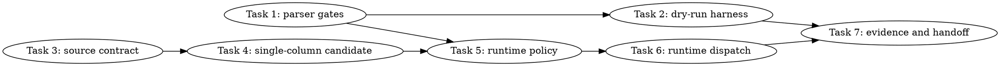

# SYCL GPT-OSS MXFP4 MoE Gate/Up DPAS Work-Reduction Implementation Plan

> **For Claude:** REQUIRED SUB-SKILL: Use team-driven-development to implement this plan with agent teams.

**Goal:** Build and validate an exact-math, default-off GPT-OSS MXFP4 TG gate/up route that reduces the dominant MoE gate/up kernel work enough to move B50 TG128 from ~36 tok/s toward >=45 tok/s while preserving PP512 >=1200 tok/s.

**Architecture:** The plan is evidence-first: add parser/harness gates that fail closed, prove a candidate in synthetic gate/up microbenches, then wire the candidate behind a new default-off runtime flag only after the synthetic proof exists. The only approved optimization target is MoE gate/up work, because the E2E ledger shows graph, attention, KV, CPU dispatch, and transfer are not dominant on the completed B50 runs.

**Tech Stack:** C++17, SYCL/ESIMD/XMX, existing `ggml/src/ggml-sycl` backend, Python pytest source tests, existing `scripts/parse-sycl-moe-profile.py`, existing `tools/sycl-kernel-bench`, lead-owned B50 model gates.

---

## Team Topology

**Recommended implementers:** 3 concurrent (based on 3 parallel tracks — execution spawns one ephemeral implementer PER TASK)
**Reviewers:** spec + quality, spawned FRESH per review (not a standing pair; see team-driven-development)

### Parallel Tracks

| Track | Tasks | Description |
|-------|-------|-------------|
| A | 1, 2, 7 | Evidence gates, dry-run harness, docs/evidence finalization |
| B | 3, 4 | Candidate kernel and microbench proof |
| C | 5, 6 | Runtime policy/dispatch integration and parser route validation |

### Dependency Graph



### File Ownership Map

| File/Directory | Tasks | Conflict Risk |
|----------------|-------|---------------|
| `scripts/parse-sycl-moe-profile.py` | 1, 6 | Sequential: parser gates first, route gate after runtime label exists |
| `tests/test-sycl-moe-profile-parser.py` | 1, 6 | Sequential with parser |
| `scripts/sycl-gptoss-moe-gateup-work-reduction-gates.sh` | 2 | New file, no conflict |
| `tests/test-sycl-gptoss-moe-gateup-work-reduction-harness.py` | 2 | New file, no conflict |
| `tests/test-sycl-moe-gateup-work-reduction-source.py` | 3, 4, 5, 6 | Sequential source-contract tests |
| `ggml/src/ggml-sycl/mmvq.cpp` | 4, 6 | Sequential: candidate kernel before production dispatch |
| `ggml/src/ggml-sycl/mmvq.hpp` | 4, 6 | Sequential with `mmvq.cpp` |
| `ggml/src/ggml-sycl/ggml-sycl-bench.hpp` | 4 | Candidate bench args only |
| `tools/sycl-kernel-bench/benchmark_harness.hpp` | 4 | Candidate bench parsing only |
| `tools/sycl-kernel-bench/kernels/reference/reference_kernels.hpp` | 4 | Candidate bench API declaration only |
| `tools/sycl-kernel-bench/kernels/reference/mxfp4_inline_dot.cpp` | 4 | Candidate bench allocation/layout/args only |
| `tools/sycl-kernel-bench/main.cpp` | 4 | Candidate CLI listing only |
| `ggml/src/ggml-sycl/ggml-sycl-test.hpp` | 5 | Policy test helper declaration only |
| `ggml/src/ggml-sycl/ggml-sycl.cpp` | 5 | Policy helper implementation only |
| `ggml/src/ggml-sycl/tests/test-xmx-moe-mxfp4.cpp` | 5 | CPU-only policy test addition |
| `docs/backend/SYCL.md` | 7 | Docs finalization only |
| `docs/plans/2026-06-30-sycl-gptoss-mxfp4-moe-gateup-dpas-work-reduction.md` | 7 | Evidence update only |

---

## Grounded Evidence And Non-Negotiable Constraints

### Facts from completed E2E validation

- Active tracker: `llama.cpp-jd32`.
- Closed parent tracker: `llama.cpp-zwpo`.
- B50 E2E log directory: `/tmp/sycl_gptoss_e2e_profile_lead_20260630_054416`.
- B50 correctness log directory: `/tmp/sycl_gptoss_e2e_correctness_b50_20260630_054725`.
- Baseline B50 full-model result from `docs/plans/2026-06-30-sycl-gptoss-mxfp4-e2e-decode-profiling.md:1633`: `PP512 1237.64 tok/s`, `TG128 36.29 tok/s`, `fatal.total 0`.
- Dominant E2E bucket from `docs/plans/2026-06-30-sycl-gptoss-mxfp4-e2e-decode-profiling.md:1633`: MoE host `7112.910 ms`; attention `685.619 ms`; KV `140.835 ms`.
- Graph-disabled run from `docs/plans/2026-06-30-sycl-gptoss-mxfp4-e2e-decode-profiling.md:1634`: `TG128 36.12 tok/s`, graph host `0 ms`, `use_graph_0` only. Graph work is not the first target.
- FA/KV detail run from `docs/plans/2026-06-30-sycl-gptoss-mxfp4-e2e-decode-profiling.md:1635`: `TG128 36.11 tok/s`, attention `676.120 ms`, KV `143.509 ms`. Attention/KV is not the first target.
- Existing TG profile code at `ggml/src/ggml-sycl/mmvq.cpp:1242-1368` records `gateup_glu`, `down`, `pack`, `kernel`, route labels, and layout call counts.
- Current safe packed-Q8 pivot evidence in `activation/mxfp4-tg-runtime-baseline.md:184-198`: `pack=0.072 ms`, `gateup_glu=5.964 ms`, `down=0.791 ms`; pack/copy is too small to explain the TG gap.
- Rejected routes in `activation/mxfp4-tg-runtime-baseline.md:200-207`: aggressive M4, M2 prefetch, down packed-Q8, down direct-final, and partial grouping did not improve TG. Do not resurrect them without a new proof gate.

### Facts from current code

- Current gate/up GLU helper is `mmvq_moe_apply_pair_glu_esimd()` at `ggml/src/ggml-sycl/mmvq.cpp:6991`.
- Current SOA pair gate/up launch is `reorder_mul_mat_vec_mxfp4_q8_1_id_pair_glu_sycl_rows()` at `ggml/src/ggml-sycl/mmvq.cpp:14205`.
- Current XMX tiled direct-Q8 M2 candidate kernel starts at `ggml/src/ggml-sycl/mmvq.cpp:9472`.
- Current XMX tiled direct-Q8 M2 submit wrapper is at `ggml/src/ggml-sycl/mmvq.cpp:13445`.
- Current production gate/up dispatch is `mmvq_moe_batched_dispatch_pair_glu_mxfp4_soa()` at `ggml/src/ggml-sycl/mmvq.cpp:15980`, declared at `ggml/src/ggml-sycl/mmvq.hpp:103`.
- Current benchmark launch helper is `ggml_sycl_mxfp4_pair_glu_bench_launch()` at `ggml/src/ggml-sycl/mmvq.cpp:20431`, with args in `ggml/src/ggml-sycl/ggml-sycl-bench.hpp:59-120`.
- Existing `sycl-kernel-bench` MXFP4 pair-GLU integration is in `tools/sycl-kernel-bench/benchmark_harness.hpp:1184-1218`; existing CLI names are listed in `tools/sycl-kernel-bench/main.cpp:143`.
- Intel ESIMD DPAS repeat count is capped at 8 by `/opt/intel/oneapi/compiler/2025.3/include/sycl/ext/intel/esimd/xmx/dpas.hpp:78-79`. Therefore, a role-fused “just double repeat count to compute gate and up in one DPAS” plan is invalid for the existing `Repeat=8` path.
- The current DPAS path extracts only one output column per row from `gate_part`/`up_part` in `ggml/src/ggml-sycl/mmvq.cpp:9586-9587` and `ggml/src/ggml-sycl/mmvq.cpp:9610-9611`, so a single-column exact-math route is the only plausible exact route that can reduce wasted TG gate/up work without changing model math.

### Hard gates

- Runtime route must be default-off and enabled only with a new flag: `GGML_SYCL_MOE_GATEUP_SINGLECOL=1`.
- Route label must be exactly `singlecol-gateup`.
- Parser must require both E2E evidence and route evidence before any full-model result is accepted.
- Full B50 promotion gate:
  - canonical GPT-OSS count gate exact output;
  - `fatal.total 0`;
  - `PP512 >= 1200 tok/s`;
  - `TG128 >= 45 tok/s`;
  - `profile.mxfp4_tg.path.singlecol-gateup > 0`;
  - `profile.mxfp4_tg.gateup_glu_ms_x1000 <= 4200` on representative TG profile rows.
- If the candidate does not meet the synthetic proof gate or full B50 gate, it remains default-off and documented as rejected. Do not lower the target by redefining success.
- Workers must not run `/Storage/GenAI/models`, B50/B580 model gates, `sycl-ls`, `/dev/dri` probes, DRM fdinfo, direct P2P probes, or real harness execution.
- Lead owns all real GPU/model validation.
- Preserve unified-cache `mem_handle` ownership. Raw pointers are transient ABI views only.
- Do not add persistent duplicate gate/up VRAM layouts.
- Do not add forced eviction or zone reset while a live `mem_handle` exists.
- Do not use `assert()` as a Release-only test check; `scripts/sycl-build.sh` uses `-DNDEBUG`.

---

## Task 1: Parser Gates for Gate/Up Work-Reduction Evidence

**Track:** A
**Depends on:** None
**File scope:**
- Modify: `scripts/parse-sycl-moe-profile.py`
- Modify: `tests/test-sycl-moe-profile-parser.py:1039-1094`

**Description:**
Add parser gates that can reject a candidate when it does not actually reduce gate/up time or when the expected route is absent. This task does not touch runtime code; it makes later performance claims mechanically checkable.

**Acceptance Criteria:**

- [ ] Parser accepts `--require-mxfp4-tg-path singlecol-gateup` and fails closed when missing.
- [ ] Parser accepts `--require-mxfp4-gateup-max-ms 4.2` and fails when `profile.mxfp4_tg.gateup_glu_ms_x1000 > 4200`.
- [ ] Existing parser tests still pass.
- [ ] Real-log parser remains line-oriented and does not reintroduce whole-file catastrophic regex scans.

**Implementation Guide:**

1. **RED: add tests.**

Append these tests after `test_parser_extracts_mxfp4_tg_pack_profile_counter()` in `tests/test-sycl-moe-profile-parser.py`:

```python
def test_parser_requires_mxfp4_tg_path() -> None:
    with tempfile.TemporaryDirectory() as tmp_raw:
        tmp = pathlib.Path(tmp_raw)
        (tmp / "profile.stderr").write_text(
            "[MXFP4-MOE-TG-PROFILE] calls=72 soa=0 coalesced=0 aos=0 dpas=48 i8=6 "
            "entries=288 batches=288 total=4.300 ms quant=0.120 ms artifact=0.050 ms "
            "batch_ids=0.000 ms pack=0.040 ms kernel=4.090 ms gateup_glu=4.100 ms/48 down=0.500 ms/24 "
            "other=0.000 ms/0 per_call total=59.722 us quant=1.667 us "
            "batch_ids=0.000 us kernel=56.806 us per_entry kernel=14.201 us last_path=singlecol-gateup\n"
        )
        out = run_parser(tmp, "--require-mxfp4-tg-path", "singlecol-gateup")
        assert "profile.mxfp4_tg.path.singlecol-gateup 1" in out


def test_parser_require_mxfp4_tg_path_fails_closed() -> None:
    with tempfile.TemporaryDirectory() as tmp_raw:
        tmp = pathlib.Path(tmp_raw)
        (tmp / "profile.stderr").write_text(
            "[MXFP4-MOE-TG-PROFILE] calls=72 soa=0 coalesced=0 aos=0 dpas=48 i8=6 "
            "entries=288 batches=288 total=6.800 ms quant=0.200 ms artifact=0.100 ms "
            "batch_ids=0.000 ms pack=0.070 ms kernel=6.430 ms gateup_glu=5.950 ms/48 down=0.790 ms/24 "
            "other=0.000 ms/0 last_path=packed-q8-m2\n"
        )
        result = run_parser_result(tmp, "--require-mxfp4-tg-path", "singlecol-gateup")
        assert result.returncode == 1
        assert "error: required MXFP4 TG path missing: singlecol-gateup" in result.stdout


def test_parser_requires_mxfp4_gateup_max_ms() -> None:
    with tempfile.TemporaryDirectory() as tmp_raw:
        tmp = pathlib.Path(tmp_raw)
        (tmp / "profile.stderr").write_text(
            "[MXFP4-MOE-TG-PROFILE] calls=72 soa=0 coalesced=0 aos=0 dpas=24 i8=6 "
            "entries=288 batches=288 total=4.250 ms quant=0.100 ms artifact=0.050 ms "
            "batch_ids=0.000 ms pack=0.000 ms kernel=4.100 ms gateup_glu=4.150 ms/48 down=0.650 ms/24 "
            "other=0.000 ms/0 last_path=singlecol-gateup\n"
        )
        out = run_parser(tmp, "--require-mxfp4-gateup-max-ms", "4.2")
        assert "profile.mxfp4_tg.gateup_glu_ms_x1000 4150" in out


def test_parser_require_mxfp4_gateup_max_ms_fails_closed() -> None:
    with tempfile.TemporaryDirectory() as tmp_raw:
        tmp = pathlib.Path(tmp_raw)
        (tmp / "profile.stderr").write_text(
            "[MXFP4-MOE-TG-PROFILE] calls=72 soa=0 coalesced=0 aos=0 dpas=48 i8=6 "
            "entries=288 batches=288 total=6.850 ms quant=0.200 ms artifact=0.100 ms "
            "batch_ids=0.000 ms pack=0.070 ms kernel=6.480 ms gateup_glu=5.950 ms/48 down=0.790 ms/24 "
            "other=0.000 ms/0 last_path=packed-q8-m2\n"
        )
        result = run_parser_result(tmp, "--require-mxfp4-gateup-max-ms", "4.2")
        assert result.returncode == 1
        assert "error: MXFP4 gate/up above maximum: actual=5.950 ms required<=4.200 ms" in result.stdout
```

Run:

```bash
cd /Apps/llama.cpp-mxfp4-tg-runtime
python3 -m pytest tests/test-sycl-moe-profile-parser.py -q
```

Expected RED: argparse rejects the two new flags.

2. **GREEN: implement parser arguments.**

In `scripts/parse-sycl-moe-profile.py`:

- Add to `gate_args_requested(args)`: `or args.require_mxfp4_tg_path` and `or args.require_mxfp4_gateup_max_ms is not None`.
- Add argparse entries near existing MXFP4 gates:

```python
parser.add_argument("--require-mxfp4-tg-path", action="append", default=[], help="Require an MXFP4 TG profile path label")
parser.add_argument("--require-mxfp4-gateup-max-ms", type=float, default=None, help="Fail if max parsed gate/up+GLU profile time exceeds this many milliseconds")
```

- In final validation, after `--require-mxfp4-profile-evidence` checks:

```python
for required_path in args.require_mxfp4_tg_path:
    if counters.get(f"profile.mxfp4_tg.path.{required_path}", 0) <= 0:
        errors.append(f"required MXFP4 TG path missing: {required_path}")
if args.require_mxfp4_gateup_max_ms is not None:
    actual_ms = counters.get("profile.mxfp4_tg.gateup_glu_ms_x1000", 0) / 1000.0
    if actual_ms <= 0.0:
        errors.append("MXFP4 gate/up profile evidence missing for maximum check")
    elif actual_ms > args.require_mxfp4_gateup_max_ms:
        errors.append(
            f"MXFP4 gate/up above maximum: actual={actual_ms:.3f} ms required<={args.require_mxfp4_gateup_max_ms:.3f} ms"
        )
```

Do not use whole-file `BENCH_RE.finditer`; keep bench parsing line-scoped as in the parser fix.

3. **Run full parser tests.**

```bash
python3 -m pytest tests/test-sycl-moe-profile-parser.py -q
```

Expected GREEN: all parser tests pass.

**Commit:**

```bash
git add scripts/parse-sycl-moe-profile.py tests/test-sycl-moe-profile-parser.py
git commit -m "test(sycl): gate MXFP4 gateup work-reduction evidence"
```

**Gotchas:**

- The parser stores milliseconds as integer micro-milliseconds under `profile.mxfp4_tg.gateup_glu_ms_x1000`; compare after dividing by `1000.0`.
- `last_path=` is already counted as `profile.mxfp4_tg.path.<label>` by the current parser. Reuse that counter.
- Do not add a regex that scans the entire stderr; real B50 profile logs previously hung until `8191f2bf7` made parsing line-oriented.

---

## Task 2: Dry-Run-First Gate Harness for JD32

**Track:** A
**Depends on:** Task 1
**File scope:**
- Create: `scripts/sycl-gptoss-moe-gateup-work-reduction-gates.sh`
- Create: `tests/test-sycl-gptoss-moe-gateup-work-reduction-harness.py`

**Description:**
Create a default-dry-run harness that prints the exact lead-owned commands for correctness, PP/TG performance, E2E evidence, and the new gate/up route gates. This prevents workers from running model commands while making the final validation reproducible.

**Acceptance Criteria:**

- [ ] Script defaults to dry-run and creates no output directory in dry-run mode.
- [ ] Real execution requires `--run --i-understand-this-runs-gpu-models`.
- [ ] Dry-run output includes `GGML_SYCL_MOE_GATEUP_SINGLECOL=1` only for the candidate case, not the baseline case.
- [ ] Candidate parse command includes `--require-mxfp4-tg-path singlecol-gateup`, `--require-mxfp4-gateup-max-ms 4.2`, `--require-bench-min pp512=1200`, and `--require-bench-min tg128=45`.
- [ ] No dry-run output contains `sycl-ls`, `/dev/dri`, `fdinfo`, `lsof`, or direct P2P probes.

**Implementation Guide:**

1. **RED: add harness tests.**

Create `tests/test-sycl-gptoss-moe-gateup-work-reduction-harness.py`:

```python
from __future__ import annotations

import os
import pathlib
import subprocess

ROOT = pathlib.Path(__file__).resolve().parents[1]
SCRIPT = ROOT / "scripts" / "sycl-gptoss-moe-gateup-work-reduction-gates.sh"


def run_script(*args: str, out_dir: pathlib.Path) -> subprocess.CompletedProcess[str]:
    env = os.environ.copy()
    env["OUT_DIR"] = str(out_dir)
    return subprocess.run(
        ["bash", str(SCRIPT), *args],
        cwd=ROOT,
        env=env,
        text=True,
        stdout=subprocess.PIPE,
        stderr=subprocess.STDOUT,
        check=False,
    )


def test_default_dry_run_has_no_side_effects(tmp_path: pathlib.Path) -> None:
    out_dir = tmp_path / "jd32-dryrun"
    result = run_script(out_dir=out_dir)
    assert result.returncode == 0, result.stdout
    assert not out_dir.exists()
    assert "# case: baseline" in result.stdout
    assert "# case: candidate_singlecol" in result.stdout
    assert "GGML_SYCL_MOE_GATEUP_SINGLECOL=1" in result.stdout
    assert "--require-mxfp4-tg-path singlecol-gateup" in result.stdout
    assert "--require-mxfp4-gateup-max-ms 4.2" in result.stdout
    assert "--require-bench-min pp512=1200" in result.stdout
    assert "--require-bench-min tg128=45" in result.stdout


def test_run_requires_ack(tmp_path: pathlib.Path) -> None:
    result = run_script("--run", out_dir=tmp_path / "real")
    assert result.returncode == 2
    assert "real execution requires --i-understand-this-runs-gpu-models" in result.stdout


def test_missing_option_value_fails(tmp_path: pathlib.Path) -> None:
    result = run_script("--model", out_dir=tmp_path / "missing")
    assert result.returncode == 2
    assert "--model requires a value" in result.stdout


def test_dry_run_forbids_probe_commands(tmp_path: pathlib.Path) -> None:
    result = run_script("--dry-run", out_dir=tmp_path / "dry")
    assert result.returncode == 0, result.stdout
    forbidden = ("sycl-ls", "/dev/dri", "fdinfo", "lsof", "P2P")
    for needle in forbidden:
        assert needle not in result.stdout
```

Run:

```bash
python3 -m pytest tests/test-sycl-gptoss-moe-gateup-work-reduction-harness.py -q
```

Expected RED: script file is missing.

2. **GREEN: add harness.**

Create `scripts/sycl-gptoss-moe-gateup-work-reduction-gates.sh`:

```bash
#!/usr/bin/env bash
set -euo pipefail

ROOT_DIR="$(cd "$(dirname "${BASH_SOURCE[0]}")/.." && pwd)"
MODEL="${MODEL:-/Storage/GenAI/models/gpt-oss-20b-mxfp4.gguf}"
DEVICE_SELECTOR="${ONEAPI_DEVICE_SELECTOR:-level_zero:1}"
OUT_DIR="${OUT_DIR:-/tmp/sycl_gptoss_moe_gateup_work_reduction_$(date +%Y%m%d_%H%M%S)}"
RUN=0
ACK=0

require_value() {
    local opt="$1"
    local value="${2-}"
    if [[ -z "${value}" || "${value}" == --* ]]; then
        echo "error: ${opt} requires a value" >&2
        exit 2
    fi
}

while [[ $# -gt 0 ]]; do
    case "$1" in
        --dry-run) RUN=0 ;;
        --run) RUN=1 ;;
        --i-understand-this-runs-gpu-models) ACK=1 ;;
        --model) require_value "$1" "${2-}"; MODEL="$2"; shift ;;
        --device-selector) require_value "$1" "${2-}"; DEVICE_SELECTOR="$2"; shift ;;
        --out-dir) require_value "$1" "${2-}"; OUT_DIR="$2"; shift ;;
        *) echo "unknown argument: $1" >&2; exit 2 ;;
    esac
    shift
done

if [[ "${RUN}" -eq 1 && "${ACK}" -ne 1 ]]; then
    echo "error: real execution requires --i-understand-this-runs-gpu-models" >&2
    exit 2
fi

COMMON_ENV=(
    "GGML_SYCL_E2E_TG_PROFILE=1"
    "GGML_SYCL_MXFP4_TG_PROFILE=1"
    "GGML_SYCL_MOE_PROFILE=1"
    "GGML_SYCL_GRAPH_DIAG=1"
    "GGML_SYCL_MOE_PHASE_MATERIALIZE=1"
    "GGML_SYCL_MOE_PHASE_BULK_XMX=1"
    "GGML_SYCL_MOE_DOWN_SUM_DIRECT=1"
)

BENCH_ARGS=("${ROOT_DIR}/build/bin/llama-bench" -m "${MODEL}" -ngl 99 -fa 1 -p 512 -n 128)
COUNT_ARGS=(
    "${ROOT_DIR}/build/bin/llama-cli" -m "${MODEL}" -ngl 99
    -cnv -st --simple-io --no-display-prompt
    --chat-template-kwargs '{"reasoning_effort":"medium"}'
    --reasoning-format none --reasoning-budget 0
    -p 'Count from 1 to 5. Answer with only: 1, 2, 3, 4, 5'
    -n 48 --seed 42 --temp 0
)
PARSER_COMMON=(
    "${ROOT_DIR}/scripts/parse-sycl-moe-profile.py"
    --require-no-fatal-markers
    --require-mxfp4-profile-evidence
    --require-e2e-profile-evidence
    --require-e2e-stage moe
    --require-e2e-stage attention
)

print_cmd() {
    printf '%q' "$1"
    shift
    for item in "$@"; do
        printf ' %q' "${item}"
    done
}

run_case() {
    local name="$1"
    local require_candidate="$2"
    shift 2
    local case_dir="${OUT_DIR}/${name}"
    local stdout="${case_dir}/bench.stdout"
    local stderr="${case_dir}/bench.stderr"
    local envs=("ONEAPI_DEVICE_SELECTOR=${DEVICE_SELECTOR}" "${COMMON_ENV[@]}" "$@")
    printf '\n# case: %s\n' "${name}"
    printf 'mkdir -p %q\n' "${case_dir}"
    printf 'env'
    for item in "${envs[@]}"; do printf ' %q' "${item}"; done
    printf ' '
    print_cmd "${BENCH_ARGS[@]}"
    printf ' >%q 2>%q\n' "${stdout}" "${stderr}"
    printf 'python3 '
    print_cmd "${PARSER_COMMON[@]}"
    if [[ "${require_candidate}" == "1" ]]; then
        printf ' --require-mxfp4-tg-path %q --require-mxfp4-gateup-max-ms 4.2 --require-bench-min pp512=1200 --require-bench-min tg128=45' "singlecol-gateup"
    fi
    printf ' %q %q >%q\n' "${stdout}" "${stderr}" "${case_dir}/parse.stdout"

    if [[ "${RUN}" -eq 1 ]]; then
        mkdir -p "${case_dir}"
        env "${envs[@]}" "${BENCH_ARGS[@]}" >"${stdout}" 2>"${stderr}"
        if [[ "${require_candidate}" == "1" ]]; then
            python3 "${PARSER_COMMON[@]}" --require-mxfp4-tg-path singlecol-gateup --require-mxfp4-gateup-max-ms 4.2 \
                --require-bench-min pp512=1200 --require-bench-min tg128=45 \
                "${stdout}" "${stderr}" >"${case_dir}/parse.stdout"
        else
            python3 "${PARSER_COMMON[@]}" "${stdout}" "${stderr}" >"${case_dir}/parse.stdout"
        fi
    fi
}

if [[ "${RUN}" -eq 1 ]]; then
    mkdir -p "${OUT_DIR}"
    set +u
    source /opt/intel/oneapi/setvars.sh --force >"${OUT_DIR}/setvars.log" 2>&1
    set -u
fi

echo "# output: ${OUT_DIR}"
echo "# selector: ${DEVICE_SELECTOR}"
echo "# model: ${MODEL}"

printf '\n# case: correctness_candidate\n'
printf 'mkdir -p %q\n' "${OUT_DIR}/correctness_candidate"
printf 'env ONEAPI_DEVICE_SELECTOR=%q GGML_SYCL_MOE_GATEUP_SINGLECOL=1 ' "${DEVICE_SELECTOR}"
print_cmd "${COUNT_ARGS[@]}"
printf ' >%q 2>%q\n' "${OUT_DIR}/correctness_candidate/count.stdout" "${OUT_DIR}/correctness_candidate/count.stderr"

if [[ "${RUN}" -eq 1 ]]; then
    mkdir -p "${OUT_DIR}/correctness_candidate"
    env ONEAPI_DEVICE_SELECTOR="${DEVICE_SELECTOR}" GGML_SYCL_MOE_GATEUP_SINGLECOL=1 \
        "${COUNT_ARGS[@]}" >"${OUT_DIR}/correctness_candidate/count.stdout" 2>"${OUT_DIR}/correctness_candidate/count.stderr"
    python3 "${ROOT_DIR}/scripts/parse-sycl-moe-profile.py" --require-no-fatal-markers --require-generated-count-exact \
        "${OUT_DIR}/correctness_candidate/count.stdout" "${OUT_DIR}/correctness_candidate/count.stderr" \
        >"${OUT_DIR}/correctness_candidate/parse.stdout"
fi

run_case baseline 0
run_case candidate_singlecol 1 "GGML_SYCL_MOE_GATEUP_SINGLECOL=1"
```

Make executable:

```bash
chmod +x scripts/sycl-gptoss-moe-gateup-work-reduction-gates.sh
```

3. **Run tests.**

```bash
python3 -m pytest tests/test-sycl-gptoss-moe-gateup-work-reduction-harness.py -q
OUT_DIR=/tmp/jd32_no_side_effect bash scripts/sycl-gptoss-moe-gateup-work-reduction-gates.sh --dry-run >/tmp/jd32_dryrun.txt
test ! -e /tmp/jd32_no_side_effect
git diff --check
```

Expected GREEN: pytest passes; no dry-run directory is created.

**Commit:**

```bash
git add scripts/sycl-gptoss-moe-gateup-work-reduction-gates.sh tests/test-sycl-gptoss-moe-gateup-work-reduction-harness.py
git commit -m "test(sycl): add dry-run gateup work-reduction gates"
```

**Gotchas:**

- Real execution must source oneAPI with `set +u` exactly as shown.
- Do not add B580 or multi-GPU rows to this harness; JD32 is B50-first because B50 remains below target.
- The candidate command is expected to fail before Tasks 4-6 implement the route. That is correct.

---

## Task 3: Source Facts Test for the Gate/Up Work-Reduction Candidate

**Track:** B
**Depends on:** None
**File scope:**
- Create: `tests/test-sycl-moe-gateup-work-reduction-source.py`

**Description:**
Add a source-level facts test that passes on the current tree and documents why JD32 is targeting a single-column exact-math candidate. This is a shippable guardrail task: it records current DPAS repeat limits, current gate/up DPAS usage, and the absence of the future route before implementation begins.

**Acceptance Criteria:**

- [ ] Source test passes on the current tree.
- [ ] Source test proves ESIMD DPAS repeat count is capped at 8, so a `Repeat=16` role-fusion plan is invalid.
- [ ] Source test proves the current M2 direct-Q8 gate/up kernel has separate gate and up DPAS calls.
- [ ] Source test proves `GGML_SYCL_MOE_GATEUP_SINGLECOL` is absent before Task 4.
- [ ] Source test cites the E2E evidence table showing MoE dominates.

**Implementation Guide:**

1. **RED/GREEN: add a facts test that passes against the current source.**

Create `tests/test-sycl-moe-gateup-work-reduction-source.py`:

```python
from __future__ import annotations

import pathlib

import pytest

ROOT = pathlib.Path(__file__).resolve().parents[1]
MMVQ = ROOT / "ggml" / "src" / "ggml-sycl" / "mmvq.cpp"
BENCH_HPP = ROOT / "ggml" / "src" / "ggml-sycl" / "ggml-sycl-bench.hpp"
E2E_PLAN = ROOT / "docs" / "plans" / "2026-06-30-sycl-gptoss-mxfp4-e2e-decode-profiling.md"
DPAS_HPP = pathlib.Path("/opt/intel/oneapi/compiler/2025.3/include/sycl/ext/intel/esimd/xmx/dpas.hpp")


def test_dpas_repeat_count_limit_blocks_repeat16_role_fusion() -> None:
    if not DPAS_HPP.exists():
        pytest.skip(f"oneAPI DPAS header not found at {DPAS_HPP}")
    dpas = DPAS_HPP.read_text(encoding="utf-8")
    assert "RepeatCount >= 1 && RepeatCount <= 8" in dpas
    assert "Repeat count must be within 1 to 8 range" in dpas


def test_current_m2_gateup_uses_separate_gate_and_up_dpas_calls() -> None:
    mmvq = MMVQ.read_text(encoding="utf-8")
    start = mmvq.index("mxfp4_pair_glu_xmx_tiled_dpas_m2_direct_q8_sycl")
    end = mmvq.index("mxfp4_pair_glu_xmx_tiled_dpas_m4_sycl", start)
    body = mmvq[start:end]
    assert "gate_part0 = xmx::dpas" in body
    assert "up_part0   = xmx::dpas" in body
    assert "gate_part0.template select<1, 1>(r * exec_n)" in body
    assert "up_part0.template select<1, 1>(r * exec_n)" in body


def test_singlecol_route_is_not_present_before_candidate_task() -> None:
    mmvq = MMVQ.read_text(encoding="utf-8")
    bench = BENCH_HPP.read_text(encoding="utf-8")
    assert "GGML_SYCL_MOE_GATEUP_SINGLECOL" not in mmvq
    assert "singlecol-gateup" not in mmvq
    assert "single_column_gateup" not in bench


def test_e2e_evidence_names_moe_as_dominant_bucket() -> None:
    plan = E2E_PLAN.read_text(encoding="utf-8")
    assert "moe host 7112.910 ms" in plan
    assert "Next target must remain MoE gate/up DPAS work-reduction" in plan
```

Run:

```bash
python3 -m pytest tests/test-sycl-moe-gateup-work-reduction-source.py -q
```

Expected: all tests pass on the current source tree.

**Commit:**

```bash
git add tests/test-sycl-moe-gateup-work-reduction-source.py
git commit -m "test(sycl): capture MXFP4 gateup work-reduction source facts"
```

**Gotchas:**

- This task must not add a failing test. It is a source-facts guardrail, not the candidate contract.
- Do not reference `/Storage/GenAI/models` in this test.
- Do not assert exact line numbers; assert stable source facts.

---

## Task 4: Implement the Single-Column Candidate for Synthetic Proof

**Track:** B
**Depends on:** Task 3
**File scope:**
- Modify: `tests/test-sycl-moe-gateup-work-reduction-source.py`
- Modify: `ggml/src/ggml-sycl/ggml-sycl-bench.hpp:59-120`
- Modify: `ggml/src/ggml-sycl/mmvq.cpp:6991-7040`
- Modify: `ggml/src/ggml-sycl/mmvq.cpp:9472-9673`
- Modify: `ggml/src/ggml-sycl/mmvq.cpp:20431-20947`
- Modify: `tools/sycl-kernel-bench/benchmark_harness.hpp:1184-1218`
- Modify: `tools/sycl-kernel-bench/kernels/reference/reference_kernels.hpp:189-205`
- Modify: `tools/sycl-kernel-bench/kernels/reference/mxfp4_inline_dot.cpp:1042-1222`
- Modify: `tools/sycl-kernel-bench/kernels/reference/mxfp4_inline_dot.cpp:1440-1510`
- Modify: `tools/sycl-kernel-bench/main.cpp:120-210`
- Test: `tests/test-sycl-moe-gateup-work-reduction-source.py`

**Description:**
Add a benchmark-only exact-math `singlecol-gateup` candidate that computes the same gate/up/GLU output as the current gate/up path but avoids DPAS execution-size column waste. This task proves compile-time and source-level correctness only; lead-owned microbench timing decides whether it can be wired into runtime.

**Acceptance Criteria:**

- [ ] `tests/test-sycl-moe-gateup-work-reduction-source.py` passes.
- [ ] `sycl-kernel-bench --kernel=mxfp4_pair_glu_xmx_tiled_singlecol_r1` and `mxfp4_pair_glu_xmx_tiled_singlecol_r4` names are listed in help text.
- [ ] The candidate path is reachable through `ggml_sycl_mxfp4_pair_glu_bench_launch()` only when `args.single_column_gateup=true`.
- [ ] Runtime `mmvq_moe_batched_dispatch_pair_glu_mxfp4_soa()` behavior is unchanged in this task.
- [ ] Build succeeds for `sycl-kernel-bench` and `test-xmx-moe-mxfp4`.

**Implementation Guide:**

1. **RED: extend the source test to require the candidate.**

Update `tests/test-sycl-moe-gateup-work-reduction-source.py` by replacing `test_singlecol_route_is_not_present_before_candidate_task()` with:

```python
def test_singlecol_route_label_and_env_are_default_off() -> None:
    mmvq = MMVQ.read_text(encoding="utf-8")
    assert "singlecol-gateup" in mmvq
    assert "GGML_SYCL_MOE_GATEUP_SINGLECOL" in mmvq
    assert "static bool mxfp4_moe_gateup_singlecol_enabled()" in mmvq
    helper_start = mmvq.index("static bool mxfp4_moe_gateup_singlecol_enabled()")
    helper_end = mmvq.index("}", helper_start)
    helper = mmvq[helper_start:helper_end]
    assert "getenv(\"GGML_SYCL_MOE_GATEUP_SINGLECOL\")" in helper
    assert "std::atoi" in helper


def test_singlecol_candidate_has_its_own_kernel_not_prepack_only() -> None:
    mmvq = MMVQ.read_text(encoding="utf-8")
    assert "mxfp4_pair_glu_singlecol_sycl" in mmvq
    assert "mxfp4_pair_glu_singlecol_submit" in mmvq
    singlecol_start = mmvq.index("mxfp4_pair_glu_singlecol_sycl")
    singlecol_end = mmvq.index("mxfp4_pair_glu_singlecol_submit", singlecol_start)
    singlecol_body = mmvq[singlecol_start:singlecol_end]
    assert "mxfp4_xmx_tiled_load_a_vec_from_group" in singlecol_body
    assert "mmvq_moe_apply_pair_glu_esimd" in singlecol_body
    assert "prepack" not in singlecol_body.lower()


def test_bench_args_expose_singlecol_without_runtime_default() -> None:
    bench = BENCH_HPP.read_text(encoding="utf-8")
    assert "bool  single_column_gateup" in bench
    assert "single_column_gateup = false" in bench
```

Run:

```bash
python3 -m pytest tests/test-sycl-moe-gateup-work-reduction-source.py -q
```

Expected RED: missing `singlecol-gateup` and helper symbols.

2. **GREEN: add benchmark arg.**

In `ggml/src/ggml-sycl/ggml-sycl-bench.hpp:59-120`, add after `bool split_gate_up = false;`:

```cpp
    bool  single_column_gateup = false;
```

3. **GREEN: add candidate helper and route label.**

In `ggml/src/ggml-sycl/mmvq.cpp` near `mmvq_moe_apply_pair_glu_esimd()` at line 6991, add:

```cpp
static constexpr const char * MXFP4_MOE_GATEUP_SINGLECOL_ROUTE = "singlecol-gateup";

static bool mxfp4_moe_gateup_singlecol_enabled() {
    const char * env = std::getenv("GGML_SYCL_MOE_GATEUP_SINGLECOL");
    return env && std::atoi(env) != 0;
}
```

4. **GREEN: add exact single-column ESIMD kernel.**

Add this benchmark candidate before `mxfp4_pair_glu_xmx_tiled_dpas_m2_direct_q8_sycl()` at `ggml/src/ggml-sycl/mmvq.cpp:9472`:

```cpp
template <int ROWS_PER_ITEM, int GLU_OP>
static sycl::event mxfp4_pair_glu_singlecol_sycl(sycl::queue &                    queue,
                                                 const void * const *             gate_ptrs,
                                                 const void * const *             up_ptrs,
                                                 const void *                     q8_src,
                                                 float *                          dst_glu,
                                                 const int32_t *                  ids,
                                                 const float *                    gate_bias,
                                                 const float *                    up_bias,
                                                 int                              ncols,
                                                 int                              ncols_y,
                                                 int                              nrows_per_expert,
                                                 int                              total_batches,
                                                 int                              n_tokens,
                                                 int                              ne11,
                                                 int64_t                          ids_nb0,
                                                 int64_t                          ids_nb1,
                                                 int64_t                          q8_nb11,
                                                 int64_t                          q8_nb12,
                                                 int64_t                          dst_nb1,
                                                 int64_t                          dst_nb2,
                                                 int64_t                          gate_bias_nb1,
                                                 int64_t                          up_bias_nb1,
                                                 float                            alpha,
                                                 float                            limit,
                                                 const std::vector<sycl::event> & deps = {}) {
    static_assert(ROWS_PER_ITEM == 1 || ROWS_PER_ITEM == 2 || ROWS_PER_ITEM == 4,
                  "single-column gate/up supports 1, 2, or 4 rows per ESIMD item");
    constexpr int k_per = GGML_SYCL_MXFP4_MOE_XMX_K;
    GGML_ASSERT((ncols % k_per) == 0);
    const int64_t row_groups = (static_cast<int64_t>(nrows_per_expert) + ROWS_PER_ITEM - 1) / ROWS_PER_ITEM;
    const int64_t tiles      = static_cast<int64_t>(total_batches) * row_groups;
    return queue.submit([&](sycl::handler & h) {
        if (!deps.empty()) {
            h.depends_on(deps);
        }
        h.parallel_for<class mxfp4_pair_glu_singlecol_kernel>(
            sycl::nd_range<1>(sycl::range<1>(static_cast<size_t>(tiles)), sycl::range<1>(1)),
            [=](sycl::nd_item<1> item) SYCL_ESIMD_KERNEL {
                using namespace sycl::ext::intel::esimd;
                const int64_t tile_idx  = static_cast<int64_t>(item.get_global_id(0));
                const int64_t group     = tile_idx / row_groups;
                const int64_t row_group = tile_idx - group * row_groups;
                const int     id        = static_cast<int>(group / n_tokens);
                const int     iid1      = static_cast<int>(group - static_cast<int64_t>(id) * n_tokens);
                const int32_t expert_id = ids ? *(const int32_t *) ((const char *) ids + static_cast<int64_t>(iid1) * ids_nb1 + static_cast<int64_t>(id) * ids_nb0) : static_cast<int32_t>(group);
                const uint8_t * gate_base = reinterpret_cast<const uint8_t *>(gate_ptrs[expert_id]);
                const uint8_t * up_base   = reinterpret_cast<const uint8_t *>(up_ptrs[expert_id]);
                if (!gate_base || !up_base) {
                    return;
                }
                const int64_t tile_n_total    = GGML_SYCL_MXFP4_MOE_XMX_N;
                const int64_t group_bytes     = tile_n_total * (1 + k_per / 2);
                const int64_t n_tile_groups_n = (nrows_per_expert + tile_n_total - 1) / tile_n_total;
                const int64_t kt_group_stride = n_tile_groups_n * group_bytes;
                const char *  q8_row          = static_cast<const char *>(q8_src) + (id % ne11) * q8_nb11 + static_cast<int64_t>(iid1) * q8_nb12;
                simd<float, ROWS_PER_ITEM> gate_acc = 0.0f;
                simd<float, ROWS_PER_ITEM> up_acc   = 0.0f;
                for (int64_t kt = 0; kt < ncols / k_per; ++kt) {
                    simd<int8_t, k_per> q_vec = block_load<int8_t, k_per>(reinterpret_cast<const int8_t *>(q8_row) + kt * k_per);
                    const sycl::half * y_scale_ptr = reinterpret_cast<const sycl::half *>(q8_row + ncols_y + kt * 2 * sizeof(sycl::half));
                    simd<float, 1> y_scale = block_load<sycl::half, 1>(y_scale_ptr);
                    for (int rr = 0; rr < ROWS_PER_ITEM; ++rr) {
                        const int row = static_cast<int>(row_group * ROWS_PER_ITEM + rr);
                        if (row >= nrows_per_expert) {
                            continue;
                        }
                        const int64_t xmx_group_n      = row / tile_n_total;
                        const int64_t xmx_row_in_group = row - xmx_group_n * tile_n_total;
                        const uint8_t * gate_group = gate_base + kt * kt_group_stride + xmx_group_n * group_bytes;
                        const uint8_t * up_group   = up_base + kt * kt_group_stride + xmx_group_n * group_bytes;
                        simd<int8_t, k_per> gate_a;
                        simd<int8_t, k_per> up_a;
                        simd<float, 1> gate_w_scale;
                        simd<float, 1> up_w_scale;
                        mxfp4_xmx_tiled_load_a_vec_from_group<1>(gate_group, tile_n_total, xmx_row_in_group, gate_a, gate_w_scale);
                        mxfp4_xmx_tiled_load_a_vec_from_group<1>(up_group, tile_n_total, xmx_row_in_group, up_a, up_w_scale);
                        simd<int, k_per> gate_prod = q_vec * gate_a;
                        simd<int, k_per> up_prod   = q_vec * up_a;
                        int gate_sum = 0;
                        int up_sum   = 0;
#pragma unroll
                        for (int kk = 0; kk < k_per; ++kk) {
                            gate_sum += gate_prod[kk];
                            up_sum += up_prod[kk];
                        }
                        gate_acc[rr] += static_cast<float>(gate_sum) * y_scale[0] * gate_w_scale[0];
                        up_acc[rr] += static_cast<float>(up_sum) * y_scale[0] * up_w_scale[0];
                    }
                }
                float * dst_out = reinterpret_cast<float *>(reinterpret_cast<char *>(dst_glu) + static_cast<int64_t>(id) * dst_nb1 + static_cast<int64_t>(iid1) * dst_nb2);
                for (int rr = 0; rr < ROWS_PER_ITEM; ++rr) {
                    const int row = static_cast<int>(row_group * ROWS_PER_ITEM + rr);
                    if (row >= nrows_per_expert) {
                        continue;
                    }
                    float gate_value = gate_acc[rr];
                    float up_value   = up_acc[rr];
                    if (gate_bias) {
                        gate_value += *(const float *) ((const char *) gate_bias + static_cast<int64_t>(expert_id) * gate_bias_nb1 + static_cast<int64_t>(row) * sizeof(float));
                    }
                    if (up_bias) {
                        up_value += *(const float *) ((const char *) up_bias + static_cast<int64_t>(expert_id) * up_bias_nb1 + static_cast<int64_t>(row) * sizeof(float));
                    }
                    block_store<float, 1>(dst_out + row, mmvq_moe_apply_pair_glu_esimd<GLU_OP>(gate_value, up_value, alpha, limit));
                }
            });
    });
}

template <int ROWS_PER_ITEM>
static sycl::event mxfp4_pair_glu_singlecol_submit(sycl::queue &                    queue,
                                                   const void * const *             gate_ptrs,
                                                   const void * const *             up_ptrs,
                                                   const void *                     q8_src,
                                                   float *                          dst_glu,
                                                   const int32_t *                  ids,
                                                   const float *                    gate_bias,
                                                   const float *                    up_bias,
                                                   int                              ncols,
                                                   int                              ncols_y,
                                                   int                              nrows_per_expert,
                                                   int                              total_batches,
                                                   int                              n_tokens,
                                                   int                              ne11,
                                                   int64_t                          ids_nb0,
                                                   int64_t                          ids_nb1,
                                                   int64_t                          q8_nb11,
                                                   int64_t                          q8_nb12,
                                                   int64_t                          dst_nb1,
                                                   int64_t                          dst_nb2,
                                                   int64_t                          gate_bias_nb1,
                                                   int64_t                          up_bias_nb1,
                                                   int                              glu_op,
                                                   float                            alpha,
                                                   float                            limit,
                                                   const std::vector<sycl::event> & deps = {}) {
    if (glu_op == GGML_GLU_OP_SWIGLU_OAI) {
        return mxfp4_pair_glu_singlecol_sycl<ROWS_PER_ITEM, GGML_GLU_OP_SWIGLU_OAI>(
            queue, gate_ptrs, up_ptrs, q8_src, dst_glu, ids, gate_bias, up_bias, ncols, ncols_y, nrows_per_expert,
            total_batches, n_tokens, ne11, ids_nb0, ids_nb1, q8_nb11, q8_nb12, dst_nb1, dst_nb2, gate_bias_nb1,
            up_bias_nb1, alpha, limit, deps);
    }
    return mxfp4_pair_glu_singlecol_sycl<ROWS_PER_ITEM, GGML_GLU_OP_SWIGLU>(
        queue, gate_ptrs, up_ptrs, q8_src, dst_glu, ids, gate_bias, up_bias, ncols, ncols_y, nrows_per_expert,
        total_batches, n_tokens, ne11, ids_nb0, ids_nb1, q8_nb11, q8_nb12, dst_nb1, dst_nb2, gate_bias_nb1,
        up_bias_nb1, alpha, limit, deps);
}
```

If the compiler rejects vector arithmetic between `simd<int8_t>` and `simd<int8_t>`, convert both operands to `simd<int, k_per>` before multiplying. Keep the route exact; do not approximate GLU or clamp differently.

5. **GREEN: wire benchmark launch only.**

At the top of `ggml_sycl_mxfp4_pair_glu_bench_launch()` in `ggml/src/ggml-sycl/mmvq.cpp:20431`, before `args.xmx_tiled` handling, add:

```cpp
    if (args.single_column_gateup) {
        switch (args.rows_per_wg) {
            case 1:
                mxfp4_pair_glu_singlecol_submit<1>(*args.stream, args.gate_ptrs, args.up_ptrs, args.activations_q8_soa,
                                                   args.output, args.ids, args.gate_bias, args.up_bias, args.ncols,
                                                   args.ncols_y, args.nrows_per_expert, total_batches, args.n_tokens,
                                                   args.ne11, args.ids_nb0, args.ids_nb1, args.nb11, args.nb12,
                                                   args.dst_nb1, args.dst_nb2, args.gate_bias_nb1, args.up_bias_nb1,
                                                   args.glu_op, args.alpha, args.limit);
                return true;
            case 2:
                mxfp4_pair_glu_singlecol_submit<2>(*args.stream, args.gate_ptrs, args.up_ptrs, args.activations_q8_soa,
                                                   args.output, args.ids, args.gate_bias, args.up_bias, args.ncols,
                                                   args.ncols_y, args.nrows_per_expert, total_batches, args.n_tokens,
                                                   args.ne11, args.ids_nb0, args.ids_nb1, args.nb11, args.nb12,
                                                   args.dst_nb1, args.dst_nb2, args.gate_bias_nb1, args.up_bias_nb1,
                                                   args.glu_op, args.alpha, args.limit);
                return true;
            case 4:
                mxfp4_pair_glu_singlecol_submit<4>(*args.stream, args.gate_ptrs, args.up_ptrs, args.activations_q8_soa,
                                                   args.output, args.ids, args.gate_bias, args.up_bias, args.ncols,
                                                   args.ncols_y, args.nrows_per_expert, total_batches, args.n_tokens,
                                                   args.ne11, args.ids_nb0, args.ids_nb1, args.nb11, args.nb12,
                                                   args.dst_nb1, args.dst_nb2, args.gate_bias_nb1, args.up_bias_nb1,
                                                   args.glu_op, args.alpha, args.limit);
                return true;
            default:
                return false;
        }
    }
```

This is benchmark-only in Task 4. Do not call this from production dispatch yet.

6. **GREEN: expose CLI names.**

In `tools/sycl-kernel-bench/benchmark_harness.hpp:1184-1218`, add the parsed boolean next to the existing `xmx_tiled` booleans:

```cpp
const bool single_column_gateup = config.kernel_name.find("_singlecol") != std::string::npos;
```

Pass `single_column_gateup` through the existing `run_mxfp4_pair_glu` call. Add one boolean parameter to the `run_mxfp4_pair_glu` declaration in `tools/sycl-kernel-bench/kernels/reference/reference_kernels.hpp:189-205` and the definition in `tools/sycl-kernel-bench/kernels/reference/mxfp4_inline_dot.cpp:1042-1222`. In the same file, where `ggml_sycl::mxfp4_pair_glu_bench_args args{}` is filled around `tools/sycl-kernel-bench/kernels/reference/mxfp4_inline_dot.cpp:1450-1492`, set:

```cpp
args.single_column_gateup = single_column_gateup;
```

In `tools/sycl-kernel-bench/main.cpp:120-210`, add names to the help list:

```text
mxfp4_pair_glu_xmx_tiled_singlecol_r1|mxfp4_pair_glu_xmx_tiled_singlecol_r2|mxfp4_pair_glu_xmx_tiled_singlecol_r4|
```

The `_xmx_tiled` substring is required because `tools/sycl-kernel-bench/kernels/reference/mxfp4_inline_dot.cpp:1150-1163` only builds XMX-tiled launch bytes when `xmx_tiled` is true. Existing `parse_moe_rows_per_wg()` recognizes `_r1`, `_r2`, and `_r4`; no parser change is needed for row count.

7. **Run checks.**

```bash
python3 -m pytest tests/test-sycl-moe-gateup-work-reduction-source.py -q
set +u
source /opt/intel/oneapi/setvars.sh --force >/tmp/jd32_singlecol_setvars.log 2>&1
set -u
./scripts/sycl-build.sh sycl-kernel-bench
./scripts/sycl-build.sh test-xmx-moe-mxfp4
git diff --check
```

Expected GREEN: source tests pass; both targets build.

**Commit:**

```bash
git add \
  ggml/src/ggml-sycl/ggml-sycl-bench.hpp \
  ggml/src/ggml-sycl/mmvq.cpp \
  tools/sycl-kernel-bench/benchmark_harness.hpp \
  tools/sycl-kernel-bench/kernels/reference/reference_kernels.hpp \
  tools/sycl-kernel-bench/kernels/reference/mxfp4_inline_dot.cpp \
  tools/sycl-kernel-bench/main.cpp \
  tests/test-sycl-moe-gateup-work-reduction-source.py
git commit -m "feat(sycl): add single-column MXFP4 gateup bench candidate"
```

**Gotchas:**

- This candidate may compile and still be slower. That is acceptable; Task 7 records rejection if it misses the gate.
- Do not add production dispatch in this task.
- Do not store new persistent weight layouts. The candidate consumes existing transient pointer tables and existing XMX-tiled bytes.
- The helper uses direct `sycl::malloc_*` only in existing tests/bench infrastructure; production allocations remain handle-owned.

---

## Task 5: Runtime Policy and CPU-Only Policy Tests

**Track:** C
**Depends on:** Task 1, Task 4
**File scope:**
- Modify: `ggml/src/ggml-sycl/ggml-sycl-test.hpp:308-340`
- Modify: `ggml/src/ggml-sycl/ggml-sycl.cpp:20336-20348`
- Modify: `ggml/src/ggml-sycl/tests/test-xmx-moe-mxfp4.cpp:429-458`
- Test: `tests/test-sycl-moe-gateup-work-reduction-source.py`

**Description:**
Add a small policy layer so the runtime route can only activate when the env flag is set, the current path is the safe packed-Q8 M2 path, and the phase is TG. The policy must be CPU-testable and must not depend on GPU availability.

**Acceptance Criteria:**

- [ ] CPU-only `test-xmx-moe-mxfp4 --cpu-reference-only` verifies default-off, env-on accepted, PP rejected, non-packed route rejected.
- [ ] No production dispatch changes yet.
- [ ] The policy does not mention unsafe PP XMX env variables.

**Implementation Guide:**

1. **RED: add policy declarations.**

In `ggml/src/ggml-sycl/ggml-sycl-test.hpp` after `test_moe_glu_q8_kernel_path` at line 308, add:

```cpp
struct test_moe_gateup_singlecol_policy_input {
    bool env_enabled          = false;
    bool is_tg                = false;
    bool packed_q8_m2_route   = false;
    bool has_gate_up_handles  = false;
    bool graph_recording      = false;
};

struct test_moe_gateup_singlecol_policy_result {
    bool         accepted = false;
    const char * reason   = "none";
};

test_moe_gateup_singlecol_policy_result test_moe_gateup_singlecol_policy(
    const test_moe_gateup_singlecol_policy_input & in);
```

In `ggml/src/ggml-sycl/tests/test-xmx-moe-mxfp4.cpp`, add a CPU-only test near `test_single_xmx_gateup_route_label_contract()`:

```cpp
static bool test_singlecol_gateup_policy_contract() {
    TEST_BEGIN("MXFP4MoE.SingleColumnGateupPolicy");
    ggml_sycl::test_moe_gateup_singlecol_policy_input in{};
    auto out = ggml_sycl::test_moe_gateup_singlecol_policy(in);
    TEST_ASSERT(!out.accepted && std::strcmp(out.reason, "env") == 0, "default-off policy must reject with env reason");

    in.env_enabled = true;
    out = ggml_sycl::test_moe_gateup_singlecol_policy(in);
    TEST_ASSERT(!out.accepted && std::strcmp(out.reason, "phase") == 0, "non-TG policy must reject");

    in.is_tg = true;
    out = ggml_sycl::test_moe_gateup_singlecol_policy(in);
    TEST_ASSERT(!out.accepted && std::strcmp(out.reason, "route") == 0, "non-packed route must reject");

    in.packed_q8_m2_route = true;
    out = ggml_sycl::test_moe_gateup_singlecol_policy(in);
    TEST_ASSERT(!out.accepted && std::strcmp(out.reason, "handles") == 0, "missing handles must reject");

    in.has_gate_up_handles = true;
    out = ggml_sycl::test_moe_gateup_singlecol_policy(in);
    TEST_ASSERT(out.accepted && std::strcmp(out.reason, "none") == 0, "valid TG packed route must accept");

    in.graph_recording = true;
    out = ggml_sycl::test_moe_gateup_singlecol_policy(in);
    TEST_ASSERT(!out.accepted && std::strcmp(out.reason, "graph") == 0, "graph recording must reject first implementation");
    TEST_PASS();
    return true;
}
```

Add this call in `main()` before the `cpu_reference_only` branch returns:

```cpp
    all_passed &= test_singlecol_gateup_policy_contract();
```

Run:

```bash
set +u
source /opt/intel/oneapi/setvars.sh --force >/tmp/jd32_policy_setvars.log 2>&1
set -u
./scripts/sycl-build.sh test-xmx-moe-mxfp4
./build/bin/test-xmx-moe-mxfp4 --cpu-reference-only
```

Expected RED: unresolved `test_moe_gateup_singlecol_policy`.

2. **GREEN: implement policy.**

In `ggml/src/ggml-sycl/ggml-sycl.cpp` near `test_moe_glu_q8_kernel_path_supports_fused_store()` at line 20336, add:

```cpp
ggml_sycl::test_moe_gateup_singlecol_policy_result ggml_sycl::test_moe_gateup_singlecol_policy(
    const ggml_sycl::test_moe_gateup_singlecol_policy_input & in) {
    ggml_sycl::test_moe_gateup_singlecol_policy_result out{};
    if (!in.env_enabled) {
        out.reason = "env";
        return out;
    }
    if (!in.is_tg) {
        out.reason = "phase";
        return out;
    }
    if (!in.packed_q8_m2_route) {
        out.reason = "route";
        return out;
    }
    if (!in.has_gate_up_handles) {
        out.reason = "handles";
        return out;
    }
    if (in.graph_recording) {
        out.reason = "graph";
        return out;
    }
    out.accepted = true;
    out.reason   = "none";
    return out;
}
```

3. **Run checks.**

```bash
./scripts/sycl-build.sh test-xmx-moe-mxfp4
./build/bin/test-xmx-moe-mxfp4 --cpu-reference-only
python3 -m pytest tests/test-sycl-moe-gateup-work-reduction-source.py -q
git diff --check
```

Expected GREEN: CPU-only C++ test passes without GPU selection.

**Commit:**

```bash
git add \
  ggml/src/ggml-sycl/ggml-sycl-test.hpp \
  ggml/src/ggml-sycl/ggml-sycl.cpp \
  ggml/src/ggml-sycl/tests/test-xmx-moe-mxfp4.cpp
git commit -m "test(sycl): add single-column gateup runtime policy"
```

**Gotchas:**

- Keep this policy independent of `GGML_SYCL_XMX_MOE_ALLOW_UNSAFE_PP`; JD32 is TG-only.
- Reject graph recording initially because the candidate has no graph replay proof.
- Use `TEST_ASSERT`, not `assert()`.

---

## Task 6: Default-Off Production Dispatch and Route Evidence

**Track:** C
**Depends on:** Task 5
**File scope:**
- Modify: `ggml/src/ggml-sycl/mmvq.cpp:1296-1368`
- Modify: `ggml/src/ggml-sycl/mmvq.cpp:15980-17146`
- Modify: `scripts/parse-sycl-moe-profile.py`
- Modify: `tests/test-sycl-moe-profile-parser.py`
- Modify: `tests/test-sycl-moe-gateup-work-reduction-source.py`

**Description:**
Wire the single-column candidate into production TG gate/up dispatch behind `GGML_SYCL_MOE_GATEUP_SINGLECOL=1`, emit route evidence, and keep the existing `packed-q8-m2` path unchanged by default. This is the first task that changes runtime route selection.

**Acceptance Criteria:**

- [ ] Default behavior remains `packed-q8-m2` when `GGML_SYCL_MOE_GATEUP_SINGLECOL` is unset.
- [ ] Candidate route emits `last_path=singlecol-gateup` and increments `profile.mxfp4_tg.path.singlecol-gateup`.
- [ ] Candidate route records lower logical DPAS count in profile output by using layout `GGML_LAYOUT_SOA` or a new non-DPAS marker, not `GGML_LAYOUT_XMX_TILED`.
- [ ] Candidate route is disabled during graph recording and PP.
- [ ] Candidate route holds no raw pointers beyond existing transient launch ABI use.

**Implementation Guide:**

1. **RED: extend source test.**

Append to `tests/test-sycl-moe-gateup-work-reduction-source.py`:

```python
def test_runtime_dispatch_is_default_off_and_records_route() -> None:
    mmvq = MMVQ.read_text(encoding="utf-8")
    dispatch_start = mmvq.index("bool mmvq_moe_batched_dispatch_pair_glu_mxfp4_soa")
    dispatch_end = mmvq.index("bool mmvq_moe_batched_dispatch_down_from_cached_q8_mxfp4", dispatch_start)
    dispatch = mmvq[dispatch_start:dispatch_end]
    assert "mxfp4_moe_gateup_singlecol_enabled()" in dispatch
    assert "test_moe_gateup_singlecol_policy" in dispatch
    assert "mxfp4_pair_glu_singlecol_submit" in dispatch
    assert "singlecol-gateup" in dispatch
    assert "profile_path = MXFP4_MOE_GATEUP_SINGLECOL_ROUTE" in dispatch
    assert "mxfp4_moe_gateup_singlecol_enabled()" in dispatch
```

Run:

```bash
python3 -m pytest tests/test-sycl-moe-gateup-work-reduction-source.py -q
```

Expected RED: dispatch is not wired.

2. **GREEN: production dispatch branch.**

In `mmvq_moe_batched_dispatch_pair_glu_mxfp4_soa()` at `ggml/src/ggml-sycl/mmvq.cpp:15980`, find the existing branch that selects `packed-q8-m2`. Before the packed-Q8 M2 call, evaluate:

```cpp
const bool singlecol_env = mxfp4_moe_gateup_singlecol_enabled();
ggml_sycl::test_moe_gateup_singlecol_policy_input singlecol_policy_in{};
singlecol_policy_in.env_enabled         = singlecol_env;
singlecol_policy_in.is_tg               = !pp_profile;
singlecol_policy_in.packed_q8_m2_route  = true;
singlecol_policy_in.has_gate_up_handles = gate_ptrs_device && up_ptrs_device;
singlecol_policy_in.graph_recording     = ctx.graph && ctx.graph->recording;
const auto singlecol_policy = ggml_sycl::test_moe_gateup_singlecol_policy(singlecol_policy_in);
```

Use the exact graph-recording expression already present in this function if the field names differ; do not invent a new graph state.

If accepted, call:

```cpp
sycl::event singlecol_event = mxfp4_pair_glu_singlecol_submit<4>(
    *stream, gate_ptrs_device, up_ptrs_device, src1_dd, glu_dst, ids_device, gate_bias, up_bias, ne00, ne10,
    nrows_per_expert, n_gpu_entries, n_tokens, ne11, ids_nb0, ids_nb1, nb11, nb12, dst_nb1, dst_nb2,
    gate_bias_nb1, up_bias_nb1, glu_op, alpha, limit, deps ? *deps : std::vector<sycl::event>{});
```

Then set the same completion-event outputs as the packed-Q8 branch uses. Set:

```cpp
profile_path = MXFP4_MOE_GATEUP_SINGLECOL_ROUTE;
profile_layout = GGML_LAYOUT_SOA;
profile_kernel_event = singlecol_event;
```

Do not remove the existing packed-Q8 M2 branch. Do not route PP through this branch.

3. **GREEN: route evidence.**

The existing `mmvq_moe_tg_profile_record()` at `ggml/src/ggml-sycl/mmvq.cpp:1296-1368` already records `path`. Ensure the new branch passes `profile_path` as `MXFP4_MOE_GATEUP_SINGLECOL_ROUTE`. If needed, add a one-line source test that asserts the record call includes `profile_path` after the singlecol branch.

4. **Run checks.**

```bash
python3 -m pytest tests/test-sycl-moe-profile-parser.py tests/test-sycl-moe-gateup-work-reduction-source.py -q
set +u
source /opt/intel/oneapi/setvars.sh --force >/tmp/jd32_dispatch_setvars.log 2>&1
set -u
./scripts/sycl-build.sh llama-bench
./scripts/sycl-build.sh test-xmx-moe-mxfp4
./build/bin/test-xmx-moe-mxfp4 --cpu-reference-only
git diff --check
```

Expected GREEN: Python/source tests pass; build succeeds; CPU-only policy test passes.

**Commit:**

```bash
git add \
  ggml/src/ggml-sycl/mmvq.cpp \
  scripts/parse-sycl-moe-profile.py \
  tests/test-sycl-moe-profile-parser.py \
  tests/test-sycl-moe-gateup-work-reduction-source.py
git commit -m "feat(sycl): add default-off single-column gateup route"
```

**Gotchas:**

- The code snippet uses symbolic names such as `src1_dd`, `stream`, and `deps`; use the exact local variable names in `mmvq_moe_batched_dispatch_pair_glu_mxfp4_soa()`. Verify with `read` before editing.
- Do not allocate persistent scratch. If a temporary vector of events is needed, it is CPU-side and scoped to the submit call.
- If compiler errors show the candidate is slower to compile or impossible under ESIMD constraints, stop and record rejection instead of forcing a risky route.

---

## Task 7: Evidence Update, Lead Validation, and Decision

**Track:** A
**Depends on:** Task 2, Task 6
**File scope:**
- Modify: `docs/backend/SYCL.md`
- Modify: `docs/plans/2026-06-30-sycl-gptoss-mxfp4-moe-gateup-dpas-work-reduction.md`
- Update tracker: `llama.cpp-jd32`

**Description:**
Run final safe tests, then lead-owned validation fills the evidence table. This task explicitly decides whether the candidate improved speed enough to continue, remains default-off, or must be reverted/rejected.

**Acceptance Criteria:**

- [ ] SPEC review passes before QUALITY review.
- [ ] All reviewer issues, including minor, are fixed.
- [ ] Safe worker gates pass.
- [ ] Lead-owned B50 correctness gate passes.
- [ ] Lead-owned baseline and candidate runs are recorded with exact log directories.
- [ ] Candidate is accepted only if `PP512 >= 1200`, `TG128 >= 45`, `fatal.total 0`, `singlecol-gateup` route evidence present, and gate/up profile max `<= 4.2 ms`.
- [ ] If candidate misses any gate, docs mark it rejected/default-off and tracker remains open for a new candidate rather than declaring success.

**Implementation Guide:**

1. **Run safe checks.**

```bash
cd /Apps/llama.cpp-mxfp4-tg-runtime
python3 -m pytest \
  tests/test-sycl-moe-profile-parser.py \
  tests/test-sycl-moe-gateup-work-reduction-source.py \
  tests/test-sycl-gptoss-moe-gateup-work-reduction-harness.py -q
set +u
source /opt/intel/oneapi/setvars.sh --force >/tmp/jd32_final_setvars.log 2>&1
set -u
./scripts/sycl-build.sh llama-bench
./scripts/sycl-build.sh sycl-kernel-bench
./scripts/sycl-build.sh test-xmx-moe-mxfp4
./build/bin/test-xmx-moe-mxfp4 --cpu-reference-only
OUT_DIR=/tmp/jd32_final_dryrun_no_side_effect bash scripts/sycl-gptoss-moe-gateup-work-reduction-gates.sh --dry-run >/tmp/jd32_final_dryrun.txt
test ! -e /tmp/jd32_final_dryrun_no_side_effect
git diff --check
```

Expected: all pass.

2. **Lead-only synthetic proof.**

Do not let workers run this. Lead runs:

```bash
cd /Apps/llama.cpp-mxfp4-tg-runtime
set +u
source /opt/intel/oneapi/setvars.sh --force >/tmp/jd32_synth_setvars.log 2>&1
set -u
ONEAPI_DEVICE_SELECTOR=level_zero:1 ./build/bin/sycl-kernel-bench \
  --kernel=mxfp4_pair_glu_xmx_tiled_packed_r8_m2_sparse32_bias,mxfp4_pair_glu_xmx_tiled_singlecol_r1,mxfp4_pair_glu_xmx_tiled_singlecol_r2,mxfp4_pair_glu_xmx_tiled_singlecol_r4 \
  --quant=MXFP4 --dim_m=2880 --dim_n=4 --dim_k=2880 \
  --iterations=200 --warmup=20 --validate --output=jsonl \
  > /tmp/jd32_singlecol_synth.jsonl
```

Synthetic continue threshold: at least one `mxfp4_pair_glu_xmx_tiled_singlecol_*` row must be >=20% faster than `mxfp4_pair_glu_xmx_tiled_packed_r8_m2_sparse32_bias` and pass validation. If not, record rejection and do not run the full model candidate.

3. **Lead-only full model gate.**

Only if synthetic proof passes:

```bash
cd /Apps/llama.cpp-mxfp4-tg-runtime
OUT_DIR=/tmp/sycl_gptoss_moe_gateup_work_reduction_$(date +%Y%m%d_%H%M%S) \
ONEAPI_DEVICE_SELECTOR=level_zero:1 \
bash scripts/sycl-gptoss-moe-gateup-work-reduction-gates.sh --run --i-understand-this-runs-gpu-models
```

4. **Record measured evidence only after lead validation.**

After the lead validation commands complete, add a new `## Lead Validation Evidence` section to this plan. The section must contain one table with these columns: `Case`, `Log dir`, `PP512 tok/s`, `TG128 tok/s`, `Route evidence`, `gate/up max ms`, `Fatal markers`, and `Decision`. Every cell in that new table must contain a measured value copied from parser output or a concrete rejection reason from the synthetic proof gate. Do not commit a partially filled evidence table.

Current baseline facts that must be carried into that measured table are: baseline log `/tmp/sycl_gptoss_e2e_profile_lead_20260630_054416/baseline`, `PP512 1237.64`, `TG128 36.29`, route `packed-q8-m2`, gate/up max `5.949 ms`, and fatal markers `0`. Candidate acceptance requires `PP512 >= 1200`, `TG128 >= 45`, route `singlecol-gateup`, gate/up max `<= 4.2 ms`, and fatal markers `0`.

5. **Docs update.**

In `docs/backend/SYCL.md`, add a short default-off env note under the existing GPT-OSS MXFP4 ledger section:

```markdown
`GGML_SYCL_MOE_GATEUP_SINGLECOL=1` is an experimental GPT-OSS MXFP4 TG-only gate/up candidate. It must remain default-off unless lead-owned B50 validation shows exact count correctness, `fatal.total 0`, `PP512 >= 1200`, `TG128 >= 45`, `singlecol-gateup` route evidence, and gate/up profile `<= 4.2 ms`. It does not authorize prompt XMX or persistent duplicate gate/up layouts.
```

6. **Tracker update.**

Add a `task_comment_add` to `llama.cpp-jd32` after validation. The comment must include these literal field names with measured values copied from parser output: `synthetic log`, `full-model log`, `correctness log`, `PP512`, `TG128`, `route evidence`, `gate/up max ms`, and `decision`. If an earlier hard gate intentionally skips a later command, record `skipped: synthetic gate failed` or `skipped: full-model gate failed` as the value for that field.

Close `llama.cpp-jd32` only if the candidate passes all acceptance gates or if the user explicitly accepts a documented rejection and opens a new follow-up task.

**Commit:**

```bash
git add docs/backend/SYCL.md docs/plans/2026-06-30-sycl-gptoss-mxfp4-moe-gateup-dpas-work-reduction.md
git commit -m "docs(sycl): record MXFP4 gateup work-reduction evidence"
```

**Gotchas:**

- Do not claim speed improvement from synthetic proof alone; full B50 PP/TG gate is mandatory.
- If the candidate fails, leave the runtime route default-off or revert it before push. Do not hide the failed evidence.
- Run `git restore --worktree .beads/beads.db` if tracker hooks modify it.
- Final session completion still requires `git pull --rebase`, `bd sync`, `git push`, and clean `git status`.

---

## Execution Notes

- This plan intentionally does not target graph replay, attention/KV, CPU sharing, or multi-GPU because the completed E2E evidence does not support them as the first speed target.
- The concrete candidate is exact-math single-column gate/up. It may fail the speed gate; the plan prevents it from being promoted if it fails.
- A route that merely reduces `pack=` or copy time cannot satisfy this plan. The current `pack=` cost is about `0.05-0.07 ms/token`; improving from `36.29 tok/s` to `45 tok/s` requires about `5.33 ms/token` saved.
- If Task 4 shows the single-column candidate is not viable, stop after documenting rejection and create a new plan for a different exact gate/up work-reduction idea. Do not proceed to Task 6.
