# SYCL MXFP4 Multi-RHS Gate/Up DPAS Work-Reduction Implementation Plan

> **For Claude:** REQUIRED SUB-SKILL: Use team-driven-development to implement this plan with agent teams.

**Goal:** Reject the mathematically invalid role-column gate/up fusion idea and build a proof-gated, default-off same-expert multi-RHS DPAS candidate that uses DPAS N columns for multiple routed entries sharing one expert.

**Architecture:** DPAS output columns cannot represent different gate/up weight matrices for the same row; they represent RHS/input columns for the same A matrix. This plan first lands a source-level proof that role-column gate/up fusion is invalid, then evaluates a mathematically valid alternative: batching multiple routed entries with the same expert through DPAS N columns while keeping gate and up as separate A matrices. Runtime wiring is forbidden until benchmark-only synthetic proof passes.

**Tech Stack:** C++17, SYCL/ESIMD/XMX DPAS, `ggml/src/ggml-sycl`, Python pytest source tests, `scripts/parse-sycl-moe-profile.py`, `tools/sycl-kernel-bench`, lead-owned B50 validation.

---

## Team Topology

**Recommended implementers:** 3 concurrent for worker-safe Tasks 1-5 and 7 (based on 3 parallel tracks — execution spawns one ephemeral implementer PER worker-safe task). Tasks 6 and 8 are lead-owned validation/evidence tasks, not worker tasks.
**Reviewers:** spec + quality, spawned FRESH per review (not a standing pair; see team-driven-development)

### Parallel Tracks

| Track | Tasks | Description |
|-------|-------|-------------|
| A | 1, 3 | Role-column rejection proof and parser/harness gates |
| B | 2, 4, 5 | Same-expert multi-RHS source contract and benchmark-only candidate |
| C | 7 | Runtime policy/dispatch after benchmark proof |
| Lead | 6, 8 | Lead-only synthetic proof, full-model validation, and final evidence/docs |

### Dependency Graph

```dot
digraph dependencies {
    rankdir=LR;
    1 [label="Task 1: reject role-column DPAS"];
    2 [label="Task 2: multi-RHS source contract"];
    3 [label="Task 3: parser and dry-run gates"];
    4 [label="Task 4: bench CLI scaffolding"];
    5 [label="Task 5: benchmark-only kernel"];
    6 [label="Task 6: lead synthetic proof"];
    7 [label="Task 7: default-off runtime policy/dispatch"];
    8 [label="Task 8: full validation and docs"];
    1 -> 4;
    2 -> 4;
    3 -> 8;
    4 -> 5;
    5 -> 6;
    6 -> 7 [label="runtime-authorized"];
    6 -> 8 [label="runtime-rejected"];
    7 -> 8 [label="runtime-wired or runtime-rejected"];
}
```



### File Ownership Map

| File/Directory | Tasks | Conflict Risk |
|----------------|-------|---------------|
| `tests/test-sycl-moe-rolecol-dpas-feasibility-source.py` | 1 | None, new file |
| `docs/plans/2026-06-30-sycl-mxfp4-role-column-dpas-rejection.md` | 1 | None, new file |
| `tests/test-sycl-moe-multirhs-gateup-source.py` | 2, 4, 5, 6 | Sequential source-contract expansion |
| `scripts/parse-sycl-moe-profile.py` | 3 | Low; parser already supports arbitrary path labels, add regression only if needed |
| `tests/test-sycl-moe-profile-parser.py` | 3 | Low; parser route regression only |
| `scripts/sycl-gptoss-moe-multirhs-gateup-gates.sh` | 3 | None, new dry-run harness |
| `tests/test-sycl-gptoss-moe-multirhs-gateup-harness.py` | 3 | None, new harness tests |
| `ggml/src/ggml-sycl/ggml-sycl-bench.hpp` | 4 | Sequential with Task 5 bench args |
| `tools/sycl-kernel-bench/kernel_registry.hpp` | 4 | Sequential with Task 5 CLI names |
| `tools/sycl-kernel-bench/main.cpp` | 4 | Sequential with Task 5 help text |
| `tools/sycl-kernel-bench/benchmark_harness.hpp` | 4 | Sequential with Task 5 benchmark plumbing |
| `tools/sycl-kernel-bench/kernels/reference/reference_kernels.hpp` | 4 | Sequential with Task 5 benchmark API |
| `tools/sycl-kernel-bench/kernels/reference/mxfp4_inline_dot.cpp` | 4, 5 | Sequential benchmark data/kernel plumbing |
| `ggml/src/ggml-sycl/mmvq.cpp` | 5, 7 | Sequential: benchmark kernel before runtime dispatch |
| `ggml/src/ggml-sycl/ggml-sycl-test.hpp` | 7 | Runtime policy declarations only |
| `ggml/src/ggml-sycl/ggml-sycl.cpp` | 7 | Runtime policy implementation only |
| `ggml/src/ggml-sycl/tests/test-xmx-moe-mxfp4.cpp` | 7 | CPU-only runtime policy tests |
| `docs/backend/SYCL.md` | 8 | Final docs only |
| `docs/plans/2026-06-30-sycl-mxfp4-multirhs-gateup-dpas-work-reduction.md` | 6, 8 | Synthetic and final evidence update |

---

## Grounded Evidence And Constraints

### Current code facts

- Current DPAS M2 direct-Q8 gate/up kernel is `mxfp4_pair_glu_xmx_tiled_dpas_m2_direct_q8_sycl()` at `ggml/src/ggml-sycl/mmvq.cpp:9659`.
- That kernel issues separate gate/up DPAS calls at `ggml/src/ggml-sycl/mmvq.cpp:9769-9770` and consumes only output column zero for each row at `ggml/src/ggml-sycl/mmvq.cpp:9773-9774`.
- The prepack DPAS path at `ggml/src/ggml-sycl/mmvq.cpp:9245-9454` also issues separate gate/up DPAS calls; it is not a DPAS-count reduction.
- ESIMD DPAS repeat count is capped at 8 in `/opt/intel/oneapi/compiler/2025.3/include/sycl/ext/intel/esimd/xmx/dpas.hpp`, and the current `Repeat=8` path already uses that cap.
- Current benchmark args are `mxfp4_pair_glu_bench_args` at `ggml/src/ggml-sycl/ggml-sycl-bench.hpp:59-121`; `single_column_gateup` is already present at line `108` and remains default-off diagnostic state.
- Current benchmark launch is `ggml_sycl_mxfp4_pair_glu_bench_launch()` at `ggml/src/ggml-sycl/mmvq.cpp:20644`.
- Current production dispatch is `mmvq_moe_batched_dispatch_pair_glu_mxfp4_soa()` at `ggml/src/ggml-sycl/mmvq.cpp:16167`; the rejected single-column route remains opt-in behind `GGML_SYCL_MOE_GATEUP_SINGLECOL=1` at `ggml/src/ggml-sycl/mmvq.cpp:17065-17075`.
- Existing dry-run harness pattern is `scripts/sycl-gptoss-moe-gateup-work-reduction-gates.sh:1-203`; it defaults to dry-run and requires `--run --i-understand-this-runs-gpu-models` for model execution.

### Hard constraints

- Do not implement role-column gate/up fusion as a production or benchmark route unless Task 1 finds hardware/API evidence that DPAS N columns can use different A matrices per column. Current evidence says they cannot.
- The only new implementation candidate in this plan is same-expert multi-RHS batching: DPAS N columns may hold multiple Q8 RHS vectors only when all those columns share the same expert/weight A matrix.
- New route label must be `multirhs-gateup`.
- New env flag must be `GGML_SYCL_MOE_GATEUP_MULTIRHS=1`.
- Runtime route must remain default-off and disabled for PP, graph recording, and any grouped batch whose routed entries do not share one expert.
- No worker may run `/Storage/GenAI/models`, B50/B580 model gates, `llama-bench`, `llama-cli`, `sycl-kernel-bench` executable, `sycl-ls`, `/dev/dri`, DRM fdinfo, `lsof`, direct P2P probes, or real harness execution.
- Lead owns Tasks 6 and 8 and all GPU/model/synthetic validation. These tasks must not be delegated to worker teammates.
- Preserve unified-cache `mem_handle` ownership. Raw pointers are transient ABI views only.
- Do not add persistent duplicate gate/up VRAM layouts.

### Acceptance gates

- Synthetic continue gate: at least one benchmark-only `mxfp4_pair_glu_xmx_tiled_multirhs_*` row validates exactly and is at least 20% faster than `mxfp4_pair_glu_xmx_tiled_packed_r8_m2_sparse32_bias` on the lead B50 synthetic command.
- Full model promotion gate, run only after synthetic continue passes: canonical GPT-OSS count gate exact output, `fatal.total 0`, `PP512 >= 1200 tok/s`, `TG128 >= 45 tok/s`, `profile.mxfp4_tg.path.multirhs-gateup > 0`, and representative TG gate/up profile `<= 4.2 ms`.
- If any gate fails, the route remains default-off or is reverted, and docs record rejection rather than redefining success.

---

## Task 1: Role-Column DPAS Rejection Proof

**Track:** A
**Depends on:** None
**File scope:**
- Create: `tests/test-sycl-moe-rolecol-dpas-feasibility-source.py`
- Create: `docs/plans/2026-06-30-sycl-mxfp4-role-column-dpas-rejection.md`

**Description:**
Prove in source and docs that DPAS output columns cannot compute gate and up from different A matrices in one DPAS call. This prevents the team from spending implementation time on the invalid role-column idea.

**Acceptance Criteria:**

- [ ] Source test passes on the current tree.
- [ ] Test proves the current M2 direct-Q8 path uses two distinct A operands (`gate_a_vec0` and `up_a_vec0`) and two DPAS calls.
- [ ] Test proves current output-column extraction consumes column zero of each DPAS result, not role columns.
- [ ] Test proves `GGML_SYCL_MOE_GATEUP_ROLECOL` and `rolecol-gateup` are absent.
- [ ] Rejection note explains DPAS math: `C[m,n] = sum_k A[m,k] * B[k,n]`, so N columns vary RHS vectors for the same A, not the A matrix.

**Implementation Guide:**

1. **RED/GREEN: add the source proof test.**

Create `tests/test-sycl-moe-rolecol-dpas-feasibility-source.py`:

```python
from __future__ import annotations

import pathlib

import pytest

ROOT = pathlib.Path(__file__).resolve().parents[1]
MMVQ = ROOT / "ggml" / "src" / "ggml-sycl" / "mmvq.cpp"
DPAS_HPP = pathlib.Path("/opt/intel/oneapi/compiler/2025.3/include/sycl/ext/intel/esimd/xmx/dpas.hpp")


def strip_cpp_comments(source: str) -> str:
    output: list[str] = []
    i = 0
    state = "code"
    while i < len(source):
        ch = source[i]
        nxt = source[i + 1] if i + 1 < len(source) else ""
        if state == "code":
            if ch == "/" and nxt == "/":
                state = "line_comment"
                i += 2
                continue
            if ch == "/" and nxt == "*":
                state = "block_comment"
                i += 2
                continue
            output.append(ch)
            if ch == '"':
                state = "string"
            elif ch == "'":
                state = "char"
        elif state == "line_comment":
            if ch == "\n":
                output.append(ch)
                state = "code"
        elif state == "block_comment":
            if ch == "*" and nxt == "/":
                state = "code"
                i += 2
                continue
            if ch == "\n":
                output.append(ch)
        elif state == "string":
            output.append(ch)
            if ch == "\\" and i + 1 < len(source):
                output.append(source[i + 1])
                i += 1
            elif ch == '"':
                state = "code"
        elif state == "char":
            output.append(ch)
            if ch == "\\" and i + 1 < len(source):
                output.append(source[i + 1])
                i += 1
            elif ch == "'":
                state = "code"
        i += 1
    return "".join(output)


def current_m2_body() -> str:
    mmvq = MMVQ.read_text(encoding="utf-8")
    start = mmvq.index("mxfp4_pair_glu_xmx_tiled_dpas_m2_direct_q8_sycl")
    end = mmvq.index("mxfp4_pair_glu_xmx_tiled_dpas_m4_sycl", start)
    return strip_cpp_comments(mmvq[start:end])


def test_dpas_repeat_count_is_already_capped_at_8() -> None:
    if not DPAS_HPP.exists():
        pytest.skip(f"oneAPI DPAS header not found at {DPAS_HPP}")
    dpas = DPAS_HPP.read_text(encoding="utf-8")
    assert "RepeatCount >= 1 && RepeatCount <= 8" in dpas
    assert "Repeat count must be within 1 to 8 range" in dpas


def test_current_m2_uses_distinct_gate_and_up_a_matrices() -> None:
    body = current_m2_body()
    assert "mxfp4_xmx_tiled_load_a_vec_from_group<Repeat>(gate_group0" in body
    assert "mxfp4_xmx_tiled_load_a_vec_from_group<Repeat>(up_group0" in body
    assert "gate_part0 = xmx::dpas<8, Repeat, int, int, int8_t, int8_t>(gate_part0, b_vec, gate_a_vec0)" in body
    assert "up_part0   = xmx::dpas<8, Repeat, int, int, int8_t, int8_t>(up_part0, b_vec, up_a_vec0)" in body


def test_current_m2_consumes_rhs_column_zero_not_role_columns() -> None:
    body = current_m2_body()
    assert "gate_part0.template select<1, 1>(r * exec_n)" in body
    assert "up_part0.template select<1, 1>(r * exec_n)" in body
    assert "gate_part0.template select<1, 1>(r * exec_n + 1)" not in body
    assert "up_part0.template select<1, 1>(r * exec_n + 1)" not in body


def test_role_column_route_is_not_implemented() -> None:
    mmvq = MMVQ.read_text(encoding="utf-8")
    assert "GGML_SYCL_MOE_GATEUP_ROLECOL" not in mmvq
    assert "rolecol-gateup" not in mmvq
```

Run:

```bash
cd /Apps/llama.cpp-mxfp4-tg-runtime
python3 -m pytest tests/test-sycl-moe-rolecol-dpas-feasibility-source.py -q
```

Expected: `4 passed` on the current source tree.

2. **GREEN: add the rejection note.**

Create `docs/plans/2026-06-30-sycl-mxfp4-role-column-dpas-rejection.md`:

```markdown
# SYCL MXFP4 Role-Column DPAS Gate/Up Rejection

Role-column gate/up fusion is rejected before implementation. The current M2 direct-Q8 path uses DPAS as `C[m,n] = sum_k A[m,k] * B[k,n]`: `A` is either the gate weight rows or the up weight rows, and `B` is the Q8 activation tile. DPAS N columns vary RHS vectors for the same A matrix. They cannot make column 0 use gate weights and column 1 use up weights for the same logical row.

Current code evidence:

- `ggml/src/ggml-sycl/mmvq.cpp:9659` starts `mxfp4_pair_glu_xmx_tiled_dpas_m2_direct_q8_sycl()`.
- `ggml/src/ggml-sycl/mmvq.cpp:9769-9770` issues separate DPAS calls for `gate_a_vec0` and `up_a_vec0`.
- `ggml/src/ggml-sycl/mmvq.cpp:9773-9774` extracts output column zero from each separate DPAS result.
- `/opt/intel/oneapi/compiler/2025.3/include/sycl/ext/intel/esimd/xmx/dpas.hpp` caps `RepeatCount` at 8, so row-doubling the existing `Repeat=8` path is not available.

A valid use of DPAS N columns is batching multiple RHS vectors that share the same A matrix. Therefore the next implementation candidate is same-expert multi-RHS gate/up batching, not role-column gate/up fusion.
```

**Commit:**

```bash
git add \
  tests/test-sycl-moe-rolecol-dpas-feasibility-source.py \
  docs/plans/2026-06-30-sycl-mxfp4-role-column-dpas-rejection.md
git commit -m "docs(sycl): reject role-column MXFP4 gateup DPAS fusion"
```

**Gotchas:**

- Do not add `GGML_SYCL_MOE_GATEUP_ROLECOL`; the route is rejected.
- Do not run GPU/model commands; this task is source proof only.
- Keep this proof separate from the multi-RHS candidate so reviewers can reject role-column independently.

---

## Task 2: Same-Expert Multi-RHS Source Contract

**Track:** B
**Depends on:** None
**File scope:**
- Create: `tests/test-sycl-moe-multirhs-gateup-source.py`

**Description:**
Add a source-level contract for the mathematically valid candidate: use DPAS N columns for multiple routed entries only when they share the same expert and therefore share the same gate/up A matrices. This task does not implement the route; it records the preconditions that later tasks must satisfy.

**Acceptance Criteria:**

- [ ] Source test passes on the current tree.
- [ ] Test proves current benchmark parser can detect `_singlecol` and can be extended with `_multirhs` without changing kernel kind.
- [ ] Test proves current benchmark args do not yet expose `multi_rhs_gateup`.
- [ ] Test proves production dispatch has existing `ids_device`, `total_batches`, `num_tokens`, and graph-recording state needed for a same-expert precondition.
- [ ] Test states that multi-RHS requires same expert per DPAS group.

**Implementation Guide:**

Create `tests/test-sycl-moe-multirhs-gateup-source.py`:

```python
from __future__ import annotations

import pathlib

ROOT = pathlib.Path(__file__).resolve().parents[1]
MMVQ = ROOT / "ggml" / "src" / "ggml-sycl" / "mmvq.cpp"
BENCH_HPP = ROOT / "ggml" / "src" / "ggml-sycl" / "ggml-sycl-bench.hpp"
HARNESS = ROOT / "tools" / "sycl-kernel-bench" / "benchmark_harness.hpp"
REGISTRY = ROOT / "tools" / "sycl-kernel-bench" / "kernel_registry.hpp"


def test_benchmark_harness_has_pair_glu_name_parser_to_extend() -> None:
    harness = HARNESS.read_text(encoding="utf-8")
    assert "config.kernel_name.find(\"_singlecol\") != std::string::npos" in harness
    assert "KernelKind::MXFP4_PAIR_GLU" in REGISTRY.read_text(encoding="utf-8")
    assert "_multirhs" not in harness


def test_bench_args_do_not_expose_multirhs_before_candidate() -> None:
    bench = BENCH_HPP.read_text(encoding="utf-8")
    assert "single_column_gateup = false" in bench
    assert "multi_rhs_gateup" not in bench


def test_production_dispatch_has_inputs_needed_for_same_expert_policy() -> None:
    mmvq = MMVQ.read_text(encoding="utf-8")
    start = mmvq.index("bool mmvq_moe_batched_dispatch_pair_glu_mxfp4_soa")
    end = mmvq.index("bool mmvq_moe_batched_dispatch_down_from_cached_q8_mxfp4", start)
    dispatch = mmvq[start:end]
    assert "ids_device" in dispatch
    assert "total_batches" in dispatch
    assert "num_tokens" in dispatch
    assert "ggml_sycl_graph_recording_active()" in dispatch
    assert "ne12 == 1 && !pp_profile" in dispatch


def test_multirhs_requires_same_expert_contract_text() -> None:
    contract = (
        "multi-RHS DPAS may batch multiple RHS columns only when every RHS column "
        "uses the same expert and therefore the same gate/up A matrices"
    )
    assert "same expert" in contract
    assert "same gate/up A matrices" in contract
```

Run:

```bash
cd /Apps/llama.cpp-mxfp4-tg-runtime
python3 -m pytest tests/test-sycl-moe-multirhs-gateup-source.py -q
```

Expected: `4 passed` on the current source tree.

**Commit:**

```bash
git add tests/test-sycl-moe-multirhs-gateup-source.py
git commit -m "test(sycl): capture MXFP4 multi-RHS gateup source contract"
```

**Gotchas:**

- Do not implement `_multirhs` in this task; this is a contract/guardrail.
- This test intentionally passes before implementation so it can merge in parallel with Task 1.

---

## Task 3: Parser and Dry-Run Gates for Multi-RHS Evidence

**Track:** A
**Depends on:** None
**File scope:**
- Modify: `tests/test-sycl-moe-profile-parser.py:1039-1130`
- Create: `scripts/sycl-gptoss-moe-multirhs-gateup-gates.sh`
- Create: `tests/test-sycl-gptoss-moe-multirhs-gateup-harness.py`

**Description:**
Add evidence gates for the new route label and a dry-run-only lead harness. The parser already supports arbitrary `last_path=` labels; this task adds a route regression and a safe harness that workers can test without running GPU/model commands.

**Acceptance Criteria:**

- [ ] Parser test proves `--require-mxfp4-tg-path multirhs-gateup` passes when `last_path=multirhs-gateup` is present.
- [ ] Harness defaults to dry-run and creates no output directory.
- [ ] Real execution requires `--run --i-understand-this-runs-gpu-models`.
- [ ] Candidate dry-run includes `GGML_SYCL_MOE_GATEUP_MULTIRHS=1` only for the candidate case.
- [ ] Candidate parser command includes `--require-mxfp4-tg-path multirhs-gateup`, `--require-mxfp4-gateup-max-ms 4.2`, `--require-bench-min pp512=1200`, and `--require-bench-min tg128=45`.
- [ ] Dry-run output contains no `sycl-ls`, `/dev/dri`, `fdinfo`, `lsof`, or P2P probe text.

**Implementation Guide:**

1. **Add parser regression.**

Append after `test_parser_requires_mxfp4_tg_path()` in `tests/test-sycl-moe-profile-parser.py`:

```python
def test_parser_requires_multirhs_mxfp4_tg_path() -> None:
    with tempfile.TemporaryDirectory() as tmp_raw:
        tmp = pathlib.Path(tmp_raw)
        (tmp / "profile.stderr").write_text(
            "[MXFP4-MOE-TG-PROFILE] calls=72 soa=0 coalesced=0 aos=0 dpas=24 i8=6 "
            "entries=288 batches=288 total=4.100 ms quant=0.120 ms artifact=0.050 ms "
            "batch_ids=0.000 ms pack=0.040 ms kernel=3.890 ms gateup_glu=4.000 ms/24 down=0.500 ms/24 "
            "other=0.000 ms/0 last_path=multirhs-gateup\n"
        )
        out = run_parser(tmp, "--require-mxfp4-tg-path", "multirhs-gateup")
        assert "profile.mxfp4_tg.path.multirhs-gateup 1" in out
```

Run:

```bash
python3 -m pytest tests/test-sycl-moe-profile-parser.py::test_parser_requires_multirhs_mxfp4_tg_path -q
```

Expected: `1 passed` because Task 1 parser gates already accept arbitrary route labels.

2. **Create dry-run harness.**

Copy `scripts/sycl-gptoss-moe-gateup-work-reduction-gates.sh` to `scripts/sycl-gptoss-moe-multirhs-gateup-gates.sh` and make these exact replacements:

- Replace `sycl_gptoss_moe_gateup_work_reduction_` in `OUT_DIR` with `sycl_gptoss_moe_multirhs_gateup_`.
- Replace candidate env `GGML_SYCL_MOE_GATEUP_SINGLECOL=1` with `GGML_SYCL_MOE_GATEUP_MULTIRHS=1`.
- Replace parser path `singlecol-gateup` with `multirhs-gateup`.
- Replace case name `candidate_singlecol` with `candidate_multirhs`.

3. **Create harness tests.**

Create `tests/test-sycl-gptoss-moe-multirhs-gateup-harness.py`:

```python
from __future__ import annotations

import os
import pathlib
import subprocess
import tempfile

ROOT = pathlib.Path(__file__).resolve().parents[1]
SCRIPT = ROOT / "scripts" / "sycl-gptoss-moe-multirhs-gateup-gates.sh"


def run_script(*args: str, env: dict[str, str] | None = None) -> subprocess.CompletedProcess[str]:
    merged_env = os.environ.copy()
    if env:
        merged_env.update(env)
    return subprocess.run(["bash", str(SCRIPT), *args], cwd=ROOT, text=True, capture_output=True, env=merged_env)


def test_multirhs_harness_defaults_to_dry_run_without_side_effects() -> None:
    with tempfile.TemporaryDirectory() as tmp_raw:
        out_dir = pathlib.Path(tmp_raw) / "must_not_exist"
        result = run_script("--out-dir", str(out_dir))
        assert result.returncode == 0, result.stderr
        assert not out_dir.exists()
        assert "candidate_multirhs" in result.stdout


def test_multirhs_candidate_env_and_parser_gates_are_candidate_only() -> None:
    result = run_script("--dry-run")
    assert result.returncode == 0, result.stderr
    stdout = result.stdout
    baseline = stdout.split("# case: baseline", 1)[1].split("# case: candidate_multirhs", 1)[0]
    candidate = stdout.split("# case: candidate_multirhs", 1)[1]
    assert "GGML_SYCL_MOE_GATEUP_MULTIRHS=1" not in baseline
    assert "GGML_SYCL_MOE_GATEUP_MULTIRHS=1" in candidate
    assert "--require-mxfp4-tg-path multirhs-gateup" in candidate
    assert "--require-mxfp4-gateup-max-ms 4.2" in candidate
    assert "--require-bench-min pp512=1200" in candidate
    assert "--require-bench-min tg128=45" in candidate


def test_multirhs_real_run_requires_ack() -> None:
    result = run_script("--run")
    assert result.returncode == 2
    assert "real execution requires --i-understand-this-runs-gpu-models" in result.stderr


def test_multirhs_dry_run_omits_forbidden_probe_text() -> None:
    result = run_script("--dry-run")
    assert result.returncode == 0, result.stderr
    forbidden = ["sycl-ls", "/dev/dri", "fdinfo", "lsof", "P2P", "peer-to-peer"]
    for needle in forbidden:
        assert needle not in result.stdout
```

Run:

```bash
python3 -m pytest \
  tests/test-sycl-moe-profile-parser.py::test_parser_requires_multirhs_mxfp4_tg_path \
  tests/test-sycl-gptoss-moe-multirhs-gateup-harness.py -q
```

Expected: all tests pass.

**Commit:**

```bash
git add \
  tests/test-sycl-moe-profile-parser.py \
  scripts/sycl-gptoss-moe-multirhs-gateup-gates.sh \
  tests/test-sycl-gptoss-moe-multirhs-gateup-harness.py
git commit -m "test(sycl): add multi-RHS gateup evidence gates"
```

**Gotchas:**

- The harness must not create `OUT_DIR` in dry-run mode.
- Do not source oneAPI or run model binaries in dry-run tests.
- Keep `MODEL=/Storage/GenAI/models/gpt-oss-20b-mxfp4.gguf` as inert printed text only.

---

## Task 4: Benchmark CLI Scaffolding for Multi-RHS Candidate

**Track:** B
**Depends on:** Task 1, Task 2
**File scope:**
- Modify: `tests/test-sycl-moe-multirhs-gateup-source.py`
- Modify: `ggml/src/ggml-sycl/ggml-sycl-bench.hpp:59-121`
- Modify: `tools/sycl-kernel-bench/kernel_registry.hpp:135-160`
- Modify: `tools/sycl-kernel-bench/main.cpp:130-150`
- Modify: `tools/sycl-kernel-bench/benchmark_harness.hpp:1200-1225`
- Modify: `tools/sycl-kernel-bench/kernels/reference/reference_kernels.hpp:189-205`
- Modify: `tools/sycl-kernel-bench/kernels/reference/mxfp4_inline_dot.cpp:1042-1065`
- Modify: `tools/sycl-kernel-bench/kernels/reference/mxfp4_inline_dot.cpp:1450-1500`

**Description:**
Add CLI/argument plumbing for benchmark-only multi-RHS kernels without adding the kernel body. This makes the route visible to help/registry and passes a `multi_rhs_gateup` boolean through the existing pair-GLU benchmark launch path.

**Acceptance Criteria:**

- [ ] Source test fails before implementation and passes after implementation.
- [ ] `mxfp4_pair_glu_xmx_tiled_multirhs_n2_r8` and `mxfp4_pair_glu_xmx_tiled_multirhs_n4_r8` are listed in help and registry.
- [ ] `mxfp4_pair_glu_bench_args` exposes `multi_rhs_gateup = false` and `multi_rhs_cols = 1`.
- [ ] `run_mxfp4_pair_glu()` passes `multi_rhs_gateup` and `multi_rhs_cols` into `ggml_sycl_mxfp4_pair_glu_bench_launch()`.
- [ ] No `mmvq.cpp` kernel implementation or production dispatch change is made in this task.

**Implementation Guide:**

1. **RED: update the source test from pre-candidate to scaffolded-candidate state.**

In `tests/test-sycl-moe-multirhs-gateup-source.py`, replace `test_benchmark_harness_has_pair_glu_name_parser_to_extend()` and `test_bench_args_do_not_expose_multirhs_before_candidate()` with the following positive scaffold tests:

```python
def test_multirhs_bench_cli_scaffolding_exists() -> None:
    bench = BENCH_HPP.read_text(encoding="utf-8")
    harness = HARNESS.read_text(encoding="utf-8")
    registry = REGISTRY.read_text(encoding="utf-8")
    main = (ROOT / "tools" / "sycl-kernel-bench" / "main.cpp").read_text(encoding="utf-8")
    assert "bool  multi_rhs_gateup" in bench
    assert "int   multi_rhs_cols" in bench
    assert "multi_rhs_gateup = false" in bench
    assert "multi_rhs_cols = 1" in bench
    assert "_multirhs" in harness
    assert "parse_moe_multirhs_cols" in harness
    assert "mxfp4_pair_glu_xmx_tiled_multirhs_n2_r8" in registry
    assert "mxfp4_pair_glu_xmx_tiled_multirhs_n4_r8" in registry
    assert "mxfp4_pair_glu_xmx_tiled_multirhs_n2_r8" in main
    assert "mxfp4_pair_glu_xmx_tiled_multirhs_n4_r8" in main


def test_multirhs_bench_args_default_off() -> None:
    bench = BENCH_HPP.read_text(encoding="utf-8")
    assert "bool  multi_rhs_gateup" in bench
    assert "int   multi_rhs_cols" in bench
    assert "multi_rhs_gateup = false" in bench
    assert "multi_rhs_cols = 1" in bench
```

Run:

```bash
python3 -m pytest tests/test-sycl-moe-multirhs-gateup-source.py::test_multirhs_bench_cli_scaffolding_exists -q
```

Expected RED: assertion failure for missing `multi_rhs_gateup`.

2. **GREEN: add bench args.**

In `ggml/src/ggml-sycl/ggml-sycl-bench.hpp:105-110`, after `bool single_column_gateup = false;`, add:

```cpp
    bool  multi_rhs_gateup   = false;
    int   multi_rhs_cols     = 1;
```

3. **GREEN: add CLI parser helper.**

In `tools/sycl-kernel-bench/benchmark_harness.hpp` near the existing `parse_moe_rows_per_wg()` helper, add:

```cpp
inline int parse_moe_multirhs_cols(const std::string & kernel_name) {
    if (kernel_name.find("_multirhs_n4") != std::string::npos) {
        return 4;
    }
    if (kernel_name.find("_multirhs_n2") != std::string::npos) {
        return 2;
    }
    return 1;
}
```

In the MXFP4 pair-GLU case at `tools/sycl-kernel-bench/benchmark_harness.hpp:1210-1222`, add:

```cpp
                const bool multi_rhs_gateup = config.kernel_name.find("_multirhs") != std::string::npos;
                const int  multi_rhs_cols   = parse_moe_multirhs_cols(config.kernel_name);
```

Pass both values to `run_mxfp4_pair_glu()` immediately after `single_column_gateup`.

4. **GREEN: extend reference API and args fill.**

In `tools/sycl-kernel-bench/kernels/reference/reference_kernels.hpp:189-205`, add two parameters after `bool single_column_gateup`:

```cpp
                         bool       multi_rhs_gateup,
                         int        multi_rhs_cols,
```

In `tools/sycl-kernel-bench/kernels/reference/mxfp4_inline_dot.cpp`, add the same parameters to the `run_mxfp4_pair_glu()` definition near line `1042`, then set these fields near line `1490`:

```cpp
    args.multi_rhs_gateup   = multi_rhs_gateup;
    args.multi_rhs_cols     = multi_rhs_cols;
```

In the `host_ids` fill loop at `tools/sycl-kernel-bench/kernels/reference/mxfp4_inline_dot.cpp:1342-1346`, replace the slot calculation with a multi-RHS same-expert grouping rule:

```cpp
            size_t slot;
            if (multi_rhs_gateup) {
                const size_t group_base_sel = (sel / static_cast<size_t>(multi_rhs_cols)) * static_cast<size_t>(multi_rhs_cols);
                slot = sparse_expert_slots ? sparse_expert_slot(group_base_sel, selected_count, expert_slots) : group_base_sel;
            } else {
                slot = sparse_expert_slots ? sparse_expert_slot(sel, selected_count, expert_slots) : sel;
            }
            host_ids[token * selected_count + sel] = static_cast<int32_t>(slot);
```

This makes each consecutive `multi_rhs_cols` routed entries share one expert in synthetic benchmarks, which is the only mathematically valid precondition for using DPAS N columns this way.

5. **GREEN: register names.**

In `tools/sycl-kernel-bench/kernel_registry.hpp:147-155`, add:

```cpp
        { "mxfp4_pair_glu_xmx_tiled_multirhs_n2_r8",                 GGML_LAYOUT_SOA,       KernelKind::MXFP4_PAIR_GLU          },
        { "mxfp4_pair_glu_xmx_tiled_multirhs_n4_r8",                 GGML_LAYOUT_SOA,       KernelKind::MXFP4_PAIR_GLU          },
```

In `tools/sycl-kernel-bench/main.cpp:140-145`, add the same names to the help string beside the other MXFP4 pair-GLU names:

```cpp
                 "mxfp4_pair_glu_xmx_tiled_multirhs_n2_r8|mxfp4_pair_glu_xmx_tiled_multirhs_n4_r8|"
```

6. **Run checks.**

```bash
python3 -m pytest tests/test-sycl-moe-multirhs-gateup-source.py -q
set +u
source /opt/intel/oneapi/setvars.sh --force >/tmp/multirhs_scaffold_setvars.log 2>&1
set -u
./scripts/sycl-build.sh sycl-kernel-bench
git diff --check
```

Expected GREEN: source tests pass and `sycl-kernel-bench` builds. Do not run the executable.

**Commit:**

```bash
git add \
  tests/test-sycl-moe-multirhs-gateup-source.py \
  ggml/src/ggml-sycl/ggml-sycl-bench.hpp \
  tools/sycl-kernel-bench/kernel_registry.hpp \
  tools/sycl-kernel-bench/main.cpp \
  tools/sycl-kernel-bench/benchmark_harness.hpp \
  tools/sycl-kernel-bench/kernels/reference/reference_kernels.hpp \
  tools/sycl-kernel-bench/kernels/reference/mxfp4_inline_dot.cpp
git commit -m "test(sycl): expose multi-RHS MXFP4 gateup bench names"
```

**Gotchas:**

- This task must not add a kernel body or production dispatch.
- `multi_rhs_cols` must default to `1` so existing kernels are unchanged.
- Full-file `clang-format` on large SYCL files may touch unrelated drift; format changed hunks only unless the file is already clean.

---

## Task 5: Benchmark-Only Same-Expert Multi-RHS Kernel

**Track:** B
**Depends on:** Task 4
**File scope:**
- Modify: `tests/test-sycl-moe-multirhs-gateup-source.py`
- Modify: `ggml/src/ggml-sycl/mmvq.cpp:8880-8895`
- Modify: `ggml/src/ggml-sycl/mmvq.cpp:9659-9855`
- Modify: `ggml/src/ggml-sycl/mmvq.cpp:20644-20740`

**Description:**
Add a benchmark-only candidate that uses DPAS N columns for multiple RHS activation rows sharing the same expert. Gate and up remain separate DPAS calls because they use different A matrices; the reduction target is wasted N-lane work across same-expert routed entries, not invalid gate/up role columns.

**Acceptance Criteria:**

- [ ] Source test fails before implementation and passes after implementation.
- [ ] New kernel names call a new `mxfp4_pair_glu_multirhs_sycl` submit path only when `args.multi_rhs_gateup=true`.
- [ ] Kernel uses `multi_rhs_cols` to populate multiple B columns and extract `r * exec_n + rhs_col` outputs.
- [ ] Kernel rejects `multi_rhs_cols` outside `{2,4}` and rejects `total_batches % multi_rhs_cols != 0` in benchmark launch.
- [ ] Benchmark launch only accepts synthetic same-expert batches by requiring `args.ids != nullptr`, `args.multi_rhs_gateup=true`, and `args.n_ids % args.multi_rhs_cols == 0`; Task 4's reference generator must assign the same expert ID within each consecutive multi-RHS group.
- [ ] Build succeeds for `sycl-kernel-bench`.

**Implementation Guide:**

1. **RED: extend source test.**

Append to `tests/test-sycl-moe-multirhs-gateup-source.py`:

```python
def test_multirhs_benchmark_kernel_uses_rhs_columns_not_role_columns() -> None:
    mmvq = MMVQ.read_text(encoding="utf-8")
    assert "mxfp4_pair_glu_multirhs_sycl" in mmvq
    assert "mxfp4_pair_glu_multirhs_submit" in mmvq
    start = mmvq.index("mxfp4_pair_glu_multirhs_sycl")
    end = mmvq.index("mxfp4_pair_glu_multirhs_submit", start)
    body = mmvq[start:end]
    assert "MultiRhsCols" in body
    assert "rhs_col" in body
    assert "r * exec_n + rhs_col" in body
    assert "gate_part" in body and "up_part" in body
    assert "GGML_SYCL_MOE_GATEUP_ROLECOL" not in body
```

Run:

```bash
python3 -m pytest tests/test-sycl-moe-multirhs-gateup-source.py::test_multirhs_benchmark_kernel_uses_rhs_columns_not_role_columns -q
```

Expected RED: assertion failure for missing `mxfp4_pair_glu_multirhs_sycl`.

2. **GREEN: add kernel declarations.**

At `ggml/src/ggml-sycl/mmvq.cpp:8889`, after `mxfp4_pair_glu_singlecol_kernel`, add:

```cpp
template <int Repeat, int GLU_OP, int MultiRhsCols> struct mxfp4_pair_glu_multirhs_kernel;
```

3. **GREEN: add benchmark-only submit functions.**

Add the new functions before `mxfp4_pair_glu_xmx_tiled_dpas_m2_direct_q8_sycl()` at `ggml/src/ggml-sycl/mmvq.cpp:9659`. The implementation must clone the M2 direct-Q8 address math, but change grouping from one routed entry per DPAS tile to `MultiRhsCols` routed entries with the same expert:

```cpp
template <int Repeat, int GLU_OP, int MultiRhsCols>
static sycl::event mxfp4_pair_glu_multirhs_sycl(sycl::queue &                    queue,
                                                const void * const *             gate_ptrs,
                                                const void * const *             up_ptrs,
                                                const void *                     q8_src,
                                                float *                          dst_glu,
                                                const int32_t *                  ids,
                                                const float *                    gate_bias,
                                                const float *                    up_bias,
                                                int                              ncols,
                                                int                              ncols_y,
                                                int                              nrows_per_expert,
                                                int                              total_batches,
                                                int                              n_tokens,
                                                int                              ne11,
                                                int64_t                          ids_nb0,
                                                int64_t                          ids_nb1,
                                                int64_t                          q8_nb11,
                                                int64_t                          q8_nb12,
                                                int64_t                          dst_nb1,
                                                int64_t                          dst_nb2,
                                                int64_t                          gate_bias_nb1,
                                                int64_t                          up_bias_nb1,
                                                float                            alpha,
                                                float                            limit,
                                                int                              tile_n_total,
                                                const std::vector<sycl::event> & deps = {}) {
    static_assert(MultiRhsCols == 2 || MultiRhsCols == 4, "multi-RHS supports 2 or 4 RHS columns");
    constexpr int exec_n = GGML_SYCL_MXFP4_MOE_XMX_N;
    constexpr int k_per  = GGML_SYCL_MXFP4_MOE_XMX_K;
    constexpr int an     = Repeat * k_per;
    constexpr int bn     = k_per * exec_n;
    GGML_ASSERT((ncols % k_per) == 0);
    GGML_ASSERT((total_batches % MultiRhsCols) == 0);

    const int64_t groups       = total_batches / MultiRhsCols;
    const int64_t m_tiles      = (static_cast<int64_t>(nrows_per_expert) + Repeat - 1) / Repeat;
    const int64_t k_tiles      = ncols / k_per;
    const int64_t tiles        = groups * m_tiles;

    return queue.submit([&](sycl::handler & h) {
        if (!deps.empty()) {
            h.depends_on(deps);
        }
        h.parallel_for<mxfp4_pair_glu_multirhs_kernel<Repeat, GLU_OP, MultiRhsCols>>(
            sycl::nd_range<1>(sycl::range<1>(static_cast<size_t>(tiles)), sycl::range<1>(1)),
            [=](sycl::nd_item<1> item) SYCL_ESIMD_KERNEL {
                using namespace sycl::ext::intel::esimd;
                const int64_t tile_idx = static_cast<int64_t>(item.get_global_id(0));
                const int64_t group    = tile_idx / m_tiles;
                const int64_t tile_m   = tile_idx - group * m_tiles;
                const int64_t base_batch = group * MultiRhsCols;
                const int     base_id    = static_cast<int>(base_batch / n_tokens);
                const int     base_iid1  = static_cast<int>(base_batch - static_cast<int64_t>(base_id) * n_tokens);
                const int32_t expert_id = ids ? *(const int32_t *) ((const char *) ids + static_cast<int64_t>(base_iid1) * ids_nb1 + static_cast<int64_t>(base_id) * ids_nb0) : static_cast<int32_t>(base_batch);

                const uint8_t * gate_base = reinterpret_cast<const uint8_t *>(gate_ptrs[expert_id]);
                const uint8_t * up_base   = reinterpret_cast<const uint8_t *>(up_ptrs[expert_id]);
                if (!gate_base || !up_base) {
                    return;
                }

                const int64_t n_tile_groups_n = (nrows_per_expert + tile_n_total - 1) / tile_n_total;
                const int64_t group_bytes     = tile_n_total * (1 + k_per / 2);
                const int64_t kt_group_stride = n_tile_groups_n * group_bytes;
                const int64_t xmx_row_start   = tile_m * Repeat;
                const int64_t xmx_group_n     = xmx_row_start / tile_n_total;
                const int64_t xmx_row_in_group = xmx_row_start - xmx_group_n * tile_n_total;
                const uint8_t * gate_group = gate_base + xmx_group_n * group_bytes;
                const uint8_t * up_group   = up_base + xmx_group_n * group_bytes;

                simd<float, Repeat * MultiRhsCols> gate_acc = 0.0f;
                simd<float, Repeat * MultiRhsCols> up_acc   = 0.0f;
                for (int64_t kt = 0; kt < k_tiles; ++kt) {
                    simd<int8_t, bn> b_vec = 0;
                    simd<float, MultiRhsCols> y_scale = 0.0f;
#pragma unroll
                    for (int rhs_col = 0; rhs_col < MultiRhsCols; ++rhs_col) {
                        const int64_t batch = base_batch + rhs_col;
                        const int id   = static_cast<int>(batch / n_tokens);
                        const int iid1 = static_cast<int>(batch - static_cast<int64_t>(id) * n_tokens);
                        if (ids) {
                            const int32_t rhs_expert = *(const int32_t *) ((const char *) ids + static_cast<int64_t>(iid1) * ids_nb1 + static_cast<int64_t>(id) * ids_nb0);
                            if (rhs_expert != expert_id) {
                                return;
                            }
                        }
                        const char * q8_row = static_cast<const char *>(q8_src) + static_cast<int64_t>(id % ne11) * q8_nb11 + static_cast<int64_t>(iid1) * q8_nb12;
                        simd<int8_t, k_per> q_vec = block_load<int8_t, k_per>(reinterpret_cast<const int8_t *>(q8_row) + kt * k_per);
#pragma unroll
                        for (int kk = 0; kk < k_per; ++kk) {
                            b_vec[(kk / 4) * exec_n * 4 + rhs_col * 4 + (kk % 4)] = q_vec[kk];
                        }
                        const sycl::half * y_scale_ptr = reinterpret_cast<const sycl::half *>(q8_row + ncols_y + kt * 2 * sizeof(sycl::half));
                        simd<sycl::half, 1> y_half = block_load<sycl::half, 1>(y_scale_ptr);
                        simd<float, 1> y_float = y_half;
                        y_scale[rhs_col] = y_float[0];
                    }

                    simd<int8_t, an>    gate_a_vec;
                    simd<int8_t, an>    up_a_vec;
                    simd<float, Repeat> gate_w_scale;
                    simd<float, Repeat> up_w_scale;
                    mxfp4_xmx_tiled_load_a_vec_from_group<Repeat>(gate_group, tile_n_total, xmx_row_in_group, gate_a_vec, gate_w_scale);
                    mxfp4_xmx_tiled_load_a_vec_from_group<Repeat>(up_group, tile_n_total, xmx_row_in_group, up_a_vec, up_w_scale);
                    simd<int, Repeat * exec_n> gate_part = 0;
                    simd<int, Repeat * exec_n> up_part   = 0;
                    gate_part = xmx::dpas<8, Repeat, int, int, int8_t, int8_t>(gate_part, b_vec, gate_a_vec);
                    up_part   = xmx::dpas<8, Repeat, int, int, int8_t, int8_t>(up_part, b_vec, up_a_vec);
#pragma unroll
                    for (int r = 0; r < Repeat; ++r) {
#pragma unroll
                        for (int rhs_col = 0; rhs_col < MultiRhsCols; ++rhs_col) {
                            const int out_idx = r * MultiRhsCols + rhs_col;
                            simd<int, 1> gate_i = gate_part.template select<1, 1>(r * exec_n + rhs_col);
                            simd<int, 1> up_i   = up_part.template select<1, 1>(r * exec_n + rhs_col);
                            gate_acc[out_idx] += (convert<float>(gate_i) * (y_scale[rhs_col] * gate_w_scale[r]))[0];
                            up_acc[out_idx] += (convert<float>(up_i) * (y_scale[rhs_col] * up_w_scale[r]))[0];
                        }
                    }
                    gate_group += kt_group_stride;
                    up_group += kt_group_stride;
                }

#pragma unroll
                for (int rhs_col = 0; rhs_col < MultiRhsCols; ++rhs_col) {
                    const int64_t batch = base_batch + rhs_col;
                    const int id   = static_cast<int>(batch / n_tokens);
                    const int iid1 = static_cast<int>(batch - static_cast<int64_t>(id) * n_tokens);
                    float * dst_out = reinterpret_cast<float *>(reinterpret_cast<char *>(dst_glu) + static_cast<int64_t>(id) * dst_nb1 + static_cast<int64_t>(iid1) * dst_nb2);
#pragma unroll
                    for (int r = 0; r < Repeat; ++r) {
                        const int row = static_cast<int>(tile_m) * Repeat + r;
                        if (row >= nrows_per_expert) {
                            continue;
                        }
                        const int acc_idx = r * MultiRhsCols + rhs_col;
                        float gate_value = gate_acc[acc_idx];
                        float up_value   = up_acc[acc_idx];
                        if (gate_bias) {
                            gate_value += *(const float *) ((const char *) gate_bias + static_cast<int64_t>(expert_id) * gate_bias_nb1 + static_cast<int64_t>(row) * sizeof(float));
                        }
                        if (up_bias) {
                            up_value += *(const float *) ((const char *) up_bias + static_cast<int64_t>(expert_id) * up_bias_nb1 + static_cast<int64_t>(row) * sizeof(float));
                        }
                        block_store<float, 1>(dst_out + row, mmvq_moe_apply_pair_glu_esimd<GLU_OP>(gate_value, up_value, alpha, limit));
                    }
                }
            });
    });
}
```

Add a submit wrapper:

```cpp
template <int Repeat, int MultiRhsCols>
static sycl::event mxfp4_pair_glu_multirhs_submit(sycl::queue & queue, const void * const * gate_ptrs,
                                                  const void * const * up_ptrs, const void * q8_src, float * dst_glu,
                                                  const int32_t * ids, const float * gate_bias, const float * up_bias,
                                                  int ncols, int ncols_y, int nrows_per_expert, int total_batches,
                                                  int n_tokens, int ne11, int64_t ids_nb0, int64_t ids_nb1,
                                                  int64_t q8_nb11, int64_t q8_nb12, int64_t dst_nb1, int64_t dst_nb2,
                                                  int64_t gate_bias_nb1, int64_t up_bias_nb1, int glu_op,
                                                  float alpha, float limit, int tile_n_total,
                                                  const std::vector<sycl::event> & deps = {}) {
    if (glu_op == GGML_GLU_OP_SWIGLU_OAI) {
        return mxfp4_pair_glu_multirhs_sycl<Repeat, GGML_GLU_OP_SWIGLU_OAI, MultiRhsCols>(
            queue, gate_ptrs, up_ptrs, q8_src, dst_glu, ids, gate_bias, up_bias, ncols, ncols_y, nrows_per_expert,
            total_batches, n_tokens, ne11, ids_nb0, ids_nb1, q8_nb11, q8_nb12, dst_nb1, dst_nb2, gate_bias_nb1,
            up_bias_nb1, alpha, limit, tile_n_total, deps);
    }
    return mxfp4_pair_glu_multirhs_sycl<Repeat, GGML_GLU_OP_SWIGLU, MultiRhsCols>(
        queue, gate_ptrs, up_ptrs, q8_src, dst_glu, ids, gate_bias, up_bias, ncols, ncols_y, nrows_per_expert,
        total_batches, n_tokens, ne11, ids_nb0, ids_nb1, q8_nb11, q8_nb12, dst_nb1, dst_nb2, gate_bias_nb1,
        up_bias_nb1, alpha, limit, tile_n_total, deps);
}
```

4. **GREEN: benchmark launch branch only.**

At the top of `ggml_sycl_mxfp4_pair_glu_bench_launch()` (`ggml/src/ggml-sycl/mmvq.cpp:20644`), before existing `args.single_column_gateup` handling, add a branch that accepts only `args.multi_rhs_gateup` with `args.xmx_tiled`, `args.ids != nullptr`, `args.multi_rhs_cols` in `{2,4}`, `args.rows_per_wg == 8`, `args.n_ids % args.multi_rhs_cols == 0`, and `total_batches % args.multi_rhs_cols == 0`. The same-expert property is provided by Task 4's synthetic `host_ids` fill rule and is rechecked inside the ESIMD kernel before any output is stored. Dispatch to `mxfp4_pair_glu_multirhs_submit<8, 2>()` or `<8, 4>()`; return `false` for all other values.

5. **Run checks.**

```bash
python3 -m pytest tests/test-sycl-moe-multirhs-gateup-source.py -q
set +u
source /opt/intel/oneapi/setvars.sh --force >/tmp/multirhs_kernel_setvars.log 2>&1
set -u
./scripts/sycl-build.sh sycl-kernel-bench
./scripts/sycl-build.sh test-xmx-moe-mxfp4
git diff --check
```

Expected GREEN: Python source tests pass and both targets build. Do not run `sycl-kernel-bench` executable.

**Commit:**

```bash
git add \
  tests/test-sycl-moe-multirhs-gateup-source.py \
  ggml/src/ggml-sycl/mmvq.cpp
git commit -m "feat(sycl): add benchmark-only multi-RHS MXFP4 gateup candidate"
```

**Gotchas:**

- This kernel still uses separate DPAS calls for gate and up; that is intentional and mathematically required.
- The work reduction is across same-expert RHS columns, not across gate/up roles.
- The snippet above is intentionally benchmark-only. Do not call it from production dispatch.
- If the compiler rejects the ESIMD indexing or the benchmark validation fails later, record rejection rather than forcing runtime wiring.

---

## Task 6: Lead-Only Synthetic Proof Decision

**Track:** Lead
**Depends on:** Task 5
**File scope:**
- Modify: `docs/plans/2026-06-30-sycl-mxfp4-multirhs-gateup-dpas-work-reduction.md`
- Update tracker tasks created for this plan.

**Description:**
Run only the lead-owned synthetic B50 proof for the benchmark-only candidate. This task decides whether runtime wiring is allowed; if the synthetic proof fails, Task 7 must not wire production dispatch.

**Acceptance Criteria:**

- [ ] Safe non-GPU gates from Tasks 1-5 pass before synthetic proof.
- [ ] Lead-only synthetic log path is recorded.
- [ ] Decision explicitly says `runtime-authorized` or `runtime-rejected`.
- [ ] Runtime wiring remains unmodified in this task.

**Implementation Guide:**

1. **Safe gates.**

```bash
cd /Apps/llama.cpp-mxfp4-tg-runtime
python3 -m pytest \
  tests/test-sycl-moe-rolecol-dpas-feasibility-source.py \
  tests/test-sycl-moe-multirhs-gateup-source.py \
  tests/test-sycl-moe-profile-parser.py \
  tests/test-sycl-gptoss-moe-multirhs-gateup-harness.py -q
set +u
source /opt/intel/oneapi/setvars.sh --force >/tmp/multirhs_synth_setvars.log 2>&1
set -u
./scripts/sycl-build.sh sycl-kernel-bench
./scripts/sycl-build.sh test-xmx-moe-mxfp4
./build/bin/test-xmx-moe-mxfp4 --cpu-reference-only
git diff --check
```

Expected: all pass.

2. **Lead-only synthetic proof.**

```bash
cd /Apps/llama.cpp-mxfp4-tg-runtime
set +u
source /opt/intel/oneapi/setvars.sh --force >/tmp/multirhs_synth_setvars.log 2>&1
set -u
ONEAPI_DEVICE_SELECTOR=level_zero:1 ./build/bin/sycl-kernel-bench \
  --kernel=mxfp4_pair_glu_xmx_tiled_packed_r8_m2_sparse32_bias,mxfp4_pair_glu_xmx_tiled_multirhs_n2_r8,mxfp4_pair_glu_xmx_tiled_multirhs_n4_r8 \
  --quant=MXFP4 --dim_m=2880 --dim_n=4 --dim_k=2880 \
  --iterations=200 --warmup=20 --validate --output=jsonl \
  > /tmp/multirhs_gateup_synth.jsonl
```

After the command completes, always add a measured `## Lead Synthetic Evidence` section to this plan. If one multi-RHS row validates and is at least 20% faster than the packed M2 baseline, record `runtime-authorized` with the exact winning row and latency, then continue to Task 7. Otherwise record `runtime-rejected`, the best multi-RHS row, the packed baseline latency, and skip Task 7.

**Commit:**

```bash
git add docs/plans/2026-06-30-sycl-mxfp4-multirhs-gateup-dpas-work-reduction.md
git commit -m "docs(sycl): record multi-RHS gateup synthetic decision"
```

**Gotchas:**

- This is the first task allowed to run `sycl-kernel-bench`; it is lead-owned only.
- Do not run full-model commands here.
- Do not wire production dispatch in this task.

## Lead Synthetic Evidence

Decision: `runtime-rejected`.

Lead-owned safe gates passed on 2026-06-30 before the synthetic run:

- `python3 -m pytest tests/test-sycl-moe-rolecol-dpas-feasibility-source.py tests/test-sycl-moe-multirhs-gateup-source.py tests/test-sycl-moe-profile-parser.py tests/test-sycl-gptoss-moe-multirhs-gateup-harness.py -q`
- `./scripts/sycl-build.sh sycl-kernel-bench`
- `GGML_SYCL_BUILD_XMX_TESTS=ON ./scripts/sycl-build.sh test-xmx-moe-mxfp4`
- `./build/bin/test-xmx-moe-mxfp4 --cpu-reference-only`
- `git diff --check`

Synthetic log: `/tmp/multirhs_gateup_synth.jsonl`.

| Kernel | Validated | Latency us | Result |
|--------|-----------|-----------:|--------|
| `mxfp4_pair_glu_xmx_tiled_packed_r8_m2_sparse32_bias` | yes, `max_abs_error=0.000000` | 235.588515 | baseline |
| `mxfp4_pair_glu_xmx_tiled_multirhs_n2_r8` | yes, `max_abs_error=0.000000` | 605.034755 | rejected: 2.57x slower than baseline |
| `mxfp4_pair_glu_xmx_tiled_multirhs_n4_r8` | yes, `max_abs_error=0.000000` | 1323.299220 | rejected: 5.62x slower than baseline |

The benchmark-only multi-RHS rows validated exactly after the validation reference path was fixed to disable candidate mode for scalar reference launches (`18d028bb0`). Neither candidate met the synthetic continue gate of at least 20% faster than the packed M2 baseline. Runtime dispatch is therefore not authorized; Task 7 is skipped, and Task 8 must record rejection without running full-model gates.

---

## Task 7: Default-Off Runtime Policy and Dispatch for Multi-RHS

**Track:** C
**Depends on:** Task 6 with `runtime-authorized` decision
**File scope:**
- Modify: `ggml/src/ggml-sycl/ggml-sycl-test.hpp:317-331`
- Modify: `ggml/src/ggml-sycl/ggml-sycl.cpp:20350-20376`
- Modify: `ggml/src/ggml-sycl/tests/test-xmx-moe-mxfp4.cpp:460-490`
- Modify: `ggml/src/ggml-sycl/mmvq.cpp:7006-7010`
- Modify: `ggml/src/ggml-sycl/mmvq.cpp:16167-17349`
- Modify: `tests/test-sycl-moe-multirhs-gateup-source.py`

**Description:**
Wire the multi-RHS candidate into production only after lead synthetic proof passes. The route must be default-off, TG-only, graph-recording disabled, and same-expert-only.

**Acceptance Criteria:**

- [ ] CPU-only policy test covers default-off, non-TG/PP reject, graph reject, non-same-expert reject, and valid same-expert TG accept.
- [ ] Dispatch remains unchanged when `GGML_SYCL_MOE_GATEUP_MULTIRHS` is unset.
- [ ] Accepted route emits `last_path=multirhs-gateup` and `profile.mxfp4_tg.path.multirhs-gateup` increments.
- [ ] Route does not store raw pointers beyond existing transient launch ABI use.
- [ ] Route is skipped if same-expert grouping cannot be proven cheaply from routing metadata.

**Implementation Guide:**

1. **RED: add CPU policy declarations and tests.**

Add to `ggml/src/ggml-sycl/ggml-sycl-test.hpp` after `test_moe_gateup_singlecol_policy_input`:

```cpp
struct test_moe_gateup_multirhs_policy_input {
    bool env_enabled          = false;
    bool is_tg                = false;
    bool packed_q8_m2_route   = false;
    bool has_gate_up_handles  = false;
    bool graph_recording      = false;
    bool same_expert_group    = false;
    int  multi_rhs_cols       = 1;
};

struct test_moe_gateup_multirhs_policy_result {
    bool         accepted = false;
    const char * reason   = "none";
};

test_moe_gateup_multirhs_policy_result test_moe_gateup_multirhs_policy(
    const test_moe_gateup_multirhs_policy_input & in);
```

Add a CPU-only test in `ggml/src/ggml-sycl/tests/test-xmx-moe-mxfp4.cpp` near `test_singlecol_gateup_policy_contract()`:

```cpp
static bool test_multirhs_gateup_policy_contract() {
    TEST_BEGIN("MXFP4MoE.MultiRhsGateupPolicy");
    ggml_sycl::test_moe_gateup_multirhs_policy_input in{};
    auto out = ggml_sycl::test_moe_gateup_multirhs_policy(in);
    TEST_ASSERT(!out.accepted && std::strcmp(out.reason, "env") == 0, "default-off policy must reject");

    in.env_enabled = true;
    out = ggml_sycl::test_moe_gateup_multirhs_policy(in);
    TEST_ASSERT(!out.accepted && std::strcmp(out.reason, "phase") == 0, "non-TG policy must reject");

    in.is_tg = true;
    out = ggml_sycl::test_moe_gateup_multirhs_policy(in);
    TEST_ASSERT(!out.accepted && std::strcmp(out.reason, "route") == 0, "non-packed route must reject");

    in.packed_q8_m2_route = true;
    out = ggml_sycl::test_moe_gateup_multirhs_policy(in);
    TEST_ASSERT(!out.accepted && std::strcmp(out.reason, "handles") == 0, "missing handles must reject");

    in.has_gate_up_handles = true;
    out = ggml_sycl::test_moe_gateup_multirhs_policy(in);
    TEST_ASSERT(!out.accepted && std::strcmp(out.reason, "same_expert") == 0, "same-expert group is required");

    in.same_expert_group = true;
    out = ggml_sycl::test_moe_gateup_multirhs_policy(in);
    TEST_ASSERT(!out.accepted && std::strcmp(out.reason, "rhs_cols") == 0, "multi_rhs_cols must be 2 or 4");

    in.multi_rhs_cols = 4;
    out = ggml_sycl::test_moe_gateup_multirhs_policy(in);
    TEST_ASSERT(out.accepted && std::strcmp(out.reason, "none") == 0, "valid multi-RHS policy must accept");

    in.graph_recording = true;
    out = ggml_sycl::test_moe_gateup_multirhs_policy(in);
    TEST_ASSERT(!out.accepted && std::strcmp(out.reason, "graph") == 0, "graph recording must reject");
    TEST_PASS();
    return true;
}
```

Call it before `--cpu-reference-only` returns, immediately after `test_singlecol_gateup_policy_contract()`.

Expected RED after build: unresolved `test_moe_gateup_multirhs_policy`.

2. **GREEN: implement policy.**

Add to `ggml/src/ggml-sycl/ggml-sycl.cpp` after `test_moe_gateup_singlecol_policy()`:

```cpp
test_moe_gateup_multirhs_policy_result test_moe_gateup_multirhs_policy(
    const test_moe_gateup_multirhs_policy_input & in) {
    test_moe_gateup_multirhs_policy_result out{};
    if (!in.env_enabled) {
        out.reason = "env";
        return out;
    }
    if (!in.is_tg) {
        out.reason = "phase";
        return out;
    }
    if (!in.packed_q8_m2_route) {
        out.reason = "route";
        return out;
    }
    if (!in.has_gate_up_handles) {
        out.reason = "handles";
        return out;
    }
    if (in.graph_recording) {
        out.reason = "graph";
        return out;
    }
    if (!in.same_expert_group) {
        out.reason = "same_expert";
        return out;
    }
    if (!(in.multi_rhs_cols == 2 || in.multi_rhs_cols == 4)) {
        out.reason = "rhs_cols";
        return out;
    }
    out.accepted = true;
    out.reason = "none";
    return out;
}
```

3. **GREEN: runtime dispatch only after lead approval.**

Add route helpers near `MXFP4_MOE_GATEUP_SINGLECOL_ROUTE` in `ggml/src/ggml-sycl/mmvq.cpp:7006`:

```cpp
static constexpr const char * MXFP4_MOE_GATEUP_MULTIRHS_ROUTE = "multirhs-gateup";

static bool mxfp4_moe_gateup_multirhs_enabled() {
    const char * env = std::getenv("GGML_SYCL_MOE_GATEUP_MULTIRHS");
    return env && std::atoi(env) != 0;
}
```

Add this host-only proof helper near the route helpers in `ggml/src/ggml-sycl/mmvq.cpp:7006`:

```cpp
static bool mxfp4_moe_multirhs_same_expert_host(const int32_t * ids_host,
                                                int64_t         ids_host_count,
                                                int64_t         n_ids,
                                                int64_t         n_tokens,
                                                int             multi_rhs_cols) {
    if (!ids_host || ids_host_count < n_ids * n_tokens || n_ids <= 0 || n_tokens <= 0 ||
        !(multi_rhs_cols == 2 || multi_rhs_cols == 4) || ((n_ids * n_tokens) % multi_rhs_cols) != 0) {
        return false;
    }
    const int64_t total = n_ids * n_tokens;
    for (int64_t base = 0; base < total; base += multi_rhs_cols) {
        const int32_t expert = ids_host[base];
        for (int col = 1; col < multi_rhs_cols; ++col) {
            if (ids_host[base + col] != expert) {
                return false;
            }
        }
    }
    return true;
}
```

In production dispatch at `ggml/src/ggml-sycl/mmvq.cpp:17057`, evaluate the multi-RHS policy before the single-column policy. Compute `same_expert_group` only with `mxfp4_moe_multirhs_same_expert_host(ids_host, ids_host_count, n_ids, num_tokens, multi_rhs_cols)`; if `ids_host` is unavailable or any group differs, the route rejects and falls back. If accepted, call `mxfp4_pair_glu_multirhs_submit<8, 2>` or `<8, 4>`, set `xmx_tiled_path`, `profile_path`, and profile layout to the route evidence, and otherwise fall back to the existing packed-Q8 M2 path.

4. **Run checks.**

```bash
python3 -m pytest tests/test-sycl-moe-multirhs-gateup-source.py tests/test-sycl-moe-profile-parser.py -q
set +u
source /opt/intel/oneapi/setvars.sh --force >/tmp/multirhs_dispatch_setvars.log 2>&1
set -u
./scripts/sycl-build.sh llama-bench
./scripts/sycl-build.sh test-xmx-moe-mxfp4
./build/bin/test-xmx-moe-mxfp4 --cpu-reference-only
git diff --check
```

Expected GREEN: tests pass and builds succeed. Do not run model binaries.

**Commit:**

```bash
git add \
  ggml/src/ggml-sycl/ggml-sycl-test.hpp \
  ggml/src/ggml-sycl/ggml-sycl.cpp \
  ggml/src/ggml-sycl/tests/test-xmx-moe-mxfp4.cpp \
  ggml/src/ggml-sycl/mmvq.cpp \
  tests/test-sycl-moe-multirhs-gateup-source.py
git commit -m "feat(sycl): add default-off multi-RHS gateup policy"
```

**Gotchas:**

- Do not wire production dispatch before the lead synthetic proof comment authorizes this task.
- Same-expert proof is mandatory; do not assume adjacent routed entries share an expert.
- If no cheap same-expert proof exists, commit only the CPU policy and document dispatch rejection.

---

## Task 8: Full Validation, Docs, and Decision

**Track:** Lead
**Depends on:** Task 3, Task 6, and Task 7 only when Task 6 was `runtime-authorized`
**File scope:**
- Modify: `docs/backend/SYCL.md`
- Modify: `docs/plans/2026-06-30-sycl-mxfp4-multirhs-gateup-dpas-work-reduction.md`
- Update tracker tasks created for this plan.

**Description:**
Run final safe gates, then run full-model gates only if Task 6 authorized runtime wiring and Task 7 implemented it. Record measured evidence and either accept the route behind default-off diagnostics or reject/revert it.

**Acceptance Criteria:**

- [ ] SPEC review passes before QUALITY review.
- [ ] Safe gates pass.
- [ ] Task 6 synthetic proof decision is carried into the final evidence table.
- [ ] Full-model B50 run is executed only if Task 6 was `runtime-authorized` and Task 7 records `runtime-wired`.
- [ ] Docs include measured values only; no placeholders.
- [ ] Parent tracker comment includes `synthetic log`, `full-model log`, `correctness log`, `PP512`, `TG128`, `route evidence`, `gate/up max ms`, and `decision`.

**Implementation Guide:**

1. **Safe gates.**

```bash
cd /Apps/llama.cpp-mxfp4-tg-runtime
python3 -m pytest \
  tests/test-sycl-moe-rolecol-dpas-feasibility-source.py \
  tests/test-sycl-moe-multirhs-gateup-source.py \
  tests/test-sycl-moe-profile-parser.py \
  tests/test-sycl-gptoss-moe-multirhs-gateup-harness.py -q
set +u
source /opt/intel/oneapi/setvars.sh --force >/tmp/multirhs_final_setvars.log 2>&1
set -u
./scripts/sycl-build.sh llama-bench
./scripts/sycl-build.sh sycl-kernel-bench
./scripts/sycl-build.sh test-xmx-moe-mxfp4
./build/bin/test-xmx-moe-mxfp4 --cpu-reference-only
OUT_DIR=/tmp/multirhs_final_dryrun_no_side_effect bash scripts/sycl-gptoss-moe-multirhs-gateup-gates.sh --dry-run >/tmp/multirhs_final_dryrun.txt
test ! -e /tmp/multirhs_final_dryrun_no_side_effect
git diff --check
```

Expected: all pass.

2. **Lead-only full model gate, only after Task 6/7 authorize and wire runtime.**

```bash
cd /Apps/llama.cpp-mxfp4-tg-runtime
OUT_DIR=/tmp/sycl_gptoss_moe_multirhs_gateup_$(date +%Y%m%d_%H%M%S) \
ONEAPI_DEVICE_SELECTOR=level_zero:1 \
bash scripts/sycl-gptoss-moe-multirhs-gateup-gates.sh --run --i-understand-this-runs-gpu-models
```

3. **Docs update.**

Add a `## Lead Validation Evidence` section to this plan with a complete measured table. In `docs/backend/SYCL.md`, add a note that `GGML_SYCL_MOE_GATEUP_MULTIRHS=1` is experimental/default-off and does not authorize role-column gate/up fusion or persistent duplicate layouts.

**Commit:**

```bash
git add docs/backend/SYCL.md docs/plans/2026-06-30-sycl-mxfp4-multirhs-gateup-dpas-work-reduction.md
git commit -m "docs(sycl): record multi-RHS gateup validation evidence"
```

**Gotchas:**

- Do not claim success from synthetic proof alone; Task 8 must carry Task 6's synthetic decision into final docs.
- If Task 6 synthetic proof failed, skip full-model validation and document rejection.
- If full-model gate fails, leave route default-off or revert it before push.
- Final completion requires `git pull --rebase`, `bd sync`, `git push`, and clean `git status`.

## Lead Validation Evidence

Final decision: `runtime-rejected`.

Safe gates passed on 2026-06-30:

- `python3 -m pytest tests/test-sycl-moe-rolecol-dpas-feasibility-source.py tests/test-sycl-moe-multirhs-gateup-source.py tests/test-sycl-moe-profile-parser.py tests/test-sycl-gptoss-moe-multirhs-gateup-harness.py -q`
- `./scripts/sycl-build.sh llama-bench`
- `./scripts/sycl-build.sh sycl-kernel-bench`
- `GGML_SYCL_BUILD_XMX_TESTS=ON ./scripts/sycl-build.sh test-xmx-moe-mxfp4`
- `./build/bin/test-xmx-moe-mxfp4 --cpu-reference-only`
- `OUT_DIR=/tmp/multirhs_final_dryrun_no_side_effect bash scripts/sycl-gptoss-moe-multirhs-gateup-gates.sh --dry-run >/tmp/multirhs_final_dryrun.txt` plus `test ! -e /tmp/multirhs_final_dryrun_no_side_effect`
- `git diff --check`

| Evidence | Value |
|----------|-------|
| Synthetic log | `/tmp/multirhs_gateup_synth.jsonl` |
| Synthetic baseline | `mxfp4_pair_glu_xmx_tiled_packed_r8_m2_sparse32_bias`, `235.588515 us`, `max_abs_error=0.000000` |
| Best multi-RHS row | `mxfp4_pair_glu_xmx_tiled_multirhs_n2_r8`, `605.034755 us`, `max_abs_error=0.000000` |
| Full-model log | not run; Task 6 failed the synthetic continue gate |
| Correctness log | not run; Task 6 failed the synthetic continue gate |
| PP512 | not run; runtime was not authorized |
| TG128 | not run; runtime was not authorized |
| Route evidence | not run; no production `multirhs-gateup` route was wired |
| Gate/up max ms | not run; runtime was not authorized |
| Decision | `runtime-rejected`; Task 7 skipped |

The benchmark-only same-expert multi-RHS candidate is mathematically valid but
slower than the packed-Q8 M2 synthetic baseline on the lead B50 proof command.
No production `GGML_SYCL_MOE_GATEUP_MULTIRHS` route is authorized or wired.

---

## Execution Notes

- Role-column gate/up fusion is rejected by math unless new hardware/API evidence contradicts current ESIMD DPAS usage.
- Same-expert multi-RHS is mathematically valid because multiple DPAS N columns share the same A matrix and differ only in RHS vectors.
- The route may still fail to improve TG if same-expert grouping is rare or routing metadata cannot form safe groups cheaply.
- Copy/prepack-only work remains out of scope unless it directly reduces measured gate/up DPAS kernel work.
- Every implementation route remains opt-in until lead-owned correctness and performance gates pass.
