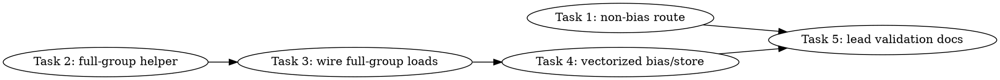

# SYCL MXFP4 Bundle4 VTune Opportunity Optimization Implementation Plan

> **For Claude:** REQUIRED SUB-SKILL: Use team-driven-development to implement this plan with agent teams.

**Goal:** Build benchmark-only bundle4 follow-up experiments that target the VTune-identified remaining load/store opportunities without promoting a runtime default.

**Architecture:** Keep production MXFP4 MoE runtime behavior unchanged and iterate only inside `tools/sycl-kernel-bench` and the benchmark-only SYCL launcher path. First add a non-bias bundle4 route to separate synthetic bias overhead from weight-load behavior, then optimize the existing bundle4 M2 benchmark kernel by combining the paired half-group A loads and vectorizing the full-tile bias/store path. Lead-only validation decides whether the optimized benchmark earns a later runtime-promotion plan.

**Tech Stack:** C++17, SYCL ESIMD DPAS/XMX, llama.cpp SYCL backend, `tools/sycl-kernel-bench`, VTune GPU Hotspots, Python source tests with pytest.

---

## Team Topology

**Recommended implementers:** 2 concurrent (based on 2 parallel tracks — execution spawns one ephemeral implementer PER TASK)
**Reviewers:** spec + quality, spawned FRESH per review (not a standing pair; see team-driven-development)

### Parallel Tracks

| Track | Tasks | Description |
|-------|-------|-------------|
| A | 1 | Add non-bias bundle4 benchmark route to isolate bias overhead. |
| B | 2, 3, 4 | Bundle4 kernel source changes: full-group load helper, kernel wiring, vectorized bias/store. |
| Lead | 5 | Lead-only synthetic, VTune, disassembly, and documentation decision. |

### Dependency Graph



### File Ownership Map

| File/Directory | Tasks | Conflict Risk |
|----------------|-------|---------------|
| `tests/test-sycl-moe-gateup-bundle4-route-source.py` | 1 | None |
| `tools/sycl-kernel-bench/kernel_registry.hpp` | 1 | None |
| `tools/sycl-kernel-bench/main.cpp` | 1 | None |
| `tests/test-sycl-moe-gateup-bundle4-fullgroup-source.py` | 2, 3, 4 | Sequential, same track |
| `ggml/src/ggml-sycl/mmvq.cpp` | 2, 3, 4 | Sequential, same track |
| `docs/backend/SYCL.md` | 5 | Lead-only |
| `docs/plans/2026-07-01-sycl-mxfp4-bundle4-vtune-opportunity-optimization.md` | 5 | Lead-only |

---

## Current Evidence and Target

Lead-owned profiling of the current bundle4 route wrote evidence to `/tmp/sycl_mxfp4_bundle4_vtune_20260701_200116`.

Fresh synthetic comparison:

| Kernel | Latency us | Bandwidth GB/s | max_abs_error |
|--------|-----------:|---------------:|--------------:|
| `mxfp4_pair_glu_xmx_tiled_packed_r8_m2_sparse32_bias` | 276.292081 | 128.099075 | 0.000000 |
| `mxfp4_pair_glu_xmx_tiled_bundle4_packed_r8_m2_sparse32_bias` | 273.661312 | 129.330521 | 0.000000 |

VTune/disassembly summary:

- Bundle4 is exact but only `0.95%` faster than the refreshed baseline.
- Baseline and bundle4 both disassemble to `dpas.8x8=4` and `send.ugm=65` with identical send comment shapes.
- Bundle4 has worse source-analysis memory read latency (`338 cycles`) than baseline (`314 cycles`) and higher estimated cycles (`500M` vs `464M`).
- Bundle4 adds address arithmetic (`add=245`, `shl=73`, `shr=69`) versus baseline (`add=228`, `shl=67`, `shr=66`) without reducing load transactions.
- The profiled route is `_sparse32_bias`, so scalar bias loads and scalar output stores are part of the measured synthetic path.

Optimization targets for this plan:

1. Add a non-bias bundle4 route so lead validation can separate production-like weight-load behavior from synthetic bias overhead.
2. Combine the M2 pair's two half-group A loads into one 16-row bundle4 group load for gate and one for up on the common full-group path.
3. Vectorize full-tile bias loads and output stores while retaining scalar fallback for tail rows.
4. Keep all routes benchmark-only and default-off; no production runtime promotion is authorized by this plan.

---

### Task 1: Add Non-Bias Bundle4 Benchmark Route

**Track:** A
**Depends on:** None
**File scope:**
- Create: `tests/test-sycl-moe-gateup-bundle4-route-source.py`
- Modify: `tools/sycl-kernel-bench/kernel_registry.hpp:157-162`
- Modify: `tools/sycl-kernel-bench/main.cpp:146-151`

**Description:**

Add `mxfp4_pair_glu_xmx_tiled_bundle4_packed_r8_m2` as a benchmark-only route that reuses the current bundle4 path with `use_bias=false` and `sparse_expert_slots=false`. This route is needed because the VTune opportunity profile used `_sparse32_bias`, which mixes bundle4 weight-load behavior with synthetic bias loads and scalar stores.

**Acceptance Criteria:**

- [ ] The new non-bias route is registered in `tools/sycl-kernel-bench/kernel_registry.hpp`.
- [ ] The new route is listed in `tools/sycl-kernel-bench/main.cpp` CLI help.
- [ ] The route name still drives `parse_moe_xmx_tiled_bundle4()` through the existing `_xmx_tiled_bundle4` substring parser at `tools/sycl-kernel-bench/benchmark_harness.hpp:127-128`.
- [ ] The route does not contain `_bias` or `_sparse32`, so existing harness parsing at `tools/sycl-kernel-bench/benchmark_harness.hpp:1241-1242` leaves `sparse_expert_slots=false` and `use_bias=false`.
- [ ] No SYCL executable, VTune, model gate, `sycl-ls`, `/dev/dri` probe, or `/Storage/GenAI/models` path is run by the implementer.

**Implementation Guide:**

1. **RED: source test for non-bias route registration**

Create `tests/test-sycl-moe-gateup-bundle4-route-source.py` with this exact content:

```python
#!/usr/bin/env python3
from __future__ import annotations

import pathlib

ROOT = pathlib.Path(__file__).resolve().parents[1]
REGISTRY = ROOT / "tools" / "sycl-kernel-bench" / "kernel_registry.hpp"
MAIN = ROOT / "tools" / "sycl-kernel-bench" / "main.cpp"
HARNESS = ROOT / "tools" / "sycl-kernel-bench" / "benchmark_harness.hpp"


def test_bundle4_non_bias_route_is_registered_and_help_listed() -> None:
    route = "mxfp4_pair_glu_xmx_tiled_bundle4_packed_r8_m2"
    registry = REGISTRY.read_text(encoding="utf-8")
    main = MAIN.read_text(encoding="utf-8")

    assert route in registry
    assert route in main
    assert "mxfp4_pair_glu_xmx_tiled_bundle4_packed_r8_m2_sparse32_bias" in registry
    assert registry.index(route) < registry.index("mxfp4_pair_glu_xmx_tiled_bundle4_packed_r8_m2_sparse32_bias")


def test_bundle4_non_bias_route_uses_existing_bundle4_parser_without_bias_or_sparse_flags() -> None:
    route = "mxfp4_pair_glu_xmx_tiled_bundle4_packed_r8_m2"
    harness = HARNESS.read_text(encoding="utf-8")

    assert "parse_moe_xmx_tiled_bundle4" in harness
    assert "const bool xmx_tiled_bundle4             = parse_moe_xmx_tiled_bundle4(config.kernel_name)" in harness
    assert "const bool sparse_expert_slots      = config.kernel_name.find(\"_sparse32\") != std::string::npos" in harness
    assert "const bool use_bias                 = config.kernel_name.find(\"_bias\") != std::string::npos" in harness
    assert "_bias" not in route
    assert "_sparse32" not in route
```

Run:

```bash
cd /Apps/llama.cpp-mxfp4-tg-runtime
python3 -m pytest tests/test-sycl-moe-gateup-bundle4-route-source.py -q
```

Expected RED output contains one failing assertion because `mxfp4_pair_glu_xmx_tiled_bundle4_packed_r8_m2` is not registered or help-listed yet.

2. **GREEN: register the route**

In `tools/sycl-kernel-bench/kernel_registry.hpp`, insert this row immediately before the existing bundle4 sparse/bias row at `tools/sycl-kernel-bench/kernel_registry.hpp:161`:

```cpp
        { "mxfp4_pair_glu_xmx_tiled_bundle4_packed_r8_m2",              GGML_LAYOUT_SOA,       KernelKind::MXFP4_PAIR_GLU          },
```

The nearby rows should become:

```cpp
        { "mxfp4_pair_glu_xmx_tiled_packed_r8_m2_sparse32_bias",       GGML_LAYOUT_SOA,       KernelKind::MXFP4_PAIR_GLU          },
        { "mxfp4_pair_glu_xmx_tiled_v2_packed_r8_m2_sparse32_bias",    GGML_LAYOUT_SOA,       KernelKind::MXFP4_PAIR_GLU          },
        { "mxfp4_pair_glu_xmx_tiled_bundle4_packed_r8_m2",             GGML_LAYOUT_SOA,       KernelKind::MXFP4_PAIR_GLU          },
        { "mxfp4_pair_glu_xmx_tiled_bundle4_packed_r8_m2_sparse32_bias", GGML_LAYOUT_SOA,       KernelKind::MXFP4_PAIR_GLU          },
```

In `tools/sycl-kernel-bench/main.cpp`, add the route to the long MXFP4 help string immediately before the existing bundle4 sparse/bias route at `tools/sycl-kernel-bench/main.cpp:150`:

```cpp
                 "mxfp4_pair_glu_xmx_tiled_bundle4_packed_r8_m2|"
```

The nearby help string should contain:

```cpp
                 "mxfp4_pair_glu_xmx_tiled_v2_packed_r8_m2_sparse32_bias|"
                 "mxfp4_pair_glu_xmx_tiled_bundle4_packed_r8_m2|"
                 "mxfp4_pair_glu_xmx_tiled_bundle4_packed_r8_m2_sparse32_bias|"
```

3. **GREEN: run source gates**

```bash
cd /Apps/llama.cpp-mxfp4-tg-runtime
python3 -m pytest tests/test-sycl-moe-gateup-bundle4-route-source.py tests/test-sycl-moe-gateup-bundle4-layout-source.py -q
git diff --check
```

Expected GREEN output:

```text
8 passed
```

The exact pytest count can be higher if other source tests are added before this task is executed; all listed tests must pass.

**Commit:**

```bash
cd /Apps/llama.cpp-mxfp4-tg-runtime
git add tests/test-sycl-moe-gateup-bundle4-route-source.py tools/sycl-kernel-bench/kernel_registry.hpp tools/sycl-kernel-bench/main.cpp
git commit -m "test(sycl): add non-bias MXFP4 bundle4 bench route"
```

**Gotchas:**

- Do not add a runtime environment variable or production dispatch path. This is a `tools/sycl-kernel-bench` route only.
- Do not run `./build/bin/sycl-kernel-bench`; lead owns executable validation.
- The current harness already parses `_bias` and `_sparse32` from the route name at `tools/sycl-kernel-bench/benchmark_harness.hpp:1241-1242`; the new route must not include those substrings.
- Keep route names ordered near the existing packed/V2/bundle4 rows so future source tests can find them easily.

---

### Task 2: Add Bundle4 Full-Group ESIMD Load Helper

**Track:** B
**Depends on:** None
**File scope:**
- Create: `tests/test-sycl-moe-gateup-bundle4-fullgroup-source.py`
- Modify: `ggml/src/ggml-sycl/mmvq.cpp:7053-7083`

**Description:**

Introduce a source-level ESIMD helper that loads a complete 16-row bundle4 group in one packed payload load and one scale load. This task does not change dispatch; it creates the building block for Task 3 and keeps the change independently reviewable.

**Acceptance Criteria:**

- [ ] A new helper named `mxfp4_xmx_tiled_bundle4_load_a_full_group_from_bundle` exists in `ggml/src/ggml-sycl/mmvq.cpp` immediately after the current `mxfp4_xmx_tiled_bundle4_load_a_vec_from_bundle` helper at `ggml/src/ggml-sycl/mmvq.cpp:7053-7083`.
- [ ] The helper is restricted to `Repeat == 8` with `static_assert(Repeat == 8, "bundle4 full-group loader is specialized for the current r8 m2 benchmark path")` because the current M2 bundle4 submit path instantiates `Repeat=8` at `ggml/src/ggml-sycl/mmvq.cpp:21910`.
- [ ] The helper uses `simd<uint8_t, 256>` for the packed payload and `simd<uint8_t, 16>` for scale bytes, matching one full 16-row group with `GGML_SYCL_MXFP4_MOE_XMX_K == 32`.
- [ ] The helper does not change any dispatch path and is benchmark-only because it remains inside `mmvq.cpp` bundle4 helper code.
- [ ] Source tests pass and the SYCL benchmark target builds; the implementer must not run the benchmark executable.

**Implementation Guide:**

1. **RED: source test for the full-group helper**

Create `tests/test-sycl-moe-gateup-bundle4-fullgroup-source.py` with this exact content:

```python
#!/usr/bin/env python3
from __future__ import annotations

import pathlib

ROOT = pathlib.Path(__file__).resolve().parents[1]
MMVQ = ROOT / "ggml" / "src" / "ggml-sycl" / "mmvq.cpp"


def slice_between(text: str, start_marker: str, end_marker: str) -> str:
    start = text.index(start_marker)
    end = text.index(end_marker, start + len(start_marker))
    return text[start:end]


def test_bundle4_full_group_loader_exists_and_loads_one_16_row_group() -> None:
    mmvq = MMVQ.read_text(encoding="utf-8")
    helper = slice_between(
        mmvq,
        "mxfp4_xmx_tiled_bundle4_load_a_full_group_from_bundle",
        "template <int Repeat>\nSYCL_ESIMD_FUNCTION inline void mxfp4_xmx_tiled_v2_load_a_vec_from_group",
    )

    assert "static_assert(Repeat == 8" in helper
    assert "constexpr int rows = 2 * Repeat" in helper
    assert "constexpr int payload_group_bytes = tile_n_total * packed_bytes" in helper
    assert "constexpr int payload_slab_bytes  = bundle_groups * payload_group_bytes" in helper
    assert "simd<uint8_t, 256> packed" in helper
    assert "simd<uint8_t, 16>  scale_bytes" in helper
    assert "block_load<uint8_t, 256>(packed_ptr)" in helper
    assert "block_load<uint8_t, 16>(scale_ptr)" in helper
    assert "for (int r = 0; r < rows; ++r)" in helper
    assert "a_vec.template select<k_per, 1>(r * k_per)" in helper
```

Run:

```bash
cd /Apps/llama.cpp-mxfp4-tg-runtime
python3 -m pytest tests/test-sycl-moe-gateup-bundle4-fullgroup-source.py -q
```

Expected RED output contains `ValueError: substring not found` because the helper does not exist yet.

2. **GREEN: add the helper**

In `ggml/src/ggml-sycl/mmvq.cpp`, insert this helper immediately after the closing brace of `mxfp4_xmx_tiled_bundle4_load_a_vec_from_bundle` and before `mxfp4_xmx_tiled_v2_load_a_vec_from_group`:

```cpp
template <int Repeat>
SYCL_ESIMD_FUNCTION inline void mxfp4_xmx_tiled_bundle4_load_a_full_group_from_bundle(
    const uint8_t *                                                                  bundle,
    int64_t                                                                          group_in_bundle,
    sycl::ext::intel::esimd::simd<int8_t, 2 * Repeat * GGML_SYCL_MXFP4_MOE_XMX_K> &  a_vec,
    sycl::ext::intel::esimd::simd<float, 2 * Repeat> &                               w_scale_vec) {
    using namespace sycl::ext::intel::esimd;
    static_assert(Repeat == 8, "bundle4 full-group loader is specialized for the current r8 m2 benchmark path");
    constexpr int k_per               = GGML_SYCL_MXFP4_MOE_XMX_K;
    constexpr int tile_n_total        = GGML_SYCL_MXFP4_MOE_XMX_N;
    constexpr int packed_bytes        = k_per / 2;
    constexpr int rows                = 2 * Repeat;
    constexpr int bundle_groups       = 4;
    constexpr int payload_group_bytes = tile_n_total * packed_bytes;
    constexpr int payload_slab_bytes  = bundle_groups * payload_group_bytes;
    constexpr int scale_slab_bytes    = tile_n_total;

    const uint8_t * packed_ptr = bundle + group_in_bundle * payload_group_bytes;
    const uint8_t * scale_ptr  = bundle + payload_slab_bytes + group_in_bundle * scale_slab_bytes;

    simd<uint8_t, 256> packed      = block_load<uint8_t, 256>(packed_ptr);
    simd<uint8_t, 16>  scale_bytes = block_load<uint8_t, 16>(scale_ptr);
    w_scale_vec                   = mxfp4_e8m0_to_fp32_esimd<rows>(scale_bytes);
#pragma unroll
    for (int r = 0; r < rows; ++r) {
        simd<uint8_t, packed_bytes> row = packed.template select<packed_bytes, 1>(r * packed_bytes);
        simd<uint8_t, k_per>        codes;
        codes.template select<packed_bytes, 1>(0)            = row & uint8_t{ 0x0f };
        codes.template select<packed_bytes, 1>(packed_bytes) = row >> 4;
        a_vec.template select<k_per, 1>(r * k_per)           = mxfp4_code_values_esimd<k_per>(codes);
    }
}
```

3. **GREEN: run source and build-only gates**

```bash
cd /Apps/llama.cpp-mxfp4-tg-runtime
python3 -m pytest tests/test-sycl-moe-gateup-bundle4-fullgroup-source.py tests/test-sycl-moe-gateup-bundle4-layout-source.py -q
set +u
source /opt/intel/oneapi/setvars.sh --force
set -u
./scripts/sycl-build.sh sycl-kernel-bench
git diff --check
```

Expected GREEN output:

```text
source tests passed
[24/24] Linking CXX executable bin/sycl-kernel-bench
```

Warnings from existing SYCL kernels are acceptable if the final build target succeeds.

**Commit:**

```bash
cd /Apps/llama.cpp-mxfp4-tg-runtime
git add tests/test-sycl-moe-gateup-bundle4-fullgroup-source.py ggml/src/ggml-sycl/mmvq.cpp
git commit -m "test(sycl): add bundle4 full-group load helper contract"
```

**Gotchas:**

- The helper is intentionally specialized for `Repeat=8`; do not generalize it until a benchmark requires another repeat value.
- `simd<uint8_t, 256>` and `simd<uint8_t, 16>` are source-level expectations for the common 16-row group. If the compiler later lowers them to more than one send, Task 5 VTune will catch that.
- Do not remove the existing half-group helper; Task 3 needs it as a tail/fallback path.
- Do not run `./build/bin/sycl-kernel-bench`; only the build target is allowed for implementers.

---

### Task 3: Wire Full-Group Loads Into Bundle4 M2 Kernel

**Track:** B
**Depends on:** Task 2
**File scope:**
- Modify: `tests/test-sycl-moe-gateup-bundle4-fullgroup-source.py`
- Modify: `ggml/src/ggml-sycl/mmvq.cpp:9383-9484`

**Description:**

Use the full-group helper in the common M2 bundle4 path where `tile_m0` and `tile_m1` are the two halves of the same 16-row group. Keep a fail-safe fallback to the existing half-group loader for tail or non-standard shapes so correctness stays conservative.

**Acceptance Criteria:**

- [ ] `mxfp4_pair_glu_xmx_tiled_bundle4_dpas_m2_sycl` computes a `use_full_group_load` boolean before the `kt` loop.
- [ ] The full-group path calls `mxfp4_xmx_tiled_bundle4_load_a_full_group_from_bundle<Repeat>` exactly once for gate and once for up per `kt` iteration.
- [ ] The full-group path selects the first half and second half into `gate_a_vec0`, `gate_a_vec1`, `up_a_vec0`, and `up_a_vec1` instead of calling the half-group loader four times.
- [ ] The fallback path still calls `mxfp4_xmx_tiled_bundle4_load_a_vec_from_bundle<Repeat>` and is used when `use_full_group_load` is false.
- [ ] Existing validation remains fail-closed for bundle4/V2 mutual exclusion at `ggml/src/ggml-sycl/mmvq.cpp:21554-21564` and `ggml/src/ggml-sycl/mmvq.cpp:21896-21916`.

**Implementation Guide:**

1. **RED: extend source tests for full-group kernel wiring**

Append this test to `tests/test-sycl-moe-gateup-bundle4-fullgroup-source.py`:

```python

def test_bundle4_kernel_uses_full_group_loader_with_half_group_fallback() -> None:
    mmvq = MMVQ.read_text(encoding="utf-8")
    kernel = slice_between(
        mmvq,
        "mxfp4_pair_glu_xmx_tiled_bundle4_dpas_m2_sycl",
        "static sycl::event mxfp4_pair_glu_xmx_tiled_dpas_m2_sycl",
    )

    assert "const bool use_full_group_load" in kernel
    assert "xmx_group_n0 == xmx_group_n1" in kernel
    assert "xmx_row_in_group0 == 0" in kernel
    assert "xmx_row_in_group1 == Repeat" in kernel
    assert "mxfp4_xmx_tiled_bundle4_load_a_full_group_from_bundle<Repeat>" in kernel
    assert "gate_a_vec_full.template select<an, 1>(0)" in kernel
    assert "gate_a_vec_full.template select<an, 1>(an)" in kernel
    assert "up_a_vec_full.template select<an, 1>(0)" in kernel
    assert "up_a_vec_full.template select<an, 1>(an)" in kernel
    assert "if (use_full_group_load)" in kernel
    assert "else" in kernel
    fallback = kernel[kernel.index("else"):kernel.index("simd<int, Repeat * exec_n> gate_part0")]
    assert "mxfp4_xmx_tiled_bundle4_load_a_vec_from_bundle<Repeat>" in fallback
```

Run:

```bash
cd /Apps/llama.cpp-mxfp4-tg-runtime
python3 -m pytest tests/test-sycl-moe-gateup-bundle4-fullgroup-source.py -q
```

Expected RED output contains a failing assertion for `use_full_group_load` or the full-group helper call in the kernel.

2. **GREEN: compute the full-group eligibility before the `kt` loop**

In `ggml/src/ggml-sycl/mmvq.cpp`, inside `mxfp4_pair_glu_xmx_tiled_bundle4_dpas_m2_sycl` after the existing bundle/group offset calculations at `ggml/src/ggml-sycl/mmvq.cpp:9406-9424`, add:

```cpp
                const bool use_full_group_load = have_m1 && tile_n_total == 2 * Repeat && xmx_group_n0 == xmx_group_n1 &&
                                                 xmx_bundle_n0 == xmx_bundle_n1 &&
                                                 xmx_group_in_bundle0 == xmx_group_in_bundle1 &&
                                                 xmx_row_in_group0 == 0 && xmx_row_in_group1 == Repeat;
```

3. **GREEN: replace the four half-group loads with a full-group branch**

Inside the `for (int64_t kt = 0; kt < k_tiles; ++kt)` loop, replace the current block that declares `gate_a_vec0`, `up_a_vec0`, `gate_w_scale0`, `up_w_scale0`, calls the two half-group loaders for tile 0, performs tile 0 DPAS, then conditionally declares tile 1 vectors and calls the two half-group loaders for tile 1. Use this structure:

```cpp
                    simd<int8_t, an>    gate_a_vec0;
                    simd<int8_t, an>    up_a_vec0;
                    simd<float, Repeat> gate_w_scale0;
                    simd<float, Repeat> up_w_scale0;
                    simd<int8_t, an>    gate_a_vec1;
                    simd<int8_t, an>    up_a_vec1;
                    simd<float, Repeat> gate_w_scale1;
                    simd<float, Repeat> up_w_scale1;

                    if (use_full_group_load) {
                        simd<int8_t, 2 * an>    gate_a_vec_full;
                        simd<int8_t, 2 * an>    up_a_vec_full;
                        simd<float, 2 * Repeat> gate_w_scale_full;
                        simd<float, 2 * Repeat> up_w_scale_full;
                        mxfp4_xmx_tiled_bundle4_load_a_full_group_from_bundle<Repeat>(
                            gate_bundle0, xmx_group_in_bundle0, gate_a_vec_full, gate_w_scale_full);
                        mxfp4_xmx_tiled_bundle4_load_a_full_group_from_bundle<Repeat>(
                            up_bundle0, xmx_group_in_bundle0, up_a_vec_full, up_w_scale_full);
                        gate_a_vec0    = gate_a_vec_full.template select<an, 1>(0);
                        up_a_vec0      = up_a_vec_full.template select<an, 1>(0);
                        gate_w_scale0  = gate_w_scale_full.template select<Repeat, 1>(0);
                        up_w_scale0    = up_w_scale_full.template select<Repeat, 1>(0);
                        gate_a_vec1    = gate_a_vec_full.template select<an, 1>(an);
                        up_a_vec1      = up_a_vec_full.template select<an, 1>(an);
                        gate_w_scale1  = gate_w_scale_full.template select<Repeat, 1>(Repeat);
                        up_w_scale1    = up_w_scale_full.template select<Repeat, 1>(Repeat);
                    } else {
                        mxfp4_xmx_tiled_bundle4_load_a_vec_from_bundle<Repeat>(
                            gate_bundle0, xmx_group_in_bundle0, xmx_row_in_group0, gate_a_vec0, gate_w_scale0);
                        mxfp4_xmx_tiled_bundle4_load_a_vec_from_bundle<Repeat>(
                            up_bundle0, xmx_group_in_bundle0, xmx_row_in_group0, up_a_vec0, up_w_scale0);
                        if (have_m1) {
                            mxfp4_xmx_tiled_bundle4_load_a_vec_from_bundle<Repeat>(
                                gate_bundle1, xmx_group_in_bundle1, xmx_row_in_group1, gate_a_vec1, gate_w_scale1);
                            mxfp4_xmx_tiled_bundle4_load_a_vec_from_bundle<Repeat>(
                                up_bundle1, xmx_group_in_bundle1, xmx_row_in_group1, up_a_vec1, up_w_scale1);
                        }
                    }
```

Keep the existing tile 0 DPAS and tile 1 `if (have_m1)` DPAS logic after this load block. The tile 1 DPAS must use `gate_a_vec1`, `up_a_vec1`, `gate_w_scale1`, and `up_w_scale1` populated by either branch.

4. **GREEN: run source and build-only gates**

```bash
cd /Apps/llama.cpp-mxfp4-tg-runtime
python3 -m pytest tests/test-sycl-moe-gateup-bundle4-fullgroup-source.py tests/test-sycl-moe-gateup-bundle4-layout-source.py -q
set +u
source /opt/intel/oneapi/setvars.sh --force
set -u
./scripts/sycl-build.sh sycl-kernel-bench
git diff --check
```

Expected GREEN output:

```text
source tests passed
[24/24] Linking CXX executable bin/sycl-kernel-bench
```

**Commit:**

```bash
cd /Apps/llama.cpp-mxfp4-tg-runtime
git add tests/test-sycl-moe-gateup-bundle4-fullgroup-source.py ggml/src/ggml-sycl/mmvq.cpp
git commit -m "feat(sycl): use full-group loads in MXFP4 bundle4 bench kernel"
```

**Gotchas:**

- The full-group path must be guarded. Do not read the second half of a partial tail group unless `have_m1` is true and the row offsets prove both halves are in the same 16-row group.
- Keep `gate_bundle1` and `up_bundle1` variables for fallback; do not remove tail correctness to save a few lines.
- Do not change `ggml_sycl_mxfp4_pair_glu_bench_launch` validation in a way that accepts V2 plus bundle4 together. The existing `!args.xmx_tiled_v2` checks are required.
- Do not run the benchmark executable. The lead validates runtime behavior in Task 5.

---

### Task 4: Vectorize Bundle4 Full-Tile Bias Loads and Output Stores

**Track:** B
**Depends on:** Task 3
**File scope:**
- Modify: `tests/test-sycl-moe-gateup-bundle4-fullgroup-source.py`
- Modify: `ggml/src/ggml-sycl/mmvq.cpp:9507-9546`

**Description:**

Reduce scalar memory instructions in the `_bias` bundle4 route by vectorizing full-tile bias loads and output stores. The helper keeps a scalar fallback for tail rows, so correctness remains safe for non-multiple-of-8 row counts.

**Acceptance Criteria:**

- [ ] A helper named `mxfp4_bundle4_store_glu_tile` exists before `mxfp4_pair_glu_xmx_tiled_bundle4_dpas_m2_sycl`.
- [ ] The helper uses `block_load<float, Repeat>` for gate and up bias only when the tile is full.
- [ ] The helper uses `block_store<float, Repeat>` for full-tile output stores.
- [ ] The helper retains scalar `block_store<float, 1>` fallback for tail rows.
- [ ] The bundle4 kernel calls `mxfp4_bundle4_store_glu_tile<Repeat, GLU_OP>` for tile 0 and tile 1 instead of keeping duplicate scalar output loops inline.
- [ ] Source tests pass and the SYCL benchmark target builds; the implementer must not run the benchmark executable.

**Implementation Guide:**

1. **RED: extend source tests for vectorized bias/store**

Append this test to `tests/test-sycl-moe-gateup-bundle4-fullgroup-source.py`:

```python

def test_bundle4_kernel_vectorizes_full_tile_bias_loads_and_output_stores() -> None:
    mmvq = MMVQ.read_text(encoding="utf-8")
    helper = slice_between(
        mmvq,
        "mxfp4_bundle4_store_glu_tile",
        "template <int Repeat, int GLU_OP, bool Prefetch>\nstatic sycl::event mxfp4_pair_glu_xmx_tiled_bundle4_dpas_m2_sycl",
    )
    kernel = slice_between(
        mmvq,
        "mxfp4_pair_glu_xmx_tiled_bundle4_dpas_m2_sycl",
        "static sycl::event mxfp4_pair_glu_xmx_tiled_dpas_m2_sycl",
    )

    assert "const bool full_tile = row_start + Repeat <= nrows_per_expert" in helper
    assert "block_load<float, Repeat>(gate_bias_row)" in helper
    assert "block_load<float, Repeat>(up_bias_row)" in helper
    assert "block_store<float, Repeat>(dst_out + row_start, values)" in helper
    assert "block_store<float, 1>(dst_out + row, simd<float, 1>(values[r]))" in helper
    assert "mxfp4_bundle4_store_glu_tile<Repeat, GLU_OP>(" in kernel
    assert kernel.count("mxfp4_bundle4_store_glu_tile<Repeat, GLU_OP>(") == 2
```

Run:

```bash
cd /Apps/llama.cpp-mxfp4-tg-runtime
python3 -m pytest tests/test-sycl-moe-gateup-bundle4-fullgroup-source.py -q
```

Expected RED output contains `ValueError: substring not found` because `mxfp4_bundle4_store_glu_tile` does not exist yet.

2. **GREEN: add the vectorized store helper**

Insert this helper immediately before `template <int Repeat, int GLU_OP, bool Prefetch> static sycl::event mxfp4_pair_glu_xmx_tiled_bundle4_dpas_m2_sycl` at `ggml/src/ggml-sycl/mmvq.cpp:9347`:

```cpp
template <int Repeat, int GLU_OP>
SYCL_ESIMD_FUNCTION inline void mxfp4_bundle4_store_glu_tile(float *                                dst_out,
                                                             sycl::ext::intel::esimd::simd<float, Repeat> gate_acc,
                                                             sycl::ext::intel::esimd::simd<float, Repeat> up_acc,
                                                             const float *                         gate_bias,
                                                             const float *                         up_bias,
                                                             int64_t                               gate_bias_nb1,
                                                             int64_t                               up_bias_nb1,
                                                             int32_t                               expert_id,
                                                             int                                   row_start,
                                                             int                                   nrows_per_expert,
                                                             float                                 alpha,
                                                             float                                 limit) {
    using namespace sycl::ext::intel::esimd;
    const bool full_tile = row_start + Repeat <= nrows_per_expert;
    simd<float, Repeat> gate_values = gate_acc;
    simd<float, Repeat> up_values   = up_acc;
    if (full_tile && gate_bias) {
        const float * gate_bias_row = reinterpret_cast<const float *>(
            reinterpret_cast<const char *>(gate_bias) + static_cast<int64_t>(expert_id) * gate_bias_nb1 +
            static_cast<int64_t>(row_start) * sizeof(float));
        gate_values += block_load<float, Repeat>(gate_bias_row);
    }
    if (full_tile && up_bias) {
        const float * up_bias_row = reinterpret_cast<const float *>(
            reinterpret_cast<const char *>(up_bias) + static_cast<int64_t>(expert_id) * up_bias_nb1 +
            static_cast<int64_t>(row_start) * sizeof(float));
        up_values += block_load<float, Repeat>(up_bias_row);
    }

    simd<float, Repeat> values;
#pragma unroll
    for (int r = 0; r < Repeat; ++r) {
        float gate_value = gate_values[r];
        float up_value   = up_values[r];
        const int row    = row_start + r;
        if (!full_tile && row < nrows_per_expert) {
            if (gate_bias) {
                gate_value += *(const float *) ((const char *) gate_bias + static_cast<int64_t>(expert_id) * gate_bias_nb1 +
                                                static_cast<int64_t>(row) * sizeof(float));
            }
            if (up_bias) {
                up_value += *(const float *) ((const char *) up_bias + static_cast<int64_t>(expert_id) * up_bias_nb1 +
                                              static_cast<int64_t>(row) * sizeof(float));
            }
        }
        values[r] = mmvq_moe_apply_pair_glu_esimd<GLU_OP>(gate_value, up_value, alpha, limit);
    }

    if (full_tile) {
        block_store<float, Repeat>(dst_out + row_start, values);
    } else {
#pragma unroll
        for (int r = 0; r < Repeat; ++r) {
            const int row = row_start + r;
            if (row < nrows_per_expert) {
                block_store<float, 1>(dst_out + row, simd<float, 1>(values[r]));
            }
        }
    }
}
```

3. **GREEN: replace the bundle4 kernel output loops**

In `mxfp4_pair_glu_xmx_tiled_bundle4_dpas_m2_sycl`, replace the two scalar output sections at `ggml/src/ggml-sycl/mmvq.cpp:9507-9546` with:

```cpp
                mxfp4_bundle4_store_glu_tile<Repeat, GLU_OP>(
                    dst_out, gate_acc0, up_acc0, gate_bias, up_bias, gate_bias_nb1, up_bias_nb1, expert_id,
                    static_cast<int>(tile_m0) * Repeat, nrows_per_expert, alpha, limit);
                if (have_m1) {
                    mxfp4_bundle4_store_glu_tile<Repeat, GLU_OP>(
                        dst_out, gate_acc1, up_acc1, gate_bias, up_bias, gate_bias_nb1, up_bias_nb1, expert_id,
                        static_cast<int>(tile_m1) * Repeat, nrows_per_expert, alpha, limit);
                }
```

Do not change the baseline, V2, direct, grouped, or split kernels in this task.

4. **GREEN: run source and build-only gates**

```bash
cd /Apps/llama.cpp-mxfp4-tg-runtime
python3 -m pytest tests/test-sycl-moe-gateup-bundle4-fullgroup-source.py tests/test-sycl-moe-gateup-bundle4-layout-source.py -q
set +u
source /opt/intel/oneapi/setvars.sh --force
set -u
./scripts/sycl-build.sh sycl-kernel-bench
git diff --check
```

Expected GREEN output:

```text
source tests passed
[24/24] Linking CXX executable bin/sycl-kernel-bench
```

**Commit:**

```bash
cd /Apps/llama.cpp-mxfp4-tg-runtime
git add tests/test-sycl-moe-gateup-bundle4-fullgroup-source.py ggml/src/ggml-sycl/mmvq.cpp
git commit -m "feat(sycl): vectorize MXFP4 bundle4 bias and store path"
```

**Gotchas:**

- The scalar fallback is required for tail rows. Do not use a vector store when `row_start + Repeat > nrows_per_expert`.
- Bias pointers are optional. Do not call `block_load<float, Repeat>` when `gate_bias` or `up_bias` is null.
- This task intentionally optimizes only the bundle4 benchmark kernel. Do not alter baseline or V2 kernels, because Task 5 needs a stable comparison.
- Do not run `./build/bin/sycl-kernel-bench`; lead owns executable validation.

---

### Task 5: Lead-Only Synthetic, VTune, Disassembly, and Documentation Decision

**Track:** Lead
**Depends on:** Task 1, Task 4
**File scope:**
- Modify: `docs/backend/SYCL.md`
- Modify: `docs/plans/2026-07-01-sycl-mxfp4-bundle4-vtune-opportunity-optimization.md`

**Description:**

Run lead-owned executable validation for the non-bias route and optimized bundle4 kernel. Compare baseline, non-bias bundle4, and sparse/bias bundle4 with synthetic correctness, VTune compute/memory counters, and ocloc disassembly; then document whether the follow-up benchmark is rejected or earns a later runtime-promotion plan.

**Acceptance Criteria:**

- [ ] Source tests and `./scripts/sycl-build.sh sycl-kernel-bench` pass after sourcing oneAPI with `set +u`.
- [ ] A fresh evidence directory `/tmp/sycl_mxfp4_bundle4_opportunities_YYYYMMDD_HHMMSS` contains synthetic JSON, stderr, VTune reports, disassembly, and parser summaries.
- [ ] Synthetic comparison includes `mxfp4_pair_glu_xmx_tiled_packed_r8_m2_sparse32_bias`, `mxfp4_pair_glu_xmx_tiled_bundle4_packed_r8_m2`, and `mxfp4_pair_glu_xmx_tiled_bundle4_packed_r8_m2_sparse32_bias`.
- [ ] All benchmark rows have `max_abs_error == 0.0`; if any row is not exact, stop and document `bundle4-opportunity-rejected-correctness`.
- [ ] Disassembly summaries record `dpas.8x8`, `send.ugm`, send comments, and scalar/vector store comment counts for baseline and bundle4.
- [ ] VTune output records compute-extended and memory-latency evidence with the explicit adapter caveat if VTune labels the target as B580 while `ONEAPI_DEVICE_SELECTOR=level_zero:1`.
- [ ] Documentation states `bundle4-opportunity-runtime-followup-authorized` only if optimized bundle4 is at least `10%` faster than refreshed baseline and exact; otherwise it states `bundle4-opportunity-rejected`.

**Implementation Guide:**

1. **Run safe source/build gates first**

```bash
cd /Apps/llama.cpp-mxfp4-tg-runtime
python3 -m pytest \
  tests/test-sycl-moe-gateup-bundle4-route-source.py \
  tests/test-sycl-moe-gateup-bundle4-fullgroup-source.py \
  tests/test-sycl-moe-gateup-bundle4-layout-source.py \
  tests/test-sycl-vtune-asm-parser.py -q
set +u
source /opt/intel/oneapi/setvars.sh --force
set -u
./scripts/sycl-build.sh sycl-kernel-bench
```

Expected output includes all pytest tests passing and:

```text
[24/24] Linking CXX executable bin/sycl-kernel-bench
```

2. **Run synthetic comparison**

```bash
cd /Apps/llama.cpp-mxfp4-tg-runtime
OUT=/tmp/sycl_mxfp4_bundle4_opportunities_$(date +%Y%m%d_%H%M%S)
mkdir -p "$OUT"
set +u
source /opt/intel/oneapi/setvars.sh --force
set -u
ONEAPI_DEVICE_SELECTOR=level_zero:1 ./build/bin/sycl-kernel-bench \
  --kernel=mxfp4_pair_glu_xmx_tiled_packed_r8_m2_sparse32_bias,mxfp4_pair_glu_xmx_tiled_bundle4_packed_r8_m2,mxfp4_pair_glu_xmx_tiled_bundle4_packed_r8_m2_sparse32_bias \
  --quant=MXFP4 --dim_m=2880 --dim_n=4 --dim_k=2880 \
  --iterations=1000 --warmup=100 --validate --output=json \
  > "$OUT/compare.json" 2> "$OUT/compare.stderr"
printf '%s\n' "$OUT"
python3 - <<'PY' "$OUT/compare.json"
import json
import sys
text = open(sys.argv[1], encoding="utf-8").read()
decoder = json.JSONDecoder()
idx = 0
records = []
while idx < len(text):
    while idx < len(text) and text[idx].isspace():
        idx += 1
    if idx >= len(text):
        break
    obj, end = decoder.raw_decode(text, idx)
    records.append(obj)
    idx = end
for row in records:
    print(row["kernel"], f"latency_us={row['latency_us']:.6f}", f"max_abs_error={row['max_abs_error']:.6f}")
if any(row.get("max_abs_error") != 0.0 for row in records):
    raise SystemExit("bundle4 opportunity correctness failed")
PY
```

Expected: three rows print and every `max_abs_error` is `0.000000`.

3. **Run VTune compute and memory-latency collections**

Use explicit `target-gpu=0:7:0.0` to avoid mixed-adapter metric-set failures observed in `/tmp/sycl_mxfp4_bundle4_vtune_20260701_200116`.

```bash
cd /Apps/llama.cpp-mxfp4-tg-runtime
for mode in compute-extended mem-latency; do
  for name in baseline bundle4_nonbias bundle4_bias; do
    case "$name" in
      baseline) K=mxfp4_pair_glu_xmx_tiled_packed_r8_m2_sparse32_bias ;;
      bundle4_nonbias) K=mxfp4_pair_glu_xmx_tiled_bundle4_packed_r8_m2 ;;
      bundle4_bias) K=mxfp4_pair_glu_xmx_tiled_bundle4_packed_r8_m2_sparse32_bias ;;
    esac
    R="$OUT/vtune_${mode}_${name}"
    rm -rf "$R"
    if [ "$mode" = compute-extended ]; then
      ONEAPI_DEVICE_SELECTOR=level_zero:1 vtune -collect gpu-hotspots \
        -knob target-gpu=0:7:0.0 \
        -knob gpu-profiling-mode=characterization \
        -knob characterization-mode=compute-extended \
        -knob dump-compute-task-binaries=true \
        -result-dir "$R" \
        -- ./build/bin/sycl-kernel-bench \
          --kernel="$K" --quant=MXFP4 --dim_m=2880 --dim_n=4 --dim_k=2880 \
          --iterations=1000 --warmup=100 --validate --output=json \
          > "$OUT/${mode}_${name}.stdout" 2> "$OUT/${mode}_${name}.stderr"
    else
      ONEAPI_DEVICE_SELECTOR=level_zero:1 vtune -collect gpu-hotspots \
        -knob target-gpu=0:7:0.0 \
        -knob gpu-profiling-mode=source-analysis \
        -knob source-analysis=mem-latency \
        -knob dump-compute-task-binaries=true \
        -result-dir "$R" \
        -- ./build/bin/sycl-kernel-bench \
          --kernel="$K" --quant=MXFP4 --dim_m=2880 --dim_n=4 --dim_k=2880 \
          --iterations=1000 --warmup=100 --validate --output=json \
          > "$OUT/${mode}_${name}.stdout" 2> "$OUT/${mode}_${name}.stderr"
    fi
    vtune -report hotspots -group-by computing-task -r "$R" -format csv > "$OUT/${mode}_${name}.computing-task.csv"
    vtune -report summary -r "$R" -format text > "$OUT/${mode}_${name}.summary.txt"
  done
done
```

4. **Disassemble active kernels and parse assembly**

```bash
cd /Apps/llama.cpp-mxfp4-tg-runtime
for name in baseline bundle4_nonbias bundle4_bias; do
  R="$OUT/vtune_compute-extended_$name"
  D="$OUT/disasm_$name"
  rm -rf "$D"
  mkdir -p "$D"
  i=0
  for z in "$R"/data.0/*.zebin; do
    i=$((i + 1))
    sub="$D/zebin_$i"
    mkdir -p "$sub"
    cp "$z" "$sub/kernel.zebin"
    (cd "$sub" && ocloc disasm -file kernel.zebin > ocloc.stdout 2> ocloc.stderr || true)
  done
  case "$name" in
    baseline)
      asm=$(find "$D" -type f -name '*mxfp4_pair_glu_xmx_tiled_dpas_m2_kernelILi8ELi3ELb0EE.asm' | head -n 1)
      ;;
    bundle4_nonbias|bundle4_bias)
      asm=$(find "$D" -type f -name '*mxfp4_pair_glu_xmx_tiled_bundle4_dpas_m2_kernelILi8ELi3ELb0EE.asm' | head -n 1)
      ;;
  esac
  printf '%s=%s\n' "$name" "$asm" >> "$OUT/asm_paths.txt"
  scripts/parse-sycl-vtune-kernel-asm.py --asm "$asm" > "$OUT/${name}.asm.summary.json"
done
```

Expected: each summary has `dpas.8x8` present. The optimized bundle4 bias route should show fewer scalar load/store send comments than the pre-plan evidence if Tasks 3 and 4 were effective.

5. **Document decision**

Append a subsection to `docs/backend/SYCL.md` near the existing bundle4 rejection notes. Include:

- evidence directory path,
- synthetic latency and `max_abs_error` for all three kernels,
- whether non-bias bundle4 changes the conclusion,
- compute-extended XMX active and memory read bandwidth for the active kernel rows,
- mem-latency average read cycles,
- disassembly counts for `dpas.8x8`, `send.ugm`, and send comments,
- VTune adapter-label caveat if present,
- decision string: `bundle4-opportunity-runtime-followup-authorized` or `bundle4-opportunity-rejected`.

Append a `## Validation Results` section to this plan with the same information.

6. **Final safe gates and commit**

```bash
cd /Apps/llama.cpp-mxfp4-tg-runtime
python3 -m pytest \
  tests/test-sycl-moe-gateup-bundle4-route-source.py \
  tests/test-sycl-moe-gateup-bundle4-fullgroup-source.py \
  tests/test-sycl-moe-gateup-bundle4-layout-source.py \
  tests/test-sycl-vtune-asm-parser.py -q
git diff --check
git add docs/backend/SYCL.md docs/plans/2026-07-01-sycl-mxfp4-bundle4-vtune-opportunity-optimization.md
git commit -m "docs(sycl): record MXFP4 bundle4 VTune opportunity evidence"
```

Expected: pytest passes, `git diff --check` emits no output, and the docs commit succeeds.

**Gotchas:**

- Only the lead may run `sycl-kernel-bench`, VTune, B50/B580 selectors, model gates, `sycl-ls`, `/dev/dri` probes, or `/Storage/GenAI/models` paths.
- Use `set +u` before sourcing oneAPI; restore `set -u` afterward.
- If VTune labels the adapter as `Battlemage G21 [Arc B580]` while the command used `ONEAPI_DEVICE_SELECTOR=level_zero:1`, document the caveat and avoid B50-specific absolute VTune claims.
- A benchmark win does not authorize production runtime promotion. It authorizes a new reviewed runtime plan only if the `10%` speedup gate and correctness gate pass.
- Restore `.beads/beads.db` after tracker operations unless intentionally committing tracker updates.

---

## Validation Results

Lead-owned Task 5 validation recorded evidence in
`/tmp/sycl_mxfp4_bundle4_opportunities_20260701_221449`.

Source/build gates:

- `python3 -m pytest tests/test-sycl-moe-gateup-bundle4-route-source.py tests/test-sycl-moe-gateup-bundle4-fullgroup-source.py tests/test-sycl-moe-gateup-bundle4-layout-source.py tests/test-sycl-vtune-asm-parser.py -q`:
  `13 passed`.
- `set +u; source /opt/intel/oneapi/setvars.sh --force; set -u; ./scripts/sycl-build.sh sycl-kernel-bench`:
  linked `bin/sycl-kernel-bench` successfully.

Synthetic comparison (`--dim_m=2880 --dim_n=4 --dim_k=2880 --iterations=1000 --warmup=100 --validate`):

| Kernel | Latency us | Bandwidth GB/s | max_abs_error | Speedup vs baseline |
|--------|-----------:|---------------:|--------------:|--------------------:|
| `mxfp4_pair_glu_xmx_tiled_packed_r8_m2_sparse32_bias` | `272.495794` | `129.883693` | `0.000000` | `1.000000` (`0.00%`) |
| `mxfp4_pair_glu_xmx_tiled_bundle4_packed_r8_m2` | `249.225306` | `141.641315` | `0.000000` | `1.093371` (`9.34%`) |
| `mxfp4_pair_glu_xmx_tiled_bundle4_packed_r8_m2_sparse32_bias` | `251.723551` | `140.601703` | `0.000000` | `1.082520` (`8.25%`) |

The fastest optimized bundle4 route is exact but below the required `10%`
speedup gate, so this plan records `bundle4-opportunity-rejected`, not
`bundle4-opportunity-runtime-followup-authorized`.

VTune caveat: collections used `ONEAPI_DEVICE_SELECTOR=level_zero:1` and
`-knob target-gpu=0:7:0.0`, but VTune summaries label the target as
`Battlemage G21 [Arc B580]`; use these as relative benchmark/disassembly
evidence only and avoid B50-specific absolute VTune claims.

VTune compute-extended active-kernel rows:

| Route | Average time s | XMX active % | Memory read bandwidth GB/s | Memory write bandwidth GB/s |
|-------|---------------:|-------------:|----------------------------:|-----------------------------:|
| baseline | `0.000275` | `0.0` | `0.0` | `0.0` |
| bundle4 non-bias | `0.000254` | `0.0` | `0.0` | `0.0` |
| bundle4 sparse/bias | `0.000255` | `6.9` | `224.411295` | `0.515634` |

The zeroed baseline and non-bias compute-extended counter rows are kept as
collected evidence and are not treated as proof of no XMX or no memory traffic;
ocloc disassembly below remains the XMX proof source.

VTune mem-latency active-kernel rows:

| Route | Average time s | Read latency cycles | Estimated GPU cycles |
|-------|---------------:|--------------------:|---------------------:|
| baseline | `0.000331` | `318` | `469561326` |
| bundle4 non-bias | `0.000312` | `526` | `479885090` |
| bundle4 sparse/bias | `0.000304` | `471` | `432343346` |

ocloc assembly summaries for active kernels:

| Route | `dpas.8x8` | `send.ugm` | Spill memory | Scalar store comments | Vector store comments |
|-------|-----------:|-----------:|-------------:|----------------------:|----------------------:|
| baseline | `4` | `65` | `0` | `16` | `0` |
| bundle4 non-bias | `4` | `75` | `0` | `16` | `2` |
| bundle4 sparse/bias | `4` | `75` | `0` | `16` | `2` |

Send-comment details are stored in `baseline.asm_summary.json`,
`bundle4_nonbias.asm_summary.json`, and `bundle4_bias.asm_summary.json` under
the evidence directory. The optimized route emits vector-store comments for the
full-tile path, but static assembly still includes scalar store comments for the
retained tail fallback and total `send.ugm` increased versus baseline.

Decision: `bundle4-opportunity-rejected`. No runtime route, default-on behavior,
production promotion, graphlet route, or persistent duplicate gate/up layout is
authorized by this evidence.

## Final Review Checklist

- [x] Task 1 non-bias route source tests pass.
- [x] Task 2 full-group helper source tests pass.
- [x] Task 3 full-group load wiring source tests pass and build-only gate succeeds.
- [x] Task 4 vectorized bias/store source tests pass and build-only gate succeeds.
- [x] Task 5 lead synthetic correctness passes or records a rejection.
- [x] Runtime defaults remain unchanged.
- [x] No production environment variable is added.
- [x] No persistent duplicate gate/up VRAM layout is added to production runtime.
- [x] Unified-cache `mem_handle` ownership rules remain untouched.
- [x] `git diff --check` passes.
