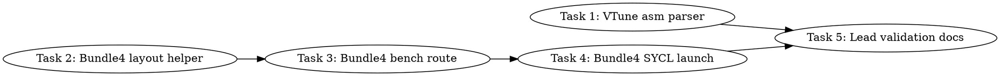

# SYCL MXFP4 Gate/Up Bundle-4 Layout Optimization Implementation Plan

> **For Claude:** REQUIRED SUB-SKILL: Use team-driven-development to implement this plan with agent teams.

**Goal:** Build and validate a benchmark-only MXFP4 gate/up load-layout candidate that targets the VTune-identified memory/load bottleneck without promoting any new runtime default.

**Architecture:** Keep the existing production packed-Q8 M2 gate/up route unchanged while adding a synthetic `bundle4` benchmark candidate. The candidate preserves the current 272-byte-per-XMX-row-group footprint over four groups, but reorders each four-group bundle so every 256-byte payload slab is naturally aligned and the four 16-byte scale slabs are packed together at the end of the bundle.

**Tech Stack:** C++17, SYCL ESIMD DPAS/XMX, llama.cpp SYCL backend, `tools/sycl-kernel-bench`, Python source/parser tests with pytest.

---

## Team Topology

**Recommended implementers:** 2 concurrent (based on 2 parallel tracks — execution spawns one ephemeral implementer PER TASK)
**Reviewers:** spec + quality, spawned FRESH per review (not a standing pair; see team-driven-development)

### Parallel Tracks

| Track | Tasks | Description |
|-------|-------|-------------|
| A | 1 | VTune assembly/instruction parser guardrails |
| B | 2, 3, 4 | Bundle-4 benchmark candidate, staged from host layout to SYCL launch |
| Lead | 5 | Lead-only synthetic/VTune validation and documentation decision |

### Dependency Graph



### File Ownership Map

| File/Directory | Tasks | Conflict Risk |
|----------------|-------|---------------|
| `scripts/parse-sycl-vtune-kernel-asm.py` | 1 | None |
| `tests/test-sycl-vtune-asm-parser.py` | 1 | None |
| `tests/test-sycl-moe-gateup-bundle4-layout-source.py` | 2, 3, 4 | Sequential, same track |
| `tools/sycl-kernel-bench/kernels/reference/mxfp4_inline_dot.cpp` | 2, 3 | Sequential, same track |
| `tools/sycl-kernel-bench/kernels/reference/reference_kernels.hpp` | 3 | None after Task 2 |
| `tools/sycl-kernel-bench/benchmark_harness.hpp` | 3 | None after Task 2 |
| `tools/sycl-kernel-bench/kernel_registry.hpp` | 3 | None after Task 2 |
| `tools/sycl-kernel-bench/main.cpp` | 3 | None after Task 2 |
| `ggml/src/ggml-sycl/ggml-sycl-bench.hpp` | 3, 4 | Sequential, same track |
| `ggml/src/ggml-sycl/mmvq.cpp` | 4 | None after Task 3 |
| `docs/backend/SYCL.md` | 5 | Lead-only |
| `docs/plans/2026-07-01-sycl-mxfp4-gateup-bundle4-layout-optimization.md` | 5 | Lead-only |

---

## Current Evidence and Optimization Target

- Refreshed synthetic benchmark output in `/tmp/xmx_tiled_v2_profile_20260701_104126/compare.jsonl` showed baseline `mxfp4_pair_glu_xmx_tiled_packed_r8_m2_sparse32_bias` at `261.931746 us`, V2 at `270.910056 us`, and both exact with `max_abs_error=0.0`.
- VTune instruction-count reports in `/tmp/xmx_tiled_v2_profile_20260701_104126/{baseline,v2}.instr.tsv` showed baseline `100,224,000` GPU instructions and V2 `100,082,880` GPU instructions, no spill memory, and `91.3%` SIMD utilization.
- `ocloc disasm` dumps in `/tmp/xmx_tiled_v2_profile_20260701_104126/disasm_baseline` and `disasm_v2` showed both active kernels contain exactly four `dpas.8x8` instructions and sixty-five `send.ugm` instructions. XMX is already active; V2 did not reduce the send/load profile.
- Current layout helper at `ggml/src/ggml-sycl/mmvq.cpp:7080-7106` uses a 16-byte scale prefix followed by 256 bytes of payload per group, for `group_bytes = tile_n_total * (1 + k_per / 2)` at `ggml/src/ggml-sycl/mmvq.cpp:9035`.
- V2 helper at `ggml/src/ggml-sycl/mmvq.cpp:7052-7078` places the 256-byte payload first and scale bytes at offset 256, but the V2 kernel hard-codes `group_bytes = 320` at `ggml/src/ggml-sycl/mmvq.cpp:9161-9163`. That alignment wins no measurable instruction reduction and costs extra stride bytes.
- New target: **bundle four XMX row-groups together**. For each bundle: payload slab = `4 * 16 rows * 16 packed bytes = 1024 bytes`; scale slab = `4 * 16 scale bytes = 64 bytes`; bundle bytes = `1088`, exactly `4 * 272`. Payload offsets are `0`, `256`, `512`, and `768`, so every group payload starts on a 64-byte boundary without V2's `320`-byte per-group overhead.

Runtime promotion is explicitly out of scope for this plan. The only runtime-safe result is evidence. Any production route must be proposed in a later reviewed plan after the benchmark-only candidate beats baseline and passes correctness gates.

---

### Task 1: VTune Assembly and Instruction Parser

**Track:** A
**Depends on:** None
**File scope:**
- Create: `scripts/parse-sycl-vtune-kernel-asm.py`
- Create: `tests/test-sycl-vtune-asm-parser.py`

**Description:**

Add a host-only parser that summarizes VTune/ocloc assembly and VTune instruction TSV files. This makes the current profiling conclusion reproducible in source-controlled tests: DPAS is already present, send count is unchanged, and instruction-count deltas are measurable without re-running VTune.

**Acceptance Criteria:**

- [ ] Parser counts opcode mnemonics such as `dpas.8x8`, `send.ugm`, `math.exp`, `math.inv`, `mul`, and `mad` from `.asm` files.
- [ ] Parser counts `// wr:<writes>, rd:<reads>; load/store` send comments.
- [ ] Parser reads VTune TSV files and emits the compute-task name plus `GPU Instructions Executed` when that column exists.
- [ ] Tests are pure Python and require no Intel GPU, VTune, model files, or SYCL executable.

**Implementation Guide:**

1. **Test: parser counts DPAS and sends**

Create `tests/test-sycl-vtune-asm-parser.py` with this exact content:

```python
#!/usr/bin/env python3
from __future__ import annotations

import json
import pathlib
import subprocess
import sys
import tempfile

ROOT = pathlib.Path(__file__).resolve().parents[1]
PARSER = ROOT / "scripts" / "parse-sycl-vtune-kernel-asm.py"


def run_parser(*args: str) -> dict:
    out = subprocess.check_output([sys.executable, str(PARSER), *args], text=True)
    return json.loads(out)


def test_asm_parser_counts_dpas_sends_and_send_comments() -> None:
    with tempfile.TemporaryDirectory() as tmp_raw:
        asm = pathlib.Path(tmp_raw) / "kernel.asm"
        asm.write_text(
            """
L0:
        send.ugm (1|M0)          r52      r49  null:0  0x0 0x0240F580 // wr:1+0, rd:4; load.ugm.d32x64t.a64
        dpas.8x8 (16|M0)         r28:d    null:d       r52:b r24.0:b
        dpas.8x8 (16|M0)         r36:d    null:d       r52:b r18.0:b
        math.exp (1|M0)          r1.2<1>:f r1.2<0;1,0>:f
        send.ugm (1|M0)          null     r6   r62:1 0x0 0x04000584 // wr:2+1, rd:0; store.ugm.d32.a64
""".strip()
            + "\n"
        )
        data = run_parser("--asm", str(asm))
        assert data["asm"]["opcodes"]["dpas.8x8"] == 2
        assert data["asm"]["opcodes"]["send.ugm"] == 2
        assert data["asm"]["opcodes"]["math.exp"] == 1
        assert data["asm"]["send_comments"]["wr:1+0, rd:4; load.ugm.d32x64t.a64"] == 1
        assert data["asm"]["send_comments"]["wr:2+1, rd:0; store.ugm.d32.a64"] == 1


def test_tsv_parser_extracts_gpu_instruction_count() -> None:
    with tempfile.TemporaryDirectory() as tmp_raw:
        tsv = pathlib.Path(tmp_raw) / "instr.tsv"
        tsv.write_text(
            "Computing Task\tGPU Instructions Executed\tComputing Task:SIMD Width\tComputing Task:Spill Memory Size\n"
            "mxfp4_pair_glu_xmx_tiled_dpas_m2_kernel<(int)8, (int)3, (bool)0>\t100224000\t1\t0\n"
        )
        data = run_parser("--instr-tsv", str(tsv))
        assert data["instr_tsv"][0]["task"].startswith("mxfp4_pair_glu_xmx_tiled_dpas_m2_kernel")
        assert data["instr_tsv"][0]["gpu_instructions"] == 100224000
        assert data["instr_tsv"][0]["simd_width"] == 1
        assert data["instr_tsv"][0]["spill_memory_size"] == 0
```

Run:

```bash
cd /Apps/llama.cpp-mxfp4-tg-runtime
python3 -m pytest tests/test-sycl-vtune-asm-parser.py -q
```

Expected RED: fails because `scripts/parse-sycl-vtune-kernel-asm.py` does not exist.

2. **Implement parser**

Create `scripts/parse-sycl-vtune-kernel-asm.py` with this exact content:

```python
#!/usr/bin/env python3
from __future__ import annotations

import argparse
import collections
import csv
import json
import pathlib
import re
from typing import Any


def parse_asm(path: pathlib.Path) -> dict[str, Any]:
    opcodes: collections.Counter[str] = collections.Counter()
    send_comments: collections.Counter[str] = collections.Counter()
    for raw in path.read_text(encoding="utf-8", errors="replace").splitlines():
        line = raw.strip()
        if not line or line.startswith("//") or line.endswith(":"):
            continue
        line = re.sub(r"^\([^)]*\)\s*", "", line)
        match = re.match(r"([A-Za-z][A-Za-z0-9_.]*)", line)
        if match:
            opcodes[match.group(1).lower()] += 1
        if "//" in raw:
            comment = raw.split("//", 1)[1].strip()
            if comment.startswith("wr:"):
                send_comments[comment] += 1
    return {
        "path": str(path),
        "opcodes": dict(sorted(opcodes.items())),
        "send_comments": dict(sorted(send_comments.items())),
    }


def parse_int(raw: str | None) -> int | None:
    if raw is None:
        return None
    cleaned = raw.replace(",", "").strip()
    if not cleaned:
        return None
    try:
        return int(cleaned)
    except ValueError:
        return None


def parse_instr_tsv(path: pathlib.Path) -> list[dict[str, Any]]:
    rows: list[dict[str, Any]] = []
    with path.open("r", encoding="utf-8", errors="replace", newline="") as handle:
        reader = csv.DictReader(handle, delimiter="\t")
        for row in reader:
            task = row.get("Computing Task") or row.get("Task") or ""
            if not task:
                continue
            rows.append(
                {
                    "task": task,
                    "gpu_instructions": parse_int(row.get("GPU Instructions Executed")),
                    "simd_width": parse_int(row.get("Computing Task:SIMD Width")),
                    "spill_memory_size": parse_int(row.get("Computing Task:Spill Memory Size")),
                }
            )
    return rows


def main() -> int:
    parser = argparse.ArgumentParser(description="Summarize VTune/ocloc SYCL kernel evidence")
    parser.add_argument("--asm", action="append", default=[], help="ocloc/IGA assembly file to summarize")
    parser.add_argument("--instr-tsv", action="append", default=[], help="VTune instruction-count TSV report")
    args = parser.parse_args()

    output: dict[str, Any] = {}
    if args.asm:
        summaries = [parse_asm(pathlib.Path(path)) for path in args.asm]
        output["asm"] = summaries[0] if len(summaries) == 1 else summaries
    if args.instr_tsv:
        rows: list[dict[str, Any]] = []
        for path in args.instr_tsv:
            rows.extend(parse_instr_tsv(pathlib.Path(path)))
        output["instr_tsv"] = rows
    print(json.dumps(output, indent=2, sort_keys=True))
    return 0


if __name__ == "__main__":
    raise SystemExit(main())
```

Run:

```bash
cd /Apps/llama.cpp-mxfp4-tg-runtime
chmod +x scripts/parse-sycl-vtune-kernel-asm.py
python3 -m pytest tests/test-sycl-vtune-asm-parser.py -q
```

Expected GREEN: `2 passed`.

**Commit:**

```bash
git add scripts/parse-sycl-vtune-kernel-asm.py tests/test-sycl-vtune-asm-parser.py
git commit -m "test(sycl): parse VTune MXFP4 kernel assembly evidence"
```

**Gotchas:**

- Do not run VTune in this task. The parser test must use tiny synthetic fixtures only.
- Keep the parser generic enough for both baseline and V2 assembly names; do not hard-code one kernel name.
- The existing VTune TSV may contain many hardware columns after `Spill Memory Size`; this parser must ignore unknown columns.

---

### Task 2: Bundle-4 Host Layout Helper

**Track:** B
**Depends on:** None
**File scope:**
- Create: `tests/test-sycl-moe-gateup-bundle4-layout-source.py`
- Modify: `tools/sycl-kernel-bench/kernels/reference/mxfp4_inline_dot.cpp:160-185`

**Description:**

Add the host/reference layout transformation for the bundle-4 candidate without wiring a benchmark route yet. This task proves the byte layout mechanically: four current 272-byte row groups become one 1088-byte bundle with aligned payload slabs and scale slabs at the end.

**Acceptance Criteria:**

- [ ] Pure Python tests prove bundle bytes are `1088`, equal to four baseline `272`-byte groups.
- [ ] Source test proves `make_xmx_tiled_bundle4_payload_layout` exists and uses `bundle_groups = 4`, `payload_slab_bytes`, `scale_slab_bytes`, and `bundle_bytes`.
- [ ] Host helper copies payload bytes from the current XMX tiled layout and preserves scale bytes.
- [ ] No benchmark route is registered in this task.

**Implementation Guide:**

1. **Test: bundle-4 layout formula and source helper**

Create `tests/test-sycl-moe-gateup-bundle4-layout-source.py` with this exact initial content:

```python
#!/usr/bin/env python3
from __future__ import annotations

import pathlib

ROOT = pathlib.Path(__file__).resolve().parents[1]
REFERENCE = ROOT / "tools" / "sycl-kernel-bench" / "kernels" / "reference" / "mxfp4_inline_dot.cpp"
MMVQ = ROOT / "ggml" / "src" / "ggml-sycl" / "mmvq.cpp"
BENCH_ARGS = ROOT / "ggml" / "src" / "ggml-sycl" / "ggml-sycl-bench.hpp"
REFERENCE_HEADER = ROOT / "tools" / "sycl-kernel-bench" / "kernels" / "reference" / "reference_kernels.hpp"
HARNESS = ROOT / "tools" / "sycl-kernel-bench" / "benchmark_harness.hpp"
REGISTRY = ROOT / "tools" / "sycl-kernel-bench" / "kernel_registry.hpp"
MAIN = ROOT / "tools" / "sycl-kernel-bench" / "main.cpp"


def slice_between(text: str, start_marker: str, end_marker: str) -> str:
    start = text.index(start_marker)
    end = text.index(end_marker, start + len(start_marker))
    return text[start:end]


def test_bundle4_layout_formula_preserves_baseline_bytes_and_aligns_payloads() -> None:
    tile_n_total = 16
    packed_bytes = 16
    bundle_groups = 4
    baseline_group_bytes = tile_n_total * (1 + packed_bytes)
    payload_group_bytes = tile_n_total * packed_bytes
    payload_slab_bytes = bundle_groups * payload_group_bytes
    scale_slab_bytes = bundle_groups * tile_n_total
    bundle_bytes = payload_slab_bytes + scale_slab_bytes
    assert baseline_group_bytes == 272
    assert bundle_bytes == 1088
    assert bundle_bytes == bundle_groups * baseline_group_bytes
    assert [g * payload_group_bytes for g in range(bundle_groups)] == [0, 256, 512, 768]
    assert all((g * payload_group_bytes) % 64 == 0 for g in range(bundle_groups))
    assert payload_slab_bytes == 1024


def test_reference_bundle4_layout_helper_exists() -> None:
    reference = REFERENCE.read_text(encoding="utf-8")
    helper = slice_between(reference, "make_xmx_tiled_bundle4_payload_layout", "static int normalize_supported_xmx_tiles_n")
    assert "constexpr size_t bundle_groups" in helper
    assert "const size_t     payload_group_bytes" in helper
    assert "const size_t     payload_slab_bytes" in helper
    assert "const size_t     scale_slab_bytes" in helper
    assert "const size_t     bundle_bytes" in helper
    assert "bundle_bytes == bundle_groups * old_group_bytes" in helper
    assert "group_n / bundle_groups" in helper
    assert "group_n % bundle_groups" in helper
    assert "new_payload = new_bundle + group_in_bundle * payload_group_bytes" in helper
    assert "new_scale = new_bundle + payload_slab_bytes + group_in_bundle * tile_n_total" in helper
```

Run:

```bash
cd /Apps/llama.cpp-mxfp4-tg-runtime
python3 -m pytest tests/test-sycl-moe-gateup-bundle4-layout-source.py -q
```

Expected RED: `test_reference_bundle4_layout_helper_exists` fails because the helper does not exist.

2. **Implement helper in reference file**

In `tools/sycl-kernel-bench/kernels/reference/mxfp4_inline_dot.cpp`, insert this function immediately after `make_xmx_tiled_v2_aligned_payload_layout()` ending at `tools/sycl-kernel-bench/kernels/reference/mxfp4_inline_dot.cpp:185` and before `normalize_supported_xmx_tiles_n()`:

```cpp
static std::vector<uint8_t> make_xmx_tiled_bundle4_payload_layout(const std::vector<uint8_t> & current,
                                                                  int64_t                      m,
                                                                  int64_t                      k) {
    constexpr size_t tile_n_total       = GGML_SYCL_MXFP4_MOE_XMX_N;
    constexpr size_t k_per              = GGML_SYCL_MXFP4_MOE_XMX_K;
    constexpr size_t packed_bytes       = k_per / 2;
    constexpr size_t bundle_groups      = 4;
    const size_t     old_group_bytes    = tile_n_total * (1 + packed_bytes);
    const size_t     payload_group_bytes = tile_n_total * packed_bytes;
    const size_t     payload_slab_bytes = bundle_groups * payload_group_bytes;
    const size_t     scale_slab_bytes   = bundle_groups * tile_n_total;
    const size_t     bundle_bytes       = payload_slab_bytes + scale_slab_bytes;
    GGML_ASSERT(bundle_bytes == bundle_groups * old_group_bytes);
    const size_t n_groups_n =
        static_cast<size_t>((m + static_cast<int64_t>(tile_n_total) - 1) / static_cast<int64_t>(tile_n_total));
    const size_t n_bundles_n = (n_groups_n + bundle_groups - 1) / bundle_groups;
    const size_t k_tiles     = static_cast<size_t>(k / static_cast<int64_t>(k_per));

    std::vector<uint8_t> out(k_tiles * n_bundles_n * bundle_bytes, 0);
    for (size_t kt = 0; kt < k_tiles; ++kt) {
        for (size_t group_n = 0; group_n < n_groups_n; ++group_n) {
            const size_t     bundle          = group_n / bundle_groups;
            const size_t     group_in_bundle = group_n % bundle_groups;
            const uint8_t *  old_group       = current.data() + (kt * n_groups_n + group_n) * old_group_bytes;
            uint8_t *        new_bundle      = out.data() + (kt * n_bundles_n + bundle) * bundle_bytes;
            uint8_t *        new_payload     = new_bundle + group_in_bundle * payload_group_bytes;
            uint8_t *        new_scale       = new_bundle + payload_slab_bytes + group_in_bundle * tile_n_total;
            for (size_t row = 0; row < tile_n_total; ++row) {
                const uint8_t * old_payload = old_group + tile_n_total + row * packed_bytes;
                std::copy(old_payload, old_payload + packed_bytes, new_payload + row * packed_bytes);
                new_scale[row] = *(old_group + row);
            }
        }
    }
    return out;
}
```

Run:

```bash
cd /Apps/llama.cpp-mxfp4-tg-runtime
python3 -m pytest tests/test-sycl-moe-gateup-bundle4-layout-source.py -q
```

Expected GREEN: `2 passed`.

**Commit:**

```bash
git add tests/test-sycl-moe-gateup-bundle4-layout-source.py tools/sycl-kernel-bench/kernels/reference/mxfp4_inline_dot.cpp
git commit -m "test(sycl): define MXFP4 gateup bundle4 layout contract"
```

**Gotchas:**

- Do not replace V2. This helper is a new benchmark candidate only.
- The helper must start from the current output of `make_mxfp4_xmx_tiled_layout()`, not from raw SOA weights.
- The `GGML_ASSERT(bundle_bytes == bundle_groups * old_group_bytes)` line is intentional: bundle4 must preserve footprint over four groups.

---

### Task 3: Bundle-4 Benchmark Route and Fail-Closed Arguments

**Track:** B
**Depends on:** Task 2
**File scope:**
- Modify: `tests/test-sycl-moe-gateup-bundle4-layout-source.py`
- Modify: `ggml/src/ggml-sycl/ggml-sycl-bench.hpp:100-109`
- Modify: `tools/sycl-kernel-bench/kernels/reference/reference_kernels.hpp:199-205`
- Modify: `tools/sycl-kernel-bench/kernels/reference/mxfp4_inline_dot.cpp:1078-1221,1539-1547,1640-1642`
- Modify: `tools/sycl-kernel-bench/benchmark_harness.hpp:123-128,1215-1239`
- Modify: `tools/sycl-kernel-bench/kernel_registry.hpp:159-161`
- Modify: `tools/sycl-kernel-bench/main.cpp:146-150`

**Description:**

Wire a new benchmark route name through the host benchmark harness and reference launch argument plumbing. This task must be fail-closed: the route is accepted only for packed XMX tiled `r8 m2`, non-grouped, non-prefetch, tile-n `1`, and bundle bytes `1088`.

**Acceptance Criteria:**

- [ ] Route `mxfp4_pair_glu_xmx_tiled_bundle4_packed_r8_m2_sparse32_bias` is listed in the registry and CLI help string.
- [ ] Harness parser exposes `parse_moe_xmx_tiled_bundle4()` and sets `xmx_tiled_bundle4_group_bytes = 1088` only for route names containing `_xmx_tiled_bundle4`.
- [ ] Reference path rejects invalid bundle4 combinations before any allocations or device-side copies.
- [ ] Reference path calls `make_xmx_tiled_bundle4_payload_layout(launch_layout, m, k)` only when `xmx_tiled_bundle4` is true.
- [ ] Source tests pass; no SYCL executable is run by the implementer.

**Implementation Guide:**

1. **Test: route and fail-closed plumbing**

Append these tests to `tests/test-sycl-moe-gateup-bundle4-layout-source.py`:

```python

def test_bundle4_benchmark_route_is_registered_and_parsed() -> None:
    registry = REGISTRY.read_text(encoding="utf-8")
    main = MAIN.read_text(encoding="utf-8")
    harness = HARNESS.read_text(encoding="utf-8")
    bench_args = BENCH_ARGS.read_text(encoding="utf-8")
    reference_header = REFERENCE_HEADER.read_text(encoding="utf-8")
    reference = REFERENCE.read_text(encoding="utf-8")
    route = "mxfp4_pair_glu_xmx_tiled_bundle4_packed_r8_m2_sparse32_bias"
    assert route in registry
    assert route in main
    assert "parse_moe_xmx_tiled_bundle4" in harness
    assert "config.kernel_name.find(\"_xmx_tiled_bundle4\")" in harness
    assert "const int  xmx_tiled_bundle4_group_bytes = xmx_tiled_bundle4 ? 1088 : 0" in harness
    assert "bool  xmx_tiled_bundle4" in bench_args
    assert "int   xmx_tiled_bundle4_group_bytes" in bench_args
    assert "bool                         xmx_tiled_bundle4" in reference_header
    assert "int                          xmx_tiled_bundle4_group_bytes" in reference_header
    assert "xmx_tiled_bundle4, xmx_tiled_bundle4_group_bytes" in reference


def test_reference_bundle4_route_is_fail_closed_before_layout_allocation() -> None:
    reference = REFERENCE.read_text(encoding="utf-8")
    invalid = slice_between(
        reference,
        "if (xmx_tiled_bundle4 &&",
        "const size_t         selected_count",
    )
    assert "!xmx_tiled" in invalid
    assert "!xmx_tiled_pack_q8" in invalid
    assert "xmx_tiled_grouped" in invalid
    assert "xmx_tiled_prefetch" in invalid
    assert "xmx_tiled_m_tiles != 2" in invalid
    assert "rows_per_wg != 8" in invalid
    assert "xmx_tiles_n != 1" in invalid
    assert "xmx_tiled_bundle4_group_bytes != 1088" in invalid
    assert "mxfp4_pair_glu XMX_TILED_BUNDLE4 requires packed XMX_TILED r8 m2 and 1088-byte bundles." in invalid
    layout_block = slice_between(reference, "if (xmx_tiled_v2)", "const size_t  expert_bytes")
    assert "if (xmx_tiled_bundle4)" in layout_block
    assert "make_xmx_tiled_bundle4_payload_layout(launch_layout, m, k)" in layout_block
```

Run:

```bash
cd /Apps/llama.cpp-mxfp4-tg-runtime
python3 -m pytest tests/test-sycl-moe-gateup-bundle4-layout-source.py -q
```

Expected RED: two new tests fail because route plumbing does not exist.

2. **Implement argument fields**

In `ggml/src/ggml-sycl/ggml-sycl-bench.hpp`, after current fields at `ggml/src/ggml-sycl/ggml-sycl-bench.hpp:107-108`, add:

```cpp
    bool  xmx_tiled_bundle4             = false;
    int   xmx_tiled_bundle4_group_bytes = 0;
```

In `tools/sycl-kernel-bench/kernels/reference/reference_kernels.hpp`, after the existing `xmx_tiled_v2_group_bytes` parameter at `tools/sycl-kernel-bench/kernels/reference/reference_kernels.hpp:204`, add:

```cpp
                        bool                         xmx_tiled_bundle4,
                        int                          xmx_tiled_bundle4_group_bytes,
```

Make the same signature addition in the definition of `run_mxfp4_pair_glu()` at `tools/sycl-kernel-bench/kernels/reference/mxfp4_inline_dot.cpp:1083-1084`.

3. **Implement harness parsing**

In `tools/sycl-kernel-bench/benchmark_harness.hpp`, immediately after `parse_moe_xmx_tiled_v2()` at `tools/sycl-kernel-bench/benchmark_harness.hpp:123-125`, add:

```cpp
static inline bool parse_moe_xmx_tiled_bundle4(const std::string & kernel_name) {
    return kernel_name.find("_xmx_tiled_bundle4") != std::string::npos;
}
```

In the pair-GLU setup block at `tools/sycl-kernel-bench/benchmark_harness.hpp:1227-1228`, add:

```cpp
                const bool xmx_tiled_bundle4             = parse_moe_xmx_tiled_bundle4(config.kernel_name);
                const int  xmx_tiled_bundle4_group_bytes = xmx_tiled_bundle4 ? 1088 : 0;
```

Update the `run_mxfp4_pair_glu()` call at `tools/sycl-kernel-bench/benchmark_harness.hpp:1238-1243` so the argument segment reads exactly:

```cpp
                                        xmx_tiled_m_tiles, xmx_tiled_v2, xmx_tiled_v2_group_bytes,
                                        xmx_tiled_bundle4, xmx_tiled_bundle4_group_bytes, split_gate_up,
```

4. **Implement reference fail-closed validation and layout selection**

In `tools/sycl-kernel-bench/kernels/reference/mxfp4_inline_dot.cpp`, immediately after the V2 validation block at `tools/sycl-kernel-bench/kernels/reference/mxfp4_inline_dot.cpp:1189-1193`, add:

```cpp
    if (xmx_tiled_bundle4 && (!xmx_tiled || !xmx_tiled_pack_q8 || xmx_tiled_grouped || xmx_tiled_prefetch ||
                              xmx_tiled_m_tiles != 2 || rows_per_wg != 8 || xmx_tiles_n != 1 ||
                              xmx_tiled_bundle4_group_bytes != 1088)) {
        error = "mxfp4_pair_glu XMX_TILED_BUNDLE4 requires packed XMX_TILED r8 m2 and 1088-byte bundles.";
        return false;
    }
    if (xmx_tiled_v2 && xmx_tiled_bundle4) {
        error = "mxfp4_pair_glu XMX_TILED_V2 and XMX_TILED_BUNDLE4 are mutually exclusive.";
        return false;
    }
```

Immediately after the V2 layout conversion at `tools/sycl-kernel-bench/kernels/reference/mxfp4_inline_dot.cpp:1219-1221`, add:

```cpp
    if (xmx_tiled_bundle4) {
        launch_layout = make_xmx_tiled_bundle4_payload_layout(launch_layout, m, k);
    }
```

In the bench argument assignment block at `tools/sycl-kernel-bench/kernels/reference/mxfp4_inline_dot.cpp:1545-1546`, add:

```cpp
    args.xmx_tiled_bundle4             = xmx_tiled_bundle4;
    args.xmx_tiled_bundle4_group_bytes = xmx_tiled_bundle4_group_bytes;
```

In the reference-argument reset block around `tools/sycl-kernel-bench/kernels/reference/mxfp4_inline_dot.cpp:1641-1642`, add:

```cpp
            ref_args.xmx_tiled_bundle4             = false;
            ref_args.xmx_tiled_bundle4_group_bytes = 0;
```

5. **Register route**

In `tools/sycl-kernel-bench/kernel_registry.hpp`, after the current V2 route at `tools/sycl-kernel-bench/kernel_registry.hpp:160`, add:

```cpp
        { "mxfp4_pair_glu_xmx_tiled_bundle4_packed_r8_m2_sparse32_bias", GGML_LAYOUT_SOA,       KernelKind::MXFP4_PAIR_GLU          },
```

In `tools/sycl-kernel-bench/main.cpp`, add the same route string in the MXFP4 pair-GLU help list immediately after `mxfp4_pair_glu_xmx_tiled_v2_packed_r8_m2_sparse32_bias|` at `tools/sycl-kernel-bench/main.cpp:149`.

Run:

```bash
cd /Apps/llama.cpp-mxfp4-tg-runtime
python3 -m pytest tests/test-sycl-moe-gateup-bundle4-layout-source.py -q
```

Expected GREEN: all tests in the file pass.

**Commit:**

```bash
git add \
  tests/test-sycl-moe-gateup-bundle4-layout-source.py \
  ggml/src/ggml-sycl/ggml-sycl-bench.hpp \
  tools/sycl-kernel-bench/kernels/reference/reference_kernels.hpp \
  tools/sycl-kernel-bench/kernels/reference/mxfp4_inline_dot.cpp \
  tools/sycl-kernel-bench/benchmark_harness.hpp \
  tools/sycl-kernel-bench/kernel_registry.hpp \
  tools/sycl-kernel-bench/main.cpp
git commit -m "test(sycl): expose MXFP4 gateup bundle4 bench route"
```

**Gotchas:**

- The route name intentionally says `bundle4`, not `v3`, so it documents the layout invariant.
- Do not make bundle4 imply V2. V2 uses 320-byte groups; bundle4 uses 1088-byte bundles.
- Keep validation before layout allocation, matching the V2 fail-closed fix pattern.

---

### Task 4: Bundle-4 SYCL Benchmark Launch

**Track:** B
**Depends on:** Task 3
**File scope:**
- Modify: `tests/test-sycl-moe-gateup-bundle4-layout-source.py`
- Modify: `ggml/src/ggml-sycl/mmvq.cpp:7052-7106,8952,9102-9255,14014-14049,21277-21286,21607-21628`

**Description:**

Add the SYCL benchmark-only bundle4 loader and launch path. This is not a production runtime route; it is reachable only through `ggml_sycl_mxfp4_pair_glu_bench_launch()` when the benchmark route sets `args.xmx_tiled_bundle4`.

**Acceptance Criteria:**

- [ ] `mmvq.cpp` defines `mxfp4_xmx_tiled_bundle4_load_a_vec_from_bundle()`.
- [ ] `mmvq.cpp` declares and uses `mxfp4_pair_glu_xmx_tiled_bundle4_dpas_m2_kernel`.
- [ ] Bundle4 launch validates `args.xmx_tiled_bundle4_group_bytes == 1088` and rejects invalid combinations before enqueueing Q8 pack or kernel work.
- [ ] Bundle4 launch calls `mxfp4_dpas_pack_q8_single_col_groups_sycl()` only after validation succeeds.
- [ ] Source tests pass; implementer may build `sycl-kernel-bench` but must not run the executable.

**Implementation Guide:**

1. **Test: SYCL source plumbing**

Append these tests to `tests/test-sycl-moe-gateup-bundle4-layout-source.py`:

```python

def test_sycl_bundle4_loader_and_kernel_route_exist() -> None:
    mmvq = MMVQ.read_text(encoding="utf-8")
    assert "mxfp4_xmx_tiled_bundle4_load_a_vec_from_bundle" in mmvq
    assert "struct mxfp4_pair_glu_xmx_tiled_bundle4_dpas_m2_kernel" in mmvq
    assert "mxfp4_pair_glu_xmx_tiled_bundle4_dpas_m2_sycl" in mmvq
    helper = slice_between(
        mmvq,
        "mxfp4_xmx_tiled_bundle4_load_a_vec_from_bundle",
        "template <int Repeat>\nSYCL_ESIMD_FUNCTION inline void mxfp4_xmx_tiled_v2_load_a_vec_from_group",
    )
    assert "constexpr int bundle_groups" in helper
    assert "payload_group_bytes" in helper
    assert "payload_slab_bytes" in helper
    assert "scale_slab_bytes" in helper
    assert "group_in_bundle * payload_group_bytes" in helper
    assert "payload_slab_bytes + group_in_bundle * scale_slab_bytes" in helper


def test_sycl_bundle4_launch_is_fail_closed_before_pack_enqueue() -> None:
    mmvq = MMVQ.read_text(encoding="utf-8")
    validation = slice_between(mmvq, "if (args.xmx_tiled_bundle4)", "if (args.xmx_tiled_v2)")
    assert "args.xmx_tiled_bundle4_group_bytes == 1088" in validation
    assert "args.xmx_tiled_m_tiles == 2" in validation
    assert "args.rows_per_wg == 8" in validation
    assert "args.xmx_tiles_n == 1" in validation
    launch = slice_between(
        mmvq,
        "if (args.xmx_tiled_pack_q8)",
        "if (args.xmx_tiled_m_tiles == 4)",
    )
    bundle4_pos = launch.index("if (args.xmx_tiled_bundle4)")
    pack_pos = launch.index("mxfp4_dpas_pack_q8_single_col_groups_sycl", bundle4_pos)
    submit_pos = launch.index("mxfp4_pair_glu_xmx_tiled_bundle4_dpas_m2_submit<8", bundle4_pos)
    assert bundle4_pos < pack_pos < submit_pos
    assert "return true" in launch[submit_pos:]
```

Run:

```bash
cd /Apps/llama.cpp-mxfp4-tg-runtime
python3 -m pytest tests/test-sycl-moe-gateup-bundle4-layout-source.py -q
```

Expected RED: two new tests fail because SYCL bundle4 launch code does not exist.

2. **Implement bundle4 ESIMD load helper**

In `ggml/src/ggml-sycl/mmvq.cpp`, insert this helper immediately before the V2 helper at `ggml/src/ggml-sycl/mmvq.cpp:7052`:

```cpp
template <int Repeat>
SYCL_ESIMD_FUNCTION inline void mxfp4_xmx_tiled_bundle4_load_a_vec_from_bundle(
    const uint8_t *                                                             bundle,
    int64_t                                                                     group_in_bundle,
    int64_t                                                                     xmx_row_in_group,
    sycl::ext::intel::esimd::simd<int8_t, Repeat * GGML_SYCL_MXFP4_MOE_XMX_K> & a_vec,
    sycl::ext::intel::esimd::simd<float, Repeat> &                              w_scale_vec) {
    using namespace sycl::ext::intel::esimd;
    constexpr int k_per               = GGML_SYCL_MXFP4_MOE_XMX_K;
    constexpr int tile_n_total        = GGML_SYCL_MXFP4_MOE_XMX_N;
    constexpr int packed_bytes        = k_per / 2;
    constexpr int compact_bytes       = Repeat * packed_bytes;
    constexpr int bundle_groups       = 4;
    constexpr int payload_group_bytes = tile_n_total * packed_bytes;
    constexpr int payload_slab_bytes  = bundle_groups * payload_group_bytes;
    constexpr int scale_slab_bytes    = tile_n_total;

    const uint8_t * packed_ptr = bundle + group_in_bundle * payload_group_bytes + xmx_row_in_group * packed_bytes;
    const uint8_t * scale_ptr  = bundle + payload_slab_bytes + group_in_bundle * scale_slab_bytes + xmx_row_in_group;

    simd<uint8_t, compact_bytes> packed      = block_load<uint8_t, compact_bytes>(packed_ptr);
    simd<uint8_t, Repeat>        scale_bytes = block_load<uint8_t, Repeat>(scale_ptr);
    w_scale_vec                              = mxfp4_e8m0_to_fp32_esimd<Repeat>(scale_bytes);
#pragma unroll
    for (int r = 0; r < Repeat; ++r) {
        simd<uint8_t, packed_bytes> row = packed.template select<packed_bytes, 1>(r * packed_bytes);
        simd<uint8_t, k_per>        codes;
        codes.template select<packed_bytes, 1>(0)            = row & uint8_t{ 0x0f };
        codes.template select<packed_bytes, 1>(packed_bytes) = row >> 4;
        a_vec.template select<k_per, 1>(r * k_per)           = mxfp4_code_values_esimd<k_per>(codes);
    }
}
```

3. **Declare kernel name**

At the kernel forward declarations around `ggml/src/ggml-sycl/mmvq.cpp:8952`, add:

```cpp
template <int Repeat, int GLU_OP, bool Prefetch> struct mxfp4_pair_glu_xmx_tiled_bundle4_dpas_m2_kernel;
```

4. **Implement bundle4 kernel by cloning the V2 M2 kernel**

Clone the full function `mxfp4_pair_glu_xmx_tiled_v2_dpas_m2_sycl()` from `ggml/src/ggml-sycl/mmvq.cpp:9102-9255`. Place the clone immediately after the V2 function. Apply these exact edits in the clone:

- Rename function to `mxfp4_pair_glu_xmx_tiled_bundle4_dpas_m2_sycl`.
- Rename kernel type to `mxfp4_pair_glu_xmx_tiled_bundle4_dpas_m2_kernel<Repeat, GLU_OP, Prefetch>`.
- Replace:

```cpp
                const int64_t n_tile_groups_n = (nrows_per_expert + tile_n_total - 1) / tile_n_total;
                const int64_t group_bytes     = 320;
                const int64_t kt_group_stride = n_tile_groups_n * group_bytes;
```

with:

```cpp
                constexpr int64_t bundle_groups = 4;
                const int64_t     n_tile_groups_n = (nrows_per_expert + tile_n_total - 1) / tile_n_total;
                const int64_t     n_bundles_n     = (n_tile_groups_n + bundle_groups - 1) / bundle_groups;
                const int64_t     bundle_bytes    = 1088;
                const int64_t     kt_group_stride = n_bundles_n * bundle_bytes;
```

- After each `xmx_group_n*` calculation, add group-in-bundle values:

```cpp
                const int64_t xmx_bundle_n0        = xmx_group_n0 / bundle_groups;
                const int64_t xmx_group_in_bundle0 = xmx_group_n0 - xmx_bundle_n0 * bundle_groups;
                const int64_t xmx_bundle_n1        = xmx_group_n1 / bundle_groups;
                const int64_t xmx_group_in_bundle1 = xmx_group_n1 - xmx_bundle_n1 * bundle_groups;
```

- Replace group pointers:

```cpp
                const uint8_t * gate_group0 = gate_base + xmx_group_n0 * group_bytes;
                const uint8_t * up_group0   = up_base + xmx_group_n0 * group_bytes;
                const uint8_t * gate_group1 = gate_base + xmx_group_n1 * group_bytes;
                const uint8_t * up_group1   = up_base + xmx_group_n1 * group_bytes;
```

with bundle pointers:

```cpp
                const uint8_t * gate_bundle0 = gate_base + xmx_bundle_n0 * bundle_bytes;
                const uint8_t * up_bundle0   = up_base + xmx_bundle_n0 * bundle_bytes;
                const uint8_t * gate_bundle1 = gate_base + xmx_bundle_n1 * bundle_bytes;
                const uint8_t * up_bundle1   = up_base + xmx_bundle_n1 * bundle_bytes;
```

- In the optional prefetch block, remove calls to `mxfp4_xmx_tiled_prefetch_a_group<Repeat>()` for gate/up bundles. Keep the `b_ptr` and `y_scales` prefetch lines unchanged. Bundle4 prefetch can be evaluated in a later plan after the non-prefetch candidate has evidence.
- Replace the gate0 call with `mxfp4_xmx_tiled_bundle4_load_a_vec_from_bundle<Repeat>(gate_bundle0, xmx_group_in_bundle0, xmx_row_in_group0, gate_a_vec0, gate_w_scale0)`.
- Replace the up0 call with `mxfp4_xmx_tiled_bundle4_load_a_vec_from_bundle<Repeat>(up_bundle0, xmx_group_in_bundle0, xmx_row_in_group0, up_a_vec0, up_w_scale0)`.
- Replace the gate1 call with `mxfp4_xmx_tiled_bundle4_load_a_vec_from_bundle<Repeat>(gate_bundle1, xmx_group_in_bundle1, xmx_row_in_group1, gate_a_vec1, gate_w_scale1)`.
- Replace the up1 call with `mxfp4_xmx_tiled_bundle4_load_a_vec_from_bundle<Repeat>(up_bundle1, xmx_group_in_bundle1, xmx_row_in_group1, up_a_vec1, up_w_scale1)`.
- Replace pointer increments:

```cpp
                    gate_group0 += kt_group_stride;
                    up_group0 += kt_group_stride;
                    gate_group1 += kt_group_stride;
                    up_group1 += kt_group_stride;
```

with:

```cpp
                    gate_bundle0 += kt_group_stride;
                    up_bundle0 += kt_group_stride;
                    gate_bundle1 += kt_group_stride;
                    up_bundle1 += kt_group_stride;
```

5. **Add submit wrapper**

Clone `mxfp4_pair_glu_xmx_tiled_v2_dpas_m2_submit()` at `ggml/src/ggml-sycl/mmvq.cpp:14014-14049`, place the clone immediately after it, rename it to `mxfp4_pair_glu_xmx_tiled_bundle4_dpas_m2_submit()`, and call `mxfp4_pair_glu_xmx_tiled_bundle4_dpas_m2_sycl` in both GLU branches.

6. **Add bench launch validation and dispatch**

In `ggml_sycl_mxfp4_pair_glu_bench_launch()`, before the current V2 validation block at `ggml/src/ggml-sycl/mmvq.cpp:21277`, add:

```cpp
    if (args.xmx_tiled_bundle4) {
        const bool valid_bundle4 = args.xmx_tiled && args.xmx_tiled_pack_q8 && !args.xmx_tiled_grouped &&
                                   !args.xmx_tiled_prefetch && args.xmx_tiled_m_tiles == 2 && args.rows_per_wg == 8 &&
                                   args.xmx_tiles_n == 1 && args.xmx_tiled_bundle4_group_bytes == 1088 &&
                                   args.dpas_b_packed && args.dpas_y_scales && !args.direct_xmx && !args.split_gate_up &&
                                   !args.predecoded_i8 && !args.vector_qs_load && args.scale_stride_blocks == 0;
        if (!valid_bundle4) {
            return false;
        }
    }
```

In the packed-Q8 branch around `ggml/src/ggml-sycl/mmvq.cpp:21607`, insert this block before the existing `if (args.xmx_tiled_v2)` block:

```cpp
                    if (args.xmx_tiled_bundle4) {
                        const bool valid_bundle4 =
                            args.xmx_tiled && args.xmx_tiled_pack_q8 && !args.xmx_tiled_grouped &&
                            !args.xmx_tiled_prefetch && args.xmx_tiled_m_tiles == 2 && args.rows_per_wg == 8 &&
                            args.xmx_tiles_n == 1 && args.xmx_tiled_bundle4_group_bytes == 1088 && args.dpas_b_packed &&
                            args.dpas_y_scales && !args.direct_xmx && !args.split_gate_up && !args.predecoded_i8 &&
                            !args.vector_qs_load && args.scale_stride_blocks == 0;
                        if (!valid_bundle4) {
                            return false;
                        }
                        sycl::event pack_event = mxfp4_dpas_pack_q8_single_col_groups_sycl(
                            *args.stream, args.activations_q8_soa, args.dpas_b_packed, args.dpas_y_scales, args.ncols,
                            args.ncols_y, total_batches, args.n_tokens, args.ne11, args.nb11, args.nb12);
                        mxfp4_pair_glu_xmx_tiled_bundle4_dpas_m2_submit<8, false>(
                            *args.stream, args.gate_ptrs, args.up_ptrs, args.dpas_b_packed, args.dpas_y_scales,
                            args.output, args.ids, args.gate_bias, args.up_bias, args.ncols, args.nrows_per_expert,
                            total_batches, args.n_tokens, args.ids_nb0, args.ids_nb1, args.dst_nb1, args.dst_nb2,
                            args.gate_bias_nb1, args.up_bias_nb1, args.glu_op, args.alpha, args.limit, tile_n_total,
                            pack_event);
                        return true;
                    }
```

Run source tests:

```bash
cd /Apps/llama.cpp-mxfp4-tg-runtime
python3 -m pytest tests/test-sycl-moe-gateup-bundle4-layout-source.py -q
```

Expected GREEN: all tests in the file pass.

Build-only gate for implementer:

```bash
cd /Apps/llama.cpp-mxfp4-tg-runtime
set +u
source /opt/intel/oneapi/setvars.sh --force
set -u
./scripts/sycl-build.sh sycl-kernel-bench
```

Expected GREEN: build succeeds. Do not run `build/bin/sycl-kernel-bench` in this task.

**Commit:**

```bash
git add tests/test-sycl-moe-gateup-bundle4-layout-source.py ggml/src/ggml-sycl/mmvq.cpp
git commit -m "feat(sycl): add benchmark-only MXFP4 gateup bundle4 layout"
```

**Gotchas:**

- The helper receives a bundle pointer, not a group pointer. Passing `xmx_group_n * 1088` is wrong; compute `xmx_bundle_n = xmx_group_n / 4` and `xmx_group_in_bundle = xmx_group_n % 4`.
- Do not add a production environment variable. The route is benchmark-only through `ggml_sycl_mxfp4_pair_glu_bench_launch()`.
- Do not run hardware gates or synthetic benchmark executables as a worker. Lead owns all B50/B580/model/synthetic validation.
- Keep bundle4 mutually exclusive with V2.

---

### Task 5: Lead-Only Synthetic, VTune, and Documentation Decision

**Track:** Lead
**Depends on:** Task 1, Task 4
**File scope:**
- Modify: `docs/backend/SYCL.md`
- Modify: `docs/plans/2026-07-01-sycl-mxfp4-gateup-bundle4-layout-optimization.md`

**Description:**

Run the lead-owned synthetic benchmark and VTune evidence collection for baseline, V2, and bundle4. Record a promotion or rejection decision. This task is lead-only because it uses B50/B580/SYCL executables and VTune.

**Acceptance Criteria:**

- [ ] Baseline, V2, and bundle4 synthetic benchmark JSONL is captured in a new `/tmp/sycl_mxfp4_gateup_bundle4_YYYYMMDD_HHMMSS` directory.
- [ ] Bundle4 correctness is exact: `max_abs_error == 0.0` against the existing reference path.
- [ ] Bundle4 performance decision uses this gate: promotion to a follow-up runtime plan is allowed only if bundle4 latency is at least 10% faster than refreshed baseline and no correctness regressions occur.
- [ ] VTune/ocloc parser output records `dpas.8x8`, `send.ugm`, and instruction counts for bundle4 and baseline.
- [ ] `docs/backend/SYCL.md` records the decision and keeps runtime promotion default-off.

**Implementation Guide:**

1. **Run source/build gates first**

```bash
cd /Apps/llama.cpp-mxfp4-tg-runtime
python3 -m pytest tests/test-sycl-vtune-asm-parser.py tests/test-sycl-moe-gateup-bundle4-layout-source.py -q
set +u
source /opt/intel/oneapi/setvars.sh --force
set -u
./scripts/sycl-build.sh sycl-kernel-bench
```

Expected GREEN: pytest passes and build succeeds.

2. **Run lead synthetic comparison**

Use a fresh output directory:

```bash
cd /Apps/llama.cpp-mxfp4-tg-runtime
OUT=/tmp/sycl_mxfp4_gateup_bundle4_$(date +%Y%m%d_%H%M%S)
mkdir -p "$OUT"
set +u
source /opt/intel/oneapi/setvars.sh --force
set -u
ONEAPI_DEVICE_SELECTOR=level_zero:1 ./build/bin/sycl-kernel-bench \
  --kernel=mxfp4_pair_glu_xmx_tiled_packed_r8_m2_sparse32_bias,mxfp4_pair_glu_xmx_tiled_v2_packed_r8_m2_sparse32_bias,mxfp4_pair_glu_xmx_tiled_bundle4_packed_r8_m2_sparse32_bias \
  --quant=MXFP4 --dim_m=2880 --dim_n=4 --dim_k=2880 \
  --iterations=1000 --warmup=100 --validate --output=json \
  > "$OUT/compare.jsonl" 2> "$OUT/compare.stderr"
printf '%s\n' "$OUT"
```

Expected: three JSON records, all with `max_abs_error` equal to `0.0`. If bundle4 fails correctness, stop and document `bundle4-rejected-correctness`.

3. **Run VTune instruction-count collection only if synthetic correctness passes**

Use the same oneAPI environment. Replace `$OUT` with the directory printed above:

```bash
cd /Apps/llama.cpp-mxfp4-tg-runtime
for name in baseline bundle4; do
  case "$name" in
    baseline) K=mxfp4_pair_glu_xmx_tiled_packed_r8_m2_sparse32_bias ;;
    bundle4) K=mxfp4_pair_glu_xmx_tiled_bundle4_packed_r8_m2_sparse32_bias ;;
  esac
  rm -rf "$OUT/vtune_gpu_hotspots_instr_$name"
  ONEAPI_DEVICE_SELECTOR=level_zero:1 vtune -collect gpu-hotspots \
    -knob profiling-mode=source-analysis \
    -knob collect-programming-api=true \
    -knob analyze-instruction-count=true \
    -knob dump-compute-task-binaries=true \
    -result-dir "$OUT/vtune_gpu_hotspots_instr_$name" \
    -- ./build/bin/sycl-kernel-bench \
      --kernel="$K" --quant=MXFP4 --dim_m=2880 --dim_n=4 --dim_k=2880 \
      --iterations=1000 --warmup=100 --validate --output=json \
      > "$OUT/$name.vtune.stdout" 2> "$OUT/$name.vtune.stderr"
  vtune -report gpu-computing-tasks -r "$OUT/vtune_gpu_hotspots_instr_$name" -format csv \
    > "$OUT/$name.instr.csv"
done
```

4. **Disassemble and parse DPAS/send evidence**

```bash
cd /Apps/llama.cpp-mxfp4-tg-runtime
for name in baseline bundle4; do
  z=$(find "$OUT/vtune_gpu_hotspots_instr_$name" -type f -name '*.zebin' | head -n 1)
  d="$OUT/disasm_$name"
  rm -rf "$d"
  mkdir -p "$d"
  cp "$z" "$d/kernel.zebin"
  (cd "$d" && ocloc disasm -file kernel.zebin > ocloc.stdout 2> ocloc.stderr)
  asm=$(find "$d/dump" -maxdepth 1 -type f -name "*mxfp4_pair_glu_xmx_tiled*dpas_m2_kernelILi8ELi3ELb0EE.asm" | head -n 1)
  scripts/parse-sycl-vtune-kernel-asm.py --asm "$asm" > "$OUT/$name.asm.summary.json"
done
```

Expected: summaries show `dpas.8x8` present. Compare `send.ugm` counts to baseline.

5. **Document decision**

Append a short subsection to `docs/backend/SYCL.md` under the existing MXFP4 gate/up optimization notes. Include:

- evidence directory path,
- baseline latency,
- bundle4 latency,
- `max_abs_error`,
- instruction count if available,
- `dpas.8x8` count,
- `send.ugm` count,
- decision string: `bundle4-runtime-followup-authorized` or `bundle4-rejected`.

Then append a `## Validation Results` section to this plan file with the same evidence and decision.

Run final safe gates:

```bash
cd /Apps/llama.cpp-mxfp4-tg-runtime
python3 -m pytest tests/test-sycl-vtune-asm-parser.py tests/test-sycl-moe-gateup-bundle4-layout-source.py -q
git diff --check
```

Expected GREEN: pytest passes and `git diff --check` emits no output.

**Commit:**

```bash
git add docs/backend/SYCL.md docs/plans/2026-07-01-sycl-mxfp4-gateup-bundle4-layout-optimization.md
git commit -m "docs(sycl): record MXFP4 gateup bundle4 layout evidence"
```

**Gotchas:**

- Only the lead runs `sycl-kernel-bench`, VTune, B50/B580 selectors, and model gates.
- If VTune reports the adapter as B580 while `ONEAPI_DEVICE_SELECTOR=level_zero:1`, record that caveat and do not make B50-specific claims from absolute VTune numbers.
- A passing benchmark-only candidate does not authorize a runtime route. It authorizes a new plan.

---

## Final Review Checklist

- [ ] Task 1 parser tests pass.
- [ ] Task 2 bundle4 layout contract tests pass.
- [ ] Task 3 route/fail-closed tests pass.
- [ ] Task 4 source tests pass and `./scripts/sycl-build.sh sycl-kernel-bench` succeeds.
- [ ] Task 5 lead synthetic correctness passes or records a rejection.
- [ ] Runtime defaults remain unchanged.
- [ ] No new persistent duplicate gate/up VRAM layout is added to production runtime.
- [ ] `mem_handle` ownership rules remain untouched.
- [ ] `git diff --check` passes.
