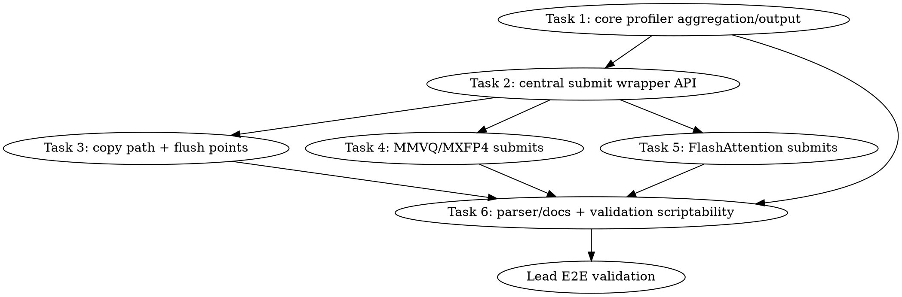

# SYCL Named Kernel Event Profiler Implementation Plan

> **For Claude:** REQUIRED SUB-SKILL: Use team-driven-development to implement this plan with agent teams.

**Goal:** Add a default-off backend-wide SYCL kernel event profiler that reports exact human-readable kernel/copy names, GPU durations, and scriptable artifacts so optimization work can see where time is spent without relying on broken VTune computing-task attribution.

**Architecture:** Introduce a central profiler-aware submit/copy wrapper layer in `ggml/src/ggml-sycl/sycl-kernel-profiler.hpp/.cpp`. Hot-path code moves from raw `queue.submit` / `stream->submit` / copy submissions to wrappers that preserve the same returned `sycl::event` and scheduling semantics while recording `{label, category, queue kind, metadata, event}` only when `GGML_SYCL_KERNEL_PROFILE=1` is set. Reporting is explicit at backend/tool flush points, not by unsafe static-destruction probing.

**Tech Stack:** C++17, SYCL event profiling timestamps, existing llama.cpp CMake/Ninja build, pytest source tests, CTest C++ unit tests, optional lead-owned `sycl-kernel-bench` validation.

**Test Infrastructure:** Python source tests live under `tests/` and run with `python3 -m pytest`. C++ tests are registered in `tests/CMakeLists.txt` with `llama_build` / `llama_test` and run through `ctest --test-dir build -R test-sycl-kernel-profiler`. Existing SYCL queues already request `sycl::property::queue::enable_profiling{}` in `ggml/src/ggml-sycl/common.hpp:5919`, so event timestamp reads are available on normal backend queues.

**Working checkout:** All implementation happens in the git worktree `/Apps/llama.cpp-mxfp4-tg-runtime` on branch `feature/sycl-mxfp4-tg-runtime` (a worktree of `/Apps/llama.cpp`). Every `file:line` reference in this plan resolves against this checkout as of commit `06cc42ee3`. Do not implement in the main `/Apps/llama.cpp` checkout — its files differ and the cited line numbers do not apply there.

**Line-reference policy:** Line numbers are hints valid at planning time, not ground truth. Locate every edit site by the named symbol (codescout `find_symbol` / `read_symbol`), since tasks landing earlier can shift line numbers in shared files.

---

## Team Topology

**Recommended implementers:** 3 (maximum parallel width is Tasks 3/4/5; Tasks 1→2 and 6→E2E are sequential)
**Reviewers:** spec + quality reviewers spawned fresh per task in team-driven-development.

### Parallel Tracks

| Track | Tasks | Description |
|---|---|---|
| A | 1, 2 | Core profiler model, wrapper API, and unit/source tests |
| B | 3 | Central copy path + flush points |
| C | 4 | MMVQ/MXFP4 submit integration |
| D | 5 | FlashAttention submit integration |
| E | 6 | Output parser/docs and final validation harness polish |

Tasks 3, 4, and 5 depend on Task 2 because they use the wrapper API. They run in parallel and therefore own strictly disjoint files: each writes its own per-task source-test file (`tests/test-sycl-kernel-profiler-source-{copy,mmvq,fattn}.py`) instead of appending to a shared one, and `mmvq.cpp` is owned by Task 4 alone (including its copy helper). Task 6 depends on Task 1 for the output contract and on Tasks 3-5 for integration evidence.

### Dependency Graph



### File Ownership Map

| File | Tasks | Conflict Risk |
|---|---|---|
| `ggml/src/ggml-sycl/sycl-kernel-profiler.hpp` | 1, 2 | Sequential: Task 2 depends on Task 1 |
| `ggml/src/ggml-sycl/sycl-kernel-profiler.cpp` | 1, 2 | Sequential: Task 2 depends on Task 1 |
| `tests/test-sycl-kernel-profiler.cpp` | 1, 2 | Sequential: Task 2 appends wrapper tests |
| `tests/test-sycl-kernel-profiler-source.py` | 2, 6 | Sequential: Task 2 creates; Task 6 appends docs assertions after Tasks 3-5 close |
| `tests/test-sycl-kernel-profiler-source-copy.py` | 3 | New file (per-task; copies the preamble from Task 2's file) |
| `tests/test-sycl-kernel-profiler-source-mmvq.py` | 4 | New file (per-task; copies the preamble from Task 2's file) |
| `tests/test-sycl-kernel-profiler-source-fattn.py` | 5 | New file (per-task; copies the preamble from Task 2's file) |
| `tests/CMakeLists.txt` | 1 | Low: one test registration block |
| `ggml/src/ggml-sycl/common.hpp` | 3 | Medium: central copy helper at `common.hpp:194` |
| `ggml/src/ggml-sycl/ggml-sycl.cpp` | 3 | Medium: backend teardown at `ggml-sycl.cpp:72094` |
| `tools/sycl-kernel-bench/main.cpp` | 3 | Low: final flush before `main.cpp:1121` return |
| `ggml/src/ggml-sycl/mmvq.cpp` | 4 | High: hot path; single-owner (Task 4), including the `mmvq_submit_memcpy_with_deps` copy helper |
| `ggml/src/ggml-sycl/fattn.cpp` | 5 | Medium: wrapper around existing FA submit sites |
| `scripts/parse-sycl-kernel-profile.py` | 6 | New file |
| `tests/test-sycl-kernel-profile-parser.py` | 6 | New file |
| `docs/backend/SYCL.md` | 6 | Low documentation edit |

---

## Tasks

### Task 1: Core profiler aggregation, config, and output contract

**Track:** A
**Depends on:** None

**File scope:**
- Create: `ggml/src/ggml-sycl/sycl-kernel-profiler.hpp`
- Create: `ggml/src/ggml-sycl/sycl-kernel-profiler.cpp`
- Create: `tests/test-sycl-kernel-profiler.cpp`
- Modify: `tests/CMakeLists.txt:238-246` to register the new C++ test near the existing SYCL policy test

**Description:** Build the default-off profiler core with env parsing, synthetic sample aggregation, percentile calculation, stderr/CSV/JSON formatting, and test helper functions. This task does not touch real queue submissions yet. It establishes the output contract used by later integration tasks.

**Acceptance Criteria:**
- [ ] `GGML_SYCL_KERNEL_PROFILE` unset returns disabled config.
- [ ] Enabled config parses output path, format, top-N, raw flag, and flush mode.
- [ ] Synthetic samples aggregate by `(name, category, metadata)`.
- [ ] CSV includes stable columns: `name,category,metadata,device,queue_kind,count,total_ns,mean_ns,min_ns,p50_ns,p95_ns,max_ns,bytes,failed_timestamps,graph_recorded`.
- [ ] JSON output contains an array field named `kernels`.
- [ ] No SYCL device or model is required by the unit test.

#### RED: Write These Failing Tests

Create `tests/test-sycl-kernel-profiler.cpp`:

```cpp
#include "ggml-sycl/sycl-kernel-profiler.hpp"

#include <cstdio>
#include <cstdlib>
#include <string>

#define CHECK(cond, msg)                                                        \
    do {                                                                        \
        if (!(cond)) {                                                          \
            std::fprintf(stderr, "FAIL: %s:%d: %s\n", __FILE__, __LINE__, msg); \
            return 1;                                                           \
        }                                                                       \
    } while (0)

static bool contains(const std::string & haystack, const char * needle) {
    return haystack.find(needle) != std::string::npos;
}

int main() {
    ggml_sycl_kernel_profile_reset_for_test();

    ggml_sycl_kernel_profile_config cfg{};
    cfg.enabled = true;
    cfg.output_format = ggml_sycl_kernel_profile_output_format::BOTH;
    cfg.flush_mode = ggml_sycl_kernel_profile_flush_mode::WINDOW;
    cfg.top_n = 2;
    cfg.raw_events = true;
    ggml_sycl_kernel_profile_set_config_for_test(cfg);

    ggml_sycl_profile_label slow{};
    slow.name = "mxfp4.gateup.packed_q8_m2";
    slow.category = "mmvq";
    slow.queue_kind = "compute";
    slow.metadata = "shape=m2880n4k2880,path=packed-q8-m2";
    slow.device = 1;
    slow.bytes = 4096;

    ggml_sycl_profile_label fast{};
    fast.name = "sycl.memcpy.graph_safe";
    fast.category = "memory";
    fast.queue_kind = "compute";
    fast.metadata = "bytes=1024";
    fast.device = 1;
    fast.bytes = 1024;

    ggml_sycl_kernel_profile_add_sample_for_test(slow, 1000);
    ggml_sycl_kernel_profile_add_sample_for_test(slow, 3000);
    ggml_sycl_kernel_profile_add_sample_for_test(fast, 500);
    ggml_sycl_kernel_profile_add_failed_timestamp_for_test(fast, false);
    ggml_sycl_kernel_profile_add_failed_timestamp_for_test(fast, true);

    const std::string csv = ggml_sycl_kernel_profile_format_csv_for_test();
    CHECK(contains(csv, "name,category,metadata,device,queue_kind,count,total_ns,mean_ns,min_ns,p50_ns,p95_ns,max_ns,bytes,failed_timestamps,graph_recorded"), "missing CSV header");
    CHECK(contains(csv, "mxfp4.gateup.packed_q8_m2,mmvq,shape=m2880n4k2880;path=packed-q8-m2,1,compute,2,4000,2000,1000,1000,3000,3000,8192,0,0"), "missing slow aggregate row");
    CHECK(contains(csv, "sycl.memcpy.graph_safe,memory,bytes=1024,1,compute,1,500,500,500,500,500,500,1024,2,1"), "missing memcpy aggregate row");

    const std::string json = ggml_sycl_kernel_profile_format_json_for_test();
    CHECK(contains(json, "\"kernels\""), "missing kernels JSON array");
    CHECK(contains(json, "\"name\":\"mxfp4.gateup.packed_q8_m2\""), "missing slow JSON name");
    CHECK(contains(json, "\"total_ns\":4000"), "missing slow JSON total");
    CHECK(contains(json, "\"failed_timestamps\":2"), "missing failed timestamp count");

    const std::string summary = ggml_sycl_kernel_profile_format_summary_for_test(2);
    CHECK(summary.find("mxfp4.gateup.packed_q8_m2") < summary.find("sycl.memcpy.graph_safe"), "summary not sorted by total time");

    ggml_sycl_kernel_profile_reset_for_test();
    return 0;
}
```

Modify `tests/CMakeLists.txt` after the existing `test-sycl-alloc-policy` block at `tests/CMakeLists.txt:238-246`:

```cmake
if (GGML_SYCL)
    llama_build(test-sycl-kernel-profiler.cpp)
    target_link_libraries(test-sycl-kernel-profiler PRIVATE ggml-sycl)
    llama_test(test-sycl-kernel-profiler LABEL "main")
endif()
```

**Verify RED:**

```bash
./scripts/sycl-build.sh -r test-sycl-kernel-profiler
ctest --test-dir build -R test-sycl-kernel-profiler -V
```

Expected RED result: build fails because `ggml-sycl/sycl-kernel-profiler.hpp` and the referenced functions do not exist.

#### GREEN: Implement Minimal Code

Create `ggml/src/ggml-sycl/sycl-kernel-profiler.hpp` with these public definitions:

```cpp
#pragma once

#include <cstddef>
#include <cstdint>
#include <string>

#include <sycl/sycl.hpp>

enum class ggml_sycl_kernel_profile_output_format : uint8_t {
    STDERR = 0,
    CSV    = 1,
    JSON   = 2,
    BOTH   = 3,
};

enum class ggml_sycl_kernel_profile_flush_mode : uint8_t {
    FINAL  = 0,
    WINDOW = 1,
    NONE   = 2,
};

struct ggml_sycl_kernel_profile_config {
    bool enabled = false;
    ggml_sycl_kernel_profile_output_format output_format = ggml_sycl_kernel_profile_output_format::CSV;
    ggml_sycl_kernel_profile_flush_mode flush_mode = ggml_sycl_kernel_profile_flush_mode::FINAL;
    int top_n = 40;
    bool raw_events = false;
    std::string output_path;
};

struct ggml_sycl_profile_label {
    const char * name       = "unknown";
    const char * category   = "unknown";
    const char * queue_kind = "unknown";
    const char * metadata   = "";
    int          device     = -1;
    size_t       bytes      = 0;
};

bool ggml_sycl_kernel_profile_enabled();
ggml_sycl_kernel_profile_config ggml_sycl_kernel_profile_config_from_env();
void ggml_sycl_kernel_profile_record_event(const ggml_sycl_profile_label & label, const sycl::event & event);
void ggml_sycl_kernel_profile_flush(bool wait_for_events, const char * reason);

void ggml_sycl_kernel_profile_reset_for_test();
void ggml_sycl_kernel_profile_set_config_for_test(const ggml_sycl_kernel_profile_config & cfg);
void ggml_sycl_kernel_profile_add_sample_for_test(const ggml_sycl_profile_label & label, uint64_t duration_ns);
void ggml_sycl_kernel_profile_add_failed_timestamp_for_test(const ggml_sycl_profile_label & label, bool graph_recorded);
std::string ggml_sycl_kernel_profile_format_csv_for_test();
std::string ggml_sycl_kernel_profile_format_json_for_test();
std::string ggml_sycl_kernel_profile_format_summary_for_test(int top_n);
```

Create `ggml/src/ggml-sycl/sycl-kernel-profiler.cpp` implementing:

- static config parsed once from env names:
  - `GGML_SYCL_KERNEL_PROFILE`
  - `GGML_SYCL_KERNEL_PROFILE_OUTPUT`
  - `GGML_SYCL_KERNEL_PROFILE_FORMAT`
  - `GGML_SYCL_KERNEL_PROFILE_TOP_N`
  - `GGML_SYCL_KERNEL_PROFILE_RAW`
  - `GGML_SYCL_KERNEL_PROFILE_FLUSH`
- a `std::mutex`-guarded vector of pending events and synthetic samples
- aggregation keyed by stringified label
- metadata sanitization that converts commas in metadata to semicolons before CSV output
- percentile calculation using sorted `duration_ns` values with floor-index percentile: p50 index `(n - 1) * 50 / 100`, p95 index `(n - 1) * 95 / 100`
- `ggml_sycl_kernel_profile_flush(wait_for_events, reason)` that records completed event durations, prints summary to stderr when enabled, and writes CSV/JSON when `output_path` is non-empty

**Verify GREEN:**

```bash
./scripts/sycl-build.sh -r test-sycl-kernel-profiler
ctest --test-dir build -R test-sycl-kernel-profiler -V
```

Expected GREEN result: `100% tests passed` for `test-sycl-kernel-profiler`.

#### REFACTOR

Keep the profiler core independent from `sycl-profiling.hpp`; that existing file is compile-time ITT instrumentation and should remain usable without the event profiler.

**Verify still GREEN:**

```bash
ctest --test-dir build -R test-sycl-kernel-profiler -V
```

Expected: all assertions pass.

#### Gotchas

- Do not use static destructors or `std::atexit` to read SYCL event timestamps; the backend has multiple comments about static destruction and SYCL teardown risk.
- Do not throw from profiler flush; failed timestamp extraction increments a counter.
- Avoid per-event heap allocation when disabled. Disabled path must be a single env-cached branch.
- `GGML_SYCL_KERNEL_PROFILE_FORMAT=both` must produce both CSV/JSON if an output base path is supplied.

#### Commit

```bash
git add ggml/src/ggml-sycl/sycl-kernel-profiler.hpp ggml/src/ggml-sycl/sycl-kernel-profiler.cpp tests/test-sycl-kernel-profiler.cpp tests/CMakeLists.txt
git commit -m "feat(sycl): add named kernel profile aggregation core"
```

---

### Task 2: Central submit and event wrapper API

**Track:** A
**Depends on:** Task 1

**File scope:**
- Modify: `ggml/src/ggml-sycl/sycl-kernel-profiler.hpp`
- Modify: `ggml/src/ggml-sycl/sycl-kernel-profiler.cpp`
- Modify: `tests/test-sycl-kernel-profiler.cpp`
- Create: `tests/test-sycl-kernel-profiler-source.py`

**Description:** Add the central queue wrapper layer selected in design. The wrapper must return the same `sycl::event` as the raw submit path and must not alter dependency behavior. This task proves disabled/default path source shape and enabled recording with synthetic test helpers. The `tests/test-sycl-kernel-profiler-source.py` file created here is also the preamble template for Tasks 3-5: each of those tasks creates its own `tests/test-sycl-kernel-profiler-source-{copy,mmvq,fattn}.py` and copies the path-constant/`slice_between` preamble verbatim (the dashed filename cannot be imported as a Python module).

**Acceptance Criteria:**
- [ ] Header exposes `ggml_sycl_profile_submit` template.
- [ ] Header exposes `ggml_sycl_profile_record_returned_event` for sites that cannot use the submit wrapper.
- [ ] Disabled path calls the supplied submit lambda exactly once and records no synthetic sample.
- [ ] Enabled test mode records an event label without needing a GPU event timestamp.
- [ ] Source test proves there is no `wait()` call inside `ggml_sycl_profile_submit`.

#### RED: Write These Failing Tests

Append to `tests/test-sycl-kernel-profiler.cpp` before the final reset/return:

```cpp
    ggml_sycl_kernel_profile_reset_for_test();
    int submit_calls = 0;
    ggml_sycl_profile_label wrapper_label{};
    wrapper_label.name = "unit.wrapper.submit";
    wrapper_label.category = "unit";
    wrapper_label.queue_kind = "compute";
    wrapper_label.metadata = "case=disabled";

    ggml_sycl_kernel_profile_config disabled_cfg{};
    disabled_cfg.enabled = false;
    ggml_sycl_kernel_profile_set_config_for_test(disabled_cfg);
    const int disabled_result = ggml_sycl_profile_submit_for_test(wrapper_label, [&]() {
        submit_calls++;
        return 7;
    });
    CHECK(disabled_result == 7, "disabled wrapper did not return lambda result");
    CHECK(submit_calls == 1, "disabled wrapper did not call lambda exactly once");
    CHECK(ggml_sycl_kernel_profile_format_csv_for_test().find("unit.wrapper.submit") == std::string::npos, "disabled wrapper recorded a profile row");

    ggml_sycl_kernel_profile_config enabled_cfg{};
    enabled_cfg.enabled = true;
    ggml_sycl_kernel_profile_set_config_for_test(enabled_cfg);
    wrapper_label.metadata = "case=enabled";
    const int enabled_result = ggml_sycl_profile_submit_for_test(wrapper_label, [&]() {
        submit_calls++;
        return 11;
    });
    CHECK(enabled_result == 11, "enabled wrapper did not return lambda result");
    CHECK(submit_calls == 2, "enabled wrapper did not call lambda exactly once");
    CHECK(contains(ggml_sycl_kernel_profile_format_csv_for_test(), "unit.wrapper.submit,unit,case=enabled"), "enabled wrapper did not record test row");
```

Create `tests/test-sycl-kernel-profiler-source.py`:

```python
#!/usr/bin/env python3
from __future__ import annotations

import pathlib

ROOT = pathlib.Path(__file__).resolve().parents[1]
HEADER = ROOT / "ggml" / "src" / "ggml-sycl" / "sycl-kernel-profiler.hpp"
CPP = ROOT / "ggml" / "src" / "ggml-sycl" / "sycl-kernel-profiler.cpp"
COMMON = ROOT / "ggml" / "src" / "ggml-sycl" / "common.hpp"
MMVQ = ROOT / "ggml" / "src" / "ggml-sycl" / "mmvq.cpp"
FATTN = ROOT / "ggml" / "src" / "ggml-sycl" / "fattn.cpp"


def slice_between(text: str, start: str, end: str) -> str:
    begin = text.index(start)
    finish = text.index(end, begin + len(start))
    return text[begin:finish]


def test_submit_wrapper_api_is_default_off_and_wait_free() -> None:
    header = HEADER.read_text(encoding="utf-8")
    assert "template <typename SubmitFn>" in header
    assert "ggml_sycl_profile_submit" in header
    body = slice_between(header, "ggml_sycl_profile_submit", "template <typename Fn>")
    assert "submit_fn(q)" in body
    assert "ggml_sycl_kernel_profile_enabled()" in body
    assert ".wait(" not in body
    assert "ggml_sycl_kernel_profile_record_event" in body


def test_profiler_env_names_are_stable() -> None:
    cpp = CPP.read_text(encoding="utf-8")
    for name in [
        "GGML_SYCL_KERNEL_PROFILE",
        "GGML_SYCL_KERNEL_PROFILE_OUTPUT",
        "GGML_SYCL_KERNEL_PROFILE_FORMAT",
        "GGML_SYCL_KERNEL_PROFILE_TOP_N",
        "GGML_SYCL_KERNEL_PROFILE_RAW",
        "GGML_SYCL_KERNEL_PROFILE_FLUSH",
    ]:
        assert name in cpp
```

**Verify RED:**

```bash
python3 -m pytest tests/test-sycl-kernel-profiler-source.py -q
./scripts/sycl-build.sh test-sycl-kernel-profiler
ctest --test-dir build -R test-sycl-kernel-profiler -V
```

Expected RED result: source/unit tests fail because wrapper helpers are not implemented.

#### GREEN: Implement Minimal Code

Add to `ggml/src/ggml-sycl/sycl-kernel-profiler.hpp` after `ggml_sycl_kernel_profile_record_event`:

```cpp
template <typename SubmitFn>
inline sycl::event ggml_sycl_profile_submit(sycl::queue & q, const ggml_sycl_profile_label & label, SubmitFn && submit_fn) {
    sycl::event event = submit_fn(q);
    if (ggml_sycl_kernel_profile_enabled()) {
        ggml_sycl_kernel_profile_record_event(label, event);
    }
    return event;
}

template <typename Fn>
inline auto ggml_sycl_profile_submit_for_test(const ggml_sycl_profile_label & label, Fn && fn) -> decltype(fn()) {
    auto value = fn();
    if (ggml_sycl_kernel_profile_enabled()) {
        ggml_sycl_kernel_profile_add_sample_for_test(label, 1);
    }
    return value;
}

inline sycl::event ggml_sycl_profile_record_returned_event(const ggml_sycl_profile_label & label, const sycl::event & event) {
    if (ggml_sycl_kernel_profile_enabled()) {
        ggml_sycl_kernel_profile_record_event(label, event);
    }
    return event;
}
```

Ensure `ggml_sycl_kernel_profile_record_event` in `.cpp` only pushes pending events when enabled and catches later timestamp failures in flush.

**Verify GREEN:**

```bash
python3 -m pytest tests/test-sycl-kernel-profiler-source.py -q
./scripts/sycl-build.sh test-sycl-kernel-profiler
ctest --test-dir build -R test-sycl-kernel-profiler -V
```

Expected: pytest and CTest pass.

#### REFACTOR

If the test helper name feels too public, keep it in the same header but comment it as test-only and never call it from production code.

**Verify still GREEN:** same commands as GREEN.

#### Gotchas

- The submit wrapper must take a `sycl::queue &` and not a `dpct::queue_ptr`; callers pass `*stream` when they hold a pointer.
- Do not force dependency edges or inspect event status in the wrapper.
- Do not read profiling timestamps during `record_event`; timestamp reads belong to flush.

#### Commit

```bash
git add ggml/src/ggml-sycl/sycl-kernel-profiler.hpp ggml/src/ggml-sycl/sycl-kernel-profiler.cpp tests/test-sycl-kernel-profiler.cpp tests/test-sycl-kernel-profiler-source.py
git commit -m "feat(sycl): add profiler-aware submit wrapper"
```

---

### Task 3: Central copy path and explicit flush points

**Track:** B
**Depends on:** Task 2

**File scope:**
- Modify: `ggml/src/ggml-sycl/common.hpp:194-218`
- Modify: `ggml/src/ggml-sycl/ggml-sycl.cpp:72094-72248`
- Modify: `tools/sycl-kernel-bench/main.cpp:1118-1121`
- Create: `tests/test-sycl-kernel-profiler-source-copy.py`

**Description:** Route existing central copy helpers and final flush points through the profiler. `ggml_sycl_graph_safe_memcpy()` is already the canonical copy helper in `common.hpp:194`; this task records memcopies there without changing graph recording behavior. Backend free and `sycl-kernel-bench` main get explicit profiler flushes, avoiding `atexit`. (The MMVQ-local copy helper `mmvq_submit_memcpy_with_deps` is wrapped by Task 4, which solely owns `mmvq.cpp`.)

**Acceptance Criteria:**
- [ ] `ggml_sycl_graph_safe_memcpy()` includes `sycl-kernel-profiler.hpp` and records `sycl.memcpy.graph_safe` events.
- [ ] Graph-recording copy kernels keep returning `sycl::event{}` as before.
- [ ] `ggml_backend_sycl_free()` calls `ggml_sycl_kernel_profile_flush(true, "backend-free")` before `delete sycl_ctx`.
- [ ] `tools/sycl-kernel-bench/main.cpp` calls `ggml_sycl_kernel_profile_flush(true, "sycl-kernel-bench")` before returning success.

#### RED: Write These Failing Tests

Create `tests/test-sycl-kernel-profiler-source-copy.py`. Copy the preamble (path constants and `slice_between`) verbatim from `tests/test-sycl-kernel-profiler-source.py` — the dashed filename cannot be imported as a module — then add the tests:

```python
#!/usr/bin/env python3
from __future__ import annotations

import pathlib

ROOT = pathlib.Path(__file__).resolve().parents[1]
CPP = ROOT / "ggml" / "src" / "ggml-sycl" / "sycl-kernel-profiler.cpp"
COMMON = ROOT / "ggml" / "src" / "ggml-sycl" / "common.hpp"


def slice_between(text: str, start: str, end: str) -> str:
    begin = text.index(start)
    finish = text.index(end, begin + len(start))
    return text[begin:finish]


def test_graph_safe_memcpy_is_profiled_without_changing_graph_return_contract() -> None:
    common = COMMON.read_text(encoding="utf-8")
    body = slice_between(common, "inline sycl::event ggml_sycl_graph_safe_memcpy", "inline bool ggml_sycl_graph_recording_active")
    assert "sycl-kernel-profiler.hpp" in common
    assert "sycl.memcpy.graph_safe" in body
    assert "ggml_sycl_profile_record_returned_event" in body
    assert "return sycl::event{};" in body
    assert "ggml_sycl::mem_copy_async" in body


def test_profile_flush_points_are_explicit_not_atexit() -> None:
    backend = (ROOT / "ggml" / "src" / "ggml-sycl" / "ggml-sycl.cpp").read_text(encoding="utf-8")
    free_body = slice_between(backend, "static void ggml_backend_sycl_free", "static void ggml_backend_sycl_set_tensor_async")
    assert "ggml_sycl_kernel_profile_flush(true, \"backend-free\")" in free_body
    assert free_body.index("ggml_sycl_kernel_profile_flush(true, \"backend-free\")") < free_body.index("delete sycl_ctx;")
    profiler = CPP.read_text(encoding="utf-8")
    assert "std::atexit" not in profiler
    bench = (ROOT / "tools" / "sycl-kernel-bench" / "main.cpp").read_text(encoding="utf-8")
    assert "ggml_sycl_kernel_profile_flush(true, \"sycl-kernel-bench\")" in bench
```

**Verify RED:**

```bash
python3 -m pytest tests/test-sycl-kernel-profiler-source-copy.py -q
```

Expected RED result: new assertions fail because copy helpers and flush points are not wired.

#### GREEN: Implement Minimal Code

In `common.hpp`, add include near other local SYCL includes:

```cpp
#include "sycl-kernel-profiler.hpp"
```

Inside `ggml_sycl_graph_safe_memcpy()` at `common.hpp:194`, define one label at function entry:

```cpp
ggml_sycl_profile_label profile_label{};
profile_label.name       = "sycl.memcpy.graph_safe";
profile_label.category   = "memory";
profile_label.queue_kind = "compute";
profile_label.metadata   = g_ggml_sycl_graph_recording ? "graph_recording=1" : "graph_recording=0";
profile_label.device     = ggml_sycl_get_device_id_from_queue(q);
profile_label.bytes      = nbytes;
```

For the non-graph path, replace:

```cpp
return ggml_sycl::mem_copy_async(dst_handle, src_handle, nbytes, q);
```

with:

```cpp
return ggml_sycl_profile_record_returned_event(profile_label, ggml_sycl::mem_copy_async(dst_handle, src_handle, nbytes, q));
```

For the graph-recording path, record the returned events from each `q.parallel_for` call but keep the final `return sycl::event{};` unchanged:

```cpp
sycl::event body_event = q.parallel_for(sycl::range<1>(n_i32), [=](sycl::id<1> i) { d[i] = s[i]; });
ggml_sycl_profile_record_returned_event(profile_label, body_event);
```

and for the tail copy:

```cpp
sycl::event tail_event = q.parallel_for(sycl::range<1>(tail), [=](sycl::id<1> i) { dc[i] = sc[i]; });
ggml_sycl_profile_record_returned_event(profile_label, tail_event);
```

In `ggml-sycl.cpp`, include `sycl-kernel-profiler.hpp` if not already visible, then insert before `delete sycl_ctx;` in `ggml_backend_sycl_free()`:

```cpp
ggml_sycl_kernel_profile_flush(true, "backend-free");
```

In `tools/sycl-kernel-bench/main.cpp`, include:

```cpp
#include "ggml-sycl/sycl-kernel-profiler.hpp"
```

and replace the final success return:

```cpp
write_summary_json(params.emit_json_path, summaries);
ggml_sycl_kernel_profile_flush(true, "sycl-kernel-bench");
return 0;
```

**Verify GREEN:**

```bash
python3 -m pytest tests/test-sycl-kernel-profiler-source-copy.py -q
./scripts/sycl-build.sh sycl-kernel-bench test-sycl-kernel-profiler
ctest --test-dir build -R test-sycl-kernel-profiler -V
```

Expected: pytest and CTest pass; `sycl-kernel-bench` links.

#### REFACTOR

If `common.hpp` include ordering causes circular includes, move only the small label struct and inline wrapper declarations into `sycl-kernel-profiler.hpp` and keep `sycl-kernel-profiler.cpp` free of `common.hpp` includes.

**Verify still GREEN:** same commands as GREEN.

#### Gotchas

- Do not change graph path return value from `sycl::event{}`; some graph code may rely on existing behavior.
- `ggml_sycl_get_device_id_from_queue(q)` is already used in `common.hpp:211`; avoid calling it twice by reusing the `queue_device` local in the non-graph path.
- `tools/sycl-kernel-bench/main.cpp` must still return early for errors without trying to hide failures behind profiling flush.

#### Commit

```bash
git add ggml/src/ggml-sycl/common.hpp ggml/src/ggml-sycl/ggml-sycl.cpp tools/sycl-kernel-bench/main.cpp tests/test-sycl-kernel-profiler-source-copy.py
git commit -m "feat(sycl): profile central copy paths and flush points"
```

---

### Task 4: MMVQ and MXFP4 submit integration

**Track:** C
**Depends on:** Task 2

**File scope:**
- Modify: `ggml/src/ggml-sycl/mmvq.cpp:9470-11990` for MXFP4 gate/up/down submit helpers
- Modify: `ggml/src/ggml-sycl/mmvq.cpp:6580-6756` for SOA batched submit helpers
- Modify: `ggml/src/ggml-sycl/mmvq.cpp:18075-18333` for active packed-Q8 runtime profiling context
- Modify: `ggml/src/ggml-sycl/mmvq.cpp:1646-1664` for the MMVQ copy helper `mmvq_submit_memcpy_with_deps` (owned here, not by Task 3, so `mmvq.cpp` has a single owner)
- Create: `tests/test-sycl-kernel-profiler-source-mmvq.py`

**Description:** Move the active MMVQ/MXFP4 hot submits through the central wrapper with stable labels, and record the MMVQ-local copy helper as a named copy event. This is the primary answer to “which exact kernel name consumed time” for current MXFP4 TG work. Do not alter kernel bodies, launch shapes, dependency edges, or route selection.

**Acceptance Criteria:**
- [ ] Active packed-Q8 M2 gate/up path labels include `mxfp4.gateup.xmx_tiled_dpas_m2` and metadata `path=packed-q8-m2`.
- [ ] M4/bundle4/default-off variants get distinct labels so rejected experiments can be measured if enabled.
- [ ] Down direct-final variants get distinct labels under category `mmvq`.
- [ ] SOA pair GLU and SOA batched helpers use labels under category `mmvq`.
- [ ] `mmvq_submit_memcpy_with_deps()` records `sycl.memcpy.mmvq_with_deps` under category `memory`.
- [ ] Existing `mmvq_moe_tg_profile_record()` route-level logging remains intact.

#### RED: Write These Failing Tests

Create `tests/test-sycl-kernel-profiler-source-mmvq.py`. Copy the preamble (path constants and `slice_between`) verbatim from `tests/test-sycl-kernel-profiler-source.py` — the dashed filename cannot be imported as a module — then add the tests:

```python
#!/usr/bin/env python3
from __future__ import annotations

import pathlib

ROOT = pathlib.Path(__file__).resolve().parents[1]
MMVQ = ROOT / "ggml" / "src" / "ggml-sycl" / "mmvq.cpp"


def slice_between(text: str, start: str, end: str) -> str:
    begin = text.index(start)
    finish = text.index(end, begin + len(start))
    return text[begin:finish]


def test_mmvq_mxfp4_hot_submits_have_named_profile_labels() -> None:
    mmvq = MMVQ.read_text(encoding="utf-8")
    assert "#include \"sycl-kernel-profiler.hpp\"" in mmvq
    for label in [
        "mxfp4.gateup.xmx_tiled_dpas_m2",
        "mxfp4.gateup.xmx_tiled_dpas_m4",
        "mxfp4.gateup.xmx_tiled_bundle4_m2",
        "mxfp4.down.direct_final_i8",
        "mxfp4.down.direct_final_dpas",
        "mxfp4.down.same_expert_grouped",
        "mxfp4.soa.batched",
        "mxfp4.soa.pair_glu_batched",
    ]:
        assert label in mmvq
    assert mmvq.count("ggml_sycl_profile_submit(") >= 8


def test_active_packed_q8_m2_metadata_preserves_route_context() -> None:
    mmvq = MMVQ.read_text(encoding="utf-8")
    body = slice_between(
        mmvq,
        "static sycl::event mxfp4_pair_glu_xmx_tiled_dpas_m2_sycl",
        "template <int Repeat, int GLU_OP>\nstatic sycl::event mxfp4_pair_glu_gateup_prepack_dpas_sycl",
    )
    assert "mxfp4.gateup.xmx_tiled_dpas_m2" in body
    assert "path=packed-q8-m2" in body
    assert "tiles=" in body
    assert "total_batches=" in body
    assert "ggml_sycl_profile_submit(queue" in body
    assert "h.depends_on(pack_event)" in body


def test_mmvq_copy_helper_records_named_copy_event() -> None:
    mmvq = MMVQ.read_text(encoding="utf-8")
    body = slice_between(mmvq, "static sycl::event mmvq_submit_memcpy_with_deps", "static void mmvq_memcpy_sync")
    assert "sycl.memcpy.mmvq_with_deps" in body
    assert "ggml_sycl_profile_record_returned_event" in body
    assert "ggml_sycl::mem_copy_async" in body
```

**Verify RED:**

```bash
python3 -m pytest tests/test-sycl-kernel-profiler-source-mmvq.py -q
```

Expected RED result: assertions fail because MMVQ labels and wrappers are absent.

#### GREEN: Implement Minimal Code

At the top of `mmvq.cpp`, add:

```cpp
#include "sycl-kernel-profiler.hpp"
```

For `mxfp4_pair_glu_xmx_tiled_dpas_m2_sycl()` around `mmvq.cpp:9666`, replace the raw `return queue.submit([&](sycl::handler & h) {` with:

```cpp
ggml_sycl_profile_label profile_label{};
profile_label.name       = "mxfp4.gateup.xmx_tiled_dpas_m2";
profile_label.category   = "mmvq";
profile_label.queue_kind = "compute";
profile_label.metadata   = "path=packed-q8-m2;tiles=";
profile_label.device     = ggml_sycl_get_device_id_from_queue(queue);
profile_label.bytes      = 0;
return ggml_sycl_profile_submit(queue, profile_label, [&](sycl::queue & profiled_queue) {
    return profiled_queue.submit([&](sycl::handler & h) {
```

and close the wrapper by changing the function-ending submit close from:

```cpp
    });
}
```

to:

```cpp
    });
});
}
```

Use the same wrapper pattern without altering lambda bodies for these functions and labels:

| Function region | Label | Metadata |
|---|---|---|
| `mxfp4_pair_glu_xmx_tiled_dpas_m2_sycl` at `mmvq.cpp:9633-9841` | `mxfp4.gateup.xmx_tiled_dpas_m2` | `path=packed-q8-m2;role=gateup` |
| `mxfp4_pair_glu_xmx_tiled_dpas_m4_sycl` around `mmvq.cpp:10675` | `mxfp4.gateup.xmx_tiled_dpas_m4` | `path=packed-q8-m4;role=gateup` |
| `mxfp4_pair_glu_xmx_tiled_bundle4_dpas_m2_submit` around `mmvq.cpp:14322` | `mxfp4.gateup.xmx_tiled_bundle4_m2` | `path=bundle4-packed-q8-m2;role=gateup` |
| direct-final I8 down helper around `mmvq.cpp:8436` | `mxfp4.down.direct_final_i8` | `path=down-dpas-direct-final-i8;role=down` |
| direct-final DPAS down helper around `mmvq.cpp:8617` | `mxfp4.down.direct_final_dpas` | `path=down-dpas-direct-final-dpas;role=down` |
| same-expert grouped down helper around `mmvq.cpp:8375` | `mxfp4.down.same_expert_grouped` | `path=down-dpas-direct-final-same-expert-grouped;role=down` |
| `mmvq_submit_mxfp4_soa_batched` at `mmvq.cpp:6580` | `mxfp4.soa.batched` | `path=soa;role=matvec` |
| `mmvq_submit_mxfp4_soa_pair_glu_batched` at `mmvq.cpp:6649` | `mxfp4.soa.pair_glu_batched` | `path=soa;role=gateup` |

For dynamic shape metadata, keep the first implementation stable and low-risk by encoding static route/path metadata only. Do not allocate `std::string` per submit in the hot path for dynamic tile counts. A later task can add a fixed small stack formatter if needed.

In `mmvq_submit_memcpy_with_deps()` (locate by symbol; near `mmvq.cpp:1646`), wrap the `mem_copy_async` return:

```cpp
ggml_sycl_profile_label label{};
label.name       = "sycl.memcpy.mmvq_with_deps";
label.category   = "memory";
label.queue_kind = "compute";
label.metadata   = deps.empty() ? "deps=0" : "deps=1";
label.device     = queue_device;
label.bytes      = bytes;
return ggml_sycl_profile_record_returned_event(label, ggml_sycl::mem_copy_async(dst_handle, src_handle, bytes, queue, deps));
```

**Verify GREEN:**

```bash
python3 -m pytest tests/test-sycl-kernel-profiler-source-mmvq.py -q
./scripts/sycl-build.sh sycl-kernel-bench test-sycl-kernel-profiler
```

Expected: pytest passes and `sycl-kernel-bench` builds.

#### REFACTOR

If the wrapper pattern becomes visually noisy, add a local helper function in `mmvq.cpp`:

```cpp
static ggml_sycl_profile_label mmvq_profile_label(const char * name, const char * metadata, sycl::queue & queue) {
    ggml_sycl_profile_label label{};
    label.name       = name;
    label.category   = "mmvq";
    label.queue_kind = "compute";
    label.metadata   = metadata;
    label.device     = ggml_sycl_get_device_id_from_queue(queue);
    return label;
}
```

Use it only to construct labels; do not hide `ggml_sycl_profile_submit` calls behind another layer yet.

**Verify still GREEN:** same commands as GREEN.

#### Gotchas

- Do not change `h.depends_on(pack_event)` in packed M2/M4 gate/up kernels.
- Do not call `.wait()` in MMVQ integration.
- Keep existing `GGML_SYCL_MXFP4_TG_PROFILE` route-level timing output unchanged; the new kernel profiler complements it.
- Do not profile rejected/default-off routes by enabling them; just label their submit helpers so future opt-in runs are visible.

#### Commit

```bash
git add ggml/src/ggml-sycl/mmvq.cpp tests/test-sycl-kernel-profiler-source-mmvq.py
git commit -m "feat(sycl): profile named MMVQ and MXFP4 submits"
```

---

### Task 5: FlashAttention submit integration

**Track:** D
**Depends on:** Task 2

**File scope:**
- Modify: `ggml/src/ggml-sycl/fattn.cpp:220-324`
- Modify: `ggml/src/ggml-sycl/fattn.cpp:1556`
- Create: `tests/test-sycl-kernel-profiler-source-fattn.py`

**Description:** Route major FlashAttention submit helpers through the central wrapper so profile reports can distinguish MoE/MMVQ time from attention and packed-K maintenance work. This keeps the profiler backend-wide instead of MXFP4-only.

**Acceptance Criteria:**
- [ ] Packed-K set-rows update submit is labeled `fattn.xmx_pack_k_set_rows`.
- [ ] Packed-K setup copy submits through `ggml_sycl_graph_safe_memcpy()` remain covered by Task 3.
- [ ] Main FA pack submit around `fattn.cpp:1556` is labeled `fattn.pack`.
- [ ] No FA submit integration adds waits or changes existing dependency checks.

#### RED: Write These Failing Tests

Create `tests/test-sycl-kernel-profiler-source-fattn.py`. Copy the preamble (path constants and `slice_between`) verbatim from `tests/test-sycl-kernel-profiler-source.py` — the dashed filename cannot be imported as a module — then add the test:

```python
#!/usr/bin/env python3
from __future__ import annotations

import pathlib

ROOT = pathlib.Path(__file__).resolve().parents[1]
FATTN = ROOT / "ggml" / "src" / "ggml-sycl" / "fattn.cpp"


def slice_between(text: str, start: str, end: str) -> str:
    begin = text.index(start)
    finish = text.index(end, begin + len(start))
    return text[begin:finish]


def test_fattn_major_submits_have_named_profile_labels() -> None:
    fattn = FATTN.read_text(encoding="utf-8")
    assert "#include \"sycl-kernel-profiler.hpp\"" in fattn
    assert "fattn.xmx_pack_k_set_rows" in fattn
    assert "fattn.pack" in fattn
    set_rows = slice_between(
        fattn,
        "static sycl::event ggml_sycl_fattn_xmx_submit_set_rows_update",
        "}  // namespace",
    )
    assert "ggml_sycl_profile_submit(*stream" in set_rows
    assert "cgh.depends_on(set_rows_event)" in set_rows
    assert ".wait(" not in set_rows
```

**Verify RED:**

```bash
python3 -m pytest tests/test-sycl-kernel-profiler-source-fattn.py -q
```

Expected RED result: FA labels/wrappers are absent.

#### GREEN: Implement Minimal Code

At the top of `fattn.cpp`, add:

```cpp
#include "sycl-kernel-profiler.hpp"
```

For `ggml_sycl_fattn_xmx_submit_set_rows_update()` at `fattn.cpp:220-324`, replace:

```cpp
return stream->submit([&](sycl::handler & cgh) {
```

with:

```cpp
ggml_sycl_profile_label profile_label{};
profile_label.name       = "fattn.xmx_pack_k_set_rows";
profile_label.category   = "fattn";
profile_label.queue_kind = "compute";
profile_label.metadata   = "role=packed_k_set_rows";
profile_label.device     = ggml_sycl_get_device_id_from_queue(*stream);
profile_label.bytes      = static_cast<size_t>(total_elements) * sizeof(float);
return ggml_sycl_profile_submit(*stream, profile_label, [&](sycl::queue & profiled_queue) {
    return profiled_queue.submit([&](sycl::handler & cgh) {
```

and close the wrapper with one additional `});` at the end of the existing submit.

For the pack submit at `fattn.cpp:1556`, wrap `pack_event = stream->submit([&](sycl::handler & cgh) {` as:

```cpp
ggml_sycl_profile_label profile_label{};
profile_label.name       = "fattn.pack";
profile_label.category   = "fattn";
profile_label.queue_kind = "compute";
profile_label.metadata   = "role=pack";
profile_label.device     = ggml_sycl_get_device_id_from_queue(*stream);
profile_label.bytes      = 0;
pack_event = ggml_sycl_profile_submit(*stream, profile_label, [&](sycl::queue & profiled_queue) {
    return profiled_queue.submit([&](sycl::handler & cgh) {
```

and close with `});` after the existing submit lambda.

**Verify GREEN:**

```bash
python3 -m pytest tests/test-sycl-kernel-profiler-source-fattn.py -q
./scripts/sycl-build.sh sycl-kernel-bench test-sycl-kernel-profiler
```

Expected: pytest passes and build succeeds.

#### REFACTOR

Do not wrap every FA helper in this first pass. Only the two named submit regions above and memcopies covered by graph-safe memcpy are required for this task.

**Verify still GREEN:** same commands as GREEN.

#### Gotchas

- `stream` is a `dpct::queue_ptr`; pass `*stream` to the wrapper.
- Preserve `ggml_sycl_should_add_dependency(set_rows_event)` and every existing `depends_on` call.
- Do not move lambda captures or packed sidecar lifetime logic.

#### Commit

```bash
git add ggml/src/ggml-sycl/fattn.cpp tests/test-sycl-kernel-profiler-source-fattn.py
git commit -m "feat(sycl): profile named FlashAttention submits"
```

---

### Task 6: Scriptable parser, documentation, and profiler command contract

**Track:** E
**Depends on:** Tasks 1, 3, 4, 5

**File scope:**
- Create: `scripts/parse-sycl-kernel-profile.py`
- Create: `tests/test-sycl-kernel-profile-parser.py`
- Modify: `docs/backend/SYCL.md`
- Modify: `tests/test-sycl-kernel-profiler-source.py`

**Description:** Add a small parser for generated CSV/JSON artifacts and document the profiling route. This task gives optimization sessions a repeatable command/output contract independent of VTune.

**Acceptance Criteria:**
- [ ] Parser accepts CSV emitted by Task 1 and prints sorted counters.
- [ ] Parser accepts JSON emitted by Task 1 and prints the same counters.
- [ ] Parser can enforce `--require-kernel NAME` and `--min-total-ms NAME=VALUE`.
- [ ] SYCL docs include env vars and a model-free validation command.
- [ ] Source test proves docs mention `GGML_SYCL_KERNEL_PROFILE` and explicitly say VTune task attribution is not the source of truth for this route.

#### RED: Write These Failing Tests

Create `tests/test-sycl-kernel-profile-parser.py`:

```python
#!/usr/bin/env python3
from __future__ import annotations

import json
import pathlib
import subprocess
import sys
import tempfile

ROOT = pathlib.Path(__file__).resolve().parents[1]
PARSER = ROOT / "scripts" / "parse-sycl-kernel-profile.py"

CSV_TEXT = """name,category,metadata,device,queue_kind,count,total_ns,mean_ns,min_ns,p50_ns,p95_ns,max_ns,bytes,failed_timestamps,graph_recorded
mxfp4.gateup.xmx_tiled_dpas_m2,mmvq,path=packed-q8-m2,1,compute,2,4000000,2000000,1000000,1000000,3000000,3000000,8192,0,0
fattn.pack,fattn,role=pack,1,compute,1,500000,500000,500000,500000,500000,500000,0,0,0
"""

JSON_OBJ = {
    "kernels": [
        {
            "name": "mxfp4.gateup.xmx_tiled_dpas_m2",
            "category": "mmvq",
            "metadata": "path=packed-q8-m2",
            "device": 1,
            "queue_kind": "compute",
            "count": 2,
            "total_ns": 4000000,
            "mean_ns": 2000000,
            "min_ns": 1000000,
            "p50_ns": 1000000,
            "p95_ns": 3000000,
            "max_ns": 3000000,
            "bytes": 8192,
            "failed_timestamps": 0,
            "graph_recorded": 0,
        }
    ]
}


def run_parser(path: pathlib.Path, *args: str) -> subprocess.CompletedProcess[str]:
    return subprocess.run([sys.executable, str(PARSER), *args, str(path)], text=True, stdout=subprocess.PIPE, stderr=subprocess.STDOUT, check=False)


def test_parser_summarizes_csv_and_enforces_requirements() -> None:
    with tempfile.TemporaryDirectory() as tmp_raw:
        path = pathlib.Path(tmp_raw) / "profile.csv"
        path.write_text(CSV_TEXT, encoding="utf-8")
        result = run_parser(path, "--require-kernel", "mxfp4.gateup.xmx_tiled_dpas_m2", "--min-total-ms", "mxfp4.gateup.xmx_tiled_dpas_m2=3.5")
        assert result.returncode == 0, result.stdout
        assert "kernel.mxfp4.gateup.xmx_tiled_dpas_m2.count 2" in result.stdout
        assert "kernel.mxfp4.gateup.xmx_tiled_dpas_m2.total_ms_x1000 4000" in result.stdout
        assert "category.mm-vq" not in result.stdout
        assert "category.mmvq.total_ms_x1000 4000" in result.stdout


def test_parser_summarizes_json() -> None:
    with tempfile.TemporaryDirectory() as tmp_raw:
        path = pathlib.Path(tmp_raw) / "profile.json"
        path.write_text(json.dumps(JSON_OBJ), encoding="utf-8")
        result = run_parser(path, "--require-kernel", "mxfp4.gateup.xmx_tiled_dpas_m2")
        assert result.returncode == 0, result.stdout
        assert "kernel.mxfp4.gateup.xmx_tiled_dpas_m2.count 2" in result.stdout
        assert "category.mmvq.total_ms_x1000 4000" in result.stdout


def test_parser_fails_when_required_kernel_missing() -> None:
    with tempfile.TemporaryDirectory() as tmp_raw:
        path = pathlib.Path(tmp_raw) / "profile.csv"
        path.write_text(CSV_TEXT, encoding="utf-8")
        result = run_parser(path, "--require-kernel", "missing.kernel")
        assert result.returncode == 2
        assert "missing required kernel: missing.kernel" in result.stdout
```

Append to `tests/test-sycl-kernel-profiler-source.py`:

```python

def test_sycl_docs_describe_named_kernel_profiler_contract() -> None:
    doc = (ROOT / "docs" / "backend" / "SYCL.md").read_text(encoding="utf-8")
    assert "GGML_SYCL_KERNEL_PROFILE" in doc
    assert "GGML_SYCL_KERNEL_PROFILE_OUTPUT" in doc
    assert "GGML_SYCL_KERNEL_PROFILE_FLUSH" in doc
    assert "SYCL event profiling timestamps" in doc
    assert "VTune computing-task attribution is not the source of truth" in doc
```

**Verify RED:**

```bash
python3 -m pytest tests/test-sycl-kernel-profile-parser.py tests/test-sycl-kernel-profiler-source.py -q
```

Expected RED result: parser file and docs section are missing.

#### GREEN: Implement Minimal Code

Create `scripts/parse-sycl-kernel-profile.py`:

```python
#!/usr/bin/env python3
from __future__ import annotations

import argparse
import csv
import json
import pathlib
import sys
from collections import Counter


def metric_name(raw: str) -> str:
    return raw.replace(" ", "_")


def load_rows(path: pathlib.Path) -> list[dict[str, str | int]]:
    text = path.read_text(encoding="utf-8")
    if path.suffix == ".json" or text.lstrip().startswith("{"):
        obj = json.loads(text)
        return [dict(row) for row in obj.get("kernels", [])]
    rows: list[dict[str, str | int]] = []
    for row in csv.DictReader(text.splitlines()):
        rows.append(dict(row))
    return rows


def ns_to_ms_x1000(ns: int) -> int:
    return int(round(ns / 1000.0))


def parse_min_total(raw: str) -> tuple[str, float]:
    if "=" not in raw:
        raise argparse.ArgumentTypeError("expected NAME=MS")
    name, value = raw.split("=", 1)
    try:
        return name, float(value)
    except ValueError as exc:
        raise argparse.ArgumentTypeError(f"invalid millisecond value: {raw}") from exc


def main(argv: list[str]) -> int:
    parser = argparse.ArgumentParser(description="Summarize SYCL named kernel profile artifacts")
    parser.add_argument("profile", type=pathlib.Path)
    parser.add_argument("--require-kernel", action="append", default=[])
    parser.add_argument("--min-total-ms", action="append", type=parse_min_total, default=[])
    args = parser.parse_args(argv)

    rows = load_rows(args.profile)
    by_kernel = {str(row.get("name", "")): row for row in rows}
    ok = True
    for name in args.require_kernel:
        if name not in by_kernel:
            print(f"missing required kernel: {name}")
            ok = False
    for name, threshold_ms in args.min_total_ms:
        row = by_kernel.get(name)
        if row is None:
            print(f"missing threshold kernel: {name}")
            ok = False
            continue
        total_ms = int(row.get("total_ns", 0)) / 1_000_000.0
        if total_ms < threshold_ms:
            print(f"kernel below total_ms threshold: {name} observed={total_ms:.3f} required={threshold_ms:.3f}")
            ok = False

    category_totals: Counter[str] = Counter()
    for row in sorted(rows, key=lambda item: int(item.get("total_ns", 0)), reverse=True):
        name = metric_name(str(row.get("name", "unknown")))
        category = metric_name(str(row.get("category", "unknown")))
        count = int(row.get("count", 0))
        total_ns = int(row.get("total_ns", 0))
        failed = int(row.get("failed_timestamps", 0))
        category_totals[category] += total_ns
        print(f"kernel.{name}.count {count}")
        print(f"kernel.{name}.total_ms_x1000 {ns_to_ms_x1000(total_ns)}")
        print(f"kernel.{name}.failed_timestamps {failed}")
    for category, total_ns in sorted(category_totals.items()):
        print(f"category.{category}.total_ms_x1000 {ns_to_ms_x1000(total_ns)}")
    return 0 if ok else 2


if __name__ == "__main__":
    raise SystemExit(main(sys.argv[1:]))
```

Make it executable:

```bash
chmod +x scripts/parse-sycl-kernel-profile.py
```

Add this section to `docs/backend/SYCL.md` near existing SYCL profiling documentation:

```markdown
### Named SYCL kernel event profiler

Set `GGML_SYCL_KERNEL_PROFILE=1` to enable the backend-wide named kernel profiler. The profiler records SYCL event profiling timestamps under human labels assigned by llama.cpp, not VTune task names. VTune computing-task attribution is not the source of truth for this route; SYCL event profiling timestamps are.

Useful variables:

| Variable | Effect |
|---|---|
| `GGML_SYCL_KERNEL_PROFILE=1` | Enable named event collection. |
| `GGML_SYCL_KERNEL_PROFILE_OUTPUT=/tmp/sycl-kernels` | Write scriptable artifacts. `.csv` and/or `.json` suffixes are added for `both`. |
| `GGML_SYCL_KERNEL_PROFILE_FORMAT=csv,json,both` | Select artifact format. |
| `GGML_SYCL_KERNEL_PROFILE_TOP_N=40` | Number of rows in the stderr top-k summary. |
| `GGML_SYCL_KERNEL_PROFILE_FLUSH=final,window,none` | `final` harvests at explicit teardown/tool flushes, `window` waits at requested profiler flush points, and `none` records opportunistically without forcing completeness. |
| `GGML_SYCL_KERNEL_PROFILE_RAW=1` | Include raw per-event rows when supported. |

Model-free smoke command:

```bash
set +u; source /opt/intel/oneapi/setvars.sh --force; set -u
ONEAPI_DEVICE_SELECTOR=level_zero:1 \
GGML_SYCL_KERNEL_PROFILE=1 \
GGML_SYCL_KERNEL_PROFILE_OUTPUT=/tmp/sycl-kernels \
GGML_SYCL_KERNEL_PROFILE_FORMAT=both \
GGML_SYCL_KERNEL_PROFILE_FLUSH=window \
./build/bin/sycl-kernel-bench \
  --kernel=mxfp4_pair_glu_xmx_tiled_packed_r8_m2 \
  --quant=MXFP4 --dim_m=2880 --dim_n=4 --dim_k=2880 \
  --iterations=10 --warmup=2 --output=json

python3 scripts/parse-sycl-kernel-profile.py \
  --require-kernel mxfp4.gateup.xmx_tiled_dpas_m2 \
  /tmp/sycl-kernels.csv
```
```

**Verify GREEN:**

```bash
python3 -m pytest tests/test-sycl-kernel-profile*.py -q
```

Expected: tests pass (the glob covers the parser tests plus every per-task source-test file from Tasks 2-5).

#### REFACTOR

Keep parser output compatible with the existing counter-style parser pattern used by `scripts/parse-sycl-moe-profile.py`: one `key value` pair per line.

**Verify still GREEN:** same pytest command.

#### Gotchas

- Do not mention GPT-OSS model gates as a required profiler smoke; model-free `sycl-kernel-bench` is the default validation.
- Keep docs clear that `window` mode is intentionally more perturbing than `final`.
- Parser should not fail on unknown columns; future profiler versions may add fields.

#### Commit

```bash
git add scripts/parse-sycl-kernel-profile.py tests/test-sycl-kernel-profile-parser.py tests/test-sycl-kernel-profiler-source.py docs/backend/SYCL.md
git commit -m "docs(sycl): document named kernel profile artifacts"
```

---

## End-to-End Validation (on the user's machine) — MANDATORY

> Run AFTER all task tests pass, BEFORE declaring the work done. Owned by the lead at teardown.

**Environment:** This workstation, Intel oneAPI sourced, Intel Arc B50 selected with `ONEAPI_DEVICE_SELECTOR=level_zero:1`. This validation is model-free and does not access `/Storage/GenAI/models`.

**Steps Claude runs itself:**

```bash
cd /Apps/llama.cpp-mxfp4-tg-runtime
set +u; source /opt/intel/oneapi/setvars.sh --force; set -u
./scripts/sycl-build.sh sycl-kernel-bench test-sycl-kernel-profiler
python3 -m pytest tests/test-sycl-kernel-profile*.py -q
ctest --test-dir build -R test-sycl-kernel-profiler -V
OUT=/tmp/sycl_named_kernel_profile_$(date +%Y%m%d_%H%M%S)
mkdir -p "$OUT"
ONEAPI_DEVICE_SELECTOR=level_zero:1 \
GGML_SYCL_KERNEL_PROFILE=1 \
GGML_SYCL_KERNEL_PROFILE_OUTPUT="$OUT/sycl-kernels" \
GGML_SYCL_KERNEL_PROFILE_FORMAT=both \
GGML_SYCL_KERNEL_PROFILE_FLUSH=window \
./build/bin/sycl-kernel-bench \
  --kernel=mxfp4_pair_glu_xmx_tiled_packed_r8_m2 \
  --quant=MXFP4 --dim_m=2880 --dim_n=4 --dim_k=2880 \
  --iterations=10 --warmup=2 --output=json \
  >"$OUT/bench.stdout" 2>"$OUT/bench.stderr"
python3 scripts/parse-sycl-kernel-profile.py \
  --require-kernel mxfp4.gateup.xmx_tiled_dpas_m2 \
  "$OUT/sycl-kernels.csv" >"$OUT/profile.parse"
rg 'mxfp4.gateup.xmx_tiled_dpas_m2|SYCL-KERNEL-PROFILE' "$OUT"
```

**Expected observable output:**

- `pytest` exits 0.
- `ctest` exits 0.
- `bench.stderr` contains `[SYCL-KERNEL-PROFILE]` summary lines.
- `$OUT/sycl-kernels.csv` exists and contains `mxfp4.gateup.xmx_tiled_dpas_m2`.
- `$OUT/sycl-kernels.json` exists and contains a top-level `kernels` array.
- `$OUT/profile.parse` contains `kernel.mxfp4.gateup.xmx_tiled_dpas_m2.count` and `category.mmvq.total_ms_x1000`.

**Steps requiring the user:** None.

**Observed success:** The profiler produces both human-readable stderr and scriptable CSV/JSON artifacts with a named MXFP4 kernel row and valid aggregate timing counters. This proves the route can answer where time is spent without VTune computing-task attribution.

---

## Spec Self-Review

### Coverage scan

Every approved design element has an owning task:

- Backend-wide profiler core: Task 1.
- Central submit wrapper route: Task 2.
- Copy helper wrapper and graph-safe memcpy: Task 3.
- Low-perturbation/final and window flush modes: Tasks 1 and 3.
- Human stderr summary and CSV/JSON artifacts: Task 1.
- Scriptable parser: Task 6.
- MMVQ/MXFP4 integration: Task 4.
- FlashAttention integration: Task 5.
- Documentation: Task 6.
- End-to-end validation: final lead-owned section.

### Junior-implementable scan

Each task names exact files, line ranges, tests to write first, commands, implementation snippets, gotchas, and commit commands. Integration tasks include label tables and wrapper patterns so implementers do not choose names or architecture.

### Completeness scan

The plan contains no task-level gaps requiring design decisions. The only future-extension statement is marked as a later optimization and is not required for this plan.

### Internal consistency

The dependency graph matches file ownership: shared profiler files are sequential through Tasks 1 and 2; later integration tasks depend on the wrapper. Parallel Tasks 3-5 own strictly disjoint files — each writes its own per-task source-test file, and `mmvq.cpp` (including its copy helper) belongs to Task 4 alone. `tests/test-sycl-kernel-profiler-source.py` is touched only by sequential Tasks 2 (create) and 6 (append docs assertions after Tasks 3-5 close).

### Scope check

The plan is focused on profiling infrastructure and high-value integration paths. It does not attempt to optimize MXFP4 kernels or fix VTune.

### Ambiguity check

Approach 2 was selected. The plan implements a central wrapper route while mitigating risk by avoiding an all-at-once queue abstraction refactor and by using explicit flush points instead of static-destructor harvesting.

### Sizing scan

Tasks are split into core, wrapper, copy/flush, MMVQ, FA, and docs/parser work. Each task is independently reviewable and has a narrow done condition.
