# SYCL Decode Profiling Completeness Implementation Plan

> **For Claude:** REQUIRED SUB-SKILL: Use team-driven-development to implement this plan with agent teams.

**Goal:** Eliminate the current ~2.4s unattributed GPT-OSS decode timeline bucket by making every relevant host gap and SYCL device event attributable to a named op/callsite or an explicit queue/runtime-idle reason.

**Architecture:** Extend the existing default-off timeline/kernel-profiler stack rather than adding a second profiler. The parser first reports exact event-gap transitions and host-node overlaps; the profiler then attaches graph/node context to every recorded submit/event and expands named-event coverage for the decode hot-path ops that appear inside those gaps. Final validation reruns the existing dry-run-first B50 GPT-OSS profile script and accepts either >90% named-event coverage or a residual gap report where every remaining gap is explicitly classified.

**Tech Stack:** C++17/SYCL oneAPI backend, Chrome Trace JSON, existing `ggml_sycl_profile_submit`/`sycl_timeline_*` APIs, Python 3 parser/source tests, pytest, CTest, Ninja via `scripts/sycl-build.sh`.

---

## Team Topology

**Recommended implementers:** 3 concurrent (based on parallel tracks A/B/C — execution spawns one ephemeral implementer PER TASK)
**Reviewers:** spec + quality, spawned FRESH per review (not a standing pair; see team-driven-development)

> **Goal scope (revised 2026-07-03):** the original 12 tasks deliver *attribution completeness* — every gap/event named at op/kernel/callsite/node granularity. Two additional tracks were added so the plan also delivers the two things "profile down to which line of code is most expensive" literally requires: **Track F (Task 13)** produces a single ranked cost table that names *the* most expensive callsite/op/kernel, and **Track G (Tasks 14–15)** attributes device time to the *hottest region inside* the top MXFP4 kernels via **microbench region-ablation** (`run-sycl-mxfp4-tg-microbenches.py`) corroborated by ocloc instruction/`dpas`/`send.ugm` deltas. VTune is **corroboration only, not the deliverable**: prior VTune runs on this host mislabel the B50 as `Arc B580` and are recorded in `docs/backend/SYCL.md` as *relative* evidence only ("VTune GPU source-line attribution is an optional deep dive only... not the source of truth" — `docs/backend/SYCL.md:1269`); that VTune limitation is precisely why the named-profiler timeline route exists, so Track G does not depend on VTune resolving reliable per-device source lines. The **Cross-Cutting Rules** section below (callsite fidelity, bracket-required, gap taxonomy) closes correctness gaps found reviewing the original 12 tasks.

### Parallel Tracks

| Track | Tasks | Description |
|-------|-------|-------------|
| A | 1, 2 | Parser gap reports and attribution summaries |
| B | 3, 4 | Profiler/node-context plumbing shared by later instrumentation |
| C | 5, 6, 7, 8, 9 | Named-event coverage for the decode hot-path submit families |
| D | 10 | Profile script/docs artifact plumbing after parser output exists |
| E | 11, 12 | Safe integration gates and lead-only B50 validation |
| F | 13 | Ranked "most expensive" cost table (host+device) naming the top cost site |
| G | 14, 15 | Lead-only intra-kernel hotspot attribution via microbench region-ablation + ocloc deltas (VTune corroboration only) |

### Dependency Graph

```dot
digraph dependencies {
    rankdir=LR;
    1 [label="Task 1: top device gap transitions"];
    2 [label="Task 2: host-node overlap attribution"];
    3 [label="Task 3: profiler node context API"];
    4 [label="Task 4: graph loop node context scope"];
    5 [label="Task 5: bracket activation quantize submits"];
    6 [label="Task 6: binbcast ADD/MUL/GLU coverage"];
    7 [label="Task 7: ROPE/SOFT_MAX coverage"];
    8 [label="Task 8: GET_ROWS/SET_ROWS/CPY coverage"];
    9 [label="Task 9: unified graph/replay micro-submit coverage"];
    10 [label="Task 10: script/docs gap artifacts"];
    11 [label="Task 11: safe integration gates"];
    12 [label="Task 12: lead-only B50 validation"];
    13 [label="Task 13: ranked most-expensive cost table"];
    14 [label="Task 14: lead-only VTune kernel-line collection"];
    15 [label="Task 15: lead-only VTune line correlation + report"];

    1 -> 2;
    1 -> 10;
    2 -> 10;
    3 -> 4;
    3 -> 5;
    4 -> 6;
    4 -> 7;
    4 -> 8;
    4 -> 9;
    5 -> 11;
    6 -> 11;
    7 -> 11;
    8 -> 11;
    9 -> 11;
    10 -> 11;
    11 -> 12;
    1 -> 13;
    11 -> 13;
    13 -> 12;
    12 -> 14;
    14 -> 15;
}
```



Notes on the added edges: Task 13 (ranked table) needs the parser gap work (Task 1) and the coverage instrumentation merged (Task 11), and its output feeds the Task 12 completeness decision, so 12 now runs after 13. Tasks 14–15 (VTune) are lead-only and run after the Task 12 real B50 run has named the hottest kernels to target.

### File Ownership Map

| File/Directory | Tasks | Conflict Risk |
|----------------|-------|---------------|
| `scripts/parse-sycl-timeline.py` | 1, 2 | Sequential Track A |
| `tests/test-sycl-timeline-parser.py` | 1, 2 | Sequential Track A |
| `ggml/src/ggml-sycl/sycl-kernel-profiler.hpp` | 3 | None |
| `ggml/src/ggml-sycl/sycl-kernel-profiler.cpp` | 3 | None |
| `tests/test-sycl-kernel-profiler.cpp` | 3 | None |
| `tests/test-sycl-kernel-profiler-context-source.py` | 3, 4 | Sequential Track B |
| `ggml/src/ggml-sycl/ggml-sycl.cpp` | 4 | High — only Task 4 touches this file |
| `ggml/src/ggml-sycl/mmvq.cpp` | 5 | None after Task 3 |
| `tests/test-sycl-kernel-profiler-source-mmvq.py` | 5 | None |
| `ggml/src/ggml-sycl/binbcast.cpp` | 6 | None after Task 4 |
| `tests/test-sycl-kernel-profiler-source-binbcast.py` | 6 | None |
| `ggml/src/ggml-sycl/rope.cpp` | 7 | None after Task 4 |
| `ggml/src/ggml-sycl/softmax.cpp` | 7 | None after Task 4 |
| `tests/test-sycl-kernel-profiler-source-attention-ops.py` | 7 | None |
| `ggml/src/ggml-sycl/getrows.cpp` | 8 | None after Task 4 |
| `ggml/src/ggml-sycl/set_rows.cpp` | 8 | None after Task 4 |
| `ggml/src/ggml-sycl/mem-ops.cpp` | 8 | None after Task 4 |
| `tests/test-sycl-kernel-profiler-source-row-mem-ops.py` | 8 | None |
| `ggml/src/ggml-sycl/unified-kernel.cpp` | 9 | None after Task 4 |
| `tests/test-sycl-kernel-profiler-source-unified.py` | 9 | None |
| `scripts/sycl-gptoss-decode-timeline-profile.sh` | 10 | None after Task 1/2 |
| `tests/test-sycl-decode-timeline-profile-script.py` | 10 | None |
| `docs/backend/SYCL.md` | 10 | None |
| `activation/sycl-decode-profiling-completeness-validation.md` | 11, 12, 15 | Sequential — Task 15 appends a new section only |
| `scripts/parse-sycl-kernel-profile.py` | 13 | None |
| `scripts/parse-sycl-timeline.py` (`--cost-ranking`) | 13 | Sequential after Task 1/2 on same file — Track F runs after Track A merges |
| `tests/test-sycl-kernel-profile-parser.py` | 13 | None |
| `scripts/run-sycl-mxfp4-tg-microbenches.py` | 14 | None (extend existing runner) |
| `activation/sycl-decode-hottest-kernel-line-attribution.md` | 14, 15 | Sequential Track G |

---

## Current Evidence and Constraints

### Existing trace evidence

Use this already-produced artifact for parser RED/GREEN tests and examples; do not run a model in worker tasks:

```text
/tmp/sycl_decode_timeline_lead_20260703_150450/sycl-timeline.json
/tmp/sycl_decode_timeline_lead_20260703_150450/sycl-kernels.json
/tmp/sycl_decode_timeline_lead_20260703_150450/timeline.parse
/tmp/sycl_decode_timeline_lead_20260703_150450/kernels.parse
```

The previous run recorded:

```text
timeline.wall_ms_x1000 3723714
timeline.gpu_event_total_ms_x1000 1321896
timeline.gpu_event_coverage_pct_x1000 35499
timeline.unattributed_ms_x1000 2401818
gap.device0.compute.count 11609
gap.device0.compute.total_ms_x1000 2382951
```

A manual breakdown of the current gap metric showed the dominant named-event transitions:

```text
mxfp4.down.q8_soa -> mxfp4.quantize.activation_q8_soa: total=1685.4ms count=2321 mean=0.726ms max=6.931ms
mxfp4.gateup.xmx_tiled_dpas_m2 -> mxfp4.quantize.activation_q8_soa: total=605.6ms count=774 mean=0.782ms max=3.700ms
mxfp4.gateup.xmx_tiled_dpas_m2 -> mxfp4.down.q8_soa: total=47.4ms count=2322 mean=0.020ms max=0.741ms
mxfp4.pack_q8.single_col -> mxfp4.gateup.xmx_tiled_dpas_m2: total=29.9ms count=3096 mean=0.010ms max=9.709ms
mxfp4.quantize.activation_q8_soa -> mxfp4.pack_q8.single_col: total=14.8ms count=3096 mean=0.005ms max=1.798ms
```

The current trace also shows `mxfp4.quantize.activation_q8_soa` raw events have `host_submit_begin_us=0` and unknown callsite because `mmvq_profile_record_quantize_activation_q8_soa()` uses `ggml_sycl_profile_record_returned_event()` at `ggml/src/ggml-sycl/mmvq.cpp:59-67`, while `ggml_sycl_profile_submit()` at `ggml/src/ggml-sycl/sycl-kernel-profiler.hpp:73-102` is the API that records host submit brackets.

### Non-negotiable execution constraints

- Active checkout is `/Apps/llama.cpp-mxfp4-tg-runtime`; do not implement in `/Apps/llama.cpp`.
- Worker agents must not run B50/B580/model gates, `/Storage/GenAI/models`, `llama-bench`, `sycl-kernel-bench`, VTune, `sycl-ls`, `/dev/dri`/DRM probes, `lsof`, P2P probes, or real harness execution.
- Lead owns executable validation, model gates, synthetic runs, VTune profiling, and `/Storage` access.
- If a task builds SYCL targets, source oneAPI as:

```bash
set +u; source /opt/intel/oneapi/setvars.sh --force; set -u
```

- Valid GPT-OSS/B50 validation remains FA-on with the existing script’s phase envs.
- Do not add default-on profiler overhead. All new timeline/kernel event work must stay behind existing `GGML_SYCL_TIMELINE` and/or `GGML_SYCL_KERNEL_PROFILE` gates.

---

## Cross-Cutting Rules (apply to every instrumentation task 5–9 and 13)

These three rules were added after reviewing the original tasks against the literal goal "which *line* of code is most expensive." They are binding acceptance criteria for every task they name; a task that violates one is not done.

### Rule C1 — Callsite fidelity (helpers must forward the caller's line)

`ggml_sycl_profile_submit()` captures the source location from its **default arguments** `file=__builtin_FILE()`, `line=__builtin_LINE()`, `function=__builtin_FUNCTION()` (`ggml/src/ggml-sycl/sycl-kernel-profiler.hpp:94-102`). Those builtins resolve **at the textual call to `ggml_sycl_profile_submit`**. Therefore, if a task wraps the submit inside a file-local helper (Task 5's `mmvq_profile_submit_quantize_activation_q8_soa`, Task 6's `ggml_sycl_submit_binbcast_event`, Task 9's `unified_micro_*`), the recorded callsite becomes **the helper's line**, and every distinct call to that helper collapses to one source line — defeating "which line."

Any helper that internally calls `ggml_sycl_profile_submit` MUST forward the caller's location by adding its own trailing defaulted params and passing them through:

```cpp
static sycl::event my_profile_submit_helper(sycl::queue & q, /* ... */,
                                            const char * file     = __builtin_FILE(),
                                            int          line     = __builtin_LINE(),
                                            const char * function = __builtin_FUNCTION()) {
    ggml_sycl_profile_label label = /* ... */;
    return ggml_sycl_profile_submit(q, label, [&](sycl::queue & pq) { /* ... */ },
                                    file, line, function);   // forward, do NOT let builtins re-fire here
}
```

When the same helper is reached from several call sites (e.g. the two Task-5 quantize call sites at `mmvq.cpp:17142` and `mmvq.cpp:17396`), each recorded event then carries its own distinct callsite. Where a single label legitimately covers several ops (Task 6 folds ADD/MUL/GLU under `sycl.binbcast.event`), source-line disambiguation comes from the **node context** (`node_op`/`node_tensor`, Tasks 3–4), not the label — so Rule C1 and node context together are what make per-op ranking possible in Task 13.

Every source test in Tasks 5, 6, 9 (and 13's consumer test) MUST assert the helper carries `__builtin_FILE()`/`__builtin_LINE()` forwarding params, e.g. `assert "__builtin_FILE()" in helper` and `assert "file, line, function" in helper`.

### Rule C2 — Bracket + attribution required (constrains `record_returned_event`)

`ggml_sycl_profile_record_returned_event()` (`sycl-kernel-profiler.hpp:115-121`) records **no host submit bracket and no callsite** — it was exactly the deficiency Task 5 exists to remove from the quantize event. So it must not be the default. Binding rule for Tasks 6, 8 (which the original draft allowed to use either API):

- If the code path performs a real `queue.submit(...)`, it MUST use `ggml_sycl_profile_submit` (bracket + forwarded callsite per C1). "`ggml_sycl_profile_submit` OR `ggml_sycl_profile_record_returned_event`" in those tasks' acceptance criteria is **narrowed to `ggml_sycl_profile_submit`** for submit paths.
- `record_returned_event` is permitted ONLY for events that are already-complete markers / barriers with no owning submit (e.g. a `get_rows` fast-return marker). In that case the event MUST still be reached inside an active node scope (Tasks 3–4) so it carries `node_op`/`node_tensor`, and the task's source test MUST document why no submit bracket exists.

### Rule C3 — Gap taxonomy (idle vs serialization vs host overlap)

A large `gap.device*` total is **not** proof of GPU idle. Every device-timestamp gap surfaced by Task 1 must be classifiable into exactly one of three buckets, and Task 2 + Task 12 must report the split, not a single "unknown":

- `host_overlap` — a `compute_forward_node` host op runs across the gap (Task 2 already computes this). The gap is host-side work, and Task 13's ranking must attribute it to that op.
- `queue_serialization` — the next event's start is bounded by a dependency on the previous event (same `event_id` chain / `depends_on`), i.e. the GPU could not start earlier. Detect via adjacent events whose device windows abut within a small epsilon or whose submit records show a dependency; label `gap_class=queue_serialization`.
- `runtime_idle` — no host op overlaps and no dependency explains the gap: genuine queue/runtime scheduling latency or an uninstrumented submit. This is the only bucket that may remain "unexplained," and Task 12 must report its total separately and, if it dominates, open a follow-up naming the suspected uninstrumented file.

Task 12's completeness decision may NOT PASS on relabeling alone: PASS requires that the single largest cost bucket is either a named kernel/op (actionable — feeds Track G) or an explicitly classified `runtime_idle` with a named follow-up. "Large classified gap, no identified top cost" is a FAIL.

---

## Tasks

### Task 1: Add top device-gap transition report to the timeline parser

**Track:** A
**Depends on:** None
**File scope:**
- Modify: `scripts/parse-sycl-timeline.py:48-238`
- Modify: `tests/test-sycl-timeline-parser.py:67-191`

**Description:**

Add a parser mode that explains which adjacent named `sycl.event` pairs make up `gap.device*.queue_kind.*`. This is the first step to replacing the single unknown `gap.device0.compute.total_ms_x1000` number with concrete transition buckets.

**Acceptance Criteria:**

- [ ] Parser accepts `--top-gaps N` with `allow_abbrev=False`; negative values are rejected with a clean argparse error.
- [ ] Parser prints deterministic lines named `gap_transition.device<id>.<queue>.<prev>--to--<next>.{count,total_ms_x1000,max_ms_x1000}`.
- [ ] Existing parser output is unchanged when `--top-gaps` is omitted.
- [ ] Unit tests cover metadata-derived device ranges and sorted transition totals.
- [ ] No traceback on malformed JSON or CLI errors.

**Implementation Guide:**

1. **RED: add parser test for transition gaps**

Append this test to `tests/test-sycl-timeline-parser.py` after `test_parser_reads_device_ranges_from_timeline_metadata()`:

```python
def test_parser_reports_top_gap_transitions(tmp_path: pathlib.Path) -> None:
    trace = {
        "traceEvents": [
            {
                "name": "a.kernel",
                "cat": "sycl.event",
                "ph": "X",
                "ts": 0,
                "dur": 1,
                "args": {
                    "metadata": "device=0;queue_kind=compute;device_start_ns=1000;device_end_ns=2000",
                },
            },
            {
                "name": "b.kernel",
                "cat": "sycl.event",
                "ph": "X",
                "ts": 0,
                "dur": 1,
                "args": {
                    "metadata": "device=0;queue_kind=compute;device_start_ns=7000;device_end_ns=9000",
                },
            },
            {
                "name": "a.kernel",
                "cat": "sycl.event",
                "ph": "X",
                "ts": 0,
                "dur": 1,
                "args": {
                    "metadata": "device=0;queue_kind=compute;device_start_ns=10000;device_end_ns=11000",
                },
            },
            {
                "name": "b.kernel",
                "cat": "sycl.event",
                "ph": "X",
                "ts": 0,
                "dur": 1,
                "args": {
                    "metadata": "device=0;queue_kind=compute;device_start_ns=15000;device_end_ns=16000",
                },
            },
            {
                "name": "copy.kernel",
                "cat": "sycl.event",
                "ph": "X",
                "ts": 0,
                "dur": 1,
                "args": {
                    "metadata": "device=1;queue_kind=copy;device_start_ns=2000;device_end_ns=3000",
                },
            },
        ]
    }
    path = tmp_path / "gap-transition-timeline.json"
    path.write_text(json.dumps(trace), encoding="utf-8")

    result = run_parser(path, "--wall-ms", "1", "--top-gaps", "10")

    assert result.returncode == 0, result.stdout
    assert "gap.device0.compute.count 3" in result.stdout
    assert "gap_transition.device0.compute.a.kernel--to--b.kernel.count 2" in result.stdout
    assert "gap_transition.device0.compute.a.kernel--to--b.kernel.total_ms_x1000 9" in result.stdout
    assert "gap_transition.device0.compute.a.kernel--to--b.kernel.max_ms_x1000 5" in result.stdout
    assert "gap_transition.device0.compute.b.kernel--to--a.kernel.count 1" in result.stdout
    assert "gap_transition.device0.compute.b.kernel--to--a.kernel.total_ms_x1000 1" in result.stdout
    assert "gap_transition.device1.copy" not in result.stdout
```

Append this CLI error test near `test_top_abbreviation_is_rejected()`:

```python
def test_top_gaps_negative_is_rejected(tmp_path: pathlib.Path) -> None:
    path = write_trace(tmp_path, '{"traceEvents": []}')

    result = run_parser(path, "--top-gaps", "-1")

    assert result.returncode == 2
    assert "--top-gaps must be non-negative" in result.stdout
    assert "Traceback" not in result.stdout
```

Run:

```bash
cd /Apps/llama.cpp-mxfp4-tg-runtime
python3 -m pytest tests/test-sycl-timeline-parser.py -q
```

Expected RED: fails because `--top-gaps` is unrecognized and transition lines are missing.

2. **GREEN: implement transition aggregation**

In `scripts/parse-sycl-timeline.py` near `summarize_queue_gaps()` at `scripts/parse-sycl-timeline.py:135-152`, add:

```python
def sanitize_metric_token(value: str) -> str:
    result = []
    for ch in value:
        if ch.isalnum() or ch in "._-":
            result.append(ch)
        else:
            result.append("_")
    return "".join(result) if result else "unknown"


def summarize_queue_gap_transitions(
    events: list[dict[str, Any]],
) -> dict[tuple[str, str], dict[tuple[str, str], tuple[int, int, int]]]:
    """Per (device, queue_kind): map each adjacent (prev_name, next_name) event pair to
    (count, total_ms_x1000, max_ms_x1000) of the device-timestamp gaps between them."""
    ranges_by_queue: dict[tuple[str, str], list[tuple[float, float, str]]] = defaultdict(list)
    for event in events:
        if event.get("ph") != "X" or not is_sycl_event_category(str(event.get("cat", "unknown"))):
            continue
        event_range = device_range(event)
        if event_range is None:
            continue
        device, queue_kind, start_ns, end_ns = event_range
        ranges_by_queue[(device, queue_kind)].append((start_ns, end_ns, str(event.get("name", "unknown"))))

    result: dict[tuple[str, str], dict[tuple[str, str], tuple[int, int, int]]] = {}
    for queue, ranges in ranges_by_queue.items():
        rows: dict[tuple[str, str], list[int]] = defaultdict(lambda: [0, 0, 0])  # [count, total, max]
        sorted_ranges = sorted(ranges)
        if not sorted_ranges:
            continue
        previous_end = sorted_ranges[0][1]
        previous_name = sorted_ranges[0][2]
        for start_ns, end_ns, name in sorted_ranges[1:]:
            if start_ns > previous_end:
                gap_total = ns_to_ms_x1000(start_ns - previous_end)
                row = rows[(previous_name, name)]
                row[0] += 1
                row[1] += gap_total
                row[2] = max(row[2], gap_total)
            if end_ns >= previous_end:
                previous_end = end_ns
                previous_name = name
        result[queue] = {key: (value[0], value[1], value[2]) for key, value in rows.items()}
    return result
```

> **Overlap caveat (Rule C3):** `sorted(ranges)` orders by device start time; a "gap" is only counted when `start_ns > previous_end`, and `previous_end` advances by `max()` so a long-running event that overlaps several shorter ones does not manufacture phantom gaps. Events whose device windows overlap (concurrent in-flight submits on the same `queue_kind`) therefore contribute **zero** gap, which is correct — they are not idle. A non-zero transition gap is a real device-timestamp gap that Task 2/Rule C3 then classifies as `host_overlap`, `queue_serialization`, or `runtime_idle`.

Change `summarize_events()` return type at `scripts/parse-sycl-timeline.py:156-195` so it also returns transition data:

```python
) -> tuple[Counter[str], Counter[str], float, int, dict[tuple[str, str], tuple[int, int]], dict[tuple[str, str], Counter[tuple[str, str]]]]:
```

At the existing return, change to:

```python
    return (
        category_totals,
        callsite_totals,
        wall_us,
        us_to_ms_x1000(gpu_event_total_us),
        summarize_queue_gaps(ranges_by_queue),
        summarize_queue_gap_transitions(events),
    )
```

In `main()` at `scripts/parse-sycl-timeline.py:199-238`, add:

```python
    parser.add_argument("--top-gaps", type=int, default=0, help="number of per-queue event-transition gap totals to print; 0 disables")
```

After the existing `--top-callsites` validation, add:

```python
    if args.top_gaps < 0:
        parser.error("--top-gaps must be non-negative")
```

Change the unpack to:

```python
        category_totals, callsite_totals, envelope_wall_us, gpu_event_total, queue_gaps, queue_gap_transitions = summarize_events(events)
```

After printing lines that begin with `gap.device`, print the ranked transitions directly from the `(count, total, max)` tuples returned by `summarize_queue_gap_transitions()` — there is only one canonical helper (above); do not add a second placeholder variant:

```python
    if args.top_gaps > 0:
        for (device, queue_kind), transitions in sorted(queue_gap_transitions.items()):
            rows = sorted(transitions.items(), key=lambda item: (-item[1][1], item[0][0], item[0][1]))[: args.top_gaps]
            for (previous_name, next_name), (count, total, max_gap) in rows:
                previous_token = sanitize_metric_token(previous_name)
                next_token = sanitize_metric_token(next_name)
                prefix = f"gap_transition.device{device}.{queue_kind}.{previous_token}--to--{next_token}"
                print(f"{prefix}.count {count}")
                print(f"{prefix}.total_ms_x1000 {total}")
                print(f"{prefix}.max_ms_x1000 {max_gap}")
```

3. **GREEN: verify existing behavior remains stable**

Run:

```bash
python3 -m pytest tests/test-sycl-timeline-parser.py -q
python3 scripts/parse-sycl-timeline.py /tmp/sycl_decode_timeline_lead_20260703_150450/sycl-timeline.json --top-gaps 5 | head -40
```

Expected PASS and output includes lines starting with:

```text
gap_transition.device0.compute.mxfp4.down.q8_soa--to--mxfp4.quantize.activation_q8_soa.count
gap_transition.device0.compute.mxfp4.down.q8_soa--to--mxfp4.quantize.activation_q8_soa.total_ms_x1000
```

**Commit:**

```bash
git add scripts/parse-sycl-timeline.py tests/test-sycl-timeline-parser.py
git commit -m "feat(sycl): report timeline event gap transitions"
```

**Gotchas:**

- `scripts/parse-sycl-timeline.py` uses `allow_abbrev=False` at `scripts/parse-sycl-timeline.py:200`; `--top` must remain rejected.
- Chrome Trace durations are microseconds; device timestamps are nanoseconds. Keep `ns_to_ms_x1000()` for device gaps.
- Do not run `llama-bench`; use the existing `/tmp/sycl_decode_timeline_lead_20260703_150450` artifact only for local parser smoke.

---

### Task 2: Attribute event gaps to overlapping host graph nodes

**Track:** A
**Depends on:** Task 1
**File scope:**
- Modify: `scripts/parse-sycl-timeline.py:78-238`
- Modify: `tests/test-sycl-timeline-parser.py:67-191`

**Description:**

Add host-side overlap classification for the gaps reported by Task 1. The parser should explain which `compute_forward_node` ops occur between adjacent submit spans so the remaining unknown bucket is divided into `host_overlap` and `device_queue_gap` evidence.

**Acceptance Criteria:**

- [ ] Parser accepts `--top-host-gap-overlaps N` with clean negative-value error.
- [ ] Parser prints `host_gap_overlap.<previous>--to--<next>.<op>.host_ms_x1000` lines for gaps between adjacent `sycl.submit` spans.
- [ ] The overlap code reads op names from the `compute_forward_node` metadata key named `op`, matching metadata emitted at `ggml/src/ggml-sycl/ggml-sycl.cpp:80157-80163`.
- [ ] Per **Rule C3**: the parser also emits a three-way `gap_class.device<id>.<queue>.{host_overlap,queue_serialization,runtime_idle}.total_ms_x1000` summary. A transition gap is `host_overlap` when a `compute_forward_node` op covers ≥50% of it; else `queue_serialization` when the next event's device window abuts the previous within an epsilon or a submit dependency links them; else `runtime_idle`. Add a unit test asserting a fabricated trace splits into the three buckets and that the three totals sum to the `gap.device*` total.
- [ ] Tests cover overlapping nodes, non-overlapping nodes, and deterministic sort order.

**Implementation Guide:**

1. **RED: append parser test**

Add this to `tests/test-sycl-timeline-parser.py` after Task 1’s tests:

```python
def test_parser_reports_host_gap_node_overlaps(tmp_path: pathlib.Path) -> None:
    trace = {
        "traceEvents": [
            {
                "name": "first.kernel",
                "cat": "sycl.submit",
                "ph": "X",
                "ts": 1000,
                "dur": 100,
                "args": {"file": "a.cpp", "line": 1, "function": "first", "metadata": "event_id=1"},
            },
            {
                "name": "compute_forward_node",
                "cat": "ggml.op",
                "ph": "X",
                "ts": 1200,
                "dur": 300,
                "args": {"metadata": "device=0;op=ADD_ID;tensor=x;node_idx=7;nodes=9"},
            },
            {
                "name": "compute_forward_node",
                "cat": "ggml.op",
                "ph": "X",
                "ts": 1400,
                "dur": 500,
                "args": {"metadata": "device=0;op=ROPE;tensor=y;node_idx=8;nodes=9"},
            },
            {
                "name": "second.kernel",
                "cat": "sycl.submit",
                "ph": "X",
                "ts": 2000,
                "dur": 100,
                "args": {"file": "b.cpp", "line": 2, "function": "second", "metadata": "event_id=2"},
            },
        ]
    }
    path = tmp_path / "host-overlap-timeline.json"
    path.write_text(json.dumps(trace), encoding="utf-8")

    result = run_parser(path, "--wall-ms", "2", "--top-host-gap-overlaps", "10")

    assert result.returncode == 0, result.stdout
    assert "host_gap_overlap.first.kernel--to--second.kernel.ADD_ID.host_ms_x1000 300" in result.stdout
    assert "host_gap_overlap.first.kernel--to--second.kernel.ROPE.host_ms_x1000 500" in result.stdout
```

Add error test:

```python
def test_top_host_gap_overlaps_negative_is_rejected(tmp_path: pathlib.Path) -> None:
    path = write_trace(tmp_path, '{"traceEvents": []}')

    result = run_parser(path, "--top-host-gap-overlaps", "-1")

    assert result.returncode == 2
    assert "--top-host-gap-overlaps must be non-negative" in result.stdout
    assert "Traceback" not in result.stdout
```

Run:

```bash
python3 -m pytest tests/test-sycl-timeline-parser.py -q
```

Expected RED: parser does not recognize `--top-host-gap-overlaps`.

2. **GREEN: implement host overlap summarizer**

In `scripts/parse-sycl-timeline.py`, add:

```python
def event_metadata_op(event: dict[str, Any]) -> str:
    op = metadata_arg_fields(event).get("op")
    return sanitize_metric_token(op or "unknown_op")


def summarize_host_gap_overlaps(events: list[dict[str, Any]]) -> Counter[tuple[str, str, str]]:
    submits: list[tuple[float, float, str]] = []
    nodes: list[tuple[float, float, str]] = []
    for event in events:
        if event.get("ph") != "X":
            continue
        category = str(event.get("cat", "unknown"))
        name = str(event.get("name", "unknown"))
        if category == "sycl.submit":
            ts = numeric_field(event, "ts")
            dur = numeric_field(event, "dur")
            submits.append((ts, ts + dur, sanitize_metric_token(name)))
        elif category == "ggml.op" and name == "compute_forward_node":
            ts = numeric_field(event, "ts")
            dur = numeric_field(event, "dur")
            nodes.append((ts, ts + dur, event_metadata_op(event)))

    submits.sort()
    nodes.sort()
    totals: Counter[tuple[str, str, str]] = Counter()
    for (_, previous_end, previous_name), (next_start, _, next_name) in zip(submits, submits[1:]):
        if next_start <= previous_end:
            continue
        for node_start, node_end, op in nodes:
            if node_end <= previous_end:
                continue
            if node_start >= next_start:
                break
            overlap = max(0.0, min(node_end, next_start) - max(node_start, previous_end))
            if overlap > 0.0:
                totals[(previous_name, next_name, op)] += us_to_ms_x1000(overlap)
    return totals
```

Add parser arg:

```python
    parser.add_argument("--top-host-gap-overlaps", type=int, default=0, help="number of submit-gap host op overlap totals to print; 0 disables")
```

Validate:

```python
    if args.top_host_gap_overlaps < 0:
        parser.error("--top-host-gap-overlaps must be non-negative")
```

After normal callsite printing, add:

```python
    if args.top_host_gap_overlaps > 0:
        host_gap_overlaps = summarize_host_gap_overlaps(events)
        rows = sorted(host_gap_overlaps.items(), key=lambda item: (-item[1], item[0]))[: args.top_host_gap_overlaps]
        for (previous_name, next_name, op), total in rows:
            print(f"host_gap_overlap.{previous_name}--to--{next_name}.{op}.host_ms_x1000 {total}")
```

3. **GREEN: verify on existing artifact**

Run:

```bash
python3 -m pytest tests/test-sycl-timeline-parser.py -q
python3 scripts/parse-sycl-timeline.py \
  /tmp/sycl_decode_timeline_lead_20260703_150450/sycl-timeline.json \
  --top-gaps 5 --top-host-gap-overlaps 20 > /tmp/sycl_decode_profile_complete_parser_check.txt
sed -n '1,80p' /tmp/sycl_decode_profile_complete_parser_check.txt
```

Expected PASS and output includes `host_gap_overlap.` lines naming ops such as `ADD_ID`, `MUL_MAT_ID`, `ROPE`, or `GET_ROWS`.

**Commit:**

```bash
git add scripts/parse-sycl-timeline.py tests/test-sycl-timeline-parser.py
git commit -m "feat(sycl): attribute timeline gaps to host ops"
```

**Gotchas:**

- Host overlaps use Chrome Trace host timestamps, not Level Zero device timestamps. Do not mix host microseconds with device nanoseconds.
- The overlap is explanatory, not proof of GPU idle. Name it `host_gap_overlap`, not `idle`.

---

### Task 3: Add profiler thread-local graph node context metadata

**Track:** B
**Depends on:** None
**File scope:**
- Modify: `ggml/src/ggml-sycl/sycl-kernel-profiler.hpp:33-121`
- Modify: `ggml/src/ggml-sycl/sycl-kernel-profiler.cpp:60-105,450-731,803-831`
- Modify: `tests/test-sycl-kernel-profiler.cpp:1-220`
- Create: `tests/test-sycl-kernel-profiler-context-source.py`

**Description:**

Add an explicit thread-local profiler context so every `sycl.submit`, `sycl.event`, and raw event can include graph compute step, node index, op name, tensor name, and node count without every callsite manually building metadata.

**Acceptance Criteria:**

- [ ] New API is declared in `sycl-kernel-profiler.hpp`: `ggml_sycl_kernel_profile_set_node_context`, `ggml_sycl_kernel_profile_clear_node_context`, and RAII class `ggml_sycl_kernel_profile_node_scope`.
- [ ] `timeline_metadata_common()` appends `node_step=`, `node_idx=`, `node_op=`, `node_tensor=`, and `node_count=` when context is active.
- [ ] Raw JSON events include the same node context fields.
- [ ] Existing profile rows remain unchanged except metadata for timeline/raw events; aggregate CSV label metadata must not explode per node.
- [ ] Disabled profiler path remains cheap and wait-free.

**Implementation Guide:**

1. **RED: add C++ test assertions**

In `tests/test-sycl-kernel-profiler.cpp`, after the existing raw-event JSON assertions around `"graph_recorded":1`, insert:

```cpp
    CHECK(!contains(json, "\"node_op\""), "node context should be absent before a node scope is active");

    ggml_sycl_kernel_profile_node_scope node_scope(5, 42, 1374, "MUL_MAT_ID", "ffn_gate_exps");
    ggml_sycl_kernel_profile_add_raw_event_for_test(slow, 43, 200, 210, 2000, 2200, 2600, "test-node",
                                                    "tests/test-sycl-kernel-profiler.cpp", 124, "main", false);
    const std::string node_json = ggml_sycl_kernel_profile_format_json_for_test();
    CHECK(contains(node_json, "\"node_step\":5"), "missing raw node step");
    CHECK(contains(node_json, "\"node_idx\":42"), "missing raw node index");
    CHECK(contains(node_json, "\"node_count\":1374"), "missing raw node count");
    CHECK(contains(node_json, "\"node_op\":\"MUL_MAT_ID\""), "missing raw node op");
    CHECK(contains(node_json, "\"node_tensor\":\"ffn_gate_exps\""), "missing raw node tensor");
```

Run:

```bash
set +u; source /opt/intel/oneapi/setvars.sh --force; set -u
./scripts/sycl-build.sh test-sycl-kernel-profiler
ctest --test-dir build -R test-sycl-kernel-profiler -V
```

Expected RED: compile fails because `ggml_sycl_kernel_profile_node_scope` does not exist.

2. **RED: add source API guard**

Create `tests/test-sycl-kernel-profiler-context-source.py`:

```python
from __future__ import annotations

from pathlib import Path

ROOT = Path(__file__).resolve().parents[1]
HEADER = ROOT / "ggml/src/ggml-sycl/sycl-kernel-profiler.hpp"
CPP = ROOT / "ggml/src/ggml-sycl/sycl-kernel-profiler.cpp"


def test_profiler_node_context_api_is_declared() -> None:
    header = HEADER.read_text(encoding="utf-8")
    assert "struct ggml_sycl_kernel_profile_node_context" in header
    assert "class ggml_sycl_kernel_profile_node_scope" in header
    assert "ggml_sycl_kernel_profile_set_node_context" in header
    assert "ggml_sycl_kernel_profile_clear_node_context" in header


def test_timeline_metadata_includes_node_context_without_touching_label_key() -> None:
    cpp = CPP.read_text(encoding="utf-8")
    assert "thread_local ggml_sycl_kernel_profile_node_context" in cpp
    assert "node_step=" in cpp
    assert "node_idx=" in cpp
    assert "node_op=" in cpp
    assert "node_tensor=" in cpp
    assert "node_count=" in cpp
    assert "raw_event.node_context" in cpp
```

Run:

```bash
python3 -m pytest tests/test-sycl-kernel-profiler-context-source.py -q
```

Expected RED: fails because API and fields do not exist.

3. **GREEN: add API and context to events**

In `ggml/src/ggml-sycl/sycl-kernel-profiler.hpp` after `struct ggml_sycl_profile_label` at `sycl-kernel-profiler.hpp:33-41`, add:

```cpp
struct ggml_sycl_kernel_profile_node_context {
    bool         active     = false;
    int64_t      step       = -1;
    int          node_idx   = -1;
    int          node_count = 0;
    const char * op         = "";
    const char * tensor     = "";
};

void ggml_sycl_kernel_profile_set_node_context(const ggml_sycl_kernel_profile_node_context & ctx);
void ggml_sycl_kernel_profile_clear_node_context();

class ggml_sycl_kernel_profile_node_scope {
  public:
    ggml_sycl_kernel_profile_node_scope(int64_t step, int node_idx, int node_count, const char * op, const char * tensor);
    ~ggml_sycl_kernel_profile_node_scope();
    ggml_sycl_kernel_profile_node_scope(const ggml_sycl_kernel_profile_node_scope &)             = delete;
    ggml_sycl_kernel_profile_node_scope & operator=(const ggml_sycl_kernel_profile_node_scope &) = delete;

  private:
    ggml_sycl_kernel_profile_node_context previous_;
};
```

In `ggml/src/ggml-sycl/sycl-kernel-profiler.cpp`, add fields to `pending_profile_event` and `raw_profile_event` near `sycl-kernel-profiler.cpp:60-82`:

```cpp
    ggml_sycl_kernel_profile_node_context node_context;
```

Add thread-local state near `profiler_state`:

```cpp
thread_local ggml_sycl_kernel_profile_node_context g_kernel_profile_node_context;
```

Add implementation functions before `ggml_sycl_kernel_profile_config_from_env()`:

```cpp
ggml_sycl_kernel_profile_node_context snapshot_node_context() {
    return g_kernel_profile_node_context;
}

void append_node_context_metadata(std::ostringstream & out, const ggml_sycl_kernel_profile_node_context & ctx) {
    if (!ctx.active) {
        return;
    }
    out << ";node_step=" << ctx.step << ";node_idx=" << ctx.node_idx << ";node_op=" << string_from_cstr(ctx.op, "")
        << ";node_tensor=" << string_from_cstr(ctx.tensor, "") << ";node_count=" << ctx.node_count;
}
```

Modify `timeline_metadata_common()` at `sycl-kernel-profiler.cpp:454-462` to take an optional context:

```cpp
std::string timeline_metadata_common(const profile_label_snapshot & label,
                                     uint64_t                       event_id,
                                     const ggml_sycl_kernel_profile_node_context & node_context = {}) {
    std::ostringstream out;
    out << "event_id=" << event_id << ";profile_category=" << label.key.category << ";queue_kind=" << label.queue_kind
        << ";device=" << label.device << ";bytes=" << label.bytes;
    if (!label.key.metadata.empty()) {
        out << ";metadata=" << label.key.metadata;
    }
    append_node_context_metadata(out, node_context);
    return out.str();
}
```

Update calls in `record_timeline_submit_span()` and `record_timeline_event_span()` to pass `pending_event.node_context` / `event.node_context`.

In `make_raw_event()` at `sycl-kernel-profiler.cpp:478-497`, set:

```cpp
    raw_event.node_context                = pending_event.node_context;
```

In `ggml_sycl_kernel_profile_record_event()` at `sycl-kernel-profiler.cpp:706-731`, set:

```cpp
    pending_event.node_context = snapshot_node_context();
```

In JSON raw event formatting, find the raw-event object writer below `sycl-kernel-profiler.cpp:740` and add fields only when active:

```cpp
        if (event.node_context.active) {
            out += ",\"node_step\":" + std::to_string(event.node_context.step);
            out += ",\"node_idx\":" + std::to_string(event.node_context.node_idx);
            out += ",\"node_count\":" + std::to_string(event.node_context.node_count);
            out += ",\"node_op\":";
            append_json_escaped(out, string_from_cstr(event.node_context.op, ""));
            out += ",\"node_tensor\":";
            append_json_escaped(out, string_from_cstr(event.node_context.tensor, ""));
        }
```

Use the existing JSON escaping helper in this file; if its exact name is `append_json_escaped`, reuse it rather than adding a duplicate.

Add public API implementation:

```cpp
void ggml_sycl_kernel_profile_set_node_context(const ggml_sycl_kernel_profile_node_context & ctx) {
    g_kernel_profile_node_context = ctx;
}

void ggml_sycl_kernel_profile_clear_node_context() {
    g_kernel_profile_node_context = {};
}

ggml_sycl_kernel_profile_node_scope::ggml_sycl_kernel_profile_node_scope(
    int64_t step, int node_idx, int node_count, const char * op, const char * tensor) :
    previous_(g_kernel_profile_node_context) {
    ggml_sycl_kernel_profile_node_context ctx;
    ctx.active     = true;
    ctx.step       = step;
    ctx.node_idx   = node_idx;
    ctx.node_count = node_count;
    ctx.op         = op ? op : "";
    ctx.tensor     = tensor ? tensor : "";
    ggml_sycl_kernel_profile_set_node_context(ctx);
}

ggml_sycl_kernel_profile_node_scope::~ggml_sycl_kernel_profile_node_scope() {
    g_kernel_profile_node_context = previous_;
}
```

4. **GREEN: run tests**

```bash
python3 -m pytest tests/test-sycl-kernel-profiler-context-source.py -q
set +u; source /opt/intel/oneapi/setvars.sh --force; set -u
./scripts/sycl-build.sh test-sycl-kernel-profiler
ctest --test-dir build -R test-sycl-kernel-profiler -V
```

Expected PASS.

**Commit:**

```bash
git add ggml/src/ggml-sycl/sycl-kernel-profiler.hpp \
        ggml/src/ggml-sycl/sycl-kernel-profiler.cpp \
        tests/test-sycl-kernel-profiler.cpp \
        tests/test-sycl-kernel-profiler-context-source.py
git commit -m "feat(sycl): attach node context to kernel profile events"
```

**Gotchas:**

- Do not include node metadata in `profile_key` aggregation; otherwise every node becomes a separate kernel row and the CSV summary becomes unusable.
- Pointers in the RAII scope must outlive the submit call. Task 4 will pass `ggml_op_name(node->op)` and `node->name` from the graph loop, both valid during submit.
- Keep disabled profiler overhead small: thread-local assignment only when Task 4 constructs the scope under timeline/profile conditions.

---

### Task 4: Set profiler node context around graph node dispatch

**Track:** B
**Depends on:** Task 3
**File scope:**
- Modify: `ggml/src/ggml-sycl/ggml-sycl.cpp:80145-80165`
- Modify: `tests/test-sycl-kernel-profiler-context-source.py`

**Description:**

Use the Task 3 RAII scope in the graph execution loop so every named submit/event can inherit the current `compute_forward_node` op/tensor context.

**Acceptance Criteria:**

- [ ] The node context scope is constructed before `ggml_sycl_compute_forward(*sycl_ctx, node)` at `ggml-sycl.cpp:80164`.
- [ ] The context includes current graph-compute step via `sycl_timeline_current_graph_compute_step()`.
- [ ] Context construction is gated by `ggml_sycl_kernel_profile_enabled()` or timeline recording so default-off runs avoid unnecessary string work.
- [ ] Existing `ggml.op/compute_forward_node` timeline span remains unchanged.

**Implementation Guide:**

1. **RED: extend source test**

Append to `tests/test-sycl-kernel-profiler-context-source.py`:

```python
GGML_SYCL = ROOT / "ggml/src/ggml-sycl/ggml-sycl.cpp"


def test_graph_loop_wraps_compute_forward_in_profiler_node_scope() -> None:
    src = GGML_SYCL.read_text(encoding="utf-8")
    window_start = src.index("node_timeline_scope.emplace(\"ggml.op\", \"compute_forward_node\"")
    window = src[window_start : window_start + 1200]
    assert "ggml_sycl_kernel_profile_node_scope" in window
    assert "ggml_sycl::sycl_timeline_current_graph_compute_step()" in window
    assert "ggml_op_name(node->op)" in window
    assert "node->name" in window
    assert window.index("ggml_sycl_kernel_profile_node_scope") < window.index("ggml_sycl_compute_forward(*sycl_ctx, node)")
```

Run:

```bash
python3 -m pytest tests/test-sycl-kernel-profiler-context-source.py -q
```

Expected RED: scope not found.

2. **GREEN: wrap node dispatch**

At `ggml/src/ggml-sycl/ggml-sycl.cpp:80152-80165`, after the existing `node_timeline_scope.emplace` call and before `bool ok = ggml_sycl_compute_forward(*sycl_ctx, node);`, insert:

```cpp
            std::optional<ggml_sycl_kernel_profile_node_scope> kernel_profile_node_scope;
            if (timeline_spans_enabled || ggml_sycl_kernel_profile_enabled()) {
                kernel_profile_node_scope.emplace(ggml_sycl::sycl_timeline_current_graph_compute_step(), i,
                                                  cgraph->n_nodes, ggml_op_name(node->op), node->name);
            }
```

Ensure `ggml-sycl.cpp` already includes `sycl-kernel-profiler.hpp`; if not, add it near the existing SYCL profiler includes. Do not move the existing `node_timeline_scope`.

3. **GREEN: run source and build tests**

```bash
python3 -m pytest tests/test-sycl-kernel-profiler-context-source.py tests/test-sycl-timeline-compute-forward-source.py -q
set +u; source /opt/intel/oneapi/setvars.sh --force; set -u
./scripts/sycl-build.sh llama-bench test-sycl-kernel-profiler
ctest --test-dir build -R test-sycl-kernel-profiler -V
```

Expected PASS.

**Commit:**

```bash
git add ggml/src/ggml-sycl/ggml-sycl.cpp tests/test-sycl-kernel-profiler-context-source.py
git commit -m "feat(sycl): propagate graph node context to kernel profiler"
```

**Gotchas:**

- `ggml-sycl.cpp` is a shared hotspot. No other task may edit it in parallel.
- Do not call `.wait()` or add barriers.
- `ggml_sycl_kernel_profile_enabled()` is cached in profiler state; use it rather than reading env directly.

---

### Task 5: Bracket activation quantize submits with callsite timing

**Track:** C
**Depends on:** Task 3
**File scope:**
- Modify: `ggml/src/ggml-sycl/mmvq.cpp:59-67,17142-17148,17396-17402`
- Modify: `tests/test-sycl-kernel-profiler-source-mmvq.py:1-160`

**Description:**

`mxfp4.quantize.activation_q8_soa` currently has device timestamps but no host submit bracket or callsite. Convert the helper to use the wrapper path so quantize events can be aligned with the adjacent pack/gateup/down events.

**Acceptance Criteria:**

- [ ] `mxfp4.quantize.activation_q8_soa` is recorded through `ggml_sycl_profile_submit`, not `ggml_sycl_profile_record_returned_event`.
- [ ] The helper keeps the exact event dependency behavior: it returns the event produced by `quantize_row_q8_1_sycl<quantize_and_reorder_q8_1_soa>()`.
- [ ] Source tests ensure the quantize label has host bracket coverage.
- [ ] Existing labels `mxfp4.pack_q8.single_col`, `mxfp4.gateup.xmx_tiled_dpas_m2`, and `mxfp4.down.q8_soa` remain unchanged.

**Implementation Guide:**

1. **RED: add source assertion**

In `tests/test-sycl-kernel-profiler-source-mmvq.py`, add:

```python
def test_mmvq_activation_quantize_uses_submit_wrapper_for_host_brackets() -> None:
    mmvq = MMVQ.read_text(encoding="utf-8")
    helper = slice_between(
        mmvq,
        "static sycl::event mmvq_profile_record_quantize_activation_q8_soa",
        "static __dpct_inline__ float mmvq_fused_add_value",
    )
    assert "mxfp4.quantize.activation_q8_soa" in helper
    assert "ggml_sycl_profile_submit(queue" in helper
    assert "quantize_row_q8_1_sycl" in helper
    assert "ggml_sycl_profile_record_returned_event" not in helper
    assert ".wait(" not in helper
```

Run:

```bash
python3 -m pytest tests/test-sycl-kernel-profiler-source-mmvq.py -q
```

Expected RED: helper still uses `ggml_sycl_profile_record_returned_event`.

2. **GREEN: change helper signature**

Replace `ggml/src/ggml-sycl/mmvq.cpp:59-67` helper with:

```cpp
static sycl::event mmvq_profile_submit_quantize_activation_q8_soa(sycl::queue & queue,
                                                                  const float * src,
                                                                  char *        dst,
                                                                  int64_t       k,
                                                                  int64_t       nr,
                                                                  int64_t       padded_k,
                                                                  size_t        bytes) {
    ggml_sycl_profile_label label =
        mmvq_profile_label(queue, "mxfp4.quantize.activation_q8_soa", "role=activation;layout=q8_soa", "mmvq", bytes);
    return ggml_sycl_profile_submit(queue, label, [&](sycl::queue & profiled_queue) {
        return quantize_row_q8_1_sycl<quantize_and_reorder_q8_1_soa>(src, dst, k, nr, padded_k, &profiled_queue);
    });
}
```

Update the two callsites at `mmvq.cpp:17142-17148` and `mmvq.cpp:17396-17402` from:

```cpp
    sycl::event activation_q8_event = mmvq_profile_record_quantize_activation_q8_soa(
        *stream,
        quantize_row_q8_1_sycl<quantize_and_reorder_q8_1_soa>(src1_d, (char *) q8_1_buffer, ne10, total_src1_rows,
                                                              ne10_padded, stream),
        required_size);
```

to:

```cpp
    sycl::event activation_q8_event = mmvq_profile_submit_quantize_activation_q8_soa(
        *stream, src1_d, (char *) q8_1_buffer, ne10, total_src1_rows, ne10_padded, required_size);
```

3. **GREEN: run tests/build**

```bash
python3 -m pytest tests/test-sycl-kernel-profiler-source-mmvq.py -q
set +u; source /opt/intel/oneapi/setvars.sh --force; set -u
./scripts/sycl-build.sh llama-bench
```

Expected PASS/build succeeds.

**Commit:**

```bash
git add ggml/src/ggml-sycl/mmvq.cpp tests/test-sycl-kernel-profiler-source-mmvq.py
git commit -m "feat(sycl): bracket mxfp4 activation quantize profiling"
```

**Gotchas:**

- Keep `stream` dependency behavior identical; only move the submit call inside the wrapper.
- `quantize_row_q8_1_sycl` expects a `dpct::queue_ptr`; passing `&profiled_queue` matches current call style.
- Do not change performance defaults or enable any experimental env knob.

---

### Task 6: Add named profiling to binbcast ADD/MUL/GLU event submits

**Track:** C
**Depends on:** Task 4
**File scope:**
- Modify: `ggml/src/ggml-sycl/binbcast.cpp:92-103,757-840,1087-1138`
- Create: `tests/test-sycl-kernel-profiler-source-binbcast.py`

**Description:**

The gap overlap analysis shows `ADD_ID`, `ADD`, `MUL`, and `GLU` host nodes between named MoE kernels. This task instruments the binbcast event/submit paths so these ops appear as named `sycl.submit` and `sycl.event` rows instead of being folded into the unknown gap.

**Acceptance Criteria:**

- [ ] Per **Rule C2**: the KERNEL-mode path (a real `queue.submit`) MUST use `ggml_sycl_profile_submit` with a forwarded callsite (**Rule C1**); `record_returned_event` is allowed ONLY for the marker/barrier mode that has no owning submit, and that event must be reached inside an active node scope (Tasks 3–4) so it still carries `node_op`/`node_tensor`.
- [ ] Per **Rule C1**: `ggml_sycl_submit_binbcast_event()` adds trailing `__builtin_FILE()`/`__builtin_LINE()`/`__builtin_FUNCTION()` params and forwards them into `ggml_sycl_profile_submit`, so the recorded callsite is the caller, not the helper line; the source test asserts the forwarding params are present.
- [ ] Labels include operation role metadata such as `role=binbcast;mode=<mode>`.
- [ ] `ggml_sycl_op_mul()` and `ggml_sycl_op_mul_add_fused()` retain their behavior and dependency handling.
- [ ] Source tests prove `.submit(` inside the binbcast marker helper is profiled.

**Implementation Guide:**

1. **RED: create source test**

Create `tests/test-sycl-kernel-profiler-source-binbcast.py`:

```python
from __future__ import annotations

from pathlib import Path

ROOT = Path(__file__).resolve().parents[1]
BINBCAST = ROOT / "ggml/src/ggml-sycl/binbcast.cpp"


def slice_between(text: str, start: str, end: str) -> str:
    begin = text.index(start)
    finish = text.index(end, begin + len(start))
    return text[begin:finish]


def test_binbcast_event_submit_is_named_profiled_and_wait_free() -> None:
    src = BINBCAST.read_text(encoding="utf-8")
    body = slice_between(src, "static sycl::event ggml_sycl_submit_binbcast_event", "template <typename T>")
    assert "ggml_sycl_profile_label" in body
    assert "sycl.binbcast.event" in body
    assert "role=binbcast" in body
    assert "ggml_sycl_profile_submit" in body or "ggml_sycl_profile_record_returned_event" in body
    assert ".wait(" not in body


def test_binbcast_includes_kernel_profiler_header() -> None:
    src = BINBCAST.read_text(encoding="utf-8")
    assert '#include "sycl-kernel-profiler.hpp"' in src
```

Run:

```bash
python3 -m pytest tests/test-sycl-kernel-profiler-source-binbcast.py -q
```

Expected RED: no profiler label in helper.

2. **GREEN: include profiler header**

At the top of `ggml/src/ggml-sycl/binbcast.cpp`, add:

```cpp
#include "sycl-kernel-profiler.hpp"
```

3. **GREEN: profile the marker/event submit helper**

At `binbcast.cpp:92-103`, replace the helper body with:

```cpp
static sycl::event ggml_sycl_submit_binbcast_event(sycl::queue & q, ggml_sycl_binbcast_event_mode mode) {
    ggml_sycl_profile_label label{};
    label.name       = "sycl.binbcast.event";
    label.category   = "binbcast";
    label.queue_kind = "compute";
    label.metadata   = mode == ggml_sycl_binbcast_event_mode::KERNEL ? "role=binbcast;mode=kernel" :
                                                                    "role=binbcast;mode=marker";
    label.device     = ggml_sycl_get_device_id_from_queue(q);
    label.bytes      = 0;

    if (mode == ggml_sycl_binbcast_event_mode::KERNEL) {
        return ggml_sycl_profile_submit(q, label, [&](sycl::queue & profiled_queue) {
            return profiled_queue.submit([&](sycl::handler & cgh) {
                cgh.single_task<ggml_sycl_binbcast_unpin_event_kernel>([] {});
            });
        });
    }
    return ggml_sycl_profile_record_returned_event(label, q.ext_oneapi_submit_barrier());
}
```

If the existing helper uses a different marker API than `ext_oneapi_submit_barrier()`, preserve the existing marker call and wrap its returned event with `ggml_sycl_profile_record_returned_event(label, existing_event)`.

4. **GREEN: run tests/build**

```bash
python3 -m pytest tests/test-sycl-kernel-profiler-source-binbcast.py -q
set +u; source /opt/intel/oneapi/setvars.sh --force; set -u
./scripts/sycl-build.sh llama-bench
```

Expected PASS/build succeeds.

**Commit:**

```bash
git add ggml/src/ggml-sycl/binbcast.cpp tests/test-sycl-kernel-profiler-source-binbcast.py
git commit -m "feat(sycl): profile binbcast event submits"
```

**Gotchas:**

- Do not add waits. This helper is used on hot paths.
- If `ext_oneapi_submit_barrier()` lacks profiling timestamps on a given runtime, failed timestamp counters are acceptable; the event still provides host submit/callsite attribution.
- Preserve current env behavior of `ggml_sycl_get_binbcast_event_mode()`.

---

### Task 7: Add named profiling to ROPE and SOFT_MAX submits

**Track:** C
**Depends on:** Task 4
**File scope:**
- Modify: `ggml/src/ggml-sycl/rope.cpp:462-661`
- Modify: `ggml/src/ggml-sycl/softmax.cpp:290-417`
- Create: `tests/test-sycl-kernel-profiler-source-attention-ops.py`

**Description:**

The host overlap report shows ROPE and SOFT_MAX nodes inside the gap between named MoE events. Add named profiling around their SYCL submits so attention-adjacent work is represented as events in the timeline.

**Acceptance Criteria:**

- [ ] ROPE submit path emits label `sycl.rope` with category `rope` and metadata containing `role=rope`.
- [ ] SOFT_MAX forward submit emits label `sycl.softmax.forward` with category `softmax` and metadata containing `role=softmax;direction=forward`.
- [ ] SOFT_MAX backward submit emits label `sycl.softmax.backward` with metadata containing `direction=backward`.
- [ ] Existing behavior and dependencies are unchanged; no waits are added.

**Implementation Guide:**

1. **RED: create source test**

Create `tests/test-sycl-kernel-profiler-source-attention-ops.py`:

```python
from __future__ import annotations

from pathlib import Path

ROOT = Path(__file__).resolve().parents[1]
ROPE = ROOT / "ggml/src/ggml-sycl/rope.cpp"
SOFTMAX = ROOT / "ggml/src/ggml-sycl/softmax.cpp"


def test_rope_submit_has_named_profile_label() -> None:
    src = ROPE.read_text(encoding="utf-8")
    assert '#include "sycl-kernel-profiler.hpp"' in src
    assert "sycl.rope" in src
    assert "role=rope" in src
    assert "ggml_sycl_profile_submit" in src
    rope_body = src[src.index("inline void ggml_sycl_op_rope") : src.index("void ggml_sycl_rope", src.index("inline void ggml_sycl_op_rope"))]
    assert ".wait(" not in rope_body


def test_softmax_submits_have_named_profile_labels() -> None:
    src = SOFTMAX.read_text(encoding="utf-8")
    assert '#include "sycl-kernel-profiler.hpp"' in src
    assert "sycl.softmax.forward" in src
    assert "sycl.softmax.backward" in src
    assert "role=softmax;direction=forward" in src
    assert "role=softmax;direction=backward" in src
    assert "ggml_sycl_profile_submit" in src
```

Run:

```bash
python3 -m pytest tests/test-sycl-kernel-profiler-source-attention-ops.py -q
```

Expected RED.

2. **GREEN: add labels and wrappers**

In both `rope.cpp` and `softmax.cpp`, include:

```cpp
#include "sycl-kernel-profiler.hpp"
```

In the ROPE submit helper/body around `rope.cpp:462-661`, wrap the queue submit with:

```cpp
ggml_sycl_profile_label label{};
label.name       = "sycl.rope";
label.category   = "rope";
label.queue_kind = "compute";
label.metadata   = "role=rope";
label.device     = ctx.device;
label.bytes      = static_cast<size_t>(ggml_nbytes(dst));
(void) ggml_sycl_profile_submit(*stream, label, [&](sycl::queue & profiled_queue) {
    return profiled_queue.submit([&](sycl::handler & cgh) {
        // move the existing ROPE cgh body here unchanged
    });
});
```

In `softmax.cpp`, wrap forward submit in `ggml_sycl_op_soft_max()` at `softmax.cpp:290-387` with:

```cpp
ggml_sycl_profile_label label{};
label.name       = "sycl.softmax.forward";
label.category   = "softmax";
label.queue_kind = "compute";
label.metadata   = "role=softmax;direction=forward";
label.device     = ctx.device;
label.bytes      = static_cast<size_t>(ggml_nbytes(dst.tensor));
```

Wrap backward submit in `ggml_sycl_op_soft_max_back()` at `softmax.cpp:389-417` with analogous name `sycl.softmax.backward` and metadata `role=softmax;direction=backward`.

Use the exact tensor variable names in the current file. If `dst` is a `ggml_sycl::sycl_tensor`, use `dst.tensor`; if it is already a `ggml_tensor *`, use it directly.

3. **GREEN: run tests/build**

```bash
python3 -m pytest tests/test-sycl-kernel-profiler-source-attention-ops.py -q
set +u; source /opt/intel/oneapi/setvars.sh --force; set -u
./scripts/sycl-build.sh llama-bench
```

Expected PASS/build succeeds.

**Commit:**

```bash
git add ggml/src/ggml-sycl/rope.cpp \
        ggml/src/ggml-sycl/softmax.cpp \
        tests/test-sycl-kernel-profiler-source-attention-ops.py
git commit -m "feat(sycl): profile rope and softmax submits"
```

**Gotchas:**

- ROPE has multiple variants and may use fused paths; wrap the actual submit that the existing code uses, not a dead branch.
- Keep every existing `cgh.depends_on` statement inside the submit body unchanged.
- Do not use oneDNN/CPU paths for this task.

---

### Task 8: Add named profiling to GET_ROWS, SET_ROWS, and memory-copy submits

**Track:** C
**Depends on:** Task 4
**File scope:**
- Modify: `ggml/src/ggml-sycl/getrows.cpp:2076-2163,2207-2957`
- Modify: `ggml/src/ggml-sycl/set_rows.cpp:662-769,915-956`
- Modify: `ggml/src/ggml-sycl/mem-ops.cpp:139-208,384-389`
- Create: `tests/test-sycl-kernel-profiler-source-row-mem-ops.py`

**Description:**

GET_ROWS, SET_ROWS, and CPY nodes appear in host gaps. Add named event coverage for row movement and memory-copy submits so data movement is separated from true idle/runtime gaps.

**Acceptance Criteria:**

- [ ] GET_ROWS marker/slice submits emit labels starting `sycl.get_rows.`.
- [ ] SET_ROWS submits emit labels starting `sycl.set_rows.`.
- [ ] `mem-ops.cpp` copy submit paths emit `sycl.memcpy.*` labels with `queue_kind` set to `copy` or `compute` based on the queue used.
- [ ] Per **Rule C2**: real `queue.submit` copy/row paths (SET_ROWS generic/fp8, `mem-ops` copy submit) MUST use `ggml_sycl_profile_submit` with a forwarded callsite (**Rule C1**). `record_returned_event` is permitted ONLY for the GET_ROWS already-complete fast-return marker, which must run inside an active node scope so it carries `node_op`/`node_tensor`; the source test documents why that one path has no submit bracket.
- [ ] Source tests prove all three files include `sycl-kernel-profiler.hpp` and named labels.
- [ ] No waits are added.

**Implementation Guide:**

1. **RED: create source test**

Create `tests/test-sycl-kernel-profiler-source-row-mem-ops.py`:

```python
from __future__ import annotations

from pathlib import Path

ROOT = Path(__file__).resolve().parents[1]
GETROWS = ROOT / "ggml/src/ggml-sycl/getrows.cpp"
SETROWS = ROOT / "ggml/src/ggml-sycl/set_rows.cpp"
MEMOPS = ROOT / "ggml/src/ggml-sycl/mem-ops.cpp"


def test_getrows_has_named_profile_labels() -> None:
    src = GETROWS.read_text(encoding="utf-8")
    assert '#include "sycl-kernel-profiler.hpp"' in src
    assert "sycl.get_rows" in src
    assert "role=get_rows" in src
    assert "ggml_sycl_profile_submit" in src or "ggml_sycl_profile_record_returned_event" in src


def test_set_rows_has_named_profile_labels() -> None:
    src = SETROWS.read_text(encoding="utf-8")
    assert '#include "sycl-kernel-profiler.hpp"' in src
    assert "sycl.set_rows" in src
    assert "role=set_rows" in src
    assert "ggml_sycl_profile_submit" in src or "ggml_sycl_profile_record_returned_event" in src


def test_mem_ops_copy_submits_have_named_profile_labels() -> None:
    src = MEMOPS.read_text(encoding="utf-8")
    assert '#include "sycl-kernel-profiler.hpp"' in src
    assert "sycl.memcpy" in src
    assert "role=memcpy" in src
    assert "ggml_sycl_profile_submit" in src or "ggml_sycl_profile_record_returned_event" in src
```

Run:

```bash
python3 -m pytest tests/test-sycl-kernel-profiler-source-row-mem-ops.py -q
```

Expected RED.

2. **GREEN: add small label helpers**

In each file, include `sycl-kernel-profiler.hpp` and add a file-local helper:

```cpp
static ggml_sycl_profile_label make_<file>_profile_label(sycl::queue & queue,
                                                         const char *  name,
                                                         const char *  metadata,
                                                         size_t        bytes = 0) {
    ggml_sycl_profile_label label{};
    label.name       = name;
    label.category   = "memory";
    label.queue_kind = "compute";
    label.metadata   = metadata;
    label.device     = ggml_sycl_get_device_id_from_queue(queue);
    label.bytes      = bytes;
    return label;
}
```

For `mem-ops.cpp`, set `queue_kind` to `copy` when the helper is wrapping a DMA/copy queue path; otherwise keep `compute`.

3. **GREEN: wrap submits**

- In `getrows.cpp`, profile marker returns currently found around `getrows.cpp:2076` and `getrows.cpp:2163` with labels:
  - `sycl.get_rows.marker`, metadata `role=get_rows;kind=marker`
  - `sycl.get_rows.slice`, metadata `role=get_rows;kind=stream_slice`
- In `set_rows.cpp`, profile `set_rows_sycl` at `set_rows.cpp:662-692` and `set_rows_sycl_fp8` at `set_rows.cpp:741-769` with labels:
  - `sycl.set_rows.generic`, metadata `role=set_rows;kind=generic`
  - `sycl.set_rows.fp8`, metadata `role=set_rows;kind=fp8`
- In `mem-ops.cpp`, profile queue submit at `mem-ops.cpp:203` and the copy submit around `mem-ops.cpp:384-389` with labels:
  - `sycl.memcpy.mem_ops`, metadata `role=memcpy;path=mem_ops`
  - `sycl.memcpy.cross_device`, metadata `role=memcpy;path=cross_device`

Preserve every existing `cgh.depends_on` call, memcpy call, and returned event.

4. **GREEN: run tests/build**

```bash
python3 -m pytest tests/test-sycl-kernel-profiler-source-row-mem-ops.py -q
set +u; source /opt/intel/oneapi/setvars.sh --force; set -u
./scripts/sycl-build.sh llama-bench
```

Expected PASS/build succeeds.

**Commit:**

```bash
git add ggml/src/ggml-sycl/getrows.cpp \
        ggml/src/ggml-sycl/set_rows.cpp \
        ggml/src/ggml-sycl/mem-ops.cpp \
        tests/test-sycl-kernel-profiler-source-row-mem-ops.py
git commit -m "feat(sycl): profile row and memory copy submits"
```

**Gotchas:**

- Some GET_ROWS paths return marker events when work is already complete. Use `ggml_sycl_profile_record_returned_event()` for returned marker events rather than inventing a fake submit span.
- If a copy path uses a queue not directly available as `sycl::queue &`, follow existing local variable names; do not create a new queue.

---

### Task 9: Add named profiling to unified graph/replay micro-submits

**Track:** C
**Depends on:** Task 4
**File scope:**
- Modify: `ggml/src/ggml-sycl/unified-kernel.cpp:8582-8656,8682-8731,8775-8813,9754-10095,10100-10181,12640-12734`
- Create: `tests/test-sycl-kernel-profiler-source-unified.py`

**Description:**

The trace gaps include generic graph/replay work that may be submitted through `unified-kernel.cpp` micro-submit helpers. Add named profiling to the micro-submit functions so replayed/non-replayed graph work can be separated from queue runtime gaps.

**Acceptance Criteria:**

- [ ] `micro_submit_mul`, `micro_submit_rope`, `micro_submit_softmax`, and `micro_submit_set_rows` use named `ggml_sycl_profile_submit` labels.
- [ ] `UnifiedKernel::matmul()` existing labels remain unchanged.
- [ ] Labels include `graph_recorded`/`micro_submit` metadata when available.
- [ ] Source tests prevent unprofiled `.submit(` in the named micro-submit helpers.

**Implementation Guide:**

1. **RED: create source test**

Create `tests/test-sycl-kernel-profiler-source-unified.py`:

```python
from __future__ import annotations

from pathlib import Path

ROOT = Path(__file__).resolve().parents[1]
UNIFIED = ROOT / "ggml/src/ggml-sycl/unified-kernel.cpp"


def slice_between(text: str, start: str, end: str) -> str:
    begin = text.index(start)
    finish = text.index(end, begin + len(start))
    return text[begin:finish]


def assert_micro_submit_profiled(name: str, next_name: str, label: str) -> None:
    src = UNIFIED.read_text(encoding="utf-8")
    body = slice_between(src, f"static void {name}", f"static void {next_name}")
    assert label in body
    assert "ggml_sycl_profile_label" in body
    assert "ggml_sycl_profile_submit" in body
    assert "role=unified_micro" in body
    assert ".wait(" not in body


def test_unified_micro_submits_are_named_profiled() -> None:
    src = UNIFIED.read_text(encoding="utf-8")
    assert '#include "sycl-kernel-profiler.hpp"' in src
    assert_micro_submit_profiled("micro_submit_mul", "micro_submit_rope", "sycl.unified.mul")
    assert_micro_submit_profiled("micro_submit_rope", "micro_submit_softmax", "sycl.unified.rope")
    assert_micro_submit_profiled("micro_submit_softmax", "micro_submit_set_rows", "sycl.unified.softmax")
```

If `micro_submit_set_rows` is followed by a different function name in the current file, use the exact next function from `unified-kernel.cpp` in the test.

Run:

```bash
python3 -m pytest tests/test-sycl-kernel-profiler-source-unified.py -q
```

Expected RED.

2. **GREEN: add helper**

In `unified-kernel.cpp`, add a helper near existing `unified_matmul_profile_label()` around `unified-kernel.cpp:3993-4006`:

```cpp
static ggml_sycl_profile_label unified_micro_profile_label(sycl::queue & queue,
                                                           const char *  name,
                                                           const char *  metadata,
                                                           size_t        bytes = 0) {
    ggml_sycl_profile_label label{};
    label.name       = name;
    label.category   = "unified";
    label.queue_kind = "compute";
    label.metadata   = metadata;
    label.device     = ggml_sycl_get_device_id_from_queue(queue);
    label.bytes      = bytes;
    return label;
}
```

3. **GREEN: wrap micro submits**

For each helper:

- `micro_submit_mul` at `unified-kernel.cpp:9754-9771`: label `sycl.unified.mul`, metadata `role=unified_micro;op=MUL`.
- `micro_submit_rope` at `unified-kernel.cpp:9838-9919`: label `sycl.unified.rope`, metadata `role=unified_micro;op=ROPE`.
- `micro_submit_softmax` at `unified-kernel.cpp:10017-10095`: label `sycl.unified.softmax`, metadata `role=unified_micro;op=SOFT_MAX`.
- `micro_submit_set_rows` at `unified-kernel.cpp:10100-10181`: label `sycl.unified.set_rows`, metadata `role=unified_micro;op=SET_ROWS`.

Wrap the existing `q.submit([&](sycl::handler & cgh) { /* existing body */ })` call as:

```cpp
    ggml_sycl_profile_label profile_label = unified_micro_profile_label(q, "sycl.unified.mul", "role=unified_micro;op=MUL");
    (void) ggml_sycl_profile_submit(q, profile_label, [&](sycl::queue & profiled_queue) {
        return profiled_queue.submit([&](sycl::handler & cgh) {
            // existing body unchanged
        });
    });
```

Use the correct label/metadata for each helper.

4. **GREEN: run tests/build**

```bash
python3 -m pytest tests/test-sycl-kernel-profiler-source-unified.py -q
set +u; source /opt/intel/oneapi/setvars.sh --force; set -u
./scripts/sycl-build.sh llama-bench
```

Expected PASS/build succeeds.

**Commit:**

```bash
git add ggml/src/ggml-sycl/unified-kernel.cpp tests/test-sycl-kernel-profiler-source-unified.py
git commit -m "feat(sycl): profile unified micro submits"
```

**Gotchas:**

- `unified-kernel.cpp` already has named matmul profiling around `unified-kernel.cpp:4085-4098` and later sites. Do not rename existing matmul labels.
- Do not instrument test-only submits under `ggml/src/ggml-sycl/tests/`.
- Do not force graph replay on/off.

---

### Task 10: Update profile script and docs for gap artifacts

**Track:** D
**Depends on:** Task 1, Task 2
**File scope:**
- Modify: `scripts/sycl-gptoss-decode-timeline-profile.sh`
- Modify: `tests/test-sycl-decode-timeline-profile-script.py`
- Modify: `docs/backend/SYCL.md`

**Description:**

Make the dry-run-first profile script produce the new parser gap reports as standard artifacts, and document how to interpret residual gap buckets.

**Acceptance Criteria:**

- [ ] Script writes `timeline.gaps.parse` using `parse-sycl-timeline.py --top-gaps 20 --top-host-gap-overlaps 40`.
- [ ] Dry run prints the new artifact path without creating directories or running models.
- [ ] Execute branch runs the new parser command after the benchmark.
- [ ] Docs explain that residual `gap.device*` is not proof of idle unless `host_gap_overlap` and named coverage are exhausted.

**Implementation Guide:**

1. **RED: update script tests**

In `tests/test-sycl-decode-timeline-profile-script.py`, add assertions in the dry-run and execute-branch tests:

```python
assert "timeline.gaps.parse" in result.stdout
assert "--top-gaps" in result.stdout
assert "--top-host-gap-overlaps" in result.stdout
```

For the execute-branch parser invocation test, assert the command contains:

```python
"scripts/parse-sycl-timeline.py"
"--top-gaps"
"20"
"--top-host-gap-overlaps"
"40"
```

Run:

```bash
python3 -m pytest tests/test-sycl-decode-timeline-profile-script.py -q
```

Expected RED.

2. **GREEN: update script**

In `scripts/sycl-gptoss-decode-timeline-profile.sh`, add:

```bash
timeline_gaps_parse="$out_root/timeline.gaps.parse"
```

Include it in dry-run artifact printing. In execute mode, after the existing `timeline.parse` command, add:

```bash
python3 scripts/parse-sycl-timeline.py \
  --top-gaps 20 \
  --top-host-gap-overlaps 40 \
  "$timeline_json" > "$timeline_gaps_parse"
```

3. **GREEN: update docs**

In `docs/backend/SYCL.md`, in the SYCL timeline profiler section, add:

```markdown
`timeline.gaps.parse` is the first artifact to inspect when `timeline.unattributed_ms_x1000` is large. The `gap_transition.*` rows show adjacent named SYCL events that bound device-timestamp gaps. The `host_gap_overlap.*` rows show host `compute_forward_node` ops that overlap gaps between adjacent submit spans. A residual `gap.device*` total is not by itself proof of GPU idle; it may be unprofiled kernels, runtime queue scheduling, graph replay work, or host-side dispatch between named events.
```

4. **GREEN: run tests**

```bash
python3 -m pytest tests/test-sycl-decode-timeline-profile-script.py -q
bash scripts/sycl-gptoss-decode-timeline-profile.sh
```

Expected PASS; script prints dry-run only and does not create an output directory.

**Commit:**

```bash
git add scripts/sycl-gptoss-decode-timeline-profile.sh \
        tests/test-sycl-decode-timeline-profile-script.py \
        docs/backend/SYCL.md
git commit -m "docs(sycl): add timeline gap artifacts"
```

**Gotchas:**

- The script must remain dry-run by default. Real execution still requires both `--execute` and `--i-understand-this-runs-gpu-models`.
- Do not source oneAPI inside the script; the caller owns environment setup.

---

### Task 11: Safe integration gates for profiling completeness

**Track:** E
**Depends on:** Tasks 5, 6, 7, 8, 9, 10
**File scope:**
- Create: `activation/sycl-decode-profiling-completeness-validation.md`

**Description:**

Run all non-model, non-GPU-risk gates to prove the parser/profiler coverage changes build and the dry-run script is safe before lead-only validation.

**Acceptance Criteria:**

- [ ] Python parser/source/script tests pass.
- [ ] SYCL targets `test-sycl-timeline`, `test-sycl-kernel-profiler`, and `llama-bench` build.
- [ ] Selected CTest profile tests pass.
- [ ] Dry-run script prints all expected artifact paths and does not run a model.
- [ ] Validation markdown records commands and outcomes.

**Implementation Guide:**

1. **Run Python gates**

```bash
cd /Apps/llama.cpp-mxfp4-tg-runtime
python3 -m pytest \
  tests/test-sycl-timeline-parser.py \
  tests/test-sycl-decode-timeline-profile-script.py \
  tests/test-sycl-kernel-profiler-context-source.py \
  tests/test-sycl-kernel-profiler-source-mmvq.py \
  tests/test-sycl-kernel-profiler-source-binbcast.py \
  tests/test-sycl-kernel-profiler-source-attention-ops.py \
  tests/test-sycl-kernel-profiler-source-row-mem-ops.py \
  tests/test-sycl-kernel-profiler-source-unified.py \
  -q
```

Expected: all selected tests pass.

2. **Build and CTest**

```bash
set +u; source /opt/intel/oneapi/setvars.sh --force; set -u
./scripts/sycl-build.sh test-sycl-timeline test-sycl-kernel-profiler llama-bench
ctest --test-dir build -R "test-sycl-timeline|test-sycl-kernel-profiler" -V
```

Expected: build succeeds and `100% tests passed` for selected tests.

3. **Dry-run script**

```bash
bash scripts/sycl-gptoss-decode-timeline-profile.sh > /tmp/sycl_decode_complete_dryrun.stdout
```

Expected stdout includes:

```text
DRY RUN
sycl-timeline.json
sycl-kernels
timeline.parse
timeline.gaps.parse
kernels.parse
```

4. **Write validation markdown**

Create `activation/sycl-decode-profiling-completeness-validation.md`. The file must contain these sections and must paste the literal commands run in this task plus the observed pytest/build/CTest summaries:

```markdown
# SYCL decode profiling completeness validation

Date: 2026-07-03
Branch: `feature/sycl-mxfp4-tg-runtime`
Scope: safe integration gates only; no model or GPU workload was run by this task.

## Python gates

Include the full multi-file `python3 -m pytest` command from step 1 and the observed PASS summary line.

## Build and CTest gates

Include the full oneAPI source command, the full `./scripts/sycl-build.sh test-sycl-timeline test-sycl-kernel-profiler llama-bench` command, and the full `ctest --test-dir build -R "test-sycl-timeline|test-sycl-kernel-profiler" -V` command from step 2, plus the observed build/CTest PASS summaries.

## Dry-run profile script

Include the exact `bash scripts/sycl-gptoss-decode-timeline-profile.sh > /tmp/sycl_decode_complete_dryrun.stdout` command and state that the dry run printed `timeline.gaps.parse` without executing a model.

## Notes

Lead-only B50 validation remains Task 12.
```

The committed file must contain observed commands and results only; do not leave generic bracket-placeholder text in it.

**Commit:**

```bash
git add activation/sycl-decode-profiling-completeness-validation.md
git commit -m "test(sycl): validate decode profiling completeness gates"
```

**Gotchas:**

- Do not run `llama-bench`, `/Storage/GenAI/models`, `sycl-ls`, VTune, DRM probes, or `/dev/dri` probes.
- If unrelated source tests fail, record the exact unrelated failure and stop for lead triage instead of broadening task scope.

---

### Task 12: Lead-only B50 validation and completeness decision

**Track:** E
**Depends on:** Task 11
**File scope:**
- Modify: `activation/sycl-decode-profiling-completeness-validation.md`

**Description:**

Lead reruns the approved B50 GPT-OSS FA-on profile script and determines whether profiling is complete enough to drive optimization. This task is lead-owned only because it accesses `/Storage/GenAI/models` and runs real GPU/model workloads.

**Acceptance Criteria:**

- [ ] Real run produces non-empty `sycl-timeline.json`, `sycl-kernels.csv`, `sycl-kernels.json`, `timeline.parse`, `timeline.gaps.parse`, and `kernels.parse`.
- [ ] Validation markdown records PP512/TG128 throughput.
- [ ] `timeline.gaps.parse` records top `gap_transition.*`, `host_gap_overlap.*`, and the **Rule C3** `gap_class.*` three-way split.
- [ ] `cost-ranking.parse` (Task 13) records the single most expensive cost site and the ranked top-N; the decision quotes the #1 line.
- [ ] Completeness decision is explicit (per **Rule C3**, relabeling alone is NOT a PASS):
  - PASS if named GPU event coverage is >=90% of timeline wall AND the Task 13 ranked table names an actionable #1 cost site (a named kernel/op or an explicitly classified `runtime_idle` with a named follow-up), or
  - PASS if residual gap total is still large but the `gap_class.*` split accounts for all of it and the #1 residual bucket is either a named host op/kernel or a `runtime_idle` bucket with a named suspected-uninstrumented file follow-up, or
  - FAIL if the largest cost bucket is unidentified/unclassified, listing exact remaining unprofiled labels/files.
- [ ] The named #1 kernel(s) from `cost-ranking.parse` are recorded as the target set for the Track G VTune tasks (14–15).
- [ ] Branch is pushed after validation.

**Implementation Guide:**

1. **Run approved profile script**

Lead only:

```bash
cd /Apps/llama.cpp-mxfp4-tg-runtime
set +u; source /opt/intel/oneapi/setvars.sh --force; set -u
out=/tmp/sycl_decode_profile_complete_lead_$(date +%Y%m%d_%H%M%S)
bash scripts/sycl-gptoss-decode-timeline-profile.sh \
  --execute \
  --i-understand-this-runs-gpu-models \
  --out-root "$out"
python3 scripts/parse-sycl-timeline.py "$out/sycl-timeline.json" > "$out/timeline.parse"
python3 scripts/parse-sycl-timeline.py \
  --top-gaps 20 \
  --top-host-gap-overlaps 40 \
  "$out/sycl-timeline.json" > "$out/timeline.gaps.parse"
python3 scripts/parse-sycl-kernel-profile.py "$out/sycl-kernels.csv" > "$out/kernels.parse"
ls -lh "$out/sycl-timeline.json" "$out/sycl-kernels.csv" "$out/sycl-kernels.json" "$out/timeline.parse" "$out/timeline.gaps.parse" "$out/kernels.parse"
```

2. **Record validation**

Append a `## Lead-only B50 GPT-OSS FA-on validation` section to `activation/sycl-decode-profiling-completeness-validation.md`. The section must contain:

- The exact command block from step 1 as executed, including the resolved timestamped `/tmp/sycl_decode_profile_complete_lead_YYYYMMDD_HHMMSS` output path.
- A bullet list with the six artifact paths and byte sizes from `ls -lh`: `sycl-timeline.json`, `sycl-kernels.csv`, `sycl-kernels.json`, `timeline.parse`, `timeline.gaps.parse`, and `kernels.parse`.
- The observed `pp512` and `tg128` throughput lines copied from `bench.stdout`.
- The `timeline.wall_ms_x1000`, `timeline.gpu_event_total_ms_x1000`, `timeline.gpu_event_coverage_pct_x1000`, `timeline.unattributed_ms_x1000`, and `gap.device*` lines copied from `timeline.parse`.
- The top ten `gap_transition.*` lines copied from `timeline.gaps.parse`.
- The top ten `host_gap_overlap.*` lines copied from `timeline.gaps.parse`.
- A single `Completeness decision:` sentence that says PASS or FAIL and gives the exact reason.

The committed section must contain observed artifact paths, sizes, throughput, parser lines, and the decision only; do not leave generic bracket-placeholder text in it.

3. **Create follow-up tasks if needed**

If FAIL, create one codescout issue per exact remaining blind spot. Example titles:

```text
[SYCL-PROFILING] Instrument remaining <label/op/file> timeline gap
```

Each follow-up must name exact files and parser evidence.

4. **Commit and push**

```bash
git add activation/sycl-decode-profiling-completeness-validation.md
git commit -m "test(sycl): record decode profiling completeness validation"
git pull --rebase
bd sync || true
git push
git status --short
```

Expected: push succeeds. Do not finish with local-only commits.

**Gotchas:**

- Do not run `sycl-ls`, VTune, DRM probes, P2P probes, `/dev/dri` probes, or `lsof`.
- If `git pull --rebase` refuses because of pre-existing unrelated dirty files, stash only those files, pull/rebase, push, then restore the stash exactly as in prior work.
- A large residual gap is acceptable only if the parser classifies it; “unknown” is not acceptable.

---

### Task 13: Emit a ranked "most expensive cost site" table

**Track:** F
**Depends on:** Task 1 (parser gap infra), Task 11 (instrumentation merged so coverage is real)
**File scope:**
- Modify: `scripts/parse-sycl-kernel-profile.py`
- Modify: `scripts/parse-sycl-timeline.py`
- Modify: `tests/test-sycl-kernel-profile-parser.py`

**Description:**

The original 12 tasks produce coverage % and gap transitions but no single ranked answer to "which line/op/kernel is most expensive." Add a deterministic ranked cost table so the completeness decision (Task 12) can quote an actionable #1. The kernel-profiler CSV is already emitted sorted by `total_ns` descending with columns `name,category,count,total_ns,mean_ns` (`ggml/src/ggml-sycl/sycl-kernel-profiler.cpp:260-280`; aggregation in `scripts/parse-sycl-kernel-profile.py:83-105`), so the device-side ranking is a presentation layer over existing data. The host-side ranking reuses Task 2's `host_gap_overlap` op totals.

**Acceptance Criteria:**

- [ ] `parse-sycl-kernel-profile.py` accepts `--top-kernels N` (`allow_abbrev=False`, negative rejected cleanly) and prints, ranked by `total_ns` desc: `cost.kernel.<name>.total_ms_x1000`, `.count`, `.mean_us_x1000`, and `.pct_x1000` (percent of the summed `total_ns` across all kernels).
- [ ] It prints one summary line `cost.top1_kernel <name> <total_ms_x1000>` naming the single most expensive kernel.
- [ ] `parse-sycl-timeline.py` accepts `--cost-ranking N` that merges device kernel event totals with `host_gap_overlap` op totals into a unified ranked list `cost.site.<domain>.<name>.total_ms_x1000` where `<domain>` is `device` or `host`, plus a `cost.top1_site <domain> <name> <total_ms_x1000>` line.
- [ ] Output is deterministic (ties broken by name) and existing output is unchanged when the new flags are omitted.
- [ ] Tests cover ranking order, percentage math, the top1 line, and negative-arg rejection.

**Implementation Guide:**

1. **RED: add parser test**

Append to `tests/test-sycl-kernel-profile-parser.py`:

```python
def test_top_kernels_ranks_by_total_ns_with_pct_and_top1(tmp_path):
    csv_text = (
        "name,category,count,total_ns,mean_ns,failed_timestamps\n"
        "mxfp4.down.q8_soa,mmvq,2321,1685400000,726000,0\n"
        "mxfp4.gateup.xmx_tiled_dpas_m2,mmvq,774,605600000,782000,0\n"
    )
    path = tmp_path / "sycl-kernels.csv"
    path.write_text(csv_text, encoding="utf-8")

    result = run_parser(path, "--top-kernels", "10")

    assert result.returncode == 0, result.stdout
    assert "cost.kernel.mxfp4.down.q8_soa.total_ms_x1000 1685400" in result.stdout
    assert "cost.kernel.mxfp4.down.q8_soa.count 2321" in result.stdout
    # 1685.4 / (1685.4 + 605.6) = 73.56% -> 73560 (x1000 of a percent)
    assert "cost.kernel.mxfp4.down.q8_soa.pct_x1000 73560" in result.stdout
    assert "cost.top1_kernel mxfp4.down.q8_soa 1685400" in result.stdout


def test_top_kernels_negative_is_rejected(tmp_path):
    path = tmp_path / "sycl-kernels.csv"
    path.write_text("name,category,count,total_ns,mean_ns,failed_timestamps\n", encoding="utf-8")
    result = run_parser(path, "--top-kernels", "-1")
    assert result.returncode == 2
    assert "--top-kernels must be non-negative" in result.stdout
    assert "Traceback" not in result.stdout
```

If the existing test helper is not named `run_parser`, use the module's existing subprocess helper (match the pattern already in the file).

Run:

```bash
cd /Apps/llama.cpp-mxfp4-tg-runtime
python3 -m pytest tests/test-sycl-kernel-profile-parser.py -q
```

Expected RED: `--top-kernels` unrecognized.

2. **GREEN: rank in `parse-sycl-kernel-profile.py`**

`aggregate_rows()` (`scripts/parse-sycl-kernel-profile.py:83-105`) already returns `kernel_totals[name] = Counter({count, total_ns, failed_timestamps})`. After the existing argument setup in `main()`, add:

```python
    parser.add_argument("--top-kernels", type=int, default=0,
                        help="print the N most expensive kernels ranked by total_ns; 0 disables")
```

After the existing `--min-total-ms`/require validation, add:

```python
    if args.top_kernels < 0:
        parser.error("--top-kernels must be non-negative")
```

After the existing summary printing, add:

```python
    if args.top_kernels > 0:
        summed_ns = sum(t["total_ns"] for t in kernel_totals.values()) or 1
        ranked = sorted(kernel_totals.items(), key=lambda kv: (-kv[1]["total_ns"], kv[0]))
        for name, totals in ranked[: args.top_kernels]:
            total_ns = totals["total_ns"]
            count = totals["count"]
            token = metric_name(name)
            print(f"cost.kernel.{token}.total_ms_x1000 {total_ns // 1000}")
            print(f"cost.kernel.{token}.count {count}")
            print(f"cost.kernel.{token}.mean_us_x1000 {(total_ns * 1000 // count) if count else 0}")
            print(f"cost.kernel.{token}.pct_x1000 {total_ns * 100000 // summed_ns}")
        if ranked:
            top_name, top_totals = ranked[0]
            print(f"cost.top1_kernel {metric_name(top_name)} {top_totals['total_ns'] // 1000}")
```

Reuse the module's existing `metric_name()` sanitizer so tokens match the rest of the parser. `total_ms_x1000` here is `total_ns // 1000` (i.e. microseconds), matching the existing `_x1000` fixed-point convention used across these parsers — keep that convention; do not switch units.

3. **GREEN: unified `--cost-ranking` in `parse-sycl-timeline.py`**

Add `--cost-ranking N` (same non-negative validation). Build the ranked list by merging: (a) device event totals per event name (sum of each `sycl.event` device duration), and (b) the `host_gap_overlap` per-op totals from `summarize_host_gap_overlaps()` (Task 2). Emit:

```python
    if args.cost_ranking > 0:
        sites: list[tuple[str, str, int]] = []  # (domain, name, total_ms_x1000)
        for name, total in device_event_totals.items():
            sites.append(("device", sanitize_metric_token(name), total))
        for (_prev, _next, op), total in summarize_host_gap_overlaps(events).items():
            sites.append(("host", op, total))
        ranked = sorted(sites, key=lambda s: (-s[2], s[0], s[1]))
        for domain, name, total in ranked[: args.cost_ranking]:
            print(f"cost.site.{domain}.{name}.total_ms_x1000 {total}")
        if ranked:
            domain, name, total = ranked[0]
            print(f"cost.top1_site {domain} {name} {total}")
```

`device_event_totals` is a `Counter[str]` you accumulate in `summarize_events()` alongside the existing category totals (sum `us_to_ms_x1000(device_end - device_start)` per event name). If a suitable per-event-name total already exists, reuse it rather than adding a second accumulator.

4. **GREEN: run tests**

```bash
python3 -m pytest tests/test-sycl-kernel-profile-parser.py tests/test-sycl-timeline-parser.py -q
python3 scripts/parse-sycl-kernel-profile.py /tmp/sycl_decode_timeline_lead_20260703_150450/sycl-kernels.csv --top-kernels 15
```

Expected PASS; the smoke print names `mxfp4.down.q8_soa` (or the current hottest kernel) as `cost.top1_kernel`.

**Commit:**

```bash
git add scripts/parse-sycl-kernel-profile.py scripts/parse-sycl-timeline.py tests/test-sycl-kernel-profile-parser.py
git commit -m "feat(sycl): rank most expensive kernels and cost sites"
```

**Gotchas:**

- Keep the `_x1000` fixed-point convention; the whole parser suite compares integers, never floats.
- The CSV is emitted already sorted, but do not rely on file order — re-sort in the parser so a re-ordered or merged CSV still ranks correctly.
- `--cost-ranking` mixes device kernel time and host op time; label the domain so a reader never confuses a host `MUL_MAT_ID` node with a device kernel event. These are complementary views, not additive into one wall clock.

**Wire into the profile script (Task 10 owns the script, but Task 13 must not leave the artifact unproduced):** add a one-line note in Task 10's script section that the execute branch also runs `parse-sycl-kernel-profile.py --top-kernels 30` and `parse-sycl-timeline.py --cost-ranking 30 ... > cost-ranking.parse`. If Task 10 has already merged, Task 13's implementer appends these two lines to `scripts/sycl-gptoss-decode-timeline-profile.sh` and its test, otherwise leaves a checklist note for the Task 10 implementer. Either way `cost-ranking.parse` must be an emitted artifact before Task 12 runs.

---

### Task 14: Lead-only microbench region-ablation collection for the hottest kernels

**Track:** G
**Depends on:** Task 12 (real B50 run has named the #1 kernel(s) via `cost.top1_kernel`)
**File scope:**
- Modify: `scripts/run-sycl-mxfp4-tg-microbenches.py`
- Create: `activation/sycl-decode-hottest-kernel-line-attribution.md`

**Description:**

The named profiler and Task 13 rank cost at kernel granularity; SYCL event timestamps cannot see *inside* a single kernel (one kernel = one device event).

> **Why not VTune (do not re-attempt it for source lines):** VTune was tried before and re-verified empirically on **VTune 2025.10** (2026-07-03, `gpu-hotspots` on B580 Mistral Q4_0). It fails at the one thing "which line" needs and succeeds at a different, still-useful thing:
> - **No source-line localization (the blocker).** Grouping the GPU hotspots by source line returns `Source File = [Unknown source file]`, `Source Line = [Unknown]` for *all* GPU work — the SYCL device code is JIT-compiled without debug line tables, so VTune has nothing to map to. Valid `group-by` for a GPU result is only `function`/`basic-block`/`computing-task`; there is no usable source-line dimension. This is exactly what `docs/backend/SYCL.md:1269` records ("not the source of truth"). Getting source lines out of VTune would require rebuilding device code with `-gline-tables-only`, and even then likely resolves to assembly/basic-block, not our source.
> - **Kernel identity is JIT names, not our labels.** Computing tasks show as `gemm_kernel`, `ggml_sycl_binbcast_unpin_event_kernel`, `zeCommandListAppendMemoryCopy` — not `mxfp4.down.q8_soa`. Our named-profiler labels (Task 13) are the only place the MXFP4 kernels are named as such.
> - **Per-device attribution caveat.** VTune *enumerates* the B50 correctly (`GPU 2: Battlemage G21 [Arc Pro B50]`), but prior records show it mislabels the *active target* as `Arc B580` under `level_zero:1` (`docs/backend/SYCL.md:959-989`); treat its absolute per-device numbers as relative only.
> - **What VTune IS good for (Task 15 corroboration): bound-type *classification*, not *localization*.** The per-kernel hardware metrics are rich and trustworthy as relative evidence — `XVE Array Stalled(%)`, stall reasons (e.g. `SBID 60.8%`), `XMX active(%)`/`XMX instructions`, `GPU Memory Bandwidth GB/s`, occupancy, SIMD utilization. That answers "is this kernel compute-bound (XMX), memory-bound (bandwidth/Send), or stall-bound (SBID)?" — the compute-vs-memory verdict Task 15 wants — even though it cannot say *which line*.
>
> So Track G **localizes** the hot region with microbench ablation (below) and **classifies** its bound-type with VTune's kernel metrics; VTune is never the source-line deliverable.

So intra-kernel attribution here is done the way the team already attributes the `bundle4`/`M2` kernel work: **region ablation in the microbench** (`scripts/run-sycl-mxfp4-tg-microbenches.py`). Build variants of the top-ranked kernel (`mxfp4.down.q8_soa`, `mxfp4.gateup.xmx_tiled_dpas_m2`, or whatever Task 12 named #1) that each disable/alter one code region — the load, the `dpas`/XMX inner loop, the dequant, the store — measure the device-time delta per variant with `max_abs_error` guarding correctness, and corroborate each delta with the ocloc `dpas.8x8`/`send.ugm`/scalar-vs-vector-store instruction deltas (the same disassembly summary already used in SYCL.md). The region whose removal moves device time the most is the most expensive region; ocloc confirms it is compute-bound (`dpas`) vs memory-bound (`send.ugm`).

**Acceptance Criteria:**

- [ ] The microbench isolates the Task-12-named #1 kernel and runs it standalone on B50 FA-on, reporting per-variant device time and `max_abs_error` (every variant must keep `max_abs_error=0` for a valid comparison, or be flagged as a diagnostic-only variant).
- [ ] At least one ablation variant exists per kernel region (load / inner `dpas` loop / dequant / store), each toggled by a `--region` (or equivalent) microbench flag — no default-on backend change; all variants stay behind the microbench/profile gates.
- [ ] ocloc assembly summary (`dpas.8x8`, `send.ugm`, scalar/vector store counts, spill) is captured per variant so instruction deltas corroborate the timing delta.
- [ ] Runner is dry-run-safe for workers: it prints the planned variants and commands and creates nothing unless the lead passes the existing execute/understand gate; workers never run it.
- [ ] `activation/sycl-decode-hottest-kernel-line-attribution.md` `## Collection` section records the exact commands, variant list, per-variant device time + `max_abs_error`, and ocloc summaries.

**Implementation Guide:**

1. **Extend the existing microbench runner** (`scripts/run-sycl-mxfp4-tg-microbenches.py`) to accept the target kernel name (from `cost.top1_kernel` in Task 12's `cost-ranking.parse`, passed via a `--target-kernel`/`--cost-ranking-file` flag) and a set of region-ablation variants. Reuse the runner's existing device-time + `max_abs_error` reporting (the same mechanism the `bundle4` opportunity passes used) rather than adding a new measurement path.

2. **Author the ablation variants** as the smallest one-region-at-a-time changes to the isolated kernel so each measured delta is attributable to one region. Keep every variant behind the microbench build/gate; do not alter default backend behavior.

3. **Capture ocloc per variant.** Use ocloc/IGC disassembly the same way the existing SYCL.md `bundle4` records did (ocloc device disassembly + `IGC_ShaderDumpEnable=1` if used previously in this repo — match the existing invocation, do not invent a `GGML_SYCL_DUMP_ISA` env that does not exist). Save `dpas.8x8`, `send.ugm`, scalar/vector store, and spill counts per variant.

4. **Record collection** in `activation/sycl-decode-hottest-kernel-line-attribution.md` `## Collection`: exact commands, the resolved output dir, the target kernel names from `cost.top1_kernel`, and the per-variant timing + `max_abs_error` + ocloc table.

**Commit:**

```bash
git add scripts/run-sycl-mxfp4-tg-microbenches.py activation/sycl-decode-hottest-kernel-line-attribution.md
git commit -m "feat(sycl): microbench region ablation for hottest kernel"
```

**Gotchas:**

- Lead-only: runs real GPU kernels on B50. Workers must not run it.
- Do not run `sycl-ls`, DRM/`/dev/dri` probes, `lsof`, or P2P probes (host hang hazards).
- A variant with non-zero `max_abs_error` is a broken comparison, not a speedup — flag it diagnostic-only; never conclude a region is "cheap" from a variant that also produced wrong output.
- VTune is optional corroboration only (Task 15) and only in the instruction-count/ocloc mode that actually produced data before; every VTune number stays labeled relative and B50-mislabeled.

---

### Task 15: Lead-only correlation and final most-expensive-region report

**Track:** G
**Depends on:** Task 14
**File scope:**
- Modify: `activation/sycl-decode-hottest-kernel-line-attribution.md`

**Description:**

Turn the Task 14 ablation-delta + ocloc data into the plan's final deliverable: a report that names, for each top-ranked kernel, the specific code **region** (source `file:line` range of that region — load / inner `dpas` loop / dequant / store) consuming the most device time, cross-referenced to the named timeline event and its callsite from Task 13. This closes the loop from "most expensive named kernel" (Task 13) to "most expensive region inside it" (Task 15) using measured ablation deltas rather than VTune's per-device source view (which is not reliable on this host).

**Acceptance Criteria:**

- [ ] For each kernel named by `cost.top1_kernel` / top-N, the report ranks its regions by measured device-time delta (variant-with-region minus variant-without), each region cited as a `file:line` range in the kernel source, with the corroborating ocloc instruction delta.
- [ ] Each entry is cross-referenced to the named SYCL event label and the Task 13 `cost.site` ranking, so the reader can trace host-callsite → named kernel → hottest region.
- [ ] The report states an explicit "single most expensive region" conclusion and classifies it compute-bound (`dpas`/XMX) vs memory-bound (`send.ugm`/bandwidth) from the ocloc instruction mix.
- [ ] Any region whose ablation could not be made correctness-preserving (`max_abs_error≠0`) is reported honestly as instruction-mix evidence only, not a timing conclusion.
- [ ] VTune's role, if run, is **bound-type classification only** — pull the per-kernel `XVE Array Stalled(%)` + stall reasons (`SBID`/`Send`/`Pipe`), `XMX active(%)`, and `GPU Memory Bandwidth GB/s` for the target kernel to state compute- vs memory- vs stall-bound. It is explicitly NOT used for source-line localization (empirically `Source File=[Unknown]`) and every number stays labeled relative/B50-mislabeled. Localization comes from the ablation deltas, not VTune.
- [ ] Branch is committed and pushed.

**Implementation Guide:**

1. Rank the Task 14 variants by device-time delta per kernel; the largest correctness-preserving delta identifies the most expensive region. Map each region back to its `file:line` range in the kernel source (e.g. in `mmvq.cpp` / `unified-kernel.cpp`).

2. Append a `## Most expensive region attribution` section to `activation/sycl-decode-hottest-kernel-line-attribution.md` containing, per target kernel:
   - the named event label + Task 13 `cost.kernel.*` total and pct,
   - a table of regions with their measured device-time delta, `max_abs_error`, the corroborating ocloc `dpas`/`send.ugm`/store delta, and the region's `file:line` range,
   - the compute-vs-memory verdict from the ocloc instruction mix,
   - one bold sentence naming THE single most expensive region across all kernels, with its `file:line`.

3. (Optional corroboration) If VTune instruction-count mode is run, record it only as a relative cross-check under a clearly-labeled subsection; do not treat its per-device timing or source lines as authoritative. If VTune again fails to resolve what is needed, note that outcome so the dead end is not re-attempted a third time.

**Commit + push:**

```bash
git add activation/sycl-decode-hottest-kernel-line-attribution.md
git commit -m "docs(sycl): report most expensive kernel region attribution"
git pull --rebase && git push
git status --short
```

Expected: push succeeds; no local-only commits.

**Gotchas:**

- The ablation delta is the timing truth; ocloc is the instruction corroboration; VTune (if used) is relative-only. Keep these tiers explicit in the report.
- Do not conclude a region is cheap from a variant that produced wrong output (`max_abs_error≠0`).
- This report — not a green test — is the answer to "which region of code is most expensive." Tests prove the tooling; this artifact is the finding.

---

## Coverage Cross-Check

Spec item → owning task:

| Requirement | Owning Task |
|-------------|-------------|
| Explain top device event gaps instead of one aggregate bucket | 1 |
| Attribute host work overlapping submit gaps | 2 |
| Classify gaps as host_overlap / queue_serialization / runtime_idle (Rule C3) | 2, 12 |
| Attach graph node context to events | 3, 4 |
| Fix quantize activation missing host callsite/brackets | 5 |
| Helper callsite fidelity — forward caller file:line (Rule C1) | 5, 6, 9, 13 |
| Constrain record_returned_event to markers only (Rule C2) | 6, 8 |
| Name ADD/MUL/GLU/binbcast submits | 6 |
| Name ROPE/SOFT_MAX submits | 7 |
| Name GET_ROWS/SET_ROWS/CPY/memcpy submits | 8 |
| Name unified micro graph/replay submits | 9 |
| Script emits gap artifacts | 10 |
| Docs explain residual gaps correctly | 10 |
| Safe tests/builds/dry-run before model validation | 11 |
| Ranked "most expensive" cost table naming the #1 site | 13 |
| `cost-ranking.parse` emitted as an artifact | 13 (+ Task 10 script) |
| Lead-only real B50 GPT-OSS validation and decision | 12 |
| Intra-kernel hotspot attribution via microbench region-ablation + ocloc (VTune corroboration only) | 14, 15 |
| Final "single most expensive region" report | 15 |
| Push final branch | 12, 15 |

No behavior is intentionally left unowned. Workers stop at safe gates; lead owns the real model/hardware validation (Tasks 12, 14, 15). VTune is corroboration only, never the deliverable — it was already shown insufficient on this host (B50 mislabel, "not the source of truth"), which is the reason this named-profiler route exists.
