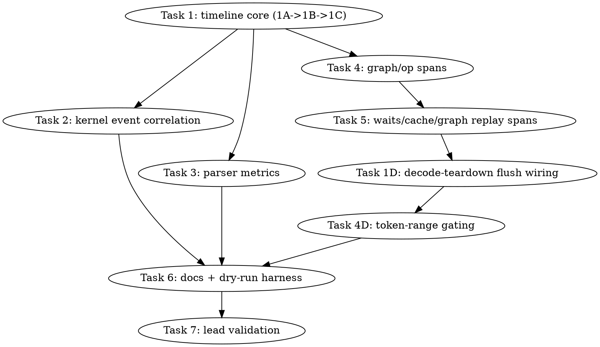

# SYCL Decode Timeline Profiler Implementation Plan

> **For Claude:** REQUIRED SUB-SKILL: Use team-driven-development to implement this plan with agent teams.

**Goal:** Add a default-off, in-process SYCL decode timeline profiler that attributes GPT-OSS TG wall time to host callsites, queue submits/waits, graph replay/record work, cache/materialization paths, and named SYCL GPU events.

**Architecture:** Extend the existing SYCL profiling stack instead of creating an external-only workflow. Add a small `sycl-timeline` layer under `ggml/src/ggml-sycl/` for Chrome Trace JSON spans, then connect existing `e2e-profile` stage scopes and `sycl-kernel-profiler` event labels to that timeline. The result is a portable Perfetto/Chrome artifact plus parser metrics that explain why named GPU events cover only ~38-39% of current B50 GPT-OSS FA-on decode wall time.

**Tech Stack:** C++17, SYCL event profiling, existing `ggml-sycl` backend, Python parser tests with `pytest`, CTest C++ unit tests, Chrome Trace JSON output.

**Test Infrastructure:** Existing unit/source tests live under `tests/`; SYCL backend CTest executables are registered in `ggml/src/ggml-sycl/CMakeLists.txt:1221-1234` and `tests/CMakeLists.txt:248-259`. Parser tests use `python3 -m pytest tests/test-sycl-*.py -q`. Lead-only runtime validation uses `/Apps/llama.cpp-mxfp4-tg-runtime/scripts/sycl-build.sh` and canonical oneAPI sourcing.

**Research Source:** `research.md:1-82` records the Option B basis: Chrome Trace host spans with file:line metadata, opportunistic SYCL event profiling, optional external VTune/Level Zero/XPTI validation, and the limitation that true GPU source-line attribution is a focused VTune deep-dive rather than an always-on promise.

**Non-goals:** No default-on profiler, no required VTune/ITT dependency, no worker-run B50/B580/model gates, no new optimization path, no change to model correctness behavior, no claim of reliable per-source-line GPU instruction attribution.

---

## Team Topology

**Recommended implementers:** 4 concurrent workers after Task 1 lands. Execution must spawn fresh reviewers for spec and quality review after each implementation task.

### Parallel Tracks

| Track | Tasks | Description |
|---|---|---|
| A | 1 | Timeline core and Chrome Trace writer schema. |
| B | 2 | Kernel profiler raw event/callsite capture, depends on Task 1. |
| C | 3 | Timeline parser and metric reporting, depends on Task 1 schema only. |
| D | 4, 5, 4D, 1D | Runtime instrumentation in `ggml-sycl.cpp`, cache/wait paths, token-range gating, and decode-teardown flush wiring, depends on Task 1 (macro only). Fully serialized on `ggml-sycl.cpp`. |
| E | 6 | Documentation and dry-run harness, depends on Tasks 1-5, 1D, 4D. |
| Lead | 7 | Build, automated gates, and lead-only model trace validation. |

### Dependency Graph



### File Ownership Map

| File | Tasks | Conflict Risk |
|---|---:|---|
| `ggml/src/ggml-sycl/sycl-timeline.hpp` | 1 | New file, Track A owns. |
| `ggml/src/ggml-sycl/sycl-timeline.cpp` | 1 | New file, Track A owns. |
| `tests/test-sycl-timeline.cpp` | 1 | New file, Track A owns. |
| `ggml/src/ggml-sycl/CMakeLists.txt:1221-1234` | 1 | Adds CTest target; coordinate with Task 6 if CMake snippets move. |
| `ggml/src/ggml-sycl/sycl-kernel-profiler.hpp:21-61` | 2 | Track B owns. |
| `ggml/src/ggml-sycl/sycl-kernel-profiler.cpp:34-87`, `:169-201`, `:299-360`, `:420-520` | 2 | Track B owns raw event/callsite fields and output. |
| `tests/test-sycl-kernel-profiler.cpp:35-167` | 2 | Track B owns. |
| `tests/test-sycl-kernel-profiler-source.py:20-50` | 2 | Track B owns. |
| `scripts/parse-sycl-timeline.py` | 3 | New file, Track C owns. |
| `tests/test-sycl-timeline-parser.py` | 3 | New file, Track C owns. |
| `ggml/src/ggml-sycl/ggml-sycl.cpp:78351-80718`, `:82152-82355`, `:90263-92253` | 4, 5, 1D, 4D | High conflict; Track D sequential ONLY (chain 4A->4B->4C->5A->5B->1D->4D). Line anchors drift as earlier links insert code — the source tests are text-anchored (`src.index(...)`), so anchor GREEN edits on text too, not raw line numbers. |
| `tests/test-sycl-timeline-flush-source.py` | 1D | New source test: decode-teardown flush wiring. |
| `tests/test-sycl-timeline-compute-forward-source.py` | 4 | New source test, Track D owns. |
| `tests/test-sycl-timeline-wait-graph-source.py` | 5 | New source test, Track D owns. |
| `ggml/src/ggml-sycl/unified-cache.cpp:2417-2606`, `:3210`, `:13808-13857` | 5 | Track D owns cache/materialization spans. |
| `tests/test-sycl-timeline-cache-source.py` | 5 | New source test, Track D owns. |
| `docs/backend/SYCL.md:1149-1236` | 6 | Track E owns docs. |
| `scripts/sycl-gptoss-decode-timeline-profile.sh` | 6 | New dry-run-first harness. |
| `tests/test-sycl-decode-timeline-profile-script.py` | 6 | New script test. |

---

## Testable Behaviors

- Timeline config is default-off and parses `GGML_SYCL_TIMELINE`, output path, token range, and event cap.
- Disabled timeline does not allocate trace rows or write files.
- Enabled timeline emits valid Chrome Trace JSON with host spans carrying `cat`, `name`, `ts`, `dur`, `pid`, `tid`, `file`, `line`, `function`, and metadata args.
- RAII scope macros bake caller `__FILE__`, `__LINE__`, and `__func__` without runtime symbolization.
- Existing named SYCL kernel profiler can emit raw per-event records with stable event ids, host submit brackets, event profiling timestamps or query failure status, queue/device/category/name/metadata, graph-recorded flag, and callsite metadata.
- `ggml_sycl_profile_submit` callsites get file:line attribution through a macro wrapper without adding waits.
- `graph_compute_impl`, per-node dispatch, `ggml_sycl_compute_forward`, early-handled routes, graph replay/record, pointer-table refresh, waits, BCS/DMA drains, cache host fallbacks, zone allocation failures, and transfer measurements produce timeline spans when enabled.
- Parser reports wall time, profiled GPU event sum, event coverage, host span totals by category, submit/wait/cache/graph totals, top callsites, and inter-event gaps.
- Enabled timeline flushes a Chrome Trace file to `GGML_SYCL_TIMELINE_OUTPUT` at decode teardown (same site as the E2E ledger force-flush); a disabled or path-less run writes nothing. (Task 1D)
- `GGML_SYCL_TIMELINE_TOKEN_START`/`_COUNT` gate span recording to a decode-step window so prompt-processing spans can be excluded from a decode trace; `token_count==0` records all steps. (Task 4D)
- Docs explain timeline modes, Perfetto viewing, worker restrictions, lead-only validation, and why source-line GPU attribution is optional VTune deep dive only.

---

## Tasks

### Task 1: Timeline Core and Chrome Trace Writer

**Track:** A  
**Depends on:** None

**File scope:**
- Create: `ggml/src/ggml-sycl/sycl-timeline.hpp`
- Create: `ggml/src/ggml-sycl/sycl-timeline.cpp`
- Create: `tests/test-sycl-timeline.cpp`
- Modify: `ggml/src/ggml-sycl/CMakeLists.txt:1221-1234`

**Description:** Build the default-off timeline substrate used by every later task. Current E2E profile state is a thread-local aggregate in `ggml/src/ggml-sycl/e2e-profile.cpp:10-20` and only prints aggregate stage lines in `e2e_tg_profile_force_flush()` at `e2e-profile.cpp:122-152`; this task adds event-level timeline capture while leaving that aggregate ledger intact.

**Acceptance Criteria:**
- [ ] `GGML_SYCL_TIMELINE` unset, empty, `0`, or `off` disables all timeline recording.
- [ ] `GGML_SYCL_TIMELINE=summary`, `timeline`, or `timeline+events` parses into distinct modes.
- [ ] A test-only scope emits one Chrome Trace complete event (`ph:"X"`) with file/line/function metadata.
- [ ] Output JSON is valid and contains top-level `traceEvents`.
- [ ] Disabled mode records zero rows and writes no file.

#### RED: Write These Failing Tests

Add `tests/test-sycl-timeline.cpp`:

```cpp
#include "sycl-timeline.hpp"

#include <cstdio>
#include <cstdlib>
#include <cstring>
#include <string>

static void require(bool condition, const char * message) {
    if (!condition) {
        std::fprintf(stderr, "test-sycl-timeline: %s\n", message);
        std::abort();
    }
}

static bool contains(const std::string & haystack, const char * needle) {
    return haystack.find(needle) != std::string::npos;
}

int main() {
    using namespace ggml_sycl;

    require(!sycl_timeline_enabled_from_env(nullptr), "null env must disable timeline");
    require(!sycl_timeline_enabled_from_env(""), "empty env must disable timeline");
    require(!sycl_timeline_enabled_from_env("0"), "zero env must disable timeline");
    require(!sycl_timeline_enabled_from_env("off"), "off env must disable timeline");
    require(sycl_timeline_enabled_from_env("summary"), "summary env must enable timeline");
    require(sycl_timeline_enabled_from_env("timeline"), "timeline env must enable timeline");
    require(sycl_timeline_enabled_from_env("timeline+events"), "timeline+events env must enable timeline");

    sycl_timeline_config cfg = sycl_timeline_config_from_values("timeline+events", "/tmp/unit-trace", "3", "4", "99");
    require(cfg.mode == sycl_timeline_mode::TIMELINE_EVENTS, "mode parse failed");
    require(cfg.output_path == "/tmp/unit-trace", "output path parse failed");
    require(cfg.token_start == 3, "token_start parse failed");
    require(cfg.token_count == 4, "token_count parse failed");
    require(cfg.max_events == 99, "max_events parse failed");

    sycl_timeline_reset_for_tests();
    sycl_timeline_set_config_for_tests(sycl_timeline_config{});
    {
        GGML_SYCL_TIMELINE_SCOPE("unit", "disabled-span", "case=disabled");
    }
    require(sycl_timeline_format_json_for_tests() == "{\"traceEvents\":[]}", "disabled timeline recorded events");

    cfg.enabled = true;
    sycl_timeline_set_config_for_tests(cfg);
    {
        GGML_SYCL_TIMELINE_SCOPE("unit", "enabled-span", "case=enabled");
    }
    const std::string json = sycl_timeline_format_json_for_tests();
    require(contains(json, "\"traceEvents\""), "missing traceEvents");
    require(contains(json, "\"ph\":\"X\""), "missing complete-event phase");
    require(contains(json, "\"cat\":\"unit\""), "missing category");
    require(contains(json, "\"name\":\"enabled-span\""), "missing name");
    require(contains(json, "\"file\":\""), "missing file metadata");
    require(contains(json, "\"line\":"), "missing line metadata");
    require(contains(json, "\"function\":\"main\""), "missing function metadata");
    require(contains(json, "\"metadata\":\"case=enabled\""), "missing metadata string");

    sycl_timeline_reset_for_tests();
    return 0;
}
```

Modify `ggml/src/ggml-sycl/CMakeLists.txt` after `test-sycl-e2e-profile` at `:1221-1234`:

```cmake
add_executable(test-sycl-timeline
    ${CMAKE_CURRENT_SOURCE_DIR}/../../../tests/test-sycl-timeline.cpp
    ${CMAKE_CURRENT_SOURCE_DIR}/sycl-timeline.cpp
)
target_include_directories(test-sycl-timeline PRIVATE
    ${CMAKE_CURRENT_SOURCE_DIR}
    ${CMAKE_CURRENT_SOURCE_DIR}/..
    ${CMAKE_CURRENT_SOURCE_DIR}/../../include
)
add_test(NAME test-sycl-timeline COMMAND test-sycl-timeline)
set_tests_properties(test-sycl-timeline PROPERTIES
    LABELS "sycl;profile;timeline;tdd"
    TIMEOUT 120
)
```

**Verify RED:**

```bash
set +u; source /opt/intel/oneapi/setvars.sh --force; set -u
./scripts/sycl-build.sh test-sycl-timeline
ctest --test-dir build -R test-sycl-timeline -V
```

Expected before implementation: build fails because `sycl-timeline.hpp`, `sycl-timeline.cpp`, and the symbols used by the test do not exist.

#### GREEN: Implement Minimal Code

Create `ggml/src/ggml-sycl/sycl-timeline.hpp` with these public symbols and macros:

```cpp
#pragma once

#include <chrono>
#include <cstdint>
#include <string>

namespace ggml_sycl {

enum class sycl_timeline_mode : uint8_t {
    OFF = 0,
    SUMMARY,
    TIMELINE,
    TIMELINE_EVENTS,
};

struct sycl_timeline_config {
    bool               enabled     = false;
    sycl_timeline_mode mode        = sycl_timeline_mode::OFF;
    std::string        output_path;
    int                token_start = 0;
    int                token_count = 0;
    int                max_events  = 200000;
};

struct sycl_timeline_callsite {
    const char * file     = "unknown";
    int          line     = 0;
    const char * function = "unknown";
};

bool sycl_timeline_enabled_from_env(const char * value);
bool sycl_timeline_enabled();
sycl_timeline_config sycl_timeline_config_from_env();
sycl_timeline_config sycl_timeline_config_from_values(const char * mode,
                                                      const char * output,
                                                      const char * token_start,
                                                      const char * token_count,
                                                      const char * max_events);
void sycl_timeline_record_span(const char * cat,
                               const char * name,
                               const char * metadata,
                               sycl_timeline_callsite callsite,
                               uint64_t start_us,
                               uint64_t dur_us,
                               uint64_t id = 0);
void sycl_timeline_flush(const char * reason);
void sycl_timeline_reset_for_tests();
void sycl_timeline_set_config_for_tests(const sycl_timeline_config & cfg);
std::string sycl_timeline_format_json_for_tests();
uint64_t sycl_timeline_now_us_for_tests();

class sycl_timeline_scope {
  public:
    sycl_timeline_scope(const char * cat,
                        const char * name,
                        const char * metadata,
                        sycl_timeline_callsite callsite,
                        bool enabled = sycl_timeline_enabled());
    ~sycl_timeline_scope();
    sycl_timeline_scope(const sycl_timeline_scope &) = delete;
    sycl_timeline_scope & operator=(const sycl_timeline_scope &) = delete;

  private:
    using clock = std::chrono::steady_clock;
    bool                   enabled_ = false;
    const char *           cat_ = "unknown";
    const char *           name_ = "unknown";
    const char *           metadata_ = "";
    sycl_timeline_callsite callsite_{};
    clock::time_point      start_{};
};

}  // namespace ggml_sycl

// NOTE: `##__LINE__` does NOT work — token-pasting suppresses expansion of its
// operand, so `ggml_sycl_timeline_scope_##__LINE__` yields the literal
// identifier `ggml_sycl_timeline_scope___LINE__` on every line. Two scopes in
// one block (e.g. Task 5A's adjacent bcs/dma drains) then collide -> build
// failure. Two-level CONCAT forces __LINE__ to expand to its number first.
#define GGML_SYCL_TL_CONCAT_(a, b) a##b
#define GGML_SYCL_TL_CONCAT(a, b)  GGML_SYCL_TL_CONCAT_(a, b)
#define GGML_SYCL_TIMELINE_SCOPE(cat, name, metadata) \
    ggml_sycl::sycl_timeline_scope GGML_SYCL_TL_CONCAT(ggml_sycl_timeline_scope_, __LINE__)( \
        (cat), (name), (metadata), \
        ggml_sycl::sycl_timeline_callsite{__FILE__, __LINE__, __func__})
```

Create `ggml/src/ggml-sycl/sycl-timeline.cpp` implementing:

- `parse_mode`: `summary`, `1`, `true`, `on` -> `SUMMARY`; `timeline` -> `TIMELINE`; `timeline+events`, `events` -> `TIMELINE_EVENTS`; disabled strings -> `OFF`.
- State with `std::mutex`, `std::vector<timeline_event>`, cached env config, and test override.
- `timeline_event` fields: category, name, metadata, file, line, function, start_us, dur_us, tid hash, id.
- JSON output exactly begins `{\"traceEvents\":[` and uses Chrome Trace complete events.
- `sycl_timeline_scope` records only when enabled.

Use `std::chrono::steady_clock` for host timestamps; do not claim these are in the same clock domain as device event profiling timestamps.

**Verify GREEN:**

```bash
set +u; source /opt/intel/oneapi/setvars.sh --force; set -u
./scripts/sycl-build.sh test-sycl-timeline
ctest --test-dir build -R test-sycl-timeline -V
```

Expected: `100% tests passed` for `test-sycl-timeline`.

#### REFACTOR

Keep this layer dependency-free: no SYCL include in `sycl-timeline.hpp`, no VTune/ITT dependency, no `std::atexit`, and no output file writes except explicit `sycl_timeline_flush()`.

**Verify still GREEN:** same CTest command.

#### Gotchas

- `std::chrono::high_resolution_clock` is already used heavily in `ggml-sycl.cpp`, but timeline spans should use `steady_clock` to avoid host wall-clock jumps.
- Keep disabled mode cheap; do not allocate event vectors when disabled.
- `GGML_SOURCES_SYCL` is globbed in `ggml/src/ggml-sycl/CMakeLists.txt:42-63`, so the new `.cpp` joins the backend automatically; the standalone test still needs explicit source registration.
- Do not add a global `std::atexit` flush; existing kernel profiler tests explicitly require explicit flushes only in `tests/test-sycl-kernel-profiler-source-copy.py:30-38`.

#### Commit

```bash
git add ggml/src/ggml-sycl/sycl-timeline.hpp ggml/src/ggml-sycl/sycl-timeline.cpp tests/test-sycl-timeline.cpp ggml/src/ggml-sycl/CMakeLists.txt
git commit -m "feat(sycl): add decode timeline trace core"
```

---

### Task 2: Correlate Named SYCL Events with Timeline Callsites

**Track:** B  
**Depends on:** Task 1

**File scope:**
- Modify: `ggml/src/ggml-sycl/sycl-kernel-profiler.hpp:21-61`
- Modify: `ggml/src/ggml-sycl/sycl-kernel-profiler.cpp:34-87`, `:169-201`, `:299-360`, `:420-520`
- Modify: `tests/test-sycl-kernel-profiler.cpp:35-167`
- Modify: `tests/test-sycl-kernel-profiler-source.py:20-50`

**Description:** The current kernel profiler aggregates named events by `(name, category, metadata)` and records only event duration in `add_sample_locked()` at `sycl-kernel-profiler.cpp:191-196`. Add raw-event/callsite data so each named event can be tied back to a host submit bracket and eventual timeline span.

**Acceptance Criteria:**
- [ ] Existing CSV aggregate output remains backward-compatible.
- [ ] JSON output gains a `raw_events` array only when `raw_events=true`.
- [ ] Raw events include stable `event_id`, label fields, `host_submit_begin_us`, `host_submit_end_us`, `device_submit_ns`, `device_start_ns`, `device_end_ns`, `duration_ns`, `timestamp_status`, `file`, `line`, `function`, and `graph_recorded`.
- [ ] Existing `ggml_sycl_profile_submit(queue, label, lambda)` callsites get caller `__FILE__`, `__LINE__`, `__func__` through a macro without editing every callsite manually in this task.
- [ ] No wait is introduced by the submit wrapper.

#### RED: Write These Failing Tests

Extend `tests/test-sycl-kernel-profiler.cpp` after the current JSON assertions around `:109-114`:

```cpp
    CHECK(contains(json, "\"raw_events\""), "missing raw_events array when raw_events is enabled");
    CHECK(contains(json, "\"event_id\":"), "missing raw event id");
    CHECK(contains(json, "\"host_submit_begin_us\":"), "missing host submit begin timestamp");
    CHECK(contains(json, "\"host_submit_end_us\":"), "missing host submit end timestamp");
    CHECK(contains(json, "\"timestamp_status\":\"test\""), "missing raw timestamp status");
    CHECK(contains(json, "\"file\":\"tests/test-sycl-kernel-profiler.cpp\""), "missing raw callsite file");
    CHECK(contains(json, "\"function\":\"main\""), "missing raw callsite function");
```

Add a test-only raw event before formatting JSON:

```cpp
    ggml_sycl_kernel_profile_add_raw_event_for_test(slow,
                                                    42,
                                                    100,
                                                    110,
                                                    1000,
                                                    1200,
                                                    1800,
                                                    "test",
                                                    "tests/test-sycl-kernel-profiler.cpp",
                                                    123,
                                                    "main",
                                                    false);
```

Extend `tests/test-sycl-kernel-profiler-source.py`:

```python
def test_profile_submit_macro_captures_callsite_and_stays_wait_free() -> None:
    header = HEADER.read_text(encoding="utf-8")
    assert "ggml_sycl_profile_submit_impl" in header
    assert "#define ggml_sycl_profile_submit(q, label, submit_fn)" in header
    macro = slice_between(header, "#define ggml_sycl_profile_submit(q, label, submit_fn)", "inline sycl::event ggml_sycl_profile_record_returned_event")
    assert "__FILE__" in macro
    assert "__LINE__" in macro
    assert "__func__" in macro
    impl = slice_between(header, "ggml_sycl_profile_submit_impl", "#define ggml_sycl_profile_submit")
    assert "submit_fn(q)" in impl
    assert ".wait(" not in impl
    assert "ggml_sycl_kernel_profile_record_event" in impl
```

**Verify RED:**

```bash
set +u; source /opt/intel/oneapi/setvars.sh --force; set -u
./scripts/sycl-build.sh test-sycl-kernel-profiler
ctest --test-dir build -R test-sycl-kernel-profiler -V
python3 -m pytest tests/test-sycl-kernel-profiler-source.py -q
```

Expected before implementation: C++ build or test fails because `ggml_sycl_kernel_profile_add_raw_event_for_test` and macro/impl symbols do not exist; Python source test fails because callsite macro is absent.

#### GREEN: Implement Minimal Code

In `sycl-kernel-profiler.hpp`:

1. Include `sycl-timeline.hpp`.
2. Add test helper declaration:

```cpp
void ggml_sycl_kernel_profile_add_raw_event_for_test(const ggml_sycl_profile_label & label,
                                                     uint64_t event_id,
                                                     uint64_t host_submit_begin_us,
                                                     uint64_t host_submit_end_us,
                                                     uint64_t device_submit_ns,
                                                     uint64_t device_start_ns,
                                                     uint64_t device_end_ns,
                                                     const char * timestamp_status,
                                                     const char * file,
                                                     int line,
                                                     const char * function,
                                                     bool graph_recorded);
```

3. Rename the template body to `ggml_sycl_profile_submit_impl` and add callsite parameters:

```cpp
template <typename SubmitFn>
inline sycl::event ggml_sycl_profile_submit_impl(sycl::queue & q,
                                                 const ggml_sycl_profile_label & label,
                                                 ggml_sycl::sycl_timeline_callsite callsite,
                                                 SubmitFn && submit_fn) {
    const bool profile_enabled = ggml_sycl_kernel_profile_enabled();
    const uint64_t host_begin_us = profile_enabled ? ggml_sycl::sycl_timeline_now_us_for_tests() : 0;
    sycl::event event = submit_fn(q);
    const uint64_t host_end_us = profile_enabled ? ggml_sycl::sycl_timeline_now_us_for_tests() : 0;
    if (profile_enabled) {
        ggml_sycl_kernel_profile_record_event(label, event, callsite, host_begin_us, host_end_us);
    }
    return event;
}

#define ggml_sycl_profile_submit(q, label, submit_fn) \
    ggml_sycl_profile_submit_impl((q), (label), ggml_sycl::sycl_timeline_callsite{__FILE__, __LINE__, __func__}, (submit_fn))
```

4. Change `ggml_sycl_kernel_profile_record_event` declaration to accept callsite and host bracket parameters, with defaults for existing direct callers:

```cpp
void ggml_sycl_kernel_profile_record_event(const ggml_sycl_profile_label & label,
                                           const sycl::event & event,
                                           ggml_sycl::sycl_timeline_callsite callsite = {},
                                           uint64_t host_submit_begin_us = 0,
                                           uint64_t host_submit_end_us = 0);
```

In `sycl-kernel-profiler.cpp`:

- Extend `pending_profile_event` with event id, callsite, host submit begin/end.
- Add `raw_profile_event` vector to `profiler_state`.
- Allocate event ids with `std::atomic<uint64_t> next_event_id{1}`.
- When timestamps query succeeds, append raw event if `cfg.raw_events` is true.
- When query fails, append raw event with `timestamp_status="query_failed"` and zero device timestamps.
- In test helper, append raw event with `timestamp_status="test"`.
- Keep aggregate CSV unchanged.
- Extend JSON object from `{"kernels":[...]}` to `{"kernels":[...],"raw_events":[...]}` when config raw events is true; when raw events is false, keep `{"kernels":[...]}`.
- Also call `ggml_sycl::sycl_timeline_record_span("sycl.submit", label.name, label.metadata, callsite, host_submit_begin_us, host_submit_end_us - host_submit_begin_us, event_id)` when timeline is enabled.

**Verify GREEN:**

```bash
set +u; source /opt/intel/oneapi/setvars.sh --force; set -u
./scripts/sycl-build.sh test-sycl-kernel-profiler test-sycl-timeline
ctest --test-dir build -R "test-sycl-kernel-profiler|test-sycl-timeline" -V
python3 -m pytest tests/test-sycl-kernel-profiler-source.py tests/test-sycl-kernel-profiler-source-mmvq.py tests/test-sycl-kernel-profiler-source-copy.py -q
```

Expected: all listed tests pass.

#### REFACTOR

If raw JSON formatting becomes bulky, add local helper functions only inside `sycl-kernel-profiler.cpp`; do not add third-party JSON dependencies.

#### Gotchas

- Macro shadowing `ggml_sycl_profile_submit` is intentional; put the macro after the `_impl` template definition and before callsites include the header.
- Do not wrap `ggml_sycl_profile_submit_for_test`; existing tests use it to avoid a live SYCL queue.
- Do not force waits in `record_event`; `drain_pending_events(false)` must stay opportunistic unless flush mode requests waiting.
- Device `command_submit`, `command_start`, and `command_end` timestamps are not host `steady_clock` timestamps. Record durations and raw values; do not pretend cross-domain absolute alignment.

#### Commit

```bash
git add ggml/src/ggml-sycl/sycl-kernel-profiler.hpp ggml/src/ggml-sycl/sycl-kernel-profiler.cpp tests/test-sycl-kernel-profiler.cpp tests/test-sycl-kernel-profiler-source.py
git commit -m "feat(sycl): correlate kernel profile events with timeline callsites"
```

---

### Task 3: Timeline Parser and Gap Metrics

**Track:** C  
**Depends on:** Task 1

**File scope:**
- Create: `scripts/parse-sycl-timeline.py`
- Create: `tests/test-sycl-timeline-parser.py`

**Description:** Current `scripts/parse-sycl-kernel-profile.py:108-173` summarizes aggregate kernel rows and coverage if `--wall-ms` is passed, but it cannot read Chrome Trace spans or report host-side buckets. Add a companion parser for timeline artifacts.

**Acceptance Criteria:**
- [ ] Parser accepts Chrome Trace JSON with `traceEvents`.
- [ ] Parser reports total host span time by category.
- [ ] Parser reports `timeline.wall_ms_x1000` using either `--wall-ms` or the envelope of selected spans.
- [ ] Parser reports `timeline.gpu_event_total_ms_x1000`, `timeline.gpu_event_coverage_pct_x1000`, and `timeline.unattributed_ms_x1000`.
- [ ] Parser reports top callsites sorted by duration.
- [ ] Parser reports inter-event gaps per queue/device when events include raw `device_start_ns`/`device_end_ns` args.
- [ ] Malformed JSON or non-finite wall time exits 2 without traceback.

#### RED: Write These Failing Tests

Create `tests/test-sycl-timeline-parser.py`:

```python
#!/usr/bin/env python3
from __future__ import annotations

import json
import pathlib
import subprocess
import sys
import tempfile

ROOT = pathlib.Path(__file__).resolve().parents[1]
PARSER = ROOT / "scripts" / "parse-sycl-timeline.py"

TRACE = {
    "traceEvents": [
        {
            "ph": "X",
            "cat": "ggml.graph",
            "name": "graph_compute_impl",
            "ts": 1000,
            "dur": 10000,
            "pid": 1,
            "tid": 7,
            "args": {"file": "ggml/src/ggml-sycl/ggml-sycl.cpp", "line": 78351, "function": "ggml_backend_sycl_graph_compute_impl"},
        },
        {
            "ph": "X",
            "cat": "sycl.submit",
            "name": "mxfp4.gateup.xmx_tiled_dpas_m2",
            "ts": 2000,
            "dur": 100,
            "pid": 1,
            "tid": 7,
            "args": {"file": "ggml/src/ggml-sycl/mmvq.cpp", "line": 1234, "function": "submit_gate", "event_id": 1},
        },
        {
            "ph": "X",
            "cat": "sycl.wait",
            "name": "graph-compute-exit",
            "ts": 9000,
            "dur": 1500,
            "pid": 1,
            "tid": 7,
            "args": {"file": "ggml/src/ggml-sycl/ggml-sycl.cpp", "line": 92235, "function": "ggml_backend_sycl_graph_compute"},
        },
        {
            "ph": "X",
            "cat": "sycl.event",
            "name": "mxfp4.gateup.xmx_tiled_dpas_m2",
            "ts": 0,
            "dur": 3000,
            "pid": 1,
            "tid": 1,
            "args": {"device": 1, "queue_kind": "compute", "event_id": 1, "device_start_ns": 10000, "device_end_ns": 13000},
        },
        {
            "ph": "X",
            "cat": "sycl.event",
            "name": "mxfp4.down.q8_soa",
            "ts": 0,
            "dur": 2000,
            "pid": 1,
            "tid": 1,
            "args": {"device": 1, "queue_kind": "compute", "event_id": 2, "device_start_ns": 16000, "device_end_ns": 18000},
        },
    ]
}


def run_parser(path: pathlib.Path, *args: str) -> subprocess.CompletedProcess[str]:
    return subprocess.run(
        [sys.executable, str(PARSER), *args, str(path)],
        text=True,
        stdout=subprocess.PIPE,
        stderr=subprocess.STDOUT,
        check=False,
    )


def test_parser_reports_host_gpu_coverage_and_top_callsites() -> None:
    with tempfile.TemporaryDirectory() as tmp_raw:
        path = pathlib.Path(tmp_raw) / "trace.json"
        path.write_text(json.dumps(TRACE), encoding="utf-8")
        result = run_parser(path, "--wall-ms", "10")
        assert result.returncode == 0, result.stdout
        assert "timeline.wall_ms_x1000 10000" in result.stdout
        assert "timeline.gpu_event_total_ms_x1000 5" in result.stdout
        assert "timeline.gpu_event_coverage_pct_x1000 50" in result.stdout
        assert "timeline.unattributed_ms_x1000 9995" in result.stdout
        assert "category.ggml.graph.host_ms_x1000 10000" in result.stdout
        assert "category.sycl.submit.host_ms_x1000 100" in result.stdout
        assert "category.sycl.wait.host_ms_x1000 1500" in result.stdout
        assert "callsite.ggml/src/ggml-sycl/ggml-sycl.cpp:78351:ggml_backend_sycl_graph_compute_impl.host_ms_x1000 10000" in result.stdout
        assert "gap.device1.compute.count 1" in result.stdout
        assert "gap.device1.compute.total_ms_x1000 3" in result.stdout


def test_parser_rejects_bad_wall_ms_without_traceback() -> None:
    with tempfile.TemporaryDirectory() as tmp_raw:
        path = pathlib.Path(tmp_raw) / "trace.json"
        path.write_text(json.dumps(TRACE), encoding="utf-8")
        result = run_parser(path, "--wall-ms", "nan")
        assert result.returncode == 2
        assert "--wall-ms must be finite and greater than zero" in result.stdout
        assert "Traceback" not in result.stdout


def test_parser_rejects_malformed_trace_without_traceback() -> None:
    with tempfile.TemporaryDirectory() as tmp_raw:
        path = pathlib.Path(tmp_raw) / "trace.json"
        path.write_text("not json", encoding="utf-8")
        result = run_parser(path)
        assert result.returncode == 2
        assert "failed to parse timeline" in result.stdout
        assert "Traceback" not in result.stdout
```

**Verify RED:**

```bash
python3 -m pytest tests/test-sycl-timeline-parser.py -q
```

Expected before implementation: fails because `scripts/parse-sycl-timeline.py` does not exist.

#### GREEN: Implement Minimal Code

Create `scripts/parse-sycl-timeline.py`:

```python
#!/usr/bin/env python3
from __future__ import annotations

import argparse
import json
import math
import pathlib
import sys
from collections import Counter
from typing import Any


def parse_wall_ms(raw: str) -> float:
    try:
        value = float(raw)
    except ValueError as exc:
        raise argparse.ArgumentTypeError(f"invalid wall millisecond value: {raw}") from exc
    if not math.isfinite(value) or value <= 0:
        raise argparse.ArgumentTypeError("--wall-ms must be finite and greater than zero")
    return value


def metric_name(raw: str) -> str:
    return raw.replace(" ", "_")


def load_trace(path: pathlib.Path) -> list[dict[str, Any]]:
    obj = json.loads(path.read_text(encoding="utf-8"))
    events = obj.get("traceEvents")
    if not isinstance(events, list):
        raise ValueError("missing traceEvents array")
    return [event for event in events if isinstance(event, dict)]


def event_dur_us(event: dict[str, Any]) -> int:
    raw = event.get("dur", 0)
    return int(raw) if isinstance(raw, int | float) else 0


def main(argv: list[str]) -> int:
    parser = argparse.ArgumentParser(description="Summarize SYCL decode timeline Chrome Trace artifacts")
    parser.add_argument("trace", type=pathlib.Path)
    parser.add_argument("--wall-ms", type=parse_wall_ms)
    parser.add_argument("--top-callsites", type=int, default=20)
    args = parser.parse_args(argv)

    try:
        events = load_trace(args.trace)
    except (OSError, json.JSONDecodeError, ValueError) as exc:
        print(f"failed to parse timeline: {exc}")
        return 2

    host_by_category: Counter[str] = Counter()
    host_by_callsite: Counter[str] = Counter()
    gpu_event_us = 0
    gpu_by_queue: dict[tuple[int, str], list[tuple[int, int]]] = {}
    min_ts = None
    max_ts = None

    for event in events:
        cat = str(event.get("cat", "unknown"))
        dur = event_dur_us(event)
        ts_raw = event.get("ts", 0)
        ts = int(ts_raw) if isinstance(ts_raw, int | float) else 0
        if cat != "sycl.event":
            host_by_category[cat] += dur
            args_obj = event.get("args", {}) if isinstance(event.get("args"), dict) else {}
            file = str(args_obj.get("file", "unknown"))
            line = int(args_obj.get("line", 0)) if isinstance(args_obj.get("line", 0), int) else 0
            function = str(args_obj.get("function", "unknown"))
            host_by_callsite[f"{file}:{line}:{function}"] += dur
            min_ts = ts if min_ts is None else min(min_ts, ts)
            max_ts = ts + dur if max_ts is None else max(max_ts, ts + dur)
        else:
            gpu_event_us += dur
            args_obj = event.get("args", {}) if isinstance(event.get("args"), dict) else {}
            device = int(args_obj.get("device", -1)) if isinstance(args_obj.get("device", -1), int) else -1
            queue_kind = str(args_obj.get("queue_kind", "unknown"))
            start = int(args_obj.get("device_start_ns", 0)) if isinstance(args_obj.get("device_start_ns", 0), int) else 0
            end = int(args_obj.get("device_end_ns", 0)) if isinstance(args_obj.get("device_end_ns", 0), int) else 0
            if end >= start and start > 0:
                gpu_by_queue.setdefault((device, queue_kind), []).append((start, end))

    wall_ms = args.wall_ms if args.wall_ms is not None else ((max_ts or 0) - (min_ts or 0)) / 1000.0
    wall_us = int(round(wall_ms * 1000.0))
    print(f"timeline.wall_ms_x1000 {int(round(wall_ms * 1000.0))}")
    print(f"timeline.gpu_event_total_ms_x1000 {int(round(gpu_event_us))}")
    coverage = 0 if wall_us <= 0 else int(round(100000.0 * gpu_event_us / wall_us))
    print(f"timeline.gpu_event_coverage_pct_x1000 {coverage}")
    print(f"timeline.unattributed_ms_x1000 {max(0, wall_us - gpu_event_us)}")

    for category, dur_us in sorted(host_by_category.items()):
        print(f"category.{metric_name(category)}.host_ms_x1000 {dur_us}")

    for callsite, dur_us in host_by_callsite.most_common(max(0, args.top_callsites)):
        print(f"callsite.{metric_name(callsite)}.host_ms_x1000 {dur_us}")

    for (device, queue_kind), ranges in sorted(gpu_by_queue.items()):
        ranges.sort()
        total_gap_ns = 0
        gap_count = 0
        last_end = None
        for start, end in ranges:
            if last_end is not None and start > last_end:
                total_gap_ns += start - last_end
                gap_count += 1
            last_end = max(last_end or end, end)
        key = f"device{device}.{metric_name(queue_kind)}"
        print(f"gap.{key}.count {gap_count}")
        print(f"gap.{key}.total_ms_x1000 {int(round(total_gap_ns / 1000.0))}")

    return 0


if __name__ == "__main__":
    raise SystemExit(main(sys.argv[1:]))
```

**Verify GREEN:**

```bash
python3 -m pytest tests/test-sycl-timeline-parser.py -q
```

Expected: all tests pass.

#### REFACTOR

After Task 2 lands, extend parser tests with a real raw-event-shaped trace emitted by `sycl-kernel-profiler.cpp`, but keep this task focused on standalone timeline parser behavior.

#### Gotchas

- Chrome Trace `dur` is microseconds; existing kernel parser uses nanoseconds. Keep printed metric suffixes explicit.
- The unit test intentionally expects a tiny `5` x1000-ms GPU total because synthetic `dur` values are microseconds. Do not convert it as nanoseconds.
- Do not add `--top`; this repository already had a parser mismatch where `--top 20` was invalid.

#### Commit

```bash
git add scripts/parse-sycl-timeline.py tests/test-sycl-timeline-parser.py
git commit -m "feat(sycl): add decode timeline parser"
```

---

### Task 4: Instrument Graph Compute and Per-Op Dispatch Spans

**Track:** D  
**Depends on:** Task 1 (the `GGML_SYCL_TIMELINE_SCOPE` macro only — Task 4 does not touch the kernel profiler and therefore does not depend on Task 2; the tracker wires `kxmr`/4A on `wvcl`/1C alone)

**File scope:**
- Modify: `ggml/src/ggml-sycl/ggml-sycl.cpp:71340-71504`, `:78351-80718`
- Create: `tests/test-sycl-timeline-compute-forward-source.py`

**Description:** Add high-level decode wall-time spans around graph execution and per-node/op dispatch. Current `ggml_backend_sycl_graph_compute_impl()` begins at `ggml-sycl.cpp:78351`, uses ad hoc phase timing at `:78440-78455`, and loops through nodes around `:79973-80012`. Current `ggml_sycl_compute_forward()` uses an E2E aggregate scope around `:71500-71504` and resets/flushed later; this task adds file:line timeline spans at the same boundaries.

**Acceptance Criteria:**
- [ ] `ggml_backend_sycl_graph_compute_impl` has a `ggml.graph/graph_compute_impl` timeline scope covering the whole function body after re-entry guard construction.
- [ ] Each node dispatch has a `ggml.op/compute_forward_node` span with node index, op name, tensor name, type, and shape metadata.
- [ ] `ggml_sycl_compute_forward` has a `ggml.op/compute_forward` span around the switch dispatch.
- [ ] Early handled routes call a timeline instant/span before returning.
- [ ] Source tests verify no `.wait(` or `wait_and_throw` is introduced in these instrumentation blocks.

#### RED: Write These Failing Tests

Create `tests/test-sycl-timeline-compute-forward-source.py`:

```python
#!/usr/bin/env python3
from __future__ import annotations

from pathlib import Path

ROOT = Path(__file__).resolve().parents[1]
GGML_SYCL = ROOT / "ggml/src/ggml-sycl/ggml-sycl.cpp"


def matching_brace(source: str, open_brace: int) -> int:
    depth = 0
    for index in range(open_brace, len(source)):
        char = source[index]
        if char == "{":
            depth += 1
        elif char == "}":
            depth -= 1
            if depth == 0:
                return index
    raise AssertionError("no matching brace")


def test_graph_compute_impl_has_timeline_scope() -> None:
    src = GGML_SYCL.read_text(encoding="utf-8")
    begin = src.index("static void ggml_backend_sycl_graph_compute_impl")
    body_open = src.index("{", begin)
    body_close = matching_brace(src, body_open)
    body = src[body_open:body_close]
    guard = body.index("compute_impl_guard _reentry_guard")
    scope = body.index('GGML_SYCL_TIMELINE_SCOPE("ggml.graph", "graph_compute_impl"', guard)
    start = body.index("auto t_compute_start", scope)
    assert guard < scope < start
    assert ".wait(" not in body[scope:start]
    assert "wait_and_throw" not in body[scope:start]


def test_node_dispatch_has_timeline_scope_with_metadata() -> None:
    src = GGML_SYCL.read_text(encoding="utf-8")
    node_loop = src.index("for (int i = 0; i < cgraph->n_nodes; ++i)")
    compute_call = src.index("bool ok = ggml_sycl_compute_forward(*sycl_ctx, node);", node_loop)
    window = src[node_loop:compute_call]
    assert 'GGML_SYCL_TIMELINE_SCOPE("ggml.op", "compute_forward_node"' in window
    assert "ggml_sycl_timeline_node_metadata" in window
    assert "node->name" in window
    assert "ggml_op_name(node->op)" in window
    assert ".wait(" not in window
    assert "wait_and_throw" not in window


def test_compute_forward_has_timeline_scope_and_early_route_event() -> None:
    src = GGML_SYCL.read_text(encoding="utf-8")
    begin = src.index("static bool ggml_sycl_compute_forward(ggml_backend_sycl_context & ctx, struct ggml_tensor * dst) try {")
    end = src.index("// WEDGE-T4: GGML_SYCL_SAFE_MODE", begin)
    body = src[begin:end]
    helper = body.index("auto e2e_record_early_handled_route")
    assert 'GGML_SYCL_TIMELINE_SCOPE("ggml.op", "early_handled_route"' in body[helper:body.index("};", helper)]
    switch = body.index("switch (dst->op)")
    scope = body.rindex('GGML_SYCL_TIMELINE_SCOPE("ggml.op", "compute_forward"', 0, switch)
    assert scope < switch
    assert "ggml_sycl_timeline_tensor_metadata" in body[scope:switch]
    assert ".wait(" not in body[scope:switch]
    assert "wait_and_throw" not in body[scope:switch]
```

**Verify RED:**

```bash
python3 -m pytest tests/test-sycl-timeline-compute-forward-source.py -q
```

Expected before implementation: all tests fail because timeline include/helpers/scopes are absent from `ggml-sycl.cpp`.

#### GREEN: Implement Minimal Code

In `ggml-sycl.cpp` includes, add:

```cpp
#include "sycl-timeline.hpp"
```

Near the existing graph/timing helpers, add metadata helpers:

```cpp
static std::string ggml_sycl_timeline_tensor_metadata(const ggml_tensor * tensor, int device) {
    if (!tensor) {
        return "tensor=null";
    }
    char buffer[512];
    std::snprintf(buffer, sizeof(buffer),
                  "device=%d;op=%s;tensor=%s;type=%s;ne=%lld,%lld,%lld,%lld",
                  device,
                  ggml_op_name(tensor->op),
                  tensor->name ? tensor->name : "",
                  ggml_type_name(tensor->type),
                  (long long) tensor->ne[0],
                  (long long) tensor->ne[1],
                  (long long) tensor->ne[2],
                  (long long) tensor->ne[3]);
    return std::string(buffer);
}

static std::string ggml_sycl_timeline_node_metadata(const ggml_tensor * node, int device, int node_idx, int n_nodes) {
    std::string meta = ggml_sycl_timeline_tensor_metadata(node, device);
    char suffix[128];
    std::snprintf(suffix, sizeof(suffix), ";node=%d/%d", node_idx, n_nodes);
    meta += suffix;
    return meta;
}
```

In `ggml_backend_sycl_graph_compute_impl()` after `compute_impl_guard _reentry_guard(sycl_ctx->device);` at `ggml-sycl.cpp:78412`, add:

```cpp
    const std::string graph_timeline_metadata = cgraph ? ggml_sycl_timeline_node_metadata(nullptr, sycl_ctx->device, -1, cgraph->n_nodes) : "graph=null";
    GGML_SYCL_TIMELINE_SCOPE("ggml.graph", "graph_compute_impl", graph_timeline_metadata.c_str());
```

Use a direct metadata string instead if `node=null` format is not desired:

```cpp
    char graph_timeline_metadata_buf[128];
    std::snprintf(graph_timeline_metadata_buf, sizeof(graph_timeline_metadata_buf), "device=%d;nodes=%d", sycl_ctx->device, cgraph ? cgraph->n_nodes : 0);
    GGML_SYCL_TIMELINE_SCOPE("ggml.graph", "graph_compute_impl", graph_timeline_metadata_buf);
```

In the node loop before `bool ok = ggml_sycl_compute_forward(*sycl_ctx, node);` at `ggml-sycl.cpp:80011`, add:

```cpp
            const std::string node_timeline_metadata = ggml_sycl_timeline_node_metadata(node, sycl_ctx->device, i, cgraph->n_nodes);
            GGML_SYCL_TIMELINE_SCOPE("ggml.op", "compute_forward_node", node_timeline_metadata.c_str());
```

In `ggml_sycl_compute_forward()` before the existing `std::optional<ggml_sycl::e2e_tg_scope> e2e_scope;` at `ggml-sycl.cpp:71500`, add:

```cpp
    const std::string compute_forward_metadata = ggml_sycl_timeline_tensor_metadata(dst, ctx.device);
    GGML_SYCL_TIMELINE_SCOPE("ggml.op", "compute_forward", compute_forward_metadata.c_str());
```

Inside `auto e2e_record_early_handled_route = [&]()` at `ggml-sycl.cpp:71340-71349`, add at the top:

```cpp
        const std::string early_route_metadata = ggml_sycl_timeline_tensor_metadata(dst, ctx.device);
        GGML_SYCL_TIMELINE_SCOPE("ggml.op", "early_handled_route", early_route_metadata.c_str());
```

**Verify GREEN:**

```bash
python3 -m pytest tests/test-sycl-timeline-compute-forward-source.py -q
set +u; source /opt/intel/oneapi/setvars.sh --force; set -u
./scripts/sycl-build.sh test-sycl-timeline llama-bench
ctest --test-dir build -R test-sycl-timeline -V
```

Expected: source tests and CTest pass.

#### REFACTOR

If constructing metadata strings when timeline is disabled shows measurable overhead, guard metadata construction with `if (ggml_sycl::sycl_timeline_enabled())`; preserve tests by checking the helper and scope inside the enabled branch.

#### Gotchas

- The macro stores `metadata.c_str()`; the RAII constructor must copy metadata into its event or preserve it only for the scope lifetime. Task 1 implementation must copy strings before the local `std::string` is destroyed.
- Avoid adding `.wait()` in instrumentation. Current source tests explicitly check wait-free instrumentation.
- `ggml_sycl_compute_forward` is very hot; if metadata construction is unguarded it may perturb TG numbers even with timeline disabled.

#### Commit

```bash
git add ggml/src/ggml-sycl/ggml-sycl.cpp tests/test-sycl-timeline-compute-forward-source.py
git commit -m "feat(sycl): trace decode graph and op dispatch spans"
```

---

### Task 5: Instrument Waits, Graph Replay, and Cache/Transfer Spans

**Track:** D  
**Depends on:** Task 4

**File scope:**
- Modify: `ggml/src/ggml-sycl/ggml-sycl.cpp:78241-78270`, `:78381-78390`, `:80670-80678`, `:82152-82355`, `:92223-92253`
- Modify: `ggml/src/ggml-sycl/unified-cache.cpp:2417-2606`, `:3210`, `:13808-13857`
- Create: `tests/test-sycl-timeline-wait-graph-source.py`
- Create: `tests/test-sycl-timeline-cache-source.py`

**Description:** Attribute the most likely hidden wall-time buckets: waits/synchronization, command graph record/replay, pointer-table refresh, queue drains, and unified-cache fallback/materialization. Current wait helper locations are discoverable via `ggml_sycl_trace_queue_wait` at `ggml-sycl.cpp:78241` and callsites at `:79987`, `:80023`, `:80110`, `:80690`, `:92235`, and `:92244`. Graph replay work happens around pointer-table refresh and `ext_oneapi_graph(*exec_graph)` at `ggml-sycl.cpp:82152-82355`. Cache fallback E2E events already exist in `unified-cache.cpp:2417-2606` and zone allocation failures in `:13808-13857`.

**Acceptance Criteria:**
- [ ] Every `ggml_sycl_trace_queue_wait` wait records a `sycl.wait` span with reason, device, node index, op, and tensor metadata.
- [ ] BCS/DMA drains in `compute_impl_guard` record wait spans without changing exception behavior.
- [ ] Graph pointer-table refresh, record, and replay submit paths record `sycl.graph` spans.
- [ ] `ext_oneapi_graph(*exec_graph)` replay is enclosed in a span named `moe_sequence_graphlet_replay`.
- [ ] Unified-cache host fallback and zone allocation failure paths record `cache` spans with bytes and path names.
- [ ] Source tests prove instrumentation is gated and does not introduce forced waits.

#### RED: Write These Failing Tests

Create `tests/test-sycl-timeline-wait-graph-source.py`:

```python
#!/usr/bin/env python3
from __future__ import annotations

from pathlib import Path

ROOT = Path(__file__).resolve().parents[1]
GGML_SYCL = ROOT / "ggml/src/ggml-sycl/ggml-sycl.cpp"


def slice_between(text: str, start: str, end: str) -> str:
    begin = text.index(start)
    finish = text.index(end, begin + len(start))
    return text[begin:finish]


def test_trace_queue_wait_records_timeline_wait_span() -> None:
    src = GGML_SYCL.read_text(encoding="utf-8")
    body = slice_between(src, "static void ggml_sycl_trace_queue_wait", "static void ggml_sycl_trace_memcpy_during_recording")
    assert 'GGML_SYCL_TIMELINE_SCOPE("sycl.wait", reason' in body
    assert "ggml_sycl_timeline_node_metadata" in body
    assert "q->wait" in body or "q->wait_and_throw" in body


def test_compute_impl_guard_bcs_dma_waits_are_traced() -> None:
    src = GGML_SYCL.read_text(encoding="utf-8")
    body = slice_between(src, "struct compute_impl_guard", "const auto t_impl_entry")
    assert 'GGML_SYCL_TIMELINE_SCOPE("sycl.wait", "bcs_queue_drain"' in body
    assert 'GGML_SYCL_TIMELINE_SCOPE("sycl.wait", "dma_queue_drain"' in body
    assert "cache->get_bcs_queue().wait();" in body
    assert "cache->get_dma_queue().wait();" in body


def test_sequence_graphlet_records_refresh_record_and_replay_spans() -> None:
    src = GGML_SYCL.read_text(encoding="utf-8")
    body = slice_between(src, "const char * ptr_table_reject = nullptr;", "sycl_ctx->invalidate_moe_sequence_graphs();")
    assert 'GGML_SYCL_TIMELINE_SCOPE("sycl.graph", "moe_sequence_pointer_table_refresh"' in body
    assert 'GGML_SYCL_TIMELINE_SCOPE("sycl.graph", "moe_sequence_graphlet_record"' in body
    assert 'GGML_SYCL_TIMELINE_SCOPE("sycl.graph", "moe_sequence_graphlet_replay"' in body
    assert "moe_sequence_graphlet_prepare_pointer_tables" in body
    assert "moe_graph_record_moe_dispatch_graph" in body
    assert "ext_oneapi_graph(*exec_graph)" in body
```

Create `tests/test-sycl-timeline-cache-source.py`:

```python
#!/usr/bin/env python3
from __future__ import annotations

from pathlib import Path

ROOT = Path(__file__).resolve().parents[1]
UNIFIED_CACHE = ROOT / "ggml/src/ggml-sycl/unified-cache.cpp"


def positions(source: str, needle: str) -> list[int]:
    result: list[int] = []
    start = 0
    while True:
        index = source.find(needle, start)
        if index < 0:
            return result
        result.append(index)
        start = index + len(needle)


def test_host_fallback_e2e_sites_also_record_timeline_cache_spans() -> None:
    src = UNIFIED_CACHE.read_text(encoding="utf-8")
    assert '#include "sycl-timeline.hpp"' in src
    e2e_records = positions(src, 'e2e_tg_profile_record_cache_event("host_fallback"')
    timeline_records = positions(src, 'GGML_SYCL_TIMELINE_SCOPE("cache", "host_fallback"')
    # Parity is the invariant, NOT a magic floor. A hard-coded >=10 silently
    # passes when coverage drops to 9 and breaks a correct growth to 11.
    assert len(e2e_records) >= 1
    assert len(timeline_records) == len(e2e_records)


def test_zone_alloc_failures_record_timeline_cache_spans() -> None:
    src = UNIFIED_CACHE.read_text(encoding="utf-8")
    zone_records = positions(src, 'e2e_tg_profile_record_cache_event("zone_alloc_failed"')
    timeline_records = positions(src, 'GGML_SYCL_TIMELINE_SCOPE("cache", "zone_alloc_failed"')
    assert len(zone_records) >= 2
    assert len(timeline_records) >= 2
```

**Verify RED:**

```bash
python3 -m pytest tests/test-sycl-timeline-wait-graph-source.py tests/test-sycl-timeline-cache-source.py -q
```

Expected before implementation: source tests fail because spans/includes are absent.

#### GREEN: Implement Minimal Code

In `ggml_sycl_trace_queue_wait(...)` at `ggml-sycl.cpp:78241`, build wait metadata and place a scope immediately before the actual wait call:

```cpp
    const std::string wait_metadata = ggml_sycl_timeline_node_metadata(node, device, node_idx, -1) + ";reason=" + (reason ? reason : "unknown");
    GGML_SYCL_TIMELINE_SCOPE("sycl.wait", reason ? reason : "queue_wait", wait_metadata.c_str());
```

In `compute_impl_guard` around `cache->get_bcs_queue().wait();` and `cache->get_dma_queue().wait();` at `ggml-sycl.cpp:78381-78390`, add separate scopes:

```cpp
                        GGML_SYCL_TIMELINE_SCOPE("sycl.wait", "bcs_queue_drain", "scope=compute_impl_guard");
                        cache->get_bcs_queue().wait();
```

```cpp
                        GGML_SYCL_TIMELINE_SCOPE("sycl.wait", "dma_queue_drain", "scope=compute_impl_guard");
                        cache->get_dma_queue().wait();
```

Around `moe_sequence_graphlet_prepare_pointer_tables(...)` at `ggml-sycl.cpp:82157`, add:

```cpp
    const std::string refresh_metadata = ggml_sycl_timeline_node_metadata(node, sycl_ctx->device, node_idx, cgraph->n_nodes);
    GGML_SYCL_TIMELINE_SCOPE("sycl.graph", "moe_sequence_pointer_table_refresh", refresh_metadata.c_str());
```

Scope only the refresh call and existing timing logic. Around `moe_graph_record_moe_dispatch_graph(...)` at `ggml-sycl.cpp:82285-82287`, add:

```cpp
                const std::string record_metadata = ggml_sycl_timeline_node_metadata(node, sycl_ctx->device, node_idx, cgraph->n_nodes);
                GGML_SYCL_TIMELINE_SCOPE("sycl.graph", "moe_sequence_graphlet_record", record_metadata.c_str());
```

Around `sycl_ctx->stream()->ext_oneapi_graph(*exec_graph);` at `ggml-sycl.cpp:82339`, add:

```cpp
        const std::string replay_metadata = ggml_sycl_timeline_node_metadata(node, sycl_ctx->device, node_idx, cgraph->n_nodes);
        GGML_SYCL_TIMELINE_SCOPE("sycl.graph", "moe_sequence_graphlet_replay", replay_metadata.c_str());
        sycl_ctx->stream()->ext_oneapi_graph(*exec_graph);
```

In `unified-cache.cpp`, include `sycl-timeline.hpp` near the existing `e2e-profile.hpp` include. For every existing host fallback record that looks like:

```cpp
if (e2e_tg_profile_enabled()) {
    e2e_tg_profile_record_cache_event("host_fallback", size, 0.0);
}
```

add immediately adjacent:

```cpp
if (ggml_sycl::sycl_timeline_enabled()) {
    char timeline_metadata[128];
    std::snprintf(timeline_metadata, sizeof(timeline_metadata), "bytes=%zu", static_cast<size_t>(size));
    GGML_SYCL_TIMELINE_SCOPE("cache", "host_fallback", timeline_metadata);
}
```

For `dst_size` and `alloc_size` sites use the same variable that the E2E event uses. For zone allocation failures, use:

```cpp
if (ggml_sycl::sycl_timeline_enabled()) {
    char timeline_metadata[128];
    std::snprintf(timeline_metadata, sizeof(timeline_metadata), "bytes=%zu", static_cast<size_t>(size));
    GGML_SYCL_TIMELINE_SCOPE("cache", "zone_alloc_failed", timeline_metadata);
}
```

**Verify GREEN:**

```bash
python3 -m pytest tests/test-sycl-timeline-wait-graph-source.py tests/test-sycl-timeline-cache-source.py -q
set +u; source /opt/intel/oneapi/setvars.sh --force; set -u
./scripts/sycl-build.sh test-sycl-timeline llama-bench
ctest --test-dir build -R test-sycl-timeline -V
```

Expected: source tests and CTest pass.

#### REFACTOR

If cache source tests become brittle because there are many fallback sites, add a small helper function `ggml_sycl_timeline_record_cache_span(const char * name, size_t bytes)` in `sycl-timeline.hpp/cpp` and test helper calls instead of repeated macros. Keep the helper wait-free.

#### Gotchas

- A zero-duration scope around a branch that only records an event is not useful; for cache fallback, scope the actual fallback/materialization work if a local block exists. If no block exists, record a span adjacent to the E2E event as a marker and name it consistently.
- Do not change exception swallowing semantics around BCS/DMA drains.
- Do not call timeline flush from cache paths.
- Use `std::snprintf`; do not add `fmt` or JSON dependencies.

#### Commit

```bash
git add ggml/src/ggml-sycl/ggml-sycl.cpp ggml/src/ggml-sycl/unified-cache.cpp tests/test-sycl-timeline-wait-graph-source.py tests/test-sycl-timeline-cache-source.py
git commit -m "feat(sycl): trace decode waits graph replay and cache spans"
```

---

### Task 1D: Wire Timeline Flush and Env Output Path into Decode Teardown

**Track:** D (review-added)
**Depends on:** Task 1C (implements `sycl_timeline_flush`) and Task 5B (tail of the `ggml-sycl.cpp` edit chain — serialize after it)

**File scope:**
- Modify: `ggml/src/ggml-sycl/ggml-sycl.cpp` (the `e2e_tg_profile_force_flush()` decode-teardown call site)
- Modify: `ggml/src/ggml-sycl/sycl-timeline.cpp` (`sycl_timeline_config_from_env` env-name reads)
- Extend: `tests/test-sycl-timeline.cpp`
- Create: `tests/test-sycl-timeline-flush-source.py`

**Why this task exists:** Task 1C implements `sycl_timeline_flush()` but only a *unit test* calls it. Nothing calls it during a real `llama-bench`/`llama-cli` decode, and no task verifies that `sycl_timeline_config_from_env()` reads `GGML_SYCL_TIMELINE_OUTPUT`. Without this task the `sycl-timeline.json` artifact that Task 7B and the E2E section assert would never be written outside CTest.

**Acceptance Criteria:**
- [ ] `sycl_timeline_config_from_env()` reads `GGML_SYCL_TIMELINE_OUTPUT`, `_TOKEN_START`, `_TOKEN_COUNT`, `_MAX_EVENTS`.
- [ ] A real decode calls `sycl_timeline_flush("decode-teardown")` at the same site as `e2e_tg_profile_force_flush()`, gated on enabled + non-empty output path.
- [ ] No `std::atexit`; no `.wait()` added.

#### RED

`tests/test-sycl-timeline.cpp` — set env, then assert `from_env` reads it (setenv OUTPUT/TOKEN_START/TOKEN_COUNT/MAX_EVENTS, call `sycl_timeline_config_from_env()`, assert each field). `tests/test-sycl-timeline-flush-source.py`:

```python
from pathlib import Path
ROOT = Path(__file__).resolve().parents[1]
SRC = (ROOT / "ggml/src/ggml-sycl/ggml-sycl.cpp").read_text(encoding="utf-8")
i = SRC.index("e2e_tg_profile_force_flush(")
assert "sycl_timeline_flush(" in SRC[i-600:i+600], "timeline flush not wired at decode teardown"
```

**Verify RED:** `python3 -m pytest tests/test-sycl-timeline-flush-source.py -q` fails (no flush call); C++ env test fails (from_env ignores the OUTPUT/TOKEN/MAX names).

#### GREEN

- In `sycl-timeline.cpp`, have `sycl_timeline_config_from_env()` `std::getenv` the four vars and reuse the Task 1A `from_values` parser.
- Next to `e2e_tg_profile_force_flush()`:
```cpp
if (ggml_sycl::sycl_timeline_enabled()) {
    ggml_sycl::sycl_timeline_flush("decode-teardown");
}
```
`sycl_timeline_flush` already no-ops on empty path (Task 1C), so `summary` mode stays file-less.

**Verify GREEN:** flush-source test + `ctest -R test-sycl-timeline` pass; `./scripts/sycl-build.sh test-sycl-timeline llama-bench` succeeds.

#### Gotchas
- No `std::atexit`; one explicit flush at the E2E teardown point.
- Flush is host-only span serialization — must not `.wait()` the queue.

#### Commit
```bash
git add ggml/src/ggml-sycl/ggml-sycl.cpp ggml/src/ggml-sycl/sycl-timeline.cpp tests/test-sycl-timeline.cpp tests/test-sycl-timeline-flush-source.py
git commit -m "feat(sycl): flush decode timeline artifact at teardown"
```

---

### Task 4D: Enforce Timeline Token-Range Gating in the Decode Loop

**Track:** D (review-added)
**Depends on:** Task 1C and Task 1D (serialize after it on `ggml-sycl.cpp`)

**File scope:**
- Modify: `ggml/src/ggml-sycl/sycl-timeline.hpp` / `.cpp` (the gate)
- Modify: `ggml/src/ggml-sycl/ggml-sycl.cpp` (advance step counter once per graph-compute in `ggml_backend_sycl_graph_compute_impl`)
- Extend: `tests/test-sycl-timeline.cpp`, `tests/test-sycl-timeline-compute-forward-source.py`

**Why this task exists:** `token_start`/`token_count` are parsed (Task 1A) and documented (Task 6) but never *enforced* — the docs even hedged "when implemented by the active callsite." As-planned the only volume control on a full `-n 128` GPT-OSS decode trace is `max_events`, and prompt-processing spans bleed into a decode artifact.

**Acceptance Criteria:**
- [ ] Spans record only for graph-compute steps in `[token_start, token_start+token_count)`; `token_count==0` records all steps.
- [ ] `ggml_backend_sycl_graph_compute_impl` advances the step counter exactly once per invocation, wait-free.

#### RED

`tests/test-sycl-timeline.cpp` — configure `token_start=2, token_count=1`, drive 5 steps via `sycl_timeline_begin_decode_step_for_tests(step)` each wrapping a `GGML_SYCL_TIMELINE_SCOPE`, assert exactly one `step-span` recorded. Source test asserts `ggml_backend_sycl_graph_compute_impl` calls the advance hook once, no `.wait(`.

**Verify RED:** gate symbols/call site absent → tests fail.

#### GREEN

- In `sycl-timeline.*` add an atomic step counter and `bool sycl_timeline_should_record()` (true when `token_count==0`, else step in window); have `sycl_timeline_record_span`/the RAII scope consult it so out-of-window scopes record nothing.
- Advance the counter at the top of `ggml_backend_sycl_graph_compute_impl` (one decode step = one graph compute for TG). Expose `sycl_timeline_begin_decode_step_for_tests(int)` for deterministic unit tests.

**Verify GREEN:** compute-forward source test + `ctest -R test-sycl-timeline` pass; build succeeds.

#### Gotchas
- The "token" index counts graph-compute invocations, so PP also advances it; the lead sets `TOKEN_START` past the prefill graph-compute count to isolate decode. Document that honestly; do not claim per-sampled-token GPU precision.
- Gate at span-record time via one shared `should_record()` read, not per-op (too hot). Disabled path stays zero-cost.

#### Commit
```bash
git add ggml/src/ggml-sycl/sycl-timeline.hpp ggml/src/ggml-sycl/sycl-timeline.cpp ggml/src/ggml-sycl/ggml-sycl.cpp tests/test-sycl-timeline.cpp tests/test-sycl-timeline-compute-forward-source.py
git commit -m "feat(sycl): enforce decode timeline token-range gating"
```

---

### Task 6: Documentation and Dry-Run Timeline Harness

**Track:** E  
**Depends on:** Tasks 1-5

**File scope:**
- Modify: `docs/backend/SYCL.md:1149-1236`
- Create: `scripts/sycl-gptoss-decode-timeline-profile.sh`
- Create: `tests/test-sycl-decode-timeline-profile-script.py`

**Description:** Document the profiler and add a safe dry-run-first script similar to the down-variant matrix policy in `docs/backend/SYCL.md:1183-1190`. The script must never run real model work unless the lead explicitly passes `--execute`.

**Acceptance Criteria:**
- [ ] Docs describe `GGML_SYCL_TIMELINE`, `GGML_SYCL_TIMELINE_OUTPUT`, token range variables, `timeline+events`, parser usage, and Perfetto viewing.
- [ ] Docs explicitly state workers must not run `/Storage` model gates or B50/B580 runtime profiles.
- [ ] Docs distinguish host `file:line` attribution from optional VTune GPU source-line deep dive.
- [ ] Script defaults to dry-run and prints commands only.
- [ ] Script requires `--execute` plus `--i-understand-this-runs-gpu-models` for real execution.
- [ ] Script includes valid FA-on GPT-OSS baseline env: `-fa 1`, `GGML_SYCL_MOE_PHASE_MATERIALIZE=1`, `GGML_SYCL_MOE_PHASE_BULK_XMX=1`, `GGML_SYCL_MOE_DOWN_SUM_DIRECT=1`.

#### RED: Write These Failing Tests

Create `tests/test-sycl-decode-timeline-profile-script.py`:

```python
#!/usr/bin/env python3
from __future__ import annotations

import pathlib
import subprocess

ROOT = pathlib.Path(__file__).resolve().parents[1]
SCRIPT = ROOT / "scripts" / "sycl-gptoss-decode-timeline-profile.sh"
DOC = ROOT / "docs" / "backend" / "SYCL.md"


def test_timeline_profile_script_is_dry_run_by_default() -> None:
    result = subprocess.run(["bash", str(SCRIPT)], cwd=ROOT, text=True, stdout=subprocess.PIPE, stderr=subprocess.STDOUT, check=False)
    assert result.returncode == 0, result.stdout
    assert "DRY RUN" in result.stdout
    assert "GGML_SYCL_TIMELINE=timeline+events" in result.stdout
    assert "GGML_SYCL_KERNEL_PROFILE=1" in result.stdout
    assert "GGML_SYCL_MOE_PHASE_MATERIALIZE=1" in result.stdout
    assert "GGML_SYCL_MOE_PHASE_BULK_XMX=1" in result.stdout
    assert "GGML_SYCL_MOE_DOWN_SUM_DIRECT=1" in result.stdout
    assert "GGML_SYCL_TIMELINE_TOKEN_START=" in result.stdout
    assert "-fa 1" in result.stdout


def test_timeline_profile_script_refuses_execute_without_ack() -> None:
    result = subprocess.run(["bash", str(SCRIPT), "--execute"], cwd=ROOT, text=True, stdout=subprocess.PIPE, stderr=subprocess.STDOUT, check=False)
    assert result.returncode == 2
    assert "requires --i-understand-this-runs-gpu-models" in result.stdout


def test_sycl_docs_describe_decode_timeline_profiler_contract() -> None:
    doc = DOC.read_text(encoding="utf-8")
    assert "GGML_SYCL_TIMELINE" in doc
    assert "GGML_SYCL_TIMELINE_OUTPUT" in doc
    assert "scripts/parse-sycl-timeline.py" in doc
    assert "Perfetto" in doc
    assert "host-side file:line" in doc
    assert "VTune GPU source-line" in doc
    assert "workers must not run" in doc
```

**Verify RED:**

```bash
python3 -m pytest tests/test-sycl-decode-timeline-profile-script.py -q
```

Expected before implementation: fails because script and docs section are absent.

#### GREEN: Implement Minimal Code

Create `scripts/sycl-gptoss-decode-timeline-profile.sh`:

```bash
#!/usr/bin/env bash
set -euo pipefail

execute=0
ack=0
out_root="/tmp/sycl_decode_timeline_$(date +%Y%m%d_%H%M%S)"
device_selector="level_zero:1"
model="/Storage/GenAI/models/gpt-oss-20b-mxfp4.gguf"
# Decode-step window. -p 512 -n 128 issues one graph-compute per PP chunk and
# per decode token; set --token-start past the prefill graph-computes to keep
# prompt-processing spans OUT of what is meant to be a decode trace (Task 4D).
token_start=0

while [[ $# -gt 0 ]]; do
    case "$1" in
        --execute) execute=1; shift ;;
        --i-understand-this-runs-gpu-models) ack=1; shift ;;
        --out-root) out_root="$2"; shift 2 ;;
        --device-selector) device_selector="$2"; shift 2 ;;
        --model) model="$2"; shift 2 ;;
        --token-start) token_start="$2"; shift 2 ;;
        *) echo "unknown argument: $1"; exit 2 ;;
    esac
done

mkdir -p "$out_root"
cmd=(
    env
    "ONEAPI_DEVICE_SELECTOR=$device_selector"
    "GGML_SYCL_MOE_PHASE_MATERIALIZE=1"
    "GGML_SYCL_MOE_PHASE_BULK_XMX=1"
    "GGML_SYCL_MOE_DOWN_SUM_DIRECT=1"
    "GGML_SYCL_KERNEL_PROFILE=1"
    "GGML_SYCL_KERNEL_PROFILE_OUTPUT=$out_root/sycl-kernels"
    "GGML_SYCL_KERNEL_PROFILE_FORMAT=both"
    "GGML_SYCL_KERNEL_PROFILE_RAW=1"
    "GGML_SYCL_KERNEL_PROFILE_TOP_N=80"
    "GGML_SYCL_TIMELINE=timeline+events"
    "GGML_SYCL_TIMELINE_OUTPUT=$out_root/sycl-timeline.json"
    "GGML_SYCL_TIMELINE_TOKEN_START=$token_start"
    ./build/bin/llama-bench
    -m "$model"
    -ngl 99
    -fa 1
    -p 512
    -n 128
    -r 1
)

if [[ "$execute" -ne 1 ]]; then
    echo "DRY RUN: would execute lead-only GPT-OSS decode timeline profile"
    printf '%q ' "${cmd[@]}"
    echo
    exit 0
fi

if [[ "$ack" -ne 1 ]]; then
    echo "--execute requires --i-understand-this-runs-gpu-models" >&2
    exit 2
fi

printf '%q ' "${cmd[@]}" > "$out_root/command.txt"
echo >> "$out_root/command.txt"
"${cmd[@]}" > "$out_root/bench.stdout" 2> "$out_root/bench.stderr"
python3 scripts/parse-sycl-timeline.py "$out_root/sycl-timeline.json" > "$out_root/timeline.parse"
python3 scripts/parse-sycl-kernel-profile.py "$out_root/sycl-kernels.csv" > "$out_root/kernels.parse"
echo "Artifacts: $out_root"
```

Append a docs section after the existing E2E TG profile ledger in `docs/backend/SYCL.md:1191-1236`:

```markdown
### SYCL decode timeline profiler

`GGML_SYCL_TIMELINE=summary|timeline|timeline+events` enables a default-off Chrome Trace timeline for decode attribution. The profiler records host-side `file:line` callsites for graph compute, ggml op dispatch, queue submit/wait, graph replay/record, cache fallback, transfers, and named SYCL event correlation. This is host-side callsite attribution; true VTune GPU source-line attribution is an optional deep-dive workflow for a selected kernel and may be incomplete for optimized templated SYCL or ESIMD kernels.

Useful variables:

| Variable | Effect |
|---|---|
| `GGML_SYCL_TIMELINE=summary` | Enable low-volume host spans. |
| `GGML_SYCL_TIMELINE=timeline` | Emit Chrome Trace host spans. |
| `GGML_SYCL_TIMELINE=timeline+events` | Emit host spans plus correlated named SYCL event spans. |
| `GGML_SYCL_TIMELINE_OUTPUT=/tmp/sycl-timeline.json` | Write the Perfetto/Chrome Trace JSON artifact. |
| `GGML_SYCL_TIMELINE_TOKEN_START=N` | Start recording at decode step N. The index counts graph-compute invocations, so set it past the prefill graph-compute count to exclude prompt-processing from a decode trace. (enforced by Task 4D) |
| `GGML_SYCL_TIMELINE_TOKEN_COUNT=N` | Record at most N decode steps from `TOKEN_START` (0 = unbounded). (enforced by Task 4D) |
| `GGML_SYCL_TIMELINE_MAX_EVENTS=N` | Cap in-memory trace rows. |

Parse timeline artifacts with:

```bash
python3 scripts/parse-sycl-timeline.py /tmp/sycl-timeline.json --wall-ms 3744.0
```

Open the JSON in Perfetto (`https://ui.perfetto.dev/`) or Chrome Trace to inspect host submit / wait / graph-replay spans on the timeline. Note the two clock domains: host spans use `steady_clock` microsecond timestamps, but named GPU `sycl.event` spans are emitted at `ts:0` (device nanoseconds live only in their `args`), so GPU events do NOT visually interleave with host spans. Host-vs-GPU coverage and per-queue GPU gaps are reconstructed numerically by `scripts/parse-sycl-timeline.py` (`timeline.gpu_event_coverage_pct_x1000`, `gap.*`), not by eyeballing the Perfetto track.

Lead-only GPT-OSS B50 profiling command generation is dry-run by default:

```bash
bash scripts/sycl-gptoss-decode-timeline-profile.sh
```

Real execution requires the lead to pass both explicit flags:

```bash
bash scripts/sycl-gptoss-decode-timeline-profile.sh --execute --i-understand-this-runs-gpu-models
```

Workers must not run this script with `--execute`, must not access `/Storage/GenAI/models`, and must not run B50/B580 model gates. Worker validation is limited to CTest, Python parser/source tests, and dry-run command generation.
```

**Verify GREEN:**

```bash
chmod +x scripts/sycl-gptoss-decode-timeline-profile.sh
python3 -m pytest tests/test-sycl-decode-timeline-profile-script.py -q
```

Expected: all tests pass.

#### REFACTOR

Keep the script boring and explicit. Do not source oneAPI inside the script; the lead validation step sources oneAPI before build/run and this script should not hide environment mistakes.

#### Gotchas

- The script must default to dry-run because workers are forbidden from real model gates.
- Preserve FA-on baseline flags; no-FA GPT-OSS measurements are invalid for this campaign.
- Parser `--wall-ms` must be supplied from the same bench row for final coverage numbers; the script's first pass can parse without wall time if extracting bench throughput is not implemented yet.

#### Commit

```bash
git add docs/backend/SYCL.md scripts/sycl-gptoss-decode-timeline-profile.sh tests/test-sycl-decode-timeline-profile-script.py
git commit -m "docs(sycl): document decode timeline profiling workflow"
```

---

### Task 7: Lead-Owned Integration and Real Decode Validation

**Track:** Lead  
**Depends on:** Tasks 1-6

**File scope:**
- Create or modify: `activation/sycl-decode-timeline-profiler-validation.md`

**Description:** Validate that the feature is safe when disabled, emits parseable artifacts when enabled, and produces a real lead-only B50 GPT-OSS timeline that can guide the next optimization target. This task is not assignable to worker agents because it uses oneAPI binaries, `/Storage/GenAI/models`, and real GPU/model execution.

**Acceptance Criteria:**
- [ ] All new C++ CTest targets pass.
- [ ] All new Python parser/source/script tests pass.
- [ ] SYCL build succeeds for `test-sycl-timeline`, `test-sycl-kernel-profiler`, `llama-bench`, and `llama-cli`.
- [ ] Disabled profiler run leaves no timeline artifact when `GGML_SYCL_TIMELINE` is unset.
- [ ] Dry-run script prints the expected command and does not execute model work.
- [ ] Lead-only B50 GPT-OSS short or full decode trace creates `sycl-timeline.json`, `sycl-kernels.csv`, parser outputs, and a validation note with top host buckets and GPU coverage.

#### RED: Write These Failing Tests

No new code tests are required in this lead task. The RED condition is that running the full validation command set before Tasks 1-6 lands fails because targets, parser, script, and timeline artifacts do not exist.

#### GREEN: Run Validation

```bash
cd /Apps/llama.cpp-mxfp4-tg-runtime
set +u; source /opt/intel/oneapi/setvars.sh --force; set -u

python3 -m pytest \
  tests/test-sycl-timeline-parser.py \
  tests/test-sycl-timeline-flush-source.py \
  tests/test-sycl-timeline-compute-forward-source.py \
  tests/test-sycl-timeline-wait-graph-source.py \
  tests/test-sycl-timeline-cache-source.py \
  tests/test-sycl-decode-timeline-profile-script.py \
  tests/test-sycl-kernel-profiler-source.py \
  tests/test-sycl-kernel-profiler-source-mmvq.py \
  tests/test-sycl-kernel-profiler-source-copy.py \
  -q

./scripts/sycl-build.sh test-sycl-timeline test-sycl-kernel-profiler llama-bench llama-cli
ctest --test-dir build -R "test-sycl-timeline|test-sycl-kernel-profiler|test-sycl-e2e-profile" -V

bash scripts/sycl-gptoss-decode-timeline-profile.sh
```

Expected:
- Python tests pass.
- Build succeeds.
- CTest reports `100% tests passed` for selected tests.
- Dry-run prints one command containing `GGML_SYCL_TIMELINE=timeline+events`, `GGML_SYCL_KERNEL_PROFILE=1`, and `-fa 1`.

Lead-only real trace command:

```bash
out=/tmp/sycl_decode_timeline_lead_$(date +%Y%m%d_%H%M%S)
bash scripts/sycl-gptoss-decode-timeline-profile.sh \
  --execute \
  --i-understand-this-runs-gpu-models \
  --out-root "$out"
python3 scripts/parse-sycl-timeline.py "$out/sycl-timeline.json" > "$out/timeline.parse"
python3 scripts/parse-sycl-kernel-profile.py "$out/sycl-kernels.csv" > "$out/kernels.parse"
```

Record the result in `activation/sycl-decode-timeline-profiler-validation.md`:

```markdown
# SYCL Decode Timeline Profiler Validation

- Branch: feature/sycl-mxfp4-tg-runtime
- Commit: <git rev-parse --short HEAD>
- Python/source tests: <result and log path>
- Build: <result and log path>
- CTest: <result and log path>
- Dry-run script: PASS
- Lead-only B50 GPT-OSS timeline artifact: <out path>
- Timeline parser highlights:
  - wall: <metric>
  - gpu event total: <metric>
  - gpu coverage: <metric>
  - top host categories: <top rows>
  - top callsites: <top rows>
  - top queue gaps: <top rows>
- Decision: <next optimization target suggested by evidence>
```

#### REFACTOR

If the first real trace is too large, reduce trace volume with token-range variables or a shorter `-n` only for trace smoke. Full `-n 128` remains the comparable TG profile after trace volume is controlled.

#### Gotchas

- Use `set +u; source /opt/intel/oneapi/setvars.sh --force; set -u`; direct `source` under `set -u` may fail.
- Do not run `sycl-ls`, DRM probes, `lsof /dev/dri/*`, P2P probes, or VTune in worker contexts.
- Valid GPT-OSS FA-on baseline requires `-fa 1` and the three phase envs preserved by the script.
- Do not interpret VTune task totals as source of truth; this validation uses the in-process timeline and named event artifacts.

#### Commit

```bash
git add activation/sycl-decode-timeline-profiler-validation.md
git commit -m "test(sycl): validate decode timeline profiler"
```

---

## End-to-End Validation (on the user's machine) — MANDATORY

> Run AFTER all task tests pass, BEFORE declaring the feature done. Owned by the lead at teardown.

**Environment:** `/Apps/llama.cpp-mxfp4-tg-runtime`, branch `feature/sycl-mxfp4-tg-runtime`, Intel oneAPI sourced, B50 selected with `ONEAPI_DEVICE_SELECTOR=level_zero:1`, GPT-OSS model at `/Storage/GenAI/models/gpt-oss-20b-mxfp4.gguf`.

**Steps Claude runs itself as lead:**

```bash
cd /Apps/llama.cpp-mxfp4-tg-runtime
set +u; source /opt/intel/oneapi/setvars.sh --force; set -u
./scripts/sycl-build.sh test-sycl-timeline test-sycl-kernel-profiler llama-bench llama-cli
ctest --test-dir build -R "test-sycl-timeline|test-sycl-kernel-profiler|test-sycl-e2e-profile" -V
python3 -m pytest tests/test-sycl-timeline-parser.py tests/test-sycl-timeline-flush-source.py tests/test-sycl-timeline-compute-forward-source.py tests/test-sycl-timeline-wait-graph-source.py tests/test-sycl-timeline-cache-source.py tests/test-sycl-decode-timeline-profile-script.py -q
bash scripts/sycl-gptoss-decode-timeline-profile.sh
out=/tmp/sycl_decode_timeline_lead_$(date +%Y%m%d_%H%M%S)
bash scripts/sycl-gptoss-decode-timeline-profile.sh --execute --i-understand-this-runs-gpu-models --out-root "$out"
python3 scripts/parse-sycl-timeline.py "$out/sycl-timeline.json" > "$out/timeline.parse"
python3 scripts/parse-sycl-kernel-profile.py "$out/sycl-kernels.csv" > "$out/kernels.parse"
ls -lh "$out/sycl-timeline.json" "$out/sycl-kernels.csv" "$out/timeline.parse" "$out/kernels.parse"
```

**Observed success:**
- Automated tests pass.
- Dry-run does not execute model work.
- Real lead-only run creates a non-empty Chrome Trace JSON and kernel CSV.
- `timeline.parse` prints `timeline.wall_ms_x1000`, `timeline.gpu_event_total_ms_x1000`, `timeline.gpu_event_coverage_pct_x1000`, category totals, callsite totals, and gap totals.
- `kernels.parse` still reports named hot kernels such as `mxfp4.gateup.xmx_tiled_dpas_m2`, `mxfp4.down.q8_soa`, and `fattn.compute.xmx_v2` when present.
- Validation note identifies the largest non-kernel bucket for the next optimization plan.

**Steps requiring the user:** None expected.

---

## Spec Self-Review

- **Coverage scan:** Every approved Option B component has an owner: timeline core (Task 1), event correlation (Task 2), parser/gap metrics (Task 3), graph/op host spans (Task 4), waits/cache/graph replay spans (Task 5), decode-teardown flush + env output wiring (Task 1D), token-range gating (Task 4D), docs/dry-run harness (Task 6), and real lead validation (Task 7).
- **Review revisions (2026-07-03):** dependency review of epic `llama.cpp-gpdd` fixed: (1) the `##__LINE__` scope macro (would not compile with two scopes in a block) → two-level CONCAT + twin-scope RED guard; (2) missing runtime flush → new Task 1D so `sycl-timeline.json` is actually written; (3) `token_start`/`token_count` parsed-but-never-enforced → new Task 4D; (4) the orphaned Task 5B branch not gated by Task 7A → `Task 6 → 4D → 1D → 5B` chain folds it in; (5) Task 5C brittle `>=10` floor → exact E2E↔timeline parity; (6) removed the spurious `Task 4 → Task 2` dependency; (7) corrected the Perfetto host-vs-GPU clock-domain claim; (8) `--token-start` on the profile script to keep PP spans out of the decode trace.
- **Junior-implementable scan:** Each task lists exact file paths, current file:line anchors, RED tests, GREEN implementation signatures/snippets, commands, gotchas, and commit commands.
- **Placeholder scan:** The plan uses no open design placeholders. Where runtime values are recorded in validation, angle-bracket fields are explicitly outputs to fill after running commands, not implementation unknowns.
- **Internal consistency:** Dependency graph matches file ownership. Shared `ggml-sycl.cpp` work is sequential in Track D. Docs/harness depends on implementation and parser.
- **Scope check:** Focused on profiling/timeline only; no optimization path or default-on behavior is included.
- **Ambiguity check:** Host-side file:line attribution is the default guarantee; VTune GPU source-line attribution is documented as optional deep dive.
- **Sizing scan:** Tasks are smallest shippable units by subsystem: core, event correlation, parser, graph/op spans, waits/cache spans, docs/harness, validation.
