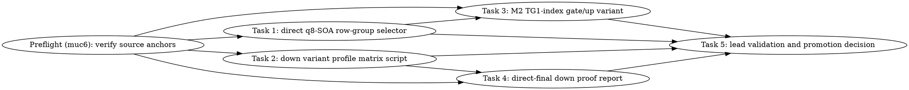

# SYCL MXFP4 TG Down/Gate-Up Co-Optimization Implementation Plan

> **For Claude:** REQUIRED SUB-SKILL: Use team-driven-development to implement this plan with agent teams. Do not begin implementation until the user approves this saved plan.

**Goal:** Preserve the current strong B50 GPT-OSS FA-on `PP512 ~1200+ tok/s` path while improving `TG128` from the latest valid `36.97 tok/s` toward the default-off proof target `>=45 tok/s` by co-optimizing the two measured decode hotspots: `mxfp4.gateup.xmx_tiled_dpas_m2` and active `mxfp4.down.q8_soa`.

**Architecture:** All new runtime variants fail closed behind explicit `GGML_SYCL_*` env knobs. Track A adds a low-risk direct-down row-group selector for the already measured active `mxfp4.down.q8_soa` path. Track C adds a conservative TG1-only index-specialized variant for the existing M2 gate/up DPAS kernel. Track B records a direct-final down proof/rejection report using source and profiler evidence before any larger rewrite is attempted. The lead owns all B50/B580, `/Storage`, `llama-bench`, `sycl-kernel-bench`, model, and VTune execution.

**Tech Stack:** C++17, SYCL/ESIMD, Intel oneAPI, llama.cpp test helpers, pytest source tests, CTest, existing SYCL named kernel profiler.

**Test Infrastructure:**
- Python source tests under `tests/test-sycl-*.py` and `tools/sycl-kernel-bench/tests/*.py`.
- C++ policy tests under `tests/test-sycl-moe-fused-down-sum-policy.cpp` registered in `tests/CMakeLists.txt:249-259` style.
- Build through `./scripts/sycl-build.sh` only when executable validation is needed.
- oneAPI source pattern for executable validation: `set +u; source /opt/intel/oneapi/setvars.sh --force; set -u`.

**Non-negotiable constraints:**
- Active checkout for execution: `/Apps/llama.cpp-mxfp4-tg-runtime`, branch `feature/sycl-mxfp4-tg-runtime`.
- Workers must not run B50/B580/model gates, `/Storage/GenAI/models`, `llama-bench`, `sycl-kernel-bench`, VTune, `sycl-ls`, `/dev/dri`/DRM probes, `lsof`, P2P probes, or real harness execution.
- Lead-only validation uses FA-on and the baseline env: `GGML_SYCL_MOE_PHASE_MATERIALIZE=1`, `GGML_SYCL_MOE_PHASE_BULK_XMX=1`, `GGML_SYCL_MOE_DOWN_SUM_DIRECT=1`, `-fa 1`.
- The correct legacy MXFP4 route profile env is `GGML_SYCL_MXFP4_TG_PROFILE=1`; do not use `GGML_SYCL_MOE_TG_PROFILE`.
- Do not trust VTune computing-task totals for decode; use named SYCL event profiler CSV/JSON/stderr.
- `.beads/beads.db` may be dirty from tracker operations and must not be staged unless the lead explicitly says so.

---

## Current Evidence

Latest valid FA-on B50 GPT-OSS profile on commit `1c004a9a1`:

- Artifacts: `/tmp/sycl_named_kernel_profile_gptoss_r1_20260702_215807/findings.md`.
- Throughput: `PP512 1211.90 tok/s`, `TG128 36.97 tok/s`.
- Hot decode kernels:
  - `mxfp4.gateup.xmx_tiled_dpas_m2`: `710.341 ms`, `3096` events, mean `229.438 us`, about `5.55 ms/token`.
  - `mxfp4.down.q8_soa`: `625.864 ms`, `2324` events, mean `269.304 us`, about `4.89 ms/token`.
  - `fattn.compute.xmx_v2`: `97.023 ms`, `48` events.
  - Pack/quant combined are about `0.1 ms/token`; do not optimize them in this plan.
- Required savings to reach `45 tok/s`: current `TG128 36.97` means about `27.05 ms/token`; target `45` means `22.22 ms/token`; required improvement is about `4.83 ms/token`.

Rejected routes remain rejected unless this plan produces new evidence:

- V2: `/tmp/xmx_tiled_v2_profile_20260701_104126`, baseline `261.931746 us`, V2 `270.910056 us`.
- Bundle4: synthetic looked better but valid FA-on runtime regressed `TG128` from `36.97` to `12.11 tok/s`.
- M4 row-block and M2 prefetch: `/tmp/sycl_mxfp4_rowblock_reuse_20260702_102528/findings.md`.
- Prepack remains rejected.

---

## Team Topology

**Recommended implementers:** 4 implementers, concurrency cap 3. The lead remains separate and owns all executable/hardware validation.

**Reviewers:** fresh spec reviewer and fresh quality reviewer per implementation task before merging. Reviewers also must not run hardware/model gates.

### Parallel Tracks

| Track | Tasks | Description |
|-------|-------|-------------|
| A | 1, 2 | Active `mxfp4.down.q8_soa` low-risk row-group variant and lead-only profile matrix script |
| B | 4 | Direct-final down proof report and guardrails before larger rewrite |
| C | 3 | Conservative `mxfp4.gateup.xmx_tiled_dpas_m2` TG1-index specialization |
| Lead | 5 | Build, tests, B50 GPT-OSS FA-on correctness/perf validation, named profiler comparison |

### Dependency Graph



Tracker edges encoding this graph (added post-review): `71v3`, `tu6o`,
`df0q`, `62dd` each depend on `muc6`; `tu6o` depends on `71v3` (mmvq.cpp merge
order); `62dd` depends on `df0q` (SYCL.md merge order). Concurrency therefore
opens up only after preflight closes: `71v3`, `df0q` first, then `tu6o` and
`62dd` behind them.

### File Ownership Map

| File | Tasks | Conflict Risk |
|------|-------|---------------|
| `ggml/src/ggml-sycl/mmvq.cpp` | 1, 3 | High; Task 1 and Task 3 both edit this file. Run in separate worktrees and merge sequentially, Task 1 before Task 3. |
| `tests/test-sycl-kernel-profiler-source-mmvq.py` | 1, 3 | Medium; both add source assertions. Merge sequentially with `pytest` after each merge. |
| `tests/test-sycl-moe-fused-down-sum-policy.cpp` | 4 | Low; policy/source guardrails only. |
| `tests/test-sycl-down-variant-profile-script.py` | 2 | Low; new test file. |
| `scripts/sycl-gptoss-down-variant-profile-matrix.sh` | 2 | Low; new lead-only executable script. |
| `activation/sycl-mxfp4-down-direct-final-proof.md` | 4 | Low; new evidence report. |
| `docs/backend/SYCL.md` | 2, 4 | Medium; Task 2 adds profiler matrix docs, Task 4 adds direct-final proof status. Merge sequentially. |

### Design Coverage Matrix

| Approved design piece | Owning task |
|-----------------------|-------------|
| Track A low-risk active down row-group/cached variants | Task 1 covers row-group in the active direct path; Task 2 profiles row-group candidates for the valid direct baseline and cached q8-SOA combinations as diagnostic non-promotion rows. |
| Track B direct-final down proof | Task 4 writes a source-grounded proof/rejection report and fail-closed policy guardrails. |
| Track C conservative M2 gate/up improvements | Task 3 adds one default-off TG1-index specialization to the current hot M2 kernel. |
| Lead-owned B50 validation | Task 5. |
| No worker hardware/model execution | Constraints section, Task gotchas, and Task 5 ownership. |
| Preserve PP512 | Task 5 compares PP512 with all candidate knobs off and on; promotion is blocked if PP512 regresses beyond the threshold. |

---

## Tasks

### Task 1: Direct-path active q8-SOA down row-group selector

**Track:** A

**Depends on:** None

**File scope:**
- Modify: `ggml/src/ggml-sycl/mmvq.cpp:19699-19729`
- Modify: `tests/test-sycl-kernel-profiler-source-mmvq.py:62-72`

**Description:** The latest named profile shows active `mxfp4.down.q8_soa` in the direct sum path (`ggml/src/ggml-sycl/mmvq.cpp:19722`) consumes about `4.89 ms/token`. The older non-direct down branch already honors `GGML_SYCL_MOE_DOWN_SUM_Q8_SOA_TG_VARIANT=row2|row4` at `ggml/src/ggml-sycl/mmvq.cpp:18973-19034`, but the active direct branch falls through to `mxfp4_down_sum_q8_soa_sycl` unless `GGML_SYCL_MOE_DOWN_SUM_DIRECT_ATOMIC=1`. This task wires the existing row-group kernel `mxfp4_down_sum_q8_soa_row_group_sycl<2|4>` into the active direct q8-SOA path behind the existing explicit env and only for decode (`n_tokens == 1`).

**Acceptance Criteria:**
- `GGML_SYCL_MOE_DOWN_SUM_Q8_SOA_TG_VARIANT=row2` selects `mxfp4_down_sum_q8_soa_row_group_sycl<2>` in the direct q8-SOA path.
- `GGML_SYCL_MOE_DOWN_SUM_Q8_SOA_TG_VARIANT=row4` selects `mxfp4_down_sum_q8_soa_row_group_sycl<4>` in the direct q8-SOA path.
- Missing, empty, numeric, or unknown env still use `mxfp4_down_sum_q8_soa_sycl` unless `GGML_SYCL_MOE_DOWN_SUM_DIRECT_ATOMIC=1` is set.
- Atomic remains an explicit higher-priority debug path and is not combined with row-group.
- Existing labels remain stable: `mxfp4.down.q8_soa`, `mxfp4.down.q8_soa_atomic`, and `mxfp4.down.q8_soa_row_group`.

#### RED: Write These Failing Tests

Append these tests to `tests/test-sycl-kernel-profiler-source-mmvq.py`:

```python
from pathlib import Path

ROOT = Path(__file__).resolve().parents[1]
MMVQ = ROOT / "ggml" / "src" / "ggml-sycl" / "mmvq.cpp"


def _source() -> str:
    return MMVQ.read_text()


def _function_body(src: str, signature: str) -> str:
    start = src.index(signature)
    brace = src.index("{", start)
    depth = 0
    for index in range(brace, len(src)):
        char = src[index]
        if char == "{":
            depth += 1
        elif char == "}":
            depth -= 1
            if depth == 0:
                return src[brace + 1:index]
    raise AssertionError(f"unterminated function for {signature}")


def test_direct_q8_soa_down_path_honors_row_group_variants_before_serial_fallback():
    src = _source()
    branch_start = src.index("static const bool atomic_reduce")
    branch_end = src.index("if (completion_event)", branch_start)
    body = src[branch_start:branch_end]

    assert "mxfp4_moe_down_sum_q8_soa_tg_active_rows_per_group" in body
    assert "row_group_variant == 2" in body
    assert "row_group_variant == 4" in body
    assert "mxfp4_down_sum_q8_soa_row_group_sycl<2>" in body
    assert "mxfp4_down_sum_q8_soa_row_group_sycl<4>" in body
    assert body.index("mxfp4_down_sum_q8_soa_row_group_sycl<2>") < body.index("mxfp4_down_sum_q8_soa_sycl")
    assert body.index("mxfp4_down_sum_q8_soa_row_group_sycl<4>") < body.index("mxfp4_down_sum_q8_soa_sycl")


def test_direct_q8_soa_down_row_group_reuses_existing_profiler_label():
    src = _source()
    row_group_body = _function_body(src, "static sycl::event mxfp4_down_sum_q8_soa_row_group_sycl")
    assert "mmvq_profile_label(queue, \"mxfp4.down.q8_soa_row_group\"" in row_group_body
    assert "rows_per_group=2" in row_group_body
    assert "rows_per_group=4" in row_group_body
```

**Verify RED:**

```bash
cd /Apps/llama.cpp-mxfp4-tg-runtime
python3 -m pytest tests/test-sycl-kernel-profiler-source-mmvq.py -q
```

Expected before implementation: the new `test_direct_q8_soa_down_path_honors_row_group_variants_before_serial_fallback` fails because the direct branch does not mention `mxfp4_moe_down_sum_q8_soa_tg_active_rows_per_group` or call the row-group helpers.

#### GREEN: Implement Minimal Code

In `ggml/src/ggml-sycl/mmvq.cpp:19713-19729`, replace the `else` body after the atomic path with this exact row-group dispatch:

```cpp
    } else {
        const int row_group_variant = mxfp4_moe_down_sum_q8_soa_tg_active_rows_per_group(
            /*is_down_role=*/true, n_tokens);
        if (row_group_variant == 2) {
            event = mxfp4_down_sum_q8_soa_row_group_sycl<2>(
                *stream, reinterpret_cast<const uint8_t * const *>(down_ptrs_device), q8_buffer, dst_d, ids_device,
                weights_d, bias_d, static_cast<int>(ncols), static_cast<int>(ncols_y),
                static_cast<int>(nrows_per_expert), static_cast<int>(n_ids), static_cast<int>(n_tokens), ids_nb0,
                ids_nb1, q8_row_size, ne11 * q8_row_size, moe_weights->nb[1], moe_weights->nb[2],
                down_bias ? down_bias->nb[1] : 0, final_token_stride, dispatch_deps_ptr);
        } else if (row_group_variant == 4) {
            event = mxfp4_down_sum_q8_soa_row_group_sycl<4>(
                *stream, reinterpret_cast<const uint8_t * const *>(down_ptrs_device), q8_buffer, dst_d, ids_device,
                weights_d, bias_d, static_cast<int>(ncols), static_cast<int>(ncols_y),
                static_cast<int>(nrows_per_expert), static_cast<int>(n_ids), static_cast<int>(n_tokens), ids_nb0,
                ids_nb1, q8_row_size, ne11 * q8_row_size, moe_weights->nb[1], moe_weights->nb[2],
                down_bias ? down_bias->nb[1] : 0, final_token_stride, dispatch_deps_ptr);
        } else {
            event = mxfp4_down_sum_q8_soa_sycl(*stream, reinterpret_cast<const uint8_t * const *>(down_ptrs_device),
                                               q8_buffer, dst_d, ids_device, weights_d, bias_d, static_cast<int>(ncols),
                                               static_cast<int>(ncols_y), static_cast<int>(nrows_per_expert),
                                               static_cast<int>(n_ids), static_cast<int>(n_tokens), ids_nb0, ids_nb1,
                                               q8_row_size, ne11 * q8_row_size, moe_weights->nb[1], moe_weights->nb[2],
                                               down_bias ? down_bias->nb[1] : 0, final_token_stride, dispatch_deps_ptr);
        }
    }
```

Do not change the parser at `ggml/src/ggml-sycl/mmvq.cpp:180-218`; it already fails closed for numeric aliases and scopes row-group to DOWN decode.

**Verify GREEN:**

```bash
cd /Apps/llama.cpp-mxfp4-tg-runtime
python3 -m pytest tests/test-sycl-kernel-profiler-source-mmvq.py -q
```

Expected: all tests in that file pass.

Optional lead-only compile check after merge:

```bash
cd /Apps/llama.cpp-mxfp4-tg-runtime
set +u; source /opt/intel/oneapi/setvars.sh --force; set -u
./scripts/sycl-build.sh test-sycl-kernel-profiler
ctest --test-dir build -R test-sycl-kernel-profiler -V
```

Expected: build succeeds and CTest reports the profiler test passed. Workers must not run this optional compile check unless the lead explicitly authorizes executable validation.

#### REFACTOR

No refactor. This task only adds a selector in the already active direct q8-SOA branch.

#### Gotchas

- `GGML_SYCL_MOE_DOWN_SUM_DIRECT_ATOMIC=1` remains a debug override; do not mix atomic and row-group in the same dispatch.
- Do not add a new env variable for row-group; reuse `GGML_SYCL_MOE_DOWN_SUM_Q8_SOA_TG_VARIANT`.
- Do not rename profiler labels; the lead’s parser and existing artifacts depend on stable labels.
- Do not change `ggml_sycl_moe_down_sum_q8_soa_tg_rows_per_group_from_env`; numeric aliases must continue to fail closed.
- This task edits `mmvq.cpp`, also touched by Task 3; merge Task 1 first.

#### Commit

```bash
git add ggml/src/ggml-sycl/mmvq.cpp tests/test-sycl-kernel-profiler-source-mmvq.py
git commit -m "feat(sycl): gate direct q8-soa down row groups"
```

---

### Task 2: Lead-only down variant profile matrix script

**Track:** A

**Depends on:** None

**File scope:**
- Create: `scripts/sycl-gptoss-down-variant-profile-matrix.sh`
- Create: `tests/test-sycl-down-variant-profile-script.py`
- Modify: `docs/backend/SYCL.md`

**Description:** The lead needs a repeatable, no-guesswork way to compare down variants with the named profiler. Workers must not run `llama-bench` or access `/Storage`, so this script must default to dry-run and require `--execute` before launching the lead-only benchmark. The script records baseline, row2, row4, and atomic variants with the exact FA-on direct-sum baseline env; cached q8-SOA variants are included as diagnostic rows with direct-sum explicitly disabled.

**Acceptance Criteria:**
- Running the script with no arguments prints commands and exits without executing `llama-bench`.
- `--execute` is required to run real gates.
- The generated commands include `-fa 1`, `GGML_SYCL_KERNEL_PROFILE=1`, `GGML_SYCL_KERNEL_PROFILE_FORMAT=both`, `GGML_SYCL_KERNEL_PROFILE_TOP_N=80`, `GGML_SYCL_MOE_PHASE_MATERIALIZE=1`, `GGML_SYCL_MOE_PHASE_BULK_XMX=1`, and `GGML_SYCL_MOE_DOWN_SUM_DIRECT=1`.
- Variants covered: `baseline`, `row2`, `row4`, `atomic`, `cached-vector-qs`, `cached-cache-y`, `cached-vector-qs-cache-y`.
- The script does not contain `sycl-ls`, `/dev/dri`, `lsof`, or VTune probes.

#### RED: Write These Failing Tests

Create `tests/test-sycl-down-variant-profile-script.py`:

```python
import os
import subprocess
from pathlib import Path

ROOT = Path(__file__).resolve().parents[1]
SCRIPT = ROOT / "scripts" / "sycl-gptoss-down-variant-profile-matrix.sh"


def _script_text() -> str:
    return SCRIPT.read_text()


def test_down_variant_profile_script_defaults_to_dry_run():
    completed = subprocess.run([str(SCRIPT)], cwd=ROOT, text=True, stdout=subprocess.PIPE, stderr=subprocess.PIPE, check=True)
    out = completed.stdout + completed.stderr
    assert "DRY RUN" in out
    assert "--execute" in out
    assert "llama-bench" in out
    assert "gpt-oss-20b-mxfp4.gguf" in out


def test_down_variant_profile_script_contains_required_variants_and_profile_envs():
    text = _script_text()
    for name in [
        "baseline",
        "row2",
        "row4",
        "atomic",
        "cached-vector-qs",
        "cached-cache-y",
        "cached-vector-qs-cache-y",
    ]:
        assert name in text
    for env in [
        "GGML_SYCL_KERNEL_PROFILE=1",
        "GGML_SYCL_KERNEL_PROFILE_FORMAT=both",
        "GGML_SYCL_KERNEL_PROFILE_TOP_N=80",
        "GGML_SYCL_MOE_PHASE_MATERIALIZE=1",
        "GGML_SYCL_MOE_PHASE_BULK_XMX=1",
        "GGML_SYCL_MOE_DOWN_SUM_DIRECT=1",
        "GGML_SYCL_MXFP4_TG_PROFILE=1",
        "ONEAPI_DEVICE_SELECTOR=level_zero:1",
    ]:
        assert env in text
    assert "-fa 1" in text


def test_down_variant_profile_script_avoids_unsafe_probes():
    text = _script_text()
    forbidden = ["sycl-ls", "/dev/dri", "lsof", "vtune"]
    for token in forbidden:
        assert token not in text
```

**Verify RED:**

```bash
cd /Apps/llama.cpp-mxfp4-tg-runtime
python3 -m pytest tests/test-sycl-down-variant-profile-script.py -q
```

Expected before implementation: fails because the script does not exist.

#### GREEN: Implement Minimal Code

Create `scripts/sycl-gptoss-down-variant-profile-matrix.sh` with executable bit:

```bash
#!/usr/bin/env bash
set -euo pipefail

execute=0
if [[ "${1:-}" == "--execute" ]]; then
    execute=1
elif [[ "${1:-}" == "--help" || "${1:-}" == "-h" ]]; then
    echo "usage: $0 [--execute]"
    echo "default mode is dry-run; --execute runs B50 GPT-OSS llama-bench commands"
    exit 0
elif [[ $# -gt 0 ]]; then
    echo "unknown argument: $1" >&2
    exit 2
fi

repo_root=$(cd "$(dirname "${BASH_SOURCE[0]}")/.." && pwd)
stamp=$(date +%Y%m%d_%H%M%S)
out_root=${SYCL_DOWN_VARIANT_PROFILE_OUT:-/tmp/sycl_down_variant_profile_${stamp}}
model=${SYCL_GPTOSS_MODEL:-/Storage/GenAI/models/gpt-oss-20b-mxfp4.gguf}
bench=${SYCL_LLAMA_BENCH:-${repo_root}/build/bin/llama-bench}

variants=(
    "baseline|"
    "row2|GGML_SYCL_MOE_DOWN_SUM_Q8_SOA_TG_VARIANT=row2"
    "row4|GGML_SYCL_MOE_DOWN_SUM_Q8_SOA_TG_VARIANT=row4"
    "atomic|GGML_SYCL_MOE_DOWN_SUM_DIRECT_ATOMIC=1"
    "cached-vector-qs|GGML_SYCL_MOE_DOWN_SUM_DIRECT=0 GGML_SYCL_MOE_DOWN_CACHED_Q8_SOA_TG_VARIANT=vector-qs"
    "cached-cache-y|GGML_SYCL_MOE_DOWN_SUM_DIRECT=0 GGML_SYCL_MOE_DOWN_CACHED_Q8_SOA_TG_VARIANT=cache-y"
    "cached-vector-qs-cache-y|GGML_SYCL_MOE_DOWN_SUM_DIRECT=0 GGML_SYCL_MOE_DOWN_CACHED_Q8_SOA_TG_VARIANT=vector-qs-cache-y"
)

common_env=(
    "ONEAPI_DEVICE_SELECTOR=level_zero:1"
    "GGML_SYCL_MOE_PHASE_MATERIALIZE=1"
    "GGML_SYCL_MOE_PHASE_BULK_XMX=1"
    "GGML_SYCL_MOE_DOWN_SUM_DIRECT=1"
    "GGML_SYCL_KERNEL_PROFILE=1"
    "GGML_SYCL_KERNEL_PROFILE_FORMAT=both"
    "GGML_SYCL_KERNEL_PROFILE_TOP_N=80"
    "GGML_SYCL_MXFP4_TG_PROFILE=1"
)

bench_args=(
    "${bench}"
    "-m" "${model}"
    "-ngl" "99"
    "-fa" "1"
    "-p" "512"
    "-n" "128"
    "-r" "1"
)

run_one() {
    local name=$1
    local extra_env=$2
    local dir=${out_root}/${name}
    local cmd_env=("${common_env[@]}")
    if [[ -n "${extra_env}" ]]; then
        read -r -a extra_env_items <<< "${extra_env}"
        cmd_env+=("${extra_env_items[@]}")
    fi

    mkdir -p "${dir}"
    printf '%s\n' "variant=${name}" "out=${dir}" "model=${model}" > "${dir}/metadata.txt"

    if [[ ${execute} -eq 0 ]]; then
        echo "DRY RUN ${name}:"
        printf '  %q' env "${cmd_env[@]}" "${bench_args[@]}"
        printf ' > %q 2> %q\n' "${dir}/bench.stdout" "${dir}/bench.stderr"
        return 0
    fi

    set +u
    source /opt/intel/oneapi/setvars.sh --force
    set -u
    env "${cmd_env[@]}" "${bench_args[@]}" > "${dir}/bench.stdout" 2> "${dir}/bench.stderr"
    if [[ -f "${repo_root}/sycl-kernels.csv" ]]; then
        mv "${repo_root}/sycl-kernels.csv" "${dir}/sycl-kernels.csv"
    fi
    python3 "${repo_root}/scripts/parse-sycl-kernel-profile.py" "${dir}/sycl-kernels.csv" > "${dir}/parse.stdout"
}

mkdir -p "${out_root}"
if [[ ${execute} -eq 0 ]]; then
    echo "DRY RUN: pass --execute to run B50 GPT-OSS down-variant profile matrix"
fi

for variant in "${variants[@]}"; do
    name=${variant%%|*}
    extra=${variant#*|}
    run_one "${name}" "${extra}"
done

echo "output root: ${out_root}"
```

Set executable bit:

```bash
chmod +x scripts/sycl-gptoss-down-variant-profile-matrix.sh
```

Add this doc note to `docs/backend/SYCL.md` under the existing SYCL profiling or GPT-OSS validation section:

```markdown
### MXFP4 down-variant named profile matrix

`scripts/sycl-gptoss-down-variant-profile-matrix.sh` is a lead-only helper for comparing default-off MXFP4 decode down variants on B50 GPT-OSS. It defaults to dry-run and requires `--execute` before launching `llama-bench`. The valid baseline, row-group, and atomic rows use FA-on plus `GGML_SYCL_MOE_PHASE_MATERIALIZE=1`, `GGML_SYCL_MOE_PHASE_BULK_XMX=1`, and `GGML_SYCL_MOE_DOWN_SUM_DIRECT=1`. Cached q8-SOA rows explicitly override `GGML_SYCL_MOE_DOWN_SUM_DIRECT=0` and are diagnostic only, not promotion candidates for the current FA-on baseline. The script records named kernel profiler CSV/parser output per variant. Workers must not run this script with `--execute`.
```

**Verify GREEN:**

```bash
cd /Apps/llama.cpp-mxfp4-tg-runtime
python3 -m pytest tests/test-sycl-down-variant-profile-script.py -q
bash -n scripts/sycl-gptoss-down-variant-profile-matrix.sh
scripts/sycl-gptoss-down-variant-profile-matrix.sh >/tmp/down_variant_dry_run.txt
rg "DRY RUN|row2|cached-vector-qs-cache-y" /tmp/down_variant_dry_run.txt
```

Expected: pytest passes, `bash -n` passes, dry-run output includes the listed variant names.

#### REFACTOR

No refactor. Keep the script standalone and dry-run by default.

#### Gotchas

- The script must not source oneAPI in dry-run mode because workers may run dry-run tests.
- `scripts/parse-sycl-kernel-profile.py` has no `--top`; do not add `--top 20` to the script.
- The variant env strings must not leak from one run to the next; use `env` with per-command variables as shown.
- Do not run the script with `--execute` from worker sessions.

#### Commit

```bash
git add scripts/sycl-gptoss-down-variant-profile-matrix.sh tests/test-sycl-down-variant-profile-script.py docs/backend/SYCL.md
git commit -m "test(sycl): add down variant profile matrix dry run"
```

---

### Task 3: Default-off TG1-index specialization for `mxfp4.gateup.xmx_tiled_dpas_m2`

**Track:** C

**Depends on:** None, but merge after Task 1 because both edit `mmvq.cpp` and `tests/test-sycl-kernel-profiler-source-mmvq.py`.

**File scope:**
- Modify: `ggml/src/ggml-sycl/mmvq.cpp:9712-9926`
- Modify: `ggml/src/ggml-sycl/mmvq.cpp:14388-14424`
- Modify: `tests/test-sycl-kernel-profiler-source-mmvq.py:24-48`

**Description:** The hot gate/up M2 kernel recomputes `id = group / n_tokens` and `iid1 = group - id * n_tokens` for every M2 tile even when decode has `n_tokens == 1`. The valid B50 TG path is decode, so `iid1` is always zero and `id` is equal to `group`. This task adds a default-off `GGML_SYCL_MOE_GATEUP_M2_TG1_INDEX=1` specialization that keeps the same DPAS math and memory layout but removes the divide/modulo sequence from the kernel body for `n_tokens == 1`. The new path is explicitly labeled so the named profiler can compare it against the current `mxfp4.gateup.xmx_tiled_dpas_m2` baseline.

**Acceptance Criteria:**
- With the env missing or zero, current `mxfp4_pair_glu_xmx_tiled_dpas_m2_sycl<Repeat, GLU_OP, Prefetch>` behavior and label are unchanged.
- With `GGML_SYCL_MOE_GATEUP_M2_TG1_INDEX=1` and `n_tokens == 1`, the submit wrapper selects the TG1-index specialization.
- With `n_tokens != 1`, the env is ignored and the baseline path is used.
- The TG1-index label is `mxfp4.gateup.xmx_tiled_dpas_m2_tg1_index` with metadata `path=packed-q8-m2;role=gateup;index=tg1;tiles=static;total_batches=runtime`.
- No V2, bundle4, M4, or prefetch path is promoted.

#### RED: Write These Failing Tests

Append these tests to `tests/test-sycl-kernel-profiler-source-mmvq.py`:

```python
from pathlib import Path

ROOT = Path(__file__).resolve().parents[1]
MMVQ = ROOT / "ggml" / "src" / "ggml-sycl" / "mmvq.cpp"


def _text() -> str:
    return MMVQ.read_text()


def test_gateup_m2_tg1_index_variant_is_default_off_and_decode_only():
    text = _text()
    assert "GGML_SYCL_MOE_GATEUP_M2_TG1_INDEX" in text
    assert "static bool mxfp4_moe_gateup_m2_tg1_index_enabled()" in text
    submit_start = text.index("static sycl::event mxfp4_pair_glu_xmx_tiled_dpas_m2_submit")
    submit_end = text.index("template <int Repeat, bool Prefetch = false>", submit_start + 1)
    submit_body = text[submit_start:submit_end]
    assert "mxfp4_moe_gateup_m2_tg1_index_enabled() && n_tokens == 1" in submit_body
    assert "mxfp4_pair_glu_xmx_tiled_dpas_m2_sycl<Repeat, GGML_GLU_OP_SWIGLU_OAI, Prefetch, true>" in submit_body
    assert "mxfp4_pair_glu_xmx_tiled_dpas_m2_sycl<Repeat, GGML_GLU_OP_SWIGLU, Prefetch, true>" in submit_body


def test_gateup_m2_tg1_index_kernel_uses_compile_time_index_branch_and_unique_label():
    text = _text()
    assert "template <int Repeat, int GLU_OP, bool Prefetch, bool TG1Index = false>" in text
    assert "const int     id       = TG1Index ? static_cast<int>(group) : static_cast<int>(group / n_tokens);" in text
    assert "const int     iid1     = TG1Index ? 0 : static_cast<int>(group - static_cast<int64_t>(id) * n_tokens);" in text
    assert "mxfp4.gateup.xmx_tiled_dpas_m2_tg1_index" in text
    assert "index=tg1" in text
```

**Verify RED:**

```bash
cd /Apps/llama.cpp-mxfp4-tg-runtime
python3 -m pytest tests/test-sycl-kernel-profiler-source-mmvq.py -q
```

Expected before implementation: the new tests fail because the env, template bool, branch, and label do not exist.

#### GREEN: Implement Minimal Code

1. Near the existing env parser helpers in `ggml/src/ggml-sycl/mmvq.cpp:218-301`, add:

```cpp
static bool mxfp4_moe_gateup_m2_tg1_index_enabled() {
    static const bool enabled = []() {
        const char * env = std::getenv("GGML_SYCL_MOE_GATEUP_M2_TG1_INDEX");
        return env && std::atoi(env) != 0;
    }();
    return enabled;
}
```

2. Change the forward declaration at `ggml/src/ggml-sycl/mmvq.cpp:9090` from:

```cpp
template <int Repeat, int GLU_OP, bool Prefetch> struct mxfp4_pair_glu_xmx_tiled_dpas_m2_kernel;
```

to:

```cpp
template <int Repeat, int GLU_OP, bool Prefetch, bool TG1Index = false>
struct mxfp4_pair_glu_xmx_tiled_dpas_m2_kernel;
```

3. Change the function template signature at `ggml/src/ggml-sycl/mmvq.cpp:9712` from:

```cpp
template <int Repeat, int GLU_OP, bool Prefetch>
static sycl::event mxfp4_pair_glu_xmx_tiled_dpas_m2_sycl(sycl::queue &        queue,
```

to:

```cpp
template <int Repeat, int GLU_OP, bool Prefetch, bool TG1Index = false>
static sycl::event mxfp4_pair_glu_xmx_tiled_dpas_m2_sycl(sycl::queue &        queue,
```

4. Replace the profile label construction at `ggml/src/ggml-sycl/mmvq.cpp:9745-9746` with:

```cpp
    const char * profile_name = TG1Index ? "mxfp4.gateup.xmx_tiled_dpas_m2_tg1_index" :
                                         "mxfp4.gateup.xmx_tiled_dpas_m2";
    const char * profile_metadata = TG1Index ?
                                       "path=packed-q8-m2;role=gateup;index=tg1;tiles=static;total_batches=runtime" :
                                       "path=packed-q8-m2;role=gateup;tiles=static;total_batches=runtime";
    ggml_sycl_profile_label profile_label = mmvq_profile_label(queue, profile_name, profile_metadata);
```

5. Change the kernel name in the `parallel_for` call from:

```cpp
        h.parallel_for<mxfp4_pair_glu_xmx_tiled_dpas_m2_kernel<Repeat, GLU_OP, Prefetch>>(
```

to:

```cpp
        h.parallel_for<mxfp4_pair_glu_xmx_tiled_dpas_m2_kernel<Repeat, GLU_OP, Prefetch, TG1Index>>(
```

6. Replace the `id`/`iid1` lines inside the kernel body at `ggml/src/ggml-sycl/mmvq.cpp:9762-9763` with:

```cpp
                const int     id       = TG1Index ? static_cast<int>(group) : static_cast<int>(group / n_tokens);
                const int     iid1     = TG1Index ? 0 : static_cast<int>(group - static_cast<int64_t>(id) * n_tokens);
```

Keep the existing `expert_id` expression unchanged; for TG1 it now reads `ids + id * ids_nb0`, which is the intended decode route.

7. In `mxfp4_pair_glu_xmx_tiled_dpas_m2_submit` at `ggml/src/ggml-sycl/mmvq.cpp:14409-14424`, add a branch before the existing `glu_op` dispatch:

```cpp
    if (mxfp4_moe_gateup_m2_tg1_index_enabled() && n_tokens == 1) {
        if (glu_op == GGML_GLU_OP_SWIGLU_OAI) {
            return mxfp4_pair_glu_xmx_tiled_dpas_m2_sycl<Repeat, GGML_GLU_OP_SWIGLU_OAI, Prefetch, true>(
                queue, gate_ptrs, up_ptrs, b_packed, y_scales, dst_glu, ids, gate_bias, up_bias, ncols,
                nrows_per_expert, total_batches, n_tokens, ids_nb0, ids_nb1, dst_nb1, dst_nb2, gate_bias_nb1,
                up_bias_nb1, alpha, limit, tile_n_total, pack_event);
        }
        return mxfp4_pair_glu_xmx_tiled_dpas_m2_sycl<Repeat, GGML_GLU_OP_SWIGLU, Prefetch, true>(
            queue, gate_ptrs, up_ptrs, b_packed, y_scales, dst_glu, ids, gate_bias, up_bias, ncols,
            nrows_per_expert, total_batches, n_tokens, ids_nb0, ids_nb1, dst_nb1, dst_nb2, gate_bias_nb1,
            up_bias_nb1, alpha, limit, tile_n_total, pack_event);
    }
```

Do not modify V2, bundle4, direct-q8, M4, or prefetch submitters.

**Verify GREEN:**

```bash
cd /Apps/llama.cpp-mxfp4-tg-runtime
python3 -m pytest tests/test-sycl-kernel-profiler-source-mmvq.py -q
```

Expected: all tests in that file pass.

Lead-only compile check after merge:

```bash
cd /Apps/llama.cpp-mxfp4-tg-runtime
set +u; source /opt/intel/oneapi/setvars.sh --force; set -u
./scripts/sycl-build.sh test-sycl-kernel-profiler
ctest --test-dir build -R test-sycl-kernel-profiler -V
```

Expected: build succeeds and CTest passes. Workers must not run this optional compile check unless explicitly authorized.

#### REFACTOR

No refactor. If the compiler rejects the defaulted bool in the kernel-name type, remove the default from the struct declaration and call sites by spelling `false` explicitly for the baseline template. Do not change runtime behavior.

#### Gotchas

- This is a micro-optimization, not a semantic rewrite. Do not change DPAS tile sizes, q8 pack layout, weight layout, GLU formula, bias handling, or M2 pair packing.
- The env must remain default-off. A source test must prove `GGML_SYCL_MOE_GATEUP_M2_TG1_INDEX` is checked before using the specialization.
- The label must be distinct from baseline so the lead can compare event time directly.
- The specialization is decode-only; prompt processing must not use it.
- Task 1 and this task both edit `mmvq.cpp`; merge sequentially and rerun the source tests after each merge.
- Default template argument hazard: C++ forbids redeclaring a default template argument. Steps 2 and 3 both add `bool TG1Index = false`. The `= false` default must appear on exactly ONE declaration of each entity. If `mxfp4_pair_glu_xmx_tiled_dpas_m2_sycl` or the kernel struct has a separate forward declaration in addition to its definition, put the default on only one of them (spell the other `bool TG1Index` with no default, or `false` explicitly at call sites) or the build fails with `redefinition of default argument`. Workers cannot catch this (no build); the preflight task (`llama.cpp-muc6`) must confirm whether a separate forward declaration of the `_sycl` function exists, and the lead must watch for this at first compile.

#### Commit

```bash
git add ggml/src/ggml-sycl/mmvq.cpp tests/test-sycl-kernel-profiler-source-mmvq.py
git commit -m "feat(sycl): add mxfp4 gateup m2 tg1 index variant"
```

---

### Task 4: Direct-final down proof report and fail-closed guardrails

**Track:** B

**Depends on:** None

**File scope:**
- Create: `activation/sycl-mxfp4-down-direct-final-proof.md`
- Modify: `tests/test-sycl-moe-fused-down-sum-policy.cpp:307-346`
- Modify: `docs/backend/SYCL.md`

**Description:** Direct-final down remains the high-upside route, but it is too risky to implement blind because prior direct-final and grouped variants have produced correctness/performance regressions. This task creates a source-grounded proof/rejection report that records why direct-final is not promoted by this plan and strengthens policy tests so any later direct-final promotion must remain opt-in and exclusive.

**Acceptance Criteria:**
- A report exists at `activation/sycl-mxfp4-down-direct-final-proof.md` with the exact active profile evidence, existing env knobs, source locations, and a final recommendation.
- Policy tests assert that direct-final variants remain explicit, exclusive, and not enabled by row-group/cached q8-SOA envs.
- Docs state direct-final is a proof track, not a default path.
- No runtime direct-final path is enabled by this task.

#### RED: Write These Failing Tests

Append this function to `tests/test-sycl-moe-fused-down-sum-policy.cpp` after `test_cached_down_q8_soa_tg_variant_parser_labels_and_scope()` and call it from `main()` next to the other policy tests:

```cpp
static int test_down_q8_soa_variants_do_not_enable_direct_final() {
    const std::string mmvq = read_required_file("ggml/src/ggml-sycl/mmvq.cpp");
    CHECK(contains(mmvq, "GGML_SYCL_MOE_DOWN_SUM_XMX_DIRECT_FINAL"),
          "direct-final env knob must remain explicit");
    CHECK(contains(mmvq, "GGML_SYCL_MOE_DOWN_SUM_DPAS_DIRECT_FINAL"),
          "DPAS direct-final env knob must remain explicit");
    CHECK(contains(mmvq, "GGML_SYCL_MOE_DOWN_SUM_Q8_SOA_TG_VARIANT"),
          "q8-SOA row-group env must remain separate from direct-final envs");
    CHECK(contains(mmvq, "GGML_SYCL_MOE_DOWN_CACHED_Q8_SOA_TG_VARIANT"),
          "cached q8-SOA env must remain separate from direct-final envs");
    CHECK(!contains(mmvq, "GGML_SYCL_MOE_DOWN_SUM_Q8_SOA_TG_VARIANT=direct-final"),
          "row-group env must not grow a direct-final string alias");
    CHECK(!contains(mmvq, "GGML_SYCL_MOE_DOWN_CACHED_Q8_SOA_TG_VARIANT=direct-final"),
          "cached q8-SOA env must not grow a direct-final string alias");
    return 0;
}
```

Add this call in `main()`:

```cpp
    failed += test_down_q8_soa_variants_do_not_enable_direct_final();
```

Create `activation/sycl-mxfp4-down-direct-final-proof.md` with this exact skeleton:

```markdown
# SYCL MXFP4 Down Direct-Final Proof Report

## Active Evidence

- Valid baseline artifact: `/tmp/sycl_named_kernel_profile_gptoss_r1_20260702_215807/findings.md`.
- Valid baseline throughput: `PP512 1211.90 tok/s`, `TG128 36.97 tok/s`.
- Active down hotspot: `mxfp4.down.q8_soa`, `625.864 ms`, `2324` events, mean `269.304 us`, about `4.89 ms/token`.

## Existing Direct-Final Knobs

- `GGML_SYCL_MOE_DOWN_SUM_XMX_DIRECT_FINAL`
- `GGML_SYCL_MOE_DOWN_SUM_DPAS_DIRECT_FINAL`
- `GGML_SYCL_MOE_DOWN_SUM_DPAS_DIRECT_FINAL_I8`
- `GGML_SYCL_MOE_DOWN_SUM_DPAS_DIRECT_FINAL_DPAS`
- `GGML_SYCL_MOE_DOWN_SUM_DPAS_DIRECT_FINAL_RANK_PARALLEL_ATOMIC`
- `GGML_SYCL_MOE_DOWN_SUM_DPAS_DIRECT_FINAL_SCRATCH_REDUCE`
- `GGML_SYCL_MOE_DOWN_SUM_DPAS_DIRECT_FINAL_SAME_EXPERT_GROUPED`

## Fail-Closed Policy

Direct-final down is not enabled by `GGML_SYCL_MOE_DOWN_SUM_Q8_SOA_TG_VARIANT` or `GGML_SYCL_MOE_DOWN_CACHED_Q8_SOA_TG_VARIANT`. Row-group variants are low-risk experiments on the active direct q8-SOA route. Cached q8-SOA variants are diagnostic non-promotion rows because they require direct-sum disabled. Direct-final remains a separate proof track.

## Recommendation

Keep direct-final default-off in this plan. A future direct-final implementation requires a new approved plan with a model-free reference/validation path, profiler labels distinct from `mxfp4.down.q8_soa`, and lead-owned B50 GPT-OSS FA-on correctness/performance gates.
```

**Verify RED:**

```bash
cd /Apps/llama.cpp-mxfp4-tg-runtime
python3 - <<'PY'
from pathlib import Path
p = Path('activation/sycl-mxfp4-down-direct-final-proof.md')
assert p.exists()
text = p.read_text()
for token in ['mxfp4.down.q8_soa', 'GGML_SYCL_MOE_DOWN_SUM_DPAS_DIRECT_FINAL', 'Keep direct-final default-off']:
    assert token in text
PY
```

Before implementation, the policy test part fails because the function and `main()` call do not exist. The doc assertion fails until the report is created.

#### GREEN: Implement Minimal Code

1. Add the C++ policy test exactly as shown above.
2. Add the `main()` call exactly as shown above.
3. Create the proof report exactly as shown above.
4. Add this note to `docs/backend/SYCL.md` under the MXFP4/SYCL MoE section:

```markdown
### MXFP4 down direct-final status

Direct-final MXFP4 down remains default-off and is not selected by the q8-SOA row-group or cached q8-SOA TG variant envs. The current co-optimization campaign treats direct-final as a proof track documented in `activation/sycl-mxfp4-down-direct-final-proof.md`; promotion requires a separate approved plan plus lead-owned B50 GPT-OSS FA-on correctness and throughput gates.
```

**Verify GREEN:**

```bash
cd /Apps/llama.cpp-mxfp4-tg-runtime
python3 - <<'PY'
from pathlib import Path
p = Path('activation/sycl-mxfp4-down-direct-final-proof.md')
text = p.read_text()
for token in ['mxfp4.down.q8_soa', 'GGML_SYCL_MOE_DOWN_SUM_DPAS_DIRECT_FINAL', 'Keep direct-final default-off']:
    assert token in text
PY
```

Lead-only compile/test after merge:

```bash
cd /Apps/llama.cpp-mxfp4-tg-runtime
set +u; source /opt/intel/oneapi/setvars.sh --force; set -u
./scripts/sycl-build.sh test-sycl-moe-fused-down-sum-policy
ctest --test-dir build -R test-sycl-moe-fused-down-sum-policy -V
```

Expected: build succeeds and CTest passes. Workers must not run this optional executable validation unless explicitly authorized.

#### REFACTOR

No refactor. Keep direct-final proof separate from row-group/cached q8-SOA paths.

#### Gotchas

- This task intentionally does not implement direct-final runtime code.
- Do not edit `.beads/beads.db`.
- Do not remove existing direct-final env knobs; the test proves they remain explicit.
- Do not add a direct-final alias to the q8-SOA row-group/cached env parsers.

#### Commit

```bash
git add activation/sycl-mxfp4-down-direct-final-proof.md tests/test-sycl-moe-fused-down-sum-policy.cpp docs/backend/SYCL.md
git commit -m "docs(sycl): record mxfp4 down direct-final proof status"
```

---

### Task 5: Lead-owned B50 GPT-OSS FA-on validation and promotion decision

**Track:** Lead

**Depends on:** Tasks 1, 2, 3, 4 merged and reviewed.

**File scope:**
- Create: `activation/sycl-mxfp4-tg-cooptimization-validation.md`
- Optional tracker comment: issue `llama.cpp-lmhd`

**Description:** The lead runs all executable validation on the real B50 environment. This task records whether each default-off candidate improves named kernel time and end-to-end TG without harming PP or correctness. No worker may execute this task.

**Acceptance Criteria:**
- Source and policy tests pass.
- Build passes.
- B50 GPT-OSS correctness gate passes for every candidate considered for promotion.
- B50 GPT-OSS FA-on `llama-bench` runs for baseline and candidate env combinations.
- Named profile parser output is recorded with per-kernel time for `mxfp4.gateup.xmx_tiled_dpas_m2`, `mxfp4.gateup.xmx_tiled_dpas_m2_tg1_index`, `mxfp4.down.q8_soa`, and `mxfp4.down.q8_soa_row_group` where present.
- Promotion remains blocked unless `PP512 >= 1150 tok/s`, `TG128 >= 45 tok/s`, and the GPT-OSS count gate starts with `: 1, 2, 3, 4, 5`.

#### RED: Create the Validation Record First

Create `activation/sycl-mxfp4-tg-cooptimization-validation.md` before running commands:

```markdown
# SYCL MXFP4 TG Co-Optimization Validation

## Build Under Test

- Branch: `feature/sycl-mxfp4-tg-runtime`
- Commit: record the output of `git rev-parse --short HEAD`

## Automated Tests

- `python3 -m pytest tests/test-sycl-kernel-profiler-source-mmvq.py tests/test-sycl-down-variant-profile-script.py -q`
- `python3 -m pytest tests/test-sycl-kernel-profile*.py -q`
- `./scripts/sycl-build.sh test-sycl-kernel-profiler test-sycl-moe-fused-down-sum-policy`
- `ctest --test-dir build -R "test-sycl-kernel-profiler|test-sycl-moe-fused-down-sum-policy" -V`

## B50 GPT-OSS Correctness Gate

Record stdout/stderr path and whether output starts with `: 1, 2, 3, 4, 5`.

## FA-on Bench/Profile Matrix

| Variant | Env delta | PP512 tok/s | TG128 tok/s | Top gate/up kernel time | Top down kernel time | Artifact dir | Decision |
|---------|-----------|-------------|-------------|--------------------------|----------------------|--------------|----------|
| baseline | none | | | | | | |
| row2 | `GGML_SYCL_MOE_DOWN_SUM_Q8_SOA_TG_VARIANT=row2` | | | | | | |
| row4 | `GGML_SYCL_MOE_DOWN_SUM_Q8_SOA_TG_VARIANT=row4` | | | | | | |
| tg1-index | `GGML_SYCL_MOE_GATEUP_M2_TG1_INDEX=1` | | | | | | |
| best-combined | record exact env | | | | | | |

## Promotion Decision

Default remains unchanged unless the best-combined row passes correctness, keeps `PP512 >= 1150 tok/s`, and reaches `TG128 >= 45 tok/s`. If it does not, leave all variants default-off and file the next plan from the direct-final proof report.
```

#### GREEN: Run Lead Commands and Fill the Record

Run from `/Apps/llama.cpp-mxfp4-tg-runtime`:

```bash
cd /Apps/llama.cpp-mxfp4-tg-runtime
git rev-parse --short HEAD
python3 -m pytest tests/test-sycl-kernel-profiler-source-mmvq.py tests/test-sycl-down-variant-profile-script.py -q
python3 -m pytest tests/test-sycl-kernel-profile*.py -q
set +u; source /opt/intel/oneapi/setvars.sh --force; set -u
./scripts/sycl-build.sh test-sycl-kernel-profiler test-sycl-moe-fused-down-sum-policy llama-bench llama-cli
ctest --test-dir build -R "test-sycl-kernel-profiler|test-sycl-moe-fused-down-sum-policy" -V
```

Run the canonical B50 GPT-OSS correctness gate for each candidate that will be considered for promotion. Baseline command shape:

```bash
ONEAPI_DEVICE_SELECTOR=level_zero:1 \
GGML_SYCL_MOE_PHASE_MATERIALIZE=1 \
GGML_SYCL_MOE_PHASE_BULK_XMX=1 \
GGML_SYCL_MOE_DOWN_SUM_DIRECT=1 \
./build/bin/llama-cli \
  -m /Storage/GenAI/models/gpt-oss-20b-mxfp4.gguf -ngl 99 \
  -cnv -st --simple-io --no-display-prompt \
  --chat-template-kwargs '{"reasoning_effort":"medium"}' \
  --reasoning-format none --reasoning-budget 0 \
  -p 'Count from 1 to 5. Answer with only: 1, 2, 3, 4, 5' \
  -n 48 --seed 42 --temp 0
```

Expected correctness signal: stdout starts with `: 1, 2, 3, 4, 5`.

Run the down variant dry-run once and executable matrix once:

```bash
scripts/sycl-gptoss-down-variant-profile-matrix.sh
scripts/sycl-gptoss-down-variant-profile-matrix.sh --execute
```

Run the baseline and candidate combined bench/profile commands. Baseline shape:

```bash
out=/tmp/sycl_named_kernel_profile_gptoss_baseline_$(date +%Y%m%d_%H%M%S)
mkdir -p "$out"
ONEAPI_DEVICE_SELECTOR=level_zero:1 \
GGML_SYCL_MOE_PHASE_MATERIALIZE=1 \
GGML_SYCL_MOE_PHASE_BULK_XMX=1 \
GGML_SYCL_MOE_DOWN_SUM_DIRECT=1 \
GGML_SYCL_KERNEL_PROFILE=1 \
GGML_SYCL_KERNEL_PROFILE_FORMAT=both \
GGML_SYCL_KERNEL_PROFILE_TOP_N=80 \
GGML_SYCL_MXFP4_TG_PROFILE=1 \
./build/bin/llama-bench \
  -m /Storage/GenAI/models/gpt-oss-20b-mxfp4.gguf -ngl 99 -fa 1 -p 512 -n 128 -r 1 \
  > "$out/bench.stdout" 2> "$out/bench.stderr"
if [[ -f sycl-kernels.csv ]]; then mv sycl-kernels.csv "$out/sycl-kernels.csv"; fi
python3 scripts/parse-sycl-kernel-profile.py "$out/sycl-kernels.csv" > "$out/parse.stdout"
```

Candidate env deltas to test individually before combining:

```bash
GGML_SYCL_MOE_DOWN_SUM_Q8_SOA_TG_VARIANT=row2
GGML_SYCL_MOE_DOWN_SUM_Q8_SOA_TG_VARIANT=row4
GGML_SYCL_MOE_GATEUP_M2_TG1_INDEX=1
```

Best-combined command uses only the best individual down row-group variant plus `GGML_SYCL_MOE_GATEUP_M2_TG1_INDEX=1`. Do not combine atomic with row-group. Do not combine direct-final with this plan.

#### REFACTOR

After recording results:

- If a candidate fails correctness, leave it default-off and record `reject-correctness`.
- If a candidate passes correctness but misses `TG128 >= 45`, leave it default-off and record `insufficient-throughput`.
- If a candidate passes correctness, reaches `TG128 >= 45`, and keeps `PP512 >= 1150`, create a new short promotion plan before making it default-on. This plan proves candidates only; it does not promote defaults.

#### Gotchas

- Use `-fa 1`; no-FA numbers are invalid for this baseline.
- Do not pass `--chat-template gpt-oss` for GPT-OSS correctness; use the model’s embedded template with `--chat-template-kwargs '{"reasoning_effort":"medium"}'`.
- Do not use `--top` with `scripts/parse-sycl-kernel-profile.py`.
- Do not use VTune computing-task totals as the source of truth.
- Do not use `sycl-ls`, `/dev/dri` probes, `lsof`, or P2P probes.
- Preserve all artifact directories in the validation record.

#### Commit

```bash
git add activation/sycl-mxfp4-tg-cooptimization-validation.md
git commit -m "test(sycl): record mxfp4 tg cooptimization validation"
```

---

## End-to-End Validation (on the user's machine) — MANDATORY

> Run after all task tests pass and before declaring the campaign complete. Owned by the lead at teardown.

**Environment:** `/Apps/llama.cpp-mxfp4-tg-runtime`, Intel oneAPI, B50 selected with `ONEAPI_DEVICE_SELECTOR=level_zero:1`, model `/Storage/GenAI/models/gpt-oss-20b-mxfp4.gguf`, FA-on GPT-OSS run.

**Steps Claude runs itself:** Task 5 commands. The lead session may run them because it has permission for `/Storage`, B50, `llama-bench`, `llama-cli`, and oneAPI executable validation.

**Steps requiring the user:** None expected.

**Observed success:**
- GPT-OSS correctness output starts with `: 1, 2, 3, 4, 5`.
- Baseline remains around `PP512 ~1200 tok/s`; candidate promotion threshold is `PP512 >= 1150 tok/s`.
- Candidate proof target is `TG128 >= 45 tok/s`.
- Named profiler shows the expected candidate labels and reduced total event time for at least one of the two hot kernels.
- If the proof target is not reached, variants remain default-off and the validation record states the exact blocker and next plan owner.

---

## Spec Self-Review

### Coverage Scan

Every approved design piece has an owning task: low-risk down row-group selector in Task 1, lead-only variant matrix in Task 2, M2 gate/up micro-optimization in Task 3, direct-final proof/guardrails in Task 4, and on-machine validation in Task 5. Pack/quant and FA kernels are explicitly out of scope because the latest profile shows they are not primary decode bottlenecks.

### Junior-Implementable Scan

Each task lists exact files, current line ranges, runnable RED tests, exact GREEN code or document content, verification commands, gotchas, and commit commands. The two code tasks in `mmvq.cpp` are constrained to narrow selectors rather than broad kernel rewrites.

### Completion Scan

No open-ended implementation directions or unspecified commands are required for task execution. The validation table begins blank by design because Task 5 fills it with observed lead-owned measurements.

### Internal Consistency

The dependency graph matches file ownership: Tasks 1 and 3 both edit `mmvq.cpp` and the profiler source test, so the topology says merge sequentially. Tasks 2 and 4 are parallel except both touch `docs/backend/SYCL.md`, so docs are merged sequentially.

### Scope Check

The plan is intentionally scoped to one proof campaign. It does not promote defaults and does not attempt a new direct-final runtime rewrite without a separate approved plan.

### Ambiguity Check

Candidate env knobs and promotion thresholds are explicit. Workers cannot run hardware/model gates; the lead owns Task 5.

### Sizing Scan

Tasks 1 and 3 are each a single source-test-backed selector/variant. Task 2 is a dry-run script plus docs. Task 4 is a proof report plus guardrails. Task 5 is a lead-only validation record.
