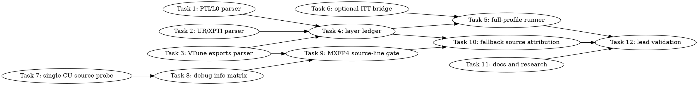

# SYCL End-to-End Profiling Closure Implementation Plan

> **For Claude:** REQUIRED SUB-SKILL: Use team-driven-development to implement this plan with agent teams.

**Goal:** Build a fail-closed, layered SYCL profiling pipeline that explains GPT-OSS decode wall time across app host work, SYCL runtime/API work, Level Zero driver work, named GPU kernels/copies, VTune/bound evidence, and exact-or-fallback source attribution.

**Architecture:** Existing Chrome-trace timeline spans, named kernel profiler rows, E2E TG stage logs, and VTune/ocloc evidence remain source-specific raw inputs. New parsers normalize Level Zero/PTI, UR/XPTI, VTune, source-line, and ablation artifacts into layer summaries, then a layer-ledger parser emits an explicit wall-time closure matrix with unknown buckets and reasons rather than silently treating unmatched time as idle. Exact GPU source-line attribution is a first-class gated track: prove a single-CU reproducer can preserve `.debug_line`, expand to the MXFP4 microbench only after that gate passes, and otherwise publish source-region plus ablation attribution as the practical fallback.

**Tech Stack:** Python 3 parser scripts, pytest parser/source tests, Bash dry-run gated profiling scripts, optional Intel VTune ITT host ranges, Intel oneAPI DPC++/SYCL, Level Zero/PTI and Unified Runtime traces, VTune `gpu-hotspots`/`gpu-source-line` exports, ocloc/readelf evidence, llama.cpp SYCL backend profiler artifacts.

**Test Infrastructure:** Parser and script tests live in `tests/test-sycl-*.py` and run with `python3 -m pytest`. SYCL C++ profiler/timeline tests build through `./scripts/sycl-build.sh test-sycl-timeline test-sycl-kernel-profiler` and run with `ctest --test-dir build -R "test-sycl-timeline|test-sycl-kernel-profiler" -V`. Worker-safe tests must not run B50/B580/model gates, `/Storage`, `llama-bench`, `sycl-kernel-bench`, VTune, `sycl-ls`, `/dev/dri`, DRM probes, `lsof`, P2P probes, or real harness execution.

---

## Team Topology

**Recommended implementers:** 3 concurrent (based on 5 parallel tracks; execution spawns one ephemeral implementer per task and caps active work at 3 to reduce shared-file contention)
**Reviewers:** spec + quality, spawned FRESH per review (not a standing pair; see team-driven-development)

### Parallel Tracks

| Track | Tasks | Description |
|-------|-------|-------------|
| A | 1, 2, 4 | Level Zero/PTI parser, UR/XPTI parser, then the combined layer ledger |
| B | 3, 5 | VTune export parser, then dry-run gated full-profile artifact runner |
| C | 6 | Optional ITT bridge from timeline scopes to VTune host ranges |
| D | 7, 8, 9 | Single-CU source-line reproducer, debug-info matrix runner, MXFP4 source-line gate |
| E | 10 | Source-region plus ablation fallback attribution parser |
| F | 11, 12 | Documentation and final lead-only validation/report convergence |

### Dependency Graph



### File Ownership Map

| File/Directory | Tasks | Conflict Risk |
|----------------|-------|---------------|
| `scripts/parse-sycl-pti-l0.py` | 1 | None, new parser |
| `tests/test-sycl-pti-l0-parser.py` | 1 | None, new tests |
| `scripts/parse-sycl-ur-trace.py` | 2 | None, new parser |
| `tests/test-sycl-ur-trace-parser.py` | 2 | None, new tests |
| `scripts/parse-sycl-vtune-exports.py` | 3 | None, new parser |
| `tests/test-sycl-vtune-exports-parser.py` | 3 | None, new tests |
| `scripts/parse-sycl-layer-ledger.py` | 4 | Depends on Tasks 1, 2, 3 |
| `tests/test-sycl-layer-ledger-parser.py` | 4 | Depends on Tasks 1, 2, 3 |
| `scripts/sycl-gptoss-full-attribution-profile.sh` | 5 | Depends on Task 4 and Task 6 |
| `tests/test-sycl-full-attribution-profile-script.py` | 5 | Depends on Task 4 and Task 6 |
| `ggml/src/ggml-sycl/sycl-timeline.hpp:25-92` | 6 | Shared with timeline tests only |
| `ggml/src/ggml-sycl/sycl-timeline.cpp:246-457` | 6 | Shared with timeline tests only |
| `ggml/src/ggml-sycl/sycl-itt.hpp` | 6 | None, new file |
| `ggml/src/ggml-sycl/sycl-itt.cpp` | 6 | None, new file |
| `ggml/src/ggml-sycl/CMakeLists.txt:1231-1245` | 6 | Add `sycl-itt.cpp` to standalone `test-sycl-timeline` target |
| `tests/test-sycl-timeline.cpp:1-234` | 6 | C++ timeline test extension |
| `tools/CMakeLists.txt:29-34` | 7 | Adds one subdirectory under existing `if (GGML_SYCL)` block |
| `tools/sycl-source-line-probe/CMakeLists.txt` | 7 | None, new tool |
| `tools/sycl-source-line-probe/main.cpp` | 7 | None, new single-CU reproducer |
| `tests/test-sycl-source-line-probe-source.py` | 7 | None, new source test |
| `scripts/sycl-source-line-debug-matrix.sh` | 8 | Depends on Task 7, new dry-run gated script |
| `tests/test-sycl-source-line-debug-matrix-script.py` | 8 | Depends on Task 7 |
| `scripts/check-sycl-vtune-source-lines.py:1-67` | 9 | Extends existing checker |
| `scripts/sycl-vtune-source-line-feasibility.sh:1-88` | 9 | Extends existing lead-only runner |
| `tests/test-sycl-vtune-source-line-checker.py:1-90` | 9 | Existing checker tests |
| `tests/test-sycl-vtune-source-line-feasibility-script.py:1-44` | 9 | Existing runner tests |
| `scripts/parse-sycl-source-attribution.py` | 10 | None, new parser |
| `tests/test-sycl-source-attribution-parser.py` | 10 | None, new tests |
| `activation/sycl-source-region-map.json` | 10 | None, new static source-region map |
| `docs/backend/SYCL.md` | 11 | Docs-only convergence |
| `research.md` | 11 | Persist research artifact created before this plan |
| `activation/sycl-end-to-end-profiling-closure-validation.md` | 12 | Lead-only validation report |
| `.codescout/tasks.jsonl` | 12 | Tracker updates only; never stage `.codescout/.gitignore` |

---

## Cross-Cutting Rules

1. Workers must not run B50/B580/model gates, `/Storage` model access, `llama-bench`, `sycl-kernel-bench`, VTune, `sycl-ls`, `/dev/dri`, DRM probes, `lsof`, P2P probes, or real profiling harness execution. Worker validation is parser/unit/source tests and script dry-runs only.
2. Lead-only real commands must source oneAPI exactly as:
   ```bash
   set +u
   source /opt/intel/oneapi/setvars.sh --force
   set -u
   ```
3. Every Bash profiling script is dry-run by default. Real execution requires `--execute` plus an explicit acknowledgement flag whose name says what will run.
4. `sycl-kernels.csv/json` remains authoritative for named GPU kernel cost unless the layer ledger reports timeline-event coverage matching the kernel profile within the configured threshold.
5. Exact GPU source-line attribution is PASS only when both conditions hold for the required kernel: dumped `.zebin` section text contains `.debug_line`, and VTune `gpu-source-line` export contains at least one non-`[Unknown]` row for that kernel.
6. If exact lines fail, the result is not a failure of the whole attribution pipeline. The accepted fallback is `source_region` or `source_region_plus_ablation`, with the toolchain blocker and evidence recorded explicitly.
7. Do not commit the local `.codescout/.gitignore` block. If task tooling dirties it, run `rm -f .codescout/.gitignore.tmp.* && git restore .codescout/.gitignore .beads/last-touched` before staging.

---

## Pass/Fail Semantics

The final pipeline emits three independent statuses.

| Status | PASS condition | FAIL-CLOSED output |
|--------|----------------|--------------------|
| `coverage.layer_status` | Wall inputs exist, timeline/kernel coverage is inside threshold, and every enabled layer has a parse file | `missing_layers`, `coverage_mismatch`, or `unknown_wall_residual` with numeric reason rows |
| `source_line.status` | `.debug_line` exists and required VTune source rows are known | `fail` plus `source_line.blocker` such as `missing_debug_line`, `vtune_unknown_source`, or `multi_cu_debug_dropped` |
| `source_attribution.status` | Exact source lines PASS or fallback region/ablation data identifies the hottest kernel region | `insufficient_evidence` with missing input names |

A run is considered operationally complete for performance work when `coverage.layer_status` is not missing required raw layers and `source_attribution.status` is either `exact_source_line` or `source_region_plus_ablation`. It is not required that `source_line.status` pass, because current evidence shows VTune exact device-line correlation may be blocked by the toolchain.

---

## Tasks

### Task 1: Parse Level Zero/PTI API traces into a fail-closed driver-layer summary

**Track:** A
**Depends on:** None

**File scope:**
- Create: `scripts/parse-sycl-pti-l0.py`
- Create: `tests/test-sycl-pti-l0-parser.py`

**Description:**

Add an offline parser for Level Zero/PTI-style JSONL API events. This task owns only parsing synthetic trace rows and producing deterministic `l0.*` metrics. It does not collect PTI traces and does not run GPU tools.

**Acceptance Criteria:**

- [ ] Parser accepts one positional JSONL path.
- [ ] JSON rows may use `begin_us`/`end_us`, `start_us`/`end_us`, or `ts_us`/`dur_us`.
- [ ] Rows are grouped into `queue_submit`, `memory`, `module_kernel`, `event_wait`, and `other` buckets using the API name.
- [ ] Output includes `l0.total_ms_x1000`, `l0.bucket.<bucket>.ms_x1000`, and `l0.api.<sanitized-name>.count` rows.
- [ ] Malformed JSON, missing numeric timestamps, negative durations, or a top-level non-object row return code 2 with no traceback.

#### RED: Write These Failing Tests

Create `tests/test-sycl-pti-l0-parser.py`:

```python
#!/usr/bin/env python3
from __future__ import annotations

import pathlib
import subprocess
import sys
import tempfile

ROOT = pathlib.Path(__file__).resolve().parents[1]
PARSER = ROOT / "scripts" / "parse-sycl-pti-l0.py"


def run_parser(path: pathlib.Path) -> subprocess.CompletedProcess[str]:
    return subprocess.run([sys.executable, str(PARSER), str(path)], text=True, stdout=subprocess.PIPE, stderr=subprocess.STDOUT, check=False)


def test_l0_parser_buckets_driver_api_time() -> None:
    with tempfile.TemporaryDirectory() as tmp_raw:
        path = pathlib.Path(tmp_raw) / "l0.jsonl"
        path.write_text(
            '{"name":"zeCommandQueueExecuteCommandLists","begin_us":10,"end_us":25}\n'
            '{"name":"zeCommandListAppendMemoryCopy","ts_us":30,"dur_us":7}\n'
            '{"name":"zeModuleCreate","start_us":40,"end_us":43}\n'
            '{"name":"zeEventHostSynchronize","begin_us":50,"end_us":55}\n',
            encoding="utf-8",
        )
        result = run_parser(path)
        assert result.returncode == 0, result.stdout
        assert "l0.total_ms_x1000 30" in result.stdout
        assert "l0.bucket.queue_submit.ms_x1000 15" in result.stdout
        assert "l0.bucket.memory.ms_x1000 7" in result.stdout
        assert "l0.bucket.module_kernel.ms_x1000 3" in result.stdout
        assert "l0.bucket.event_wait.ms_x1000 5" in result.stdout
        assert "l0.api.zeCommandQueueExecuteCommandLists.count 1" in result.stdout


def test_l0_parser_rejects_malformed_rows_without_traceback() -> None:
    with tempfile.TemporaryDirectory() as tmp_raw:
        path = pathlib.Path(tmp_raw) / "bad.jsonl"
        path.write_text('{"name":"zeCommandQueueExecuteCommandLists","begin_us":30,"end_us":10}\n', encoding="utf-8")
        result = run_parser(path)
        assert result.returncode == 2
        assert "failed to parse Level Zero trace" in result.stdout
        assert "Traceback" not in result.stdout
```

Run:

```bash
python3 -m pytest tests/test-sycl-pti-l0-parser.py -q
```

Expected RED: both tests fail because `scripts/parse-sycl-pti-l0.py` does not exist.

#### GREEN: Implement Minimal Code

Create `scripts/parse-sycl-pti-l0.py` with these concrete pieces:

```python
#!/usr/bin/env python3
from __future__ import annotations

import argparse
import json
import math
import pathlib
import re
import sys
from collections import Counter
from typing import Any


def sanitize(raw: str) -> str:
    token = re.sub(r"[^A-Za-z0-9_]+", "_", raw).strip("_")
    return token or "unknown"


def ms_x1000_from_us(value: float) -> int:
    return int(round(value))


def finite_number(row: dict[str, Any], key: str) -> float | None:
    raw = row.get(key)
    if raw is None or isinstance(raw, bool):
        return None
    try:
        value = float(raw)
    except (TypeError, ValueError):
        return None
    return value if math.isfinite(value) else None


def row_duration_us(row: dict[str, Any]) -> float:
    begin = finite_number(row, "begin_us")
    if begin is None:
        begin = finite_number(row, "start_us")
    end = finite_number(row, "end_us")
    dur = finite_number(row, "dur_us")
    if begin is not None and end is not None:
        if end < begin:
            raise ValueError(f"negative duration for {row.get('name', 'unknown')}")
        return end - begin
    if dur is not None:
        if dur < 0:
            raise ValueError(f"negative duration for {row.get('name', 'unknown')}")
        return dur
    raise ValueError(f"missing timestamp fields for {row.get('name', 'unknown')}")


def bucket_for(name: str) -> str:
    if "CommandQueueExecute" in name or "CommandListClose" in name or "CommandListReset" in name:
        return "queue_submit"
    if "Memory" in name or "Mem" in name:
        return "memory"
    if "Module" in name or "Kernel" in name:
        return "module_kernel"
    if "Event" in name or "Synchronize" in name:
        return "event_wait"
    return "other"


def parse_rows(path: pathlib.Path) -> tuple[Counter[str], Counter[str]]:
    bucket_totals: Counter[str] = Counter()
    api_counts: Counter[str] = Counter()
    for line_no, raw in enumerate(path.read_text(encoding="utf-8", errors="replace").splitlines(), start=1):
        if not raw.strip():
            continue
        row = json.loads(raw)
        if not isinstance(row, dict):
            raise ValueError(f"line {line_no} is not a JSON object")
        name = str(row.get("name") or row.get("api") or row.get("function") or "unknown")
        duration = row_duration_us(row)
        bucket_totals[bucket_for(name)] += ms_x1000_from_us(duration)
        api_counts[sanitize(name)] += 1
    return bucket_totals, api_counts


def main(argv: list[str]) -> int:
    parser = argparse.ArgumentParser(description="Summarize Level Zero/PTI API trace JSONL")
    parser.add_argument("trace", type=pathlib.Path)
    args = parser.parse_args(argv)
    try:
        buckets, api_counts = parse_rows(args.trace)
    except (OSError, json.JSONDecodeError, ValueError) as exc:
        print(f"failed to parse Level Zero trace: {exc}")
        return 2
    total = sum(buckets.values())
    print(f"l0.total_ms_x1000 {total}")
    for bucket in ("queue_submit", "memory", "module_kernel", "event_wait", "other"):
        print(f"l0.bucket.{bucket}.ms_x1000 {buckets[bucket]}")
    for api, count in sorted(api_counts.items()):
        print(f"l0.api.{api}.count {count}")
    return 0


if __name__ == "__main__":
    raise SystemExit(main(sys.argv[1:]))
```

Run:

```bash
python3 -m pytest tests/test-sycl-pti-l0-parser.py -q
```

Expected GREEN: both tests pass.

#### Gotchas

- This parser consumes synthetic JSONL fixtures and future PTI exports only. Do not add PTI collection or `ZE_ENABLE_TRACING_LAYER=1` execution here.
- Keep durations in microseconds because all `*_ms_x1000` outputs use the same integer scale as existing timeline parsers.

#### Commit

```bash
git add scripts/parse-sycl-pti-l0.py tests/test-sycl-pti-l0-parser.py
git commit -m "feat(sycl): parse Level Zero profiling traces"
```

---

### Task 2: Parse Unified Runtime and XPTI trace logs into a SYCL-runtime summary

**Track:** A
**Depends on:** None

**File scope:**
- Create: `scripts/parse-sycl-ur-trace.py`
- Create: `tests/test-sycl-ur-trace-parser.py`

**Description:**

Add an offline parser for short `SYCL_UR_TRACE` or XPTI-derived text logs. This separates SYCL runtime/adapter overhead from Level Zero driver overhead when the final ledger explains unknown wall time.

**Acceptance Criteria:**

- [ ] Parser accepts one positional text path.
- [ ] Parser recognizes lines of the form `UR_TRACE name=<api> begin_us=<n> end_us=<n>` and `UR_TRACE name=<api> dur_us=<n>`.
- [ ] Output includes `ur.total_ms_x1000`, `ur.bucket.enqueue.ms_x1000`, `ur.bucket.memory.ms_x1000`, `ur.bucket.wait.ms_x1000`, `ur.bucket.program_kernel.ms_x1000`, `ur.bucket.other.ms_x1000`, and `ur.api.<name>.count`.
- [ ] Negative or missing durations return code 2 with no traceback.

#### RED: Write These Failing Tests

Create `tests/test-sycl-ur-trace-parser.py`:

```python
#!/usr/bin/env python3
from __future__ import annotations

import pathlib
import subprocess
import sys
import tempfile

ROOT = pathlib.Path(__file__).resolve().parents[1]
PARSER = ROOT / "scripts" / "parse-sycl-ur-trace.py"


def run_parser(path: pathlib.Path) -> subprocess.CompletedProcess[str]:
    return subprocess.run([sys.executable, str(PARSER), str(path)], text=True, stdout=subprocess.PIPE, stderr=subprocess.STDOUT, check=False)


def test_ur_parser_buckets_runtime_api_time() -> None:
    with tempfile.TemporaryDirectory() as tmp_raw:
        path = pathlib.Path(tmp_raw) / "ur.log"
        path.write_text(
            "UR_TRACE name=urEnqueueKernelLaunch begin_us=0 end_us=12\n"
            "UR_TRACE name=urEnqueueMemBufferWrite dur_us=8\n"
            "UR_TRACE name=urEventWait begin_us=30 end_us=35\n"
            "UR_TRACE name=urProgramBuild begin_us=40 end_us=43\n",
            encoding="utf-8",
        )
        result = run_parser(path)
        assert result.returncode == 0, result.stdout
        assert "ur.total_ms_x1000 28" in result.stdout
        assert "ur.bucket.enqueue.ms_x1000 12" in result.stdout
        assert "ur.bucket.memory.ms_x1000 8" in result.stdout
        assert "ur.bucket.wait.ms_x1000 5" in result.stdout
        assert "ur.bucket.program_kernel.ms_x1000 3" in result.stdout
        assert "ur.api.urEnqueueKernelLaunch.count 1" in result.stdout


def test_ur_parser_rejects_bad_duration_without_traceback() -> None:
    with tempfile.TemporaryDirectory() as tmp_raw:
        path = pathlib.Path(tmp_raw) / "bad.log"
        path.write_text("UR_TRACE name=urEventWait begin_us=9 end_us=4\n", encoding="utf-8")
        result = run_parser(path)
        assert result.returncode == 2
        assert "failed to parse UR trace" in result.stdout
        assert "Traceback" not in result.stdout
```

Run:

```bash
python3 -m pytest tests/test-sycl-ur-trace-parser.py -q
```

Expected RED: both tests fail because the parser does not exist.

#### GREEN: Implement Minimal Code

Create `scripts/parse-sycl-ur-trace.py` with a parser matching the test format. Use these exact bucket rules:

```python
def bucket_for(name: str) -> str:
    lower = name.lower()
    if "enqueue" in lower or "queue" in lower:
        return "enqueue"
    if "mem" in lower or "usm" in lower:
        return "memory"
    if "wait" in lower or "event" in lower:
        return "wait"
    if "program" in lower or "kernel" in lower:
        return "program_kernel"
    return "other"
```

Use a `parse_kv_line()` helper that splits whitespace tokens with `key=value`, requires `name`, and accepts `begin_us`/`end_us` or `dur_us`. Emit buckets in fixed order: `enqueue`, `memory`, `wait`, `program_kernel`, `other`.

Run:

```bash
python3 -m pytest tests/test-sycl-ur-trace-parser.py -q
```

Expected GREEN: both tests pass.

#### Gotchas

- Keep this tolerant of text logs. Do not require JSON; UR trace formats drift between oneAPI releases.
- Do not run `SYCL_UR_TRACE` here. Collection belongs to Task 5 and lead-only validation.

#### Commit

```bash
git add scripts/parse-sycl-ur-trace.py tests/test-sycl-ur-trace-parser.py
git commit -m "feat(sycl): parse Unified Runtime profiling traces"
```

---

### Task 3: Parse VTune exported timeline/kernel/source CSVs into normalized metrics

**Track:** B
**Depends on:** None

**File scope:**
- Create: `scripts/parse-sycl-vtune-exports.py`
- Create: `tests/test-sycl-vtune-exports-parser.py`

**Description:**

Normalize VTune CSV exports so the layer ledger can consume GPU, API, and source-line evidence without hardcoding VTune column names in the full-profile runner. This parser does not invoke VTune.

**Acceptance Criteria:**

- [ ] Parser accepts `--kernel-csv`, `--api-csv`, and `--source-csv` independently.
- [ ] Kernel rows read task names from `Computing Task` or `Task`, and time from `Computing Task:Total Time`, `GPU Time`, or `Total Time`.
- [ ] API rows read names from `Function`, `API`, or `Task`, and time from `CPU Time`, `Total Time`, or `Duration`.
- [ ] Source rows count known and unknown source-line rows for an optional `--require-kernel` substring.
- [ ] Output includes `vtune.kernel_total_ms_x1000`, `vtune.api_total_ms_x1000`, and `vtune.source.known_rows`.
- [ ] Malformed surplus CSV fields return code 2 with no traceback.

#### RED: Write These Failing Tests

Create `tests/test-sycl-vtune-exports-parser.py`:

```python
#!/usr/bin/env python3
from __future__ import annotations

import pathlib
import subprocess
import sys
import tempfile

ROOT = pathlib.Path(__file__).resolve().parents[1]
PARSER = ROOT / "scripts" / "parse-sycl-vtune-exports.py"


def run_parser(*args: str) -> subprocess.CompletedProcess[str]:
    return subprocess.run([sys.executable, str(PARSER), *args], text=True, stdout=subprocess.PIPE, stderr=subprocess.STDOUT, check=False)


def test_vtune_parser_normalizes_kernel_api_and_source_exports() -> None:
    with tempfile.TemporaryDirectory() as tmp_raw:
        tmp = pathlib.Path(tmp_raw)
        kernels = tmp / "kernels.csv"
        api = tmp / "api.csv"
        source = tmp / "source.csv"
        kernels.write_text("Computing Task,Computing Task:Total Time\nmxfp4.gateup,1.250\nfattn.compute,0.250\n", encoding="utf-8")
        api.write_text("Function,CPU Time\nzeCommandQueueExecuteCommandLists,0.400\nurEnqueueKernelLaunch,0.100\n", encoding="utf-8")
        source.write_text("Source Line,Source Computing Task\nmmvq.cpp:9730,mxfp4.gateup\n[Unknown],mxfp4.gateup\n", encoding="utf-8")
        result = run_parser("--kernel-csv", str(kernels), "--api-csv", str(api), "--source-csv", str(source), "--require-kernel", "mxfp4")
        assert result.returncode == 0, result.stdout
        assert "vtune.kernel_total_ms_x1000 1500" in result.stdout
        assert "vtune.api_total_ms_x1000 500" in result.stdout
        assert "vtune.source.known_rows 1" in result.stdout
        assert "vtune.source.unknown_rows 1" in result.stdout
        assert "vtune.kernel.rank.1.name mxfp4.gateup" in result.stdout


def test_vtune_parser_reports_malformed_csv_without_traceback() -> None:
    with tempfile.TemporaryDirectory() as tmp_raw:
        path = pathlib.Path(tmp_raw) / "bad.csv"
        path.write_text("Computing Task,Total Time\na,1,extra\n", encoding="utf-8")
        result = run_parser("--kernel-csv", str(path))
        assert result.returncode == 2
        assert "failed to parse VTune exports" in result.stdout
        assert "Traceback" not in result.stdout
```

Run:

```bash
python3 -m pytest tests/test-sycl-vtune-exports-parser.py -q
```

Expected RED: both tests fail because the parser does not exist.

#### GREEN: Implement Minimal Code

Implement `scripts/parse-sycl-vtune-exports.py` with `csv.DictReader`, a `validate_row_shape()` helper matching `scripts/check-sycl-vtune-source-lines.py:9-16`, and a `parse_time_ms()` helper that strips commas and converts seconds-like decimal milliseconds to `ms_x1000` by `int(round(float(raw) * 1000.0))`. Emit ranked kernel rows sorted by total descending, then name ascending.

Run:

```bash
python3 -m pytest tests/test-sycl-vtune-exports-parser.py -q
```

Expected GREEN: both tests pass.

#### Gotchas

- VTune CSVs may be tab-delimited. Match the dialect detection used in `scripts/check-sycl-vtune-source-lines.py:42-45`.
- Do not treat `[Unknown]` as a known source row.

#### Commit

```bash
git add scripts/parse-sycl-vtune-exports.py tests/test-sycl-vtune-exports-parser.py
git commit -m "feat(sycl): parse VTune profiling exports"
```

---

### Task 4: Combine timeline, kernel, E2E, Level Zero, UR, and VTune data into a layer ledger

**Track:** A
**Depends on:** Task 1, Task 2, Task 3

**File scope:**
- Create: `scripts/parse-sycl-layer-ledger.py`
- Create: `tests/test-sycl-layer-ledger-parser.py`

**Description:**

Create the wall-time closure parser for approach B. It consumes raw or parsed artifacts and emits an explicit layer ledger with app host, SYCL submit/runtime, Level Zero API, GPU kernel, VTune GPU, and unknown buckets. Missing optional layers must be represented as missing-layer evidence, not ignored.

**Acceptance Criteria:**

- [ ] Parser accepts `--timeline`, `--kernel-profile`, `--l0-summary`, `--ur-summary`, `--vtune-summary`, and `--bench-stderr`.
- [ ] It reuses existing `parse-sycl-timeline.py:436-585` and `parse-sycl-kernel-profile.py` logic for timeline and kernel totals.
- [ ] It reads Task 1, Task 2, and Task 3 summary files as `key value` rows.
- [ ] It parses `[SYCL-E2E-TG-STAGE] stage=<name> calls=<n> host=<ms> ms device=<ms> ms` rows from `bench.stderr` when provided.
- [ ] Output includes `layer.wall_ms_x1000`, `layer.app_host_ms_x1000`, `layer.sycl_submit_host_ms_x1000`, `layer.ur_api_ms_x1000`, `layer.level_zero_api_ms_x1000`, `layer.gpu_kernel_ms_x1000`, `layer.vtune_gpu_ms_x1000`, `layer.unknown_wall_ms_x1000`, and `coverage.layer_status`.
- [ ] If any requested layer file is missing or unparsable, return code 2 with no traceback.
- [ ] If a layer argument is omitted, output `coverage.missing_layer <name>` and set `coverage.layer_status missing_layers`.

#### RED: Write These Failing Tests

Create `tests/test-sycl-layer-ledger-parser.py`:

```python
#!/usr/bin/env python3
from __future__ import annotations

import json
import pathlib
import subprocess
import sys
import tempfile

ROOT = pathlib.Path(__file__).resolve().parents[1]
PARSER = ROOT / "scripts" / "parse-sycl-layer-ledger.py"


def run_parser(*args: str) -> subprocess.CompletedProcess[str]:
    return subprocess.run([sys.executable, str(PARSER), *args], text=True, stdout=subprocess.PIPE, stderr=subprocess.STDOUT, check=False)


def write_inputs(tmp: pathlib.Path) -> dict[str, pathlib.Path]:
    timeline = tmp / "timeline.json"
    timeline.write_text(json.dumps({"traceEvents": [
        {"name":"graph", "cat":"ggml.graph", "ph":"X", "ts":0, "dur":1000, "args":{}},
        {"name":"mxfp4.gateup", "cat":"sycl.submit", "ph":"X", "ts":100, "dur":20, "args":{"metadata":"event_id=1"}},
        {"name":"mxfp4.gateup", "cat":"sycl.event", "ph":"X", "ts":0, "dur":1, "args":{"metadata":"event_id=1;device=0;queue_kind=compute;device_start_ns=0;device_end_ns=300000"}},
    ]}), encoding="utf-8")
    kernels = tmp / "kernels.csv"
    kernels.write_text("name,category,metadata,device,queue_kind,count,total_ns,mean_ns,min_ns,p50_ns,p95_ns,max_ns,bytes,failed_timestamps,graph_recorded\nmxfp4.gateup,mmvq,,0,compute,1,300000,300000,300000,300000,300000,300000,0,0,0\n", encoding="utf-8")
    l0 = tmp / "l0.parse"
    l0.write_text("l0.total_ms_x1000 80\nl0.bucket.queue_submit.ms_x1000 70\n", encoding="utf-8")
    ur = tmp / "ur.parse"
    ur.write_text("ur.total_ms_x1000 50\nur.bucket.enqueue.ms_x1000 45\n", encoding="utf-8")
    vtune = tmp / "vtune.parse"
    vtune.write_text("vtune.kernel_total_ms_x1000 310\nvtune.api_total_ms_x1000 120\nvtune.source.known_rows 0\n", encoding="utf-8")
    stderr = tmp / "bench.stderr"
    stderr.write_text("[SYCL-E2E-TG-STAGE] stage=moe calls=72 host=200.000 ms device=0.000 ms bytes=0 last_path=MUL_MAT_ID\n", encoding="utf-8")
    return {"timeline": timeline, "kernels": kernels, "l0": l0, "ur": ur, "vtune": vtune, "stderr": stderr}


def test_layer_ledger_closes_wall_time_with_explicit_unknown() -> None:
    with tempfile.TemporaryDirectory() as tmp_raw:
        p = write_inputs(pathlib.Path(tmp_raw))
        result = run_parser(
            "--timeline", str(p["timeline"]),
            "--kernel-profile", str(p["kernels"]),
            "--l0-summary", str(p["l0"]),
            "--ur-summary", str(p["ur"]),
            "--vtune-summary", str(p["vtune"]),
            "--bench-stderr", str(p["stderr"]),
        )
        assert result.returncode == 0, result.stdout
        assert "layer.wall_ms_x1000 1000" in result.stdout
        assert "layer.app_host_ms_x1000 200000" not in result.stdout
        assert "layer.app_host_ms_x1000 200" in result.stdout
        assert "layer.sycl_submit_host_ms_x1000 20" in result.stdout
        assert "layer.ur_api_ms_x1000 50" in result.stdout
        assert "layer.level_zero_api_ms_x1000 80" in result.stdout
        assert "layer.gpu_kernel_ms_x1000 300" in result.stdout
        assert "layer.vtune_gpu_ms_x1000 310" in result.stdout
        assert "layer.unknown_wall_ms_x1000 350" in result.stdout
        assert "coverage.layer_status ok" in result.stdout


def test_layer_ledger_reports_missing_optional_layers() -> None:
    with tempfile.TemporaryDirectory() as tmp_raw:
        p = write_inputs(pathlib.Path(tmp_raw))
        result = run_parser("--timeline", str(p["timeline"]), "--kernel-profile", str(p["kernels"]))
        assert result.returncode == 0, result.stdout
        assert "coverage.layer_status missing_layers" in result.stdout
        assert "coverage.missing_layer l0" in result.stdout
        assert "coverage.missing_layer ur" in result.stdout
        assert "coverage.missing_layer vtune" in result.stdout
```

Run:

```bash
python3 -m pytest tests/test-sycl-layer-ledger-parser.py -q
```

Expected RED: both tests fail because the parser does not exist.

#### GREEN: Implement Minimal Code

Implement `scripts/parse-sycl-layer-ledger.py` with these rules:

- Import `scripts/parse-sycl-timeline.py` and `scripts/parse-sycl-kernel-profile.py` using the `load_module()` pattern already used by `scripts/parse-sycl-profile-ledger.py:14-24`.
- `read_parse_file(path)` returns a `dict[str, int | str]` from two-token `key value` rows and ignores nonmatching lines.
- `parse_e2e_stderr(path)` returns host totals in `ms_x1000` by reading `host=<float> ms` from `[SYCL-E2E-TG-STAGE]` rows.
- Compute additive wall buckets as:
  - `app_host = min(wall_total, e2e_host_total)` when E2E data exists, otherwise host category totals excluding `sycl.submit`.
  - `sycl_submit_host = category.sycl.submit` from timeline summaries.
  - `ur_api = ur.total_ms_x1000` if present.
  - `l0_api = l0.total_ms_x1000` if present.
  - `gpu_kernel = kernel_profile_total_ms_x1000` from the named kernel profile.
  - `unknown = max(0, wall_total - sycl_submit_host - ur_api - l0_api - gpu_kernel)`.
- Emit `layer.vtune_gpu_ms_x1000` as a cross-check metric, not part of additive unknown subtraction.
- Set `coverage.layer_status missing_layers` if any of `l0`, `ur`, or `vtune` arguments are absent; otherwise `ok`.

Run:

```bash
python3 -m pytest tests/test-sycl-layer-ledger-parser.py -q
```

Expected GREEN: both tests pass.

#### Gotchas

- Do not subtract `app_host` from wall when computing unknown if it overlaps submit/API/GPU intervals. It is a domain total and context signal, not a guaranteed disjoint wall bucket.
- Keep VTune GPU time as a consistency cross-check. It can disagree with the named profiler due clock domains and task filters.

#### Commit

```bash
git add scripts/parse-sycl-layer-ledger.py tests/test-sycl-layer-ledger-parser.py
git commit -m "feat(sycl): emit layered profiling ledger"
```

---

### Task 5: Add a dry-run gated full-attribution GPT-OSS profile runner

**Track:** B
**Depends on:** Task 4, Task 6

**File scope:**
- Create: `scripts/sycl-gptoss-full-attribution-profile.sh`
- Create: `tests/test-sycl-full-attribution-profile-script.py`

**Description:**

Create a lead-only orchestration script that captures the standardized artifact root approved in design section 2. It extends the current profile-runner pattern in `scripts/sycl-gptoss-decode-timeline-profile.sh:1-142` without changing that script.

**Acceptance Criteria:**

- [ ] Script is dry-run by default and exits 0 without running models, VTune, PTI, UR tracing, or `/Storage` access.
- [ ] Real execution requires `--execute --i-understand-this-runs-gpu-models-and-profilers`.
- [ ] Dry-run output lists `raw/timeline/sycl-timeline.json`, `raw/kernel/sycl-kernels.csv`, `pti/level-zero-api.jsonl`, `ur/sycl-ur-trace.log`, `vtune/exported-kernels.csv`, `vtune/exported-source-lines.csv`, `source-line/build-matrix`, and `parsed/layer-ledger.parse`.
- [ ] Execute branch sets `GGML_SYCL_E2E_TG_PROFILE=1`, `GGML_SYCL_TIMELINE=timeline+events`, `GGML_SYCL_KERNEL_PROFILE=1`, `GGML_SYCL_KERNEL_PROFILE_RAW=1`, and `GGML_SYCL_VTUNE_ITT=1`.
- [ ] Execute branch uses FA-on GPT-OSS safe baseline knobs: `-fa 1`, `GGML_SYCL_MOE_PHASE_MATERIALIZE=1`, `GGML_SYCL_MOE_PHASE_BULK_XMX=1`, and `GGML_SYCL_MOE_DOWN_SUM_DIRECT=1`.
- [ ] Execute branch writes parse outputs for timeline, kernel cost, L0, UR, VTune, layer ledger, source-line, and source attribution.

#### RED: Write These Failing Tests

Create `tests/test-sycl-full-attribution-profile-script.py`:

```python
#!/usr/bin/env python3
from __future__ import annotations

import subprocess
from pathlib import Path

ROOT = Path(__file__).resolve().parents[1]
SCRIPT = ROOT / "scripts" / "sycl-gptoss-full-attribution-profile.sh"


def script_text() -> str:
    return SCRIPT.read_text(encoding="utf-8")


def test_full_attribution_script_is_dry_run_by_default() -> None:
    result = subprocess.run(["bash", str(SCRIPT)], cwd=ROOT, text=True, stdout=subprocess.PIPE, stderr=subprocess.STDOUT, check=False)
    assert result.returncode == 0, result.stdout
    for required in (
        "DRY RUN",
        "raw/timeline/sycl-timeline.json",
        "raw/kernel/sycl-kernels.csv",
        "pti/level-zero-api.jsonl",
        "ur/sycl-ur-trace.log",
        "vtune/exported-kernels.csv",
        "vtune/exported-source-lines.csv",
        "source-line/build-matrix",
        "parsed/layer-ledger.parse",
        "scripts/parse-sycl-layer-ledger.py",
        "scripts/parse-sycl-source-attribution.py",
    ):
        assert required in result.stdout
    assert "llama-bench" in result.stdout


def test_full_attribution_script_refuses_execute_without_ack() -> None:
    result = subprocess.run(["bash", str(SCRIPT), "--execute"], cwd=ROOT, text=True, stdout=subprocess.PIPE, stderr=subprocess.STDOUT, check=False)
    assert result.returncode == 2
    assert "requires --i-understand-this-runs-gpu-models-and-profilers" in result.stdout


def test_full_attribution_execute_branch_sets_required_baseline_and_parsers() -> None:
    text = script_text()
    for required in (
        "GGML_SYCL_E2E_TG_PROFILE=1",
        "GGML_SYCL_TIMELINE=timeline+events",
        "GGML_SYCL_KERNEL_PROFILE=1",
        "GGML_SYCL_KERNEL_PROFILE_RAW=1",
        "GGML_SYCL_VTUNE_ITT=1",
        "GGML_SYCL_MOE_PHASE_MATERIALIZE=1",
        "GGML_SYCL_MOE_PHASE_BULK_XMX=1",
        "GGML_SYCL_MOE_DOWN_SUM_DIRECT=1",
        "-fa 1",
        "parse-sycl-pti-l0.py",
        "parse-sycl-ur-trace.py",
        "parse-sycl-vtune-exports.py",
        "parse-sycl-layer-ledger.py",
    ):
        assert required in text
```

Run:

```bash
python3 -m pytest tests/test-sycl-full-attribution-profile-script.py -q
```

Expected RED: tests fail because the script does not exist.

#### GREEN: Implement Minimal Code

Base the argument parsing, dry-run guard, and `print_cmd()` style on `scripts/sycl-gptoss-decode-timeline-profile.sh:1-142`. Use these artifact paths:

```bash
raw_timeline_dir="${OUT_ROOT}/raw/timeline"
raw_kernel_dir="${OUT_ROOT}/raw/kernel"
pti_dir="${OUT_ROOT}/pti"
ur_dir="${OUT_ROOT}/ur"
vtune_dir="${OUT_ROOT}/vtune"
source_line_dir="${OUT_ROOT}/source-line"
parsed_dir="${OUT_ROOT}/parsed"
```

In execute mode, create all directories, source oneAPI with the required `set +u` wrapper, run the GPT-OSS command once, then run parser commands. For PTI/UR/VTune artifacts that are not present after collection, create explicit empty files only in dry-run text; execute mode must fail if a requested parser input is missing.

Run:

```bash
bash scripts/sycl-gptoss-full-attribution-profile.sh
python3 -m pytest tests/test-sycl-full-attribution-profile-script.py -q
```

Expected GREEN: dry-run prints all artifacts and tests pass.

#### Gotchas

- The worker implementing this task must not pass `--execute`.
- Do not call `sycl-ls`, inspect `/dev/dri`, or use `lsof` as a health probe.
- The dry-run string may mention `/Storage/GenAI/models/gpt-oss-20b-mxfp4.gguf`, but dry-run must not touch it.

#### Commit

```bash
git add scripts/sycl-gptoss-full-attribution-profile.sh tests/test-sycl-full-attribution-profile-script.py
git commit -m "feat(sycl): add full attribution profile runner"
```

---

### Task 6: Add an optional VTune ITT bridge for timeline host ranges

**Track:** C
**Depends on:** None

**File scope:**
- Create: `ggml/src/ggml-sycl/sycl-itt.hpp`
- Create: `ggml/src/ggml-sycl/sycl-itt.cpp`
- Modify: `ggml/src/ggml-sycl/sycl-timeline.hpp:25-92`
- Modify: `ggml/src/ggml-sycl/sycl-timeline.cpp:246-457`
- Modify: `ggml/src/ggml-sycl/CMakeLists.txt:1231-1245`
- Modify: `tests/test-sycl-timeline.cpp:1-234`

**Description:**

Expose optional host task ranges to VTune while preserving current Chrome-trace behavior. The bridge is off by default, activated only by `GGML_SYCL_VTUNE_ITT=1`, and testable without linking VTune by counting begin/end calls in test mode.

**Acceptance Criteria:**

- [ ] New helpers are declared in `sycl-itt.hpp`: `sycl_itt_enabled_from_env`, `sycl_itt_enabled`, `sycl_itt_task_begin`, `sycl_itt_task_end`, `sycl_itt_reset_for_tests`, `sycl_itt_begin_count_for_tests`, and `sycl_itt_end_count_for_tests`.
- [ ] `sycl_timeline_scope` begins and ends ITT tasks only when both the timeline scope is active and `GGML_SYCL_VTUNE_ITT=1`.
- [ ] Existing timeline JSON output remains unchanged.
- [ ] ITT calls are no-op when the env var is unset or the runtime ITT symbols are unavailable.
- [ ] `test-sycl-timeline` validates counters and disabled behavior without requiring VTune.

#### RED: Write These Failing Tests

Append this block to `tests/test-sycl-timeline.cpp` before the final `sycl_timeline_reset_for_tests();` near the end of the file:

```cpp
    setenv("GGML_SYCL_VTUNE_ITT", "1", 1);
    sycl_itt_reset_for_tests();
    sycl_timeline_reset_for_tests();
    sycl_timeline_set_config_for_tests(cfg);
    sycl_timeline_begin_decode_step_for_tests(3);
    {
        GGML_SYCL_TIMELINE_SCOPE("unit", "itt-enabled-span", "case=itt");
    }
    require(sycl_itt_begin_count_for_tests() == 1, "ITT enabled span must record one begin");
    require(sycl_itt_end_count_for_tests() == 1, "ITT enabled span must record one end");

    unsetenv("GGML_SYCL_VTUNE_ITT");
    sycl_itt_reset_for_tests();
    sycl_timeline_reset_for_tests();
    sycl_timeline_set_config_for_tests(cfg);
    sycl_timeline_begin_decode_step_for_tests(3);
    {
        GGML_SYCL_TIMELINE_SCOPE("unit", "itt-disabled-span", "case=itt-disabled");
    }
    require(sycl_itt_begin_count_for_tests() == 0, "disabled ITT env must not record begin");
    require(sycl_itt_end_count_for_tests() == 0, "disabled ITT env must not record end");
```

Also add `#include "sycl-itt.hpp"` at the top of `tests/test-sycl-timeline.cpp`.

Run:

```bash
./scripts/sycl-build.sh test-sycl-timeline
ctest --test-dir build -R test-sycl-timeline -V
```

Expected RED: compilation fails because `sycl-itt.hpp` and helper functions do not exist.

#### GREEN: Implement Minimal Code

Create `ggml/src/ggml-sycl/sycl-itt.hpp`:

```cpp
#pragma once

#include <cstdint>

namespace ggml_sycl {

bool     sycl_itt_enabled_from_env(const char * value);
bool     sycl_itt_enabled();
void     sycl_itt_task_begin(const char * category, const char * name);
void     sycl_itt_task_end();
void     sycl_itt_reset_for_tests();
uint64_t sycl_itt_begin_count_for_tests();
uint64_t sycl_itt_end_count_for_tests();

}  // namespace ggml_sycl
```

Create `ggml/src/ggml-sycl/sycl-itt.cpp` with env gating and test counters. The implementation must compile without VTune headers. If the implementer adds optional dynamic `libittnotify` loading, keep it behind the same env gate and preserve no-op behavior when symbols are absent.

Modify `ggml/src/ggml-sycl/CMakeLists.txt:1231-1234` so `test-sycl-timeline` links the new source directly:

```cmake
add_executable(test-sycl-timeline
    ${CMAKE_CURRENT_SOURCE_DIR}/../../../tests/test-sycl-timeline.cpp
    ${CMAKE_CURRENT_SOURCE_DIR}/sycl-timeline.cpp
    ${CMAKE_CURRENT_SOURCE_DIR}/sycl-itt.cpp
)
```

Modify `sycl-timeline.cpp` so the active constructor path calls:

```cpp
    ggml_sycl::sycl_itt_task_begin(category_.c_str(), name_.c_str());
```

and the destructor calls:

```cpp
        ggml_sycl::sycl_itt_task_end();
```

Add `#include "sycl-itt.hpp"` to `sycl-timeline.cpp`.

Run:

```bash
./scripts/sycl-build.sh test-sycl-timeline
ctest --test-dir build -R test-sycl-timeline -V
```

Expected GREEN: `test-sycl-timeline` passes.

#### Gotchas

- Do not make ITT a hard dependency of normal builds.
- Do not call ITT if the timeline scope is inactive; disabled timeline must remain zero overhead apart from the existing env checks.
- `sycl-timeline.cpp` is included in the `ggml-sycl` source glob, so the new `.cpp` file will be picked up by `ggml/src/ggml-sycl/CMakeLists.txt:42-67` for the backend library, but the standalone `test-sycl-timeline` target at `ggml/src/ggml-sycl/CMakeLists.txt:1231-1245` must also list `sycl-itt.cpp` explicitly.

#### Commit

```bash
git add ggml/src/ggml-sycl/sycl-itt.hpp ggml/src/ggml-sycl/sycl-itt.cpp ggml/src/ggml-sycl/sycl-timeline.hpp ggml/src/ggml-sycl/sycl-timeline.cpp ggml/src/ggml-sycl/CMakeLists.txt tests/test-sycl-timeline.cpp
git commit -m "feat(sycl): add optional VTune ITT timeline ranges"
```

---

### Task 7: Add a single-CU SYCL source-line probe tool

**Track:** D
**Depends on:** None

**File scope:**
- Modify: `tools/CMakeLists.txt:29-34`
- Create: `tools/sycl-source-line-probe/CMakeLists.txt`
- Create: `tools/sycl-source-line-probe/main.cpp`
- Create: `tests/test-sycl-source-line-probe-source.py`

**Description:**

Create the minimal one-translation-unit SYCL kernel target for approach C. It gives VTune/IGC a simple single-CU device module before attempting exact source-line attribution on MXFP4 kernels.

**Acceptance Criteria:**

- [ ] `tools/CMakeLists.txt` adds `add_subdirectory(sycl-source-line-probe)` under the existing `if (GGML_SYCL)` block.
- [ ] Probe CMake target compiles a single `main.cpp` file with `-fsycl -fsycl-device-code-split=per_kernel`.
- [ ] Source contains a uniquely named kernel class `sycl_source_line_probe_kernel` and a simple arithmetic line marked by `// SOURCE_LINE_PROBE_HOT_LINE`.
- [ ] The tool accepts `--iterations N`, `--size N`, and `--json PATH` without requiring models or `/Storage`.
- [ ] Worker tests are source-only and do not run the binary.

#### RED: Write These Failing Tests

Create `tests/test-sycl-source-line-probe-source.py`:

```python
from pathlib import Path

ROOT = Path(__file__).resolve().parents[1]
TOOLS_CMAKE = ROOT / "tools" / "CMakeLists.txt"
PROBE_CMAKE = ROOT / "tools/sycl-source-line-probe/CMakeLists.txt"
PROBE_MAIN = ROOT / "tools/sycl-source-line-probe/main.cpp"


def test_source_line_probe_is_registered_only_for_sycl_tools() -> None:
    text = TOOLS_CMAKE.read_text(encoding="utf-8")
    sycl_block = text[text.index("if (GGML_SYCL)") : text.index("endif()", text.index("if (GGML_SYCL)"))]
    assert "add_subdirectory(sycl-source-line-probe)" in sycl_block


def test_source_line_probe_is_single_cu_with_named_hot_line() -> None:
    cmake = PROBE_CMAKE.read_text(encoding="utf-8")
    main = PROBE_MAIN.read_text(encoding="utf-8")
    assert "add_executable(sycl-source-line-probe main.cpp)" in cmake
    assert "-fsycl-device-code-split=per_kernel" in cmake
    assert "class sycl_source_line_probe_kernel" in main
    assert "SOURCE_LINE_PROBE_HOT_LINE" in main
    assert "llama-bench" not in main
    assert "/Storage" not in main
    assert "--iterations" in main
    assert "--size" in main
    assert "--json" in main
```

Run:

```bash
python3 -m pytest tests/test-sycl-source-line-probe-source.py -q
```

Expected RED: tests fail because the tool does not exist.

#### GREEN: Implement Minimal Code

Add the subdirectory in `tools/CMakeLists.txt` immediately after `add_subdirectory(sycl-kernel-bench)`.

Create `tools/sycl-source-line-probe/CMakeLists.txt`:

```cmake
set(TARGET sycl-source-line-probe)
add_executable(${TARGET} main.cpp)
target_compile_features(${TARGET} PRIVATE cxx_std_17)
target_compile_options(${TARGET} PRIVATE "-fsycl" "-fsycl-device-code-split=per_kernel" "-Wno-narrowing")
target_link_options(${TARGET} PRIVATE "-fsycl" "-fsycl-device-code-split=per_kernel")
if (GGML_SYCL_PROFILING_DEBUG)
    target_compile_options(${TARGET} PRIVATE "-g" "-gline-tables-only" "-fdebug-info-for-profiling" "-fsycl-instrument-device-code")
    target_link_options(${TARGET} PRIVATE "-fsycl-instrument-device-code")
endif()
if (LLAMA_TOOLS_INSTALL)
    install(TARGETS ${TARGET} RUNTIME)
endif()
```

Create `tools/sycl-source-line-probe/main.cpp` with one kernel class, vector allocation, and JSON output containing `iterations`, `size`, and `checksum`. The kernel body must include this arithmetic statement exactly once:

```cpp
out[i] = in[i] * 1.0009765625f + 0.25f;  // SOURCE_LINE_PROBE_HOT_LINE
```

Run:

```bash
python3 -m pytest tests/test-sycl-source-line-probe-source.py -q
```

Expected GREEN: source tests pass.

#### Gotchas

- Do not run the probe in worker validation. It is a SYCL executable and must be exercised only by lead-owned scripts.
- Keep the hot line in `main.cpp`; moving it into a header defeats the single-CU purpose.

#### Commit

```bash
git add tools/CMakeLists.txt tools/sycl-source-line-probe/CMakeLists.txt tools/sycl-source-line-probe/main.cpp tests/test-sycl-source-line-probe-source.py
git commit -m "feat(sycl): add single-CU source-line probe"
```

---

### Task 8: Add a dry-run gated source-line debug-info matrix runner

**Track:** D
**Depends on:** Task 7

**File scope:**
- Create: `scripts/sycl-source-line-debug-matrix.sh`
- Create: `tests/test-sycl-source-line-debug-matrix-script.py`

**Description:**

Add the script that builds/runs the single-CU probe across debug-info flag combinations and checks dumped `.zebin` sections. This resolves the first exact-line unknown before touching MXFP4 microbench or GPT-OSS.

**Acceptance Criteria:**

- [ ] Script is dry-run by default.
- [ ] Real execution requires `--execute --i-understand-this-runs-gpu-source-probe`.
- [ ] Dry-run prints matrix rows for `release_split`, `debug_line_tables`, `debug_full`, and `debug_no_inline`.
- [ ] Dry-run prints `readelf -S` commands and `vtune -report hotspots -group-by gpu-source-line` commands.
- [ ] Execute branch writes `source-line/build-matrix/<case>/zebin-debug-sections.txt`, `vtune-gpu-source-line.csv`, and `source-line-feasibility.parse`.
- [ ] Script never mentions `/Storage`, `llama-bench`, or `sycl-kernel-bench`.

#### RED: Write These Failing Tests

Create `tests/test-sycl-source-line-debug-matrix-script.py`:

```python
#!/usr/bin/env python3
from __future__ import annotations

import subprocess
from pathlib import Path

ROOT = Path(__file__).resolve().parents[1]
SCRIPT = ROOT / "scripts" / "sycl-source-line-debug-matrix.sh"


def script_text() -> str:
    return SCRIPT.read_text(encoding="utf-8")


def test_debug_matrix_script_is_dry_run_by_default() -> None:
    result = subprocess.run(["bash", str(SCRIPT)], cwd=ROOT, text=True, stdout=subprocess.PIPE, stderr=subprocess.STDOUT, check=False)
    assert result.returncode == 0, result.stdout
    for required in ("DRY RUN", "release_split", "debug_line_tables", "debug_full", "debug_no_inline", "sycl-source-line-probe", "readelf -S", "gpu-source-line"):
        assert required in result.stdout
    assert "/Storage" not in result.stdout
    assert "llama-bench" not in result.stdout
    assert "sycl-kernel-bench" not in result.stdout


def test_debug_matrix_script_refuses_execute_without_ack() -> None:
    result = subprocess.run(["bash", str(SCRIPT), "--execute"], cwd=ROOT, text=True, stdout=subprocess.PIPE, stderr=subprocess.STDOUT, check=False)
    assert result.returncode == 2
    assert "requires --i-understand-this-runs-gpu-source-probe" in result.stdout


def test_debug_matrix_execute_branch_writes_expected_artifacts() -> None:
    text = script_text()
    for required in (
        "source-line/build-matrix",
        "zebin-debug-sections.txt",
        "vtune-gpu-source-line.csv",
        "source-line-feasibility.parse",
        "check-sycl-vtune-source-lines.py",
        "set +u",
        "source /opt/intel/oneapi/setvars.sh --force",
        "set -u",
    ):
        assert required in text
```

Run:

```bash
python3 -m pytest tests/test-sycl-source-line-debug-matrix-script.py -q
```

Expected RED: tests fail because the script does not exist.

#### GREEN: Implement Minimal Code

Follow the argument/ack pattern from `scripts/sycl-vtune-source-line-feasibility.sh:1-88`. Define matrix cases as shell arrays and print commands in dry-run. In execute mode, for each case, configure a build directory with its flags, build only `sycl-source-line-probe`, collect VTune with `dump-compute-task-binaries=true`, run `readelf -S` on the first `.zebin`, and invoke `scripts/check-sycl-vtune-source-lines.py --require-kernel sycl_source_line_probe`.

Run:

```bash
bash scripts/sycl-source-line-debug-matrix.sh
python3 -m pytest tests/test-sycl-source-line-debug-matrix-script.py -q
```

Expected GREEN: dry-run prints the matrix and tests pass.

#### Gotchas

- Workers must not pass `--execute`.
- The script should fail in execute mode if no `.zebin` is found; do not create a fake success parse.

#### Commit

```bash
git add scripts/sycl-source-line-debug-matrix.sh tests/test-sycl-source-line-debug-matrix-script.py
git commit -m "feat(sycl): add source-line debug matrix runner"
```

---

### Task 9: Extend exact source-line feasibility checks to report blockers and gate MXFP4 attempts

**Track:** D
**Depends on:** Task 3, Task 8

**File scope:**
- Modify: `scripts/check-sycl-vtune-source-lines.py:1-67`
- Modify: `scripts/sycl-vtune-source-line-feasibility.sh:1-88`
- Modify: `tests/test-sycl-vtune-source-line-checker.py:1-90`
- Modify: `tests/test-sycl-vtune-source-line-feasibility-script.py:1-44`

**Description:**

Make exact source-line checks actionable: report why the check failed, require a passed single-CU matrix case before MXFP4 microbench execution, and keep the MXFP4 runner dry-run/lead-only.

**Acceptance Criteria:**

- [ ] Checker emits `source_line.blocker none` on pass.
- [ ] Checker emits `source_line.blocker missing_debug_line` when `.debug_line` is absent.
- [ ] Checker emits `source_line.blocker vtune_unknown_source` when debug line exists but matching source rows are all unknown.
- [ ] Checker emits `source_line.required_kernel <value>` when `--require-kernel` is supplied.
- [ ] Feasibility script accepts `--require-matrix-pass PATH`; execute mode refuses to run MXFP4 VTune when that file does not contain `source_line.status pass`.
- [ ] Dry-run prints the matrix gate path and does not access `/Storage` or `llama-bench`.

#### RED: Write These Failing Tests

Append to `tests/test-sycl-vtune-source-line-checker.py`:

```python
def test_checker_reports_blocker_reason_for_missing_debug_line() -> None:
    with tempfile.TemporaryDirectory() as tmp_raw:
        tmp = pathlib.Path(tmp_raw)
        sections = tmp / "sections.txt"
        csv = tmp / "source.csv"
        sections.write_text("[12] .ze_info LOUSER\n", encoding="utf-8")
        csv.write_text("Source Line\nmmvq.cpp:123\n", encoding="utf-8")
        result = run_checker(sections, csv, "--require-kernel", "mxfp4")
        assert result.returncode == 2
        assert "source_line.required_kernel mxfp4" in result.stdout
        assert "source_line.blocker missing_debug_line" in result.stdout


def test_checker_reports_blocker_reason_for_unknown_vtune_rows() -> None:
    with tempfile.TemporaryDirectory() as tmp_raw:
        tmp = pathlib.Path(tmp_raw)
        sections = tmp / "sections.txt"
        csv = tmp / "source.csv"
        sections.write_text("[12] .debug_line PROGBITS\n", encoding="utf-8")
        csv.write_text("Source Line\n[Unknown]\n", encoding="utf-8")
        result = run_checker(sections, csv)
        assert result.returncode == 2
        assert "source_line.blocker vtune_unknown_source" in result.stdout
```

Append to `tests/test-sycl-vtune-source-line-feasibility-script.py`:

```python
def test_source_line_feasibility_script_supports_matrix_pass_gate() -> None:
    text = script_text()
    assert "--require-matrix-pass" in text
    assert "source_line.status pass" in text
```

Run:

```bash
python3 -m pytest tests/test-sycl-vtune-source-line-checker.py tests/test-sycl-vtune-source-line-feasibility-script.py -q
```

Expected RED: blocker rows and matrix gate are absent.

#### GREEN: Implement Minimal Code

In `check-sycl-vtune-source-lines.py`, compute blocker after existing `passed`:

```python
    if passed:
        blocker = "none"
    elif not debug_line_present:
        blocker = "missing_debug_line"
    else:
        blocker = "vtune_unknown_source"
```

Print `source_line.required_kernel` before status when `args.require_kernel` is set, and print `source_line.blocker <blocker>` before `source_line.status`.

In `sycl-vtune-source-line-feasibility.sh`, add optional `REQUIRE_MATRIX_PASS` parsing. In execute mode, before configuring/building, if the path is non-empty and does not contain `source_line.status pass`, print an error and exit 2. In dry-run mode, print the matrix gate check command.

Run:

```bash
python3 -m pytest tests/test-sycl-vtune-source-line-checker.py tests/test-sycl-vtune-source-line-feasibility-script.py -q
bash scripts/sycl-vtune-source-line-feasibility.sh --require-matrix-pass /tmp/source-line-feasibility.parse
```

Expected GREEN: pytest passes and dry-run prints the gate without executing.

#### Gotchas

- Do not lower the exact-line PASS definition. Both `.debug_line` and known VTune rows are still required.
- The MXFP4 feasibility runner remains microbench-only; do not add `llama-bench` or model arguments.

#### Commit

```bash
git add scripts/check-sycl-vtune-source-lines.py scripts/sycl-vtune-source-line-feasibility.sh tests/test-sycl-vtune-source-line-checker.py tests/test-sycl-vtune-source-line-feasibility-script.py
git commit -m "feat(sycl): report GPU source-line blockers"
```

---

### Task 10: Add source-region and ablation fallback attribution

**Track:** E
**Depends on:** Task 4, Task 9

**File scope:**
- Create: `activation/sycl-source-region-map.json`
- Create: `scripts/parse-sycl-source-attribution.py`
- Create: `tests/test-sycl-source-attribution-parser.py`

**Description:**

Implement the fallback path for approach C. When exact source lines are blocked, this parser maps hottest named kernels to known source regions and folds in optional ablation deltas to produce practical source-region attribution.

**Acceptance Criteria:**

- [ ] Region map contains at least the two known GPT-OSS hot labels: `mxfp4.gateup.xmx_tiled_dpas_m2` and `mxfp4.down.q8_soa`.
- [ ] Parser accepts `--cost-ranking`, `--source-line`, `--region-map`, and optional `--ablation-json`.
- [ ] If source-line parse says pass, output `source_attribution.status exact_source_line`.
- [ ] If source-line parse says fail and region map contains the top kernel, output `source_attribution.status source_region`.
- [ ] If ablation JSON contains a matching kernel delta, output `source_attribution.status source_region_plus_ablation` and `source_attribution.ablation_delta_ms_x1000`.
- [ ] Missing top-kernel or map evidence returns code 2 with no traceback.

#### RED: Write These Failing Tests

Create `tests/test-sycl-source-attribution-parser.py`:

```python
#!/usr/bin/env python3
from __future__ import annotations

import json
import pathlib
import subprocess
import sys
import tempfile

ROOT = pathlib.Path(__file__).resolve().parents[1]
PARSER = ROOT / "scripts" / "parse-sycl-source-attribution.py"


def run_parser(*args: str) -> subprocess.CompletedProcess[str]:
    return subprocess.run([sys.executable, str(PARSER), *args], text=True, stdout=subprocess.PIPE, stderr=subprocess.STDOUT, check=False)


def write_common(tmp: pathlib.Path) -> dict[str, pathlib.Path]:
    cost = tmp / "cost.parse"
    cost.write_text("cost.top1_kernel mxfp4.gateup.xmx_tiled_dpas_m2 706354\n", encoding="utf-8")
    source = tmp / "source.parse"
    source.write_text("source_line.debug_line_present 0\nsource_line.non_unknown_rows 0\nsource_line.blocker missing_debug_line\nsource_line.status fail\n", encoding="utf-8")
    region = tmp / "regions.json"
    region.write_text(json.dumps({"kernels": {"mxfp4.gateup.xmx_tiled_dpas_m2": {"file": "ggml/src/ggml-sycl/mmvq.cpp", "line_start": 9730, "line_end": 9955, "label_line": 9767}}}), encoding="utf-8")
    ablation = tmp / "ablation.json"
    ablation.write_text(json.dumps({"deltas": [{"kernel": "mxfp4.gateup.xmx_tiled_dpas_m2", "delta_ms_x1000": 120000}]}), encoding="utf-8")
    return {"cost": cost, "source": source, "region": region, "ablation": ablation}


def test_source_attribution_uses_region_and_ablation_when_exact_lines_fail() -> None:
    with tempfile.TemporaryDirectory() as tmp_raw:
        p = write_common(pathlib.Path(tmp_raw))
        result = run_parser("--cost-ranking", str(p["cost"]), "--source-line", str(p["source"]), "--region-map", str(p["region"]), "--ablation-json", str(p["ablation"]))
        assert result.returncode == 0, result.stdout
        assert "source_attribution.status source_region_plus_ablation" in result.stdout
        assert "source_attribution.kernel mxfp4.gateup.xmx_tiled_dpas_m2" in result.stdout
        assert "source_attribution.file ggml/src/ggml-sycl/mmvq.cpp" in result.stdout
        assert "source_attribution.line_start 9730" in result.stdout
        assert "source_attribution.line_end 9955" in result.stdout
        assert "source_attribution.label_line 9767" in result.stdout
        assert "source_attribution.ablation_delta_ms_x1000 120000" in result.stdout
        assert "source_attribution.exact_line_blocker missing_debug_line" in result.stdout


def test_source_attribution_reports_missing_region_without_traceback() -> None:
    with tempfile.TemporaryDirectory() as tmp_raw:
        p = write_common(pathlib.Path(tmp_raw))
        p["region"].write_text(json.dumps({"kernels": {}}), encoding="utf-8")
        result = run_parser("--cost-ranking", str(p["cost"]), "--source-line", str(p["source"]), "--region-map", str(p["region"]))
        assert result.returncode == 2
        assert "failed to parse source attribution" in result.stdout
        assert "Traceback" not in result.stdout
```

Run:

```bash
python3 -m pytest tests/test-sycl-source-attribution-parser.py -q
```

Expected RED: tests fail because the parser and map do not exist.

#### GREEN: Implement Minimal Code

Create `activation/sycl-source-region-map.json`:

```json
{
  "kernels": {
    "mxfp4.gateup.xmx_tiled_dpas_m2": {
      "file": "ggml/src/ggml-sycl/mmvq.cpp",
      "line_start": 9730,
      "line_end": 9955,
      "label_line": 9767,
      "notes": "MXFP4 gate/up XMX tiled DPAS m2 decode hot path"
    },
    "mxfp4.down.q8_soa": {
      "file": "ggml/src/ggml-sycl/mmvq.cpp",
      "line_start": 19308,
      "line_end": 19392,
      "label_line": 19338,
      "notes": "MXFP4 down projection Q8 SOA decode hot path"
    }
  }
}
```

Implement `scripts/parse-sycl-source-attribution.py` to read parse files as rows whose first token is the key and whose remaining tokens form the value, extract the `cost.top1_kernel` name, extract `source_line.status` and `source_line.blocker`, load the map JSON, and optionally load `{"deltas":[{"kernel":"name","delta_ms_x1000":N}]}`. Emit deterministic rows sorted only by the top kernel.

Run:

```bash
python3 -m pytest tests/test-sycl-source-attribution-parser.py -q
```

Expected GREEN: tests pass.

#### Gotchas

- Do not claim exact source lines when the exact-line checker says fail.
- Keep map line ranges synchronized with the real `mmvq.cpp` hot regions listed in the current activation reports.

#### Commit

```bash
git add activation/sycl-source-region-map.json scripts/parse-sycl-source-attribution.py tests/test-sycl-source-attribution-parser.py
git commit -m "feat(sycl): add fallback source attribution parser"
```

---

### Task 11: Document the layered profiling workflow and persist the research artifact

**Track:** F
**Depends on:** Task 5, Task 10

**File scope:**
- Modify: `docs/backend/SYCL.md`
- Add: `research.md`

**Description:**

Update project documentation so future agents know what complete profiling means, how exact source-line feasibility is gated, and how to interpret unknown buckets. Persist the `research.md` artifact that motivated the B+C plan.

**Acceptance Criteria:**

- [ ] `docs/backend/SYCL.md` documents the new full-attribution runner, artifact root, parser outputs, pass/fail statuses, and worker safety rules.
- [ ] Documentation says exact GPU source-line PASS requires `.debug_line` plus non-unknown VTune rows.
- [ ] Documentation says fallback `source_region_plus_ablation` is accepted when the exact-line blocker is recorded.
- [ ] Documentation includes the lead-only oneAPI source wrapper.
- [ ] `research.md` is staged as a repository artifact.

#### RED: Write These Failing Tests

Add these strings to the existing docs/source test file used for profiling documentation, or create `tests/test-sycl-end-to-end-profiling-docs.py` if no matching file is convenient:

```python
from pathlib import Path

ROOT = Path(__file__).resolve().parents[1]
DOC = ROOT / "docs/backend/SYCL.md"
RESEARCH = ROOT / "research.md"


def test_full_attribution_docs_describe_layered_closure_contract() -> None:
    text = DOC.read_text(encoding="utf-8")
    for required in (
        "sycl-gptoss-full-attribution-profile.sh",
        "parsed/layer-ledger.parse",
        "coverage.layer_status",
        "source_attribution.status",
        ".debug_line",
        "source_region_plus_ablation",
        "set +u",
        "source /opt/intel/oneapi/setvars.sh --force",
        "workers must not run",
    ):
        assert required in text


def test_research_artifact_is_present() -> None:
    text = RESEARCH.read_text(encoding="utf-8")
    assert "Complete end-to-end profiling" in text
    assert "Level Zero" in text
    assert "Unified Runtime" in text
    assert "VTune" in text
```

Run:

```bash
python3 -m pytest tests/test-sycl-end-to-end-profiling-docs.py -q
```

Expected RED: docs section is absent.

#### GREEN: Implement Minimal Documentation

Add a new `### Full layered SYCL profiling closure` subsection near the existing SYCL profiling documentation in `docs/backend/SYCL.md`. Include:

- Dry-run command for `scripts/sycl-gptoss-full-attribution-profile.sh`.
- Real lead-only command with the required oneAPI wrapper.
- Artifact layout table for `raw/`, `pti/`, `ur/`, `vtune/`, `source-line/`, and `parsed/`.
- Interpretation table for `coverage.layer_status`, `source_line.status`, and `source_attribution.status`.
- Worker safety paragraph matching the Cross-Cutting Rules.

Run:

```bash
python3 -m pytest tests/test-sycl-end-to-end-profiling-docs.py -q
```

Expected GREEN: docs tests pass.

#### Gotchas

- Do not delete or rewrite existing performance baseline sections.
- If `research.md` is already present and untracked, stage it intentionally with this docs task.

#### Commit

```bash
git add docs/backend/SYCL.md research.md tests/test-sycl-end-to-end-profiling-docs.py
git commit -m "docs(sycl): document layered profiling closure"
```

---

### Task 12: Lead-only end-to-end validation and closure report

**Track:** F
**Depends on:** Task 5, Task 10, Task 11

**File scope:**
- Create: `activation/sycl-end-to-end-profiling-closure-validation.md`
- Modify: `.codescout/tasks.jsonl`

**Description:**

Run the safe gates, then perform the lead-only B50 GPT-OSS full-attribution capture and source-line matrix probes. Record the observed statuses, unknown buckets, source-line blockers, fallback attribution mode, and TG/PP performance numbers.

**Acceptance Criteria:**

- [ ] Safe parser/source/dry-run tests pass before real commands.
- [ ] `./scripts/sycl-build.sh test-sycl-timeline test-sycl-kernel-profiler llama-bench sycl-source-line-probe` succeeds.
- [ ] `ctest --test-dir build -R "test-sycl-timeline|test-sycl-kernel-profiler" -V` succeeds.
- [ ] Lead-only `scripts/sycl-gptoss-full-attribution-profile.sh --execute --i-understand-this-runs-gpu-models-and-profilers` completes or fails closed with artifacts.
- [ ] Lead-only `scripts/sycl-source-line-debug-matrix.sh --execute --i-understand-this-runs-gpu-source-probe` completes or fails closed with artifacts.
- [ ] If the single-CU matrix passes, lead-only MXFP4 source-line feasibility is attempted with `--require-matrix-pass`.
- [ ] Report includes `coverage.layer_status`, `layer.unknown_wall_ms_x1000`, `source_line.status`, `source_line.blocker`, `source_attribution.status`, top kernel, source region, PP512 tok/s, TG128 tok/s, and artifact roots.
- [ ] Tracker tasks are closed promptly when validated.

#### RED: Write Report Template First

Create `activation/sycl-end-to-end-profiling-closure-validation.md` with these headings before running real commands:

```markdown
# SYCL End-to-End Profiling Closure Validation

## Safe gates

## Full-attribution GPT-OSS run

## Source-line debug matrix

## MXFP4 exact-line feasibility

## Source attribution result

## Performance result

## Residual unknowns and follow-ups
```

Run:

```bash
test -f activation/sycl-end-to-end-profiling-closure-validation.md
```

Expected RED for the task before template creation: file is absent. Expected GREEN after template creation: command exits 0.

#### GREEN: Run Validation Commands

Safe gates:

```bash
python3 -m pytest \
  tests/test-sycl-pti-l0-parser.py \
  tests/test-sycl-ur-trace-parser.py \
  tests/test-sycl-vtune-exports-parser.py \
  tests/test-sycl-layer-ledger-parser.py \
  tests/test-sycl-full-attribution-profile-script.py \
  tests/test-sycl-source-line-probe-source.py \
  tests/test-sycl-source-line-debug-matrix-script.py \
  tests/test-sycl-vtune-source-line-checker.py \
  tests/test-sycl-vtune-source-line-feasibility-script.py \
  tests/test-sycl-source-attribution-parser.py -q
bash scripts/sycl-gptoss-full-attribution-profile.sh
bash scripts/sycl-source-line-debug-matrix.sh
set +u
source /opt/intel/oneapi/setvars.sh --force
set -u
./scripts/sycl-build.sh test-sycl-timeline test-sycl-kernel-profiler llama-bench sycl-source-line-probe
ctest --test-dir build -R "test-sycl-timeline|test-sycl-kernel-profiler" -V
```

Lead-only real runs:

```bash
set +u
source /opt/intel/oneapi/setvars.sh --force
set -u
ONEAPI_DEVICE_SELECTOR=level_zero:1 bash scripts/sycl-gptoss-full-attribution-profile.sh \
  --execute \
  --i-understand-this-runs-gpu-models-and-profilers \
  --out-root "/tmp/sycl_e2e_closure_$(date +%Y%m%d_%H%M%S)"

set +u
source /opt/intel/oneapi/setvars.sh --force
set -u
ONEAPI_DEVICE_SELECTOR=level_zero:1 bash scripts/sycl-source-line-debug-matrix.sh \
  --execute \
  --i-understand-this-runs-gpu-source-probe \
  --out-root "/tmp/sycl_source_line_matrix_$(date +%Y%m%d_%H%M%S)"
```

If a matrix case reports `source_line.status pass`, run:

```bash
set +u
source /opt/intel/oneapi/setvars.sh --force
set -u
ONEAPI_DEVICE_SELECTOR=level_zero:1 bash scripts/sycl-vtune-source-line-feasibility.sh \
  --execute \
  --i-understand-this-runs-gpu-microbenchmarks \
  --require-matrix-pass /path/to/passing/source-line-feasibility.parse \
  --out-root "/tmp/sycl_mxfp4_exact_line_$(date +%Y%m%d_%H%M%S)"
```

Update the report with observed artifacts and close the relevant tracker issues.

#### Gotchas

- This is lead-only. Do not assign the real validation commands to workers.
- If exact source-line remains blocked, that is an expected possible outcome; record blocker and fallback source attribution status instead of retrying random flags.
- Preserve PP512 strong baseline by using FA-on and the three safe GPT-OSS knobs.

#### Commit

```bash
git add activation/sycl-end-to-end-profiling-closure-validation.md .codescout/tasks.jsonl
git commit -m "tasks(sycl): validate profiling closure pipeline"
```

---

## End-to-End Validation (on the user's machine) — MANDATORY

> Run AFTER all task tests pass, BEFORE declaring the implementation complete. Owned by the lead at teardown.

**Environment:** `/Apps/llama.cpp` on branch `feature/sycl-mxfp4-tg-runtime`, Intel oneAPI 2025.3, Arc B580/B50 workstation. B50 GPT-OSS validation uses `ONEAPI_DEVICE_SELECTOR=level_zero:1`, `/Storage/GenAI/models/gpt-oss-20b-mxfp4.gguf`, FA-on, and the three safe MoE phase knobs.

**Steps Claude runs itself:**

```bash
python3 -m pytest \
  tests/test-sycl-pti-l0-parser.py \
  tests/test-sycl-ur-trace-parser.py \
  tests/test-sycl-vtune-exports-parser.py \
  tests/test-sycl-layer-ledger-parser.py \
  tests/test-sycl-full-attribution-profile-script.py \
  tests/test-sycl-source-line-probe-source.py \
  tests/test-sycl-source-line-debug-matrix-script.py \
  tests/test-sycl-vtune-source-line-checker.py \
  tests/test-sycl-vtune-source-line-feasibility-script.py \
  tests/test-sycl-source-attribution-parser.py -q
bash scripts/sycl-gptoss-full-attribution-profile.sh
bash scripts/sycl-source-line-debug-matrix.sh
set +u
source /opt/intel/oneapi/setvars.sh --force
set -u
./scripts/sycl-build.sh test-sycl-timeline test-sycl-kernel-profiler llama-bench sycl-source-line-probe
ctest --test-dir build -R "test-sycl-timeline|test-sycl-kernel-profiler" -V
```

Expected observable output: pytest passes, both scripts print `DRY RUN`, the build succeeds, and CTest reports both SYCL profiler tests passing.

Lead-only real profiling commands are listed in Task 12 and are also Claude-executable. They require the lead to intentionally pass `--execute` and the acknowledgement flags. Expected observable output: a printed artifact root and parse files containing `coverage.layer_status`, `source_line.status`, and `source_attribution.status`.

**Steps requiring the user:** None planned. If the GPU is wedged or oneAPI/VTune requires a reboot or license/UI action, the lead records that as an environmental blocker in the validation report.

**Observed success:** Final implementation is accepted when `activation/sycl-end-to-end-profiling-closure-validation.md` records: safe gates passed, full-attribution artifact root exists, layer ledger emitted wall buckets and explicit unknowns, source-line matrix emitted pass or blocker evidence, source attribution emitted exact or fallback status, and PP512/TG128 results were captured without reducing the strong FA-on PP baseline by default.

---

## Spec Self-Review Notes

- **Coverage scan:** Tasks cover Level Zero/PTI, UR/XPTI, VTune exports, combined ledger, full runner, ITT host ranges, single-CU reproducer, debug matrix, MXFP4 exact-line gate, fallback source attribution, docs/research, and final lead validation.
- **Junior implementability:** Each task lists exact files, test code, commands, expected RED/GREEN states, gotchas, and commit paths.
- **Placeholder scan:** No task leaves an unowned design choice; exact-line uncertainty is represented by Task 8 and Task 9 gates plus Task 10 fallback.
- **Internal consistency:** Shared files are either single-task owned or sequenced by dependencies. The final validation depends on the runner, source attribution, and docs tasks.
- **Scope check:** This plan is one coherent profiling-closure effort. Performance optimization toward TG128 >= 45 tok/s remains downstream and should consume the new attribution outputs rather than being implemented here.
