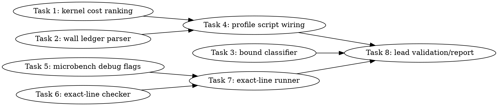

# SYCL Full Attribution Line Roofline Implementation Plan

> **For Claude:** REQUIRED SUB-SKILL: Use team-driven-development to implement this plan with agent teams.

**Goal:** Produce a fail-closed CPU/GPU profiling ledger that ranks host callsites, named GPU kernels, source regions, and bound type, while properly researching exact GPU source-line attribution in a microbench-only spike before any full GPT-OSS attempt.

**Architecture:** The profiling stack remains layered: timeline spans provide host/callsite and gap context, `sycl-kernels.csv/json` remains authoritative for named GPU cost until timeline event coverage matches it, ocloc/VTune evidence classifies bound type, and a separate exact-line feasibility gate decides whether VTune `gpu-source-line` can be trusted for MXFP4 kernels. All real B50/model/VTune execution is lead-only and every worker-visible script remains dry-run safe by default.

**Tech Stack:** Python 3 parser scripts, pytest source/unit tests, Bash dry-run gated profiling scripts, CMake/Ninja SYCL builds, Intel oneAPI/VTune/ocloc for lead-only captures, llama.cpp SYCL backend profiling artifacts.

---

## Team Topology

**Recommended implementers:** 3 concurrent (based on 5 parallel tracks — execution spawns one ephemeral implementer PER TASK; cap concurrency at 3 to reduce shared-repo coordination overhead)
**Reviewers:** spec + quality, spawned FRESH per review (not a standing pair; see team-driven-development)

### Parallel Tracks

| Track | Tasks | Description |
|-------|-------|-------------|
| A | 1, 4 | Kernel cost ranking, then profile-script artifact wiring |
| B | 2 | Wall-time ledger parser and coverage mismatch semantics |
| C | 3 | Bound-type classification from ocloc/VTune evidence |
| D | 5, 7 | Microbench profiling-debug build support, then lead-only exact-line runner |
| E | 6 | Offline exact-line feasibility checker |
| F | 8 | Final lead-only validation/report convergence after parser/script tasks land |

### Dependency Graph



### File Ownership Map

| File/Directory | Tasks | Conflict Risk |
|----------------|-------|---------------|
| `scripts/parse-sycl-kernel-profile.py:83-178` | 1 | None |
| `tests/test-sycl-kernel-profile-parser.py:60-117` | 1 | None |
| `scripts/parse-sycl-profile-ledger.py` | 2 | None, new file |
| `tests/test-sycl-profile-ledger-parser.py` | 2 | None, new file |
| `scripts/parse-sycl-vtune-kernel-asm.py:1-76` | 3 | None |
| `tests/test-sycl-vtune-asm-parser.py:1-45` | 3 | None |
| `scripts/sycl-gptoss-decode-timeline-profile.sh:102-135` | 4 | Depends on Tasks 1 and 2 |
| `tests/test-sycl-decode-timeline-profile-script.py:26-103` | 4 | Depends on Tasks 1 and 2 |
| `tools/sycl-kernel-bench/CMakeLists.txt:40-48` | 5 | None |
| `tests/test-sycl-kernel-bench-profiling-debug-source.py` | 5 | None, new file |
| `scripts/check-sycl-vtune-source-lines.py` | 6 | None, new file |
| `tests/test-sycl-vtune-source-line-checker.py` | 6 | None, new file |
| `scripts/sycl-vtune-source-line-feasibility.sh` | 7 | Depends on Tasks 5 and 6, new file |
| `tests/test-sycl-vtune-source-line-feasibility-script.py` | 7 | Depends on Tasks 5 and 6, new file |
| `activation/sycl-decode-profile-report-20260704.md:88-183` | 8 | Lead-only convergence |
| `activation/sycl-decode-hottest-kernel-line-attribution.md` | 8 | Create if absent |
| `docs/backend/SYCL.md:1240-1278` | 8 | Docs convergence |
| `.codescout/tasks.jsonl` | 8 | Tracker updates only; do not stage `.codescout/.gitignore` |

---

## Cross-Cutting Rules

1. Workers must not run real B50/B580/model gates, `/Storage` model access, `llama-bench`, `sycl-kernel-bench`, VTune, `sycl-ls`, DRM/`/dev/dri`, `lsof`, or P2P probes. Worker tests are parser/source/dry-run tests only.
2. Lead-only real commands must source oneAPI with:
   ```bash
   set +u
   source /opt/intel/oneapi/setvars.sh --force
   set -u
   ```
3. A GPU source-line result is PASS only when the target MXFP4 microbench kernel has non-`[Unknown]` `gpu-source-line` or `source-line` rows and the dumped `.zebin` contains a `.debug_line` section.
4. `sycl-kernels.csv/json` remains the named GPU cost source until the ledger says timeline event coverage matches kernel-profile total within the explicit threshold.
5. Never commit the local `.codescout/.gitignore` block. If task tooling dirties it, run `git restore .codescout/.gitignore` before staging.

---

## Task 1: Emit ranked named-kernel cost rows

**Track:** A
**Depends on:** None

**File scope:**
- Modify: `scripts/parse-sycl-kernel-profile.py:83-178`
- Modify: `tests/test-sycl-kernel-profile-parser.py:60-117`

**Description:**

Add a parser option that emits a stable top-N named-kernel cost table and explicit top-1 kernel row. This gives downstream scripts a machine-readable source for the hottest GPU cost site without scraping human Markdown.

**Acceptance Criteria:**

- [ ] `parse-sycl-kernel-profile.py --top-kernels N` accepts non-negative integers and rejects negative values with a clean argparse error.
- [ ] `--top-kernels 0` suppresses rank rows.
- [ ] `--top-kernels 2` prints stable rank rows sorted by total device time descending, then kernel name ascending.
- [ ] Output includes `cost.top1_kernel <name> <total_ms_x1000>` when at least one kernel exists.
- [ ] Existing parser output and return-code behavior remain unchanged when `--top-kernels` is omitted.

**Implementation Guide:**

1. **RED: add parser tests first.** Append the following tests to `tests/test-sycl-kernel-profile-parser.py` after `test_parser_reports_malformed_integer_fields_without_traceback` at line 108.

```python
def test_parser_rejects_negative_top_kernels() -> None:
    with tempfile.TemporaryDirectory() as tmp_raw:
        path = pathlib.Path(tmp_raw) / "profile.csv"
        path.write_text(CSV_TEXT, encoding="utf-8")
        result = run_parser(path, "--top-kernels", "-1")
        assert result.returncode == 2
        assert "--top-kernels must be non-negative" in result.stdout
        assert "Traceback" not in result.stdout


def test_parser_emits_ranked_top_kernel_rows() -> None:
    with tempfile.TemporaryDirectory() as tmp_raw:
        path = pathlib.Path(tmp_raw) / "profile.csv"
        path.write_text(CSV_WITH_DUPLICATE_KERNEL, encoding="utf-8")
        result = run_parser(path, "--top-kernels", "1")
        assert result.returncode == 0, result.stdout
        assert "cost.kernel.rank.1.name mxfp4.gateup.xmx_tiled_dpas_m2" in result.stdout
        assert "cost.kernel.rank.1.total_ms_x1000 5000" in result.stdout
        assert "cost.kernel.rank.1.count 3" in result.stdout
        assert "cost.kernel.rank.1.failed_timestamps 1" in result.stdout
        assert "cost.top1_kernel mxfp4.gateup.xmx_tiled_dpas_m2 5000" in result.stdout
        assert "cost.kernel.rank.2" not in result.stdout
```

Run:

```bash
python3 -m pytest tests/test-sycl-kernel-profile-parser.py::test_parser_rejects_negative_top_kernels tests/test-sycl-kernel-profile-parser.py::test_parser_emits_ranked_top_kernel_rows -q
```

Expected RED: both tests fail because `--top-kernels` is not recognized.

2. **GREEN: implement the option.** In `scripts/parse-sycl-kernel-profile.py`, add this helper after `parse_kernel_bytes()` at line 64:

```python
def parse_top_n(raw: str) -> int:
    try:
        value = int(raw)
    except ValueError as exc:
        raise argparse.ArgumentTypeError(f"invalid top-kernels value: {raw}") from exc
    if value < 0:
        raise argparse.ArgumentTypeError("--top-kernels must be non-negative")
    return value
```

Add the parser argument after line 114:

```python
    parser.add_argument("--top-kernels", type=parse_top_n, default=0)
```

After `kernel_sum_total_ns` is printed at line 147, build a sorted row list and emit cost rows before the existing per-kernel `kernel.*` loop:

```python
    ranked_kernels = sorted(kernel_totals.items(), key=lambda item: (-item[1]["total_ns"], item[0]))
    if ranked_kernels:
        top_name, top_totals = ranked_kernels[0]
        print(f"cost.top1_kernel {top_name} {ns_to_ms_x1000(top_totals['total_ns'])}")
    for rank, (name, totals) in enumerate(ranked_kernels[: args.top_kernels], start=1):
        print(f"cost.kernel.rank.{rank}.name {name}")
        print(f"cost.kernel.rank.{rank}.total_ms_x1000 {ns_to_ms_x1000(totals['total_ns'])}")
        print(f"cost.kernel.rank.{rank}.count {totals['count']}")
        print(f"cost.kernel.rank.{rank}.failed_timestamps {totals['failed_timestamps']}")
```

3. **Run the focused and full parser tests.**

```bash
python3 -m pytest tests/test-sycl-kernel-profile-parser.py -q
```

Expected GREEN: all tests in `tests/test-sycl-kernel-profile-parser.py` pass.

**Commit:**

```bash
git add scripts/parse-sycl-kernel-profile.py tests/test-sycl-kernel-profile-parser.py
git commit -m "feat(sycl): emit ranked kernel cost rows"
```

**Gotchas:**

- `metric_name()` only affects legacy `kernel.*` metric keys. Do not sanitize the `cost.kernel.rank.N.name` value; downstream scripts need the original label.
- Keep `cost.top1_kernel` emitted even when `--top-kernels 0`; this lets scripts cheaply identify the target without printing all rows.

---

## Task 2: Add a wall-time ledger parser that compares timeline and kernel-profile coverage

**Track:** B
**Depends on:** None

**File scope:**
- Create: `scripts/parse-sycl-profile-ledger.py`
- Create: `tests/test-sycl-profile-ledger-parser.py`

**Description:**

Create a dedicated parser that reads the raw timeline JSON plus named kernel CSV/JSON and emits a fail-closed ledger. The ledger must not pretend host spans and GPU event totals are additive wall time; it reports them as separate domains, highlights mismatches, and exposes residual unknown buckets explicitly.

**Acceptance Criteria:**

- [ ] Parser accepts `timeline` and `kernel_profile` positional paths plus `--coverage-ratio-threshold` defaulting to `0.90`.
- [ ] It emits `ledger.wall_ms_x1000`, `ledger.timeline_gpu_event_ms_x1000`, `ledger.kernel_profile_total_ms_x1000`, `ledger.timeline_kernel_delta_ms_x1000`, and `ledger.timeline_kernel_ratio_pct_x1000`.
- [ ] It emits `ledger.coverage_status ok` only when timeline/kernel ratio is at least the threshold and `coverage_mismatch` otherwise.
- [ ] It emits gap class totals aggregated across queues: `ledger.gap_class.host_overlap_ms_x1000`, `ledger.gap_class.queue_serialization_ms_x1000`, and `ledger.gap_class.runtime_idle_ms_x1000`.
- [ ] It emits `ledger.unknown_wall_residual_ms_x1000` as `max(0, wall - host_overlap - queue_serialization - runtime_idle - timeline_gpu_event_total)`.
- [ ] Malformed inputs return code 2 with no traceback.

**Implementation Guide:**

1. **RED: create parser tests.** Create `tests/test-sycl-profile-ledger-parser.py` with this content:

```python
#!/usr/bin/env python3
from __future__ import annotations

import json
import pathlib
import subprocess
import sys
import tempfile

ROOT = pathlib.Path(__file__).resolve().parents[1]
PARSER = ROOT / "scripts" / "parse-sycl-profile-ledger.py"


def run_parser(timeline: pathlib.Path, kernels: pathlib.Path, *args: str) -> subprocess.CompletedProcess[str]:
    return subprocess.run(
        [sys.executable, str(PARSER), *args, str(timeline), str(kernels)],
        text=True,
        stdout=subprocess.PIPE,
        stderr=subprocess.STDOUT,
        check=False,
    )


def write_inputs(tmp: pathlib.Path, kernel_total_ns: int) -> tuple[pathlib.Path, pathlib.Path]:
    timeline = {
        "traceEvents": [
            {"name": "graph", "cat": "ggml.graph", "ph": "X", "ts": 0, "dur": 1000, "args": {}},
            {
                "name": "a.kernel",
                "cat": "sycl.submit",
                "ph": "X",
                "ts": 100,
                "dur": 10,
                "args": {"metadata": "event_id=1"},
            },
            {
                "name": "compute_forward_node",
                "cat": "ggml.op",
                "ph": "X",
                "ts": 110,
                "dur": 300,
                "args": {"metadata": "op=MUL_MAT"},
            },
            {
                "name": "b.kernel",
                "cat": "sycl.submit",
                "ph": "X",
                "ts": 600,
                "dur": 10,
                "args": {"metadata": "event_id=2"},
            },
            {
                "name": "a.kernel",
                "cat": "sycl.event",
                "ph": "X",
                "ts": 0,
                "dur": 1,
                "args": {"metadata": "event_id=1;device=0;queue_kind=compute;device_start_ns=0;device_end_ns=100000"},
            },
            {
                "name": "b.kernel",
                "cat": "sycl.event",
                "ph": "X",
                "ts": 0,
                "dur": 1,
                "args": {"metadata": "event_id=2;device=0;queue_kind=compute;device_start_ns=400000;device_end_ns=500000"},
            },
        ]
    }
    timeline_path = tmp / "timeline.json"
    timeline_path.write_text(json.dumps(timeline), encoding="utf-8")
    kernel_path = tmp / "kernels.csv"
    kernel_path.write_text(
        "name,category,metadata,device,queue_kind,count,total_ns,mean_ns,min_ns,p50_ns,p95_ns,max_ns,bytes,failed_timestamps,graph_recorded\n"
        f"a.kernel,test,,0,compute,1,{kernel_total_ns},{kernel_total_ns},{kernel_total_ns},{kernel_total_ns},{kernel_total_ns},{kernel_total_ns},0,0,0\n",
        encoding="utf-8",
    )
    return timeline_path, kernel_path


def test_ledger_reports_coverage_mismatch_and_unknown_residual() -> None:
    with tempfile.TemporaryDirectory() as tmp_raw:
        timeline, kernels = write_inputs(pathlib.Path(tmp_raw), kernel_total_ns=1000000)
        result = run_parser(timeline, kernels)
        assert result.returncode == 0, result.stdout
        assert "ledger.wall_ms_x1000 1000" in result.stdout
        assert "ledger.timeline_gpu_event_ms_x1000 200" in result.stdout
        assert "ledger.kernel_profile_total_ms_x1000 1000" in result.stdout
        assert "ledger.timeline_kernel_delta_ms_x1000 800" in result.stdout
        assert "ledger.timeline_kernel_ratio_pct_x1000 20000" in result.stdout
        assert "ledger.coverage_status coverage_mismatch" in result.stdout
        assert "ledger.gap_class.host_overlap_ms_x1000 300" in result.stdout
        assert "ledger.gap_class.queue_serialization_ms_x1000 0" in result.stdout
        assert "ledger.gap_class.runtime_idle_ms_x1000 0" in result.stdout
        assert "ledger.unknown_wall_residual_ms_x1000 500" in result.stdout


def test_ledger_reports_ok_when_timeline_matches_kernel_profile() -> None:
    with tempfile.TemporaryDirectory() as tmp_raw:
        timeline, kernels = write_inputs(pathlib.Path(tmp_raw), kernel_total_ns=200000)
        result = run_parser(timeline, kernels, "--coverage-ratio-threshold", "0.90")
        assert result.returncode == 0, result.stdout
        assert "ledger.coverage_status ok" in result.stdout
        assert "ledger.timeline_kernel_ratio_pct_x1000 100000" in result.stdout


def test_ledger_reports_malformed_input_without_traceback() -> None:
    with tempfile.TemporaryDirectory() as tmp_raw:
        tmp = pathlib.Path(tmp_raw)
        timeline = tmp / "bad.json"
        kernels = tmp / "kernels.csv"
        timeline.write_text("{", encoding="utf-8")
        kernels.write_text("name,total_ns\n", encoding="utf-8")
        result = run_parser(timeline, kernels)
        assert result.returncode == 2
        assert "failed to parse profile ledger" in result.stdout
        assert "Traceback" not in result.stdout
```

Run:

```bash
python3 -m pytest tests/test-sycl-profile-ledger-parser.py -q
```

Expected RED: fails because `scripts/parse-sycl-profile-ledger.py` does not exist.

2. **GREEN: create the parser.** Create `scripts/parse-sycl-profile-ledger.py` with importlib loading of the two hyphenated parser modules:

```python
#!/usr/bin/env python3
from __future__ import annotations

import argparse
import importlib.util
import json
import math
import pathlib
import sys
from collections import Counter
from typing import Any

ROOT = pathlib.Path(__file__).resolve().parents[1]


def load_module(name: str, path: pathlib.Path) -> Any:
    spec = importlib.util.spec_from_file_location(name, path)
    if spec is None or spec.loader is None:
        raise RuntimeError(f"cannot load module {path}")
    module = importlib.util.module_from_spec(spec)
    spec.loader.exec_module(module)
    return module


timeline_parser = load_module("parse_sycl_timeline", ROOT / "scripts" / "parse-sycl-timeline.py")
kernel_parser = load_module("parse_sycl_kernel_profile", ROOT / "scripts" / "parse-sycl-kernel-profile.py")


def parse_ratio(raw: str) -> float:
    try:
        value = float(raw)
    except ValueError as exc:
        raise argparse.ArgumentTypeError(f"invalid coverage ratio threshold: {raw}") from exc
    if not math.isfinite(value) or value < 0.0 or value > 1.0:
        raise argparse.ArgumentTypeError("--coverage-ratio-threshold must be between 0 and 1")
    return value


def main(argv: list[str]) -> int:
    parser = argparse.ArgumentParser(description="Reconcile SYCL timeline and named-kernel profile totals")
    parser.add_argument("timeline", type=pathlib.Path)
    parser.add_argument("kernel_profile", type=pathlib.Path)
    parser.add_argument("--coverage-ratio-threshold", type=parse_ratio, default=0.90)
    args = parser.parse_args(argv)

    try:
        events = timeline_parser.load_trace_events(args.timeline)
        _, _, wall_us, timeline_gpu_total, _, _ = timeline_parser.summarize_events(events)
        gap_classes_by_queue = timeline_parser.summarize_queue_gap_classes(events)
        rows = kernel_parser.load_rows(args.kernel_profile)
        kernel_totals, _ = kernel_parser.aggregate_rows(rows)
    except (OSError, json.JSONDecodeError, ValueError, RuntimeError) as exc:
        print(f"failed to parse profile ledger: {exc}")
        return 2

    wall_total = timeline_parser.us_to_ms_x1000(wall_us)
    kernel_total = kernel_parser.ns_to_ms_x1000(sum(totals["total_ns"] for totals in kernel_totals.values()))
    delta = abs(kernel_total - timeline_gpu_total)
    ratio = 100000 if kernel_total == 0 and timeline_gpu_total == 0 else 0
    if kernel_total > 0:
        ratio = int(round(100000.0 * timeline_gpu_total / kernel_total))
    status = "ok" if ratio >= int(round(args.coverage_ratio_threshold * 100000.0)) else "coverage_mismatch"

    aggregate_gap_classes: Counter[str] = Counter()
    for gap_classes in gap_classes_by_queue.values():
        aggregate_gap_classes.update(gap_classes)
    host_overlap = aggregate_gap_classes["host_overlap"]
    queue_serialization = aggregate_gap_classes["queue_serialization"]
    runtime_idle = aggregate_gap_classes["runtime_idle"]
    unknown_residual = max(0, wall_total - timeline_gpu_total - host_overlap - queue_serialization - runtime_idle)

    print(f"ledger.wall_ms_x1000 {wall_total}")
    print(f"ledger.timeline_gpu_event_ms_x1000 {timeline_gpu_total}")
    print(f"ledger.kernel_profile_total_ms_x1000 {kernel_total}")
    print(f"ledger.timeline_kernel_delta_ms_x1000 {delta}")
    print(f"ledger.timeline_kernel_ratio_pct_x1000 {ratio}")
    print(f"ledger.coverage_status {status}")
    print(f"ledger.gap_class.host_overlap_ms_x1000 {host_overlap}")
    print(f"ledger.gap_class.queue_serialization_ms_x1000 {queue_serialization}")
    print(f"ledger.gap_class.runtime_idle_ms_x1000 {runtime_idle}")
    print(f"ledger.unknown_wall_residual_ms_x1000 {unknown_residual}")
    return 0


if __name__ == "__main__":
    raise SystemExit(main(sys.argv[1:]))
```

Make it executable:

```bash
chmod +x scripts/parse-sycl-profile-ledger.py
```

3. **Run tests.**

```bash
python3 -m pytest tests/test-sycl-profile-ledger-parser.py tests/test-sycl-timeline-parser.py tests/test-sycl-kernel-profile-parser.py -q
```

Expected GREEN: all selected tests pass.

**Commit:**

```bash
git add scripts/parse-sycl-profile-ledger.py tests/test-sycl-profile-ledger-parser.py
git commit -m "feat(sycl): reconcile timeline and kernel profile ledger"
```

**Gotchas:**

- Do not print a single additive total that sums host spans plus GPU event totals. That double-counts overlapped work.
- The test uses host-overlap classification from existing `parse-sycl-timeline.py:292-431`; keep this task limited to reconciliation, not taxonomy changes.

---

## Task 3: Classify bound type from ocloc/VTune instruction evidence

**Track:** C
**Depends on:** None

**File scope:**
- Modify: `scripts/parse-sycl-vtune-kernel-asm.py:1-76`
- Modify: `tests/test-sycl-vtune-asm-parser.py:1-45`

**Description:**

Extend the existing assembly/VTune parser to produce an explicit bound-type hint per evidence file. This turns `dpas.8x8`, `send.ugm`, `math.exp`, and instruction TSV fields into machine-readable classification rows used by the final report.

**Acceptance Criteria:**

- [ ] `--classify-bound` adds `bound` objects to JSON output for `--asm` inputs.
- [ ] A DPAS-heavy low-send fixture classifies as `compute_xmx_bound`.
- [ ] A high-send DPAS fixture classifies as `memory_or_address_bound`.
- [ ] A send-only fixture classifies as `memory_bound`.
- [ ] Existing opcode and TSV parsing output remains unchanged when `--classify-bound` is omitted.

**Implementation Guide:**

1. **RED: add tests.** Append these tests to `tests/test-sycl-vtune-asm-parser.py` after `test_tsv_parser_extracts_gpu_instruction_count` at line 30.

```python
def test_asm_parser_classifies_high_send_dpas_as_memory_or_address_bound() -> None:
    with tempfile.TemporaryDirectory() as tmp_raw:
        asm = pathlib.Path(tmp_raw) / "kernel.asm"
        asm.write_text(
            "\n".join(
                ["send.ugm r1 r2 r3 // wr:1+0, rd:4; load.ugm.d32x64t.a64"] * 40
                + ["dpas.8x8 r4:d null:d r5:b r6:b"] * 2
            )
            + "\n",
            encoding="utf-8",
        )
        data = run_parser("--classify-bound", "--asm", str(asm))
        assert data["asm"]["bound"]["verdict"] == "memory_or_address_bound"
        assert data["asm"]["bound"]["dpas"] == 2
        assert data["asm"]["bound"]["send_ugm"] == 40


def test_asm_parser_classifies_dpas_heavy_low_send_as_compute_bound() -> None:
    with tempfile.TemporaryDirectory() as tmp_raw:
        asm = pathlib.Path(tmp_raw) / "kernel.asm"
        asm.write_text(
            "\n".join(["dpas.8x8 r4:d null:d r5:b r6:b"] * 16 + ["send.ugm r1 r2 r3"] * 2) + "\n",
            encoding="utf-8",
        )
        data = run_parser("--classify-bound", "--asm", str(asm))
        assert data["asm"]["bound"]["verdict"] == "compute_xmx_bound"


def test_asm_parser_classifies_send_only_as_memory_bound() -> None:
    with tempfile.TemporaryDirectory() as tmp_raw:
        asm = pathlib.Path(tmp_raw) / "kernel.asm"
        asm.write_text("send.ugm r1 r2 r3\nsend.ugm r4 r5 r6\n", encoding="utf-8")
        data = run_parser("--classify-bound", "--asm", str(asm))
        assert data["asm"]["bound"]["verdict"] == "memory_bound"
```

Run:

```bash
python3 -m pytest tests/test-sycl-vtune-asm-parser.py::test_asm_parser_classifies_high_send_dpas_as_memory_or_address_bound tests/test-sycl-vtune-asm-parser.py::test_asm_parser_classifies_dpas_heavy_low_send_as_compute_bound tests/test-sycl-vtune-asm-parser.py::test_asm_parser_classifies_send_only_as_memory_bound -q
```

Expected RED: fails because `--classify-bound` is unrecognized.

2. **GREEN: add classification.** In `scripts/parse-sycl-vtune-kernel-asm.py`, add this helper after `parse_asm()`:

```python
def classify_bound(opcodes: dict[str, int]) -> dict[str, Any]:
    dpas = int(opcodes.get("dpas.8x8", 0))
    send_ugm = int(opcodes.get("send.ugm", 0))
    math_exp = int(opcodes.get("math.exp", 0))
    math_inv = int(opcodes.get("math.inv", 0))
    if dpas > 0 and send_ugm >= dpas * 16:
        verdict = "memory_or_address_bound"
    elif dpas > 0:
        verdict = "compute_xmx_bound"
    elif send_ugm > 0:
        verdict = "memory_bound"
    elif math_exp + math_inv > 0:
        verdict = "math_bound"
    else:
        verdict = "unknown"
    return {
        "verdict": verdict,
        "dpas": dpas,
        "send_ugm": send_ugm,
        "math_exp": math_exp,
        "math_inv": math_inv,
        "send_per_dpas_x1000": 0 if dpas == 0 else int(round(1000.0 * send_ugm / dpas)),
    }
```

Add `parser.add_argument("--classify-bound", action="store_true")` before parsing args in `main()`. After the existing `summaries = [parse_asm(pathlib.Path(path)) for path in args.asm]` assignment, inject bound data when requested:

```python
        if args.classify_bound:
            for summary in summaries:
                summary["bound"] = classify_bound(summary.get("opcodes", {}))
```

3. **Run tests.**

```bash
python3 -m pytest tests/test-sycl-vtune-asm-parser.py -q
```

Expected GREEN: all VTune/asm parser tests pass.

**Commit:**

```bash
git add scripts/parse-sycl-vtune-kernel-asm.py tests/test-sycl-vtune-asm-parser.py
git commit -m "feat(sycl): classify kernel bound type from asm evidence"
```

**Gotchas:**

- This is a bound hint, not a proof. The final report must cite the counts and verdict together.
- The `memory_or_address_bound` verdict is intentionally conservative for MXFP4 gate/up kernels with DPAS present but very high `send.ugm` and address/control work.

---

## Task 4: Wire cost ranking and wall ledger into the GPT-OSS profile script

**Track:** A
**Depends on:** Task 1, Task 2

**File scope:**
- Modify: `scripts/sycl-gptoss-decode-timeline-profile.sh:102-135`
- Modify: `tests/test-sycl-decode-timeline-profile-script.py:26-103`

**Description:**

Make the existing lead-only profile script produce the new machine-readable artifacts in both dry-run and execute branches. This keeps the artifact directory complete and prevents future real runs from forgetting `wall-ledger.parse` or `cost-ranking.parse`.

**Acceptance Criteria:**

- [ ] Dry-run output includes commands to create `cost-ranking.parse` and `wall-ledger.parse`.
- [ ] Execute branch creates both artifacts after `kernels.parse`.
- [ ] `cost-ranking.parse` uses `parse-sycl-kernel-profile.py --top-kernels 30`.
- [ ] `wall-ledger.parse` uses `parse-sycl-profile-ledger.py sycl-timeline.json sycl-kernels.csv`.
- [ ] Existing execute acknowledgement gate remains unchanged.

**Implementation Guide:**

1. **RED: update source tests.** In `tests/test-sycl-decode-timeline-profile-script.py`, add these strings to `REQUIRED_DRY_RUN_STRINGS` at line 26:

```python
    "cost-ranking.parse",
    "wall-ledger.parse",
    "--top-kernels 30",
    "scripts/parse-sycl-profile-ledger.py",
```

Add these strings to `EXECUTE_BRANCH_STRINGS` at line 60:

```python
    "python3 scripts/parse-sycl-kernel-profile.py --top-kernels 30 \"${OUT_ROOT}/sycl-kernels.csv\" >\"${OUT_ROOT}/cost-ranking.parse\"",
    "python3 scripts/parse-sycl-profile-ledger.py \"${OUT_ROOT}/sycl-timeline.json\" \"${OUT_ROOT}/sycl-kernels.csv\" >\"${OUT_ROOT}/wall-ledger.parse\"",
```

Run:

```bash
python3 -m pytest tests/test-sycl-decode-timeline-profile-script.py::test_timeline_profile_script_is_dry_run_by_default tests/test-sycl-decode-timeline-profile-script.py::test_timeline_profile_script_execute_branch_wires_artifact_layout -q
```

Expected RED: dry-run/execute source assertions fail because the script does not mention the new artifacts.

2. **GREEN: update script.** In `scripts/sycl-gptoss-decode-timeline-profile.sh`, after line 102 add:

```bash
cost_ranking_parse="${OUT_ROOT}/cost-ranking.parse"
wall_ledger_parse="${OUT_ROOT}/wall-ledger.parse"
```

In the dry-run branch after the existing `kernels.parse` printf at line 122, add:

```bash
    printf 'python3 %q --top-kernels 30 %q >%q\n' "scripts/parse-sycl-kernel-profile.py" "${OUT_ROOT}/sycl-kernels.csv" "${cost_ranking_parse}"
    printf 'python3 %q %q %q >%q\n' "scripts/parse-sycl-profile-ledger.py" "${OUT_ROOT}/sycl-timeline.json" "${OUT_ROOT}/sycl-kernels.csv" "${wall_ledger_parse}"
```

In the execute branch after line 135, add:

```bash
python3 scripts/parse-sycl-kernel-profile.py --top-kernels 30 "${OUT_ROOT}/sycl-kernels.csv" >"${cost_ranking_parse}"
python3 scripts/parse-sycl-profile-ledger.py "${OUT_ROOT}/sycl-timeline.json" "${OUT_ROOT}/sycl-kernels.csv" >"${wall_ledger_parse}"
```

3. **Run tests.**

```bash
python3 -m pytest tests/test-sycl-decode-timeline-profile-script.py -q
bash scripts/sycl-gptoss-decode-timeline-profile.sh --dry-run >/tmp/sycl-profile-dry-run.txt
```

Expected GREEN: pytest passes and `/tmp/sycl-profile-dry-run.txt` contains both new parser commands. The dry-run command does not access `/Storage`.

**Commit:**

```bash
git add scripts/sycl-gptoss-decode-timeline-profile.sh tests/test-sycl-decode-timeline-profile-script.py
git commit -m "feat(sycl): emit ledger artifacts from decode profile script"
```

**Gotchas:**

- Do not run `--execute` in this task. Worker validation is dry-run only.
- Keep the existing safe baseline env exactly: `GGML_SYCL_MOE_PHASE_MATERIALIZE=1`, `GGML_SYCL_MOE_PHASE_BULK_XMX=1`, `GGML_SYCL_MOE_DOWN_SUM_DIRECT=1`, and `-fa 1`.

---

## Task 5: Propagate profiling-debug flags to `sycl-kernel-bench`

**Track:** D
**Depends on:** None

**File scope:**
- Modify: `tools/sycl-kernel-bench/CMakeLists.txt:40-48`
- Create: `tests/test-sycl-kernel-bench-profiling-debug-source.py`

**Description:**

The existing `GGML_SYCL_PROFILING_DEBUG` option at `ggml/src/ggml-sycl/CMakeLists.txt:40` only applies debug-line flags to `ggml-sycl`. The exact-line spike targets `sycl-kernel-bench` MXFP4 kernels, so the microbench target must receive equivalent flags when the option is enabled.

**Acceptance Criteria:**

- [ ] `tools/sycl-kernel-bench` adds `-g`, `-gline-tables-only`, `-fdebug-info-for-profiling`, and `-fsycl-instrument-device-code` when `GGML_SYCL_PROFILING_DEBUG` is ON.
- [ ] Normal `GGML_SYCL_PROFILING_DEBUG=OFF` behavior remains unchanged.
- [ ] Source test verifies both compile and link instrumentation flags are present.

**Implementation Guide:**

1. **RED: create source test.** Create `tests/test-sycl-kernel-bench-profiling-debug-source.py`:

```python
#!/usr/bin/env python3
from __future__ import annotations

from pathlib import Path

ROOT = Path(__file__).resolve().parents[1]
CMAKE = ROOT / "tools" / "sycl-kernel-bench" / "CMakeLists.txt"


def test_kernel_bench_honors_sycl_profiling_debug_flag() -> None:
    text = CMAKE.read_text(encoding="utf-8")
    assert "if (GGML_SYCL_PROFILING_DEBUG)" in text
    assert '"-g"' in text
    assert '"-gline-tables-only"' in text
    assert '"-fdebug-info-for-profiling"' in text
    assert '"-fsycl-instrument-device-code"' in text
    assert 'target_link_options(${TARGET} PRIVATE "-fsycl-instrument-device-code")' in text
```

Run:

```bash
python3 -m pytest tests/test-sycl-kernel-bench-profiling-debug-source.py -q
```

Expected RED: fails because the microbench CMake target does not reference `GGML_SYCL_PROFILING_DEBUG`.

2. **GREEN: update CMake.** In `tools/sycl-kernel-bench/CMakeLists.txt`, inside the existing `if (GGML_SYCL)` block after line 45, add:

```cmake
    if (GGML_SYCL_PROFILING_DEBUG)
        target_compile_options(${TARGET} PRIVATE
            "-g"
            "-gline-tables-only"
            "-fdebug-info-for-profiling"
            "-fsycl-instrument-device-code")
        target_link_options(${TARGET} PRIVATE "-fsycl-instrument-device-code")
    endif()
```

3. **Run source test.**

```bash
python3 -m pytest tests/test-sycl-kernel-bench-profiling-debug-source.py -q
```

Expected GREEN: source test passes.

**Commit:**

```bash
git add tools/sycl-kernel-bench/CMakeLists.txt tests/test-sycl-kernel-bench-profiling-debug-source.py
git commit -m "build(sycl): enable profiling debug flags for kernel bench"
```

**Gotchas:**

- Do not add these flags unconditionally. They may perturb performance and build output.
- This task only changes build wiring; it must not run `sycl-kernel-bench`.

---

## Task 6: Add an offline exact GPU source-line feasibility checker

**Track:** E
**Depends on:** None

**File scope:**
- Create: `scripts/check-sycl-vtune-source-lines.py`
- Create: `tests/test-sycl-vtune-source-line-checker.py`

**Description:**

Create a small checker that fails closed on the two facts that matter for B: the dumped zebin must contain `.debug_line`, and the VTune source-line CSV must contain non-unknown rows for the requested kernel/source group. This checker is pure file parsing and safe for workers.

**Acceptance Criteria:**

- [ ] Checker accepts `--readelf-sections FILE`, `--vtune-csv FILE`, and `--require-kernel NAME`.
- [ ] Emits `source_line.debug_line_present 1|0`.
- [ ] Emits `source_line.non_unknown_rows N`.
- [ ] Emits `source_line.status pass|fail`.
- [ ] Returns code 0 only on pass; returns code 2 on fail or malformed files without traceback.

**Implementation Guide:**

1. **RED: create tests.** Create `tests/test-sycl-vtune-source-line-checker.py`:

```python
#!/usr/bin/env python3
from __future__ import annotations

import pathlib
import subprocess
import sys
import tempfile

ROOT = pathlib.Path(__file__).resolve().parents[1]
CHECKER = ROOT / "scripts" / "check-sycl-vtune-source-lines.py"


def run_checker(sections: pathlib.Path, csv: pathlib.Path, *args: str) -> subprocess.CompletedProcess[str]:
    return subprocess.run(
        [sys.executable, str(CHECKER), "--readelf-sections", str(sections), "--vtune-csv", str(csv), *args],
        text=True,
        stdout=subprocess.PIPE,
        stderr=subprocess.STDOUT,
        check=False,
    )


def test_checker_passes_with_debug_line_and_non_unknown_source_rows() -> None:
    with tempfile.TemporaryDirectory() as tmp_raw:
        tmp = pathlib.Path(tmp_raw)
        sections = tmp / "sections.txt"
        csv = tmp / "source.csv"
        sections.write_text("[12] .debug_line PROGBITS\n", encoding="utf-8")
        csv.write_text("Source Line\tSource Computing Task\tComputing Task:Total Time\nmmvq.cpp:123\tmxfp4_pair_glu_xmx_tiled_packed_r8_m2\t0.1\n", encoding="utf-8")
        result = run_checker(sections, csv, "--require-kernel", "mxfp4_pair_glu_xmx_tiled")
        assert result.returncode == 0, result.stdout
        assert "source_line.debug_line_present 1" in result.stdout
        assert "source_line.non_unknown_rows 1" in result.stdout
        assert "source_line.status pass" in result.stdout


def test_checker_fails_when_source_rows_are_unknown() -> None:
    with tempfile.TemporaryDirectory() as tmp_raw:
        tmp = pathlib.Path(tmp_raw)
        sections = tmp / "sections.txt"
        csv = tmp / "source.csv"
        sections.write_text("[12] .debug_line PROGBITS\n", encoding="utf-8")
        csv.write_text("Source Line\tSource Computing Task\n[Unknown]\tmxfp4_pair_glu_xmx_tiled_packed_r8_m2\n", encoding="utf-8")
        result = run_checker(sections, csv, "--require-kernel", "mxfp4_pair_glu_xmx_tiled")
        assert result.returncode == 2
        assert "source_line.non_unknown_rows 0" in result.stdout
        assert "source_line.status fail" in result.stdout


def test_checker_fails_without_debug_line() -> None:
    with tempfile.TemporaryDirectory() as tmp_raw:
        tmp = pathlib.Path(tmp_raw)
        sections = tmp / "sections.txt"
        csv = tmp / "source.csv"
        sections.write_text("[12] .ze_info LOUSER\n", encoding="utf-8")
        csv.write_text("Source Line\tSource Computing Task\nmmvq.cpp:123\tmxfp4_pair_glu_xmx_tiled_packed_r8_m2\n", encoding="utf-8")
        result = run_checker(sections, csv, "--require-kernel", "mxfp4_pair_glu_xmx_tiled")
        assert result.returncode == 2
        assert "source_line.debug_line_present 0" in result.stdout
        assert "source_line.status fail" in result.stdout
```

Run:

```bash
python3 -m pytest tests/test-sycl-vtune-source-line-checker.py -q
```

Expected RED: fails because the checker does not exist.

2. **GREEN: create checker.** Create `scripts/check-sycl-vtune-source-lines.py`:

```python
#!/usr/bin/env python3
from __future__ import annotations

import argparse
import csv
import pathlib
import sys

UNKNOWN_VALUES = {"", "[Unknown]", "[Unknown source file]"}


def row_matches_kernel(row: dict[str, str], required: str | None) -> bool:
    if required is None:
        return True
    joined = " ".join(value for value in row.values() if value)
    return required in joined


def row_has_known_source(row: dict[str, str]) -> bool:
    candidates = [row.get("Source Line", ""), row.get("Source File", ""), row.get("Source File Path", "")]
    return any(candidate not in UNKNOWN_VALUES for candidate in candidates)


def main(argv: list[str]) -> int:
    parser = argparse.ArgumentParser(description="Check VTune GPU source-line feasibility for SYCL kernels")
    parser.add_argument("--readelf-sections", required=True, type=pathlib.Path)
    parser.add_argument("--vtune-csv", required=True, type=pathlib.Path)
    parser.add_argument("--require-kernel")
    args = parser.parse_args(argv)

    try:
        sections = args.readelf_sections.read_text(encoding="utf-8", errors="replace")
        debug_line_present = ".debug_line" in sections
        with args.vtune_csv.open("r", encoding="utf-8", errors="replace", newline="") as handle:
            sample = handle.read(4096)
            handle.seek(0)
            dialect = csv.excel_tab if "\t" in sample.splitlines()[0] else csv.excel
            reader = csv.DictReader(handle, dialect=dialect)
            non_unknown_rows = sum(1 for row in reader if row_matches_kernel(row, args.require_kernel) and row_has_known_source(row))
    except (OSError, csv.Error, IndexError) as exc:
        print(f"failed to check source lines: {exc}")
        return 2

    passed = debug_line_present and non_unknown_rows > 0
    print(f"source_line.debug_line_present {1 if debug_line_present else 0}")
    print(f"source_line.non_unknown_rows {non_unknown_rows}")
    print(f"source_line.status {'pass' if passed else 'fail'}")
    return 0 if passed else 2


if __name__ == "__main__":
    raise SystemExit(main(sys.argv[1:]))
```

Make it executable:

```bash
chmod +x scripts/check-sycl-vtune-source-lines.py
```

3. **Run tests.**

```bash
python3 -m pytest tests/test-sycl-vtune-source-line-checker.py -q
```

Expected GREEN: checker tests pass.

**Commit:**

```bash
git add scripts/check-sycl-vtune-source-lines.py tests/test-sycl-vtune-source-line-checker.py
git commit -m "feat(sycl): check VTune source-line feasibility artifacts"
```

**Gotchas:**

- VTune CSV may be tab-separated or comma-separated; the checker must handle both.
- A known source row for a non-target kernel is not a full B pass when `--require-kernel` is supplied.

---

## Task 7: Add a lead-only exact GPU source-line feasibility runner

**Track:** D
**Depends on:** Task 5, Task 6

**File scope:**
- Create: `scripts/sycl-vtune-source-line-feasibility.sh`
- Create: `tests/test-sycl-vtune-source-line-feasibility-script.py`

**Description:**

Add a dry-run-safe lead-only script that documents and automates the microbench-only B spike. The script builds an isolated profiling-debug build directory, runs a single VTune source-analysis microbench only when explicitly acknowledged, dumps zebin sections, exports `gpu-source-line` CSV, and checks pass/fail with Task 6's checker.

**Acceptance Criteria:**

- [ ] Default invocation is dry-run and exits 0 without running CMake, VTune, or microbench.
- [ ] Real execution requires `--execute --i-understand-this-runs-gpu-microbenchmarks`.
- [ ] Dry-run prints an isolated build dir command with `-DGGML_SYCL_PROFILING_DEBUG=ON` and target `sycl-kernel-bench`.
- [ ] Dry-run prints VTune `gpu-profiling-mode=source-analysis`, `source-analysis=mem-latency`, `dump-compute-task-binaries=true`, and `computing-tasks-of-interest` for the target MXFP4 kernel.
- [ ] Execute branch writes `profiling-debug-build.log`, `vtune-gpu-source-line.csv`, `zebin-debug-sections.txt`, and `source-line-feasibility.parse` under `OUT_ROOT`.
- [ ] The script does not mention `/Storage`, `llama-bench`, or GPT-OSS model paths.

**Implementation Guide:**

1. **RED: create source/dry-run tests.** Create `tests/test-sycl-vtune-source-line-feasibility-script.py`:

```python
#!/usr/bin/env python3
from __future__ import annotations

import subprocess
from pathlib import Path

ROOT = Path(__file__).resolve().parents[1]
SCRIPT = ROOT / "scripts" / "sycl-vtune-source-line-feasibility.sh"


def script_text() -> str:
    return SCRIPT.read_text(encoding="utf-8")


def test_source_line_feasibility_script_is_dry_run_by_default() -> None:
    result = subprocess.run(["bash", str(SCRIPT)], cwd=ROOT, text=True, stdout=subprocess.PIPE, stderr=subprocess.STDOUT, check=False)
    assert result.returncode == 0, result.stdout
    assert "DRY RUN" in result.stdout
    assert "-DGGML_SYCL_PROFILING_DEBUG=ON" in result.stdout
    assert "sycl-kernel-bench" in result.stdout
    assert "gpu-profiling-mode=source-analysis" in result.stdout
    assert "source-analysis=mem-latency" in result.stdout
    assert "dump-compute-task-binaries=true" in result.stdout
    assert "check-sycl-vtune-source-lines.py" in result.stdout
    assert "/Storage" not in result.stdout
    assert "llama-bench" not in result.stdout


def test_source_line_feasibility_script_refuses_execute_without_ack() -> None:
    result = subprocess.run(["bash", str(SCRIPT), "--execute"], cwd=ROOT, text=True, stdout=subprocess.PIPE, stderr=subprocess.STDOUT, check=False)
    assert result.returncode == 2
    assert "requires --i-understand-this-runs-gpu-microbenchmarks" in result.stdout


def test_source_line_feasibility_execute_branch_writes_expected_artifacts() -> None:
    text = script_text()
    assert "profiling-debug-build.log" in text
    assert "vtune-gpu-source-line.csv" in text
    assert "zebin-debug-sections.txt" in text
    assert "source-line-feasibility.parse" in text
    assert "vtune -collect gpu-hotspots" in text
    assert "vtune -report hotspots" in text
    assert "readelf -S" in text
    assert "scripts/check-sycl-vtune-source-lines.py" in text
```

Run:

```bash
python3 -m pytest tests/test-sycl-vtune-source-line-feasibility-script.py -q
```

Expected RED: fails because the script does not exist.

2. **GREEN: create the script.** Create `scripts/sycl-vtune-source-line-feasibility.sh` with these operational details:

```bash
#!/usr/bin/env bash
set -euo pipefail

EXECUTE=0
ACK=0
OUT_ROOT="/tmp/sycl_vtune_source_line_$(date +%Y%m%d_%H%M%S)"
BUILD_DIR="build-vtune-line"
DEVICE_SELECTOR="level_zero:1"
TARGET_KERNEL="mxfp4_pair_glu_xmx_tiled_packed_r8_m2_sparse32_bias"
TASK_GLOB="*mxfp4_pair_glu_xmx_tiled*"

usage() {
    printf 'usage: %s [--dry-run|--execute] [--i-understand-this-runs-gpu-microbenchmarks] [--out-root DIR] [--build-dir DIR] [--device-selector SELECTOR] [--target-kernel NAME]\n' "$0"
}

require_value() {
    local opt="$1"
    local value="${2-}"
    if [[ -z "${value}" || "${value}" == --* ]]; then
        printf 'error: %s requires a value\n' "${opt}" >&2
        exit 2
    fi
}

while [[ $# -gt 0 ]]; do
    case "$1" in
        --dry-run) EXECUTE=0 ;;
        --execute) EXECUTE=1 ;;
        --i-understand-this-runs-gpu-microbenchmarks) ACK=1 ;;
        --out-root) require_value "$1" "${2-}"; OUT_ROOT="$2"; shift ;;
        --build-dir) require_value "$1" "${2-}"; BUILD_DIR="$2"; shift ;;
        --device-selector) require_value "$1" "${2-}"; DEVICE_SELECTOR="$2"; shift ;;
        --target-kernel) require_value "$1" "${2-}"; TARGET_KERNEL="$2"; TASK_GLOB="*$2*"; shift ;;
        --help|-h) usage; exit 0 ;;
        *) printf 'unknown argument: %s\n' "$1" >&2; usage >&2; exit 2 ;;
    esac
    shift
done

if [[ "${EXECUTE}" -eq 1 && "${ACK}" -ne 1 ]]; then
    printf 'error: --execute requires --i-understand-this-runs-gpu-microbenchmarks\n' >&2
    exit 2
fi

configure_cmd=(cmake -S . -B "${BUILD_DIR}" -G Ninja -DCMAKE_BUILD_TYPE=Release -DGGML_SYCL=ON -DGGML_SYCL_TARGET=INTEL -DGGML_SYCL_F16=ON -DGGML_SYCL_PROFILING_DEBUG=ON -DCMAKE_C_COMPILER=icx -DCMAKE_CXX_COMPILER=icpx)
build_cmd=(cmake --build "${BUILD_DIR}" --config Release --target sycl-kernel-bench -j "${CMAKE_BUILD_PARALLEL_LEVEL:-$(nproc)}")
bench_cmd=("./${BUILD_DIR}/bin/sycl-kernel-bench" --kernel="${TARGET_KERNEL}" --quant=MXFP4 --dim_m=2880 --dim_n=4 --dim_k=2880 --iterations=100 --warmup=10 --validate --output=json)
vtune_dir="${OUT_ROOT}/vtune-source-line"

print_plan() {
    printf 'DRY RUN: would execute lead-only SYCL VTune source-line microbench feasibility.\n'
    printf '# output root: %s\n' "${OUT_ROOT}"
    printf '%q ' "${configure_cmd[@]}"; printf '> %q 2>&1\n' "${OUT_ROOT}/profiling-debug-build.log"
    printf '%q ' "${build_cmd[@]}"; printf '>> %q 2>&1\n' "${OUT_ROOT}/profiling-debug-build.log"
    printf 'env ONEAPI_DEVICE_SELECTOR=%q vtune -collect gpu-hotspots -knob target-gpu=0:7:0.0 -knob gpu-profiling-mode=source-analysis -knob source-analysis=mem-latency -knob dump-compute-task-binaries=true -knob computing-tasks-of-interest=%q -result-dir %q -- ' "${DEVICE_SELECTOR}" "${TASK_GLOB}#1#1#20" "${vtune_dir}"
    printf '%q ' "${bench_cmd[@]}"; printf '> %q 2> %q\n' "${OUT_ROOT}/bench.stdout" "${OUT_ROOT}/bench.stderr"
    printf 'readelf -S %q > %q\n' "${vtune_dir}/data.0/<first-zebin>" "${OUT_ROOT}/zebin-debug-sections.txt"
    printf 'vtune -report hotspots -r %q -group-by gpu-source-line -format csv > %q\n' "${vtune_dir}" "${OUT_ROOT}/vtune-gpu-source-line.csv"
    printf 'python3 scripts/check-sycl-vtune-source-lines.py --readelf-sections %q --vtune-csv %q --require-kernel %q > %q\n' "${OUT_ROOT}/zebin-debug-sections.txt" "${OUT_ROOT}/vtune-gpu-source-line.csv" "mxfp4_pair_glu_xmx_tiled" "${OUT_ROOT}/source-line-feasibility.parse"
}

if [[ "${EXECUTE}" -ne 1 ]]; then
    print_plan
    exit 0
fi

mkdir -p "${OUT_ROOT}"
set +u
source /opt/intel/oneapi/setvars.sh --force >"${OUT_ROOT}/setvars.log" 2>&1
set -u
"${configure_cmd[@]}" >"${OUT_ROOT}/profiling-debug-build.log" 2>&1
"${build_cmd[@]}" >>"${OUT_ROOT}/profiling-debug-build.log" 2>&1
env ONEAPI_DEVICE_SELECTOR="${DEVICE_SELECTOR}" vtune -collect gpu-hotspots \
    -knob target-gpu=0:7:0.0 \
    -knob gpu-profiling-mode=source-analysis \
    -knob source-analysis=mem-latency \
    -knob dump-compute-task-binaries=true \
    -knob computing-tasks-of-interest="${TASK_GLOB}#1#1#20" \
    -result-dir "${vtune_dir}" \
    -- "${bench_cmd[@]}" >"${OUT_ROOT}/bench.stdout" 2>"${OUT_ROOT}/bench.stderr"
first_zebin="$(find "${vtune_dir}" -path '*/data.0/*.zebin' -type f | head -n 1)"
readelf -S "${first_zebin}" >"${OUT_ROOT}/zebin-debug-sections.txt"
vtune -report hotspots -r "${vtune_dir}" -group-by gpu-source-line -format csv >"${OUT_ROOT}/vtune-gpu-source-line.csv"
python3 scripts/check-sycl-vtune-source-lines.py \
    --readelf-sections "${OUT_ROOT}/zebin-debug-sections.txt" \
    --vtune-csv "${OUT_ROOT}/vtune-gpu-source-line.csv" \
    --require-kernel "mxfp4_pair_glu_xmx_tiled" >"${OUT_ROOT}/source-line-feasibility.parse"
printf 'Artifacts: %s\n' "${OUT_ROOT}"
```

Make it executable:

```bash
chmod +x scripts/sycl-vtune-source-line-feasibility.sh
```

3. **Run dry-run tests only.**

```bash
python3 -m pytest tests/test-sycl-vtune-source-line-feasibility-script.py -q
bash scripts/sycl-vtune-source-line-feasibility.sh --dry-run >/tmp/sycl-vtune-source-line-dry-run.txt
```

Expected GREEN: tests pass; dry-run prints planned commands and does not run CMake, VTune, or microbench.

**Commit:**

```bash
git add scripts/sycl-vtune-source-line-feasibility.sh tests/test-sycl-vtune-source-line-feasibility-script.py
git commit -m "feat(sycl): gate VTune source-line feasibility run"
```

**Gotchas:**

- This script is lead-only when executed. Workers may run the dry-run and pytest source tests only.
- Keep this microbench-only. It must not reference `/Storage`, GPT-OSS, or `llama-bench`.
- The default target is chosen from the existing microbench names listed in `tools/sycl-kernel-bench/main.cpp:98-150`.

---

## Task 8: Lead-only validation and final attribution report update

**Track:** F
**Depends on:** Task 3, Task 4, Task 7

**File scope:**
- Modify: `activation/sycl-decode-profile-report-20260704.md:88-183`
- Create or modify: `activation/sycl-decode-hottest-kernel-line-attribution.md`
- Modify: `docs/backend/SYCL.md:1240-1278`
- Modify: `.codescout/tasks.jsonl` through tracker tools only

**Description:**

Run the full lead-only validation sequence after parser/script tasks land, then update the report with a wall ledger, cost ranking, bound-type classification, and exact-line feasibility result. This task is the only one allowed to run real B50/model/VTune commands.

**Acceptance Criteria:**

- [ ] Safe non-GPU gates pass: pytest parser/source tests, `test-sycl-timeline`, `test-sycl-kernel-profiler`, and dry-run scripts.
- [ ] Lead runs the canonical GPT-OSS B50 profile script with `--execute --i-understand-this-runs-gpu-models` only after dry-run review.
- [ ] Artifact root contains `cost-ranking.parse`, `wall-ledger.parse`, and existing timeline/kernel artifacts.
- [ ] Lead runs the microbench-only exact-line feasibility script with `--execute --i-understand-this-runs-gpu-microbenchmarks` only after dry-run review.
- [ ] Report states whether exact GPU source lines passed, failed, or partially passed; full GPT-OSS exact-line profiling remains blocked unless the microbench target passes.
- [ ] Report names the top kernel(s), source region/line range attribution from ablation/ocloc evidence, bound-type verdict, and unknown residual time.
- [ ] Branch is pushed.

**Implementation Guide:**

1. **Run safe tests first.**

```bash
python3 -m pytest \
  tests/test-sycl-kernel-profile-parser.py \
  tests/test-sycl-profile-ledger-parser.py \
  tests/test-sycl-vtune-asm-parser.py \
  tests/test-sycl-kernel-bench-profiling-debug-source.py \
  tests/test-sycl-vtune-source-line-checker.py \
  tests/test-sycl-vtune-source-line-feasibility-script.py \
  tests/test-sycl-decode-timeline-profile-script.py -q
./scripts/sycl-build.sh test-sycl-timeline test-sycl-kernel-profiler llama-bench
ctest --test-dir build -R 'test-sycl-(timeline|kernel-profiler)' -V
bash scripts/sycl-gptoss-decode-timeline-profile.sh --dry-run >/tmp/sycl-profile-dry-run.txt
bash scripts/sycl-vtune-source-line-feasibility.sh --dry-run >/tmp/sycl-vtune-line-dry-run.txt
```

Expected: pytest passes, build succeeds, CTest passes, both dry-runs show planned commands only.

2. **Lead-only GPT-OSS profile.**

```bash
set +u
source /opt/intel/oneapi/setvars.sh --force
set -u
out=/tmp/sycl_decode_profile_full_$(date +%Y%m%d_%H%M%S)
./scripts/sycl-gptoss-decode-timeline-profile.sh \
  --execute \
  --i-understand-this-runs-gpu-models \
  --out-root "$out" \
  --device-selector level_zero:1
```

Expected: command completes, `bench.stdout` contains PP512/TG128 rows, and `$out` contains `cost-ranking.parse` plus `wall-ledger.parse`.

3. **Lead-only exact-line microbench feasibility.**

```bash
set +u
source /opt/intel/oneapi/setvars.sh --force
set -u
line_out=/tmp/sycl_vtune_source_line_$(date +%Y%m%d_%H%M%S)
./scripts/sycl-vtune-source-line-feasibility.sh \
  --execute \
  --i-understand-this-runs-gpu-microbenchmarks \
  --out-root "$line_out" \
  --device-selector level_zero:1
```

Expected PASS case: `$line_out/source-line-feasibility.parse` contains `source_line.status pass`.
Expected FAIL case: the same file contains `source_line.status fail`; this is an honest feasibility result, not a task failure, as long as the script completed and reported why.

4. **Update reports.** Append or update sections in `activation/sycl-decode-profile-report-20260704.md`:

```markdown
## Full wall-time ledger

Record the new `wall-ledger.parse` rows verbatim in a table. State whether `ledger.coverage_status` is `ok` or `coverage_mismatch`. If mismatch, state that named GPU ranking still comes from `sycl-kernels.csv/json`.

## Source-region and bound-type attribution

Record the top kernel from `cost-ranking.parse`, the source region/line range from existing or newly collected ablation/ocloc evidence, the `parse-sycl-vtune-kernel-asm.py --classify-bound` verdict, and the opcode counts that justify it.

## Exact GPU source-line feasibility

Record the microbench-only B result from `source-line-feasibility.parse`, `zebin-debug-sections.txt`, and `vtune-gpu-source-line.csv`. State explicitly whether full GPT-OSS exact-line profiling is authorized or blocked.
```

Update `docs/backend/SYCL.md` near the decode timeline profiler section at lines 1240-1278 to mention `wall-ledger.parse`, `cost-ranking.parse`, and the microbench-only source-line feasibility gate.

5. **Close/update tracker tasks and push.**

```bash
git status --short
git restore .codescout/.gitignore
git add \
  activation/sycl-decode-profile-report-20260704.md \
  activation/sycl-decode-hottest-kernel-line-attribution.md \
  docs/backend/SYCL.md \
  .codescout/tasks.jsonl
git commit -m "docs(sycl): report full attribution ledger and source-line feasibility"
git pull --rebase
git push
git status --short
```

Expected: push succeeds and final status has no unintended tracked changes.

**Gotchas:**

- Do not promote any performance knob based only on profiler evidence. This task reports attribution, not an optimization.
- Full GPT-OSS exact GPU source-line profiling is not authorized unless the microbench exact-line feasibility result passes for the MXFP4 target kernel.
- If `.codescout/.gitignore` is dirty, restore it before staging. `.codescout/tasks.jsonl` is tracked and should be staged only if the tracker state was intentionally updated.

---

## End-to-End Validation Summary

The finished plan is complete when:

1. Parser/source tests pass.
2. `test-sycl-timeline` and `test-sycl-kernel-profiler` pass.
3. Dry-run scripts show all planned artifacts without running GPU/model work.
4. Lead-only GPT-OSS profile produces `wall-ledger.parse` and `cost-ranking.parse`.
5. Lead-only microbench B spike produces `source-line-feasibility.parse`.
6. The report states the full wall ledger, top cost site, bound-type evidence, source-region attribution, and exact-line feasibility result.
7. All tracker updates are recorded and pushed.

## Spec Self-Review

- Complete coverage: every approved design element has an owning task: wall ledger (Task 2), cost ranking (Task 1), script artifact wiring (Task 4), bound-type classification (Task 3), microbench debug build support (Task 5), exact-line B checker (Task 6), exact-line B runner (Task 7), and lead validation/reporting (Task 8).
- Junior implementability: each task includes exact files, current line references, runnable RED tests, implementation snippets, exact commands, expected outcomes, commit commands, and task-specific gotchas.
- Smallest shippable sizing: tasks are split by parser/script/build/checker/report behavior. Shared files are sequential through dependencies.
- Safety: workers only run pytest/source/dry-run/build tests that do not access `/Storage`, run models, invoke VTune collection, run `sycl-kernel-bench`, or probe DRM.
- Fail-closed semantics: coverage mismatch, unknown VTune source rows, missing `.debug_line`, and correctness-changing ablations are explicit non-pass states.
