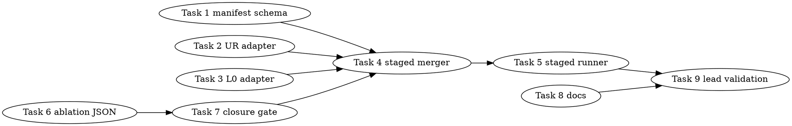

# SYCL Staged Profiling Closure Implementation Plan

> **For Claude:** REQUIRED SUB-SKILL: Use team-driven-development to implement this plan with agent teams.

**Goal:** Replace the failed monolithic GPT-OSS full-attribution run with a strict metadata-matched staged profiling pipeline that produces `coverage.layer_status ok`, `layer.unknown_wall_ms_x1000`, and closure-quality `source_region_plus_ablation` evidence without optimizing TG performance in this plan.

**Architecture:** Split attribution into low-perturbation stages: base timeline/kernel/E2E run, Level Zero evidence, Unified Runtime evidence, VTune/source-line verdict, and microbench ablation evidence. Each stage writes a manifest with matching metadata; a merger validates the manifests and parsed summaries before emitting a strict staged ledger. Exact GPU source lines are not required for closure if the matrix records a conclusive blocker and fallback source attribution reaches `source_region_plus_ablation`.

**Tech Stack:** Python 3 parser/adapter scripts, pytest fixture tests, Bash dry-run gated staged runner, existing SYCL timeline/kernel parsers, existing VTune/source-line checker, existing MXFP4 TG microbench parser, Intel oneAPI/SYCL lead-only validation on B50 GPT-OSS.

**Test Infrastructure:** Source/parser/script tests in `tests/test-sycl-*.py` run with `python3 -m pytest`. Lead-only build validation uses `./scripts/sycl-build.sh test-sycl-timeline test-sycl-kernel-profiler llama-bench sycl-source-line-probe` and `ctest --test-dir build -R "test-sycl-timeline|test-sycl-kernel-profiler" -V`. Worker-safe tests must not run B50/B580/model gates, `/Storage`, `llama-bench`, `sycl-kernel-bench`, VTune, `sycl-ls`, `/dev/dri`, DRM probes, `lsof`, P2P probes, or real harness execution.

---

## Team Topology

**Recommended implementers:** 3 concurrent workers.
**Reviewers:** Fresh spec reviewer and fresh quality reviewer per task.

### Parallel Tracks

| Track | Tasks | Description |
|---|---|---|
| A | 1, 4, 5 | Manifest schema, staged ledger merger, staged runner |
| B | 2 | Unified Runtime real-trace adapter |
| C | 3 | Level Zero/VTune real-trace adapter |
| D | 6, 7 | Microbench ablation JSON and source-attribution closure gate |
| E | 8, 9 | Documentation and lead-only strict validation |

### Dependency Graph



### File Ownership Map

| File | Tasks | Conflict Risk |
|---|---|---|
| `scripts/parse-sycl-stage-manifest.py` | 1 | New file |
| `tests/test-sycl-stage-manifest-parser.py` | 1 | New file |
| `scripts/convert-sycl-ur-stderr.py` | 2 | New file |
| `tests/test-sycl-ur-stderr-converter.py` | 2 | New file |
| `scripts/convert-sycl-vtune-l0-host-tasks.py` | 3 | New file |
| `tests/test-sycl-vtune-l0-host-task-converter.py` | 3 | New file |
| `scripts/merge-sycl-staged-ledger.py` | 4, 7 | Task 7 depends on Task 4 and extends the strict source-attribution gate |
| `tests/test-sycl-staged-ledger-merger.py` | 4, 7 | Task 7 appends source-attribution closure tests |
| `scripts/sycl-gptoss-staged-attribution-profile.sh` | 5 | New staged runner |
| `tests/test-sycl-staged-attribution-profile-script.py` | 5 | New script tests |
| `scripts/parse-sycl-ablation-deltas.py` | 6 | New parser |
| `tests/test-sycl-ablation-delta-parser.py` | 6 | New tests |
| `docs/backend/SYCL.md` | 8 | Documentation-only update |
| `tests/test-sycl-staged-profiling-docs.py` | 8 | New source-only doc tests |
| `activation/sycl-staged-profiling-closure-validation.md` | 9 | New validation report |
| `.codescout/tasks.jsonl` | 9 | Tracker closure only |

---

## Cross-Cutting Rules

1. Workers may run only parser/unit/source tests and script dry-runs. They must not run `--execute`, `/Storage`, `llama-bench`, `sycl-kernel-bench`, VTune, `sycl-ls`, `/dev/dri`, DRM probes, `lsof`, P2P probes, or real GPU harnesses.
2. Lead-only real commands must source oneAPI as:
   ```bash
   set +u
   source /opt/intel/oneapi/setvars.sh --force
   set -u
   ```
3. Staged closure may merge multiple runs only when manifests match build SHA, model identity, device selector, FA/MoE knobs, PP/TG shape, and schema versions.
4. `coverage.layer_status ok` means every required staged layer has real observed evidence. Adapters may convert real traces or real VTune/API summaries, but they must not fabricate placeholder files.
5. Exact source lines are a verdict, not a permanent blocker. Strict closure may pass with `source_line.status fail` only when the blocker is recorded and `source_attribution.status source_region_plus_ablation` is present.
6. This plan does not optimize TG. It records PP/TG no-regression numbers only.
7. Do not stage `.codescout/.gitignore`; if task tooling dirties it, run `rm -f .codescout/.gitignore.tmp.* && git restore .codescout/.gitignore .beads/last-touched` before committing.

---

## Tasks

### Task 1: Stage Manifest Schema and Validator

**Track:** A
**Depends on:** None

**File scope:**
- Create: `scripts/parse-sycl-stage-manifest.py`
- Create: `tests/test-sycl-stage-manifest-parser.py`

**Description:**
Add a strict manifest validator for staged profiling artifacts. The current full runner has hard-coded artifact requirements in `scripts/sycl-gptoss-full-attribution-profile.sh:228-235`, but there is no metadata contract proving that independently collected artifacts can be merged. This task defines that contract.

**Acceptance Criteria:**
- [ ] Parser accepts one or more `stage-manifest.json` paths.
- [ ] Emits deterministic rows including `manifest.status ok`, `manifest.count`, `manifest.stage.<name>.root`, `manifest.merge_key`, and `manifest.schema_version`.
- [ ] Required fields: `schema_version`, `stage`, `artifact_root`, `build_sha`, `model`, `device_selector`, `fa`, `moe_knobs`, `prompt_tokens`, `gen_tokens`, `repeat`, `artifacts`.
- [ ] All manifests must share one merge key derived from build/model/device/FA/MoE/prompt/gen/repeat.
- [ ] Missing fields or metadata mismatch return code 2 with no traceback.

#### RED: Write These Failing Tests

Create `tests/test-sycl-stage-manifest-parser.py`:

```python
#!/usr/bin/env python3
from __future__ import annotations

import json
import pathlib
import subprocess
import sys
import tempfile

ROOT = pathlib.Path(__file__).resolve().parents[1]
PARSER = ROOT / "scripts" / "parse-sycl-stage-manifest.py"


def run_parser(*paths: pathlib.Path) -> subprocess.CompletedProcess[str]:
    return subprocess.run(
        [sys.executable, str(PARSER), *(str(path) for path in paths)],
        text=True,
        stdout=subprocess.PIPE,
        stderr=subprocess.STDOUT,
        check=False,
    )


def manifest(stage: str, root: str, build_sha: str = "abc123") -> dict[str, object]:
    return {
        "schema_version": 1,
        "stage": stage,
        "artifact_root": root,
        "build_sha": build_sha,
        "model": {"path": "/Storage/GenAI/models/gpt-oss-20b-mxfp4.gguf", "size": 12101000000},
        "device_selector": "level_zero:1",
        "fa": 1,
        "moe_knobs": {
            "GGML_SYCL_MOE_PHASE_MATERIALIZE": "1",
            "GGML_SYCL_MOE_PHASE_BULK_XMX": "1",
            "GGML_SYCL_MOE_DOWN_SUM_DIRECT": "1",
        },
        "prompt_tokens": 512,
        "gen_tokens": 128,
        "repeat": 1,
        "artifacts": {"summary": f"{root}/summary.parse"},
    }


def test_manifest_parser_accepts_matching_stage_manifests() -> None:
    with tempfile.TemporaryDirectory() as tmp_raw:
        tmp = pathlib.Path(tmp_raw)
        base = tmp / "base.json"
        ur = tmp / "ur.json"
        base.write_text(json.dumps(manifest("base", "/tmp/base")), encoding="utf-8")
        ur.write_text(json.dumps(manifest("ur", "/tmp/ur")), encoding="utf-8")
        result = run_parser(base, ur)
        assert result.returncode == 0, result.stdout
        assert "manifest.status ok" in result.stdout
        assert "manifest.count 2" in result.stdout
        assert "manifest.stage.base.root /tmp/base" in result.stdout
        assert "manifest.stage.ur.root /tmp/ur" in result.stdout
        assert "manifest.schema_version 1" in result.stdout
        assert "manifest.merge_key" in result.stdout


def test_manifest_parser_rejects_metadata_mismatch_without_traceback() -> None:
    with tempfile.TemporaryDirectory() as tmp_raw:
        tmp = pathlib.Path(tmp_raw)
        base = tmp / "base.json"
        l0 = tmp / "l0.json"
        base.write_text(json.dumps(manifest("base", "/tmp/base", "abc123")), encoding="utf-8")
        l0.write_text(json.dumps(manifest("l0", "/tmp/l0", "def456")), encoding="utf-8")
        result = run_parser(base, l0)
        assert result.returncode == 2
        assert "failed to parse stage manifests" in result.stdout
        assert "metadata mismatch" in result.stdout
        assert "Traceback" not in result.stdout
```

**Verify RED:**

```bash
python3 -m pytest tests/test-sycl-stage-manifest-parser.py -q
```

Expected: fails because `scripts/parse-sycl-stage-manifest.py` does not exist.

#### GREEN: Implement Minimal Code

Create `scripts/parse-sycl-stage-manifest.py` with:

```python
#!/usr/bin/env python3
from __future__ import annotations

import argparse
import hashlib
import json
import pathlib
import sys
from typing import Any

REQUIRED_TOP = (
    "schema_version",
    "stage",
    "artifact_root",
    "build_sha",
    "model",
    "device_selector",
    "fa",
    "moe_knobs",
    "prompt_tokens",
    "gen_tokens",
    "repeat",
    "artifacts",
)
REQUIRED_MOE = (
    "GGML_SYCL_MOE_PHASE_MATERIALIZE",
    "GGML_SYCL_MOE_PHASE_BULK_XMX",
    "GGML_SYCL_MOE_DOWN_SUM_DIRECT",
)

class ManifestError(ValueError):
    pass


def require_int(value: Any, name: str) -> int:
    if isinstance(value, bool) or not isinstance(value, int):
        raise ManifestError(f"invalid integer field {name}")
    return value


def require_str(value: Any, name: str) -> str:
    if not isinstance(value, str) or not value:
        raise ManifestError(f"invalid string field {name}")
    return value


def load_manifest(path: pathlib.Path) -> dict[str, Any]:
    obj = json.loads(path.read_text(encoding="utf-8"))
    if not isinstance(obj, dict):
        raise ManifestError(f"{path}: manifest is not an object")
    for key in REQUIRED_TOP:
        if key not in obj:
            raise ManifestError(f"{path}: missing {key}")
    require_int(obj["schema_version"], "schema_version")
    require_str(obj["stage"], "stage")
    require_str(obj["artifact_root"], "artifact_root")
    require_str(obj["build_sha"], "build_sha")
    if not isinstance(obj["model"], dict) or not isinstance(obj["moe_knobs"], dict) or not isinstance(obj["artifacts"], dict):
        raise ManifestError(f"{path}: model, moe_knobs, and artifacts must be objects")
    require_str(obj["model"].get("path"), "model.path")
    for key in REQUIRED_MOE:
        require_str(obj["moe_knobs"].get(key), f"moe_knobs.{key}")
    require_int(obj["prompt_tokens"], "prompt_tokens")
    require_int(obj["gen_tokens"], "gen_tokens")
    require_int(obj["repeat"], "repeat")
    return obj


def merge_identity(obj: dict[str, Any]) -> dict[str, Any]:
    return {
        "schema_version": obj["schema_version"],
        "build_sha": obj["build_sha"],
        "model": obj["model"],
        "device_selector": obj["device_selector"],
        "fa": obj["fa"],
        "moe_knobs": obj["moe_knobs"],
        "prompt_tokens": obj["prompt_tokens"],
        "gen_tokens": obj["gen_tokens"],
        "repeat": obj["repeat"],
    }


def key_for(identity: dict[str, Any]) -> str:
    payload = json.dumps(identity, sort_keys=True, separators=(",", ":"))
    return hashlib.sha256(payload.encode("utf-8")).hexdigest()[:16]


def main(argv: list[str]) -> int:
    parser = argparse.ArgumentParser(description="Validate staged SYCL profiling manifests")
    parser.add_argument("manifest", nargs="+", type=pathlib.Path)
    args = parser.parse_args(argv)
    try:
        manifests = [load_manifest(path) for path in args.manifest]
        identity = merge_identity(manifests[0])
        merge_key = key_for(identity)
        for obj in manifests[1:]:
            if merge_identity(obj) != identity:
                raise ManifestError("metadata mismatch across stage manifests")
    except (OSError, json.JSONDecodeError, ManifestError) as exc:
        print(f"failed to parse stage manifests: {exc}")
        return 2
    print("manifest.status ok")
    print(f"manifest.count {len(manifests)}")
    print(f"manifest.schema_version {manifests[0]['schema_version']}")
    print(f"manifest.merge_key {merge_key}")
    for obj in sorted(manifests, key=lambda item: item["stage"]):
        print(f"manifest.stage.{obj['stage']}.root {obj['artifact_root']}")
    return 0

if __name__ == "__main__":
    raise SystemExit(main(sys.argv[1:]))
```

**Verify GREEN:**

```bash
python3 -m pytest tests/test-sycl-stage-manifest-parser.py -q
```

Expected: `2 passed`.

#### Gotchas

- Do not hash artifact paths into the merge identity; each stage has a different root.
- Do not accept booleans as integers.
- Keep output row order deterministic; tests depend on stable rows.

#### Commit

```bash
git add scripts/parse-sycl-stage-manifest.py tests/test-sycl-stage-manifest-parser.py
git commit -m "feat(sycl): validate staged profiling manifests"
```

---

### Task 2: Convert Real Unified Runtime stderr Logs into Normalized UR Evidence

**Track:** B
**Depends on:** None

**File scope:**
- Create: `scripts/convert-sycl-ur-stderr.py`
- Create: `tests/test-sycl-ur-stderr-converter.py`

**Description:**
The failed validation produced real UR output in `bench.stdout` and `bench.stderr`, but `scripts/parse-sycl-ur-trace.py:71-100` currently accepts only normalized `UR_TRACE name=... dur_us=...` rows. Add a converter for real `SYCL_UR_TRACE=2` lines such as `---> urQueueFinish` and `<--- urQueueFinish(...) -> UR_RESULT_SUCCESS;`. Counts-only evidence is allowed and must emit `dur_us=0` plus `evidence=counts_only`; it is real observed evidence, not a placeholder.

**Acceptance Criteria:**
- [ ] Converter accepts one raw stderr/stdout file and emits normalized `UR_TRACE` rows.
- [ ] It recognizes enter lines `---> NAME` and exit lines `<--- NAME(... ) -> RESULT;`.
- [ ] It emits `name`, `dur_us=0`, `evidence=counts_only`, and `result` for exit rows.
- [ ] It returns code 2 with no traceback if no UR API rows are found.
- [ ] Output can be piped into existing `scripts/parse-sycl-ur-trace.py` and parse successfully.

#### RED: Write These Failing Tests

Create `tests/test-sycl-ur-stderr-converter.py`:

```python
#!/usr/bin/env python3
from __future__ import annotations

import pathlib
import subprocess
import sys
import tempfile

ROOT = pathlib.Path(__file__).resolve().parents[1]
CONVERTER = ROOT / "scripts" / "convert-sycl-ur-stderr.py"
PARSER = ROOT / "scripts" / "parse-sycl-ur-trace.py"


def run_converter(path: pathlib.Path) -> subprocess.CompletedProcess[str]:
    return subprocess.run([sys.executable, str(CONVERTER), str(path)], text=True, stdout=subprocess.PIPE, stderr=subprocess.STDOUT, check=False)


def test_converter_normalizes_real_ur_trace_lines_for_existing_parser() -> None:
    with tempfile.TemporaryDirectory() as tmp_raw:
        tmp = pathlib.Path(tmp_raw)
        raw = tmp / "bench.stderr"
        normalized = tmp / "ur.trace"
        raw.write_text(
            "   ---> urQueueFinish\n"
            "   <--- urQueueFinish(.hQueue = 0x4d2e970) -> UR_RESULT_SUCCESS;\n"
            "   ---> urEnqueueKernelLaunch\n"
            "   <--- urEnqueueKernelLaunch(.hQueue = 0x1) -> UR_RESULT_ERROR_OUT_OF_DEVICE_MEMORY;\n",
            encoding="utf-8",
        )
        result = run_converter(raw)
        assert result.returncode == 0, result.stdout
        assert "UR_TRACE name=urQueueFinish dur_us=0 evidence=counts_only result=UR_RESULT_SUCCESS" in result.stdout
        assert "UR_TRACE name=urEnqueueKernelLaunch dur_us=0 evidence=counts_only result=UR_RESULT_ERROR_OUT_OF_DEVICE_MEMORY" in result.stdout
        normalized.write_text(result.stdout, encoding="utf-8")
        parsed = subprocess.run([sys.executable, str(PARSER), str(normalized)], text=True, stdout=subprocess.PIPE, stderr=subprocess.STDOUT, check=False)
        assert parsed.returncode == 0, parsed.stdout
        assert "ur.total_ms_x1000 0" in parsed.stdout
        assert "ur.api.urQueueFinish.count 1" in parsed.stdout
        assert "ur.api.urEnqueueKernelLaunch.count 1" in parsed.stdout


def test_converter_rejects_files_without_ur_rows_without_traceback() -> None:
    with tempfile.TemporaryDirectory() as tmp_raw:
        raw = pathlib.Path(tmp_raw) / "bench.stderr"
        raw.write_text("no unified runtime trace lines\n", encoding="utf-8")
        result = run_converter(raw)
        assert result.returncode == 2
        assert "failed to convert UR stderr" in result.stdout
        assert "no UR API rows found" in result.stdout
        assert "Traceback" not in result.stdout
```

**Verify RED:**

```bash
python3 -m pytest tests/test-sycl-ur-stderr-converter.py -q
```

Expected: fails because the converter does not exist.

#### GREEN: Implement Minimal Code

Implement `scripts/convert-sycl-ur-stderr.py` with regexes:

```python
ENTER_RE = re.compile(r"^\s*--->\s+([A-Za-z_][A-Za-z0-9_]*)")
EXIT_RE = re.compile(r"^\s*<---\s+([A-Za-z_][A-Za-z0-9_]*).*->\s*(UR_RESULT_[A-Z_]+);")
```

For each exit row, print:

```text
UR_TRACE name=<name> dur_us=0 evidence=counts_only result=<result>
```

Track seen count. If zero rows are emitted, raise a handled error and return 2.

**Verify GREEN:**

```bash
python3 -m pytest tests/test-sycl-ur-stderr-converter.py -q
```

Expected: `2 passed`.

#### Gotchas

- Do not parse arbitrary `UR <---` internal debug lines from `bench.stderr`; only normalize `SYCL_UR_TRACE=2` rows that start with `--->` or `<---`.
- Durations are explicitly zero because this trace format lacks timestamps. The staged ledger will count the UR layer as present and leave time in unknown residual.

#### Commit

```bash
git add scripts/convert-sycl-ur-stderr.py tests/test-sycl-ur-stderr-converter.py
git commit -m "feat(sycl): normalize UR stderr trace evidence"
```

---

### Task 3: Convert VTune Level Zero Host Task Summaries into L0 Evidence

**Track:** C
**Depends on:** None

**File scope:**
- Create: `scripts/convert-sycl-vtune-l0-host-tasks.py`
- Create: `tests/test-sycl-vtune-l0-host-task-converter.py`

**Description:**
The failed validation included a real VTune summary with Level Zero host tasks such as `zeCommandListAppendLaunchKernel 302.028s`. `scripts/parse-sycl-pti-l0.py:34-80` already accepts JSONL rows with `name`, `ts_us`, and `dur_us`. Add an adapter that converts real VTune `Hottest Host Tasks` text into that JSONL format.

**Acceptance Criteria:**
- [ ] Converter reads VTune text output and emits one JSON object per `ze*` host task.
- [ ] It converts seconds to microseconds in `dur_us` and writes `ts_us=0`.
- [ ] It emits `source="vtune_host_task_summary"`.
- [ ] Output parses with existing `scripts/parse-sycl-pti-l0.py`.
- [ ] Missing `ze*` rows returns code 2 with no traceback.

#### RED: Write These Failing Tests

Create `tests/test-sycl-vtune-l0-host-task-converter.py`:

```python
#!/usr/bin/env python3
from __future__ import annotations

import json
import pathlib
import subprocess
import sys
import tempfile

ROOT = pathlib.Path(__file__).resolve().parents[1]
CONVERTER = ROOT / "scripts" / "convert-sycl-vtune-l0-host-tasks.py"
PARSER = ROOT / "scripts" / "parse-sycl-pti-l0.py"


def test_converter_turns_vtune_host_tasks_into_l0_jsonl() -> None:
    with tempfile.TemporaryDirectory() as tmp_raw:
        tmp = pathlib.Path(tmp_raw)
        vtune = tmp / "vtune-summary.txt"
        jsonl = tmp / "l0.jsonl"
        vtune.write_text(
            "Hottest Host Tasks\n"
            "Host Task                        Task Time  % of Elapsed Time(%)  Task Count\n"
            "-------------------------------  ---------  --------------------  ----------\n"
            "zeCommandListAppendLaunchKernel   302.028s                 68.9%           1\n"
            "zeMemAllocHost                      3.344s                  0.8%          16\n"
            "[Others]                            0.050s                  0.0%         798\n",
            encoding="utf-8",
        )
        result = subprocess.run([sys.executable, str(CONVERTER), str(vtune)], text=True, stdout=subprocess.PIPE, stderr=subprocess.STDOUT, check=False)
        assert result.returncode == 0, result.stdout
        rows = [json.loads(line) for line in result.stdout.splitlines() if line.strip()]
        assert rows[0]["name"] == "zeCommandListAppendLaunchKernel"
        assert rows[0]["dur_us"] == 302028000
        assert rows[0]["ts_us"] == 0
        assert rows[0]["source"] == "vtune_host_task_summary"
        jsonl.write_text(result.stdout, encoding="utf-8")
        parsed = subprocess.run([sys.executable, str(PARSER), str(jsonl)], text=True, stdout=subprocess.PIPE, stderr=subprocess.STDOUT, check=False)
        assert parsed.returncode == 0, parsed.stdout
        assert "l0.total_ms_x1000 305372000" in parsed.stdout
        assert "l0.api.zeCommandListAppendLaunchKernel.count 1" in parsed.stdout
        assert "l0.api.zeMemAllocHost.count 1" in parsed.stdout


def test_converter_rejects_missing_ze_rows_without_traceback() -> None:
    with tempfile.TemporaryDirectory() as tmp_raw:
        vtune = pathlib.Path(tmp_raw) / "vtune-summary.txt"
        vtune.write_text("Hottest Host Tasks\n[Others] 0.050s 0.0% 798\n", encoding="utf-8")
        result = subprocess.run([sys.executable, str(CONVERTER), str(vtune)], text=True, stdout=subprocess.PIPE, stderr=subprocess.STDOUT, check=False)
        assert result.returncode == 2
        assert "failed to convert VTune L0 host tasks" in result.stdout
        assert "no Level Zero host task rows found" in result.stdout
        assert "Traceback" not in result.stdout
```

**Verify RED:**

```bash
python3 -m pytest tests/test-sycl-vtune-l0-host-task-converter.py -q
```

Expected: fails because the converter does not exist.

#### GREEN: Implement Minimal Code

Use a regex anchored to `ze` task rows:

```python
ROW_RE = re.compile(r"^\s*(ze[A-Za-z0-9_]+)\s+([0-9]+(?:\.[0-9]+)?)s\s+")
```

Emit JSON objects with sorted keys disabled so row order follows input:

```python
print(json.dumps({"name": name, "ts_us": 0, "dur_us": int(round(seconds * 1_000_000)), "source": "vtune_host_task_summary"}))
```

**Verify GREEN:**

```bash
python3 -m pytest tests/test-sycl-vtune-l0-host-task-converter.py -q
```

Expected: `2 passed`.

#### Gotchas

- Do not parse `[Others]` as an API row.
- This adapter represents aggregate host-task evidence, not per-call trace timing; include the `source` field so the validation report can distinguish it from native PTI JSONL.

#### Commit

```bash
git add scripts/convert-sycl-vtune-l0-host-tasks.py tests/test-sycl-vtune-l0-host-task-converter.py
git commit -m "feat(sycl): convert VTune Level Zero host tasks"
```

---

### Task 4: Merge Staged Artifacts into a Strict Closure Ledger

**Track:** A
**Depends on:** Task 1, Task 2, Task 3

**File scope:**
- Create: `scripts/merge-sycl-staged-ledger.py`
- Create: `tests/test-sycl-staged-ledger-merger.py`

**Description:**
`parse-sycl-layer-ledger.py:72-125` emits a layer ledger for a single artifact set and marks missing optional summaries as `coverage.layer_status missing_layers`. Add a staged merger that validates manifests and combines base timeline/kernel/E2E artifacts with L0, UR, VTune, source-line, and source-attribution summaries from separate roots.

**Acceptance Criteria:**
- [ ] Requires `--manifest` one or more times and validates them using Task 1 logic.
- [ ] Requires base raw artifacts: `--timeline`, `--kernel-profile`, `--bench-stderr`.
- [ ] Requires parsed summaries: `--l0-summary`, `--ur-summary`, `--vtune-summary`, `--source-line`, `--source-attribution`.
- [ ] Emits `coverage.layer_status ok` when all layers are present, metadata matches, and source attribution is closure-ready.
- [ ] Emits `layer.unknown_wall_ms_x1000` using the same formula as `parse-sycl-layer-ledger.py:104`: wall minus SYCL submit host, UR, L0, and GPU kernel.
- [ ] Metadata mismatch returns code 2 and `coverage.layer_status metadata_mismatch` with no traceback.

#### RED: Write These Failing Tests

Create `tests/test-sycl-staged-ledger-merger.py`:

```python
#!/usr/bin/env python3
from __future__ import annotations

import json
import pathlib
import subprocess
import sys
import tempfile

ROOT = pathlib.Path(__file__).resolve().parents[1]
MERGER = ROOT / "scripts" / "merge-sycl-staged-ledger.py"


def manifest(stage: str, root: str, build_sha: str = "abc123") -> dict[str, object]:
    return {
        "schema_version": 1,
        "stage": stage,
        "artifact_root": root,
        "build_sha": build_sha,
        "model": {"path": "/Storage/GenAI/models/gpt-oss-20b-mxfp4.gguf", "size": 12101000000},
        "device_selector": "level_zero:1",
        "fa": 1,
        "moe_knobs": {
            "GGML_SYCL_MOE_PHASE_MATERIALIZE": "1",
            "GGML_SYCL_MOE_PHASE_BULK_XMX": "1",
            "GGML_SYCL_MOE_DOWN_SUM_DIRECT": "1",
        },
        "prompt_tokens": 512,
        "gen_tokens": 128,
        "repeat": 1,
        "artifacts": {"summary": f"{root}/summary.parse"},
    }


def write_fixture(tmp: pathlib.Path, mismatch: bool = False) -> dict[str, pathlib.Path]:
    timeline = tmp / "sycl-timeline.json"
    timeline.write_text(json.dumps({"traceEvents": [{"name": "decode", "cat": "app.compute", "ph": "X", "ts": 0, "dur": 1000}, {"name": "submit", "cat": "sycl.submit", "ph": "X", "ts": 100, "dur": 20}]}), encoding="utf-8")
    kernels = tmp / "sycl-kernels.csv"
    kernels.write_text("name,category,metadata,device,queue_kind,count,total_ns,mean_ns,min_ns,p50_ns,p95_ns,max_ns,bytes,failed_timestamps,graph_recorded\nmxfp4.gateup.xmx_tiled_dpas_m2,compute,,0,in_order,1,300000000,300000000,300000000,300000000,300000000,300000000,0,0,0\n", encoding="utf-8")
    bench_stderr = tmp / "bench.stderr"
    bench_stderr.write_text("[SYCL-E2E-TG-STAGE] stage=moe calls=1 host=0.200 ms device=0.000 ms bytes=0 last_path=MUL_MAT_ID\n", encoding="utf-8")
    l0 = tmp / "l0.parse"
    l0.write_text("l0.total_ms_x1000 80\n", encoding="utf-8")
    ur = tmp / "ur.parse"
    ur.write_text("ur.total_ms_x1000 50\n", encoding="utf-8")
    vtune = tmp / "vtune.parse"
    vtune.write_text("vtune.kernel_total_ms_x1000 310\n", encoding="utf-8")
    source_line = tmp / "source-line.parse"
    source_line.write_text("source_line.status fail\nsource_line.blocker vtune_unknown_source\n", encoding="utf-8")
    source_attr = tmp / "source-attribution.parse"
    source_attr.write_text("source_attribution.status source_region_plus_ablation\nsource_attribution.kernel mxfp4.gateup.xmx_tiled_dpas_m2\nsource_attribution.ablation_delta_ms_x1000 120000\n", encoding="utf-8")
    base_manifest = tmp / "base.manifest.json"
    l0_manifest = tmp / "l0.manifest.json"
    base_manifest.write_text(json.dumps(manifest("base", str(tmp / "base"), "abc123")), encoding="utf-8")
    l0_manifest.write_text(json.dumps(manifest("l0", str(tmp / "l0"), "def456" if mismatch else "abc123")), encoding="utf-8")
    return {"timeline": timeline, "kernels": kernels, "bench_stderr": bench_stderr, "l0": l0, "ur": ur, "vtune": vtune, "source_line": source_line, "source_attr": source_attr, "base_manifest": base_manifest, "l0_manifest": l0_manifest}


def run_merger(paths: dict[str, pathlib.Path]) -> subprocess.CompletedProcess[str]:
    return subprocess.run([
        sys.executable,
        str(MERGER),
        "--manifest", str(paths["base_manifest"]),
        "--manifest", str(paths["l0_manifest"]),
        "--timeline", str(paths["timeline"]),
        "--kernel-profile", str(paths["kernels"]),
        "--bench-stderr", str(paths["bench_stderr"]),
        "--l0-summary", str(paths["l0"]),
        "--ur-summary", str(paths["ur"]),
        "--vtune-summary", str(paths["vtune"]),
        "--source-line", str(paths["source_line"]),
        "--source-attribution", str(paths["source_attr"]),
    ], text=True, stdout=subprocess.PIPE, stderr=subprocess.STDOUT, check=False)


def test_staged_merger_emits_ok_layer_status_and_unknown_wall() -> None:
    with tempfile.TemporaryDirectory() as tmp_raw:
        paths = write_fixture(pathlib.Path(tmp_raw))
        result = run_merger(paths)
        assert result.returncode == 0, result.stdout
        assert "coverage.layer_status ok" in result.stdout
        assert "layer.wall_ms_x1000 1000" in result.stdout
        assert "layer.sycl_submit_host_ms_x1000 20" in result.stdout
        assert "layer.ur_api_ms_x1000 50" in result.stdout
        assert "layer.level_zero_api_ms_x1000 80" in result.stdout
        assert "layer.gpu_kernel_ms_x1000 300" in result.stdout
        assert "layer.unknown_wall_ms_x1000 550" in result.stdout
        assert "source_line.status fail" in result.stdout
        assert "source_attribution.status source_region_plus_ablation" in result.stdout


def test_staged_merger_rejects_metadata_mismatch_without_traceback() -> None:
    with tempfile.TemporaryDirectory() as tmp_raw:
        paths = write_fixture(pathlib.Path(tmp_raw), mismatch=True)
        result = run_merger(paths)
        assert result.returncode == 2
        assert "coverage.layer_status metadata_mismatch" in result.stdout
        assert "Traceback" not in result.stdout
```

**Verify RED:**

```bash
python3 -m pytest tests/test-sycl-staged-ledger-merger.py -q
```

Expected: fails because the merger does not exist.

#### GREEN: Implement Minimal Code

Implement `scripts/merge-sycl-staged-ledger.py` by importing existing parser helpers with `importlib.util` exactly as `scripts/parse-sycl-layer-ledger.py:14-24` does. Reuse:

- `parse-sycl-layer-ledger.py` functions `read_parse_file` and `parse_e2e_stderr` from lines 31-55.
- `parse-sycl-timeline.py` via the existing layer-ledger import pattern.
- `parse-sycl-kernel-profile.py` aggregation like `parse-sycl-layer-ledger.py:82-85`.
- Manifest validation by loading `scripts/parse-sycl-stage-manifest.py` and comparing merge identities.

Output the layer rows in the same order as `parse-sycl-layer-ledger.py:114-125`, then append the source-line/source-attribution rows read from the corresponding parse files.

On manifest mismatch, print exactly:

```text
coverage.layer_status metadata_mismatch
failed to merge staged ledger: metadata mismatch across stage manifests
```

and return 2.

**Verify GREEN:**

```bash
python3 -m pytest tests/test-sycl-stage-manifest-parser.py tests/test-sycl-staged-ledger-merger.py -q
```

Expected: all pass.

#### Gotchas

- Do not call `parse-sycl-layer-ledger.py` as a subprocess; import helpers to keep tests fast and deterministic.
- Keep source attribution gate loose in Task 4: accept `source_region_plus_ablation` now, but Task 7 will add explicit failure for plain `source_region`.
- Missing source-line/source-attribution parse files must return code 2, not silently omit rows.

#### Commit

```bash
git add scripts/merge-sycl-staged-ledger.py tests/test-sycl-staged-ledger-merger.py
git commit -m "feat(sycl): merge staged profiling ledger"
```

---

### Task 5: Dry-Run Gated Staged Attribution Runner

**Track:** A
**Depends on:** Task 4

**File scope:**
- Create: `scripts/sycl-gptoss-staged-attribution-profile.sh`
- Create: `tests/test-sycl-staged-attribution-profile-script.py`

**Description:**
The monolithic runner in `scripts/sycl-gptoss-full-attribution-profile.sh:209-235` wraps one GPT-OSS run in VTune plus UR/L0 tracing and failed with watchdog/OOM. Add a staged orchestration script that prints and runs stages independently, writes manifests, and merges existing stage roots.

**Acceptance Criteria:**
- [ ] Dry-run by default; exits 0 and creates no output directory.
- [ ] Real execution requires `--execute --i-understand-this-runs-staged-gpu-profiling`.
- [ ] Supports `--stage base`, `--stage ur`, `--stage l0`, `--stage vtune-source`, `--stage ablation`, `--stage merge`, and `--stage all`.
- [ ] Dry-run prints stage artifact layout and manifest paths.
- [ ] Dry-run for `--stage merge` prints `scripts/merge-sycl-staged-ledger.py` and all required parse inputs.
- [ ] Execute branch contains the FA-on GPT-OSS safe knobs and no monolithic VTune-wrapped model run.

#### RED: Write These Failing Tests

Create `tests/test-sycl-staged-attribution-profile-script.py`:

```python
#!/usr/bin/env python3
from __future__ import annotations

import os
import subprocess
from pathlib import Path

ROOT = Path(__file__).resolve().parents[1]
SCRIPT = ROOT / "scripts" / "sycl-gptoss-staged-attribution-profile.sh"


def run_script(*args: str, out_root: Path) -> subprocess.CompletedProcess[str]:
    env = os.environ.copy()
    env["SYCL_GPTOSS_STAGED_OUT"] = str(out_root)
    return subprocess.run(["bash", str(SCRIPT), *args], cwd=ROOT, env=env, text=True, stdout=subprocess.PIPE, stderr=subprocess.STDOUT, check=False)


def test_staged_runner_is_dry_run_by_default(tmp_path: Path) -> None:
    out_root = tmp_path / "staged"
    result = run_script(out_root=out_root)
    assert result.returncode == 0, result.stdout
    assert "DRY RUN" in result.stdout
    assert "stage=all" in result.stdout
    assert "base/stage-manifest.json" in result.stdout
    assert "l0/stage-manifest.json" in result.stdout
    assert "ur/stage-manifest.json" in result.stdout
    assert "vtune-source/stage-manifest.json" in result.stdout
    assert "ablation/stage-manifest.json" in result.stdout
    assert "scripts/merge-sycl-staged-ledger.py" in result.stdout
    assert not out_root.exists()


def test_staged_runner_refuses_execute_without_ack(tmp_path: Path) -> None:
    result = run_script("--execute", out_root=tmp_path / "staged")
    assert result.returncode == 2
    assert "requires --i-understand-this-runs-staged-gpu-profiling" in result.stdout


def test_staged_runner_execute_branch_uses_safe_gptoss_knobs_without_monolithic_vtune() -> None:
    text = SCRIPT.read_text(encoding="utf-8")
    for required in (
        "GGML_SYCL_MOE_PHASE_MATERIALIZE=1",
        "GGML_SYCL_MOE_PHASE_BULK_XMX=1",
        "GGML_SYCL_MOE_DOWN_SUM_DIRECT=1",
        "-fa 1",
        "write_manifest",
        "merge-sycl-staged-ledger.py",
    ):
        assert required in text
    assert "vtune -collect gpu-hotspots" not in text[text.index("run_base_stage") : text.index("run_ur_stage")]
```

**Verify RED:**

```bash
python3 -m pytest tests/test-sycl-staged-attribution-profile-script.py -q
```

Expected: fails because the staged runner does not exist.

#### GREEN: Implement Minimal Code

Implement `scripts/sycl-gptoss-staged-attribution-profile.sh` with:

- `EXECUTE=0`, `ACK=0`, `STAGE=all`, `OUT_ROOT=${SYCL_GPTOSS_STAGED_OUT:-/tmp/sycl_gptoss_staged_<timestamp>}`.
- `write_manifest stage root artifact_key artifact_path` shell function that writes JSON using `python3 - <<'PY'` to avoid fragile quoting.
- Stage functions:
  - `run_base_stage`: runs timeline/kernel/E2E only, based on `scripts/sycl-gptoss-decode-timeline-profile.sh:76-142` and safe knobs.
  - `run_ur_stage`: runs or converts real `SYCL_UR_TRACE=2` output via `scripts/convert-sycl-ur-stderr.py`.
  - `run_l0_stage`: converts real VTune host task summary via `scripts/convert-sycl-vtune-l0-host-tasks.py` when native JSONL is absent.
  - `run_vtune_source_stage`: calls `scripts/sycl-source-line-debug-matrix.sh` as a separate lead-only stage.
  - `run_ablation_stage`: calls `scripts/parse-sycl-ablation-deltas.py` on microbench JSONL evidence.
  - `run_merge_stage`: calls `scripts/merge-sycl-staged-ledger.py`.

For this task, dry-run text and shell structure are enough; real command details are validated in Task 9.

**Verify GREEN:**

```bash
bash scripts/sycl-gptoss-staged-attribution-profile.sh
python3 -m pytest tests/test-sycl-staged-attribution-profile-script.py -q
```

Expected: dry-run exits 0 and tests pass.

#### Gotchas

- Do not copy the monolithic VTune wrapping from `scripts/sycl-gptoss-full-attribution-profile.sh:209-216` into `run_base_stage`.
- Keep dry-run free of side effects; tests assert output root does not exist.
- The script may mention `/Storage/GenAI/models/gpt-oss-20b-mxfp4.gguf` in dry-run command text, but must not access it in dry-run.

#### Commit

```bash
git add scripts/sycl-gptoss-staged-attribution-profile.sh tests/test-sycl-staged-attribution-profile-script.py
git commit -m "feat(sycl): add staged attribution runner"
```

---

### Task 6: Parse Microbench Evidence into Ablation JSON

**Track:** D
**Depends on:** None

**File scope:**
- Create: `scripts/parse-sycl-ablation-deltas.py`
- Create: `tests/test-sycl-ablation-delta-parser.py`

**Description:**
`parse-sycl-source-attribution.py:70-86` can consume `{"deltas":[{"kernel":"name","delta_ms_x1000":N}]}`, but no tool generates this JSON from microbench evidence. Existing `scripts/parse-sycl-mxfp4-tg-bench.py:11-24` validates microbench metrics including `saving_vs_baseline_ms`. Add a parser that converts real microbench JSONL route evidence into the ablation JSON.

**Acceptance Criteria:**
- [ ] Parser accepts `--microbench-jsonl`, `--kernel`, and `--route`.
- [ ] Uses average `metrics.saving_vs_baseline_ms` for matching route records.
- [ ] Emits JSON with integer `delta_ms_x1000` rounded from milliseconds times 1000.
- [ ] Rejects missing route, non-finite saving, or fatal records with code 2 and no traceback.
- [ ] Output upgrades existing source attribution parser to `source_region_plus_ablation`.

#### RED: Write These Failing Tests

Create `tests/test-sycl-ablation-delta-parser.py`:

```python
#!/usr/bin/env python3
from __future__ import annotations

import json
import pathlib
import subprocess
import sys
import tempfile

ROOT = pathlib.Path(__file__).resolve().parents[1]
PARSER = ROOT / "scripts" / "parse-sycl-ablation-deltas.py"
SOURCE_ATTR = ROOT / "scripts" / "parse-sycl-source-attribution.py"


def record(route: str, saving: float) -> dict[str, object]:
    return {
        "route": route,
        "mode": "dry-run",
        "shape": {"ncols": 2880, "hidden": 2880, "topk": 4, "layers": 24, "tokens": 128},
        "metrics": {
            "prepack_us": 0.0,
            "compute_us": 1.0,
            "launch_us": 1.0,
            "host_bounce_us": 0.0,
            "total_gateup_equiv_ms": 4.0,
            "saving_vs_baseline_ms": saving,
            "p50_us": 1.0,
            "p90_us": 1.0,
            "p99_us": 1.0,
        },
        "correct": {"max_abs": 0.0, "mean_abs": 0.0, "rel_l2": 0.0},
        "fatal": {"total": 0},
        "evidence": {"path": "synthetic", "dry_run": True, "device": "level_zero:1"},
    }


def test_ablation_delta_parser_emits_json_consumed_by_source_attribution() -> None:
    with tempfile.TemporaryDirectory() as tmp_raw:
        tmp = pathlib.Path(tmp_raw)
        micro = tmp / "micro.jsonl"
        out = tmp / "ablation.json"
        micro.write_text("\n".join(json.dumps(row) for row in [record("prepack", 1.25), record("prepack", 1.75)]) + "\n", encoding="utf-8")
        result = subprocess.run([sys.executable, str(PARSER), "--microbench-jsonl", str(micro), "--kernel", "mxfp4.gateup.xmx_tiled_dpas_m2", "--route", "prepack"], text=True, stdout=subprocess.PIPE, stderr=subprocess.STDOUT, check=False)
        assert result.returncode == 0, result.stdout
        out.write_text(result.stdout, encoding="utf-8")
        parsed = json.loads(result.stdout)
        assert parsed == {"deltas": [{"kernel": "mxfp4.gateup.xmx_tiled_dpas_m2", "route": "prepack", "delta_ms_x1000": 1500}]}

        cost = tmp / "cost.parse"
        source = tmp / "source.parse"
        region = tmp / "region.json"
        cost.write_text("cost.top1_kernel mxfp4.gateup.xmx_tiled_dpas_m2 706354\n", encoding="utf-8")
        source.write_text("source_line.status fail\nsource_line.blocker vtune_unknown_source\n", encoding="utf-8")
        region.write_text(json.dumps({"kernels": {"mxfp4.gateup.xmx_tiled_dpas_m2": {"file": "ggml/src/ggml-sycl/mmvq.cpp", "line_start": 9730, "line_end": 9955, "label_line": 9767}}}), encoding="utf-8")
        attr = subprocess.run([sys.executable, str(SOURCE_ATTR), "--cost-ranking", str(cost), "--source-line", str(source), "--region-map", str(region), "--ablation-json", str(out)], text=True, stdout=subprocess.PIPE, stderr=subprocess.STDOUT, check=False)
        assert attr.returncode == 0, attr.stdout
        assert "source_attribution.status source_region_plus_ablation" in attr.stdout
        assert "source_attribution.ablation_delta_ms_x1000 1500" in attr.stdout


def test_ablation_delta_parser_rejects_missing_route_without_traceback() -> None:
    with tempfile.TemporaryDirectory() as tmp_raw:
        micro = pathlib.Path(tmp_raw) / "micro.jsonl"
        micro.write_text(json.dumps(record("baseline", 0.0)) + "\n", encoding="utf-8")
        result = subprocess.run([sys.executable, str(PARSER), "--microbench-jsonl", str(micro), "--kernel", "mxfp4.gateup.xmx_tiled_dpas_m2", "--route", "prepack"], text=True, stdout=subprocess.PIPE, stderr=subprocess.STDOUT, check=False)
        assert result.returncode == 2
        assert "failed to parse ablation deltas" in result.stdout
        assert "route not found: prepack" in result.stdout
        assert "Traceback" not in result.stdout
```

**Verify RED:**

```bash
python3 -m pytest tests/test-sycl-ablation-delta-parser.py -q
```

Expected: fails because the parser does not exist.

#### GREEN: Implement Minimal Code

Import `scripts/parse-sycl-mxfp4-tg-bench.py` with `importlib.util` and reuse `load_records` from lines 106-122. Filter records where `record["route"] == args.route`, compute average `metrics.saving_vs_baseline_ms`, and print compact JSON:

```json
{"deltas":[{"kernel":"mxfp4.gateup.xmx_tiled_dpas_m2","route":"prepack","delta_ms_x1000":1500}]}
```

Return 2 with `failed to parse ablation deltas: <reason>` on expected errors.

**Verify GREEN:**

```bash
python3 -m pytest tests/test-sycl-ablation-delta-parser.py -q
```

Expected: `2 passed`.

#### Gotchas

- Do not run `scripts/run-sycl-mxfp4-tg-microbenches.py`; workers only parse fixture JSONL.
- Negative deltas are valid evidence and should remain negative integers; do not clamp.

#### Commit

```bash
git add scripts/parse-sycl-ablation-deltas.py tests/test-sycl-ablation-delta-parser.py
git commit -m "feat(sycl): parse ablation delta evidence"
```

---

### Task 7: Enforce Closure-Quality Source Attribution in the Staged Merger

**Track:** D
**Depends on:** Task 4, Task 6

**File scope:**
- Modify: `scripts/merge-sycl-staged-ledger.py`
- Modify: `tests/test-sycl-staged-ledger-merger.py`

**Description:**
Task 4 creates the staged ledger. This task makes strict closure require source attribution that is either exact-source-line or fallback plus ablation. Plain `source_region` is useful triage but not strict closure, per the approved design.

**Acceptance Criteria:**
- [ ] Merger accepts `source_attribution.status exact_source_line`.
- [ ] Merger accepts `source_attribution.status source_region_plus_ablation`.
- [ ] Merger rejects plain `source_region` with `coverage.layer_status source_attribution_incomplete` and return code 2.
- [ ] Merger requires `source_attribution.ablation_delta_ms_x1000` when status is `source_region_plus_ablation`.

#### RED: Append These Failing Tests

Append to `tests/test-sycl-staged-ledger-merger.py`:

```python
def test_staged_merger_rejects_plain_source_region_for_strict_closure() -> None:
    with tempfile.TemporaryDirectory() as tmp_raw:
        paths = write_fixture(pathlib.Path(tmp_raw))
        paths["source_attr"].write_text(
            "source_attribution.status source_region\n"
            "source_attribution.kernel mxfp4.gateup.xmx_tiled_dpas_m2\n",
            encoding="utf-8",
        )
        result = run_merger(paths)
        assert result.returncode == 2
        assert "coverage.layer_status source_attribution_incomplete" in result.stdout
        assert "source_attribution.status source_region" in result.stdout
        assert "Traceback" not in result.stdout


def test_staged_merger_requires_ablation_delta_for_plus_ablation_status() -> None:
    with tempfile.TemporaryDirectory() as tmp_raw:
        paths = write_fixture(pathlib.Path(tmp_raw))
        paths["source_attr"].write_text(
            "source_attribution.status source_region_plus_ablation\n"
            "source_attribution.kernel mxfp4.gateup.xmx_tiled_dpas_m2\n",
            encoding="utf-8",
        )
        result = run_merger(paths)
        assert result.returncode == 2
        assert "coverage.layer_status source_attribution_incomplete" in result.stdout
        assert "missing source_attribution.ablation_delta_ms_x1000" in result.stdout
        assert "Traceback" not in result.stdout
```

**Verify RED:**

```bash
python3 -m pytest tests/test-sycl-staged-ledger-merger.py -q
```

Expected: new tests fail until the strict source-attribution gate is added.

#### GREEN: Implement Minimal Code

In `scripts/merge-sycl-staged-ledger.py`, after reading source attribution rows:

```python
status = source_attr_rows.get("source_attribution.status")
if status not in {"exact_source_line", "source_region_plus_ablation"}:
    raise MergeError("source attribution incomplete")
if status == "source_region_plus_ablation" and "source_attribution.ablation_delta_ms_x1000" not in source_attr_rows:
    raise MergeError("missing source_attribution.ablation_delta_ms_x1000")
```

Map that `MergeError` to:

```text
coverage.layer_status source_attribution_incomplete
failed to merge staged ledger: <reason>
```

and return 2.

**Verify GREEN:**

```bash
python3 -m pytest tests/test-sycl-staged-ledger-merger.py tests/test-sycl-ablation-delta-parser.py -q
```

Expected: all pass.

#### Gotchas

- Do not change `parse-sycl-source-attribution.py`; it should continue to emit plain `source_region` for triage.
- The strict rule belongs in the final staged merger only.

#### Commit

```bash
git add scripts/merge-sycl-staged-ledger.py tests/test-sycl-staged-ledger-merger.py
git commit -m "feat(sycl): require closure-quality source attribution"
```

---

### Task 8: Document Staged Closure Workflow

**Track:** E
**Depends on:** Task 5, Task 7

**File scope:**
- Modify: `docs/backend/SYCL.md`
- Create: `tests/test-sycl-staged-profiling-docs.py`

**Description:**
The current docs describe the monolithic full runner and its fail-closed trace behavior around `docs/backend/SYCL.md:1275-1318`. Add a staged closure subsection so future agents know that strict closure now means metadata-matched staged evidence rather than one all-in-one VTune/UR run.

**Acceptance Criteria:**
- [ ] Docs mention `sycl-gptoss-staged-attribution-profile.sh`.
- [ ] Docs define `coverage.layer_status ok` as a merged staged result.
- [ ] Docs say manifests must match build/model/device/FA/MoE/prompt/gen/repeat.
- [ ] Docs say exact lines may fail if blocker is recorded and `source_region_plus_ablation` is present.
- [ ] Docs include worker safety and lead-only oneAPI wrapper.

#### RED: Write These Failing Tests

Create `tests/test-sycl-staged-profiling-docs.py`:

```python
from pathlib import Path

ROOT = Path(__file__).resolve().parents[1]
DOC = ROOT / "docs/backend/SYCL.md"


def test_staged_profiling_docs_describe_strict_merge_contract() -> None:
    text = DOC.read_text(encoding="utf-8")
    for required in (
        "sycl-gptoss-staged-attribution-profile.sh",
        "stage-manifest.json",
        "merge-sycl-staged-ledger.py",
        "coverage.layer_status ok",
        "layer.unknown_wall_ms_x1000",
        "source_region_plus_ablation",
        "build/model/device/FA/MoE/prompt/gen/repeat",
        "set +u",
        "source /opt/intel/oneapi/setvars.sh --force",
        "workers must not run",
    ):
        assert required in text
```

**Verify RED:**

```bash
python3 -m pytest tests/test-sycl-staged-profiling-docs.py -q
```

Expected: fails until docs are updated.

#### GREEN: Implement Minimal Documentation

Add `### Staged layered SYCL profiling closure` after the existing `### Full layered SYCL profiling closure` section in `docs/backend/SYCL.md`. Include:

- dry-run command for `scripts/sycl-gptoss-staged-attribution-profile.sh`
- lead-only real command wrapper
- artifact table for `base/`, `l0/`, `ur/`, `vtune-source/`, `ablation/`, `merged/`
- strict status table for `coverage.layer_status ok`, `metadata_mismatch`, `source_attribution_incomplete`
- worker safety paragraph

**Verify GREEN:**

```bash
python3 -m pytest tests/test-sycl-staged-profiling-docs.py -q
```

Expected: pass.

#### Gotchas

- Do not delete the monolithic runner documentation; keep it as historical/fail-closed context.
- Do not claim TG optimization; state PP/TG are guardrails only.

#### Commit

```bash
git add docs/backend/SYCL.md tests/test-sycl-staged-profiling-docs.py
git commit -m "docs(sycl): document staged profiling closure"
```

---

### Task 9: Lead-Only Strict Staged Validation and Closure Report

**Track:** E
**Depends on:** Task 8

**File scope:**
- Create: `activation/sycl-staged-profiling-closure-validation.md`
- Modify: `.codescout/tasks.jsonl`

**Description:**
Run safe gates and lead-only staged validation. The final report must include `coverage.layer_status ok` and `layer.unknown_wall_ms_x1000` from the merged staged ledger, or explicitly keep the task open if strict closure cannot be produced.

**Acceptance Criteria:**
- [ ] Safe parser/source/dry-run tests pass.
- [ ] Build/CTest gates pass.
- [ ] Lead runs base, L0, UR, source-line, ablation, and merge stages or records a fail-closed blocker.
- [ ] Report includes artifact roots, manifest merge key, `coverage.layer_status`, `layer.unknown_wall_ms_x1000`, `source_line.status`, `source_line.blocker`, `source_attribution.status`, `source_attribution.ablation_delta_ms_x1000`, PP512, and TG128.
- [ ] Task is closed only if strict closure is produced with `coverage.layer_status ok`.

#### RED: Write Report Template First

Create `activation/sycl-staged-profiling-closure-validation.md`:

```markdown
# SYCL Staged Profiling Closure Validation

## Safe gates

## Build and CTest gates

## Stage artifacts and manifests

## Merged ledger result

## Source-line verdict

## Ablation attribution

## PP/TG guardrails

## Residual unknowns and follow-ups
```

Verify:

```bash
test -f activation/sycl-staged-profiling-closure-validation.md
```

#### GREEN: Run Validation Commands

Safe worker-compatible gates:

```bash
python3 -m pytest \
  tests/test-sycl-stage-manifest-parser.py \
  tests/test-sycl-ur-stderr-converter.py \
  tests/test-sycl-vtune-l0-host-task-converter.py \
  tests/test-sycl-staged-ledger-merger.py \
  tests/test-sycl-staged-attribution-profile-script.py \
  tests/test-sycl-ablation-delta-parser.py \
  tests/test-sycl-staged-profiling-docs.py -q
bash scripts/sycl-gptoss-staged-attribution-profile.sh
```

Build/CTest:

```bash
set +u
source /opt/intel/oneapi/setvars.sh --force
set -u
./scripts/sycl-build.sh test-sycl-timeline test-sycl-kernel-profiler llama-bench sycl-source-line-probe
ctest --test-dir build -R "test-sycl-timeline|test-sycl-kernel-profiler" -V
```

Lead-only staged run:

```bash
set +u
source /opt/intel/oneapi/setvars.sh --force
set -u
ONEAPI_DEVICE_SELECTOR=level_zero:1 bash scripts/sycl-gptoss-staged-attribution-profile.sh \
  --execute \
  --i-understand-this-runs-staged-gpu-profiling \
  --stage all \
  --out-root "/tmp/sycl_staged_closure_$(date +%Y%m%d_%H%M%S)"
```

If `--stage all` fails, the lead may run stages individually and then run `--stage merge` using the successful stage roots. The report must show the exact roots used.

Strict success signal:

```text
coverage.layer_status ok
layer.unknown_wall_ms_x1000 <integer>
source_attribution.status source_region_plus_ablation
```

PP/TG no-regression guardrail uses the FA-on safe baseline command already documented in `activation/sycl-end-to-end-profiling-closure-validation.md:180-201`; record the observed values without changing performance code.

#### Gotchas

- If strict closure is not produced, do not close this task. Record blockers and leave a follow-up issue.
- Do not accept `source_attribution.status source_region` for closure.
- Do not rerun random VTune flags after a conclusive source-line blocker; exact line verdict is allowed to be fail if fallback reaches plus-ablation.

#### Commit

```bash
git add activation/sycl-staged-profiling-closure-validation.md .codescout/tasks.jsonl
git commit -m "tasks(sycl): validate staged profiling closure"
```

---

## End-to-End Validation on the User's Machine

**Environment:** `/Apps/llama.cpp` on this workstation, B50 selected with `ONEAPI_DEVICE_SELECTOR=level_zero:1`, GPT-OSS 20B MXFP4 model at `/Storage/GenAI/models/gpt-oss-20b-mxfp4.gguf`, oneAPI sourced with the required `set +u` wrapper.

**Steps Claude runs itself:**

1. Safe tests and dry-run:
   ```bash
   python3 -m pytest \
     tests/test-sycl-stage-manifest-parser.py \
     tests/test-sycl-ur-stderr-converter.py \
     tests/test-sycl-vtune-l0-host-task-converter.py \
     tests/test-sycl-staged-ledger-merger.py \
     tests/test-sycl-staged-attribution-profile-script.py \
     tests/test-sycl-ablation-delta-parser.py \
     tests/test-sycl-staged-profiling-docs.py -q
   bash scripts/sycl-gptoss-staged-attribution-profile.sh
   ```
   Expected: all tests pass; dry-run prints stage layout and creates no output directory.

2. Build/CTest:
   ```bash
   set +u
   source /opt/intel/oneapi/setvars.sh --force
   set -u
   ./scripts/sycl-build.sh test-sycl-timeline test-sycl-kernel-profiler llama-bench sycl-source-line-probe
   ctest --test-dir build -R "test-sycl-timeline|test-sycl-kernel-profiler" -V
   ```
   Expected: build succeeds; both CTests pass.

3. Lead-only staged profiling closure:
   ```bash
   set +u
   source /opt/intel/oneapi/setvars.sh --force
   set -u
   ONEAPI_DEVICE_SELECTOR=level_zero:1 bash scripts/sycl-gptoss-staged-attribution-profile.sh \
     --execute \
     --i-understand-this-runs-staged-gpu-profiling \
     --stage all \
     --out-root "/tmp/sycl_staged_closure_$(date +%Y%m%d_%H%M%S)"
   ```
   Expected final merged ledger includes `coverage.layer_status ok`, `layer.unknown_wall_ms_x1000`, and `source_attribution.status source_region_plus_ablation`.

4. PP/TG guardrail:
   ```bash
   set +u
   source /opt/intel/oneapi/setvars.sh --force
   set -u
   ONEAPI_DEVICE_SELECTOR=level_zero:1 \
   GGML_SYCL_MOE_PHASE_MATERIALIZE=1 \
   GGML_SYCL_MOE_PHASE_BULK_XMX=1 \
   GGML_SYCL_MOE_DOWN_SUM_DIRECT=1 \
   ./build/bin/llama-bench \
     -m /Storage/GenAI/models/gpt-oss-20b-mxfp4.gguf \
     -ngl 99 -fa 1 -p 512 -n 128 -r 1
   ```
   Expected: PP/TG rows are recorded; this plan does not require TG >=45 because it is not an optimization plan.

**Steps requiring the user:** None expected.

**Observed success:** `activation/sycl-staged-profiling-closure-validation.md` records strict merged closure with `coverage.layer_status ok`, an explicit unknown wall bucket, closure-quality source attribution, and PP/TG guardrail numbers.

---

## Spec Self-Review

- **Coverage scan:** The approved design maps to tasks for manifests, UR adapter, L0 adapter, staged merger, staged runner, ablation JSON, strict source-attribution gate, docs, and lead validation. No design element is unowned.
- **Junior implementability:** Each task lists exact files, current line references, runnable RED tests, implementation guidance, commands, gotchas, and commit commands.
- **Placeholder scan:** The plan contains no `TBD`, `TODO`, or incomplete code blocks.
- **Consistency:** Dependencies match file ownership. The only shared files are `merge-sycl-staged-ledger.py` and its test, with Task 7 explicitly depending on Task 4.
- **Scope:** The plan is limited to profiling closure and PP/TG guardrails; TG optimization is intentionally excluded.
- **Ambiguity:** Strict success is defined as merged staged closure with `coverage.layer_status ok`, `layer.unknown_wall_ms_x1000`, and `source_region_plus_ablation` or exact source-line attribution.
- **Sizing:** Tasks are small, independently testable RED/GREEN cycles. The lead-only validation task is separate.
