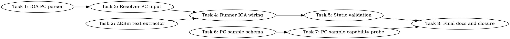

# SYCL IGA PC Source-Line Attribution Implementation Plan

> **For Claude:** REQUIRED SUB-SKILL: Use team-driven-development to implement this plan with agent teams.

**Goal:** Build a truthful path from SYCL ZEBin kernels to source line numbers with exact static instruction cost, and add a gated path for true sampled runtime line cost only when a real Intel GPU PC-sample source is verified.

**Architecture:** Add an Intel IGA PC-disassembly path beside the existing `ocloc`/DWARF fallback. The static path extracts or selects a kernel text section, disassembles it with IGA using PC output, normalizes instruction PCs into existing DWARF line-table ranges, and emits `asm-line-static-cost` only from kernel-matched PC rows. The sampled path introduces a separate PC-sample schema and status so runtime sampled line attribution is never confused with static instruction cost.

**Tech Stack:** Python 3 parser scripts, bash runner scripts, Intel IGA/`iga64`, `llvm-readelf`, `llvm-objcopy`, `llvm-dwarfdump`, VTune/oneAPI lead-only validation, pytest source-only tests.

---

## Team Topology

**Recommended implementers:** 3 concurrent (based on 3 parallel tracks — execution spawns one ephemeral implementer PER TASK)
**Reviewers:** spec + quality, spawned FRESH per review (not a standing pair; see team-driven-development)

### Parallel Tracks

| Track | Tasks | Description |
|-------|-------|-------------|
| A | 1, 3 | IGA PC parser, then resolver ingestion of PC rows |
| B | 2, 4 | ZEBin kernel text extraction plan, then runner wiring |
| C | 6, 7 | Runtime PC-sample schema and capability probe |
| D | 5 | Lead-only static validation and docs, depends on runner wiring |
| E | 8 | Final integration docs/report, depends on all tracks |

### Dependency Graph



### File Ownership Map

| File/Directory | Tasks | Conflict Risk |
|----------------|-------|---------------|
| `scripts/parse-sycl-iga-pc-disasm.py` | 1 | None |
| `tests/test-sycl-iga-pc-disasm-parser.py` | 1 | None |
| `scripts/prepare-sycl-iga-disasm-inputs.py` | 2 | None |
| `tests/test-sycl-iga-zebin-extractor.py` | 2 | None |
| `scripts/resolve-sycl-zebin-asm-source-lines.py` | 3 | Sequential after Task 1 |
| `tests/test-sycl-zebin-asm-source-line-resolver.py` | 3 | Sequential after Task 1 |
| `scripts/sycl-source-line-debug-matrix.sh` | 4 | Sequential after Task 2 and Task 3 |
| `scripts/sycl-vtune-source-line-feasibility.sh` | 4 | Sequential after Task 2 and Task 3 |
| `scripts/sycl-gptoss-full-attribution-profile.sh` | 4 | Sequential after Task 2 and Task 3 |
| `scripts/sycl-gptoss-staged-attribution-profile.sh` | 4 | Sequential after Task 2 and Task 3 |
| Runner tests under `tests/test-sycl-*-script.py` | 4 | Sequential after Task 2 and Task 3 |
| `docs/backend/SYCL.md` | 5, 8 | Sequential docs updates |
| `tests/test-sycl-vtune-source-line-enablement-docs.py` | 5, 8 | Sequential docs tests |
| `activation/sycl-iga-pc-source-line-validation.md` | 5 | None |
| `scripts/resolve-sycl-pc-samples-to-source-lines.py` | 6 | None |
| `tests/test-sycl-pc-sample-source-line-resolver.py` | 6 | None |
| `scripts/check-sycl-vtune-source-lines.py` | 6 | Isolated from static resolver, but review carefully |
| `scripts/parse-sycl-source-attribution.py` | 6 | Isolated from static resolver, but review carefully |
| `scripts/merge-sycl-staged-ledger.py` | 6 | Isolated from static resolver, but review carefully |
| `scripts/sycl-intel-pc-sampling-capability.sh` | 7 | None |
| `tests/test-sycl-intel-pc-sampling-capability-script.py` | 7 | None |
| `activation/sycl-intel-pc-sampling-capability.md` | 7 | None |
| `.codescout/tasks.jsonl` | 5, 7, 8 | Tracker tools only |

---

## Research Grounding

Primary findings used by this plan:

- Intel IGA is the correct next tool for EU instruction PCs. The IGC source tree contains `visa/iga/IGAJSONv2.md`, which documents `-Xprint-json`, and says the `pc` field is present when `-Xprint-pcs` is enabled. The IGA CLI help in `visa/iga/IGAExe/iga_main.cpp` shows usage like `file.bin -p=9 -d -Xprint-pc` and flags `print-pc` plus `print-json`.
- `ocloc disasm` currently produces label-only assembly on this workstation for the relevant kernels. Labels such as `L0:` and `L304:` are not proof of byte PCs.
- Public PTI and Level Zero metric APIs are suitable for timeline and metric aggregation, but public docs do not establish a supported Arc/BMG EU PC sampling source outside VTune. Runtime sampled line attribution must therefore be gated on a real `{kernel, pc, sample_count}` producer.
- VTune/GTPin source rows remain worth probing, but GTPin register pressure or no-kernel messages are collection failures for source-line evidence, not proof the kernel has no source attribution.

Use these verified public sources during implementation:

- IGA JSON documentation: `https://raw.githubusercontent.com/intel/intel-graphics-compiler/master/visa/iga/IGAJSONv2.md`
- IGA C API: `https://raw.githubusercontent.com/intel/intel-graphics-compiler/master/visa/iga/IGALibrary/api/iga.h`
- IGA CLI source: `https://raw.githubusercontent.com/intel/intel-graphics-compiler/master/visa/iga/IGAExe/iga_main.cpp`
- PTI GPU README: `https://raw.githubusercontent.com/intel/pti-gpu/master/README.md`
- Metrics Discovery README: `https://raw.githubusercontent.com/intel/metrics-discovery/master/README.md`
- Level Zero metric API: `https://oneapi-src.github.io/level-zero-spec/level-zero/latest/core/api.html`

---

### Task 1: Parse IGA PC disassembly rows

**Track:** A
**Depends on:** None

**File scope:**
- Create: `scripts/parse-sycl-iga-pc-disasm.py`
- Create: `tests/test-sycl-iga-pc-disasm-parser.py`
- Reference: `scripts/parse-sycl-vtune-kernel-asm.py:22-111` for existing instruction row shape.

**Description:**

Create a source-only parser for IGA PC disassembly output. It must accept IGA JSON produced with `-Xprint-json -Xprint-pc` and a conservative text format with explicit PC prefixes, then emit a stable CSV/JSON instruction schema consumed by the resolver.

**Acceptance Criteria:**

- [ ] JSON input with `elems` entries containing `kind`, `pc`, `op`, and `syntax` emits deterministic rows sorted by PC.
- [ ] Text input with `0x40:` or `PC=0x40` explicit PCs emits the same row schema.
- [ ] Label-only IGA or `ocloc` text such as `L0:` fails closed with status `no_pc_rows`, not `asm-line-static-cost`.
- [ ] Output rows include `kernel`, `pc`, `pc_hex`, `opcode`, `text`, `raw`, `send_comment`, and `source`.
- [ ] No GPU, VTune, `ocloc`, or `iga64` commands are required for unit tests.

**Implementation Guide:**

1. **RED: create parser tests**

Create `tests/test-sycl-iga-pc-disasm-parser.py`:

```python
#!/usr/bin/env python3
from __future__ import annotations

import csv
import io
import json
import pathlib
import subprocess
import sys
import tempfile

ROOT = pathlib.Path(__file__).resolve().parents[1]
PARSER = ROOT / "scripts" / "parse-sycl-iga-pc-disasm.py"


def run_parser(*args: str) -> subprocess.CompletedProcess[str]:
    return subprocess.run(
        [sys.executable, str(PARSER), *args],
        text=True,
        stdout=subprocess.PIPE,
        stderr=subprocess.STDOUT,
        check=False,
    )


def test_parser_reads_iga_json_pc_rows() -> None:
    with tempfile.TemporaryDirectory() as tmp_raw:
        tmp = pathlib.Path(tmp_raw)
        p = tmp / "kernel.iga.json"
        p.write_text(
            json.dumps(
                {
                    "kernels": [
                        {
                            "name": "target_kernel",
                            "elems": [
                                {"kind": "label", "id": 0, "name": "L0"},
                                {"kind": "inst", "pc": 64, "op": "dpas.8x8", "syntax": "dpas.8x8 r1 r2 r3"},
                                {"kind": "inst", "pc": "0x50", "op": "send.ugm", "syntax": "send.ugm r4 r5 // wr:1+0, rd:4"},
                            ],
                        }
                    ]
                }
            ),
            encoding="utf-8",
        )
        result = run_parser("--input", str(p), "--format", "json", "--kernel", "target_kernel")
        assert result.returncode == 0, result.stdout
        rows = list(csv.DictReader(io.StringIO(result.stdout)))
        assert [row["pc_hex"] for row in rows] == ["0x40", "0x50"]
        assert rows[0]["opcode"] == "dpas.8x8"
        assert rows[1]["send_comment"] == "wr:1+0, rd:4"
        assert rows[0]["kernel"] == "target_kernel"
        assert rows[0]["source"] == "iga-json"


def test_parser_rejects_label_only_text_without_pc_rows() -> None:
    with tempfile.TemporaryDirectory() as tmp_raw:
        tmp = pathlib.Path(tmp_raw)
        p = tmp / "kernel.asm"
        p.write_text("L0:\n(W) mov (16|M0) r1.0<1>:ud 0x0:ud\nL304:\n", encoding="utf-8")
        result = run_parser("--input", str(p), "--format", "text", "--kernel", "target_kernel")
        assert result.returncode == 2
        assert "iga_pc.status no_pc_rows" in result.stdout
        assert "Traceback" not in result.stdout


def test_parser_reads_explicit_text_pc_rows() -> None:
    with tempfile.TemporaryDirectory() as tmp_raw:
        tmp = pathlib.Path(tmp_raw)
        p = tmp / "kernel.asm"
        p.write_text(
            "// Kernel: target_kernel\n"
            "0x40: dpas.8x8 r1 r2 r3\n"
            "PC=0x50 send.ugm r4 r5 // wr:1+0, rd:4\n",
            encoding="utf-8",
        )
        result = run_parser("--input", str(p), "--format", "text", "--kernel", "target_kernel")
        assert result.returncode == 0, result.stdout
        rows = list(csv.DictReader(io.StringIO(result.stdout)))
        assert [row["pc"] for row in rows] == ["64", "80"]
        assert rows[1]["opcode"] == "send.ugm"
```

Run:

```bash
python3 -m pytest tests/test-sycl-iga-pc-disasm-parser.py -q
```

Expected RED result:

```text
FAILED tests/test-sycl-iga-pc-disasm-parser.py::test_parser_reads_iga_json_pc_rows
```

2. **GREEN: create parser**

Create `scripts/parse-sycl-iga-pc-disasm.py` with these core definitions:

```python
#!/usr/bin/env python3
from __future__ import annotations

import argparse
import csv
import json
import pathlib
import re
import sys
from dataclasses import dataclass

FIELDS = ["kernel", "pc", "pc_hex", "opcode", "text", "raw", "send_comment", "source"]
TEXT_PC_PATTERNS = (
    re.compile(r"^\s*(?:0x)?([0-9A-Fa-f]+):\s*(.+)$"),
    re.compile(r"^\s*PC\s*=\s*(?:0x)?([0-9A-Fa-f]+)\s+(.+)$", re.IGNORECASE),
)


@dataclass(frozen=True)
class PcInstruction:
    kernel: str
    pc: int
    opcode: str
    text: str
    raw: str
    send_comment: str
    source: str

    def to_row(self) -> dict[str, str]:
        return {
            "kernel": self.kernel,
            "pc": str(self.pc),
            "pc_hex": hex(self.pc),
            "opcode": self.opcode,
            "text": self.text,
            "raw": self.raw,
            "send_comment": self.send_comment,
            "source": self.source,
        }


def opcode_from_text(text: str) -> str:
    cleaned = re.sub(r"^\([^)]*\)\s*", "", text.strip())
    match = re.match(r"([A-Za-z][A-Za-z0-9_.]*)", cleaned)
    return match.group(1).lower() if match else "unknown"


def send_comment(raw: str) -> str:
    if "//" not in raw:
        return ""
    comment = raw.split("//", 1)[1].strip()
    return comment if comment.startswith("wr:") else ""


def parse_pc(raw: object) -> int | None:
    if isinstance(raw, int):
        return raw
    if isinstance(raw, str):
        text = raw.strip()
        if text.startswith("0x"):
            return int(text, 16)
        if text.isdigit():
            return int(text, 10)
    return None


def parse_json_rows(text: str, kernel: str) -> list[PcInstruction]:
    data = json.loads(text)
    kernels = data.get("kernels") if isinstance(data, dict) else None
    if kernels is None and isinstance(data, dict):
        kernels = [data]
    rows: list[PcInstruction] = []
    for item in kernels or []:
        name = str(item.get("name") or item.get("kernel") or kernel)
        if name != kernel:
            continue
        for elem in item.get("elems", []):
            if elem.get("kind") not in {"inst", "instruction"}:
                continue
            pc = parse_pc(elem.get("pc"))
            if pc is None:
                continue
            text_row = str(elem.get("syntax") or elem.get("text") or elem.get("op") or "")
            rows.append(
                PcInstruction(
                    kernel=kernel,
                    pc=pc,
                    opcode=str(elem.get("op") or opcode_from_text(text_row)).lower(),
                    text=text_row,
                    raw=json.dumps(elem, sort_keys=True),
                    send_comment=send_comment(text_row),
                    source="iga-json",
                )
            )
    return sorted(rows, key=lambda row: row.pc)


def parse_text_rows(text: str, kernel: str) -> list[PcInstruction]:
    rows: list[PcInstruction] = []
    for raw in text.splitlines():
        stripped = raw.strip()
        if not stripped or stripped.endswith(":") or stripped.startswith("//"):
            continue
        for pattern in TEXT_PC_PATTERNS:
            match = pattern.match(raw)
            if not match:
                continue
            pc = int(match.group(1), 16)
            inst = match.group(2).strip()
            rows.append(
                PcInstruction(
                    kernel=kernel,
                    pc=pc,
                    opcode=opcode_from_text(inst),
                    text=inst,
                    raw=raw,
                    send_comment=send_comment(raw),
                    source="iga-text",
                )
            )
            break
    return sorted(rows, key=lambda row: row.pc)


def write_csv(rows: list[PcInstruction]) -> None:
    writer = csv.DictWriter(sys.stdout, fieldnames=FIELDS)
    writer.writeheader()
    for row in rows:
        writer.writerow(row.to_row())


def main() -> int:
    parser = argparse.ArgumentParser(description="Parse IGA PC disassembly rows")
    parser.add_argument("--input", required=True, type=pathlib.Path)
    parser.add_argument("--format", choices=("json", "text"), required=True)
    parser.add_argument("--kernel", required=True)
    args = parser.parse_args()
    text = args.input.read_text(encoding="utf-8", errors="replace")
    rows = parse_json_rows(text, args.kernel) if args.format == "json" else parse_text_rows(text, args.kernel)
    write_csv(rows)
    if not rows:
        print("iga_pc.status no_pc_rows")
        return 2
    return 0


if __name__ == "__main__":
    raise SystemExit(main())
```

3. **Run GREEN tests**

```bash
python3 -m pytest tests/test-sycl-iga-pc-disasm-parser.py -q
python3 -m py_compile scripts/parse-sycl-iga-pc-disasm.py
```

Expected GREEN result:

```text
3 passed
```

**Commit:**

```bash
git add scripts/parse-sycl-iga-pc-disasm.py tests/test-sycl-iga-pc-disasm-parser.py
git commit -m "tools(sycl): parse IGA PC disassembly rows"
```

**Gotchas:**

- Do not infer PCs from labels like `L304:`.
- `pc` must be a byte offset from the disassembler, not row number.
- This parser is source-only; workers must not run `iga64`.

---

### Task 2: Prepare ZEBin kernel text extraction for IGA

**Track:** B
**Depends on:** None

**File scope:**
- Create: `scripts/prepare-sycl-iga-disasm-inputs.py`
- Create: `tests/test-sycl-iga-zebin-extractor.py`
- Reference: `scripts/sycl-source-line-debug-matrix.sh:217-241` and `scripts/sycl-vtune-source-line-feasibility.sh:137-161`, where current runners copy ZEBins and select ASM files.

**Description:**

Create a source-tested helper that identifies one safe `.text.*` kernel section in a ZEBin and prints the exact `llvm-objcopy` plus `iga64` commands needed to produce PC disassembly. It must fail closed on zero or multiple matching sections unless an explicit section is supplied.

**Acceptance Criteria:**

- [ ] Synthetic `llvm-readelf --sections --wide` text with one matching `.text.*` section emits `extract.status ok` and deterministic command lines.
- [ ] The manifest records `extract.section_addr` as the section virtual address, so IGA section-relative PCs can be normalized before DWARF lookup.
- [ ] Multiple matches emit `extract.status ambiguous_kernel_text_section` and return code `2`.
- [ ] Zero matches emit `extract.status missing_kernel_text_section` and return code `2`.
- [ ] The script does not execute `llvm-objcopy` or `iga64`; it writes a shell script and manifest for the lead-owned runner to execute.
- [ ] Section names are shell-quoted in generated commands.

**Implementation Guide:**

1. **RED: create extractor tests**

Create `tests/test-sycl-iga-zebin-extractor.py`:

```python
#!/usr/bin/env python3
from __future__ import annotations

import json
import pathlib
import subprocess
import sys
import tempfile

ROOT = pathlib.Path(__file__).resolve().parents[1]
SCRIPT = ROOT / "scripts" / "prepare-sycl-iga-disasm-inputs.py"


def run_script(*args: str) -> subprocess.CompletedProcess[str]:
    return subprocess.run([sys.executable, str(SCRIPT), *args], text=True, stdout=subprocess.PIPE, stderr=subprocess.STDOUT, check=False)


def write_sections(tmp: pathlib.Path, body: str) -> pathlib.Path:
    p = tmp / "sections.txt"
    p.write_text(body, encoding="utf-8")
    return p


def test_prepare_outputs_manifest_and_commands_for_single_section() -> None:
    with tempfile.TemporaryDirectory() as tmp_raw:
        tmp = pathlib.Path(tmp_raw)
        sections = write_sections(
            tmp,
            "[ 1] .text._ZTS_target_kernel PROGBITS 0000000000000040 000040 000080 00 AX 0 0 16\n"
            "[ 2] .debug_line PROGBITS 0000000000000000 0000c0 000040 00 0 0 1\n",
        )
        out_dir = tmp / "iga"
        result = run_script(
            "--readelf-sections", str(sections),
            "--zebin", str(tmp / "kernel.zebin"),
            "--kernel-match", "target_kernel",
            "--platform", "xe2",
            "--out-dir", str(out_dir),
        )
        assert result.returncode == 0, result.stdout
        manifest = json.loads((out_dir / "iga-disasm-manifest.json").read_text(encoding="utf-8"))
        assert manifest["extract.status"] == "ok"
        assert manifest["extract.section"] == ".text._ZTS_target_kernel"
        assert manifest["extract.section_addr"] == "0x40"
        command_text = (out_dir / "run-iga-disasm.sh").read_text(encoding="utf-8")
        assert "llvm-objcopy" in command_text
        assert "--dump-section" in command_text
        assert "iga64" in command_text
        assert "-Xprint-json" in command_text
        assert "-Xprint-pc" in command_text


def test_prepare_fails_closed_on_missing_sections() -> None:
    with tempfile.TemporaryDirectory() as tmp_raw:
        tmp = pathlib.Path(tmp_raw)
        sections = write_sections(tmp, "[ 1] .debug_line PROGBITS 0000000000000000 000040 000080 00 0 0 1\n")
        result = run_script("--readelf-sections", str(sections), "--zebin", str(tmp / "kernel.zebin"), "--kernel-match", "target_kernel", "--platform", "xe2", "--out-dir", str(tmp / "iga"))
        assert result.returncode == 2
        assert "extract.status missing_kernel_text_section" in result.stdout
        assert "Traceback" not in result.stdout


def test_prepare_fails_closed_on_ambiguous_sections() -> None:
    with tempfile.TemporaryDirectory() as tmp_raw:
        tmp = pathlib.Path(tmp_raw)
        sections = write_sections(
            tmp,
            "[ 1] .text._ZTS_target_kernel_a PROGBITS 0000000000000040 000040 000080 00 AX 0 0 16\n"
            "[ 2] .text._ZTS_target_kernel_b PROGBITS 00000000000000c0 0000c0 000080 00 AX 0 0 16\n",
        )
        result = run_script("--readelf-sections", str(sections), "--zebin", str(tmp / "kernel.zebin"), "--kernel-match", "target_kernel", "--platform", "xe2", "--out-dir", str(tmp / "iga"))
        assert result.returncode == 2
        assert "extract.status ambiguous_kernel_text_section" in result.stdout
        assert "Traceback" not in result.stdout
```

2. **GREEN: create helper**

Create `scripts/prepare-sycl-iga-disasm-inputs.py` with these required behaviors:

```python
#!/usr/bin/env python3
from __future__ import annotations

import argparse
import json
import pathlib
import re
import shlex
import stat
import sys

SECTION_RE = re.compile(r"\[\s*\d+\]\s+(\.text\.[^\s]+)\s+PROGBITS\s+([0-9A-Fa-f]+)\s+")


def parse_text_sections(text: str) -> list[tuple[str, str]]:
    rows: list[tuple[str, str]] = []
    for match in SECTION_RE.finditer(text):
        addr_digits = match.group(2).lstrip("0") or "0"
        rows.append((match.group(1), "0x" + addr_digits))
    return rows


def choose_section(sections: list[tuple[str, str]], kernel_match: str, explicit_section: str) -> tuple[tuple[str, str] | None, str]:
    if explicit_section:
        for section in sections:
            if section[0] == explicit_section:
                return section, "ok"
        return None, "missing_explicit_text_section"
    matches = [section for section in sections if kernel_match in section[0]]
    if len(matches) == 1:
        return matches[0], "ok"
    if not matches:
        return None, "missing_kernel_text_section"
    return None, "ambiguous_kernel_text_section"


def main() -> int:
    parser = argparse.ArgumentParser(description="Prepare ZEBin text extraction and IGA PC disassembly commands")
    parser.add_argument("--readelf-sections", required=True, type=pathlib.Path)
    parser.add_argument("--zebin", required=True, type=pathlib.Path)
    parser.add_argument("--kernel-match", required=True)
    parser.add_argument("--platform", required=True)
    parser.add_argument("--out-dir", required=True, type=pathlib.Path)
    parser.add_argument("--section-name", default="")
    args = parser.parse_args()
    text = args.readelf_sections.read_text(encoding="utf-8", errors="replace")
    sections = parse_text_sections(text)
    selected, status = choose_section(sections, args.kernel_match, args.section_name)
    section = selected[0] if selected else None
    section_addr = selected[1] if selected else ""
    args.out_dir.mkdir(parents=True, exist_ok=True)
    manifest = {"extract.status": status, "extract.kernel_match": args.kernel_match, "extract.section": section or "", "extract.section_addr": section_addr, "extract.platform": args.platform}
    (args.out_dir / "iga-disasm-manifest.json").write_text(json.dumps(manifest, indent=2, sort_keys=True) + "\n", encoding="utf-8")
    if status != "ok" or section is None:
        print(f"extract.status {status}")
        return 2
    raw = args.out_dir / "kernel-text.bin"
    json_out = args.out_dir / "kernel.iga.json"
    command = "\n".join(
        [
            "#!/usr/bin/env bash",
            "set -euo pipefail",
            f"llvm-objcopy --dump-section {shlex.quote(section)}={shlex.quote(str(raw))} {shlex.quote(str(args.zebin))}",
            f"iga64 {shlex.quote(str(raw))} -p={shlex.quote(args.platform)} -d -Xprint-json -Xprint-pc > {shlex.quote(str(json_out))}",
        ]
    ) + "\n"
    command_path = args.out_dir / "run-iga-disasm.sh"
    command_path.write_text(command, encoding="utf-8")
    command_path.chmod(command_path.stat().st_mode | stat.S_IXUSR)
    print("extract.status ok")
    print(f"extract.section {section}")
    print(f"extract.command {command_path}")
    return 0


if __name__ == "__main__":
    raise SystemExit(main())
```

3. **Run GREEN tests**

```bash
python3 -m pytest tests/test-sycl-iga-zebin-extractor.py -q
python3 -m py_compile scripts/prepare-sycl-iga-disasm-inputs.py
```

Expected GREEN result:

```text
3 passed
```

**Commit:**

```bash
git add scripts/prepare-sycl-iga-disasm-inputs.py tests/test-sycl-iga-zebin-extractor.py
git commit -m "tools(sycl): prepare IGA ZEBin disassembly inputs"
```

**Gotchas:**

- Do not run `iga64` in this helper or in worker tests.
- Never select a section by loose first-match when multiple sections match.
- The real MXFP4 ZEBin section name may not contain the exact public target kernel. That is why the helper supports explicit `--section-name` for lead validation.

---

### Task 3: Feed IGA PC rows into the existing source-line resolver

**Track:** A
**Depends on:** Task 1

**File scope:**
- Modify: `scripts/resolve-sycl-zebin-asm-source-lines.py:61-270`
- Modify: `tests/test-sycl-zebin-asm-source-line-resolver.py:408-426`

**Description:**

Extend the existing resolver so it can consume IGA PC rows directly, without requiring address-prefixed ASM text. The resulting CSV remains the same checker-compatible `asm-line-static-cost` evidence, but now the instruction addresses come from IGA `pc` fields.

**Acceptance Criteria:**

- [ ] New CLI option `--iga-instructions-csv` is accepted as an alternative to `--asm`.
- [ ] IGA rows must have `kernel` matching `--source-computing-task` exactly; any non-empty mismatched kernel row in the input fails closed instead of being silently ignored.
- [ ] New CLI option `--pc-base` is accepted and added to every IGA section-relative `pc` before DWARF lookup.
- [ ] IGA row `pc + pc_base` maps to DWARF rows with the same nearest-preceding range logic currently in `source_row_for_instruction` at `scripts/resolve-sycl-zebin-asm-source-lines.py:217-226`.
- [ ] Mismatched IGA kernel rows fail closed with return code `2` and a clear mismatch message.
- [ ] Inputs with only matching-kernel rows but no mapped source rows fail closed with return code `2` and `no_asm_source_matches`.
- [ ] Existing `--asm` behavior and tests still pass.

**Implementation Guide:**

1. **RED: append resolver test**

Append to `tests/test-sycl-zebin-asm-source-line-resolver.py`:

```python
def test_resolver_maps_iga_pc_rows_to_dwarf_source_lines() -> None:
    with tempfile.TemporaryDirectory() as tmp_raw:
        tmp = pathlib.Path(tmp_raw)
        dwarf, _ = write_fixture(tmp)
        iga_csv = tmp / "iga-pc.csv"
        iga_csv.write_text(
            "kernel,pc,pc_hex,opcode,text,raw,send_comment,source\n"
            "mxfp4_pair_glu_xmx_tiled,0,0x0,dpas.8x8,dpas.8x8 r1 r2 r3,raw,,iga-json\n"
            "mxfp4_pair_glu_xmx_tiled,16,0x10,send.ugm,send.ugm r4 r5,raw,wr:1+0; rd:4,iga-json\n"
            "mxfp4_pair_glu_xmx_tiled,136,0x88,send.ugm,send.ugm r6 r7,raw,wr:1+0; rd:0,iga-json\n",
            encoding="utf-8",
        )
        result = run_resolver(
            "--dwarf-line-dump",
            str(dwarf),
            "--iga-instructions-csv",
            str(iga_csv),
            "--source-computing-task",
            "mxfp4_pair_glu_xmx_tiled",
            "--pc-base",
            "0x40",
        )
        assert result.returncode == 0, result.stdout
        rows = list(csv.DictReader(io.StringIO(result.stdout)))
        assert rows[0]["Source Line"] == "/Apps/llama.cpp/ggml/src/ggml-sycl/mmvq.cpp:6800"
        assert rows[0]["Static Dpas Count"] == "1"
        assert rows[0]["Static Send Ugm Count"] == "1"
        assert any(row["Source Line"].endswith("mmvq.cpp:6802") for row in rows)


def test_resolver_rejects_iga_rows_for_wrong_kernel() -> None:
    with tempfile.TemporaryDirectory() as tmp_raw:
        tmp = pathlib.Path(tmp_raw)
        dwarf, _ = write_fixture(tmp)
        iga_csv = tmp / "iga-pc.csv"
        iga_csv.write_text(
            "kernel,pc,pc_hex,opcode,text,raw,send_comment,source\n"
            "mxfp4_pair_glu_xmx_tiled,0,0x0,dpas.8x8,dpas.8x8 r1 r2 r3,raw,,iga-json\n"
            "other_kernel,16,0x10,send.ugm,send.ugm r4 r5,raw,wr:1+0; rd:4,iga-json\n",
            encoding="utf-8",
        )
        result = run_resolver(
            "--dwarf-line-dump",
            str(dwarf),
            "--iga-instructions-csv",
            str(iga_csv),
            "--source-computing-task",
            "mxfp4_pair_glu_xmx_tiled",
        )
        assert result.returncode == 2
        assert "IGA PC instruction CSV contains kernel other_kernel but expected mxfp4_pair_glu_xmx_tiled" in result.stdout
        assert "Traceback" not in result.stdout
```

2. **GREEN: modify resolver**

In `scripts/resolve-sycl-zebin-asm-source-lines.py`, add a small internal dataclass compatible with existing aggregation:

```python
@dataclass(frozen=True)
class PcInstructionRow:
    address: int
    opcode: str
    text: str
    raw: str
    send_comment: str
```

Add a CSV loader near `load_instructions`:

```python
def load_iga_instructions(csv_path: pathlib.Path, source_computing_task: str, pc_base: int) -> list[PcInstructionRow]:
    require_existing_file(csv_path, "IGA PC instruction CSV")
    rows: list[PcInstructionRow] = []
    with csv_path.open("r", encoding="utf-8", errors="replace", newline="") as handle:
        reader = csv.DictReader(handle)
        for row in reader:
            row_kernel = row.get("kernel") or ""
            if row_kernel != source_computing_task:
                raise ResolveError(
                    f"IGA PC instruction CSV contains kernel {row_kernel} but expected {source_computing_task}"
                )
            pc_raw = row.get("pc") or ""
            if not pc_raw.isdigit():
                continue
            rows.append(
                PcInstructionRow(
                    address=int(pc_raw) + pc_base,
                    opcode=(row.get("opcode") or "").lower(),
                    text=row.get("text") or "",
                    raw=row.get("raw") or "",
                    send_comment=row.get("send_comment") or "",
                )
            )
    return sorted(rows, key=lambda row: row.address)
```

Change argparse:

```python
    parser.add_argument("--asm", type=pathlib.Path)
    parser.add_argument("--iga-instructions-csv", type=pathlib.Path)
    parser.add_argument("--pc-base", default="0", help="base address added to IGA section-relative PCs")
```

Then select one input:

```python
        if bool(args.asm) == bool(args.iga_instructions_csv):
            raise ResolveError("pass exactly one of --asm or --iga-instructions-csv")
        instructions = (
            load_instructions(args.asm, args.source_computing_task)
            if args.asm
            else load_iga_instructions(args.iga_instructions_csv, args.source_computing_task, parse_hex_address(args.pc_base))
        )
```

3. **Run tests**

```bash
python3 -m pytest tests/test-sycl-zebin-asm-source-line-resolver.py tests/test-sycl-iga-pc-disasm-parser.py -q
```

Expected GREEN result:

```text
all listed tests pass
```

**Commit:**

```bash
git add scripts/resolve-sycl-zebin-asm-source-lines.py tests/test-sycl-zebin-asm-source-line-resolver.py
git commit -m "tools(sycl): resolve IGA PC rows to source lines"
```

**Gotchas:**

- Keep `--asm` and `--iga-instructions-csv` mutually exclusive.
- Always pass `--pc-base` from the selected ZEBin `.text.*` section address; otherwise section-relative IGA PCs will not match DWARF addresses.
- Do not weaken the unmarked ASM rejection added at `scripts/resolve-sycl-zebin-asm-source-lines.py:191-205`.
- The output status remains `asm_line_static_cost`; this task still does not create sampled runtime timing.

---

### Task 4: Wire IGA PC rows through source-line runners

**Track:** B
**Depends on:** Task 2, Task 3

**File scope:**
- Modify: `scripts/sycl-source-line-debug-matrix.sh:73-90`, `scripts/sycl-source-line-debug-matrix.sh:151-155`, `scripts/sycl-source-line-debug-matrix.sh:231-241`
- Modify: `scripts/sycl-vtune-source-line-feasibility.sh:51-68`, `scripts/sycl-vtune-source-line-feasibility.sh:82-84`, `scripts/sycl-vtune-source-line-feasibility.sh:150-160`
- Modify: `scripts/sycl-gptoss-full-attribution-profile.sh:177-179`
- Modify: `scripts/sycl-gptoss-staged-attribution-profile.sh:324-326`
- Modify: `tests/test-sycl-source-line-debug-matrix-script.py:130-151`
- Modify: `tests/test-sycl-vtune-source-line-feasibility-script.py:165-183`
- Modify: `tests/test-sycl-full-attribution-profile-script.py:128-183`
- Modify: `tests/test-sycl-staged-attribution-profile-script.py:53-100`

**Description:**

Update dry-run and execute runner paths to generate IGA PC disassembly artifacts when possible. The runners must prefer `iga-pc-instructions.csv` over `ocloc` ASM for `asm-line-static-cost`, and must fall back to DWARF-only without fabricating ASM evidence.

**Acceptance Criteria:**

- [ ] Runners add `--iga-platform` with default `${SYCL_IGA_PLATFORM:-xe2}`.
- [ ] Runners use `llvm-readelf --sections --wide` for `zebin-debug-sections.txt`, not `readelf -S`, so long `.text.*` names are not truncated.
- [ ] Dry-runs mention `prepare-sycl-iga-disasm-inputs.py`, `iga64`, `-Xprint-json`, `-Xprint-pc`, `parse-sycl-iga-pc-disasm.py`, `iga-pc-instructions.csv`, resolver `--iga-instructions-csv`, and resolver `--pc-base`.
- [ ] Execute paths create `iga-disasm/iga-disasm-manifest.json`, `iga-disasm/run-iga-disasm.sh`, and `iga-pc-instructions.csv` when IGA succeeds.
- [ ] If IGA preparation, IGA execution, or IGA parsing fails, the runner warns and uses existing `ocloc` ASM or DWARF fallback.
- [ ] Checker still receives `--asm-source-lines-csv` only after the resolver writes it.
- [ ] Workers run only `bash -n`, pytest, and dry-run commands.

**Implementation Guide:**

1. **RED: update runner tests**

Add assertions to existing runner tests:

```python
assert "prepare-sycl-iga-disasm-inputs.py" in result.stdout
assert "iga64" in result.stdout
assert "-Xprint-json" in result.stdout
assert "-Xprint-pc" in result.stdout
assert "parse-sycl-iga-pc-disasm.py" in result.stdout
assert "iga-pc-instructions.csv" in result.stdout
assert "--iga-instructions-csv" in result.stdout
assert "--pc-base" in result.stdout
assert "--iga-platform" in result.stdout
assert "llvm-readelf --sections --wide" in result.stdout
```

For execute-branch source-text tests, assert:

```python
assert "run-iga-disasm.sh" in text
assert "iga-pc-instructions.csv" in text
assert "warning: IGA PC disassembly failed" in text
assert "checker will use ocloc/DWARF evidence if available" in text
```

Run:

```bash
python3 -m pytest tests/test-sycl-source-line-debug-matrix-script.py tests/test-sycl-vtune-source-line-feasibility-script.py tests/test-sycl-full-attribution-profile-script.py tests/test-sycl-staged-attribution-profile-script.py -q
```

Expected RED result:

```text
FAILED runner dry-run/source assertions for IGA PC plumbing
```

2. **GREEN: update matrix runner**

In `scripts/sycl-source-line-debug-matrix.sh`, add platform configuration near the existing target variables at `scripts/sycl-source-line-debug-matrix.sh:7-10`:

```bash
IGA_PLATFORM="${SYCL_IGA_PLATFORM:-xe2}"
```

Add `--iga-platform` to `usage()` and the argument parser. Replace every current section dump producer using `readelf -S` with wide LLVM output:

```bash
llvm-readelf --sections --wide "${first_zebin}" >"${dir}/zebin-debug-sections.txt"
```

For dry-run output, replace `readelf -S` lines with `llvm-readelf --sections --wide` lines. Then add dry-run lines after `llvm-dwarfdump` and before `ocloc disasm`:

```bash
        printf 'first_zebin="$(find %q -name '\''*.zebin'\'' -type f -print -quit)"\n' "${vtune_dir}"
        printf 'python3 scripts/prepare-sycl-iga-disasm-inputs.py --readelf-sections %q --zebin "${first_zebin}" --kernel-match %q --platform "${IGA_PLATFORM}" --out-dir %q || true\n' "${dir}/zebin-debug-sections.txt" "${TARGET_KERNEL}" "${dir}/iga-disasm"
        printf '(cd %q && bash run-iga-disasm.sh) || true  # emits kernel.iga.json using iga64 -Xprint-json -Xprint-pc\n' "${dir}/iga-disasm"
        printf 'python3 scripts/parse-sycl-iga-pc-disasm.py --input %q --format json --kernel %q > %q || true\n' "${dir}/iga-disasm/kernel.iga.json" "${TARGET_KERNEL}" "${dir}/iga-pc-instructions.csv"
        printf 'section_addr="$(python3 -c '\''import json,sys; print(json.load(open(sys.argv[1]))["extract.section_addr"])'\'' %q)"\n' "${dir}/iga-disasm/iga-disasm-manifest.json"
        printf 'python3 scripts/resolve-sycl-zebin-asm-source-lines.py --dwarf-line-dump %q --iga-instructions-csv %q --pc-base "${section_addr}" --output %q --summary-output %q --source-computing-task %q --require-source-path %q\n' "${dir}/zebin-debug-line.txt" "${dir}/iga-pc-instructions.csv" "${dir}/asm-source-lines.csv" "${dir}/asm-source-lines.parse" "${TARGET_KERNEL}" "main.cpp"
```

In execute path after DWARF conversion and before `ocloc disasm`, first move the existing cleanup (`rm -f "${dir}/asm-source-lines.csv" "${dir}/asm-source-lines.parse"` in `scripts/sycl-source-line-debug-matrix.sh:246` and `scripts/sycl-vtune-source-line-feasibility.sh:165`) to immediately before the IGA block. Do not leave any cleanup between a successful IGA resolver call and the status guard, or a successful IGA `asm-source-lines.csv` will be deleted before it can suppress the weaker `ocloc` fallback.

Then add:

```bash
    iga_dir="${dir}/iga-disasm"
    rm -rf "${iga_dir}"
    rm -f "${dir}/iga-pc-instructions.csv"
    if python3 scripts/prepare-sycl-iga-disasm-inputs.py \
        --readelf-sections "${dir}/zebin-debug-sections.txt" \
        --zebin "${first_zebin}" \
        --kernel-match "${TARGET_KERNEL}" \
        --platform "${IGA_PLATFORM}" \
        --out-dir "${iga_dir}" >>"${dir}/probe.stderr" 2>&1; then
        if (cd "${iga_dir}" && bash run-iga-disasm.sh >>iga.stdout 2>>iga.stderr) && \
           python3 scripts/parse-sycl-iga-pc-disasm.py --input "${iga_dir}/kernel.iga.json" --format json --kernel "${TARGET_KERNEL}" >"${dir}/iga-pc-instructions.csv"; then
            section_addr="$(python3 -c 'import json,sys; print(json.load(open(sys.argv[1]))["extract.section_addr"])' "${iga_dir}/iga-disasm-manifest.json")"
            if ! python3 scripts/resolve-sycl-zebin-asm-source-lines.py \
                --dwarf-line-dump "${dir}/zebin-debug-line.txt" \
                --iga-instructions-csv "${dir}/iga-pc-instructions.csv" \
                --pc-base "${section_addr}" \
                --output "${dir}/asm-source-lines.csv" \
                --summary-output "${dir}/asm-source-lines.parse" \
                --source-computing-task "${TARGET_KERNEL}" \
                --require-source-path "main.cpp"; then
                rm -f "${dir}/asm-source-lines.csv"
                printf 'warning: IGA PC resolver failed for matrix row %s; checker will use ocloc/DWARF evidence if available\n' "${name}" >>"${dir}/probe.stderr"
            fi
        else
            printf 'warning: IGA PC disassembly failed for matrix row %s; checker will use ocloc/DWARF evidence if available\n' "${name}" >>"${dir}/probe.stderr"
        fi
    else
        printf 'warning: IGA input preparation failed for matrix row %s; checker will use ocloc/DWARF evidence if available\n' "${name}" >>"${dir}/probe.stderr"
    fi
```

Keep the existing `ocloc` block, but wrap its resolver call with:

```bash
    if [[ ! -f "${dir}/asm-source-lines.parse" ]] || ! grep -qx 'asm_source.status ok' "${dir}/asm-source-lines.parse"; then
        rm -f "${dir}/asm-source-lines.csv"
        # existing ocloc resolver block remains here
    fi
```

The guard must check the summary status instead of `[[ -s asm-source-lines.csv ]]` because the resolver writes a header-only CSV before returning failure.

3. **GREEN: mirror in MXFP4 feasibility**

Apply the same structure in `scripts/sycl-vtune-source-line-feasibility.sh` with `OUT_ROOT` and `mmvq.cpp`. Also add `IGA_PLATFORM="${SYCL_IGA_PLATFORM:-xe2}"`, expose `--iga-platform`, replace current `readelf -S` section dumps with `llvm-readelf --sections --wide`, pass `--platform "${IGA_PLATFORM}"`, pass resolver `--pc-base "${section_addr}"`, and delete `asm-source-lines.csv` on IGA resolver failure so the existing `ocloc` or DWARF fallback can run.

4. **GREEN: update full/staged dry-run summaries**

Only update dry-run comments in `scripts/sycl-gptoss-full-attribution-profile.sh` and `scripts/sycl-gptoss-staged-attribution-profile.sh`; those runners consume the matrix/feasibility artifacts and do not need to duplicate IGA execution logic.

5. **Run tests and syntax gates**

```bash
bash -n scripts/sycl-source-line-debug-matrix.sh scripts/sycl-vtune-source-line-feasibility.sh scripts/sycl-gptoss-full-attribution-profile.sh scripts/sycl-gptoss-staged-attribution-profile.sh
python3 -m pytest tests/test-sycl-source-line-debug-matrix-script.py tests/test-sycl-vtune-source-line-feasibility-script.py tests/test-sycl-full-attribution-profile-script.py tests/test-sycl-staged-attribution-profile-script.py -q
```

Expected GREEN result:

```text
all listed tests pass
```

**Commit:**

```bash
git add scripts/sycl-source-line-debug-matrix.sh scripts/sycl-vtune-source-line-feasibility.sh scripts/sycl-gptoss-full-attribution-profile.sh scripts/sycl-gptoss-staged-attribution-profile.sh tests/test-sycl-source-line-debug-matrix-script.py tests/test-sycl-vtune-source-line-feasibility-script.py tests/test-sycl-full-attribution-profile-script.py tests/test-sycl-staged-attribution-profile-script.py
git commit -m "tools(sycl): wire IGA PC source-line rows through runners"
```

**Gotchas:**

- Do not make `iga64` mandatory for DWARF fallback.
- Do not overwrite a successful IGA `asm-source-lines.csv` with weaker `ocloc` evidence.
- `xe2` is a starting platform exposed through `--iga-platform` and `SYCL_IGA_PLATFORM`; lead validation may need `xe_hpg` or another installed IGA platform string.

---

### Task 5: Lead-validate IGA static source-line attribution

**Track:** D
**Depends on:** Task 4

**File scope:**
- Modify: `docs/backend/SYCL.md`
- Create: `activation/sycl-iga-pc-source-line-validation.md`
- Modify: `.codescout/tasks.jsonl` through tracker tools only

**Description:**

Run the real lead-owned IGA path on the probe matrix and MXFP4 feasibility. This task decides whether the near-term static line attribution target is achieved: `source_line.status asm-line-static-cost` from IGA PC rows.

**Acceptance Criteria:**

- [ ] Source-only gates pass before lead validation.
- [ ] Lead runs matrix with oneAPI sourced using `set +u`, `source /opt/intel/oneapi/setvars.sh --force`, `set -u`.
- [ ] Matrix validation records IGA tool path, platform string, selected `.text.*` section, and whether `iga-pc-instructions.csv` is non-empty.
- [ ] MXFP4 validation records `source_line.status asm-line-static-cost` if IGA PC rows validate, or the exact blocker if they do not.
- [ ] `llama.cpp-040b` is closed only if MXFP4 validates `asm-line-static-cost`; otherwise it receives a blocker comment and remains open.

**Implementation Guide:**

1. **Update docs test**

Append to `tests/test-sycl-vtune-source-line-enablement-docs.py`:

```python
def test_sycl_docs_describe_iga_pc_static_source_line_path() -> None:
    section = source_line_section()
    assert "IGA PC" in section
    assert "-Xprint-json" in section
    assert "-Xprint-pc" in section
    assert "asm-line-static-cost" in section
    assert "not sampled VTune exact" in section
```

2. **Update docs**

In `docs/backend/SYCL.md`, extend the non-VTUNE status section near `docs/backend/SYCL.md:1319-1327` with:

```markdown
`asm-line-static-cost` should be produced from IGA PC rows when available. The runner extracts or selects one kernel text section, runs IGA with `-Xprint-json -Xprint-pc`, parses the resulting instruction PCs, and joins them to DWARF line-table ranges. Label-only `ocloc` assembly such as `L0:` is not address evidence and must remain a blocker or fallback path.
```

3. **Run source-only gates**

```bash
bash -n scripts/sycl-source-line-debug-matrix.sh scripts/sycl-vtune-source-line-feasibility.sh scripts/sycl-gptoss-full-attribution-profile.sh scripts/sycl-gptoss-staged-attribution-profile.sh
python3 -m pytest tests/test-sycl-iga-pc-disasm-parser.py tests/test-sycl-iga-zebin-extractor.py tests/test-sycl-zebin-asm-source-line-resolver.py tests/test-sycl-vtune-source-line-enablement-docs.py -q
```

4. **Lead-only validation commands**

Only the lead runs these commands:

```bash
OUT=/tmp/sycl_source_line_iga_matrix_$(date +%Y%m%d_%H%M%S)
set +u
source /opt/intel/oneapi/setvars.sh --force
set -u
scripts/sycl-source-line-debug-matrix.sh \
  --execute \
  --i-understand-this-runs-gpu-source-probe \
  --out-root "$OUT" \
  --device-selector level_zero:1 \
  --vtune-target-gpu 0:7:0.0
printf '%s\n' "$OUT"
```

Select the best parse:

```bash
MATRIX_PARSE=""
for status in pass asm-line-static-cost dwarf-line-table-only; do
  MATRIX_PARSE="$(grep -Rxl "source_line.status ${status}" "$OUT/build-matrix"/*/source-line-feasibility.parse | head -n 1 || true)"
  if [[ -n "$MATRIX_PARSE" ]]; then
    break
  fi
done
if [[ -z "$MATRIX_PARSE" ]]; then
  echo "error: no accepted source-line matrix row found" >&2
  exit 2
fi
printf 'selected matrix parse: %s\n' "$MATRIX_PARSE"
cat "$MATRIX_PARSE"
```

Then MXFP4:

```bash
OUT=/tmp/sycl_mxfp4_iga_source_line_$(date +%Y%m%d_%H%M%S)
BUILD=/tmp/sycl_mxfp4_iga_source_line_build_$(date +%Y%m%d_%H%M%S)
set +u
source /opt/intel/oneapi/setvars.sh --force
set -u
scripts/sycl-vtune-source-line-feasibility.sh \
  --execute \
  --i-understand-this-runs-gpu-microbenchmarks \
  --out-root "$OUT" \
  --build-dir "$BUILD" \
  --device-selector level_zero:1 \
  --vtune-target-gpu 0:7:0.0 \
  --require-matrix-pass "$MATRIX_PARSE"
printf '%s\n%s\n' "$OUT" "$BUILD"
cat "$OUT/source-line-feasibility.parse"
```

5. **Write validation report**

Create `activation/sycl-iga-pc-source-line-validation.md` with exact artifact roots, selected parse contents, IGA manifest contents, and interpretation. Required phrases:

```text
source_line.status asm-line-static-cost means exact static source-line cost from IGA PC rows, not sampled runtime timing.
source_line.status pass remains the only sampled VTune exact status.
```

**Commit:**

```bash
git add docs/backend/SYCL.md tests/test-sycl-vtune-source-line-enablement-docs.py activation/sycl-iga-pc-source-line-validation.md .codescout/tasks.jsonl
git commit -m "docs(sycl): validate IGA PC source-line attribution"
```

**Gotchas:**

- Do not run `sycl-ls`, `/dev/dri`, `lsof`, P2P probes, or unrelated model gates.
- If `iga64` is missing or lacks `-Xprint-pc`, record that blocker and keep `llama.cpp-040b` open.
- If `.text.*` section matching is ambiguous, record the exact section list and do not force attribution.

---

### Task 6: Add a runtime PC-sample source-line schema

**Track:** C
**Depends on:** None

**File scope:**
- Create: `scripts/resolve-sycl-pc-samples-to-source-lines.py`
- Create: `tests/test-sycl-pc-sample-source-line-resolver.py`
- Modify: `scripts/check-sycl-vtune-source-lines.py:65-120`, `scripts/check-sycl-vtune-source-lines.py:139-260`
- Modify: `scripts/parse-sycl-source-attribution.py:106-160`
- Modify: `scripts/merge-sycl-staged-ledger.py:84-120`
- Modify corresponding parser tests: `tests/test-sycl-vtune-source-line-checker.py`, `tests/test-sycl-source-attribution-parser.py`, `tests/test-sycl-staged-ledger-merger.py`

**Description:**

Create a separate sampled PC schema and status that can map real dynamic PC samples to source lines. This task does not create a sampler; it prevents future dynamic PC evidence from being jammed into the static `asm-line-static-cost` path.

**Acceptance Criteria:**

- [ ] Input PC sample CSV rows require `kernel,pc,sample_count,sample_kind`.
- [ ] Output source-line CSV rows use `Source Attribution Mode=sampled-pc-line` and `Source Attribution Status=sampled_line_cost`.
- [ ] Checker accepts `source_line.status sampled-line-cost` only from rows with positive sample counts.
- [ ] Source attribution maps it to `source_attribution.status sampled_line_cost` only when the required kernel matches top cost kernel.
- [ ] Staged ledger accepts `sampled_line_cost` only when `source_line.status sampled-line-cost`.
- [ ] Existing statuses `pass`, `asm-line-static-cost`, and `dwarf-line-table-only` remain unchanged.

**Implementation Guide:**

1. **RED: create sample resolver tests**

Create `tests/test-sycl-pc-sample-source-line-resolver.py`:

```python
#!/usr/bin/env python3
from __future__ import annotations

import csv
import io
import pathlib
import subprocess
import sys
import tempfile

ROOT = pathlib.Path(__file__).resolve().parents[1]
RESOLVER = ROOT / "scripts" / "resolve-sycl-pc-samples-to-source-lines.py"


def run_resolver(*args: str) -> subprocess.CompletedProcess[str]:
    return subprocess.run([sys.executable, str(RESOLVER), *args], text=True, stdout=subprocess.PIPE, stderr=subprocess.STDOUT, check=False)


def write_dwarf(tmp: pathlib.Path) -> pathlib.Path:
    p = tmp / "zebin-debug-line.txt"
    p.write_text(
        ".debug_line contents:\n"
        "include_directories[  1] = /Apps/llama.cpp/ggml/src/ggml-sycl\n"
        "file_names[  1]:\n"
        "           name: mmvq.cpp\n"
        "      dir_index: 1\n"
        "Address            Line   Column File   ISA Discriminator Flags\n"
        "0x0000000000000040  6800     12     1     0             0  is_stmt\n"
        "0x0000000000000080  6801     20     1     0             0  is_stmt\n",
        encoding="utf-8",
    )
    return p


def test_sample_resolver_maps_pc_samples_to_source_lines() -> None:
    with tempfile.TemporaryDirectory() as tmp_raw:
        tmp = pathlib.Path(tmp_raw)
        dwarf = write_dwarf(tmp)
        samples = tmp / "pc-samples.csv"
        samples.write_text(
            "kernel,pc,sample_count,sample_kind\n"
            "target_kernel,64,7,cycles\n"
            "target_kernel,80,3,cycles\n",
            encoding="utf-8",
        )
        result = run_resolver("--dwarf-line-dump", str(dwarf), "--pc-samples", str(samples), "--source-computing-task", "target_kernel")
        assert result.returncode == 0, result.stdout
        rows = list(csv.DictReader(io.StringIO(result.stdout)))
        assert rows[0]["Source Attribution Mode"] == "sampled-pc-line"
        assert rows[0]["Source Attribution Status"] == "sampled_line_cost"
        assert rows[0]["Sample Count"] == "7"
        assert rows[0]["Source Line"].endswith("mmvq.cpp:6800")
```

2. **GREEN: implement resolver**

Use the same DWARF parsing helper from `scripts/resolve-sycl-zebin-asm-source-lines.py`, but aggregate `sample_count` instead of instruction counts. The output CSV must include both checker-style columns and compact columns:

```text
Source Line,Source File,Source File Path,Source Computing Task,Sample Count,Sample Kind,Source Attribution Mode,Source Attribution Status,source_file,source_line,sample_count,kernel
```

3. **GREEN: extend checker and ledgers**

Add a status strictly separate from VTune `pass`:

```text
source_line.status sampled-line-cost
source_attribution.status sampled_line_cost
```

Precedence in checker:

```text
pass > sampled-line-cost > asm-line-static-cost > dwarf-line-table-only > fail
```

4. **Run tests**

```bash
python3 -m pytest tests/test-sycl-pc-sample-source-line-resolver.py tests/test-sycl-vtune-source-line-checker.py tests/test-sycl-source-attribution-parser.py tests/test-sycl-staged-ledger-merger.py -q
```

Expected GREEN result:

```text
all listed tests pass
```

**Commit:**

```bash
git add scripts/resolve-sycl-pc-samples-to-source-lines.py scripts/check-sycl-vtune-source-lines.py scripts/parse-sycl-source-attribution.py scripts/merge-sycl-staged-ledger.py tests/test-sycl-pc-sample-source-line-resolver.py tests/test-sycl-vtune-source-line-checker.py tests/test-sycl-source-attribution-parser.py tests/test-sycl-staged-ledger-merger.py
git commit -m "tools(sycl): add sampled PC source-line schema"
```

**Gotchas:**

- Do not call sampled rows `exact_source_line`; keep that reserved for VTune `pass`.
- Do not accept zero sample counts.
- This task only defines the schema and resolver. It does not claim that Intel currently exposes PC samples on this machine.

---

### Task 7: Probe Intel GPU PC-sampling capability

**Track:** C
**Depends on:** Task 6

**File scope:**
- Create: `scripts/sycl-intel-pc-sampling-capability.sh`
- Create: `tests/test-sycl-intel-pc-sampling-capability-script.py`
- Create: `activation/sycl-intel-pc-sampling-capability.md`
- Modify: `.codescout/tasks.jsonl` through tracker tools only

**Description:**

Add a lead-only capability probe for runtime PC sampling sources: VTune source rows, GTPin availability, PTI metric capability, and Level Zero metric groups. This task must distinguish metric counters from PC samples and must not promise sampled line attribution unless a real `{kernel,pc,sample_count}` source is produced.

**Acceptance Criteria:**

- [ ] Dry-run prints all commands below and explains workers must not execute them.
- [ ] Execute requires `--execute --i-understand-this-probes-intel-gpu-pc-sampling`.
- [ ] The script has exact lead-only probe functions for VTune help/source export, GTPin discovery/help, PTI installation/API discovery, and Level Zero metric group enumeration.
- [ ] Script records `pc_sampling.status available` only if a PC sample CSV with `kernel,pc,sample_count` is produced.
- [ ] Metric-only findings record `pc_sampling.status metrics_only`.
- [ ] GTPin missing, unsupported, or register-pressure failures record explicit blockers.
- [ ] Activation report says whether true sampled line profiling is available on this host.

**Implementation Guide:**

1. **RED: script tests**

Create `tests/test-sycl-intel-pc-sampling-capability-script.py`:

```python
from __future__ import annotations

import pathlib
import subprocess

ROOT = pathlib.Path(__file__).resolve().parents[1]
SCRIPT = ROOT / "scripts" / "sycl-intel-pc-sampling-capability.sh"


def test_pc_sampling_probe_is_dry_run_by_default(tmp_path: pathlib.Path) -> None:
    result = subprocess.run(["bash", str(SCRIPT), "--out-root", str(tmp_path / "out")], text=True, stdout=subprocess.PIPE, stderr=subprocess.STDOUT, check=False)
    assert result.returncode == 0
    assert "DRY RUN" in result.stdout
    assert "vtune -help collect gpu-hotspots" in result.stdout
    assert "vtune -help report gpu-source-line" in result.stdout
    assert "command -v gtpin64 || command -v gtpin" in result.stdout
    assert "find /opt/intel/oneapi" in result.stdout
    assert "zetMetricGroupGet" in result.stdout
    assert "level zero metric" in result.stdout.lower()
    assert "pc_sampling.status" in result.stdout


def test_pc_sampling_probe_refuses_execute_without_ack(tmp_path: pathlib.Path) -> None:
    result = subprocess.run(["bash", str(SCRIPT), "--execute", "--out-root", str(tmp_path / "out")], text=True, stdout=subprocess.PIPE, stderr=subprocess.STDOUT, check=False)
    assert result.returncode == 2
    assert "--i-understand-this-probes-intel-gpu-pc-sampling" in result.stdout
```

2. **GREEN: create script**

Create `scripts/sycl-intel-pc-sampling-capability.sh` with dry-run by default. Execute path may run help/enumeration commands only under lead ownership.

Use these exact dry-run command lines in the script output and execute the same commands only when the acknowledgment flag is present:

```bash
vtune -help collect gpu-hotspots >"${OUT_ROOT}/vtune-gpu-hotspots-help.txt" 2>&1 || true
vtune -help report gpu-source-line >"${OUT_ROOT}/vtune-gpu-source-line-help.txt" 2>&1 || true
command -v gtpin64 || command -v gtpin || true
if command -v gtpin64 >/dev/null 2>&1; then gtpin64 --help >"${OUT_ROOT}/gtpin-help.txt" 2>&1 || true; elif command -v gtpin >/dev/null 2>&1; then gtpin --help >"${OUT_ROOT}/gtpin-help.txt" 2>&1 || true; fi
find /opt/intel/oneapi -iname '*pti*' -o -iname 'libpti*' >"${OUT_ROOT}/pti-files.txt" 2>&1 || true
python3 - <<'PY' >"${OUT_ROOT}/level-zero-metric-groups.txt" 2>&1 || true
import ctypes
from ctypes import byref, c_uint32, c_void_p, POINTER
ze = ctypes.CDLL('libze_loader.so.1')
ZE_RESULT_SUCCESS = 0
if ze.zeInit(0) != ZE_RESULT_SUCCESS:
    raise SystemExit('zeInit failed')
ze.zeDriverGet.argtypes = [POINTER(c_uint32), POINTER(c_void_p)]
ze.zeDeviceGet.argtypes = [c_void_p, POINTER(c_uint32), POINTER(c_void_p)]
try:
    zetMetricGroupGet = ze.zetMetricGroupGet
except AttributeError:
    print('zetMetricGroupGet symbol missing')
    raise SystemExit(0)
zetMetricGroupGet.argtypes = [c_void_p, POINTER(c_uint32), POINTER(c_void_p)]
driver_count = c_uint32(0)
ze.zeDriverGet(byref(driver_count), None)
drivers = (c_void_p * driver_count.value)()
ze.zeDriverGet(byref(driver_count), drivers)
print('driver_count', driver_count.value)
for driver_index, driver in enumerate(drivers):
    device_count = c_uint32(0)
    ze.zeDeviceGet(driver, byref(device_count), None)
    devices = (c_void_p * device_count.value)()
    ze.zeDeviceGet(driver, byref(device_count), devices)
    print('driver', driver_index, 'device_count', device_count.value)
    for device_index, device in enumerate(devices):
        group_count = c_uint32(0)
        result = zetMetricGroupGet(device, byref(group_count), None)
        print('driver', driver_index, 'device', device_index, 'zetMetricGroupGet_count_result', result, 'metric_group_count', group_count.value)
        if result == ZE_RESULT_SUCCESS and group_count.value:
            groups = (c_void_p * group_count.value)()
            result = zetMetricGroupGet(device, byref(group_count), groups)
            print('driver', driver_index, 'device', device_index, 'zetMetricGroupGet_handles_result', result, 'metric_group_count', group_count.value)
# Metric groups are counters only; this probe never treats them as PC samples.
PY
```

The script must not run a model or benchmark. If a future GTPin/PTI executable PC sampler is discovered, add it as a new guarded function that writes an explicit CSV named `${OUT_ROOT}/pc-samples.csv` with header `kernel,pc,sample_count`; until then, the script must not synthesize that file.

It must write `pc-sampling-capability.parse` with one of:

```text
pc_sampling.status available
pc_sampling.status metrics_only
pc_sampling.status unavailable
```

It must include blocker rows such as:

```text
pc_sampling.blocker no_public_pc_sample_api_confirmed
pc_sampling.blocker gtpin_not_found
pc_sampling.blocker vtune_source_rows_empty
pc_sampling.blocker pti_files_found_but_no_pc_sample_producer
pc_sampling.blocker level_zero_metrics_are_not_pc_samples
```

Status selection rules:

- If `${OUT_ROOT}/pc-samples.csv` exists, has header `kernel,pc,sample_count`, and has at least one positive `sample_count`, write `pc_sampling.status available`.
- Else if Level Zero metric groups, PTI files, or VTune GPU-hotspots support are detected but no PC sample CSV exists, write `pc_sampling.status metrics_only` plus the metric-only blocker rows.
- Else write `pc_sampling.status unavailable`.

3. **Lead-only execution**

Only the lead runs:

```bash
OUT=/tmp/sycl_intel_pc_sampling_capability_$(date +%Y%m%d_%H%M%S)
set +u
source /opt/intel/oneapi/setvars.sh --force
set -u
scripts/sycl-intel-pc-sampling-capability.sh \
  --execute \
  --i-understand-this-probes-intel-gpu-pc-sampling \
  --out-root "$OUT" \
  --device-selector level_zero:1
cat "$OUT/pc-sampling-capability.parse"
```

4. **Write activation report**

`activation/sycl-intel-pc-sampling-capability.md` must state whether true sampled source-line profiling is possible now. If status is `metrics_only` or `unavailable`, it must explicitly say:

```text
No true sampled runtime source-line attribution is available from public/local tooling on this host yet.
```

**Commit:**

```bash
git add scripts/sycl-intel-pc-sampling-capability.sh tests/test-sycl-intel-pc-sampling-capability-script.py activation/sycl-intel-pc-sampling-capability.md .codescout/tasks.jsonl
git commit -m "tools(sycl): probe Intel GPU PC sampling capability"
```

**Gotchas:**

- Do not treat Level Zero OA metrics as PC samples.
- Do not treat PTI kernel timestamps as PC samples.
- Do not treat VTune `gpu-source-line` failure rows as PC samples.

---

### Task 8: Final documentation, closure, and handoff

**Track:** E
**Depends on:** Task 5, Task 7

**File scope:**
- Modify: `docs/backend/SYCL.md`
- Create: `activation/sycl-line-attribution-final.md`
- Modify: `.codescout/tasks.jsonl` through tracker tools only

**Description:**

Document the final line-attribution capability honestly. Close static IGA work if validated, and clearly state whether true sampled runtime line numbers are available or blocked by missing PC sample support.

**Acceptance Criteria:**

- [ ] Final report records static IGA result and sampled PC capability result.
- [ ] Docs distinguish four evidence levels: `pass`, `sampled-line-cost`, `asm-line-static-cost`, and `dwarf-line-table-only`.
- [ ] `exact_source_line` remains reserved for VTune `pass`.
- [ ] If runtime PC sampling is unavailable, a follow-up issue remains open with exact blocker.
- [ ] Final source-only gates pass.
- [ ] Branch is pushed.

**Implementation Guide:**

1. **Update docs**

Add a table to `docs/backend/SYCL.md`:

```markdown
| Evidence | Runtime sampled? | Source-line ranked? | Accepted status |
|---|---:|---:|---|
| VTune GPU source rows | yes | yes | `source_line.status pass` |
| PC sample CSV mapped through DWARF | yes | yes | `source_line.status sampled-line-cost` |
| IGA PC static instruction rows mapped through DWARF | no | yes | `source_line.status asm-line-static-cost` |
| DWARF line-table coverage only | no | no cost ranking | `source_line.status dwarf-line-table-only` |
```

2. **Run final source-only gates**

```bash
bash -n scripts/sycl-source-line-debug-matrix.sh scripts/sycl-vtune-source-line-feasibility.sh scripts/sycl-gptoss-full-attribution-profile.sh scripts/sycl-gptoss-staged-attribution-profile.sh scripts/sycl-intel-pc-sampling-capability.sh
python3 -m pytest \
  tests/test-sycl-iga-pc-disasm-parser.py \
  tests/test-sycl-iga-zebin-extractor.py \
  tests/test-sycl-zebin-asm-source-line-resolver.py \
  tests/test-sycl-pc-sample-source-line-resolver.py \
  tests/test-sycl-vtune-source-line-checker.py \
  tests/test-sycl-source-attribution-parser.py \
  tests/test-sycl-staged-ledger-merger.py \
  tests/test-sycl-source-line-debug-matrix-script.py \
  tests/test-sycl-vtune-source-line-feasibility-script.py \
  tests/test-sycl-full-attribution-profile-script.py \
  tests/test-sycl-staged-attribution-profile-script.py \
  tests/test-sycl-intel-pc-sampling-capability-script.py \
  tests/test-sycl-vtune-source-line-enablement-docs.py -q
git diff --check
```

3. **Write final report**

Create `activation/sycl-line-attribution-final.md` containing:

```text
Static line attribution: validated or blocked, with artifact paths.
Runtime sampled line attribution: available, metrics_only, or unavailable, with artifact paths.
Next optimization use: which status may guide TG work now.
```

4. **Commit and push**

```bash
git add docs/backend/SYCL.md activation/sycl-line-attribution-final.md .codescout/tasks.jsonl
git commit -m "docs(sycl): close line attribution capability plan"
git pull --rebase
bd sync
git push
git status -sb
```

**Gotchas:**

- Work is not done until `git push` succeeds.
- `bd sync` may warn about the legacy database; previous pushes succeeded after the warning.
- Do not close a true sampled-line issue unless a real PC sample CSV was produced and mapped.

---

## Final Cross-Task Validation

After all tasks land, the lead runs:

```bash
bash -n scripts/sycl-source-line-debug-matrix.sh scripts/sycl-vtune-source-line-feasibility.sh scripts/sycl-gptoss-full-attribution-profile.sh scripts/sycl-gptoss-staged-attribution-profile.sh scripts/sycl-intel-pc-sampling-capability.sh
python3 -m pytest \
  tests/test-sycl-iga-pc-disasm-parser.py \
  tests/test-sycl-iga-zebin-extractor.py \
  tests/test-sycl-vtune-asm-parser.py \
  tests/test-sycl-zebin-asm-source-line-resolver.py \
  tests/test-sycl-zebin-line-table-parser.py \
  tests/test-sycl-zebin-line-table-source-csv.py \
  tests/test-sycl-pc-sample-source-line-resolver.py \
  tests/test-sycl-vtune-source-line-checker.py \
  tests/test-sycl-source-attribution-parser.py \
  tests/test-sycl-staged-ledger-merger.py \
  tests/test-sycl-source-line-debug-matrix-script.py \
  tests/test-sycl-vtune-source-line-feasibility-script.py \
  tests/test-sycl-full-attribution-profile-script.py \
  tests/test-sycl-staged-attribution-profile-script.py \
  tests/test-sycl-intel-pc-sampling-capability-script.py \
  tests/test-sycl-vtune-source-line-enablement-docs.py -q
git diff --check
```

Then run Task 5 and Task 7 lead-only validation commands.

## Coverage Cross-Check

| Behavior / Risk | Owning Task |
|-----------------|-------------|
| Parse IGA PC JSON/text rows | Task 1 |
| Reject label-only disassembly as PC evidence | Task 1 |
| Select a safe ZEBin text section | Task 2 |
| Generate IGA command manifest | Task 2 |
| Feed IGA PCs into DWARF resolver | Task 3 |
| Preserve existing `ocloc` and DWARF fallbacks | Task 3, Task 4 |
| Wire matrix and MXFP4 runners | Task 4 |
| Validate real static line attribution | Task 5 |
| Define sampled PC schema without false claims | Task 6 |
| Probe local public PC-sampling support | Task 7 |
| Final docs and tracker closure | Task 8 |

No behavior is intentionally unowned.
