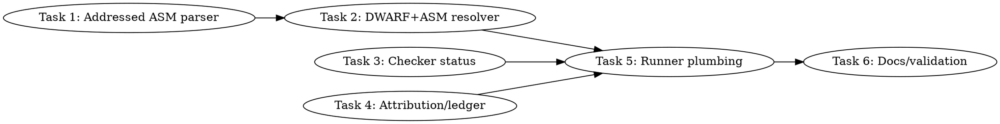

# SYCL Non-VTUNE Source-Line Rows Implementation Plan

> **For Claude:** REQUIRED SUB-SKILL: Use team-driven-development to implement this plan with agent teams.

**Goal:** Add a non-VTUNE path that turns dumped ZEBin DWARF line tables plus EU assembly into exact per-source-line static-cost rows for SYCL kernels, while keeping sampled VTune exact attribution semantically separate.

**Architecture:** The existing DWARF line-table path already proves `Address -> Source Line` mappings from ZEBin debug data. This plan adds an assembly resolver that maps EU instruction addresses to those DWARF rows, aggregates static instruction/opcode cost by source line, and emits checker-compatible `asm-line-static-cost` rows. The existing checker, attribution parser, staged ledger, and source-line runners then accept this stronger non-VTUNE status without relabeling it as sampled `exact_source_line`.

**Tech Stack:** Python 3 stdlib (`argparse`, `csv`, `json`, `bisect`, `dataclasses`), Bash runners, `llvm-dwarfdump --debug-line`, `ocloc disasm -file kernel.zebin`, pytest, existing SYCL source-line scripts.

---

## Team Topology

**Recommended implementers:** 3 concurrent (based on 3 parallel tracks — execution spawns one ephemeral implementer PER TASK)
**Reviewers:** spec + quality, spawned FRESH per review (not a standing pair; see team-driven-development)

### Parallel Tracks

| Track | Tasks | Description |
|-------|-------|-------------|
| A | 1, 2 | Assembly parser extension, then DWARF+ASM source-line resolver |
| B | 3 | Checker status ingestion for `asm-line-static-cost` |
| C | 4 | Attribution parser and strict staged ledger support |
| D | 5, 6 | Runner plumbing, docs, and lead-only validation |

### Dependency Graph



### File Ownership Map

| File/Directory | Tasks | Conflict Risk |
|----------------|-------|---------------|
| `scripts/parse-sycl-vtune-kernel-asm.py` | 1 | None |
| `tests/test-sycl-vtune-asm-parser.py` | 1 | None |
| `scripts/resolve-sycl-zebin-asm-source-lines.py` | 2 | None |
| `tests/test-sycl-zebin-asm-source-line-resolver.py` | 2 | None |
| `scripts/check-sycl-vtune-source-lines.py` | 3 | None |
| `tests/test-sycl-vtune-source-line-checker.py` | 3 | Low: append-only tests near existing DWARF fallback tests |
| `scripts/parse-sycl-source-attribution.py` | 4 | None |
| `scripts/merge-sycl-staged-ledger.py` | 4 | None |
| `tests/test-sycl-source-attribution-parser.py` | 4 | Low: append-only tests near existing DWARF status tests |
| `tests/test-sycl-staged-ledger-merger.py` | 4 | Low: append-only tests near existing DWARF merger tests |
| `scripts/sycl-source-line-debug-matrix.sh` | 5 | Medium: shared shell source-line runner, run after Tasks 2 and 3 |
| `scripts/sycl-vtune-source-line-feasibility.sh` | 5 | Medium: shared shell source-line runner, run after Tasks 2 and 3 |
| `scripts/sycl-gptoss-full-attribution-profile.sh` | 5 | Medium: shared profiling runner |
| `scripts/sycl-gptoss-staged-attribution-profile.sh` | 5 | Medium: shared staged profiling runner |
| `tests/test-sycl-source-line-debug-matrix-script.py` | 5 | Low: source-only string tests |
| `tests/test-sycl-vtune-source-line-feasibility-script.py` | 5 | Low: source-only string tests |
| `tests/test-sycl-full-attribution-profile-script.py` | 5 | Low: source-only string tests |
| `tests/test-sycl-staged-attribution-profile-script.py` | 5 | Low: source-only string tests |
| `docs/backend/SYCL.md` | 6 | Low: append source-line status subsection |
| `activation/sycl-non-vtune-source-line-validation.md` | 6 | None |
| `.codescout/tasks.jsonl` | 6 | Tracker updates only, serialize in lead |

---

## Current-Code Grounding

The plan is grounded in these current files and line ranges:

- `scripts/parse-sycl-zebin-line-table.py:33-38` defines `SourceRow(address, line, column, file_id, file_path)`.
- `scripts/parse-sycl-zebin-line-table.py:80-139` parses `llvm-dwarfdump --debug-line` rows and returns address-bearing `SourceRow` entries.
- `scripts/convert-sycl-zebin-line-table-to-source-csv.py:11-27` defines the existing checker-compatible DWARF CSV fields and `dwarf-line-table` status constants.
- `scripts/check-sycl-vtune-source-lines.py:11-14` defines existing attribution-mode constants.
- `scripts/check-sycl-vtune-source-lines.py:73-86` counts sampled VTune and DWARF line-table rows separately.
- `scripts/check-sycl-vtune-source-lines.py:173-180` chooses `pass` for sampled VTune rows and `dwarf-line-table-only` for explicit fallback rows.
- `scripts/parse-sycl-vtune-kernel-asm.py:13-38` currently counts opcodes and send comments but does not preserve instruction addresses.
- `scripts/parse-sycl-source-attribution.py:106-148` currently maps `source_line.status` to `exact_source_line`, `dwarf_line_table_only`, or source-region fallback.
- `scripts/merge-sycl-staged-ledger.py:84-108` enforces strict consistency between source-line and source-attribution statuses.
- `scripts/sycl-source-line-debug-matrix.sh:201-238` currently dumps ZEBin sections, DWARF lines, DWARF CSV, VTune source CSV, and checker output.
- `scripts/sycl-vtune-source-line-feasibility.sh:121-153` currently handles MXFP4 ZEBin discovery, DWARF CSV, VTune source CSV, and checker output.
- `scripts/sycl-gptoss-full-attribution-profile.sh:116-121` names the source-line matrix artifacts; `scripts/sycl-gptoss-full-attribution-profile.sh:251-267` invokes the checker.
- `scripts/sycl-gptoss-staged-attribution-profile.sh:309-392` selects the best source-line matrix parse.
- Existing tests to mirror: `tests/test-sycl-vtune-asm-parser.py:13-38`, `tests/test-sycl-zebin-line-table-source-csv.py:18-53`, `tests/test-sycl-vtune-source-line-checker.py:336-420`, `tests/test-sycl-source-attribution-parser.py:120-183`, and `tests/test-sycl-staged-ledger-merger.py:169-209`.

## Semantic Contract

This plan adds one new status pair:

```text
Source Attribution Mode   asm-line-static
Source Attribution Status asm_line_static_cost
source_line.status        asm-line-static-cost
source_attribution.status asm_line_static_cost
```

Meaning: assembly instruction addresses were mapped exactly to ZEBin DWARF source rows and aggregated by source line. This is exact static instruction/source evidence, not sampled runtime time. It must not be called `pass`, `vtune-sampled-exact`, or `exact_source_line`.

Status precedence in the checker after this plan:

1. `pass` if sampled VTune rows exist for the target kernel.
2. `asm-line-static-cost` if allowed and ASM-resolved rows exist for the target kernel.
3. `dwarf-line-table-only` if allowed and DWARF-only rows exist for the target kernel.
4. `fail` with the existing blocker reasons.

---

### Task 1: Preserve instruction addresses in the ASM parser

**Track:** A
**Depends on:** None

**File scope:**
- Modify: `scripts/parse-sycl-vtune-kernel-asm.py:13-111`
- Modify: `tests/test-sycl-vtune-asm-parser.py:1-90`

**Description:**

Extend the existing assembly parser so it can emit per-instruction rows with instruction addresses, opcodes, raw text, and send comments. This task does not map source lines yet; it only turns address-bearing ocloc or IGA text into structured rows that Task 2 can consume.

**Acceptance Criteria:**

- [ ] Existing opcode-count and bound-classification tests continue to pass.
- [ ] New tests prove address forms `0x40:`, `40:`, `/* 0x58 */`, and `[0x60]` are parsed.
- [ ] CLI flag `--emit-instructions` emits a JSON `instructions` array.
- [ ] Addressless assembly lines still contribute to opcode counts but are omitted from `instructions`.

**Implementation Guide:**

1. **RED: add addressed-instruction tests**

Append this code to `tests/test-sycl-vtune-asm-parser.py` after `test_asm_parser_classifies_send_only_as_memory_bound`:

```python
def test_asm_parser_emits_addressed_instruction_rows() -> None:
    with tempfile.TemporaryDirectory() as tmp_raw:
        asm = pathlib.Path(tmp_raw) / "kernel.asm"
        asm.write_text(
            "\n".join(
                [
                    "0x00000040: dpas.8x8 (16|M0) r28:d null:d r52:b r24.0:b",
                    "00000050: send.ugm (1|M0) r52 r49 null:0 0x0 0x0240F580 // wr:1+0, rd:4; load.ugm.d32x64t.a64",
                    "/* 0x00000058 */ math.exp (1|M0) r1.2<1>:f r1.2<0;1,0>:f",
                    "[0x00000060] add (1|M0) r2:d r3:d r4:d",
                    "send.ugm r5 r6 r7 // wr:2+1, rd:0; store.ugm.d32.a64",
                ]
            )
            + "\n",
            encoding="utf-8",
        )
        data = run_parser("--emit-instructions", "--asm", str(asm))
        assert [row["address"] for row in data["instructions"]] == [64, 80, 88, 96]
        assert [row["address_hex"] for row in data["instructions"]] == ["0x40", "0x50", "0x58", "0x60"]
        assert [row["opcode"] for row in data["instructions"]] == ["dpas.8x8", "send.ugm", "math.exp", "add"]
        assert data["instructions"][1]["send_comment"] == "wr:1+0, rd:4; load.ugm.d32x64t.a64"
        assert data["asm"]["opcodes"]["send.ugm"] == 2
```

Run:

```bash
python3 -m pytest tests/test-sycl-vtune-asm-parser.py::test_asm_parser_emits_addressed_instruction_rows -q
```

Expected RED result:

```text
FAILED tests/test-sycl-vtune-asm-parser.py::test_asm_parser_emits_addressed_instruction_rows
```

The failure should mention missing `instructions`, missing `--emit-instructions`, or absent address parsing.

2. **GREEN: add address parsing support**

Modify `scripts/parse-sycl-vtune-kernel-asm.py` as follows.

Add these imports after the existing imports at `scripts/parse-sycl-vtune-kernel-asm.py:4-8`:

```python
from dataclasses import dataclass
```

Insert this code before the existing `parse_asm` function at `scripts/parse-sycl-vtune-kernel-asm.py:13`:

```python
ADDRESS_PATTERNS = (
    re.compile(r"^\s*(?:0x)?([0-9A-Fa-f]+):\s*(.*)$"),
    re.compile(r"^\s*/\*\s*(?:0x)?([0-9A-Fa-f]+)\s*\*/\s*(.*)$"),
    re.compile(r"^\s*\[\s*(?:0x)?([0-9A-Fa-f]+)\s*\]\s*(.*)$"),
)


@dataclass(frozen=True)
class AsmInstruction:
    address: int
    opcode: str
    text: str
    raw: str
    send_comment: str

    def to_json(self) -> dict[str, Any]:
        return {
            "address": self.address,
            "address_hex": hex(self.address),
            "opcode": self.opcode,
            "text": self.text,
            "raw": self.raw,
            "send_comment": self.send_comment,
        }


def split_address(raw: str) -> tuple[int | None, str]:
    for pattern in ADDRESS_PATTERNS:
        match = pattern.match(raw)
        if match:
            return int(match.group(1), 16), match.group(2).strip()
    return None, raw.strip()


def strip_predicate(text: str) -> str:
    return re.sub(r"^\([^)]*\)\s*", "", text.strip())


def parse_opcode(text: str) -> str | None:
    cleaned = strip_predicate(text)
    match = re.match(r"([A-Za-z][A-Za-z0-9_.]*)", cleaned)
    return match.group(1).lower() if match else None


def extract_send_comment(raw: str) -> str:
    if "//" not in raw:
        return ""
    comment = raw.split("//", 1)[1].strip()
    return comment if comment.startswith("wr:") else ""


def parse_asm_instructions_text(text: str) -> list[AsmInstruction]:
    rows: list[AsmInstruction] = []
    for raw in text.splitlines():
        stripped = raw.strip()
        if not stripped or stripped.startswith("//") or stripped.endswith(":"):
            continue
        address, instruction_text = split_address(raw)
        if address is None:
            continue
        opcode = parse_opcode(instruction_text)
        if opcode is None:
            continue
        rows.append(
            AsmInstruction(
                address=address,
                opcode=opcode,
                text=instruction_text,
                raw=raw.rstrip("\n"),
                send_comment=extract_send_comment(raw),
            )
        )
    return rows
```

Replace the existing body of `parse_asm` at `scripts/parse-sycl-vtune-kernel-asm.py:13-30` with this code:

```python
def parse_asm(path: pathlib.Path) -> dict[str, Any]:
    text = path.read_text(encoding="utf-8", errors="replace")
    opcodes: collections.Counter[str] = collections.Counter()
    send_comments: collections.Counter[str] = collections.Counter()
    for raw in text.splitlines():
        line = raw.strip()
        if not line or line.startswith("//") or line.endswith(":"):
            continue
        _, instruction_text = split_address(raw)
        opcode = parse_opcode(instruction_text)
        if opcode:
            opcodes[opcode] += 1
        send_comment = extract_send_comment(raw)
        if send_comment:
            send_comments[send_comment] += 1
    return {
        "path": str(path),
        "opcodes": dict(sorted(opcodes.items())),
        "send_comments": dict(sorted(send_comments.items())),
    }
```

Add this helper after `parse_asm`:

```python
def parse_asm_instructions(path: pathlib.Path) -> list[AsmInstruction]:
    return parse_asm_instructions_text(path.read_text(encoding="utf-8", errors="replace"))
```

Add this CLI argument near `scripts/parse-sycl-vtune-kernel-asm.py:95-99`:

```python
    parser.add_argument("--emit-instructions", action="store_true", help="emit addressed assembly instruction rows")
```

After the existing `if args.asm:` block has computed `summaries`, add:

```python
        if args.emit_instructions:
            instruction_rows: list[dict[str, Any]] = []
            for path in args.asm:
                instruction_rows.extend(row.to_json() for row in parse_asm_instructions(pathlib.Path(path)))
            output["instructions"] = instruction_rows
```

3. **Run tests**

```bash
python3 -m pytest tests/test-sycl-vtune-asm-parser.py -q
```

Expected GREEN result:

```text
6 passed
```

The exact count can be higher if more tests already exist, but every test in this file must pass.

**Commit:**

```bash
git add scripts/parse-sycl-vtune-kernel-asm.py tests/test-sycl-vtune-asm-parser.py
git commit -m "tools(sycl): preserve addressed EU assembly rows"
```

**Gotchas:**

- `scripts/parse-sycl-vtune-kernel-asm.py` has a hyphenated file name, so tests should keep subprocess execution rather than importing it directly.
- Do not make address prefixes mandatory for existing opcode counts; old fixture lines without addresses must still count.
- Do not run `ocloc`, VTune, GPU binaries, `/Storage`, `/dev/dri`, `lsof`, or `sycl-ls` in this worker task.

---

### Task 2: Add DWARF+ASM source-line static-cost resolver

**Track:** A
**Depends on:** Task 1

**File scope:**
- Create: `scripts/resolve-sycl-zebin-asm-source-lines.py`
- Create: `tests/test-sycl-zebin-asm-source-line-resolver.py`

**Description:**

Create an offline resolver that maps addressed EU assembly instructions onto decoded ZEBin DWARF line-table rows. It emits checker-compatible CSV rows with `Source Attribution Mode=asm-line-static`, static instruction/opcode counts, and deterministic static scores.

**Acceptance Criteria:**

- [ ] Synthetic DWARF and addressed ASM inputs produce one CSV row per mapped source line.
- [ ] Rows include instruction count, DPAS count, send counts, math count, static score, mode, and status.
- [ ] Instructions before the first DWARF row are counted as unmapped and do not produce a row.
- [ ] Missing mapped rows fail closed with return code `2` and no traceback.

**Implementation Guide:**

1. **RED: create resolver tests**

Create `tests/test-sycl-zebin-asm-source-line-resolver.py` with this exact content:

```python
#!/usr/bin/env python3
from __future__ import annotations

import csv
import io
import pathlib
import subprocess
import sys
import tempfile

ROOT = pathlib.Path(__file__).resolve().parents[1]
RESOLVER = ROOT / "scripts" / "resolve-sycl-zebin-asm-source-lines.py"


def run_resolver(*args: str) -> subprocess.CompletedProcess[str]:
    return subprocess.run(
        [sys.executable, str(RESOLVER), *args],
        text=True,
        stdout=subprocess.PIPE,
        stderr=subprocess.STDOUT,
        check=False,
    )


def write_fixture(tmp: pathlib.Path) -> tuple[pathlib.Path, pathlib.Path]:
    dwarf = tmp / "zebin-debug-line.txt"
    dwarf.write_text(
        "\n".join(
            [
                ".debug_line contents:",
                "include_directories[  1] = /Apps/llama.cpp/ggml/src/ggml-sycl",
                "file_names[  1]:",
                "           name: mmvq.cpp",
                "      dir_index: 1",
                "Address            Line   Column File   ISA Discriminator Flags",
                "------------------ ------ ------ ------ --- ------------- -------------",
                "0x0000000000000040  6800     12     1     0             0  is_stmt",
                "0x0000000000000080  6801     20     1     0             0  is_stmt",
                "0x00000000000000c0  6802     28     1     0             0  is_stmt",
            ]
        )
        + "\n",
        encoding="utf-8",
    )
    asm = tmp / "kernel.asm"
    asm.write_text(
        "\n".join(
            [
                "0x00000020: add (1|M0) r0:d r0:d r0:d",
                "0x00000040: dpas.8x8 (16|M0) r28:d null:d r52:b r24.0:b",
                "0x00000050: send.ugm (1|M0) r52 r49 null:0 0x0 0x0240F580 // wr:1+0, rd:4; load.ugm.d32x64t.a64",
                "0x00000080: math.exp (1|M0) r1.2<1>:f r1.2<0;1,0>:f",
                "0x000000c8: send.ugm (1|M0) null r6 r62:1 0x0 0x04000584 // wr:2+1, rd:0; store.ugm.d32.a64",
            ]
        )
        + "\n",
        encoding="utf-8",
    )
    return dwarf, asm


def test_resolver_maps_asm_addresses_to_dwarf_source_lines() -> None:
    with tempfile.TemporaryDirectory() as tmp_raw:
        tmp = pathlib.Path(tmp_raw)
        dwarf, asm = write_fixture(tmp)
        result = run_resolver(
            "--dwarf-line-dump",
            str(dwarf),
            "--asm",
            str(asm),
            "--source-computing-task",
            "mxfp4_pair_glu_xmx_tiled",
        )
        assert result.returncode == 0, result.stdout
        rows = list(csv.DictReader(io.StringIO(result.stdout)))
        assert [row["Source Line"] for row in rows] == [
            "/Apps/llama.cpp/ggml/src/ggml-sycl/mmvq.cpp:6800",
            "/Apps/llama.cpp/ggml/src/ggml-sycl/mmvq.cpp:6802",
            "/Apps/llama.cpp/ggml/src/ggml-sycl/mmvq.cpp:6801",
        ]
        first = rows[0]
        assert first["Source Computing Task"] == "mxfp4_pair_glu_xmx_tiled"
        assert first["Static Instruction Count"] == "2"
        assert first["Static Dpas Count"] == "1"
        assert first["Static Send Ugm Count"] == "1"
        assert first["Static Score"] == "14"
        assert first["Source Attribution Mode"] == "asm-line-static"
        assert first["Source Attribution Status"] == "asm_line_static_cost"


def test_resolver_aggregates_same_file_and_line_across_different_columns() -> None:
    with tempfile.TemporaryDirectory() as tmp_raw:
        tmp = pathlib.Path(tmp_raw)
        dwarf = tmp / "zebin-debug-line.txt"
        dwarf.write_text(
            "\n".join(
                [
                    ".debug_line contents:",
                    "include_directories[  1] = /Apps/llama.cpp/ggml/src/ggml-sycl",
                    "file_names[  1]:",
                    "           name: mmvq.cpp",
                    "      dir_index: 1",
                    "Address            Line   Column File   ISA Discriminator Flags",
                    "0x0000000000000040  6800     12     1     0             0  is_stmt",
                    "0x0000000000000080  6800     44     1     0             0  is_stmt",
                ]
            )
            + "\n",
            encoding="utf-8",
        )
        asm = tmp / "kernel.asm"
        asm.write_text(
            "0x00000040: dpas.8x8 (16|M0) r28:d null:d r52:b r24.0:b\n"
            "0x00000080: math.exp (1|M0) r1.2<1>:f r1.2<0;1,0>:f\n",
            encoding="utf-8",
        )
        result = run_resolver("--dwarf-line-dump", str(dwarf), "--asm", str(asm))
        assert result.returncode == 0, result.stdout
        rows = list(csv.DictReader(io.StringIO(result.stdout)))
        assert len(rows) == 1
        assert rows[0]["Source Line"] == "/Apps/llama.cpp/ggml/src/ggml-sycl/mmvq.cpp:6800"
        assert rows[0]["Column"] == "12"
        assert rows[0]["Static Instruction Count"] == "2"
        assert rows[0]["Static Dpas Count"] == "1"
        assert rows[0]["Static Math Count"] == "1"
        assert rows[0]["Static Score"] == "12"


def test_resolver_writes_output_file_and_summary() -> None:
    with tempfile.TemporaryDirectory() as tmp_raw:
        tmp = pathlib.Path(tmp_raw)
        dwarf, asm = write_fixture(tmp)
        out_csv = tmp / "asm-source-lines.csv"
        summary = tmp / "asm-source-lines.parse"
        result = run_resolver(
            "--dwarf-line-dump",
            str(dwarf),
            "--asm",
            str(asm),
            "--output",
            str(out_csv),
            "--summary-output",
            str(summary),
            "--source-computing-task",
            "mxfp4_pair_glu_xmx_tiled",
            "--require-source-path",
            "mmvq.cpp",
        )
        assert result.returncode == 0, result.stdout
        assert out_csv.read_text(encoding="utf-8").startswith("Source Line,Source File")
        summary_text = summary.read_text(encoding="utf-8")
        assert "asm_source.status ok" in summary_text
        assert "asm_source.mapped_instruction_count 4" in summary_text
        assert "asm_source.unmapped_instruction_count 1" in summary_text
        assert "asm_source.source_line_rows 3" in summary_text
        assert "asm_source.top_source_line /Apps/llama.cpp/ggml/src/ggml-sycl/mmvq.cpp:6800" in summary_text
        assert "asm_source.top_static_score 14" in summary_text


def test_resolver_fails_closed_when_no_instructions_map() -> None:
    with tempfile.TemporaryDirectory() as tmp_raw:
        tmp = pathlib.Path(tmp_raw)
        dwarf, _ = write_fixture(tmp)
        asm = tmp / "kernel.asm"
        asm.write_text("0x00000010: dpas.8x8 r1:d null:d r2:b r3:b\n", encoding="utf-8")
        result = run_resolver("--dwarf-line-dump", str(dwarf), "--asm", str(asm))
        assert result.returncode == 2
        assert "failed to resolve ZEBin ASM source lines: no assembly instructions mapped to source rows" in result.stdout
        assert "Traceback" not in result.stdout
```

Run:

```bash
python3 -m pytest tests/test-sycl-zebin-asm-source-line-resolver.py -q
```

Expected RED result:

```text
FAILED tests/test-sycl-zebin-asm-source-line-resolver.py::test_resolver_maps_asm_addresses_to_dwarf_source_lines
```

2. **GREEN: create resolver script**

Create `scripts/resolve-sycl-zebin-asm-source-lines.py` with this exact content:

```python
#!/usr/bin/env python3
from __future__ import annotations

import argparse
import bisect
import contextlib
import csv
import importlib.util
import pathlib
import posixpath
import sys
from collections import defaultdict
from collections.abc import Iterator
from dataclasses import dataclass
from typing import Any, TextIO

CSV_FIELDS = [
    "Source Line",
    "Source File",
    "Source File Path",
    "Source Computing Task",
    "Address",
    "Line",
    "Column",
    "Static Instruction Count",
    "Static Dpas Count",
    "Static Send Ugm Count",
    "Static Send Count",
    "Static Math Count",
    "Static Score",
    "Source Attribution Mode",
    "Source Attribution Status",
]

ATTRIBUTION_MODE = "asm-line-static"
ATTRIBUTION_STATUS = "asm_line_static_cost"


class ResolveError(ValueError):
    pass


@dataclass
class LineAggregate:
    file_path: str
    line: int
    column: int
    address: int
    instruction_count: int = 0
    dpas_count: int = 0
    send_ugm_count: int = 0
    send_count: int = 0
    math_count: int = 0

    def score(self) -> int:
        return self.instruction_count + self.dpas_count * 8 + self.send_ugm_count * 4 + self.math_count * 2


def load_module(module_name: str, file_name: str) -> Any:
    path = pathlib.Path(__file__).resolve().with_name(file_name)
    spec = importlib.util.spec_from_file_location(module_name, path)
    if spec is None or spec.loader is None:
        raise ResolveError(f"failed to load helper module: {path}")
    module = importlib.util.module_from_spec(spec)
    sys.modules[spec.name] = module
    spec.loader.exec_module(module)
    return module


def source_file_name(path: str) -> str:
    return posixpath.basename(path.rstrip("/"))


def parse_hex_address(raw: str) -> int:
    return int(raw, 16)


def load_source_rows(dwarf_line_dump: pathlib.Path) -> list[Any]:
    module = load_module("parse_sycl_zebin_line_table", "parse-sycl-zebin-line-table.py")
    try:
        rows = module.parse_line_table_rows(dwarf_line_dump.read_text(encoding="utf-8", errors="replace"))
    except Exception as exc:
        line_table_error = getattr(module, "LineTableError", None)
        if isinstance(line_table_error, type) and isinstance(exc, line_table_error):
            raise ResolveError(str(exc)) from None
        raise
    return sorted(rows, key=lambda row: parse_hex_address(row.address))


def load_instructions(asm_path: pathlib.Path) -> list[Any]:
    module = load_module("parse_sycl_vtune_kernel_asm", "parse-sycl-vtune-kernel-asm.py")
    return sorted(module.parse_asm_instructions(asm_path), key=lambda row: row.address)


def path_matches(path: str, required_path: str) -> bool:
    if not required_path:
        return True
    candidate = posixpath.normpath(path.strip())
    required = posixpath.normpath(required_path.strip())
    if required.startswith("/"):
        return candidate == required
    return candidate == required or candidate.endswith("/" + required)


def aggregate_rows(source_rows: list[Any], instructions: list[Any], require_source_path: str) -> tuple[list[LineAggregate], int, int]:
    addresses = [parse_hex_address(row.address) for row in source_rows]
    aggregates: dict[tuple[str, int], LineAggregate] = {}
    mapped = 0
    unmapped = 0
    for instruction in instructions:
        index = bisect.bisect_right(addresses, instruction.address) - 1
        if index < 0:
            unmapped += 1
            continue
        source_row = source_rows[index]
        if require_source_path and not path_matches(source_row.file_path, require_source_path):
            unmapped += 1
            continue
        source_address = parse_hex_address(source_row.address)
        source_column = int(source_row.column)
        key = (source_row.file_path, int(source_row.line))
        aggregate = aggregates.get(key)
        if aggregate is None:
            aggregate = LineAggregate(
                file_path=source_row.file_path,
                line=int(source_row.line),
                column=source_column,
                address=source_address,
            )
            aggregates[key] = aggregate
        else:
            aggregate.column = min(aggregate.column, source_column)
            aggregate.address = min(aggregate.address, source_address)
        aggregate.instruction_count += 1
        if instruction.opcode.startswith("dpas"):
            aggregate.dpas_count += 1
        if instruction.opcode.startswith("send"):
            aggregate.send_count += 1
        if instruction.opcode == "send.ugm":
            aggregate.send_ugm_count += 1
        if instruction.opcode.startswith("math."):
            aggregate.math_count += 1
        mapped += 1
    rows = sorted(aggregates.values(), key=lambda row: (-row.score(), row.file_path, row.line, row.column))
    return rows, mapped, unmapped


@contextlib.contextmanager
def open_output(output_path: pathlib.Path | None) -> Iterator[TextIO]:
    if output_path is None:
        yield sys.stdout
        return
    with output_path.open("w", encoding="utf-8", newline="") as handle:
        yield handle


def write_csv(rows: list[LineAggregate], output_path: pathlib.Path | None, source_computing_task: str) -> None:
    with open_output(output_path) as handle:
        writer = csv.DictWriter(handle, fieldnames=CSV_FIELDS)
        writer.writeheader()
        for row in rows:
            writer.writerow(
                {
                    "Source Line": f"{row.file_path}:{row.line}",
                    "Source File": source_file_name(row.file_path),
                    "Source File Path": row.file_path,
                    "Source Computing Task": source_computing_task,
                    "Address": hex(row.address),
                    "Line": str(row.line),
                    "Column": str(row.column),
                    "Static Instruction Count": str(row.instruction_count),
                    "Static Dpas Count": str(row.dpas_count),
                    "Static Send Ugm Count": str(row.send_ugm_count),
                    "Static Send Count": str(row.send_count),
                    "Static Math Count": str(row.math_count),
                    "Static Score": str(row.score()),
                    "Source Attribution Mode": ATTRIBUTION_MODE,
                    "Source Attribution Status": ATTRIBUTION_STATUS,
                }
            )


def write_summary(rows: list[LineAggregate], summary_output: pathlib.Path | None, mapped: int, unmapped: int) -> None:
    if summary_output is None:
        return
    top = rows[0]
    summary_output.write_text(
        "\n".join(
            [
                "asm_source.status ok",
                f"asm_source.mapped_instruction_count {mapped}",
                f"asm_source.unmapped_instruction_count {unmapped}",
                f"asm_source.source_line_rows {len(rows)}",
                f"asm_source.top_source_line {top.file_path}:{top.line}",
                f"asm_source.top_static_score {top.score()}",
                f"asm_source.top_instruction_count {top.instruction_count}",
            ]
        )
        + "\n",
        encoding="utf-8",
    )


def main(argv: list[str] | None = None) -> int:
    parser = argparse.ArgumentParser(description="Resolve ZEBin assembly instructions to DWARF source-line static-cost rows.")
    parser.add_argument("--dwarf-line-dump", required=True, type=pathlib.Path)
    parser.add_argument("--asm", required=True, type=pathlib.Path)
    parser.add_argument("--output", type=pathlib.Path, help="CSV output path; defaults to stdout")
    parser.add_argument("--summary-output", type=pathlib.Path, help="optional parse-style summary output")
    parser.add_argument("--source-computing-task", default="")
    parser.add_argument("--require-source-path", default="")
    args = parser.parse_args(argv)

    try:
        source_rows = load_source_rows(args.dwarf_line_dump)
        instructions = load_instructions(args.asm)
        rows, mapped, unmapped = aggregate_rows(source_rows, instructions, args.require_source_path)
        if not rows:
            raise ResolveError("no assembly instructions mapped to source rows")
        write_csv(rows, args.output, args.source_computing_task)
        write_summary(rows, args.summary_output, mapped, unmapped)
    except (OSError, UnicodeDecodeError, ResolveError) as exc:
        print(f"failed to resolve ZEBin ASM source lines: {exc}")
        return 2
    return 0


if __name__ == "__main__":
    raise SystemExit(main())
```

Make the script executable:

```bash
chmod +x scripts/resolve-sycl-zebin-asm-source-lines.py
```

3. **Run tests**

```bash
python3 -m pytest tests/test-sycl-vtune-asm-parser.py tests/test-sycl-zebin-asm-source-line-resolver.py -q
```

Expected GREEN result:

```text
9 passed
```

The exact count can be higher if the ASM parser test file already has additional tests, but both files must pass.

**Commit:**

```bash
git add scripts/resolve-sycl-zebin-asm-source-lines.py tests/test-sycl-zebin-asm-source-line-resolver.py
git commit -m "tools(sycl): resolve ZEBin assembly to source-line static costs"
```

**Gotchas:**

- The resolver maps instruction addresses to the nearest preceding DWARF line-table address. That matches standard line-table program semantics and must be documented in the script description.
- The static score is intentionally simple and deterministic: `instruction_count + dpas_count * 8 + send_ugm_count * 4 + math_count * 2`.
- This task is source-only. Do not run `ocloc`, VTune, GPU binaries, `/Storage`, `/dev/dri`, `lsof`, or `sycl-ls`.

---

### Task 3: Teach the checker `asm-line-static-cost`

**Track:** B
**Depends on:** None

**File scope:**
- Modify: `scripts/check-sycl-vtune-source-lines.py:11-204`
- Modify: `tests/test-sycl-vtune-source-line-checker.py:336-420`

**Description:**

Extend the source-line checker so it can accept ASM-resolved static-cost rows as a stronger non-VTUNE fallback than DWARF-only line-table rows. The checker must keep exact VTune sampled `pass` separate from `asm-line-static-cost`.

**Acceptance Criteria:**

- [ ] `--asm-source-lines-csv` plus `--allow-asm-line-static-cost` yields `source_line.status asm-line-static-cost` when matching ASM rows exist.
- [ ] ASM rows do not increment `source_line.non_unknown_rows` or `source_line.vtune_sampled_non_unknown_rows`.
- [ ] Without explicit `--allow-asm-line-static-cost`, matching ASM rows do not pass.
- [ ] If both ASM and DWARF rows are allowed, ASM status wins over `dwarf-line-table-only`.

**Implementation Guide:**

1. **RED: append checker tests**

Append these tests after `test_checker_requires_explicit_allow_for_dwarf_line_table_only_csv` in `tests/test-sycl-vtune-source-line-checker.py`:

```python
def test_checker_allows_asm_line_static_cost_with_explicit_flag() -> None:
    with tempfile.TemporaryDirectory() as tmp_raw:
        tmp = pathlib.Path(tmp_raw)
        sections = tmp / "sections.txt"
        asm_csv = tmp / "asm-source.csv"
        sections.write_text("[12] .debug_line PROGBITS\n", encoding="utf-8")
        asm_csv.write_text(
            "Source Line,Source File,Source File Path,Source Computing Task,Static Instruction Count,Static Score,Source Attribution Mode,Source Attribution Status\n"
            "/Apps/llama.cpp/ggml/src/ggml-sycl/mmvq.cpp:6800,mmvq.cpp,/Apps/llama.cpp/ggml/src/ggml-sycl/mmvq.cpp,mxfp4_pair_glu_xmx_tiled,2,14,asm-line-static,asm_line_static_cost\n",
            encoding="utf-8",
        )
        result = subprocess.run(
            [
                sys.executable,
                str(CHECKER),
                "--readelf-sections",
                str(sections),
                "--asm-source-lines-csv",
                str(asm_csv),
                "--allow-asm-line-static-cost",
                "--require-kernel",
                "mxfp4_pair_glu_xmx_tiled",
            ],
            text=True,
            stdout=subprocess.PIPE,
            stderr=subprocess.STDOUT,
            check=False,
        )
        assert result.returncode == 0, result.stdout
        assert "source_line.non_unknown_rows 0" in result.stdout
        assert "source_line.vtune_sampled_non_unknown_rows 0" in result.stdout
        assert "source_line.asm_source_line_rows 1" in result.stdout
        assert "source_line.allow_asm_line_static_cost 1" in result.stdout
        assert "source_line.asm_top_source_line /Apps/llama.cpp/ggml/src/ggml-sycl/mmvq.cpp:6800" in result.stdout
        assert "source_line.asm_top_static_score 14" in result.stdout
        assert "source_line.source_attribution_mode asm-line-static" in result.stdout
        assert "source_line.blocker none" in result.stdout
        assert "source_line.status asm-line-static-cost" in result.stdout


def test_checker_requires_explicit_allow_for_asm_line_static_cost() -> None:
    with tempfile.TemporaryDirectory() as tmp_raw:
        tmp = pathlib.Path(tmp_raw)
        sections = tmp / "sections.txt"
        vtune_csv = tmp / "vtune-source.csv"
        asm_csv = tmp / "asm-source.csv"
        sections.write_text("[12] .debug_line PROGBITS\n", encoding="utf-8")
        vtune_csv.write_text("Source Line\tSource Computing Task\n[Unknown]\tmxfp4_pair_glu_xmx_tiled\n", encoding="utf-8")
        asm_csv.write_text(
            "Source Line,Source File,Source File Path,Source Computing Task,Static Instruction Count,Static Score,Source Attribution Mode,Source Attribution Status\n"
            "/Apps/llama.cpp/ggml/src/ggml-sycl/mmvq.cpp:6800,mmvq.cpp,/Apps/llama.cpp/ggml/src/ggml-sycl/mmvq.cpp,mxfp4_pair_glu_xmx_tiled,2,14,asm-line-static,asm_line_static_cost\n",
            encoding="utf-8",
        )
        result = run_checker(
            sections,
            vtune_csv,
            "--require-kernel",
            "mxfp4_pair_glu_xmx_tiled",
            "--asm-source-lines-csv",
            str(asm_csv),
        )
        assert result.returncode == 2
        assert "source_line.asm_source_line_rows 1" in result.stdout
        assert "source_line.allow_asm_line_static_cost 0" in result.stdout
        assert "source_line.source_attribution_mode none" in result.stdout
        assert "source_line.status fail" in result.stdout


def test_checker_missing_optional_asm_csv_does_not_block_dwarf_fallback() -> None:
    with tempfile.TemporaryDirectory() as tmp_raw:
        tmp = pathlib.Path(tmp_raw)
        sections = tmp / "sections.txt"
        dwarf_csv = tmp / "dwarf-source.csv"
        missing_asm_csv = tmp / "missing-asm-source.csv"
        sections.write_text("[12] .debug_line PROGBITS\n", encoding="utf-8")
        dwarf_csv.write_text(
            "Source Line,Source File,Source File Path,Source Computing Task,Source Attribution Mode,Source Attribution Status\n"
            "/Apps/llama.cpp/ggml/src/ggml-sycl/mmvq.cpp:6800,mmvq.cpp,/Apps/llama.cpp/ggml/src/ggml-sycl/mmvq.cpp,mxfp4_pair_glu_xmx_tiled,dwarf-line-table,dwarf_line_table_only\n",
            encoding="utf-8",
        )
        result = subprocess.run(
            [
                sys.executable,
                str(CHECKER),
                "--readelf-sections",
                str(sections),
                "--asm-source-lines-csv",
                str(missing_asm_csv),
                "--allow-asm-line-static-cost",
                "--dwarf-source-lines-csv",
                str(dwarf_csv),
                "--allow-dwarf-line-table-only",
                "--require-kernel",
                "mxfp4_pair_glu_xmx_tiled",
            ],
            text=True,
            stdout=subprocess.PIPE,
            stderr=subprocess.STDOUT,
            check=False,
        )
        assert result.returncode == 0, result.stdout
        assert "source_line.asm_source_line_rows 0" in result.stdout
        assert "source_line.dwarf_source_line_rows 1" in result.stdout
        assert "source_line.status dwarf-line-table-only" in result.stdout


def test_checker_prefers_asm_static_cost_over_dwarf_line_table_only() -> None:
    with tempfile.TemporaryDirectory() as tmp_raw:
        tmp = pathlib.Path(tmp_raw)
        sections = tmp / "sections.txt"
        asm_csv = tmp / "asm-source.csv"
        dwarf_csv = tmp / "dwarf-source.csv"
        sections.write_text("[12] .debug_line PROGBITS\n", encoding="utf-8")
        asm_csv.write_text(
            "Source Line,Source File,Source File Path,Source Computing Task,Static Instruction Count,Static Score,Source Attribution Mode,Source Attribution Status\n"
            "/Apps/llama.cpp/ggml/src/ggml-sycl/mmvq.cpp:6800,mmvq.cpp,/Apps/llama.cpp/ggml/src/ggml-sycl/mmvq.cpp,mxfp4_pair_glu_xmx_tiled,2,14,asm-line-static,asm_line_static_cost\n",
            encoding="utf-8",
        )
        dwarf_csv.write_text(
            "Source Line,Source File,Source File Path,Source Computing Task,Source Attribution Mode,Source Attribution Status\n"
            "/Apps/llama.cpp/ggml/src/ggml-sycl/mmvq.cpp:6800,mmvq.cpp,/Apps/llama.cpp/ggml/src/ggml-sycl/mmvq.cpp,mxfp4_pair_glu_xmx_tiled,dwarf-line-table,dwarf_line_table_only\n",
            encoding="utf-8",
        )
        result = subprocess.run(
            [
                sys.executable,
                str(CHECKER),
                "--readelf-sections",
                str(sections),
                "--asm-source-lines-csv",
                str(asm_csv),
                "--allow-asm-line-static-cost",
                "--dwarf-source-lines-csv",
                str(dwarf_csv),
                "--allow-dwarf-line-table-only",
                "--require-kernel",
                "mxfp4_pair_glu_xmx_tiled",
            ],
            text=True,
            stdout=subprocess.PIPE,
            stderr=subprocess.STDOUT,
            check=False,
        )
        assert result.returncode == 0, result.stdout
        assert "source_line.dwarf_source_line_rows 1" in result.stdout
        assert "source_line.asm_source_line_rows 1" in result.stdout
        assert "source_line.source_attribution_mode asm-line-static" in result.stdout
        assert "source_line.status asm-line-static-cost" in result.stdout
        assert "source_line.status dwarf-line-table-only" not in result.stdout
```

Run:

```bash
python3 -m pytest tests/test-sycl-vtune-source-line-checker.py::test_checker_allows_asm_line_static_cost_with_explicit_flag -q
```

Expected RED result:

```text
FAILED tests/test-sycl-vtune-source-line-checker.py::test_checker_allows_asm_line_static_cost_with_explicit_flag
```

2. **GREEN: modify checker**

In `scripts/check-sycl-vtune-source-lines.py`, add constants after `DWARF_ATTRIBUTION_MODE` at line 12:

```python
ASM_ATTRIBUTION_MODE = "asm-line-static"
ASM_ATTRIBUTION_STATUS = "asm_line_static_cost"
```

Add helpers after `row_is_dwarf_line_table` at line 59:

```python
def row_is_asm_line_static(row: dict[str, str]) -> bool:
    return row_attribution_mode(row) == ASM_ATTRIBUTION_MODE or row.get("Source Attribution Status", "").strip() == ASM_ATTRIBUTION_STATUS


def parse_int_field(row: dict[str, str], field: str) -> int:
    raw = row.get(field, "").replace(",", "").strip()
    if not raw:
        return 0
    try:
        return int(raw)
    except ValueError:
        return 0
```

Add count/top helpers after `count_dwarf_line_table_known_rows`:

```python
def asm_line_static_rows(rows: list[dict[str, str]], required_kernel: str | None) -> list[dict[str, str]]:
    return [
        row
        for row in rows
        if row_matches_kernel(row, required_kernel) and row_has_known_source_line(row) and row_is_asm_line_static(row)
    ]


def top_asm_line_static_row(rows: list[dict[str, str]]) -> dict[str, str] | None:
    if not rows:
        return None
    return max(rows, key=lambda row: (parse_int_field(row, "Static Score"), parse_int_field(row, "Static Instruction Count")))
```

Add arguments after `--allow-dwarf-line-table-only`:

```python
    parser.add_argument(
        "--asm-source-lines-csv",
        type=pathlib.Path,
        help="checker-compatible CSV generated from ZEBin DWARF plus assembly instruction addresses",
    )
    parser.add_argument(
        "--allow-asm-line-static-cost",
        action="store_true",
        help="allow ASM-resolved static source-line rows to pass with source_line.status asm-line-static-cost",
    )
```

Replace the existing VTune-required guard at `scripts/check-sycl-vtune-source-lines.py:127-129` with:

```python
    has_allowed_dwarf_only = args.allow_dwarf_line_table_only and args.dwarf_source_lines_csv is not None
    has_allowed_asm_static = args.allow_asm_line_static_cost and args.asm_source_lines_csv is not None
    if args.vtune_csv is None and not (has_allowed_asm_static or has_allowed_dwarf_only):
        print(
            "failed to check source lines: --vtune-csv is required unless an explicitly allowed "
            "--asm-source-lines-csv or --dwarf-source-lines-csv fallback is provided"
        )
        return 2
```

After the existing `dwarf_source_line_rows` block, add:

```python
        asm_rows: list[dict[str, str]] = []
        asm_source_line_rows = 0
        asm_top_row: dict[str, str] | None = None
        if args.asm_source_lines_csv is not None and args.asm_source_lines_csv.is_file() and args.asm_source_lines_csv.stat().st_size > 0:
            asm_rows = asm_line_static_rows(read_source_csv(args.asm_source_lines_csv), args.require_kernel)
            asm_source_line_rows = len(asm_rows)
            asm_top_row = top_asm_line_static_row(asm_rows)
```

This missing-file behavior is intentional: runners may pass `--asm-source-lines-csv` while `ocloc` fails, and the checker must treat the missing optional ASM CSV as zero ASM rows so VTune or DWARF fallback can still decide the status.

In the status selection block after the `elif non_unknown_rows > 0:` branch and before the DWARF branch, add:

```python
    elif args.allow_asm_line_static_cost and asm_source_line_rows > 0:
        blocker = "none"
        status = "asm-line-static-cost"
        source_attribution_mode = ASM_ATTRIBUTION_MODE
```

After the DWARF print block, add:

```python
    if args.asm_source_lines_csv is not None:
        print(f"source_line.asm_source_line_rows {asm_source_line_rows}")
        print(f"source_line.allow_asm_line_static_cost {1 if args.allow_asm_line_static_cost else 0}")
        if asm_top_row is not None:
            print(f"source_line.asm_top_source_line {asm_top_row.get('Source Line', '')}")
            print(f"source_line.asm_top_static_score {parse_int_field(asm_top_row, 'Static Score')}")
            print(f"source_line.asm_top_instruction_count {parse_int_field(asm_top_row, 'Static Instruction Count')}")
```

Update the return status set at the end:

```python
    return 0 if status in {"pass", "asm-line-static-cost", "dwarf-line-table-only"} else 2
```

3. **Run tests**

```bash
python3 -m pytest tests/test-sycl-vtune-source-line-checker.py -q
```

Expected GREEN result:

```text
all tests in tests/test-sycl-vtune-source-line-checker.py pass
```

**Commit:**

```bash
git add scripts/check-sycl-vtune-source-lines.py tests/test-sycl-vtune-source-line-checker.py
git commit -m "tools(sycl): accept ASM static source-line rows"
```

**Gotchas:**

- `source_line.non_unknown_rows` must remain sampled VTune rows only. Do not increment it for ASM rows.
- `asm-line-static-cost` is stronger than `dwarf-line-table-only` but still not sampled exact time.
- Keep malformed CSV failure behavior consistent with existing checker tests.

---

### Task 4: Propagate `asm_line_static_cost` through attribution and staged ledger

**Track:** C
**Depends on:** None

**File scope:**
- Modify: `scripts/parse-sycl-source-attribution.py:106-148`
- Modify: `scripts/merge-sycl-staged-ledger.py:84-108`
- Modify: `tests/test-sycl-source-attribution-parser.py:120-183`
- Modify: `tests/test-sycl-staged-ledger-merger.py:169-209`

**Description:**

Teach downstream parsers that `asm-line-static-cost` is a distinct, non-sampled attribution quality. It should be accepted for strict closure when source-line and attribution statuses match, and rejected if it is mismatched or falsely paired with `pass`.

**Acceptance Criteria:**

- [ ] `parse-sycl-source-attribution.py` maps matching `source_line.status asm-line-static-cost` to `source_attribution.status asm_line_static_cost`.
- [ ] A source-line kernel mismatch falls back to source region or source-region-plus-ablation.
- [ ] `merge-sycl-staged-ledger.py` accepts `asm_line_static_cost` only when `source_line.status asm-line-static-cost`.
- [ ] Existing exact VTune and DWARF semantics remain unchanged.

**Implementation Guide:**

1. **RED: append source attribution tests**

Append this test after `test_source_attribution_accepts_dwarf_line_table_only_as_distinct_status` in `tests/test-sycl-source-attribution-parser.py`:

```python
def test_source_attribution_accepts_asm_line_static_cost_as_distinct_status() -> None:
    with tempfile.TemporaryDirectory() as tmp_raw:
        p = write_common(pathlib.Path(tmp_raw))
        p["source"].write_text(
            "source_line.required_kernel mxfp4.gateup.xmx_tiled_dpas_m2\n"
            "source_line.blocker none\n"
            "source_line.status asm-line-static-cost\n"
            "source_line.asm_top_source_line ggml/src/ggml-sycl/mmvq.cpp:6800\n"
            "source_line.asm_top_static_score 14\n",
            encoding="utf-8",
        )
        result = run_parser(
            "--cost-ranking",
            str(p["cost"]),
            "--source-line",
            str(p["source"]),
            "--region-map",
            str(p["region"]),
        )
        assert result.returncode == 0, result.stdout
        assert "source_attribution.status asm_line_static_cost" in result.stdout
        assert "source_attribution.source_line_status asm-line-static-cost" in result.stdout
        assert "source_attribution.asm_top_source_line ggml/src/ggml-sycl/mmvq.cpp:6800" in result.stdout
        assert "source_attribution.asm_top_static_score 14" in result.stdout
        assert "source_attribution.status exact_source_line" not in result.stdout
```

Append this mismatch test after `test_source_attribution_does_not_claim_dwarf_line_table_when_source_line_kernel_mismatches_top_kernel`:

```python
def test_source_attribution_does_not_claim_asm_static_when_source_line_kernel_mismatches_top_kernel() -> None:
    with tempfile.TemporaryDirectory() as tmp_raw:
        p = write_common(pathlib.Path(tmp_raw))
        p["source"].write_text(
            "source_line.required_kernel sycl_source_line_probe\n"
            "source_line.blocker none\n"
            "source_line.status asm-line-static-cost\n"
            "source_line.asm_top_source_line main.cpp:148\n"
            "source_line.asm_top_static_score 3\n",
            encoding="utf-8",
        )
        result = run_parser(
            "--cost-ranking",
            str(p["cost"]),
            "--source-line",
            str(p["source"]),
            "--region-map",
            str(p["region"]),
        )
        assert result.returncode == 0, result.stdout
        assert "source_attribution.status source_region" in result.stdout
        assert "source_attribution.exact_line_blocker source_line_kernel_mismatch:sycl_source_line_probe" in result.stdout
        assert "source_attribution.status asm_line_static_cost" not in result.stdout
```

Append staged merger tests after `test_staged_merger_accepts_dwarf_line_table_only_when_source_line_matches`:

```python
def test_staged_merger_accepts_asm_line_static_cost_when_source_line_matches() -> None:
    with tempfile.TemporaryDirectory() as tmp_raw:
        paths = write_fixture(pathlib.Path(tmp_raw))
        paths["source_line"].write_text("source_line.status asm-line-static-cost\nsource_line.blocker none\n", encoding="utf-8")
        paths["source_attr"].write_text(
            "source_attribution.status asm_line_static_cost\n"
            "source_attribution.source_line_status asm-line-static-cost\n"
            "source_attribution.kernel mxfp4.gateup.xmx_tiled_dpas_m2\n",
            encoding="utf-8",
        )
        result = run_merger(paths)
        assert result.returncode == 0, result.stdout
        assert "coverage.layer_status ok" in result.stdout
        assert "source_line.status asm-line-static-cost" in result.stdout
        assert "source_attribution.status asm_line_static_cost" in result.stdout


def test_staged_merger_rejects_asm_line_static_cost_when_source_line_mismatches() -> None:
    with tempfile.TemporaryDirectory() as tmp_raw:
        paths = write_fixture(pathlib.Path(tmp_raw))
        paths["source_line"].write_text("source_line.status dwarf-line-table-only\nsource_line.blocker none\n", encoding="utf-8")
        paths["source_attr"].write_text(
            "source_attribution.status asm_line_static_cost\n"
            "source_attribution.source_line_status asm-line-static-cost\n"
            "source_attribution.kernel mxfp4.gateup.xmx_tiled_dpas_m2\n",
            encoding="utf-8",
        )
        result = run_merger(paths)
        assert result.returncode == 2
        assert "coverage.layer_status source_attribution_incomplete" in result.stdout
        assert "ASM static source attribution requires source_line.status asm-line-static-cost" in result.stdout
        assert "Traceback" not in result.stdout
```

Run:

```bash
python3 -m pytest tests/test-sycl-source-attribution-parser.py::test_source_attribution_accepts_asm_line_static_cost_as_distinct_status tests/test-sycl-staged-ledger-merger.py::test_staged_merger_accepts_asm_line_static_cost_when_source_line_matches -q
```

Expected RED result:

```text
FAILED tests/test-sycl-source-attribution-parser.py::test_source_attribution_accepts_asm_line_static_cost_as_distinct_status
FAILED tests/test-sycl-staged-ledger-merger.py::test_staged_merger_accepts_asm_line_static_cost_when_source_line_matches
```

2. **GREEN: modify source attribution parser**

In `scripts/parse-sycl-source-attribution.py`, change the valid status set at line 112 to:

```python
        if source_status not in {"pass", "fail", "asm-line-static-cost", "dwarf-line-table-only"}:
```

After the existing `exact_pass = source_status == "pass" and source_line_matches_top_kernel` assignment, add:

```python
        asm_line_static_cost = source_status == "asm-line-static-cost" and source_line_matches_top_kernel
```

Update the mismatch guard to include the new status:

```python
        if source_status in {"pass", "asm-line-static-cost", "dwarf-line-table-only"} and not source_line_matches_top_kernel:
```

Update the status selection block to:

```python
        if exact_pass:
            status = "exact_source_line"
        elif asm_line_static_cost:
            status = "asm_line_static_cost"
        elif dwarf_line_table_only:
            status = "dwarf_line_table_only"
        else:
            if region is None:
                raise SourceAttributionError(f"missing source-region map entry for top kernel {top_kernel}")
            status = "source_region_plus_ablation" if delta is not None else "source_region"
```

After printing `source_attribution.source_line_kernel`, add:

```python
        if asm_line_static_cost:
            print("source_attribution.source_line_status asm-line-static-cost")
            asm_top_source_line = source_rows.get("source_line.asm_top_source_line", "")
            asm_top_static_score = source_rows.get("source_line.asm_top_static_score", "")
            if asm_top_source_line:
                print(f"source_attribution.asm_top_source_line {asm_top_source_line}")
            if asm_top_static_score:
                print(f"source_attribution.asm_top_static_score {asm_top_static_score}")
```

Change the exact-line blocker guard from:

```python
        if not exact_pass and not dwarf_line_table_only:
```

to:

```python
        if not exact_pass and not asm_line_static_cost and not dwarf_line_table_only:
```

3. **GREEN: modify staged merger**

In `scripts/merge-sycl-staged-ledger.py`, update the valid status set at line 84:

```python
        if status not in {"exact_source_line", "source_region_plus_ablation", "asm_line_static_cost", "dwarf_line_table_only"}:
```

After the exact-source consistency check, add:

```python
        if status == "asm_line_static_cost" and source_line_status != "asm-line-static-cost":
            print("coverage.layer_status source_attribution_incomplete")
            for line in source_line_rows:
                print(line)
            for line in source_attribution_rows:
                print(line)
            print("failed to merge staged ledger: ASM static source attribution requires source_line.status asm-line-static-cost")
            return 2
```

4. **Run tests**

```bash
python3 -m pytest tests/test-sycl-source-attribution-parser.py tests/test-sycl-staged-ledger-merger.py -q
```

Expected GREEN result:

```text
all tests in both files pass
```

**Commit:**

```bash
git add scripts/parse-sycl-source-attribution.py scripts/merge-sycl-staged-ledger.py tests/test-sycl-source-attribution-parser.py tests/test-sycl-staged-ledger-merger.py
git commit -m "tools(sycl): propagate ASM static source-line attribution"
```

**Gotchas:**

- Do not weaken the existing `exact_source_line requires source_line.status pass` guard.
- A source-line kernel mismatch must never produce `asm_line_static_cost`; it must fall back to source-region behavior just like the current DWARF mismatch path.

---

### Task 5: Wire ASM static-cost rows through source-line runners

**Track:** D
**Depends on:** Tasks 2, 3, 4

**File scope:**
- Modify: `scripts/sycl-source-line-debug-matrix.sh:143-153` and `scripts/sycl-source-line-debug-matrix.sh:201-238`
- Modify: `scripts/sycl-vtune-source-line-feasibility.sh:80-153`
- Modify: `scripts/sycl-gptoss-full-attribution-profile.sh:116-121`, `scripts/sycl-gptoss-full-attribution-profile.sh:151-174`, and `scripts/sycl-gptoss-full-attribution-profile.sh:251-267`
- Modify: `scripts/sycl-gptoss-staged-attribution-profile.sh:309-392`
- Modify: `tests/test-sycl-source-line-debug-matrix-script.py`
- Modify: `tests/test-sycl-vtune-source-line-feasibility-script.py`
- Modify: `tests/test-sycl-full-attribution-profile-script.py`
- Modify: `tests/test-sycl-staged-attribution-profile-script.py`

**Description:**

Make the existing source-line runners disassemble dumped ZEBins with `ocloc disasm`, resolve ASM lines to DWARF source rows, pass the resulting `asm-source-lines.csv` into the checker, and prefer `asm-line-static-cost` over `dwarf-line-table-only` when selecting staged source-line evidence.

**Acceptance Criteria:**

- [ ] Dry-runs mention `ocloc disasm`, `asm-source-lines.csv`, `resolve-sycl-zebin-asm-source-lines.py`, `--asm-source-lines-csv`, and `--allow-asm-line-static-cost`.
- [ ] Execute paths are fail-closed: if disassembly or resolver output is missing, checker can still fall back to DWARF-only, but shell scripts must not fabricate ASM status.
- [ ] Staged source-line selection order is `pass`, then `asm-line-static-cost`, then `dwarf-line-table-only`, then existing blockers.
- [ ] Workers run only `bash -n`, pytest, and dry-run commands.

**Implementation Guide:**

1. **RED: add runner string tests**

Update each runner test file with append-only assertions.

For `tests/test-sycl-source-line-debug-matrix-script.py`, add these required dry-run/source strings to the existing dry-run and source text tests:

```python
    assert "ocloc disasm -file kernel.zebin" in result.stdout
    assert "asm-source-lines.csv" in result.stdout
    assert "resolve-sycl-zebin-asm-source-lines.py" in result.stdout
    assert "--asm-source-lines-csv" in result.stdout
    assert "--allow-asm-line-static-cost" in result.stdout
```

For `tests/test-sycl-vtune-source-line-feasibility-script.py`, add equivalent assertions and confirm basename source requirement remains `mmvq.cpp`:

```python
    assert "ocloc disasm -file kernel.zebin" in result.stdout
    assert "asm-source-lines.csv" in result.stdout
    assert "resolve-sycl-zebin-asm-source-lines.py" in result.stdout
    assert "--asm-source-lines-csv" in result.stdout
    assert "--allow-asm-line-static-cost" in result.stdout
    assert "--require-source-path mmvq.cpp" in result.stdout
    assert "source_line.status asm-line-static-cost" in result.stdout
    assert r"\^source_line.status\ \(pass\|asm-line-static-cost\|dwarf-line-table-only\)\$" in result.stdout
```

For `tests/test-sycl-full-attribution-profile-script.py`, append these strings to `REQUIRED_DRY_RUN_STRINGS`:

```python
    "ocloc disasm -file kernel.zebin",
    "asm-source-lines.csv",
    "scripts/resolve-sycl-zebin-asm-source-lines.py",
    "--asm-source-lines-csv",
    "--allow-asm-line-static-cost",
```

For `tests/test-sycl-staged-attribution-profile-script.py`, assert source text contains:

```python
    assert "source_line.status asm-line-static-cost" in result.stdout
    assert "asm-source-lines.csv" in result.stdout
    assert "--allow-asm-line-static-cost" in result.stdout
```

Run:

```bash
python3 -m pytest tests/test-sycl-source-line-debug-matrix-script.py tests/test-sycl-vtune-source-line-feasibility-script.py tests/test-sycl-full-attribution-profile-script.py tests/test-sycl-staged-attribution-profile-script.py -q
```

Expected RED result:

```text
FAILED runner dry-run/source string assertions for ASM static source-line plumbing
```

2. **GREEN: add a shared shell pattern to the matrix runner**

In `scripts/sycl-source-line-debug-matrix.sh`, add dry-run lines after the existing `python3 scripts/convert-sycl-zebin-line-table-to-source-csv.py` dry-run line at `scripts/sycl-source-line-debug-matrix.sh:151`:

```bash
        printf 'mkdir -p %q && cp %q %q && (cd %q && ocloc disasm -file kernel.zebin > ocloc.stdout 2> ocloc.stderr || true)\n' "${dir}/zebin-disasm" "${vtune_dir}/data.0/example.zebin" "${dir}/zebin-disasm/kernel.zebin" "${dir}/zebin-disasm"
        printf 'first_asm="$(find %q -type f -name '\''*.asm'\'' -print -quit)"\n' "${dir}/zebin-disasm"
        printf 'python3 scripts/resolve-sycl-zebin-asm-source-lines.py --dwarf-line-dump %q --asm "${first_asm}" --output %q --summary-output %q --source-computing-task %q --require-source-path %q\n' "${dir}/zebin-debug-line.txt" "${dir}/asm-source-lines.csv" "${dir}/asm-source-lines.parse" "${TARGET_KERNEL}" "main.cpp"
```

Update the checker dry-run command so the printed `python3 scripts/check-sycl-vtune-source-lines.py` line includes these arguments before the DWARF arguments:

```bash
--asm-source-lines-csv %q --allow-asm-line-static-cost
```

The additional `%q` argument must be `${dir}/asm-source-lines.csv`.

In the execute path after DWARF CSV conversion at `scripts/sycl-source-line-debug-matrix.sh:211-219`, add:

```bash
    asm_dir="${dir}/zebin-disasm"
    rm -rf "${asm_dir}"
    mkdir -p "${asm_dir}"
    cp "${first_zebin}" "${asm_dir}/kernel.zebin"
    if ! (cd "${asm_dir}" && ocloc disasm -file kernel.zebin >ocloc.stdout 2>ocloc.stderr); then
        printf 'warning: ocloc disasm failed for matrix row %s; checker will use VTune/DWARF evidence if available\n' "${name}" >>"${dir}/probe.stderr"
    fi
    first_asm="$(find "${asm_dir}" -type f -name '*.asm' -print -quit)"
    rm -f "${dir}/asm-source-lines.csv" "${dir}/asm-source-lines.parse"
    if [[ -n "${first_asm}" ]]; then
        if ! python3 scripts/resolve-sycl-zebin-asm-source-lines.py \
            --dwarf-line-dump "${dir}/zebin-debug-line.txt" \
            --asm "${first_asm}" \
            --output "${dir}/asm-source-lines.csv" \
            --summary-output "${dir}/asm-source-lines.parse" \
            --source-computing-task "${TARGET_KERNEL}" \
            --require-source-path "main.cpp"; then
            printf 'warning: ASM source-line resolver failed for matrix row %s; checker will use VTune/DWARF evidence if available\n' "${name}" >>"${dir}/probe.stderr"
        fi
    else
        printf 'warning: no .asm file found after ocloc disasm for matrix row %s\n' "${name}" >>"${dir}/probe.stderr"
    fi
```

Update the checker execute invocation to include these arguments before the DWARF arguments:

```bash
        --asm-source-lines-csv "${dir}/asm-source-lines.csv" \
        --allow-asm-line-static-cost \
```

3. **GREEN: add the same pattern to MXFP4 feasibility**

In `scripts/sycl-vtune-source-line-feasibility.sh`, mirror the matrix runner using `OUT_ROOT` instead of `dir`, `vtune_dir` instead of row-specific VTune dir, and `--require-source-path "mmvq.cpp"`.

The execute path must create:

```text
${OUT_ROOT}/zebin-disasm/kernel.zebin
${OUT_ROOT}/zebin-disasm/ocloc.stdout
${OUT_ROOT}/zebin-disasm/ocloc.stderr
${OUT_ROOT}/asm-source-lines.csv
${OUT_ROOT}/asm-source-lines.parse
```

The checker call must include:

```bash
    --asm-source-lines-csv "${OUT_ROOT}/asm-source-lines.csv" \
    --allow-asm-line-static-cost \
```

Also update the matrix-pass gate in `scripts/sycl-vtune-source-line-feasibility.sh`:

- Dry-run text must say `source_line.status pass (VTune sampled exact), source_line.status asm-line-static-cost (ASM static source-line cost), or source_line.status dwarf-line-table-only (DWARF line-table fallback)`.
- The dry-run grep print and execute guard must use exactly:

```bash
^source_line.status (pass|asm-line-static-cost|dwarf-line-table-only)$
```

4. **GREEN: update full/staged runners**

In `scripts/sycl-gptoss-full-attribution-profile.sh`, add variables after `source_line_dwarf_csv` at `scripts/sycl-gptoss-full-attribution-profile.sh:119`:

```bash
source_line_asm_csv=${source_line_case}/asm-source-lines.csv
source_line_asm_summary=${source_line_case}/asm-source-lines.parse
```

Update the printed checker command and execute checker command to pass:

```bash
--asm-source-lines-csv "${source_line_asm_csv}" \
--allow-asm-line-static-cost \
```

Update `print_parse_plan` in `scripts/sycl-gptoss-full-attribution-profile.sh` so dry-run output also includes these two comment lines immediately after the existing `# source-line matrix conversion` comment:

```bash
    printf '# source-line matrix disasm: mkdir -p %q && cp %q %q && (cd %q && ocloc disasm -file kernel.zebin > ocloc.stdout 2> ocloc.stderr || true)\n' "${source_line_case}/zebin-disasm" "${source_line_case}/example.zebin" "${source_line_case}/zebin-disasm/kernel.zebin" "${source_line_case}/zebin-disasm"
    printf '# source-line matrix ASM selection: first_asm="$(find %q -type f -name '\''*.asm'\'' -print -quit)"\n' "${source_line_case}/zebin-disasm"
    printf '# source-line matrix ASM resolver: python3 %q --dwarf-line-dump %q --asm "${first_asm}" --output %q --summary-output %q --source-computing-task %q\n' "scripts/resolve-sycl-zebin-asm-source-lines.py" "${source_line_dwarf_dump}" "${source_line_asm_csv}" "${source_line_asm_summary}" "${source_line_probe_kernel}"
```

In `scripts/sycl-gptoss-staged-attribution-profile.sh`, update the dry-run artifact/checker lines near `scripts/sycl-gptoss-staged-attribution-profile.sh:315-323` by adding:

```bash
        printf '#   matrix outputs: %s/source-line-matrix/build-matrix/debug_full/asm-source-lines.csv\n' "${root}"
        printf '#   matrix disasm: mkdir -p %s/source-line-matrix/build-matrix/debug_full/zebin-disasm && ocloc disasm -file kernel.zebin\n' "${root}"
        printf '#   matrix ASM selection: first_asm="$(find %s/source-line-matrix/build-matrix/debug_full/zebin-disasm -type f -name '\''*.asm'\'' -print -quit)"\n' "${root}"
        printf '#   matrix ASM resolver: python3 %q --dwarf-line-dump %q --asm "${first_asm}" --output %q --summary-output %q --source-computing-task %q; checker later applies --allow-asm-line-static-cost\n' "scripts/resolve-sycl-zebin-asm-source-lines.py" "${root}/source-line-matrix/build-matrix/debug_full/zebin-debug-line.txt" "${root}/source-line-matrix/build-matrix/debug_full/asm-source-lines.csv" "${root}/source-line-matrix/build-matrix/debug_full/asm-source-lines.parse" "sycl_source_line_probe"
        printf '#   matrix checker: python3 %q --asm-source-lines-csv %q --allow-asm-line-static-cost --dwarf-source-lines-csv %q --allow-dwarf-line-table-only\n' "scripts/check-sycl-vtune-source-lines.py" "${root}/source-line-matrix/build-matrix/debug_full/asm-source-lines.csv" "${root}/source-line-matrix/build-matrix/debug_full/dwarf-source-lines.csv"
```

Then update the dry-run selection text at `scripts/sycl-gptoss-staged-attribution-profile.sh:323` to:

```bash
        printf '#   selection: prefer source_line.status pass (VTune sampled exact); else source_line.status asm-line-static-cost (ASM static source-line cost); else source_line.status dwarf-line-table-only (DWARF line-table fallback); else source_line.blocker vtune_no_gpu_side_trace or vtune_unknown_source; else first source-line-feasibility.parse\n'
```

In the execute selection variables after `local dwarf_line_table_parse=""`, add:

```bash
    local asm_line_static_parse=""
```

In the selection loop before the DWARF branch, add:

```bash
        if [[ -z "${asm_line_static_parse}" ]] && grep -qx 'source_line.status asm-line-static-cost' "${parse}"; then
            asm_line_static_parse="${parse}"
        fi
```

In the fallback selection before DWARF, add:

```bash
        if [[ -n "${asm_line_static_parse}" ]]; then
            selected_parse="${asm_line_static_parse}"
        elif [[ -n "${dwarf_line_table_parse}" ]]; then
```

5. **Run tests and syntax gates**

```bash
bash -n scripts/sycl-source-line-debug-matrix.sh scripts/sycl-vtune-source-line-feasibility.sh scripts/sycl-gptoss-full-attribution-profile.sh scripts/sycl-gptoss-staged-attribution-profile.sh
python3 -m pytest \
  tests/test-sycl-source-line-debug-matrix-script.py \
  tests/test-sycl-vtune-source-line-feasibility-script.py \
  tests/test-sycl-full-attribution-profile-script.py \
  tests/test-sycl-staged-attribution-profile-script.py -q
```

Expected GREEN result:

```text
bash -n exits 0
all runner source-only tests pass
```

**Commit:**

```bash
git add \
  scripts/sycl-source-line-debug-matrix.sh \
  scripts/sycl-vtune-source-line-feasibility.sh \
  scripts/sycl-gptoss-full-attribution-profile.sh \
  scripts/sycl-gptoss-staged-attribution-profile.sh \
  tests/test-sycl-source-line-debug-matrix-script.py \
  tests/test-sycl-vtune-source-line-feasibility-script.py \
  tests/test-sycl-full-attribution-profile-script.py \
  tests/test-sycl-staged-attribution-profile-script.py
git commit -m "tools(sycl): wire ASM static source-line rows through runners"
```

**Gotchas:**

- Keep every runner dry-run by default.
- Worker agents must not run execute paths, `ocloc`, VTune, GPU commands, model commands, `/Storage`, `sycl-ls`, DRM probes, or `lsof`.
- `ocloc disasm` is allowed only in the final lead-owned validation task.
- If `ocloc` fails, write a warning and let checker fall back to VTune/DWARF evidence. Do not create fake `asm-source-lines.csv` rows.

---

### Task 6: Document semantics and run lead-only validation

**Track:** D
**Depends on:** Task 5

**File scope:**
- Modify: `docs/backend/SYCL.md`
- Create: `activation/sycl-non-vtune-source-line-validation.md`
- Modify: `.codescout/tasks.jsonl` through tracker commands only

**Description:**

Document the new source-line statuses and run the lead-only validation that confirms whether real ocloc output can produce `asm-line-static-cost` rows on this workstation. This is the only task allowed to run real oneAPI, `ocloc`, source-line probe execution, or MXFP4 source-line feasibility.

**Acceptance Criteria:**

- [ ] Safe source-only suite passes.
- [ ] Lead-only probe matrix is run after sourcing oneAPI with `set +u` and `set -u`.
- [ ] Lead-only MXFP4 feasibility is run only if the probe matrix produces `source_line.status pass`, `source_line.status asm-line-static-cost`, or `source_line.status dwarf-line-table-only`.
- [ ] Validation report records exact artifact roots, commands, checker output, and residual limitations.
- [ ] Tracker issue `llama.cpp-040b` is updated with the validation outcome.

**Implementation Guide:**

1. **RED: docs test**

Create or modify `tests/test-sycl-vtune-source-line-enablement-docs.py` to assert the docs mention the new status. Append this test:

```python
def test_sycl_docs_describe_asm_line_static_cost_status() -> None:
    text = (ROOT / "docs" / "backend" / "SYCL.md").read_text(encoding="utf-8")
    assert "asm-line-static-cost" in text
    assert "asm-line-static" in text
    assert "not sampled VTune exact" in text
    assert "dwarf-line-table-only" in text
```

Run:

```bash
python3 -m pytest tests/test-sycl-vtune-source-line-enablement-docs.py::test_sycl_docs_describe_asm_line_static_cost_status -q
```

Expected RED result:

```text
FAILED tests/test-sycl-vtune-source-line-enablement-docs.py::test_sycl_docs_describe_asm_line_static_cost_status
```

2. **GREEN: update docs**

Append this subsection to `docs/backend/SYCL.md` near the existing source-line enablement and profiling notes:

```markdown
### Non-VTUNE source-line row statuses

The SYCL source-line tooling distinguishes three levels of source evidence:

- `source_line.status pass`: VTune sampled GPU source-line rows were present for the target kernel. This is the only status that may become `source_attribution.status exact_source_line`.
- `source_line.status asm-line-static-cost`: ZEBin DWARF line-table rows were joined with EU assembly instruction addresses and aggregated by source line. This provides exact static source-line cost rows, but it is not sampled VTune exact timing.
- `source_line.status dwarf-line-table-only`: ZEBin DWARF line-table rows were decoded for the target kernel, but no assembly or sampled source-line cost evidence was available.

When VTune/GTPin cannot provide `gpu-source-line` rows on BMG/B50, prefer `asm-line-static-cost` for line-ranked optimization work and keep `pass` reserved for sampled VTune rows.
```

3. **Run safe gates**

```bash
bash -n scripts/sycl-source-line-debug-matrix.sh scripts/sycl-vtune-source-line-feasibility.sh scripts/sycl-gptoss-full-attribution-profile.sh scripts/sycl-gptoss-staged-attribution-profile.sh
python3 -m pytest \
  tests/test-sycl-vtune-asm-parser.py \
  tests/test-sycl-zebin-asm-source-line-resolver.py \
  tests/test-sycl-vtune-source-line-checker.py \
  tests/test-sycl-source-attribution-parser.py \
  tests/test-sycl-staged-ledger-merger.py \
  tests/test-sycl-source-line-debug-matrix-script.py \
  tests/test-sycl-vtune-source-line-feasibility-script.py \
  tests/test-sycl-full-attribution-profile-script.py \
  tests/test-sycl-staged-attribution-profile-script.py \
  tests/test-sycl-vtune-source-line-enablement-docs.py -q
```

Expected GREEN result:

```text
all listed tests pass
```

4. **Lead-only probe matrix validation**

Only the lead runs this command:

```bash
OUT=/tmp/sycl_source_line_asm_matrix_$(date +%Y%m%d_%H%M%S)
set +u
source /opt/intel/oneapi/setvars.sh --force
set -u
scripts/sycl-source-line-debug-matrix.sh \
  --execute \
  --i-understand-this-runs-gpu-source-probe \
  --out-root "$OUT" \
  --device-selector level_zero:1 \
  --vtune-target-gpu 0:7:0.0
printf '%s\n' "$OUT"
```

Expected useful outcomes, in descending quality:

```text
source_line.status pass
source_line.status asm-line-static-cost
source_line.status dwarf-line-table-only
```

Select the best matrix parse before MXFP4 validation with this exact lead-only shell snippet:

```bash
MATRIX_PARSE=""
for status in pass asm-line-static-cost dwarf-line-table-only; do
  MATRIX_PARSE="$(grep -Rxl "source_line.status ${status}" "$OUT/build-matrix"/*/source-line-feasibility.parse | head -n 1 || true)"
  if [[ -n "$MATRIX_PARSE" ]]; then
    break
  fi
done
if [[ -z "$MATRIX_PARSE" ]]; then
  echo "error: no accepted source-line matrix row found" >&2
  exit 2
fi
printf 'selected matrix parse: %s\n' "$MATRIX_PARSE"
```

If the best row is `asm-line-static-cost`, record the row including:

```text
source_line.asm_source_line_rows 1
source_line.asm_top_source_line main.cpp:148
source_line.asm_top_static_score 3
```

5. **Lead-only MXFP4 feasibility validation**

Only the lead runs this command, and only after a matrix row has one of the accepted statuses above:

```bash
OUT=/tmp/sycl_mxfp4_asm_source_line_$(date +%Y%m%d_%H%M%S)
BUILD=/tmp/sycl_mxfp4_asm_source_line_build_$(date +%Y%m%d_%H%M%S)
set +u
source /opt/intel/oneapi/setvars.sh --force
set -u
scripts/sycl-vtune-source-line-feasibility.sh \
  --execute \
  --i-understand-this-runs-gpu-microbenchmarks \
  --out-root "$OUT" \
  --build-dir "$BUILD" \
  --device-selector level_zero:1 \
  --vtune-target-gpu 0:7:0.0 \
  --require-matrix-pass "$MATRIX_PARSE"
printf '%s\n%s\n' "$OUT" "$BUILD"
```

Expected best outcome:

```text
source_line.status asm-line-static-cost
source_line.source_attribution_mode asm-line-static
source_line.asm_source_line_rows 1
source_line.asm_top_source_line mmvq.cpp:6800
source_line.asm_top_static_score 14
```

If real `ocloc disasm` output lacks address prefixes, the expected outcome is still `dwarf-line-table-only`; in that case the report must say `asm-line-static-cost blocked: disassembly address format unavailable` and include the `ocloc.stderr` path.

6. **Write validation report**

Create `activation/sycl-non-vtune-source-line-validation.md` with this structure:

````markdown
# SYCL Non-VTUNE Source-Line Rows Validation

Date: 2026-07-05
Branch: `feature/sycl-mxfp4-tg-runtime`
Tracker: `llama.cpp-040b`

## Safe gates

Record the exact safe-gate commands from this task and paste their pass output.

## Probe matrix

Record the probe matrix root path, the selected matrix row name, and paste the full selected `source-line-feasibility.parse` contents in a fenced `text` block.

## MXFP4 feasibility

Record the MXFP4 root path, the build root path, and paste the full `source-line-feasibility.parse` contents in a fenced `text` block.

## Interpretation

- `pass` means sampled VTune exact source-line rows.
- `asm-line-static-cost` means exact static source-line rows from DWARF plus assembly addresses.
- `dwarf-line-table-only` means line-table coverage without instruction-level or sampled cost rows.

## Follow-up

State whether TG optimization can use ASM static rows now, or whether real disassembly format requires a separate disassembler adapter.
````

7. **Update tracker and commit**

Use tracker tools, not direct JSON edits, to add a comment or close `llama.cpp-040b` depending on the validation outcome.

If `asm-line-static-cost` validates on MXFP4, close `llama.cpp-040b` with:

```text
Resolved: non-VTUNE ASM static source-line rows validated. See activation/sycl-non-vtune-source-line-validation.md.
```

If only `dwarf-line-table-only` validates, leave `llama.cpp-040b` open and add a comment with the blocker. Then commit:

```bash
git add docs/backend/SYCL.md activation/sycl-non-vtune-source-line-validation.md .codescout/tasks.jsonl tests/test-sycl-vtune-source-line-enablement-docs.py
git commit -m "docs(sycl): validate non-VTUNE source-line row workflow"
```

**Gotchas:**

- This is the only task allowed to run GPU/profiler/disassembler commands.
- Always source oneAPI as:

```bash
set +u
source /opt/intel/oneapi/setvars.sh --force
set -u
```

- Do not run `sycl-ls`, `/dev/dri` probes, `lsof`, P2P probes, or unrelated model gates.
- Do not relabel `asm-line-static-cost` as `exact_source_line`. The report must preserve the semantic distinction.

---

## Final Cross-Task Validation

After all tasks land, the lead runs:

```bash
bash -n scripts/sycl-source-line-debug-matrix.sh scripts/sycl-vtune-source-line-feasibility.sh scripts/sycl-gptoss-full-attribution-profile.sh scripts/sycl-gptoss-staged-attribution-profile.sh
python3 -m pytest \
  tests/test-sycl-vtune-asm-parser.py \
  tests/test-sycl-zebin-asm-source-line-resolver.py \
  tests/test-sycl-zebin-line-table-parser.py \
  tests/test-sycl-zebin-line-table-source-csv.py \
  tests/test-sycl-vtune-source-line-checker.py \
  tests/test-sycl-source-attribution-parser.py \
  tests/test-sycl-staged-ledger-merger.py \
  tests/test-sycl-source-line-debug-matrix-script.py \
  tests/test-sycl-vtune-source-line-feasibility-script.py \
  tests/test-sycl-full-attribution-profile-script.py \
  tests/test-sycl-staged-attribution-profile-script.py \
  tests/test-sycl-vtune-source-line-enablement-docs.py -q
git diff --check
```

Expected source-only result:

```text
all listed tests pass
git diff --check exits 0
```

Then run the lead-only matrix/MXFP4 validation from Task 6.

## Coverage Cross-Check

Every requested behavior has one owner:

| Behavior / File / Risk | Owning Task |
|------------------------|-------------|
| Preserve EU instruction addresses | Task 1 |
| Convert DWARF+ASM to per-line static rows | Task 2 |
| Add `asm-line-static-cost` checker status | Task 3 |
| Keep VTune sampled exact separate from ASM static | Task 3, Task 4 |
| Propagate status to source attribution | Task 4 |
| Enforce staged ledger consistency | Task 4 |
| Disassemble ZEBins in runners | Task 5 |
| Wire checker flags in runners | Task 5 |
| Prefer ASM static over DWARF-only in staged selection | Task 5 |
| Document semantics | Task 6 |
| Lead-only validation and tracker update | Task 6 |

No behavior is intentionally unowned.
