# SYCL VTune Source-Line Enablement Implementation Plan

> **For Claude:** REQUIRED SUB-SKILL: Use team-driven-development to implement this plan with agent teams.

**Goal:** Make exact SYCL GPU source-line attribution work for the source-line probe first, then use that passing gate to attempt MXFP4 hot-kernel source-line attribution.

**Architecture:** Add source-line diagnostics that distinguish three separate facts: dumped device image line tables, VTune computing-task selection, and VTune `gpu-source-line` rows. Update the probe matrix and MXFP4 feasibility runners to avoid over-filtering, expose target-GPU selection, and fail closed with actionable artifacts before any GPT-OSS attribution path accepts exact lines.

**Tech Stack:** Bash, Python 3, pytest, Intel oneAPI DPC++/SYCL, VTune CLI, LLVM `llvm-dwarfdump`/`readelf`, existing llama.cpp SYCL profiling scripts.

---

## Team Topology

**Recommended implementers:** 3 concurrent (based on 3 parallel tracks — execution spawns one ephemeral implementer PER TASK)
**Reviewers:** spec + quality, spawned FRESH per review (not a standing pair; see team-driven-development)

### Parallel Tracks

| Track | Tasks | Description |
|-------|-------|-------------|
| A | 1, 2 | ZEBin/DWARF line-table diagnostics and source-line checker integration |
| B | 3, 4, 5, 6 | VTune task discovery and source-line runner fixes |
| C | 7 | Documentation and source-only contract tests |
| D | 8 | Lead-only validation and closure report |

### Dependency Graph

```dot
digraph dependencies {
    rankdir=LR;
    1 [label="Task 1: ZEBin line-table parser"];
    2 [label="Task 2: Checker DWARF diagnostics"];
    3 [label="Task 3: VTune task parser"];
    4 [label="Task 4: Unfiltered probe matrix"];
    5 [label="Task 5: VTune target GPU option"];
    6 [label="Task 6: MXFP4 feasibility runner"];
    7 [label="Task 7: Docs and source tests"];
    8 [label="Task 8: Lead validation report"];
    1 -> 2;
    3 -> 4;
    4 -> 5;
    5 -> 6;
    2 -> 7;
    6 -> 7;
    7 -> 8;
}
```



### File Ownership Map

| File/Directory | Tasks | Conflict Risk |
|----------------|-------|---------------|
| `scripts/parse-sycl-zebin-line-table.py` | 1 | None |
| `tests/test-sycl-zebin-line-table-parser.py` | 1 | None |
| `scripts/check-sycl-vtune-source-lines.py:10-76` | 2 | Sequential after Task 1 |
| `tests/test-sycl-vtune-source-line-checker.py:23-156` | 2 | Sequential after Task 1 |
| `scripts/parse-sycl-vtune-tasks.py` | 3 | None |
| `tests/test-sycl-vtune-task-parser.py` | 3 | None |
| `scripts/sycl-source-line-debug-matrix.sh:4-184` | 4, 5 | Sequential within Track B |
| `tests/test-sycl-source-line-debug-matrix-script.py:15-61` | 4, 5 | Sequential within Track B |
| `scripts/sycl-vtune-source-line-feasibility.sh:4-99` | 5, 6 | Sequential within Track B |
| `tests/test-sycl-vtune-source-line-feasibility-script.py` | 5, 6 | Sequential within Track B |
| `docs/backend/SYCL.md:1273-1370` | 7 | None after implementation tasks |
| `tests/test-sycl-vtune-source-line-enablement-docs.py` | 7 | None |
| `activation/sycl-vtune-source-line-enablement-validation.md` | 8 | Lead-only final report |
| `.codescout/tasks.jsonl` | 8 | Lead-only tracker closure |

---

## Current Facts and Constraints

- Current staged validation recorded `.debug_line` present but no non-unknown VTune rows: `activation/sycl-staged-profiling-closure-validation.md:117-123`.
- Fallback source attribution reached `source_region_plus_ablation`, but exact source lines remain blocked by `vtune_unknown_source`: `activation/sycl-staged-profiling-closure-validation.md:133-141`.
- The current checker only detects a `.debug_line` section and non-unknown VTune CSV source rows: `scripts/check-sycl-vtune-source-lines.py:10-76`.
- The probe matrix currently collects VTune with `computing-tasks-of-interest="${TASK_GLOB}#1#1#20"`: `scripts/sycl-source-line-debug-matrix.sh:125` and `scripts/sycl-source-line-debug-matrix.sh:158-164`.
- The MXFP4 feasibility runner currently hard-codes `-knob target-gpu=0:7:0.0` while defaulting `DEVICE_SELECTOR="level_zero:1"`: `scripts/sycl-vtune-source-line-feasibility.sh:8-10`, `scripts/sycl-vtune-source-line-feasibility.sh:57`, and `scripts/sycl-vtune-source-line-feasibility.sh:84-90`.
- Online/source research summary to carry into implementation:
  - Intel VTune GPU source-line attribution needs a compatible GPU Compute/Media Hotspots style result, source analysis data, dumped compute-task binaries, source path resolution, and a task/kernel with correlated samples. `.debug_line` alone is not enough.
  - Clang documents `-gline-tables-only` as emitting debug line number tables only, and `-fdebug-info-for-profiling` as emitting extra debug info for more accurate sample profiling.
  - LLVM `llvm-dwarfdump --debug-line` is the reliable way to inspect actual DWARF line-table file paths and rows inside dumped device images.
  - Current exact-line enablement should make `sycl-source-line-probe` pass before running MXFP4 source-line attribution.

## Task 1: Parse Decoded ZEBin DWARF Line Tables

**Track:** A  
**Depends on:** None

**File scope:**
- Create: `scripts/parse-sycl-zebin-line-table.py`
- Create: `tests/test-sycl-zebin-line-table-parser.py`

**Description:**
Add a source-only parser for decoded line-table text produced by `llvm-dwarfdump --debug-line`. `readelf -S` remains the section-presence check handled by the existing checker. This task separates "`.debug_line` section exists" from "the LLVM decoded line table contains useful file paths and source rows".

**Acceptance Criteria:**
- [ ] Parser accepts LLVM `llvm-dwarfdump --debug-line` decoded line-table text and emits stable JSON.
- [ ] Parser reports source file hits, source rows, and whether a required path fragment is present.
- [ ] Empty or malformed line dumps fail with exit code 2 and no traceback.
- [ ] Tests are Python/source-only and do not run VTune, oneAPI, or GPU tools.

### RED

Create `tests/test-sycl-zebin-line-table-parser.py`:

```python
#!/usr/bin/env python3
from __future__ import annotations

import json
import pathlib
import subprocess
import sys
import tempfile

ROOT = pathlib.Path(__file__).resolve().parents[1]
PARSER = ROOT / "scripts" / "parse-sycl-zebin-line-table.py"


def run_parser(path: pathlib.Path, *args: str) -> subprocess.CompletedProcess[str]:
    return subprocess.run(
        [sys.executable, str(PARSER), str(path), *args],
        text=True,
        stdout=subprocess.PIPE,
        stderr=subprocess.STDOUT,
        check=False,
    )


def test_parser_reports_required_file_and_source_rows() -> None:
    with tempfile.TemporaryDirectory() as tmp_raw:
        path = pathlib.Path(tmp_raw) / "line.txt"
        path.write_text(
            "debug_line contents:\n"
            "include_directories[  1] = /Apps/llama.cpp/tools/sycl-source-line-probe\n"
            "file_names[  1]:\n"
            "           name: main.cpp\n"
            "      dir_index: 1\n"
            "Address            Line   Column File   ISA Discriminator Flags\n"
            "0x0000000000000040  150      17     1     0             0  is_stmt\n",
            encoding="utf-8",
        )
        result = run_parser(path, "--require-path", "tools/sycl-source-line-probe/main.cpp")
        assert result.returncode == 0, result.stdout
        data = json.loads(result.stdout)
        assert data["status"] == "ok"
        assert data["source_rows"] == 1
        assert data["required_path_present"] is True
        assert data["files"] == ["/Apps/llama.cpp/tools/sycl-source-line-probe/main.cpp"]


def test_parser_rejects_line_dump_without_source_rows_without_traceback() -> None:
    with tempfile.TemporaryDirectory() as tmp_raw:
        path = pathlib.Path(tmp_raw) / "line.txt"
        path.write_text("debug_line contents:\nAddress Line Column File ISA Discriminator Flags\n", encoding="utf-8")
        result = run_parser(path, "--require-path", "mmvq.cpp")
        assert result.returncode == 2
        assert "failed to parse ZEBin line table" in result.stdout
        assert "no source rows found" in result.stdout
        assert "Traceback" not in result.stdout
```

Run:

```bash
python3 -m pytest tests/test-sycl-zebin-line-table-parser.py -q
```

Expected: FAIL because `scripts/parse-sycl-zebin-line-table.py` does not exist.

### GREEN

Create `scripts/parse-sycl-zebin-line-table.py`:

```python
#!/usr/bin/env python3
from __future__ import annotations

import argparse
import json
import pathlib
import re
import sys

INCLUDE_RE = re.compile(r"include_directories\[\s*(\d+)\]\s*=\s*(.+)$")
NAME_RE = re.compile(r"\s*name:\s*(.+)$")
DIR_RE = re.compile(r"\s*dir_index:\s*(\d+)\s*$")
ROW_RE = re.compile(r"^\s*0x[0-9A-Fa-f]+\s+(\d+)\s+\d+\s+(\d+)\s+")


class LineTableError(ValueError):
    pass


def parse_line_table(text: str, require_path: str | None) -> dict[str, object]:
    include_dirs: dict[int, str] = {}
    file_dirs: list[int] = []
    file_names: list[str] = []
    pending_name: str | None = None
    source_rows = 0

    for raw in text.splitlines():
        include_match = INCLUDE_RE.search(raw)
        if include_match:
            include_dirs[int(include_match.group(1))] = include_match.group(2).strip()
            continue
        name_match = NAME_RE.match(raw)
        if name_match:
            pending_name = name_match.group(1).strip()
            continue
        dir_match = DIR_RE.match(raw)
        if dir_match and pending_name is not None:
            file_names.append(pending_name)
            file_dirs.append(int(dir_match.group(1)))
            pending_name = None
            continue
        row_match = ROW_RE.match(raw)
        if row_match and int(row_match.group(1)) > 0 and int(row_match.group(2)) > 0:
            source_rows += 1

    files: list[str] = []
    for index, name in enumerate(file_names):
        directory = include_dirs.get(file_dirs[index], "")
        files.append(str(pathlib.PurePosixPath(directory) / name) if directory else name)

    if source_rows == 0:
        raise LineTableError("no source rows found")
    if not files:
        raise LineTableError("no source files found")

    required_present = True
    if require_path is not None:
        required_present = any(require_path in item for item in files)

    return {
        "status": "ok",
        "source_rows": source_rows,
        "file_count": len(files),
        "required_path": require_path or "",
        "required_path_present": required_present,
        "files": sorted(files),
    }


def main(argv: list[str]) -> int:
    parser = argparse.ArgumentParser(description="Parse decoded ZEBin DWARF line-table text")
    parser.add_argument("line_dump", type=pathlib.Path)
    parser.add_argument("--require-path")
    args = parser.parse_args(argv)
    try:
        data = parse_line_table(args.line_dump.read_text(encoding="utf-8", errors="replace"), args.require_path)
    except (OSError, LineTableError) as exc:
        print(f"failed to parse ZEBin line table: {exc}")
        return 2
    print(json.dumps(data, sort_keys=True, separators=(",", ":")))
    return 0


if __name__ == "__main__":
    raise SystemExit(main(sys.argv[1:]))
```

Run:

```bash
python3 -m pytest tests/test-sycl-zebin-line-table-parser.py -q
```

Expected: `2 passed`.

**Commit:**

```bash
git add scripts/parse-sycl-zebin-line-table.py tests/test-sycl-zebin-line-table-parser.py
git commit -m "feat(sycl): parse ZEBin source line tables"
```

**Gotchas:**
- This parser consumes decoded text, not raw `.zebin`; do not shell out to `llvm-dwarfdump` inside the parser.
- Keep JSON compact and sorted so downstream tests can compare exact output.
- Do not mark VTune exact source-line attribution as pass in this task; this task only proves line-table content exists.

## Task 2: Extend Source-Line Checker with DWARF Diagnostics

**Track:** A  
**Depends on:** Task 1

**File scope:**
- Modify: `scripts/check-sycl-vtune-source-lines.py:10-76`
- Modify: `tests/test-sycl-vtune-source-line-checker.py:23-156`

**Description:**
Teach the existing source-line checker to accept an optional decoded line-table dump. Exact source-line PASS remains strict: `.debug_line` plus non-unknown VTune rows. The new diagnostics explain whether VTune failed despite a useful line table, or whether the line table itself lacks required source paths.

**Acceptance Criteria:**
- [ ] Existing PASS/FAIL behavior remains unchanged when `--dwarf-line-dump` is not provided.
- [ ] With `--dwarf-line-dump`, output includes `source_line.dwarf_source_rows`, `source_line.dwarf_required_path_present`, and `source_line.dwarf_status`.
- [ ] If VTune rows are unknown but decoded line table is useful, blocker remains `vtune_unknown_source`.
- [ ] If `.debug_line` exists but decoded line table lacks required paths, blocker becomes `missing_dwarf_source_path`.

### RED

Append these tests to `tests/test-sycl-vtune-source-line-checker.py` after the current malformed CSV test at line 146:

```python

def test_checker_reports_useful_dwarf_table_when_vtune_rows_are_unknown() -> None:
    with tempfile.TemporaryDirectory() as tmp_raw:
        tmp = pathlib.Path(tmp_raw)
        sections = tmp / "sections.txt"
        csv = tmp / "source.csv"
        dwarf = tmp / "dwarf.txt"
        sections.write_text("[12] .debug_line PROGBITS\n", encoding="utf-8")
        csv.write_text("Source Line\tSource Computing Task\n[Unknown]\tmxfp4_pair_glu_xmx_tiled\n", encoding="utf-8")
        dwarf.write_text(
            "include_directories[  1] = /Apps/llama.cpp/ggml/src/ggml-sycl\n"
            "file_names[  1]:\n"
            "           name: mmvq.cpp\n"
            "      dir_index: 1\n"
            "Address Line Column File ISA Discriminator Flags\n"
            "0x00000040 9730 1 1 0 0 is_stmt\n",
            encoding="utf-8",
        )
        result = run_checker(
            sections,
            csv,
            "--require-kernel",
            "mxfp4_pair_glu_xmx_tiled",
            "--dwarf-line-dump",
            str(dwarf),
            "--require-source-path",
            "ggml/src/ggml-sycl/mmvq.cpp",
        )
        assert result.returncode == 2
        assert "source_line.dwarf_status ok" in result.stdout
        assert "source_line.dwarf_source_rows 1" in result.stdout
        assert "source_line.dwarf_required_path_present 1" in result.stdout
        assert "source_line.blocker vtune_unknown_source" in result.stdout
        assert "source_line.status fail" in result.stdout


def test_checker_reports_missing_dwarf_source_path_when_line_table_lacks_required_file() -> None:
    with tempfile.TemporaryDirectory() as tmp_raw:
        tmp = pathlib.Path(tmp_raw)
        sections = tmp / "sections.txt"
        csv = tmp / "source.csv"
        dwarf = tmp / "dwarf.txt"
        sections.write_text("[12] .debug_line PROGBITS\n", encoding="utf-8")
        csv.write_text("Source Line\tSource Computing Task\n[Unknown]\tmxfp4_pair_glu_xmx_tiled\n", encoding="utf-8")
        dwarf.write_text(
            "include_directories[  1] = /tmp/generated\n"
            "file_names[  1]:\n"
            "           name: generated.cpp\n"
            "      dir_index: 1\n"
            "Address Line Column File ISA Discriminator Flags\n"
            "0x00000040 1 1 1 0 0 is_stmt\n",
            encoding="utf-8",
        )
        result = run_checker(
            sections,
            csv,
            "--require-kernel",
            "mxfp4_pair_glu_xmx_tiled",
            "--dwarf-line-dump",
            str(dwarf),
            "--require-source-path",
            "ggml/src/ggml-sycl/mmvq.cpp",
        )
        assert result.returncode == 2
        assert "source_line.dwarf_required_path_present 0" in result.stdout
        assert "source_line.blocker missing_dwarf_source_path" in result.stdout
        assert "source_line.status fail" in result.stdout
```

Run:

```bash
python3 -m pytest tests/test-sycl-vtune-source-line-checker.py tests/test-sycl-zebin-line-table-parser.py -q
```

Expected: FAIL because `--dwarf-line-dump` and `--require-source-path` are not supported.

### GREEN

Modify `scripts/check-sycl-vtune-source-lines.py`:

1. Add imports after line 8:

```python
import importlib.util
import json
from typing import Any
```

2. Add this helper after `DEBUG_LINE_SECTION_RE` at line 11:

```python
def load_line_table_parser() -> Any:
    path = pathlib.Path(__file__).resolve().with_name("parse-sycl-zebin-line-table.py")
    spec = importlib.util.spec_from_file_location("parse_sycl_zebin_line_table", path)
    if spec is None or spec.loader is None:
        raise ValueError(f"failed to load ZEBin line-table parser: {path}")
    module = importlib.util.module_from_spec(spec)
    spec.loader.exec_module(module)
    return module
```

3. Add arguments after current `--require-kernel` at line 41:

```python
    parser.add_argument("--dwarf-line-dump", type=pathlib.Path)
    parser.add_argument("--require-source-path")
```

4. Inside the `try` block after VTune CSV row counting at line 57, add:

```python
        dwarf_status = "not_checked"
        dwarf_source_rows = 0
        dwarf_required_path_present = True
        if args.dwarf_line_dump is not None:
            module = load_line_table_parser()
            parsed = module.parse_line_table(
                args.dwarf_line_dump.read_text(encoding="utf-8", errors="replace"),
                args.require_source_path,
            )
            dwarf_status = str(parsed["status"])
            dwarf_source_rows = int(parsed["source_rows"])
            dwarf_required_path_present = bool(parsed["required_path_present"])
```

5. Replace the blocker selection at lines 62-68 with:

```python
    if not debug_line_present:
        passed = False
        blocker = "missing_debug_line"
    elif args.dwarf_line_dump is not None and not dwarf_required_path_present:
        passed = False
        blocker = "missing_dwarf_source_path"
    elif non_unknown_rows > 0:
        passed = True
        blocker = "none"
    else:
        passed = False
        blocker = "vtune_unknown_source"
```

6. Add output rows before current `source_line.blocker` print at line 74:

```python
    if args.dwarf_line_dump is not None:
        print(f"source_line.dwarf_status {dwarf_status}")
        print(f"source_line.dwarf_source_rows {dwarf_source_rows}")
        print(f"source_line.dwarf_required_path_present {1 if dwarf_required_path_present else 0}")
```

Run:

```bash
python3 -m pytest tests/test-sycl-vtune-source-line-checker.py tests/test-sycl-zebin-line-table-parser.py -q
```

Expected: all tests pass.

**Commit:**

```bash
git add scripts/check-sycl-vtune-source-lines.py tests/test-sycl-vtune-source-line-checker.py
git commit -m "feat(sycl): report ZEBin line-table diagnostics"
```

**Gotchas:**
- Do not make `dwarf_status ok` sufficient for `source_line.status pass`; VTune non-unknown rows remain required for exact sampled source-line attribution.
- Existing tests at `tests/test-sycl-vtune-source-line-checker.py:23-156` must continue to pass unchanged.

## Task 3: Parse VTune Computing Task Reports

**Track:** B  
**Depends on:** None

**File scope:**
- Create: `scripts/parse-sycl-vtune-tasks.py`
- Create: `tests/test-sycl-vtune-task-parser.py`

**Description:**
Add a parser for VTune computing-task CSV/TSV exports so the source-line scripts can discover exact task names before applying filters. This directly addresses the current risk that `computing-tasks-of-interest="*sycl_source_line_probe*#1#1#20"` filters out or mis-selects the task.

**Acceptance Criteria:**
- [ ] Parser accepts comma or tab delimited VTune task exports.
- [ ] Parser ranks tasks by time when time is present.
- [ ] `--match` selects the best task containing a substring.
- [ ] Missing match returns code 2 with no traceback.

### RED

Create `tests/test-sycl-vtune-task-parser.py`:

```python
#!/usr/bin/env python3
from __future__ import annotations

import pathlib
import subprocess
import sys
import tempfile

ROOT = pathlib.Path(__file__).resolve().parents[1]
PARSER = ROOT / "scripts" / "parse-sycl-vtune-tasks.py"


def run_parser(path: pathlib.Path, *args: str) -> subprocess.CompletedProcess[str]:
    return subprocess.run([sys.executable, str(PARSER), str(path), *args], text=True, stdout=subprocess.PIPE, stderr=subprocess.STDOUT, check=False)


def test_task_parser_selects_matching_task_by_time() -> None:
    with tempfile.TemporaryDirectory() as tmp_raw:
        path = pathlib.Path(tmp_raw) / "tasks.csv"
        path.write_text(
            "Computing Task,Computing Task:Total Time\n"
            "other_kernel,0.250\n"
            "sycl_source_line_probe_kernel,1.500\n",
            encoding="utf-8",
        )
        result = run_parser(path, "--match", "sycl_source_line_probe")
        assert result.returncode == 0, result.stdout
        assert "vtune_task.status ok" in result.stdout
        assert "vtune_task.selected sycl_source_line_probe_kernel" in result.stdout
        assert "vtune_task.selected_time_ms_x1000 1500" in result.stdout


def test_task_parser_accepts_tsv_and_rejects_missing_match_without_traceback() -> None:
    with tempfile.TemporaryDirectory() as tmp_raw:
        path = pathlib.Path(tmp_raw) / "tasks.tsv"
        path.write_text("Task\tGPU Time\nalpha\t0.125\n", encoding="utf-8")
        result = run_parser(path, "--match", "missing")
        assert result.returncode == 2
        assert "failed to parse VTune tasks" in result.stdout
        assert "no task matched missing" in result.stdout
        assert "Traceback" not in result.stdout
```

Run:

```bash
python3 -m pytest tests/test-sycl-vtune-task-parser.py -q
```

Expected: FAIL because the parser does not exist.

### GREEN

Create `scripts/parse-sycl-vtune-tasks.py`:

```python
#!/usr/bin/env python3
from __future__ import annotations

import argparse
import csv
import pathlib
import sys
from collections.abc import Sequence


class TaskParseError(ValueError):
    pass


def dialect_for(path: pathlib.Path) -> type[csv.Dialect]:
    first = path.read_text(encoding="utf-8", errors="replace").splitlines()[0]
    return csv.excel_tab if "\t" in first else csv.excel


def parse_time_ms_x1000(raw: str) -> int:
    cleaned = raw.replace(",", "").strip()
    if not cleaned:
        return 0
    return int(round(float(cleaned) * 1000.0))


def first_present(row: dict[str, str], names: Sequence[str]) -> str:
    for name in names:
        value = row.get(name, "")
        if value:
            return value
    return ""


def load_tasks(path: pathlib.Path) -> list[tuple[str, int]]:
    rows: list[tuple[str, int]] = []
    with path.open("r", encoding="utf-8", errors="replace", newline="") as handle:
        reader = csv.DictReader(handle, dialect=dialect_for(path))
        for row in reader:
            if None in row:
                raise TaskParseError("malformed VTune task CSV row")
            normalized = {str(key): "" if value is None else str(value) for key, value in row.items()}
            name = first_present(normalized, ("Computing Task", "Task", "Source Computing Task"))
            if not name:
                continue
            time_raw = first_present(normalized, ("Computing Task:Total Time", "GPU Time", "Total Time"))
            rows.append((name, parse_time_ms_x1000(time_raw)))
    if not rows:
        raise TaskParseError("no VTune task rows found")
    return sorted(rows, key=lambda item: (-item[1], item[0]))


def main(argv: list[str]) -> int:
    parser = argparse.ArgumentParser(description="Select VTune computing tasks by substring")
    parser.add_argument("csv", type=pathlib.Path)
    parser.add_argument("--match", required=True)
    args = parser.parse_args(argv)
    try:
        tasks = load_tasks(args.csv)
        selected = next((item for item in tasks if args.match in item[0]), None)
        if selected is None:
            raise TaskParseError(f"no task matched {args.match}")
    except (OSError, csv.Error, ValueError, IndexError, TaskParseError) as exc:
        print(f"failed to parse VTune tasks: {exc}")
        return 2
    print("vtune_task.status ok")
    print(f"vtune_task.match {args.match}")
    print(f"vtune_task.selected {selected[0]}")
    print(f"vtune_task.selected_time_ms_x1000 {selected[1]}")
    print(f"vtune_task.count {len(tasks)}")
    return 0


if __name__ == "__main__":
    raise SystemExit(main(sys.argv[1:]))
```

Run:

```bash
python3 -m pytest tests/test-sycl-vtune-task-parser.py -q
```

Expected: `2 passed`.

**Commit:**

```bash
git add scripts/parse-sycl-vtune-tasks.py tests/test-sycl-vtune-task-parser.py
git commit -m "feat(sycl): parse VTune computing tasks"
```

**Gotchas:**
- Do not assume one VTune column name; current parsers already accept several column variants in `scripts/parse-sycl-vtune-exports.py:38-63`.
- Do not run VTune in tests.

## Task 4: Make Probe Matrix Discover Tasks Before Filtering

**Track:** B  
**Depends on:** Task 3

**File scope:**
- Modify: `scripts/sycl-source-line-debug-matrix.sh:4-184`
- Modify: `tests/test-sycl-source-line-debug-matrix-script.py:15-61`

**Description:**
Change the probe matrix so its default VTune collection is unfiltered, exports a computing-task CSV, and records the selected task using `parse-sycl-vtune-tasks.py`. This tests the research hypothesis that the current `computing-tasks-of-interest` filter may hide source-line rows.

**Acceptance Criteria:**
- [ ] Dry-run output shows unfiltered collection by default.
- [ ] Dry-run and execute branches produce `vtune-computing-tasks.csv`, `vtune-task.parse`, `zebin-debug-line.txt`, and a checker call that includes `--dwarf-line-dump` per matrix row.
- [ ] `computing-tasks-of-interest` appears only in an opt-in `--task-glob` branch.
- [ ] Existing execute acknowledgement remains required.

### RED

Modify `tests/test-sycl-source-line-debug-matrix-script.py`:

1. In `test_debug_matrix_script_is_dry_run_by_default`, add assertions after line 18:

```python
    assert "vtune-computing-tasks.csv" in result.stdout
    assert "parse-sycl-vtune-tasks.py" in result.stdout
    assert "zebin-debug-line.txt" in result.stdout
    assert "--dwarf-line-dump" in result.stdout
    assert "--require-source-path" in result.stdout
    assert "computing-tasks-of-interest" not in result.stdout
```

2. Append a new test:

```python

def test_debug_matrix_task_filter_is_opt_in() -> None:
    result = subprocess.run(
        ["bash", str(SCRIPT), "--task-glob", "*sycl_source_line_probe*"],
        cwd=ROOT,
        text=True,
        stdout=subprocess.PIPE,
        stderr=subprocess.STDOUT,
        check=False,
    )
    assert result.returncode == 0, result.stdout
    assert "computing-tasks-of-interest" in result.stdout
    assert "*sycl_source_line_probe*#1#1#20" in result.stdout
```

3. In `test_debug_matrix_execute_branch_writes_expected_artifacts`, add these required strings:

```python
        "vtune-computing-tasks.csv",
        "vtune-task.parse",
        "parse-sycl-vtune-tasks.py",
        "zebin-debug-line.txt",
        "--dwarf-line-dump",
        "--require-source-path",
```

Run:

```bash
python3 -m pytest tests/test-sycl-source-line-debug-matrix-script.py tests/test-sycl-vtune-task-parser.py -q
```

Expected: FAIL because current dry-run always prints `computing-tasks-of-interest`.

### GREEN

Modify `scripts/sycl-source-line-debug-matrix.sh`:

1. Change line 10 from:

```bash
TASK_GLOB="*sycl_source_line_probe*"
```

to:

```bash
TASK_GLOB=""
TASK_MATCH="sycl_source_line_probe"
```

2. Add argument parsing entries after line 46:

```bash
        --task-glob) require_value "$1" "${2-}"; TASK_GLOB="$2"; shift ;;
        --task-match) require_value "$1" "${2-}"; TASK_MATCH="$2"; shift ;;
```

3. Add this helper after `make_probe_cmd` ending at line 99:

```bash
print_vtune_collect_prefix() {
    local vtune_dir="$1"
    printf 'env ONEAPI_DEVICE_SELECTOR=%q vtune -collect gpu-hotspots -knob gpu-profiling-mode=source-analysis -knob source-analysis=mem-latency -knob dump-compute-task-binaries=true' "${DEVICE_SELECTOR}"
    if [[ -n "${TASK_GLOB}" ]]; then
        printf ' -knob computing-tasks-of-interest=%q' "${TASK_GLOB}#1#1#20"
    fi
    printf ' -result-dir %q -- ' "${vtune_dir}"
}
```

4. Replace the dry-run VTune print at line 125 with:

```bash
        print_vtune_collect_prefix "${vtune_dir}"
```

5. Add dry-run task export and line-table diagnostic lines after current line 128, replacing the existing one-line checker command:

```bash
        printf 'vtune -report hotspots -r %q -group-by computing-task -format csv > %q\n' "${vtune_dir}" "${dir}/vtune-computing-tasks.csv"
        printf 'python3 scripts/parse-sycl-vtune-tasks.py %q --match %q > %q\n' "${dir}/vtune-computing-tasks.csv" "${TASK_MATCH}" "${dir}/vtune-task.parse"
        printf 'llvm-dwarfdump --debug-line %q > %q\n' "${vtune_dir}/data.0/kernel.zebin" "${dir}/zebin-debug-line.txt"
        printf 'python3 scripts/check-sycl-vtune-source-lines.py --readelf-sections %q --vtune-csv %q --require-kernel %q --dwarf-line-dump %q --require-source-path %q > %q\n' "${dir}/zebin-debug-sections.txt" "${dir}/vtune-gpu-source-line.csv" "${TARGET_KERNEL}" "${dir}/zebin-debug-line.txt" "tools/sycl-source-line-probe/main.cpp" "${dir}/source-line-feasibility.parse"
```

6. In execute mode, replace lines 158-164 with an array-based command:

```bash
    vtune_collect_cmd=(
        env ONEAPI_DEVICE_SELECTOR="${DEVICE_SELECTOR}" vtune -collect gpu-hotspots
        -knob gpu-profiling-mode=source-analysis
        -knob source-analysis=mem-latency
        -knob dump-compute-task-binaries=true
    )
    if [[ -n "${TASK_GLOB}" ]]; then
        vtune_collect_cmd+=(-knob "computing-tasks-of-interest=${TASK_GLOB}#1#1#20")
    fi
    vtune_collect_cmd+=(-result-dir "${vtune_dir}" -- "${PROBE_CMD[@]}")
    "${vtune_collect_cmd[@]}" >"${dir}/probe.stdout" 2>"${dir}/probe.stderr"
```

7. Add task export after the VTune collection command:

```bash
    if ! vtune -report hotspots -r "${vtune_dir}" -group-by computing-task -format csv >"${dir}/vtune-computing-tasks.csv"; then
        printf 'warning: VTune computing-task report failed for matrix row %s\n' "${name}" >>"${dir}/probe.stderr"
    fi
    if ! python3 scripts/parse-sycl-vtune-tasks.py "${dir}/vtune-computing-tasks.csv" --match "${TASK_MATCH}" >"${dir}/vtune-task.parse"; then
        printf 'warning: VTune task selection failed for matrix row %s; see %s\n' "${name}" "${dir}/vtune-task.parse" >&2
    fi
```

8. After the existing `readelf -S "${first_zebin}" >"${dir}/zebin-debug-sections.txt"` command, add the decoded line-table dump:

```bash
    llvm-dwarfdump --debug-line "${first_zebin}" >"${dir}/zebin-debug-line.txt"
```

9. Replace the checker invocation so it passes the decoded line table and required source path:

```bash
    if ! python3 scripts/check-sycl-vtune-source-lines.py \
        --readelf-sections "${dir}/zebin-debug-sections.txt" \
        --vtune-csv "${dir}/vtune-gpu-source-line.csv" \
        --require-kernel "${TARGET_KERNEL}" \
        --dwarf-line-dump "${dir}/zebin-debug-line.txt" \
        --require-source-path "tools/sycl-source-line-probe/main.cpp" >"${dir}/source-line-feasibility.parse"; then
        printf 'warning: source-line checker reported failure for matrix row %s; see %s\n' "${name}" "${dir}/source-line-feasibility.parse" >&2
    fi
```

Run:

```bash
bash -n scripts/sycl-source-line-debug-matrix.sh
bash scripts/sycl-source-line-debug-matrix.sh > /tmp/source-line-debug-matrix-dryrun.txt
python3 -m pytest tests/test-sycl-source-line-debug-matrix-script.py tests/test-sycl-vtune-task-parser.py -q
```

Expected: all tests pass.

**Commit:**

```bash
git add scripts/sycl-source-line-debug-matrix.sh tests/test-sycl-source-line-debug-matrix-script.py
git commit -m "feat(sycl): discover VTune tasks in source-line matrix"
```

**Gotchas:**
- Do not run the script with `--execute`; only dry-run/static tests are worker-safe.
- Keep `--task-glob` opt-in so the first validation can prove whether filtering was the cause.

## Task 5: Add Explicit VTune Target-GPU Selection

**Track:** B  
**Depends on:** Task 4

**File scope:**
- Modify: `scripts/sycl-source-line-debug-matrix.sh:4-184`
- Modify: `scripts/sycl-vtune-source-line-feasibility.sh:4-99`
- Modify: `tests/test-sycl-source-line-debug-matrix-script.py:15-61`
- Modify: `tests/test-sycl-vtune-source-line-feasibility-script.py`

**Description:**
Make VTune target-GPU selection explicit and optional in both source-line runners. This prevents the current mismatch where the MXFP4 feasibility script defaults `DEVICE_SELECTOR="level_zero:1"` but hard-codes `target-gpu=0:7:0.0`.

**Acceptance Criteria:**
- [ ] Both scripts accept `--vtune-target-gpu VALUE`.
- [ ] Dry-run includes `-knob target-gpu=VALUE` only when the option is supplied.
- [ ] Existing acknowledgement behavior is unchanged.
- [ ] Tests prove the MXFP4 script no longer hard-codes `target-gpu=0:7:0.0`.

### RED

1. In `tests/test-sycl-source-line-debug-matrix-script.py`, append:

```python

def test_debug_matrix_vtune_target_gpu_is_explicit_opt_in() -> None:
    result = subprocess.run(
        ["bash", str(SCRIPT), "--vtune-target-gpu", "0:7:0.0"],
        cwd=ROOT,
        text=True,
        stdout=subprocess.PIPE,
        stderr=subprocess.STDOUT,
        check=False,
    )
    assert result.returncode == 0, result.stdout
    assert "target-gpu=0:7:0.0" in result.stdout
    default = subprocess.run(["bash", str(SCRIPT)], cwd=ROOT, text=True, stdout=subprocess.PIPE, stderr=subprocess.STDOUT, check=False)
    assert "target-gpu=" not in default.stdout
```

2. In `tests/test-sycl-vtune-source-line-feasibility-script.py`, add a test:

```python

def test_mxfp4_feasibility_vtune_target_gpu_is_explicit_opt_in() -> None:
    result = subprocess.run(
        ["bash", str(SCRIPT), "--vtune-target-gpu", "0:7:0.0"],
        cwd=ROOT,
        text=True,
        stdout=subprocess.PIPE,
        stderr=subprocess.STDOUT,
        check=False,
    )
    assert result.returncode == 0, result.stdout
    assert "target-gpu=0:7:0.0" in result.stdout
    default = subprocess.run(["bash", str(SCRIPT)], cwd=ROOT, text=True, stdout=subprocess.PIPE, stderr=subprocess.STDOUT, check=False)
    assert "target-gpu=0:7:0.0" not in default.stdout
```

Run:

```bash
python3 -m pytest tests/test-sycl-source-line-debug-matrix-script.py tests/test-sycl-vtune-source-line-feasibility-script.py -q
```

Expected: FAIL because `--vtune-target-gpu` is not supported and MXFP4 dry-run hard-codes target GPU.

### GREEN

Apply this pattern to both scripts:

1. Add near the current variables:

```bash
VTUNE_TARGET_GPU=""
```

2. Add to `usage()` text:

```bash
 [--vtune-target-gpu VALUE]
```

3. Add to argument parsing:

```bash
        --vtune-target-gpu) require_value "$1" "${2-}"; VTUNE_TARGET_GPU="$2"; shift ;;
```

4. In the source-line debug matrix `print_vtune_collect_prefix`, add before source-analysis knobs:

```bash
    if [[ -n "${VTUNE_TARGET_GPU}" ]]; then
        printf ' -knob target-gpu=%q' "${VTUNE_TARGET_GPU}"
    fi
```

5. In the source-line debug matrix execute `vtune_collect_cmd`, add:

```bash
    if [[ -n "${VTUNE_TARGET_GPU}" ]]; then
        vtune_collect_cmd+=(-knob "target-gpu=${VTUNE_TARGET_GPU}")
    fi
```

6. In `scripts/sycl-vtune-source-line-feasibility.sh`, remove the hard-coded `-knob target-gpu=0:7:0.0` from lines 57 and 85, and add the option conditionally in both dry-run and execute paths using the same `VTUNE_TARGET_GPU` variable.

Run:

```bash
bash -n scripts/sycl-source-line-debug-matrix.sh
bash -n scripts/sycl-vtune-source-line-feasibility.sh
python3 -m pytest tests/test-sycl-source-line-debug-matrix-script.py tests/test-sycl-vtune-source-line-feasibility-script.py -q
```

Expected: all tests pass.

**Commit:**

```bash
git add scripts/sycl-source-line-debug-matrix.sh scripts/sycl-vtune-source-line-feasibility.sh tests/test-sycl-source-line-debug-matrix-script.py tests/test-sycl-vtune-source-line-feasibility-script.py
git commit -m "feat(sycl): make VTune target GPU explicit"
```

**Gotchas:**
- Do not try to infer BDF from `ONEAPI_DEVICE_SELECTOR`; oneAPI selector syntax is not the same as VTune target-gpu syntax.
- Keep target-gpu optional so single-GPU systems and VTune versions without that knob still have a dry-run path.

## Task 6: Gate MXFP4 Feasibility on Probe Task Discovery

**Track:** B  
**Depends on:** Task 5

**File scope:**
- Modify: `scripts/sycl-vtune-source-line-feasibility.sh:4-99`
- Modify: `tests/test-sycl-vtune-source-line-feasibility-script.py`

**Description:**
Update the MXFP4 feasibility runner to mirror the source-line probe improvements: discover computing tasks, avoid default collection filters, and require the source-line probe matrix pass before MXFP4 exact-line validation runs.

**Acceptance Criteria:**
- [ ] Default dry-run does not include `computing-tasks-of-interest`.
- [ ] `--task-glob` opt-in still exists for controlled experiments.
- [ ] Runner emits `vtune-computing-tasks.csv`, `vtune-task.parse`, `zebin-debug-line.txt`, and a checker call that includes `--dwarf-line-dump` artifacts.
- [ ] `--require-matrix-pass PATH` remains mandatory for a lead MXFP4 exact-line run in validation instructions.

### RED

In `tests/test-sycl-vtune-source-line-feasibility-script.py`, add or adjust assertions so dry-run checks include:

```python
    assert "vtune-computing-tasks.csv" in result.stdout
    assert "parse-sycl-vtune-tasks.py" in result.stdout
    assert "zebin-debug-line.txt" in result.stdout
    assert "--dwarf-line-dump" in result.stdout
    assert "--require-source-path" in result.stdout
    assert "computing-tasks-of-interest" not in result.stdout
```

Add an opt-in filter test:

```python

def test_mxfp4_feasibility_task_filter_is_opt_in() -> None:
    result = subprocess.run(
        ["bash", str(SCRIPT), "--task-glob", "*mxfp4_pair_glu_xmx_tiled*"],
        cwd=ROOT,
        text=True,
        stdout=subprocess.PIPE,
        stderr=subprocess.STDOUT,
        check=False,
    )
    assert result.returncode == 0, result.stdout
    assert "computing-tasks-of-interest" in result.stdout
    assert "*mxfp4_pair_glu_xmx_tiled*#1#1#20" in result.stdout
```

Run:

```bash
python3 -m pytest tests/test-sycl-vtune-source-line-feasibility-script.py tests/test-sycl-vtune-task-parser.py -q
```

Expected: FAIL because the current script always prints a filter.

### GREEN

Modify `scripts/sycl-vtune-source-line-feasibility.sh`:

1. Change line 10 from:

```bash
TASK_GLOB="*mxfp4_pair_glu_xmx_tiled*"
```

to:

```bash
TASK_GLOB=""
TASK_MATCH="mxfp4_pair_glu_xmx_tiled"
```

2. Add arguments:

```bash
        --task-glob) require_value "$1" "${2-}"; TASK_GLOB="$2"; shift ;;
        --task-match) require_value "$1" "${2-}"; TASK_MATCH="$2"; shift ;;
```

3. In dry-run, replace the single `vtune -collect` printf with a conditional helper that only prints `computing-tasks-of-interest` when `TASK_GLOB` is non-empty. Use the same helper style as Task 4.

4. Add these dry-run lines after the collection command, replacing the existing one-line checker command:

```bash
    printf 'vtune -report hotspots -r %q -group-by computing-task -format csv > %q\n' "${vtune_dir}" "${OUT_ROOT}/vtune-computing-tasks.csv"
    printf 'python3 scripts/parse-sycl-vtune-tasks.py %q --match %q > %q\n' "${OUT_ROOT}/vtune-computing-tasks.csv" "${TASK_MATCH}" "${OUT_ROOT}/vtune-task.parse"
    printf 'llvm-dwarfdump --debug-line %q > %q\n' "${vtune_dir}/data.0/kernel.zebin" "${OUT_ROOT}/zebin-debug-line.txt"
    printf 'python3 scripts/check-sycl-vtune-source-lines.py --readelf-sections %q --vtune-csv %q --require-kernel %q --dwarf-line-dump %q --require-source-path %q > %q\n' "${OUT_ROOT}/zebin-debug-sections.txt" "${OUT_ROOT}/vtune-gpu-source-line.csv" "${TARGET_KERNEL}" "${OUT_ROOT}/zebin-debug-line.txt" "ggml/src/ggml-sycl/mmvq.cpp" "${OUT_ROOT}/source-line-feasibility.parse"
```

5. In execute mode after VTune collection, add:

```bash
if ! vtune -report hotspots -r "${vtune_dir}" -group-by computing-task -format csv >"${OUT_ROOT}/vtune-computing-tasks.csv"; then
    printf 'warning: VTune computing-task report failed; see %s\n' "${OUT_ROOT}/bench.stderr" >>"${OUT_ROOT}/bench.stderr"
fi
if ! python3 scripts/parse-sycl-vtune-tasks.py "${OUT_ROOT}/vtune-computing-tasks.csv" --match "${TASK_MATCH}" >"${OUT_ROOT}/vtune-task.parse"; then
    printf 'warning: VTune MXFP4 task selection failed; see %s\n' "${OUT_ROOT}/vtune-task.parse" >&2
fi
```

6. After `readelf -S "${first_zebin}" >"${OUT_ROOT}/zebin-debug-sections.txt"`, add:

```bash
llvm-dwarfdump --debug-line "${first_zebin}" >"${OUT_ROOT}/zebin-debug-line.txt"
```

7. Replace the checker invocation so it passes the decoded line table and required MXFP4 source path:

```bash
python3 scripts/check-sycl-vtune-source-lines.py \
    --readelf-sections "${OUT_ROOT}/zebin-debug-sections.txt" \
    --vtune-csv "${OUT_ROOT}/vtune-gpu-source-line.csv" \
    --require-kernel "${TARGET_KERNEL}" \
    --dwarf-line-dump "${OUT_ROOT}/zebin-debug-line.txt" \
    --require-source-path "ggml/src/ggml-sycl/mmvq.cpp" >"${OUT_ROOT}/source-line-feasibility.parse"
```

8. Keep the existing matrix gate at lines 73-76 unchanged.

Run:

```bash
bash -n scripts/sycl-vtune-source-line-feasibility.sh
bash scripts/sycl-vtune-source-line-feasibility.sh > /tmp/mxfp4-source-line-feasibility-dryrun.txt
python3 -m pytest tests/test-sycl-vtune-source-line-feasibility-script.py tests/test-sycl-vtune-task-parser.py -q
```

Expected: all tests pass.

**Commit:**

```bash
git add scripts/sycl-vtune-source-line-feasibility.sh tests/test-sycl-vtune-source-line-feasibility-script.py
git commit -m "feat(sycl): discover VTune tasks for MXFP4 source-line probe"
```

**Gotchas:**
- This script runs `sycl-kernel-bench` in execute mode; workers must never run execute mode.
- The lead validation must use `--require-matrix-pass` pointing at a passing `source-line-feasibility.parse` from `sycl-source-line-debug-matrix.sh`.

## Task 7: Document Source-Line Enablement Workflow

**Track:** C  
**Depends on:** Task 2, Task 6

**File scope:**
- Modify: `docs/backend/SYCL.md:1273-1370`
- Create: `tests/test-sycl-vtune-source-line-enablement-docs.py`

**Description:**
Document the exact source-line enablement workflow and its fail-closed rules. The docs should make clear that source-line probe PASS comes before MXFP4 exact-line attempts, and that decoded ZEBin DWARF diagnostics do not by themselves prove sampled source-line attribution.

**Acceptance Criteria:**
- [ ] Docs describe the three evidence layers: ZEBin DWARF, VTune task selection, VTune `gpu-source-line` rows.
- [ ] Docs state `sycl-source-line-probe` must pass before MXFP4 exact-line validation.
- [ ] Docs include safe dry-run commands and lead-only execute commands with acknowledgements.
- [ ] Docs mention online research findings: `.debug_line` necessary but insufficient, task filters can hide data, target GPU must be explicit on multi-GPU systems.
- [ ] Tests are source/doc-only.

### RED

Create `tests/test-sycl-vtune-source-line-enablement-docs.py`:

```python
#!/usr/bin/env python3
from __future__ import annotations

from pathlib import Path

ROOT = Path(__file__).resolve().parents[1]
DOC = ROOT / "docs/backend/SYCL.md"


def source_line_section() -> str:
    text = DOC.read_text(encoding="utf-8")
    start = text.index("VTune GPU source-line attribution")
    end = text.index("### Full layered SYCL profiling closure")
    return text[start:end]


def test_docs_explain_three_source_line_evidence_layers() -> None:
    section = source_line_section()
    for required in (
        "ZEBin DWARF line table",
        "VTune computing-task selection",
        "VTune `gpu-source-line`",
        "`.debug_line` is necessary but not sufficient",
    ):
        assert required in section


def test_docs_require_probe_pass_before_mxfp4_exact_lines() -> None:
    section = source_line_section()
    assert "sycl-source-line-probe" in section
    assert "source_line.status pass" in section
    assert "scripts/sycl-vtune-source-line-feasibility.sh" in section
    assert "--require-matrix-pass" in section


def test_docs_keep_real_runs_lead_only_with_acknowledgements() -> None:
    section = source_line_section()
    assert "--dry-run" in section
    assert "--execute" in section
    assert "--i-understand-this-runs-gpu-source-probe" in section
    assert "--i-understand-this-runs-gpu-microbenchmarks" in section
    assert "workers must not run" in section.lower()
```

Run:

```bash
python3 -m pytest tests/test-sycl-vtune-source-line-enablement-docs.py -q
```

Expected: FAIL because the current docs do not contain the new evidence-layer wording.

### GREEN

Replace the existing paragraph at `docs/backend/SYCL.md:1273` with this subsection:

```markdown
VTune GPU source-line attribution is an optional deep dive only, not a prerequisite for using the decode timeline profiler and not the source of truth for default callsite attribution. Exact GPU source-line profiling is gated by a probe-first workflow because `.debug_line` is necessary but not sufficient for sampled source-line attribution, even when it appears in a dumped `.zebin`.

Source-line enablement has three evidence layers:

1. **ZEBin DWARF line table** — decoded with `llvm-dwarfdump --debug-line` and summarized with `scripts/parse-sycl-zebin-line-table.py`. This proves source paths and line rows survived device compilation.
2. **VTune computing-task selection** — exported with `vtune -report hotspots -group-by computing-task -format csv` and summarized with `scripts/parse-sycl-vtune-tasks.py`. Start unfiltered; add `--task-glob` only after the exact task name is known.
3. **VTune `gpu-source-line` rows** — checked by `scripts/check-sycl-vtune-source-lines.py`. Exact attribution requires `.debug_line`, useful decoded line-table diagnostics, and non-`[Unknown]` VTune source-line rows for the target task.

Safe probe dry-run:

```bash
bash scripts/sycl-source-line-debug-matrix.sh --dry-run --out-root /tmp/sycl_source_line_matrix_dryrun
```

Lead-only probe execution:

```bash
set +u
source /opt/intel/oneapi/setvars.sh --force
set -u
bash scripts/sycl-source-line-debug-matrix.sh \
  --execute \
  --i-understand-this-runs-gpu-source-probe \
  --out-root /tmp/sycl_source_line_matrix_$(date +%Y%m%d_%H%M%S) \
  --device-selector level_zero:1
```

On multi-GPU systems, pass `--vtune-target-gpu 0:7:0.0` only after confirming the VTune target GPU value for the same physical device selected by `ONEAPI_DEVICE_SELECTOR`. Do not hard-code a target GPU for B50/B580 across boots or hosts.

Run the MXFP4 feasibility probe only after a matrix row contains `source_line.status pass`:

```bash
bash scripts/sycl-vtune-source-line-feasibility.sh \
  --execute \
  --i-understand-this-runs-gpu-microbenchmarks \
  --require-matrix-pass /tmp/sycl_source_line_matrix_20260705_120000/build-matrix/debug_full/source-line-feasibility.parse \
  --out-root /tmp/sycl_mxfp4_source_line_$(date +%Y%m%d_%H%M%S)
```

Workers must not run either source-line script with `--execute`, VTune, `sycl-kernel-bench`, real model/GPU validation, `/Storage` models, `sycl-ls`, DRM probes, `lsof`, or P2P probes. Workers may run dry-runs and source/doc tests.
```

Run:

```bash
python3 -m pytest tests/test-sycl-vtune-source-line-enablement-docs.py -q
```

Expected: `3 passed`.

**Commit:**

```bash
git add docs/backend/SYCL.md tests/test-sycl-vtune-source-line-enablement-docs.py
git commit -m "docs(sycl): document VTune source-line enablement"
```

**Gotchas:**
- Keep the existing staged profiling closure section at `docs/backend/SYCL.md:1320-1370` intact.
- Do not claim exact source-line attribution works until validation produces `source_line.status pass`.

## Task 8: Lead-Only Source-Line Validation and Report

**Track:** D  
**Depends on:** Task 7

**File scope:**
- Create: `activation/sycl-vtune-source-line-enablement-validation.md`
- Modify: `.codescout/tasks.jsonl`

**Description:**
Run safe gates, build gates, and lead-only source-line validation. The task closes only if the `sycl-source-line-probe` matrix produces at least one `source_line.status pass`; MXFP4 exact-line validation is attempted only after that probe pass.

**Acceptance Criteria:**
- [ ] Safe parser/script/doc tests pass.
- [ ] Build gate for `sycl-source-line-probe` passes.
- [ ] Lead runs source-line debug matrix or records a fail-closed blocker.
- [ ] If the matrix passes, lead runs MXFP4 source-line feasibility with `--require-matrix-pass`.
- [ ] Report records artifact roots, VTune target-GPU setting used or explicitly says none was used, selected VTune tasks, decoded ZEBin line-table status, `source_line.status`, `source_line.blocker`, and MXFP4 feasibility result when run.
- [ ] Close this task only if `sycl-source-line-probe` reaches `source_line.status pass`.

### RED

Create `activation/sycl-vtune-source-line-enablement-validation.md` with this template:

```markdown
# SYCL VTune Source-Line Enablement Validation

## Safe gates

## Build gate

## Probe matrix artifacts

## ZEBin line-table diagnostics

## VTune task selection

## Probe source-line verdict

## MXFP4 feasibility verdict

## Residual blockers and follow-ups
```

Verify:

```bash
test -f activation/sycl-vtune-source-line-enablement-validation.md
```

Expected: PASS after creating the file.

### GREEN

Safe gates:

```bash
python3 -m pytest \
  tests/test-sycl-zebin-line-table-parser.py \
  tests/test-sycl-vtune-source-line-checker.py \
  tests/test-sycl-vtune-task-parser.py \
  tests/test-sycl-source-line-debug-matrix-script.py \
  tests/test-sycl-vtune-source-line-feasibility-script.py \
  tests/test-sycl-vtune-source-line-enablement-docs.py -q
bash scripts/sycl-source-line-debug-matrix.sh --dry-run >/tmp/sycl-source-line-debug-matrix-dryrun.txt
bash scripts/sycl-vtune-source-line-feasibility.sh --dry-run >/tmp/sycl-vtune-source-line-feasibility-dryrun.txt
```

Build gate:

```bash
set +u
source /opt/intel/oneapi/setvars.sh --force
set -u
./scripts/sycl-build.sh sycl-source-line-probe
```

Lead-only probe run:

```bash
set +u
source /opt/intel/oneapi/setvars.sh --force
set -u
SOURCE_LINE_ROOT="/tmp/sycl_source_line_matrix_$(date +%Y%m%d_%H%M%S)"
bash scripts/sycl-source-line-debug-matrix.sh \
  --execute \
  --i-understand-this-runs-gpu-source-probe \
  --out-root "${SOURCE_LINE_ROOT}" \
  --device-selector level_zero:1
find "${SOURCE_LINE_ROOT}/build-matrix" -name source-line-feasibility.parse -print -exec cat {} \;
```

If a matrix row contains `source_line.status pass`, run MXFP4 feasibility:

```bash
PASS_PARSE="/tmp/sycl_source_line_matrix_20260705_120000/build-matrix/debug_full/source-line-feasibility.parse"
set +u
source /opt/intel/oneapi/setvars.sh --force
set -u
bash scripts/sycl-vtune-source-line-feasibility.sh \
  --execute \
  --i-understand-this-runs-gpu-microbenchmarks \
  --require-matrix-pass "${PASS_PARSE}" \
  --out-root "/tmp/sycl_mxfp4_source_line_$(date +%Y%m%d_%H%M%S)"
```

Report update requirements:
- Include every `source-line-feasibility.parse` row from the probe matrix.
- Include each row's `vtune-task.parse` selected task.
- Include each row's decoded ZEBin line-table parser output when available.
- If all rows fail with `vtune_unknown_source`, leave this task open and file a follow-up issue for Intel VTune/BMG source-line support or direct DWARF+assembly correlation.
- If one row passes, close this task and record the exact passing case and artifact root.

**Commit:**

```bash
git add activation/sycl-vtune-source-line-enablement-validation.md .codescout/tasks.jsonl
git commit -m "tasks(sycl): validate VTune source-line enablement"
```

**Gotchas:**
- Do not run `sycl-ls`, `/dev/dri` probes, `lsof`, or P2P probes during validation.
- Do not run MXFP4 feasibility if the source-line probe matrix did not pass.
- If exact source-line validation fails, keep this task open; the plan goal is source-line enablement, not another fallback closure.

## End-to-End Validation

Final validation for implementation tasks before lead-only execution:

```bash
python3 -m pytest \
  tests/test-sycl-zebin-line-table-parser.py \
  tests/test-sycl-vtune-source-line-checker.py \
  tests/test-sycl-vtune-task-parser.py \
  tests/test-sycl-source-line-debug-matrix-script.py \
  tests/test-sycl-vtune-source-line-feasibility-script.py \
  tests/test-sycl-vtune-source-line-enablement-docs.py -q
bash -n scripts/sycl-source-line-debug-matrix.sh
bash -n scripts/sycl-vtune-source-line-feasibility.sh
bash scripts/sycl-source-line-debug-matrix.sh --dry-run >/tmp/sycl-source-line-debug-matrix-dryrun.txt
bash scripts/sycl-vtune-source-line-feasibility.sh --dry-run >/tmp/sycl-vtune-source-line-feasibility-dryrun.txt
```

Expected safe output:

```text
all selected pytest tests pass
bash -n returns 0 for both scripts
both dry-run commands return 0 and do not create GPU/profiler artifacts
```

Lead-only success signal:

```text
source_line.status pass
source_line.blocker none
source_line.non_unknown_rows 1
```

MXFP4 success signal after probe pass:

```text
source_line.status pass
source_attribution.status exact_source_line
```

## Research Links for Implementers

- Intel VTune GPU Offload Analysis: `https://www.intel.com/content/www/us/en/docs/vtune-profiler/user-guide/current/gpu-offload-analysis.html`
- Intel VTune GPU Compute/Media Hotspots Analysis: `https://www.intel.com/content/www/us/en/docs/vtune-profiler/user-guide/current/gpu-compute-media-hotspots-analysis.html`
- Intel VTune Source Analysis: `https://www.intel.com/content/www/us/en/docs/vtune-profiler/user-guide/current/source-analysis.html`
- Intel VTune report options: `https://www.intel.com/content/www/us/en/docs/vtune-profiler/user-guide/current/report-options.html`
- Clang command-line reference for `-gline-tables-only` and `-fdebug-info-for-profiling`: `https://clang.llvm.org/docs/ClangCommandLineReference.html`
- LLVM `llvm-dwarfdump`: `https://llvm.org/docs/CommandGuide/llvm-dwarfdump.html`
- Intel PTI GPU tracing alternatives: `https://github.com/intel/pti-gpu`

## Execution Handoff

Recommended execution: **Team-driven (parallel)** with 3 concurrent implementers for Tasks 1, 3, and 7 once dependencies permit. Task 8 remains lead-only for real oneAPI/VTune/GPU execution.
