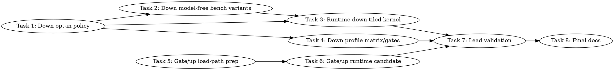

# SYCL MXFP4 TG Speedup Implementation Plan

> **For Claude:** REQUIRED SUB-SKILL: Use team-driven-development to implement this plan with agent teams.

**Goal:** Raise GPT-OSS 20B MXFP4 B50 decode throughput from the current `TG128 34.83 tok/s` toward `>=45 tok/s` without regressing the `PP512 ~1200 tok/s` prompt path.

**Architecture:** Keep all speed work default-off until lead-owned correctness and performance gates pass. First prove a faster down-projection shape in the model-free `sycl-kernel-bench`, then wire the winner into the runtime as an explicit decode-only opt-in. In parallel, prepare gate/up load-path candidate instrumentation because gate/up plus down account for `84.57%` of named kernel time.

**Tech Stack:** C++17, Intel oneAPI SYCL/ESIMD/XMX DPAS, llama.cpp SYCL backend, `sycl-kernel-bench`, pytest source contracts, CTest, B50 GPT-OSS `llama-bench` lead gates.

---

## Team Topology

**Recommended implementers:** 3 concurrent for the first wave, then 1 integration owner for the shared `mmvq.cpp` runtime merge. Execution should spawn one ephemeral implementer per task.
**Reviewers:** spec + quality, spawned fresh per review.

### Parallel Tracks

| Track | Tasks | Description |
|-------|-------|-------------|
| A | 1, 3, 6 | Runtime policy and shared `ggml/src/ggml-sycl/mmvq.cpp` implementation work. These are sequential because they touch the same hot file. |
| B | 2, 4 | Model-free benchmark and B50 matrix harness support. These can start after Task 1 defines the env/label names. |
| C | 5 | Gate/up load-path source contracts and benchmark registration; no runtime dispatch change until Task 6. |
| D | 7, 8 | Lead-owned validation and final documentation. |

### Dependency Graph



### File Ownership Map

| File/Directory | Tasks | Conflict Risk |
|----------------|-------|---------------|
| `ggml/src/ggml-sycl/mmvq.cpp` | 1, 3, 6 | High: one runtime implementer at a time. |
| `ggml/src/ggml-sycl/ggml-sycl-test.hpp` | 1 | Low after Task 1 lands. |
| `ggml/src/ggml-sycl/ggml-sycl-bench.hpp` | 2 | Low. |
| `tools/sycl-kernel-bench/` | 2, 5 | Medium: Task 2 and Task 5 both touch registry/bench code, coordinate if simultaneous. |
| `scripts/sycl-gptoss-down-variant-profile-matrix.sh` | 4 | None. |
| `scripts/sycl-b50-gptoss-moe-gates.sh` | 4 | None. |
| `tests/test-sycl-moe-fused-down-sum-policy.cpp` | 1 | None. |
| `tests/test-sycl-kernel-profiler-source-mmvq.py` | 1, 3, 6 | Medium: runtime source contracts share this file. |
| `tests/test-sycl-down-variant-profile-script.py` | 4 | None. |
| `tools/sycl-kernel-bench/tests/` | 2, 5 | Medium. |
| `activation/` and `docs/backend/SYCL.md` | 8 | None. |

---

## Current Evidence To Preserve

Current profile report: `activation/sycl-current-full-profile-20260706.md`.

Hotspots:

| Kernel | Total ms | Share | Source region |
| --- | ---: | ---: | --- |
| `mxfp4.gateup.xmx_tiled_dpas_m2` | `697.506` | `45.11%` | `ggml/src/ggml-sycl/mmvq.cpp:9730-9955` |
| `mxfp4.down.q8_soa` | `610.131` | `39.46%` | `ggml/src/ggml-sycl/mmvq.cpp:19308-19392` |

Do not spend implementation time on pack/quant (`~12.5 ms` combined), attention (`96.390 ms`), or exact-line profiler work. Exact VTune source rows remain unavailable on this host; PTI/GTPin runtime-count line attribution is diagnostic only.

Worker safety rules:

- Implementers must not run `/Storage` model commands, `llama-bench`, `sycl-ls`, VTune collection, `/dev/dri` probes, `lsof`, P2P probes, or real profiler/model execution.
- Implementers may run source tests, pytest, build-only commands, CTest unit tests, and dry-runs.
- Lead owns B50/B580 correctness/performance validation.

---

## Task 1: Add default-off down tiled/DPAS policy and labels

**Track:** A
**Depends on:** None
**File scope:**
- Modify: `ggml/src/ggml-sycl/mmvq.cpp:210-237`
- Modify: `ggml/src/ggml-sycl/ggml-sycl-test.hpp:120-190`
- Modify: `tests/test-sycl-moe-fused-down-sum-policy.cpp:241-318`
- Modify: `tests/test-sycl-kernel-profiler-source-mmvq.py:122-167`

**Description:**

Define a new explicit runtime knob for the down-projection experiment. It must be decode-only, SOA-down-only, default-off, and separate from the rejected row-group, atomic, cached-Q8, and direct-final knobs.

Use these exact names:

```text
GGML_SYCL_MOE_DOWN_Q8_DPAS_TILE=tile2
GGML_SYCL_MOE_DOWN_Q8_DPAS_TILE=tile4
profile labels: mxfp4.down.q8_dpas_tile2, mxfp4.down.q8_dpas_tile4
metadata: path=q8-soa;role=down;variant=dpas-tile2 or path=q8-soa;role=down;variant=dpas-tile4
```

**Acceptance Criteria:**

- [ ] Missing, empty, numeric, unknown, and `direct-final` env values return disabled.
- [ ] Only `tile2` and `tile4` parse.
- [ ] The active helper returns enabled only for `is_down_role=true`, `down_layout=GGML_LAYOUT_SOA`, and `n_tokens==1`.
- [ ] Labels are stable and distinct from existing `mxfp4.down.q8_soa_row_group` and `mxfp4.down.q8_soa_atomic`.
- [ ] No default behavior changes when the env is unset.

**Implementation Guide:**

1. **RED: add C++ policy tests.**

Append this test function to `tests/test-sycl-moe-fused-down-sum-policy.cpp` after `test_cached_down_q8_soa_tg_variant_parser_labels_and_scope()` and call it from `main()` before the final pass print:

```cpp
static int test_down_q8_dpas_tile_variant_parser_labels_and_scope() {
    CHECK(ggml_sycl_moe_down_q8_dpas_tile_from_env(nullptr) == 0,
          "missing down Q8 DPAS tile env must default off");
    CHECK(ggml_sycl_moe_down_q8_dpas_tile_from_env("") == 0,
          "empty down Q8 DPAS tile env must default off");
    CHECK(ggml_sycl_moe_down_q8_dpas_tile_from_env("0") == 0,
          "numeric down Q8 DPAS tile aliases must fail closed");
    CHECK(ggml_sycl_moe_down_q8_dpas_tile_from_env("1") == 0,
          "numeric down Q8 DPAS tile aliases must fail closed");
    CHECK(ggml_sycl_moe_down_q8_dpas_tile_from_env("bogus") == 0,
          "unknown down Q8 DPAS tile env must fail closed");
    CHECK(ggml_sycl_moe_down_q8_dpas_tile_from_env("direct-final") == 0,
          "down Q8 DPAS tile env must not accept direct-final");
    CHECK(ggml_sycl_moe_down_q8_dpas_tile_from_env("tile2") == 2,
          "tile2 down Q8 DPAS tile env must parse");
    CHECK(ggml_sycl_moe_down_q8_dpas_tile_from_env("tile4") == 4,
          "tile4 down Q8 DPAS tile env must parse");

    CHECK(ggml_sycl_moe_down_q8_dpas_tile_active_from_env("tile2", false, GGML_LAYOUT_SOA, 1) == 0,
          "down Q8 DPAS tile must not affect non-DOWN roles");
    CHECK(ggml_sycl_moe_down_q8_dpas_tile_active_from_env("tile2", true, GGML_LAYOUT_AOS, 1) == 0,
          "down Q8 DPAS tile must require SOA down layout");
    CHECK(ggml_sycl_moe_down_q8_dpas_tile_active_from_env("tile2", true, GGML_LAYOUT_SOA, 2) == 0,
          "down Q8 DPAS tile must not affect prompt or multi-token batches");
    CHECK(ggml_sycl_moe_down_q8_dpas_tile_active_from_env("tile2", true, GGML_LAYOUT_SOA, 1) == 2,
          "tile2 down Q8 DPAS tile must be active for SOA DOWN decode only");
    CHECK(ggml_sycl_moe_down_q8_dpas_tile_active_from_env("tile4", true, GGML_LAYOUT_SOA, 1) == 4,
          "tile4 down Q8 DPAS tile must be active for SOA DOWN decode only");

    CHECK(ggml_sycl_moe_down_q8_dpas_tile_label(0) == nullptr,
          "disabled down Q8 DPAS tile route must not emit a profile label");
    CHECK(std::strcmp(ggml_sycl_moe_down_q8_dpas_tile_label(2), "down-q8-dpas-tile2") == 0,
          "tile2 down Q8 DPAS route label must be stable");
    CHECK(std::strcmp(ggml_sycl_moe_down_q8_dpas_tile_label(4), "down-q8-dpas-tile4") == 0,
          "tile4 down Q8 DPAS route label must be stable");
    return 0;
}
```

Run:

```bash
./scripts/sycl-build.sh test-sycl-moe-fused-down-sum-policy
ctest --test-dir build -R test-sycl-moe-fused-down-sum-policy -V
```

Expected RED: build fails because `ggml_sycl_moe_down_q8_dpas_tile_from_env`, `ggml_sycl_moe_down_q8_dpas_tile_active_from_env`, and `ggml_sycl_moe_down_q8_dpas_tile_label` are not declared.

2. **GREEN: expose test-only declarations.**

Add these declarations to `ggml/src/ggml-sycl/ggml-sycl-test.hpp` near the existing down-sum policy declarations:

```cpp
int         ggml_sycl_moe_down_q8_dpas_tile_from_env(const char * env);
int         ggml_sycl_moe_down_q8_dpas_tile_active_from_env(const char * env,
                                                            bool         is_down_role,
                                                            ggml_layout_mode down_layout,
                                                            int64_t      n_tokens);
const char * ggml_sycl_moe_down_q8_dpas_tile_label(int tile_rows);
```

3. **GREEN: implement policy helpers.**

Add this block in `ggml/src/ggml-sycl/mmvq.cpp` after `mxfp4_moe_down_sum_q8_soa_tg_active_rows_per_group()`:

```cpp
int ggml_sycl_moe_down_q8_dpas_tile_from_env(const char * env) {
    if (!env || env[0] == '\0') {
        return 0;
    }
    if (std::strcmp(env, "tile2") == 0) {
        return 2;
    }
    if (std::strcmp(env, "tile4") == 0) {
        return 4;
    }
    return 0;
}

int ggml_sycl_moe_down_q8_dpas_tile_active_from_env(const char * env,
                                                    bool         is_down_role,
                                                    ggml_layout_mode down_layout,
                                                    int64_t      n_tokens) {
    if (!is_down_role || down_layout != GGML_LAYOUT_SOA || n_tokens != 1) {
        return 0;
    }
    return ggml_sycl_moe_down_q8_dpas_tile_from_env(env);
}

const char * ggml_sycl_moe_down_q8_dpas_tile_label(int tile_rows) {
    switch (tile_rows) {
        case 2:
            return "down-q8-dpas-tile2";
        case 4:
            return "down-q8-dpas-tile4";
        default:
            return nullptr;
    }
}

static int mxfp4_moe_down_q8_dpas_tile_rows() {
    static const int tile_rows = []() {
        const char * env = std::getenv("GGML_SYCL_MOE_DOWN_Q8_DPAS_TILE");
        return ggml_sycl_moe_down_q8_dpas_tile_from_env(env);
    }();
    return tile_rows;
}

static int mxfp4_moe_down_q8_dpas_tile_active(bool is_down_role, ggml_layout_mode down_layout, int64_t n_tokens) {
    if (!is_down_role || down_layout != GGML_LAYOUT_SOA || n_tokens != 1) {
        return 0;
    }
    return mxfp4_moe_down_q8_dpas_tile_rows();
}
```

4. **GREEN: add source-contract tests.**

In `tests/test-sycl-kernel-profiler-source-mmvq.py`, extend `test_mmvq_active_blind_spots_have_named_profile_labels()` label list with:

```python
"mxfp4.down.q8_dpas_tile2",
"mxfp4.down.q8_dpas_tile4",
```

Add assertions in `test_mmvq_active_direct_q8_soa_down_honors_row_group_variants()` after the row-group checks:

```python
assert "GGML_SYCL_MOE_DOWN_Q8_DPAS_TILE" in mmvq
assert "mxfp4_moe_down_q8_dpas_tile_active" in direct_body
assert "mxfp4_down_q8_dpas_tile_sycl<2>" in direct_body
assert "mxfp4_down_q8_dpas_tile_sycl<4>" in direct_body
assert direct_body.index("mxfp4_moe_down_q8_dpas_tile_active") < direct_body.index("mxfp4_down_sum_q8_soa_sycl")
```

Run:

```bash
python3 -m pytest tests/test-sycl-kernel-profiler-source-mmvq.py -q
./scripts/sycl-build.sh test-sycl-moe-fused-down-sum-policy
ctest --test-dir build -R test-sycl-moe-fused-down-sum-policy -V
```

Expected GREEN: pytest passes and CTest prints `100% tests passed` for the policy binary.

**Commit:**

```bash
git add ggml/src/ggml-sycl/mmvq.cpp ggml/src/ggml-sycl/ggml-sycl-test.hpp tests/test-sycl-moe-fused-down-sum-policy.cpp tests/test-sycl-kernel-profiler-source-mmvq.py
git commit -m "feat(sycl): add down Q8 DPAS tile policy gate"
```

**Gotchas:**

- Do not overload `GGML_SYCL_MOE_DOWN_SUM_Q8_SOA_TG_VARIANT`; prior `row2` and `row4` variants were slower and must remain separate.
- Do not accept numeric env aliases; existing tests require string-only opt-ins for risky routes.
- Do not make this default-on.

---

## Task 2: Add model-free down DPAS tile benchmark variants

**Track:** B
**Depends on:** Task 1
**File scope:**
- Modify: `ggml/src/ggml-sycl/ggml-sycl-bench.hpp:132-193`
- Modify: `ggml/src/ggml-sycl/mmvq.cpp:22488-22680`
- Modify: `tools/sycl-kernel-bench/kernel_registry.hpp:201-226`
- Modify: `tools/sycl-kernel-bench/benchmark_harness.hpp:1395-1428`
- Modify: `tools/sycl-kernel-bench/kernels/reference/mxfp4_inline_dot.cpp:1907-2310`
- Modify: `tools/sycl-kernel-bench/tests/test_reference_kernels_registry.py:1-15`
- Create: `tools/sycl-kernel-bench/tests/test_mxfp4_layer_glu_down_variants.py`

**Description:**

Create model-free benchmark entries for down tile candidates so the runtime kernel is proven against synthetic GPT-OSS-like shapes before touching the full model path. This avoids repeating rejected direct-final and row-group experiments.

Use these new benchmark names:

```text
mxfp4_layer_glu_down_q8_dpas_tile2
mxfp4_layer_glu_down_q8_dpas_tile4
```

**Acceptance Criteria:**

- [ ] Registry includes both new benchmark names under `KernelKind::MXFP4_LAYER_GLU_DOWN`.
- [ ] Harness parses `_q8_dpas_tile2` and `_q8_dpas_tile4` into a new `down_q8_dpas_tile_rows` argument.
- [ ] Bench launch rejects invalid tile rows and accepts `0`, `2`, `4`.
- [ ] No real GPU execution is required by tests.

**Implementation Guide:**

1. **RED: registry tests.**

Extend `tools/sycl-kernel-bench/tests/test_reference_kernels_registry.py`:

```python
def test_mxfp4_layer_glu_down_dpas_tile_variants_registered():
    with open(REGISTRY, "r", encoding="utf-8") as f:
        text = f.read()
    for name in [
        "mxfp4_layer_glu_down_q8_dpas_tile2",
        "mxfp4_layer_glu_down_q8_dpas_tile4",
    ]:
        assert name in text, f"{name} not registered in kernel_registry.hpp"
```

Create `tools/sycl-kernel-bench/tests/test_mxfp4_layer_glu_down_variants.py`:

```python
from __future__ import annotations

import pathlib

ROOT = pathlib.Path(__file__).resolve().parents[2]
BENCH_HPP = ROOT / "benchmark_harness.hpp"
BENCH_CPP = ROOT / "kernels" / "reference" / "mxfp4_inline_dot.cpp"
SYCL_BENCH_HPP = ROOT.parents[1] / "ggml" / "src" / "ggml-sycl" / "ggml-sycl-bench.hpp"
MMVQ = ROOT.parents[1] / "ggml" / "src" / "ggml-sycl" / "mmvq.cpp"


def test_layer_glu_down_harness_parses_down_q8_dpas_tile_names() -> None:
    text = BENCH_HPP.read_text(encoding="utf-8")
    assert "down_q8_dpas_tile_rows" in text
    assert 'config.kernel_name.find("_q8_dpas_tile2")' in text
    assert 'config.kernel_name.find("_q8_dpas_tile4")' in text


def test_layer_glu_down_bench_args_carry_down_q8_dpas_tile_rows() -> None:
    text = SYCL_BENCH_HPP.read_text(encoding="utf-8")
    assert "int   down_q8_dpas_tile_rows" in text


def test_layer_glu_down_launch_passes_down_q8_dpas_tile_rows_to_runtime() -> None:
    text = BENCH_CPP.read_text(encoding="utf-8")
    assert "args.down_q8_dpas_tile_rows" in text
    assert "down_args.down_q8_dpas_tile_rows" in text


def test_runtime_bench_rejects_invalid_down_q8_dpas_tile_rows() -> None:
    text = MMVQ.read_text(encoding="utf-8")
    assert "args.down_q8_dpas_tile_rows != 0" in text
    assert "args.down_q8_dpas_tile_rows != 2" in text
    assert "args.down_q8_dpas_tile_rows != 4" in text
```

Run:

```bash
python3 -m pytest tools/sycl-kernel-bench/tests/test_reference_kernels_registry.py tools/sycl-kernel-bench/tests/test_mxfp4_layer_glu_down_variants.py -q
```

Expected RED: tests fail because the new names and fields do not exist.

2. **GREEN: add bench fields and parsing.**

Add this field to `ggml/src/ggml-sycl/ggml-sycl-bench.hpp` inside both `mxfp4_layer_glu_down_bench_args` and `mxfp4_mmv_id_bench_args`:

```cpp
int down_q8_dpas_tile_rows = 0;
```

Add registry rows to `tools/sycl-kernel-bench/kernel_registry.hpp` near the existing `mxfp4_layer_glu_down_soa_*` rows:

```cpp
{ "mxfp4_layer_glu_down_q8_dpas_tile2", GGML_LAYOUT_SOA, KernelKind::MXFP4_LAYER_GLU_DOWN },
{ "mxfp4_layer_glu_down_q8_dpas_tile4", GGML_LAYOUT_SOA, KernelKind::MXFP4_LAYER_GLU_DOWN },
```

In `tools/sycl-kernel-bench/benchmark_harness.hpp` inside the `MXFP4_LAYER_GLU_DOWN` case, after `subgroup_size`, add:

```cpp
const int down_q8_dpas_tile_rows = config.kernel_name.find("_q8_dpas_tile4") != std::string::npos ? 4 :
                                      config.kernel_name.find("_q8_dpas_tile2") != std::string::npos ? 2 :
                                                                                                      0;
```

Pass that value into `run_mxfp4_layer_glu_down` by adding one parameter after `subgroup_size`.

Update the `run_mxfp4_layer_glu_down` signature in `tools/sycl-kernel-bench/kernels/reference/reference_kernels.hpp` and `mxfp4_inline_dot.cpp` to accept `int down_q8_dpas_tile_rows` after `subgroup_size`. Assign it to both `args.down_q8_dpas_tile_rows` and `down_args.down_q8_dpas_tile_rows`.

In `ggml/src/ggml-sycl/mmvq.cpp` inside `ggml_sycl_mxfp4_layer_glu_down_bench_launch`, add validation:

```cpp
if (args.down_q8_dpas_tile_rows != 0 && args.down_q8_dpas_tile_rows != 2 && args.down_q8_dpas_tile_rows != 4) {
    return false;
}
```

Also copy `args.down_q8_dpas_tile_rows` into `down_args.down_q8_dpas_tile_rows` before calling `ggml_sycl_mxfp4_mmv_id_bench_launch`.

Run:

```bash
python3 -m pytest tools/sycl-kernel-bench/tests/test_reference_kernels_registry.py tools/sycl-kernel-bench/tests/test_mxfp4_layer_glu_down_variants.py -q
./scripts/sycl-build.sh sycl-kernel-bench
```

Expected GREEN: pytest passes and the bench target builds.

**Commit:**

```bash
git add ggml/src/ggml-sycl/ggml-sycl-bench.hpp ggml/src/ggml-sycl/mmvq.cpp tools/sycl-kernel-bench/kernel_registry.hpp tools/sycl-kernel-bench/benchmark_harness.hpp tools/sycl-kernel-bench/kernels/reference/reference_kernels.hpp tools/sycl-kernel-bench/kernels/reference/mxfp4_inline_dot.cpp tools/sycl-kernel-bench/tests/test_reference_kernels_registry.py tools/sycl-kernel-bench/tests/test_mxfp4_layer_glu_down_variants.py
git commit -m "bench(sycl): add down Q8 DPAS tile variants"
```

**Gotchas:**

- The benchmark task only carries the variant through; it does not prove speed until lead runs it.
- Keep variant names free of `direct-final` because previous direct-final routes were correctness/performance rejected.

---

## Task 3: Implement default-off runtime down Q8 DPAS tile kernel

**Track:** A
**Depends on:** Tasks 1 and 2
**File scope:**
- Modify: `ggml/src/ggml-sycl/mmvq.cpp:19308-19793`
- Modify: `tests/test-sycl-kernel-profiler-source-mmvq.py:122-167`

**Description:**

Add a decode-only alternative down kernel that processes multiple output rows per work item while preserving SOA down weights and Q8 activation semantics. This is default-off behind `GGML_SYCL_MOE_DOWN_Q8_DPAS_TILE` and must preserve the existing serial kernel when the env is unset.

**Acceptance Criteria:**

- [ ] Runtime dispatch order is: atomic opt-in, row-group opt-ins, down Q8 DPAS tile opt-in, existing serial fallback.
- [ ] New labels are emitted only by the new branch.
- [ ] The new branch depends on existing events and returns a `sycl::event` like the current serial kernel.
- [ ] No `.wait()` is introduced inside the down hot path.
- [ ] Existing default `mxfp4.down.q8_soa` path is byte-for-byte reachable when env is unset.

**Implementation Guide:**

1. **RED: source contract.**

Extend `tests/test-sycl-kernel-profiler-source-mmvq.py`:

```python
def test_down_q8_dpas_tile_kernel_is_default_off_and_uses_named_labels() -> None:
    mmvq = MMVQ.read_text(encoding="utf-8")
    down_region = slice_between(
        mmvq,
        "static sycl::event mxfp4_down_sum_q8_soa_sycl",
        "bool mmvq_moe_batched_dispatch_down_sum_from_cached_q8_mxfp4",
    )
    assert "template <int TILE_ROWS>" in down_region
    assert "mxfp4_down_q8_dpas_tile_sycl" in down_region
    assert "mxfp4.down.q8_dpas_tile2" in down_region
    assert "mxfp4.down.q8_dpas_tile4" in down_region
    assert "mxfp4_moe_down_q8_dpas_tile_active" in down_region
    assert "GGML_SYCL_MOE_DOWN_Q8_DPAS_TILE" in mmvq
    assert "mxfp4_down_q8_dpas_tile_sycl<2>" in down_region
    assert "mxfp4_down_q8_dpas_tile_sycl<4>" in down_region
    assert ".wait(" not in down_region
```

Run:

```bash
python3 -m pytest tests/test-sycl-kernel-profiler-source-mmvq.py::test_down_q8_dpas_tile_kernel_is_default_off_and_uses_named_labels -q
```

Expected RED: test fails because the kernel and labels do not exist.

2. **GREEN: implement the tiled kernel.**

Add a new function immediately after `mxfp4_down_sum_q8_soa_sycl`:

```cpp
template <int TILE_ROWS>
static sycl::event mxfp4_down_q8_dpas_tile_sycl(sycl::queue &                    queue,
                                                const uint8_t * const *          expert_ptrs,
                                                const void *                     q8_rows,
                                                float *                          dst,
                                                const int32_t *                  ids,
                                                const float *                    weights,
                                                const float *                    bias,
                                                int                              ncols,
                                                int                              ncols_y,
                                                int                              nrows_per_expert,
                                                int                              n_ids,
                                                int                              n_tokens,
                                                int64_t                          ids_nb0,
                                                int64_t                          ids_nb1,
                                                int64_t                          q8_nb11,
                                                int64_t                          q8_nb12,
                                                int64_t                          weights_nb1,
                                                int64_t                          weights_nb2,
                                                int64_t                          bias_nb1,
                                                int64_t                          dst_token_stride,
                                                const std::vector<sycl::event> * deps) {
```

Inside it, copy the existing serial kernel body from `mxfp4_down_sum_q8_soa_sycl` and apply these exact mechanical changes:

- Change `block_nums` to cover row tiles:

```cpp
const int row_tiles = (nrows_per_expert + TILE_ROWS - 1) / TILE_ROWS;
const sycl::range<3> block_nums(static_cast<size_t>(n_tokens), static_cast<size_t>(row_tiles), 1);
```

- Use profile labels:

```cpp
const char * label = TILE_ROWS == 2 ? "mxfp4.down.q8_dpas_tile2" : "mxfp4.down.q8_dpas_tile4";
const char * metadata = TILE_ROWS == 2 ? "path=q8-soa;role=down;variant=dpas-tile2" :
                                          "path=q8-soa;role=down;variant=dpas-tile4";
ggml_sycl_profile_label profile_label =
    mmvq_profile_label(queue, label, metadata, "mmvq",
                       static_cast<size_t>(nrows_per_expert) * static_cast<size_t>(n_tokens) * sizeof(float));
```

- Replace `const int row = item.get_group(1);` with:

```cpp
const int row_base = item.get_group(1) * TILE_ROWS;
```

- Wrap the existing per-row accumulation body in:

```cpp
#pragma unroll
for (int tile_r = 0; tile_r < TILE_ROWS; ++tile_r) {
    const int row = row_base + tile_r;
    if (row >= nrows_per_expert) {
        continue;
    }
    float out_acc = 0.0f;
```

- Keep the existing expert loop, `mxfp4_soa_q8_1_block_dot`, `reduce_over_group`, route-weight/bias application, and lane-0 store inside that row loop.

This first implementation intentionally reuses `mxfp4_soa_q8_1_block_dot<true, false>` rather than introducing a new down weight layout. The goal is to test whether row tiling and launch/work distribution can beat the serial row kernel without the duplicate-layout VRAM pressure that killed bundle4.

3. **GREEN: route dispatch.**

In the down dispatch region near `ggml/src/ggml-sycl/mmvq.cpp:19774`, after row-group branches and before `mxfp4_down_sum_q8_soa_sycl`, add:

```cpp
const int dpas_tile_rows = mxfp4_moe_down_q8_dpas_tile_active(/*is_down_role=*/true, GGML_LAYOUT_SOA, n_tokens);
if (dpas_tile_rows == 2) {
    event = mxfp4_down_q8_dpas_tile_sycl<2>(*stream, reinterpret_cast<const uint8_t * const *>(down_ptrs_device),
                                            down_q8_soa, dst, ids, weights, bias, ncols, ncols_y, nrows_per_expert,
                                            n_ids, n_tokens, ids_nb0, ids_nb1, q8_nb11, q8_nb12, weights_nb1,
                                            weights_nb2, bias_nb1, dst_token_stride, deps);
} else if (dpas_tile_rows == 4) {
    event = mxfp4_down_q8_dpas_tile_sycl<4>(*stream, reinterpret_cast<const uint8_t * const *>(down_ptrs_device),
                                            down_q8_soa, dst, ids, weights, bias, ncols, ncols_y, nrows_per_expert,
                                            n_ids, n_tokens, ids_nb0, ids_nb1, q8_nb11, q8_nb12, weights_nb1,
                                            weights_nb2, bias_nb1, dst_token_stride, deps);
} else {
    event = mxfp4_down_sum_q8_soa_sycl(*stream, reinterpret_cast<const uint8_t * const *>(down_ptrs_device),
                                       down_q8_soa, dst, ids, weights, bias, ncols, ncols_y, nrows_per_expert, n_ids,
                                       n_tokens, ids_nb0, ids_nb1, q8_nb11, q8_nb12, weights_nb1, weights_nb2,
                                       bias_nb1, dst_token_stride, deps);
}
```

Preserve the existing atomic and row-group branches before this block.

4. **GREEN: bench launch propagation.**

In `ggml_sycl_mxfp4_mmv_id_bench_launch`, reject invalid `args.down_q8_dpas_tile_rows` and route to `mxfp4_down_q8_dpas_tile_sycl<2>` or `<4>` when the field is set.

Run:

```bash
python3 -m pytest tests/test-sycl-kernel-profiler-source-mmvq.py -q
./scripts/sycl-build.sh test-sycl-moe-fused-down-sum-policy sycl-kernel-bench llama-bench
ctest --test-dir build -R test-sycl-moe-fused-down-sum-policy -V
```

Expected GREEN: source tests pass, targeted build completes, CTest passes.

**Commit:**

```bash
git add ggml/src/ggml-sycl/mmvq.cpp tests/test-sycl-kernel-profiler-source-mmvq.py
git commit -m "feat(sycl): add default-off down Q8 DPAS tile kernel"
```

**Gotchas:**

- `tile4` may be slower; keep both available for measurement and default both off.
- Do not introduce atomics. The previous atomic route was slower.
- Do not allocate a persistent duplicate down layout in this task.
- If compile pressure is high, remove `tile4` from dispatch and keep only the policy/bench registration for later; document that in the commit body.

---

## Task 4: Extend down profile matrix and gates for the new variants

**Track:** B
**Depends on:** Task 1
**File scope:**
- Modify: `scripts/sycl-gptoss-down-variant-profile-matrix.sh:31-75`
- Modify: `tests/test-sycl-down-variant-profile-script.py:11-60`
- Modify: `scripts/sycl-b50-gptoss-moe-gates.sh:20-60`
- Modify: `tests/test-sycl-moe-profile-parser.py:540-570`

**Description:**

Expose the new down variants in dry-run and lead-owned B50 profiling harnesses so performance evidence is collected consistently and no env leaks between rows.

**Acceptance Criteria:**

- [ ] Dry-run matrix includes `down-dpas-tile2` and `down-dpas-tile4` cases.
- [ ] Each case clears all old direct-final, row-group, cached-Q8, and new DPAS tile env vars first.
- [ ] Lead gate script has a `--mode down-q8-dpas-tile` dry-run case that prints count/profile commands but does not execute without lead action.
- [ ] Tests confirm `-fa 1` and safe baseline envs remain present.

**Implementation Guide:**

1. **RED: script tests.**

In `tests/test-sycl-down-variant-profile-script.py`, add `down-dpas-tile2` and `down-dpas-tile4` to `VARIANTS` and add `GGML_SYCL_MOE_DOWN_Q8_DPAS_TILE` to `VARIANT_CLEAR_ENVS`.

Add this test:

```python
def test_down_dpas_tile_variants_are_default_off_and_isolated(tmp_path: Path) -> None:
    completed = _run_script("--dry-run", out_dir=tmp_path / "dry-run")
    out = _combined_output(completed)
    assert completed.returncode == 0, out
    tile2 = _section(out, "down-dpas-tile2")
    tile4 = _section(out, "down-dpas-tile4")
    assert "GGML_SYCL_MOE_DOWN_Q8_DPAS_TILE=tile2" in tile2
    assert "GGML_SYCL_MOE_DOWN_Q8_DPAS_TILE=tile4" in tile4
    for section in [tile2, tile4]:
        assert "GGML_SYCL_MOE_DOWN_SUM_DIRECT=1" in section
        assert " -fa 1 " in section
        assert "-u GGML_SYCL_MOE_DOWN_Q8_DPAS_TILE" in section
        assert "GGML_SYCL_MOE_DOWN_SUM_DIRECT_ATOMIC=1" not in section
        assert "GGML_SYCL_MOE_DOWN_SUM_Q8_SOA_TG_VARIANT=row" not in section
```

Run:

```bash
python3 -m pytest tests/test-sycl-down-variant-profile-script.py -q
```

Expected RED: tests fail because the variants are absent.

2. **GREEN: extend matrix script.**

In `scripts/sycl-gptoss-down-variant-profile-matrix.sh`, add variants:

```bash
"down-dpas-tile2|GGML_SYCL_MOE_DOWN_Q8_DPAS_TILE=tile2"
"down-dpas-tile4|GGML_SYCL_MOE_DOWN_Q8_DPAS_TILE=tile4"
```

Add `GGML_SYCL_MOE_DOWN_Q8_DPAS_TILE` to `variant_env_clear_names`.

3. **GREEN: extend B50 gate dry-run.**

Add `down-q8-dpas-tile` to the `--mode` usage text in `scripts/sycl-b50-gptoss-moe-gates.sh`. The mode should print commands for two cases using `GGML_SYCL_MOE_DOWN_Q8_DPAS_TILE=tile2` and `tile4`, with the canonical GPT-OSS count gate first and a short profile/bench second. If this script already has a diagnostic case-dispatch function near the lower half of the file, add the new case there rather than creating a second parser.

Run:

```bash
python3 -m pytest tests/test-sycl-down-variant-profile-script.py tests/test-sycl-moe-profile-parser.py -q
bash scripts/sycl-gptoss-down-variant-profile-matrix.sh --dry-run > /tmp/down-matrix-dry-run.txt
bash scripts/sycl-b50-gptoss-moe-gates.sh --mode down-q8-dpas-tile --dry-run --logdir /tmp/down-q8-dpas-tile-dry-run
```

Expected GREEN: pytest passes; dry-runs print commands and create no model artifacts.

**Commit:**

```bash
git add scripts/sycl-gptoss-down-variant-profile-matrix.sh tests/test-sycl-down-variant-profile-script.py scripts/sycl-b50-gptoss-moe-gates.sh tests/test-sycl-moe-profile-parser.py
git commit -m "test(sycl): add down Q8 DPAS tile profile gates"
```

**Gotchas:**

- Do not run the B50 model gates as an implementer. The dry-run is the implementer acceptance gate.
- Keep `GGML_SYCL_MOE_DOWN_SUM_DIRECT=1`; this is the current safe baseline context.

---

## Task 5: Prepare gate/up load-path candidate without runtime dispatch changes

**Track:** C
**Depends on:** None
**File scope:**
- Modify: `tools/sycl-kernel-bench/kernel_registry.hpp:170-226`
- Modify: `tools/sycl-kernel-bench/benchmark_harness.hpp:1395-1428`
- Modify: `tools/sycl-kernel-bench/kernels/reference/mxfp4_inline_dot.cpp:1-2600`
- Modify: `tools/sycl-kernel-bench/tests/test_reference_kernels_registry.py:1-20`
- Modify: `tests/test-sycl-moe-gateup-work-reduction-source.py:81-133`

**Description:**

Prepare a model-free gate/up load-path candidate that targets the PTI line evidence at `mmvq.cpp:7233`, `7235`, and `9814-9818`. This task must not touch runtime dispatch and must not introduce a duplicate persistent layout. It only registers bench variants and source contracts for a future runtime candidate.

Use these benchmark names:

```text
mxfp4_pair_glu_xmx_tiled_packed_r8_m2_loadv2
mxfp4_pair_glu_xmx_tiled_packed_r8_m2_loadv2_bias
```

**Acceptance Criteria:**

- [ ] Bench registry includes both `loadv2` variants.
- [ ] The loadv2 bench path reuses existing XMX_TILED layout data, not bundle4 or a duplicate layout.
- [ ] Source tests assert that runtime still has no default-on `GGML_SYCL_MOE_GATEUP_M2_LOADV2` branch.
- [ ] No B50/model execution is required.

**Implementation Guide:**

1. **RED: registry/source tests.**

Extend `tools/sycl-kernel-bench/tests/test_reference_kernels_registry.py`:

```python
def test_mxfp4_pair_glu_loadv2_variants_registered():
    with open(REGISTRY, "r", encoding="utf-8") as f:
        text = f.read()
    for name in [
        "mxfp4_pair_glu_xmx_tiled_packed_r8_m2_loadv2",
        "mxfp4_pair_glu_xmx_tiled_packed_r8_m2_loadv2_bias",
    ]:
        assert name in text, f"{name} not registered in kernel_registry.hpp"
```

Append to `tests/test-sycl-moe-gateup-work-reduction-source.py`:

```python
def test_gateup_loadv2_runtime_branch_is_not_default_on() -> None:
    mmvq = MMVQ.read_text(encoding="utf-8")
    assert "GGML_SYCL_MOE_GATEUP_M2_LOADV2" not in mmvq
    assert "mxfp4_pair_glu_xmx_tiled_packed_r8_m2_loadv2" in (ROOT / "tools" / "sycl-kernel-bench" / "kernel_registry.hpp").read_text(encoding="utf-8")
```

Run:

```bash
python3 -m pytest tools/sycl-kernel-bench/tests/test_reference_kernels_registry.py tests/test-sycl-moe-gateup-work-reduction-source.py -q
```

Expected RED: registry test fails until the bench variants are added.

2. **GREEN: add bench-only variants.**

Add registry rows in `tools/sycl-kernel-bench/kernel_registry.hpp` near the existing packed R8 M2 rows:

```cpp
{ "mxfp4_pair_glu_xmx_tiled_packed_r8_m2_loadv2",      GGML_LAYOUT_SOA, KernelKind::MXFP4_PAIR_GLU },
{ "mxfp4_pair_glu_xmx_tiled_packed_r8_m2_loadv2_bias", GGML_LAYOUT_SOA, KernelKind::MXFP4_PAIR_GLU },
```

In `tools/sycl-kernel-bench/benchmark_harness.hpp`, parse `loadv2` as a bench-only boolean:

```cpp
const bool xmx_tiled_loadv2 = config.kernel_name.find("_loadv2") != std::string::npos;
```

Pass that boolean to `run_mxfp4_pair_glu` by adding a parameter after `xmx_tiled_prefetch`.

In `tools/sycl-kernel-bench/kernels/reference/reference_kernels.hpp` and `mxfp4_inline_dot.cpp`, extend `run_mxfp4_pair_glu` with `bool xmx_tiled_loadv2`. In the implementation, set a new bench args field `args.xmx_tiled_loadv2 = xmx_tiled_loadv2`. Add the field to `mxfp4_pair_glu_bench_args` in `ggml/src/ggml-sycl/ggml-sycl-bench.hpp`.

Do not use this field in runtime dispatch in this task. Returning the current kernel when the bench flag is set is acceptable for this task; Task 6 owns the runtime candidate.

Run:

```bash
python3 -m pytest tools/sycl-kernel-bench/tests/test_reference_kernels_registry.py tests/test-sycl-moe-gateup-work-reduction-source.py -q
./scripts/sycl-build.sh sycl-kernel-bench
```

Expected GREEN: tests pass and `sycl-kernel-bench` builds.

**Commit:**

```bash
git add tools/sycl-kernel-bench/kernel_registry.hpp tools/sycl-kernel-bench/benchmark_harness.hpp tools/sycl-kernel-bench/kernels/reference/reference_kernels.hpp tools/sycl-kernel-bench/kernels/reference/mxfp4_inline_dot.cpp ggml/src/ggml-sycl/ggml-sycl-bench.hpp tools/sycl-kernel-bench/tests/test_reference_kernels_registry.py tests/test-sycl-moe-gateup-work-reduction-source.py
git commit -m "bench(sycl): add gateup loadv2 bench variants"
```

**Gotchas:**

- This task intentionally does not add `GGML_SYCL_MOE_GATEUP_M2_LOADV2` to runtime.
- Do not revive the rejected bundle4 duplicate layout.

---

## Task 6: Add default-off gate/up loadv2 runtime candidate if bench evidence is favorable

**Track:** A
**Depends on:** Task 5 and lead approval from Task 7 microbench results
**File scope:**
- Modify: `ggml/src/ggml-sycl/mmvq.cpp:7219-7244`
- Modify: `ggml/src/ggml-sycl/mmvq.cpp:9730-9955`
- Modify: `tests/test-sycl-moe-gateup-work-reduction-source.py:81-133`
- Modify: `tests/test-sycl-kernel-profiler-source-mmvq.py:35-75`

**Description:**

Only after the model-free bench shows a measurable load-path improvement, add a runtime opt-in `GGML_SYCL_MOE_GATEUP_M2_LOADV2=1` for a modified load helper. The candidate should reduce repeated scale/packed load and pointer setup overhead without changing weight residency or layout.

**Acceptance Criteria:**

- [ ] Runtime branch is default-off and decode-only.
- [ ] Profile label is distinct: `mxfp4.gateup.xmx_tiled_dpas_m2_loadv2`.
- [ ] Existing `mxfp4.gateup.xmx_tiled_dpas_m2` remains default when env is unset.
- [ ] No new persistent layout identity is introduced.
- [ ] PP path remains unchanged.

**Implementation Guide:**

1. **RED: source tests.**

Append to `tests/test-sycl-moe-gateup-work-reduction-source.py`:

```python
def test_gateup_loadv2_runtime_candidate_is_default_off_decode_only() -> None:
    mmvq = MMVQ.read_text(encoding="utf-8")
    assert "GGML_SYCL_MOE_GATEUP_M2_LOADV2" in mmvq
    assert "mxfp4_moe_gateup_m2_loadv2_enabled" in mmvq
    dispatch_start = mmvq.index("static sycl::event mxfp4_pair_glu_xmx_tiled_dpas_m2_submit")
    dispatch_end = mmvq.index("template <int Repeat, bool Prefetch = false>", dispatch_start)
    dispatch = strip_cpp_comments(mmvq[dispatch_start:dispatch_end])
    assert "n_tokens == 1" in dispatch
    assert "mxfp4_pair_glu_xmx_tiled_dpas_m2_loadv2_sycl" in dispatch
    assert dispatch.index("mxfp4_moe_gateup_m2_loadv2_enabled()") < dispatch.rindex("mxfp4_pair_glu_xmx_tiled_dpas_m2_sycl")
```

Run:

```bash
python3 -m pytest tests/test-sycl-moe-gateup-work-reduction-source.py::test_gateup_loadv2_runtime_candidate_is_default_off_decode_only -q
```

Expected RED: test fails until the runtime env helper and submit branch exist.

2. **GREEN: implement env helper.**

Add near the existing `mxfp4_moe_gateup_m2_tg1_index_enabled()` helper:

```cpp
static bool mxfp4_moe_gateup_m2_loadv2_enabled() {
    static const bool enabled = []() {
        const char * env = std::getenv("GGML_SYCL_MOE_GATEUP_M2_LOADV2");
        return env && std::atoi(env) != 0;
    }();
    return enabled;
}
```

3. **GREEN: implement loadv2 submit wrapper.**

Copy `mxfp4_pair_glu_xmx_tiled_dpas_m2_sycl` to `mxfp4_pair_glu_xmx_tiled_dpas_m2_loadv2_sycl` and make these exact changes:

- Label base name becomes `mxfp4.gateup.xmx_tiled_dpas_m2_loadv2`.
- Metadata appends `load=loadv2`.
- The helper call remains layout-compatible with `mxfp4_xmx_tiled_load_a_vec_from_group`; any new helper must accept the same `group`, `tile_n_total`, and `xmx_row_in_group` inputs.
- Do not add `GGML_LAYOUT_XMX_TILED_BUNDLE4` or another alternate layout.

4. **GREEN: dispatch only for decode.**

In `mxfp4_pair_glu_xmx_tiled_dpas_m2_submit`, add the `loadv2` branch before the default branch and after any existing `TG1Index` branch:

```cpp
if (mxfp4_moe_gateup_m2_loadv2_enabled() && n_tokens == 1) {
    if (glu_op == GGML_GLU_OP_SWIGLU_OAI) {
        return mxfp4_pair_glu_xmx_tiled_dpas_m2_loadv2_sycl<Repeat, GGML_GLU_OP_SWIGLU_OAI, Prefetch, false>(
            queue, gate_ptrs, up_ptrs, b_packed, y_scales, dst_glu, ids, gate_bias, up_bias, ncols,
            nrows_per_expert, total_batches, n_tokens, ids_nb0, ids_nb1, dst_nb1, dst_nb2, gate_bias_nb1,
            up_bias_nb1, alpha, limit, tile_n_total, pack_event);
    }
    return mxfp4_pair_glu_xmx_tiled_dpas_m2_loadv2_sycl<Repeat, GGML_GLU_OP_SWIGLU, Prefetch, false>(
        queue, gate_ptrs, up_ptrs, b_packed, y_scales, dst_glu, ids, gate_bias, up_bias, ncols,
        nrows_per_expert, total_batches, n_tokens, ids_nb0, ids_nb1, dst_nb1, dst_nb2, gate_bias_nb1,
        up_bias_nb1, alpha, limit, tile_n_total, pack_event);
}
```

Run:

```bash
python3 -m pytest tests/test-sycl-moe-gateup-work-reduction-source.py tests/test-sycl-kernel-profiler-source-mmvq.py -q
./scripts/sycl-build.sh llama-bench test-sycl-kernel-profiler
ctest --test-dir build -R test-sycl-kernel-profiler -V
```

Expected GREEN: tests pass and the build completes.

**Commit:**

```bash
git add ggml/src/ggml-sycl/mmvq.cpp tests/test-sycl-moe-gateup-work-reduction-source.py tests/test-sycl-kernel-profiler-source-mmvq.py
git commit -m "feat(sycl): add default-off gateup loadv2 candidate"
```

**Gotchas:**

- This task is blocked unless Task 5 bench evidence is favorable. If Task 5 does not show a load-path win, skip Task 6 and record the rejection in Task 8.
- Do not make PP use the new branch.

---

## Task 7: Lead-owned validation and hotspot comparison

**Track:** D
**Depends on:** Tasks 3 and 4; Task 6 only if implemented
**File scope:**
- Create: `activation/sycl-mxfp4-tg-speedup-validation-20260707.md`
- Read-only artifacts under `/tmp/`

**Description:**

Run the real B50 gates and decide which candidates survive. This task is lead-only because it uses `/Storage`, `llama-bench`, oneAPI device selection, and model/profiler execution.

**Acceptance Criteria:**

- [ ] Canonical GPT-OSS count gate passes for every candidate before performance is trusted.
- [ ] PP512 remains `>=1100 tok/s`, with target expectation near `1200 tok/s`.
- [ ] A candidate is accepted only if `TG128` improves by at least `5%` and the relevant named kernel time decreases by at least `5%` versus same-build baseline.
- [ ] Promotion candidate requires `TG128 >=45 tok/s`, count correctness, fatal-free logs, no device-lost markers, and no PP regression.
- [ ] Rejected candidates are documented with artifact paths and exact reason.

**Implementation Guide:**

1. **Build.**

```bash
./scripts/sycl-build.sh llama-bench llama-cli test-sycl-moe-fused-down-sum-policy sycl-kernel-bench
ctest --test-dir build -R 'test-sycl-moe-fused-down-sum-policy|test-sycl-kernel-profiler' --output-on-failure
```

Expected: build succeeds; CTest reports no failures.

2. **Run model-free bench candidates.**

```bash
set +u
source /opt/intel/oneapi/setvars.sh --force
set -u
ROOT=/tmp/sycl_mxfp4_tg_speedup_bench_$(date +%Y%m%d_%H%M%S)
mkdir -p "$ROOT"
ONEAPI_DEVICE_SELECTOR=level_zero:1 ./build/bin/sycl-kernel-bench \
  --kernel mxfp4_layer_glu_down_q8_dpas_tile2 \
  --m 2880 --n 4 --k 2880 --iterations 100 --warmup 10 --validate \
  >"$ROOT/down_tile2.stdout" 2>"$ROOT/down_tile2.stderr"
ONEAPI_DEVICE_SELECTOR=level_zero:1 ./build/bin/sycl-kernel-bench \
  --kernel mxfp4_layer_glu_down_q8_dpas_tile4 \
  --m 2880 --n 4 --k 2880 --iterations 100 --warmup 10 --validate \
  >"$ROOT/down_tile4.stdout" 2>"$ROOT/down_tile4.stderr"
```

Expected: validation passes; one of the candidates is faster than the current `mxfp4_layer_glu_down_soa_r4` or current best comparable baseline by at least `5%`. If neither is faster, stop and reject runtime promotion.

3. **Run canonical correctness gates.**

For down tile candidates:

```bash
ROOT=/tmp/sycl_mxfp4_tg_speedup_gate_$(date +%Y%m%d_%H%M%S)
GGML_SYCL_MOE_DOWN_Q8_DPAS_TILE=tile2 scripts/sycl-b50-gptoss-moe-gates.sh \
  --mode default --logdir "$ROOT/tile2"
GGML_SYCL_MOE_DOWN_Q8_DPAS_TILE=tile4 scripts/sycl-b50-gptoss-moe-gates.sh \
  --mode default --logdir "$ROOT/tile4"
```

Expected: each accepted candidate produces exact final answer `1, 2, 3, 4, 5`, no fatal markers, and no device-lost markers.

4. **Run profile matrix.**

```bash
ROOT=/tmp/sycl_mxfp4_tg_speedup_profile_$(date +%Y%m%d_%H%M%S)
SYCL_DOWN_VARIANT_PROFILE_OUT="$ROOT" scripts/sycl-gptoss-down-variant-profile-matrix.sh --execute
```

Expected: matrix includes baseline, row-group rejects, cached variants, and the new down tile candidates. Compare `mxfp4.down.q8_soa`, `mxfp4.down.q8_dpas_tile2`, and `mxfp4.down.q8_dpas_tile4` times.

5. **Run current full profile for the winning candidate.**

```bash
ROOT=/tmp/sycl_mxfp4_tg_speedup_full_$(date +%Y%m%d_%H%M%S)
GGML_SYCL_MOE_DOWN_Q8_DPAS_TILE=tile2 scripts/sycl-gptoss-decode-timeline-profile.sh \
  --execute --i-understand-this-runs-gpu-models \
  --out-root "$ROOT/tile2" \
  --device-selector level_zero:1 \
  --model /Storage/GenAI/models/gpt-oss-20b-mxfp4.gguf
```

Use `tile4` instead if the matrix shows `tile4` is faster.

Expected: `bench.stdout`, `cost-ranking.parse`, `wall-ledger.parse`, and `timeline.gaps.parse` exist.

6. **Document.**

Write `activation/sycl-mxfp4-tg-speedup-validation-20260707.md` with:

- artifact roots
- exact commands
- count gate result
- PP512/TG128 table
- named-kernel table for baseline and candidate
- accept/reject decision

**Commit:**

```bash
git add activation/sycl-mxfp4-tg-speedup-validation-20260707.md
git commit -m "docs(sycl): validate MXFP4 TG speedup candidates"
```

**Gotchas:**

- Do not use `sycl-ls` or DRM/fdinfo probes.
- If a candidate reaches `TG128 >=45` but PP drops below `1100`, reject promotion and keep opt-in.
- If correctness fails, do not quote performance as useful.

---

## Task 8: Final docs and promotion decision

**Track:** D
**Depends on:** Task 7
**File scope:**
- Modify: `docs/backend/SYCL.md`
- Modify: `activation/sycl-current-full-profile-20260706.md` only if adding a follow-up section
- Create: `activation/sycl-mxfp4-tg-speedup-final-review-20260707.md`

**Description:**

Record the final decision and keep defaults safe. If no candidate passes the promotion bar, document the best opt-in and the next target. If a candidate passes, document exact env, guardrails, and required future default-on review.

**Acceptance Criteria:**

- [ ] `docs/backend/SYCL.md` lists any new env flags as experimental/default-off.
- [ ] Final review states whether the target `TG128 >=45` was reached.
- [ ] Rejected candidates are not left ambiguous.
- [ ] Tracker issues are closed or updated with follow-up IDs.

**Implementation Guide:**

1. **RED: docs source test.**

Create `tests/test-sycl-mxfp4-tg-speedup-docs.py`:

```python
from __future__ import annotations

import pathlib

ROOT = pathlib.Path(__file__).resolve().parents[1]
SYCL_DOC = ROOT / "docs" / "backend" / "SYCL.md"
FINAL = ROOT / "activation" / "sycl-mxfp4-tg-speedup-final-review-20260707.md"


def test_speedup_envs_are_documented_as_default_off() -> None:
    text = SYCL_DOC.read_text(encoding="utf-8")
    assert "GGML_SYCL_MOE_DOWN_Q8_DPAS_TILE" in text
    assert "default is OFF" in text[text.index("GGML_SYCL_MOE_DOWN_Q8_DPAS_TILE") : text.index("GGML_SYCL_MOE_DOWN_Q8_DPAS_TILE") + 240]


def test_final_review_records_promotion_decision() -> None:
    text = FINAL.read_text(encoding="utf-8")
    assert "Promotion decision:" in text
    assert "PP512" in text
    assert "TG128" in text
    assert "mxfp4.gateup.xmx_tiled_dpas_m2" in text
    assert "mxfp4.down" in text
```

Run:

```bash
python3 -m pytest tests/test-sycl-mxfp4-tg-speedup-docs.py -q
```

Expected RED: test fails because docs are not written.

2. **GREEN: update docs.**

In `docs/backend/SYCL.md`, add an experimental env row:

```markdown
| `GGML_SYCL_MOE_DOWN_Q8_DPAS_TILE=tile2|tile4` | Enable experimental decode-only down Q8 DPAS tile candidate; default is OFF. |
```

Write `activation/sycl-mxfp4-tg-speedup-final-review-20260707.md` only after Task 7 artifacts exist. The file must contain:

```markdown
# SYCL MXFP4 TG Speedup Final Review

Promotion decision: reject default-on, keep opt-in

## Validation Summary

A markdown table with one baseline row and one row for each candidate that Task 7 executed. Every PP512, TG128, and kernel-time cell must be copied from Task 7 artifacts before the file is saved.

## Kernel Hotspots

A markdown table containing the measured `mxfp4.gateup.xmx_tiled_dpas_m2` row and every measured `mxfp4.down.*` candidate row from Task 7.
```

Run:

```bash
python3 -m pytest tests/test-sycl-mxfp4-tg-speedup-docs.py -q
git diff --check
```

Expected GREEN: docs test passes and diff check is clean.

**Commit:**

```bash
git add docs/backend/SYCL.md activation/sycl-mxfp4-tg-speedup-final-review-20260707.md tests/test-sycl-mxfp4-tg-speedup-docs.py
git commit -m "docs(sycl): record MXFP4 TG speedup decision"
```

**Gotchas:**

- The sample final-review table above must be filled with measured Task 7 values before commit.
- Do not document an opt-in as recommended unless both correctness and performance evidence support it.

---

## Cross-Task Validation Gates

Implementers run:

```bash
python3 -m pytest \
  tests/test-sycl-kernel-profiler-source-mmvq.py \
  tests/test-sycl-moe-gateup-work-reduction-source.py \
  tests/test-sycl-down-variant-profile-script.py \
  tools/sycl-kernel-bench/tests/test_reference_kernels_registry.py \
  tools/sycl-kernel-bench/tests/test_mxfp4_layer_glu_down_variants.py \
  -q
./scripts/sycl-build.sh test-sycl-moe-fused-down-sum-policy sycl-kernel-bench llama-bench
ctest --test-dir build -R test-sycl-moe-fused-down-sum-policy -V
git diff --check
```

Lead runs model gates only after implementation review:

```bash
set +u
source /opt/intel/oneapi/setvars.sh --force
set -u
scripts/sycl-b50-gptoss-moe-gates.sh --mode default --logdir /tmp/sycl_mxfp4_tg_speedup_default_gate
SYCL_DOWN_VARIANT_PROFILE_OUT=/tmp/sycl_mxfp4_tg_speedup_matrix scripts/sycl-gptoss-down-variant-profile-matrix.sh --execute
```

Expected promotion result requires all of:

```text
Count gate: exact final answer 1, 2, 3, 4, 5
Fatal/device-lost markers: none
PP512: >=1100 tok/s
TG128: >=45 tok/s for default-on promotion
Named kernel reduction: candidate down or gate/up kernel at least 5% faster than same-build baseline
```

---

## Known Rejections To Avoid Repeating

- `GGML_SYCL_MOE_DOWN_SUM_Q8_SOA_TG_VARIANT=row2` and `row4`: slower down kernel and no TG win.
- `GGML_SYCL_MOE_DOWN_SUM_DIRECT_ATOMIC=1`: slower down kernel and no meaningful TG gain.
- old direct-final down routes: correctness and/or performance rejected.
- `GGML_SYCL_MOE_GATEUP_BUNDLE4=1`: count-correct early but VRAM pressure caused drops and severe TG regression.
- M2 prefetch experiment: fatal-free but much slower.
- selected-expert prepack: extra copy cost dominated and TG regressed.

---

## Handoff Notes

- Keep each task on its stated file scope to avoid `mmvq.cpp` merge conflicts.
- The first meaningful speed decision is Task 7. Before Task 7, all runtime code remains opt-in and experimental.
- If Task 3 reduces `mxfp4.down.*` time by at least `5%` but total TG barely moves, prioritize graphlet/launch consolidation next because gate/up + down launch counts are still high.
- If Task 3 regresses, do not keep iterating on row tiling blindly; use Task 5 and Task 6 only if the gate/up load-path bench shows a model-free win.
