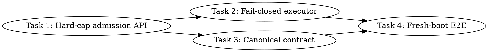

# SYCL PP MoE Scratch Hard-Cap Implementation Plan

> **For Claude:** REQUIRED SUB-SKILL: Use team-driven-development to implement this plan with agent teams.

**Goal:** Prevent the opt-in PP MoE batched oneDNN executor from requesting device scratch beyond the placement plan, while preserving intentional planner-selected host-pinned expert residency and the existing safe fallback routes.

**Architecture:** Add one pure admission policy that compares a runtime PP MoE oneDNN scratch shape with the planner-owned per-device shape. Enforce that policy both at the unified-cache reservation boundary and in the batched executor; an inadmissible batch returns before its batched oneDNN scratch reservation and continues through the existing serialized/device/host route. This safety plan does not implement multi-expert chunking: a later performance task may increase a planner-owned slot or select a bounded chunk width, but runtime code may never enlarge the named PP MoE oneDNN scratch plan.

**Tech Stack:** C++17, SYCL 2020 USM/events, oneDNN 3.9.1 DPC++ interoperability, unified-cache arena zones, `mem_handle`, CMake/CTest, Bash source-policy tests.

**Test Infrastructure:** `tests/test-sycl-layout-choice.cpp` for pure planner policy, a new CTest-registered Bash source-contract test for the large executor, existing `test-sycl-moe-handle-resolution` host-pinned route coverage, canonical B50 GPT-OSS correctness/benchmark gates, and the B580 Mistral regression guard.

**Tracker:** Parent task `llama.cpp-yyxp3.1`. The concrete task IDs and dependency edges are recorded below; implementation must claim the ready child task rather than the parent.

**Research basis:**

- The installed oneDNN is 3.9.1 (`DNNL_DIR=/opt/intel/oneapi/dnnl/2025.3/lib/cmake/dnnl`). Current oneDNN DPC++ interoperability documentation keeps memory and stream interop explicit; this plan reuses the repository's existing `DnnlGemmWrapper::gemm_batch_strided` and changes no external oneDNN API: <https://uxlfoundation.github.io/oneDNN/dev_guide_dpcpp_interoperability.html>.
- SYCL 2020 specifies USM allocation, event scheduling, and object lifetime separately. The backend must reject an inadmissible request before the named PP MoE oneDNN scratch allocation attempt and retain admitted allocations until their completion event: <https://registry.khronos.org/SYCL/specs/sycl-2020/html/sycl-2020.html#sec:usm>.
- The repository's canonical contract already makes the placement planner the sole authority and unified cache the sole allocator (`docs/design/sycl-canonical-memory-architecture.md:12-95`). This plan makes the missing “planned scratch is a ceiling” rule executable.

---

## Scope and Invariants

### In scope

1. Treat `pp_moe_onednn_{weight,activation,output}_slot_bytes` and ring depth as per-device hard caps.
2. Reject zero/missing plans and any per-dimension or ring-depth overrun before attempting the named PP MoE oneDNN scratch allocation.
3. Remove the batched executor's `std::max(planned, required)` runtime enlargement and its three `scoped_unified_queue_temp` fallbacks.
4. Continue through the existing non-batched path when batched admission, reservation, route resolution, or slot claim fails.
5. Preserve planner-selected `HOST_PINNED`/`HOST_MMAP` experts. Scratch admission applies only to device-only oneDNN compute scratch; it does not change expert placement or require all experts in VRAM.
6. Preserve `mem_handle` leases and completion-event ownership for admitted device scratch and expert routes.
7. Document and validate the invariant on a freshly rebooted B50, including a constrained-budget run that proves nonzero host-resident experts still execute correctly.

### Out of scope

- Increasing the planned scratch budget.
- Implementing multi-expert chunking, pipelining, or a larger scratch ring.
- Moving host-planned experts into VRAM to make batching eligible.
- Changing oneDNN primitives, device selection, weight placement heuristics, TG kernels, or graph replay.
- Treating the current B50 TG result as a new performance baseline; the existing 50/70 tok/s recovery work remains open.

### Required failure behavior

For the GPT-OSS layer-0 shape, one FP16 expert matrix is `2880 * 2880 * 2 = 15.8203125 MiB`; 32 active experts require `506.25 MiB`. With the current one-slot plan, the batched path must log `reason=weight-cap`, submit no batch scratch allocation, and fall back. A host-planned expert must continue to resolve as `HOST_PINNED` or `HOST_MMAP` and use the existing host/serialized route.

---

## Team Topology

**Recommended implementers:** 2 concurrent maximum (Task 1 establishes the shared policy; Tasks 2 and 3 can then run in parallel on disjoint files)
**Reviewers:** spec + quality, spawned FRESH per review.

### Parallel Tracks

| Track | Tasks | Description |
|---|---|---|
| A | 1, 2 | Admission primitive/unified-cache enforcement, then executor fail-closed wiring |
| B | 3 | Canonical contract documentation after the admission API lands |
| Lead | 4 | Fresh-boot serialized B50/B580 correctness, spill, reset, and performance gates |

### Dependency Graph



### Tracker Task Breakdown

| Plan Task | Tracker ID | Type/Priority | Depends on | Done condition |
|---|---|---|---|---|
| 1. Hard-cap admission API | `llama.cpp-qn05` | Bug/P0 | None | Pure cap tests pass and unified cache rejects before its scratch lock/allocation |
| 2. Fail-closed batched executor | `llama.cpp-qu0k` | Bug/P0 | `llama.cpp-qn05` | No runtime enlargement/temp fallback; executor source-contract and non-GPU gates pass |
| 3. Canonical memory contract | `llama.cpp-cg4k` | Task/P1 | `llama.cpp-qn05` | Documentation assertion passes and intentional host-expert residency is explicit |
| 4. Fresh-boot end-to-end proof | `llama.cpp-g8m4` | Task/P0 | `llama.cpp-qu0k`, `llama.cpp-cg4k` | B50 cap/host-row/correctness/perf and B580 regression/reset gates are recorded |

`llama.cpp-yyxp3.1` depends on Task 4, so the parent cannot close before the real-machine proof. Task 1 starts first; Tasks 2 and 3 then run concurrently; Task 4 is lead-owned after both close.

### File Ownership Map

| File/Directory | Tasks | Conflict Risk |
|---|---|---|
| `ggml/src/ggml-sycl/unified-cache.hpp` | 1 | None |
| `ggml/src/ggml-sycl/unified-cache.cpp` | 1 | None |
| `tests/test-sycl-layout-choice.cpp` | 1 | None |
| `ggml/src/ggml-sycl/ggml-sycl.cpp` | 2 | None after Task 1 |
| `tests/test-sycl-pp-moe-scratch-contract.sh` | 2 | New file |
| `tests/CMakeLists.txt` | 2 | Coordinate with unrelated test-registration changes before commit |
| `docs/design/sycl-canonical-memory-architecture.md` | 3 | None |
| `/tmp/b50-pp-moe-scratch-cap-*` logs and tracker evidence | 4 | Lead-owned after implementation; no source edits |

---

## Tasks

### Task 1: Add and Enforce the Planner-Owned Scratch Admission API

**Track:** A  
**Depends on:** None

**File scope:**

- Modify: `ggml/src/ggml-sycl/unified-cache.hpp:970-982` and `:2270-2274`
- Modify: `ggml/src/ggml-sycl/unified-cache.cpp:354-374`, `:505-548`, and `:10452-10468`
- Test: `tests/test-sycl-layout-choice.cpp:1131-1181`

**Description:** Define a pure, per-dimension admission result shared by the planner/cache and executor. The unified-cache reservation function must consult the stored plan before taking its scratch mutex or allocating a zone block, so an oversized or missing-plan request is failure-atomic.

**Acceptance Criteria:**

- [ ] Exact-size and smaller requests are admitted.
- [ ] Missing/zero plans and invalid/zero requests are rejected.
- [ ] Weight, activation, output, and ring-depth overruns have distinct stable reason strings.
- [ ] `unified_cache::reserve_pp_moe_onednn_scratch` returns before taking its mutex or allocating/replacing a PP MoE scratch slot when admission fails.
- [ ] The helper contains no device-name/model-name policy and no expert-residency field.
- [ ] Existing planned ring depth remains one reusable slot.

#### RED: Write These Failing Tests

Insert the following immediately before the existing call `ggml_sycl::unified_cache_set_planned_pp_moe_onednn_scratch(planned_scratch_device, 0, 0, 0, 0)` in `run_regression_guard_policy_test()`:

```cpp
    const ggml_sycl::pp_moe_onednn_scratch_shape planned_shape = {
        weight_slot,
        act_slot,
        out_slot,
        1,
    };
    const auto exact_admission = ggml_sycl::pp_moe_onednn_admit_scratch(planned_shape, planned_shape);
    if (!exact_admission.allowed ||
        exact_admission.reason != ggml_sycl::pp_moe_onednn_scratch_admission_reason::ALLOWED) {
        printf("FAIL: exact PP MoE oneDNN scratch plan should be admitted\n");
        return false;
    }

    ggml_sycl::pp_moe_onednn_scratch_shape smaller_shape = planned_shape;
    smaller_shape.weight_slot_bytes--;
    smaller_shape.activation_slot_bytes--;
    smaller_shape.output_slot_bytes--;
    const auto smaller_admission = ggml_sycl::pp_moe_onednn_admit_scratch(planned_shape, smaller_shape);
    if (!smaller_admission.allowed ||
        smaller_admission.reason != ggml_sycl::pp_moe_onednn_scratch_admission_reason::ALLOWED) {
        printf("FAIL: smaller PP MoE oneDNN scratch request should be admitted\n");
        return false;
    }

    const ggml_sycl::pp_moe_onednn_scratch_shape missing_plan = {};
    if (ggml_sycl::pp_moe_onednn_admit_scratch(missing_plan, planned_shape).reason !=
        ggml_sycl::pp_moe_onednn_scratch_admission_reason::MISSING_PLAN) {
        printf("FAIL: missing PP MoE oneDNN scratch plan should fail closed\n");
        return false;
    }

    ggml_sycl::pp_moe_onednn_scratch_shape required_shape = planned_shape;
    required_shape.weight_slot_bytes++;
    if (ggml_sycl::pp_moe_onednn_admit_scratch(planned_shape, required_shape).reason !=
        ggml_sycl::pp_moe_onednn_scratch_admission_reason::WEIGHT_CAP) {
        printf("FAIL: PP MoE oneDNN weight overrun should be rejected\n");
        return false;
    }
    required_shape = planned_shape;
    required_shape.activation_slot_bytes++;
    if (ggml_sycl::pp_moe_onednn_admit_scratch(planned_shape, required_shape).reason !=
        ggml_sycl::pp_moe_onednn_scratch_admission_reason::ACTIVATION_CAP) {
        printf("FAIL: PP MoE oneDNN activation overrun should be rejected\n");
        return false;
    }
    required_shape = planned_shape;
    required_shape.output_slot_bytes++;
    if (ggml_sycl::pp_moe_onednn_admit_scratch(planned_shape, required_shape).reason !=
        ggml_sycl::pp_moe_onednn_scratch_admission_reason::OUTPUT_CAP) {
        printf("FAIL: PP MoE oneDNN output overrun should be rejected\n");
        return false;
    }
    required_shape = planned_shape;
    required_shape.ring_depth++;
    if (ggml_sycl::pp_moe_onednn_admit_scratch(planned_shape, required_shape).reason !=
        ggml_sycl::pp_moe_onednn_scratch_admission_reason::RING_CAP) {
        printf("FAIL: PP MoE oneDNN ring overrun should be rejected\n");
        return false;
    }

    required_shape = {};
    if (ggml_sycl::pp_moe_onednn_admit_scratch(planned_shape, required_shape).reason !=
        ggml_sycl::pp_moe_onednn_scratch_admission_reason::INVALID_REQUEST) {
        printf("FAIL: empty PP MoE oneDNN scratch request should be rejected\n");
        return false;
    }

    if (std::strcmp(ggml_sycl::pp_moe_onednn_scratch_admission_reason_name(
                        ggml_sycl::pp_moe_onednn_scratch_admission_reason::ALLOWED),
                    "allowed") != 0 ||
        std::strcmp(ggml_sycl::pp_moe_onednn_scratch_admission_reason_name(
                        ggml_sycl::pp_moe_onednn_scratch_admission_reason::MISSING_PLAN),
                    "missing-plan") != 0 ||
        std::strcmp(ggml_sycl::pp_moe_onednn_scratch_admission_reason_name(
                        ggml_sycl::pp_moe_onednn_scratch_admission_reason::INVALID_REQUEST),
                    "invalid-request") != 0 ||
        std::strcmp(ggml_sycl::pp_moe_onednn_scratch_admission_reason_name(
                        ggml_sycl::pp_moe_onednn_scratch_admission_reason::WEIGHT_CAP),
                    "weight-cap") != 0 ||
        std::strcmp(ggml_sycl::pp_moe_onednn_scratch_admission_reason_name(
                        ggml_sycl::pp_moe_onednn_scratch_admission_reason::ACTIVATION_CAP),
                    "activation-cap") != 0 ||
        std::strcmp(ggml_sycl::pp_moe_onednn_scratch_admission_reason_name(
                        ggml_sycl::pp_moe_onednn_scratch_admission_reason::OUTPUT_CAP),
                    "output-cap") != 0 ||
        std::strcmp(ggml_sycl::pp_moe_onednn_scratch_admission_reason_name(
                        ggml_sycl::pp_moe_onednn_scratch_admission_reason::RING_CAP),
                    "ring-cap") != 0) {
        printf("FAIL: PP MoE oneDNN scratch admission reason names should remain stable\n");
        return false;
    }
```

**Verify RED:**

```bash
./scripts/sycl-build.sh test-sycl-layout-choice
```

Expected: compilation fails because `pp_moe_onednn_scratch_shape`, `pp_moe_onednn_scratch_admission_reason`, and `pp_moe_onednn_admit_scratch` do not exist.

#### GREEN: Implement the Admission Type and Policy

Add this declaration block in `unified-cache.hpp` immediately after the planned-scratch getter declarations:

```cpp
enum class pp_moe_onednn_scratch_admission_reason : uint8_t {
    ALLOWED = 0,
    MISSING_PLAN,
    INVALID_REQUEST,
    WEIGHT_CAP,
    ACTIVATION_CAP,
    OUTPUT_CAP,
    RING_CAP,
};

struct pp_moe_onednn_scratch_shape {
    size_t   weight_slot_bytes     = 0;
    size_t   activation_slot_bytes = 0;
    size_t   output_slot_bytes     = 0;
    uint32_t ring_depth            = 0;
};

struct pp_moe_onednn_scratch_admission {
    bool                                     allowed = false;
    pp_moe_onednn_scratch_admission_reason reason  = pp_moe_onednn_scratch_admission_reason::MISSING_PLAN;
};

pp_moe_onednn_scratch_admission pp_moe_onednn_admit_scratch(
    const pp_moe_onednn_scratch_shape & planned,
    const pp_moe_onednn_scratch_shape & required);
const char * pp_moe_onednn_scratch_admission_reason_name(pp_moe_onednn_scratch_admission_reason reason);
```

Add the implementation in `unified-cache.cpp` immediately after `pp_moe_onednn_planned_scratch_bytes`:

```cpp
const char * pp_moe_onednn_scratch_admission_reason_name(pp_moe_onednn_scratch_admission_reason reason) {
    switch (reason) {
        case pp_moe_onednn_scratch_admission_reason::ALLOWED:
            return "allowed";
        case pp_moe_onednn_scratch_admission_reason::MISSING_PLAN:
            return "missing-plan";
        case pp_moe_onednn_scratch_admission_reason::INVALID_REQUEST:
            return "invalid-request";
        case pp_moe_onednn_scratch_admission_reason::WEIGHT_CAP:
            return "weight-cap";
        case pp_moe_onednn_scratch_admission_reason::ACTIVATION_CAP:
            return "activation-cap";
        case pp_moe_onednn_scratch_admission_reason::OUTPUT_CAP:
            return "output-cap";
        case pp_moe_onednn_scratch_admission_reason::RING_CAP:
            return "ring-cap";
    }
    return "unknown";
}

pp_moe_onednn_scratch_admission pp_moe_onednn_admit_scratch(
    const pp_moe_onednn_scratch_shape & planned,
    const pp_moe_onednn_scratch_shape & required) {
    if (planned.weight_slot_bytes == 0 || planned.activation_slot_bytes == 0 || planned.output_slot_bytes == 0 ||
        planned.ring_depth == 0) {
        return { false, pp_moe_onednn_scratch_admission_reason::MISSING_PLAN };
    }
    if (required.weight_slot_bytes == 0 || required.activation_slot_bytes == 0 || required.output_slot_bytes == 0 ||
        required.ring_depth == 0) {
        return { false, pp_moe_onednn_scratch_admission_reason::INVALID_REQUEST };
    }
    if (required.weight_slot_bytes > planned.weight_slot_bytes) {
        return { false, pp_moe_onednn_scratch_admission_reason::WEIGHT_CAP };
    }
    if (required.activation_slot_bytes > planned.activation_slot_bytes) {
        return { false, pp_moe_onednn_scratch_admission_reason::ACTIVATION_CAP };
    }
    if (required.output_slot_bytes > planned.output_slot_bytes) {
        return { false, pp_moe_onednn_scratch_admission_reason::OUTPUT_CAP };
    }
    if (required.ring_depth > planned.ring_depth) {
        return { false, pp_moe_onednn_scratch_admission_reason::RING_CAP };
    }
    return { true, pp_moe_onednn_scratch_admission_reason::ALLOWED };
}
```

After the existing size alignment and zero-request guard at the beginning of `unified_cache::reserve_pp_moe_onednn_scratch`, insert this fail-closed check before `std::lock_guard<std::mutex> lock(pp_moe_onednn_scratch_mutex_)`:

```cpp
    const int device_id = ggml_sycl_get_device_id_from_queue(queue_);
    const pp_moe_onednn_scratch_shape planned = {
        unified_cache_get_planned_pp_moe_onednn_weight_slot_bytes(device_id),
        unified_cache_get_planned_pp_moe_onednn_activation_slot_bytes(device_id),
        unified_cache_get_planned_pp_moe_onednn_output_slot_bytes(device_id),
        unified_cache_get_planned_pp_moe_onednn_ring_depth(device_id),
    };
    const pp_moe_onednn_scratch_shape required = {
        weight_slot_bytes,
        activation_slot_bytes,
        output_slot_bytes,
        ring_depth,
    };
    const pp_moe_onednn_scratch_admission admission = pp_moe_onednn_admit_scratch(planned, required);
    if (!admission.allowed) {
        GGML_LOG_WARN(
            "[UNIFIED-CACHE] refusing unplanned PP MoE oneDNN scratch reservation: device=%d reason=%s "
            "planned=[%zu,%zu,%zu,%u] required=[%zu,%zu,%zu,%u]\n",
            device_id, pp_moe_onednn_scratch_admission_reason_name(admission.reason), planned.weight_slot_bytes,
            planned.activation_slot_bytes, planned.output_slot_bytes, planned.ring_depth, required.weight_slot_bytes,
            required.activation_slot_bytes, required.output_slot_bytes, required.ring_depth);
        return false;
    }
```

Do not change the allocation implementation after this guard: admitted storage remains RUNTIME-zone/unified-cache owned and each slot retains its existing `mem_handle` owners.

**Verify GREEN:**

```bash
clang-format-19 -i \
  ggml/src/ggml-sycl/unified-cache.hpp \
  ggml/src/ggml-sycl/unified-cache.cpp \
  tests/test-sycl-layout-choice.cpp
./scripts/sycl-build.sh test-sycl-layout-choice
GGML_SYCL_TEST_LAYOUT_CHOICE_BACKEND=0 ./build/bin/test-sycl-layout-choice
```

Expected: build succeeds and the test ends with `All tests passed` without initializing a GPU.

#### REFACTOR

No refactoring beyond formatting. Do not merge this policy into the general `unified_alloc` tier selector: this contract is specific to the named, planner-owned PP MoE scratch resource.

#### Gotchas

- Compare aligned byte counts. The current inventory already aligns these fields to 256 bytes in `src/llama-model.cpp:139-172`.
- A missing plan must not silently become a one-slot plan at this boundary.
- Host-pinned expert weights are unrelated to this device scratch shape. Do not add `host_weights`, device-fit booleans, model names, or GPU names to the helper.
- Do not free or reset live scratch slots to satisfy an overrun; return false.
- `reserve_pp_moe_onednn_scratch` builds replacement slots before releasing old slots. The new admission guard must run before either action.

#### Commit

```bash
git add \
  ggml/src/ggml-sycl/unified-cache.hpp \
  ggml/src/ggml-sycl/unified-cache.cpp \
  tests/test-sycl-layout-choice.cpp
git commit -m "fix(sycl): cap PP MoE scratch at the placement plan"
```

---

### Task 2: Make the Batched Executor Fail Closed and Preserve Host Fallback

**Track:** A  
**Depends on:** Task 1

**File scope:**

- Modify: `ggml/src/ggml-sycl/ggml-sycl.cpp:68795-68870`, `:69044-69098`
- Create: `tests/test-sycl-pp-moe-scratch-contract.sh`
- Modify: `tests/CMakeLists.txt:236-247`

**Description:** Wire the Task 1 policy into `try_pp_mxfp4_soa_onednn_f16_batched`. Remove both runtime plan enlargement and the general temporary fallback. Returning false is intentional: `ggml_sycl_mul_mat_id` continues through the existing serialized and host-aware routes, and a host-planned expert remains in pinned host memory.

**Acceptance Criteria:**

- [ ] A 32-expert/506.25 MiB request against the one-expert plan is rejected before batch scratch reservation.
- [ ] Rejection reason is emitted through the existing batched trace as `weight-cap`.
- [ ] No `scoped_unified_queue_temp` allocation exists inside the batched lambda.
- [ ] The reservation call uses the stored planned sizes, never `std::max(planned, required)`.
- [ ] Missing cache, missing plan, failed reservation, failed slot claim, and undersized slot all return false without submitting dequant/GEMM work.
- [ ] `ggml_sycl_resolve_moe_expert_route_for_dispatch` and `ggml_sycl_try_pp_local_moe_route` remain unchanged.
- [ ] Existing `test_direct_host_and_miss_resolution` continues to assert `HOST_PINNED` with a lifetime handle and `HOST_MMAP` resolution.

#### RED: Add a Source-Contract Test

Create `tests/test-sycl-pp-moe-scratch-contract.sh` with this complete content:

```bash
#!/usr/bin/env bash
set -euo pipefail

ROOT_DIR="$(cd "$(dirname "${BASH_SOURCE[0]}")/.." && pwd)"
SOURCE="$ROOT_DIR/ggml/src/ggml-sycl/ggml-sycl.cpp"
CACHE_SOURCE="$ROOT_DIR/ggml/src/ggml-sycl/unified-cache.cpp"
BODY="$(awk '
    /auto try_pp_mxfp4_soa_onednn_f16_batched =/ { capture = 1 }
    capture { print }
    capture && /if \(try_pp_mxfp4_soa_onednn_f16_batched\(\)\)/ { exit }
' "$SOURCE")"
CACHE_BODY="$(awk '
    /bool unified_cache::reserve_pp_moe_onednn_scratch\(/ { capture = 1 }
    capture { print }
    capture && /bool unified_cache::get_pp_moe_onednn_scratch_slot\(/ { exit }
' "$CACHE_SOURCE")"

failed=0
require_text() {
    local text="$1"
    if ! grep -Fq "$text" <<<"$BODY"; then
        echo "missing required PP MoE scratch contract text: $text" >&2
        failed=1
    fi
}
forbid_text() {
    local text="$1"
    if grep -Fq "$text" <<<"$BODY"; then
        echo "forbidden unplanned PP MoE scratch text remains: $text" >&2
        failed=1
    fi
}

require_text "pp_moe_onednn_admit_scratch"
require_text "pp_moe_onednn_scratch_admission_reason_name"
require_text "route.kind != moe_expert_route_kind::LOCAL_DEVICE"
require_text "reserve_pp_moe_onednn_scratch(planned_weight"
require_text "scratch-cache-unavailable"
require_text "planned-scratch-unavailable"
require_text "scratch-slot-unavailable"
require_text "scratch-slot-size"
require_text "required_weight=%zu"
forbid_text "std::max(planned_weight, weight_bytes)"
forbid_text "std::max(planned_act, act_bytes)"
forbid_text "std::max(planned_out, out_bytes)"
forbid_text "moe_pp_batched_f16_weights"
forbid_text "moe_pp_batched_f16_acts"
forbid_text "moe_pp_batched_f32_out"
forbid_text "scratch_from_unified_cache"
forbid_text "scoped_unified_queue_temp"

executor_admit_line="$(grep -nF "pp_moe_onednn_admit_scratch" <<<"$BODY" | head -1 | cut -d: -f1 || true)"
executor_reserve_line="$(grep -nF "reserve_pp_moe_onednn_scratch(planned_weight" <<<"$BODY" | head -1 | cut -d: -f1 || true)"
executor_claim_line="$(grep -nF "pp_moe_onednn_claim_scratch_slot" <<<"$BODY" | head -1 | cut -d: -f1 || true)"
executor_slot_line="$(grep -nF "get_pp_moe_onednn_scratch_slot" <<<"$BODY" | head -1 | cut -d: -f1 || true)"
executor_dequant_line="$(grep -nF "dequantize_row_mxfp4_soa_to_fp16_rowmajor" <<<"$BODY" | head -1 | cut -d: -f1 || true)"
executor_gemm_line="$(grep -nF "DnnlGemmWrapper::gemm_batch_strided" <<<"$BODY" | head -1 | cut -d: -f1 || true)"
if [[ -z "$executor_admit_line" || -z "$executor_reserve_line" || -z "$executor_claim_line" ||
      -z "$executor_slot_line" || -z "$executor_dequant_line" || -z "$executor_gemm_line" ]]; then
    echo "unable to locate PP MoE executor admission/reservation/submit order" >&2
    failed=1
elif (( executor_admit_line >= executor_reserve_line ||
        executor_reserve_line >= executor_claim_line ||
        executor_claim_line >= executor_slot_line ||
        executor_slot_line >= executor_dequant_line ||
        executor_dequant_line >= executor_gemm_line )); then
    echo "PP MoE executor order must be admission -> reservation -> claim -> slot -> dequant -> GEMM" >&2
    failed=1
fi

admit_line="$(grep -nF "pp_moe_onednn_admit_scratch" <<<"$CACHE_BODY" | head -1 | cut -d: -f1 || true)"
lock_line="$(grep -nF "std::lock_guard<std::mutex> lock(pp_moe_onednn_scratch_mutex_)" <<<"$CACHE_BODY" | head -1 | cut -d: -f1 || true)"
allocate_line="$(grep -nF "auto allocate_buffer" <<<"$CACHE_BODY" | head -1 | cut -d: -f1 || true)"
if [[ -z "$admit_line" || -z "$lock_line" || -z "$allocate_line" ]]; then
    echo "unable to locate PP MoE reservation admission/lock/allocation order" >&2
    failed=1
elif (( admit_line >= lock_line || admit_line >= allocate_line )); then
    echo "PP MoE reservation admission must precede its lock and allocator" >&2
    failed=1
fi

if [[ "$failed" != 0 ]]; then
    exit 1
fi

echo "test-sycl-pp-moe-scratch-contract: PASS"
```

Make it executable and register it next to `test-sycl-alloc-policy` inside the existing `if (NOT WIN32)` block in `tests/CMakeLists.txt`:

```cmake
    llama_test_cmd(
        bash
        NAME test-sycl-pp-moe-scratch-contract
        WORKING_DIRECTORY ${PROJECT_SOURCE_DIR}
        ARGS ${CMAKE_CURRENT_SOURCE_DIR}/test-sycl-pp-moe-scratch-contract.sh
    )
```

**Verify RED:**

```bash
chmod +x tests/test-sycl-pp-moe-scratch-contract.sh
bash tests/test-sycl-pp-moe-scratch-contract.sh
```

Expected: nonzero exit with messages for the missing admission helper call and each forbidden runtime allocation pattern present in the current executor.

#### GREEN: Replace the Runtime Allocation Block

In `try_pp_mxfp4_soa_onednn_f16_batched`, keep the checked size calculations and replace the declarations/allocation block from the three `scoped_unified_queue_temp` declarations through the `scratch-null` fallback with:

```cpp
            pp_moe_onednn_scratch_claim batched_scratch_claim;
            ggml_sycl::unified_cache *  cache = ggml_sycl::get_unified_cache(*ctx.stream());
            if (!cache) {
                return reject_batched("scratch-cache-unavailable");
            }

            const size_t planned_weight =
                ggml_sycl::unified_cache_get_planned_pp_moe_onednn_weight_slot_bytes(ctx.device);
            const size_t planned_act =
                ggml_sycl::unified_cache_get_planned_pp_moe_onednn_activation_slot_bytes(ctx.device);
            const size_t planned_out =
                ggml_sycl::unified_cache_get_planned_pp_moe_onednn_output_slot_bytes(ctx.device);
            const uint32_t planned_ring_depth =
                ggml_sycl::unified_cache_get_planned_pp_moe_onednn_ring_depth(ctx.device);
            const ggml_sycl::pp_moe_onednn_scratch_shape planned_shape = {
                planned_weight,
                planned_act,
                planned_out,
                planned_ring_depth,
            };
            const ggml_sycl::pp_moe_onednn_scratch_shape required_shape = {
                weight_bytes,
                act_bytes,
                out_bytes,
                1,
            };
            const ggml_sycl::pp_moe_onednn_scratch_admission admission =
                ggml_sycl::pp_moe_onednn_admit_scratch(planned_shape, required_shape);
            if (!admission.allowed) {
                if (pp_mxfp4_soa_f16_batched_trace) {
                    fprintf(stderr,
                            "[MOE-PP-ONEDNN-F16-BATCHED-ADMISSION] tensor=%s device=%d reason=%s active=%zu "
                            "planned_weight=%zu required_weight=%zu planned_act=%zu required_act=%zu "
                            "planned_out=%zu required_out=%zu planned_ring=%u required_ring=%u\n",
                            src0 && src0->name ? src0->name : "?", ctx.device,
                            ggml_sycl::pp_moe_onednn_scratch_admission_reason_name(admission.reason), active_count,
                            planned_weight, weight_bytes, planned_act, act_bytes, planned_out, out_bytes,
                            planned_ring_depth, required_shape.ring_depth);
                }
                return reject_batched(ggml_sycl::pp_moe_onednn_scratch_admission_reason_name(admission.reason));
            }

            if (!cache->reserve_pp_moe_onednn_scratch(planned_weight, planned_act, planned_out, planned_ring_depth)) {
                return reject_batched("planned-scratch-unavailable");
            }

            uint32_t scratch_slot = std::numeric_limits<uint32_t>::max();
            ggml_sycl::unified_cache::pp_moe_onednn_scratch_slot slot;
            if (!pp_moe_onednn_claim_scratch_slot(ctx.device, planned_ring_depth, scratch_slot)) {
                return reject_batched("scratch-slot-unavailable");
            }
            batched_scratch_claim.activate(ctx.device, planned_ring_depth, scratch_slot, ctx.stream());
            if (!cache->get_pp_moe_onednn_scratch_slot(scratch_slot, slot) || slot.weight_size < weight_bytes ||
                slot.activation_size < act_bytes || slot.output_size < out_bytes) {
                batched_scratch_claim.release_unused();
                return reject_batched("scratch-slot-size");
            }

            batched_weights = static_cast<sycl::half *>(slot.weight);
            batched_acts    = static_cast<sycl::half *>(slot.activation);
            batched_out     = static_cast<float *>(slot.output);
            batched_scratch_claim.mark_used();
```

Keep the existing `sycl::half * batched_weights`, `sycl::half * batched_acts`, and `float * batched_out` declarations immediately before this block.

In the successful-path diagnostic at current `ggml-sycl.cpp:69089-69098`, replace the conditional scratch source with the fixed planned source:

```cpp
                    GGML_LOG_INFO(
                        "[MOE-PP-ONEDNN-F16-BATCHED] tensor=%s device=%d layout=%s experts=%zu rows=%zu "
                        "max_rows=%zu scratch=planned-unified-cache weight=%.1fMB act=%.1fMB out=%.1fMB\n",
                        src0 && src0->name ? src0->name : "?", ctx.device, ggml_sycl_layout_mode_name(route_layout),
                        active_count, row_maps_total, max_rows_per_expert, weight_bytes / (1024.0 * 1024.0),
                        act_bytes / (1024.0 * 1024.0), out_bytes / (1024.0 * 1024.0));
```

Do not modify the expert route loop at `ggml-sycl.cpp:68744-68778`. Its existing requirement for `LOCAL_DEVICE` + `SOA` + valid lease makes a host-planned expert reject this device-only batch and fall through to the host-aware path.

**Verify GREEN:**

```bash
clang-format-19 -i ggml/src/ggml-sycl/ggml-sycl.cpp
bash tests/test-sycl-pp-moe-scratch-contract.sh
./scripts/sycl-build.sh test-sycl-layout-choice
GGML_SYCL_TEST_LAYOUT_CHOICE_BACKEND=0 ./build/bin/test-sycl-layout-choice
ctest --test-dir build -R 'test-sycl-(alloc-policy|pp-moe-scratch-contract|layout-choice)' --output-on-failure
```

Expected: the source-contract script prints `PASS`; all selected CTests pass. Do not run a GPU test until the host has rebooted after the recorded B50 reset.

#### REFACTOR

No executor extraction in this safety patch. Moving the 1,200-line lambda is separate work and would enlarge the review surface.

#### Gotchas

- Returning false is not an inference failure; it selects the established non-batched path below the lambda.
- Do not change the host route into a device materialization request. A model larger than VRAM intentionally keeps some experts in unified-cache host `WEIGHT` storage.
- Do not substitute host-pinned memory for `batched_weights`, `batched_acts`, or `batched_out`; the oneDNN GPU batch requires device scratch. Host-pinned expert **weights** and device compute **scratch** are different placement categories.
- Keep `batched_scratch_claim.record(done)` and expert-lease retention unchanged so successful admitted work cannot overwrite/release live storage.
- The comparison diagnostic synchronizes only when explicitly enabled; do not add waits to the normal path.
- The source-contract script deliberately scopes itself to this lambda so ordinary `scoped_unified_queue_temp` users elsewhere remain unaffected.

#### Commit

```bash
git add \
  ggml/src/ggml-sycl/ggml-sycl.cpp \
  tests/test-sycl-pp-moe-scratch-contract.sh \
  tests/CMakeLists.txt
git commit -m "fix(sycl): fail closed on unplanned MoE batch scratch"
```

---

### Task 3: Document Scratch Caps and Intentional Host Expert Residency

**Track:** B  
**Depends on:** Task 1

**File scope:**

- Modify: `docs/design/sycl-canonical-memory-architecture.md:20-50` and `:72-95`

**Description:** Make the new hard-cap rule and the distinction between host expert weights and device compute scratch part of the in-force architecture contract. This prevents future executors from reintroducing a general temporary fallback to “make the batch fit.”

**Acceptance Criteria:**

- [ ] The planner category table names PP MoE oneDNN scratch and its RUNTIME zone.
- [ ] The document states planned scratch is a hard cap, not a runtime growth hint.
- [ ] The document requires fail-closed safe-route selection before allocating inadmissible PP MoE oneDNN scratch.
- [ ] The document explicitly preserves intentional host-pinned expert placement for models larger than VRAM.
- [ ] The document forbids forced device materialization merely to qualify for a device-only batch.

#### RED: Prove the Contract Is Missing

```bash
python3 - <<'PY'
from pathlib import Path
import sys
text = " ".join(Path("docs/design/sycl-canonical-memory-architecture.md").read_text().split())
required = [
    "PP MoE oneDNN scratch",
    "hard capacity ceilings",
    "must fail closed before allocating that scratch",
    "Host-pinned MoE expert weights are intentional",
    "must not force those experts into VRAM",
]
missing = [item for item in required if item not in text]
for item in missing:
    print(f"missing architecture contract: {item}")
sys.exit(1 if missing else 0)
PY
```

Expected: nonzero exit listing all five missing contract phrases.

#### GREEN: Update the Canonical Contract

Add this row after `PP pipeline scratch` in the planner table:

```markdown
| PP MoE oneDNN scratch | `pp_moe_onednn_{weight,activation,output}_slot_bytes`, `pp_moe_onednn_ring_depth` → Zone: RUNTIME |
```

Add this paragraph immediately after the planner invariant paragraph:

```markdown
**Planned scratch admission invariant:** Planner-owned scratch dimensions and ring
depths are hard capacity ceilings, not runtime growth hints. An executor whose
required PP MoE oneDNN device scratch exceeds any planned dimension must fail
closed before allocating that scratch and select an already-planned safe route. It must not enlarge a zone,
evict live handles, reset a live zone, or issue a general temporary allocation to
make an inadmissible batch fit.
```

Add this paragraph immediately after the host-zone table and its explanatory paragraph:

```markdown
**Host expert residency invariant:** Host-pinned MoE expert weights are intentional
when the complete model does not fit in VRAM. Scratch admission governs only the
device compute scratch for a candidate executor. It must not force those experts
into VRAM, reinterpret host residency as an allocation failure, or replace their
planner-selected host/serialized execution route. Host weight and staging lifetimes
remain protected by their canonical `mem_handle` owners and completion events.
```

**Verify GREEN:** Re-run the exact Python command from RED.

Expected: exit 0 with no output.

#### REFACTOR

No refactoring needed.

#### Gotchas

- Do not rewrite the document to say all scratch is pre-materialized; the plan owns capacity and unified cache owns allocation/materialization.
- Do not imply that oneDNN GPU matmul can consume an arbitrary host-pinned scratch pointer.
- Keep host `WEIGHT` residency distinct from host `STAGING` and `SCRATCH` zones.

#### Commit

```bash
git add docs/design/sycl-canonical-memory-architecture.md
git commit -m "docs(sycl): define planned scratch admission invariant"
```

---

## End-to-End Validation on the User's Machine

### Task 4: Fresh-Boot Scratch-Cap, Host-Route, and Regression Proof

**Track:** Lead

**Depends on:** Tasks 2 and 3

**Tracker:** `llama.cpp-g8m4`

**File scope:**

- Create runtime evidence only: `/tmp/b50-pp-moe-scratch-cap-*`
- Update tracker comments: `llama.cpp-g8m4` and parent `llama.cpp-yyxp3.1`
- Do not modify source files to make a gate pass.

**Done condition:** One clean boot proves the exact 32-expert cap rejection, actual host-row execution under constrained VRAM, canonical correctness, same-build B50/B580 no-regression thresholds, and no xe reset.

> Run only after Tasks 1-3 and all non-GPU tests pass. The lead owns these steps. The current boot is invalid because the B50 CCS engine reset at 2026-07-09 21:08:44 local time; reboot is mandatory before validation.

**Environment:** Ubuntu Linux workstation; patched Intel Level Zero runtime `1.15.38646`; Arc Pro B50 selected with `ONEAPI_DEVICE_SELECTOR=level_zero:1`; Arc B580 selected with `level_zero:0`; GPT-OSS 20B MXFP4 and Mistral 7B Q4_0 models under `/Storage/GenAI/models/`.

### Steps requiring the user

1. Reboot the workstation once. No other manual action is required.
2. Tell the lead the host is back. The lead performs every remaining step.

### Steps the lead runs

#### 1. Serialize GPU ownership and verify a clean boot

Use `list_peers` and `agent_send` to reserve both discrete GPUs. Do not use `sycl-ls`, `lsof /dev/dri`, or DRM fdinfo probes.

```bash
python3 - <<'PY'
import re
import subprocess
p = subprocess.run(
    ["sudo", "-n", "dmesg", "--time-format=iso"],
    text=True,
    stdout=subprocess.PIPE,
    stderr=subprocess.STDOUT,
    check=False,
)
if p.returncode != 0:
    raise SystemExit(f"dmesg check failed with rc={p.returncode}:\n{p.stdout}")
pattern = re.compile(r"xe .*?(reset|timedout|device lost|pagefault)|guc_exec_queue_timedout", re.I)
rows = [line for line in p.stdout.splitlines() if pattern.search(line)]
if rows:
    raise SystemExit("fresh boot already has xe reset evidence:\n" + "\n".join(rows[-20:]))
print("clean-boot-reset-check: PASS")
PY
```

Expected: `clean-boot-reset-check: PASS`.

#### 2. Build and run all non-GPU gates

```bash
./scripts/sycl-build.sh test-sycl-layout-choice test-sycl-moe-handle-resolution llama-cli llama-bench
GGML_SYCL_TEST_LAYOUT_CHOICE_BACKEND=0 ./build/bin/test-sycl-layout-choice
bash tests/test-sycl-pp-moe-scratch-contract.sh
ctest --test-dir build -R 'test-sycl-(alloc-policy|pp-moe-scratch-contract|layout-choice)' --output-on-failure
```

Expected: all commands exit 0.

#### 3. Prove host-pinned expert resolution remains valid

```bash
source /opt/intel/oneapi/setvars.sh --force
ONEAPI_DEVICE_SELECTOR=level_zero:1 ./build/bin/test-sycl-moe-handle-resolution
```

Expected: exit 0; the test includes `direct host and miss expert resolution`, verifies `HOST_PINNED` with a lifetime handle, and verifies `HOST_MMAP` resolution.

#### 4. Reproduce the former 32-expert/506.25 MiB admission failure without OOM

Use the default placement that produced the original layer-0 all-local gate/up candidate. This run proves the exact runtime shape and cap rejection independently from the host-spill test.

```bash
LOGDIR="/tmp/b50-pp-moe-scratch-cap-$(date +%Y%m%d-%H%M%S)"
mkdir -p "$LOGDIR"
printf '%s\n' "$LOGDIR" > /tmp/b50-pp-moe-scratch-cap-latest.path
source /opt/intel/oneapi/setvars.sh --force
set +e
timeout --kill-after=30s 900s env \
  ONEAPI_DEVICE_SELECTOR=level_zero:1 \
  GGML_SYCL_MOE_PP_ONEDNN_F16_BATCHED=1 \
  GGML_SYCL_MOE_PP_ONEDNN_F16_BATCHED_TRACE=1 \
  ./build/bin/llama-bench \
    -m /Storage/GenAI/models/gpt-oss-20b-mxfp4.gguf -ngl 99 -fa 1 \
    -p 512 -n 1 -r 1 \
    >"$LOGDIR/admission.stdout" 2>"$LOGDIR/admission.stderr"
rc=$?
set -e
printf '%s\n' "$rc" >"$LOGDIR/admission.rc"
python3 - "$LOGDIR" <<'PY'
from pathlib import Path
import re
import sys
root = Path(sys.argv[1])
stdout = (root / "admission.stdout").read_text(errors="replace")
stderr = (root / "admission.stderr").read_text(errors="replace")
rc = int((root / "admission.rc").read_text().strip())
if rc != 0:
    raise SystemExit(f"admission benchmark exited {rc}")
if "pp512" not in stdout.lower():
    raise SystemExit("PP512 benchmark row missing")
admission = re.search(
    r"\[MOE-PP-ONEDNN-F16-BATCHED-ADMISSION\].*reason=weight-cap active=(\d+).*required_weight=(\d+)",
    stderr,
)
if not admission:
    raise SystemExit("weight-cap admission record missing")
if int(admission.group(1)) != 32:
    raise SystemExit(f"expected 32 active experts, got {admission.group(1)}")
if int(admission.group(2)) != 530841600:
    raise SystemExit(f"expected 506.25 MiB request, got {admission.group(2)} bytes")
for forbidden in ("UR_RESULT_ERROR_OUT_OF_DEVICE_MEMORY", "SYCL-WATCHDOG", "MUL_MAT_ID-FAIL"):
    if forbidden in stderr:
        raise SystemExit(f"forbidden failure present: {forbidden}")
print("scratch-cap-admission-gate: PASS active=32 required_weight=530841600")
PY
```

Expected: `scratch-cap-admission-gate: PASS`, a completed PP512 benchmark row, and no OOM/watchdog. Correctness is tested separately in Steps 5 and 6 because `llama-bench` does not apply the GPT-OSS chat template.

#### 5. Prove constrained host-planned expert rows actually execute

This is intentionally separate from the cap-shape proof: a selected host expert may reject the device-only batch during route resolution before scratch admission, which is correct.

```bash
LOGDIR="$(</tmp/b50-pp-moe-scratch-cap-latest.path)"
source /opt/intel/oneapi/setvars.sh --force
set +e
timeout --kill-after=30s 900s env \
  ONEAPI_DEVICE_SELECTOR=level_zero:1 \
  GGML_SYCL_VRAM_BUDGET_PCT=60 \
  GGML_SYCL_MOE_PP_ONEDNN_F16_BATCHED=1 \
  GGML_SYCL_MOE_PP_ONEDNN_F16_BATCHED_TRACE=1 \
  ./build/bin/llama-cli \
    -m /Storage/GenAI/models/gpt-oss-20b-mxfp4.gguf -ngl 99 \
    -cnv -st --simple-io --no-display-prompt \
    --chat-template-kwargs '{"reasoning_effort":"medium"}' \
    --reasoning-format none --reasoning-budget 0 \
    -p 'Count from 1 to 5. Answer with only: 1, 2, 3, 4, 5' \
    -n 48 --seed 42 --temp 0 \
    >"$LOGDIR/host-spill.stdout" 2>"$LOGDIR/host-spill.stderr"
rc=$?
set -e
printf '%s\n' "$rc" >"$LOGDIR/host-spill.rc"
python3 - "$LOGDIR" <<'PY'
from pathlib import Path
import re
import sys
root = Path(sys.argv[1])
stdout = (root / "host-spill.stdout").read_text(errors="replace")
stderr = (root / "host-spill.stderr").read_text(errors="replace")
rc = int((root / "host-spill.rc").read_text().strip())
if rc != 0:
    raise SystemExit(f"host-spill count gate exited {rc}")
if not re.search(r"(?:^|:)\s*1, 2, 3, 4, 5", stdout):
    raise SystemExit("canonical GPT-OSS answer missing")
placement = re.search(r"\[PLACEMENT\] MoE experts: (\d+) on device, (\d+) on host", stderr)
if not placement or int(placement.group(2)) == 0:
    raise SystemExit("planner did not report nonzero host-resident experts")
host_rows = [int(value) for value in re.findall(r"\[MOE-ROUTE-STATS [^]]+\] Host rows:\s+(\d+)", stderr)]
if not host_rows or max(host_rows) == 0:
    raise SystemExit("runtime telemetry did not prove a host expert row executed")
for forbidden in ("UR_RESULT_ERROR_OUT_OF_DEVICE_MEMORY", "SYCL-WATCHDOG", "MUL_MAT_ID-FAIL"):
    if forbidden in stderr:
        raise SystemExit(f"forbidden failure present: {forbidden}")
print(
    f"scratch-cap-host-route-gate: PASS device={placement.group(1)} "
    f"host={placement.group(2)} executed_host_rows={max(host_rows)}"
)
PY
```

Expected: `scratch-cap-host-route-gate: PASS` with nonzero planned host experts and nonzero executed host rows, plus the exact answer and no OOM/watchdog.

If 60% produces no executed host row for this deterministic prompt, rerun at 50%, then 40%. Do not change code, routing IDs, or force experts into VRAM. Record the first percentage that proves the intended host route; failure at all three percentages blocks completion and becomes a separate routing-telemetry/root-cause issue.

#### 6. Prove default B50 correctness and no safety-patch performance regression

```bash
source /opt/intel/oneapi/setvars.sh --force
ONEAPI_DEVICE_SELECTOR=level_zero:1 ./build/bin/llama-cli \
  -m /Storage/GenAI/models/gpt-oss-20b-mxfp4.gguf -ngl 99 \
  -cnv -st --simple-io --no-display-prompt \
  --chat-template-kwargs '{"reasoning_effort":"medium"}' \
  --reasoning-format none --reasoning-budget 0 \
  -p 'Count from 1 to 5. Answer with only: 1, 2, 3, 4, 5' \
  -n 48 --seed 42 --temp 0

ONEAPI_DEVICE_SELECTOR=level_zero:1 ./build/bin/llama-bench \
  -m /Storage/GenAI/models/gpt-oss-20b-mxfp4.gguf -ngl 99 -fa 1 \
  -p 512 -n 128 -r 3
```

Expected: exact count output. PP512/TG128 must remain within 3% of the measured prepatch same-build `1167.10/32.80 tok/s` results: at least `1132.09/31.82 tok/s`. The PP floor also preserves the existing `>1100` gate. This is only a safety-patch no-regression comparison; it does not close or redefine the existing 50/70 tok/s TG recovery target.

#### 7. Run the serialized B580 Mistral regression guard

```bash
source /opt/intel/oneapi/setvars.sh --force
ONEAPI_DEVICE_SELECTOR=level_zero:0 ./build/bin/llama-completion \
  -m /Storage/GenAI/models/mistral-7b-v0.1.Q4_0.gguf \
  -p '1, 2, 3, 4, 5,' -n 15 --seed 42 --temp 0

ONEAPI_DEVICE_SELECTOR=level_zero:0 ./build/bin/llama-bench \
  -m /Storage/GenAI/models/mistral-7b-v0.1.Q4_0.gguf -ngl 99 -fa 1 \
  -p 512 -n 128 -r 3
```

Expected: deterministic continuation starts `1, 2, 3, 4, 5, 6`; PP/TG remain within 3% of the same-build prepatch observations `1948.94/88.02 tok/s` (at least `1890.47/85.38 tok/s`). Do not label these comparison floors as restored project baselines; the independent `>2000 PP` recovery target remains open.

#### 8. Verify no reset and record evidence

```bash
python3 - <<'PY'
import re
import subprocess
p = subprocess.run(
    ["sudo", "-n", "dmesg", "--time-format=iso"],
    text=True,
    stdout=subprocess.PIPE,
    stderr=subprocess.STDOUT,
    check=False,
)
if p.returncode != 0:
    raise SystemExit(f"dmesg check failed with rc={p.returncode}:\n{p.stdout}")
pattern = re.compile(r"xe .*?(reset|timedout|device lost|pagefault)|guc_exec_queue_timedout", re.I)
rows = [line for line in p.stdout.splitlines() if pattern.search(line)]
if rows:
    raise SystemExit("GPU reset detected during validation:\n" + "\n".join(rows[-20:]))
print("post-validation-reset-check: PASS")
PY
```

Add the build SHA, log directory, host/device expert counts, correctness result, PP/TG results, and reset check to `llama.cpp-yyxp3.1`. Close the child implementation issues. Keep the parent open if bounded batching or the broader PP/TG performance work remains.

### Observed success

The former 506.25 MiB all-active-expert request is rejected as `weight-cap` before batched scratch reservation; the canonical GPT-OSS answer is correct; a constrained run proves nonzero host rows actually executed; default B50 and B580 results do not regress beyond tolerance; and `dmesg` contains no new xe reset.

---

## Spec Coverage Cross-Check

| Requirement | Owner |
|---|---|
| Planned scratch is a hard cap | Task 1 |
| Unified cache rejects before PP MoE scratch allocation | Task 1 |
| Batched executor cannot enlarge plan | Task 2 |
| No general temp fallback | Task 2 |
| Safe serialized/device/host fallback | Task 2 + E2E |
| Intentional host-pinned experts preserved | Task 2 regression criterion + Task 3 contract + constrained E2E |
| `mem_handle`/event lifetimes preserved | Task 1 allocation ownership + Task 2 unchanged claim/lease retention |
| Architecture documentation | Task 3 |
| Pure automated tests | Tasks 1 and 2 |
| Real B50/B580 proof and reset check | End-to-End Validation |
| Future chunking/performance work not silently claimed complete | Out-of-scope section + parent tracker remains open |
