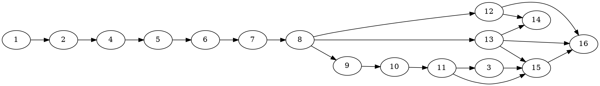

# SYCL 120B Planner-Owned MoE Pointer Tables and Cohort Placement Implementation Plan

> **For Claude:** REQUIRED SUB-SKILL: Use team-driven-development to implement this plan with agent teams.

**Goal:** Make GPT-OSS 120B run safely on B50 and B580+B50 by deriving every MoE pointer table from the full model inventory, materializing it through unified cache before inference, retaining allocations through ref-counted `mem_handle`s and events, and keeping complete expert cohorts on the best planner-approved tier.

**Architecture:** The model plan gains deterministic full-model MoE descriptors and reserves one context’s mandatory per-device CONTROL headroom before weights. After real `llama_context_params` are known, an all-device context transaction materializes context-scoped RUNTIME pools keyed by stable `(plan_id, context_id, device_id)` and returns owner-backed `mem_handle::slice()` views. Each context/device owns independent mutable table contents and routing/transfer buffers. Runtime dispatch performs lookup and upload only, never allocation. Existing secondary dispatch is migrated to the planned pools; complete gate/up/down placement becomes capability-aware before an opt-in scoring experiment.

**Tech Stack:** C++17, SYCL 2020 USM/events, Intel Level Zero, unified-cache TLSF zones, `mem_handle`, CMake/CTest, Bash and Python validation.

**Test Infrastructure:** `test-sycl-layout-choice`, a new backend-free `test-sycl-moe-pointer-table-plan`, existing GPU-only handle tests after reboot, source-contract tests, and real GPT-OSS/Mistral gates.

**Parent tracker:** `llama.cpp-20h4`

---

## Failure and Design Evidence

Fresh-boot build `613df0d45` failed on B50 while warming GPT-OSS 120B at `blk.28.ffn_gate_exps.weight`:

```text
[MOE] Failed to allocate expert pointer table (1024 bytes)
UR_RESULT_ERROR_OUT_OF_RESOURCES
```

The xe driver reset B50 CCS at `2026-07-10 22:39:53`. Evidence:

- `/tmp/b50-gptoss120b-correct-613df0d45-20260710-223544.log`
- `/tmp/b50-gptoss120b-postfail-kernel-20260710-224003.log`

The complete inventory already exists in `src/llama-model.cpp:118-318` and is copied into `g_tensor_inventory_detail` by `populate_inventory_globals()` at `ggml-sycl.cpp:9724-9822`. The defect is that `moe_hybrid_init_once()` at `ggml-sycl.cpp:5960-7173` builds Phase-4 capacity from only its first graph. `moe_preallocate_inference_buffers()` at `unified-cache.cpp:13095-13223` refuses to grow after initialization. A later tensor reaches `ggml_sycl_ensure_moe_ptr_table()` at `ggml-sycl.cpp:43373-43465`, misses the pool, and performs an unplanned must-device STAGING allocation.

The planner also undercounts tables: `populate_host_zone_sizing()` at `unified-cache.cpp:16590-16854` budgets one table per block rather than distinct gate/up/down tables. `unified_cache::ensure_planned_arena_zones()` at `unified-cache.cpp:1735-1864` does not add those bytes to the RUNTIME requirement.

External constraints were checked against current SYCL 2020 USM/event documentation during the preceding memory-safety work. USM storage must not be freed or repurposed while queued commands use it. The web sidecars were started for this plan, but codescout continued returning fetch failures, so no new external API is introduced. Use existing project wrappers only: `unified_allocate`, `mem_handle::slice`, `retain_handles_until_event`, and graph-retained handle sinks.

## Non-Negotiable Invariants

1. Full model inventory, not a graph, determines identities and capacity.
2. Mandatory CONTROL/RUNTIME bytes are reserved before optional expert weights.
3. Unified cache is the only allocator/materializer. No direct SYCL allocation or side cache.
4. Persistent/asynchronous references are copied `mem_handle`s; pointers are ABI views only.
5. Model descriptors are immutable; mutable table/routing storage is context-scoped by stable numeric context ID, never a raw pointer key.
6. Retired pool owners remain alive through every slice, event, graph, task, and binding record.
7. Table contents are not overwritten until the canonical context/device queue’s serialized consumer frontier completes.
8. Live handles are never force-evicted, reaped, or reclaimed by zone reset.
9. Gate/up/down stay a complete cohort when executor eligibility requires all roles.
10. Host-pinned and mmap expert residency remain valid planned tiers; do not force 120B into VRAM.
11. B580+B50 uses isolated contexts and host-bounce aggregation, never unsafe direct P2P.
12. Runtime miss/capacity mismatch fails before submission and selects a planned route.
13. RUNTIME arena admission is mandatory for a local GPU MoE executor; arena-disabled devices use host routes.
14. No GPU workload or probe may run until reboot after the reset above.

---

## Team Topology

**Implementers:** 2 concurrent maximum. Use Luna or Tera for easy, well-bounded implementation tasks; reserve a stronger implementer for allocator, context-lifetime, and secondary-executor migrations. Use Sol for every fresh spec and quality review. Core planner/cache/runtime file owners remain sequential.

| Track | Tasks | Scope |
|---|---|---|
| A | 1, 2, 4 | Inventory, mandatory RUNTIME headroom, context layouts |
| B | 5-8 | Model/context finalization, all callers, content frontier |
| C | 3 | Post-executor opt-in scoring experiment |
| D | 9-11 | Existing secondary pool, TG migration, PP/mixed migration |
| E | 12, 13 | P0 contract and split safety/route harness |
| Lead | 14-16 | P0 landing, diagnostic enablement, final production proof |



| Files | Tasks | Ownership |
|---|---|---|
| `unified-cache.hpp/.cpp` | 1-11 | Sequential core owners; no overlapping implementers |
| `ggml-sycl.cpp` | 2, 5-11 | Sequential core owners |
| `src/llama-model.cpp` | 1, 5 | Sequential model transaction work |
| `src/llama-context.cpp` and context header | 6 | Single context-lifetime owner |
| `mmvq.cpp` | 7, 9-11 | Sequential after runtime fail-closed work |
| `ggml-sycl-test.hpp` | 7-11 | Sequential after Task 7 |
| pointer/context/route tests | 1-11 | Follow matching production owner |
| `tests/test-sycl-moe-handle-resolution.cpp` | 8 | Registered serial GPU test |
| source-contract test | 7 | New file |
| canonical design doc | 12, 15 | Route update follows diagnostic proof |
| gate script and parser test | 13 | New files |

---

## Task 1: Deterministic Full-Model Pointer-Table Inventory

**Track:** A. **Depends on:** none.

**Files:**
- `ggml/src/ggml-sycl/unified-cache.hpp:280-335,433-490`
- `ggml/src/ggml-sycl/unified-cache.cpp:14470-14690,16590-16680`
- New `tests/test-sycl-moe-pointer-table-plan.cpp`
- `ggml/src/ggml-sycl/CMakeLists.txt:1200-1245`

**RED:** Create a backend-free test that builds layers 0 and 28 with gate/up/down tensors, reverses input order, duplicates one exact name, adds ordinary dense/attention tensor names, and adds one malformed name containing `_exps`. Only classified or malformed expert candidates affect completeness; ordinary dense tensors do not. Assert:

```cpp
const auto plan = ggml_sycl::build_moe_ptr_table_plan(inventory, 128);
CHECK(plan.entries.size() == 6u);
CHECK(plan.table_bytes == 1024u);
CHECK(plan.table_stride_bytes == 1024u);
CHECK(plan.total_bytes == 6144u);
CHECK(plan.lookup("blk.28.ffn_gate_exps.weight") != nullptr);
CHECK(plan.lookup("blk.28.ffn_down_exps.weight")->byte_offset == 5u * 1024u);
CHECK(plan.duplicate_count == 1u);
CHECK(plan.malformed_expert_candidate_count == 1u);
CHECK(plan.non_moe_ignored_count > 0u);
CHECK(!plan.structurally_complete);
```

Add a complete 36-layer case and assert 108 descriptors and 110592 total bytes. Add an overflow case:

```cpp
size_t out = 0;
CHECK(!ggml_sycl::checked_moe_ptr_table_pool_bytes(SIZE_MAX, 2, &out));
```

Register the test in the SYCL residency-test list.

**Verify RED:**

```bash
./scripts/sycl-build.sh test-sycl-moe-pointer-table-plan
```

Expected: compile failure because the plan API does not exist.

**GREEN:** Add:

```cpp
struct moe_ptr_table_plan_entry {
    std::string tensor_name;
    int layer_id = -1;
    expert_tensor_role role = expert_tensor_role::UNKNOWN;
    size_t table_index = SIZE_MAX;
    size_t byte_offset = 0;
    size_t byte_size = 0;
};
struct moe_ptr_table_plan {
    std::vector<moe_ptr_table_plan_entry> entries;
    std::unordered_map<std::string, size_t> index_by_name;
    size_t table_bytes = 0;
    size_t table_stride_bytes = 0;
    size_t total_bytes = 0;
    size_t duplicate_count = 0;
    size_t malformed_expert_candidate_count = 0;
    size_t non_moe_ignored_count = 0;
    size_t missing_role_count = 0;
    bool structurally_complete = false;
    const moe_ptr_table_plan_entry * lookup(const std::string & name) const;
};
bool checked_moe_ptr_table_pool_bytes(size_t count, size_t stride, size_t * out);
moe_ptr_table_plan build_moe_ptr_table_plan(
    const std::vector<placement_tensor_info> & inventory, int n_experts);
```

Add `moe_ptr_table_plan moe_pointer_tables;` to `placement_plan`. Also define the schema used by later planner tasks now, with one stable field spelling:

```cpp
enum class moe_executor_route : uint8_t {
    PRIMARY_DEVICE, SECONDARY_HOST_BOUNCE, HOST_PINNED, MMAP_HOST, REJECT,
};
struct moe_executor_capability {
    moe_executor_route route = moe_executor_route::REJECT;
    int device_id = -1;
    bool implementation_candidate = false;
    bool prompt = false;
    bool decode = false;
    bool complete_triplet_required = true;
    bool isolated_context = false;
    bool direct_p2p = false;
};
```

Task 1 supplies conservative capabilities only: primary/host/mmap as already proven; secondary prompt/decode false. Each secondary entry also has `implementation_candidate`, derived only from physical device/context/layout prerequisites. Candidate permits reservation and diagnostic hooks but never production placement.

Implementation rules:
- classify with `expert_tensor_role_from_tensor_name()` and `expert_layer_from_tensor_name()`;
- treat a name as an expert candidate only when it contains `_exps`; ignore all other model tensors;
- count a malformed expert candidate when `_exps` is present but role or layer classification fails;
- dedupe exact full names; a conflicting duplicate shape/type is a fatal inventory conflict;
- sort by `(layer_id, moe_materialization_role_order(role), tensor_name)`;
- compute `table_bytes = n_experts*sizeof(void *)` and 256-byte aligned stride with checked arithmetic;
- assign stable indices/offsets after sorting;
- `build_moe_ptr_table_plan()` reports only structural parsing/duplicate conflicts and does not consume executor capability;
- add `validate_moe_ptr_table_plan_for_capabilities(plan, capabilities)`, which requires all three roles only where an enabled/candidate executor declares `complete_triplet_required`; fused/chunked architectures are not globally rejected;
- use `plan.moe_pointer_tables.total_bytes` in `populate_host_zone_sizing()`, deleting the max-layer heuristic.

Build this plan in both `compute_placement_plan()` and `compute_multi_device_plan()`. Preserve the early `weights_map` descriptor set as the authoritative identity inventory. When `populate_inventory_globals()` receives the later ctx-map/SYCL-buft-filtered snapshot, compare all classified expert names against the early set: retain early descriptors for planning, update only late residency facts, and set a fatal load-finalization error if any classified name changes shape/type or loses required metadata. Add an early-versus-late test where late inventory omits layer 28 and prove the final descriptor set still covers it.

**GREEN gate:**

```bash
./scripts/sycl-build.sh test-sycl-moe-pointer-table-plan
GGML_SYCL_TEST_POINTER_TABLE_RUNTIME=0 ./build/bin/test-sycl-moe-pointer-table-plan
```

Expected PASS without GPU initialization.

**Gotchas:** composite tensor count differs from per-expert placement rows; use full names, not FNV hashes; input order must not affect index; zero experts produces an empty structurally complete plan; unknown ordinary tensors are not errors; capability-specific triplet validation is a separate explicit step before freeze.

**Commit:** `fix(sycl): plan all MoE pointer tables from model inventory`

---

## Task 2: Reserve Mandatory CONTROL Without Double-Charging WEIGHT

**Track:** A. **Depends on:** Task 1.

**Files:** `unified-cache.hpp`, `unified-cache.cpp` at `ensure_planned_arena_zones`, both placement planners, and `ggml-sycl.cpp` at `populate_inventory_globals`.

**RED:** Add pure and planner-integration cases:

```cpp
auto exact = plan_moe_context_control(0, base_context_bytes, base_context_bytes, true);
CHECK(exact.admitted && exact.reason == moe_control_reason::ADMITTED);
auto short_plan = plan_moe_context_control(0, base_context_bytes - 1, base_context_bytes, true);
CHECK(!short_plan.admitted && short_plan.reason == moe_control_reason::RUNTIME_CAPACITY);
```

Run `compute_placement_plan()` and `compute_multi_device_plan()` with mocked arena facts. Assert:
- exact-fit RUNTIME admits CONTROL and still exposes the full WEIGHT-zone capacity to weights;
- one-byte-short RUNTIME rejects that device and places zero local GPU expert cohorts there;
- with arena disabled or RUNTIME unavailable, local GPU MoE capability is rejected and cohorts remain host/mmap; no general raw-device CONTROL allocation is attempted;
- a released 120B plan removes only its own ledger charge; an overlapping dense or MoE plan cannot reset another plan’s bytes;
- two route-capable devices reserve independently before any cohort target is chosen;
- two overlapping model plans whose summed headroom exceeds RUNTIME cause the later plan to reject local GPU MoE rather than over-admit.

**GREEN:** Add `moe_control_reason { ADMITTED, EMPTY_INVENTORY, NO_ROUTE_CAPABILITY, RUNTIME_CAPACITY }`, `moe_context_control_device_plan`, a ref-counted per-physical-device RUNTIME reservation ledger keyed by plan ID, and the pure layout shared with Task 4:

```cpp
static constexpr uint32_t GGML_SYCL_MOE_GPU_UBATCH_MAX = 512;
struct moe_context_control_layout {
    size_t table_count = 0, table_bytes = 0, table_stride = 0;
    size_t tables_offset = 0, ids_offset = 0, ids_bytes = 0;
    size_t compact_offset = 0, compact_bytes = 0;
    size_t missing_offset = 0, missing_bytes = 0, total_bytes = 0;
};
moe_context_control_layout build_moe_context_control_layout(
    const moe_ptr_table_plan &, int n_expert_used, uint32_t n_ubatch);
```

All offsets/additions are checked and aligned once; `total_bytes` is the only reservation value. Ledger admission atomically checks `zone_capacity - zone_used - other outstanding reservations`. A plan begins with one unconsumed base-context reservation; Task 6 atomically converts it to the first context allocation. Additional contexts use real remaining capacity. Final plan-lease release removes only unconsumed charges for that plan; live context allocations remain zone-used until their handles release. New/dense/unload transitions never zero another live plan’s ledger entry.

`populate_inventory_globals()` builds the authoritative pointer plan and ceiling layout, then publishes per-device planned bytes before arena-zone sizing. `ensure_planned_arena_zones()` uses checked addition of PP pipeline, PP MoE oneDNN, and the one already-aligned `base_context_control_total`; it never realigns or separately adds table/routing subregions. Add a strict reservation query that reports whether required bytes fit the planned RUNTIME zone.

Admission is not derived from final placement. First collect route-capable candidate devices from executor capabilities, require an active arena, reserve mandatory per-context CONTROL headroom on each RUNTIME zone, then pack weights only onto admitted candidates. RUNTIME has already been carved from the device arena, so never subtract these bytes again from `zone_capacity(WEIGHT)`. Arena-disabled/failed devices are not local GPU MoE executors; they retain host-pinned/mmap routes. There is no non-arena CONTROL path.

Task 5 may perform one bounded model-plan replan only for an admission failure discovered during its all-device transaction. Task 6 context-time materialization failure disables that device for the context and selects host/mmap; it never silently repacks already-loaded weights.

**Gate:** backend-free pointer-table and layout-choice tests pass with exact-fit, short, dense-reset, single-device, and multi-device fixtures.

**Gotchas:** reservation precedes target selection; host-only routes need no device table; RUNTIME capacity is not WEIGHT capacity; no circular `local_gpu_executor` decision.

**Commit:** `fix(sycl): reserve MoE control before weight placement`

---

## Task 3: Add an Opt-In Complete-Cohort Placement Score Experiment

**Track:** C. **Depends on:** Task 11. This experiment does not block the P0 safety landing.

**Files:** `unified-cache.hpp/.cpp` around existing complete-triplet selection and `tests/test-sycl-layout-choice.cpp`.

**RED:** Capture the current target ordering/arithmetic in golden pure-policy tests. With the env absent or `0`, assert byte-for-byte equivalent decisions and reason strings. With `GGML_SYCL_MOE_COHORT_SCORE=1`, assert CONTROL, route, and capacity failures remain ineligible; capable secondary/host targets score; gate/up/down rows never split.

**GREEN:** Extract a pure score input/helper, but call it only when the env is explicitly `1`. Default/`0` must execute the pre-change placement code path with no new neutral score or tie-breaker. The experimental path may combine queried compute score, existing measured host-bounce penalty, remaining headroom, and locality. Direct P2P remains ineligible.

Do not make the experiment default-on during implementation. Task 16 may recommend default-on only after same-build B50, B580, and dual-device correctness plus the 5% dual-device acceptance threshold. Otherwise keep it diagnostic-off.

**Acceptance:** current default placement is unchanged; the opt-in score never bypasses CONTROL, complete-cohort, layout, executor, or transfer-route capability.

**Gate:** run backend-free layout tests with env unset, `0`, and `1`.

**Commit:** `feat(sycl): add opt-in MoE cohort placement score`

---

## Task 4: Define Strict Context-Scoped CONTROL Layouts and Allocation

**Track:** A. **Depends on:** Task 2. Task 3 must not run concurrently with this file owner.

**Files:** `unified-cache.hpp/.cpp`, pointer-table plan test, SYCL CMake.

**RED:** Test checked/aligned layout for full table area, IDs, compact pointers, and missing flag from `n_expert`, `n_expert_used`, and real context `n_ubatch`. Test padded stride, last/out-of-range table, metadata mismatch, `(plan_id, context_id, device_id)` separation, two contexts, and an `n_ubatch` above the supported GPU ceiling. Runtime-gated test proves one-byte-short RUNTIME rejects without raw fallback.

**GREEN:** Add `alloc_constraints::forbid_vram_zone_fallback`; a failed preferred-zone request returns invalid when set. Use Task 2’s layout as the single sizing source and define ownership:

```cpp
struct moe_context_pool_key {
    uint64_t plan_id = 0;
    uint64_t context_id = 0;
    int device_id = -1;
    bool operator==(const moe_context_pool_key & other) const;
};
struct moe_context_control_pool {
    mem_handle owner;
    moe_context_control_layout layout;
    sycl::event initialization_event;
    bool initialization_event_set = false;
};
```

The model planner publishes one checked/aligned `per_context_control_bytes_at_gpu_ceiling` for headroom. It does not allocate mutable storage. Contexts above the ceiling are ineligible for GPU/secondary MoE and use host/mmap routes; they are never silently undersized.

Materialization API accepts a stable numeric context ID and uses strict CONTROL/RUNTIME allocation. Verify resolved location is device, arena-backed, and RUNTIME. Allocate/zero outside the registry mutex, set ready event, then publish immutable metadata. Registry getters return only owner-backed slices with checked bounds. Retirement drops registry ownership only.

**Acceptance:** no model-global mutable table, no non-arena fallback, one aligned total matches reservation, multiple contexts cannot alias storage, and large ubatch fails over safely.

**Gate:** backend-free tests now; strict-zone branch after reboot.

**Commit:** `fix(sycl): define strict context-scoped MoE control pools`

---

## Task 5: Publish One Versioned Model Plan Across Physical SYCL Devices

**Track:** B. **Depends on:** Task 4.

**Files:** `ggml-sycl.h/.cpp` inventory APIs, `src/llama-model.cpp` early/late helpers and `llama-model.h`, unified-cache plan registry, tests.

**RED:** Test early provisional then late frozen publication; early failure propagation; physical device 0+1 while scheduler visibility is one; late inventory drops an early descriptor; device-1 rejection; overlapping old/new model plans whose aggregate reservation fits and exceeds RUNTIME; plan/context lease release accounting. No partial frozen plan is observable.

**GREEN:** Do not enumerate temporary scheduler backends. A SYCL-global transaction enumerates physical devices/caches from the already-initialized physical device registry (`total_gpu_count` and isolated cache queues), so scheduler hiding cannot omit B50/B580.

The early loader hook returns status and a provisional plan ID. It computes authoritative descriptors/reservations needed by tensor buft selection and publishes state `PROVISIONAL_EARLY`, which runtime/context APIs reject. The late hook reconciles filtered facts, performs at most one excluded-device admission replan, and atomically changes that same versioned candidate to `FROZEN` exactly once. Early and late failures both propagate through `llama_model::load_tensors`; no log-only return/abort.

Expose APIs returning IDs/errors:

```cpp
bool ggml_backend_sycl_begin_model_plan(
    const ggml_sycl_tensor_inventory * inventory,
    uint64_t * plan_id, char * error, size_t error_capacity);
bool ggml_backend_sycl_reconcile_and_finalize_model_plan(
    uint64_t plan_id, const ggml_sycl_tensor_inventory * late_inventory,
    char * error, size_t error_capacity);
void ggml_backend_sycl_release_model_plan(uint64_t plan_id);
```

Store `sycl_plan_id` plus an RAII plan lease in `llama_model`. Published plans live in an ID-keyed registry, not one process-global current plan; overlapping models retain independent immutable plans and aggregate ledger charges. Each context guard retains its own plan lease, so model-plan release cannot erase descriptors while a context binding exists. Model destruction drops only the model lease; final registry/ledger release waits for context leases.

This stage reserves one ceiling-sized base context RUNTIME total before optional weights but creates no mutable pool. Reset per-plan device reservations explicitly; never reuse process-global planned bytes from another model.

**Acceptance:** provisional early placement works; runtime cannot consume provisional state; late freeze occurs once; hidden physical devices participate; old/new models remain isolated by plan ID; loader sees every error.

**Gate:** backend-free model-plan registry/transaction tests and full compile.

**Commit:** `fix(sycl): publish versioned MoE plans across physical devices`

---

## Task 6: Finalize Per-Context Pools After Real Context Parameters Are Known

**Track:** B. **Depends on:** Task 5.

**Files:** `ggml/include/ggml-sycl.h`, `ggml-sycl.cpp` runtime-context API, `src/llama-context.cpp`, `llama-context.h`, `unified-cache.hpp/.cpp`, context-pool tests.

**RED:** Create two stable numeric context IDs sharing one model plan and overlapping contexts for two different model plan IDs. Test different `n_ubatch`, independent owners/content, one device failure without partial context publication, second-context pressure, oversized GPU ubatch host fallback, post-finalization constructor exception, and release while an event-retained slice remains live.

**GREEN:** Extend the existing `ggml_backend_sycl_set_runtime_context()` flow into an all-device context transaction. Add public APIs with these semantics:

```cpp
bool ggml_backend_sycl_prepare_runtime_context(
    ggml_backend_t backend, uint64_t plan_id, uint64_t context_id,
    uint32_t n_ctx, uint32_t n_ubatch, uint32_t n_seq_max,
    char * error, size_t error_capacity);
bool ggml_backend_sycl_finalize_runtime_context(
    uint64_t plan_id, uint64_t context_id,
    char * error, size_t error_capacity);
void ggml_backend_sycl_release_runtime_context(
    uint64_t plan_id, uint64_t context_id);
```

`llama_context` copies its model’s retained `sycl_plan_id`, owns a monotonic `sycl_context_id`, and installs an RAII `sycl_context_plan_guard` member before publication. It prepares each SYCL backend with real params, then finalizes once before graph construction/submission. The guard drains canonical queues and releases `(plan_id, context_id)` on normal destruction and on any later constructor exception; member unwinding, not `llama_context::~llama_context()`, provides exception safety. Finalization materializes context/device pools only for that model plan. Retained handles still decide final free.

For `n_ubatch > 512`, insufficient RUNTIME, or missing device capability, publish that device as host/mmap-only for this context. If no executor route remains, context construction returns a normal error before inference.

Create context binding records keyed by stable plan/context/device plus full tensor identity. Declare `moe_context_binding_status { PREPLANNED_SLICE, MISSING_DESCRIPTOR, PLAN_INCOMPLETE, CONTEXT_NOT_FINALIZED, CONTROL_REJECTED, POOL_UNAVAILABLE, METADATA_MISMATCH, SLICE_INVALID, FOREIGN_QUEUE }` and a pure `plan_moe_context_binding()` whose result always has `runtime_allocation_required=false`. First touch obtains the descriptor and owner-backed table slice and records content state there. Do not store mutable context table handles/events in the shared model tensor extra, and do not key by a context pointer. Tensor extras continue to own canonical expert weight handles only, using existing registered ownership/teardown paths.

**Acceptance:** real context params size every mutable pool; multiple contexts cannot race/alias table contents; all-device context publish is atomic; release is refcount-safe; no first-touch allocation.

**Gate:** backend-free context registry/state tests and full compile.

**Commit:** `fix(sycl): finalize per-context MoE control before graph submission`

---

## Task 7: Convert Every Runtime Caller to Allocation-Free Fail-Closed Routing

**Track:** B. **Depends on:** Task 6.

**Files:** `ggml-sycl.cpp` at `ggml_sycl_upload_moe_transient_ptr_table`, `ggml_sycl_update_moe_ptr_table`, graph preload, and synthetic profile probe; `mmvq.cpp` compact storage; new `tests/test-sycl-moe-pointer-table-source.sh`; pointer-table decision tests; CMake.

**RED:** The source contract enumerates all four current ensure call sites near baseline lines 43002, 44653, 47186, and 63742. It requires every result to be checked before submission, requires full tensor name input, rejects graph-derived table index lookup, and rejects table/IDs/compact/missing `unified_alloc`, `unified_allocate`, `malloc_device`, and `allow_alloc=true` on a frozen plan. It requires `moe_hybrid_init_once()` not to call table/routing preallocation.

Add caller-level pure/test-hook cases for each binding failure status. For transient upload, update, and graph preload, prove the function returns a route miss before copy/kernel submission. Remove the disabled synthetic profiling pointer-table mutation entirely, or make the probe borrow a real planned tensor slice without overwriting production table contents; the simpler required implementation is removal.

**GREEN:** Change ensure to return `moe_context_binding_status` and accept `(ggml_backend_sycl_context &, const ggml_tensor * src0, int64_t n_experts)`. It resolves the stable context ID, full `src0->name`, descriptor, canonical queue, and Task 6 context binding only. It performs no allocation, capacity growth, eviction, wait, tensor-extra creation, or zone operation.

Convert all callers:
1. `ggml_sycl_upload_moe_transient_ptr_table()` returns null/status before table copy on failure.
2. `ggml_sycl_update_moe_ptr_table()` returns false before upload/kernel submission.
3. graph preload checks failure and disables that graph route or selects the planned host route; it may not ignore the result.
4. delete the `n_gpu_probe=0` synthetic allocation/table overwrite path and use normal kernel profiling counters instead.

Remove pointer-table work from `moe_hybrid_init_once()` while keeping `g_moe_layer_seq` predictor-only. Frozen-plan calls to `ggml_sycl_moe_prepare_compact_list()` pass `allow_alloc=false`; IDs staging and missing-flag resolution also fail before submission when the planned slice is unavailable.

Add per-kind diagnostics/counters: descriptor coverage, table binding failures by reason, table runtime allocations, IDs runtime allocations, compact runtime allocations, missing-flag runtime allocations. All allocation counters must remain zero after finalization.

**Acceptance:** every current and future caller is source-contract covered; no unplanned CONTROL allocation remains; every failure selects an already-planned host/secondary route or returns a loader/runtime error before submission.

**Gate:** source contract, pure decision tests, layout-choice tests, and full build pass.

**Commit:** `fix(sycl): fail closed at every MoE control caller`

---

## Task 8: Serialize Each Context/Device Table’s Upload and Consumer Frontier

**Track:** B. **Depends on:** Task 7.

**Files:** context binding state in `unified-cache.hpp/.cpp`, writers/consumers and all graph replay sites in `ggml-sycl.cpp`, MMVQ direct graph-table writer near baseline `mmvq.cpp:20254` and consumer/retainer near `:20941`, test hooks, handle test, source contract, SYCL CMake.

**RED:** Test direct retention, upload chaining, record/replay/update, teardown/model reuse, old-plan isolation, foreign queue rejection, and two CPU threads attempting interleaved upload-A/upload-B/consumer-A. Add a pair-kernel fixture consuming multiple role tables plus shared IDs/compact/missing state, and an overlapping-binding graph replay fixture.

**GREEN:** Each table binding and the context/device shared IDs/compact/missing record has one canonical in-order queue, mutex, and frontier. Introduce `moe_table_dispatch_transaction`: collect all unique table/routing binding keys for one upload+consumer, sort keys, acquire mutexes in stable order, append every frontier, submit all required uploads followed by the kernel/replay on the canonical queue, then publish one dominating completion event to every record before unlocking. Upload and consumption cannot be separate transactions, so upload A cannot be displaced by B before consumer A. Foreign queue/context fails before submission; secondary devices have separate records, so no cross-context event is used.

Centralize every write through the transaction helper: transient/update paths and the direct MMVQ graph-recording write at `mmvq.cpp:20254`. Enumerate all writers and consumers in the source contract. During capture, record sorted binding IDs used by each executable graph. Every replay site submits a dominating barrier/completion and atomically publishes it to all captured records under the same sorted lock order; ignored replay returns are forbidden and an older replay cannot replace a newer frontier. Graph objects separately retain allocation handles. Context release removes registry ownership only after the context drains its canonical queues; old-plan/context events cannot mutate new binding state.

Register `test-sycl-moe-handle-resolution` with labels `sycl;gpu;quarantine;serial`, resource lock, and timeout.

**Acceptance:** a later upload cannot overtake either of two consumers; replay is covered; allocations and contents are safe; teardown/reuse is isolated by numeric plan/context IDs.

**Gate:** backend-free state tests now; serial GPU tests after reboot.

**Commit:** `fix(sycl): serialize per-context MoE table content lifetime`

---

## Task 9: Inventory and Materialize Every Existing Secondary Executor Pool

**Track:** D. **Depends on:** Task 8.

**Files:** all `secondary_ring_buffers` and `secondary_layer_tg_buffers` definitions/instances near baseline 54973-55166, 58154, 59688, 61635; `g_secondary_staging_alloc` near 5699-5702/7058; fusion shared activation near 56711; multi-GPU shared activation near 65685; unified-cache context/pair registries; source contract; tests.

**RED:** An exhaustive source contract lists every growable secondary allocation/call path, including the global secondary staging allocation and both shared-activation allocations outside the buffer structs. Pure layout tests cover ringed primary/target activation/output staging, activation aggregation, ringed/batched Q8, Q8 gate/down, full/batched activation, primary scatter, role-specific gate/up/down pointer tables, IDs, biases, row indices, device/host aggregation, reduction/gate weights, reduction output, and route/gate readbacks. Test exact/short host/device capacity, all ring slots, two contexts, and primary-target pair keys.

**GREEN:** Define immutable base/pair layouts with a named checked offset/size for every contracted resource. Key pair pools by `(plan_id, context_id, primary_device_id, target_device_id)`. Values own host-pinned base-USM blocks and target-device blocks; exposed buffers are owner-backed slices.

Use Task 1’s conservative `implementation_candidate`, not production `enabled`, to reserve/materialize diagnostic pair pools. Production placement still ignores candidates until Task 15.

Host pointers requiring a USM allocation base use a separately budgeted `reserved_host_base_usm_bytes` ledger inside unified cache. Add `forbid_unreserved_host_base`; standalone `require_host_usm_base` allocation atomically charges that reservation or rejects. `forbid_host_zone_growth` covers ordinary host-zone slices. Target allocations use strict planned RUNTIME/STAGING capacity. Allocation/zeroing happens outside locks; immutable metadata publishes atomically.

Replace every `secondary_ring_buffers` and `secondary_layer_tg_buffers` thread-local grow/allocator instance, `g_secondary_staging_alloc`, fusion shared activation, and multi-GPU shared activation with planned binding views or delete the redundant path. Runtime source contract rejects any remaining grow/allocation. Do not change TG/PP selection yet.

**Acceptance:** every current mixed/fused/split-down secondary resource and instance is planned; no standalone allocation escapes its reservation; candidate pools exist for diagnostic proof while production capability remains false.

**Gate:** backend-free layouts, registry, source contract; GPU resolution after reboot.

**Commit:** `fix(sycl): preplan all existing secondary MoE pools`

---

## Task 10: Migrate Existing Secondary TG Dispatch to Planned Pools

**Track:** D. **Depends on:** Task 9.

**Files:** existing `dispatch_experts_secondary_gpu_impl`, `secondary_layer_tg_buffers`, mixed/fused TG calls including baseline 57038, 58154 and 59688 in `ggml-sycl.cpp`, `mmvq.cpp`, test hooks and source contract.

**RED:** Backend-free route checks plus GPU-gated `n_tokens=1` equivalence, mixed primary/secondary selected slots, short pool, and zero-runtime-allocation cases. Invoke the executor directly through a diagnostic test hook; production planner capability remains false.

**GREEN:** Converge mixed and fused TG paths on the existing `dispatch_experts_secondary_gpu_impl` plus planned Task 9 bindings; delete redundant TG buffer ownership rather than add another executor abstraction. Replace every TG growable access with slices. Preserve isolated single-device target queue, host waits only at cross-context boundaries, local events/handle retention, output slot semantics, and host fallback. Reject missing/undersized bindings before submission. No pointer/device event crosses contexts.

**Acceptance:** TG reference equivalence, mixed slots correct, no dynamic staging allocation, production secondary capability still off.

**Gate:** build/backend-free now; diagnostic GPU hook in Task 15.

**Commit:** `fix(sycl): migrate secondary TG dispatch to planned pools`

---

## Task 11: Migrate Existing Secondary PP/Mixed Dispatch to Planned Pools

**Track:** D. **Depends on:** Task 10.

**Files:** PP secondary call near baseline 70227, hybrid and split-down call/instance near 61635, `dispatch_experts_secondary_gpu_impl`, planner capability tests and source contract.

**RED:** GPU-gated `n_tokens=2` and PP smoke equivalence, mixed primary/secondary/host groups, ring reuse, aggregation/reduction, and no-runtime-allocation. Production capability remains false; a diagnostic direct test hook exercises the path.

**GREEN:** Route PP, hybrid, and split-down secondary calls through the same planned-pool executor and remove independent buffer ownership. Preserve complete cohort placement and exact output row/scatter/reduction semantics. Each ring reuse depends on its context/device frontier. Unsupported layout/type or pool mismatch routes host/primary before submission. Add a capability-candidate function, but keep published production prompt/decode flags false until Task 15’s clean-boot diagnostic proof.

**Acceptance:** TG and PP use one executor and planned pools; mixed routes are numerically equivalent; no runtime growth; production default remains safe.

**Gate:** build/backend-free now; diagnostic GPU proof in Task 15.

**Commit:** `fix(sycl): migrate secondary PP dispatch to planned pools`

---

## Task 12: Update the Canonical P0 Memory Contract

**Track:** E. **Depends on:** Task 8.

**File:** `docs/design/sycl-canonical-memory-architecture.md`.

**RED:** A script requires these exact concepts: full model MoE pointer-table inventory; mandatory CONTROL capacity; strict RUNTIME no-fallback allocation; owner-backed `mem_handle` slices; allocation lifetime and content/replay lifetime; no graph-compute growth; complete gate/up/down cohort; capability-gated host/secondary route; isolated host-bounce contexts.

**GREEN:** Document authoritative early inventory reconciliation, all-device model transactions, numeric context IDs, per-context mutable pools, mandatory active RUNTIME arena, plan/context finalization error channels, allocation-free context binding, serialized consumer frontiers, complete cohort placement, host/mmap independence, and all-caller fail-closed behavior. State that secondary capability remains off until Tasks 15-16 prove it. Include:

```markdown
**MoE pointer-table lifetime invariant:** A table pool is owned by a ref-counted
`mem_handle`; every table is an owner-backed `mem_handle::slice()`. Releasing a
registry or model-plan reference cannot free the allocation while a context binding,
queued event, CPU task, or executable graph retains any handle copy. Allocation
lifetime and content lifetime are separate: a new upload must depend on the last
direct consumer and every executable-graph replay that consumed prior contents.
```

State that graph compute cannot allocate/grow CONTROL pools, force-evict, force-reap, or reset zones. Pointer-table CONTROL placement never implies expert-weight placement.

**Gate:** contract script and source-contract test pass.

**Commit:** `docs(sycl): define planned MoE control and routing lifetime`

---

## Task 13: Add a Quarantine-Safe Single/Dual-Device Gate Harness

**Track:** E. **Depends on:** Task 8.

**Files:** new `scripts/sycl-gptoss120b-pointer-table-gates.sh`, new `tests/test-sycl-gptoss120b-pointer-table-gates.py`, `tests/CMakeLists.txt`.

**RED:** Dry-run parser tests assert literal paths:

```text
/Storage/GenAI/models/gpt-oss-20b-mxfp4.gguf
/Storage/GenAI/models/gpt-oss-120b-mxfp4-00001-of-00003.gguf
/Storage/GenAI/models/mistral-7b-v0.1.Q4_0.gguf
```

No glob or alternate shard selection is permitted. Tests require canonical Harmony args, selectors `level_zero:1`, `level_zero:0`, `level_zero:0,1`, `-fa 1` for the B580 Mistral guardrail, score env absent/`0` safe baseline and explicit `1` experiment, exact diagnostic counters, and absence of unsafe probes/P2P/PP-pipeline/graphlet envs.

The exact 120B count command template is:

```bash
ONEAPI_DEVICE_SELECTOR="$selector" ./build/bin/llama-cli \
  -m /Storage/GenAI/models/gpt-oss-120b-mxfp4-00001-of-00003.gguf -ngl 99 \
  -cnv -st --simple-io --no-display-prompt \
  --chat-template-kwargs '{"reasoning_effort":"medium"}' \
  --reasoning-format none --reasoning-budget 0 \
  -p 'Count from 1 to 5. Answer with only: 1, 2, 3, 4, 5' \
  -n 48 --seed 42 --temp 0
```

The measured 120B bench template is `llama-bench -m /Storage/GenAI/models/gpt-oss-120b-mxfp4-00001-of-00003.gguf -p 512 -n 128 -ngl 99 -r 3`; run and discard an otherwise identical `-r 1` warmup first. The Mistral templates add `-fa 1` and use the same warmup/`-r 3` rule.

**GREEN:** Support only:

```text
--dry-run --suite safety|route
--execute --suite safety|route --acknowledge-clean-reboot --reservation-token PATH
```

The reservation token is issued externally by the lead after coordinating with `/Apps/llama.cpp@llama.cpp`; the script cannot infer remote-pi ownership. Execute mode requires an existing token whose content names this worktree, boot ID, B50, B580, and expiry. It also requires oneAPI, models/binaries, matching current boot ID, and explicit acknowledgement. Wrap unit tests in a 10-minute hard timeout, count gates in 30 minutes, and bench invocations in 60 minutes, each with TERM then KILL after 30 seconds. After removing explicitly allowed topology lines matching `cannot be used for peer-to-peer DMA|do not share an upstream bridge|P2P.*disabled`, kernel preflight and every delta reject case-insensitive `\b(reset|stuck|hang|watchdog)\b|OUT_OF_(DEVICE_)?MEMORY|UR_RESULT_ERROR|xe.*(oops|fault|error)|GuC.*error`; any unmatched xe error is fatal. Dry-run performs no backend initialization.

Serialize:
1. B50 20B canonical count plus score-off PP512/TG128 (`-r 1` warmup, `-r 3` measured); the route suite also runs score-on PP512/TG128.
2. B50 120B canonical count and score-off PP512/TG128 with the same warmup/measurement rule; the route suite also runs score-on PP512/TG128.
3. B580 Mistral canonical count and `-fa 1` PP512/TG128.
4. B580 120B valid host-assisted route if capability allows.
5. B580+B50 120B count with score off.
6. B580+B50 120B score-off versus score-on PP512/TG128.

The `safety` suite runs cases 1-3 with score off. The `route` suite runs cases 1-3 and 5-6 after capability enablement, including both B50 20B and 120B score-off/score-on. Dry-run parser tests assert the literal 20B model path, PP512/TG128 args, `-r 1` discarded warmup, and `-r 3` measured commands for both score states. Every bench performs exactly one warmup and three measured iterations. Store stdout/stderr, resolved env, timing, placement/cohort routes, full descriptor coverage, table/IDs/compact/missing and secondary STAGING allocation counters, host-bounce bytes/time, and kernel-log delta in a timestamped `/tmp` directory. Stop after every command on OOR, watchdog, reset, hang, route miss, nonzero runtime allocation, timeout, or wrong output. The stdout parser requires a literal line prefix `: 1, 2, 3, 4, 5` for GPT-OSS Harmony output and `1, 2, 3, 4, 5` for Mistral; the leading GPT colon is mandatory. Never call `sycl-ls`, GPU metadata-only binaries, `lsof`, fdinfo, debugfs, or reset APIs.

Do not set a split ratio. The planner owns placement. Score remains off unless Task 16 accepts it.

**Gate:** Python dry-run tests and the registered non-GPU script test pass.

**Commit:** `test(sycl): add reserved 120B pointer-table placement gates`

---

## Task 14: Fresh-Boot P0 Pointer-Table Safety Validation and Landing Gate

**Owner:** lead. **Depends on:** Tasks 8, 12, 13.

This gate is independent of the secondary-executor work. No source changes during validation; reopen the smallest safety task on failure.

After reboot and external reservation token, build once. Run only enumerated backend-free tests, then serial B50 runtime pool/handle tests. Never run full parallel CTest. Run Task 13 with `--suite safety` for:
- B50 20B canonical count and PP512/TG128;
- B50 120B canonical count and PP512/TG128 through primary/host planned routes;
- B580 Mistral canonical count and `-fa 1` PP512/TG128 regression.

Machine acceptance:
- exact canonical outputs;
- authoritative descriptor coverage including layer 28+;
- zero runtime table/IDs/compact/missing allocations;
- strict short-zone case rejects with zero raw fallback;
- no OOR/watchdog/reset/hang/stuck process;
- B50 20B medians: PP512 >= 1100 tok/s and TG128 >= 48 tok/s;
- B580 Mistral medians: PP512 > 2000 tok/s and TG128 > 85 tok/s;
- B50 120B PP/TG medians are both > 0 and three measured rows have max/min <= 1.10.

On pass, attach artifacts to `llama.cpp-20h4`, close/land the P0 safety children, format before the final safety commit, rebase, rerun the enumerated gates, and push. Route tasks remain open under `llama.cpp-pebz`; they do not block the P0 landing.

---

## Task 15: Clean-Boot Diagnostic Secondary Proof and Capability Enablement

**Owner:** lead plus Task 11 implementer. **Depends on:** Tasks 3, 11, 13.

Production secondary capability is still false at entry. After a clean reboot/reservation, run only diagnostic direct hooks with `GGML_SYCL_MOE_SECONDARY_FORCE_VALIDATE=1` for TG, PP, mixed routes, ring reuse, and strict pool failure. The force flag is test-hook scoped and cannot alter normal model planner capability.

If every numeric, ownership, allocation-counter, and kernel-log gate passes, make a separate small enablement commit that publishes prompt/decode capability only for the proven type/layout/device-pair combinations and updates the route section of the canonical doc. Run spec and Sol quality review, backend-free tests, and the diagnostic proof again. If any proof fails, do not enable production capability; record artifacts and keep host/primary defaults.

This task resolves the implementation-proof/enablement ordering. The final production validation begins only after the enablement commit and performs no source edits.

---

## Task 16: No-Source-Change Production Route and Performance Validation

**Owner:** lead. **Depends on:** Tasks 12, 13, 15.

Acquire a fresh reservation; require a clean tree containing the reviewed enablement commit. Run Task 13 `--suite route` serially:
- B50 20B and 120B score-off/score-on;
- B580 Mistral `-fa 1` regression;
- B580+B50 120B canonical count and PP512/TG128 score-off/score-on.

Use one warmup and three measured rows. Machine acceptance:
- all canonical outputs and all Task 14 hard guardrails still pass;
- zero runtime CONTROL/STAGING allocations and no driver/kernel failure;
- logs prove actual secondary cohorts, isolated single-device contexts, host-bounce bytes/time, and no peer import/copy;
- B50 120B score-on PP and TG are each >= 97% of score-off;
- dual-device score-on improves at least one median by >= 5% and the other is >= 97% of score-off;
- every complete gate/up/down cohort has one target and mixed output slots pass equivalence.

If score-on misses, keep `GGML_SYCL_MOE_COHORT_SCORE` default off. If production secondary correctness fails, revert only the enablement commit while retaining planned-pool safety infrastructure. Attach artifacts to `llama.cpp-pebz`, then perform the clean-tree rebase/push workflow.

---

## Branch and Landing Isolation

The P0 branch/worktree contains only Tasks 1, 2, 4-8, 12-14. Route Tasks 9-11, 3, and 15-16 run in a separate route worktree forked from the reviewed Task 8 commit. Their commits are under a merge embargo: they cannot enter the P0 branch before Task 14 passes and is pushed. After the P0 push, rebase the route branch onto that exact pushed commit, then continue route review/validation. Shared-file ownership is sequential within each branch.

## Review and Landing Workflow

For every implementation task:
1. Implementer claims the tracker child with `claim_as` and marks team status working.
2. Implementer follows RED then GREEN, commits, and reports tests/commit.
3. Lead spawns a fresh spec reviewer. Implementer fixes all spec findings.
4. Lead spawns a fresh quality reviewer. Implementer fixes all quality findings.
5. Lead closes the child task immediately after approval so dependents become ready.
6. Lead merges or cherry-picks in dependency order.

Before each implementation commit, run `git clang-format`, `git diff --check`, the task’s focused gates, and commit any formatting change with that task. Task 14 performs the P0 push; after Task 16, require a clean route branch tree, then:

```bash
git status --short
git pull --rebase
./scripts/sycl-build.sh
# Re-run the explicitly enumerated backend-free gates and serial GPU gates.
git status --short
bd sync
git push
git status
```

Do not replace the explicit gate list with a parallel full CTest run on this host. Work is complete only after push succeeds, the tree is clean and upstream, and both parent trackers contain artifact paths, performance rows, correctness outputs, descriptor coverage, all four runtime-allocation counters, route diagnostics, and kernel-log verdict.

## Tracker Children to Create Before Implementation

Create these children under `llama.cpp-20h4`; route/performance children also reference `llama.cpp-pebz`:

1. `[SYCL-120B] Build authoritative full-model descriptors and capability schema`
2. `[SYCL-120B] Reserve mandatory active-RUNTIME context headroom`
3. `[SYCL-120B] Add opt-in complete-cohort placement scoring`
4. `[SYCL-120B] Define strict context-scoped CONTROL layouts`
5. `[SYCL-120B] Finalize the model plan as one all-device transaction`
6. `[SYCL-120B] Finalize real-parameter per-context CONTROL pools`
7. `[SYCL-120B] Fail closed at every runtime control caller`
8. `[SYCL-120B] Serialize per-context table consumer frontiers`
9. `[SYCL-120B] Plan the existing secondary executor transfer pools`
10. `[SYCL-120B] Migrate secondary TG dispatch to planned pools`
11. `[SYCL-120B] Migrate secondary PP/mixed dispatch to planned pools`
12. `[SYCL-120B] Document the canonical P0 control contract`
13. `[SYCL-120B] Add reserved safety/route gate harness`
14. `[SYCL-120B] Validate and land B50 pointer-table safety after reboot`
15. `[SYCL-120B] Prove secondary routes diagnostically and enable capability`
16. `[SYCL-120B] Validate production B50/B580 dual-device routing`

Use the dependency graph above. Task 14 is the independent P0 landing gate. Tasks 3 and 9-11 do not block it. Tasks 14-16 require a clean reboot and external reservation token; Task 16 also requires a reviewed Task 15 enablement commit and permits no source changes.
