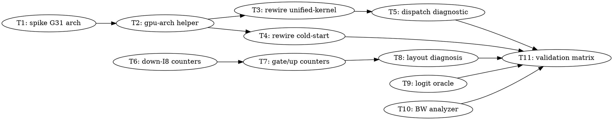

# SYCL GPT-OSS TG/PP: B70 Capability Detection + MoE Down-Layout Observability

> **For Claude:** REQUIRED SUB-SKILL: Use team-driven-development to implement this plan with agent teams.

**Goal:** Restore the optimized unified-kernel path on the Arc Pro B70 (currently misdetected as Arc Alchemist and running legacy kernels), and make the MoE expert-layout planner's decisions observable so the B50 down-projection's 67 GB/s vs 150 GB/s gap can be diagnosed from evidence rather than guessed.

**Architecture:** Replace brittle device-name substring matching with SYCL architecture-enum-derived capability detection in a single shared helper, then rewire both duplicated copies to it. Independently, surface the unified cache's existing-but-silent MoE layout upgrade skip counters as a diagnostic. A logit-level correctness oracle and a bandwidth-derivation analyzer are built in parallel so every later performance claim is falsifiable.

**Tech Stack:** Intel oneAPI DPC++ 2026.1 (`icpx`), SYCL 2020 + `sycl::ext::oneapi::experimental` architecture extension, ggml SYCL backend, CTest, Python 3 for analysis scripts.

**Test Infrastructure:** C++ tests live in `ggml/src/ggml-sycl/tests/*.cpp`, registered in `ggml/src/ggml-sycl/CMakeLists.txt` via `add_executable` + `add_test(NAME <n> COMMAND <target>)` + `set_tests_properties(... LABELS "sycl;..." TIMEOUT <n>)`. Run with `ctest --test-dir build -R <name> -V`. Python analysis tests live in `tests/test-sycl-*.py`, run with `python3 -m pytest`. Build with `TMPDIR=/tmp ./scripts/sycl-build.sh <target>` — **`TMPDIR=/tmp` is mandatory**, the AOT link exhausts the root filesystem otherwise.

---

## Measured Baseline (build `dc02e1f83`, driver 26.27.39122.12)

| Device | Selector | PP512 | TG128 | Path |
|---|---|---|---|---|
| Arc Pro B50 (G21, 128 CU, 16 GB) | `level_zero:1` | ~886 | ~30.0 | unified kernel ✅ |
| Arc Pro B70 (G31, 256 CU, 31 GB) | `level_zero:0` | 803.93 | 19.79 | **legacy fallback** ❌ |

MoE kernel efficiency on B50 (exact bytes: 4 experts × 4.2 MiB per matrix per layer):

| kernel | layout | bytes/layer | mean | achieved BW |
|---|---|---|---|---|
| `mxfp4.gateup.xmx_tiled_dpas_m2` | `XMX_TILED` | 33.6 MiB | 235 µs | **150 GB/s** |
| `mxfp4.soa.batched` (down) | `SOA` | 16.8 MiB | 264 µs | **67 GB/s** |

Device names (from `clinfo`): `Intel(R) Arc(TM) Pro B70 Graphics`, `Intel(R) Arc(TM) Pro B50 Graphics`.

---

## Team Topology

**Recommended implementers:** 3 concurrent (based on 4 parallel tracks — execution spawns one ephemeral implementer PER TASK)
**Reviewers:** spec + quality, spawned FRESH per review (not a standing pair; see team-driven-development)

### Parallel Tracks

| Track | Tasks | Description |
|-------|-------|-------------|
| A | 1, 2, 3, 4, 5 | B70 capability detection: spike → shared helper → rewire both copies → diagnostic |
| B | 6, 7, 8 | MoE layout observability: down-I8 counters → gate/up counters → diagnosis |
| C | 9 | Logit correctness oracle |
| D | 10 | Bandwidth derivation from kernel profile |
| — | 11 | Validation matrix + baselines doc (convergence) |

### Dependency Graph



### File Ownership Map

| File/Directory | Tasks | Conflict Risk |
|----------------|-------|---------------|
| `ggml/src/ggml-sycl/gpu-arch.hpp` / `.cpp` (new) | 2 | None (single task) |
| `ggml/src/ggml-sycl/unified-kernel.cpp` | 3, 5 | Sequential (same track, 5 depends on 3) |
| `ggml/src/ggml-sycl/cold-start.cpp` / `.hpp` | 4 | None (single task) |
| `ggml/src/ggml-sycl/dispatch.hpp` | 5 | None (single task) |
| `ggml/src/ggml-sycl/unified-cache.cpp` | 6, 7 | Sequential (same track, 7 depends on 6) |
| `ggml/src/ggml-sycl/tests/test-gpu-arch.cpp` (new) | 2 | None |
| `ggml/src/ggml-sycl/tests/test-esimd-dpas-gate.cpp` (new) | 5 | None |
| `ggml/src/ggml-sycl/CMakeLists.txt` | 2, 4, 5 | **Shared — all Track A, strictly sequential; append-only edits** |
| `scripts/sycl-logit-oracle.py` (new) | 9 | None |
| `scripts/parse-sycl-kernel-profile.py` | 10 | None |
| `tests/test-sycl-logit-oracle.py` (new) | 9 | None |
| `tests/test-sycl-kernel-profile-bandwidth.py` (new) | 10 | None |
| `docs/backend/sycl-perf-baselines.md` | 11 | None (runs last) |

---

### Task 1: Spike — confirm G31 architecture enum resolves on the B70

**Track:** A
**Depends on:** None
**File scope:**
- Create: `/tmp/spike-g31-arch.cpp` (throwaway, not committed)

**Description:**

Before rewriting family detection we must confirm two unknowns: (a) the runtime actually reports `intel_gpu_bmg_g31` for the B70, and (b) whether ESIMD dpas kernels *run correctly* on G31 once enabled. If (b) fails, Tasks 2–5 must gate differently. This is a spike: it produces knowledge and a recorded result, not shipped code.

**Acceptance Criteria:**

- [ ] The exact `architecture` enum value reported by each of the 3 devices is recorded in the task comment
- [ ] Recorded whether B70 reports `intel_gpu_bmg_g31`
- [ ] Result recorded on tracker task before Task 2 starts

**Implementation Guide:**

1. **Write the probe:**

```cpp
// /tmp/spike-g31-arch.cpp
#include <sycl/sycl.hpp>
#include <cstdio>

namespace syclex = sycl::ext::oneapi::experimental;

int main() {
    for (const auto & d : sycl::device::get_devices(sycl::info::device_type::gpu)) {
        const auto name = d.get_info<sycl::info::device::name>();
        const auto arch = d.get_info<syclex::info::device::architecture>();
        std::printf("name=%-42s arch_raw=%d cu=%u\n",
                    name.c_str(), static_cast<int>(arch),
                    d.get_info<sycl::info::device::max_compute_units>());
        std::printf("   is_bmg_g21=%d is_bmg_g31=%d\n",
                    arch == syclex::architecture::intel_gpu_bmg_g21,
                    arch == syclex::architecture::intel_gpu_bmg_g31);
    }
    return 0;
}
```

Run:
```bash
source /opt/intel/oneapi/setvars.sh --force
icpx -fsycl /tmp/spike-g31-arch.cpp -o /tmp/spike-g31-arch
ONEAPI_DEVICE_SELECTOR=level_zero:gpu /tmp/spike-g31-arch
```

Expected: three lines; the `Intel(R) Arc(TM) Pro B70 Graphics` line should show `is_bmg_g31=1`, and `Intel(R) Arc(TM) Pro B50 Graphics` should show `is_bmg_g21=1`.

2. **Record the outcome** on the tracker task with `task_comment_add`, quoting the raw output verbatim.

**Commit:** None — spike artifacts are not committed.

**Gotchas:**
- Do **not** run `sycl-ls`; it has hung this host (CLAUDE.md hang hazards). This probe enumerates devices directly and exits, which is safe.
- If the B70 reports something other than `intel_gpu_bmg_g31`, STOP and report — Task 2's mapping table must use the real value.
- `architecture` is an experimental extension; it must be queried as `syclex::info::device::architecture` (verified present at `/opt/intel/oneapi/compiler/2026.1/include/sycl/info/ext_oneapi_device_traits.def:62`).

---

### Task 2: Shared architecture-derived GPU family helper

**Track:** A
**Depends on:** Task 1
**File scope:**
- Create: `ggml/src/ggml-sycl/gpu-arch.hpp`
- Create: `ggml/src/ggml-sycl/gpu-arch.cpp`
- Create: `ggml/src/ggml-sycl/tests/test-gpu-arch.cpp`
- Modify: `ggml/src/ggml-sycl/CMakeLists.txt` (append test registration)

**Description:**

Create ONE canonical family-detection implementation driven by the SYCL architecture enum rather than device-name substrings. Both existing copies (`unified-kernel.cpp:129`, `cold-start.cpp:42`) will be rewired to it in Tasks 3 and 4. The name-based fallback is retained ONLY for devices whose architecture is `unknown`, so no currently-working device regresses.

**Acceptance Criteria:**

- [ ] `ggml_sycl_family_from_architecture()` maps `intel_gpu_bmg_g21` and `intel_gpu_bmg_g31` to Battlemage
- [ ] Alchemist architectures (`intel_gpu_acm_g10/g11/g12`) map to Alchemist
- [ ] `intel_gpu_pvc` maps to Data Center Max
- [ ] Unknown architecture falls back to the legacy name heuristic
- [ ] The name fallback classifies `"Intel(R) Arc(TM) Pro B70 Graphics"` as Battlemage, NOT Alchemist
- [ ] All tests pass

**Implementation Guide:**

1. **Test: architecture mapping and the B70 name-fallback regression**

```cpp
// ggml/src/ggml-sycl/tests/test-gpu-arch.cpp
#include "gpu-arch.hpp"
#include <cassert>
#include <cstdio>

namespace syclex = sycl::ext::oneapi::experimental;
using ggml_sycl::sycl_gpu_family;

int main() {
    // Architecture-derived mapping
    assert(ggml_sycl::family_from_architecture(syclex::architecture::intel_gpu_bmg_g21) ==
           sycl_gpu_family::ARC_BATTLEMAGE);
    assert(ggml_sycl::family_from_architecture(syclex::architecture::intel_gpu_bmg_g31) ==
           sycl_gpu_family::ARC_BATTLEMAGE);
    assert(ggml_sycl::family_from_architecture(syclex::architecture::intel_gpu_acm_g10) ==
           sycl_gpu_family::ARC_ALCHEMIST);
    assert(ggml_sycl::family_from_architecture(syclex::architecture::intel_gpu_pvc) ==
           sycl_gpu_family::DATA_CENTER_MAX);

    // Name fallback: the B70 regression that motivated this task.
    // "Arc" + "Graphics" previously matched the Alchemist branch.
    assert(ggml_sycl::family_from_name("Intel(R) Arc(TM) Pro B70 Graphics") ==
           sycl_gpu_family::ARC_BATTLEMAGE);
    assert(ggml_sycl::family_from_name("Intel(R) Arc(TM) Pro B50 Graphics") ==
           sycl_gpu_family::ARC_BATTLEMAGE);
    assert(ggml_sycl::family_from_name("Intel(R) Arc(TM) A770 Graphics") ==
           sycl_gpu_family::ARC_ALCHEMIST);

    // Battlemage must support ESIMD dpas; Alchemist must not.
    assert(ggml_sycl::family_supports_esimd_dpas(sycl_gpu_family::ARC_BATTLEMAGE));
    assert(!ggml_sycl::family_supports_esimd_dpas(sycl_gpu_family::ARC_ALCHEMIST));

    std::printf("=== All gpu-arch tests passed ===\n");
    return 0;
}
```

Run: `ctest --test-dir build -R gpu-arch -V`
Expected: **FAIL** — `gpu-arch.hpp` does not exist.

2. **Implement the header:**

```cpp
// ggml/src/ggml-sycl/gpu-arch.hpp
#pragma once

#include <string>
#include <sycl/sycl.hpp>

namespace ggml_sycl {

enum class sycl_gpu_family {
    UNKNOWN,
    ARC_ALCHEMIST,     // XeHPG  — ESIMD ExecutionSize=8 only
    ARC_BATTLEMAGE,    // Xe2    — ESIMD ExecutionSize=16
    DATA_CENTER_MAX,   // PVC    — ESIMD ExecutionSize=16
    DATA_CENTER_FLEX,  // XeHPG-based
};

// Primary path: derive family from the SYCL architecture enum.
sycl_gpu_family family_from_architecture(sycl::ext::oneapi::experimental::architecture arch);

// Fallback ONLY when architecture is unknown. Ordered so B-series is tested
// before the broad ("Arc" && "Graphics") Alchemist heuristic.
sycl_gpu_family family_from_name(const char * name);

// Resolve for a live device: architecture first, name only as fallback.
sycl_gpu_family family_from_device(const sycl::device & dev);

bool         family_supports_esimd_dpas(sycl_gpu_family family);
const char * family_name(sycl_gpu_family family);

}  // namespace ggml_sycl
```

3. **Implement the source:**

```cpp
// ggml/src/ggml-sycl/gpu-arch.cpp
#include "gpu-arch.hpp"

#include <algorithm>
#include <cctype>

namespace syclex = sycl::ext::oneapi::experimental;

namespace ggml_sycl {

static bool name_contains(const char * name, const char * substr) {
    if (!name || !substr) {
        return false;
    }
    std::string lower_name(name);
    std::string lower_sub(substr);
    std::transform(lower_name.begin(), lower_name.end(), lower_name.begin(),
                   [](unsigned char c) { return static_cast<char>(std::tolower(c)); });
    std::transform(lower_sub.begin(), lower_sub.end(), lower_sub.begin(),
                   [](unsigned char c) { return static_cast<char>(std::tolower(c)); });
    return lower_name.find(lower_sub) != std::string::npos;
}

sycl_gpu_family family_from_architecture(syclex::architecture arch) {
    switch (arch) {
        case syclex::architecture::intel_gpu_bmg_g21:
        case syclex::architecture::intel_gpu_bmg_g31:
            return sycl_gpu_family::ARC_BATTLEMAGE;
        case syclex::architecture::intel_gpu_acm_g10:
        case syclex::architecture::intel_gpu_acm_g11:
        case syclex::architecture::intel_gpu_acm_g12:
            return sycl_gpu_family::ARC_ALCHEMIST;
        case syclex::architecture::intel_gpu_pvc:
        case syclex::architecture::intel_gpu_pvc_vg:
            return sycl_gpu_family::DATA_CENTER_MAX;
        default:
            return sycl_gpu_family::UNKNOWN;
    }
}

sycl_gpu_family family_from_name(const char * name) {
    if (!name) {
        return sycl_gpu_family::UNKNOWN;
    }
    // B-series FIRST. The historical bug: "Intel(R) Arc(TM) Pro B70 Graphics"
    // fell through to the ("Arc" && "Graphics") Alchemist heuristic below and
    // was classified XeHPG, disabling ESIMD dpas on a Xe2 part.
    if (name_contains(name, "Battlemage") || name_contains(name, "B580") || name_contains(name, "B570") ||
        name_contains(name, "B50") || name_contains(name, "B60") || name_contains(name, "B70")) {
        return sycl_gpu_family::ARC_BATTLEMAGE;
    }
    if (name_contains(name, "A770") || name_contains(name, "A750") || name_contains(name, "A580") ||
        name_contains(name, "A380") || name_contains(name, "A310") ||
        (name_contains(name, "Arc") && name_contains(name, "Graphics"))) {
        return sycl_gpu_family::ARC_ALCHEMIST;
    }
    if (name_contains(name, "Data Center GPU Max") || name_contains(name, "Ponte Vecchio")) {
        return sycl_gpu_family::DATA_CENTER_MAX;
    }
    if (name_contains(name, "Data Center GPU Flex")) {
        return sycl_gpu_family::DATA_CENTER_FLEX;
    }
    return sycl_gpu_family::UNKNOWN;
}

sycl_gpu_family family_from_device(const sycl::device & dev) {
    try {
        const sycl_gpu_family from_arch =
            family_from_architecture(dev.get_info<syclex::info::device::architecture>());
        if (from_arch != sycl_gpu_family::UNKNOWN) {
            return from_arch;
        }
    } catch (const sycl::exception &) {
        // Runtime lacks the architecture query; fall through to the name heuristic.
    }
    return family_from_name(dev.get_info<sycl::info::device::name>().c_str());
}

bool family_supports_esimd_dpas(sycl_gpu_family family) {
    switch (family) {
        case sycl_gpu_family::ARC_BATTLEMAGE:
        case sycl_gpu_family::DATA_CENTER_MAX:
            return true;
        default:
            return false;
    }
}

const char * family_name(sycl_gpu_family family) {
    switch (family) {
        case sycl_gpu_family::ARC_ALCHEMIST:    return "Arc Alchemist";
        case sycl_gpu_family::ARC_BATTLEMAGE:   return "Arc Battlemage";
        case sycl_gpu_family::DATA_CENTER_MAX:  return "Data Center GPU Max";
        case sycl_gpu_family::DATA_CENTER_FLEX: return "Data Center GPU Flex";
        default:                                return "Unknown";
    }
}

}  // namespace ggml_sycl
```

4. **Register the test.** Append to `ggml/src/ggml-sycl/CMakeLists.txt`, immediately after the `add_test(NAME mxfp4-vector-dequant ...)` line (~line 628):

```cmake
    # Test: architecture-derived GPU family detection (B70/G31 regression)
    add_executable(test-gpu-arch tests/test-gpu-arch.cpp gpu-arch.cpp)
    target_include_directories(test-gpu-arch PRIVATE
        ${CMAKE_CURRENT_SOURCE_DIR}
        ${CMAKE_CURRENT_SOURCE_DIR}/..
        ${CMAKE_CURRENT_SOURCE_DIR}/../../include
    )
    target_compile_options(test-gpu-arch PRIVATE ${XMX_TEST_SYCL_OPTIONS})
    target_link_options(test-gpu-arch PRIVATE ${XMX_TEST_SYCL_OPTIONS})
    if (IntelSYCL_FOUND)
        target_link_libraries(test-gpu-arch PRIVATE IntelSYCL::SYCL_CXX)
    endif()
    add_test(NAME gpu-arch COMMAND test-gpu-arch)
    set_tests_properties(gpu-arch PROPERTIES LABELS "sycl;arch;capability;tdd" TIMEOUT 60)
```

5. **Add `gpu-arch.cpp` to the backend library.** Find the `ggml-sycl` source list in the same CMakeLists and add `gpu-arch.cpp` alongside `cold-start.cpp`.

Run:
```bash
TMPDIR=/tmp ./scripts/sycl-build.sh test-gpu-arch
ctest --test-dir build -R gpu-arch -V
```
Expected: PASS, printing `=== All gpu-arch tests passed ===`

**Commit:**
```bash
git add ggml/src/ggml-sycl/gpu-arch.hpp ggml/src/ggml-sycl/gpu-arch.cpp \
        ggml/src/ggml-sycl/tests/test-gpu-arch.cpp ggml/src/ggml-sycl/CMakeLists.txt
git commit -m "feat(sycl): architecture-derived GPU family detection"
```

**Gotchas:**
- `"B50"` must be tested BEFORE the `("Arc" && "Graphics")` branch, otherwise the B50 also regresses.
- Do NOT delete the old functions in this task — Tasks 3 and 4 own that removal. Leaving them briefly duplicated keeps this task independently shippable.
- `intel_gpu_acm_g10/g11/g12` and `intel_gpu_pvc_vg` are all present in oneAPI 2026.1's `device_architecture.hpp`; do not invent enum values beyond these.
- `TMPDIR=/tmp` is mandatory — the AOT link fills `/` (98% used) otherwise.

---

### Task 3: Rewire `unified-kernel.cpp` to the shared helper

**Track:** A
**Depends on:** Task 2
**File scope:**
- Modify: `ggml/src/ggml-sycl/unified-kernel.cpp:110-210` (remove local `name_contains`, `GPUFamily`, `detect_gpu_family_from_name`, `gpu_family_supports_esimd_dpas`)
- Modify: `ggml/src/ggml-sycl/unified-kernel.cpp:248` (`XMXConfig::from_device` call site)

**Description:**

Delete the local name-based detection in `unified-kernel.cpp` and route `XMXConfig::from_device` through `ggml_sycl::family_from_device()`. This is the change that actually flips `cfg.supports_esimd_dpas` to true on the B70.

**Acceptance Criteria:**

- [ ] Local `enum class GPUFamily` and `detect_gpu_family_from_name` removed from `unified-kernel.cpp`
- [ ] `XMXConfig::from_device` derives family via `ggml_sycl::family_from_device()`
- [ ] `test-gpu-arch` and `test-unified-kernel` still pass
- [ ] B70 no longer prints "does not support ESIMD dpas"

**Implementation Guide:**

1. **Test (integration, hardware):** capture the current wrong behavior first.

```bash
source /opt/intel/oneapi/setvars.sh --force
ONEAPI_DEVICE_SELECTOR=level_zero:0 GGML_SYCL_OP_TIMEOUT_MS=180000 \
  ./build/bin/llama-bench -m /Storage/GenAI/models/gpt-oss-20b-mxfp4.gguf \
  -p 0 -n 8 -fa 1 -r 1 2>&1 | grep -c "does not support ESIMD dpas"
```
Expected BEFORE: `1` (the message is printed).
Expected AFTER: `0`.

2. **Implement.** In `unified-kernel.cpp`, add near the top includes:

```cpp
#include "gpu-arch.hpp"
```

Delete the local `name_contains` helper (~line 105-117), `enum class GPUFamily` (~line 119-126), `detect_gpu_family_from_name` (~line 128-157), and `gpu_family_supports_esimd_dpas` (~line 196-207).

Retain `get_max_esimd_workgroup` and `supports_named_barriers` but change their parameter type to `ggml_sycl::sycl_gpu_family`, updating their `case` labels to the `ggml_sycl::sycl_gpu_family::` scope.

At the `XMXConfig::from_device` call site (~line 248) replace:

```cpp
    GPUFamily family = detect_gpu_family_from_name(dev.device_name);
```
with:
```cpp
    const ggml_sycl::sycl_gpu_family family = ggml_sycl::family_from_device(ggml_sycl_get_device(device_id));
```

and replace the `cfg.supports_esimd_dpas = gpu_family_supports_esimd_dpas(family);` line (~line 262) with:

```cpp
    cfg.supports_esimd_dpas = ggml_sycl::family_supports_esimd_dpas(family);
```

Run:
```bash
TMPDIR=/tmp ./scripts/sycl-build.sh
ctest --test-dir build -R "gpu-arch|unified-kernel" -V
```
Expected: PASS.

Then re-run the integration check from step 1. Expected: `0`.

**Commit:**
```bash
git add ggml/src/ggml-sycl/unified-kernel.cpp
git commit -m "fix(sycl): derive GPU family from architecture in XMXConfig"
```

**Gotchas:**
- `unified-kernel.cpp` is ~10k lines; `GPUFamily` is referenced by `get_max_esimd_workgroup`, `supports_named_barriers`, AND `gpu_family_supports_esimd_dpas`. Update all three or the build breaks.
- `ggml_sycl_get_device(device_id)` returns a dpct device usable as a `sycl::device` (pattern at `unified-cache.cpp:7974`).
- After this change the B70 will execute ESIMD kernels for the first time. If it crashes or produces wrong output, STOP and report — do not paper over it; Task 1's spike result determines whether that is expected.
- Rebuild is a full relink (~10 min). Budget for it.

---

### Task 4: Rewire `cold-start.cpp` to the shared helper

**Track:** A
**Depends on:** Task 2
**File scope:**
- Modify: `ggml/src/ggml-sycl/cold-start.cpp:32-77` (remove `name_contains`, `detect_gpu_family`)
- Modify: `ggml/src/ggml-sycl/cold-start.hpp:34-38` (deprecate local `GPUFamily`)
- Modify: `ggml/src/ggml-sycl/cold-start.cpp:107-130` (`derive_initial_config`)

**Description:**

The second duplicated copy. `derive_initial_config` uses family to pick tile sizes and `use_dpas`, so a misdetected B70 also gets conservative 16×16 tiles instead of Battlemage's 64×64. Fixing only `unified-kernel.cpp` leaves this wrong.

**Acceptance Criteria:**

- [ ] `cold-start.cpp` no longer contains its own `detect_gpu_family` name matching
- [ ] `detect_gpu_family(const GPUCapabilities &)` delegates to `ggml_sycl::family_from_name(caps.device_name.c_str())`
- [ ] `derive_initial_config` selects Battlemage tiles (64/64/32) for a B70-named device
- [ ] Test added covering the B70 tile selection

**Implementation Guide:**

1. **Test: B70 gets Battlemage tiles.** Append to `ggml/src/ggml-sycl/tests/test-gpu-arch.cpp` before `return 0;`:

```cpp
    {
        ggml_sycl::GPUCapabilities caps;
        caps.device_name = "Intel(R) Arc(TM) Pro B70 Graphics";
        caps.eu_count    = 256;
        caps.has_dpas    = true;
        const ggml_sycl::KernelConfig cfg = ggml_sycl::derive_initial_config(caps);
        assert(cfg.tile_m == 64 && "B70 must get Battlemage tile_m");
        assert(cfg.tile_n == 64 && "B70 must get Battlemage tile_n");
        assert(cfg.use_dpas && "B70 must enable dpas");
    }
```

Add `#include "cold-start.hpp"` at the top of the test, and add `cold-start.cpp` to the `test-gpu-arch` sources in CMakeLists.

Run: `ctest --test-dir build -R gpu-arch -V`
Expected: **FAIL** — `tile_m == 16` (the conservative unknown-device default).

2. **Implement.** In `cold-start.cpp`, add `#include "gpu-arch.hpp"`, delete the local `name_contains` (~line 32-36) and the body of `detect_gpu_family`, replacing it with a delegation that maps the shared enum onto the local one:

```cpp
GPUFamily detect_gpu_family(const GPUCapabilities & caps) {
    switch (family_from_name(caps.device_name.c_str())) {
        case sycl_gpu_family::ARC_BATTLEMAGE:
            return GPUFamily::ARC_BATTLEMAGE;
        case sycl_gpu_family::ARC_ALCHEMIST:
            return GPUFamily::ARC_ALCHEMIST;
        default:
            return GPUFamily::UNKNOWN;
    }
}
```

Run: `ctest --test-dir build -R gpu-arch -V`
Expected: PASS.

**Commit:**
```bash
git add ggml/src/ggml-sycl/cold-start.cpp ggml/src/ggml-sycl/cold-start.hpp \
        ggml/src/ggml-sycl/tests/test-gpu-arch.cpp ggml/src/ggml-sycl/CMakeLists.txt
git commit -m "fix(sycl): route cold-start family detection through shared helper"
```

**Gotchas:**
- `cold-start.hpp`'s `GPUFamily` has only 3 values (no PVC/Flex) while the shared enum has 5 — the mapping above must collapse the extras to `UNKNOWN`, not add enum values to the public header.
- `cold-start.cpp` is guarded by `GGML_SYCL_COLD_START_HAS_SYCL`; keep the include inside any existing guard.
- Task 3 also edits CMakeLists indirectly — coordinate: this task appends `cold-start.cpp` to the `test-gpu-arch` target only.

---

### Task 5: Fail-loud dispatch diagnostic for the legacy fallback

**Track:** A
**Depends on:** Task 3
**File scope:**
- Modify: `ggml/src/ggml-sycl/dispatch.hpp:119-137`
- Create: `ggml/src/ggml-sycl/tests/test-esimd-dpas-gate.cpp`
- Modify: `ggml/src/ggml-sycl/CMakeLists.txt` (append)

**Description:**

The B70 silently ran the legacy path for an unknown period. The diagnostic at `dispatch.hpp:130` says *that* it was disabled but not *why*. Make it report the detected family and architecture so the next misdetection is diagnosable in one run instead of a full investigation.

**Acceptance Criteria:**

- [ ] The disable message includes device name, detected family, and whether it came from architecture or name fallback
- [ ] A test asserts a Battlemage-classified device is never gated onto the legacy path
- [ ] Message still prints only once (existing `static bool logged` behavior preserved)

**Implementation Guide:**

1. **Test:**

```cpp
// ggml/src/ggml-sycl/tests/test-esimd-dpas-gate.cpp
#include "gpu-arch.hpp"
#include <cassert>
#include <cstdio>

int main() {
    // Every device family we classify as Battlemage MUST pass the ESIMD gate.
    const char * battlemage_names[] = {
        "Intel(R) Arc(TM) Pro B70 Graphics",
        "Intel(R) Arc(TM) Pro B50 Graphics",
        "Intel(R) Arc(TM) B580 Graphics",
    };
    for (const char * n : battlemage_names) {
        const auto fam = ggml_sycl::family_from_name(n);
        assert(fam == ggml_sycl::sycl_gpu_family::ARC_BATTLEMAGE);
        assert(ggml_sycl::family_supports_esimd_dpas(fam) &&
               "Battlemage device must not be gated onto the legacy path");
        std::printf("ok: %s -> %s\n", n, ggml_sycl::family_name(fam));
    }
    std::printf("=== esimd dpas gate tests passed ===\n");
    return 0;
}
```

Register it in CMakeLists mirroring Task 2's block, with `add_test(NAME esimd-dpas-gate COMMAND test-esimd-dpas-gate)` and `LABELS "sycl;arch;dispatch;tdd"`.

Run: `ctest --test-dir build -R esimd-dpas-gate -V`
Expected: PASS after Task 2/3 (this test guards against regression).

2. **Implement the richer diagnostic.** In `dispatch.hpp`, replace the two `fprintf` lines (~line 130-131) with:

```cpp
            const sycl::device dev  = ggml_sycl_get_device(device_id);
            const auto         fam  = ggml_sycl::family_from_device(dev);
            fprintf(stderr,
                    "[unified-dispatch] Unified kernel disabled: device %d (%s) "
                    "family=%s lacks ESIMD dpas (ExecutionSize=16)\n",
                    device_id, dev.get_info<sycl::info::device::name>().c_str(),
                    ggml_sycl::family_name(fam));
            fprintf(stderr,
                    "[unified-dispatch] Using legacy mul_mat kernels. If this device IS "
                    "Xe2/PVC class, family detection is wrong -- see ggml/src/ggml-sycl/gpu-arch.cpp\n");
```

Run:
```bash
TMPDIR=/tmp ./scripts/sycl-build.sh
ctest --test-dir build -R "esimd-dpas-gate|gpu-arch" -V
```
Expected: PASS.

**Commit:**
```bash
git add ggml/src/ggml-sycl/dispatch.hpp ggml/src/ggml-sycl/tests/test-esimd-dpas-gate.cpp \
        ggml/src/ggml-sycl/CMakeLists.txt
git commit -m "feat(sycl): report family and device in ESIMD dpas disable diagnostic"
```

**Gotchas:**
- `dispatch.hpp` is a header included in many TUs — adding `gpu-arch.hpp` there increases build fan-out. Keep the include minimal and do not add heavy headers.
- Preserve the `static bool logged` once-only guard; removing it floods stderr per dispatch.

---

### Task 6: Surface the down-I8 layout upgrade skip counters

**Track:** B
**Depends on:** None
**File scope:**
- Modify: `ggml/src/ggml-sycl/unified-cache.cpp:16300-16440` (down-I8 upgrade pass)

**Description:**

The planner's down-I8 upgrade pass computes `skip_not_down`, `skip_already_i8`, `skip_not_device`, `skip_wrong_dev`, `skip_executor`, `skip_unsupported`, `preserved_soa`, `upgraded_layers`, `upgraded_entries` — and emits none of them. That silence is why the down projection sits at 67 GB/s with no visible reason. This task adds the diagnostic ONLY; it changes no decision logic.

**Acceptance Criteria:**

- [ ] A `[MOE-LAYOUT]` line is emitted once per device per plan summarizing the down-I8 pass
- [ ] It reports every skip counter and the granted vs requested layout
- [ ] Gated behind `GGML_SYCL_MOE_LAYOUT_DEBUG=1` **and** emitted unconditionally at `GGML_LOG_INFO` when zero entries upgrade but candidates existed (the silent-failure case)
- [ ] No decision logic changes — same layouts chosen as before

**Implementation Guide:**

1. **Test (observational, hardware).** Establish the current silence:

```bash
source /opt/intel/oneapi/setvars.sh --force
ONEAPI_DEVICE_SELECTOR=level_zero:1 GGML_SYCL_MOE_LAYOUT_DEBUG=1 \
  ./build/bin/llama-bench -m /Storage/GenAI/models/gpt-oss-20b-mxfp4.gguf \
  -p 0 -n 4 -fa 1 -r 1 2>&1 | grep -c "MOE-LAYOUT"
```
Expected BEFORE: `0`.
Expected AFTER: `>= 1`.

2. **Implement.** At the end of the down-I8 upgrade pass (after the `upgraded_layers`/`upgraded_entries` accumulation, ~line 16430), add:

```cpp
    {
        static bool layout_debug = []() {
            const char * env = std::getenv("GGML_SYCL_MOE_LAYOUT_DEBUG");
            return env && std::atoi(env) != 0;
        }();
        const bool silent_decline = (upgraded_entries == 0 && considered > 0);
        if (layout_debug || silent_decline) {
            GGML_LOG_INFO(
                "[MOE-LAYOUT] down-i8 device=%d considered=%d upgraded_layers=%d upgraded_entries=%d "
                "preserved_soa=%d skip_not_down=%d skip_already_i8=%d skip_not_device=%d "
                "skip_wrong_dev=%d skip_executor=%d skip_unsupported=%d\n",
                device_id, considered, upgraded_layers, upgraded_entries, preserved_soa,
                skip_not_down, skip_already_i8, skip_not_device, skip_wrong_dev,
                skip_executor, skip_unsupported);
            if (silent_decline) {
                GGML_LOG_INFO(
                    "[MOE-LAYOUT] down-i8 declined for ALL %d candidates -- down stays on SOA. "
                    "skip_executor>0 means the down-sum executor reported no I8 support "
                    "(see GGML_SYCL_MOE_DOWN_SUM_DPAS_DIRECT_FINAL{,_I8}).\n",
                    considered);
            }
        }
    }
```

Run:
```bash
TMPDIR=/tmp ./scripts/sycl-build.sh
```
Then re-run step 1's command. Expected: a `[MOE-LAYOUT]` line with non-zero `considered` and a non-zero skip counter identifying the cause.

3. **Record the observed counter values** on the tracker task — Task 8 consumes them.

**Commit:**
```bash
git add ggml/src/ggml-sycl/unified-cache.cpp
git commit -m "feat(sycl): report MoE down-I8 layout upgrade skip counters"
```

**Gotchas:**
- Verify each counter variable's EXACT name at `unified-cache.cpp:16313-16345` before writing the format string — they are local `int`s and a typo is a compile error, not a silent bug. `considered` is incremented at ~16318.
- Use `GGML_LOG_INFO` (from `ggml-impl.h`), not raw `fprintf`, to match the file's logging idiom.
- Do NOT change any `continue`/branch in the pass. This task is observability only; changing behavior here makes the Task 8 diagnosis unattributable.
- `unified-cache.cpp` is also edited by Task 7 — same track, strictly sequential.

---

### Task 7: Surface the gate/up I8 upgrade counters and per-role layout summary

**Track:** B
**Depends on:** Task 6
**File scope:**
- Modify: `ggml/src/ggml-sycl/unified-cache.cpp:16475-16580` (gate/up upgrade pass)

**Description:**

Mirror Task 6 for the gate/up pass (`~16482`), and add a single per-role summary line reporting the final granted layout for GATE/UP/DOWN. The summary is what makes "gate/up got XMX_TILED, down got SOA" visible in one line instead of inferred from a kernel profile.

**Acceptance Criteria:**

- [ ] `[MOE-LAYOUT] gateup-i8` line with the pass's skip counters
- [ ] `[MOE-LAYOUT] summary` line listing granted layout per expert role with entry counts
- [ ] Layout names rendered via the existing `ggml_layout_mode` → string helper, not hand-written strings
- [ ] No decision logic changes

**Implementation Guide:**

1. **Test (observational):**

```bash
ONEAPI_DEVICE_SELECTOR=level_zero:1 GGML_SYCL_MOE_LAYOUT_DEBUG=1 \
  ./build/bin/llama-bench -m /Storage/GenAI/models/gpt-oss-20b-mxfp4.gguf \
  -p 0 -n 4 -fa 1 -r 1 2>&1 | grep "MOE-LAYOUT.*summary"
```
Expected BEFORE: no output.
Expected AFTER: a line showing `gate=xmx_tiled up=xmx_tiled down=soa` (the current, wrong state).

2. **Implement** the gate/up counter block mirroring Task 6, then add the summary after both passes complete.

> **DO NOT hand-roll the layout lookup.** Task 6 added a read-only helper
> `planner_moe_granted_layout_name(plan, role, device_id)` (`unified-cache.cpp` ~16287-16306).
> **Reuse it.** It returns `"mixed"` as soon as it sees two differing layouts for a role.
>
> An earlier draft of this task sketched a `l_by_role[r] = e.layout` loop. That is
> **last-write-wins and cannot detect a mixed state** — it would have reported
> `down=soa` (the final layer's layout) and silently hidden the real, measured
> condition: `blk.0`–`blk.4` on `mxfp4_i8` and `blk.5`–`blk.23` on `soa`. Hiding that
> would erase the central finding of Track B. The helper exists precisely to prevent this.

The summary must report, per expert role, the granted layout name from the helper **and** an
entry count. The helper returns only the name, so count separately in the same pass:

```cpp
    {
        size_t n_gate = 0, n_up = 0, n_down = 0;
        for (const placement_entry & e : plan.entries) {
            if (e.expert_id < 0 || e.target_device != device_id || !e.on_device) {
                continue;
            }
            switch (e.expert_role) {
                case expert_tensor_role::GATE: n_gate++; break;
                case expert_tensor_role::UP:   n_up++;   break;
                case expert_tensor_role::DOWN: n_down++; break;
                default: break;
            }
        }
        GGML_LOG_INFO("[MOE-LAYOUT] summary device=%d gate=%s(%zu) up=%s(%zu) down=%s(%zu)\n",
                      device_id,
                      planner_moe_granted_layout_name(plan, expert_tensor_role::GATE, device_id), n_gate,
                      planner_moe_granted_layout_name(plan, expert_tensor_role::UP,   device_id), n_up,
                      planner_moe_granted_layout_name(plan, expert_tensor_role::DOWN, device_id), n_down);
    }
```

Note the `!e.on_device` filter: the helper does **not** apply it, so if a role has
planned-but-not-yet-resident entries the count and the layout name could disagree. Keep the
filter here and say so in a comment.

Run: rebuild, then step 1's command. Expected: the summary line appears, and with the current
tree it must report `down=mixed` — not `down=soa` and not `down=mxfp4_i8`. If it reports either
pure layout, the mixed detection is broken; that is a hard failure, not a cosmetic one.

**Commit:**
```bash
git add ggml/src/ggml-sycl/unified-cache.cpp
git commit -m "feat(sycl): report MoE gate/up I8 counters and per-role layout summary"
```

**Gotchas:**
- Confirm the exact name of the layout→string helper before use. `mmvq.cpp:100` has a `switch` returning `"soa"`/`"xmx_tiled"` etc., and `binbcast.cpp:213` has another. If no shared exported helper exists, add one to `common.hpp` rather than writing a third copy — three duplicates is how this bug class started.
- `expert_tensor_role` enum values must be verified before indexing an array with them; if it is not a dense 0..3 enum, use a `switch` instead.
- Sequential with Task 6 — do not run concurrently, same file.

---

### Task 8: Diagnose the down-layout decline from the emitted counters

**Track:** B
**Depends on:** Task 7
**File scope:**
- Create: `docs/plans/2026-07-24-moe-down-layout-findings.md`

**Description:**

A diagnosis task, not an implementation one. With Tasks 6–7 shipped, run the matrix below and determine WHY down never leaves SOA. The output is a findings document with a recommended fix, which becomes the input to a follow-up plan. This is deliberately NOT a code task: the earlier spike proved that enabling the env gates alone does **not** change the kernel, so the fix cannot be specified until the counters say what blocks it.

**Acceptance Criteria:**

- [ ] Counters captured for 4 configurations (below)
- [ ] The blocking counter identified and explained
- [ ] VRAM arithmetic recorded: down-I8 costs +2.77 GiB over MXFP4 (5.93 GiB vs 3.16 GiB) against ~4 GiB headroom on the 16 GB B50
- [ ] A recommended fix with expected gain, or an evidence-based recommendation NOT to pursue I8
- [ ] Findings document committed

**Implementation Guide:**

1. **Run the matrix.** For each config, capture the `[MOE-LAYOUT]` lines:

```bash
source /opt/intel/oneapi/setvars.sh --force
M=/Storage/GenAI/models/gpt-oss-20b-mxfp4.gguf
run() { ONEAPI_DEVICE_SELECTOR=$1 GGML_SYCL_MOE_LAYOUT_DEBUG=1 ${@:2} \
  ./build/bin/llama-bench -m $M -p 0 -n 4 -fa 1 -r 1 2>&1 | grep "MOE-LAYOUT"; }

echo "--- B50 default ---";       run level_zero:1
echo "--- B50 env gates on ---";  run level_zero:1 GGML_SYCL_MOE_DOWN_SUM_DPAS_DIRECT_FINAL=1 GGML_SYCL_MOE_DOWN_SUM_DPAS_DIRECT_FINAL_I8=1
echo "--- B70 default ---";       run level_zero:0 GGML_SYCL_OP_TIMEOUT_MS=180000
echo "--- B70 env gates on ---";  run level_zero:0 GGML_SYCL_OP_TIMEOUT_MS=180000 GGML_SYCL_MOE_DOWN_SUM_DPAS_DIRECT_FINAL=1 GGML_SYCL_MOE_DOWN_SUM_DPAS_DIRECT_FINAL_I8=1
```

The B70 rows matter: with 31 GB it has ample headroom, so if down-I8 upgrades there but not on the B50, the blocker is VRAM budget, not executor support.

2. **Write the findings document** with: the counter table, the identified blocker, the VRAM arithmetic, and a recommendation. If the blocker is `skip_executor`, note the env gates at `mmvq.cpp:447/455` default off with no `default_fast_path` fallback (unlike the XMX variant at `mmvq.cpp:439`).

3. **Include the measured caution:** enabling both env gates on the B50 produced TG 27.30 vs 30.0 baseline while the kernel remained `mxfp4.soa.batched` — i.e. the gates cost throughput without changing the layout. Any recommendation must account for that.

**Commit:**
```bash
git add docs/plans/2026-07-24-moe-down-layout-findings.md
git commit -m "docs(sycl): record MoE down-layout decline diagnosis"
```

**Gotchas:**
- Do NOT implement a fix in this task. If the answer looks obvious, it still goes in the findings doc for the follow-up plan — the epic records many "obvious" MoE optimizations that measured negative.
- Always `timeout` GPT-OSS runs and use `GGML_SYCL_OP_TIMEOUT_MS=180000` on the B70 (cold prestage exceeds the 30 s default watchdog).
- Never run `test-backend-ops` here — memory-exhaustion hazard (CLAUDE.md).

---

### Task 9: Logit-level correctness oracle

**Track:** C
**Depends on:** None
**File scope:**
- Create: `scripts/sycl-logit-oracle.py`
- Create: `tests/test-sycl-logit-oracle.py`

**Description:**

Closes tracker task `llama.cpp-30ak7.19.12`. The only current GPT-OSS gate is a count test; CLAUDE.md records a fake +19.6% PP win shipping past a throughput-only check. This builds a deterministic top-k logit comparison so any dispatch/layout change is provably output-identical (or provably not).

**Acceptance Criteria:**

- [ ] Captures top-k logits per generated token to JSON via `llama-completion --logits-file` or equivalent
- [ ] Compares two captures, reporting max abs/rel divergence and first divergent token index
- [ ] Non-zero exit when divergence exceeds a tolerance
- [ ] Pure-python unit tests for the comparison logic (no GPU) pass under pytest

**Implementation Guide:**

1. **Test (pure python, no GPU):**

```python
# tests/test-sycl-logit-oracle.py
import pathlib
from importlib.machinery import SourceFileLoader

# The script has a dash in its name, so it cannot be a normal import.
oracle = SourceFileLoader(
    "oracle",
    str(pathlib.Path(__file__).resolve().parents[1] / "scripts" / "sycl-logit-oracle.py"),
).load_module()


def test_identical_captures_match():
    a = [{"token": 5, "logits": [1.0, 2.0, 3.0]}]
    assert oracle.compare(a, a, tol=1e-6).ok


def test_divergence_detected_with_index():
    a = [{"token": 5, "logits": [1.0, 2.0, 3.0]}]
    b = [{"token": 5, "logits": [1.0, 2.0, 3.5]}]
    r = oracle.compare(a, b, tol=1e-6)
    assert not r.ok and r.first_divergent_index == 0 and r.max_abs > 0.4


def test_token_mismatch_is_failure():
    a = [{"token": 5, "logits": [1.0]}]
    b = [{"token": 6, "logits": [1.0]}]
    assert not oracle.compare(a, b, tol=1e-6).ok
```

Run: `python3 -m pytest tests/test-sycl-logit-oracle.py -v`
Expected: **FAIL** — module does not exist.

2. **Implement `scripts/sycl-logit-oracle.py`** with a `compare(a, b, tol)` returning a dataclass `Result(ok, max_abs, max_rel, first_divergent_index, reason)`, plus a `main()` that takes two JSON capture paths and exits non-zero on mismatch.

Run: `python3 -m pytest tests/test-sycl-logit-oracle.py -v`
Expected: PASS (3 tests).

3. **Wire the capture command.** Determine the real flag by running `./build/bin/llama-completion --help | grep -i logit`. If no logit-dump flag exists, capture greedy token IDs at `--temp 0` instead and document that the oracle is token-level, not logit-level — record which was used in the script docstring.

**Commit:**
```bash
git add scripts/sycl-logit-oracle.py tests/test-sycl-logit-oracle.py
git commit -m "feat(sycl): add deterministic logit comparison oracle"
```

**Gotchas:**
- The system `python3` at `/home/kainlan/miniconda3` has a broken numpy (missing `libmkl_intel_lp64.so.2`). Use `/usr/bin/python3` and pure-stdlib code — **do not import numpy**.
- Do not assume `--logits-file` exists; verify with `--help` first (step 3).
- Keep the comparison deterministic: `--seed 42 --temp 0`.

---

### Task 10: Derive achieved bandwidth from the kernel profile

**Track:** D
**Depends on:** None
**File scope:**
- Modify: `scripts/parse-sycl-kernel-profile.py`
- Create: `tests/test-sycl-kernel-profile-bandwidth.py`

**Description:**

The 67 vs 150 GB/s finding was computed by hand. Make it a repeatable output so any change can be judged against the roofline instead of raw tok/s. Adds a per-kernel achieved-GB/s column derived from model geometry.

**Acceptance Criteria:**

- [ ] Emits achieved GB/s per kernel given bytes-per-call
- [ ] GPT-OSS 20B geometry encoded as a named preset (24 layers, 32 experts, top-4, 2880×2880, MXFP4 = 17 B / 32 elems)
- [ ] Reports each kernel's percentage of a supplied peak bandwidth
- [ ] Unit tests for the arithmetic pass without a GPU

**Implementation Guide:**

1. **Test:**

```python
# tests/test-sycl-kernel-profile-bandwidth.py
import pathlib
from importlib.machinery import SourceFileLoader

mod = SourceFileLoader(
    "kprof", str(pathlib.Path(__file__).resolve().parents[1] / "scripts" / "parse-sycl-kernel-profile.py")
).load_module()


def test_mxfp4_expert_matrix_bytes():
    # 2880x2880 MXFP4 = 8_294_400 elems / 32 * 17
    assert mod.mxfp4_bytes(2880, 2880) == 8_294_400 // 32 * 17


def test_achieved_bandwidth_gbs():
    # 16.8 MiB in 264 us  ~= 66.7 GB/s
    gbs = mod.achieved_gbs(bytes_moved=16.8 * 2**20, seconds=264e-6)
    assert 60.0 < gbs < 72.0


def test_percent_of_peak():
    assert abs(mod.percent_of_peak(150.0, 224.0) - 66.96) < 0.1
```

Run: `python3 -m pytest tests/test-sycl-kernel-profile-bandwidth.py -v`
Expected: **FAIL** — functions do not exist.

2. **Implement** `mxfp4_bytes(ncols, nrows)`, `achieved_gbs(bytes_moved, seconds)`, `percent_of_peak(achieved, peak)`, and a `--geometry gpt-oss-20b --peak-gbs 224` CLI mode that annotates the existing per-kernel table.

Run: `python3 -m pytest tests/test-sycl-kernel-profile-bandwidth.py -v`
Expected: PASS (3 tests).

3. **Validate against the recorded measurement:** running it over a fresh B50 capture must reproduce ~150 GB/s for `mxfp4.gateup.xmx_tiled_dpas_m2` and ~67 GB/s for `mxfp4.soa.batched`.

**Commit:**
```bash
git add scripts/parse-sycl-kernel-profile.py tests/test-sycl-kernel-profile-bandwidth.py
git commit -m "feat(sycl): derive achieved bandwidth in kernel profile parser"
```

**Gotchas:**
- Use `/usr/bin/python3`; no numpy (see Task 9).
- Gate/up moves gate+up (2 matrices × 4 experts); down moves 1 matrix × 4 experts. Getting this wrong inverts the conclusion — encode it explicitly in the preset with a comment.
- Do not break the script's existing CLI; add flags, don't repurpose them.

---

### Task 11: Validation matrix and baselines refresh

**Track:** — (convergence)
**Depends on:** Tasks 4, 5, 8, 9, 10
**File scope:**
- Modify: `docs/backend/sycl-perf-baselines.md`

**Description:**

Run the full same-build validation across both real GPUs and record the post-change baselines. The existing document references an Arc B580 that is no longer installed, so its numbers cannot gate anything.

**Acceptance Criteria:**

- [ ] B50 and B70 GPT-OSS PP512/TG128 FA-on recorded for the post-change build
- [ ] GPT-OSS count gate passes on both devices
- [ ] Logit oracle reports no divergence vs the pre-change build
- [ ] Obsolete B580 rows marked superseded, with hardware/driver/build stamped
- [ ] Any regression vs the baselines in this plan's header is reported, not silently accepted

**Implementation Guide:**

1. **Run the matrix:**

```bash
source /opt/intel/oneapi/setvars.sh --force
M=/Storage/GenAI/models/gpt-oss-20b-mxfp4.gguf
for sel in level_zero:1 level_zero:0; do
  echo "=== $sel ==="
  timeout 1800 env ONEAPI_DEVICE_SELECTOR=$sel GGML_SYCL_OP_TIMEOUT_MS=180000 \
    ./build/bin/llama-bench -m $M -p 512 -n 128 -fa 1 -r 3 2>/dev/null | grep -E "pp512|tg128"
done
```

2. **Count gate on both devices** (the canonical GPT-OSS gate from CLAUDE.md, with `ONEAPI_DEVICE_SELECTOR` swapped per device). Expected output begins `1, 2, 3, 4, 5`.

3. **Update the document** with a dated table: device, driver `26.27.39122.12`, build SHA, PP512, TG128, gate result.

**Commit:**
```bash
git add docs/backend/sycl-perf-baselines.md
git commit -m "docs(sycl): refresh perf baselines for B70/B50 on driver 26.27"
```

**Gotchas:**
- Numbers are invalid after any crash or forced stop on that card — check for GT resets before recording (CLAUDE.md).
- The B70 needs `GGML_SYCL_OP_TIMEOUT_MS=180000`; its cold prestage exceeds the 30 s default watchdog and the run will be killed otherwise.
- Report regressions; do NOT record a lower number as a new baseline (CLAUDE.md regression-baseline rule).

---

## End-to-End Validation (on the user's machine) — MANDATORY

> Run AFTER all task tests pass, BEFORE declaring the work done. Owned by the lead at teardown.

**Environment:** This host — Arc Pro B70 (`level_zero:0`, Battlemage G31, 256 CU, 31 GB) and Arc Pro B50 (`level_zero:1`, Battlemage G21, 128 CU, 16 GB), Intel compute-runtime `26.27.39122.12`, oneAPI DPC++ 2026.1, model `/Storage/GenAI/models/gpt-oss-20b-mxfp4.gguf`.

**Steps Claude runs itself:**

1. **Build:** `TMPDIR=/tmp ./scripts/sycl-build.sh` → exits 0, produces `build/bin/llama-bench`.
2. **Unit suite:** `ctest --test-dir build -R "gpu-arch|esimd-dpas-gate|unified-kernel" --output-on-failure` → all pass.
3. **Python suite:** `/usr/bin/python3 -m pytest tests/test-sycl-logit-oracle.py tests/test-sycl-kernel-profile-bandwidth.py -v` → all pass.
4. **The headline check — B70 no longer on the legacy path:**
   ```bash
   ONEAPI_DEVICE_SELECTOR=level_zero:0 GGML_SYCL_OP_TIMEOUT_MS=180000 \
     ./build/bin/llama-bench -m $M -p 0 -n 8 -fa 1 -r 1 2>&1 | grep -c "does not support ESIMD dpas"
   ```
   → prints `0` (was `1` before this plan).
5. **B70 throughput:** `llama-bench -p 512 -n 128 -fa 1 -r 3` on `level_zero:0` → **TG128 materially above the 19.79 baseline**; record actual.
6. **B50 no regression:** same on `level_zero:1` → PP512 ≥ 886, TG128 ≥ 30.0.
7. **Correctness on both devices:** the GPT-OSS count gate → output begins `1, 2, 3, 4, 5`.
8. **Layout visibility:** `GGML_SYCL_MOE_LAYOUT_DEBUG=1 ... 2>&1 | grep "MOE-LAYOUT"` → emits the per-role summary naming the granted layout for gate/up/down.

**Steps requiring the user (minimize — ideally none):** None. Every step above is a shell command the agent issues directly and asserts on stdout.

**Observed success:** Step 4 prints `0`; step 5 shows the B70's TG above 19.79 with the count gate passing; step 6 shows no B50 regression; step 8 prints a `[MOE-LAYOUT] summary` line. Record the actual numbers here at teardown — a green ctest run alone does NOT satisfy this gate.

**Explicit non-goal:** This plan does **not** claim to fix the down-projection's 67 GB/s. Task 8 produces the diagnosis; the fix is a follow-up plan gated on that evidence.
