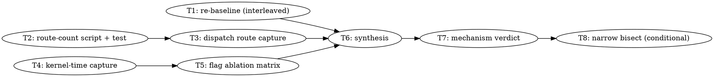

# B50 GPT-OSS PP512 Regression Attribution Implementation Plan

> **For Claude:** REQUIRED SUB-SKILL: Use team-driven-development to implement this plan with agent teams.

**Goal:** Name the mechanism behind the B50 GPT-OSS 20B PP512 shortfall (~894 observed vs the ≥1100 guardrail) by measuring today's HEAD, without spending a day on `git bisect`.

**Architecture:** Attribution before archaeology. A ~19% PP loss is large enough to appear as a shifted kernel-time distribution or a flipped dispatch decision, both observable at runtime on the existing build. Four independent probes — an honest re-baseline, per-kernel device time, dispatch route counts, and a flag-ablation matrix — converge on a findings document. A narrow bisect is a conditional last resort, scoped by what the probes rule out, not by the 1609-commit calendar window.

**Tech Stack:** Bash, Python 3, CMake/CTest, Intel oneAPI DPC++ 2026.1, Arc Pro B50 (`level_zero:1`, Battlemage G21, 128 CU, ~16 GB).

**Test Infrastructure:** Python assertion tests in `tests/test-sycl-*.py`. **Currently unregistered** — `tests/` holds 337 test files, `tests/CMakeLists.txt` references 53, none of them `.py`. New tests in this plan register via the `llama_test_cmd` pattern at `tests/CMakeLists.txt:238-246`. Existing relevant parsers: `scripts/parse-sycl-kernel-profile.py` (tested by `tests/test-sycl-kernel-profile-parser.py`).

---

## What This Plan Deliberately Does Not Do

**It does not promise a fix.** The stop condition is a *named mechanism*. The fix may belong in the decode-host-overhead plan, in the zone-sizing plan, or in a plan not yet written — deciding that is Task 7's job, not this plan's.

**It does not open with a bisect.** 1609 commits sit in the plausible window; at ~10 min/build that is ~11 builds, and ccache will miss badly across that much churn in the ~94k-line `ggml-sycl.cpp`. A bisect also returns a *commit*, which is not the same thing as a mechanism. Task 8 exists for the case where the probes genuinely fail.

**It allows the answer to be "there is no regression."** Task 1 can close this plan. The 894 figure came from a single measurement context, and between-run PP spread on this hardware measured 14.2%.

---

## Team Topology

**Recommended implementers:** 3 concurrent (based on 3 parallel tracks — execution spawns one ephemeral implementer PER TASK)
**Reviewers:** spec + quality, spawned FRESH per review (not a standing pair; see team-driven-development)

### Parallel Tracks

| Track | Tasks | Description |
|-------|-------|-------------|
| A | 1 | Honest re-baseline (gates everything; may close the plan) |
| B | 2, 3 | Route-counting tooling, then dispatch-decision capture |
| C | 4, 5 | Kernel-time attribution capture, then flag-ablation matrix |
| — | 6, 7, 8 | Convergence: synthesis, mechanism verdict, conditional bisect |

Tracks B and C build tooling and capture data that do not depend on Task 1's outcome, so they start immediately. If Task 1 concludes "no regression," Tasks 6-8 are cancelled and B/C's artifacts stand as a documented HEAD characterization.

### Dependency Graph



### File Ownership Map

| File/Directory | Tasks | Conflict Risk |
|----------------|-------|---------------|
| `scripts/count-sycl-dispatch-routes.py` | 2 | None (new file, single task) |
| `tests/test-sycl-dispatch-route-counter.py` | 2 | None (new file, single task) |
| `tests/CMakeLists.txt` | 2 | None (single task in this plan) |
| `docs/plans/2026-07-25-b50-pp512-findings.md` | 1, 3, 5, 6, 7 | Sequential — each appends its own `##` section; T6 and T7 depend on all three |
| `/tmp/b50-pp-attrib/` | 3, 4, 5 | None (per-task subdirectories) |

**Conflict note:** the findings doc is written by five tasks. Each appends a distinct `## Task N` heading and never edits another's section. Tasks 1, 3 and 5 land on different tracks and may append concurrently — the lead resolves any merge conflict by keeping both sections, since they are additive and disjoint.

---

## Safety Constraints (apply to EVERY task in this plan)

- **`TMPDIR=/tmp` on every build.** Root filesystem ~98% full; the AOT link stage fails with ENOSPC otherwise.
- **Never run `test-backend-ops`** in a subagent or background task — TTM shmem backing grows to 50–224 GB and the process is OOM-killed.
- **Never run `sycl-ls`** — has hung this host in `xe_drm_ioctl` requiring a reboot.
- **`timeout` every GPU command.** GPT-OSS runs are additionally capped per CLAUDE.md's standing guard.
- **Check `dmesg` before trusting any number.** Benchmark results taken after a crash or forced stop on that card are void (xe GT reset cascades). `guc_id=0 / in no process [-1]` is the benign environmental timeout; `guc_id=6` attributed to a named process is the unrecoverable class — STOP and report.
- **Record free VRAM beside every result.**
- **Never `git revert`.** Fix forward.

---

### Task 1: Re-baseline B50 PP512 with an interleaved paired design

**Track:** A
**Depends on:** None
**File scope:**
- Create: `docs/plans/2026-07-25-b50-pp512-findings.md`

**Description:**

Establishes whether the regression is real before anything is attributed to it. The 894 figure is a single measurement; `llama-bench`'s reported `±` is within-process only, and the between-process spread on this hardware measured 14.2% pp and drifts across a session. This task measures PP512 against the ≥1100 guardrail with enough runs and enough spread reporting to distinguish a real ~19% loss from session drift. **This task is authorised to close the plan.**

**Acceptance Criteria:**

- [ ] ≥8 B50 GPT-OSS 20B PP512 runs, spread across at least two separated time windows
- [ ] Free VRAM recorded from the startup log for every run
- [ ] Reported as mean ± sd **across runs** plus min/max — never a single `llama-bench` line
- [ ] The GPT-OSS count gate passes on the same build
- [ ] An explicit `BASELINE VERDICT:` line stating whether the ≥1100 guardrail is met

**Implementation Guide:**

1. **Preflight:**

```bash
source /opt/intel/oneapi/setvars.sh --force
dmesg | tail -30 | grep -iE 'xe|gt reset|guc' || echo "dmesg clean"
git rev-parse HEAD
```

Record the HEAD SHA in the findings doc — every number in this plan is bound to it.

2. **Run 8 PP512 measurements in two windows of 4**, separated by the ablation-free interval, so drift is visible rather than hidden:

```bash
mkdir -p /tmp/b50-pp-attrib && : > /tmp/b50-pp-attrib/baseline.txt
for window in 1 2; do
  for i in 1 2 3 4; do
    echo "=== window $window run $i ===" >> /tmp/b50-pp-attrib/baseline.txt
    timeout 900 env ONEAPI_DEVICE_SELECTOR=level_zero:1 \
      ./build/bin/llama-bench -m /models/gpt-oss-20b-mxfp4.gguf \
      -p 512 -n 0 -r 3 2>&1 | tee -a /tmp/b50-pp-attrib/baseline.txt \
      | grep -iE 'pp512|free|VRAM'
  done
done
```

3. **Correctness gate on the same build:**

```bash
timeout 300 env ONEAPI_DEVICE_SELECTOR=level_zero:1 ./build/bin/llama-cli \
  -m /models/gpt-oss-20b-mxfp4.gguf -ngl 99 \
  -cnv -st --simple-io --no-display-prompt \
  --chat-template-kwargs '{"reasoning_effort":"medium"}' \
  --reasoning-format none --reasoning-budget 0 \
  -p 'Count from 1 to 5. Answer with only: 1, 2, 3, 4, 5' \
  -n 48 --seed 42 --temp 0
```

Expected output starts: `: 1, 2, 3, 4, 5`

4. **Create the findings doc** with a `## Task 1 — Re-baseline` section: HEAD SHA, all 8 values labelled by window, free VRAM per run, mean ± sd, min/max, per-window means (to expose drift), the gate output, and:

```
BASELINE VERDICT: B50 GPT-OSS20B PP512 = <MEAN> ± <SD> tok/s (n=8, range <MIN>-<MAX>),
guardrail >=1100 <MET|NOT MET>. Window means: <W1> / <W2> (drift <D>%).
DECISION: <PROCEED to attribution | CLOSE PLAN — no regression at HEAD>.
```

**Commit:**

```bash
git add docs/plans/2026-07-25-b50-pp512-findings.md
git commit -m "docs(sycl): re-baseline B50 GPT-OSS PP512 with interleaved paired design"
```

**Gotchas:**

- `-p 512 -n 0` measures PP only. Adding `-n 128` roughly doubles runtime and measures TG, which is not this plan's subject.
- Do **not** report `llama-bench`'s own `±` as the uncertainty — it is within-process and systematically understates the real spread by several times.
- If the two window means differ by more than ~10%, the card is drifting and *no* attribution in this plan will be trustworthy. Say so in the verdict and recommend re-running on a fresh boot.
- The B50 is the small card (~16 GB) and GPT-OSS 20B MXFP4 is 12 GB. Free-VRAM headroom is genuinely tight here; a run reporting materially less than ~16 GB total is contending with something else.
- `DECISION: CLOSE PLAN` is a legitimate, successful outcome. Do not manufacture a regression to keep the plan alive.

---

### Task 2: Build a dispatch-route counter with a tested parser

**Track:** B
**Depends on:** None
**File scope:**
- Create: `scripts/count-sycl-dispatch-routes.py`
- Create: `tests/test-sycl-dispatch-route-counter.py`
- Modify: `tests/CMakeLists.txt:247` (append registration)

**Description:**

There is **no** dispatch route-tally facility in this backend — a search for `ROUTE-TALLY`, `route_tally`, `[ROUTE]`, and any `GGML_SYCL_*_{ROUTE,TALLY,STATS}` env var returns zero hits. The only available mechanism is `GGML_SYCL_DEBUG=1` dispatch lines counted by hand, which is how the `FORCE_LEGACY` mechanism was proved previously. This task turns that ad-hoc grep into a tested script, so Task 3's counts are reproducible and the parser's behaviour is pinned by a test rather than by an implementer's shell history.

**Acceptance Criteria:**

- [ ] `scripts/count-sycl-dispatch-routes.py <logfile>` prints `route.<name> <count>` lines, sorted by descending count
- [ ] Total line accounted for: `route.TOTAL <n>` equals the sum of all route counts
- [ ] Unrecognised debug lines are counted as `route.UNCLASSIFIED` rather than silently dropped
- [ ] The test drives the script on a checked-in synthetic log fixture, not on live hardware
- [ ] `ctest -R dispatch-route-counter` passes

**Implementation Guide:**

1. **Discover the real debug line format first.** The route regex must match what the backend actually prints, not an invented format:

```bash
source /opt/intel/oneapi/setvars.sh --force
timeout 300 env ONEAPI_DEVICE_SELECTOR=level_zero:1 GGML_SYCL_DEBUG=1 \
  ./build/bin/llama-bench -m /models/gpt-oss-20b-mxfp4.gguf \
  -p 64 -n 0 -r 1 > /tmp/b50-pp-attrib/debug-sample.log 2>&1
grep -oE '^\[[A-Z0-9_-]+\]' /tmp/b50-pp-attrib/debug-sample.log | sort | uniq -c | sort -rn | head -30
```

Record the observed tags. The script's classifier is built from these, and the synthetic fixture below must use real tags.

2. **RED: write the test.**

Create `tests/test-sycl-dispatch-route-counter.py`:

```python
#!/usr/bin/env python3
"""scripts/count-sycl-dispatch-routes.py must classify every debug line.

Task 3 of docs/plans/2026-07-25-sycl-b50-pp512-attribution.md compares route
counts between configurations. A counter that silently drops unmatched lines
would make a route DISAPPEARING look identical to a route never existing, so
UNCLASSIFIED is a first-class output, not an error case.
"""
from __future__ import annotations

import subprocess
import sys
import tempfile
from pathlib import Path

ROOT = Path(__file__).resolve().parents[1]
SCRIPT = ROOT / "scripts" / "count-sycl-dispatch-routes.py"

# Replace these three tags with tags observed in step 1 before implementing.
FIXTURE = """\
[SYCL-DISPATCH] mul_mat route=mmvq n=1
[SYCL-DISPATCH] mul_mat route=mmvq n=1
[SYCL-DISPATCH] mul_mat route=onednn n=512
[UNIFIED-KERNEL] xmx tile=32
a line the classifier has never seen
"""


def run_counter(log_text: str) -> dict[str, int]:
    with tempfile.TemporaryDirectory() as tmp:
        log_path = Path(tmp) / "debug.log"
        log_path.write_text(log_text)
        result = subprocess.run(
            [sys.executable, str(SCRIPT), str(log_path)],
            capture_output=True, text=True, cwd=ROOT, check=True,
        )
    counts: dict[str, int] = {}
    for line in result.stdout.splitlines():
        parts = line.split()
        if len(parts) == 2 and parts[0].startswith("route."):
            counts[parts[0]] = int(parts[1])
    return counts


def main() -> int:
    counts = run_counter(FIXTURE)

    if "route.TOTAL" not in counts:
        print("FAIL: no route.TOTAL emitted")
        return 1

    body = {k: v for k, v in counts.items() if k != "route.TOTAL"}
    if sum(body.values()) != counts["route.TOTAL"]:
        print(f"FAIL: route counts sum to {sum(body.values())}, TOTAL says {counts['route.TOTAL']}")
        return 1

    if counts.get("route.UNCLASSIFIED", 0) != 1:
        print(f"FAIL: expected exactly 1 UNCLASSIFIED line, got {counts.get('route.UNCLASSIFIED', 0)}")
        return 1

    empty = run_counter("")
    if empty.get("route.TOTAL") != 0:
        print("FAIL: empty log did not yield route.TOTAL 0")
        return 1

    print("PASS: dispatch route counter classifies exhaustively")
    return 0


if __name__ == "__main__":
    raise SystemExit(main())
```

Run: `python3 tests/test-sycl-dispatch-route-counter.py`
Expected: FAIL — `No such file or directory: scripts/count-sycl-dispatch-routes.py`

3. **GREEN: implement the counter.**

Create `scripts/count-sycl-dispatch-routes.py`:

```python
#!/usr/bin/env python3
"""Count GGML_SYCL_DEBUG=1 dispatch decisions by route.

There is no route-tally facility in the SYCL backend; this reconstructs one
from debug output. Every non-blank line is classified — unmatched lines land in
UNCLASSIFIED so a vanished route cannot masquerade as a route that never was.
"""
from __future__ import annotations

import argparse
import re
import sys
from collections import Counter
from pathlib import Path

# Built from tags observed via:
#   GGML_SYCL_DEBUG=1 llama-bench ... | grep -oE '^\\[[A-Z0-9_-]+\\]' | sort | uniq -c
ROUTE_PATTERNS: list[tuple[str, re.Pattern[str]]] = [
    ("mmvq",    re.compile(r"route=mmvq")),
    ("onednn",  re.compile(r"route=onednn")),
    ("xmx",     re.compile(r"\[UNIFIED-KERNEL\].*xmx")),
    ("esimd",   re.compile(r"route=esimd")),
    ("legacy",  re.compile(r"route=legacy")),
    ("mmq",     re.compile(r"route=mmq")),
]


def classify(line: str) -> str:
    for name, pattern in ROUTE_PATTERNS:
        if pattern.search(line):
            return name
    return "UNCLASSIFIED"


def count_routes(text: str) -> Counter[str]:
    counts: Counter[str] = Counter()
    for line in text.splitlines():
        if not line.strip():
            continue
        counts[classify(line)] += 1
    return counts


def main() -> int:
    parser = argparse.ArgumentParser(description=__doc__)
    parser.add_argument("log", type=Path, help="GGML_SYCL_DEBUG=1 output to classify")
    args = parser.parse_args()

    try:
        text = args.log.read_text(errors="replace")
    except OSError as exc:
        print(f"failed to read log: {exc}", file=sys.stderr)
        return 2

    counts = count_routes(text)
    for name, count in sorted(counts.items(), key=lambda item: (-item[1], item[0])):
        print(f"route.{name} {count}")
    print(f"route.TOTAL {sum(counts.values())}")
    return 0


if __name__ == "__main__":
    raise SystemExit(main())
```

```bash
chmod +x scripts/count-sycl-dispatch-routes.py
python3 tests/test-sycl-dispatch-route-counter.py
```

Expected: `PASS: dispatch route counter classifies exhaustively`

4. **Register in ctest.** Append to `tests/CMakeLists.txt` after the `endif()` at `:247`:

```cmake
if (NOT WIN32)
    llama_test_cmd(
        ${Python3_EXECUTABLE}
        NAME test-sycl-dispatch-route-counter
        WORKING_DIRECTORY ${PROJECT_SOURCE_DIR}
        ARGS ${CMAKE_CURRENT_SOURCE_DIR}/test-sycl-dispatch-route-counter.py
    )
    set_tests_properties(test-sycl-dispatch-route-counter PROPERTIES
        LABELS "sycl;dispatch;tdd"
        TIMEOUT 120
    )
endif()
```

```bash
TMPDIR=/tmp ./scripts/sycl-build.sh -r
ctest --test-dir build -R dispatch-route-counter -V
```

Expected: `Passed`

**Commit:**

```bash
git add scripts/count-sycl-dispatch-routes.py tests/test-sycl-dispatch-route-counter.py tests/CMakeLists.txt
git commit -m "feat(sycl): add tested dispatch-route counter for GGML_SYCL_DEBUG output"
```

**Gotchas:**

- **Step 1 is not optional.** The `ROUTE_PATTERNS` above are a starting scaffold written from the debug tags this backend is expected to emit; if the observed tags differ, both the patterns *and* the test fixture must be updated to the real ones before the GREEN step. Shipping a classifier that puts 100% of lines in `UNCLASSIFIED` would pass a naive test and make Task 3 useless.
- `GGML_SYCL_DEBUG=1` is extremely verbose. `-p 64 -r 1` keeps the sample log to a manageable size; a full `-p 512 -r 3` run can produce gigabytes. Write to `/tmp`, never the repo.
- If `${Python3_EXECUTABLE}` is empty at configure time, add `find_package(Python3 COMPONENTS Interpreter REQUIRED)` above the block.
- `./scripts/sycl-build.sh -r` (reconfigure) is required for a new `add_test` to appear.

---

### Task 3: Capture dispatch route counts at HEAD

**Track:** B
**Depends on:** Task 2
**File scope:**
- Modify: `docs/plans/2026-07-25-b50-pp512-findings.md` (append `## Task 3 — Dispatch routes`)
- Create: `/tmp/b50-pp-attrib/routes/` (artifacts, not committed)

**Description:**

Answers the binary question this plan's cheapest hypothesis rests on: are the GPT-OSS MoE matmuls taking the intended fast path at HEAD, or falling back? CLAUDE.md records *"restored-fast-path evidence: ~1255 PP512"*, which implies a fast path that exists and may simply not be engaging on the B50.

**Acceptance Criteria:**

- [ ] Route counts captured for a B50 GPT-OSS PP512 run at HEAD
- [ ] `route.UNCLASSIFIED` is below 5% of `route.TOTAL` — above that, the classifier is not describing this workload and Task 2's patterns must be corrected first
- [ ] The dominant route for MoE matmuls is identified by name
- [ ] Counts recorded per route, absolute and as a share of TOTAL

**Implementation Guide:**

1. **Capture:**

```bash
source /opt/intel/oneapi/setvars.sh --force
mkdir -p /tmp/b50-pp-attrib/routes
timeout 1200 env ONEAPI_DEVICE_SELECTOR=level_zero:1 GGML_SYCL_DEBUG=1 \
  ./build/bin/llama-bench -m /models/gpt-oss-20b-mxfp4.gguf \
  -p 512 -n 0 -r 1 > /tmp/b50-pp-attrib/routes/head.log 2>&1
python3 scripts/count-sycl-dispatch-routes.py /tmp/b50-pp-attrib/routes/head.log \
  | tee /tmp/b50-pp-attrib/routes/head.counts
```

2. **Check the classifier is describing reality:**

```bash
awk '/^route\.UNCLASSIFIED/{u=$2} /^route\.TOTAL/{t=$2} END{printf "unclassified %.1f%%\n", 100*u/t}' \
  /tmp/b50-pp-attrib/routes/head.counts
```

Expected: below 5%. If not, return to Task 2 step 1, correct `ROUTE_PATTERNS` against the real tags, and re-run. Do not proceed with a classifier that does not classify.

3. **Inspect what the unclassified lines actually are**, so the 5% is understood rather than assumed benign:

```bash
grep -vE 'route=(mmvq|onednn|esimd|legacy|mmq)|\[UNIFIED-KERNEL\].*xmx' \
  /tmp/b50-pp-attrib/routes/head.log | grep -oE '^\[[A-Z0-9_-]+\]' | sort | uniq -c | sort -rn | head
```

4. **Append `## Task 3 — Dispatch routes`** to the findings doc: the HEAD SHA, the full route table (absolute + share), the unclassified fraction and what those lines are, and:

```
ROUTE VERDICT: MoE matmuls at HEAD dispatch predominantly via <route> (<N> of <TOTAL>, <P>%).
Fast path <ENGAGED|NOT ENGAGED>.
```

**Commit:**

```bash
git add docs/plans/2026-07-25-b50-pp512-findings.md
git commit -m "docs(sycl): record B50 GPT-OSS dispatch route counts at HEAD"
```

**Gotchas:**

- `GGML_SYCL_DEBUG=1` materially slows the run and changes timing. These counts are about *which* route, never *how fast* — do not read any throughput number from this log.
- The log for a full PP512 run may be very large. Check `du -h` before parsing; if it exceeds a few GB, re-capture at `-p 256`.
- Route counts are per-op, not per-token. A route with a small count can still dominate wall time (and vice versa) — that is what Task 4's kernel-time capture is for. Do not conclude a mechanism from counts alone.
- This task writes to the same findings doc as Tasks 1 and 5, on a different track. Append only under your own `## Task 3` heading; never edit another section.

---

### Task 4: Capture per-kernel device time at HEAD

**Track:** C
**Depends on:** None
**File scope:**
- Create: `/tmp/b50-pp-attrib/kernels/` (artifacts, not committed)
- Modify: `docs/plans/2026-07-25-b50-pp512-findings.md` (append `## Task 4 — Kernel time`)

**Description:**

Produces the per-category device-time distribution for a B50 PP512 run, using the existing kernel profiler (`GGML_SYCL_KERNEL_PROFILE=1`, config parsed at `sycl-kernel-profiler.cpp:730-737`) and `scripts/parse-sycl-kernel-profile.py`. If PP is now dominated by a kernel category that should not dominate, that names the mechanism directly — and unlike route counts, this is weighted by actual time.

**Acceptance Criteria:**

- [ ] A kernel profile captured for B50 GPT-OSS PP512 at HEAD
- [ ] Parsed with `--wall-ms` set from Task 1's measured PP512 rate
- [ ] Top kernel categories ranked by total device time, with each category's share of wall time
- [ ] Total profiler coverage (device time / wall time) stated explicitly

**Implementation Guide:**

1. **Capture:**

```bash
source /opt/intel/oneapi/setvars.sh --force
mkdir -p /tmp/b50-pp-attrib/kernels
timeout 1200 env ONEAPI_DEVICE_SELECTOR=level_zero:1 \
  GGML_SYCL_KERNEL_PROFILE=1 \
  GGML_SYCL_KERNEL_PROFILE_OUTPUT=/tmp/b50-pp-attrib/kernels/head.json \
  GGML_SYCL_KERNEL_PROFILE_TOP_N=40 \
  ./build/bin/llama-bench -m /models/gpt-oss-20b-mxfp4.gguf \
  -p 512 -n 0 -r 3 2>&1 | tee /tmp/b50-pp-attrib/kernels/head.bench
```

2. **Compute wall-ms.** For PP512 at R tok/s over `r` repetitions: `wall_ms = 512 / R * 1000 * r`. Read R from Task 1's `BASELINE VERDICT:` line.

3. **Parse:**

```bash
python3 scripts/parse-sycl-kernel-profile.py \
  --wall-ms <computed> --top-kernels 40 \
  /tmp/b50-pp-attrib/kernels/head.json \
  | tee /tmp/b50-pp-attrib/kernels/head.parse
```

4. **Append `## Task 4 — Kernel time`** with the top-40 category table (absolute ms, % of total device time, % of wall time), the overall coverage figure, and:

```
KERNEL VERDICT: top category <name> at <N> ms (<P>% of wall). Profiler explains
<C>% of PP512 wall time; remaining <R>% is non-kernel.
```

**Commit:**

```bash
git add docs/plans/2026-07-25-b50-pp512-findings.md
git commit -m "docs(sycl): record B50 GPT-OSS PP512 kernel-time distribution at HEAD"
```

**Gotchas:**

- `GGML_SYCL_KERNEL_PROFILE=1` has its own overhead (a `steady_clock` pair per submit at `sycl-kernel-profiler.hpp:103-119`). The *distribution* is the deliverable here, not the absolute throughput — do not compare this run's PP512 against Task 1's baseline.
- `parse-sycl-kernel-profile.py` also accepts `--require-kernel`, `--min-total-ms` and `--kernel-bytes`. Do not pass `--require-kernel` here; it is an assertion flag for regression tests and will fail the parse if the named kernel is absent.
- If the profiler's coverage is low (as it was on decode, ~15%), that is a finding about PP, not a broken capture. Report it; the decode-host-overhead plan owns the non-kernel remainder.
- Write the JSON to `/tmp`. It can be large and the root filesystem is ~98% full.

---

### Task 5: Run the flag-ablation matrix

**Track:** C
**Depends on:** Task 4
**File scope:**
- Modify: `docs/plans/2026-07-25-b50-pp512-findings.md` (append `## Task 5 — Flag ablation`)
- Create: `/tmp/b50-pp-attrib/ablation/` (artifacts, not committed)

**Description:**

Tests whether any single configuration flag recovers the PP512 shortfall. If one does, the mechanism is named and Task 8's bisect becomes unnecessary. Covers the load-bearing opt-outs (all default ON) and the opt-ins CLAUDE.md keeps deliberately off pending gates.

**Acceptance Criteria:**

- [ ] Each arm measured **interleaved against the default arm** (default, flag, default, flag, …), ≥4 pairs per flag
- [ ] Flags covered: `GGML_SYCL_ONEDNN_PP=0`, `GGML_SYCL_UNIFIED_SOA=0`, `GGML_SYCL_DISABLE_GRAPH=1`, `GGML_SYCL_TG_FAST=0`, `GGML_SYCL_MOE_BLOCK_GRAPHLETS=1`, `GGML_SYCL_XMX_MOE_PP=1`
- [ ] Per flag: mean ± sd across runs, range, and a paired t-test against its own interleaved default runs
- [ ] Any arm claiming a win also passes the GPT-OSS count gate under that flag
- [ ] An explicit per-flag `RECOVERS: yes/no` line

**Implementation Guide:**

1. **Run the matrix.** One flag at a time, interleaved with its own control:

```bash
source /opt/intel/oneapi/setvars.sh --force
mkdir -p /tmp/b50-pp-attrib/ablation
for flag in "GGML_SYCL_ONEDNN_PP=0" "GGML_SYCL_UNIFIED_SOA=0" \
            "GGML_SYCL_DISABLE_GRAPH=1" "GGML_SYCL_TG_FAST=0" \
            "GGML_SYCL_MOE_BLOCK_GRAPHLETS=1" "GGML_SYCL_XMX_MOE_PP=1"; do
  name="${flag%%=*}"
  out="/tmp/b50-pp-attrib/ablation/${name}.txt"
  : > "$out"
  for i in 1 2 3 4; do
    for arm in default treatment; do
      if [ "$arm" = treatment ]; then EXTRA="$flag"; else EXTRA=""; fi
      echo "=== $name pair $i arm $arm ===" >> "$out"
      timeout 900 env ONEAPI_DEVICE_SELECTOR=level_zero:1 $EXTRA \
        ./build/bin/llama-bench -m /models/gpt-oss-20b-mxfp4.gguf \
        -p 512 -n 0 -r 3 2>&1 | tee -a "$out" | grep -iE 'pp512|free'
    done
  done
done
```

2. **Gate any apparent winner.** For each flag whose paired mean beats default by more than its sd:

```bash
timeout 300 env ONEAPI_DEVICE_SELECTOR=level_zero:1 <FLAG> ./build/bin/llama-cli \
  -m /models/gpt-oss-20b-mxfp4.gguf -ngl 99 \
  -cnv -st --simple-io --no-display-prompt \
  --chat-template-kwargs '{"reasoning_effort":"medium"}' \
  --reasoning-format none --reasoning-budget 0 \
  -p 'Count from 1 to 5. Answer with only: 1, 2, 3, 4, 5' \
  -n 48 --seed 42 --temp 0
```

Expected: `: 1, 2, 3, 4, 5`. A flag that raises PP but fails this gate has not found a mechanism — it has found a way to skip work.

3. **Append `## Task 5 — Flag ablation`** with a per-flag table (default mean ± sd, treatment mean ± sd, delta %, t-statistic, df, gate result) and per flag:

```
<FLAG>: delta <+/-N.N>% (t=<T> on 3 df, <significant|not significant>),
gate <PASS|FAIL|not run>. RECOVERS: <yes|no>.
```

**Commit:**

```bash
git add docs/plans/2026-07-25-b50-pp512-findings.md
git commit -m "docs(sycl): record B50 PP512 flag-ablation matrix"
```

**Gotchas:**

- **Interleave every arm against its own control.** Running all defaults first and all treatments later is invalid here: this is the exact design that produced a fake +21.8% tg result on this machine, which an interleaved re-run cut to +2.3%, t=0.72, not significant. The anomaly was in the *default* arm, which a blocked design makes invisible.
- `GGML_SYCL_PP_PIPELINE` is deliberately **excluded** from the matrix — CLAUDE.md records it causing GPT-OSS chat correctness failures. Do not add it.
- `GGML_SYCL_TG_FAST=0` targets token generation, not PP. It is included as a negative control: if it moves PP512 significantly, something is wrong with the harness, not with PP.
- 6 flags × 8 runs × ~15 min is a long sitting. Check `dmesg` between flags; a GT reset mid-matrix voids everything after it.
- `GGML_SYCL_UNIFIED_SOA=0` falls back to AOS and is known to be ~4× slower on TG. Expect it to lose badly; it is included to confirm the harness detects a large real effect.

---

### Task 6: Synthesise the three probes

**Track:** — (convergence)
**Depends on:** Task 1, Task 3, Task 5
**File scope:**
- Modify: `docs/plans/2026-07-25-b50-pp512-findings.md` (append `## Task 6 — Synthesis`)

**Description:**

Cross-references the route counts, kernel-time distribution and ablation results into a single picture, and states which hypotheses each probe eliminates. Separated from Task 7 so that the evidence table is written before a verdict is reached from it.

**Acceptance Criteria:**

- [ ] A table mapping each candidate mechanism to the probe that supports or eliminates it
- [ ] Every probe's result appears in the table — no probe silently dropped
- [ ] Contradictions between probes are stated, not smoothed over
- [ ] Explicit list of hypotheses that remain live

**Implementation Guide:**

1. **Build the elimination table** with these rows at minimum, and one row per additional hypothesis raised by the data:

| Hypothesis | Probe | Supports / Eliminates |
|---|---|---|
| No regression — 894 was drift | T1 window means and sd | |
| MoE matmuls fall back off the fast path | T3 route verdict | |
| One kernel category unexpectedly dominates | T4 kernel verdict | |
| A config flag regressed a default | T5 per-flag RECOVERS | |
| Cost is non-kernel (host/submit) | T4 coverage remainder | |

2. **State contradictions explicitly.** If T3 says the fast path is engaged but T4 shows the slow kernel dominating time, say so — that combination is itself informative and must not be averaged away.

3. **Append the section** with the completed table and:

```
LIVE HYPOTHESES: <comma-separated list, or "none — see Task 7">
ELIMINATED: <list, each with the probe that eliminated it>
CONTRADICTIONS: <list, or "none">
```

**Commit:**

```bash
git add docs/plans/2026-07-25-b50-pp512-findings.md
git commit -m "docs(sycl): synthesise B50 PP512 attribution probes"
```

**Gotchas:**

- A probe returning "nothing unusual" is a real result that eliminates hypotheses. Record it; do not omit a probe because it was uninformative.
- Do not name a mechanism in this task. That is Task 7, deliberately separated so the evidence table is not written backwards from a conclusion.
- If Task 1's decision was `CLOSE PLAN`, this task still runs and records the HEAD characterization — but `LIVE HYPOTHESES` should be `none — no regression at HEAD`, and Task 8 must not run.

---

### Task 7: Name the mechanism

**Track:** — (convergence)
**Depends on:** Task 6
**File scope:**
- Modify: `docs/plans/2026-07-25-b50-pp512-findings.md` (append `## Task 7 — Mechanism verdict`)
- Modify: `CLAUDE.md` (only if a guardrail figure is proven wrong)

**Description:**

Produces this plan's deliverable: a named mechanism, or an explicit statement that the probes did not find one. Also reconciles the finding against CLAUDE.md's recorded guardrail, since the ≥1100 figure is itself evidence that may be stale.

**Acceptance Criteria:**

- [ ] Exactly one `MECHANISM:` verdict line
- [ ] The verdict names which plan (if any) should own the fix
- [ ] If the ≥1100 guardrail is shown to be unattainable at HEAD for a documented reason, CLAUDE.md is corrected with the evidence — otherwise CLAUDE.md is left untouched
- [ ] An explicit `BISECT:` line stating whether Task 8 runs

**Implementation Guide:**

1. **Write the verdict** in this exact form:

```
MECHANISM: <one-sentence statement, or "NOT FOUND — probes exhausted">
EVIDENCE: <the specific probe results that establish it>
FIX OWNER: <this plan | 2026-07-25-sycl-decode-host-overhead-attribution.md |
            2026-07-25-sycl-path-scoped-zone-sizing.md | a new plan | none needed>
BISECT: <NOT REQUIRED — mechanism named | REQUIRED — proceed to Task 8>
```

2. **Reconcile with CLAUDE.md.** The `≥1100 PP512` guardrail cites `llama.cpp-aqzz3.1` / `po3nd.2.45/.46` / `ix58x`. If Task 1 established that HEAD reproducibly sits below it AND Tasks 3-5 found no defect, then the guardrail may be describing a configuration that no longer exists. Only in that case, update the "Regression Baselines" section of `CLAUDE.md` — adding the new measurement, the HEAD SHA, and the reason, without deleting the historical figure.

Do **not** lower the guardrail merely because HEAD misses it. That is precisely the "do not accept lower post-debug numbers as new baselines" rule CLAUDE.md sets.

3. **File a codescout task** for the fix if `FIX OWNER` is not `none needed`, and record its id in the findings doc.

**Commit:**

```bash
git add docs/plans/2026-07-25-b50-pp512-findings.md CLAUDE.md
git commit -m "docs(sycl): name B50 PP512 mechanism and reconcile guardrail"
```

**Gotchas:**

- `MECHANISM: NOT FOUND` is a legitimate outcome and must not be padded into a speculative one. It is the trigger for Task 8, and it is more useful than a guess.
- Editing CLAUDE.md's guardrail is gated on *both* conditions in step 2. Missing the number is not by itself sufficient — that is what a regression looks like.
- If Task 1 concluded `CLOSE PLAN`, the verdict is `MECHANISM: none — no regression at HEAD`, `BISECT: NOT REQUIRED`, and CLAUDE.md is left untouched.

---

### Task 8: Narrow bisect (conditional)

**Track:** — (convergence)
**Depends on:** Task 7
**File scope:**
- Modify: `docs/plans/2026-07-25-b50-pp512-findings.md` (append `## Task 8 — Bisect`)

**Description:**

Runs only if Task 7's `BISECT:` line says `REQUIRED`. Bisects a range narrowed by what Tasks 3-5 eliminated, not the 1609-commit calendar window. Each step measures interleaved-paired, because a bisect whose oracle is one `llama-bench` line will converge confidently on the wrong commit given the 14.2% between-run spread.

**Acceptance Criteria:**

- [ ] **Skipped entirely** if Task 7 says `BISECT: NOT REQUIRED` — record that and close
- [ ] The bisect range is justified in writing from the eliminated hypotheses
- [ ] Each bisect step's verdict comes from ≥4 interleaved paired runs, not one
- [ ] The identified commit is confirmed by a direct A/B of that commit and its parent
- [ ] Build time and step count recorded

**Implementation Guide:**

1. **Check whether to run at all:**

```bash
grep '^BISECT:' docs/plans/2026-07-25-b50-pp512-findings.md
```

If `NOT REQUIRED`, append a `## Task 8 — Bisect` section stating `SKIPPED — Task 7 named the mechanism` and stop. This is the expected outcome.

2. **Justify the range.** State in writing which commits the range covers and why Tasks 3-5 exclude everything outside it. A range wider than ~200 commits means the probes did not narrow anything and the range is not justified — return to Task 7 and record that instead.

3. **Define the oracle as a script**, so every step is measured identically:

```bash
cat > /tmp/b50-pp-attrib/bisect-oracle.sh <<'EOF'
#!/usr/bin/env bash
set -euo pipefail
source /opt/intel/oneapi/setvars.sh --force
TMPDIR=/tmp ./scripts/sycl-build.sh llama-bench || exit 125   # 125 = skip, unbuildable
total=0
for i in 1 2 3 4; do
  v=$(timeout 900 env ONEAPI_DEVICE_SELECTOR=level_zero:1 \
      ./build/bin/llama-bench -m /models/gpt-oss-20b-mxfp4.gguf \
      -p 512 -n 0 -r 3 2>/dev/null | grep -oE 'pp512[^0-9]*[0-9.]+' | grep -oE '[0-9.]+$')
  total=$(echo "$total + $v" | bc -l)
done
mean=$(echo "$total / 4" | bc -l)
echo "mean pp512 = $mean"
# Threshold set from Task 1's baseline; below it = bad.
awk -v m="$mean" 'BEGIN{exit !(m < 1000)}'
EOF
chmod +x /tmp/b50-pp-attrib/bisect-oracle.sh
```

Set the threshold from Task 1's measured mean and sd — midway between the observed HEAD mean and the ≥1100 guardrail, not an arbitrary round number. Record the chosen threshold and its justification.

4. **Run the bisect:**

```bash
git bisect start <bad-sha> <good-sha>
git bisect run /tmp/b50-pp-attrib/bisect-oracle.sh
git bisect log > /tmp/b50-pp-attrib/bisect.log
git bisect reset
```

5. **Confirm directly.** Build and measure the identified commit and its parent, interleaved, ≥6 pairs. A bisect result unconfirmed by a direct A/B is not a result.

6. **Append the section** with the range and its justification, the oracle threshold, the bisect log, the identified commit, and the confirming A/B with mean ± sd and a paired t-test.

**Commit:**

```bash
git add docs/plans/2026-07-25-b50-pp512-findings.md
git commit -m "docs(sycl): bisect B50 PP512 regression to originating commit"
```

**Gotchas:**

- `git bisect` checks out arbitrary commits. **Commit or stash all work first** — the lead must verify `git status --porcelain` is empty before starting, and `git bisect reset` must run even if the bisect aborts.
- Exit code **125** means "skip, cannot test" and is the correct response to a build failure. Returning 1 for an unbuildable commit tells bisect the commit is *bad* and sends it to the wrong answer.
- ccache will miss heavily across this range because `ggml-sycl.cpp` is ~94k lines and churns constantly. Budget ~25 min per step, not ~10.
- The oracle's `-r 3` inside a 4-run loop means 12 PP512 measurements per bisect step. That is deliberate — a single-run oracle plus 14.2% spread converges confidently on a wrong commit.
- Never `git revert` the identified commit. Naming it is the deliverable; the fix is a forward change owned by whichever plan Task 7 named.

---

## End-to-End Validation (on the user's machine) — MANDATORY

> Run AFTER all task tests pass, BEFORE declaring the work done. Owned by the lead at teardown.

**Environment:** This host — Arc Pro B50 (Battlemage G21, 128 CU, ~16 GB, `level_zero:1`, `0000:07:00.0`, `renderD130`), Linux 7.1.2, oneAPI 2026.1, patched compute-runtime 26.22/BMG. Model: `/models/gpt-oss-20b-mxfp4.gguf` (12 GB).

**Steps Claude runs itself:**

1. **The new counter test is registered and runs:**
   ```bash
   ctest --test-dir build -R dispatch-route-counter -V
   ```
   Expected: `1/1 Test #N: test-sycl-dispatch-route-counter ... Passed`

2. **The counter classifies real backend output, not just a fixture:**
   ```bash
   python3 scripts/count-sycl-dispatch-routes.py /tmp/b50-pp-attrib/routes/head.log \
     | tail -3
   ```
   Expected: a `route.TOTAL` line with a nonzero count, and `route.UNCLASSIFIED` below 5% of it.

3. **The findings document carries every required verdict:**
   ```bash
   grep -E '^(BASELINE VERDICT|ROUTE VERDICT|KERNEL VERDICT|LIVE HYPOTHESES|MECHANISM|BISECT):' \
     docs/plans/2026-07-25-b50-pp512-findings.md
   ```
   Expected: all six lines present and populated. `MECHANISM:` is either a named mechanism or `NOT FOUND — probes exhausted`.

4. **The measured PP512 is reproducible at HEAD:**
   ```bash
   source /opt/intel/oneapi/setvars.sh --force
   timeout 900 env ONEAPI_DEVICE_SELECTOR=level_zero:1 ./build/bin/llama-bench \
     -m /models/gpt-oss-20b-mxfp4.gguf -p 512 -n 0 -r 3
   ```
   Expected: a pp512 value within the mean ± 2 sd recorded in `BASELINE VERDICT:`.

5. **Correctness gate passes** — this plan changes no inference code, so it must:
   ```bash
   timeout 300 env ONEAPI_DEVICE_SELECTOR=level_zero:1 ./build/bin/llama-cli \
     -m /models/gpt-oss-20b-mxfp4.gguf -ngl 99 -cnv -st --simple-io \
     --no-display-prompt --chat-template-kwargs '{"reasoning_effort":"medium"}' \
     --reasoning-format none --reasoning-budget 0 \
     -p 'Count from 1 to 5. Answer with only: 1, 2, 3, 4, 5' -n 48 --seed 42 --temp 0
   ```
   Expected: output starts `: 1, 2, 3, 4, 5`

6. **No bisect residue:**
   ```bash
   git bisect log 2>&1 | head -1; git status --porcelain | head
   ```
   Expected: `You need to start by "git bisect start"` (no bisect in progress) and a clean or expected working tree.

**Steps requiring the user:** None.

**Observed success:** A tested, registered dispatch-route counter exists and classifies real B50 debug output; the findings document states a re-measured PP512 baseline with cross-run spread, a route verdict, a kernel-time verdict, an elimination table, and a single named mechanism (or an explicit NOT FOUND); the GPT-OSS count gate still emits `: 1, 2, 3, 4, 5`; and no bisect is left in progress.
