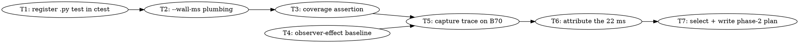

# SYCL Decode Host-Overhead Attribution Implementation Plan

> **For Claude:** REQUIRED SUB-SKILL: Use team-driven-development to implement this plan with agent teams.

**Goal:** Attribute the ~22 ms/token non-kernel decode cost on GPT-OSS 20B into `host_overlap` / `queue_serialization` / `runtime_idle`, using tooling that already exists, and select the phase-2 fix from that measurement rather than from a guess.

**Architecture:** No new instrumentation. `scripts/sycl-gptoss-decode-timeline-profile.sh` already captures a `GGML_SYCL_TIMELINE=timeline+events` trace, and `scripts/parse-sycl-timeline.py` already classifies every device-queue gap into three buckets (`parse-sycl-timeline.py:359 summarize_queue_gap_classes`) and emits per-callsite host time. This plan closes three real gaps in that pipeline (the script never passes `--wall-ms`, the `.py` regression tests are not registered in ctest, and no observer-effect baseline exists), then runs it and writes the finding.

**Tech Stack:** Bash, Python 3, CMake/CTest, Intel oneAPI DPC++ 2026.1, Arc Pro B70 (`level_zero:0`) and Arc Pro B50 (`level_zero:1`).

**Test Infrastructure:** Python source/behaviour assertion tests in `tests/test-sycl-*.py`, run by `python3`. **These are currently unregistered** — `tests/` holds 337 test files and `tests/CMakeLists.txt` references only 53, with zero `.py` entries. Per the approved design, every test this plan touches gets a ctest registration using the `llama_test_cmd` pattern at `tests/CMakeLists.txt:238-246`.

---

## Scope Boundary (read first)

This plan is **phase 1 only: attribution**. Phase 2 (the fix) is deliberately NOT decomposed here.

Under the Task Detail Standard, a task must be junior-implementable with real GREEN code. The three candidate fixes are mutually exclusive and each implies a different subsystem:

| If phase 1 shows | Cause | Phase-2 fix |
|---|---|---|
| `host_overlap` dominant | ggml-sycl's own per-op host path | Memoize layout resolution / eligibility / pointer tables, keyed on `mem_handle` identity |
| `runtime_idle` dominant | L0/UR submit path, not our code | Reduce launch count (batching, graphlets) — per-op caching buys nothing |
| `queue_serialization` dominant | Dependency graph | Overlap independent ops |

Writing GREEN code for all three would mean writing two plans that get thrown away. Task 7 therefore **selects and writes** the phase-2 plan from the measured result, using a mechanical decision rule (>50% of `timeline.unattributed_ms_x1000`). That is the skill's "spike the unknown first" rule applied honestly, not a scope dodge.

---

## Team Topology

**Recommended implementers:** 2 concurrent (based on 2 parallel tracks — execution spawns one ephemeral implementer PER TASK)
**Reviewers:** spec + quality, spawned FRESH per review (not a standing pair; see team-driven-development)

### Parallel Tracks

| Track | Tasks | Description |
|-------|-------|-------------|
| A | 1, 2, 3 | Profiling pipeline: ctest registration, `--wall-ms` plumbing, coverage assertion |
| B | 4 | Observer-effect baseline (independent — uses the existing build, touches no shared file) |
| — | 5, 6, 7 | Convergence: capture, attribute, select phase 2 |

### Dependency Graph



### File Ownership Map

| File/Directory | Tasks | Conflict Risk |
|----------------|-------|---------------|
| `tests/CMakeLists.txt` | 1 | None (single task; append-only at `:247`) |
| `tests/test-sycl-decode-timeline-profile-script.py` | 1, 2, 3 | Sequential (same track) |
| `scripts/sycl-gptoss-decode-timeline-profile.sh` | 2 | None (only T2 modifies) |
| `scripts/parse-sycl-timeline.py` | 3 | None (only T3 modifies) |
| `docs/plans/2026-07-25-decode-host-overhead-findings.md` | 4, 6 | Sequential (T4 creates, T6 appends) |
| `docs/backend/SYCL.md` | 2 | None (doc strings asserted by T2's test) |
| `docs/plans/` (new phase-2 plan) | 7 | None (runs last) |

---

## Safety Constraints (apply to EVERY task in this plan)

These have hung or OOM-killed this host. They are not advisory.

- **`TMPDIR=/tmp` on every build.** The root filesystem sits at ~98%; the AOT link stage fails with ENOSPC otherwise.
- **Never run `test-backend-ops`** in a subagent or background task — it grows TTM shmem backing to 50–224 GB and gets OOM-killed.
- **Never run `sycl-ls`** — it has hung this host in `xe_drm_ioctl` requiring a reboot.
- **Every GPU command gets a `timeout`.** B70 runs additionally set `GGML_SYCL_OP_TIMEOUT_MS=180000`.
- **Check free VRAM before trusting any B70 number.** ComfyUI has been observed holding 18.3 GiB on that card. A run reporting ~13.8 GB free instead of ~32.6 GB is measuring under memory pressure and its numbers are void.
- **Benchmark numbers are invalid after any crash or forced stop on that card** — check `dmesg` first (xe GT reset cascades).
- **Never `git revert`.** Fix forward in a new commit.

---

### Task 1: Register the decode-timeline script test in CTest

**Track:** A
**Depends on:** None
**File scope:**
- Modify: `tests/CMakeLists.txt:247` (append a new block after the `test-sycl-alloc-policy` `endif()`)
- Test: `tests/test-sycl-decode-timeline-profile-script.py` (existing, unmodified by this task)

**Description:**

`tests/test-sycl-decode-timeline-profile-script.py` exists and asserts on `scripts/sycl-gptoss-decode-timeline-profile.sh` and `docs/backend/SYCL.md`, but nothing runs it — no `.py` test is registered in `tests/CMakeLists.txt`. Tasks 2 and 3 modify the script and parser this test guards, so without registration their RED/GREEN claims are unverifiable by the lead. This task makes `ctest -R decode-timeline-profile-script` a real gate.

**Acceptance Criteria:**

- [ ] `ctest --test-dir build -R decode-timeline-profile-script -V` runs the Python test and reports Passed
- [ ] The test is registered via `llama_test_cmd`, matching `tests/CMakeLists.txt:238-246`
- [ ] The registration is guarded `if (NOT WIN32)` — the script under test is bash
- [ ] Deleting a required string from `scripts/sycl-gptoss-decode-timeline-profile.sh` makes the ctest entry FAIL (proves it is wired, not vacuous)

**Implementation Guide:**

1. **RED: prove the test is currently unregistered.**

```bash
cd /Apps/llama.cpp
ctest --test-dir build -R decode-timeline-profile-script -N
```

Expected: `Total Tests: 0` — the test does not exist as far as ctest is concerned. This is the RED state.

Confirm the test itself passes when run by hand, so the failure is registration and not a broken test:

```bash
python3 tests/test-sycl-decode-timeline-profile-script.py && echo "PY-OK"
```

Expected: `PY-OK`.

2. **GREEN: register it.** Append to `tests/CMakeLists.txt` immediately after the `endif()` on line 247:

```cmake
if (NOT WIN32)
    # Python source-assertion test for the decode-timeline profiling pipeline.
    # Registered because tasks that modify sycl-gptoss-decode-timeline-profile.sh
    # or parse-sycl-timeline.py need a gate the lead can run; tests/ holds ~90
    # .py tests and this is the first one wired to ctest (see llama.cpp-t5a2).
    llama_test_cmd(
        ${Python3_EXECUTABLE}
        NAME test-sycl-decode-timeline-profile-script
        WORKING_DIRECTORY ${PROJECT_SOURCE_DIR}
        ARGS ${CMAKE_CURRENT_SOURCE_DIR}/test-sycl-decode-timeline-profile-script.py
    )
    set_tests_properties(test-sycl-decode-timeline-profile-script PROPERTIES
        LABELS "sycl;profiling;tdd"
        TIMEOUT 120
    )
endif()
```

If `${Python3_EXECUTABLE}` is empty at configure time, add `find_package(Python3 COMPONENTS Interpreter REQUIRED)` directly above the block. Verify which applies:

```bash
grep -n 'Python3\|find_package(Python' tests/CMakeLists.txt CMakeLists.txt
```

3. **Verify GREEN:**

```bash
source /opt/intel/oneapi/setvars.sh --force
TMPDIR=/tmp ./scripts/sycl-build.sh -r
ctest --test-dir build -R decode-timeline-profile-script -V
```

Expected: `1/1 Test #N: test-sycl-decode-timeline-profile-script ... Passed`

4. **Prove it is not vacuous.** Temporarily break the script, confirm FAIL, then restore:

```bash
sed -i 's/GGML_SYCL_TIMELINE=timeline+events/GGML_SYCL_TIMELINE=BROKEN/' scripts/sycl-gptoss-decode-timeline-profile.sh
ctest --test-dir build -R decode-timeline-profile-script
# Expected: Failed
git checkout -- scripts/sycl-gptoss-decode-timeline-profile.sh
ctest --test-dir build -R decode-timeline-profile-script
# Expected: Passed
```

**Commit:**

```bash
git add tests/CMakeLists.txt
git commit -m "test(sycl): register decode-timeline profile script test in ctest"
```

**Gotchas:**

- `llama_test_cmd` is the project's own macro, used at `tests/CMakeLists.txt:238`. Do not use bare `add_test` — it bypasses the project's working-directory and environment handling.
- The `-r` flag on `sycl-build.sh` forces a CMake reconfigure. Without it a new `add_test` will not appear. This is the single most common way this task appears to "not work."
- `TMPDIR=/tmp` is mandatory (see Safety Constraints).
- Do NOT attempt to register the other ~89 `.py` tests. That is `llama.cpp-t5a2` and is explicitly out of scope — expect a wave of failures from tests that drifted while unrun.
- The existing test asserts on `docs/backend/SYCL.md` strings too (`test-sycl-decode-timeline-profile-script.py:12-24`). Do not edit that doc in this task.

---

### Task 2: Pass `--wall-ms` from the decode-timeline script

**Track:** A
**Depends on:** Task 1
**File scope:**
- Modify: `scripts/sycl-gptoss-decode-timeline-profile.sh:122-137`
- Modify: `tests/test-sycl-decode-timeline-profile-script.py` (add required dry-run strings)

**Description:**

`parse-sycl-timeline.py` accepts `--wall-ms` and uses it to normalize gap and coverage figures (`parse-sycl-timeline.py:532`: `wall_us = args.wall_ms * 1000.0 if args.wall_ms is not None else envelope_wall_us`). The driver script never passes it (`sycl-gptoss-decode-timeline-profile.sh:134-137`), so every gap total is normalized against the trace envelope rather than measured decode wall time. Task 6 needs `timeline.unattributed_ms_x1000` expressed against real wall time to state the ~22 ms as a fraction; without this it is comparing against a number the profiler invented.

**Acceptance Criteria:**

- [ ] The script accepts `--wall-ms N` and forwards it to both `parse-sycl-timeline.py` invocations
- [ ] Omitting `--wall-ms` preserves today's behaviour exactly (no flag passed to the parser)
- [ ] `--wall-ms` with a missing or non-numeric value exits 2 with a message on stderr
- [ ] Dry-run output shows the forwarded flag
- [ ] `ctest -R decode-timeline-profile-script` passes

**Implementation Guide:**

1. **RED: add the assertions.** In `tests/test-sycl-decode-timeline-profile-script.py`, extend `REQUIRED_DRY_RUN_STRINGS` and add a new check. Append this function and call it from the module's existing main flow (match the file's existing style — read it first with `python3 -c "print(open('tests/test-sycl-decode-timeline-profile-script.py').read())"`):

```python
def check_wall_ms_forwarding() -> None:
    result = subprocess.run(
        ["bash", str(SCRIPT), "--dry-run", "--wall-ms", "1234"],
        capture_output=True, text=True, cwd=ROOT, check=True,
    )
    if "--wall-ms 1234" not in result.stdout:
        raise SystemExit("FAIL: --wall-ms 1234 was not forwarded to parse-sycl-timeline.py")

    baseline = subprocess.run(
        ["bash", str(SCRIPT), "--dry-run"],
        capture_output=True, text=True, cwd=ROOT, check=True,
    )
    if "--wall-ms" in baseline.stdout:
        raise SystemExit("FAIL: --wall-ms leaked into the default dry-run")

    bad = subprocess.run(
        ["bash", str(SCRIPT), "--dry-run", "--wall-ms"],
        capture_output=True, text=True, cwd=ROOT,
    )
    if bad.returncode != 2:
        raise SystemExit(f"FAIL: missing --wall-ms value exited {bad.returncode}, expected 2")
```

Run: `python3 tests/test-sycl-decode-timeline-profile-script.py`
Expected: FAIL with `--wall-ms 1234 was not forwarded to parse-sycl-timeline.py`

2. **GREEN: implement in the script.** Add the variable beside the other defaults near `scripts/sycl-gptoss-decode-timeline-profile.sh:6-11`:

```bash
WALL_MS=""
```

Add a case arm inside the existing `while [[ $# -gt 0 ]]` loop, following the `--out-root` pattern at `:36-41`:

```bash
        --wall-ms)
            require_value "$1" "${2-}"
            WALL_MS="$2"
            shift
            ;;
```

Build the forwarded argument array once, above the dry-run block near `:120`:

```bash
WALL_MS_ARGS=()
if [[ -n "${WALL_MS}" ]]; then
    if ! [[ "${WALL_MS}" =~ ^[0-9]+([.][0-9]+)?$ ]]; then
        printf 'error: --wall-ms requires a non-negative number, got %s\n' "${WALL_MS}" >&2
        exit 2
    fi
    WALL_MS_ARGS=(--wall-ms "${WALL_MS}")
fi
```

Update the dry-run printf at `:122-123` and the real invocations at `:134-137` to include `"${WALL_MS_ARGS[@]}"`. For the dry-run printf, emit the flag textually:

```bash
    printf 'python3 %q %s %q >%q\n' "scripts/parse-sycl-timeline.py" "${WALL_MS_ARGS[*]}" "${OUT_ROOT}/sycl-timeline.json" "${OUT_ROOT}/timeline.parse"
```

Update `usage()` at `:14-17` to list `--wall-ms N`.

3. **Verify GREEN:**

```bash
python3 tests/test-sycl-decode-timeline-profile-script.py && echo "PY-OK"
ctest --test-dir build -R decode-timeline-profile-script -V
bash scripts/sycl-gptoss-decode-timeline-profile.sh --dry-run --wall-ms 1234 | grep -- '--wall-ms 1234'
```

Expected: `PY-OK`, ctest `Passed`, and the grep prints the parser line containing `--wall-ms 1234`.

**Commit:**

```bash
git add scripts/sycl-gptoss-decode-timeline-profile.sh tests/test-sycl-decode-timeline-profile-script.py
git commit -m "feat(sycl): forward --wall-ms from decode-timeline profile script to the parser"
```

**Gotchas:**

- `set -euo pipefail` is active (`:2`). An empty bash array expanded as `"${WALL_MS_ARGS[@]}"` under `set -u` is safe on bash 4.4+; this host is bash 5.x. Do not switch to `${WALL_MS_ARGS[*]}` for the real invocations — it collapses to a single word.
- `require_value` already exists at `:19-26` and already exits 2. Reuse it; do not write a second validator.
- The script defaults to `DEVICE_SELECTOR="level_zero:1"` (B50) and the GPT-OSS model (`:8-9`). This task must not change those defaults — Task 5 overrides the selector on the command line.
- Do NOT run the script with `--execute` in this task. It runs GPU models; Task 5 owns that.

---

### Task 3: Assert gap classes sum to the queue gap total

**Track:** A
**Depends on:** Task 2
**File scope:**
- Modify: `scripts/parse-sycl-timeline.py:544-554`
- Create: `tests/test-sycl-timeline-gap-class-conservation.py`
- Modify: `tests/CMakeLists.txt` (register the new test, following Task 1's block)

**Description:**

Task 6's whole conclusion rests on the three-way split being exhaustive — if `host_overlap + queue_serialization + runtime_idle` does not equal the queue's gap total, the attribution silently loses time and the finding is wrong. `parse-sycl-timeline.py:546-554` already applies a `rounding_delta` correction toward `runtime_idle`, which means the invariant is *assumed* but never *checked*, and the correction dumps unexplained time into exactly the bucket Task 6 treats as the smoking gun. This task turns that assumption into a tested invariant and emits the correction magnitude so Task 6 can tell a rounding artifact from a real signal.

**Acceptance Criteria:**

- [ ] A new metric `gap_class.device{N}.{queue}.rounding_delta_ms_x1000` is printed per queue
- [ ] Gap classes provably sum to `gap.device{N}.{queue}.total_ms_x1000` for a synthetic fixture
- [ ] The test drives the parser on a checked-in synthetic trace, not on live hardware
- [ ] `ctest -R timeline-gap-class-conservation` passes

**Implementation Guide:**

1. **RED: write the conservation test with a synthetic trace.**

Create `tests/test-sycl-timeline-gap-class-conservation.py`:

```python
#!/usr/bin/env python3
"""Gap classes must exhaustively partition each queue's total gap time.

Task 6 of docs/plans/2026-07-25-sycl-decode-host-overhead-attribution.md reads
runtime_idle as evidence about the L0 submit path. That is only valid if the
three classes sum to the queue total, and if the rounding correction that
parse-sycl-timeline.py applies toward runtime_idle is small enough to ignore.
"""
from __future__ import annotations

import json
import subprocess
import sys
import tempfile
from pathlib import Path

ROOT = Path(__file__).resolve().parents[1]
PARSER = ROOT / "scripts" / "parse-sycl-timeline.py"

GAP_CLASSES = ("host_overlap", "queue_serialization", "runtime_idle")


def synthetic_trace() -> dict:
    """Three kernels on one queue with deliberate 1 ms and 2 ms gaps."""
    return {
        "events": [
            {"name": "k1", "category": "mul_mat", "device": 0, "queue_kind": "compute",
             "event_id": 1, "device_start_ns": 1_000_000, "device_end_ns": 2_000_000,
             "host_submit_begin_us": 900, "host_submit_end_us": 950},
            {"name": "k2", "category": "mul_mat", "device": 0, "queue_kind": "compute",
             "event_id": 2, "device_start_ns": 3_000_000, "device_end_ns": 4_000_000,
             "host_submit_begin_us": 2_100, "host_submit_end_us": 2_150},
            {"name": "k3", "category": "softmax", "device": 0, "queue_kind": "compute",
             "event_id": 3, "device_start_ns": 6_000_000, "device_end_ns": 7_000_000,
             "host_submit_begin_us": 4_100, "host_submit_end_us": 4_150},
        ]
    }


def parse_metrics(trace_path: Path) -> dict[str, int]:
    result = subprocess.run(
        [sys.executable, str(PARSER), str(trace_path)],
        capture_output=True, text=True, cwd=ROOT, check=True,
    )
    metrics: dict[str, int] = {}
    for line in result.stdout.splitlines():
        parts = line.split()
        if len(parts) == 2:
            try:
                metrics[parts[0]] = int(parts[1])
            except ValueError:
                pass
    return metrics


def main() -> int:
    with tempfile.TemporaryDirectory() as tmp:
        trace_path = Path(tmp) / "trace.json"
        trace_path.write_text(json.dumps(synthetic_trace()))
        metrics = parse_metrics(trace_path)

    gap_totals = {k: v for k, v in metrics.items()
                  if k.startswith("gap.") and k.endswith(".total_ms_x1000")}
    if not gap_totals:
        print("FAIL: parser emitted no gap totals for the synthetic trace")
        return 1

    for gap_key, gap_total in gap_totals.items():
        prefix = gap_key[len("gap."):-len(".total_ms_x1000")]
        class_sum = 0
        for gap_class in GAP_CLASSES:
            class_key = f"gap_class.{prefix}.{gap_class}.total_ms_x1000"
            if class_key not in metrics:
                print(f"FAIL: missing {class_key}")
                return 1
            class_sum += metrics[class_key]
        if class_sum != gap_total:
            print(f"FAIL: {prefix} classes sum to {class_sum}, gap total is {gap_total}")
            return 1

        delta_key = f"gap_class.{prefix}.rounding_delta_ms_x1000"
        if delta_key not in metrics:
            print(f"FAIL: missing {delta_key} — rounding correction is not observable")
            return 1

    print("PASS: gap classes partition every queue total")
    return 0


if __name__ == "__main__":
    raise SystemExit(main())
```

Run: `python3 tests/test-sycl-timeline-gap-class-conservation.py`
Expected: FAIL with `missing gap_class.device0.compute.rounding_delta_ms_x1000` — the sum invariant already holds (the parser forces it), but the correction magnitude is not emitted.

2. **GREEN: emit the rounding delta.** In `scripts/parse-sycl-timeline.py`, inside the `for (device, queue_kind), (gap_count, gap_total) in sorted(queue_gaps.items()):` loop, after the existing `for gap_class in GAP_CLASS_NAMES:` print loop (currently ending at `:554`), add:

```python
        print(f"gap_class.device{device}.{queue_kind}.rounding_delta_ms_x1000 {rounding_delta}")
```

`rounding_delta` is already computed at `:546` and is in scope. Note it is computed *before* the correction is applied, which is exactly the value wanted — the magnitude of unexplained time folded into a class.

3. **Verify GREEN:**

```bash
python3 tests/test-sycl-timeline-gap-class-conservation.py
```

Expected: `PASS: gap classes partition every queue total`

4. **Register in ctest.** Append to `tests/CMakeLists.txt` inside the `if (NOT WIN32)` block Task 1 added:

```cmake
    llama_test_cmd(
        ${Python3_EXECUTABLE}
        NAME test-sycl-timeline-gap-class-conservation
        WORKING_DIRECTORY ${PROJECT_SOURCE_DIR}
        ARGS ${CMAKE_CURRENT_SOURCE_DIR}/test-sycl-timeline-gap-class-conservation.py
    )
    set_tests_properties(test-sycl-timeline-gap-class-conservation PROPERTIES
        LABELS "sycl;profiling;tdd"
        TIMEOUT 120
    )
```

```bash
TMPDIR=/tmp ./scripts/sycl-build.sh -r
ctest --test-dir build -R timeline-gap-class-conservation -V
```

Expected: `Passed`

**Commit:**

```bash
git add scripts/parse-sycl-timeline.py tests/test-sycl-timeline-gap-class-conservation.py tests/CMakeLists.txt
git commit -m "feat(sycl): emit timeline gap-class rounding delta and test class conservation"
```

**Gotchas:**

- The synthetic trace's exact event schema must match what `parse-sycl-timeline.py` reads. Before writing the fixture, confirm the field names the parser actually consumes: `python3 -c "import re;print(sorted(set(re.findall(r'\[.(\w+).\]', open('scripts/parse-sycl-timeline.py').read()))))"`. If the fixture's keys are wrong the parser emits no gaps and the test fails for the wrong reason — the `if not gap_totals` guard catches that explicitly rather than passing vacuously.
- `rounding_delta` may legitimately be 0 for a clean fixture. The test asserts the key is *present*, not that it is nonzero.
- This task must not change the correction logic itself, only observe it. Changing which class absorbs the delta would alter Task 6's input.
- `tests/CMakeLists.txt` is also touched by Task 1 — these are same-track sequential for exactly that reason. Do not run Tasks 1 and 3 concurrently.

---

### Task 4: Establish the observer-effect baseline on the B70

**Track:** B
**Depends on:** None
**File scope:**
- Create: `docs/plans/2026-07-25-decode-host-overhead-findings.md`

**Description:**

`GGML_SYCL_TIMELINE=timeline+events` forces per-event profiling and wraps every submit in a `steady_clock` pair (`sycl-kernel-profiler.hpp:103-119`). At ~461 launches/token that instrumentation is itself a nontrivial per-token cost. Every percentage Task 6 quotes is meaningless unless we know whether the ~22 ms is the clean cost or the profiled cost. This task measures both, interleaved and paired, and fixes which baseline the rest of the plan quotes against.

**Acceptance Criteria:**

- [ ] TG128 measured on B70 GPT-OSS 20B with profiling OFF and ON, **interleaved** (A,B,A,B,…), ≥6 pairs
- [ ] Free VRAM recorded from the startup log for every single run
- [ ] Result reported as mean ± sd **across runs** plus the range, with a paired t-test — never a single `llama-bench` line
- [ ] The findings doc states explicitly which baseline (clean or profiled) Task 6 must quote against
- [ ] The GPT-OSS count gate passes on at least one run

**Implementation Guide:**

1. **Preflight — confirm the card is idle and healthy.**

```bash
source /opt/intel/oneapi/setvars.sh --force
dmesg | tail -30 | grep -iE 'xe|gt reset|guc' || echo "dmesg clean"
```

Expected: no recent GT reset. If a reset appears, STOP and report — numbers taken after a reset cascade are void.

2. **Confirm nothing else holds B70 VRAM.** Run one short bench and read the reported free VRAM:

```bash
timeout 300 env ONEAPI_DEVICE_SELECTOR=level_zero:0 GGML_SYCL_OP_TIMEOUT_MS=180000 \
  ./build/bin/llama-bench -m /models/gpt-oss-20b-mxfp4.gguf \
  -p 0 -n 8 2>&1 | grep -iE 'free|VRAM|budget' | head
```

Expected: free VRAM ≈ **32.6 GB**. If it reports ≈13.8 GB, another workload (ComfyUI) holds the card — STOP and report; do not proceed under memory pressure.

3. **Run the interleaved pairs.** Six pairs, alternating on every iteration:

```bash
mkdir -p /tmp/hostoverhead && : > /tmp/hostoverhead/pairs.txt
for i in 1 2 3 4 5 6; do
  for arm in clean profiled; do
    if [ "$arm" = profiled ]; then
      EXTRA="GGML_SYCL_TIMELINE=timeline+events GGML_SYCL_TIMELINE_OUTPUT=/tmp/hostoverhead/t_${i}.json"
    else
      EXTRA=""
    fi
    echo "=== pair $i arm $arm ===" >> /tmp/hostoverhead/pairs.txt
    timeout 900 env ONEAPI_DEVICE_SELECTOR=level_zero:0 GGML_SYCL_OP_TIMEOUT_MS=180000 $EXTRA \
      ./build/bin/llama-bench -m /models/gpt-oss-20b-mxfp4.gguf \
      -p 0 -n 128 -r 3 2>&1 | tee -a /tmp/hostoverhead/pairs.txt | grep -E 'tg128|free'
  done
done
```

4. **Run the correctness gate once** (profiling ON, so the gate covers the instrumented path):

```bash
timeout 300 env ONEAPI_DEVICE_SELECTOR=level_zero:1 GGML_SYCL_TIMELINE=timeline+events \
  GGML_SYCL_TIMELINE_OUTPUT=/tmp/hostoverhead/gate.json \
  ./build/bin/llama-cli -m /models/gpt-oss-20b-mxfp4.gguf -ngl 99 \
  -cnv -st --simple-io --no-display-prompt \
  --chat-template-kwargs '{"reasoning_effort":"medium"}' \
  --reasoning-format none --reasoning-budget 0 \
  -p 'Count from 1 to 5. Answer with only: 1, 2, 3, 4, 5' \
  -n 48 --seed 42 --temp 0
```

Expected output starts: `: 1, 2, 3, 4, 5`

5. **Write the findings doc.** Create `docs/plans/2026-07-25-decode-host-overhead-findings.md` with a `## Task 4 — Observer-effect baseline` section containing: the twelve tg128 values labelled by arm and pair, free VRAM per run, mean ± sd and range per arm, the paired t-test statistic and df, the gate output, and a one-line verdict in this exact form:

```
VERDICT: Task 6 quotes against the <clean|profiled> baseline of <X.XX> tok/s
(profiling overhead measured at <Y.Y>% ± <Z.Z>, t=<T> on 5 df, <significant|not significant>).
```

**Commit:**

```bash
git add docs/plans/2026-07-25-decode-host-overhead-findings.md
git commit -m "docs(sycl): record observer-effect baseline for decode host-overhead attribution"
```

**Gotchas:**

- **Interleave, do not block.** Six clean runs followed by six profiled runs is invalid on this hardware: between-run spread on the B70 measured 14.2% pp / 22.9% tg and drifts across a session, so any drift lands exactly on the treatment boundary. A blocked design already produced a fake +21.8% tg result on this machine that an interleaved re-run reduced to +2.3%, t=0.72, not significant.
- `llama-bench`'s own `±` is **within-process only** and must not be reported as the uncertainty. Report sd across the 6 runs.
- `-p 0 -n 128` measures TG only. Do not add `-p 512` — PP is Plan B's subject and doubles the runtime here.
- The timeline output files are written per pair to avoid one run overwriting another's trace. They are ~tens of MB; `/tmp` not the repo.
- If `dmesg` shows `guc_id=0, in no process [-1]`, that is the benign environmental XE timeout and auto-recovers. `guc_id=6` attributed to a named process is the unrecoverable class — STOP and report.

---

### Task 5: Capture the decode timeline trace on the B70

**Track:** — (convergence)
**Depends on:** Task 3, Task 4
**File scope:**
- Create: `/tmp/decode-attrib/` (run artifacts — not committed)
- Modify: `docs/plans/2026-07-25-decode-host-overhead-findings.md` (append `## Task 5 — Trace capture`)

**Description:**

Runs the now-complete profiling pipeline against GPT-OSS 20B decode on the B70 and produces the parsed metrics Task 6 attributes. Separated from Task 6 so that a capture failure (GT reset, VRAM pressure, hung queue) is diagnosed and retried without re-doing the analysis, and so the raw artifact is preserved independently of its interpretation.

**Acceptance Criteria:**

- [ ] A timeline JSON trace exists for a B70 GPT-OSS 20B decode run
- [ ] `timeline.parse` and `timeline.gaps.parse` are produced with `--wall-ms` set from Task 4's measured baseline
- [ ] `timeline.gpu_event_coverage_pct_x1000` is recorded — this is the fraction the profiler *does* explain
- [ ] Free VRAM at capture is recorded and is ≈32.6 GB
- [ ] Artifact paths are written into the findings doc

**Implementation Guide:**

1. **Compute the wall-ms value** from Task 4's verdict line. For a decode of N tokens at R tok/s, `wall_ms = N / R * 1000`. Read the chosen baseline from the findings doc:

```bash
grep -A2 '^VERDICT:' docs/plans/2026-07-25-decode-host-overhead-findings.md
```

For 128 tokens at, e.g., 30.5 tok/s: `128 / 30.5 * 1000 = 4197` ms. Compute the actual value; do not reuse this example.

2. **Dry-run first** to confirm the command the script will issue:

```bash
bash scripts/sycl-gptoss-decode-timeline-profile.sh --dry-run \
  --device-selector level_zero:0 \
  --out-root /tmp/decode-attrib \
  --wall-ms <computed> | tee /tmp/decode-attrib-dryrun.txt
```

Expected: the printed `llama-bench` line carries `ONEAPI_DEVICE_SELECTOR=level_zero:0`, and both `parse-sycl-timeline.py` lines carry `--wall-ms <computed>`.

3. **Execute:**

```bash
source /opt/intel/oneapi/setvars.sh --force
timeout 1800 env GGML_SYCL_OP_TIMEOUT_MS=180000 \
  bash scripts/sycl-gptoss-decode-timeline-profile.sh \
    --execute --i-understand-this-runs-gpu-models \
    --device-selector level_zero:0 \
    --out-root /tmp/decode-attrib \
    --wall-ms <computed>
```

Expected artifacts:

```bash
ls -la /tmp/decode-attrib/
# sycl-timeline.json, timeline.parse, timeline.gaps.parse
```

4. **Record the headline metrics:**

```bash
grep -E '^timeline\.' /tmp/decode-attrib/timeline.parse
```

Expected shape (values will differ):

```
timeline.wall_ms_x1000 4197000
timeline.gpu_event_total_ms_x1000 638000
timeline.gpu_event_coverage_pct_x1000 15200
timeline.unattributed_ms_x1000 3559000
```

5. **Append to the findings doc** a `## Task 5 — Trace capture` section with: the exact command run, free VRAM observed, the four `timeline.*` metrics above, and the artifact paths. State `timeline.unattributed_ms_x1000` divided by the token count as the measured per-token non-kernel cost, and compare it to the ~22 ms figure this plan was opened on.

**Commit:**

```bash
git add docs/plans/2026-07-25-decode-host-overhead-findings.md
git commit -m "docs(sycl): record B70 decode timeline capture metrics"
```

**Gotchas:**

- The script's default `--device-selector` is `level_zero:1` (B50). This task **must** override it to `level_zero:0` — the ~22 ms was measured on the B70, and the two cards differ in CU count by 2×.
- `--execute` alone is not enough; the script also requires `--i-understand-this-runs-gpu-models` (`sycl-gptoss-decode-timeline-profile.sh:31-33`).
- The trace JSON can reach hundreds of MB. Write it to `/tmp`, never into the repo — the root filesystem is at ~98% and `.gitignore` will not save you from filling the disk.
- Re-check free VRAM before this run as in Task 4 step 2. A capture taken under ComfyUI pressure is void.
- If the run is killed by the `timeout`, the JSON is truncated and the parser will raise `json.JSONDecodeError`. Re-run with a longer timeout rather than trying to repair the file.

---

### Task 6: Attribute the non-kernel cost into the three gap classes

**Track:** — (convergence)
**Depends on:** Task 5
**File scope:**
- Modify: `docs/plans/2026-07-25-decode-host-overhead-findings.md` (append `## Task 6 — Attribution`)

**Description:**

Turns Task 5's raw metrics into the answer this plan exists for: which of `host_overlap`, `queue_serialization`, or `runtime_idle` absorbs the per-token non-kernel cost, and — for the `host_overlap` share — which named callsites are responsible. This is analysis of an existing artifact; it runs no GPU work.

**Acceptance Criteria:**

- [ ] Per-queue `gap_class.*` totals extracted and expressed as a percentage of `timeline.unattributed_ms_x1000`
- [ ] `rounding_delta` (from Task 3) reported alongside, so a correction artifact cannot be mistaken for signal
- [ ] Top host-gap-overlap callsites ranked by `callsite.*.host_ms_x1000`
- [ ] Top gap transitions ranked by `gap_transition.*.total_ms_x1000`
- [ ] A single explicit `DOMINANT CLASS:` verdict line

**Implementation Guide:**

1. **Extract the class totals:**

```bash
grep -E '^gap_class\.' /tmp/decode-attrib/timeline.gaps.parse | sort
grep -E '^gap\..*\.count ' /tmp/decode-attrib/timeline.gaps.parse | sort
```

2. **Compute the shares.** For each `device{N}.{queue}`, sum the three classes and express each as a percentage of the queue total, and the queue total as a percentage of `timeline.unattributed_ms_x1000`.

3. **Rank the host attribution:**

```bash
grep -E '^callsite\.' /tmp/decode-attrib/timeline.gaps.parse | sort -t' ' -k2 -rn | head -20
grep -E '^gap_transition\..*\.total_ms_x1000' /tmp/decode-attrib/timeline.gaps.parse | sort -t' ' -k2 -rn | head -20
grep -E '^category\.' /tmp/decode-attrib/timeline.gaps.parse | sort -t' ' -k2 -rn | head -20
```

4. **Sanity-check the rounding correction:**

```bash
grep -E 'rounding_delta_ms_x1000' /tmp/decode-attrib/timeline.gaps.parse
```

If any `rounding_delta` exceeds 5% of its queue's gap total, the classification is not trustworthy at the precision this plan needs. Record that fact prominently and mark the verdict `LOW CONFIDENCE`.

5. **Append the analysis section** with a table of the three classes per queue (absolute ms, % of queue, % of unattributed), the ranked callsite/transition/category tables, the rounding-delta check, and this exact verdict line:

```
DOMINANT CLASS: <host_overlap|queue_serialization|runtime_idle> at <NN.N>% of
timeline.unattributed_ms_x1000 (<X.X> ms/token of <Y.Y> ms/token measured).
CONFIDENCE: <HIGH|LOW — rounding_delta <N>% of queue total>.
```

**Commit:**

```bash
git add docs/plans/2026-07-25-decode-host-overhead-findings.md
git commit -m "docs(sycl): attribute B70 decode non-kernel cost across gap classes"
```

**Gotchas:**

- All parser metrics are scaled `_x1000`. Divide by 1000 to get milliseconds. Reporting `4197000` as "4.2 million ms" is the obvious error here.
- `timeline.gpu_event_coverage_pct_x1000` was previously observed at ~15.2% — meaning the profiler explains only a sixth of decode wall time by *device* events. That is the premise of this plan, not a failure of the capture. Do not "fix" it.
- A dominant `runtime_idle` is the *least* actionable outcome for ggml-sycl code and the most likely to be misread as "our code is slow." It means the opposite: the gap is not explained by our host work or by a dependency.
- If no class exceeds 50%, say so — Task 7 has an explicit rule for that case. Do not round a 45% share up to "dominant."

---

### Task 7: Select and write the phase-2 plan

**Track:** — (convergence)
**Depends on:** Task 6
**File scope:**
- Create: `docs/plans/2026-07-25-sycl-decode-phase2-<selected>.md`
- Modify: `docs/plans/2026-07-25-decode-host-overhead-findings.md` (append `## Task 7 — Phase-2 selection`)

**Description:**

Applies a mechanical decision rule to Task 6's verdict and writes the phase-2 implementation plan for the selected branch. This is the task that makes the branch-conditional design honest: the selection criterion is fixed in advance here, so the choice is not a judgment call made after seeing results that could be rationalized either way.

**Acceptance Criteria:**

- [ ] The decision rule below is applied verbatim to Task 6's `DOMINANT CLASS:` line
- [ ] Exactly one phase-2 plan document is written, to the full Task Detail Standard
- [ ] The selection and its justification are recorded in the findings doc
- [ ] If no class exceeds 50%, the "no dominant class" branch is taken and NO fix plan is written

**Implementation Guide:**

1. **Apply the decision rule.** Read the verdict:

```bash
grep -A2 '^DOMINANT CLASS:' docs/plans/2026-07-25-decode-host-overhead-findings.md
```

| Verdict | Phase-2 plan to write | Filename |
|---|---|---|
| `host_overlap` > 50% | Memoize per-op host work — layout resolution, eligibility checks, pointer tables — keyed on `mem_handle` stable identity. Scope from the ranked callsite table in Task 6. | `...-phase2-per-op-memoization.md` |
| `runtime_idle` > 50% | Reduce launch count at ~461/token: batching and graphlet consolidation. Per-op caching is explicitly out of scope — it cannot help. | `...-phase2-launch-count-reduction.md` |
| `queue_serialization` > 50% | Overlap independent ops; scope from the ranked `gap_transition` table. | `...-phase2-dependency-overlap.md` |
| No class > 50% | **Write no fix plan.** Instead append a `## No dominant class` section recommending a finer capture (per-op `GGML_SYCL_KERNEL_PROFILE_RAW=1` host-submit spans) as the next attribution step. | — |
| Task 6 marked `LOW CONFIDENCE` | **Write no fix plan.** Re-run Task 5 capture first; record why. | — |

2. **Write the selected plan** using the writing-team-plans skill, to the same standard as this document: exact `file:line` paths verified with codescout, real RED and GREEN code, exact commands with expected output, per-task gotchas, a File Ownership Map, and a mandatory `## End-to-End Validation` section.

The phase-2 plan MUST carry forward, verbatim, this plan's **Safety Constraints** section and the interleaved-paired A/B requirement — any claimed throughput win is otherwise unprovable on this hardware.

3. **Record the selection** in the findings doc:

```
PHASE-2 SELECTION: <plan filename, or "none — <reason>">
RULE APPLIED: <the matching row from the decision table>
SCOPE SOURCE: <which Task 6 table the fix scope was drawn from>
```

**Commit:**

```bash
git add docs/plans/
git commit -m "docs(sycl): select and write phase-2 plan for decode host overhead"
```

**Gotchas:**

- Do **not** write more than one phase-2 plan. Writing all three "to be safe" throws away two and is the exact waste this plan's scope boundary exists to prevent.
- Do **not** begin implementing the phase-2 plan in this task. This plan ends when the phase-2 plan is written and the user has reviewed it.
- The `host_overlap` branch's memoization must key on `mem_handle` stable identity, never on raw device pointers — CLAUDE.md's memory contract is explicit that pointer tables derive from handle identity, and a raw-pointer cache key becomes dangling the moment the unified cache evicts to host.
- The Amdahl ceiling applies to all three branches: the previously measured ~22 ms/token card-independent cost is ~84% of a B70 token, so **all** kernel-side work is bounded at roughly +19%. The phase-2 plan must state its expected ceiling explicitly rather than promising an unbounded win.

---

## End-to-End Validation (on the user's machine) — MANDATORY

> Run AFTER all task tests pass, BEFORE declaring the work done. Owned by the lead at teardown.

**Environment:** This host — Arc Pro B70 (Battlemage G31, 256 CU, ~32.6 GB, `level_zero:0`, `0000:03:00.0`) and Arc Pro B50 (G21, 128 CU, ~16 GB, `level_zero:1`), Linux 7.1.2, oneAPI 2026.1, patched compute-runtime. Model: `/models/gpt-oss-20b-mxfp4.gguf` (12 GB).

**Steps Claude runs itself:**

1. **Registered tests actually run:**
   ```bash
   ctest --test-dir build -R 'decode-timeline-profile-script|timeline-gap-class-conservation' -V
   ```
   Expected: 2 tests, both `Passed`. (Before this plan, `ctest -N -R decode-timeline` reported `Total Tests: 0`.)

2. **The pipeline produces a real attribution end-to-end:**
   ```bash
   grep -E '^(timeline|gap_class)\.' /tmp/decode-attrib/timeline.gaps.parse | head -20
   ```
   Expected: `timeline.wall_ms_x1000`, `timeline.unattributed_ms_x1000`, and three `gap_class.*.total_ms_x1000` lines per queue, plus a `rounding_delta_ms_x1000` line.

3. **`--wall-ms` reaches the parser:**
   ```bash
   bash scripts/sycl-gptoss-decode-timeline-profile.sh --dry-run --wall-ms 4197 | grep -c -- '--wall-ms 4197'
   ```
   Expected: `2` (both parser invocations).

4. **The findings doc carries a verdict, not a narrative:**
   ```bash
   grep -E '^(VERDICT|DOMINANT CLASS|CONFIDENCE|PHASE-2 SELECTION):' \
     docs/plans/2026-07-25-decode-host-overhead-findings.md
   ```
   Expected: all four lines present and populated.

5. **Correctness gate still passes** (nothing in this plan should change inference, but prove it):
   ```bash
   source /opt/intel/oneapi/setvars.sh --force
   timeout 300 env ONEAPI_DEVICE_SELECTOR=level_zero:1 ./build/bin/llama-cli \
     -m /models/gpt-oss-20b-mxfp4.gguf -ngl 99 -cnv -st --simple-io \
     --no-display-prompt --chat-template-kwargs '{"reasoning_effort":"medium"}' \
     --reasoning-format none --reasoning-budget 0 \
     -p 'Count from 1 to 5. Answer with only: 1, 2, 3, 4, 5' -n 48 --seed 42 --temp 0
   ```
   Expected: output starts `: 1, 2, 3, 4, 5`

**Steps requiring the user:** None. Every step above is a shell command the lead issues directly.

**Observed success:** Two previously-unregistered tests now run under ctest and fail when their subject is broken; a B70 GPT-OSS decode trace is captured and parsed with wall-time normalization; the ~22 ms/token is split into three named classes with a stated dominant class and confidence; and exactly one phase-2 plan (or a documented "no dominant class" outcome) exists. The GPT-OSS count gate still emits `: 1, 2, 3, 4, 5`.
