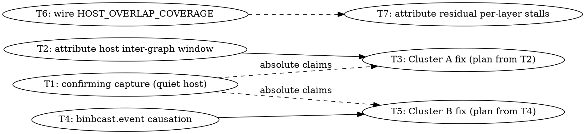

# SYCL Decode Launch-Overhead Reduction — Phase 2 Implementation Plan

> **For Claude:** REQUIRED SUB-SKILL: Use team-driven-development to implement this plan with agent teams.

**Goal:** Reduce the **9.602 ms/step** of `truly_idle` decode time on GPT-OSS 20B / Arc Pro B70 — device time explained by neither ggml-sycl host work nor a declared dependency — by attacking the two clusters it actually sits in, established by measurement rather than by intuition.

**Selected by:** Plan A's decision table, applied to Task 9's `DOMINANT CLASS: runtime_idle at 56.3%` → *"reduce launch count (batching, graphlets); per-op caching buys nothing."* Task 10 then re-analysed the same capture class-first and narrowed *which* launches.

**Tech Stack:** C++17 / SYCL (Intel oneAPI DPC++ 2026.1), Python 3, CMake/CTest, Arc Pro B70 (`level_zero:0`).

**Baseline to beat:** 20.670 ms/token clean (5.136 ms device-busy, 15.533 ms non-kernel). B70 GPT-OSS 20B MXFP4 gates: ~1415 PP512 / ~44 TG128 per `docs/backend/sycl-perf-baselines.md`.

---

## What is measured, and what is not (read first)

Everything below comes from **one** capture (`/tmp/steady-slice2/`, B70, graph replay ON, 100 steady-state steps), analysed twice — by `parse-sycl-timeline.py` in Task 9 and class-first by `parse-sycl-gap-causes.py` in Task 10. Full detail in `docs/plans/2026-07-25-decode-host-overhead-findings.md`.

**Established:**

| fact | value |
|---|---|
| Actionable idle (`truly_idle`) | 9.602 ms/step, 93.8 % of `runtime_idle` |
| Instrument is sound | 100 % of 46,100 device events resolve a submit span; `no_submit_span` = 0 |
| Worst known parser defect | 0.619 ms/step; corrected split 52.6 / 47.4, **same branch selected** |
| Cluster A — inter-token bubble | 2.324 ms/step, **n=99** vs 99 inter-graph transitions |
| Cluster B — per-layer attention stalls | ~6.37 ms/step, 23–24×/step over 24 layers |
| `sycl.binbcast.event` is an **empty `single_task`** | 72/step, 0.0382 ms/step device, followed by 5.503 ms/step idle |

**NOT established — do not build on these without the named task closing them first:**

1. **Run-to-run reproducibility.** Single capture. The class *shares* are robust to observer effect; the absolute milliseconds (23.326 ms/step profiled vs ~20.670 clean, ~12.9 % overhead) are not. **Task 1.**
2. **Host load is not a contributor.** `truly_idle` is precisely the signature a descheduled submitting thread produces, and the machine has run at load 18.68–56. **Task 1.**
3. **Causation for the `binbcast.event` no-op.** The idle *follows* the marker; nothing yet shows it is *caused* by it. **Task 4.**
4. **What consumes the ~1.65 ms host inter-graph window.** Sampling is normally microseconds. Unattributed. **Task 2.**

⚠️ **`queue_serialization ≈ 0` does NOT eliminate the dependency hypothesis.** `device_gap_has_dependency` sees only explicit `depends_on` edges; ggml-sycl GPU queues are all in-order (`common.hpp:5954`) and serialize *implicitly*, declaring no edge. That class is near-unreachable on this backend by construction, so an unknown share of `truly_idle` may be serialization wearing the residual class's name. Task 9's "one of three candidate causes is eliminated outright" is withdrawn.

---

## Scope Boundary

**Tasks 1, 2, 4 and 7 are measurement or mechanism tasks and are fully specified.** The two *fixes* they feed — Tasks 3 and 5 — are deliberately **not** decomposed here.

This is the same discipline Plan A's scope boundary applied, and for the same reason: the fix for Cluster A depends entirely on what Task 2 finds is consuming the host window (a serial data dependency in autoregressive decode cannot be overlapped away, but 1.65 ms of it is far too large to *be* that dependency), and the fix for Cluster B depends on whether Task 4 shows the marker is causal. Writing GREEN code for every branch means writing code that gets thrown away.

**Task 3 and Task 5 each begin by writing their own plan from their predecessor's measured result**, using the decision rules stated in those tasks.

---

## Team Topology

**Recommended implementers:** 2 concurrent (two independent tracks after Task 1)
**Reviewers:** spec + quality, spawned FRESH per review

### Parallel Tracks

| Track | Tasks | Description |
|-------|-------|-------------|
| — | 1 | Confirming capture on a quiet machine (gates *absolute* claims only; tracks A and B may start their measurement tasks in parallel) |
| A | 2, 3 | Inter-token bubble: attribute the host window, then fix |
| B | 4, 5 | `binbcast.event` no-op: establish causation, then remove |
| C | 6, 7 | Parser semantics + residual per-layer attribution (independent, no GPU) |

### Dependency Graph



### File Ownership Map

| File/Directory | Tasks | Conflict Risk |
|----------------|-------|---------------|
| `ggml/src/ggml-sycl/binbcast.cpp` | 4, 5 | Sequential (same track) |
| `scripts/parse-sycl-timeline.py` | 6 | None |
| `scripts/parse-sycl-gap-causes.py` | 7 | None |
| `tests/test-sycl-gap-causes.py` | 6, 7 | Sequential |
| `docs/plans/2026-07-25-decode-host-overhead-findings.md` | 1, 2, 4, 7 | **Append-only, one task at a time** |
| `docs/plans/` (new Cluster A / B fix plans) | 3, 5 | None (different files) |

---

## Safety Constraints (apply to EVERY task)

Carried forward from Plan A unchanged — these have hung or OOM-killed this host.

- **Never run `test-backend-ops`** in a subagent or background task (TTM shmem grows to 50–224 GB → OOM kill).
- **Never run `sycl-ls`** — has hung this host in `xe_drm_ioctl` requiring a reboot.
- **`timeout` every GPU command.** B70 runs also set `GGML_SYCL_OP_TIMEOUT_MS=180000`.
- **`TMPDIR=/tmp` on every build** (root fs ~98 %; AOT link fails ENOSPC otherwise).
- **Verify the backend, not the tokens**, after any reconfigure: `grep -E '^GGML_SYCL:' build/CMakeCache.txt` (want `BOOL=ON`) and `ldd build/bin/llama-completion | grep -cE 'libggml-sycl|libsycl'` (want ≥2). A CPU fallback passes every digit gate at ~8 tok/s.
- **Check competing load before any throughput measurement** — `uptime`, `pgrep -af 'codescout|ninja|icpx|ffmpeg'`. Absolute numbers under load are not baselines. `llama.cpp-2rkc` (codescout holding GPU VRAM) is a standing confound.
- **Check free VRAM on the B70** before trusting a number (~32.6 GB expected).
- **`dmesg` is privilege-denied**: use `journalctl -k --since "1 hour ago" --no-pager | grep -iE 'GT reset|guc_id|GPU hang|xe.*reset'`.
- **Never `git revert`.** Fix forward.
- **Every perf claim needs the Mistral completion gate re-run** — `llama-bench` measures tok/s, never correctness.

---

## Tasks

### Task 1: Confirming capture on a quiet host

**Why:** Task 9 is a single capture and Task 10 is a re-analysis of it, so nothing yet establishes reproducibility, and nothing separates `truly_idle` from host descheduling. Both are prerequisites for any *absolute* claim, and for attributing a later speedup to a change rather than to a quieter machine.

**Do:** Wait for `uptime` 1-minute load below ~4 with no `codescout`/`ninja`/`icpx` in `pgrep`. Re-run the Task 9 capture **verbatim** — same env block, same window, same card:

```bash
GGML_SYCL_TIMELINE=timeline+events GGML_SYCL_TIMELINE_TOKEN_START=15 \
GGML_SYCL_TIMELINE_TOKEN_COUNT=100 GGML_SYCL_TIMELINE_MAX_EVENTS=4000000 \
GGML_SYCL_KERNEL_PROFILE=1 ONEAPI_DEVICE_SELECTOR=level_zero:0 \
timeout 900 ./build/bin/llama-bench -m /Storage/GenAI/models/gpt-oss-20b-mxfp4.gguf \
  -p 0 -n 128 -r 1 -v
```

Parse with `--wall-ms` set to the window's **own** envelope (parser defect 3 is still unfixed — never let it derive one). Then run `parse-sycl-gap-causes.py --steps 100`.

**Gate:** Record load average before and after. Compare **shares and counts**, not absolute ms: `truly_idle` share of `runtime_idle`, the n=99 inter-graph coincidence, and the 72/step `binbcast.event` count must all reproduce. Append the comparison to the findings doc as Task 11.

**If the shares move materially**, host load was a confound in Task 9 and Tasks 3 and 5 must not proceed on the old numbers — say so plainly and stop rather than averaging the two.

⚠️ `GGML_SYCL_TIMELINE=timeline+events` alone yields **zero** `sycl.event` entries; the kernel profiler's drain is what emits device events, so `GGML_SYCL_KERNEL_PROFILE=1` is mandatory. Traces are Chrome format — events are under `traceEvents`, not `events`.

---

### Task 2: Attribute the host inter-graph window (Cluster A)

**Why:** The device is idle ~2.24 ms between graphs while the host is between `graph_compute` calls for ~1.65 ms of it. Autoregressive decode has a genuine serial dependency there — logits → sampling → next embedding — but that is normally microseconds, not 1.65 ms. Until we know what the 1.65 ms *is*, no fix can be scoped.

**Do:** Attribute the window between consecutive `ggml.graph` spans by callsite. The kernel profiler's `raw_events` already carries `file`/`line`/`function` per record and is not subject to the timeline's constraints (findings doc, "The `raw_events` path is already open"). Prefer that over new instrumentation; add host-side spans only if it proves insufficient, and say so explicitly if you do.

**Gate:** A ranked table accounting for ≥80 % of the measured host inter-graph window by callsite, appended to the findings doc. Below 80 %, report the coverage honestly rather than presenting a partial table as complete.

**Do NOT** propose a fix in this task. Task 3 does that from the table.

---

### Task 3: Cluster A fix — write the plan, then implement

**Entry:** Task 2's table. **Blocked on Task 1 for any absolute speedup claim.**

**Decision rule, fixed in advance:**

| Task 2 shows | Fix direction |
|---|---|
| One callsite > 50 % of the window | Optimize that callsite; scope from it directly |
| Work that does **not** depend on this token's logits | Overlap it with graph execution (it is on the critical path only by accident of ordering) |
| Work that genuinely depends on this token's logits | **Do not try to overlap it.** Reduce its cost, or accept and document the floor |
| No callsite > 20 % and coverage < 80 % | Write no fix plan; the window is unattributed, say so |

**Gate:** Mistral completion gate + B70 GPT-OSS gate pass; `llama-bench` shows no regression against `docs/backend/sycl-perf-baselines.md`; the claimed win is measured **interleaved**, never blocked A-then-B.

---

### Task 4: Establish whether the `binbcast.event` no-op is causal (Cluster B)

**Why:** 72 empty `single_task` submissions per token, 0.0382 ms/step of device time, followed by 5.503 ms/step of `truly_idle` — on an in-order queue that already guarantees the ordering the marker exists to provide. If causal, this is the single largest actionable item in the capture. If not, Cluster B's budget must be re-attributed and the marker left alone.

**Do:** `GGML_SYCL_BINBCAST_EVENT_MODE` (`binbcast.cpp:77`) is **not** sufficient — both `safe` and `barrier` still submit something. Add a third mode that returns **no submission at all** when the queue is in-order, reusing the existing reasoning at `unified-cache.cpp:7677` ("In-order queues already serialize submissions"). Keep it **opt-in** and default-off for this task.

Then determine what the returned `sycl::event` is actually used for. It is a real return value with real callers — if any caller needs a concrete event to wait on or chain, a no-submission mode must give it something valid or the change is a correctness bug, not an optimization. **Establish this before measuring, and record the callers.**

**Gate:**
- Mistral completion gate **and** the GPT-OSS B50 chat gate pass with the new mode on. Correctness first — a marker removal that corrupts ordering will still look fast.
- Interleaved A/B on the B70, ≥5 paired runs, reporting the spread.
- Re-capture and confirm via `parse-sycl-gap-causes.py` that `truly_idle` actually *fell* — not merely that tok/s moved.

**Report honestly if it is not causal.** A no-op removal that saves its own 0.29 ms/step and nothing more is a real but small result, and saying so is the outcome. Do not reach for the 5.5 ms.

---

### Task 5: Cluster B fix — make it the default, or re-attribute

**Entry:** Task 4's verdict.

| Task 4 shows | Action |
|---|---|
| Causal, gates pass, win reproduces interleaved | Make no-submission the default for in-order queues; keep an opt-out env var; update `docs/backend/sycl-env-vars.md` |
| Causal but a caller needs the event | Scope the narrower change that preserves the contract; do not force it |
| Not causal | Leave `binbcast.cpp` alone. Re-attribute Cluster B from Task 7 and write no fix plan |

---

### Task 6: Wire `HOST_OVERLAP_COVERAGE` (no GPU)

`union_host_node_overlap_us` and the `HOST_OVERLAP_COVERAGE` constant are staged in `parse-sycl-timeline.py`; the dispatch in `device_gap_has_host_overlap` is marked `TODO(decision pending)` because flipping it changes a published number. **This task is blocked on the maintainer's choice of semantics**, recorded at that constant.

**Gate:** `test-sycl-gap-causes` and `test-sycl-timeline-gap-class-conservation` pass. Add a fixture case pinning the chosen semantics. If `union` is chosen, re-run Task 9's parse and record both splits side by side in the findings doc — never silently restate the number.

---

### Task 7: Attribute the residual per-layer stalls (no GPU)

**Why:** If Task 4 shows the marker is causal, ~0.87 ms/step of Cluster B still sits in transitions it does not touch — `rope → set_rows.generic` (0.863), `rope → rope` (0.632), `set_rows.generic → binbcast.mul` (1.708, partly). These are 24×/step, so they are per-layer, and they are the KV-cache write path.

**Do:** Re-analyse the Task 1 capture for these transitions specifically. Given the `queue_serialization` correction above, explicitly test whether in-order queue serialization — invisible to `device_gap_has_dependency` — explains them, before concluding launch overhead does.

**Gate:** A written verdict naming which mechanism dominates, appended to the findings doc, with the evidence that distinguishes the two. "Unclear" is an acceptable verdict; a guess is not.

---

## End-to-End Validation (on the user's machine) — MANDATORY

Before any task in this plan is called done:

```bash
source /opt/intel/oneapi/setvars.sh --force

# 0. Backend is actually present (a CPU fallback passes every gate below)
grep -E '^GGML_SYCL:' build/CMakeCache.txt
ldd build/bin/llama-completion | grep -cE 'libggml-sycl|libsycl'

# 1. Mistral completion gate — output must start "1, 2, 3, 4, 5, 6, 7, 8, 9, 10"
ONEAPI_DEVICE_SELECTOR=level_zero:1 timeout 300 ./build/bin/llama-completion \
  -m /Storage/GenAI/models/mistral-7b-v0.1.Q4_0.gguf \
  -p '1, 2, 3, 4, 5,' -n 15 --seed 42 --temp 0

# 2. ctest
ctest --test-dir build --output-on-failure -j $(nproc)

# 3. B70 throughput vs docs/backend/sycl-perf-baselines.md (~1415 PP512 / ~44 TG128)
ONEAPI_DEVICE_SELECTOR=level_zero:0 GGML_SYCL_OP_TIMEOUT_MS=180000 \
  timeout 900 ./build/bin/llama-bench \
  -m /Storage/GenAI/models/gpt-oss-20b-mxfp4.gguf -p 512 -n 128
```

**B70 tg128 is the noisy axis** (cv 3.3 %, range 40.18–46.27 over 21 runs) — ignore single-run differences below ~10 %. The B50 is steady (cv 0.7 % tg) and is the better card for detecting a small real move.
