# Path-Scoped Arena Zone Sizing Implementation Plan

> **For Claude:** REQUIRED SUB-SKILL: Use team-driven-development to implement this plan with agent teams.

**Goal:** Stop sizing arena zones from the largest tensor in the model and start sizing each from the largest tensor that can actually reach that zone's code path, with a grow-on-demand fallback so a wrong prediction costs a reallocation instead of a crash.

**Architecture:** `populate_host_zone_sizing` (`ggml/src/ggml-sycl/unified-cache.cpp:16872`) computes one global `max_tensor_bytes` over the whole tensor inventory (`:16880-16883`) and fans it out into at least six independent budget lines — oneDNN reorder, MoE Q8_1 workspace, CPU quant buffers (`3 ×`), DMA staging pool (`2 ×`), oneDNN scratchpad (`2 ×`), and S1 preload staging — several of which are then summed *again* into `host_zone_scratch_bytes` (`:17130`). Every one of those consumers needs "the largest tensor **my path** can see"; all six are handed "the largest tensor, period." This plan introduces a small set of path-scoped maxima computed in the same loop, repoints each consumer at the one it needs, and adds grow-on-demand so the tighter estimate is safe.

**Tech Stack:** C++17, Intel oneAPI DPC++ 2026.1, SYCL, oneDNN, CMake/CTest. Arc Pro B70 (`level_zero:0`) and Arc Pro B50 (`level_zero:1`).

**Test Infrastructure:** Host-only C++ tests compiled against individual `.cpp` files, registered in `ggml/src/ggml-sycl/CMakeLists.txt` — the pattern established by `test-gpu-arch` at `ggml/src/ggml-sycl/CMakeLists.txt:1375-1404`, with sources under `ggml/src/ggml-sycl/tests/`. That pattern exists precisely because `populate_host_zone_sizing` is `static` inside a ~94k-line SYCL TU and cannot be unit-tested where it lives. Tests use the `CHECK(cond, msg)` macro from `ggml/src/ggml-sycl/tests/test-gpu-arch.cpp:29-35` — **`assert()` compiles away under the Release `-DNDEBUG` build and would pass vacuously.**

---

## Why This Matters Beyond Tidiness

The MoE down-I8 layout pass is blocked purely on VRAM headroom: it grants 24/24 layers on the B70 but **6/24 on the B50**, and one blocked layer missed by **6.6 MB**. The measured coefficient is ~261 MB per tensor. Every megabyte this plan reclaims is directly convertible into granted MoE layers, which is why Task 8's success metric is the granted-layer count rather than a VRAM number.

---

## Scope Correction (read before Task 1)

An earlier framing of this work claimed the over-provision was ~2.29 GB from two lines (oneDNN scratchpad + DMA staging), assuming a ~586.8 MiB maximum tensor. **That assumption is unverified**, and the arithmetic for a 201088 × 2880 MXFP4 embedding gives roughly half that. The consumer count is also higher than two.

Task 1 therefore measures the real inventory before any predicate is written. No task in this plan may quote a byte figure that Task 1 did not produce.

### Consumers deliberately left on `any_tensor`

Six consumers read `max_tensor_bytes`. This plan repoints four and leaves two, for stated reasons — an unowned consumer would be an orphan, and a silently-narrowed one would be a bug:

| Consumer | Line | Disposition |
|---|---|---|
| `onednn_reorder_bytes` | `:16893` | **Repointed** (Task 3, same predicate as the scratchpad) |
| `cpu_quant_buffer_bytes` | `:16968` | **Repointed** (Task 4) |
| `dma_staging_pool_bytes` | `:17044` | **Repointed** (Task 5) |
| `onednn_scratchpad_bytes` | `:17054` | **Repointed** (Task 3) |
| `moe_q8_workspace_bytes` | `:16902` | **Left as-is.** Derived as `max_tensor_bytes / n_experts`, so it is already a per-expert figure and the global max enters only as a numerator the existing comment calls deliberately conservative. Narrowing it needs an MoE-specific predicate this plan does not establish. |
| `s1_per_inflight_bytes` | `:17112` | **Left as-is.** S1 preload streams *every* tensor, embeddings included, so `any_tensor` is the correct maximum here. Narrowing it would be the bug this plan exists to prevent, in reverse. |

---

## Amendment 1 (2026-07-25) — predicates are structural, not name-based

**This supersedes every name-matching predicate below.** Wherever this plan writes
`zone_is_vocab_tensor(name)`, `token_embd`, `lm_head` or `output.weight` as a *decision*,
read the structural rule in this section instead. The original code blocks in Tasks 2 and
7 are retained as illustration of the surrounding structure (header layout, test harness,
CMake registration) and remain accurate for everything except the classification itself.

**Why the change.** Tensor names are a GGUF convention, not a guarantee — they can differ
for every model and every converter. Worse, the failure mode is silent: a predicate that
matches nothing degrades each maximum straight back to the global max, so a broken
predicate presents as "this plan reclaimed nothing" rather than as an error. That is
indistinguishable from the predicate being correct and the reclaim genuinely being zero.

**What replaces it.** `placement_tensor_info` (`unified-cache.hpp:347-360`) already carries
`type` and `ne[GGML_MAX_DIMS]`; the original `zone_tensor_desc` discarded them. Keep them
and classify by repetition:

```
key  = (type, ne[0], ne[1], ne[2], ne[3])
freq = number of inventory tensors sharing that key
is_per_layer_weight(t)  <=>  freq[key(t)] >= max(2, n_layer / 2)
```

A per-layer weight family repeats once per block (~24-80 entries); the vocab embedding and
LM head are singletons, or a *pair* when untied and identically shaped. The `n_layer / 2`
term is load-bearing — a bare `>= 2` threshold would wrongly admit an untied embd/output
pair. Names survive in `zone_tensor_desc` as a **diagnostic field only**; no decision path
may branch on one.

**n_layer plumbing.** `populate_host_zone_sizing` does not currently receive `n_layer`.
Both call sites (`:17544`, `:19520`) have `kv_info` in scope and
`placement_kv_info::n_layer` exists (`unified-cache.hpp:380`), so Task 3 adds the parameter
and passes `kv_info.n_layer`. **`n_layer == 0` must not narrow anything** — every
path-scoped maximum falls back to `any_tensor`, logged once. Narrowing on an unknown layer
count would reintroduce exactly the silent degradation this amendment removes.

**Known, instrumented risk.** The structural rule classifies the **LM head as not a
per-layer weight**, excluding it from `onednn_eligible`. But the LM head is consumed by
`MUL_MAT` and may be a genuine oneDNN reorder subject — unlike the token embedding, which
is a `GET_ROWS` lookup and legitimately never reaches that path. The original name-based
predicate bundled these two together and so could not see the distinction at all.

If the LM head does reach oneDNN, this predicate under-estimates. That is survivable by
construction: Task 6 grows the zone on demand and Task 7 counts the underestimate, so it
surfaces as a loud warning rather than a crash or a silent slowdown. **End-to-End
Validation step 5 — "no predicate underestimates observed" — is the experiment that settles
it.** Do not pre-emptively widen the predicate, and do not add a name check to special-case
the LM head; let the instrumentation answer it.

---

## Team Topology

**Recommended implementers:** 2 concurrent (based on 2 parallel tracks — execution spawns one ephemeral implementer PER TASK)
**Reviewers:** spec + quality, spawned FRESH per review (not a standing pair; see team-driven-development)

### Parallel Tracks

| Track | Tasks | Description |
|-------|-------|-------------|
| A | 1, 3, 4, 5, 6, 7 | `unified-cache.cpp` sizing chain — strictly sequential, one file |
| B | 2 | New `zone-sizing` unit (independent new files) |
| — | 8, 9 | Convergence: measurement, documentation |

Track A is long and sequential because every task touches `unified-cache.cpp`. That is a genuine constraint, not a decomposition failure — the file is ~94k lines and concurrent edits to the sizing chain would conflict on every task.

### Dependency Graph

```dot
digraph dependencies {
    rankdir=LR;
    1 [label="T1: inventory spike"];
    2 [label="T2: zone-sizing predicates"];
    3 [label="T3: repoint oneDNN scratchpad"];
    4 [label="T4: repoint CPU quant buffers"];
    5 [label="T5: repoint DMA staging"];
    6 [label="T6: grow-on-demand ONEDNN zone"];
    7 [label="T7: mispredict diagnostic"];
    8 [label="T8: measure reclaimed VRAM"];
    9 [label="T9: docs"];
    1 -> 2;
    2 -> 3;
    3 -> 4;
    4 -> 5;
    5 -> 6;
    6 -> 7;
    7 -> 8;
    8 -> 9;
}
```



### File Ownership Map

| File/Directory | Tasks | Conflict Risk |
|----------------|-------|---------------|
| `ggml/src/ggml-sycl/zone-sizing.hpp` | 2 | None (new file) |
| `ggml/src/ggml-sycl/zone-sizing.cpp` | 2, 7 | Sequential (T7 after T2) |
| `ggml/src/ggml-sycl/tests/test-zone-sizing.cpp` | 2, 7 | Sequential |
| `ggml/src/ggml-sycl/CMakeLists.txt` | 2 | None (single task; append after `:1404`) |
| `ggml/src/ggml-sycl/unified-cache.cpp` | 1, 3, 4, 5, 6, 7 | **Sequential — same track, one file** |
| `ggml/src/ggml-sycl/unified-cache.hpp` | 2, 3, 4, 5 | Sequential (field declarations) |
| `docs/backend/sycl-memory-design.md` | 9 | None (runs last) |
| `docs/backend/sycl-env-vars.md` | 9 | None (runs last) |

---

## Memory-Ownership Contract (binding on every task)

From `CLAUDE.md` and `docs/design/sycl-canonical-memory-architecture.md`. A task that breaks these fails review regardless of whether it works:

- **The unified cache is the allocator.** All GPU, host-pinned, staging, scratch, graph-temporary, KV, oneDNN, and weight-layout allocations flow through `unified_alloc` / `unified_allocate` / cache materialization helpers. **Task 6's grow path must allocate through the unified cache, never via a direct `sycl::malloc_device` / `malloc_host` / `sycl::free` / raw TLSF call.**
- **`mem_handle` is the ownership token.** Code using an allocation holds a handle until the CPU thread, SYCL event, command graph, or pointer table is done with it.
- **Raw pointers are transient ABI views only.** Never ownership, never a cache key, never outliving their handle.
- **No forced eviction or zone reset to reclaim memory that still has a live handle.** A live allocation at cleanup is a leaked reference to fix, not a reason to force. Note `unified-cache.cpp:1821-1842` already refuses an arena rebuild when live leases exist and logs why — Task 6 must preserve that refusal, not route around it.

---

## Safety Constraints (apply to EVERY task in this plan)

- **`TMPDIR=/tmp` on every build.** Root filesystem ~98% full; the AOT link stage fails with ENOSPC otherwise.
- **Never run `test-backend-ops`** in a subagent or background task — TTM shmem backing grows to 50–224 GB and the process is OOM-killed. Run it manually with monitoring only.
- **Never run `sycl-ls`** — has hung this host in `xe_drm_ioctl` requiring a reboot.
- **`timeout` every GPU command**; B70 runs also set `GGML_SYCL_OP_TIMEOUT_MS=180000`.
- **Check free VRAM before trusting any B70 number** (~32.6 GB expected; ~13.8 GB means another workload holds the card).
- **Check `dmesg` for GT resets** before believing any measurement.
- **Never `git revert`.** Fix forward.
- **`./scripts/sycl-build.sh -r`** is required after adding any new `.cpp` — `ggml/src/ggml-sycl/CMakeLists.txt:42` globs `*.cpp`, and a glob is only re-evaluated at configure time.

---

### Task 1: Measure the real tensor inventory

**Track:** A
**Depends on:** None
**File scope:**
- Modify: `ggml/src/ggml-sycl/unified-cache.cpp:16880-16883` (extend the existing max loop with logging)
- Create: `/tmp/zone-sizing/` (artifacts, not committed)
- Create: `docs/plans/2026-07-25-zone-sizing-findings.md`

**Description:**

Every subsequent task's predicate and every byte figure in this plan depends on knowing which tensors actually win the global max and by how much. Nothing in the codebase reports this today. This spike adds a `[SYCL-PLAN]` line naming the top tensors by size and runs it against both GPT-OSS 20B and Mistral 7B, producing the ground truth the predicates are built from.

**Acceptance Criteria:**

- [ ] A `[SYCL-PLAN] inventory top-N` log line lists the 8 largest tensors by name, size, type and shape
- [ ] The line prints unconditionally at plan time (it is one line, not per-tensor spam)
- [ ] Captured for GPT-OSS 20B MXFP4 and Mistral 7B Q4_0
- [ ] Findings doc records, for each model: the max tensor's name/size, and the total inventory size
- [ ] No behaviour change — the same zone sizes are computed as before

**Implementation Guide:**

1. **RED: confirm the information does not exist today.**

```bash
source /opt/intel/oneapi/setvars.sh --force
mkdir -p /tmp/zone-sizing
timeout 600 env ONEAPI_DEVICE_SELECTOR=level_zero:1 ./build/bin/llama-bench \
  -m /Storage/GenAI/models/gpt-oss-20b-mxfp4.gguf -p 0 -n 4 -r 1 2>&1 \
  | grep -E '\[SYCL-PLAN\]' | tee /tmp/zone-sizing/before.txt
grep -c 'inventory top' /tmp/zone-sizing/before.txt
```

Expected: `0` — no inventory line exists. This is the RED state.

2. **GREEN: add the log line.** In `ggml/src/ggml-sycl/unified-cache.cpp`, replace the max loop at `:16880-16883`:

```cpp
    plan.max_tensor_bytes       = 0;
    plan.max_staging_pair_bytes = 0;
    for (const auto & item : tensor_inventory) {
        plan.max_tensor_bytes = std::max(plan.max_tensor_bytes, item.size);
    }
```

with:

```cpp
    plan.max_tensor_bytes       = 0;
    plan.max_staging_pair_bytes = 0;
    for (const auto & item : tensor_inventory) {
        plan.max_tensor_bytes = std::max(plan.max_tensor_bytes, item.size);
    }

    // Every zone below is sized from a maximum over this inventory, so which
    // tensors win those maxima is load-bearing. Nothing reported it before, and
    // the sizing was assumed to be dominated by tensors that in fact never
    // reach the paths being sized. One line, at plan time only.
    {
        std::vector<const placement_tensor_info *> ranked;
        ranked.reserve(tensor_inventory.size());
        for (const auto & item : tensor_inventory) {
            ranked.push_back(&item);
        }
        std::partial_sort(ranked.begin(), ranked.begin() + std::min<size_t>(8, ranked.size()), ranked.end(),
                          [](const placement_tensor_info * a, const placement_tensor_info * b) {
                              return a->size > b->size;
                          });
        size_t inventory_total = 0;
        for (const auto & item : tensor_inventory) {
            inventory_total += item.size;
        }
        std::string top;
        for (size_t i = 0; i < std::min<size_t>(8, ranked.size()); ++i) {
            char entry[256];
            std::snprintf(entry, sizeof(entry), "%s%s=%.1fMB(t%d,%lldx%lld)", i ? " " : "",
                          ranked[i]->name.c_str(), ranked[i]->size / (1024.0 * 1024.0),
                          static_cast<int>(ranked[i]->type), static_cast<long long>(ranked[i]->ne[0]),
                          static_cast<long long>(ranked[i]->ne[1]));
            top += entry;
        }
        GGML_LOG_INFO("[SYCL-PLAN] inventory top-8 of %zu tensors (total %.1f MB): %s\n", tensor_inventory.size(),
                      inventory_total / (1024.0 * 1024.0), top.c_str());
    }
```

3. **Build and capture both models:**

```bash
TMPDIR=/tmp ./scripts/sycl-build.sh
for m in gpt-oss-20b-mxfp4 mistral-7b-v0.1.Q4_0; do
  timeout 900 env ONEAPI_DEVICE_SELECTOR=level_zero:1 ./build/bin/llama-bench \
    -m /Storage/GenAI/models/${m}.gguf -p 0 -n 4 -r 1 2>&1 \
    | grep -E '\[SYCL-PLAN\]' | tee /tmp/zone-sizing/${m}.plan.txt
done
grep 'inventory top-8' /tmp/zone-sizing/*.plan.txt
```

Expected: one `inventory top-8` line per model, naming real GGUF tensor names.

4. **Write the findings doc** `docs/plans/2026-07-25-zone-sizing-findings.md` with a `## Task 1 — Inventory` section: per model, the top-8 table (name, MB, type, shape), the tensor count, the inventory total, and:

```
MAX TENSOR (gpt-oss-20b-mxfp4): <name> at <N.N> MB
MAX TENSOR (mistral-7b-Q4_0):   <name> at <N.N> MB
IMPLIED ZONE COST at HEAD: onednn_scratchpad=<2N.N> MB, cpu_quant=<3N.N> MB,
dma_staging=<2N.N> MB, onednn_reorder=<N.N> MB.
```

**Commit:**

```bash
git add ggml/src/ggml-sycl/unified-cache.cpp docs/plans/2026-07-25-zone-sizing-findings.md
git commit -m "feat(sycl): log the planner tensor inventory top-8 at plan time"
```

**Gotchas:**

- `<algorithm>` (`std::partial_sort`) and `<cstdio>` (`std::snprintf`) must be included in `unified-cache.cpp`. Check with `grep -n '#include <algorithm>\|#include <cstdio>' ggml/src/ggml-sycl/unified-cache.cpp` before adding — the file is large and almost certainly already has them; adding a duplicate include is harmless but noisy in review.
- `placement_tensor_info::ne` is only meaningful when `has_shape()` is true (`unified-cache.hpp:359`). Printing `ne[0]`/`ne[1]` for a shapeless entry yields zeros — that is acceptable for a diagnostic and is itself informative, but do not build a predicate on unchecked `ne` in later tasks.
- `-p 0 -n 4 -r 1` is the shortest run that still triggers planning. Do not use a full benchmark; this task needs a log line, not a measurement.
- Do **not** change any sizing arithmetic in this task. It is observation only; a behaviour change here would contaminate Task 8's before/after comparison.
- `plan.max_staging_pair_bytes` is computed in a *separate* loop over `plan.entries` immediately below (`:16884-16888`). Do not merge the two loops — they iterate different containers.

---

### Task 2: Path-scoped maxima with host-only tests

> **AMENDED — see "Amendment 1" above before implementing.** The predicates and the test
> fixture in this section match on tensor *names*; that approach is superseded by the
> structural `(type, ne)` group-frequency rule. The header layout, the `CHECK` macro, the
> CMake registration and the host-only reasoning below all still stand. The tracker task
> `llama.cpp-mv5c` carries the amended spec in full.

**Track:** B
**Depends on:** Task 1
**File scope:**
- Create: `ggml/src/ggml-sycl/zone-sizing.hpp`
- Create: `ggml/src/ggml-sycl/zone-sizing.cpp`
- Create: `ggml/src/ggml-sycl/tests/test-zone-sizing.cpp`
- Modify: `ggml/src/ggml-sycl/CMakeLists.txt` (append after `:1404`)

**Description:**

Introduces the eligibility predicates and the `path_scoped_maxima` struct as pure functions in their own translation unit, so they are unit-testable without a GPU and without linking the backend — the same reasoning that produced `gpu-arch.cpp` and its host-only `test-gpu-arch` target. `populate_host_zone_sizing` is `static` inside a ~94k-line SYCL TU and can never be tested where it lives.

**Acceptance Criteria:**

- [ ] `zone_scoped_maxima(inventory)` returns a struct with `onednn_eligible`, `cpu_quant_eligible`, `dma_streamed`, and `any_tensor` maxima
- [ ] Embedding/output tensors are excluded from `onednn_eligible`
- [ ] `any_tensor` always equals the current global `max_tensor_bytes` (proves the refactor is non-destructive)
- [ ] Every path-scoped maximum is `<= any_tensor` — a predicate can only narrow
- [ ] An empty inventory returns all-zero without dividing by zero or reading `begin()`
- [ ] `ctest -R zone-sizing` passes; the target builds in seconds and needs no GPU

**Implementation Guide:**

1. **RED: write the test first.**

Create `ggml/src/ggml-sycl/tests/test-zone-sizing.cpp`:

```cpp
//
// Test: path-scoped arena zone maxima
//
// Guards the over-provision where every zone was sized from the single
// largest tensor in the model, including tensors that reach none of the
// paths being sized. Host-only: zone_scoped_maxima is a pure function over
// a vector of descriptors, so no GPU and no AOT target are needed.
//
// MIT license
// Copyright (C) 2024-2026 Intel Corporation
// SPDX-License-Identifier: MIT
//

#include "zone-sizing.hpp"

#include <cstdio>
#include <vector>

// The build is -DNDEBUG (Release), so assert() would compile away and the
// test would pass vacuously. Use an explicit check that always runs.
#define CHECK(cond, msg)                                                        \
    do {                                                                        \
        if (!(cond)) {                                                          \
            std::fprintf(stderr, "FAIL: %s:%d: %s\n", __FILE__, __LINE__, msg); \
            return 1;                                                           \
        }                                                                       \
    } while (0)

using ggml_sycl::zone_scoped_maxima;
using ggml_sycl::zone_tensor_desc;

static zone_tensor_desc desc(const char * name, size_t size) {
    zone_tensor_desc d;
    d.name = name;
    d.size = size;
    return d;
}

int main() {
    // Inventory modelled on the Task 1 measurement: a large embedding and a
    // large output head that dominate the global max, plus smaller FFN and
    // attention weights that are what the sized paths actually touch.
    const std::vector<zone_tensor_desc> inventory = {
        desc("token_embd.weight",              300u * 1024u * 1024u),
        desc("output.weight",                  300u * 1024u * 1024u),
        desc("blk.0.ffn_gate_exps.weight",      80u * 1024u * 1024u),
        desc("blk.0.ffn_down_exps.weight",      80u * 1024u * 1024u),
        desc("blk.0.attn_q.weight",             10u * 1024u * 1024u),
    };

    const auto maxima = zone_scoped_maxima(inventory);

    // any_tensor must reproduce the global max exactly — this is what proves
    // the refactor cannot change the behaviour of consumers left unrepointed.
    CHECK(maxima.any_tensor == 300u * 1024u * 1024u, "any_tensor must equal the global max");

    // The embedding and the LM head are not oneDNN matmul reorder subjects.
    CHECK(maxima.onednn_eligible == 80u * 1024u * 1024u,
          "onednn_eligible must exclude token_embd/output and fall to the largest FFN weight");

    // A predicate may only ever narrow.
    CHECK(maxima.onednn_eligible <= maxima.any_tensor, "onednn_eligible must not exceed any_tensor");
    CHECK(maxima.cpu_quant_eligible <= maxima.any_tensor, "cpu_quant_eligible must not exceed any_tensor");
    CHECK(maxima.dma_streamed <= maxima.any_tensor, "dma_streamed must not exceed any_tensor");

    // Empty inventory must be safe and zero, not UB.
    const auto empty = zone_scoped_maxima({});
    CHECK(empty.any_tensor == 0, "empty inventory any_tensor must be 0");
    CHECK(empty.onednn_eligible == 0, "empty inventory onednn_eligible must be 0");
    CHECK(empty.cpu_quant_eligible == 0, "empty inventory cpu_quant_eligible must be 0");
    CHECK(empty.dma_streamed == 0, "empty inventory dma_streamed must be 0");

    // A single ineligible tensor must not silently fall back to the global max.
    const std::vector<zone_tensor_desc> only_embd = { desc("token_embd.weight", 512u * 1024u * 1024u) };
    const auto embd_only = zone_scoped_maxima(only_embd);
    CHECK(embd_only.any_tensor == 512u * 1024u * 1024u, "only_embd any_tensor must equal the global max");
    CHECK(embd_only.onednn_eligible == 0,
          "an inventory with no oneDNN-eligible tensor must yield 0, not the global max");

    std::printf("PASS: zone-sizing path-scoped maxima\n");
    return 0;
}
```

Run: `TMPDIR=/tmp ./scripts/sycl-build.sh -r test-zone-sizing`
Expected: FAIL — `fatal error: 'zone-sizing.hpp' file not found`

2. **GREEN: create the header.** `ggml/src/ggml-sycl/zone-sizing.hpp`:

```cpp
//
// Path-scoped arena zone sizing.
//
// populate_host_zone_sizing used to size every zone from one global
// max_tensor_bytes. Consumers each need "the largest tensor MY path can
// reach"; handing all of them the largest tensor in the model over-provisions
// each zone by the difference. These predicates are pure and live in their own
// TU so they can be unit-tested without a GPU (see tests/test-zone-sizing.cpp).
//
// MIT license
// Copyright (C) 2024-2026 Intel Corporation
// SPDX-License-Identifier: MIT
//

#pragma once

#include <cstddef>
#include <string>
#include <vector>

namespace ggml_sycl {

// Minimal descriptor: deliberately NOT placement_tensor_info, so this header
// stays free of unified-cache.hpp (which pulls in SYCL and the whole backend).
// populate_host_zone_sizing adapts its inventory into these at the call site.
struct zone_tensor_desc {
    std::string name;
    size_t      size = 0;
};

struct path_scoped_maxima {
    size_t any_tensor         = 0;  // the legacy global max; consumers not yet repointed use this
    size_t onednn_eligible    = 0;  // largest tensor that can be a oneDNN matmul reorder subject
    size_t cpu_quant_eligible = 0;  // largest tensor the CPU quantization slots can hold
    size_t dma_streamed       = 0;  // largest tensor the host->device weight stream can carry
};

// True when the tensor is a vocabulary-sized embedding or LM head. These
// dominate the global max on GPT-OSS and Mistral alike and reach none of the
// per-layer weight paths the zones below are sized for.
bool zone_is_vocab_tensor(const std::string & name);

bool zone_is_onednn_reorder_eligible(const zone_tensor_desc & tensor);
bool zone_is_cpu_quant_eligible(const zone_tensor_desc & tensor);
bool zone_is_dma_streamed(const zone_tensor_desc & tensor);

path_scoped_maxima zone_scoped_maxima(const std::vector<zone_tensor_desc> & inventory);

}  // namespace ggml_sycl
```

3. **GREEN: create the implementation.** `ggml/src/ggml-sycl/zone-sizing.cpp`:

```cpp
//
// Path-scoped arena zone sizing implementation.
//
// MIT license
// Copyright (C) 2024-2026 Intel Corporation
// SPDX-License-Identifier: MIT
//

#include "zone-sizing.hpp"

#include <algorithm>

namespace ggml_sycl {

namespace {

bool name_contains(const std::string & haystack, const char * needle) {
    return haystack.find(needle) != std::string::npos;
}

}  // namespace

bool zone_is_vocab_tensor(const std::string & name) {
    // GGUF conventions: token_embd.weight is the input embedding, output.weight
    // the LM head. Some conversions name the head "lm_head". All three are
    // vocab-sized and none is a per-layer weight.
    return name_contains(name, "token_embd") || name_contains(name, "lm_head") || name == "output.weight";
}

bool zone_is_onednn_reorder_eligible(const zone_tensor_desc & tensor) {
    return !zone_is_vocab_tensor(tensor.name);
}

bool zone_is_cpu_quant_eligible(const zone_tensor_desc & tensor) {
    return !zone_is_vocab_tensor(tensor.name);
}

bool zone_is_dma_streamed(const zone_tensor_desc & tensor) {
    return !zone_is_vocab_tensor(tensor.name);
}

path_scoped_maxima zone_scoped_maxima(const std::vector<zone_tensor_desc> & inventory) {
    path_scoped_maxima maxima;
    for (const auto & tensor : inventory) {
        maxima.any_tensor = std::max(maxima.any_tensor, tensor.size);
        if (zone_is_onednn_reorder_eligible(tensor)) {
            maxima.onednn_eligible = std::max(maxima.onednn_eligible, tensor.size);
        }
        if (zone_is_cpu_quant_eligible(tensor)) {
            maxima.cpu_quant_eligible = std::max(maxima.cpu_quant_eligible, tensor.size);
        }
        if (zone_is_dma_streamed(tensor)) {
            maxima.dma_streamed = std::max(maxima.dma_streamed, tensor.size);
        }
    }
    return maxima;
}

}  // namespace ggml_sycl
```

4. **Register the test target.** Append to `ggml/src/ggml-sycl/CMakeLists.txt` after the `test-gpu-arch` block ending at `:1404`:

```cmake
# Test: path-scoped arena zone maxima.
# Host-only — zone_scoped_maxima and its predicates are pure functions over a
# vector of descriptors, so no GPU, no AOT target, and no libggml-sycl link.
# Mirrors the test-gpu-arch pattern above for the same reason: the production
# consumer (populate_host_zone_sizing) is static inside a ~94k-line SYCL TU.
add_executable(test-zone-sizing
    tests/test-zone-sizing.cpp
    zone-sizing.cpp
)
target_include_directories(test-zone-sizing PRIVATE
    ${CMAKE_CURRENT_SOURCE_DIR}
    ${CMAKE_CURRENT_SOURCE_DIR}/..
    ${CMAKE_CURRENT_SOURCE_DIR}/../../include
)
add_test(NAME zone-sizing COMMAND test-zone-sizing)
set_tests_properties(zone-sizing PROPERTIES
    LABELS "sycl;memory;planner;tdd"
    TIMEOUT 60
)
```

5. **Verify GREEN:**

```bash
source /opt/intel/oneapi/setvars.sh --force
TMPDIR=/tmp ./scripts/sycl-build.sh -r test-zone-sizing
ctest --test-dir build -R zone-sizing -V
```

Expected: `PASS: zone-sizing path-scoped maxima`, ctest `Passed`.

**Commit:**

```bash
git add ggml/src/ggml-sycl/zone-sizing.hpp ggml/src/ggml-sycl/zone-sizing.cpp \
        ggml/src/ggml-sycl/tests/test-zone-sizing.cpp ggml/src/ggml-sycl/CMakeLists.txt
git commit -m "feat(sycl): add path-scoped arena zone maxima with host-only tests"
```

**Gotchas:**

- **Update the predicates to match Task 1's measured names.** The `token_embd` / `lm_head` / `output.weight` set above is the GGUF convention; if Task 1's `inventory top-8` shows different names dominating on either model, both the predicate *and* the test fixture must be corrected before the GREEN step. A predicate that matches nothing silently degrades every maximum back to the global one — which is why the test asserts `onednn_eligible == 0` for a vocab-only inventory rather than accepting a fallback.
- Unlike `test-gpu-arch`, this target does **not** need `-fsycl` — `zone-sizing.cpp` includes no SYCL header. Do not copy `GPU_ARCH_TEST_SYCL_OPTIONS` across; keeping it SYCL-free is what makes it build in seconds.
- `zone_tensor_desc` deliberately duplicates two fields of `placement_tensor_info` rather than including `unified-cache.hpp`. That header pulls in SYCL and the whole backend, which would destroy the host-only property. The adaptation happens at the call site in Task 3.
- The three predicates are intentionally identical today. They are separate functions because Tasks 3-5 may narrow them independently once each consumer's real constraint is known — do not collapse them into one.
- `./scripts/sycl-build.sh -r` (reconfigure) is mandatory: `CMakeLists.txt:42` globs `*.cpp` and a new file is invisible without it.

---

### Task 3: Repoint both oneDNN allocations at `onednn_eligible`

**Track:** A
**Depends on:** Task 2
**File scope:**
- Modify: `ggml/src/ggml-sycl/unified-cache.cpp:16880-16883` (compute maxima), `:16893` (reorder), `:17054` (scratchpad)
- Modify: `ggml/src/ggml-sycl/unified-cache.hpp:481` (comment)
- Modify: `ggml/src/ggml-sycl/tests/test-zone-sizing.cpp` (no change expected; re-run as regression)

**Description:**

The first consumers repointed. Two lines size oneDNN allocations from the global maximum: `plan.onednn_reorder_bytes = plan.max_tensor_bytes` (`:16893`, the per-layer reorder temp buffer) and `plan.onednn_scratchpad_bytes = plan.max_tensor_bytes * 2` (`:17054`, the ONEDNN zone estimate, which then raises the zone at `unified-cache.cpp:1755-1762`). Both hold a oneDNN matmul weight reorder or its activation buffer; neither can ever hold the vocab embedding. They are one behaviour — "oneDNN allocations are sized from oneDNN-eligible tensors" — applied to two adjacent lines, so they share a task rather than splitting a single predicate across two.

**Acceptance Criteria:**

- [ ] `populate_host_zone_sizing` computes a `path_scoped_maxima` from the inventory
- [ ] `plan.onednn_scratchpad_bytes` **and** `plan.onednn_reorder_bytes` derive from `onednn_eligible`, not `max_tensor_bytes`
- [ ] `plan.max_tensor_bytes` still equals `maxima.any_tensor` (unchanged for every other consumer)
- [ ] The `[UNIFIED-CACHE] ONEDNN zone raised` line reports a smaller figure on GPT-OSS than before
- [ ] `host_zone_scratch_bytes` (`:17130`) shrinks — it sums `onednn_reorder_bytes`
- [ ] `ctest -R zone-sizing` passes; the GPT-OSS count gate passes

**Implementation Guide:**

1. **RED: capture the current zone figure.**

```bash
source /opt/intel/oneapi/setvars.sh --force
timeout 600 env ONEAPI_DEVICE_SELECTOR=level_zero:1 ./build/bin/llama-bench \
  -m /Storage/GenAI/models/gpt-oss-20b-mxfp4.gguf -p 0 -n 4 -r 1 2>&1 \
  | grep -E 'ONEDNN zone raised|inventory top-8' | tee /tmp/zone-sizing/onednn-before.txt
```

Record the "raised to X MB" figure. This is the number that must shrink.

2. **GREEN: compute the maxima.** Add the include near the other backend includes in `unified-cache.cpp`:

```cpp
#include "zone-sizing.hpp"
```

Then, immediately after the max loop at `:16880-16883` (and before the Task 1 logging block), add:

```cpp
    // Path-scoped maxima. Each zone below wants the largest tensor ITS path can
    // reach; max_tensor_bytes is the largest tensor in the model and is kept
    // for the consumers that genuinely mean "any tensor".
    std::vector<ggml_sycl::zone_tensor_desc> zone_inventory;
    zone_inventory.reserve(tensor_inventory.size());
    for (const auto & item : tensor_inventory) {
        ggml_sycl::zone_tensor_desc desc;
        desc.name = item.name;
        desc.size = item.size;
        zone_inventory.push_back(std::move(desc));
    }
    const ggml_sycl::path_scoped_maxima zone_maxima = ggml_sycl::zone_scoped_maxima(zone_inventory);
    GGML_ASSERT(zone_maxima.any_tensor == plan.max_tensor_bytes);
```

3a. **GREEN: repoint the reorder buffer** at `:16893`. Replace:

```cpp
    plan.onednn_reorder_bytes = plan.max_tensor_bytes;
```

with:

```cpp
    // One temp buffer sized to the largest weight the oneDNN reorder actually
    // processes, reused per layer. The vocab embedding and LM head are never
    // reorder subjects, so the global max over-sized this by their margin.
    plan.onednn_reorder_bytes = zone_maxima.onednn_eligible;
```

3b. **GREEN: repoint the scratchpad** at `:17054`. Replace:

```cpp
    plan.onednn_scratchpad_bytes = plan.max_tensor_bytes * 2;
```

with:

```cpp
    // Weights reorder + activation buffer. Neither can be the vocab embedding
    // or the LM head, so this is sized from the largest oneDNN-eligible tensor
    // rather than the largest tensor in the model. Task 6 adds grow-on-demand
    // so a mispredicting predicate costs a reallocation, not a failure.
    plan.onednn_scratchpad_bytes = zone_maxima.onednn_eligible * 2;
    GGML_LOG_INFO("[SYCL-PLAN] oneDNN scratchpad: %.1f MB (2 x onednn_eligible %.1f MB; global max %.1f MB)\n",
                  plan.onednn_scratchpad_bytes / (1024.0 * 1024.0),
                  zone_maxima.onednn_eligible / (1024.0 * 1024.0), plan.max_tensor_bytes / (1024.0 * 1024.0));
```

Update the comment at `unified-cache.hpp:481` from `Sized as max_tensor_bytes × 2.` to `Sized as 2 x the largest oneDNN-eligible tensor (see zone-sizing.hpp).`

4. **Verify GREEN:**

```bash
TMPDIR=/tmp ./scripts/sycl-build.sh
ctest --test-dir build -R zone-sizing -V
timeout 600 env ONEAPI_DEVICE_SELECTOR=level_zero:1 ./build/bin/llama-bench \
  -m /Storage/GenAI/models/gpt-oss-20b-mxfp4.gguf -p 0 -n 4 -r 1 2>&1 \
  | grep -E 'ONEDNN zone raised|oneDNN scratchpad' | tee /tmp/zone-sizing/onednn-after.txt
diff /tmp/zone-sizing/onednn-before.txt /tmp/zone-sizing/onednn-after.txt
```

Expected: the scratchpad figure is strictly smaller than step 1's, and the new `[SYCL-PLAN] oneDNN scratchpad` line shows `onednn_eligible` below `global max`.

5. **Correctness gate:**

```bash
timeout 300 env ONEAPI_DEVICE_SELECTOR=level_zero:1 ./build/bin/llama-cli \
  -m /Storage/GenAI/models/gpt-oss-20b-mxfp4.gguf -ngl 99 -cnv -st --simple-io \
  --no-display-prompt --chat-template-kwargs '{"reasoning_effort":"medium"}' \
  --reasoning-format none --reasoning-budget 0 \
  -p 'Count from 1 to 5. Answer with only: 1, 2, 3, 4, 5' -n 48 --seed 42 --temp 0
```

Expected: output starts `: 1, 2, 3, 4, 5`

Also gate Mistral, since its inventory differs:

```bash
timeout 300 env ONEAPI_DEVICE_SELECTOR=level_zero:1 ./build/bin/llama-completion \
  -m /Storage/GenAI/models/mistral-7b-v0.1.Q4_0.gguf \
  -p '1, 2, 3, 4, 5,' -n 15 --seed 42 --temp 0
```

Expected: output starts `1, 2, 3, 4, 5, 6, 7, 8, 9, 10`

**Commit:**

```bash
git add ggml/src/ggml-sycl/unified-cache.cpp ggml/src/ggml-sycl/unified-cache.hpp
git commit -m "feat(sycl): size the oneDNN scratchpad from oneDNN-eligible tensors"
```

**Gotchas:**

- The `GGML_ASSERT(zone_maxima.any_tensor == plan.max_tensor_bytes)` is the guard that the refactor is non-destructive. `GGML_ASSERT` is **not** `assert` and is **not** compiled out under `-DNDEBUG` in this project — verify with `grep -n 'define GGML_ASSERT' ggml/include/ggml.h` before relying on it, and if it is a no-op in Release, replace with an explicit `if (...) GGML_LOG_ERROR(...)`.
- `unified-cache.cpp` is the single largest file in the backend. Keep the diff tight — this task changes exactly three regions (the maxima block, `:16893`, `:17054`) plus one include.
- `plan.onednn_reorder_bytes` **is** summed into `host_zone_scratch_bytes` at `:17130`, while `onednn_scratchpad_bytes` is not (the comment at `:17128-17129` says so explicitly — it goes to the separate ONEDNN zone). So step 3a moves the host scratch zone and step 3b moves the device ONEDNN zone. Verify both log lines changed, not just one.
- The ONEDNN zone has a 256 MB floor (`unified-cache.cpp:1757`: `size_t onednn_zone = 256 * 1024 * 1024;`) and is only *raised* above it. If the new estimate falls below 256 MB, the zone stays at 256 MB and the reclaimed VRAM is capped there — that is correct and expected; record it rather than lowering the floor.
- Do not touch `:17044` (DMA staging) or `:16968` (CPU quant) in this task — they are Tasks 5 and 4 and share this file.
- Run **both** gates. Mistral is dense and GPT-OSS is MoE; a predicate wrong for one may be right for the other.

---

### Task 4: Repoint the CPU quantization buffers

**Track:** A
**Depends on:** Task 3
**File scope:**
- Modify: `ggml/src/ggml-sycl/unified-cache.cpp:16966-16968`

**Description:**

`plan.cpu_quant_buffer_bytes = k_cpu_quant_slots * plan.max_tensor_bytes` (`:16968`, with `k_cpu_quant_slots = 3`) is the single largest multiplier in the sizing chain — three full copies of the largest tensor in the model. The comment at `:16966` states these slots are "sized conservatively to max_tensor_bytes to cover any weight's row/col dimensions"; the vocab embedding is not a weight the CPU quantization path processes.

**Acceptance Criteria:**

- [ ] `plan.cpu_quant_buffer_bytes` derives from `zone_maxima.cpu_quant_eligible`
- [ ] A `[SYCL-PLAN] CPU quant buffers` line reports the new figure and the global max alongside
- [ ] `host_zone_scratch_bytes` (`:17130`) shrinks correspondingly — it sums this field
- [ ] Both correctness gates pass

**Implementation Guide:**

1. **RED: capture the current scratch zone figure.**

```bash
timeout 600 env ONEAPI_DEVICE_SELECTOR=level_zero:1 ./build/bin/llama-bench \
  -m /Storage/GenAI/models/gpt-oss-20b-mxfp4.gguf -p 0 -n 4 -r 1 2>&1 \
  | grep -E 'Host staging zone|SYCL-PLAN' | tee /tmp/zone-sizing/cpuquant-before.txt
```

2. **GREEN.** Replace `:16968`:

```cpp
    plan.cpu_quant_buffer_bytes        = k_cpu_quant_slots * plan.max_tensor_bytes;
```

with:

```cpp
    // Three slots, each large enough for any weight the CPU quantization path
    // actually processes. The vocab embedding and LM head are not among them,
    // and at 3x the multiplier this was the largest single over-provision in
    // the sizing chain.
    plan.cpu_quant_buffer_bytes = k_cpu_quant_slots * zone_maxima.cpu_quant_eligible;
    GGML_LOG_INFO("[SYCL-PLAN] CPU quant buffers: %.1f MB (%zu x cpu_quant_eligible %.1f MB; global max %.1f MB)\n",
                  plan.cpu_quant_buffer_bytes / (1024.0 * 1024.0), k_cpu_quant_slots,
                  zone_maxima.cpu_quant_eligible / (1024.0 * 1024.0), plan.max_tensor_bytes / (1024.0 * 1024.0));
```

3. **Verify and gate:**

```bash
TMPDIR=/tmp ./scripts/sycl-build.sh
ctest --test-dir build -R zone-sizing -V
timeout 600 env ONEAPI_DEVICE_SELECTOR=level_zero:1 ./build/bin/llama-bench \
  -m /Storage/GenAI/models/gpt-oss-20b-mxfp4.gguf -p 0 -n 4 -r 1 2>&1 \
  | grep -E 'CPU quant buffers|Host staging zone' | tee /tmp/zone-sizing/cpuquant-after.txt
```

Then both gates exactly as in Task 3 step 5 (GPT-OSS `llama-cli` and Mistral `llama-completion`).

**Commit:**

```bash
git add ggml/src/ggml-sycl/unified-cache.cpp
git commit -m "feat(sycl): size CPU quant buffers from quant-eligible tensors"
```

**Gotchas:**

- `plan.cpu_quant_buffer_bytes` is **not** currently summed into `host_zone_scratch_bytes` at `:17127-17134` — check the field list there before claiming the scratch zone shrinks. If it is absent, this task reduces the reported plan figure without changing the zone, which is still correct but must be stated honestly in the commit message rather than overclaimed.
- `k_cpu_quant_slots` is a `constexpr size_t` declared immediately above at `:16967`. Keep it; only the multiplicand changes.
- This is the largest single reclaim in the plan. Resist the temptation to also adjust `k_cpu_quant_slots` from 3 to 2 — slot count is a concurrency property, not a sizing property, and changing it is out of scope.
- Same-file, same-track as Tasks 3, 5, 6, 7. Never run these concurrently.

---

### Task 5: Repoint the DMA staging pool

**Track:** A
**Depends on:** Task 4
**File scope:**
- Modify: `ggml/src/ggml-sycl/unified-cache.cpp:17040-17048`
- Modify: `ggml/src/ggml-sycl/unified-cache.hpp:479-480` (comment)

**Description:**

`plan.dma_staging_pool_bytes = plan.max_tensor_bytes * k_dma_pipeline_depth` (`:17044`) is a device-resident double buffer for host→device weight streaming. A vocab embedding that is never streamed as a layer weight should not set its size.

**Acceptance Criteria:**

- [ ] `plan.dma_staging_pool_bytes` derives from `zone_maxima.dma_streamed`
- [ ] The existing `[SYCL-PLAN] DMA staging pool` log (`:17045-17047`) reports the eligible figure and the global max
- [ ] The pool is only sized when streaming is enabled (the existing `if` at `:17043` is preserved)
- [ ] Both correctness gates pass

**Implementation Guide:**

1. **RED: capture the current figure.**

```bash
timeout 600 env ONEAPI_DEVICE_SELECTOR=level_zero:1 ./build/bin/llama-bench \
  -m /Storage/GenAI/models/gpt-oss-20b-mxfp4.gguf -p 0 -n 4 -r 1 2>&1 \
  | grep -E 'DMA staging pool' | tee /tmp/zone-sizing/dma-before.txt
```

If this prints nothing, streaming is disabled for this model on this device — record that, and gate the task's verification on Mistral or on a `-ngl` setting that enables streaming. Do not force streaming on merely to observe the line.

2. **GREEN.** Replace `:17044-17047`:

```cpp
        plan.dma_staging_pool_bytes           = plan.max_tensor_bytes * k_dma_pipeline_depth;
        GGML_LOG_INFO("[SYCL-PLAN] DMA staging pool: %.1f MB (%zu x max_tensor %.1f MB)\n",
                      plan.dma_staging_pool_bytes / (1024.0 * 1024.0), k_dma_pipeline_depth,
                      plan.max_tensor_bytes / (1024.0 * 1024.0));
```

with:

```cpp
        // Sized from the largest tensor the weight stream actually carries, not
        // the largest tensor in the model — the vocab embedding and LM head are
        // not streamed as layer weights.
        plan.dma_staging_pool_bytes = zone_maxima.dma_streamed * k_dma_pipeline_depth;
        GGML_LOG_INFO(
            "[SYCL-PLAN] DMA staging pool: %.1f MB (%zu x dma_streamed %.1f MB; global max %.1f MB)\n",
            plan.dma_staging_pool_bytes / (1024.0 * 1024.0), k_dma_pipeline_depth,
            zone_maxima.dma_streamed / (1024.0 * 1024.0), plan.max_tensor_bytes / (1024.0 * 1024.0));
```

Update the comment at `unified-cache.hpp:479-480` from `Sized as max_tensor_bytes × k_dma_pipeline_depth (2 buffers).` to `Sized as k_dma_pipeline_depth x the largest DMA-streamed tensor (see zone-sizing.hpp).`

3. **Verify and gate** exactly as Task 4 step 3, with `grep -E 'DMA staging pool'`.

**Commit:**

```bash
git add ggml/src/ggml-sycl/unified-cache.cpp ggml/src/ggml-sycl/unified-cache.hpp
git commit -m "feat(sycl): size the DMA staging pool from streamed tensors"
```

**Gotchas:**

- `plan.dma_staging_pool_bytes` **is** summed into `host_zone_scratch_bytes` at `:17130`, so this change does propagate. Verify by diffing the `Host staging zone` / scratch-zone log lines before and after.
- The surrounding `if` (`:17043`) guards on streaming being enabled. Preserve it — moving the assignment outside would allocate a staging pool for a model that never streams.
- `k_dma_pipeline_depth` is defined elsewhere in the file; do not redefine it. Locate it with `grep -n 'k_dma_pipeline_depth' ggml/src/ggml-sycl/unified-cache.cpp`.
- If step 1 showed streaming disabled, this task's reclaim on GPT-OSS is zero. That is a real and reportable outcome — do not manufacture a configuration to make the number look better.

---

### Task 6: Grow the ONEDNN zone on demand

**Track:** A
**Depends on:** Task 5
**File scope:**
- Modify: `ggml/src/ggml-sycl/unified-cache.cpp` (the oneDNN scratch reservation path)

**Description:**

This is what makes the three tighter estimates safe. Today an over-budget oneDNN scratch request against a 256 MB-floored zone would fail. With the estimate now derived from a predicate rather than an unconditional upper bound, a request exceeding it must grow the zone through the unified cache instead of failing. This is the difference between a wrong predicate costing a reallocation and costing an inference-time crash on a specific model.

**Acceptance Criteria:**

- [ ] A request exceeding the planned ONEDNN zone triggers growth via the unified-cache allocation path — **never** a direct `sycl::malloc_device` / `malloc_host` / `sycl::free` / raw TLSF call
- [ ] Growth emits a `GGML_LOG_WARN` naming the requested size, the planned size, and that a predicate under-estimated
- [ ] The existing live-lease refusal at `:1821-1842` is preserved — growth must not force-evict an allocation that still has a handle
- [ ] Both correctness gates pass
- [ ] `ctest -R zone-sizing` still passes

**Implementation Guide:**

1. **Locate the reservation entry point.** The zone is consumed via a `reserve_onednn_scratch(weights_size, activations_size)` helper referenced in the comment at `unified-cache.cpp:17049-17050`:

```bash
grep -n 'reserve_onednn_scratch\|onednn_weights_scratch_\|onednn_activations_scratch_' \
  ggml/src/ggml-sycl/unified-cache.cpp ggml/src/ggml-sycl/unified-cache.hpp
```

Read the function body with `read_symbol` before editing. **Do not write the GREEN code from this plan's description alone** — the exact signature, the current failure behaviour, and whether it already has a fallback are all things to confirm in the code.

2. **RED: prove the failure mode.** Force an under-estimate with a temporary local edit that halves `plan.onednn_scratchpad_bytes`, rebuild, and run GPT-OSS. Capture the resulting error or warning:

```bash
timeout 600 env ONEAPI_DEVICE_SELECTOR=level_zero:1 ./build/bin/llama-bench \
  -m /Storage/GenAI/models/gpt-oss-20b-mxfp4.gguf -p 64 -n 4 -r 1 2>&1 \
  | grep -iE 'onednn|scratch|zone' | tee /tmp/zone-sizing/grow-red.txt
```

Expected: an error or a hard failure, **not** a graceful growth. Record the exact message. Revert the temporary edit before implementing.

3. **GREEN: add the grow path** inside the reservation helper, allocating through the unified cache's existing zone-growth mechanism (the same one `unified_cache_ensure_planned_arena_zones` at `:1795-1864` uses). Emit:

```cpp
GGML_LOG_WARN(
    "[UNIFIED-CACHE] oneDNN scratch request %.1f MB exceeds planned zone %.1f MB; growing. "
    "A path-scoped sizing predicate under-estimated — see zone-sizing.hpp\n",
    requested_bytes / (1024.0 * 1024.0), planned_bytes / (1024.0 * 1024.0));
```

4. **Verify GREEN:** re-apply the temporary halving edit, rebuild, re-run. Expected: the `growing` warning appears and the run **completes**, with the GPT-OSS gate still passing. Then revert the temporary edit and rebuild.

5. **Full gates** as in Task 3 step 5 (GPT-OSS and Mistral).

**Commit:**

```bash
git add ggml/src/ggml-sycl/unified-cache.cpp
git commit -m "feat(sycl): grow the oneDNN zone on demand when a sizing predicate under-estimates"
```

**Gotchas:**

- **The memory contract is the review gate here.** A direct `sycl::malloc_device` in the grow path fails review regardless of whether it works. All growth flows through the unified cache.
- The arena rebuild at `:1795-1864` already **refuses** when live leases exist and logs `planned zones exceed active arena but live allocations prevent rebuild`. Preserve that. Adding a forced eviction to make growth always succeed is explicitly forbidden by CLAUDE.md — a live allocation at that point is a leaked reference to fix, not an obstacle to bulldoze.
- The temporary halving edit in steps 2 and 4 **must be reverted** before the commit. Verify with `git diff` that the committed change contains no test scaffolding.
- If the reservation helper turns out to already have a grow path, this task shrinks to adding the warning and a test that exercises it — say so rather than duplicating existing logic.

---

### Task 7: Report predicate mispredictions

**Track:** A
**Depends on:** Task 6
**File scope:**
- Modify: `ggml/src/ggml-sycl/zone-sizing.hpp`, `ggml/src/ggml-sycl/zone-sizing.cpp`
- Modify: `ggml/src/ggml-sycl/tests/test-zone-sizing.cpp`
- Modify: `ggml/src/ggml-sycl/unified-cache.cpp` (call the reporter)

**Description:**

Task 6 makes a wrong predicate survivable; this task makes it *visible*. Without a counter, a predicate that mispredicts on some future model degrades silently into "grow every time," which is slower than the over-provision this plan removed and would look like a mysterious regression. This counter is the plan's own regression detector.

**Acceptance Criteria:**

- [ ] `zone_sizing_record_underestimate(path, requested, planned)` increments a per-path counter
- [ ] A summary line reports non-zero counters at teardown; nothing is printed when all are zero
- [ ] The counter is unit-tested host-only (increment, read, reset)
- [ ] Task 6's grow path calls the recorder
- [ ] `ctest -R zone-sizing` passes

**Implementation Guide:**

1. **RED: extend the test.** Append to `ggml/src/ggml-sycl/tests/test-zone-sizing.cpp` before the final `printf`:

```cpp
    // ---- Mispredict accounting -------------------------------------------
    ggml_sycl::zone_sizing_reset_underestimates();
    CHECK(ggml_sycl::zone_sizing_underestimate_count("onednn") == 0, "counter must start at zero");

    ggml_sycl::zone_sizing_record_underestimate("onednn", 300u * 1024u * 1024u, 160u * 1024u * 1024u);
    ggml_sycl::zone_sizing_record_underestimate("onednn", 200u * 1024u * 1024u, 160u * 1024u * 1024u);
    CHECK(ggml_sycl::zone_sizing_underestimate_count("onednn") == 2, "two records must count as two");
    CHECK(ggml_sycl::zone_sizing_underestimate_count("dma") == 0, "unrelated path must stay at zero");

    // The worst overshoot is what sizes the fix, so it must be retained.
    CHECK(ggml_sycl::zone_sizing_max_underestimate_bytes("onednn") == 300u * 1024u * 1024u,
          "max underestimate must track the largest request, not the last");

    ggml_sycl::zone_sizing_reset_underestimates();
    CHECK(ggml_sycl::zone_sizing_underestimate_count("onednn") == 0, "reset must clear counters");
```

Run: `TMPDIR=/tmp ./scripts/sycl-build.sh test-zone-sizing`
Expected: FAIL — `no member named 'zone_sizing_record_underestimate' in namespace 'ggml_sycl'`

2. **GREEN: declare in `zone-sizing.hpp`:**

```cpp
// Mispredict accounting. Task 6 lets a too-small zone grow rather than fail;
// without this, a predicate that is wrong for some future model degrades
// silently into "grow every time" — slower than the over-provision this
// sizing removed, and indistinguishable from an unrelated regression.
void   zone_sizing_record_underestimate(const char * path, size_t requested_bytes, size_t planned_bytes);
size_t zone_sizing_underestimate_count(const char * path);
size_t zone_sizing_max_underestimate_bytes(const char * path);
void   zone_sizing_reset_underestimates();
void   zone_sizing_log_underestimate_summary();
```

3. **GREEN: implement in `zone-sizing.cpp`.** Add `#include <map>`, `#include <mutex>`, `#include <string>`:

```cpp
namespace {

struct underestimate_record {
    size_t count          = 0;
    size_t max_requested  = 0;
    size_t last_planned   = 0;
};

std::mutex                                    g_underestimate_mutex;
std::map<std::string, underestimate_record> & underestimates() {
    static std::map<std::string, underestimate_record> table;
    return table;
}

}  // namespace

void zone_sizing_record_underestimate(const char * path, size_t requested_bytes, size_t planned_bytes) {
    std::lock_guard<std::mutex> lock(g_underestimate_mutex);
    auto & record        = underestimates()[path ? path : "unknown"];
    record.count        += 1;
    record.max_requested = std::max(record.max_requested, requested_bytes);
    record.last_planned  = planned_bytes;
}

size_t zone_sizing_underestimate_count(const char * path) {
    std::lock_guard<std::mutex> lock(g_underestimate_mutex);
    auto                        it = underestimates().find(path ? path : "unknown");
    return it == underestimates().end() ? 0 : it->second.count;
}

size_t zone_sizing_max_underestimate_bytes(const char * path) {
    std::lock_guard<std::mutex> lock(g_underestimate_mutex);
    auto                        it = underestimates().find(path ? path : "unknown");
    return it == underestimates().end() ? 0 : it->second.max_requested;
}

void zone_sizing_reset_underestimates() {
    std::lock_guard<std::mutex> lock(g_underestimate_mutex);
    underestimates().clear();
}
```

`zone_sizing_log_underestimate_summary()` iterates the table and, only when it is non-empty, emits one `GGML_LOG_WARN` per path naming the count, the max requested, and the planned size. Because `zone-sizing.cpp` must stay free of backend headers, take the same approach `gpu-arch.cpp` does for `GGML_SYCL_DEBUG` — guard the logging behind a macro the host-only test target defines away (`ggml/src/ggml-sycl/CMakeLists.txt:1396` uses `GGML_SYCL_GPU_ARCH_STANDALONE=1` for exactly this). Add `ZONE_SIZING_STANDALONE=1` to the `test-zone-sizing` target and use `std::fprintf(stderr, ...)` under it.

4. **Wire the call** in Task 6's grow path in `unified-cache.cpp`, immediately before the growth warning:

```cpp
    ggml_sycl::zone_sizing_record_underestimate("onednn", requested_bytes, planned_bytes);
```

Call `zone_sizing_log_underestimate_summary()` wherever the backend already emits its teardown/summary diagnostics.

5. **Verify:**

```bash
TMPDIR=/tmp ./scripts/sycl-build.sh -r
ctest --test-dir build -R zone-sizing -V
```

Expected: `PASS`. Then both correctness gates as in Task 3 step 5.

**Commit:**

```bash
git add ggml/src/ggml-sycl/zone-sizing.hpp ggml/src/ggml-sycl/zone-sizing.cpp \
        ggml/src/ggml-sycl/tests/test-zone-sizing.cpp ggml/src/ggml-sycl/unified-cache.cpp \
        ggml/src/ggml-sycl/CMakeLists.txt
git commit -m "feat(sycl): count and report zone-sizing predicate underestimates"
```

**Gotchas:**

- The counters are process-global mutable state reached from the SYCL backend, which is multi-threaded. The mutex is not optional.
- `zone-sizing.cpp` must remain linkable into the host-only test target without pulling in the backend. That is why logging is macro-guarded rather than calling `GGML_LOG_WARN` directly — copy the `GGML_SYCL_GPU_ARCH_STANDALONE` precedent at `ggml/src/ggml-sycl/CMakeLists.txt:1391-1396`.
- Do not print the summary when all counters are zero. A clean run must stay quiet, or the warning loses its signal value.

---

### Task 8: Measure reclaimed VRAM and granted MoE layers

**Track:** — (convergence)
**Depends on:** Task 7
**File scope:**
- Modify: `docs/plans/2026-07-25-zone-sizing-findings.md` (append `## Task 8 — Reclaim measurement`)

**Description:**

Converts the plan's output into the metric that matters. VRAM reclaimed is only interesting insofar as the MoE down-I8 pass converts it into granted layers — currently 6/24 on the B50, with one blocked layer missing by 6.6 MB at ~261 MB per tensor.

**Acceptance Criteria:**

- [ ] Before/after zone figures recorded for GPT-OSS 20B and Mistral 7B on both cards
- [ ] Granted MoE layer count recorded before and after on the B50 (`[MOE-LAYOUT]` / granted-layout summary lines)
- [ ] PP512 and TG128 measured **interleaved-paired** against the pre-plan build, ≥6 pairs, to prove no throughput regression
- [ ] Both correctness gates pass on both cards
- [ ] Zero predicate-underestimate warnings across all runs — or, if any, they are reported prominently

**Implementation Guide:**

1. **Build the comparison baseline.** The pre-plan build is this plan's merge-base:

```bash
git rev-parse HEAD > /tmp/zone-sizing/after.sha
git merge-base HEAD master > /tmp/zone-sizing/before.sha
```

Measure the "after" build first, then check out the before-SHA into a **separate build directory** rather than a worktree (a worktree forces a cold `build/` and loses the ccache-warm hit rate).

2. **Capture zone figures on both models and both cards:**

```bash
source /opt/intel/oneapi/setvars.sh --force
for dev in 0 1; do
  for m in gpt-oss-20b-mxfp4 mistral-7b-v0.1.Q4_0; do
    timeout 900 env ONEAPI_DEVICE_SELECTOR=level_zero:${dev} GGML_SYCL_OP_TIMEOUT_MS=180000 \
      ./build/bin/llama-bench -m /Storage/GenAI/models/${m}.gguf -p 0 -n 4 -r 1 2>&1 \
      | grep -E 'SYCL-PLAN|ONEDNN zone|MOE-LAYOUT|granted|free' \
      > /tmp/zone-sizing/after-dev${dev}-${m}.txt
  done
done
```

3. **Extract the granted MoE layer count** on the B50 GPT-OSS run:

```bash
grep -E 'MOE-LAYOUT|granted' /tmp/zone-sizing/after-dev1-gpt-oss-20b-mxfp4.txt
```

Expected before this plan: 6/24 granted on the B50. Record the after figure.

4. **Interleaved paired throughput check** against the before-build, alternating on every iteration:

```bash
for i in 1 2 3 4 5 6; do
  for build in before after; do
    timeout 900 env ONEAPI_DEVICE_SELECTOR=level_zero:1 \
      ./build-${build}/bin/llama-bench -m /Storage/GenAI/models/gpt-oss-20b-mxfp4.gguf \
      -p 512 -n 128 -r 3 2>&1 | grep -iE 'pp512|tg128|free' \
      >> /tmp/zone-sizing/throughput-${build}.txt
  done
done
```

5. **Check for underestimate warnings across every log:**

```bash
grep -rE 'under-estimated|growing' /tmp/zone-sizing/ || echo "no predicate underestimates observed"
```

6. **Append the findings section** with: before/after zone tables per model per card, granted MoE layers before/after on the B50, throughput mean ± sd and a paired t-test for PP512 and TG128, gate results, the underestimate check, and:

```
RECLAIMED: <N> MB on gpt-oss-20b (B50), <M> MB on mistral-7b (B50).
MOE LAYERS GRANTED (B50 gpt-oss): <before>/24 -> <after>/24.
THROUGHPUT: pp512 <delta>% (t=<T> on 5 df, <sig>), tg128 <delta>% (t=<T>, <sig>).
GATES: gpt-oss <PASS|FAIL>, mistral <PASS|FAIL>.
UNDERESTIMATES: <none | list>.
```

**Commit:**

```bash
git add docs/plans/2026-07-25-zone-sizing-findings.md
git commit -m "docs(sycl): measure VRAM reclaimed and MoE layers granted by path-scoped sizing"
```

**Gotchas:**

- **Interleave the throughput comparison.** Six "before" runs then six "after" runs is invalid here: between-run spread on this hardware measured 14.2% pp / 22.9% tg and drifts across a session. This exact design previously produced a fake +21.8% tg that an interleaved re-run reduced to +2.3%, t=0.72, not significant.
- Use a second **build directory**, not a git worktree — a worktree forces a cold `build/` and a ~25-minute rebuild.
- Check free VRAM on the B70 before believing any device-0 number (~32.6 GB expected; ~13.8 GB means ComfyUI or similar holds the card).
- A reclaim that does **not** raise the granted layer count is still a valid result — the down-I8 pass needs ~261 MB per tensor and 2.78 GiB for all 24 layers, so a few hundred MB may buy zero additional layers. Report it honestly; do not present MB reclaimed as if it were layers gained.
- `test-backend-ops` is NOT part of this validation. Never run it in a subagent or background task.

---

### Task 9: Document the sizing contract

**Track:** — (convergence)
**Depends on:** Task 8
**File scope:**
- Modify: `docs/backend/sycl-memory-design.md`
- Modify: `docs/backend/sycl-env-vars.md`

**Description:**

The path-scoped maxima are now a design constraint: a future consumer added to `populate_host_zone_sizing` must choose the right maximum, and a future model whose tensor naming defeats the predicates must be diagnosable from the warning. Neither is discoverable from the code alone.

**Acceptance Criteria:**

- [ ] `sycl-memory-design.md` gains a "Path-scoped zone sizing" section: why the global max was wrong, the maxima available, and the rule for adding a consumer
- [ ] The grow-on-demand behaviour and the underestimate warning are documented, including what to do when the warning fires
- [ ] `sycl-env-vars.md` records any env var this plan added or whose meaning changed
- [ ] Every byte figure cited comes from Task 1 or Task 8 — no figures invented

**Implementation Guide:**

1. **Add to `docs/backend/sycl-memory-design.md`:**

```markdown
## Path-scoped zone sizing

`populate_host_zone_sizing` (`ggml/src/ggml-sycl/unified-cache.cpp`) once sized
every arena zone from a single global `max_tensor_bytes` — the largest tensor in
the model. Several consumers cannot ever hold that tensor: the oneDNN matmul
scratchpad, the CPU quantization slots and the DMA weight-stream staging pool
all operate on per-layer weights, while the global maximum is the vocabulary
embedding or the LM head. Each consumer was therefore over-provisioned by the
difference, and some of those figures were summed a second time into
`host_zone_scratch_bytes`.

`zone-sizing.hpp` provides `zone_scoped_maxima(inventory)`, returning:

| field | meaning |
|---|---|
| `any_tensor` | the legacy global maximum; use only when the path genuinely accepts any tensor |
| `onednn_eligible` | largest tensor that can be a oneDNN matmul reorder subject |
| `cpu_quant_eligible` | largest tensor the CPU quantization slots can hold |
| `dma_streamed` | largest tensor the host->device weight stream carries |

**Rule for adding a consumer:** pick the maximum matching your path. Reach for
`any_tensor` only when the path really does accept anything, and say why in a
comment — an unjustified `any_tensor` reintroduces exactly the over-provision
this exists to remove.

**When a predicate is wrong:** the zone grows on demand through the unified
cache (never a direct allocation) and logs `a path-scoped sizing predicate
under-estimated`. Persistent growth is worse than the original over-provision,
so treat that warning as a defect: identify the tensor whose name defeated the
predicate in `zone-sizing.cpp` and correct the predicate, adding the case to
`ggml/src/ggml-sycl/tests/test-zone-sizing.cpp`. Do not raise the estimate back
to `any_tensor` to silence it.
```

2. **Update `docs/backend/sycl-env-vars.md`** only if this plan added or changed an env var. If it did not, state that explicitly in the commit message rather than editing the file for its own sake.

3. **Verify the cited figures** trace to the findings doc:

```bash
grep -E 'RECLAIMED|MOE LAYERS GRANTED|MAX TENSOR' docs/plans/2026-07-25-zone-sizing-findings.md
```

**Commit:**

```bash
git add docs/backend/sycl-memory-design.md docs/backend/sycl-env-vars.md
git commit -m "docs(sycl): document path-scoped zone sizing and the underestimate warning"
```

**Gotchas:**

- `docs/backend/sycl-memory-design.md` is the narrative design doc; `docs/design/sycl-canonical-memory-architecture.md` is the enforceable contract with the allocator allowlist. This section is narrative — it belongs in the former. Only edit the latter if the allocator allowlist itself changed, which this plan does not do.
- Do not quote the ~2.29 GB figure from this plan's earlier framing. It was unverified and the arithmetic did not support it. Cite only Task 1 and Task 8.
- Keep the "Rule for adding a consumer" wording — it is the part that prevents the regression recurring, and it is the reason this task exists rather than the code being deemed self-documenting.

---

## End-to-End Validation (on the user's machine) — MANDATORY

> Run AFTER all task tests pass, BEFORE declaring the work done. Owned by the lead at teardown.

**Environment:** This host — Arc Pro B70 (Battlemage G31, 256 CU, ~32.6 GB, `level_zero:0`) and Arc Pro B50 (G21, 128 CU, ~16 GB, `level_zero:1`), Linux 7.1.2, oneAPI 2026.1, patched compute-runtime. Models: `gpt-oss-20b-mxfp4.gguf` (12 GB, MoE) and `mistral-7b-v0.1.Q4_0.gguf` (3.9 GB, dense).

**Steps Claude runs itself:**

1. **Host-only unit test runs and is not vacuous:**
   ```bash
   ctest --test-dir build -R zone-sizing -V
   ```
   Expected: `PASS: zone-sizing path-scoped maxima`, `1/1 ... Passed`.

2. **The predicates actually narrow on real models:**
   ```bash
   source /opt/intel/oneapi/setvars.sh --force
   timeout 600 env ONEAPI_DEVICE_SELECTOR=level_zero:1 ./build/bin/llama-bench \
     -m /Storage/GenAI/models/gpt-oss-20b-mxfp4.gguf -p 0 -n 4 -r 1 2>&1 \
     | grep -E 'inventory top-8|oneDNN scratchpad|CPU quant buffers|DMA staging pool'
   ```
   Expected: each sizing line shows its path-scoped figure **strictly below** the global max it prints alongside.

3. **GPT-OSS MoE correctness gate:**
   ```bash
   timeout 300 env ONEAPI_DEVICE_SELECTOR=level_zero:1 ./build/bin/llama-cli \
     -m /Storage/GenAI/models/gpt-oss-20b-mxfp4.gguf -ngl 99 -cnv -st --simple-io \
     --no-display-prompt --chat-template-kwargs '{"reasoning_effort":"medium"}' \
     --reasoning-format none --reasoning-budget 0 \
     -p 'Count from 1 to 5. Answer with only: 1, 2, 3, 4, 5' -n 48 --seed 42 --temp 0
   ```
   Expected: output starts `: 1, 2, 3, 4, 5`

4. **Mistral dense correctness gate:**
   ```bash
   timeout 300 env ONEAPI_DEVICE_SELECTOR=level_zero:1 ./build/bin/llama-completion \
     -m /Storage/GenAI/models/mistral-7b-v0.1.Q4_0.gguf \
     -p '1, 2, 3, 4, 5,' -n 15 --seed 42 --temp 0
   ```
   Expected: output starts `1, 2, 3, 4, 5, 6, 7, 8, 9, 10`

5. **No predicate mispredicted on either model:**
   ```bash
   grep -rE 'under-estimated|oneDNN scratch request .* exceeds planned' /tmp/zone-sizing/ \
     || echo "no predicate underestimates observed"
   ```
   Expected: `no predicate underestimates observed`. Any hit means a predicate is wrong for a shipped model and must be fixed before this plan is done.

6. **The reclaim is recorded with its layer conversion:**
   ```bash
   grep -E '^(RECLAIMED|MOE LAYERS GRANTED|THROUGHPUT|GATES|UNDERESTIMATES):' \
     docs/plans/2026-07-25-zone-sizing-findings.md
   ```
   Expected: all five lines present and populated, with `THROUGHPUT` showing no significant regression.

7. **B70 sanity — the larger card must also plan correctly:**
   ```bash
   timeout 900 env ONEAPI_DEVICE_SELECTOR=level_zero:0 GGML_SYCL_OP_TIMEOUT_MS=180000 \
     ./build/bin/llama-bench -m /Storage/GenAI/models/gpt-oss-20b-mxfp4.gguf -p 0 -n 4 -r 1 2>&1 \
     | grep -E 'free|SYCL-PLAN|under-estimated'
   ```
   Expected: free VRAM ≈32.6 GB, sizing lines present, no underestimate warnings.

**Steps requiring the user:** None.

**Observed success:** A host-only unit test pins the path-scoped maxima and their empty/vocab-only edge cases; on both a MoE and a dense model the oneDNN scratchpad, CPU quant buffers and DMA staging pool are each sized below the global maximum; both correctness gates emit their exact expected strings on both cards; no predicate under-estimated on any run; and the findings document records the megabytes reclaimed, whether they converted into additional granted MoE layers on the B50, and an interleaved-paired throughput comparison showing no regression.
