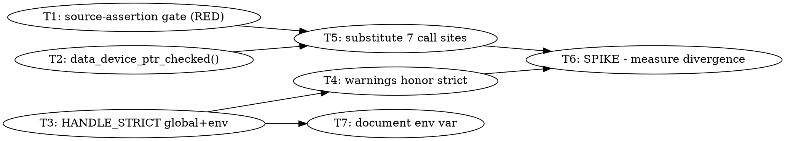

# Handle-Storage Stage 0: Observability + Checked Accessor — Implementation Plan

> **For Claude:** REQUIRED SUB-SKILL: Use team-driven-development to implement this plan with agent teams.

**Goal:** Make `ggml_tensor_extra_gpu`'s handle/raw-pointer divergence observable in a normal run, and replace every unchecked `data_device_ptr()` dereference with a checked accessor that fails loudly instead of faulting inside a device memcpy.

**Architecture:** Three independent seams. (1) A `GGML_SYCL_HANDLE_STRICT` global + env read, wired the same way as the existing `g_ggml_sycl_safe_mode`. (2) A `data_device_ptr_checked()` accessor on `ggml_tensor_extra_gpu` that aborts with context instead of returning a silent `nullptr`. (3) A source-assertion ctest gate that fails if any unchecked `data_device_ptr()` dereference is reintroduced. Nothing about the storage layout changes here — this stage only makes the existing design's failure modes visible, which is the prerequisite for the structural work.

**Tech Stack:** C++17, Intel oneAPI DPC++/SYCL, CMake + Ninja, ctest.

**Test Infrastructure:** ctest, registered in `tests/CMakeLists.txt`. This plan uses the repo's existing **source-assertion gate** pattern — a checker script run over `ggml/src/ggml-sycl` plus good/bad fixture directories, asserted by a bash test script. Model: `tests/test-sycl-alloc-policy.sh` + `scripts/check-sycl-alloc-usage.sh` + `tests/sycl-alloc-policy-fixtures/`, registered at `tests/CMakeLists.txt:311-321` with `SKIP_RETURN_CODE 77`. This pattern is used deliberately: the target defects are defensive checks whose runtime trigger (`device_id != dev` in the legacy fallback) was **not** shown to be reachable, so a runtime unit test cannot be written honestly. The gate asserts the property that must hold in source.

---

## Scope

**In scope:** Stage 0 of `docs/plans/2026-07-30-extra-device-indexed-handle-storage.md` (observability + null-safety), plus the source gate that keeps it from regressing.

**Explicitly NOT in scope — and why:** Stages 1-4 of that plan (splitting the accessor API, collapsing non-split storage, deleting `data_device[]`, deciding TP's fate) touch ~200+ call sites and **cannot yet be written to the junior-implementable bar**. Their shape depends on the answer to Task 6's spike — whether handle/raw divergence actually occurs at runtime. Writing detailed tasks for them now would be fabrication. **Task 6 is the spike that unblocks writing that follow-up plan.**

---

## Team Topology

**Recommended implementers:** 3 concurrent (based on 3 parallel tracks — execution spawns one ephemeral implementer PER TASK)
**Reviewers:** spec + quality, spawned FRESH per review (not a standing pair; see team-driven-development)

### Parallel Tracks

| Track | Tasks | Description |
|-------|-------|-------------|
| A | 2, 4 | `common.hpp` — checked accessor, then strict-mode warnings |
| B | 3, 5 | `ggml-sycl.cpp` — strict-mode global/env, then call-site substitution |
| C | 1, 7 | New test files + docs (no overlap with A or B) |
| — | 6 | Spike (convergence; depends on 4 and 5) |

### Dependency Graph



Tasks 1, 2, 3 have no dependencies and start immediately in parallel.

### File Ownership Map

| File/Directory | Tasks | Conflict Risk |
|----------------|-------|---------------|
| `ggml/src/ggml-sycl/common.hpp` | 2, 4, **3 (1 line)** | ⚠️ **CROSS-TRACK.** Tasks 2 and 4 are track A; Task 3 (track B) also adds the single `extern int g_ggml_sycl_handle_strict;` line at `:144`. See the serialization rule below. |
| `ggml/src/ggml-sycl/ggml-sycl.cpp` | 3, 5 | Sequential (same track B) |
| `scripts/check-sycl-handle-usage.sh` | 1 | None (new file) |
| `tests/test-sycl-handle-policy.sh` | 1 | None (new file) |
| `tests/sycl-handle-policy-fixtures/` | 1 | None (new dir) |
| `tests/CMakeLists.txt` | 1 | None (single task) |
| `docs/backend/sycl-env-vars.md` | 7 | None (single task) |
| — (no file edits) | 6 | None |

**Serialization rule for `common.hpp`:** three tasks touch it, and Tasks 2 and 3 are
otherwise parallel-safe. Task 3's edit there is exactly **one line** (the `extern`
at `:144`); Task 2's is a method body after `:2882`; Task 4's is two conditions at
`:2860` and `:2954`. They do not overlap textually, so a lead may run 2 and 3
concurrently — but **the second to finish must rebase before committing**, and
Task 4 must start only after Task 3 has landed (it needs the symbol). If the team
prefers zero risk, run Task 3 before Task 2 and keep track A strictly after it.

---

### Task 1: Source-assertion gate for unchecked `data_device_ptr()`

**Track:** C
**Depends on:** None
**File scope:**
- Create: `scripts/check-sycl-handle-usage.sh`
- Create: `tests/test-sycl-handle-policy.sh`
- Create: `tests/sycl-handle-policy-fixtures/good/ok.cpp`
- Create: `tests/sycl-handle-policy-fixtures/bad-unchecked/unchecked.cpp`
- Modify: `tests/CMakeLists.txt` (append a new registration block after the `test-sycl-alloc-policy` block at `:311-321`)

**Description:**

Adds a checker that flags any assignment from `data_device_ptr(...)` that is not immediately followed by a null check, and a ctest gate asserting the checker passes on a good fixture and fails on a bad one. This gate is the RED for Task 5 — it must FAIL against the current `ggml-sycl.cpp` and go green once Task 5 lands. **The verified count is 7, not the 6 this plan originally claimed** (see Task 5), and the checker itself found the discrepancy.

**Acceptance Criteria:**

- [ ] `scripts/check-sycl-handle-usage.sh <dir>` exits 0 on the good fixture, non-zero on the bad fixture
- [ ] `tests/test-sycl-handle-policy.sh` exits 77 (skip) when neither ripgrep nor GNU grep is available
- [ ] `ctest -R test-sycl-handle-policy` registers and runs
- [ ] The gate currently FAILS against `ggml/src/ggml-sycl` (this is expected until Task 5)
- [ ] Code follows existing project patterns

**Implementation Guide:**

1. **Test: checker rejects an unchecked dereference**

Create `tests/sycl-handle-policy-fixtures/bad-unchecked/unchecked.cpp`:

```cpp
// Fixture: an unchecked data_device_ptr() dereference. The checker MUST reject this.
struct fake_extra {
    void * data_device_ptr(int dev) const;
};

void use(const fake_extra * extra, int id) {
    char * src_ptr = (char *) extra->data_device_ptr(id);
    (void) (src_ptr + 16);
}
```

Create `tests/sycl-handle-policy-fixtures/good/ok.cpp`:

```cpp
// Fixture: a checked dereference. The checker MUST accept this.
struct fake_extra {
    void * data_device_ptr(int dev) const;
    void * data_device_ptr_checked(int dev, const char * caller) const;
};

void use_checked_accessor(const fake_extra * extra, int id) {
    char * src_ptr = (char *) extra->data_device_ptr_checked(id, __func__);
    (void) (src_ptr + 16);
}

void use_explicit_null_check(const fake_extra * extra, int id) {
    char * src_ptr = (char *) extra->data_device_ptr(id);
    if (src_ptr == nullptr) {
        return;
    }
    (void) (src_ptr + 16);
}
```

Run: `bash tests/test-sycl-handle-policy.sh`
Expected: FAIL with "No such file or directory" (checker does not exist yet).

2. **Implement: the checker**

Create `scripts/check-sycl-handle-usage.sh`:

```bash
#!/usr/bin/env bash
# Flags assignments from data_device_ptr(...) that are not immediately followed
# by a null check. Use data_device_ptr_checked(dev, caller) instead -- it aborts
# with context rather than returning a silent nullptr that is then used in
# pointer arithmetic (see docs/plans/2026-07-30-extra-device-indexed-handle-storage.md,
# Finding 4).
set -euo pipefail

DIR="${1:?usage: check-sycl-handle-usage.sh <dir>}"

if command -v rg >/dev/null 2>&1; then
    GREP=(rg --no-heading --line-number)
else
    GREP=(grep -rEn)
fi

status=0
while IFS= read -r hit; do
    file="${hit%%:*}"
    rest="${hit#*:}"
    line="${rest%%:*}"
    next=$((line + 1))
    # Accept when the very next non-blank line performs a null check on anything.
    following=$(awk -v n="$next" 'NR>=n && NF {print; exit}' "$file")
    case "$following" in
        *"== nullptr"*|*"!= nullptr"*|*"if (!"*|*"GGML_ASSERT"*) continue ;;
    esac
    echo "unchecked data_device_ptr() at $file:$line -- use data_device_ptr_checked(dev, caller)" >&2
    status=1
done < <("${GREP[@]}" '=\s*\(?[A-Za-z_ ]*\*?\)?\s*[A-Za-z_]+->data_device_ptr\(' "$DIR" 2>/dev/null || true)

exit "$status"
```

Create `tests/test-sycl-handle-policy.sh`:

```bash
#!/usr/bin/env bash
set -euo pipefail

ROOT_DIR="$(cd "$(dirname "${BASH_SOURCE[0]}")/.." && pwd)"
CHECKER="$ROOT_DIR/scripts/check-sycl-handle-usage.sh"

# Same portability guard as test-sycl-alloc-policy.sh: the patterns rely on
# GNU/rg regex behavior. Exit 77 = ctest SKIP_RETURN_CODE.
if ! command -v rg >/dev/null 2>&1 && ! printf 'a b' | grep -Eq 'a\sb' 2>/dev/null; then
    echo "test-sycl-handle-policy: no ripgrep and no GNU grep; skipping" >&2
    exit 77
fi

"$CHECKER" "$ROOT_DIR/tests/sycl-handle-policy-fixtures/good"

if "$CHECKER" "$ROOT_DIR/tests/sycl-handle-policy-fixtures/bad-unchecked" >/dev/null 2>&1; then
    echo "expected bad-unchecked fixture to fail policy check" >&2
    exit 1
fi

"$CHECKER" "$ROOT_DIR/ggml/src/ggml-sycl"
```

Then: `chmod +x scripts/check-sycl-handle-usage.sh tests/test-sycl-handle-policy.sh`

Run: `bash tests/test-sycl-handle-policy.sh`
Expected: the fixture assertions PASS, then the real-source check FAILS listing `ggml-sycl.cpp:33394` and the other unchecked sites. **That failure is the RED for Task 5 — do not "fix" it here.**

3. **Register with ctest**

Append to `tests/CMakeLists.txt` immediately after the `test-sycl-alloc-policy` block that ends at `:321`:

```cmake
if (NOT WIN32)
    llama_test_cmd(
        bash
        NAME test-sycl-handle-policy
        WORKING_DIRECTORY ${PROJECT_SOURCE_DIR}
        ARGS ${CMAKE_CURRENT_SOURCE_DIR}/test-sycl-handle-policy.sh
    )
    set_tests_properties(test-sycl-handle-policy PROPERTIES
        LABELS "sycl;policy"
        SKIP_RETURN_CODE 77
        TIMEOUT 120
    )
endif()
```

⚠️ **Do NOT run a bare `cmake -S . -B build -G Ninja`.** This plan said exactly that
until 2026-07-30 and it is a trap: without oneAPI sourced, `icx`/`icpx` are not on
PATH, so cmake performs a cache-invalidating reconfigure and **`GGML_SYCL` silently
disappears from `build/CMakeCache.txt`** — the CPU-fallback trap CLAUDE.md documents,
where every token gate still passes at ~8 tok/s. It happened during execution of this
very task. Source oneAPI and use the project's own configure instead, which carries the
canonical flag set:

```bash
source /opt/intel/oneapi/setvars.sh --force
./scripts/sycl-build.sh                      # reconfigures + builds; a CMakeLists-only
                                             # change makes this nearly a no-op
ctest --test-dir build -N -R test-sycl-handle-policy
```

Then **verify the backend survived** before trusting anything downstream:

```bash
grep -E '^GGML_SYCL:' build/CMakeCache.txt                        # want BOOL=ON
ldd build/bin/llama-completion | grep -cE 'libggml-sycl|libsycl'  # want >= 2
```

Expected: `Test #NN: test-sycl-handle-policy`, `Total Tests: 1`, `GGML_SYCL:BOOL=ON`, `2`.

**Commit:**

```bash
git add scripts/check-sycl-handle-usage.sh tests/test-sycl-handle-policy.sh tests/sycl-handle-policy-fixtures tests/CMakeLists.txt
git commit -m "test(sycl): gate unchecked data_device_ptr() dereferences"
```

**Gotchas:**
- **`LABELS` must NOT include `cache`, `mem-handle`, or `residency`** — the throttled sweep in CLAUDE.md excludes those labels, and a gate nobody runs is worse than no gate. Use `sycl;policy`.
- The gate legitimately fails until Task 5 lands. Say so in the commit body so a reviewer does not treat it as a broken commit.
- `Total Tests: 0` from `ctest -N` is byte-identical to "never registered" — always assert the count, never just that the command exited 0 (`tests/CMakeLists.txt:334-338` documents this exact trap).
- Do not run `ctest` without `-R`; see the Gotchas in Task 6.

---

### Task 2: `data_device_ptr_checked()` accessor

**Track:** A
**Depends on:** None
**File scope:**
- Modify: `ggml/src/ggml-sycl/common.hpp` (insert immediately after `data_device_ptr()`, which ends at `:2882`)

**Description:**

Adds a checked sibling to `data_device_ptr()`. `data_device_ptr()` returns `nullptr` when the legacy fallback finds a `DEVICE` allocation whose `device_id != dev` (`common.hpp:2874-2881`); callers that skip the null check then do pointer arithmetic on it. This accessor aborts with the diagnostic context instead.

**Acceptance Criteria:**

- [ ] `data_device_ptr_checked(dev, caller)` returns the same pointer as `data_device_ptr(dev)` when non-null
- [ ] It aborts with a message naming the caller, device, handle device, and raw pointer when null
- [ ] The good fixture from Task 1 continues to pass the checker
- [ ] Builds clean

**Implementation Guide:**

1. **Test: the checker accepts the new accessor**

Already covered by `tests/sycl-handle-policy-fixtures/good/ok.cpp` from Task 1 (function `use_checked_accessor`). If Task 1 has not landed yet, create only that fixture file locally to verify, and let Task 1 own it.

Run: `bash scripts/check-sycl-handle-usage.sh tests/sycl-handle-policy-fixtures/good`
Expected: exit 0, no output.

2. **Implement: the accessor**

Insert into `struct ggml_tensor_extra_gpu` in `ggml/src/ggml-sycl/common.hpp`, immediately after the closing `}` of `data_device_ptr()` at `:2882`:

```cpp
    // Checked form of data_device_ptr().  data_device_ptr() returns nullptr when
    // the legacy fallback finds a DEVICE allocation registered to a different
    // device; callers that skip the null check then do pointer arithmetic on it
    // and fault inside a device memcpy.  Prefer this at every dereference site.
    void * data_device_ptr_checked(int dev, const char * caller) const {
        void * ptr = data_device_ptr(dev);
        if (ptr == nullptr) {
            GGML_LOG_ERROR(
                "[SYCL] %s: no usable device pointer for dev=%d "
                "(handle_dev=%d raw=%p size=%zu)\n",
                caller ? caller : "?", dev, data_handle[dev].device(), data_device[dev],
                data_device_size[dev]);
            GGML_ABORT("data_device_ptr_checked: no usable device pointer");
        }
        return ptr;
    }
```

Run: `./scripts/sycl-build.sh`
Expected: `BUILD_EXIT=0`, no `error:` lines.

**Commit:**

```bash
git add ggml/src/ggml-sycl/common.hpp
git commit -m "feat(sycl): add data_device_ptr_checked() accessor"
```

**Gotchas:**
- `common.hpp` is a **track-A hotspot** shared with Task 4 — do not also edit the mismatch warnings here; that is Task 4's scope.
- `GGML_ABORT` is the right failure mode here, matching the existing `GGML_ABORT("fatal error")` in the same call path (`ggml-sycl.cpp:33415`). Do not return an error code — `ggml_sycl_cpy_tensor_2d` returns `dpct::err0` and its callers wrap it in `SYCL_CHECK`, so a silent non-zero would be reported far from the cause.
- Expect a **spurious LSP diagnostic cascade** on this file (`Unknown argument: '-fsycl-targets=intel_gpu_bmg_g21,spir64'` plus dozens of follow-on errors). That is upstream `clang` parsing the file, not `icpx`. Ignore it; trust `./scripts/sycl-build.sh`.

---

### Task 3: `GGML_SYCL_HANDLE_STRICT` global and env read

**Track:** B
**Depends on:** None
**File scope:**
- Modify: `ggml/src/ggml-sycl/ggml-sycl.cpp` (definition beside `:320`; env read beside `:16509`)
- Modify: `ggml/src/ggml-sycl/common.hpp` (extern declaration beside `:143`)

**Description:**

Adds the strict-mode flag that Task 4 uses to make handle/raw divergence observable without `GGML_SYCL_DEBUG=1`. Wired exactly like `g_ggml_sycl_safe_mode`.

**Acceptance Criteria:**

- [ ] `g_ggml_sycl_handle_strict` defaults to 0
- [ ] `GGML_SYCL_HANDLE_STRICT=1` sets it to 1
- [ ] Declared `extern` in `common.hpp` alongside the other globals
- [ ] Builds clean

**Implementation Guide:**

1. **Test: the env var is read**

Add to `tests/sycl-handle-policy-fixtures/` nothing — this is verified by the source-assertion below plus the Task 6 run. Verify mechanically:

Run: `cat ggml/src/ggml-sycl/ggml-sycl.cpp | grep -c 'GGML_SYCL_HANDLE_STRICT'`
Expected before: `0`. After step 2: `1`.

2. **Implement**

In `ggml/src/ggml-sycl/ggml-sycl.cpp`, immediately after `int g_ggml_sycl_debug = 0;` at `:320`:

```cpp
// Strict handle mode: surface data_handle/data_device divergence as a warning in
// normal runs (the mismatch warnings are otherwise gated on g_ggml_sycl_debug,
// which defaults to 0, so divergence is invisible in production). =1 warns.
int g_ggml_sycl_handle_strict = 0;
```

In the same file, immediately after `g_ggml_sycl_safe_mode = get_sycl_env("GGML_SYCL_SAFE_MODE", 0);` at `:16509`:

```cpp
        g_ggml_sycl_handle_strict = get_sycl_env("GGML_SYCL_HANDLE_STRICT", 0);
```

In `ggml/src/ggml-sycl/common.hpp`, immediately after `extern int g_ggml_sycl_debug_sync;` at `:144`:

```cpp
extern int               g_ggml_sycl_handle_strict;
```

Run: `./scripts/sycl-build.sh && cat ggml/src/ggml-sycl/ggml-sycl.cpp | grep -c 'GGML_SYCL_HANDLE_STRICT'`
Expected: build exit 0; grep prints `1`.

**Commit:**

```bash
git add ggml/src/ggml-sycl/ggml-sycl.cpp ggml/src/ggml-sycl/common.hpp
git commit -m "feat(sycl): add GGML_SYCL_HANDLE_STRICT flag"
```

**Gotchas:**
- This task touches `common.hpp` for **one line only** (the extern). Track A owns the rest of that file — coordinate: if Task 2 or 4 is mid-flight, add the extern and nothing else.
- Env vars in this backend are read via **both** `getenv` and `get_sycl_env`. Use `get_sycl_env` here to match the surrounding block.
- **codescout silently skips `ggml-sycl.cpp`** (oversize, ~60k lines) — `search_text` returns `skipped: {reason: "oversize"}` and omits real matches. Locate lines with `cat ggml/src/ggml-sycl/ggml-sycl.cpp | grep -n '<pattern>'`. A command-position in-repo grep is redirected by a hook; a downstream pipe grep is fine.

---

### Task 4: Mismatch warnings honor strict mode

**Track:** A
**Depends on:** Task 3
**File scope:**
- Modify: `ggml/src/ggml-sycl/common.hpp:2860` and `:2954`

**Description:**

The two handle/raw mismatch warnings are gated on `g_ggml_sycl_debug` (default 0), so divergence is silently resolved in every production run. Widen the gate to `g_ggml_sycl_debug || g_ggml_sycl_handle_strict`.

**Acceptance Criteria:**

- [ ] Both warning sites fire when `GGML_SYCL_HANDLE_STRICT=1` and `GGML_SYCL_DEBUG` is unset
- [ ] Behaviour with both unset is byte-identical to today (still rate-limited to 16)
- [ ] Builds clean

**Implementation Guide:**

1. **Test: the gate currently ignores strict mode**

Run: `cat ggml/src/ggml-sycl/common.hpp | grep -c 'g_ggml_sycl_debug && .*_warns.fetch_add'`
Expected before: `2`. After step 2: `0`.

2. **Implement**

In `ggml/src/ggml-sycl/common.hpp`, at `:2860`, change:

```cpp
                    if (g_ggml_sycl_debug && stale_raw_warns.fetch_add(1, std::memory_order_relaxed) < 16) {
```

to:

```cpp
                    if ((g_ggml_sycl_debug || g_ggml_sycl_handle_strict) &&
                        stale_raw_warns.fetch_add(1, std::memory_order_relaxed) < 16) {
```

At `:2954`, change:

```cpp
                if (g_ggml_sycl_debug && mismatch_warns.fetch_add(1, std::memory_order_relaxed) < 16) {
```

to:

```cpp
                if ((g_ggml_sycl_debug || g_ggml_sycl_handle_strict) &&
                    mismatch_warns.fetch_add(1, std::memory_order_relaxed) < 16) {
```

Run: `./scripts/sycl-build.sh && cat ggml/src/ggml-sycl/common.hpp | grep -c 'g_ggml_sycl_handle_strict'`
Expected: build exit 0; grep prints `2` (plus 1 for the extern from Task 3 if in the same file → `3`).

**Commit:**

```bash
git add ggml/src/ggml-sycl/common.hpp
git commit -m "feat(sycl): surface handle/raw divergence under HANDLE_STRICT"
```

**Gotchas:**
- Keep the `fetch_add` **inside** the widened condition. Moving it out changes the rate-limit counter's semantics under the default path.
- Do not remove the `< 16` cap — an unbounded warning in a hot accessor would be its own regression.
- `common.hpp` is a track-A hotspot shared with Task 2; rebase before starting if Task 2 landed meanwhile.

---

### Task 5: Substitute the unchecked call sites

**Track:** B
**Depends on:** Task 2, Task 1
**File scope:**
- Modify: `ggml/src/ggml-sycl/ggml-sycl.cpp` at `:33394`, `:33404`, `:34474`, `:29089`, `:29248`, `:29334`

**Description:**

Replaces the **seven** unchecked `data_device_ptr()` dereferences with `data_device_ptr_checked()`. The live `--split-mode row` site (`:33394` at plan time, `:33399` after T3's edit) is the only one reachable from llama core; the rest are on TP branches that share the identical shape. This turns Task 1's gate green.

⚠️ **This plan originally said six.** Task 1's checker found a seventh — `:29476`, an unchecked deref inside a `g_ggml_sycl_tp_debug` block — which the audit behind the plan had missed, while the audit had also wrongly classified `:6960` as unchecked. Use the checker's list, not this document's, and re-locate every line number immediately before editing:

```bash
bash scripts/check-sycl-handle-usage.sh ggml/src/ggml-sycl
```

**Acceptance Criteria:**

- [ ] All six sites use `data_device_ptr_checked(<dev>, __func__)`
- [ ] `bash tests/test-sycl-handle-policy.sh` exits 0
- [ ] Mistral completion gate output unchanged
- [ ] Builds clean

**Implementation Guide:**

1. **Test: the gate fails on current source (RED)**

Run: `bash tests/test-sycl-handle-policy.sh`
Expected: FAIL, listing `ggml/src/ggml-sycl/ggml-sycl.cpp:33394` among others.

2. **Implement**

At `:33394` (split-buffer branch of `ggml_sycl_cpy_tensor_2d`), change:

```cpp
        src_ptr = (char *) extra->data_device_ptr(id);
```

to:

```cpp
        src_ptr = (char *) extra->data_device_ptr_checked(id, __func__);
```

Apply the identical substitution at `:33404` (TP branch of the same function) and `:34474`:

```cpp
                dev[i].src0_dd = (char *) extra->data_device_ptr_checked(i, __func__);
```

At `:29089`, `:29248`, `:29334`, change each:

```cpp
    tensor->data = extra->data_device_ptr(main_device);
```

to:

```cpp
    tensor->data = extra->data_device_ptr_checked(main_device, __func__);
```

Run: `./scripts/sycl-build.sh && bash tests/test-sycl-handle-policy.sh`
Expected: build exit 0; gate exits 0 with no output (GREEN).

3. **Verify no behaviour change on the happy path**

```bash
source /opt/intel/oneapi/setvars.sh --force
ONEAPI_DEVICE_SELECTOR=level_zero:1 timeout 300 ./build/bin/llama-completion \
  -m /Storage/GenAI/models/mistral-7b-v0.1.Q4_0.gguf \
  -p '1, 2, 3, 4, 5,' -n 15 --seed 42 --temp 0 2>/dev/null | grep -E '^ ?1, 2'
```

Expected: ` 1, 2, 3, 4, 5, 6, 7, 8, 9, 10`

**Commit:**

```bash
git add ggml/src/ggml-sycl/ggml-sycl.cpp
git commit -m "fix(sycl): check data_device_ptr() before dereferencing"
```

**Gotchas:**
- **Line numbers drift.** They are accurate at `cc99701f5`. Re-locate each with `cat ggml/src/ggml-sycl/ggml-sycl.cpp | grep -n 'data_device_ptr('` before editing rather than trusting the numbers.
- Verify the backend is actually present before trusting the Mistral gate: `grep -E '^GGML_SYCL:' build/CMakeCache.txt` (want `ON`) and `ldd build/bin/llama-completion | grep -cE 'libggml-sycl|libsycl'` (want ≥2). A CPU fallback emits the identical digits at ~8 tok/s and the gate passes anyway.
- Do **not** "fix" the other `data_device_ptr()` sites the checker accepts — they already null-check. Scope is these six.

---

### Task 6: SPIKE — measure whether divergence actually occurs

**Track:** — (convergence)
**Depends on:** Task 4, Task 5
**File scope:** No file edits. Records findings on tracker issue `llama.cpp-ljb9`'s sibling (create a new issue; see below).

**Description:**

The decisive unknown for the whole architecture plan: does `data_handle[dev]` actually diverge from `data_device[dev]` at runtime, or is this a latent design smell? Everything in Stages 1-3 of `docs/plans/2026-07-30-extra-device-indexed-handle-storage.md` is scoped by the answer. **This task's output is the input to writing that follow-up plan.**

**Acceptance Criteria:**

- [ ] A representative run completes with `GGML_SYCL_HANDLE_STRICT=1`
- [ ] The presence or absence of `handle/raw pointer mismatch` is recorded on a tracker issue with the exact command and full output
- [ ] A verdict is stated: divergence observed / not observed
- [ ] GPU kernel log checked clean afterwards

**Implementation Guide:**

1. **Create the tracker issue** (`task_create`, type `task`, priority 1), titled
   `SPIKE: does data_handle/data_device actually diverge at runtime?`

2. **Run the strict-mode gate**

```bash
source /opt/intel/oneapi/setvars.sh --force
GGML_SYCL_HANDLE_STRICT=1 ONEAPI_DEVICE_SELECTOR=level_zero:1 timeout 300 \
  ./build/bin/llama-completion \
  -m /Storage/GenAI/models/mistral-7b-v0.1.Q4_0.gguf \
  -p '1, 2, 3, 4, 5,' -n 15 --seed 42 --temp 0 2>&1 \
  | tee /tmp/strict-mistral.log | grep -E '^ ?1, 2'
grep -c 'mismatch' /tmp/strict-mistral.log
```

Expected: ` 1, 2, 3, 4, 5, 6, 7, 8, 9, 10`, then a mismatch count (0 or more).

3. **Run the split path — this is where divergence is most likely**

```bash
GGML_SYCL_HANDLE_STRICT=1 ONEAPI_DEVICE_SELECTOR=level_zero:0,1 timeout 600 \
  ./build/bin/llama-completion \
  -m /Storage/GenAI/models/mistral-7b-v0.1.Q4_0.gguf \
  --split-mode row -p '1, 2, 3, 4, 5,' -n 15 --seed 42 --temp 0 2>&1 \
  | tee /tmp/strict-split.log | grep -E '^ ?1, 2'
grep -c 'mismatch' /tmp/strict-split.log
```

Expected: correct digits; record the mismatch count.

4. **Check the GPU afterwards**

```bash
journalctl -k --since "30 min ago" --no-pager | grep -iE 'GT reset|guc_id|CAT error' || echo clean
```

Expected: `clean`.

5. **Record** both counts, both full logs' mismatch lines, and the verdict on the tracker issue. If mismatches appear, quote one verbatim — the `dev=`, `handle=`, `raw=` values identify the divergent path.

**Commit:** None (no file edits). The deliverable is the tracker record.

**Gotchas:**
- ⚠️ **Never loop `test-llama-archs`.** A single run is safe; looping it drove shmem to ~227 GB of 255 GB and caused two global OOMs on 2026-07-30, killing the desktop session, a 12 GB qemu VM eight times, and the codescout daemon. See CLAUDE.md (`b7886ed9c`).
- ⚠️ **Never run `test-backend-ops`**, and never run a full `ctest` without `-E '^test-backend-ops$'` — the `-LE` label filter does **not** exclude it (it carries no labels). See CLAUDE.md.
- `--split-mode row` on two GPUs is the interesting case precisely because it is the only live multi-device path (per the architecture plan's Finding 1). If it fails for an unrelated reason, record that too — it is itself a finding.
- Absence of mismatches is a **real result**, not a failed task. Record it plainly; it scopes Stages 1-3 down considerably.

---

### Task 7: Document `GGML_SYCL_HANDLE_STRICT`

**Track:** C
**Depends on:** Task 3
**File scope:**
- Modify: `docs/backend/sycl-env-vars.md` (debugging/diagnostics table)

**Description:**

Adds the new variable to the catalog. Required because the catalog is the documented home for every non-load-bearing var, and an undocumented diagnostic is one nobody will use.

**Acceptance Criteria:**

- [ ] `GGML_SYCL_HANDLE_STRICT` appears in `docs/backend/sycl-env-vars.md` with default and effect
- [ ] The entry states it is a diagnostic, not a performance knob

**Implementation Guide:**

1. **Test: the var is undocumented**

Run: `cat docs/backend/sycl-env-vars.md | grep -c 'GGML_SYCL_HANDLE_STRICT'`
Expected before: `0`. After: `1`.

2. **Implement**

Add to the debugging/diagnostics table in `docs/backend/sycl-env-vars.md`:

```markdown
| `GGML_SYCL_HANDLE_STRICT=1` | OFF | Surface `ggml_tensor_extra_gpu` handle/raw-pointer divergence as a rate-limited warning in normal runs. The `data_handle`/`data_device` mismatch warnings are otherwise gated on `g_ggml_sycl_debug` (default 0), so divergence is invisible in production. Diagnostic only — no performance effect. See `docs/plans/2026-07-30-extra-device-indexed-handle-storage.md`. |
```

Run: `cat docs/backend/sycl-env-vars.md | grep -c 'GGML_SYCL_HANDLE_STRICT'`
Expected: `1`

**Commit:**

```bash
git add docs/backend/sycl-env-vars.md
git commit -m "docs(sycl): document GGML_SYCL_HANDLE_STRICT"
```

**Gotchas:**
- That catalog's own discovery recipe was fixed in `cc99701f5` — use the corrected form (match the **name**, allow digits, all accessors), not the old `getenv\("GGML_SYCL[A-Z_]*"` one, if you verify the var is reachable.
- Do not add it to `CLAUDE.md` — that file deliberately keeps only load-bearing performance opt-outs.

---

## End-to-End Validation (on the user's machine) — MANDATORY

> Run AFTER all task tests pass, BEFORE declaring the work done. Owned by the lead at teardown.

**Environment:** This host — Arc Pro B70 (`level_zero:0`) and Arc Pro B50 (`level_zero:1`), oneAPI 2026.1, driver 26.27. Check `uptime` first; the machine also runs Frigate (~250% CPU) and a codescout daemon.

**Steps Claude runs itself:**

1. Backend is genuinely present (a CPU fallback passes every token gate below):
   ```bash
   grep -E '^GGML_SYCL:' build/CMakeCache.txt
   ldd build/bin/llama-completion | grep -cE 'libggml-sycl|libsycl'
   ```
   Expected: `GGML_SYCL:BOOL=ON`, and `2`.

2. The new gate passes:
   ```bash
   ctest --test-dir build -R test-sycl-handle-policy --output-on-failure
   ```
   Expected: `100% tests passed, 0 tests failed out of 1`.

3. Correctness unchanged, default mode:
   ```bash
   source /opt/intel/oneapi/setvars.sh --force
   ONEAPI_DEVICE_SELECTOR=level_zero:1 timeout 300 ./build/bin/llama-completion \
     -m /Storage/GenAI/models/mistral-7b-v0.1.Q4_0.gguf \
     -p '1, 2, 3, 4, 5,' -n 15 --seed 42 --temp 0 2>/dev/null | grep -E '^ ?1, 2'
   ```
   Expected: ` 1, 2, 3, 4, 5, 6, 7, 8, 9, 10` (stops at 10 on EOS).

4. Strict mode does not change correctness and does not spam:
   ```bash
   GGML_SYCL_HANDLE_STRICT=1 ONEAPI_DEVICE_SELECTOR=level_zero:1 timeout 300 \
     ./build/bin/llama-completion -m /Storage/GenAI/models/mistral-7b-v0.1.Q4_0.gguf \
     -p '1, 2, 3, 4, 5,' -n 15 --seed 42 --temp 0 2>&1 | tee /tmp/e2e-strict.log | grep -E '^ ?1, 2'
   grep -c 'mismatch' /tmp/e2e-strict.log
   ```
   Expected: same digits; mismatch count ≤ 16 (the rate-limit cap) — any value is acceptable, but it MUST be recorded.

5. Existing gates still green:
   ```bash
   ctest --test-dir build -R unpin-event --output-on-failure
   ctest --test-dir build -L profiling --output-on-failure
   ```
   Expected: `100% tests passed` for both (1 and 5 tests respectively).

6. GPU clean afterwards:
   ```bash
   journalctl -k --since "1 hour ago" --no-pager | grep -iE 'GT reset|guc_id|CAT error' || echo clean
   ```
   Expected: `clean`.

**Steps requiring the user (minimize — ideally none):** None. Every step above is a shell command the lead issues directly.

**Observed success:** The handle-policy gate passes, the Mistral gate emits the exact digit sequence in both default and strict mode, `unpin-event` and `profiling` stay green, the GPU log is clean, and the strict-mode mismatch count is **recorded** (whatever it is) — that number is Task 6's deliverable and the input to the follow-up plan.

**Not a gate here:** throughput. Nothing in this plan is a performance change, and the machine is under variable load from Frigate and codescout — an absolute benchmark taken now would be depressed and inadmissible as a baseline.
