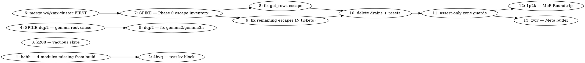

# SYCL Memory Ownership + Session Backlog — Combined Implementation Plan

> **For Claude:** REQUIRED SUB-SKILL: Use team-driven-development to implement this plan with agent teams.

**Goal:** Land the owner's memory-ownership ruling (mem_handle refcounting becomes the sole
reclamation model; zones stop resetting) while clearing the correctness and build-integrity
bugs this session surfaced around it.

**Architecture:** The SYCL backend currently runs two incompatible reclamation models over the
same memory — refcounted `mem_handle` (frees on last release) and `zone_reset` (frees on a
schedule, regardless of owners). Every bug in a long family sits on that seam. This plan fixes
the *escapes* that made scheduled reclamation necessary, then deletes the reclamation, keeping
the guards as asserts. Alongside that, three independent correctness bugs and one build-integrity
defect are cleared on tracks that do not contend for the same files.

**Tech Stack:** C++17, Intel oneAPI SYCL (icpx), oneDNN, TLSF sub-allocation, CMake + Ninja,
CTest, pytest.

**Test Infrastructure:** CTest (180 registered tests; `ctest --test-dir build`), pytest gates
under `tests/test-*.py`, GPU gates via `llama-completion` / `llama-cli` / `test-llama-archs`.
Hardware: Arc Pro B70 (`level_zero:0`), Arc Pro B50 (`level_zero:1`), Arrow Lake-S iGPU.

**Scope note:** This plan covers ONLY the work this session has been carrying — 19 tracker
issues. The tracker holds 647 open issues in total; the rest is explicitly out of scope.

---

## Team Topology

**Recommended implementers:** 3 concurrent (3 parallel tracks; execution spawns one ephemeral
implementer PER TASK)
**Reviewers:** spec + quality, spawned FRESH per review.

### The binding constraint — read this before assigning anything

**`ggml/src/ggml-sycl/ggml-sycl.cpp` (~60k lines) is wanted by four of the nineteen issues**:
the memory epic, the XMX cluster, the MoE Roundtrip bug, and the Meta-buffer bug. In a shared
checkout `git commit -- <path>` gives **zero** protection when the path itself is shared — it
stops unrelated files being swept in, not two agents editing one file.

So **Track C is a strictly serial queue**, and its ordering is not by priority but by rebuild
blast radius. Tracks A and B are chosen precisely because they never touch that file.

### Parallel Tracks

| Track | Tasks | Description | Owns |
|-------|-------|-------------|------|
| A | 1, 2, 3, 14 | Build integrity + weight-lease close-out | `src/CMakeLists.txt`, `tests/CMakeLists.txt`, `tests/test-thread-safety.cpp` |
| B | 4, 5 | Attention correctness — gemma2 hang, gemma3n wrong answer | `src/models/gemma*.cpp`, `ggml/src/ggml-sycl/fattn*` |
| C | 6 → 7 → 8 → 9 → 10 → 11 → 12 → 13 | Memory ownership + everything else needing `ggml-sycl.cpp` | `ggml-sycl.cpp`, `unified-cache.{cpp,hpp}`, `getrows.cpp` |

### Dependency Graph



### File Ownership Map

| File / Directory | Tasks | Conflict Risk |
|------------------|-------|---------------|
| `src/CMakeLists.txt` | 1 | None (single task) |
| `tests/CMakeLists.txt` | 2, 3 | Sequential (same track) |
| `src/models/gemma2.cpp`, `gemma3n.cpp` | 4, 5 | Sequential (same track) |
| `ggml/src/ggml-sycl/fattn*` | 4, 5 | Sequential (same track) |
| **`ggml/src/ggml-sycl/ggml-sycl.cpp`** | **6–13** | **SERIAL — one owner at a time, no exceptions** |
| `ggml/src/ggml-sycl/unified-cache.{cpp,hpp}` | 7–11 | Serial (Track C) |
| `ggml/src/ggml-sycl/getrows.cpp` | 8 | None (single task) |

---

## Task 6 must go first, and it is not the most important task

`w4/xmx-cluster` carries **three finished, reviewed-but-unmerged commits** (`a266ad15b`,
`8f3c74f1d`, `de1e018d4`) that modify `ggml-sycl.cpp`. Track C's later tasks rewrite the
allocation and graph-launch paths in that same file.

Merging *after* that rewrite means resolving those three commits against a substantially
changed file, by an agent that did not write them. Merging *first* costs one rebuild.
**This is a sequencing decision, not a priority judgement** — `wvbw`'s cluster is P2/P3 while
the epic is P1, and it still goes first.

---

### Task 1: Restore four modules missing from the library build (`llama.cpp-habh`)

**Track:** A
**Depends on:** None
**File scope:**
- Modify: `src/CMakeLists.txt`

**Description:**

Four tracked sources exist on disk but are absent from `src/CMakeLists.txt`, so they are
compiled into nothing: `llama-tensor-class.cpp`, `llama-kv-block.cpp`, `llama-moe-profile.cpp`,
`llama-pp-scheduler.cpp`. Verified 2026-08-01: all four files exist, and
`grep -c '<name>.cpp' src/CMakeLists.txt` returns **0** for each.

**Establish the reading before you fix it.** Two possibilities with opposite correct actions:

- *Deliberate removal* — the modules were retired and the files are orphans. Correct action:
  **delete the source files**, not add them to the build.
- *Accidental drop* — the modules are live code that has silently not been built. Correct
  action: add them back, and find out what regressed while they were missing.

Do not assume the tidy answer. Use `git log --diff-filter=D -- src/CMakeLists.txt` and
`git log --follow src/llama-kv-block.cpp` to find when and why they left the build.

**Acceptance Criteria:**

- [ ] The commit that removed each entry is identified, with its message quoted in the fix commit.
- [ ] A verdict is recorded per file: deliberate-removal or accidental-drop.
- [ ] If accidental: all four compile and link; `./scripts/sycl-build.sh` exits 0.
- [ ] If deliberate: the orphan sources are deleted and no header still includes them.
- [ ] `ctest --test-dir build -N` count is reported before and after.

**Implementation Guide:**

1. **RED — a gate that fails while any tracked `src/*.cpp` is absent from the build.**

Create `tests/test-src-cmake-coverage.py`:

```python
#!/usr/bin/env python3
"""Every tracked src/*.cpp must appear in src/CMakeLists.txt.

A source that exists but is not in the build is compiled into nothing: its
symbols vanish, and every test of it fails at LINK time with an error that
names the test, not the missing module. That misdirection cost a full triage
cycle (llama.cpp-4hvq blamed test rot; the module was simply not built).
"""
from __future__ import annotations

import pathlib
import subprocess

ROOT = pathlib.Path(__file__).resolve().parents[1]
CMAKE = ROOT / "src" / "CMakeLists.txt"

# Sources deliberately excluded from the library build. Each entry MUST carry a
# reason; an empty reason is not an exemption.
EXCLUDED: dict[str, str] = {}


def tracked_src_sources() -> list[str]:
    out = subprocess.run(
        ["git", "ls-files", "src/*.cpp"],
        cwd=ROOT, capture_output=True, text=True, check=True,
    ).stdout.split()
    return [pathlib.Path(p).name for p in out]


def test_every_tracked_src_cpp_is_in_the_build() -> None:
    cmake = CMAKE.read_text(encoding="utf-8")
    missing = [
        name for name in tracked_src_sources()
        if name not in cmake and name not in EXCLUDED
    ]
    assert not missing, (
        f"tracked src/*.cpp absent from src/CMakeLists.txt: {sorted(missing)}. "
        "Either add them to the build or delete them; a source that exists but "
        "is not compiled fails at link time with a misleading error."
    )


def test_exclusions_carry_a_reason() -> None:
    blank = [k for k, v in EXCLUDED.items() if not v.strip()]
    assert not blank, f"EXCLUDED entries without a reason: {blank}"
```

Run: `python3 -m pytest tests/test-src-cmake-coverage.py -q`
Expected: **FAIL**, naming exactly the four files above.

2. **GREEN — depends on your verdict.**

If accidental-drop, add to the `add_library` source list in `src/CMakeLists.txt` alongside the
existing `llama-*.cpp` entries, preserving alphabetical order:

```cmake
    llama-kv-block.cpp
    llama-moe-profile.cpp
    llama-pp-scheduler.cpp
    llama-tensor-class.cpp
```

If deliberate-removal, `git rm` the four sources and any headers only they include, and record
each in `EXCLUDED` only if the file must stay on disk for another reason.

Run: `python3 -m pytest tests/test-src-cmake-coverage.py -q` → PASS
Run: `./scripts/sycl-build.sh` → exit 0

3. **Register the gate.** Add to `tests/CMakeLists.txt` using the existing
   `llama_test_pytest()` helper (`tests/CMakeLists.txt:92`).

   ⚠️ **Coordinate with Task 2** — you both touch `tests/CMakeLists.txt`. Same track, so
   sequential; do not run concurrently. (Task 3 touches
   `ggml/src/ggml-sycl/CMakeLists.txt`, a different file — no conflict there.)

**Commit:**

```bash
git commit -m "fix(build): four tracked src/*.cpp were absent from the library build" -- \
  src/CMakeLists.txt tests/test-src-cmake-coverage.py tests/CMakeLists.txt
```

**Gotchas:**
- `git commit -m ... -- <paths>` — the `-m` MUST precede the `--`, or git reads the message as
  a pathspec. This exact error was hit in this session.
- Stale build trees still hold `.o` files for three of the four modules, which is *why* nobody
  noticed. A clean-tree link is the only honest check — do not trust an incremental build.
- `EXCLUDED` is a deliberate escape hatch. An exemption without a reason is how this class of
  gate dies; `test_exclusions_carry_a_reason` exists to prevent that.

---

### Task 2: Re-enable `test-kv-block` now that its module builds (`llama.cpp-4hvq`)

**Track:** A
**Depends on:** Task 1
**File scope:**
- Modify: `tests/CMakeLists.txt`
- Verify: `tests/test-kv-block.cpp`

**Description:**

`test-kv-block.cpp` fails with `'llama-kv-block.h' file not found`. That is the same event as
Task 1 seen from the test side — the module was not compiled, so its header was not reachable.
Task 1 is the fix; this task confirms the test is now real.

**Acceptance Criteria:**

- [ ] `test-kv-block` compiles, links, and is registered.
- [ ] A mutation control proves it can fail (see below).
- [ ] `ctest -N` count increases by exactly the number of tests registered.

**Implementation Guide:**

1. Register it, then run: `ctest --test-dir build -R '^test-kv-block$' --output-on-failure`
   Expected: PASS.

2. **Mutation control — mandatory.** Registration makes a test run, not verify. Invert one
   assertion in `tests/test-kv-block.cpp`, rebuild, and confirm `ctest` goes RED. Revert,
   rebuild, confirm GREEN, and confirm `git diff` is empty before committing.

   ⚠️ These tests are built `-DNDEBUG` (`CMAKE_CXX_FLAGS_RELEASE=-O3 -DNDEBUG`), which erases
   bare `assert()`. If the file's only failure signal is `assert()`, it compiles to a program
   whose sole exit path is `return 0` — it cannot fail, and registering it produces a
   permanently-green test that carries authority it has not earned. Check this FIRST; if it
   applies, converting the assertions is part of this task, not a follow-up.

**Commit:**

```bash
git commit -m "test: re-enable test-kv-block now that llama-kv-block is compiled" -- \
  tests/CMakeLists.txt tests/test-kv-block.cpp
```

**Gotchas:**
- Do not start before Task 1 lands — the header is unreachable until then.
- Shares `tests/CMakeLists.txt` with Tasks 1 and 3. Sequential within the track.

---

### Task 3: A SKIP must not exit 0, and "no device" must not exit 1 (`llama.cpp-k208`)

**Track:** A
**Depends on:** None
**File scope:**
- Modify: `ggml/src/ggml-sycl/CMakeLists.txt`
- Modify: `ggml/src/ggml-sycl/tests/test-mmq-xmx-dispatch.cpp`

**Description:**

Two opposite defects, one root confusion — conflating "no device" with a test result:

- **Vacuous pass:** a SYCL binary run without `source setvars.sh` prints `SKIP` and exits **0**.
  Green, and it proves nothing.
- **False failure:** `test-mmq-xmx-dispatch`'s `main()` returns **1** when no GPU is found, so a
  legitimately CPU-only runner reports a hard FAILURE.

The goal is to make a skip **visible as a skip** — exit **77**, CTest's `SKIP_RETURN_CODE`. It
is explicitly NOT to forbid skipping: a CPU-only runner must still be able to skip.

This path is newly reachable — the test never built before `9ba0eb452`.

**Acceptance Criteria:**

- [ ] `main()` returns 77, not 1, when no SYCL GPU is found.
- [ ] The registration carries `SKIP_RETURN_CODE 77`.
- [ ] Running the binary with no device shows ctest reporting **skipped**, not failed/passed.
- [ ] With a device present, behaviour is unchanged and the test still passes 5/5.

**Implementation Guide:**

1. **RED** — run the binary with devices hidden:

```bash
ONEAPI_DEVICE_SELECTOR=level_zero:99 ./build/bin/test-mmq-xmx-dispatch; echo "exit=$?"
```
Expected before fix: `exit=1`.

2. **GREEN** — in `test-mmq-xmx-dispatch.cpp`, at the no-device branch:

```cpp
    if (devices.empty()) {
        fprintf(stderr,
                "SKIP: no SYCL GPU devices available; this run proves NOTHING "
                "about XMX dispatch. Source oneAPI and re-run to actually test it.\n");
        return 77;  // ctest SKIP_RETURN_CODE -- a skip must be visible AS a skip
    }
```

3. Add to the registration in `ggml/src/ggml-sycl/CMakeLists.txt`:

```cmake
set_tests_properties(mmq-xmx-dispatch PROPERTIES SKIP_RETURN_CODE 77)
```

4. Verify both directions — hidden device → ctest says `Skipped`; real device → 5/5 pass.

**Commit:**

```bash
git commit -m "test(sycl): a no-device run is a skip, not a failure and not a pass" -- \
  ggml/src/ggml-sycl/CMakeLists.txt ggml/src/ggml-sycl/tests/test-mmq-xmx-dispatch.cpp
```

**Gotchas:**
- **The message text is load-bearing.** "this run proves NOTHING" is what stops a skip being
  read as verification. Do not shorten it to "SKIP: no device".
- Do NOT add 77 to `test-llama-archs`' no-`-a` registration — its own comment at
  `tests/test-llama-archs.cpp:856` explains 77 is unreachable there because that invocation
  always measures something.

---

### Task 4: SPIKE — root-cause gemma2's hang and gemma3n's wrong answer (`llama.cpp-dqp2`)

**Track:** B
**Depends on:** None
**File scope:** Read-only investigation. Produces a findings comment on `llama.cpp-dqp2`.

**Description:**

This is a spike because the fix cannot be specified yet. Measured 2026-08-01 on a clean host:

| arch | result |
|---|---|
| gemma3 | verified-correct, `OK (5.81e-14)` — and never prints the fattn-xmx-v2 line |
| gemma2 | **hangs**, `[SYCL-WATCHDOG] No GPU progress for ~30s`, 2/2 runs |
| gemma3n | **wrong answer**, B70 `FAIL (1.14e+00)` vs CPU *and* iGPU `OK (0.00e+00)` |

Both broken archs print, byte-for-byte identically:
`[fattn-xmx-v2] device 0: local_mem=128 KB, required=53248 B for (D=256,ncols=32), variant=1, slm_ok=1`

**The SLM budget is NOT the first place to look**, and the ticket's original criterion 1 is
formally demoted — see comment `c-le5p`. Two reasons: 53248/131072 is ~41% occupancy, not the
near-miss shape a wrong budget calculation has; and both archs get the *same* `slm_ok=1` verdict
yet diverge, so the gate cannot be what separates hang from wrong-answer.

**Start instead with what is arch-specific downstream of that identical gate:** mask /
sliding-window shape, GQA config, work-group count. `gemma2.cpp:110` pre-scales Q then passes
`1.0f` to `build_attn`; `gemma3n.cpp` passes `hparams.f_attention_scale` (hardcoded `1.0f` at
`gemma3n.cpp:10`) straight through. Different mechanics, same net kq_scale==1.0.

**Acceptance Criteria:**

- [ ] The divergence between gemma2 (hang) and gemma3n (wrong answer) is explained mechanically.
- [ ] It is established whether these are one root cause or two. Both are acceptable answers;
      an unexamined assumption that they are one is not.
- [ ] Why gemma3 avoids the path entirely is explained.
- [ ] A comment on `llama.cpp-dqp2` specifies Task 5 to the Task Detail Standard.
- [ ] At least one check the spike expected to FAIL is run, and its result recorded.

**Implementation Guide:**

1. Capture per-arch dispatch parameters:

```bash
source /opt/intel/oneapi/setvars.sh --force
GGML_SYCL_FA_DISPATCH_DEBUG=1 ONEAPI_DEVICE_SELECTOR=level_zero:0 \
  ./build/bin/test-llama-archs -a gemma3 2>&1 | grep -E 'fattn|dispatch|D=' | head -40
```
Repeat for `gemma2` and `gemma3n`. **ONE run per arch. Never loop `test-llama-archs`** — a
6-run loop has OOM-killed this host twice (~227 GB TTM shmem).

2. Diff the three parameter sets. The differing field is the lead.

3. Cross-check `hparams` mask/window config for gemma2 vs gemma3n in `src/models/`.

**Gotchas:**
- `GPU.lock` for every `level_zero:*` run; Track C also needs the GPU.
- A hang leaves no stack. Use the watchdog's last-dispatch line as the failure locus.
- `journalctl -k --since "10 min ago" | grep -iE 'GT reset|guc_id'` after each hang; `dmesg` is
  privilege-denied for this user. A hang with no GT reset is a userspace spin, not a driver fault.

---

### Task 5: Fix gemma2 and gemma3n (`llama.cpp-dqp2`)

**Track:** B
**Depends on:** Task 4
**File scope:** Determined by Task 4. Expected: `ggml/src/ggml-sycl/fattn*`, possibly
`src/models/gemma2.cpp` / `gemma3n.cpp`.

**Description:** Implement the fix Task 4 specifies. Not writable to the Task Detail Standard
until that spike reports — which is why it is a separate task rather than hand-waved detail.

**Acceptance Criteria:**

- [ ] gemma2 completes without watchdog intervention and reports a real NMSE row.
- [ ] gemma3n's B70 NMSE reads `OK`, matching CPU and iGPU.
- [ ] gemma3 stays `OK (5.81e-14)` — do not regress the arch that works.
- [ ] If one fix clears only one arch, that is a **result**: split the ticket, do not force it.

**Gotchas:**
- ⚠️ **If the fix must touch `ggml-sycl.cpp`, STOP and report to the lead.** That file belongs
  to Track C and the tracks must not overlap on it.

---

### Task 6: Merge `w4/xmx-cluster` before Track C begins

**Track:** C (first)
**Depends on:** None
**File scope:**
- Merge: `w4/xmx-cluster` (`a266ad15b`, `8f3c74f1d`, `de1e018d4`) into
  `feature/sycl-b70-capability`

**Description:**

Three finished commits sit unmerged on `w4/xmx-cluster` (worktree
`/Apps/llama.cpp-worktrees/w4-xmx`), covering `llama.cpp-wvbw`, `cwev`, `44gm`. They modify
`ggml-sycl.cpp` — the file Tasks 7–13 rewrite. Merging after that rewrite means an agent that
did not write them resolves them against a substantially changed file.

**Acceptance Criteria:**

- [ ] The three commits are merged; `git log master..w4/xmx-cluster` is empty afterwards.
- [ ] Full build exits 0.
- [ ] Mistral gate emits `1, 2, 3, 4, 5, 6, 7, 8, 9, 10`.
- [ ] `ctest -N` count reported; any delta explained.
- [ ] `llama.cpp-eju9` (the XMX threshold measurement) is explicitly **left open** — it is a
      benchmark and the host is not quiet enough. Do not attempt it here.

**Implementation Guide:**

```bash
cd /Apps/llama.cpp
git merge --no-ff w4/xmx-cluster -m "merge: XMX dispatch flag fixes (wvbw, cwev, 44gm)"
./scripts/sycl-build.sh
source /opt/intel/oneapi/setvars.sh --force
ONEAPI_DEVICE_SELECTOR=level_zero:1 ./build/bin/llama-completion \
  -m /Storage/GenAI/models/mistral-7b-v0.1.Q4_0.gguf \
  -p '1, 2, 3, 4, 5,' -n 15 --seed 42 --temp 0
```

**Gotchas:**
- Take `BUILD.lock` and `GPU.lock`; release before any wait.
- Full build is ~14 min plus the `ocloc` AOT device link. The Bash tool caps at **10 minutes** —
  background it and poll `stat -c %Y build/bin/libggml-sycl.so.0.15.3` against a pre-captured
  value inside the same turn. Do NOT end your turn waiting on a notification.
- `pgrep -c -x <name>` prints `0` **and exits 1**; a `|| echo 0` fallback yields `"0\n0"` and
  breaks `[ -eq ]`. Never add `-f` — it matches `pgrep`'s own command line.

---

### Task 7: SPIKE — Phase 0 escape inventory (`llama.cpp-iiff`)

**Track:** C
**Depends on:** Task 6
**File scope:**
- Modify: `ggml/src/ggml-sycl/unified-cache.{cpp,hpp}` (instrumentation only)
- Modify: `ggml/src/ggml-sycl/ggml-sycl.cpp` (instrumentation only)

**Description:**

**This is the task the whole epic depends on, and its output is data, not code.**

Turn each reset site into an oracle: under an env flag, do **not** reset — instead report every
allocation still live in that zone, with its existing `alloc_id` / `cohort` / `role` / `category`
attribution. The instrument already exists (`unified_cache_dump_live_zone_allocations`); this
task adds a non-resetting mode and the counters below.

Why a spike: the eight drain/release steps at `ggml-sycl.cpp:79060-79126` tell you which escapes
*already bit someone*. The ones that have not bitten yet are the ones that matter, and they will
not appear by inspection. Task 9 cannot be written until this reports.

**Acceptance Criteria:**

- [ ] `GGML_SYCL_ZONE_RESET_AUDIT=1` makes every reset site report-only. Default OFF; default
      behaviour byte-identical.
- [ ] Per zone, per graph, the audit records: allocation count; size histogram + distinct-size
      count; cohort × size cross-tab; `zone_largest_free`; time in alloc/free.
- [ ] The audit runs across: Mistral gate, ONE `test-llama-archs`, `test-thread-safety`, a
      GPT-OSS 20B run, and throttled `ctest` (`-E '^test-backend-ops$'`).
- [ ] A findings comment on `llama.cpp-iiff` lists **every escaping cohort**, which becomes
      Task 9's ticket list.
- [ ] The pre-registered decision rule in comment `c-c1n3` is applied to the allocator question
      and the verdict recorded.

**Implementation Guide:**

1. Add the audit mode alongside the existing refusal path in `unified_cache::zone_reset`:

```cpp
// GGML_SYCL_ZONE_RESET_AUDIT=1 makes this site report-only.  The point is to
// enumerate escapes BEFORE deleting the reset that hides them: deleting first
// converts a loud abort into silent unbounded growth, which is strictly worse.
static const bool audit_only = [] {
    const char * e = getenv("GGML_SYCL_ZONE_RESET_AUDIT");
    return e && e[0] == '1';
}();
if (audit_only) {
    dump_live_zone_allocations(device_id, zone, "zone-reset-audit");
    record_zone_audit_sample(device_id, zone);
    return;  // deliberately NOT resetting
}
```

2. Emit at **WARN**, not INFO. `GGML_LOG_INFO` is dropped at default verbosity in every tool
   (`common_get_verbosity()` maps INFO→TRACE=4 against a threshold of 3), so an INFO-level audit
   line silently produces an empty capture — indistinguishable from "no escapes found".

3. **Confirm the capture is non-empty before drawing any conclusion.** An empty audit is
   *not* evidence of zero escapes; it is evidence the audit did not run.

**Commit:**

```bash
git commit -m "instr(sycl): audit-only zone reset mode to enumerate handle escapes" -- \
  ggml/src/ggml-sycl/unified-cache.cpp ggml/src/ggml-sycl/unified-cache.hpp \
  ggml/src/ggml-sycl/ggml-sycl.cpp
```

**Gotchas:**
- **Do not delete or weaken any reset or refusal in this task.** Instrumentation only.
- `test-thread-safety` currently SEGFAULTs (`llama.cpp-oze0`). Run it under audit anyway — the
  abort *is* an escape report, and its four `cohort=get_rows:seq_device` allocations are the
  first confirmed entry in your inventory.
- Do not benchmark while `codescout` is re-indexing (observed ~950–1068 % CPU). Correctness
  captures are fine; timing numbers are not.

---

### Task 8: Fix BOTH `get_rows` escapes — device scratch AND host-pinned indices (`llama.cpp-oze0`)

**Track:** C
**Depends on:** Task 7
**File scope:**
- Modify: `ggml/src/ggml-sycl/getrows.cpp:2481-2540` (device scratch)
- Modify: `ggml/src/ggml-sycl/getrows.cpp` (host-pinned indices — locate via the
  `get_rows_indices_small_host` cohort tag)

**Description:**

⚠️ **Scope widened 2026-08-01. `getrows.cpp` is the escape hotspot on TWO independent axes, and
an earlier version of this task covered only one of them.** Fixing the device escape alone would
ship, and Task 7's audit would simply re-find the host escape.

**Axis 1 — device scratch (VRAM).** `getrows.cpp:2481-2484` allocates via the scoped RAII temp
`ggml_sycl_get_rows_device_temp<int32_t> seq_device_alloc`, then `:2540` publishes the raw
pointer into `stream_ctx.seq_device`, where it outlives the handle. Confirmed by the
`test-thread-safety` segfault at HEAD: 4 × `cohort=get_rows:seq_device`, 828504 B each,
`vram_zone=4`.

**Axis 2 — host-pinned indices.** Confirmed independently from a pre-`9f3a2e0f0` control build
(`/Apps/llama.cpp-worktrees/oze0-preflight` at `2dd269773`): 4 × `cohort=get_rows_indices_small_host`,
**24 B** each, `tier=host_pinned`, `host_zone=2`, live at a `host-zone-reset`. Same disease,
different zone. Full evidence in `llama.cpp-h8s1` comment `c-otsa`.

Note the size gap — **24 B versus 828 KB in the same subsystem, 4.6 orders of magnitude apart.**
Do not let the device axis's uniform 828504-byte allocations shape your mental model of what
`get_rows` allocates; that uniformity is not representative, and this is the counter-example.

CLAUDE.md is explicit: raw pointers are transient ABI views, never ownership tokens, and must
not outlive their owning handle. Fix by extending the handle's lifetime to cover the real use —
`stream_ctx` must hold the handle, not the pointer.

**Consider retention.** The `oze0` dump showed four allocations, same cohort, all
`size=828504` — identical every graph. If Task 7 confirms that generalises, the right fix may be
to **hold the handle across graphs** rather than reallocate per graph. The fastest allocation is
the one not made, and refcounting makes retention a policy knob that bulk reset actively
prevented.

**Acceptance Criteria:**

- [ ] `stream_ctx` holds a handle (or an owning object), not a bare pointer.
- [ ] Under Task 7's audit, **neither** `get_rows:seq_device` **nor** `get_rows_indices_small_host`
      appears live at a reset site. Both axes, or the task is not done.
- [ ] `test-thread-safety` passes **3 consecutive times** — it is a race; one green run is not evidence.
- [ ] Mistral gate passes; ONE `test-llama-archs` no worse than the recorded baseline.

**Gotchas:**
- ⚠️ **Do not fix this by forcing the reset, downgrading the refusal to a warning, or reclaiming
  a live handle.** That reintroduces use-after-free and is forbidden by CLAUDE.md.
- `test-llama-archs` currently fails on 3 MoE Roundtrip rows (`llama.cpp-1p2k`, Task 12) and
  `test-thread-safety` has a second unrelated single-GPU failure (`llama.cpp-09ep`). **Record
  both states before and after** so an unrelated red does not absorb your result.

---

### Task 9: Fix the remaining escapes — one ticket per cohort (`llama.cpp-iiff` Phase 1)

**Track:** C
**Depends on:** Task 7
**File scope:** Determined by Task 7's inventory.

**Description:**

Task 7 produces the authoritative cohort list; each becomes its own ticket filed at the Task
Detail Standard. Indicative candidates, derived from reading the eight drain steps — i.e. escapes
that already bit someone, **not** a substitute for the inventory:

- staging-cache entries holding reset-zone pointers (`ggml_sycl_clear_staging_cache`)
- TBB worker captures (`g_pending_scatter`, `g_pending_cpu_pipeline`)
- in-flight BCS DMA staging (`staging_pool().release_all_idle`)
- whatever `reset_managed_host_pinned_buffers_before_host_zone_reset` covers

**Acceptance Criteria (per cohort ticket):**

- [ ] The allocation's handle lifetime covers its real use.
- [ ] Its corresponding drain step is a **provable no-op** — that is the exit criterion, not review.
- [ ] The cohort no longer appears in the Task 7 audit.

---

### Task 10: Delete the drains, then the resets (`llama.cpp-iiff` Phase 2)

**Track:** C
**Depends on:** Tasks 8, 9
**File scope:**
- Modify: `ggml/src/ggml-sycl/ggml-sycl.cpp` (13 `zone_reset` / `reset_scratch_pool` references)
- Modify: `ggml/src/ggml-sycl/unified-cache.{cpp,hpp}`

**Description:**

Only once a zone's audit inventory is empty across the whole gate set. Delete the drain steps
first — they are the workarounds — re-verify empty, then delete the reset itself.

**Acceptance Criteria:**

- [ ] No `zone_reset` / `host_zone_reset` / `reset_scratch_pool` call remains in the backend.
- [ ] All zone allocations release via refcount reaching zero.
- [ ] `test-thread-safety` 3x; `test-llama-archs` no worse; Mistral + GPT-OSS gates pass.
- [ ] Interleaved A/B shows no throughput regression beyond documented noise (B70 tg is noisy,
      cv 3.3 %; the B50 is the sensitive instrument at cv 0.7 %).
- [ ] `zone_largest_free` does not degrade over a long run.

**Gotchas:**
- ⚠️ **Order is not negotiable.** Deleting a reset before its escapes are fixed converts a loud
  abort into silent unbounded growth.
- **Do NOT delete `reset_model_weight_entries`'s `MODEL_TEARDOWN` unpin.** That is eviction
  policy, not reclamation: `preload_model_weights()` pins every dense weight and `evict_one()`
  skips pinned entries, so a pinned entry surviving teardown is unreachable by LRU forever. It
  should become mask-driven off `9f3a2e0f0`'s `owner_mask`, but the behaviour must survive.
- `LOAD_BOUNDARY` / `MID_LOAD_REPLAN` erase is a separate question — see `llama.cpp-4r37`.
  Measured `erased=0` in a multi-model run, but `impl-acsq`'s patch claims it prevents TLSF
  fragmentation. Settle with data; both cannot be generally true.

---

### Task 11: Replace each deleted reset with an assert-only guard (`llama.cpp-iiff` Phase 3)

**Track:** C
**Depends on:** Task 10
**File scope:**
- Modify: `ggml/src/ggml-sycl/unified-cache.{cpp,hpp}`, `ggml/src/ggml-sycl/ggml-sycl.cpp`

**Description:**

Each deleted reset becomes a debug-only "this zone should be empty here" check using Task 7's
oracle. **Retiring the reset must not retire the observability** — that observability is the only
reason today's failures are diagnosable, and it is what makes a future raw-pointer escape fire at
the boundary that introduced it rather than surfacing later as corruption.

**Acceptance Criteria:**

- [ ] Each former reset site carries a debug-only emptiness assert naming the zone and dumping
      live cohorts on failure.
- [ ] Release builds carry no runtime cost from these checks.
- [ ] `arena_min_scratch_capacity`'s under-planning signal is preserved — that check currently
      catches under-planned scratch and must not be lost with the reset.
- [ ] A deliberately reintroduced escape trips the assert (mutation control).

---

### Task 12: MoE Roundtrip failure on B70 (`llama.cpp-1p2k`)

**Track:** C
**Depends on:** Task 11
**File scope:** TBD — expected `ggml-sycl.cpp`, hence Track C.

**Description:**

`test-llama-archs` fails Roundtrip for `llama4`, `qwen2moe`, `qwen3next` — all MoE, all B70 —
while **NMSE passes excellently** (2.52e-11, 4.99e-10, 2.60e-09). The arithmetic is right; the
roundtrip is not. A ctest summary line collapses both columns and loses exactly the information
that localises this.

Sequenced last because Task 10 rewrites allocation paths that a roundtrip almost certainly
exercises — diagnosing it first risks chasing a defect the epic removes.

**Acceptance Criteria:**

- [ ] What the Roundtrip column checks is established, and why MoE-on-B70 specifically fails it.
- [ ] Whether it predates the epic is established (it was first observed post-rebuild; no earlier
      run exercised the current library).
- [ ] NMSE columns stay `OK` — a fix that degrades NMSE to pass Roundtrip is a regression.
- [ ] Dense and CPU rows unaffected.

---

### Task 13: Meta-buffer weights misclassified as host-executing (`llama.cpp-zviv`)

**Track:** C
**Depends on:** Task 11
**File scope:** `ggml/src/ggml-sycl/ggml-sycl.cpp` (`supports_op` planner gate)

**Description:**

SYCL `supports_op` misclassifies Meta-buffer weights as host-executing — the planner gate
resolves a **synthetic pointer**, which is precisely the "raw pointers are not ownership tokens"
failure the epic addresses. Likely cheaper after Task 11.

**Acceptance Criteria:**

- [ ] The gate keys off handle identity, not a resolved pointer address.
- [ ] The Meta row in `test-llama-archs` no longer aborts.
- [ ] `llama.cpp-dy1r` is re-evaluated — it was confirmed **still blocked** before the reboot;
      do not assume this unblocks it without checking.

---

### Task 14: Close out the model-lifetime weight-lease fix (`llama.cpp-0qlw`)

**Track:** A
**Depends on:** None — can run immediately, in parallel with everything.
**File scope:** Verification only. No source edits. Produces a findings comment on `llama.cpp-0qlw`.

**Description:**

`9f3a2e0f0` ("in_use_count==0 never meant unowned — add the model lifetime it was standing in
for") landed before the host wedged, and its GPU verification never ran. Partial verification was
done by the lead on 2026-08-01 after the post-reboot rebuild:

- Mistral gate passes on a build containing the fix.
- Its telemetry reads healthy in a genuine multi-model run: `reclaim_weight_entries(load-boundary)
  preserved 100 of 100 weight entries (leased=57 owned-by-live-model=43 unattributed=0 leaked=0
  erased=0 unpinned=0)`, with `live_mask` advancing `0x1 → 0x3` as models load.
- It was **exonerated** for the `test-thread-safety` segfault: its only `zone_reset`-adjacent
  hits are a declaration and a diff-hunk header that merely *names* the preceding function; the
  34 changed lines in that hunk are all in `reset_model_weight_entries`, `set_live_model_mask`,
  `note_model_load_end` and `release_model_slot`.

What remains is confirming the fix's *actual purpose* — that a live model's idle weights are no
longer freed — with a test rather than by reading counters.

**Acceptance Criteria:**

- [ ] A test demonstrates that a second live model's idle (`in_use_count == 0`) weights survive
      a load boundary. `tests/test-thread-safety.cpp` already loads one model per GPU plus a CPU
      copy — extend or assert against it rather than writing a new harness.
- [ ] A **mutation control**: force `live_mask` to 0 and confirm the entries are then freed and
      the test goes RED. Without this the test proves nothing — `preserved 100 of 100` is also
      what a no-op produces.
- [ ] The verdict is recorded on `llama.cpp-0qlw` and the ticket closed or re-scoped.

**Gotchas:**
- `test-thread-safety` currently SEGFAULTs for **two unrelated reasons** (`llama.cpp-oze0`,
  `llama.cpp-09ep`). You cannot use its exit status as your signal — assert on the specific
  counters and the preserved-entry behaviour, and record the segfault state before and after so
  it does not absorb your result.
- Needs `GPU.lock`. No `ggml-sycl.cpp` edits, so no Track C conflict.

---

## Deferred — explicitly out of this plan, with reasons

| Issue | Why deferred |
|---|---|
| `llama.cpp-eju9` | Benchmark. Host is not quiet (`codescout` re-indexing at ~950 % CPU). Absolute numbers taken under load are invalid as baselines. |
| `llama.cpp-0igs` (~147 C++ restorations) | ~142 `add_executable` blocks at ~15 min `ocloc` each. That is a wave-level commitment, not a task. |
| `llama.cpp-acsq` patch | On hold pending Task 7 — it tunes which ids survive a reclaim, likely moot if scheduled reclaim is deleted. Preserved at `scratchpad/impl-acsq-reclaim-surviving-ids.patch`, verified re-appliable. |
| `llama.cpp-09ep` | Single-GPU `test-thread-safety` segfault. Blocked on establishing whether one visible GPU is a supported configuration at all — if not, the answer is a clean exit-77 skip, not a fix. |
| `llama.cpp-ltzq` | "Restore leak escalation without reintroducing the abort." Its shape depends on Task 10's verdict: if `LOAD_BOUNDARY`/`MID_LOAD_REPLAN` reclaim is deleted, the scan that would escalate no longer exists and the ticket must be rewritten rather than implemented. Re-scope after Task 10, not before. |
| `llama.cpp-kz6w`, `g4i8` | Low-priority cache-cluster items with no owner; no dependency on this plan either way. |

---

## End-to-End Validation (on the user's machine) — MANDATORY

> Run AFTER all task tests pass, BEFORE declaring the work done. Owned by the lead at teardown.

**Environment:** This host. Arc Pro B70 (`level_zero:0`) + Arc Pro B50 (`level_zero:1`),
patched compute-runtime 26.22/BMG, oneAPI sourced. Host must be quiet — check `uptime` and
`ps -eo pcpu,pid,comm --sort=-pcpu | head -6` first; `codescout` re-indexing invalidates timing.

**Steps Claude runs itself:**

```bash
source /opt/intel/oneapi/setvars.sh --force

# 1. Backend is actually present (a CPU-only build passes every token gate below, ~13x slower)
grep -E '^GGML_SYCL:' build/CMakeCache.txt                        # expect BOOL=ON
ldd build/bin/llama-completion | grep -cE 'libggml-sycl|libsycl'  # expect >= 2
git diff HEAD --name-only                                          # expect empty

# 2. Mistral correctness gate (B50)
ONEAPI_DEVICE_SELECTOR=level_zero:1 ./build/bin/llama-completion \
  -m /Storage/GenAI/models/mistral-7b-v0.1.Q4_0.gguf \
  -p '1, 2, 3, 4, 5,' -n 15 --seed 42 --temp 0

# 3. The race, three times — one green run is not evidence
for i in 1 2 3; do ctest --test-dir build -R '^test-thread-safety$' || echo "FAILED run $i"; done

# 4. Arch sweep — ONE run. Never loop.
ctest --test-dir build -R '^test-llama-archs$' --output-on-failure

# 5. Throttled suite. The -E is NOT optional: -LE cannot exclude test-backend-ops (no labels).
ctest --test-dir build -N -LE 'residency|mem-handle|cache' | grep backend-ops   # MUST print nothing
ctest --test-dir build --output-on-failure -j 4 -LE 'residency|mem-handle|cache' -E '^test-backend-ops$'

# 6. GPT-OSS chat correctness
timeout 120 env ONEAPI_DEVICE_SELECTOR=level_zero:1 ./build/bin/llama-cli \
  -m /Storage/GenAI/models/gpt-oss-20b-mxfp4.gguf -ngl 99 \
  -cnv -st --simple-io --no-display-prompt \
  --chat-template-kwargs '{"reasoning_effort":"medium"}' \
  --reasoning-format none --reasoning-budget 0 \
  -p 'Count from 1 to 5. Answer with only: 1, 2, 3, 4, 5' -n 48 --seed 42 --temp 0

# 7. No leak under sustained load — the property the epic must not break
ONEAPI_DEVICE_SELECTOR=level_zero:1 ./build/bin/llama-bench \
  -m /Storage/GenAI/models/mistral-7b-v0.1.Q4_0.gguf -p 512 -n 128 -r 5
sleep 5; grep -E '^(MemAvailable|Shmem):' /proc/meminfo

# 8. GPU health — dmesg is privilege-denied for this user
journalctl -k --since "1 hour ago" --no-pager | grep -icE 'GT reset|guc_id|CAT error|GPU hang'
```

**Steps requiring the user:** None. Every step above is agent-executable.

**Observed success:**
- Step 1: `BOOL=ON`, count ≥ 2, empty diff.
- Step 2: output begins `1, 2, 3, 4, 5, 6, 7, 8, 9, 10`. Anything else (`###`, repetition,
  `<unk>`) is a broken path. Single-digit tok/s would mean CPU fallback, not a regression.
- Step 3: three passes, zero segfaults.
- Step 4: no NEW failing rows versus the recorded baseline (llama4/qwen2moe/qwen3next Roundtrip
  are Task 12; gemma2/gemma3n are Task 5).
- Step 5: the grep prints **nothing**; the suite passes.
- Step 6: the model's answer line reads `1, 2, 3, 4, 5`.
- Step 7: `Shmem` returns to a low-single-digit GB after settling — a monotonically climbing
  `Shmem` across repeats is the leak signature this plan's ordering exists to prevent. **Sample
  after `sleep 5`**: read too early it reports a false alarm (14 GB "free" that read 182 GB five
  seconds later).
- Step 8: prints `0`.

Green automated tests are necessary but not sufficient. Record the observed result of each step.
