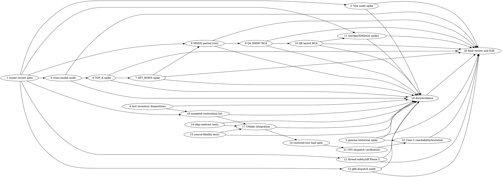

# SYCL Merge Readiness Implementation Plan

> **For Claude:** REQUIRED SUB-SKILL: Use team-driven-development to implement this plan with agent teams.

**Goal:** Resolve or explicitly block every merge-critical SYCL finding with attributable evidence, safe hardware execution, serialized ownership of shared backend files, and a lead-run end-to-end gate.

**Architecture:** Pi team agents perform bounded source/test work; the lead alone runs builds, model loads, GPU tests, benchmarks, and integration. Historical experiments use one persistent, warm backend worktree and never mutate the active checkout. Every unexplained result is a spike that must create and execute an exact child fix task before its blocker can close.

**Tech Stack:** C++17, SYCL/oneAPI 2025.3, Level Zero, CMake/Ninja, CTest, Python/pytest, codescout tracker, Pi teams.

**Test Infrastructure:** SYCL tests are under `tests/` and `ggml/src/ggml-sycl/tests/`; registrations are in `ggml/src/ggml-sycl/CMakeLists.txt`. GPU/model-loading work is lead-only and serial.

---

## Team Topology

**Recommended topology:** 3 file-conflict tracks with unlimited fan-out across dependency-ready, file-disjoint tasks; one ephemeral Pi implementer per ready task. Use `team_create`, `team_spawn`, `team_send`, `team_await`, and `team_teardown`; do not substitute the codescout team runtime.

**Reviewers:** Fresh spec and quality reviewers per task, plus a fresh whole-plan/branch review before certification.

### Mandatory execution and safety rules

1. The lead owns every `./scripts/sycl-build.sh`, CTest GPU run, `test-backend-ops`, `test-llama-archs`, `test-thread-safety`, `llama-cli`, `llama-completion`, and `llama-bench` invocation. Agents do not run devices.
2. Before **every GPU or model command**, the lead runs this wrapper. It is the only approved launch path:

```bash
run_gpu() (
    local label=$1; shift
    local lock=/Apps/llama.cpp/GPU.lock
    local i shmem avail settled=0 rc

    mkdir "$lock" 2>/dev/null || { echo "BUSY: $lock ($label)" >&2; return 75; }
    trap 'rmdir "$lock" 2>/dev/null || true' EXIT INT TERM HUP
    source /opt/intel/oneapi/setvars.sh --force || return 75
    export ONEAPI_DEVICE_SELECTOR=${ONEAPI_DEVICE_SELECTOR:-level_zero:0}

    for i in $(seq 1 60); do
        shmem=$(awk '$1=="Shmem:" {print $2}' /proc/meminfo)
        avail=$(awk '$1=="MemAvailable:" {print $2}' /proc/meminfo)
        if [ "$shmem" -lt 30720000 ] && [ "$avail" -gt 153600000 ]; then
            settled=1
            break
        fi
        sleep 10
    done
    if [ "$settled" -ne 1 ]; then
        echo "ABORT: memory did not settle ($label)" >&2
        return 75
    fi

    "$@"
    rc=$?
    sleep 5
    awk '$1=="Shmem:" || $1=="MemAvailable:" {print}' /proc/meminfo
    return "$rc"
)

run_build() (
    local label=$1; shift
    local lock=/Apps/llama.cpp/BUILD.lock
    mkdir "$lock" 2>/dev/null || { echo "BUSY: $lock ($label)" >&2; return 75; }
    trap 'rmdir "$lock" 2>/dev/null || true' EXIT INT TERM HUP
    "$@"
)
```

   The wrapper must be used as `run_gpu label env VAR=value ./build/bin/program ...`; a bare GPU/model command is a plan violation. GPT-OSS commands additionally require `timeout 60` inside the wrapper. If a run is killed, check `journalctl -k --since '1 hour ago' --no-pager | grep -iE 'GT reset|guc_id|CAT error|GPU hang|xe.*reset'` before trusting any result.
3. `test-thread-safety`, `test-llama-archs`, and any model-loading test run once only. No loops or concurrent CTest jobs. `Shmem` and `MemAvailable` are sampled after the five-second settle, not immediately at process exit.
4. Historical mutations use one persistent worktree, for example `/Apps/llama.cpp-sycl-history`, created once with a fixed branch/worktree path and reused for all experiments. They must never use `git checkout <sha>` or temporary source mutations in `/Apps/llama.cpp`; restore and rebuild the active checkout before any later lead run.
5. `ggml/src/ggml-sycl/ggml-sycl.cpp` is a single-owner sequential lane. Any task touching it, even a temporary experiment, is ordered after the previous one. Shared files are serialized by the ownership map below. Agents commit only their owned paths.

### Parallel tracks

| Track | Tasks | Description |
|---|---|---|
| A | 2, 5, 6, 7, 8, 9, 10, 11 | Backend findings; sequential for shared backend files and persistent warm worktree |
| B | 12, 13, 14, 15, 16, 17 | Test trust, Phase 2, q6k, and restoration/CMake; no GPU execution |
| C | 3, 4, 18 | Historical evidence, audit dispositions, documentation |
| Lead-only | 1, 19, 20, 21, 22 | Owner review, builds/GPU, mutation verification, integration, E2E |

### Dependency graph



### File ownership map

| File/path | Owner tasks | Ordering |
|---|---|---|
| `ggml/src/ggml-sycl/ggml-sycl.cpp` | 2, 5, 6 | One sequential lane; lead owns historical mutation |
| `ggml/src/ggml-sycl/unified-cache.{cpp,hpp}` | 5, 11 | Sequential after Task 5 |
| `ggml/src/ggml-sycl/mmvq.cpp` | 8 | Single owner; sites 3374, 3407, 3440, 3707, 3970, 4335, 4724, 4774, 21667, 21696, 21727 only |
| `ggml/src/ggml-sycl/set_rows.cpp` | 7 | Single owner; no implementation until API/error behavior is proven |
| `tests/test-backend-ops.cpp` | 6, 7 | Sequential; Task 6 first |
| `tests/test-dmmv-q4-0-coalesced.cpp` | 9 | Single owner |
| `tests/test-q8-0-layout-cache-path*.cpp` | 10 | Single owner |
| `tests/test-thread-safety.cpp`, iiff Phase 2 files | 12 | Separate Pi tasks for 12a–12c; 12d is lead-only hardware verification |
| `tests/test-q6k-dispatch.cpp`, `tests/test-q6k-reorder-dispatch.cpp` | 13 | One separate Pi task per 13a–13c outcome stage |
| candidate test sources | 14, 15 | Disjoint per task; no CMake edits |
| `ggml/src/ggml-sycl/CMakeLists.txt` | 17 | Integrator only, after all accepted candidates |
| `docs/backend/sycl-test-inventory.md` | 4, 16, 17 | Sequential |
| `docs/backend/sycl-cross-model-state-audit.md`, canonical docs, `artifacts/` | 5, 18 | Results first, docs second |

---

## Tasks

### Task 1: Owner review gate and recommendations

**Track:** Lead-only. **Depends on:** None. **Files:** tracker comments only; no source or policy-doc edits.

The owner reviews the handoff and tracker evidence for `llama.cpp-7f2e`, `llama.cpp-99ke`, `llama.cpp-8t4s`, `llama.cpp-0igs`, the thread-safety/iiff Phase 2 residue, Q4 RCA, and q6k-dispatch. The task records recommendations and unresolved questions; it does **not** let an agent choose policy. The owner must accept/reject each recommendation before implementation tasks depending on it start.

Record: tied-weight identity, unified-cache opt-out status, tiering semantics, MMVQ padding versus alternate dispatch, restoration scope, and evidence retention. Also record branch, starting `HEAD`, dirty/untracked paths, worktree list, and the fixed persistent historical-worktree path. A recommendation is not closure; each unknown remains a blocker until its spike and child-fix rule below are satisfied.

Commands: `git branch --show-current; git rev-parse HEAD; git status --short; git worktree list --porcelain; codescout task_show llama.cpp-7f2e; codescout task_show llama.cpp-99ke; codescout task_show llama.cpp-8t4s; codescout task_show llama.cpp-0igs`.

**Commit:** no source commit. **Gotcha:** do not use `git merge-base HEAD master` as the measurement baseline; use the commit immediately before the relevant change.

### Task 2: Gemma3n historical-layout spike with both outcomes

**Track:** A, sequential `ggml-sycl.cpp` lane. **Depends on:** None. **Files:** persistent historical worktree only; tracker `llama.cpp-8t4s`; concise evidence artifact.

In `/Apps/llama.cpp-sycl-history`, check out `d293bf2b3`'s `ggml-sycl.cpp`, build through `run_build`, and run the full architecture sweep once through `run_gpu` with `GGML_SYCL_OP_TIMEOUT_MS=120000`. Then restore the historical worktree and rebuild it. Do not mutate the active checkout.

If gemma3n fails at `1.14e+00`, file an exact child task naming the first commit interval to bisect (`e2df03733..1107a53b0`), execute that child task, and keep `8t4s` open until its fix is executed and verified. If it passes, file and execute an exact child task for a deterministic/layout-sensitive reproducer; a vanished failure is not closure. Record rc and prose mismatch evidence, never table-row absence.

**Commit:** evidence only if it contains build SHA, command, selector, rc, and outcome. **Gotchas:** restore/rebuild before any other GPU run; five-second settle is mandatory.

### Task 3: Audit `9a0670712` (`llama.cpp-7f2e`)

**Track:** C. **Depends on:** Task 1 recommendation. **Files:** tracker evidence; audit report under `artifacts/7f2e/`; source only if a child fix is created.

Audit the commit against the current `CLAUDE.md` memory-ownership contract and the handoff's known regressions: model-load reset preservation, `g_tiered_enabled`, removed `GGML_SYCL_UNIFIED_CACHE=0`, tied-weight keys, and all affected tests. Separate confirmed defects, intentional changes, and untested hypotheses.

For every unknown, create an exact child fix task with file, symbol, RED command, GREEN change, and lead verification, then execute it before `7f2e` can close. A report that only says “needs investigation” is incomplete.

**Commit:** tracker/artifact only unless child task changes source. **Gotcha:** do not resurrect the removed opt-out merely because an old test expects it; owner recommendation governs.

### Task 4: Restoration inventory (split into independent subtasks)

**Track:** C. **Depends on:** None. **Files:** `docs/backend/sycl-test-inventory.md`.

These are three independently assignable subtasks, serialized because they share one document:

- **4a provenance:** compare the handoff's 41 restored tests and remaining 22-file set with `git show 3c8f296fd:tests/CMakeLists.txt` and both live CMake files; record exact historical registration and guard context.
- **4b hazard classification:** classify each candidate as model-loading, GPU serial, host-only, parser, manual, or never-test; explicitly identify the five model-loading hazards and forbid ordinary parallel CTest registration.
- **4c disposition table:** assign restore, manual-only, deleted/never-test, or a named tracker task to every row, including the 64/147 `llama.cpp-0igs` evidence. This subtask depends on 4a and 4b.

**RED:** a missing/guard-hidden entry or an unowned deferred row fails the owning subtask. **GREEN:** the table is complete and every deferred item has an owner and next exact action. No CMake edit here.

### Task 5: Complete cross-model mutable-state audit

**Track:** A, sequential `ggml-sycl.cpp`/cache lane. **Depends on:** Task 1. **Files:** audit doc and existing cross-model test; source only for confirmed leaks.

Classify every unresolved row in `docs/backend/sycl-cross-model-state-audit.md`, including `g_moe_layer_seq`, `g_expert_popularity`, `g_sycl_canonical_checksums`, `g_pending_kv_layer_masks`, `g_moe_layer_ids_cache`, `g_moe_expert_biases`, `g_moe_bias_host_copies`, `g_sycl_alloc_trace_entries`, `fattn.cpp:g_packed_k_sidecars`, and `layer-streaming.cpp`'s registry. Verify reads/writes with `cat ggml/src/ggml-sycl/ggml-sycl.cpp | grep -n`, not codescout alone.

For a confirmed model leak, add one RED two-model assertion to `ggml/src/ggml-sycl/tests/test-cross-model-weight-usage.cpp`, add the reset at the existing model-load boundary, and prove a mutation of that reset turns only its case red. For a safe/process-scoped item, record the positive reason. Unknown classifications become exact child spike/fix tasks and are executed before this task closes.

**Gotcha:** never clear live model leases or use raw pointer identity as a cache key.

### Task 6: TOP_K `-inf` behavior spike at the correct lines

**Track:** A, after Task 5 in the `ggml-sycl.cpp` lane. **Depends on:** Task 5. **Files:** `ggml/src/ggml-sycl/ggml-sycl.cpp:33721-33820`, focused test in `tests/test-backend-ops.cpp`.

The current implementation initializes `local_idxs` to `-1` and inserts only on `val > local_vals[k - 1]`; merge uses `v1 >= v2` and can carry invalid indices. Do not put guessed replacement code in the plan or source. First add a RED case with `ncols >= k`, fewer than `k` finite values, remaining values `-INFINITY`, and assertions for in-range distinct indices. Run the exact CPU/SYCL comparison through the existing backend-ops harness.

If the RED confirms the defect, create and execute a child fix task containing the **complete compilable replacement block for lines 33721-33820**, using the actual current variable names and a mutation proof. If no RED occurs, create and execute a child task that explains the CPU contract and closes the hypothesis with evidence. Task 6 cannot close with placeholder APIs or a partial snippet.

### Task 7: SET_ROWS bounds/error-contract spike

**Track:** A, after Task 6. **Depends on:** Task 6's result. **Files:** inspect the generic/index kernels at `ggml/src/ggml-sycl/set_rows.cpp:635-699` and `773-787`, then the dispatch beginning at `956`; modify that file and its existing focused test only after API proof.

Trace the real SET_ROWS call/return path from the dispatch at line 956 into every kernel that reads `dst_row` (including lines 638, 690, and 776), and establish whether invalid row indices are rejected by the public operation, represented as a device-side status, or intentionally undefined by the backend contract. Add a RED canary test only if the existing API can observe failure without invented propagation.

If bounds checking is required, create and execute an exact child fix task using the actual return type/signature and a real caller-visible error path. If the kernel is `void` and no existing status channel exists, the child task must instead specify a safe pre-submit validation at the real host call site, grounded in the current signature. Do **not** insert `return;` as guessed error propagation, do not invent an API, and do not claim closure from a canary that cannot observe the failure.

### Task 8: MMVQ partial-row decision and implementation

**Track:** A. **Depends on:** Tasks 1 and 7. **Files:** `ggml/src/ggml-sycl/mmvq.cpp`; RED tests `tests/test-ggml-sycl-soa.cpp` and `tests/test-dmmv-q6k-coalesced.cpp`.

Audit exactly these launch sites: lines `3374, 3407, 3440, 3707, 3970, 4335, 4724, 4774, 21667, 21696, 21727`. Confirm that `nrows` is the `row_diff` slice and request these lead RED commands before editing:

```bash
run_gpu mmvq-soa ./build/bin/test-ggml-sycl-soa
run_gpu mmvq-q6k ./build/bin/test-dmmv-q6k-coalesced
```

Expected current RED: `Non-uniform work-groups are not supported by the target device` for a non-multiple-of-16 row slice. Task 1 chooses padding+guard or an alternate legal dispatch. The implementer then creates and executes one exact child task containing the complete per-kernel edit for the chosen policy, tests row slices `1, 15, 16, 17`, proves a guard/remapping mutation goes red, and requests a single lead B50/B70 TG comparison. Task 8 does not preselect padding if the owner rejects it. No second MMVQ owner may edit this file concurrently.

### Task 9: Q4_0 coalesced DMMV RCA, then mandatory child fix

**Track:** A. **Depends on:** Task 8 (serialization of the warm backend lane). **Files:** `tests/test-dmmv-q4-0-coalesced.cpp`; production only in the child task after localization.

Treat the observed 12–31% error as a real reachable wrong-answer path. Instrument the existing test to identify the first divergent row/column, dispatch/layout identity, packed bytes, CPU decoded values, and GPU values. Test the candidate stages separately: materialization, row addressing, dequantization, accumulation.

Completion requires a named causal stage and a one-line mutation/reference substitution that changes the result. Then file and execute a separate exact child fix task with the production file/symbol, complete code change, RED/GREEN commands, and mutation proof. If RCA cannot name a causal stage, file and execute a narrower child spike; `9` remains blocked. Never “fix” by widening the tolerance.

### Task 10: Q8 layout `wrong_layout` RCA

**Track:** A. **Depends on:** Task 9 (serialization of shared layout/backend files). **Files:** `tests/test-q8-0-layout-cache-path.cpp`, `tests/test-q8-0-layout-cache-path-mmvq.cpp`; production only in a child task.

Run each path once through `run_gpu`, record requested/stored layout, padded bytes, key identity, and pointer-resolution result. Check whether the existing production sizing helper is already available before changing a fixture. If both failures are stale fixture assumptions, file and execute a child test-only fix with the exact helper call. If production resolution is wrong, file and execute a production child fix with mutation evidence. Either outcome must be explicit; adjacent log lines are not causality.

### Task 11: Four independent backend findings

**Track:** A, sequential after Task 10 because cache files are shared. **Depends on:** Tasks 1 and 10. Execution creates four distinct tracker tasks and four distinct Pi members (`11a`–`11d`); this heading is only their dependency group, not an assignable aggregate.

- **11a tiering:** `tests/test-tiered-dispatch.cpp`; prove `g_tiered_enabled` does not conflate cache availability and model tiering. Unknown outcome requires an exact child fix task and execution.
- **11b tied keys:** `tests/test-sycl-weight-key-uniqueness.cpp`; cover distinct experts and true tied embedding/lm-head identity. Owner decision from Task 1 is required; no speculative alias key.
- **11c XMX:** `tests/test-sycl-xmx-unified-correctness.cpp:187-267`; determine whether `SKIP: no graph-pinned entries` causes failure or is adjacent, then file and execute the exact child fix.
- **11d unified-memory E2E:** `tests/test-sycl-unified-memory-e2e.cpp`; establish the existing budget configuration and allocation contract before changing it. File and execute a child fix only if the test self-starves.

Each is the smallest one-finding spike and has its own RED, causal outcome, child-task requirement, and commit scope. No parent finding may close while its child is merely filed but unexecuted.

### Task 12: Residual thread-safety/iiff Phase 2 (four dependent tasks)

**Track:** B, lead-only hardware portions. **Depends on:** Task 1. **Production scope:** boundary and abort path `ggml/src/ggml-sycl/ggml-sycl.cpp:79095,79131-79139,91546,92865`; reset implementations `ggml/src/ggml-sycl/unified-cache.cpp:13268,13465,13735`; declarations `unified-cache.hpp:3914,3951,3999`; test `tests/test-thread-safety.cpp` and its fixture registration.

Create four separate tracker tasks with explicit edges `12a -> 12b -> 12c -> 12d`:

- **12a (read-only audit):** verify the fixture and enumerate every remaining zone-reset/drain caller in the exact production scope above. Deliver a zero-or-named-caller inventory.
- **12b (implementation):** only after 12a and the `llama.cpp-iiff` Phase-1 escape inventory are closed, remove the proven-no-longer-needed drain/reset scaffolding while retaining assert-only observability. Its RED is the current abort below; its GREEN must not reclaim a live handle.
- **12c (narrow reproducer):** run the existing device-free retained-handle/barrier reproducer from the `iiff/oze0` evidence and require removal of one ownership guard to turn it red. Do not use the whole model test for race repetition.
- **12d (lead verification; no Pi implementer):** stage the fixture and run once:

```bash
ctest --test-dir build -R '^test-download-model$'
run_gpu thread-safety ctest --test-dir build -R '^test-thread-safety$' --output-on-failure
```

Current RED signal: non-zero/abort with `[GRAPH-COMPUTE] arena scratch unavailable before graph launch`. GREEN: rc 0, no forced reset/reclaim warning, and settled memory. No three-run criterion, background process, or unpinned selector. Phase 2 cannot close while any child fix is only filed.

### Task 13: `test-q6k-dispatch` audit (three dependent tasks)

**Track:** B. **Depends on:** Task 1. **Files:** `tests/test-q6k-dispatch.cpp:195-352`; `tests/test-q6k-reorder-dispatch.cpp` is owned separately by Task 15 and must not be edited here.

Create separate tracker tasks with edges `13a -> 13b -> 13c`:

- **13a threshold provenance:** run `git log -S '0.01' -- tests/test-q6k-dispatch.cpp` and identify the commit/rationale that introduced the 1% gate. Preserve that determinism Tests 3/4 pass.
- **13b production-path audit:** trace Test 2 into the real dispatch and name the first CPU/GPU divergence. Lead RED command:

```bash
run_gpu q6k-dispatch ./build/bin/test-q6k-dispatch
```

Expected current RED: Test 2 reports approximately `max_rel 1.4442%` against the 1% gate; Tests 3/4 remain green. Record process rc.
- **13c outcome implementation:** if 1% is justified, file and execute an exact production child fix with a mutation that restores the 1.4442% failure. If unjustified, file and execute an exact threshold/reference-test child whose CPU positive control demonstrates the accepted bound. q6k-dispatch remains blocked until 13c is implemented, reviewed, and lead-verified.

### Task 14: Split skip-contract work per source

**Track:** B. **Depends on:** None. Create four separate tracker tasks/Pi members, one per exact file: `tests/test-mmvq-q8-0-streaming-bench.cpp`, `tests/test-mxfp4-xmx-tiled.cpp`, `tests/test-sycl-fattn-onednn-descriptors.cpp`, `tests/test-unified-dispatch-integration.cpp`.

Each source is an independent task; there is no aggregate implementer. Each must identify the real unsupported precondition, return CTest skip code 77 only where the existing test convention supports it, and prove enabled-path failure propagation with a deliberate assertion mutation. Do not add CMake in these tasks and do not require model/GPU execution from an agent.

### Task 15: Split source-fidelity work per source

**Track:** B. **Depends on:** None. Create two separate tracker tasks/Pi members: one owns only `tests/test-cpu-gpu-soa-interaction.cpp`; the other owns only `tests/test-q6k-reorder-dispatch.cpp`.

Each task must prove it calls production code and propagates failure to `main`. If a source is a mock and no existing test hook can be used without inventing a public API, disposition it explicitly in Task 16 rather than adding a placeholder hook. Q6K must retain an actual accumulator/return path, with a mutation that returns nonzero.

### Task 16: Accepted restoration decisions

**Track:** B. **Depends on:** Tasks 4, 14, 15. **Files:** `docs/backend/sycl-test-inventory.md`.

Record the exact accepted candidates and the exact declined/manual/unsafe candidates. Every accepted candidate has one owner, one test command, one CMake target name, and one hazard classification. Model-loading hazards remain lead-only and serial. This task does not edit CMake.

### Task 17: CMake integration (four sequential Pi tasks)

**Track:** B, single CMake lane. **Depends on:** Tasks 14, 15, 16 and every accepted child fix. **Files:** `ggml/src/ggml-sycl/CMakeLists.txt` only, plus inventory synchronization after registration.

Create four sequential tracker tasks/Pi members sharing the CMake lane: **17a** target/link topology, **17b** oneDNN link guards, **17c** skip-code/label properties, and **17d** final registration audit. Each starts only after its predecessor is reviewed and merged. Within each, add one accepted candidate at a time and run configure/build metadata checks before the next candidate. Register only candidates that passed source-fidelity and skip-contract review. Copy link topology and oneDNN linkage from existing targets; do not guess. Set `SKIP_RETURN_CODE 77` only for targets with that behavior. Do not use labels containing `residency`, `mem-handle`, or `cache`, because CTest `-LE` matching is substring-based. Static checks: `ctest --test-dir build -N -L <accepted-label>` and verify no accepted target is silently denied by the documented filters.

### Task 18: Results-first documentation/evidence

**Track:** C. **Depends on:** Tasks 2–17 results. **Files:** `docs/backend/sycl-cross-model-state-audit.md`, `docs/backend/sycl-test-inventory.md`, `docs/backend/sycl-env-vars.md`, `docs/design/sycl-canonical-memory-architecture.md`, `docs/backend/sycl-perf-baselines.md`, concise `artifacts/` evidence.

Update docs only from completed results. Preserve the explicit outcomes of gemma3n, Q4 RCA, q6k-dispatch, thread-safety/iiff Phase 2, and 7f2e. Reconcile stale hardware/performance claims and document unresolved blockers rather than converting them to “pass.” Every retained artifact names build SHA, command, selector, rc, and signal. Docs depend on results; no documentation task may unblock implementation.

### Task 19: Restored-test lead gate

**Track:** Lead-only. **Depends on:** Task 17. **Files:** evidence/tracker only.

Run `run_build restored-build ./scripts/sycl-build.sh`, require rc 0, then run the accepted restored targets serially through `run_gpu`; first inspect generated registration with `ctest -N`. Do not run `-j >1`; do not loop model-loading tests. Any failure files a precise child bug and blocks `0igs`/this plan until that child is executed.

### Task 21: Verify `llama.cpp-ktlb` CPU-dispatch fixes

**Track:** Lead-only. **Depends on:** Task 19's canonical rebuild. **Files:** verification only for `ggml/src/ggml-sycl/cpu-dispatch.cpp:151-173,499-508,821-825,1098-1105,1478-1488,4257-4275,6295-6302`; tracker `llama.cpp-ktlb`.

Run exactly once each through the global wrapper:

```bash
run_gpu moe-handle ./build/bin/test-sycl-moe-handle-resolution
run_gpu cpu-dispatch ./build/bin/test-sycl-cpu-dispatch
run_gpu host-streaming ./build/bin/test-mul-mat-host-streaming
run_gpu xmx-correctness ./build/bin/test-sycl-xmx-unified-correctness
```

Expected for the `ktlb` fix: the first three return 0 and no `g_cpu_dispatch_buffers` size assertion appears. If XMX still reports `SKIP: no graph-pinned entries` followed by backend failure, file and execute the separate Task 11c child; do not keep `ktlb` open for an unrelated downstream red. Close `ktlb` only after its three owned gates are green and the build SHA/rc are recorded.

### Task 22: Prove Case C reachability and mutation A/B (`llama.cpp-81gx`)

**Track:** Lead-only, sequential `ggml-sycl.cpp` lane. **Depends on:** Tasks 2 and 21, with no live backend editor. **Files:** temporary mutation in the persistent warm backend worktree at `ggml/src/ggml-sycl/ggml-sycl.cpp:73261-73272`; test `ggml/src/ggml-sycl/tests/test-rms-norm-mul-add-broadcast.cpp:219-294,368-389`.

First run canonical reachability:

```bash
run_gpu case-c-reach env GGML_SYCL_FUSION_BIT1_REACH_DEBUG=1 \
  ./build/bin/test-rms-norm-mul-add-broadcast 2>&1 | tee /tmp/case-c-reach.log
rc=${PIPESTATUS[0]}
test "$rc" -eq 0
test "$(grep -c '\[FUSION-BIT1-GUARD\]' /tmp/case-c-reach.log)" -eq 6
test "$(grep -c 'op_seq=0' /tmp/case-c-reach.log)" -eq 0
```

Then execute the mutation in the persistent warm backend worktree only:

```bash
HIST=/Apps/llama.cpp-sycl-history
CANONICAL_SHA=$(git -C /Apps/llama.cpp rev-parse HEAD)
test -z "$(git -C "$HIST" status --porcelain)"
git -C "$HIST" switch --detach "$CANONICAL_SHA"
python3 - "$HIST/ggml/src/ggml-sycl/ggml-sycl.cpp" <<'PY'
from pathlib import Path
import sys
p = Path(sys.argv[1])
s = p.read_text()
old = "static bool ggml_sycl_fusion_operand_view_offset_safe(const ggml_tensor * operand) {\n"
assert s.count(old) == 1
p.write_text(s.replace(old, old + "    return true;\n", 1))
PY
run_build case-c-red-build bash -lc "cd '$HIST' && ./scripts/sycl-build.sh"
run_gpu case-c-red env GGML_SYCL_FUSION_BIT1_REACH_DEBUG=1 \
  "$HIST/build/bin/test-rms-norm-mul-add-broadcast" 2>&1 | tee /tmp/case-c-red.log
red_rc=${PIPESTATUS[0]}
test "$red_rc" -ne 0
grep -q 'view-at-nonzero-offset' /tmp/case-c-red.log

git -C "$HIST" restore ggml/src/ggml-sycl/ggml-sycl.cpp
run_build case-c-green-build bash -lc "cd '$HIST' && ./scripts/sycl-build.sh"
run_gpu case-c-green env GGML_SYCL_FUSION_BIT1_REACH_DEBUG=1 \
  "$HIST/build/bin/test-rms-norm-mul-add-broadcast" 2>&1 | tee /tmp/case-c-green.log
green_rc=${PIPESTATUS[0]}
test "$green_rc" -eq 0
test "$(grep -c '\[FUSION-BIT1-GUARD\]' /tmp/case-c-green.log)" -eq 6
test "$(grep -c 'op_seq=0' /tmp/case-c-green.log)" -eq 0
git -C "$HIST" diff --exit-code -- ggml/src/ggml-sycl/ggml-sycl.cpp
```

Close `llama.cpp-81gx` only after both directions are recorded.

### Task 20: Final fresh review, integration, and E2E

**Track:** Lead-only. **Depends on:** Tasks 2–19, 21, and 22. **Files:** whole reviewed branch; no hidden amendments.

After team teardown and worktree/process cleanup, spawn fresh spec and quality reviewers. They must return PASS with zero findings. The lead then runs the E2E section below, records observations, updates tracker dependencies, and only then performs repository landing. Never close a blocker merely because its spike produced a hypothesis.

---

## End-to-End Validation (on the user's machine) — MANDATORY

Owned and executed by the lead after all task tests and child fixes pass. Every GPU/model command uses `run_gpu`; B50 calls set `ONEAPI_DEVICE_SELECTOR=level_zero:1` on the function invocation. Every GPT-OSS invocation uses `timeout 60`.

1. **Preflight and canonical build**

```bash
cd /Apps/llama.cpp
uptime
pgrep -af 'codescout|ninja|icpx|ffmpeg' || true
git status --short
journalctl -k --since '1 hour ago' --no-pager | grep -iE 'GT reset|guc_id|CAT error|GPU hang|xe.*reset' || true
run_build canonical-build ./scripts/sycl-build.sh
test "$?" -eq 0
grep -E '^GGML_SYCL:BOOL=ON$' build/CMakeCache.txt
test "$(ldd build/bin/llama-completion | grep -cE 'libggml-sycl|libsycl')" -ge 2
```

2. **Targeted gates**

Consume the already-recorded build SHA, rc, and logs from Tasks 19, 21, and 22; do **not** rerun them. Likewise consume each accepted child-fix verification from Tasks 5–13. A missing result, mismatched final build SHA, or child without a named expected signal blocks E2E and triggers one canonical revalidation decision by the owner—it is never silently rerun.

3. **Architecture and thread safety**

```bash
run_gpu archs env GGML_SYCL_OP_TIMEOUT_MS=120000 ./build/bin/test-llama-archs \
  2>&1 | tee /tmp/archs-final.log
archs_rc=${PIPESTATUS[0]}
test "$archs_rc" -eq 0
grep -q 'Architecture test results' /tmp/archs-final.log
! grep -qE 'watchdog|roundtrip mismatch|arena scratch unavailable' /tmp/archs-final.log
```

Architecture runs once here. **Do not rerun `test-thread-safety`:** Task 12d is its one mandatory lead run and its recorded rc/log is consumed by E2E. Task 12d must be rc 0 with no `arena scratch unavailable`; otherwise E2E fails.

4. **User-facing correctness on B50**

```bash
ONEAPI_DEVICE_SELECTOR=level_zero:1 run_gpu mistral-completion \
  ./build/bin/llama-completion \
  -m /models/mistral-7b-v0.1.Q4_0.gguf \
  -p '1, 2, 3, 4, 5,' -n 15 --seed 42 --temp 0 \
  2>&1 | tee /tmp/mistral-gate.log
mistral_rc=${PIPESTATUS[0]}
test "$mistral_rc" -eq 0
grep -q '1, 2, 3, 4, 5, 6, 7, 8, 9, 10' /tmp/mistral-gate.log

ONEAPI_DEVICE_SELECTOR=level_zero:1 run_gpu gptoss-chat timeout 60 \
  ./build/bin/llama-cli \
  -m /models/gpt-oss-20b-mxfp4.gguf -ngl 99 \
  -cnv -st --simple-io --no-display-prompt \
  --chat-template-kwargs '{"reasoning_effort":"medium"}' \
  --reasoning-format none --reasoning-budget 0 \
  -p 'Count from 1 to 5. Answer with only: 1, 2, 3, 4, 5' \
  -n 48 --seed 42 --temp 0 \
  2>&1 | tee /tmp/gptoss-gate.log
gptoss_rc=${PIPESTATUS[0]}
test "$gptoss_rc" -eq 0
grep -v '^> ' /tmp/gptoss-gate.log | grep -xq '1, 2, 3, 4, 5'
```

Any missing exact assertion is a failed gate.

5. **CTest and backend operations**

```bash
ctest --test-dir build -N -LE 'residency|mem-handle|cache|sycl-restored' \
  -E '^(test-backend-ops|test-llama-archs|test-thread-safety)$' \
  | tee /tmp/ctest-selected.txt
grep -q 'Test #' /tmp/ctest-selected.txt
ctest --test-dir build -N -L sycl-restored | tee /tmp/ctest-restored.txt
grep -q 'Test #' /tmp/ctest-restored.txt

run_gpu full-ctest ctest --test-dir build --output-on-failure -j 1 \
  -LE 'residency|mem-handle|cache|sycl-restored' \
  -E '^(test-backend-ops|test-llama-archs|test-thread-safety)$'
test "$?" -eq 0
# Task 19 is the sole runtime execution of the sycl-restored set; consume its recorded rc/log here.
run_gpu residency-tests ctest --test-dir build -L residency --output-on-failure -j 1
test "$?" -eq 0
run_gpu backend-ops ./build/bin/test-backend-ops
test "$?" -eq 0
```

Expected: no zero-match target is treated as a pass; accepted restored tests appear under `sycl-restored`; every selected test passes or reports CTest `Skipped` via rc 77.

6. **Performance matrix after correctness**

```bash
mkdir -p artifacts/perf-final
for run in 1 2 3 4 5; do
  ONEAPI_DEVICE_SELECTOR=level_zero:0 run_gpu b70-mistral \
    env GGML_SYCL_OP_TIMEOUT_MS=180000 ./build/bin/llama-bench -v \
    -m /models/mistral-7b-v0.1.Q4_0.gguf \
    -p 512 -n 128 -fa 1 -r 5 \
    2>&1 | tee "artifacts/perf-final/b70-mistral-$run.log"
  test "${PIPESTATUS[0]}" -eq 0

  ONEAPI_DEVICE_SELECTOR=level_zero:0 run_gpu b70-gptoss timeout 60 \
    env GGML_SYCL_OP_TIMEOUT_MS=180000 ./build/bin/llama-bench -v \
    -m /models/gpt-oss-20b-mxfp4.gguf \
    -p 512 -n 128 -fa 1 -r 5 \
    2>&1 | tee "artifacts/perf-final/b70-gptoss-$run.log"
  test "${PIPESTATUS[0]}" -eq 0

  ONEAPI_DEVICE_SELECTOR=level_zero:1 run_gpu b50-mistral \
    ./build/bin/llama-bench -v \
    -m /models/mistral-7b-v0.1.Q4_0.gguf \
    -p 512 -n 128 -fa 1 -r 5 \
    2>&1 | tee "artifacts/perf-final/b50-mistral-$run.log"
  test "${PIPESTATUS[0]}" -eq 0

  ONEAPI_DEVICE_SELECTOR=level_zero:1 run_gpu b50-gptoss timeout 60 \
    ./build/bin/llama-bench -v \
    -m /models/gpt-oss-20b-mxfp4.gguf \
    -p 512 -n 128 -fa 1 -r 5 \
    2>&1 | tee "artifacts/perf-final/b50-gptoss-$run.log"
  test "${PIPESTATUS[0]}" -eq 0
done
```

Each wrapper call enforces memory settlement, and every `-v` log must report expected free VRAM (about 32600 MiB B70, 16250 MiB B50). Task 18 records an owner-reviewed performance decision before this gate. B50 has explicit floors: GPT-OSS five-process mean at least `849 PP512 / 30.4 TG128`; Mistral at least `1128 / 44.6`. The baseline document does not authorize a numeric B70 merge floor: if the B70 mean falls outside its recorded historical min–max (`GPT-OSS 1384.81–1434.14 PP, 40.18–46.27 TG`; `Mistral 2425.24–2594.58 PP, 106.57–109.15 TG`), block merge and create an owner-reviewed baseline/regression task rather than inventing or lowering a guardrail. A Task 18 parser extracts the `-fa 1` PP512/TG128 rows, verifies five samples per arm and free VRAM, computes means, and exits non-zero on a missing/unparseable sample.

7. **Final health and landing**

```bash
sleep 5
awk '$1=="Shmem:" || $1=="MemAvailable:" {print}' /proc/meminfo
journalctl -k --since '2 hours ago' --no-pager | \
  grep -iE 'GT reset|guc_id|CAT error|GPU hang|xe.*reset' > /tmp/final-gpu-health.txt || true
test ! -s /tmp/final-gpu-health.txt
git diff --check
test -z "$(git status --porcelain)"
git pull --rebase
git push
test -z "$(git status --porcelain)"
```

Any reset, forced stop, unresolved tracker dependency, unexpected untracked evidence, or non-clean final status stops certification.

**Observed success:** all accepted tests execute real checks, every unknown has an executed exact child fix or an explicit owner-blocking disposition, no unsafe overlap occurs, correctness outputs are exact, performance stays within the authoritative baselines, kernel health is clean, and the reviewed branch lands with no untracked validation artifacts.
