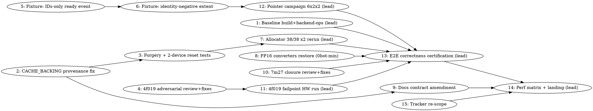

# SYCL B70 Hardening-First Merge Plan

> **For Claude:** REQUIRED SUB-SKILL: Use team-driven-development to implement this plan with agent teams.

**Goal:** Close every merge-blocking ownership/correctness defect on `feature/sycl-b70-capability` with Q1/NVFP4 capability kept fail-closed, pass the full E2E certification, and merge the branch into `master` (owner ruling 2026-08-14: hardening-first merge; the Q1/NVFP4 device-decode feature program is deferred to a post-merge epic).

**Architecture:** The unified cache is the sole allocator; `mem_handle` (now backed by intrusive `alloc_owner` controls with a per-device `allocation_release_coordinator`) is the ownership token. This plan (1) makes `CACHE_BACKING` classification unforgeable (the open P0 from the `f29cab5f3` review), (2) adversarially reviews and hardware-certifies the transactional-staging commit `4f01993c9`, (3) repairs two test-fixture defects blocking the pointer-table campaign, (4) closure-reviews the expert-prefetch ownership lane (7m27), (5) restores the Q1_0/NVFP4 → FP16 converters so `MUL_MAT_ID` cannot abort with capability disabled (0bot minimal scope per owner ruling c-cvpx), (6) brings the canonical contract docs back in sync with the `alloc_owner` reality, then (7) runs the full E2E and lands.

**Tech Stack:** C++17 / SYCL (oneAPI DPC++ 2026.1.1), Ninja + `./scripts/sycl-build.sh`, ctest, private-fixture test targets under `ggml/src/ggml-sycl/tests/`, Python source-contract tests under `tests/`.

**Test Infrastructure:** ctest (`ctest --test-dir build`); private GPU fixtures link against `GGML_SYCL_PRIVATE_TESTING` seams; pure-Python source-contract tests (`tests/test-sycl-*.py`) are safe at any parallelism; **all GPU/model-loading runs are lead-only, serial, selector-pinned** (see Execution Rules).

---

## Standing rulings this plan encodes (do not re-litigate)

- **Owner ruling 2026-08-14 (this session):** merge bar = hardening-first. `llama.cpp-sgox`, `zqoe`, `7vpd`, `5i7z`, `o54r`, `h690`, and full `tjk4` current-HEAD private-route certification are DEFERRED to a post-merge epic (Task 3 re-scopes the tracker). Q1/NVFP4 capability stays fail-closed (`q1_nvfp4_direct_b70_validated == false`).
- **Landing = merge into `master` + push both branches** (owner ruling, this session).
- **0bot strategy** is fixed by owner ruling c-cvpx on `llama.cpp-0bot`: restore only the proven historical FP16 converters (Q1_0 generic adapter; NVFP4 custom 4×16/32-thread mapping); reject a generic NVFP4 adapter/MMVQ wholesale port; do not weaken the unconditional indexed-MoE support contract.
- **Ambient host load ~60 is permanent** (owner ruling 2026-08-07): perf verdicts come from interleaved paired A/Bs, never "wait for quiet".

## Execution Rules (apply to every task)

1. **GPU work is serialized through the lead.** Implementers write code, build, and run pure-Python/CPU tests only. Every ctest/binary that loads a model or allocates on a GPU is run by the lead, one at a time, with `ONEAPI_DEVICE_SELECTOR` pinned (`level_zero:0` B70, `level_zero:1` B50, `level_zero:0,1` both — never unset), sampling `grep -E '^(MemAvailable|Shmem):' /proc/meminfo` before and ~5 s after.
2. **Source oneAPI first, always:** `source /opt/intel/oneapi/setvars.sh --force`. A SYCL test binary run without it prints `SKIP` and exits 0 — that is not a pass.
3. **Locks:** shared checkout builds take `/Apps/llama.cpp/BUILD.lock` (mkdir-style); worktree builds take nothing; `GPU.lock` is global and lead-owned. Never hold a lock across a wait.
4. **codescout is blind inside `ggml/src/ggml-sycl/ggml-sycl.cpp`** — verify claims there with `cat ggml/src/ggml-sycl/ggml-sycl.cpp | grep -n '<pattern>'` (pipe-grep is permitted).
5. **Worktree first builds are near-cold (~50 min for ggml-sycl.cpp).** Reuse worktrees; size waves by first-builds, not tasks. Max 2–3 concurrent first-builds.
6. **Formatting:** implementers use `clang-format-19 --dry-run -Werror <own file>` only (other agents are live). Never `-i`, never the staged form while others work.
7. **Fix-forward, never revert.** Verify correctness (canonical gates) before claiming any perf result.
8. Line numbers below were verified at HEAD `1d060d9c6` — re-verify before editing; this file drifts.

---

## Team Topology

**Recommended implementers:** 3 concurrent (tracks A, B, C; track D is cheap and can ride along) — execution spawns one ephemeral implementer PER TASK. Lead runs all GPU tasks (1, 7, 11, 12, 13, 14) itself, serially.

### Parallel Tracks

| Track | Tasks | Description |
|-------|-------|-------------|
| lead | 1, 7, 11, 12, 13, 14 | Baseline backend-ops run; all GPU certifications; E2E; landing |
| A | 2, 3 | unified-cache ownership: CACHE_BACKING provenance fix + adversarial/two-device tests |
| B | 4, 5, 6, 10 | `ggml-sycl.cpp` lane: 4f019 review-fixes + failpoints, two fixture repairs, 7m27 closure |
| C | 8 | `convert.cpp` lane: FP16 converter restoration (0bot minimal) |
| D | 9, 15 | Docs contract amendment; tracker re-scope |

### Dependency Graph



### File Ownership Map

| File/Directory | Tasks | Conflict Risk |
|----------------|-------|---------------|
| `ggml/src/ggml-sycl/unified-cache.hpp/.cpp`, `pinned-pool.cpp` | 2, 3 | Same track A, sequential |
| `ggml/src/ggml-sycl/ggml-sycl.cpp` | 4, 5, 6, 10 | Same track B, sequential (60k-line TU; one owner at a time) |
| `ggml/src/ggml-sycl/convert.cpp` | 8 | None (single task) |
| `ggml/src/ggml-sycl/tests/` (new fixture files) | 2, 3, 4 | Distinct new files per task |
| `tests/CMakeLists.txt` | 3, 4, 8 | Hotspot — each task appends its own block; rebase before commit |
| `docs/design/sycl-canonical-memory-architecture.md`, `docs/backend/sycl-memory-design.md`, `CLAUDE.md` | 9 | None |
| tracker (no files) | 15 | None |
| `artifacts/` (evidence) | 1, 7, 11, 12, 13, 14 | Lead-only |

---

### Task 1: Baseline — canonical build at HEAD + full B70 test-backend-ops census

**Track:** lead (GPU — lead only, never a subagent)
**Depends on:** None
**File scope:**
- Create: `artifacts/hardening-merge/baseline-<HEAD-sha>/` (build log, backend-ops log, meminfo samples, README.md)

**Description:** `build/bin/libggml-sycl.so` (Aug 12 22:12) predates HEAD `1d060d9c6` (Aug 14 10:39); `4f01993c9` has never been fully linked. Nothing downstream is trustworthy until HEAD builds clean and we know exactly which ops still abort in `test-backend-ops`. This task produces the ground-truth defect census the rest of the plan is scored against.

**Acceptance Criteria:**
- [ ] `./scripts/sycl-build.sh` rc=0 at HEAD; `grep -E '^GGML_SYCL:' build/CMakeCache.txt` → `BOOL=ON`; `ldd build/bin/llama-completion | grep -cE 'libggml-sycl|libsycl'` ≥ 2.
- [ ] One full `test-backend-ops` run on B70, pinned, with rc and every abort site recorded (`file:line` + op + shapes).
- [ ] Evidence directory committed with a README naming the SHA, rc, and abort census.

**Implementation Guide (lead, serial):**

```bash
source /opt/intel/oneapi/setvars.sh --force
mkdir BUILD.lock && echo "lead task1 $(date +%s)" > BUILD.lock/owner
./scripts/sycl-build.sh 2>&1 | tail -20        # detach if >10 min; never kill the link
rm -rf BUILD.lock
grep -E '^GGML_SYCL:' build/CMakeCache.txt      # want GGML_SYCL:BOOL=ON
ldd build/bin/llama-completion | grep -cE 'libggml-sycl|libsycl'   # want >= 2

mkdir GPU.lock && echo "lead task1 $(date +%s)" > GPU.lock/owner
OUT=artifacts/hardening-merge/baseline-$(git rev-parse --short HEAD); mkdir -p "$OUT"
grep -E '^(MemAvailable|Shmem):' /proc/meminfo | tee "$OUT/mem-before.txt"
timeout 3600 env ONEAPI_DEVICE_SELECTOR=level_zero:0 \
  ./build/bin/test-backend-ops > "$OUT/backend-ops.log" 2>&1; echo "rc=$?" | tee "$OUT/rc.txt"
rm -rf GPU.lock
sleep 5; grep -E '^(MemAvailable|Shmem):' /proc/meminfo | tee "$OUT/mem-after.txt"
# Abort census — GGML_ASSERT prints file:line; NEVER grep the literal 'GGML_ABORT' (macro never prints its name)
grep -nE 'ggml-sycl/[a-z-]+\.(cpp|hpp):[0-9]+' "$OUT/backend-ops.log" | tail -20 > "$OUT/abort-census.txt"
tail -30 "$OUT/backend-ops.log" >> "$OUT/abort-census.txt"
```

Expected: rc=134 with the last abort at a Q1_0/NVFP4 `MUL_MAT_ID` converter assert (`ggml-sycl.cpp:39611/:39744/:39767/:44541` family, `GGML_ASSERT(to_fp16_sycl != nullptr)`) **or** at a not-yet-known later site — record whichever it is; Task 8 and Task 13 consume this census. If rc=0, record it: Task 13's bar is already partially met.

**Commit:**
```bash
git add artifacts/hardening-merge/
git commit -m "test(sycl): record hardening-merge baseline backend-ops census"
```

**Gotchas:**
- `test-backend-ops` is the documented memory-exhaustion hazard: pinned selector is mandatory; one run only; abort if `Shmem` climbs past ~100 GB.
- The Bash 10-min ceiling: run the build detached (`run_in_background`) and watch the log; never orphan `BUILD.lock` (acquire and release in separate short commands).
- After any abort, check kernel health before trusting later runs: `journalctl -k --since "1 hour ago" --no-pager | grep -iE 'GT reset|guc_id|CAT error'`.

---

### Task 2: Make CACHE_BACKING classification unforgeable (the f29cab5f3 P0)

**Track:** A
**Depends on:** None
**File scope:**
- Modify: `ggml/src/ggml-sycl/unified-cache.hpp:3934` (remove public `cache_backing` from `alloc_constraints`), `:3993` + `:4019` region (`alloc_metadata.cache_backing` write-path restriction)
- Modify: `ggml/src/ggml-sycl/unified-cache.cpp:12575-12647` (`unified_allocate_owner` classification), `:11737`, `:12073` (legacy persistence sites), `:12513` (promotion trust site), `:12586-12602` (ownership-class derivation), `:1235`/`:15543-15557` (metadata mint helper taking `cache_backing`)
- Modify: `ggml/src/ggml-sycl/pinned-pool.cpp:96` (the sole legitimate mint site)
- Create: `ggml/src/ggml-sycl/allocation-provenance.hpp` (private, NOT installed, included only by `unified-cache.cpp` + `pinned-pool.cpp`)
- Test: `tests/test-sycl-owner-allocation-migration.py` (extend source contract)

**Description:** `alloc_constraints.cache_backing` is a public caller-writable bool; any caller can mint `CACHE_BACKING` classification, which shutdown exempts from destructive-teardown refusal — an ownership-authority forgery. Replace the public bool with a private provenance token so only the pinned pool / cache internals can mint backing, and classify public `must_host_pinned + require_host_usm_base` requests as `EXTERNAL_EXACT` (handoff requirement #4).

**Acceptance Criteria:**
- [ ] `cache_backing` no longer exists in any public request struct (`alloc_constraints`/`alloc_intent`/`alloc_request`).
- [ ] `pinned-pool.cpp` still obtains `CACHE_BACKING` classification via the private token; every other caller of the same flag combination gets `EXTERNAL_EXACT`.
- [ ] Legacy `unified_alloc` persistence (`:11737`, `:12073`) and promotion (`:12513`) read the internally-minted provenance, never a request field.
- [ ] Source-contract RED→GREEN below passes; full project builds.

**Implementation Guide:**

1. **RED — extend the source contract** (`tests/test-sycl-owner-allocation-migration.py`; run with `python3 tests/test-sycl-owner-allocation-migration.py`, expect the new checks to FAIL before the fix):

```python
def check_cache_backing_not_public(unified_cache_hpp: str) -> list[str]:
    problems = []
    constraints = extract_struct(unified_cache_hpp, "alloc_constraints")
    if "cache_backing" in constraints:
        problems.append("alloc_constraints still exposes caller-writable cache_backing")
    return problems

def check_provenance_header_private(cmake_texts: dict[str, str], includes: dict[str, str]) -> list[str]:
    problems = []
    # allocation-provenance.hpp may be included ONLY by unified-cache.cpp and pinned-pool.cpp
    for path, text in includes.items():
        if "allocation-provenance.hpp" in text and \
           path.rsplit("/", 1)[-1] not in ("unified-cache.cpp", "pinned-pool.cpp"):
            problems.append(f"{path} includes the private provenance header")
    return problems
```

(Wire both into the file's existing `main()` check list; follow its existing helper conventions — the file already parses these sources.)

2. **GREEN — the mechanism.** Create `ggml/src/ggml-sycl/allocation-provenance.hpp`:

```cpp
#pragma once
// Private cache-backing provenance. Only unified-cache internals and the
// pinned pool may mint CACHE_BACKING classification; a public alloc_request
// cannot express it. Do not include this header outside unified-cache.cpp
// and pinned-pool.cpp (source-contract enforced).
namespace ggml_sycl {
class cache_backing_token {
    friend class pinned_chunk_pool;              // the sole external mint site
    friend struct allocation_owner_internal_access;
    cache_backing_token() = default;
};
allocation_result unified_allocate_owner_backing(const alloc_request & req,
                                                 cache_backing_token) noexcept;
}  // namespace ggml_sycl
```

Then, in `unified-cache.cpp`:
- Add a `bool internal_cache_backing` parameter threaded from `unified_allocate_owner_backing` (sets it true) through the existing `unified_allocate_owner` body (public overload passes false). The classification block currently at `:12596-12602` becomes:

```cpp
const bool pinned_backing = internal_cache_backing;   // was: req.intent.constraints.cache_backing
```

- The INVALID_REQUEST guard at `:12586-12588` drops its `cache_backing` clause for public requests and instead enforces, on the internal overload only, that `must_host_pinned && require_host_usm_base` are both set (backing must be a standalone host USM base).
- Legacy persistence sites `:11737` and `:12073` (`rec.handle.cache_backing = req.intent.constraints.cache_backing;`) change to consume a thread-scoped internal flag set only by the backing overload (extend the existing `thread_local alloc_owner_control * g_allocating_owner_control` pattern at `:740` with a sibling `thread_local bool g_allocating_cache_backing`); public paths always write `false`.
- Promotion at `:12513` (`ownership_class = exact.cache_backing ? ...`) keeps reading `alloc_metadata.cache_backing`, which is now write-restricted: audit every writer of `metadata.cache_backing` / the `:1235`/`:15543-15557` mint helper and make each one source the internal flag. `alloc_metadata.cache_backing` stays (it is a lifecycle annotation, not part of the exact release key — keep the `:4019` comment true).
- `pinned-pool.cpp:96` switches from setting the deleted field to calling `unified_allocate_owner_backing(req, cache_backing_token{})`.

3. Build the SYCL target (worktree; take no lock): `./scripts/sycl-build.sh` → rc=0. Re-run the Python contract → PASS.

**Commit:**
```bash
git add ggml/src/ggml-sycl/allocation-provenance.hpp ggml/src/ggml-sycl/unified-cache.hpp \
        ggml/src/ggml-sycl/unified-cache.cpp ggml/src/ggml-sycl/pinned-pool.cpp \
        tests/test-sycl-owner-allocation-migration.py
git commit -m "fix(sycl): mint cache-backing provenance privately"
```

**Gotchas:**
- Re-verify every quoted line number first (`cat ggml/src/ggml-sycl/unified-cache.cpp | grep -n 'cache_backing'`); this file drifts fast.
- There is exactly ONE production `cache_backing = true` site today (`pinned-pool.cpp:96`) — verified 2026-08-14. If you find another, stop and report; do not silently token-ify it.
- Do NOT remove `alloc_metadata.cache_backing` (registry rows/diagnostics/promotion consume it); restrict its writers.
- Worktree first build of `ggml-sycl.cpp` is ~50 min — but this task should not touch `ggml-sycl.cpp` at all; if you think you need to, stop and report.

---

### Task 3: Adversarial forgery tests + two-device coordinator reset test

**Track:** A
**Depends on:** Task 2
**File scope:**
- Create: `ggml/src/ggml-sycl/tests/test-cache-backing-provenance.cpp`
- Modify: `tests/CMakeLists.txt` (register with `LABELS "cache"`, `RUN_SERIAL TRUE`, `SKIP_RETURN_CODE 77`, `ENVIRONMENT "ONEAPI_DEVICE_SELECTOR=level_zero:0,1"` — copy an existing `test-sycl-*` private-fixture registration block verbatim as the template, e.g. the `test-mem-handle-eviction` one)

**Description:** Handoff requirement #5: adversarial direct and legacy-promotion forgery tests, post-physical-allocation cleanup tests, and a two-device coordinator reset test. These prove the Task 2 fix closed the hole rather than moved it.

**Acceptance Criteria:**
- [ ] Direct-forgery case: a public `alloc_request` with `must_host_pinned + require_host_usm_base` yields an owner whose control class is `EXTERNAL_EXACT` (assert via the `allocation_registry_test_*` / `allocation_owner_test_*` seams in `unified-cache.hpp:4274-4326`), and shutdown census does NOT exempt it.
- [ ] Legacy-promotion forgery case: an allocation registered through legacy `unified_alloc` from a public request never promotes to `CACHE_BACKING` (use `allocation_registry_test_promote`).
- [ ] Pinned-pool positive control: a real pinned-pool backing allocation IS classified `CACHE_BACKING` (otherwise the fix over-rotated).
- [ ] Two-device case: create coordinators on device 0 and 1, allocate on both, reset/teardown one device's coordinator; the other device's live owners are untouched and a retry on the reset device succeeds.
- [ ] Test exits 77 (not 0) when no SYCL device is present.

**Implementation Guide:** RED first: write the direct-forgery assertion against the PRE-Task-2 behavior in a scratch checkout to confirm it fails there (class reads `CACHE_BACKING`), then assert the post-fix behavior. Model the file on `ggml/src/ggml-sycl/tests/test-intrusive-allocation-owner.cpp` (host-only seam usage) plus a device-gated section for the real allocations. Build target: `./scripts/sycl-build.sh test-cache-backing-provenance`.

The GPU execution of this test is Task 7's first step (lead). This task's exit bar is: compiles, registered, host-only seam cases pass locally (`ctest --test-dir build -R test-cache-backing-provenance` on the CPU-only paths if the fixture splits them; otherwise compile-only + lead handoff note).

**Commit:**
```bash
git add ggml/src/ggml-sycl/tests/test-cache-backing-provenance.cpp tests/CMakeLists.txt
git commit -m "test(sycl): adversarially cover cache-backing provenance"
```

**Gotchas:**
- `ctest -E` exclusions are unanchored substrings — name the test so it cannot alias an existing exclusion pattern.
- A `SKIP` line + exit 0 is a silent false pass — use `SKIP_RETURN_CODE 77` and return 77 on no-device.
- `tests/CMakeLists.txt` is a shared hotspot (Tasks 3, 4, 8): `git pull --rebase` before committing; commit with explicit paths only.

---

### Task 4: Adversarial review of 4f01993c9 + fix round + failpoint seams

**Track:** B
**Depends on:** None (review starts immediately; fixes land before Tasks 5/6 touch the same file)
**File scope:**
- Modify: `ggml/src/ggml-sycl/ggml-sycl.cpp` (the 468-line `4f01993c9` staging-replacement region only; locate via `git show 4f01993c9 -- ggml/src/ggml-sycl/ggml-sycl.cpp | grep '^@@'`)
- Modify: `tests/test-sycl-owner-allocation-migration.py` (contract updates if fixes change shape)
- Create: private failpoint seams within the existing `GGML_SYCL_PRIVATE_TESTING` blocks of the staging path + `ggml/src/ggml-sycl/tests/test-staging-replacement-failpoints.cpp`; register in `tests/CMakeLists.txt` (same registration template as Task 3)

**Description:** `4f01993c9` (transactional staging replacement: XMX capacity gate, checked size arithmetic, exact-queue old-owner escrow, drain-on-failure, atomic MoE table publication) claims to fix prior P0/P1 staging findings but has **never been reviewed nor run** — source-contract + syntax-compile evidence only. Review it adversarially, fix findings, and add deterministic failpoints so Task 11 can prove the failure paths on hardware.

**Acceptance Criteria:**
- [ ] A fresh reviewer delivers a written verdict on `4f01993c9` covering, at minimum: exception-path owner retention (no leaked or double-released escrow on every early return), the checked arithmetic actually rejecting boundary values, publication atomicity vs concurrent readers, and drain ordering vs the terminal event.
- [ ] Every finding fixed and re-reviewed to PASS (minor findings are not optional).
- [ ] Failpoints exist for: forced allocation failure, barrier submission failure, retention-publication failure, resize while prior secondary work is in flight, arithmetic boundary rejection, same-allocation host-vector failure (the six from the handoff). Each is a private seam (ordinary `libggml-sycl.so` must export no new symbol — verify by NAMED-SYMBOL check: each new seam's exact name absent from `nm -D` on the ordinary DSO, with a positive control showing the same names present in the private test binary. [Amended 2026-08-14: a bare `grep -i failpoint` → 0 bar is unreliable — the DSO deliberately exports ~101 READ-ONLY `*_for_test` observers, and blanket greps match design-sanctioned exports; lead ruling on llama.cpp-2lfg.]).
- [ ] `test-staging-replacement-failpoints` compiles and is registered (GPU execution is Task 11).

**Implementation Guide:** Reviewer prompt must include the full commit (`git show 4f01993c9`), the staging-ownership rules from `docs/backend/sycl-memory-design.md`, and the prior P0/P1 finding text from tracker comment `llama.cpp-7m27` c-c98b. RED for each failpoint: with the seam armed, the staging path must take the drain/rollback branch and every owner (source, staging, destination, old-escrow) must still release exactly once — assert via the seam's release counters; with seams unarmed, behavior is byte-identical (positive control: the seam header compiled out of the ordinary DSO).

**Commit:**
```bash
git add ggml/src/ggml-sycl/ggml-sycl.cpp ggml/src/ggml-sycl/tests/test-staging-replacement-failpoints.cpp \
        tests/CMakeLists.txt tests/test-sycl-owner-allocation-migration.py
git commit -m "fix(sycl): harden staging replacement per adversarial review"
```

**Gotchas:**
- `ggml-sycl.cpp` is single-owner while this task is open (Tasks 5/6/10 queue behind it in track B).
- codescout is blind in this file — verify "no other writers" claims with pipe-grep.
- A control can silently no-op: before trusting a failpoint test, assert the armed seam was actually reached (counter > 0), not just that the test went green.

---

### Task 5: Fixture repair — IDs-only pointer-table test gets a deliberate ready event

**Track:** B
**Depends on:** Task 4 (same-file serialization only; no logical dependency)
**File scope:**
- Modify: `ggml/src/ggml-sycl/ggml-sycl.cpp:15732` (`test_moe_ptr_table_does_not_persist_pointer_cache()` body; ready-event dep machinery at `:8579`, `:9134-9260`)

**Description:** The campaign group `MoE pointer-table cache stores IDs only` fails all 4 cells for a **fixture** reason: the fixture replaces expert 5's backing without attaching a ready event, then asserts `dep_chained` (i.e. `g_test_moe_ptr_table_ready_event_deps > 0`) even though the dependency count is legitimately zero for an event-less replacement. Production code is not implicated. Fix the fixture only.

**Acceptance Criteria:**
- [ ] The expert-5 replacement in the fixture attaches a deliberate ready event (preferred — keeps the chaining assertion meaningful), OR the unrelated `dep_chained` assertion is removed from this specific test with a comment stating why (choose the ready-event route unless it distorts the "IDs only" property under test; if you must choose removal, say so in the commit message).
- [ ] No production (non-fixture) line changes. `git diff` touches only the `GGML_SYCL_PRIVATE_TESTING`/fixture region.
- [ ] `test-sycl-moe-handle-resolution` compiles.

**Implementation Guide:** Read `:15732` forward to the expert-5 replacement; mirror how the sibling test at `:9134-9160` seeds its ready event before asserting `dep_chained`. RED = the current 4/4-cell failure recorded in `artifacts/triage/test-sycl-moe-handle-resolution.txt` and tracker `llama.cpp-ytqx` c-px0r (do not re-run on GPU to reproduce — the recorded RED stands); GREEN = compile + Task 12's rerun.

**Commit:**
```bash
git add ggml/src/ggml-sycl/ggml-sycl.cpp
git commit -m "test(sycl): seed ready event in IDs-only pointer-table fixture"
```

**Gotchas:** Do not weaken production validation to make the fixture pass (explicit handoff constraint). Line `15732` will drift after Task 4's edits — re-locate by symbol name.

---

### Task 6: Fixture repair — identity-negative DIRECT handle gets a real extent

**Track:** B
**Depends on:** Task 5 (same file)
**File scope:**
- Modify: `ggml/src/ggml-sycl/ggml-sycl.cpp:8907` (the ownerless `mem_handle::from_direct(resolved.ptr, GGML_LAYOUT_AOS, /*on_device=*/true, /*device=*/0)` fixture call)

**Description:** The identity-negative fixture builds an ownerless DIRECT handle with extent 0, so publication rejects it early at the `logical_bytes > size()` geometry check — the intended ownership-negative rejection route is never reached. Pass the real `expert_size` as the DIRECT extent so the test exercises what it names.

**Acceptance Criteria:**
- [ ] The `:8907` call passes the expert payload size as the extent argument (match the pattern at `:6782`: `... HOST_DEVICE, 0 + bytes)` — here `on_device=true, device=0, expert_size`).
- [ ] The test still asserts REJECTION — but now for the ownership reason, not geometry (assert on the specific refusal reason/counter the seam exposes, not just "failed").
- [ ] Fixture-only diff; compiles.

**Commit:**
```bash
git add ggml/src/ggml-sycl/ggml-sycl.cpp
git commit -m "test(sycl): give identity-negative fixture a real DIRECT extent"
```

**Gotchas:** Score the exact answer against the oracle: if after the fix the publication *succeeds*, the ownership-negative check itself is broken — stop and report; do not massage the assertion until it passes.

---

### Task 7: Runtime allocator + provenance certification on both GPUs (lead)

**Track:** lead (GPU)
**Depends on:** Tasks 2, 3 merged + canonical rebuild
**File scope:**
- Create: `artifacts/hardening-merge/allocator-<sha>/` (logs, meminfo, README)

**Description:** Handoff requirement #6: rerun the runtime allocator suite 38/38 twice per GPU at the post-fix HEAD, plus the new provenance/forgery test. This is the hardware proof that Task 2 didn't break genuine backing/suballocation paths.

**Implementation Guide (lead, serial, one binary at a time):**

```bash
source /opt/intel/oneapi/setvars.sh --force
ctest --test-dir build -N -R 'runtime-alloc|cache-backing-provenance'   # verify non-empty selection FIRST
mkdir GPU.lock && echo "lead task7 $(date +%s)" > GPU.lock/owner
for dev in level_zero:0 level_zero:1; do
  for rep in 1 2; do
    grep -E '^(MemAvailable|Shmem):' /proc/meminfo
    ONEAPI_DEVICE_SELECTOR=$dev ctest --test-dir build -R 'runtime-alloc' \
      --output-on-failure -j 1 2>&1 | tee artifacts/hardening-merge/allocator-$(git rev-parse --short HEAD)/alloc-$dev-r$rep.log
    sleep 5; grep -E '^(MemAvailable|Shmem):' /proc/meminfo
  done
done
ONEAPI_DEVICE_SELECTOR=level_zero:0,1 ctest --test-dir build -R 'cache-backing-provenance' --output-on-failure -j 1 \
  2>&1 | tee artifacts/hardening-merge/allocator-$(git rev-parse --short HEAD)/provenance.log
rm -rf GPU.lock
```

**Acceptance Criteria:**
- [ ] Allocator suite: 38/38 (or the current registered count — record it; verify the selection is non-empty before trusting a green sweep) twice on each GPU, zero ERROR-level shutdown logs (`grep -c 'ERROR' <log>` with a positive control that the pattern matches the suite's real error format).
- [ ] `test-cache-backing-provenance` passes on `level_zero:0,1` (the two-device case needs both).
- [ ] Evidence committed. `git commit -m "test(sycl): record post-provenance allocator certification"`.

**Gotchas:** The exact ctest name for the "38/38" suite must be derived live (`ctest -N -R runtime-alloc`); if the regex selects nothing, the sweep passes vacuously — the `-N` check is mandatory, not advisory.

---

### Task 8: Restore Q1_0/NVFP4 → FP16 converters (0bot minimal scope)

**Track:** C
**Depends on:** None (Task 1's census sharpens the target list but the owner ruling already fixes scope)
**File scope:**
- Modify: `ggml/src/ggml-sycl/convert.cpp` (re-add the two converter registrations; the reverted attempt `ff158d180` added 34 lines here — start from `git show ff158d180`)
- Create: `tests/test-sycl-fp16-converters.py` (restore + extend the 197-line contract from `ff158d180`)
- Modify: `tests/CMakeLists.txt` (re-register the py contract; 7 lines in `ff158d180`)

**Description:** `test-backend-ops` aborts in `MUL_MAT_ID` at `GGML_ASSERT(to_fp16_sycl != nullptr)` (`ggml-sycl.cpp:39611/:39744/:39767/:44541`) because Q1_0/NVFP4 have no FP16 converter — an abort reachable with the capability fail-closed, so it blocks E2E regardless. Owner ruling c-cvpx: restore only the proven historical converters (Q1_0 generic adapter; NVFP4 custom 4×16/32-thread mapping). An earlier restore (`ff158d180`) was reverted same-day by `95691452b` with no stated reason — **the spike below resolves that first**.

**Acceptance Criteria:**
- [ ] Spike written up in the task's tracker comment: WHY `ff158d180` was reverted (check `llama.cpp-0bot` / `llama.cpp-6d67` comments around 2026-08-11 01:20, and whether the revert was "wholesale port rejected" per c-cvpx — in which case the restore must be re-derived from the historical pre-removal implementation, not from `ff158d180`).
- [ ] `to_fp16_sycl(GGML_TYPE_Q1_0)` and `to_fp16_sycl(GGML_TYPE_NVFP4)` return non-null, bit-exact against the CPU dequant reference for both types (device test asserting max ulp/abs error per c-cvpx "bit-exact device converter tests").
- [ ] The four `GGML_ASSERT(to_fp16_sycl != nullptr)` sites are unreachable for Q1_0/NVFP4 MMID shapes (proven by Task 13's full backend-ops rc=0, and locally by a targeted `test-backend-ops -o MUL_MAT_ID` run handed to the lead).
- [ ] The unconditional indexed-MoE support contract is untouched (`tests/test-sycl-supports-op-indexed-moe-source.py` still passes).

**Implementation Guide:** RED: restore the py contract from the revert (`git show ff158d180:tests/test-sycl-fp16-converters.py > tests/test-sycl-fp16-converters.py` — the colon form; the `git show <sha> -- <path> > <path>` form originally written here writes a DIFF whose SyntaxError reads as a valid RED while proving nothing [caught by impl-e2k3, 2026-08-14]), run it → FAIL (converters absent). Spike the revert reason. GREEN: re-add the converter table entries in `convert.cpp` per the spike's verdict (either re-apply `ff158d180`'s hunks if the revert was procedural, or port the historical kernels named by c-cvpx if the revert was substantive). Add the bit-exactness assertions to the existing converter device-test family (`ggml/src/ggml-sycl/tests/test-q1-nvfp4-adapter-device.cpp` already exists — extend it). Hand the GPU run to the lead.

**Commit:**
```bash
git add ggml/src/ggml-sycl/convert.cpp tests/test-sycl-fp16-converters.py tests/CMakeLists.txt \
        ggml/src/ggml-sycl/tests/test-q1-nvfp4-adapter-device.cpp
git commit -m "fix(sycl): restore proven Q1_0/NVFP4 fp16 converters"
```

**Gotchas:**
- The spike is mandatory: re-landing a same-day-reverted commit without knowing why it was reverted repeats the mistake at double cost.
- Fixture shapes take different paths than shipped models — cover the exact first-failing dtype/shape from Task 1's census, not just synthetic shapes.

---

### Task 9: Bring the canonical memory contract docs back in sync

**Track:** D
**Depends on:** Task 2 (document the FIXED provenance model, not the forgeable one)
**File scope:**
- Modify: `docs/design/sycl-canonical-memory-architecture.md` (API table at `:314-323`; add `unified_allocate_owner`, `alloc_owner`/`shared_alloc_owner`, `allocation_release_coordinator`, the three `allocation_control_class` values, and the private `cache_backing_token` mint rule)
- Modify: `docs/backend/sycl-memory-design.md` (narrative: owner-first allocation, escrow/deferred reclamation, retirement semantics)
- Modify: `CLAUDE.md` ("SYCL Memory Ownership" section: amend "surface to the rest of the backend as a `mem_handle`" to name `alloc_owner` as the second sanctioned surface, and state the provenance rule)

**Description:** ~180 commits added an ownership primitive, a release coordinator, and ownership classes with ZERO doc updates; the enforceable contract's allowlist doesn't know `unified_allocate_owner` (~43 call sites). Either the docs describe reality or the contract is dead. Amend the docs (the owner has sanctioned the owner-first direction by merging it).

**Acceptance Criteria:**
- [ ] The API table lists `unified_allocate_owner(req)` → `allocation_result` and the private `unified_allocate_owner_backing` (marked private/token-gated).
- [ ] A new contract subsection states: `CACHE_BACKING` is mintable only via the private token (Task 2's mechanism), `EXTERNAL_EXACT` is the classification for public standalone host-USM requests, and `alloc_owner` release flows only through the coordinator.
- [ ] CLAUDE.md's ownership section names both sanctioned surfaces (`mem_handle`, `alloc_owner`) and keeps every existing prohibition intact.
- [ ] No stale sentence contradicts the code: `grep -n 'cache_backing' docs/design/sycl-canonical-memory-architecture.md` describes only the token model.

**Commit:**
```bash
git add docs/design/sycl-canonical-memory-architecture.md docs/backend/sycl-memory-design.md CLAUDE.md
git commit -m "docs(sycl): admit owner-first allocation into the canonical contract"
```

**Gotchas:** Documenting a check can break it — if you quote a grep in the docs, run it after the text lands (self-matching). Keep the amendment additive: do not relax any existing prohibition (raw pointers, forced eviction, side caches).

---

### Task 10: 7m27 expert-prefetch closure review + residual fixes

**Track:** B
**Depends on:** Task 6 (same-file serialization)
**File scope:**
- Modify: `ggml/src/ggml-sycl/ggml-sycl.cpp` (prefetch descriptor region — locate via `cat ggml/src/ggml-sycl/ggml-sycl.cpp | grep -n 'moe_get_expert_stage_info'`) — ONLY if the review finds residuals
- Tracker: `llama.cpp-7m27`

**Description:** 7m27's last full review (`bfd28f84`) was REQUEST_CHANGES with five blockers (raw pointer returned without consumer-bound lease from legacy await; `get_cached_ptr` returning unleased pointer; host reorder reading before source dependencies settle; `cancel_all` waiting under mutex; unsafe DMA-queue shutdown). `b8bb8562b` then landed ownership/dependency/cancel/GC/shutdown fixes, but no closure review confirmed all five are gone. Review at current HEAD; fix what remains.

**Acceptance Criteria:**
- [ ] A fresh reviewer checks each of the five named blockers against current HEAD and delivers a per-item verdict (fixed at `<commit>` / still present at `<file:line>`).
- [ ] Every "still present" item fixed (each is a mem_handle-design violation — raw pointers outliving leases) and re-reviewed to PASS.
- [ ] `llama.cpp-7m27` gets a closure comment naming the evidence; status → closed (by the LEAD, after review PASS — implementers never close tickets).

**Gotchas:** The reviewer must read the CODE, not the fix-commit message — `b8bb8562b`'s message claims all five areas; claims run one step past the evidence.

---

### Task 11: 4f019 failpoint + staging hardware certification (lead)

**Track:** lead (GPU)
**Depends on:** Task 4 merged + rebuild
**File scope:**
- Create: `artifacts/hardening-merge/staging-<sha>/`

**Description:** Run Task 4's failpoint suite plus the staging-adjacent private fixtures on real hardware — the six forced-failure scenarios must drain/rollback with every owner released exactly once.

**Implementation Guide (lead):** same lock/meminfo discipline as Task 7;
```bash
ctest --test-dir build -N -R 'staging-replacement-failpoints'    # non-empty check first
ONEAPI_DEVICE_SELECTOR=level_zero:0 ctest --test-dir build -R 'staging-replacement-failpoints' --output-on-failure -j 1
ONEAPI_DEVICE_SELECTOR=level_zero:1 ctest --test-dir build -R 'staging-replacement-failpoints' --output-on-failure -j 1
```
- [ ] All six failpoints exercised (per-seam reached-counters > 0 in the log — a green run with counter 0 is a no-op, not a pass), both GPUs, rc=0.
- [ ] Named-symbol seam check: each of Task 4's six seam symbols absent from `nm -D` on the ordinary DSO, present (`nm --defined-only`) in the private test binary. [Amended 2026-08-14: replaces the bare `grep -ci failpoint → 0` bar — blanket test-ish greps match the ~101 deliberately-exported read-only observers; lead ruling on llama.cpp-2lfg.]
- [ ] Evidence committed.

---

### Task 12: Pointer-table campaign rerun 6×2×2 (lead) + evidence archive

**Track:** lead (GPU)
**Depends on:** Tasks 5, 6 merged + rebuild
**File scope:**
- Create: `artifacts/hardening-merge/pointer-campaign-<sha>/`

**Description:** Rerun the six named pointer-table groups twice per GPU at current HEAD (the campaign that scored 20/24 at `f29cab5f3` with all four failures in the fixture-defective group). Also rescue the old `/tmp` evidence bundle before a reboot destroys it.

**Implementation Guide (lead):**
```bash
# FIRST: rescue the old evidence (tmpfs!)
cp /tmp/llama-pointer-campaign-f29cab5f3-logs.tar.gz artifacts/hardening-merge/ 2>/dev/null && \
  sha256sum artifacts/hardening-merge/llama-pointer-campaign-f29cab5f3-logs.tar.gz
# expect d0d0fa28de2ea0196237e57f7b8bcab42f07d697da8b6c4aadaa7f66070f0b09; if the file is gone, record that.

ctest --test-dir build -N -R 'moe-handle-resolution'   # non-empty check
for dev in level_zero:0 level_zero:1; do for rep in 1 2; do
  ONEAPI_DEVICE_SELECTOR=$dev ctest --test-dir build -R 'moe-handle-resolution' --output-on-failure -j 1 \
    2>&1 | tee artifacts/hardening-merge/pointer-campaign-$(git rev-parse --short HEAD)/run-$dev-r$rep.log
done; done
```
- [ ] 24/24 cells pass (6 groups × 2 runs × 2 GPUs). Any repeat failure in `stores IDs only` after the fixture fix is a REAL finding — stop, file it P0, do not proceed to Task 13.
- [ ] `llama.cpp-ytqx` closure comment + close (lead).
- [ ] Evidence committed.

---

### Task 13: E2E correctness certification at merge-candidate HEAD (lead)

**Track:** lead (GPU)
**Depends on:** Tasks 1, 7, 8, 10, 11, 12 (all code merged; canonical rebuild at final SHA)
**File scope:**
- Create: `artifacts/hardening-merge/e2e-<sha>/`

**Description:** The whole-suite proof at ONE final SHA: everything below runs against the same freshly-built HEAD; any code change after it invalidates the run.

**Implementation Guide (lead, in order, one at a time, meminfo-sampled):**

1. Canonical rebuild + backend checks (as Task 1). Record SHA.
2. Filtered sweep: `ctest --test-dir build --output-on-failure -j 1 -LE 'residency|mem-handle|cache' -E '^test-backend-ops$'` → rc=0. Verify the exclusion with `ctest -N ... | grep backend-ops` → empty, BEFORE running.
3. Excluded family serially: `ctest --test-dir build -L 'cache|mem-handle' --output-on-failure -j 1` (verify selection non-empty first) → rc=0.
4. Full `test-backend-ops` on B70, pinned → **rc=0** (this is the bar Task 1's census feeds; every abort found there must be gone).
5. Mistral digit gate (B50) and GPT-OSS chat gate (B50) — exact commands and expected output per CLAUDE.md "Verification Commands & Correctness Gates"; tokens must match exactly.
6. Arch sweep, pinned `level_zero:0,1`, `GGML_SYCL_OP_TIMEOUT_MS=120000`: `./build/bin/test-llama-archs; echo rc=$?` → rc=0; score on rc + `grep -c 'roundtrip mismatch'` = 0 (the table is corrupted by log interleaving — never grep FAIL).
7. Kernel health: `journalctl -k --since "4 hours ago" --no-pager | grep -iE 'GT reset|guc_id|CAT error'` → empty.

- [ ] All seven steps green, recorded in the evidence dir with rc values, committed.

**Gotchas:** ONE run of each model-loading binary; never loop; the never-loop property applies to anything unmeasured. If any step goes red: stop, file the blocker, fix-forward, and restart Task 13 from step 1 at the new SHA (partial E2E evidence at a stale SHA is void).

---

### Task 14: Perf matrix + landing (lead)

**Track:** lead (GPU)
**Depends on:** Tasks 9, 13, 15
**File scope:**
- Create: `artifacts/hardening-merge/perf-final/`
- Branches: `feature/sycl-b70-capability`, `master`

**Description:** The perf gate per the standing methodology, then the merge itself.

**Implementation Guide (lead):**

1. Perf matrix at the certified SHA: `llama-bench` on the four arms (B70/Mistral-Q4_0, B70/GPT-OSS-20B, B50/Mistral-Q4_0, B50/GPT-OSS-20B), `-p 512 -n 128`, 5 runs each, parsed with `scripts/parse-sycl-bench-matrix.py`; gate against `docs/backend/sycl-perf-baselines.md` floors (B70 ~2495/108 and ~1415/44; B50 ~1188/47 and ~894/32; B70 tg ±10% noise band).
2. Any floor miss → interleaved paired A/B against a known-good comparator build on the same host state; within-noise → record load-depressed and proceed; consistently slower in-pair → REAL regression, stop and file, merge blocked.
3. Landing (only with 1–2 green): `git status --porcelain` empty → `git fetch` → `git rebase master` (resolve nothing silently; a non-trivial conflict = stop and report) → re-run step 5 correctness gates post-rebase (cheap insurance) → `git checkout master && git merge --no-ff feature/sycl-b70-capability` → push both: `git push origin master feature/sycl-b70-capability`.
4. Tracker: close `llama.cpp-ona8` and `llama.cpp-bwmz` with the evidence trail; verify no `in_progress` lease remains on any task this program touched.

**Gotchas:** A rebase relocates every commit — the perf/E2E evidence cites pre-rebase SHAs; record the mapping (`git rebase` with `--reapply-cherry-picks` note in the closure comment). If the rebase rewrites anything in `ggml-sycl/`, the E2E (Task 13) must be re-run at the post-rebase SHA before merging — budget for this by rebasing FIRST if master has moved at all (check `git log master..` / `git log ..master` before starting Task 13, and if master is ahead, rebase before Task 13, not after).

---

### Task 15: Tracker re-scope — post-merge epic for the deferred Q1/NVFP4 program

**Track:** D
**Depends on:** None (do early; Task 14 consumes it)
**File scope:** tracker only (`task_create`, `task_update`, `task_dep`, `task_dep_remove`)

**Description:** Encode the owner's hardening-first ruling in the tracker so `bwmz`/`ona8` become closable and no deferred work is lost.

**Acceptance Criteria:**
- [ ] New epic created: "EPIC: post-merge Q1/NVFP4 device decode program" (P1) with the ruling quoted in its description.
- [ ] `sgox`, `zqoe`, `7vpd`, `5i7z`, `o54r`, `h690`, `tjk4` re-parented: `task_dep` edges added to the new epic; their `blocks` edges onto `bwmz` AND `ona8` removed (`task_dep_remove`). Their own sub-dependencies (`s0h5`, `hbyo`, `vpjy`, `ihkf`, `igi0`, `yej4`, `32dg8.15.15`) ride along — verify each still has a path to the new epic.
- [ ] `bwmz` and `ona8` descriptions amended: done-criteria now = this plan; a comment quotes the 2026-08-14 owner ruling verbatim.
- [ ] Remaining `bwmz` deps after re-scope: exactly `ona8`, `7m27`, `ytqx`, `0bot` (7m27/ytqx close via Tasks 10/12; 0bot via Task 8 + Task 13's green backend-ops). [Amended 2026-08-14: the original line omitted `0bot`, whose direct bwmz edge predates this plan and is semantically correct under hardening-first — lead ruling on llama.cpp-hfw0.]
- [ ] Stale `in_progress` leases reset to open on every re-parented task (`o54r`, `7m27` currently carry `pi-orchestrator` leases; 7m27 stays in_progress only while Task 10 actively owns it).
- [ ] `llama.cpp-0bot` re-scoped, not deferred: retitle/annotate to its minimal converter scope (Task 8) and keep it blocking `ona8`; its feature-program deps (`vpjy`, `zqoe`, `7vpd`, `5i7z`) move to the new epic.

**Gotchas:** Never cite ids from the same tool block (create first, link next block). Tracker edges under-encode plan dependencies — after editing, `task_show` the epic and BOTH re-scoped umbrellas and paste the resulting dependency lists into the closure comment for human verification.

---

## End-to-End Validation (on the user's machine) — MANDATORY

> Run AFTER all task tests pass, BEFORE declaring the work done. Owned by the lead at teardown. This is Tasks 13–14 executed and recorded; the list below is the final observable checklist.

**Environment:** This host — Arc Pro B70 (`level_zero:0`) + Arc Pro B50 (`level_zero:1`), oneAPI DPC++ 2026.1.1, patched compute-runtime 26.22, ambient load ~60 (permanent), models in `/models/`.

**Steps Claude runs itself (exact commands in Tasks 13–14):**
1. Canonical build at final SHA: rc=0, `GGML_SYCL:BOOL=ON`, ldd count ≥2.
2. Filtered ctest sweep `-j 1` + excluded cache/mem-handle family serially: both rc=0.
3. Full `test-backend-ops` on B70 pinned: **rc=0** (the headline: at plan start this was rc=134).
4. Mistral digit gate on B50: output begins `1, 2, 3, 4, 5, 6, 7, 8, 9, 10`.
5. GPT-OSS chat gate on B50: answer line exactly `1, 2, 3, 4, 5`.
6. Arch sweep pinned `0,1`: rc=0, zero `roundtrip mismatch` lines.
7. Perf matrix 4 arms × 5 runs: at/above `docs/backend/sycl-perf-baselines.md` floors, or paired-A/B-adjudicated as load-depressed.
8. `journalctl -k` kernel-health grep: empty.
9. `git log master --oneline -1` shows the merge commit; `git status --porcelain` empty; push accepted (`git ls-remote origin master` matches local).

**Steps requiring the user:** none. (Discord notification of completion, with the evidence paths, is a courtesy, not a validation step.)

**Observed success:** merge commit on `master` pushed; `artifacts/hardening-merge/` contains build, backend-ops (rc=0), gates, sweep, perf, and campaign evidence all at the same certified SHA; `llama.cpp-bwmz` and `llama.cpp-ona8` closed with the evidence trail; the deferred program lives under the new post-merge epic with zero stale leases.
