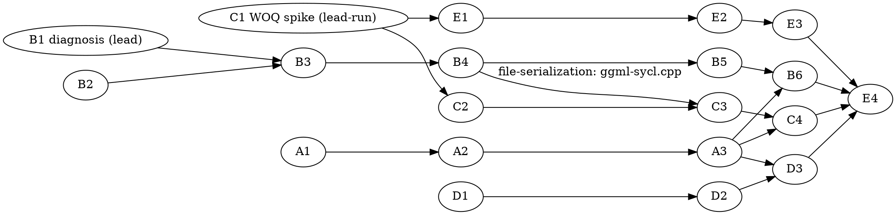

# GPT-OSS SYCL Perf Recovery Epic — Implementation Plan

> **Execution:** Use `team-driven-development` in Claude Code, `pi-team-driven-development` in pi.dev, or `codex-team-driven-development` in Codex.

**Goal:** Restore GPT-OSS 20B MXFP4 performance to baseline parity (B50 ≥ 863 pp512 AND ≥ 34.5 tg128, both simultaneously, at **default env**) inside the placement-planned architecture, with a capability-derived default route and measurement tooling that makes every number trustworthy.

**Architecture:** Five tracks. (A) A bench-guard runner that refuses to measure on a corrupted host (throttle, tenants, Shmem) and stamps every log VALID/SUSPECT. (B) A per-tensor expert route-decision cache that removes the per-dispatch prologue from decode and PP — decisions derived once per plan-generation, consumed read-only per token. (C) An MXFP4 weight-only-quantized (WOQ) oneDNN matmul that consumes 4-bit weights + e8m0 grouped scales directly, deleting the ~57 GB/pass f16 dequant — spike-gated, modeled on the existing Q4_0 WOQ code. (D) Root-cause fix for the B70 default-route `UR_RESULT_ERROR_OUT_OF_RESOURCES` on a clean device. (E) A capability-derived (never card-name-derived) default route selection, flipped per pre-registered thresholds.

**Tech Stack:** C++/SYCL (icpx, oneAPI 2025.3), oneDNN 3.11.3 (`f4_e2m1`=14, `e8m0`=13 data types confirmed in `/opt/intel/oneapi/dnnl/2025.3/include/oneapi/dnnl/dnnl_common_types.h:106-108`; grouped `set_scales` at `dnnl.hpp:4101`), bash for tooling.

**Test Infrastructure:** ctest via `tests/CMakeLists.txt`; C++ tests follow the `tests/test-sycl-layout-choice.cpp` pattern (includes `ggml-sycl/common.hpp` + `ggml-sycl-test.hpp`, exercises pure policy functions without a device); shell tests follow the `test-sycl-*-policy.sh` family (registered with `SKIP_RETURN_CODE 77`, e.g. `tests/CMakeLists.txt:468`). Build: `./scripts/sycl-build.sh <targets>` (ALWAYS `source /opt/intel/oneapi/setvars.sh --force` first).

**Established numbers (clean protocol, 2026-08-21, B50 r=2):** baseline `79ae63559` = 908.9 pp512 / 35.24 tg128; HEAD default (tiled) = 121.2 / 31.64; HEAD policy (`GGML_SYCL_MOE_PP_ONEDNN_F16_BATCHED=1`) = 571.9 / 25.70. Baseline worktree: `/Apps/llama.cpp-baseline` (built, keep until epic closes).

**Pre-registered flip thresholds (Track E gate, decided by owner 2026-08-21):**
- B50: pp512 ≥ **863** (908.9 × 0.95) AND tg128 ≥ **34.5** (35.24 × 0.98), default env.
- B70: same margins against the B70 baseline reference **re-derived by Task D3** under clean protocol (the recorded 1285 predates the protocol).
- Both cards: Mistral digit gate exact, GPT-OSS chat gate exact, all runs stamped `VALID` by bench-guard, clean-boot guardrail per CLAUDE.md.

---

## Team Topology

**Recommended implementers:** 3 concurrent (tracks A, C, E open device-free; track B joins after its lead-run diagnosis). Execution spawns one ephemeral implementer PER TASK.
**Reviewers:** spec + quality, spawned FRESH per review (see team-driven-development). Per repo memory: sonnet implementers, opus reviewers — pass `model` explicitly.

**HARD RULE (repo-specific): implementers EDIT + BUILD only — they never run GPU binaries.** Every task below whose test needs a device is marked **[LEAD-HW]**: the implementer writes the test + code and builds; the lead session executes on hardware, serially, through bench-guard once Track A lands. This mirrors the division that CLAUDE.md's memory-exhaustion rules mandate.

### Parallel Tracks

| Track | Tasks | Description |
|-------|-------|-------------|
| A | A1, A2, A3 | bench-guard runner: preflight refusals, verdict stamping, registration |
| B | B1*, B2, B3, B4, B5, B6* | decode/PP prologue: diagnosis*, stamp logic, route table, consumers, ids-copy debt, validation* |
| C | C1*, C2, C3, C4* | MXFP4 WOQ: spike*, repack kernel, executor wiring, validation* |
| D | D1*, D2, D3* | B70 error-40: diagnosis*, fix, validation* |
| E | E1, E2, E3, E4* | capability probe, selection rule, default wiring, final E2E* |

`*` = lead-executed (GPU) or lead-gated task.

### Dependency Graph



### File Ownership Map

| File/Directory | Tasks | Conflict Risk |
|----------------|-------|---------------|
| `scripts/bench-guard.sh`, `tests/test-bench-guard.sh` | A1, A2, A3 | Sequential (same track) |
| `ggml/src/ggml-sycl/moe-route-table.hpp` (new) | B2, B3 | Sequential (same track) |
| `ggml/src/ggml-sycl/ggml-sycl.cpp` | B3, B4, C3 | **Serialization point** — ordered B3 → B4 → C3 via explicit deps; land in that order, one at a time |
| `ggml/src/ggml-sycl/convert.cpp/.hpp` | C2 | None |
| `ggml/src/ggml-sycl/gemm.hpp` | C1(ref only), C3, E1 | C3 before E1's edit lands (E1 depends on C1, starts after C3 in practice; if concurrent, E1 adds a new function — coordinate hunks) |
| `tests/test-onednn-woq-mxfp4.cpp` (new) | C1 | None |
| `tests/test-sycl-route-table-stamp.cpp` (new) | B2 | None |
| `tests/test-sycl-moe-route-default.cpp` (new) | E2 | None |
| `ggml/src/ggml-sycl/common.hpp` | E2, E3 | Sequential (same track) |
| `ggml/src/ggml-sycl/unified-cache.cpp` | D2 | None (D-only) |
| `tests/CMakeLists.txt` | A3, B2, C1, E2 | Small independent hunks; append-only additions; rebase on conflict |
| `docs/backend/sycl-perf-baselines.md` | E4 | None (runs last) |

---

## Track A — bench-guard

### Task A1: bench-guard preflight refusals

**Track:** A
**Depends on:** None
**File scope:**
- Create: `scripts/bench-guard.sh`
- Create: `tests/test-bench-guard.sh`

**Description:** The measurement wrapper's preflight: it refuses to run the wrapped command when the target GPU is throttled/active, a stale `llama-*` tenant exists, or Shmem is elevated. All host probes go through overridable roots so the logic is testable without hardware.

**Acceptance Criteria:**
- [ ] Refuses (exit 3, message names the reason) on: throttle status ≠ 0 after max-wait; act_freq ≠ 0 after max-wait; any `llama-cli|llama-bench|llama-completion` process; Shmem above ceiling.
- [ ] Polls throttle/act_freq up to `--max-wait` (default 360 s) before refusing.
- [ ] `--sysfs-root`, `--meminfo`, `--pgrep-cmd` overrides make every probe fakeable.
- [ ] `tests/test-bench-guard.sh` passes; refusal paths each covered.

**Implementation Guide:**

1. **Test: refusal matrix (RED).** Create `tests/test-bench-guard.sh`:

```bash
#!/usr/bin/env bash
# Unit tests for scripts/bench-guard.sh preflight, against a fake sysfs tree.
set -u
GUARD="$(dirname "$0")/../scripts/bench-guard.sh"
[ -x "$GUARD" ] || { echo "SKIP: bench-guard.sh not present"; exit 77; }
T="$(mktemp -d)"; trap 'rm -rf "$T"' EXIT
fail=0
mk_tree() { # $1=throttle $2=act_freq
    local d="$T/sys/class/drm/card9/device/tile0/gt0/freq0"
    mkdir -p "$d/throttle"
    echo "$1" > "$d/throttle/status"
    echo "$2" > "$d/act_freq"
}
mk_meminfo() { printf 'MemAvailable: 190000000 kB\nShmem: %s kB\n' "$1" > "$T/meminfo"; }
run_guard() { "$GUARD" --sysfs-card "$T/sys/class/drm/card9" --meminfo "$T/meminfo" \
              --pgrep-cmd "$1" --max-wait 1 -- true; }

mk_tree 1 0; mk_meminfo 3000000
run_guard "false" >/dev/null 2>&1; [ $? -eq 3 ] || { echo "FAIL: throttled must refuse"; fail=1; }
mk_tree 0 1800; run_guard "false" >/dev/null 2>&1; [ $? -eq 3 ] || { echo "FAIL: active card must refuse"; fail=1; }
mk_tree 0 0; run_guard "echo 1234 llama-bench" >/dev/null 2>&1; [ $? -eq 3 ] || { echo "FAIL: tenant must refuse"; fail=1; }
mk_meminfo 30000000; run_guard "false" >/dev/null 2>&1; [ $? -eq 3 ] || { echo "FAIL: high Shmem must refuse"; fail=1; }
mk_meminfo 3000000; run_guard "false" >/dev/null 2>&1; [ $? -eq 0 ] || { echo "FAIL: clean host must run"; fail=1; }
[ $fail -eq 0 ] && echo "OK: all preflight refusals" || exit 1
```

Run: `bash tests/test-bench-guard.sh` → expected: **exit 77** (guard not present yet). After GREEN: `OK: all preflight refusals`.

2. **Implement (GREEN).** Create `scripts/bench-guard.sh`:

```bash
#!/usr/bin/env bash
# bench-guard: refuse to measure on a corrupted host; stamp logs VALID/SUSPECT.
# Default card mapping (this host, verify with --sysfs-card on other machines):
#   level_zero:0 = B70 = PCI 0000:03:00.0 ; level_zero:1 = B50 = PCI 0000:07:00.0
# Derivation is LIVE via the PCI device symlink, never the static card index
# (CLAUDE.md: DRM numbering moves across boots).
set -u
SYSFS_CARD="" MEMINFO=/proc/meminfo PGREP_CMD="" MAX_WAIT=360 PCI="" SELECTOR="${ONEAPI_DEVICE_SELECTOR:-}"
SHMEM_CEIL_KB=$((10*1024*1024))
while [ $# -gt 0 ]; do case "$1" in
    --sysfs-card) SYSFS_CARD="$2"; shift 2;;
    --meminfo)    MEMINFO="$2";    shift 2;;
    --pgrep-cmd)  PGREP_CMD="$2";  shift 2;;
    --max-wait)   MAX_WAIT="$2";   shift 2;;
    --pci)        PCI="$2";        shift 2;;
    --) shift; break;;
    *) echo "bench-guard: unknown arg $1" >&2; exit 2;;
esac; done
[ $# -gt 0 ] || { echo "bench-guard: no command" >&2; exit 2; }

refuse() { echo "bench-guard: REFUSED: $*" >&2; exit 3; }

if [ -z "$SYSFS_CARD" ]; then
    if [ -z "$PCI" ]; then case "$SELECTOR" in
        level_zero:0*) PCI="0000:03:00.0";;
        level_zero:1*) PCI="0000:07:00.0";;
        *) refuse "cannot derive card: set ONEAPI_DEVICE_SELECTOR, --pci, or --sysfs-card";;
    esac; fi
    for c in /sys/class/drm/card*; do
        [ "$(readlink -f "$c/device" 2>/dev/null | xargs -r basename)" = "$PCI" ] && SYSFS_CARD="$c" && break
    done
    [ -n "$SYSFS_CARD" ] || refuse "no DRM card for PCI $PCI"
fi
FREQ="$SYSFS_CARD/device/tile0/gt0/freq0"
[ -r "$FREQ/throttle/status" ] || FREQ="$SYSFS_CARD"   # test trees pass the freq0 parent directly
[ -r "$FREQ/throttle/status" ] || refuse "no throttle sysfs under $SYSFS_CARD"

tenants() {
    if [ -n "$PGREP_CMD" ]; then $PGREP_CMD 2>/dev/null; else pgrep -a -x 'llama-cli|llama-bench|llama-completion' 2>/dev/null; fi
}
t="$(tenants | grep -E 'llama' || true)"
[ -z "$t" ] || refuse "stale GPU tenant(s): $t"

shmem_kb() { awk '/^Shmem:/{print $2}' "$MEMINFO"; }
[ "$(shmem_kb)" -le "$SHMEM_CEIL_KB" ] || refuse "Shmem $(shmem_kb) kB above ceiling $SHMEM_CEIL_KB kB"

waited=0
while :; do
    st="$(cat "$FREQ/throttle/status")"; act="$(cat "$FREQ/act_freq")"
    [ "$st" = "0" ] && [ "$act" = "0" ] && break
    [ "$waited" -ge "$MAX_WAIT" ] && refuse "card busy/throttled after ${MAX_WAIT}s (throttle=$st act_freq=$act)"
    sleep 5; waited=$((waited+5))
done
exec "$@"
```

`chmod +x scripts/bench-guard.sh`. Run the test → all refusals pass.

**Commit:**
```bash
git add scripts/bench-guard.sh tests/test-bench-guard.sh
git commit -m "feat(scripts): bench-guard preflight — refuse measurement on throttled/tenant/Shmem-corrupted host (perf-recovery epic)"
```

**Gotchas:**
- `pgrep -x` with an alternation needs `-f` semantics on some builds — the code uses a `tenants()` seam precisely so tests don't depend on pgrep flags; verify the real branch matches all three binary names (`pgrep -a -l` output format differs across procps versions).
- The repo hook redirects command-position grep on repo files — irrelevant here (out-of-repo paths at runtime), but keep test paths under `$TMPDIR`.
- Repo memory `pgrep-checks-match-their-own-machinery`: the guard must not match its own wrapper shell — `-x` on exact binary names, never a bare pattern.
- CLAUDE.md forbids `sycl-ls` as a health check (hang hazard) — never add it here.

### Task A2: bench-guard run + verdict stamping

**Track:** A
**Depends on:** A1
**File scope:**
- Modify: `scripts/bench-guard.sh` (replace the final `exec` with run+postflight)
- Modify: `tests/test-bench-guard.sh` (append postflight cases)

**Description:** After preflight, run the command under `timeout -k`, then postflight (throttle state, Shmem delta) and prepend a `# bench-guard: VALID`/`# bench-guard: SUSPECT: <reasons>` header to the archived log.

**Acceptance Criteria:**
- [ ] Wrapped command runs under `timeout -k 15 <budget>`; guard exit mirrors the command's exit.
- [ ] `--log FILE` captures stdout+stderr; first line of FILE is the verdict header with pre/post throttle + Shmem readings.
- [ ] Post-run Shmem growth > 5 GB or a kernel-log GT-reset line ⇒ `SUSPECT` (run still returns the command's exit code).
- [ ] New test cases pass (fake tree flips throttle file mid-run via a wrapped command that edits it).

**Implementation Guide:**

1. **Test (RED)** — append to `tests/test-bench-guard.sh`:

```bash
mk_tree 0 0; mk_meminfo 3000000
"$GUARD" --sysfs-card "$T/sys/class/drm/card9" --meminfo "$T/meminfo" --pgrep-cmd "false" \
         --max-wait 1 --log "$T/run.log" -- sh -c "echo bench-output" || fail=1
head -1 "$T/run.log" | grep -q "bench-guard: VALID" || { echo "FAIL: VALID stamp missing"; fail=1; }
grep -q "bench-output" "$T/run.log" || { echo "FAIL: output not captured"; fail=1; }
"$GUARD" --sysfs-card "$T/sys/class/drm/card9" --meminfo "$T/meminfo" --pgrep-cmd "false" --max-wait 1 \
         --log "$T/run2.log" -- sh -c "echo 999999999 > '$T/meminfo.shmem_hack'; printf 'MemAvailable: 1 kB\nShmem: 99999999 kB\n' > '$T/meminfo'"
head -1 "$T/run2.log" | grep -q "SUSPECT" || { echo "FAIL: Shmem growth must stamp SUSPECT"; fail=1; }
```

Run → FAIL (no `--log`). 

2. **Implement (GREEN)** — replace the trailing `exec "$@"` in `scripts/bench-guard.sh`:

```bash
LOG="" BUDGET=900
# (add to the arg loop above: --log) LOG="$2"; shift 2;;  and --budget) BUDGET="$2"; shift 2;;
pre_shmem="$(shmem_kb)"; pre_thr="$st"
if [ -n "$LOG" ]; then
    tmp_out="$(mktemp)"
    timeout -k 15 "$BUDGET" "$@" >"$tmp_out" 2>&1; rc=$?
else
    timeout -k 15 "$BUDGET" "$@"; rc=$?
fi
post_shmem="$(shmem_kb)"; post_thr="$(cat "$FREQ/throttle/status")"
verdict="VALID"; reasons=""
[ $((post_shmem - pre_shmem)) -gt $((5*1024*1024)) ] && { verdict="SUSPECT"; reasons="$reasons shmem-grew:$((post_shmem-pre_shmem))kB"; }
[ "$rc" -eq 124 ] || [ "$rc" -eq 137 ] && { verdict="SUSPECT"; reasons="$reasons timeout-killed:rc=$rc"; }
journalctl -k --since "10 minutes ago" --no-pager 2>/dev/null | grep -qiE 'GT reset|guc_id|CAT error' \
    && { verdict="SUSPECT"; reasons="$reasons kernel-gpu-fault"; }
if [ -n "$LOG" ]; then
    { echo "# bench-guard: $verdict${reasons:+:$reasons} pre_throttle=$pre_thr post_throttle=$post_thr pre_shmem=${pre_shmem}kB post_shmem=${post_shmem}kB cmd: $*";
      cat "$tmp_out"; } > "$LOG"
    rm -f "$tmp_out"
else
    echo "bench-guard: $verdict${reasons:+:$reasons}" >&2
fi
exit "$rc"
```

**Commit:** `git add scripts/bench-guard.sh tests/test-bench-guard.sh && git commit -m "feat(scripts): bench-guard run wrapper with VALID/SUSPECT verdict stamping"`

**Gotchas:**
- `timeout` WITHOUT `-k` is exactly how Wednesday's hung gates outlived their wrapper (repo memory `stale-gpu-tenants-invalidate-benchmarks-both-ways`) — `-k 15` is load-bearing, never remove it.
- `journalctl -k` is the unprivileged form; `dmesg` is permission-denied on this host (CLAUDE.md).
- Postflight throttle=1 alone is NOT suspect (the run's own power draw asserts it); only Shmem growth, kill, or kernel faults are.

### Task A3: register bench-guard tests + document the protocol

**Track:** A
**Depends on:** A2
**File scope:**
- Modify: `tests/CMakeLists.txt` (append one registration, model on the `test-sycl-alloc-policy.sh` block at `tests/CMakeLists.txt:466-470`)
- Modify: `docs/backend/sycl-perf-baselines.md` (add "Measurement protocol" section)

**Description:** Make the guard's tests part of the suite and the protocol part of the numeric-gate doc so future sessions can't miss it.

**Acceptance Criteria:**
- [ ] `ctest --test-dir build -R '^test-bench-guard$'` runs the shell test (pure bash, no GPU — safe at any parallelism).
- [ ] `SKIP_RETURN_CODE 77` set.
- [ ] Baselines doc gains: throttle/act_freq precondition, tenant check, Shmem ceiling, the sysfs paths, and "a number without a VALID stamp is not a baseline".

**Implementation Guide:** RED: `ctest --test-dir build -R '^test-bench-guard$'` → "No tests were found". GREEN — append to `tests/CMakeLists.txt` next to the policy-sh family:

```cmake
add_test(NAME test-bench-guard
    COMMAND bash ${CMAKE_CURRENT_SOURCE_DIR}/test-bench-guard.sh)
set_tests_properties(test-bench-guard PROPERTIES LABELS "main" SKIP_RETURN_CODE 77)
```

Doc section: state the three preflight conditions, both cards' sysfs throttle paths, and the VALID-stamp rule; cite the 2026-08-21 evidence (readings decayed 2-5× under PL2 with a clean kernel log).

**Commit:** `git add tests/CMakeLists.txt docs/backend/sycl-perf-baselines.md && git commit -m "test(scripts): register bench-guard suite; document measurement protocol in perf baselines"`

**Gotchas:** re-run `./scripts/sycl-build.sh` (CMake reconfigure) with oneAPI sourced or `GGML_SYCL` resets OFF (repo memory `a-commit-makes-the-next-ninja-reconfigure`).

---

## Track B — decode/PP route-decision cache

### Task B1 [LEAD-HW]: decode overhead diagnosis, HEAD vs baseline

**Track:** B
**Depends on:** None (bench-guard preferred but manual protocol acceptable)
**File scope:**
- Create: `artifacts/perf-recovery/B1-decode-diagnosis.md` (findings)

**Description:** Prove (or refute) that the −27% SOA-decode gap (25.70 vs 35.24 tg128) is per-dispatch prologue rather than kernel regression, and name the top cost centers. This gates B3's design; B2/B4 proceed regardless.

**Acceptance Criteria:**
- [ ] Event-timed (NOT drain-mode wall — repo memory `op-timing-share-is-not-recoverable-time`) per-op decode split on HEAD-policy, and the same on the baseline worktree, clean protocol.
- [ ] A written attribution: X µs/token prologue vs Y µs/token kernels, HEAD vs baseline, with the top 3 named cost sites (`file:line`).
- [ ] Explicit verdict: "prologue-dominated → B3 proceeds as designed" or "kernel-dominated → B3 re-scoped" recorded in the findings doc AND as a comment on the tracker task.

**Implementation Guide (lead):** instrument with existing knobs first — `GGML_SYCL_MOE_ROUTE_LOG=1`, `ggml_sycl::MoeDispatchStats` (already in `ggml-sycl.cpp`, search `MoeDispatchStats::enabled`), and `ONEDNN_VERBOSE=1` for primitive time. For CPU-side prologue cost, wrap the mul_mat_id decode section with two `std::chrono::steady_clock` samples behind a temporary env (`GGML_SYCL_MOE_PROLOGUE_TIMING=1`), print per-100-token aggregates — the instrumentation commit is throwaway-quality but committed (fix-forward rule), later removed by B5. Run: `scripts/bench-guard.sh --log artifacts/perf-recovery/b1-head.log -- env ONEAPI_DEVICE_SELECTOR=level_zero:1 GGML_SYCL_MOE_PP_ONEDNN_F16_BATCHED=1 ./build/bin/llama-bench -m /models/gpt-oss-20b-mxfp4.gguf -p 0 -n 128 -r 2`. Same on `/Apps/llama.cpp-baseline` (no policy env — its SOA is default).

**Commit:** findings doc + instrumentation: `git commit -m "perf(sycl): B1 decode-overhead diagnosis instrumentation + findings (perf-recovery epic)"`

**Gotchas:** baseline worktree binaries are already built — do NOT rebuild them (evidence integrity). One bench at a time; check Shmem between (CLAUDE.md).

### Task B2: route-table stamp — invalidation decision as a pure function

**Track:** B
**Depends on:** None
**File scope:**
- Create: `ggml/src/ggml-sycl/moe-route-table.hpp`
- Create: `tests/test-sycl-route-table-stamp.cpp`
- Modify: `tests/CMakeLists.txt` (one `llama_build_and_test` line)

**Description:** The invalidation contract as testable logic, independent of the GPU: a route table is current iff it is valid AND both generation stamps match. This is the seam every consumer checks before trusting cached routes.

**Acceptance Criteria:**
- [ ] Header defines `moe_route_entry`, `moe_route_table`, `moe_route_table_stamp`, and `ggml_sycl_moe_route_table_current(...)`.
- [ ] `ctest -R '^test-sycl-route-table-stamp$'` passes; covers: never-built, current, plan-gen moved, storage-gen moved, both moved, invalidated flag.
- [ ] No device or oneDNN dependency in the header's tested portion.

**Implementation Guide:**

1. **Test (RED)** — `tests/test-sycl-route-table-stamp.cpp`:

```cpp
// Route-table stamp: a cached MoE route table may be consumed only when it is
// valid and BOTH generations match (llama.cpp perf-recovery epic, track B).
#include "ggml-sycl/moe-route-table.hpp"
#include <cstdio>
#define CHECK(cond, msg) do { if (!(cond)) { std::printf("FAILED: %s\n", msg); return 1; } } while (0)
int main() {
    ggml_sycl::moe_route_table_stamp s{};
    CHECK(!ggml_sycl_moe_route_table_current(s, 1, 1), "never-built table must not be current");
    s.valid = true; s.plan_generation = 4; s.expert_storage_generation = 9;
    CHECK(ggml_sycl_moe_route_table_current(s, 4, 9),  "matching stamps must be current");
    CHECK(!ggml_sycl_moe_route_table_current(s, 5, 9), "plan-generation bump must invalidate");
    CHECK(!ggml_sycl_moe_route_table_current(s, 4, 10),"storage-generation bump must invalidate");
    CHECK(!ggml_sycl_moe_route_table_current(s, 5, 10),"double bump must invalidate");
    s.valid = false;
    CHECK(!ggml_sycl_moe_route_table_current(s, 4, 9), "explicit invalidation must hold");
    std::printf("OK: route-table stamp semantics\n");
    return 0;
}
```

Register: `llama_build_and_test(test-sycl-route-table-stamp.cpp)` in `tests/CMakeLists.txt` (near `test-sycl-layout-choice`). Run → FAIL (header absent).

2. **Implement (GREEN)** — `ggml/src/ggml-sycl/moe-route-table.hpp`:

```cpp
#pragma once
// Per-(tensor, device) cached MoE expert route table (perf-recovery epic, track B).
// Built once per generation pair; consumed read-only by decode and PP dispatch.
// Ownership: entries hold real mem_handle leases (canonical contract: a live
// model's weights are non-evictable while leased — that is the desired
// semantics during inference). Invalidation releases the leases.
#include <cstdint>
#include <vector>
#include "mem-handle.hpp"

namespace ggml_sycl {

struct moe_route_table_stamp {
    uint64_t plan_generation           = 0;
    uint64_t expert_storage_generation = 0;
    bool     valid                     = false;
};

struct moe_route_entry {
    void *      ptr           = nullptr;   // ABI view only; lease is the owner
    mem_handle  lease;
    int         layout        = 0;         // layout_mode as int to keep this header light
    int         residency     = 0;         // moe_expert_route_kind as int
    bool        has_ready_event = false;
};

struct moe_route_table {
    moe_route_table_stamp        stamp;
    std::vector<moe_route_entry> experts;  // size n_expert when built
    void invalidate() {
        stamp = {};
        experts.clear();                   // releases leases via mem_handle dtors
    }
};

}  // namespace ggml_sycl

static inline bool ggml_sycl_moe_route_table_current(const ggml_sycl::moe_route_table_stamp & stamp,
                                                     uint64_t plan_generation,
                                                     uint64_t expert_storage_generation) {
    return stamp.valid && stamp.plan_generation == plan_generation &&
           stamp.expert_storage_generation == expert_storage_generation;
}
```

Build+run: `source /opt/intel/oneapi/setvars.sh --force && ./scripts/sycl-build.sh test-sycl-route-table-stamp && ctest --test-dir build -R '^test-sycl-route-table-stamp$' --output-on-failure` → PASS.

**Commit:** `git add ggml/src/ggml-sycl/moe-route-table.hpp tests/test-sycl-route-table-stamp.cpp tests/CMakeLists.txt && git commit -m "feat(sycl): MoE route-table stamp + invalidation contract as tested pure logic (perf-recovery track B)"`

**Gotchas:** repo memory `land-header-changes-first-in-multi-agent-waves` — this header lands before B3 starts. Keep `mem-handle.hpp` the only backend include; do NOT include `common.hpp` (60k-line rebuild fan-out). If `mem_handle`'s header path differs, confirm with `codescout find_file mem-handle.hpp` — it is `ggml/src/ggml-sycl/mem-handle.hpp`.

### Task B3: build + store the route table; decode consumes it

**Track:** B
**Depends on:** B1 (verdict: prologue-dominated), B2
**File scope:**
- Modify: `ggml/src/ggml-sycl/ggml-sycl.cpp` (mul_mat_id decode admission region; anchors below)
- Modify: `ggml/src/ggml-sycl/moe-route-table.hpp` (builder declaration only if needed)

**Description:** On a decode dispatch whose stamp check fails, build the full n_expert route table once (resolve every expert exactly as the current per-op code does) and store it in `ggml_tensor_extra_gpu`; on stamp-current dispatches, skip resolution entirely and index the table by the token's expert ids. This is the decode half of the prologue removal.

**Acceptance Criteria:**
- [ ] `ggml_tensor_extra_gpu` gains `moe_route_table route_table[GGML_SYCL_MAX_DEVICES]` (or equivalent per-device storage) — grounded near the existing `moe_planned_layout_cache` arrays (`ggml/src/ggml-sycl/common.hpp`, search `moe_planned_layout_cache`).
- [ ] Table build happens at most once per generation pair; per-token decode does zero `ggml_sycl_build_moe_resolved_batch` / capability-query calls when the stamp is current.
- [ ] Generations sourced from the existing `moe_expert_storage_generation` (`common.hpp:3626-3765` increments) and the cache plan's generation counter (locate via `codescout search_text "plan_generation" ggml/src/ggml-sycl/` — if the plan owner exposes none, add a monotonically incremented `uint64_t generation` bumped where `ggml_sycl_cache_plan_owner(cache)->entries` is rewritten).
- [ ] [LEAD-HW] Mistral digit gate + GPT-OSS chat gate green; decode route census unchanged (`record_moe_gpu_path` distribution identical before/after at `-p 0 -n 16`).

**Implementation Guide:** RED is behavioral-on-hardware plus a build-count probe: add a debug counter behind `GGML_SYCL_MOE_ROUTE_TABLE_DEBUG=1` printing `[MOE-ROUTE-TABLE] build tensor=%s device=%d` — the RED expectation (pre-change) is that resolution runs per-op (no such line exists; per-op `[MOE-RESOLVE]` lines repeat every token); GREEN expectation: exactly one build line per tensor per device per generation, and `[MOE-RESOLVE]` per-token lines gone at decode. Implementation anchors (verified 2026-08-21, shift with edits — re-grep by symbol): decode admission and per-op resolution live in `ggml_sycl_mul_mat_id`; the per-op route lambdas are `retained_prompt_route_from_operand` / `retained_prompt_group_route_for_expert` (search `cat ggml/src/ggml-sycl/ggml-sycl.cpp | grep -n "retained_prompt_group_route_for_expert"`); the builder should reuse `ggml_sycl_build_moe_resolved_batch(...)` once for all experts (its existing call sites show the argument shape). Store to extra; consume via a thin `route_for_expert(int)` that indexes the table. **Codescout is BLIND in this file — every anchor must be re-verified with `cat … | grep -n` before editing.**

**Commit:** `git add ggml/src/ggml-sycl/ggml-sycl.cpp ggml/src/ggml-sycl/common.hpp ggml/src/ggml-sycl/moe-route-table.hpp && git commit -m "perf(sycl): per-generation MoE route table replaces per-token decode route resolution (perf-recovery track B)"`

**Gotchas:**
- The `MID_LOAD_REPLAN` window: ownerless-lease classification is suppressed there (CLAUDE.md SYCL Memory Ownership) — the table MUST be invalidated on replan (the plan-generation stamp is the mechanism; verify replan actually bumps it, else bump it there).
- Do not cache raw pointers as truth — entries carry the lease; `ptr` is the ABI view (canonical contract). On resolve-failure at build time, leave the table invalid and fall through to the existing per-op path (a guard must preserve the existing fallback — repo memory).
- This task is the first of three touching `ggml-sycl.cpp` — B3 → B4 → C3 land strictly in that order.

### Task B4: PP consumers + retire the ids D2H blocking copy

**Track:** B
**Depends on:** B3
**File scope:**
- Modify: `ggml/src/ggml-sycl/ggml-sycl.cpp` (PP prompt admission region ~`:64470` and the ids D2H site ~`:64316`; batched executor's `retained_prompt_group_route_for_expert` consumption ~`:70108`)

**Description:** Point the PP-side consumers (prompt admission, the batched oneDNN executor's per-expert loop) at the B3 table, and replace the flagged ids D2H blocking copy with an event-chained async copy consumed at the existing host-read points (owner ruling: no host waits in hot paths — a wait that "fixes" a hang marks a missing event edge).

**Acceptance Criteria:**
- [ ] PP dispatch performs zero per-op `ggml_sycl_build_moe_resolved_batch` calls when the stamp is current; the batched executor's admission loop reads table entries.
- [ ] The `~:64316` blocking `.wait()` on the ids copy is gone; ordering handled by `sycl::event` dependency into the first consumer (`ext_oneapi_submit_barrier({ev})` before the host read that genuinely needs the data is acceptable ONLY at the existing host-consumption point, not per-dispatch).
- [ ] [LEAD-HW] chat gate + COMPARE harness clean; policy pp512 ≥ previous 571.9 (no regression from the refactor itself).

**Implementation Guide:** RED: with `GGML_SYCL_MOE_ROUTE_TABLE_DEBUG=1`, a `-p 128` run pre-change shows per-op `[MOE-RESOLVE]`/build activity at every layer; post-change exactly one build per tensor. For the ids copy: locate with `cat ggml/src/ggml-sycl/ggml-sycl.cpp | grep -n "ids.*wait()\|moe_ids"` around `:64316`; the owner's ruling comment (task llama.cpp-dboi c-afvw) names it. Replace `q.memcpy(...).wait()` with captured event + `depends_on` at the submit that consumes `ids_host`; where `ids_host` is read on the HOST (row grouping at `~:69895`), keep one `ev.wait()` at that single point — host reads legitimately need completed data; the defect is waiting per dispatch before it's needed.

**Commit:** `git commit -m "perf(sycl): PP consumers use the route table; event-chain the MoE ids D2H copy (perf-recovery track B)" -- ggml/src/ggml-sycl/ggml-sycl.cpp`

**Gotchas:** the row-grouping host code consumes `ids_host` — moving the wait later must not reorder past that read (`stdout`-visible corruption would show in the COMPARE harness). Run COMPARE before any perf claim (fake-win rule, CLAUDE.md).

### Task B5: remove B1 instrumentation + decode validation

**Track:** B — **[LEAD-HW]**
**Depends on:** B4
**File scope:**
- Modify: `ggml/src/ggml-sycl/ggml-sycl.cpp` (delete `GGML_SYCL_MOE_PROLOGUE_TIMING` blocks)
- Create: `artifacts/perf-recovery/B5-decode-validation.md`

**Description:** Strip the throwaway timing probes, then measure the decode recovery under full protocol.

**Acceptance Criteria:**
- [ ] `cat ggml/src/ggml-sycl/ggml-sycl.cpp | grep -c GGML_SYCL_MOE_PROLOGUE_TIMING` → 0.
- [ ] bench-guard-wrapped, cool-card, r=2: B50 policy tg128 **≥ 34.5**; if < 34.5, the gap and its event-timed attribution are recorded and the track loops (new task) rather than closing.
- [ ] Both digit/chat gates green; VALID stamps on all logs.

**Commit:** `git commit -m "perf(sycl): drop B1 timing probes; record decode validation (perf-recovery track B)"`

### Task B6 [LEAD-HW]: B-track ledger entry

**Track:** B
**Depends on:** B5, A3
**File scope:** tracker comment on the epic task + `docs/backend/sycl-perf-baselines.md` decode row.

**Description:** Record the measured decode numbers as the new baseline rows (with VALID stamps cited), per the "gate against the doc" rule. Acceptance: doc row updated with date, protocol note, and both arms' numbers.

---

## Track C — MXFP4 WOQ executor

### Task C1 [LEAD-HW]: WOQ-MXFP4 capability spike

**Track:** C
**Depends on:** None
**File scope:**
- Create: `tests/test-onednn-woq-mxfp4.cpp`
- Modify: `tests/CMakeLists.txt` (one `llama_build_and_test` line)

**Description:** One small binary answers the three gating questions on real hardware: (1) does this GPU's oneDNN build a matmul with f16 src, `f4_e2m1` weights, `e8m0` scales grouped {32,1} on K; (2) which nibble order does it read; (3) is it faster than the equivalent f16 GEMM. Modeled directly on `woq_gemm_q4_0_impl` (`ggml/src/ggml-sycl/gemm.hpp:425+`: `b_user_md({k,n}, dt::s4, {n,1})`, `dnnl_primitive_attr_set_scales(attr, DNNL_ARG_WEIGHTS, mask, 2, group_dims={group_size,1}, …)`, `attr.set_fpmath_mode(f16, /*apply_to_int=*/true)` at `gemm.hpp:476-501`).

**Acceptance Criteria:**
- [ ] Binary builds; exits **0** = supported & numerics match CPU reference (rel err ≤ 2e-2) & timing printed; **42** = primitive creation refused (unsupported — documented RED outcome); **1** = wrong numerics; **77** = no GPU.
- [ ] Nibble-order finding printed (`order=sequential` or `order=interleaved-block16`), decided by testing both packings against the CPU reference.
- [ ] Lead runs it on BOTH cards via bench-guard; verdict + timings recorded as a tracker comment; the C-track fork (C2/C3 vs fallback) is chosen and recorded.

**Implementation Guide:**

1. **Test = the spike itself (RED = does not build yet).** `tests/test-onednn-woq-mxfp4.cpp`:

```cpp
// WOQ-MXFP4 spike: can this device's oneDNN consume f4_e2m1 weights with
// e8m0 group-32 scales directly? (perf-recovery epic, track C gate)
#include <oneapi/dnnl/dnnl.hpp>
#include <oneapi/dnnl/dnnl_sycl.hpp>
#include <sycl/sycl.hpp>
#include <chrono>
#include <cmath>
#include <cstdio>
#include <cstring>
#include <vector>
using dt = dnnl::memory::data_type;

static const float kvalues_mxfp4[16] = { 0,.5f,1,1.5f,2,3,4,6,-0,-.5f,-1,-1.5f,-2,-3,-4,-6 };
static float e8m0_to_f32(uint8_t e) { union { uint32_t u; float f; } v; v.u = (uint32_t) e << 23; return v.f; }

int main() {
    constexpr int M = 8, N = 64, K = 128, G = 32;          // small but group-aligned
    std::vector<uint8_t> nibbles(K * N / 2);               // sequential packing candidate
    std::vector<uint8_t> scales(K / G * N);
    for (size_t i = 0; i < nibbles.size(); ++i) nibbles[i] = (uint8_t) ((i * 7 + 3) & 0xff);
    for (size_t i = 0; i < scales.size(); ++i)  scales[i]  = (uint8_t) (124 + (i % 8));   // ~0.06..8.0
    std::vector<float> src(M * K);
    for (size_t i = 0; i < src.size(); ++i) src[i] = 0.01f * (float) ((int) (i % 17) - 8);

    // CPU reference under SEQUENTIAL nibble order: element (k,n), value index
    // = nibble at position k*N+n; scale = scales[(k/G)*N + n].
    std::vector<float> ref(M * N, 0.f);
    for (int m = 0; m < M; ++m)
        for (int n = 0; n < N; ++n)
            for (int k = 0; k < K; ++k) {
                size_t  el  = (size_t) k * N + n;
                uint8_t nib = (nibbles[el / 2] >> ((el % 2) * 4)) & 0xf;
                float   w   = kvalues_mxfp4[nib] * e8m0_to_f32(scales[(k / G) * N + n]);
                ref[m * N + n] += src[m * K + k] * w;
            }
    try {
        sycl::queue q{ sycl::gpu_selector_v };
        auto        eng    = dnnl::sycl_interop::make_engine(q.get_device(), q.get_context());
        auto        stream = dnnl::sycl_interop::make_stream(eng, q);
        dnnl::memory::desc a_md({ M, K }, dt::f16, { K, 1 });
        dnnl::memory::desc b_md({ K, N }, dt::f4_e2m1, { N, 1 });
        dnnl::memory::desc c_md({ M, N }, dt::f32, { N, 1 });
        dnnl::primitive_attr attr;
        attr.set_scales(DNNL_ARG_WEIGHTS, (1 << 0) + (1 << 1), { G, 1 }, dt::e8m0);
        attr.set_fpmath_mode(dnnl::fpmath_mode::f16, /*apply_to_int=*/true);
        attr.set_scratchpad_mode(dnnl::scratchpad_mode::library);
        dnnl::matmul::primitive_desc pd;
        try {
            pd = dnnl::matmul::primitive_desc(eng, a_md, b_md, c_md, attr);
        } catch (const dnnl::error & e) {
            std::printf("VERDICT: unsupported (primitive_desc: %s)\n", e.what());
            return 42;
        }
        // f16 src upload
        std::vector<uint16_t> src_h(M * K);
        for (int i = 0; i < M * K; ++i) src_h[i] = sycl::bit_cast<uint16_t>(sycl::half(src[i]));
        auto dev_alloc = [&](size_t bytes, const void * host) {
            void * p = sycl::malloc_device(bytes, q);
            q.memcpy(p, host, bytes).wait();
            return p;
        };
        void * a_dev = dev_alloc(src_h.size() * 2, src_h.data());
        void * b_dev = dev_alloc(nibbles.size(), nibbles.data());
        void * s_dev = dev_alloc(scales.size(), scales.data());
        void * c_dev = sycl::malloc_device((size_t) M * N * 4, q);
        dnnl::memory a_m(a_md, eng, a_dev), b_m(b_md, eng, b_dev), c_m(c_md, eng, c_dev);
        dnnl::memory s_m({ { K / G, N }, dt::e8m0, { N, 1 } }, eng, s_dev);
        dnnl::matmul prim(pd);
        std::unordered_map<int, dnnl::memory> args{ { DNNL_ARG_SRC, a_m }, { DNNL_ARG_WEIGHTS, b_m },
            { DNNL_ARG_DST, c_m }, { DNNL_ARG_ATTR_SCALES | DNNL_ARG_WEIGHTS, s_m } };
        prim.execute(stream, args); stream.wait();
        std::vector<float> out(M * N);
        q.memcpy(out.data(), c_dev, out.size() * 4).wait();
        double max_rel = 0;
        for (int i = 0; i < M * N; ++i)
            max_rel = std::max(max_rel, std::fabs(out[i] - ref[i]) / std::max(1.f, std::fabs(ref[i])));
        std::printf("numerics: max_rel=%.4g (sequential-order reference)\n", max_rel);
        if (max_rel > 2e-2) { std::printf("VERDICT: wrong-numerics (try interleaved order next)\n"); return 1; }
        auto t0 = std::chrono::steady_clock::now();
        for (int r = 0; r < 50; ++r) prim.execute(stream, args);
        stream.wait();
        auto us = std::chrono::duration_cast<std::chrono::microseconds>(std::chrono::steady_clock::now() - t0).count();
        std::printf("VERDICT: supported order=sequential exec=%.1f us/iter\n", us / 50.0);
        sycl::free(a_dev, q); sycl::free(b_dev, q); sycl::free(s_dev, q); sycl::free(c_dev, q);
        return 0;
    } catch (const sycl::exception & e) {
        std::printf("SKIP: no SYCL GPU (%s)\n", e.what());
        return 77;
    }
}
```

Register: `llama_build_and_test(test-onednn-woq-mxfp4.cpp)` — inherits `SKIP_RETURN_CODE 77`. Build: `./scripts/sycl-build.sh test-onednn-woq-mxfp4`.

2. **Lead executes** on both cards: `scripts/bench-guard.sh --log artifacts/perf-recovery/c1-b50.log -- env ONEAPI_DEVICE_SELECTOR=level_zero:1 ./build/bin/test-onednn-woq-mxfp4` (and `level_zero:0`). Record verdicts. If `wrong-numerics`, extend the reference to interleaved-block16 order (elements j and j+16 share byte j: value index `= (k%32<16) ? low : high` nibble of byte `(k/32)*16 + k%16` per row-block — the exact order `dequantize_tile_mxfp4_soa_rowmajor` at `ggml/src/ggml-sycl/convert.cpp:1268-1306` decodes) and re-run; the passing order is the finding. **Scale-per-K-group semantics gotcha:** MXFP4 groups scales along K *per output column* (weights {K,N}: group dims `{G, 1}`) — if numerics fail with a suspicious per-row pattern, the mask/group axis is the first suspect (`gemm.hpp:485-490` uses mask `(1<<0)+(1<<1)` with `{group_size, 1}` for the same orientation; copy it exactly).

**Commit:** `git add tests/test-onednn-woq-mxfp4.cpp tests/CMakeLists.txt && git commit -m "test(sycl): WOQ-MXFP4 capability spike — f4_e2m1 + e8m0 grouped scales on device oneDNN (perf-recovery track C)"`

**Decision fork (record in tracker):** exit 0 on both cards AND ≥ f16-GEMM-competitive timing → C2/C3 proceed. Exit 42 / slow → C2/C3 are REPLACED by the fallback task (single fused all-expert dequant kernel + group tuning; file a re-scoped task at that time — do not improvise).

### Task C2: SOA→WOQ repack kernel

**Track:** C
**Depends on:** C1 (green)
**File scope:**
- Modify: `ggml/src/ggml-sycl/convert.cpp` (new kernel next to `dequantize_row_mxfp4_soa_to_fp16_rowmajor`, `convert.cpp:1306`)
- Modify: `ggml/src/ggml-sycl/convert.hpp` (declaration)
- Create: `tests/test-sycl-mxfp4-woq-repack.cpp`
- Modify: `tests/CMakeLists.txt`

**Description:** Kernel `repack_mxfp4_soa_to_woq(src_soa, dst_nibbles, dst_scales, blocks_per_row, nrows, stream)` producing the nibble order C1 proved plus the `{K/32, N}`-ordered e8m0 plane. 4-bit→4-bit: ~133 MB/pass vs the 530 MB f16 dequant it replaces.

**Acceptance Criteria:**
- [ ] [LEAD-HW] `ctest -R '^test-sycl-mxfp4-woq-repack$'` green on device: kernel output equals a CPU repack of random SOA data byte-for-byte (nibbles) and the scales plane matches the `{K/G, N}` layout C1's md used.
- [ ] Kernel launched once per expert-slot; signature mirrors `dequantize_row_mxfp4_soa_to_fp16_rowmajor` (`convert.cpp:1306-1327`) so the executor swap in C3 is mechanical.

**Implementation Guide:** RED: the test builds SOA input exactly as `dequantize_tile_mxfp4_soa_rowmajor` reads it (qs plane `nblocks*16` bytes with j/j+16 interleave + e8m0 plane `nblocks` bytes; layout arithmetic at `convert.cpp:1288-1298`), runs a CPU repack reference, then the SYCL kernel, memcmps. GREEN: one work-item per output byte; read the two source nibbles via the inverse of the interleave map; scales: `dst_scales[(block%blocks_per_row)*?]` — derive from C1's proven md order `{K/G, N}` strides `{N, 1}`: `dst_scales[(k_block)*N + row]` where SOA source index is `row*blocks_per_row + k_block` (a transpose — coalesce on the write side). Complete GREEN code is written against C1's order finding; the task is filed with the order stamped in after C1, per the spike-gates-detail rule.

**Commit:** `git add ggml/src/ggml-sycl/convert.cpp ggml/src/ggml-sycl/convert.hpp tests/test-sycl-mxfp4-woq-repack.cpp tests/CMakeLists.txt && git commit -m "feat(sycl): SOA-to-WOQ mxfp4 repack kernel + device test (perf-recovery track C)"`

**Gotchas:** all scratch through unified-cache APIs (canonical contract — the test may use `sycl::malloc_device` ONLY because tests are outside the backend; the production path in C3 must not). The e8m0 transpose write is the bandwidth hazard — scales are 1/16 the nibble bytes, so even uncoalesced it's minor; don't over-engineer.

### Task C3: batched executor consumes WOQ directly

**Track:** C
**Depends on:** C2, B4 (file-serialization on `ggml-sycl.cpp`)
**File scope:**
- Modify: `ggml/src/ggml-sycl/gemm.hpp` (new `woq_gemm_batch_mxfp4` next to `gemm_batch_strided:631`, keyed via existing `woq_group_size`/`woq_scales_mask` fields of `DnnlPrimitiveKey`, `gemm.hpp:45-65`)
- Modify: `ggml/src/ggml-sycl/ggml-sycl.cpp` (batched executor: replace `dequantize_row_mxfp4_soa_to_fp16_rowmajor` call ~`:70290` with the repack; swap GEMM call ~`:70330`; shrink slot sizing `weight_elems` from f16 to nibble+scale bytes)
- Modify: `src/llama-model.cpp:262-320` (inventory weight-slot: `n_expert × per-expert fp16 bytes` → `n_expert × (per-expert nibble bytes + scale bytes)` — ~506 MB → ~130 MB)

**Description:** The PP executor stops dequanting: repack 4-bit→4-bit into the (now 4× smaller) scratch ring and hand oneDNN the f4/e8m0 planes via the grouped-batch WOQ matmul. Grouped batching (sort/split/pad-to-64) carries over unchanged.

**Acceptance Criteria:**
- [ ] `woq_gemm_batch_mxfp4` mirrors `gemm_batch_strided`'s event contract (`deps` in, `sycl::event` out — `gemm.hpp:653,747,765`) and its BLAS-style stride encoding (the 2026-08-21 fix).
- [ ] Ring plan shrinks accordingly; admission fail-closed behavior unchanged (`moe-scratch-admission.hpp` untouched).
- [ ] [LEAD-HW] COMPARE clean all three roles; chat gates green; policy pp512 > B4's number (pre-registered expectation: ≥ 700; if the WOQ kernel underperforms f16 despite C1, record and fall back to the C1-red path).

**Implementation Guide:** RED: `GGML_SYCL_MOE_PP_ONEDNN_F16_BATCHED_COMPARE=1` is the test — it validates the whole chain against the CPU reference per role (existing harness, `ggml-sycl.cpp` search `BATCHED-COMPARE`). GREEN: `woq_gemm_batch_mxfp4(ctx, m, n, k, a_f16, b_nibbles, b_scales, group=32, lda/ldb/ldc, strides, batch, q, deps)` — body adapts `woq_gemm_q4_0_impl`'s attr block (`gemm.hpp:476-501`) onto `gemm_batch_strided`'s 3-D dims/strides + cache + `sycl_interop::execute` skeleton (`gemm.hpp:653-770`), with `b_md` dims `{batch, k, n}` dt `f4_e2m1` and scales md `{batch?, K/G, N}` per C1's finding (batch dim on scales: verify in C1 output whether 3-D scales are accepted; if not, loop groups with 2-D primitives — record which).

**Commit:** `git commit -m "perf(sycl): batched MoE PP executor consumes MXFP4 via oneDNN WOQ — dequant deleted (perf-recovery track C)" -- ggml/src/ggml-sycl/gemm.hpp ggml/src/ggml-sycl/ggml-sycl.cpp src/llama-model.cpp`

**Gotchas:** scratch claims still via `pp_moe_onednn_claim_scratch_slot` (do not add allocators); keep the f16 path compiled and selectable (`GGML_SYCL_MOE_PP_WOQ=0` opt-out env) for A/B and as the C1-red fallback; llama-model.cpp sizing must stay ≥ the executor's request or admission refuses everything (the f01a10de5 lesson — its docstring in `src/llama-model.cpp:281-292` explains the fail-closed contract).

### Task C4 [LEAD-HW]: PP validation + ledger

**Track:** C
**Depends on:** C3, A3
**File scope:** `artifacts/perf-recovery/C4-pp-validation.md`, tracker comment, baselines doc PP row.

**Description:** Cool-card r=2 A/B: policy-on (WOQ) vs policy-on (f16, `GGML_SYCL_MOE_PP_WOQ=0`) vs baseline worktree, B50 and B70, all via bench-guard, plus `ONEDNN_VERBOSE=1` GEMM-share snapshot. Acceptance: B50 policy pp512 ≥ **863** → track C closes; between 700-863 → file the gap analysis task with the measured split; gates green mandatory either way.

---

## Track D — B70 default error-40

### Task D1 [LEAD-HW]: root-cause diagnosis

**Track:** D
**Depends on:** None
**File scope:** `artifacts/perf-recovery/D1-b70-error40.md`

**Description:** Name the exact failing allocation. Repro (deterministic on clean device): `ONEAPI_DEVICE_SELECTOR=level_zero:0 ./build/bin/llama-bench -m /models/gpt-oss-20b-mxfp4.gguf -p 512 -n 128 -r 2` → `[MUL_MAT_ID-FAIL] … blk.1.ffn_gate_exps.weight … error 40` then hang-to-timeout. Known: masked when `free_vram_at_init` was ~14 GB (squatters), fails at ~31 GB free; identical at `fbfcea791` and HEAD.

**Acceptance Criteria:**
- [ ] The failing call named (`file:line` + allocation size + kind), via `UR_LOG_LEVEL=debug` / `ZE_ENABLE_VALIDATION_LAYER=1` capture or targeted `GGML_SYCL_DEBUG=1` bisect.
- [ ] The free-VRAM threshold bracketed by bisecting the budget env (locate the percentage env with `cat ggml/src/ggml-sycl/ggml-sycl.cpp | grep -n "budget.*pct\|VRAM.*PCT\|getenv.*BUDGET"`) — the failing size pinned to the arena arithmetic (`[VRAM-ARENA] … exceeds raw per-allocation cap … using N-chunk arena` lines are in the failing log already).
- [ ] Also record why teardown hangs after the throw (exception at `ggml-sycl.cpp:71760` HEAD) — second-order bug, may become its own task.
- [ ] Fix shape proposed as a spec for D2 (tracker comment).

**Gotchas:** every repro crashes the card's state — bench-guard everything AFTER, and do B70 repros LAST in any measurement day. Kernel log stays clean in this failure — absence proves nothing (established).

### Task D2: implement the D1 fix

**Track:** D
**Depends on:** D1
**File scope (expected, confirm from D1):** `ggml/src/ggml-sycl/unified-cache.cpp` (N-chunk arena reserve / per-allocation cap arithmetic — the `[VRAM-ARENA]` block, search `exceeds raw per-allocation cap`) and/or `ggml/src/ggml-sycl/ggml-sycl.cpp:10043-10049` (budget calc, per CLAUDE.md). Plus a pure-function unit test of the corrected arithmetic in `tests/` following the `test_moe_single_xmx_planner_decision` from-env wrapper precedent (`ggml/src/ggml-sycl/unified-cache.cpp:21450`).

**Description:** Written to the Task Detail Standard AFTER D1 lands (spike-gates-detail rule): the diagnosis names the arithmetic; this task extracts it into a testable function, adds the RED case reproducing D1's exact numbers (31 GB free → refused size), fixes, and unit-tests the boundary. Acceptance: unit test green; [LEAD-HW] clean-device B70 default bench completes rc=0.

### Task D3 [LEAD-HW]: B70 validation + baseline re-derivation

**Track:** D
**Depends on:** D2, A3
**File scope:** `artifacts/perf-recovery/D3-b70-baseline.md`, baselines doc B70 rows.

**Description:** With the default route working on a clean device: bench-guard r=2 matrix on B70 — baseline worktree, HEAD default, HEAD policy — establishing the B70 reference numbers the Track E thresholds bind against. Acceptance: three VALID-stamped rows in the baselines doc; E's B70 thresholds computed (ref×0.95 / ref×0.98) and recorded on the epic task.

---

## Track E — capability-derived default

### Task E1: WOQ capability probe

**Track:** E
**Depends on:** C1 (uses its finding; lands after C3's gemm.hpp edits in practice)
**File scope:**
- Modify: `ggml/src/ggml-sycl/gemm.hpp` (new `static bool DnnlGemmWrapper::woq_mxfp4_supported(ggml_backend_sycl_context &, const queue_ptr &)`)

**Description:** A cached per-device probe: attempt the `f4_e2m1`+`e8m0` `matmul::primitive_desc` creation (C1's exact attr recipe, tiny dims) once per device; the attempt IS the capability query (same philosophy as `tiled_kernel_validated`). Returns false on any `dnnl::error`.

**Acceptance Criteria:** probe never throws; result cached per engine (static map keyed like `exec_mutex(q)` — `gemm.hpp` search `exec_mutex`); zero cost after first call; compiles out under `!GGML_SYCL_DNNL`.

**Implementation Guide:** GREEN is C1's creation block wrapped in try/catch returning bool, dims `{8, 64, 128}`, cached. RED: covered by E2's unit test through the rule function (the probe itself needs a device; its false-path is exercised in E2 with a stubbed input).

**Commit:** `git commit -m "feat(sycl): per-device WOQ-MXFP4 capability probe (perf-recovery track E)" -- ggml/src/ggml-sycl/gemm.hpp`

### Task E2: route-default selection rule (pure function)

**Track:** E
**Depends on:** E1
**File scope:**
- Modify: `ggml/src/ggml-sycl/common.hpp` (rule function next to `ggml_sycl_moe_pp_onednn_batched_route_selected()`)
- Create: `tests/test-sycl-moe-route-default.cpp`
- Modify: `tests/CMakeLists.txt`

**Description:** ONE rule over queryable inputs — never a card name: 

```cpp
struct moe_pp_route_default_input {
    bool woq_supported;        // E1 probe
    bool onednn_available;     // GGML_SYCL_DNNL + engine ok
    bool ring_fits_budget;     // planned ring ≤ device weight-budget headroom (computed per device at plan time)
    bool xmx_tiled_available;  // existing xmx_caps gate
};
// true = oneDNN-batched route is the default for this device
static inline bool ggml_sycl_moe_pp_batched_default_from_caps(const moe_pp_route_default_input & in) {
    return in.onednn_available && in.woq_supported && in.ring_fits_budget;
}
```

**Acceptance Criteria:** unit test covers the capability matrix (all-true → batched; each input false alone → not batched EXCEPT `xmx_tiled_available` which must NOT affect the result — it exists in the struct to document that tiled-availability is deliberately not a veto); test follows `test-sycl-layout-choice.cpp` includes pattern; `ctest -R '^test-sycl-moe-route-default$'` green.

**RED test code:**

```cpp
#include "ggml-sycl/common.hpp"
#include <cstdio>
#define CHECK(c, m) do { if (!(c)) { std::printf("FAILED: %s\n", m); return 1; } } while (0)
int main() {
    moe_pp_route_default_input in{ true, true, true, true };
    CHECK(ggml_sycl_moe_pp_batched_default_from_caps(in), "all-capable device defaults to batched");
    in.woq_supported = false;
    CHECK(!ggml_sycl_moe_pp_batched_default_from_caps(in), "no WOQ -> not batched");
    in = { true, false, true, true };
    CHECK(!ggml_sycl_moe_pp_batched_default_from_caps(in), "no oneDNN -> not batched");
    in = { true, true, false, true };
    CHECK(!ggml_sycl_moe_pp_batched_default_from_caps(in), "ring does not fit -> not batched");
    in = { true, true, true, false };
    CHECK(ggml_sycl_moe_pp_batched_default_from_caps(in), "tiled availability must not veto");
    std::printf("OK: route-default rule\n");
    return 0;
}
```

**Commit:** `git commit -m "feat(sycl): capability-derived MoE PP route default rule + matrix test (perf-recovery track E)" -- ggml/src/ggml-sycl/common.hpp tests/test-sycl-moe-route-default.cpp tests/CMakeLists.txt`

**Gotchas:** owner ruling 2026-08-21: NO card-name/device-id tables. If C/D measurements later split by card despite matched capabilities, STOP and surface to the owner (the rule is missing a discriminator) — do not add a name check.

### Task E3: wire the rule into the policy default

**Track:** E
**Depends on:** E2, plus the flip gate below
**File scope:**
- Modify: `ggml/src/ggml-sycl/common.hpp` (`ggml_sycl_moe_pp_onednn_batched_route_selected()` default arm — currently `return false;` with the per-device seam comment)
- Modify: `docs/backend/sycl-env-vars.md` (default semantics)

**Description:** Env still overrides (0/1); when unset, the default comes from `ggml_sycl_moe_pp_batched_default_from_caps` fed by the real probes. Threading device identity: the helper gains a `device` parameter; its call sites (5, all in `ggml-sycl.cpp` + the `common.hpp` chokepoint — locate each with `cat ggml/src/ggml-sycl/ggml-sycl.cpp | grep -n "batched_route_selected"`) pass their in-scope device. The `common.hpp` layout-chokepoint caller has caps in scope; plumb the input struct there.

**FLIP GATE (pre-registered, binding):** this task's final commit — the one that makes the rule live — may land ONLY when, via bench-guard on cool cards at default env: B50 ≥ 863 pp512 AND ≥ 34.5 tg128; B70 ≥ its D3-derived thresholds; digit + chat gates exact on both cards; clean-boot guardrail run per CLAUDE.md. If any figure misses, the wiring lands dark behind `GGML_SYCL_MOE_PP_ROUTE_DEFAULT_FROM_CAPS=1` and the epic loops on the gap instead.

**Commit:** `git commit -m "feat(sycl): MoE PP route default derives from device capabilities (flip gate met) (perf-recovery track E)" -- ggml/src/ggml-sycl/common.hpp docs/backend/sycl-env-vars.md`

### Task E4 [LEAD-HW]: final end-to-end validation

Covered by the mandatory section below; owned by the lead at teardown; produces the epic-closing tracker comment + baselines-doc update + handoff of the retirement decision for the old default routes (kept as opt-outs; removal is explicitly OUT of this epic's scope — YAGNI).

---

## End-to-End Validation (on the user's machine) — MANDATORY

> Run AFTER all task tests pass, BEFORE declaring the work done. Owned by the lead at teardown.
> Every step below is agent-executable — shell commands the lead issues itself, observing output directly. No user-required steps.

**Environment:** this host — Arc Pro B70 (`level_zero:0`) + Arc Pro B50 (`level_zero:1`), oneAPI 2025.3, driver 26.27, models in `/models/`, ambient load permanent (Emby/VM/Frigate — never wait for quiet; bench-guard's throttle/tenant gates are the protocol).

**Steps the coding agent runs itself (all through bench-guard, cool card verified before each):**

```bash
source /opt/intel/oneapi/setvars.sh --force
# 1. Default-env perf, both cards (NO route env vars set):
scripts/bench-guard.sh --log artifacts/perf-recovery/e2e-b50.log -- env ONEAPI_DEVICE_SELECTOR=level_zero:1 \
  ./build/bin/llama-bench -m /models/gpt-oss-20b-mxfp4.gguf -p 512 -n 128 -r 2
scripts/bench-guard.sh --log artifacts/perf-recovery/e2e-b70.log -- env ONEAPI_DEVICE_SELECTOR=level_zero:0 \
  ./build/bin/llama-bench -m /models/gpt-oss-20b-mxfp4.gguf -p 512 -n 128 -r 2
# 2. Correctness gates, both cards (exact commands from CLAUDE.md "Verification Commands"):
#    - Mistral digit gate (stdout must be exactly " 1, 2, 3, 4, 5, 6, 7, 8, 9, 10")
#    - GPT-OSS chat gate with -c 4096 (answer line exactly "1, 2, 3, 4, 5"), wrapped in bench-guard
# 3. Mistral perf non-regression, both cards (≥ 1188 B50 / ≥ 2495 B70 pp512 per baselines doc).
# 4. CPU-fallback guard: grep -E '^GGML_SYCL:' build/CMakeCache.txt  (BOOL=ON) and ldd count ≥ 2.
```

**Steps requiring the user:** none. (A clean-boot re-verification is RECOMMENDED before tagging — if the user reboots, the lead re-runs step 1 afterward; not a blocking step because the thresholds were set under the same-boot protocol.)

**Observed success:** `e2e-b50.log` header `# bench-guard: VALID` with pp512 ≥ **863** and tg128 ≥ **34.5** at default env; `e2e-b70.log` VALID with ≥ D3-derived thresholds; both gates emit their exact digit strings; Mistral rows at/above the baselines doc; `GGML_SYCL:BOOL=ON`. The lead records all figures in `docs/backend/sycl-perf-baselines.md` and closes the epic with the numbers table.

Automated tests passing is necessary but NOT sufficient — this section is the gate.

---

## Amendment 1 — Option T (2026-08-21 evening, lead decision under the approved autonomy)

**What changed:** Track B's route-table design and the policy's SOA layout demotion are superseded by measurement. The full evidence chain lives on llama.cpp-d0bp (c-kobw) and llama.cpp-1tjn.

**Findings that forced it:** (1) modern decode dispatch is already decision-free per token — the per-op resolution the route table targeted is memoized upstream (census v2); (2) the decode host time was in-order submission backpressure, not dispatch cost (segment probe S1-S4 + zero unconditional waits in the hot functions); (3) the real regression is kernel-variant selection: the policy's SOA demotion starved the proven tiled-DPAS gate/up decode kernel (device events: 5.53 ms/token tiled vs 12.26 plain-SOA vs 25.8 for the never-before-measured SOA-native direct-xmx, which is hereby dead); (4) the baseline's simultaneous 909/35.2 relied on pre-single-layout duplicate materializations.

**Option T, the single-layout-compliant resolution:** gate/up keep the DEFAULT XMX_TILED materialization on both phases (decode: proven DPAS kernel; PP: the batched WOQ executor gains a tiled→WOQ repack — new task C2b, llama.cpp-ntfx — at the same ~133 MB/pass cost as the SOA repack). Down keeps SOA under the policy (banked batched-PP win; its ~1 ms/token decode delta vs baseline's partial-i8 stays in llama.cpp-d0bp's continuing scope). The common.hpp policy demotion is REVERTED; the policy touches PP dispatch steering only.

**Task impact:** B3 completes as (diagnosis chain + env-gated direct-xmx eligibility restoration + the demotion revert); B4's ids event-chaining is DOWN-SCOPED to cleanup priority (S1 measured 66 µs/call — real but small); C3 consumes two repack sources (tiled for gate/up, SOA for down) and depends on C2b; B5's tg bar unchanged (≥34.5) but its attainment now routes through d0bp's default-decode work (default tg 31.6 vs baseline 35.2 is a policy-independent gap: baseline's partial-i8 down + variant differences).
