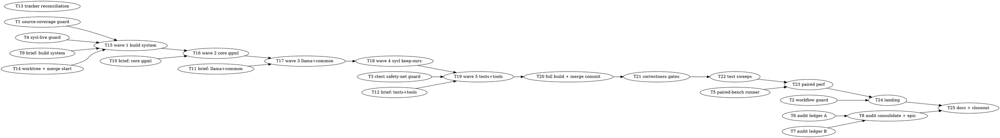

# Phase C Upstream Merge (b10630) Implementation Plan

> **Execution:** Use `team-driven-development` in Claude Code, `pi-team-driven-development` in pi.dev, or `codex-team-driven-development` in Codex.

**Goal:** Merge upstream ggml-org/llama.cpp tag **b10630** (`d222767c7`, 2026-08-25) into the fork's master (`35a2c86eb`) with the SYCL backend kept wholesale, upstream SYCL work audited into a post-merge porting epic, and the full certification battery green before landing.

**Architecture:** Single `git merge b10630` on branch `merge/upstream-b10630` in a dedicated worktree (`/Apps/llama.cpp-merge-b10630`), conflicts resolved in five ordered waves (build system → core ggml → src/llama+common → sycl keep-ours → tests/tools), full build green before the merge commit finalizes, then the GPU battery on the committed branch with fix-forward follow-ups. Four RED-proven trap guards (source coverage, workflow state, ctest safety net, SYCL-live build) run at their assigned checkpoints. Landing = fast-forward/merge into master in the main checkout + push + workflow disable loop.

**Tech Stack:** git (merge machinery), bash guard scripts, existing gates (`llama-completion`, `llama-cli`, `test-llama-archs`, `test-backend-ops`, `ctest`), `scripts/bench-guard.sh`, `scripts/parse-sycl-bench-matrix.py`, `gh` CLI, codescout `task_*` tracker.

**Test Infrastructure:** Guard scripts are TDD'd against synthetic fixtures (overridable inputs, no GPU — subagent-safe, modeled on `scripts/bench-guard.sh`'s `--sysfs-card/--meminfo` override pattern). Merge waves are verified by wave-boundary configure/build checks. The battery is the repo's canonical gate set (CLAUDE.md "Verification Commands & Correctness Gates") plus the paired-perf matrix (`docs/backend/sycl-perf-baselines.md`).

**Measured surface (verified live 2026-08-25):** upstream 702 commits ahead of merge-base `81ff7abe5`; 1,764 upstream-touched files; fork 3,593 commits / ~996K insertions since the fork point; true conflict surface = 100 both-touched files — 31 in `ggml/src/ggml-sycl/`, 69 outside. Upstream sycl delta +6,462/−547 over 48 files (49 commits). Both sides' `ggml/src/ggml-sycl/CMakeLists.txt` use `file(GLOB "*.cpp")` at top level (fork :45/:83, upstream :26/:27) but upstream added `template-instances/` sub-globs and the fork's file diverges massively — the GLOB trap is live. Workflow files: 51 on both sides today (count is re-derived at runtime, never assumed).

---

## Team Topology

**Recommended implementers:** 3–4 concurrent for Tracks G/A/B/T (none of these build or touch the GPU); Track M is **lead-only, strictly serial** (every build in the merge worktree, every GPU step, the merge itself, landing).
**Reviewers:** spec + quality, spawned FRESH per review.

### Parallel Tracks

| Track | Tasks | Description |
|-------|-------|-------------|
| G | 1, 2, 3, 4, 5 | Trap-guard scripts + paired-bench runner (TDD, fixture-driven, no GPU) |
| A | 6, 7, 8 | Upstream-SYCL audit ledger + "Phase C ports" epic |
| B | 9, 10, 11, 12 | Per-file conflict-resolution briefs (analysis only, no edits) |
| T | 13 | Tracker reconciliation packet (HM-tree closure vs the 2026-08-25 ship) |
| M | 14–25 | Merge execution, battery, landing — **lead-only, serial** |

### Dependency Graph



### File Ownership Map

| File/Directory | Tasks | Conflict Risk |
|----------------|-------|---------------|
| `scripts/check-merge-source-coverage.sh` + fixture | 1 | None |
| `scripts/check-fork-workflows-disabled.sh` + fixture | 2 | None |
| `scripts/check-ctest-safety-net.sh` + fixture | 3 | None |
| `scripts/check-sycl-build-live.sh` + fixture | 4 | None |
| `scripts/run-merge-perf-pairs.sh` + fixture | 5 | None |
| `docs/merge/upstream-b10630-sycl-audit-a.md` | 6 | None |
| `docs/merge/upstream-b10630-sycl-audit-b.md` | 7 | None |
| `docs/merge/upstream-b10630-sycl-audit.md` | 8 | None (after 6, 7) |
| `docs/merge/briefs/build-system.md` | 9 | None |
| `docs/merge/briefs/core-ggml.md` | 10 | None |
| `docs/merge/briefs/llama-common.md` | 11 | None |
| `docs/merge/briefs/tests-tools.md` | 12 | None |
| tracker only (no files) | 13 | None |
| `/Apps/llama.cpp-merge-b10630` (entire worktree) | 14–23 | Lead-only serial |
| `/Apps/llama.cpp` master + fork remote | 24, 25 | Lead-only serial |

**Commit discipline for Tracks G/A/B:** all subagent tasks commit in the **shared checkout** (`/Apps/llama.cpp`) on master, path-scoped (`git add <exact files>` then verify `git show --stat HEAD` lists only them). BUILD.lock is required **before the first Edit** in the shared checkout, per the lock protocol (atomic `mkdir`, holder file, read holder before any `rm`). None of these tasks build, so hold time is short. Track M works only in the merge worktree — no BUILD.lock needed there; GPU.lock is global always.

---

## Pre-flight (lead, before spawning anything)

1. `source /opt/intel/oneapi/setvars.sh --force` — in EVERY shell that will configure or build, always. A post-commit reconfigure without it is destructive (rewrites CMakeCache, resets `GGML_SYCL=OFF`).
2. `df -h /` — require ≥ 60G free before any build wave; past ENOSPC events disguised themselves as compiler errors.
3. `pgrep -af 'ninja|icpx|llama-'` — no strays; SIGKILL (not SIGTERM) any stale `llama-*` tenant.
4. Confirm master is `35a2c86eb` and `ggml-org/master` = `d222767c7` = tag `b10630` (`git tag -l b10630 --format='%(objectname)'` → dereference: `git rev-parse b10630^{commit}`).

---

### Task 1: Source-coverage guard (GLOB trap)

> **SNIPPET DRIFT (post-execution, llama.cpp-gdw4 c-iczq):** the code blocks below are the
> PRE-fix drafts. The shipped `scripts/check-merge-source-coverage.sh` and `tests/merge-guards/test-source-coverage.sh`
> gained exact-rc scoring, GREEN-mock, --strict, and missing-root refusal in review; the
> shipped files are authoritative — do not re-implement from these blocks.

**Track:** G
**Depends on:** None
**File scope:**
- Create: `scripts/check-merge-source-coverage.sh`
- Create: `tests/merge-guards/test-source-coverage.sh` (RED fixture driver)

**Description:**
The merged `ggml/src/ggml-sycl/CMakeLists.txt` and `src/CMakeLists.txt` may silently drop fork-local sources (upstream `file(GLOB)` patterns swallow out-of-pattern entries — recorded lesson). This guard asserts, post-configure, that every `.c`/`.cpp` under `ggml/src/ggml-sycl/` and `src/` is referenced by `build/build.ninja`. It fails CLOSED: an empty scan is exit 2, never a pass.

**Acceptance Criteria:**
- [ ] Guard exits 0 on the current (pre-merge) tree's real `build/build.ninja`
- [ ] Guard exits 1 naming the file when one source's lines are deleted from a copy of `build.ninja` (RED proven)
- [ ] Guard exits 2 on a wrong `--repo-root` (zero files scanned) — vacuous-pass refusal proven
- [ ] Allowlist mechanism works (an allowlisted file is skipped, and the skip is counted in output)

**Implementation Guide:**

1. **Test (RED):** create `tests/merge-guards/test-source-coverage.sh`:

```bash
#!/usr/bin/env bash
# RED/GREEN driver for check-merge-source-coverage.sh. Run from repo root.
set -euo pipefail
G=scripts/check-merge-source-coverage.sh
TMP=$(mktemp -d)
trap 'rm -rf "$TMP"' EXIT
# Positive control (RED): a build.ninja missing one real sycl source must fail.
VICTIM=$(find ggml/src/ggml-sycl -maxdepth 1 -name '*.cpp' | head -1)
VICTIM_REL=${VICTIM#./}
grep -vF "$VICTIM_REL" build/build.ninja > "$TMP/broken.ninja"
if bash "$G" --build-ninja "$TMP/broken.ninja"; then
    echo "FAIL: guard passed with $VICTIM_REL unreachable"; exit 1
fi
echo "RED ok: guard fires on seeded gap"
# Vacuous-pass refusal: empty scan must be exit 2, not 0.
rc=0; bash "$G" --build-ninja build/build.ninja --repo-root "$TMP" || rc=$?
[ "$rc" -eq 2 ] || { echo "FAIL: empty scan returned $rc, want 2"; exit 1; }
echo "vacuous-refusal ok"
# GREEN: real tree passes.
bash "$G" --build-ninja build/build.ninja
echo "GREEN ok"
```

Run: `bash tests/merge-guards/test-source-coverage.sh`
Expected first run: FAIL with "scripts/check-merge-source-coverage.sh: No such file"

2. **Implement (GREEN):** create `scripts/check-merge-source-coverage.sh`:

```bash
#!/usr/bin/env bash
# Post-configure guard: every fork-local source under ggml/src/ggml-sycl/ and
# src/ must be referenced by build.ninja. Upstream file(GLOB) merges have
# silently dropped out-of-pattern sources before (CLAUDE.md / memory:
# upstream-globs-swallow-fork-local-entries). Fails closed: empty scan = exit 2.
set -euo pipefail
NINJA="build/build.ninja" ROOT="." ALLOW="scripts/merge-source-coverage-allowlist.txt"
while [ $# -gt 0 ]; do case "$1" in
    --build-ninja) NINJA="$2"; shift 2;;
    --repo-root)   ROOT="$2";  shift 2;;
    --allowlist)   ALLOW="$2"; shift 2;;
    *) echo "check-merge-source-coverage: unknown arg $1" >&2; exit 2;;
esac; done
[ -f "$NINJA" ] || { echo "MISSING build.ninja: $NINJA" >&2; exit 2; }
fail=0 checked=0 skipped=0
while IFS= read -r f; do
    rel="${f#"$ROOT"/}"
    if [ -f "$ALLOW" ] && grep -qxF "$rel" "$ALLOW"; then skipped=$((skipped+1)); continue; fi
    checked=$((checked+1))
    grep -qF "$rel" "$NINJA" || { echo "UNREACHABLE: $rel"; fail=1; }
done < <(find "$ROOT/ggml/src/ggml-sycl" "$ROOT/src" \( -name '*.cpp' -o -name '*.c' \) 2>/dev/null | sort)
if [ "$checked" -eq 0 ]; then
    echo "EMPTY SCAN (checked=0, root=$ROOT) -- refusing to pass vacuously" >&2; exit 2
fi
echo "source coverage: $checked checked, $skipped allowlisted, fail=$fail"
exit $fail
```

Also create an empty `scripts/merge-source-coverage-allowlist.txt` with a header comment (`# sources intentionally not built; one repo-relative path per line`).

Run: `bash tests/merge-guards/test-source-coverage.sh`
Expected: `RED ok` / `vacuous-refusal ok` / `GREEN ok` (if GREEN reports a genuinely unbuilt pre-existing source, add it to the allowlist with a comment — that is pre-existing state, not a merge regression).

**Commit:**
```bash
git add scripts/check-merge-source-coverage.sh scripts/merge-source-coverage-allowlist.txt tests/merge-guards/test-source-coverage.sh
git commit -m "test(merge): add RED-proven source-coverage guard for the b10630 merge"
```

**Gotchas:**
- Take `BUILD.lock` before the first edit in the shared checkout; release immediately after commit.
- `build/build.ninja` references sources as `../ggml/src/...` — the substring `grep -qF "$rel"` match is deliberate and correct; do not anchor it.
- Do NOT run any build; the existing `build/` is only read.

---

### Task 2: Workflow-state guard

**Track:** G
**Depends on:** None
**File scope:**
- Create: `scripts/check-fork-workflows-disabled.sh`
- Create: `tests/merge-guards/test-workflows-disabled.sh`

**Description:**
Upstream workflow files arrive ACTIVE on the fork after a push (recorded lesson: memory `fork-github-actions-disabled-manually`). This guard lists all workflows via `gh` and fails if any is not `disabled_manually`. Count is re-derived, never assumed (correction llama.cpp-gdw4 c-f0ft: pre-merge the REGISTERED count was 50 — 51 files minus the git-tracked bench.yml.disabled, invisible to gh's registry; post-b10630 landing it is 51 registered, all disabled). Testable offline via `--input FILE`.

**Acceptance Criteria:**
- [ ] Guard exits 1 and names the workflow on a fixture JSON with one `"state": "active"` (RED proven)
- [ ] Guard exits 2 on an empty listing (vacuous-pass refusal)
- [ ] Guard exits 0 on a fixture where all states are `disabled_manually`
- [ ] Live run against the fork passes today (all currently disabled)

**Implementation Guide:**

1. **Test (RED):** create `tests/merge-guards/test-workflows-disabled.sh`:

```bash
#!/usr/bin/env bash
set -euo pipefail
G=scripts/check-fork-workflows-disabled.sh
TMP=$(mktemp -d); trap 'rm -rf "$TMP"' EXIT
cat > "$TMP/one-active.json" <<'EOF'
[{"id":1,"name":"CI","state":"disabled_manually"},{"id":2,"name":"CI (wasm)","state":"active"}]
EOF
cat > "$TMP/all-off.json" <<'EOF'
[{"id":1,"name":"CI","state":"disabled_manually"},{"id":2,"name":"CI (wasm)","state":"disabled_manually"}]
EOF
echo '[]' > "$TMP/empty.json"
if bash "$G" --input "$TMP/one-active.json"; then echo "FAIL: passed with an active workflow"; exit 1; fi
echo "RED ok"
rc=0; bash "$G" --input "$TMP/empty.json" || rc=$?
[ "$rc" -eq 2 ] || { echo "FAIL: empty listing returned $rc, want 2"; exit 1; }
echo "vacuous-refusal ok"
bash "$G" --input "$TMP/all-off.json"
echo "GREEN ok"
```

Expected first run: FAIL (guard script absent).

2. **Implement (GREEN):** create `scripts/check-fork-workflows-disabled.sh`:

```bash
#!/usr/bin/env bash
# All GitHub workflows on the fork must be state=disabled_manually (owner
# ruling 2026-08-20; upstream merges bring new workflows back ACTIVE).
# Offline-testable via --input FILE (JSON array of {id,name,state}).
set -euo pipefail
REPO="kainlan/llama.cpp-intel-optimizations" INPUT=""
while [ $# -gt 0 ]; do case "$1" in
    --repo)  REPO="$2";  shift 2;;
    --input) INPUT="$2"; shift 2;;
    *) echo "check-fork-workflows-disabled: unknown arg $1" >&2; exit 2;;
esac; done
if [ -n "$INPUT" ]; then json=$(cat "$INPUT")
else json=$(gh workflow list --repo "$REPO" --all --limit 200 --json id,name,state); fi
total=$(jq 'length' <<<"$json")
[ "$total" -gt 0 ] || { echo "EMPTY workflow listing -- refusing to pass vacuously" >&2; exit 2; }
active=$(jq -r '.[] | select(.state != "disabled_manually") | "\(.id)\t\(.state)\t\(.name)"' <<<"$json")
echo "workflows: $total total"
if [ -n "$active" ]; then printf 'NOT DISABLED:\n%s\n' "$active"; exit 1; fi
echo "all $total workflows disabled_manually"
```

Run: `bash tests/merge-guards/test-workflows-disabled.sh` → RED ok / vacuous-refusal ok / GREEN ok.
Then live: `bash scripts/check-fork-workflows-disabled.sh` → `all 51 workflows disabled_manually` (or the true current count).

**Commit:**
```bash
git add scripts/check-fork-workflows-disabled.sh tests/merge-guards/test-workflows-disabled.sh
git commit -m "test(merge): add RED-proven fork-workflow-disabled guard"
```

**Gotchas:**
- BUILD.lock for the shared-checkout edits.
- The disable loop itself (used at T24) is: `for id in $(gh workflow list --repo kainlan/llama.cpp-intel-optimizations --limit 200 --json id --jq '.[].id'); do gh workflow disable "$id" --repo kainlan/llama.cpp-intel-optimizations; done` — the guard verifies, it does not disable.
- `gh workflow disable` on an already-disabled workflow errors harmlessly; the loop may print errors for already-disabled entries — the guard afterward is the authority.

---

### Task 3: ctest safety-net guard

**Track:** G
**Depends on:** None
**File scope:**
- Create: `scripts/check-ctest-safety-net.sh`
- Create: `tests/merge-guards/test-ctest-safety-net.sh`

**Description:**
The `-j 1` OOM safety net depends on (a) the `cache|mem-handle` label family still selecting ≥1 test and (b) the documented filtered sweep actually excluding `test-backend-ops`. Upstream's `tests/CMakeLists.txt` merge can silently strip labels (registration is upstream code; labels are fork-added). Testable via `--ctest-cmd` pointing at a mock.

**Acceptance Criteria:**
- [ ] Guard exits 1 when the mock ctest returns zero tests for `-L 'cache|mem-handle'` (RED proven)
- [ ] Guard exits 1 when the mock's filtered listing still contains `test-backend-ops`
- [ ] Guard exits 0 against the real pre-merge `build/`

**Implementation Guide:**

1. **Test (RED):** create `tests/merge-guards/test-ctest-safety-net.sh`:

```bash
#!/usr/bin/env bash
set -euo pipefail
G=scripts/check-ctest-safety-net.sh
TMP=$(mktemp -d); trap 'rm -rf "$TMP"' EXIT
# Mock 1: label net empty (no "  Test #" lines for -L), sweep clean.
cat > "$TMP/ctest-nolabel" <<'EOF'
#!/usr/bin/env bash
for a in "$@"; do [ "$a" = "-L" ] && exec echo "Total Tests: 0"; done
echo "  Test #1: test-something"
EOF
# Mock 2: label net ok, but sweep leaks backend-ops.
cat > "$TMP/ctest-leak" <<'EOF'
#!/usr/bin/env bash
for a in "$@"; do [ "$a" = "-L" ] && { echo "  Test #5: test-unified-cache-x"; exit 0; }; done
echo "  Test #9: test-backend-ops"
EOF
chmod +x "$TMP"/ctest-*
if bash "$G" --ctest-cmd "$TMP/ctest-nolabel"; then echo "FAIL: passed with empty label net"; exit 1; fi
echo "RED-1 ok (empty label net caught)"
if bash "$G" --ctest-cmd "$TMP/ctest-leak"; then echo "FAIL: passed with backend-ops leak"; exit 1; fi
echo "RED-2 ok (sweep leak caught)"
bash "$G" --build-dir build
echo "GREEN ok"
```

Expected first run: FAIL (guard absent).

2. **Implement (GREEN):** create `scripts/check-ctest-safety-net.sh`:

```bash
#!/usr/bin/env bash
# The -j1 OOM safety net has two label-dependent halves; both fail OPEN if a
# merge strips labels (CLAUDE.md "Running Tests"). Verify them explicitly.
set -euo pipefail
BUILD="build" CTEST="ctest"
while [ $# -gt 0 ]; do case "$1" in
    --build-dir) BUILD="$2"; shift 2;;
    --ctest-cmd) CTEST="$2"; shift 2;;
    *) echo "check-ctest-safety-net: unknown arg $1" >&2; exit 2;;
esac; done
sel=$("$CTEST" --test-dir "$BUILD" -N -L 'cache|mem-handle' 2>/dev/null | grep -c '^  Test' || true)
if [ "$sel" -lt 1 ]; then echo "LABEL NET EMPTY: -L 'cache|mem-handle' selects $sel tests"; exit 1; fi
leak=$("$CTEST" --test-dir "$BUILD" -N -LE 'residency|mem-handle|cache' -E '^test-backend-ops$' 2>/dev/null | grep -c 'backend-ops' || true)
if [ "$leak" -ne 0 ]; then echo "SWEEP LEAK: filtered sweep still lists backend-ops ($leak lines)"; exit 1; fi
echo "safety net intact: $sel labelled tests; sweep excludes backend-ops"
```

Run the driver → RED-1 ok / RED-2 ok / GREEN ok.

**Commit:**
```bash
git add scripts/check-ctest-safety-net.sh tests/merge-guards/test-ctest-safety-net.sh
git commit -m "test(merge): add RED-proven ctest label/exclusion safety-net guard"
```

**Gotchas:**
- BUILD.lock for shared-checkout edits. The GREEN half reads the existing `build/` only — no build, no GPU.
- Mock ctest receives `--test-dir build -N …` before the flag it keys on; scan `"$@"` (as the fixtures do), don't assume position.

---

### Task 4: SYCL-live build guard

> **SNIPPET DRIFT (post-execution, llama.cpp-gdw4 c-iczq):** the code blocks below are the
> PRE-fix drafts. The shipped `scripts/check-sycl-build-live.sh` and `tests/merge-guards/test-sycl-build-live.sh`
> gained exact-rc scoring, GREEN-mock, --strict, and missing-root refusal in review; the
> shipped files are authoritative — do not re-implement from these blocks.

**Track:** G
**Depends on:** None
**File scope:**
- Create: `scripts/check-sycl-build-live.sh`
- Create: `tests/merge-guards/test-sycl-build-live.sh`

**Description:**
A reconfigure without oneAPI sourced silently resets `GGML_SYCL=OFF`; the gates then pass on CPU at ~13x slower and prove nothing (recorded 2026-07-25 incident). This scripts the CLAUDE.md check: `GGML_SYCL:BOOL=ON` in CMakeCache AND ≥2 SYCL libs in `ldd llama-completion`. Runs after EVERY configure in Track M, before any gate is trusted.

**Acceptance Criteria:**
- [ ] Exits 1 on a fixture cache containing `GGML_SYCL:BOOL=OFF` (RED proven)
- [ ] Exits 1 when the ldd mock reports zero SYCL libs (RED proven)
- [ ] Exits 0 against the real pre-merge `build/`

**Implementation Guide:**

1. **Test (RED):** `tests/merge-guards/test-sycl-build-live.sh`:

```bash
#!/usr/bin/env bash
set -euo pipefail
G=scripts/check-sycl-build-live.sh
TMP=$(mktemp -d); trap 'rm -rf "$TMP"' EXIT
mkdir -p "$TMP/off/bin"; echo 'GGML_SYCL:BOOL=OFF' > "$TMP/off/CMakeCache.txt"; touch "$TMP/off/bin/llama-completion"
if bash "$G" --build-dir "$TMP/off"; then echo "FAIL: passed with GGML_SYCL=OFF"; exit 1; fi
echo "RED-1 ok (cache OFF caught)"
mkdir -p "$TMP/nolib/bin"; echo 'GGML_SYCL:BOOL=ON' > "$TMP/nolib/CMakeCache.txt"; touch "$TMP/nolib/bin/llama-completion"
cat > "$TMP/ldd-none" <<'EOF'
#!/usr/bin/env bash
echo "libc.so.6 => /lib/x86_64-linux-gnu/libc.so.6"
EOF
chmod +x "$TMP/ldd-none"
if bash "$G" --build-dir "$TMP/nolib" --ldd-cmd "$TMP/ldd-none"; then echo "FAIL: passed with no SYCL libs"; exit 1; fi
echo "RED-2 ok (missing SYCL libs caught)"
bash "$G" --build-dir build
echo "GREEN ok"
```

Expected first run: FAIL (guard absent).

2. **Implement (GREEN):** `scripts/check-sycl-build-live.sh`:

```bash
#!/usr/bin/env bash
# CPU-fallback blindness check (CLAUDE.md "Verification Commands"): a build
# with GGML_SYCL silently OFF passes every token gate on CPU. Run after every
# configure, before trusting any gate.
set -euo pipefail
BUILD="build" LDD="ldd"
while [ $# -gt 0 ]; do case "$1" in
    --build-dir) BUILD="$2"; shift 2;;
    --ldd-cmd)   LDD="$2";   shift 2;;
    *) echo "check-sycl-build-live: unknown arg $1" >&2; exit 2;;
esac; done
grep -q '^GGML_SYCL:BOOL=ON' "$BUILD/CMakeCache.txt" \
    || { echo "GGML_SYCL is not ON in $BUILD/CMakeCache.txt"; exit 1; }
n=$("$LDD" "$BUILD/bin/llama-completion" 2>/dev/null | grep -cE 'libggml-sycl|libsycl' || true)
[ "$n" -ge 2 ] || { echo "SYCL libs not linked (ldd count=$n, want >=2)"; exit 1; }
echo "SYCL live: cache ON, ldd count=$n"
```

Run the driver → RED-1 ok / RED-2 ok / GREEN ok.

**Commit:**
```bash
git add scripts/check-sycl-build-live.sh tests/merge-guards/test-sycl-build-live.sh
git commit -m "test(merge): add RED-proven SYCL-live (CPU-fallback) build guard"
```

**Gotchas:** BUILD.lock for shared-checkout edits. GREEN needs the real `build/bin/llama-completion` to exist — it does on the current tree; if a concurrent task has broken `build/`, report rather than rebuild (subagents do not build).

---

### Task 5: Paired-bench runner

**Track:** G
**Depends on:** None
**File scope:**
- Create: `scripts/run-merge-perf-pairs.sh`
- Create: `tests/merge-guards/test-perf-pairs.sh`

**Description:**
The merge bar's perf check is an interleaved paired A/B: pre-merge master binary vs merge-branch binary, alternating per run, 5 pairs per arm, 4 arms (B70/B50 × Mistral/GPT-OSS), each run through `scripts/bench-guard.sh` with a log. Log naming feeds `scripts/parse-sycl-bench-matrix.py`: candidate logs `<arm>-<n>.log` (parser's `--dir` glob), baseline logs `<arm>-pre-<n>.log` (fed via the parser's explicit `--arm <arm>=f1,...,f5` form). This task builds the runner and proves the interleave order and naming with a mock bench wrapper — no GPU.

**Acceptance Criteria:**
- [ ] With a mock wrapper, invocation order is strictly pre-1, cand-1, pre-2, cand-2, … (RED proves a shuffled expectation fails; GREEN the real order)
- [ ] Log names match `<arm>-pre-<n>.log` / `<arm>-<n>.log` exactly
- [ ] Unknown arm name → exit 2
- [ ] Arm → selector/model mapping matches the table in this task verbatim

**Implementation Guide:**

Arm table (fixed, from CLAUDE.md device map + perf-baselines):

| arm | `ONEAPI_DEVICE_SELECTOR` | model |
|-----|--------------------------|-------|
| `b70-mistral` | `level_zero:0` | `/models/mistral-7b-v0.1.Q4_0.gguf` |
| `b70-gptoss` | `level_zero:0` | `/models/gpt-oss-20b-mxfp4.gguf` |
| `b50-mistral` | `level_zero:1` | `/models/mistral-7b-v0.1.Q4_0.gguf` |
| `b50-gptoss` | `level_zero:1` | `/models/gpt-oss-20b-mxfp4.gguf` |

1. **Test (RED):** `tests/merge-guards/test-perf-pairs.sh`:

```bash
#!/usr/bin/env bash
set -euo pipefail
R=scripts/run-merge-perf-pairs.sh
TMP=$(mktemp -d); trap 'rm -rf "$TMP"' EXIT
cat > "$TMP/mock-wrap" <<EOF
#!/usr/bin/env bash
# mock bench-guard: record --log value and the binary, do no GPU work
log=""; while [ \$# -gt 0 ]; do case "\$1" in
  --log) log="\$2"; shift 2;; --budget) shift 2;; --) shift; break;; *) shift;;
esac; done
echo "\$(basename "\$log") \$1" >> "$TMP/sequence.txt"
touch "\$log"
EOF
chmod +x "$TMP/mock-wrap"
bash "$R" --arm b50-mistral --a-bin /bin/pre-bench --b-bin /bin/cand-bench \
    --outdir "$TMP/logs" --pairs 3 --bench-wrap "$TMP/mock-wrap"
expected="b50-mistral-pre-1.log /bin/pre-bench
b50-mistral-1.log /bin/cand-bench
b50-mistral-pre-2.log /bin/pre-bench
b50-mistral-2.log /bin/cand-bench
b50-mistral-pre-3.log /bin/pre-bench
b50-mistral-3.log /bin/cand-bench"
diff <(echo "$expected") "$TMP/sequence.txt" || { echo "FAIL: order/naming wrong"; exit 1; }
echo "interleave+naming ok"
rc=0; bash "$R" --arm b99-nope --a-bin /bin/a --b-bin /bin/b --outdir "$TMP/x" --pairs 1 --bench-wrap "$TMP/mock-wrap" || rc=$?
[ "$rc" -eq 2 ] || { echo "FAIL: unknown arm returned $rc, want 2"; exit 1; }
echo "unknown-arm ok"
```

Expected first run: FAIL (runner absent).

2. **Implement (GREEN):** `scripts/run-merge-perf-pairs.sh`:

```bash
#!/usr/bin/env bash
# Interleaved paired A/B llama-bench for merge certification. One arm per
# invocation; A = pre-merge binary, B = candidate. Every run goes through
# bench-guard (preflight refusal + VALID/SUSPECT stamping). Log naming feeds
# parse-sycl-bench-matrix.py: candidate <arm>-<n>.log, baseline <arm>-pre-<n>.log.
set -euo pipefail
ARM="" A_BIN="" B_BIN="" OUT="" PAIRS=5 WRAP="scripts/bench-guard.sh" BUDGET=1200
while [ $# -gt 0 ]; do case "$1" in
    --arm)        ARM="$2";    shift 2;;
    --a-bin)      A_BIN="$2";  shift 2;;
    --b-bin)      B_BIN="$2";  shift 2;;
    --outdir)     OUT="$2";    shift 2;;
    --pairs)      PAIRS="$2";  shift 2;;
    --bench-wrap) WRAP="$2";   shift 2;;
    --budget)     BUDGET="$2"; shift 2;;
    *) echo "run-merge-perf-pairs: unknown arg $1" >&2; exit 2;;
esac; done
case "$ARM" in
    b70-mistral) SEL=level_zero:0; MODEL=/models/mistral-7b-v0.1.Q4_0.gguf;;
    b70-gptoss)  SEL=level_zero:0; MODEL=/models/gpt-oss-20b-mxfp4.gguf;;
    b50-mistral) SEL=level_zero:1; MODEL=/models/mistral-7b-v0.1.Q4_0.gguf;;
    b50-gptoss)  SEL=level_zero:1; MODEL=/models/gpt-oss-20b-mxfp4.gguf;;
    *) echo "unknown arm '$ARM' (b70-mistral|b70-gptoss|b50-mistral|b50-gptoss)" >&2; exit 2;;
esac
[ -n "$A_BIN" ] && [ -n "$B_BIN" ] && [ -n "$OUT" ] || { echo "need --a-bin --b-bin --outdir" >&2; exit 2; }
mkdir -p "$OUT"
for i in $(seq 1 "$PAIRS"); do
    for side in pre cand; do
        if [ "$side" = pre ]; then bin=$A_BIN; log="$OUT/$ARM-pre-$i.log"
        else                        bin=$B_BIN; log="$OUT/$ARM-$i.log"; fi
        ONEAPI_DEVICE_SELECTOR=$SEL "$WRAP" --budget "$BUDGET" --log "$log" -- \
            "$bin" -m "$MODEL" -p 512 -n 128 -fa 1 -r 5 -v
    done
done
echo "arm $ARM: $PAIRS pairs complete in $OUT"
```

Run the driver → `interleave+naming ok` / `unknown-arm ok`.

**Commit:**
```bash
git add scripts/run-merge-perf-pairs.sh tests/merge-guards/test-perf-pairs.sh
git commit -m "test(merge): add interleaved paired-bench runner with mock-proven ordering"
```

**Gotchas:**
- BUILD.lock for shared-checkout edits. The mock never touches a GPU — keep it that way; the real invocation is T23, lead-only, `run_in_background`.
- `bench-guard.sh` derives the card from an EXACT selector match (`level_zero:0` or `level_zero:1`) — the arm table already complies; never pass a multi-device selector.
- The B70 GPT-OSS run can exceed 900 s under ambient load — hence `--budget 1200` default.

---

### Task 6: Upstream-SYCL audit ledger, part A (commits 1–25)

**Track:** A
**Depends on:** None
**File scope:**
- Create: `docs/merge/upstream-b10630-sycl-audit-a.md`

**Description:**
Classify the first 25 of the 49 upstream commits touching `ggml/src/ggml-sycl` (ordered `git rev-list --reverse 81ff7abe5..b10630 -- ggml/src/ggml-sycl`) into **port-candidate** / **superseded** / **N/A**, so keep-ours resolution discards nothing silently. Analysis only — no source edits.

**Acceptance Criteria:**
- [ ] Exactly the first 25 SHAs from the rev-list command, in order, each with: SHA, title, files touched, classification, 1–3 sentence rationale
- [ ] Every **port-candidate** names its fork-side landing zone (file, and function if identifiable)
- [ ] Zero commits skipped; a count line at the top (`25 commits: N port-candidate / N superseded / N n-a`) that matches the entries

**Implementation Guide:**

1. Enumerate: `git rev-list --reverse 81ff7abe5..b10630 -- ggml/src/ggml-sycl | head -25`
2. For each SHA: `git show --stat <sha>` and `git show <sha> -- ggml/src/ggml-sycl` (read the actual diff, not just the title).
3. Classification rubric (apply in this order):
   - **N/A** — the change targets something the fork's design forbids or removed entirely: direct `sycl::malloc_*`/side-cache allocation patterns (canonical memory contract), paths only reachable on hardware this fork does not run, upstream-only build modes.
   - **Superseded** — touches a subsystem the fork rewrote wholesale: mul_mat dispatch, fattn, memory/allocation, graph replay, mmvq/mmq kernel organization. Verify by checking whether the upstream hunk's context lines still exist in the fork's file (`cat ggml/src/ggml-sycl/<file> | grep -nF '<distinctive context line>'` — for `ggml-sycl.cpp` use the piped-grep form; codescout is blind in that file).
   - **Port-candidate** — a correctness fix or table addition to code the fork retains in recognizable form (dequant tables in `dequantize.hpp`/`convert.cpp`, `quants.hpp` offsets, `common.hpp` shared types, `vecdotq.hpp` shared dot-product helpers, element-wise ops), or a new capability worth a fork-native reimplementation (e.g. upstream's `topk-moe.hpp` fused top-k — the fork has its own MoE routing, so this is likely superseded, but decide from the diff, not the name).

   **Ownership screen, applied across all three classes (owner directive 2026-08-25, epic comment c-j62d):** upstream code that allocates outside unified-cache surfaces (`sycl::malloc_*`, raw TLSF, side caches/pools/scratch), keys identity on raw device pointers, or lets a pointer outlive its owner is NEVER a port-candidate *as written*; forced-eviction / forced-reap / zone-reset reclamation is **N/A by design** (zone reset is being eliminated; refcounted `mem_handle` release is the sole reclamation model). Valuable allocating functionality is still classified port-candidate, but the entry MUST carry "requires re-expression through `unified_allocate`/`unified_allocate_owner` → `mem_handle`; verbatim port forbidden by the canonical contract", and the landing zone names the sanctioned surface consumed. Authorities: CLAUDE.md "SYCL Memory Ownership", `docs/design/sycl-canonical-memory-architecture.md`, `docs/backend/sycl-memory-design.md`.
4. Write entries in this exact format:

```markdown
### <n>. `<sha12>` — <commit title>
**Files:** <comma-separated>
**Class:** port-candidate | superseded | n-a
**Why:** <1–3 sentences grounded in the diff>
**Landing zone (port-candidates only):** <fork file / function>
```

**Commit:**
```bash
git add docs/merge/upstream-b10630-sycl-audit-a.md
git commit -m "docs(merge): audit ledger A — upstream sycl commits 1-25 of 49 classified"
```

**Gotchas:**
- BUILD.lock before editing in the shared checkout.
- codescout's index is blind inside `ggml-sycl.cpp` — use `cat … | grep -n` there.
- Do not classify from the commit title; the diff is the evidence. A "fix" title can be superseded; a "feature" title can contain a shared-table correctness fix.

---

### Task 7: Upstream-SYCL audit ledger, part B (commits 26–49)

**Track:** A
**Depends on:** None
**File scope:**
- Create: `docs/merge/upstream-b10630-sycl-audit-b.md`

**Description:** Identical to Task 6 for the remaining 24 commits: `git rev-list --reverse 81ff7abe5..b10630 -- ggml/src/ggml-sycl | tail -n +26`. Same rubric, same entry format, same acceptance bar (24 entries, count line, landing zones for port-candidates).

**Commit:**
```bash
git add docs/merge/upstream-b10630-sycl-audit-b.md
git commit -m "docs(merge): audit ledger B — upstream sycl commits 26-49 of 49 classified"
```

**Gotchas:** Same as Task 6. Also: several late upstream commits add whole new files (`topk-moe.hpp`, `set_rows` variants, `vecdotq.hpp` growth) — a new file is classified against the fork subsystem it would slot into, not "N/A because we don't have it".

---

### Task 8: Consolidate audit + file the "Phase C ports" epic

**Track:** A
**Depends on:** Tasks 6, 7
**File scope:**
- Create: `docs/merge/upstream-b10630-sycl-audit.md`
- Tracker: new epic + one task per port-candidate

**Description:**
Merge parts A and B into the single committed ledger, cross-check counts (25+24=49, classifications sum), create tracker epic `EPIC: Phase C upstream-SYCL ports (post-merge)` via `task_create`, and file one `task_create` ticket per port-candidate (title = upstream SHA + subject; description = ledger entry verbatim + landing zone), each `task_dep`-linked to the epic. Record every created ID back into the ledger.

**Acceptance Criteria:**
- [ ] `docs/merge/upstream-b10630-sycl-audit.md` holds all 49 entries + summary table
- [ ] Tracker epic exists; every port-candidate has a ticket with a `task_dep` edge to the epic; each ticket names the sanctioned ownership surface (`mem_handle` lease / `alloc_owner` / cache materialization helper) its port consumes and carries the re-expression note where the ownership screen applies (owner directive, epic comment c-j62d)
- [ ] Ledger lists each ticket ID next to its entry (IDs cited from a **previous** tool block, never the same one that created them — recorded lesson)
- [ ] Parts A/B files are removed in the same commit (content absorbed)

**Commit:**
```bash
git add docs/merge/upstream-b10630-sycl-audit.md
git rm docs/merge/upstream-b10630-sycl-audit-a.md docs/merge/upstream-b10630-sycl-audit-b.md
git commit -m "docs(merge): consolidated 49-commit upstream sycl audit + Phase C ports epic filed"
```

**Gotchas:** BUILD.lock for the checkout edits. Never cite a tracker ID in the same tool block that created it. If parts A and B disagree on a duplicate commit (boundary off-by-one), re-derive the split from the rev-list command — do not hand-reconcile.

---

### Task 9: Conflict brief — build system

**Track:** B
**Depends on:** None
**File scope:**
- Create: `docs/merge/briefs/build-system.md`

**Description:**
Pre-merge analysis of every both-touched build-system file so wave 1 (T15) is mechanical. Derive the file group live:

```bash
comm -12 <(git diff --name-only 81ff7abe5 master | LC_ALL=C sort) \
         <(git diff --name-only 81ff7abe5 b10630 | LC_ALL=C sort) \
  | grep -E 'CMakeLists\.txt|\.cmake$|^scripts/|^\.github/'
```

For each file, read both sides' deltas (`git diff 81ff7abe5..master -- <f>` and `git diff 81ff7abe5..b10630 -- <f>`) and write: each side's intent, the recommended resolution (ours / theirs / interleave with the specific hunks named), and any fork-local source registration that a naive upstream take would drop (the GLOB trap — `ggml/src/ggml-sycl/CMakeLists.txt` especially: the fork's file registers test executables and fork-only sources far beyond upstream's :26/:27 GLOBs).

**Acceptance Criteria:**
- [ ] Every file the derivation command prints has an entry (list the command's output at the top; entry count matches)
- [ ] `ggml/src/ggml-sycl/CMakeLists.txt`, `tests/CMakeLists.txt`, `ggml/src/CMakeLists.txt`, `src/CMakeLists.txt`, `tools/CMakeLists.txt` entries each name the fork-local registrations/labels that must survive
- [ ] `.github/workflows` entries note that resolution is content-only; runtime state is T24's disable loop
- [ ] Each entry ends with a one-line `RESOLVE:` verdict wave 1 can follow mechanically

**Commit:**
```bash
git add docs/merge/briefs/build-system.md
git commit -m "docs(merge): wave-1 build-system conflict brief"
```

**Gotchas:** BUILD.lock for the edit. Analysis only — no resolution edits. Where `tests/CMakeLists.txt` is concerned, the fork's `LABELS` and `SKIP_RETURN_CODE 77` properties are the safety net T3 guards — enumerate them explicitly in the brief.

---

### Task 10: Conflict brief — core ggml

**Track:** B
**Depends on:** None
**File scope:**
- Create: `docs/merge/briefs/core-ggml.md`

**Description:**
Same method as Task 9 for the group:

```bash
comm -12 <(git diff --name-only 81ff7abe5 master | LC_ALL=C sort) \
         <(git diff --name-only 81ff7abe5 b10630 | LC_ALL=C sort) \
  | grep -E '^ggml/' | grep -vE '^ggml/src/ggml-sycl/|CMakeLists\.txt|\.cmake$'
```

(≈ `ggml.c`, `ggml-backend.cpp`, `ggml-backend-meta.cpp`, `ggml-backend-reg.cpp`, `ggml-alloc.c`, `ggml/include/*.h`, `ggml-cpu/*`, plus other-backend files the fork touched mechanically.) For each: both sides' intent, `RESOLVE:` verdict, and — the critical extra — a **CONTRACT:** line flagging any upstream change to an interface the fork's SYCL backend consumes: backend-API signatures (`ggml-backend.h`), `ggml_tensor` fields (`ggml.h`), graph-build hooks, scheduler callbacks, alloc interfaces. A contract change merges clean in the header and detonates in `ggml-sycl.cpp` at wave-2 build or (worse) at the gates.

**Acceptance Criteria:**
- [ ] Every derived file has an entry; count line matches
- [ ] Every entry has `RESOLVE:` and `CONTRACT:` lines (`CONTRACT: none` is an explicit finding, not an omission)
- [ ] Other-backend files (cuda/metal/vulkan/cann/…) checked for whether the fork's touch was a mechanical rename that upstream's version needs re-applied — verdict stated per file

**Commit:**
```bash
git add docs/merge/briefs/core-ggml.md
git commit -m "docs(merge): wave-2 core-ggml conflict brief with contract-change flags"
```

**Gotchas:** BUILD.lock. Where the fork's side of a diff is huge (e.g. `ggml.c`), diff hunk-by-hunk (`git diff 81ff7abe5..master -- ggml/src/ggml.c | grep -n '^@@'` to enumerate) rather than eyeballing; the brief lists hunk ranges by side.

---

### Task 11: Conflict brief — src/llama + common

**Track:** B
**Depends on:** None
**File scope:**
- Create: `docs/merge/briefs/llama-common.md`

**Description:**
Same method, group `^src/|^common/` (minus CMakeLists — Task 9 owns those): `llama-context`, `llama-graph`, `llama-kv-cache`, `llama-model`, `llama-model-loader`, `llama-sampler`, `llama-memory-recurrent`, `llama.cpp`, `common/{arg,chat,common,fit,sampling}`. The fork's load-bearing behaviors that must survive, called out per entry where relevant: the disabled upstream context-fitter (`fit_params=false` under SYCL — see llama.cpp-uize context), the fork's model-loader tensor-classification (`llama-tensor-class.*` fork-only, but its call sites in `llama-model-loader.cpp` are both-touched), the fork's MoE profile plumbing (`llama-moe-profile.*` call sites), and `common/arg.cpp` metadata-only parsing guarantees (`test-arg-parser` gates them).

**Acceptance Criteria:**
- [ ] Every derived file has an entry with `RESOLVE:` and `CONTRACT:` lines
- [ ] The four fork behaviors above each traced to their both-touched call sites, with the hunks that protect them named
- [ ] `src/CMakeLists.txt:9` GLOB (`models/*.cpp`) interaction noted for any upstream model-file additions

**Commit:**
```bash
git add docs/merge/briefs/llama-common.md
git commit -m "docs(merge): wave-3 llama/common conflict brief"
```

**Gotchas:** BUILD.lock. Upstream renamed/split files in `src/` repeatedly this period — check `git diff --name-status 81ff7abe5..b10630 -- src/ | grep -E '^[RD]'` and give every rename/delete an explicit disposition in the brief.

---

### Task 12: Conflict brief — tests + tools

**Track:** B
**Depends on:** None
**File scope:**
- Create: `docs/merge/briefs/tests-tools.md`

**Description:**
Same method, group `^tests/|^tools/|^AGENTS.md`: `test-backend-ops.cpp` (fork carries the c-wps7-relevant SYCL expectations; upstream added new op tests — interleave), `test-llama-archs.cpp` (fork's exit-77 semantics and roundtrip gate must survive), `test-alloc.cpp`, `test-gguf.cpp`, `test-chat.cpp`, `test-model-load-cancel.cpp`, `test-quant-type-selection.cpp`, `tools/llama-bench/llama-bench.cpp` (fork's `-v` null-callback behavior + any fork columns), `tools/server/server-queue.cpp`, `tools/ui/*`, READMEs, `AGENTS.md`.

**Acceptance Criteria:**
- [ ] Every derived file has `RESOLVE:` + `CONTRACT:` entries
- [ ] `test-backend-ops.cpp` entry enumerates which side's test additions exist in each conflicted region (upstream's new op coverage is generally WANTED — it exercises the fork backend harder)
- [ ] `test-llama-archs.cpp` entry names the exit-77/no-row semantics hunks that must survive

**Commit:**
```bash
git add docs/merge/briefs/tests-tools.md
git commit -m "docs(merge): wave-5 tests/tools conflict brief"
```

**Gotchas:** BUILD.lock. Upstream test additions that exercise ops the fork fails-closed on (q1_0/nvfp4 oracle-gated, float MMID, iq*) will land in the c-wps7 partition at T22 — the brief should predict which new tests fall into which class so T22's scoring isn't surprised.

---

### Task 13: Tracker reconciliation packet

**Track:** T
**Depends on:** None
**File scope:** tracker only (comments, lease resets); no repo files

**Description:**
The 2026-08-25 ship (master → 35a2c86eb pushed) left the HM certification tree open in the tracker. Produce the owner-decision packet: for each of `llama.cpp-ona8`, `llama.cpp-4dhw`, `llama.cpp-bnam`, `llama.cpp-0bot`, `llama.cpp-bwmz` — read the ticket (`task_show`; pipe oversized results to a file and slice), determine whether its stated closure condition is satisfied by evidence on disk/git (e.g. `artifacts/e2e-final/`, `artifacts/hardening-merge/`, the c-wps7 partition evidence), and post ONE consolidated comment on `llama.cpp-ona8` with a per-ticket verdict: SATISFIED-BY-SHIP (cite the evidence path/SHA) / NOT-SATISFIED (name the missing evidence) / OWNER-DECISION (state the question). Additionally: for each stale lease in {36wo, mn70, uize, blvs, haqk, qvzq, twl6, fb5t, kzjv}, check `status`+`assignee`; where the assignee is a dead session agent and no commit references the ticket in the last 7 days, reset to `open` with a note (`task_update`), per the "`in_progress` is a lease" rule. Do NOT close ona8/4dhw/bwmz/0bot — closure is the owner's call on this packet.

**Acceptance Criteria:**
- [ ] One consolidated verdict comment on ona8 covering all five certification tickets, each verdict citing checkable evidence
- [ ] Every stale lease dispositioned (reset with note, or left with a reason)
- [ ] Zero tickets closed by this task

**Commit:** none (tracker-only).

**Gotchas:** `task_show` on ona8/iikr-sized tickets can exceed output limits — the tool saves to a file; slice it with python, never dump. `task_search` with `semantic=false` only. `-a`-style targeted evidence (e.g. artifacts) must be checked for non-emptiness — an empty artifacts dir means *not verified*, never "nothing observed".

---

### Task 14: Merge worktree + branch + merge start

**Track:** M (lead-only)
**Depends on:** None (T1/T4/T9 must be done before T15, not before this)
**File scope:**
- Create: worktree `/Apps/llama.cpp-merge-b10630`, branch `merge/upstream-b10630`

**Description:**
Create the merge worktree from master and open the merge. The merge stays conflicted until waves 1–5 resolve it; the merge commit is NOT created until T20's full build is green.

**Implementation Guide:**

```bash
cd /Apps/llama.cpp
git worktree add /Apps/llama.cpp-merge-b10630 -b merge/upstream-b10630 master
cd /Apps/llama.cpp-merge-b10630
git merge --no-ff b10630          # stops with conflicts — expected
git status --porcelain | grep -c '^UU\|^AA\|^DD\|^AU\|^UA\|^DU\|^UD'   # record the conflict count
git status --porcelain > /tmp/merge-conflict-census.txt   # working copy; the durable census goes in the T20 commit message
```

**Acceptance Criteria:**
- [ ] Worktree exists on `merge/upstream-b10630`; `MERGE_HEAD` = `d222767c7`
- [ ] Conflict census recorded (count + file list), posted to the campaign tracker task
- [ ] No resolution attempted in this task

**Commit:** none (the merge is open; nothing is committed until T20).

**Gotchas:**
- `df -h /` first — the worktree checkout plus its eventual `build/` needs headroom; require ≥ 60G.
- Do NOT run `git merge` in the main checkout; a shared checkout cannot host a merge (recorded lesson — `merge --abort` resets the index under live agents).
- The conflict census from `git status` is the ground truth for waves 1–5; the ~100-file both-touched estimate includes files git may auto-merge cleanly — expect the census to be smaller, and treat every auto-merged both-touched file as wave material anyway (semantic review per its brief).

---

### Task 15: Wave 1 — build system

**Track:** M (lead-only)
**Depends on:** Tasks 14, 1, 4, 9
**File scope (in the merge worktree):** every conflicted `CMakeLists.txt`, `*.cmake`, `scripts/*`, `.github/*`

**Description:**
Resolve build-system conflicts per the T9 brief (`docs/merge/briefs/build-system.md`), `git add` each resolved file, then prove the tree CONFIGURES and the source-coverage + SYCL-live guards pass.

**Implementation Guide:**

1. For each conflicted file in the group: apply the brief's `RESOLVE:` verdict; where the verdict is interleave, edit by hand following the named hunks.
2. Configure + guard (oneAPI first, always):

```bash
cd /Apps/llama.cpp-merge-b10630
source /opt/intel/oneapi/setvars.sh --force
./scripts/sycl-build.sh -r llama-completion    # reconfigure + one small target; NOT a full build
bash /Apps/llama.cpp/scripts/check-merge-source-coverage.sh --build-ninja build/build.ninja --repo-root .
bash /Apps/llama.cpp/scripts/check-sycl-build-live.sh --build-dir build
```

Expected: configure rc=0; coverage guard `fail=0`; SYCL-live guard `cache ON, ldd count>=2`.
(A first build in this worktree is near-cold for the mega-TU — ~50 min for `ggml-sycl.cpp` — run the build step `run_in_background`.)

**Acceptance Criteria:**
- [ ] Zero conflicted files remaining in the wave-1 group (`git status --porcelain | grep -E 'CMakeLists|\.cmake|^UU (scripts|\.github)'` empty)
- [ ] Both guards green on the merge worktree's fresh configure
- [ ] Any deviation from a brief verdict recorded in the wave notes (appended to the brief file in the worktree)

**Commit:** none yet (merge still open).

**Gotchas:**
- `sycl-build.sh -r` forces reconfigure — that is the moment `GGML_SYCL` can silently reset if oneAPI isn't sourced; the T4 guard after EVERY configure is non-negotiable.
- If the coverage guard names an UNREACHABLE fork file, the fix is in the merged CMakeLists (re-add the registration), never in the allowlist.
- Wave boundaries are strict: do not "quickly fix" a core-ggml conflict encountered while here; it belongs to T16.

---

### Task 16: Wave 2 — core ggml

**Track:** M (lead-only)
**Depends on:** Tasks 15, 10
**File scope (worktree):** conflicted `ggml/` files outside `ggml-sycl/` (per T10 brief)

**Description:**
Resolve per the T10 brief. Every entry whose `CONTRACT:` line is non-none gets its fork-side consumers checked immediately: `cat ggml/src/ggml-sycl/ggml-sycl.cpp | grep -n '<changed symbol>'` (piped grep — codescout is blind in that file) plus `search_code` over the rest of the backend. Where a contract changed, the fork-side adaptation is made NOW, in this wave, so the wave-boundary build stays meaningful. Upstream changes to allocation/buffer interfaces (`ggml-alloc.c`, `ggml-backend.*` — e.g. the `get_caps` / `mmap_support` additions the T10 brief flags) are additionally reviewed against the fork's ownership model (owner directive, epic comment c-j62d): SYCL-side allocations flow through the unified cache, `mem_handle` is the sole ownership token, raw pointers are transient ABI views — an upstream interface that invites direct allocation or pointer-keyed identity gets a fork-side adaptation that keeps the canonical surfaces authoritative, never a verbatim adoption.

**Implementation Guide:**

```bash
cd /Apps/llama.cpp-merge-b10630
# resolve per brief, git add each file, then:
source /opt/intel/oneapi/setvars.sh --force
./scripts/sycl-build.sh llama-completion       # wave-boundary build (background it)
bash /Apps/llama.cpp/scripts/check-sycl-build-live.sh --build-dir build
```

**Acceptance Criteria:**
- [ ] Zero conflicted files remaining under `ggml/` outside `ggml-sycl/`
- [ ] Wave-boundary build of `llama-completion` rc=0; SYCL-live guard green
- [ ] Every non-none `CONTRACT:` entry has a wave note: consumer sites found (with the grep evidence) and the adaptation made, or "no fork consumer" with the empty-grep noted as checked-with-positive-control (grep a known-present symbol first to prove the pipeline)

**Commit:** none yet.

**Gotchas:**
- An empty grep for consumers is only evidence after a positive control (an-empty-probe-result-is-not-a-measurement).
- `ggml/include/ggml.h` and `ggml-backend.h` are the highest-blast-radius files in the whole merge — resolve them first within the wave, then the .c/.cpp files against the resolved headers.
- Build failures here are wave-2 work even when the error message points into `ggml-sycl.cpp` — that is the contract detonating, and the adaptation belongs to this wave's notes.

---

### Task 17: Wave 3 — src/llama + common

**Track:** M (lead-only)
**Depends on:** Tasks 16, 11
**File scope (worktree):** conflicted `src/` and `common/` files (per T11 brief)

**Description:**
Resolve per the T11 brief, protecting the four fork behaviors it traced (context-fitter disable, tensor-class call sites, moe-profile plumbing, arg metadata-only parsing). Wave-boundary build extends to the tools: `./scripts/sycl-build.sh llama-completion llama-cli llama-bench` (backgrounded), then SYCL-live guard.

**Acceptance Criteria:**
- [ ] Zero conflicted files remaining under `src/` and `common/`
- [ ] All rename/delete dispositions from the brief applied and noted
- [ ] Wave-boundary build of the three tools rc=0; SYCL-live guard green
- [ ] `test-arg-parser` built and run (CPU-only, safe): `ctest --test-dir build -R '^test-arg-parser$' --output-on-failure` rc=0

**Commit:** none yet.

**Gotchas:**
- `common/arg.cpp` regressions surface as parser behavior, not compile errors — hence the immediate `test-arg-parser` run (it is registered CPU-only and safe in-wave).
- Upstream `src/models/*.cpp` additions are auto-captured by `src/CMakeLists.txt:9`'s GLOB and will enlarge the arch surface T21's sweep sees — expected, not a red flag.

---

### Task 18: Wave 4 — ggml-sycl keep-ours

**Track:** M (lead-only)
**Depends on:** Task 17
**File scope (worktree):** everything under `ggml/src/ggml-sycl/`

**Description:**
Mechanical keep-ours for the backend, plus the two non-mechanical halves: delete upstream's conflict-free NEW sycl files (zero unaudited kernel code ships — their content lives in the T6–T8 ledger), and verify no fork-local sycl file was lost.

**Implementation Guide:**

```bash
cd /Apps/llama.cpp-merge-b10630
# 1. conflicted sycl files -> ours:
git diff --name-only --diff-filter=U -- ggml/src/ggml-sycl/ | while read -r f; do
    git checkout --ours -- "$f"; git add "$f"; done
# 2. upstream-only additions (present in b10630, absent at merge-base AND absent in master) -> delete:
comm -13 <(git ls-tree -r --name-only master -- ggml/src/ggml-sycl/ | LC_ALL=C sort) \
         <(git ls-tree -r --name-only b10630 -- ggml/src/ggml-sycl/ | LC_ALL=C sort) \
  > /tmp/upstream-only-sycl.txt
cat /tmp/upstream-only-sycl.txt          # review, then:
while read -r f; do [ -e "$f" ] && git rm -f -- "$f"; done < /tmp/upstream-only-sycl.txt
# 3. fork-local files still present (files in master's sycl tree must all exist):
git ls-tree -r --name-only master -- ggml/src/ggml-sycl/ | while read -r f; do
    [ -e "$f" ] || echo "LOST FORK FILE: $f"; done
# 4. whole-tree identity check — the merged sycl tree must equal master's exactly:
diff <(git ls-tree -r master -- ggml/src/ggml-sycl/) \
     <(git ls-files -s -- ggml/src/ggml-sycl/ | awk '{print $1" blob "$2"\t"$4}') && echo "SYCL TREE IDENTICAL TO MASTER"
```

**Acceptance Criteria:**
- [ ] Step 4 prints `SYCL TREE IDENTICAL TO MASTER` (byte-identical tree, additions gone, nothing lost)
- [ ] `/tmp/upstream-only-sycl.txt` content recorded in the wave notes (it is the ledger's deletion cross-reference)
- [ ] Source-coverage guard re-run green after the deletions (`check-merge-source-coverage.sh`)

**Commit:** none yet.

**Gotchas:**
- `git checkout --ours` on a delete/modify conflict errors — handle rename/delete entries per the T9/T10 briefs' dispositions, not by loop.
- The step-4 identity check is the load-bearing verification; the per-file loops are just how you get there. If it fails, diff the two listings and fix the specific paths — do not weaken the check.

---

### Task 19: Wave 5 — tests + tools

**Track:** M (lead-only)
**Depends on:** Tasks 18, 12, 3
**File scope (worktree):** conflicted `tests/`, `tools/`, `AGENTS.md`

**Description:**
Resolve per the T12 brief (upstream's new op tests generally wanted; fork's exit-77/label/scoring semantics must survive), then reconfigure and run the ctest safety-net guard against the worktree build.

**Implementation Guide:**

```bash
cd /Apps/llama.cpp-merge-b10630
# resolve per brief, git add each, then:
source /opt/intel/oneapi/setvars.sh --force
./scripts/sycl-build.sh -r llama-completion     # reconfigure so CTestTestfile regenerates
bash /Apps/llama.cpp/scripts/check-ctest-safety-net.sh --build-dir build
bash /Apps/llama.cpp/scripts/check-sycl-build-live.sh --build-dir build
git status --porcelain | grep '^UU' && echo "CONFLICTS REMAIN" || echo "ALL RESOLVED"
```

**Acceptance Criteria:**
- [ ] `ALL RESOLVED` — zero conflicted files anywhere in the merge
- [ ] ctest safety-net guard green on the regenerated test registrations
- [ ] SYCL-live guard green after the reconfigure

**Commit:** none yet.

**Gotchas:**
- The safety-net guard is the whole point of this wave's ordering: labels live in `tests/CMakeLists.txt` and regenerate only on reconfigure — running the guard against a stale `CTestTestfile` verifies nothing.
- `ctest` exclusions are unanchored substrings — if upstream added a test whose name contains `backend-ops`, the guard's leak check will (correctly) flag the documented sweep for re-derivation; that is a finding, not a false positive.

---

### Task 20: Full build + merge commit finalize

**Track:** M (lead-only)
**Depends on:** Task 19
**File scope (worktree):** merge commit on `merge/upstream-b10630`

**Description:**
Full build of all targets; fix-forward any remaining compile errors (each fix noted per-file in the wave notes); when rc=0, create the merge commit carrying the conflict census and resolution summary.

**Implementation Guide:**

```bash
cd /Apps/llama.cpp-merge-b10630
source /opt/intel/oneapi/setvars.sh --force
df -h / | awk 'NR==2{print $4" free"}'        # require >= 60G
./scripts/sycl-build.sh                        # FULL build — run_in_background, ~25 min+ (near-cold worktree)
# on rc=1: fix forward; for a failure census use: ninja -C build -k 0
# when rc=0:
bash /Apps/llama.cpp/scripts/check-merge-source-coverage.sh --build-ninja build/build.ninja --repo-root .
bash /Apps/llama.cpp/scripts/check-sycl-build-live.sh --build-dir build
bash /Apps/llama.cpp/scripts/check-ctest-safety-net.sh --build-dir build
# canonical memory-contract source gates (CPU-only source asserts; owner directive, epic c-j62d):
ctest --test-dir build -R 'sycl-alloc-policy|sycl-handle-policy|sycl-ensure-cached-alloc-policy|canonical-checksum' --output-on-failure
git commit          # merge commit; message below
```

Merge commit message shape:

```
merge: upstream b10630 (d222767c7) into fork master

702 upstream commits since fork point 81ff7abe5. Conflict census: <N> files
(<count by wave>). Resolution: waves per docs/merge/briefs/ — build system,
core ggml (contract adaptations: <list or none>), src/llama+common,
ggml-sycl keep-ours (upstream additions deleted, audited in
docs/merge/upstream-b10630-sycl-audit.md), tests/tools. Full build green;
guards green (source-coverage, sycl-live, ctest-safety-net).
```

**Acceptance Criteria:**
- [ ] Full build rc=0 with zero failed targets (census-checked via `ninja -k 0` if any doubt)
- [ ] All three build-side guards green at the final tree
- [ ] Merge commit created; `git log -1` shows two parents (`35a2c86eb` and `d222767c7`)

**Gotchas:**
- The commit itself makes the next ninja reconfigure — any post-commit build starts with `source /opt/intel/oneapi/setvars.sh --force` again (destructive otherwise; recorded lesson).
- Do not kill a running link on timeout — kill wrappers only; a truncated `.so` reads current to ninja afterward (recorded lesson).
- If build-time fix-forwards touched files owned by earlier waves, re-run that wave's guard before committing.

---

### Task 21: Correctness gates (battery 1/3)

**Track:** M (lead-only, GPU)
**Depends on:** Task 20
**File scope:** none (evidence to `artifacts/merge-b10630/gates/` in the worktree)

**Description:**
The canonical token-level gates on the merge build, exactly as CLAUDE.md specifies, with memory sampling around each.

**Implementation Guide (each GPU step: sample `grep -E '^(Shmem|MemAvailable):' /proc/meminfo` before and ~5 s after; GPU.lock held; run gates via Bash with a `timeout` wrapper; anything near 10 min → `run_in_background`):**

```bash
cd /Apps/llama.cpp-merge-b10630 && source /opt/intel/oneapi/setvars.sh --force
mkdir -p artifacts/merge-b10630/gates
# 1. Mistral digit gate (B50) — output must start: 1, 2, 3, 4, 5, 6, 7, 8, 9, 10
ONEAPI_DEVICE_SELECTOR=level_zero:1 timeout -k 15 120 ./build/bin/llama-completion \
  -m /models/mistral-7b-v0.1.Q4_0.gguf -p '1, 2, 3, 4, 5,' -n 15 --seed 42 --temp 0 \
  2>&1 | tee artifacts/merge-b10630/gates/mistral-b50.log
# 2. GPT-OSS chat gate (B50, -c 4096 per llama.cpp-uize) — answer line: 1, 2, 3, 4, 5
ONEAPI_DEVICE_SELECTOR=level_zero:1 timeout -k 15 300 ./build/bin/llama-cli \
  -m /models/gpt-oss-20b-mxfp4.gguf -ngl 99 -c 4096 \
  -cnv -st --simple-io --no-display-prompt \
  --chat-template-kwargs '{"reasoning_effort":"medium"}' \
  --reasoning-format none --reasoning-budget 0 \
  -p 'Count from 1 to 5. Answer with only: 1, 2, 3, 4, 5' \
  -n 48 --seed 42 --temp 0 2>&1 | tee artifacts/merge-b10630/gates/gptoss-b50.log
# 3. Arch sweep, pinned, background (rc + prose scoring — NEVER the table):
ONEAPI_DEVICE_SELECTOR=level_zero:0,1 GGML_SYCL_OP_TIMEOUT_MS=120000 \
  ./build/bin/test-llama-archs > artifacts/merge-b10630/gates/arch-sweep.log 2>&1; echo "rc=$?"
grep -icE 'roundtrip mismatch|SYCL-WATCHDOG|arena scratch unavailable' artifacts/merge-b10630/gates/arch-sweep.log
```

**Acceptance Criteria:**
- [ ] Mistral gate: digit sequence exact (interleave-tolerant scoring: strip WARN lines first), rc=0
- [ ] GPT-OSS gate: answer line exact, rc=0, zero abort lines
- [ ] Arch sweep: rc=0, zero watchdog/mismatch/arena lines, footer present (rc=77 or rc=1 → stop, fix-forward on the merge branch)
- [ ] Shmem returned to baseline (< 30 GB) after each step

**Gotchas:**
- Upstream added new archs (new `src/models/*.cpp` auto-globbed) — the sweep is FIRST execution over them on this backend; a new-arch numeric failure is a finding to ticket, and whether it blocks is adjudicated against the c-wps7 spirit (wrong-answer in covered path = fix; unsupported-path = class + ticket).
- Kernel-health check before trusting anything after any non-zero rc: `journalctl -k --since "1 hour ago" --no-pager | grep -iE 'GT reset|guc_id|CAT error'`.

---

### Task 22: Test sweeps (battery 2/3)

**Track:** M (lead-only, GPU)
**Depends on:** Task 21
**File scope:** none (evidence to `artifacts/merge-b10630/sweeps/`)

**Description:**
The filtered ctest sweep, the excluded family serially, and full `test-backend-ops` on the B70 scored against the c-wps7 enumerated-classes partition (float MMID / iq* family / q1_0-nvfp4 oracle gate — nothing outside them; wrong-answer defects in covered paths get fixed, not classed).

**Implementation Guide:**

```bash
cd /Apps/llama.cpp-merge-b10630 && source /opt/intel/oneapi/setvars.sh --force
mkdir -p artifacts/merge-b10630/sweeps
# 0. verify selections before running (labels fail open):
ctest --test-dir build -N -LE 'residency|mem-handle|cache' | grep backend-ops   # MUST print nothing
ctest --test-dir build -N -L 'cache|mem-handle' | tail -3                       # MUST be non-empty
# 1. filtered sweep, -j1 (hours; run_in_background):
ONEAPI_DEVICE_SELECTOR=level_zero:0,1 ctest --test-dir build --output-on-failure -j 1 \
  -LE 'residency|mem-handle|cache' -E '^test-backend-ops$' \
  > artifacts/merge-b10630/sweeps/filtered.log 2>&1; echo "rc=$?"
# 2. excluded family, serial, monitored:
ONEAPI_DEVICE_SELECTOR=level_zero:0,1 ctest --test-dir build -L 'cache|mem-handle' \
  --output-on-failure -j 1 > artifacts/merge-b10630/sweeps/family.log 2>&1; echo "rc=$?"
# 3. full backend-ops, B70 (run_in_background; score on rc + prose, never the table):
ONEAPI_DEVICE_SELECTOR=level_zero:0 ./build/bin/test-backend-ops \
  > artifacts/merge-b10630/sweeps/backend-ops-b70.log 2>&1; echo "rc=$?"
```

**Acceptance Criteria:**
- [ ] Filtered sweep: every failure triaged — pre-existing (cross-checked against pre-merge master state) or merge-introduced (fix-forward before proceeding)
- [ ] Family sweep rc=0
- [ ] backend-ops failures partition EXACTLY into the three c-wps7 classes; anything outside → fix-forward or owner-decision ticket; certification language: "zero failures outside the enumerated classes; all wrong-answer defects in covered paths fixed"
- [ ] Upstream's NEW test cases (from wave 5) that fail are attributed with the T12 brief's predictions as the starting point

**Gotchas:**
- `-j 1` is not negotiable; `-j` is a memory multiplier (two model-loading tests do not fit in RAM together — recorded OOM history).
- Pre-existing-failure cross-check runs the same test from the MAIN checkout's build (still at 35a2c86eb) — same binary name, pre-merge tree — one at a time, never overlapping the worktree's GPU runs.

---

### Task 23: Paired perf (battery 3/3)

**Track:** M (lead-only, GPU)
**Depends on:** Tasks 22, 5
**File scope:** none (evidence to `artifacts/merge-b10630/perf/`)

**Description:**
Interleaved paired A/B on both cards, both models: A = main checkout's `build/bin/llama-bench` (pre-merge master 35a2c86eb), B = merge worktree's. 5 pairs per arm via `run-merge-perf-pairs.sh` (each run bench-guarded). Floors scored fail-closed by `parse-sycl-bench-matrix.py`; the merge verdict is the PAIRING (candidate not consistently slower in-pair), with absolute floors as the secondary check.

**Implementation Guide:**

```bash
cd /Apps/llama.cpp-merge-b10630 && source /opt/intel/oneapi/setvars.sh --force
mkdir -p artifacts/merge-b10630/perf
# B50 PL2-latch clear: short Mistral-gate touch on B50 first (recorded quirk), then per arm
# (each arm run_in_background; one arm at a time, GPU.lock held):
for arm in b50-mistral b50-gptoss b70-mistral b70-gptoss; do
  bash /Apps/llama.cpp/scripts/run-merge-perf-pairs.sh --arm $arm \
    --a-bin /Apps/llama.cpp/build/bin/llama-bench \
    --b-bin /Apps/llama.cpp-merge-b10630/build/bin/llama-bench \
    --outdir artifacts/merge-b10630/perf --pairs 5
done
# floors, candidate side (fail-closed parser):
python3 /Apps/llama.cpp/scripts/parse-sycl-bench-matrix.py --dir artifacts/merge-b10630/perf; echo "rc=$?"
# baseline side means, per arm (explicit-file form):
python3 /Apps/llama.cpp/scripts/parse-sycl-bench-matrix.py \
  --arm b50-mistral=$(ls artifacts/merge-b10630/perf/b50-mistral-pre-*.log | paste -sd,)
# pairing verdict: per-pair candidate/baseline ratio from the two parser outputs;
# rule: candidate consistently slower in-pair (>~3% on B50 pp/tg, >~10% on B70 tg)
# across >=4 of 5 pairs => real regression, block; else within noise.
```

**Acceptance Criteria:**
- [ ] All 40 runs bench-guard VALID (SUSPECT runs re-run, never scored)
- [ ] Candidate floors: parser rc=0 (rc=2 = measurement failure — fix the measurement, never shrink the sample)
- [ ] Pairing verdict recorded per arm with the per-pair ratios in the evidence dir
- [ ] Any floor miss adjudicated by the pairing per the standing owner ruling (load-depressed vs real)

**Gotchas:**
- Never run a GPU bench as foreground Bash (10-min ceiling SIGTERM once wedged the B50 — reboot-only recovery); the loop above must be backgrounded per arm.
- The main checkout's binary must still be at 35a2c86eb — verify `git -C /Apps/llama.cpp log -1 --format=%h` and that `build/` is current (`ninja -C /Apps/llama.cpp/build -n` "no work to do") BEFORE the first pair; a stale baseline binary voids the pairing.
- Check `pgrep -af 'codescout|ninja|icpx|ffmpeg'` before starting; record ambient load with the evidence (verdicts come from pairing, absolutes are not baselines).

---

### Task 24: Landing

**Track:** M (lead-only)
**Depends on:** Tasks 23, 2
**File scope:** master in `/Apps/llama.cpp`, fork remote, GitHub workflow state

**Description:**
Land the certified merge: merge the branch into master in the MAIN checkout (a shared checkout cannot host a conflicted merge — this one is clean by construction: the branch already contains master), push, re-run the workflow disable loop, verify with the T2 guard, and prove the tree builds from scratch.

**Implementation Guide:**

```bash
cd /Apps/llama.cpp
git log -1 --format=%h                          # must be 35a2c86eb still
git merge --ff-only merge/upstream-b10630 2>/dev/null || git merge --no-ff merge/upstream-b10630
# (ff-only succeeds when master hasn't moved; a non-ff here means master moved during the campaign -> STOP, re-certify)
git push fork master
# workflows arrive ACTIVE with upstream's new files — disable loop + guard:
for id in $(gh workflow list --repo kainlan/llama.cpp-intel-optimizations --limit 200 --json id --jq '.[].id'); do
  gh workflow disable "$id" --repo kainlan/llama.cpp-intel-optimizations || true; done
bash scripts/check-fork-workflows-disabled.sh    # must pass
# fresh-clone build proof (background; ~1 h near-cold):
git clone /Apps/llama.cpp /Apps/llama.cpp-fresh-check && cd /Apps/llama.cpp-fresh-check
source /opt/intel/oneapi/setvars.sh --force && ./scripts/sycl-build.sh llama-completion
bash /Apps/llama.cpp/scripts/check-sycl-build-live.sh --build-dir build
cd / && rm -rf /Apps/llama.cpp-fresh-check
```

**Acceptance Criteria:**
- [ ] master contains the merge commit; pushed to fork
- [ ] Workflow guard green AFTER the push (the push is what re-activates new workflow files)
- [ ] Fresh-clone build of `llama-completion` rc=0 + SYCL-live guard green, then the clone removed
- [ ] Kernel log clean; no strays left running

**Gotchas:**
- If master moved during the campaign (another session landed something), STOP — do not resolve a second merge here; re-merge master into the branch in the WORKTREE, re-run affected battery stages, then land.
- `df` before the fresh clone (~15 G).
- The merge worktree is EVIDENCE until T25 review completes — do not remove it in this task (recorded lesson: delete evidence worktrees only after the findings they support are reviewed).

---

### Task 25: Docs + closeout

**Track:** M (lead-only)
**Depends on:** Tasks 24, 8
**File scope:**
- Modify: `docs/backend/sycl-perf-baselines.md` (append merge-day paired results as history — floors unchanged unless owner rules otherwise)
- Modify: `CLAUDE.md` (only if the merge invalidated a documented fact — e.g. a moved registration line, a changed upstream count; verify each candidate edit against the live tree first)
- Create: `docs/merge/upstream-b10630-campaign.md` (campaign record: census, wave notes, battery evidence index, deviations)
- Tracker: close campaign tasks; post ship summary on the campaign epic

**Description:**
Commit the campaign record (wave notes from the worktree briefs land here), update baselines-as-history, reconcile the tracker (campaign tasks closed; T13's owner packet re-pinged if still undecided), and only then remove the merge worktree (`git worktree remove /Apps/llama.cpp-merge-b10630` — after the final review has consumed its evidence, per the evidence-worktree rule).

**Acceptance Criteria:**
- [ ] Campaign record committed with links to every evidence artifact
- [ ] No stale campaign leases in the tracker; ship summary posted
- [ ] Worktree removed only after review; `git worktree list` clean of it
- [ ] Any CLAUDE.md fact-edit individually verified against the live tree before committing

**Commit:**
```bash
git add docs/merge/upstream-b10630-campaign.md docs/backend/sycl-perf-baselines.md CLAUDE.md
git commit -m "docs(merge): b10630 campaign record + merge-day perf history"
git push fork master && bash scripts/check-fork-workflows-disabled.sh
```

**Gotchas:** Every push re-runs the workflow guard (cheap, and the failure mode is silent). Absolute perf numbers from T23 are history, never new floors.

---

## End-to-End Validation (on the user's machine) — MANDATORY

> Run AFTER all task tests pass, BEFORE declaring the work done. Owned by the lead at teardown.

**Environment:** this host — Arc Pro B70 (`level_zero:0`) + Arc Pro B50 (`level_zero:1`), oneAPI sourced, models in `/models/`, permanent ambient load (never defer for quiet).

**Steps the coding agent runs itself:**

1. `git -C /Apps/llama.cpp log -1 --format='%h %p'` → the merge commit, parents `35a2c86eb` + `d222767c7`; `git -C /Apps/llama.cpp status --porcelain` empty.
2. `git ls-remote fork master` → same SHA as local master (pushed).
3. The Mistral digit gate on B50 (exact command in Task 21) → output begins `1, 2, 3, 4, 5, 6, 7, 8, 9, 10`, rc=0.
4. `bash scripts/check-fork-workflows-disabled.sh` → `all <N> workflows disabled_manually`.
5. `python3 scripts/parse-sycl-bench-matrix.py --dir /Apps/llama.cpp-merge-b10630/artifacts/merge-b10630/perf` → rc=0 (all four arms parsed and within gate), and the recorded per-arm pairing verdicts show no consistent in-pair loss.
6. Fresh-clone proof result from Task 24 recorded: `llama-completion` built from a clean clone, SYCL-live guard green.

**Steps requiring the user:** none.

**Observed success:** merged master pushed; real tokens correct on real hardware; perf at parity by pairing; CI silent; tree builds from scratch. The lead records each observed output in `docs/merge/upstream-b10630-campaign.md`.
