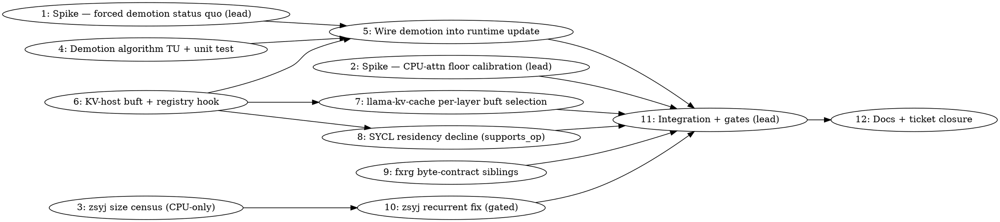

# Tiered-KV Placement Campaign (uize part 3 + zsyj) Implementation Plan

> **Execution:** Use `team-driven-development` in Claude Code, `pi-team-driven-development` in pi.dev, or `codex-team-driven-development` in Codex.

**Goal:** When a requested context's KV demand exceeds the device budget, place the overflow KV per-layer in pinned host tiers through the unified cache (CPU executes attention for those layers) instead of refusing context creation — and make tiered-KV stop refusing recurrent `cache_r_l`/`cache_s_l` tensors.

**Architecture:** Runtime KV demotion pass in the placement plan (KV-only, full-attention layers, latest-first, falling back to the existing truthful refusal). Demoted layers' KV allocates through a dedicated pinned-host unified-cache buffer type selected per layer at `llama-kv-cache` level via a new registry hook. Execution is scheduler-driven: the SYCL backend structurally declines ops whose KV operand is host-tier, so `ggml_backend_sched` runs those attention ops on the CPU backend (upstream's proven `--no-kv-offload` machinery, applied per layer). A NEO-style backend-internal host-task attention (B2) is **MANDATORY scope** per the owner's floor ratification (2026-08-26: TG ≥ 80% of the overlapped memory-bandwidth roofline, which serial split execution cannot reach — see `docs/plans/data/tiered-kv/spike-floor-calibration.md` §OWNER RATIFICATION); it is Task 13, designed after B1′ lands, with B1′ remaining the correctness landing step.

**Task 13 (added at execution time): B2 — overlapped host-task attention.** Blocked by Tasks 5, 7, 8 (the landed B1′ stack); blocks Task 11's floor criterion. Two stages inside one tracked task: (13a) a design addendum written against the landed B1′ code — how demoted-layer attention moves from the sched split into an event-chained host task overlapped with device work (`CpuExpertPool` precedent at `ggml-sycl.cpp:2200/8569`; `sycl::depends_on` edges; no host waits per the 2026-08-20 ruling), reviewed by the owner before code; then (13b) implementation to that addendum with the roofline gate as its acceptance. Prerequisite measurements owned here: sustained host DDR5 read BW (STREAM-like, attention access pattern) and B50 VRAM read BW, lead-measured, recorded with the roofline arithmetic.

**Owner rulings honored:** placement-decides-executor + layout-follows-residency (2026-08-16); no GPU zero-copy of host KV, no per-dispatch streaming; all allocations unified-cache-owned surfacing as `mem_handle`; owner ruling on uize c-qjb5 (2026-08-26): no permanent `-c` pin.

**Tech Stack:** C++17, SYCL/oneAPI (icpx), ggml backend-sched, CMake/Ninja, ctest.

**Test Infrastructure:** Host-only unit tests live in `ggml/src/ggml-sycl/tests/` and link only their own TU + the specific backend TU under test (precedent: `test-moe-mmid-workspace-plan.cpp` links `moe-mmid-workspace.cpp` only — registration pattern is in the repo-root `tests/CMakeLists.txt`; grep it for `moe-mmid` and clone). GPU gates are real runs by the **lead session only**, serial, selector pinned, Shmem sampled before/after. Existing RED for zsyj: `test-recurrent-state-rollback{,-dsv4,-nemotron-h}`.

---

## Team Topology

**Recommended implementers:** 2–3 concurrent (3 parallel tracks + a lead-executed GPU track — execution spawns one ephemeral implementer PER TASK)
**Reviewers:** spec + quality, spawned FRESH per review (see team-driven-development)

### Parallel Tracks

| Track | Tasks | Description |
|-------|-------|-------------|
| L (lead-executed) | 1, 2, 11 | GPU spikes, floor calibration, integration gates — **never subagents** (GPU serialised through the lead per CLAUDE.md) |
| A (backend core — `ggml-sycl.cpp` hotspot, strictly sequential) | 6, 5, 8, 9 | Registry hook + KV-host buft, demotion wiring, residency decline, fxrg byte-contract hardening |
| B (pure logic, own files) | 4 | Demotion algorithm TU + host-only unit test |
| C (llama side) | 7 | Per-layer buft selection in `llama-kv-cache.cpp` |
| D (zsyj) | 3, 10 | Recurrent-size evidence census, then the gated fix |
| — (convergence) | 11, 12 | Gates, then docs/ticket closure |

### Dependency Graph



(1→5 is informational: Task 5 starts only after the spike confirms the executor assumption; the code it writes does not consume spike output.)

### File Ownership Map

| File/Directory | Tasks | Conflict Risk |
|----------------|-------|---------------|
| `ggml/src/ggml-sycl/kv-runtime-demotion.{hpp,cpp}` (new) | 4 | None (new files) |
| `ggml/src/ggml-sycl/tests/test-kv-runtime-demotion.cpp` (new) | 4 | None |
| `ggml/src/ggml-sycl/ggml-sycl.cpp` | 6, 5, 8, 9 | **HIGH — Track A strictly sequential, one implementer at a time; BUILD.lock before first Edit** |
| `ggml/include/ggml-sycl.h` (or the fork's SYCL public header) | 6 | Header lands first in Track A (land-header-changes-first rule) |
| `ggml/src/ggml-sycl/unified-cache.hpp` | 5 | Same track as other backend edits |
| `src/llama-kv-cache.cpp` | 7 | None (only task touching it) |
| `src/llama-memory-recurrent.cpp` | 10 | None |
| `tests/CMakeLists.txt` (test registration) | 4 | None (single task) |
| `ggml/src/ggml-sycl/tests/test-mem-ops.cpp` | 9 | None |
| `docs/plans/data/tiered-kv/` (new evidence dir) | 1, 2, 3, 11 | None (per-task files) |
| `CLAUDE.md`, `docs/backend/sycl-memory-design.md` | 12 | None (runs last) |

**Line-number caveat:** every `file:line` below was verified 2026-08-26 at master `1f7ec435c`. Lines in `ggml-sycl.cpp` drift constantly — re-anchor each with the quoted grep before editing (`cat ggml/src/ggml-sycl/ggml-sycl.cpp | grep -n '<anchor>'`; codescout is blind in that file, use pipe-grep).

---

### Task 1: Spike — what does forced load-time KV/layer demotion do today?

**Track:** L (lead-executed — GPU; do NOT assign to a subagent)
**Depends on:** None
**File scope:**
- Create: `docs/plans/data/tiered-kv/spike-forced-demotion.md`

**Description:**

The load-time planner already demotes whole layers (weights+KV) to host when over budget (`ggml/src/ggml-sycl/unified-cache.cpp:24395-24440`, the `for (const auto & [layer_id, indices] : dense_layer_indices)` loop) and the campaign's executor assumption is that host-resident KV/attention is CPU-runnable. Nothing on record proves what that path does today. This spike forces it and scores it.

**Acceptance Criteria:**

- [ ] A committed findings doc recording, for each run: budget setting, `[PLACEMENT]` layer/kv_target lines, digit-gate output, rc, and Shmem before/after.
- [ ] An explicit verdict line: `host-demoted layers execute correctly: YES/NO/PARTIAL` with the evidence quoted.
- [ ] GPU checked clean afterward (`journalctl -k --since "1 hour ago" --no-pager | grep -iE 'GT reset|guc_id|CAT error'` → empty).

**Implementation Guide (lead session, serial, single runs):**

1. Preconditions each run: `source /opt/intel/oneapi/setvars.sh --force`; `grep -E '^(MemAvailable|Shmem):' /proc/meminfo`; `pgrep -af 'llama-|comfy'` (no tenants).
2. Baseline control (must pass — else stop, host/build is bad):

```bash
ONEAPI_DEVICE_SELECTOR=level_zero:1 ./build/bin/llama-completion \
  -m /models/mistral-7b-v0.1.Q4_0.gguf -p '1, 2, 3, 4, 5,' -n 15 --seed 42 --temp 0
# Expected: output begins "1, 2, 3, 4, 5, 6, 7, 8, 9, 10"
```

3. Forced demotion — lower the VRAM budget until `[PLACEMENT]` shows `kv_target=host` for ≥2 layers (start at 20%, halve until it bites; Mistral Q4_0 weights ≈3.9 GB so 20% of 16 GB ≈ 3.3 GB forces spill):

```bash
ONEAPI_DEVICE_SELECTOR=level_zero:1 GGML_SYCL_VRAM_BUDGET_PCT=20 timeout 300 \
  ./build/bin/llama-completion -m /models/mistral-7b-v0.1.Q4_0.gguf \
  -p '1, 2, 3, 4, 5,' -n 15 --seed 42 --temp 0 -v \
  > docs/plans/data/tiered-kv/spike-forced-demotion-run1.log 2>&1; echo "rc=$?"
```

  ⚠️ Verify the env var name before running: `cat ggml/src/ggml-sycl/*.cpp | grep -n 'VRAM_BUDGET_PCT'` — if the getenv spells it differently, use the spelled form and record it.
  ⚠️ `-v` is mandatory or every `[PLACEMENT]` line is dropped (CLAUDE.md log-verbosity trap).

4. Score: digit sequence correct? Which `dense_target=`/`kv_target=` lines show `host`? Any `[SYCL]` errors/aborts? rc? sleep 5 then re-read `Shmem`.
5. Write the findings doc; commit.

**Commit:**
```bash
git add docs/plans/data/tiered-kv/
git commit -m "docs(tiered-kv): spike findings — forced load-time demotion status quo (llama.cpp-uize)"
```

**Gotchas:**
- A wrong/misspelled env var silently no-ops (an-override-can-bind-on-one-axis-only): confirm the run's `[PLACEMENT] Total:` budget line actually moved before scoring anything.
- Score the digit gate interleave-tolerantly: strip WARN/log lines, then match the digit prefix (concurrent-logging-corrupts-result-tables).
- Single runs only; Mistral load peaks are modest but sample Shmem anyway.

---

### Task 2: Spike — CPU-attention throughput calibration and the perf floor

**Track:** L (lead-executed — GPU)
**Depends on:** None (runs after Task 1 in the lead's serial GPU queue)
**File scope:**
- Create: `docs/plans/data/tiered-kv/spike-floor-calibration.md`

**Description:**

Measure the exact executor the campaign lands (scheduler-driven CPU attention over host KV) using upstream's `--no-kv-offload` — zero code changes — on GPT-OSS B50 at several context fills. The owner sets the perf floor from these numbers (brainstorm decision: "correct + perf floor").

**Acceptance Criteria:**

- [ ] TG measured at fills ≈0 / 4K / 16K / 32K with KV on host, plus the same fills with KV on device (control), same binary, interleaved pairs.
- [ ] Findings doc with a **proposed floor** ("TG ≥ X tok/s at fill Y on B50, default n_ctx") and the projected 131K number (extrapolate the bandwidth-bound trend; back-of-envelope from design: ~8 of 12 full-attn layers demoted at 131K ⇒ ~2.1 GB KV read/token ⇒ ~8–10 tok/s ceiling at full fill).
- [ ] **STOP-AND-ASK gate:** owner signs off the floor before Tasks 5+ are considered acceptance-complete.

**Implementation Guide (lead session):**

1. `llama-bench` supports `-nkvo <0|1>` (no-KV-offload) and `-d <depth>` (pre-fill depth). Verify both exist in this fork first: `./build/bin/llama-bench --help | grep -E 'nkvo|-d,'` — if `-d` is absent, fall back to `llama-completion` with a generated long prompt and time `-n 32` generation.
2. Interleaved pairs, one invocation per cell (never loop a model-loading binary):

```bash
for d in 0 4096 16384 32768; do
  ONEAPI_DEVICE_SELECTOR=level_zero:1 timeout 900 ./build/bin/llama-bench \
    -m /models/gpt-oss-20b-mxfp4.gguf -p 0 -n 32 -d $d -r 1 -nkvo 1   # host-KV arm
  ONEAPI_DEVICE_SELECTOR=level_zero:1 timeout 900 ./build/bin/llama-bench \
    -m /models/gpt-oss-20b-mxfp4.gguf -p 0 -n 32 -d $d -r 1 -nkvo 0   # device control
done
```

  Run cells one at a time with Shmem sampling between; do not script them into an unattended loop.
3. Record ambient load (`uptime`, `pgrep -af 'codescout|ninja|ffmpeg'`) — verdicts come from the interleaved ratio, not absolutes (owner ruling 2026-08-07).
4. Write findings + floor proposal; commit; ask the owner to ratify the floor.

**Commit:**
```bash
git add docs/plans/data/tiered-kv/
git commit -m "docs(tiered-kv): CPU-attention floor calibration on B50 (llama.cpp-uize)"
```

**Gotchas:**
- `-nkvo 1` puts **all** layers' KV on host — the landed feature demotes only overflow layers, so the measured number is a *lower bound* for the landed path at the same fill. Say so in the doc.
- B50 is the steady card (cv <1%) — single runs per cell are meaningful; B70 would not be.
- GPT-OSS runs always under `timeout 900`.

---

### Task 3: zsyj evidence census — recurrent state sizes (CPU-only)

**Track:** D
**Depends on:** None
**File scope:**
- Create: `docs/plans/data/tiered-kv/zsyj-recurrent-size-census.md`

**Description:**

Decide direction (a) vs (b) for the recurrent fix by measuring, not guessing: compute `cache_r_l`/`cache_s_l` byte sizes for the failing archs from their fixture GGUFs and hparams. Ticket `llama.cpp-zsyj` records the fixture geometry (`n_embd_r/n_embd_s × mem_size × (1 + n_rs_seq)`; registered extent 70144 B vs cache_s needing 9216+131072).

**Acceptance Criteria:**

- [ ] Table: arch × (n_layer, n_embd_r, n_embd_s, mem_size, n_rs_seq, total r bytes, total s bytes) for `qwen35-dense`, `dsv4`, `nemotron_h` fixtures AND for at least one realistic full-size hybrid model config (from its HF config or GGUF metadata) so the decision isn't fixture-shaped (fixture-shapes-take-different-paths trap).
- [ ] A verdict line applying the decision gate: total recurrent bytes `< 5%` of a 16 GB budget ⇒ **direction (b)**; otherwise **direction (a)**.

**Implementation Guide:**

1. Fixture GGUFs live under `build/tests/test-models/` after `ctest --test-dir build -R '^test-download-model$'` or the fixture-staging registrations — locate with `find build -name 'qwen35*.gguf' -o -name '*nemotron*.gguf' 2>/dev/null` (do NOT run any GPU test to stage them; the download fixture is CPU-only).
2. Read metadata with the in-tree reader: `./build/bin/llama-gguf <path> r` or `python3 gguf-py/gguf/scripts/gguf_dump.py <path>` (whichever exists — check `ls gguf-py/gguf/scripts/`). Extract the hparams named above; compute sizes with the formula from `src/llama-memory-recurrent.cpp:125-127` (`n_rows = mem_size * (1 + n_rs_seq)`; `r = n_embd_r() × n_rows × type size`).
3. Write the census + verdict; commit.

**Commit:**
```bash
git add docs/plans/data/tiered-kv/
git commit -m "docs(tiered-kv): recurrent state size census + fix-direction verdict (llama.cpp-zsyj)"
```

**Gotchas:**
- No GPU. No model loading. Metadata only.
- If a fixture is missing, `ctest --test-dir build -R '^test-download-model$'` stages safely (CLAUDE.md).

---

### Task 4: Demotion algorithm — pure TU + host-only unit test

**Track:** B
**Depends on:** None
**File scope:**
- Create: `ggml/src/ggml-sycl/kv-runtime-demotion.hpp`
- Create: `ggml/src/ggml-sycl/kv-runtime-demotion.cpp`
- Create: `ggml/src/ggml-sycl/tests/test-kv-runtime-demotion.cpp`
- Modify: `ggml/src/ggml-sycl/CMakeLists.txt` — register the test by cloning the `test-kv-slice-sizing` block (≈line 1557); that is the verified host-only precedent. [CORRECTED 2026-08-26 during execution: this plan originally said to clone a `test-moe-mmid-workspace-plan` registration in `tests/CMakeLists.txt`; that pattern does not exist there — zero `moe-mmid` matches. A zero-SYCL-include TU may omit `SYCL_LINK_ONLY_TEST_OPTIONS`/`ggml-base` linkage if it links clean.]

**Description:**

The demotion decision as a pure function in its own host-linkable TU — deliberately NOT in `unified-cache.hpp`/the mega-TU, per the uize siting lesson (ticket comment c-8lff: enum-in-unified-cache "would not have linked"). Task 5 calls it; this task proves it.

**Acceptance Criteria:**

- [ ] All 6 test behaviors below RED first, then GREEN.
- [ ] Test binary builds host-only (no SYCL device) and runs in <1 s.
- [ ] `ctest --test-dir build -R '^test-kv-runtime-demotion$'` passes.

**Implementation Guide:**

1. **RED** — create `ggml/src/ggml-sycl/tests/test-kv-runtime-demotion.cpp`:

```cpp
#include "../kv-runtime-demotion.hpp"
#include <cassert>
#include <cstdio>
#include <vector>

using ggml_sycl::kv_demotion_input;
using ggml_sycl::kv_demotion_result;
using ggml_sycl::plan_runtime_kv_demotion;

// Helper: n_layers alternating geometry like GPT-OSS (even = full-attn, odd = SWA).
static kv_demotion_input make_input(size_t budget, size_t vram, size_t kv_full, size_t kv_swa, int n_layers) {
    kv_demotion_input in;
    in.vram_budget      = budget;
    in.vram_bytes       = vram;
    in.kv_per_layer     = kv_full;
    in.kv_per_swa_layer = kv_swa;
    in.kv_device.assign(n_layers, 0);          // all on device 0
    in.swa_layer_mask.assign(n_layers, 0);
    for (int l = 1; l < n_layers; l += 2) in.swa_layer_mask[l] = 1;
    return in;
}

int main() {
    // 1. identity: already fits -> zero demotions, bytes unchanged
    {
        auto r = plan_runtime_kv_demotion(make_input(1000, 900, 100, 10, 4));
        assert(r.fits && r.demoted_layers.empty() && r.vram_bytes_after == 900);
    }
    // 2. exact boundary: vram_bytes == budget is ADMITTED with zero demotions
    {
        auto r = plan_runtime_kv_demotion(make_input(1000, 1000, 100, 10, 4));
        assert(r.fits && r.demoted_layers.empty());
    }
    // 3. one-layer overshoot demotes exactly the LAST full-attn layer
    {
        auto r = plan_runtime_kv_demotion(make_input(1000, 1050, 100, 10, 6));
        assert(r.fits && r.demoted_layers.size() == 1 && r.demoted_layers[0] == 4);
        assert(r.vram_bytes_after == 950 && r.host_kv_bytes_added == 100);
    }
    // 4. multi-layer overshoot demotes latest-first until fit
    {
        auto r = plan_runtime_kv_demotion(make_input(1000, 1250, 100, 10, 6));
        assert(r.fits && r.demoted_layers == (std::vector<int>{4, 2, 0}));
        assert(r.vram_bytes_after == 950);
    }
    // 5. SWA layers are never demoted, even when insufficient
    {
        auto r = plan_runtime_kv_demotion(make_input(100, 500, 100, 10, 4));
        // full-attn layers 0,2 demoted (200 recovered) -> 300 > 100 budget: no fit
        assert(!r.fits);
        for (int l : r.demoted_layers) assert(l % 2 == 0);
    }
    // 6. layers already on host are not re-demoted or double-counted
    {
        auto in = make_input(1000, 1050, 100, 10, 6);
        in.kv_device[4] = -1;                    // pre-demoted
        auto r = plan_runtime_kv_demotion(in);
        assert(r.fits && r.demoted_layers == (std::vector<int>{2}));
    }
    printf("test-kv-runtime-demotion: all ok\n");
    return 0;
}
```

Register in `tests/CMakeLists.txt` by cloning the `test-moe-mmid-workspace-plan` block (grep `moe-mmid` there; swap the test source and add `../ggml/src/ggml-sycl/kv-runtime-demotion.cpp` as the linked TU — same shape).
Run: `cmake --build build --target test-kv-runtime-demotion 2>&1 | tail -5` — **must fail**: `kv-runtime-demotion.hpp: No such file or directory`.

2. **GREEN** — create `ggml/src/ggml-sycl/kv-runtime-demotion.hpp`:

```cpp
#pragma once
#include <cstddef>
#include <cstdint>
#include <vector>

namespace ggml_sycl {

// Input snapshot of the placement state relevant to runtime KV demotion.
// Mirrors placement_plan fields (unified-cache.hpp: kv_device / swa_layer_mask /
// kv_per_layer / kv_per_swa_layer / vram_bytes / vram_budget) as plain values so
// this TU stays host-linkable with no unified-cache dependency.
struct kv_demotion_input {
    size_t               vram_budget      = 0;
    size_t               vram_bytes       = 0;  // current total incl. device-resident KV
    size_t               kv_per_layer     = 0;  // full-attn per-layer KV bytes at requested n_ctx
    size_t               kv_per_swa_layer = 0;
    std::vector<int>     kv_device;             // index = layer id; >=0 device, -1 host
    std::vector<uint8_t> swa_layer_mask;        // 1 = SWA layer (never demoted)
};

struct kv_demotion_result {
    std::vector<int> demoted_layers;      // in demotion order (latest full-attn first)
    size_t           vram_bytes_after  = 0;
    size_t           host_kv_bytes_added = 0;
    bool             fits              = false; // vram_bytes_after <= vram_budget
};

// Pure decision: which device-resident full-attention KV layers must move to the
// host tier so vram_bytes fits vram_budget. Latest layers first. SWA layers and
// already-host layers are never touched. Does NOT mutate any plan — the caller
// (ggml-sycl.cpp runtime update) applies the result to placement_plan::kv_device.
kv_demotion_result plan_runtime_kv_demotion(const kv_demotion_input & in);

}  // namespace ggml_sycl
```

Create `ggml/src/ggml-sycl/kv-runtime-demotion.cpp`:

```cpp
#include "kv-runtime-demotion.hpp"

namespace ggml_sycl {

kv_demotion_result plan_runtime_kv_demotion(const kv_demotion_input & in) {
    kv_demotion_result r;
    r.vram_bytes_after = in.vram_bytes;

    if (in.vram_bytes <= in.vram_budget) {
        r.fits = true;
        return r;
    }

    const int n_layers = (int) in.kv_device.size();
    for (int l = n_layers - 1; l >= 0; --l) {
        if (in.kv_device[l] < 0) {
            continue;  // already host
        }
        const bool is_swa = l < (int) in.swa_layer_mask.size() && in.swa_layer_mask[l] != 0;
        if (is_swa) {
            continue;  // SWA KV is ~1.5 MB/layer; demoting it buys nothing and costs a split
        }
        if (in.kv_per_layer == 0) {
            break;
        }
        r.demoted_layers.push_back(l);
        r.vram_bytes_after    -= in.kv_per_layer;
        r.host_kv_bytes_added += in.kv_per_layer;
        if (r.vram_bytes_after <= in.vram_budget) {
            break;
        }
    }

    r.fits = r.vram_bytes_after <= in.vram_budget;
    return r;
}

}  // namespace ggml_sycl
```

Run: `cmake --build build --target test-kv-runtime-demotion && ctest --test-dir build -R '^test-kv-runtime-demotion$' --output-on-failure` — PASS.
3. **Mutation-score the test** (adjacent-green trap): temporarily invert the SWA guard, confirm case 5 goes RED, revert.

**Commit:**
```bash
git add ggml/src/ggml-sycl/kv-runtime-demotion.hpp ggml/src/ggml-sycl/kv-runtime-demotion.cpp \
        ggml/src/ggml-sycl/tests/test-kv-runtime-demotion.cpp tests/CMakeLists.txt
git commit -m "feat(sycl): runtime KV demotion decision as a host-linkable pure TU (llama.cpp-uize)"
```

**Gotchas:**
- If `ggml/src/ggml-sycl/CMakeLists.txt` lists sources explicitly rather than globbing, add `kv-runtime-demotion.cpp` there too, or the backend link fails later in Task 5 — check BEFORE committing.
- Do not `#include` anything from `unified-cache.hpp` — that is the exact siting mistake c-8lff documents.
- Formatting: `clang-format-19 --dry-run -Werror <your new files>` (other agents may be live; never `-i`).

---

### Task 5: Wire the demotion pass into the runtime KV update

**Track:** A (after Task 6 lands the header; BUILD.lock discipline)
**Depends on:** Task 4 (function), Task 6 (Track-A ordering), Task 1 (spike verdict must be YES/PARTIAL for host execution — else STOP and re-plan with the owner)
**File scope:**
- Modify: `ggml/src/ggml-sycl/ggml-sycl.cpp` — `ggml_backend_sycl_set_runtime_context` (anchor: `next_plan.update_runtime_kv_sizes` / grep `runtime KV update rejected`; region ≈15727+)
- Modify: `ggml/src/ggml-sycl/unified-cache.hpp` only if a small helper to apply demotions is added there (prefer applying inline in ggml-sycl.cpp)

**Description:**

On the branch that today refuses (`replan_moe_mmid_workspaces_for_runtime` → budget-exceeded reasons from `f3aa4a803`), first run `plan_runtime_kv_demotion`, apply it to the candidate plan, and only refuse if demotion cannot fit. In-budget updates take today's exact path (zero behavior change).

**Acceptance Criteria:**

- [ ] In-budget runtime update: byte-identical behavior (no demotion call side effects, no new log lines).
- [ ] Over-budget + demotable: `kv_device[l] = -1` applied for the returned layers, `refresh_kv_byte_totals()` + `rebuild_runtime_per_device_vram()` re-run, `replan_moe_mmid_workspaces_for_runtime` re-validated, plan published, **one WARN** line emitted.
- [ ] Over-budget + not demotable: existing refusal with existing reason codes and the largest-fitting `-c` arithmetic, unchanged.
- [ ] `icpx -fsyntax-only` clean on the touched TUs if the shared `build/` is busy; full build otherwise.

**Implementation Guide:**

1. Anchor the refusal branch: `cat ggml/src/ggml-sycl/ggml-sycl.cpp | grep -n 'update_runtime_kv_sizes\|runtime KV update rejected\|moe_mmid_runtime_reason'`.
2. After `next_plan.update_runtime_kv_sizes(...)` and on the failure path of the existing validation (reason `BUDGET_EXCEEDED` or the per-device budget arm — NOT on `DEMAND_INVALID`/overflow/accounting reasons, which demotion cannot cure), insert:

```cpp
        // Over budget: try re-placing full-attn KV overflow to the host tier
        // (owner ruling llama.cpp-uize c-qjb5) before refusing.
        {
            ggml_sycl::kv_demotion_input din;
            din.vram_budget      = next_plan.vram_budget;
            din.vram_bytes       = next_plan.vram_bytes;
            din.kv_per_layer     = next_plan.kv_per_layer;
            din.kv_per_swa_layer = next_plan.kv_per_swa_layer;
            const size_t n_layers = next_plan.kv_layer_count();
            din.kv_device.resize(n_layers);
            din.swa_layer_mask.assign(next_plan.swa_layer_mask.begin(), next_plan.swa_layer_mask.end());
            for (size_t l = 0; l < n_layers; ++l) {
                din.kv_device[l] = next_plan.get_kv_device((int) l);
            }

            const ggml_sycl::kv_demotion_result dr = ggml_sycl::plan_runtime_kv_demotion(din);
            if (dr.fits && !dr.demoted_layers.empty()) {
                for (int l : dr.demoted_layers) {
                    next_plan.kv_device[l] = -1;
                }
                next_plan.refresh_kv_byte_totals();
                if (!next_plan.rebuild_runtime_per_device_vram()) {
                    // fall through to the existing refusal path
                } else {
                    GGML_LOG_WARN(
                        "[SYCL-PLAN] KV overflow re-placed to host tier: %zu layer(s) demoted "
                        "(%.1f MB host KV) for n_ctx=%u; attention for those layers runs on CPU. "
                        "Largest all-VRAM context is about -c %u\n",
                        dr.demoted_layers.size(), dr.host_kv_bytes_added / (1024.0 * 1024.0),
                        n_ctx, ggml_sycl_largest_fitting_n_ctx(next_plan, kv_info));
                    // re-validate the demoted plan through the SAME gate as any other plan
                    // (re-run replan_moe_mmid_workspaces_for_runtime and proceed on success)
                }
            }
        }
```

Adapt local variable names to the enclosing function (the candidate plan may be named `next_plan` or similar — read the function first; `ggml_sycl_largest_fitting_n_ctx` is at ≈`ggml-sycl.cpp:15698` and `kv_info` availability must be checked at the call site — if not in scope, print without the `-c` suggestion rather than replumbing).
3. The demoted plan MUST re-enter the existing validation (`replan_moe_mmid_workspaces_for_runtime`) rather than being trusted — the reason plumbing from `f3aa4a803` then covers any residual failure honestly.
4. Log line is **WARN** — INFO is invisible at default verbosity (CLAUDE.md).
5. Build: take `/Apps/llama.cpp/BUILD.lock` (atomic `mkdir` + holder file, rc-checked); `./scripts/sycl-build.sh llama-completion` names targets (build-only-what-you-verify); release the lock in the same Bash call window as the build completion (Bash 10-min-ceiling lock rule: acquire+build+release must not span a killed wrapper — use `run_in_background` for the build and release after it completes).

**Commit:**
```bash
git add ggml/src/ggml-sycl/ggml-sycl.cpp ggml/src/ggml-sycl/unified-cache.hpp
git commit -m "feat(sycl): re-place overflow KV to host tier on runtime budget failure instead of refusing (llama.cpp-uize)"
```

**Gotchas:**
- `kv_device` is `std::unordered_map<int,int>` in `placement_plan` (`unified-cache.hpp:706`) — assignment inserts; that is fine, `refresh_kv_byte_totals()` (`unified-cache.hpp:745`) recomputes from the map.
- Do NOT demote on `GLOBAL_CHARGE_MISMATCH`/`PER_DEVICE_REACCOUNT_FAILED`/overflow reasons — those are accounting defects, not capacity; demotion would mask them (a-refusal-can-be-reported-as-wrong-numbers, in reverse).
- The identity invariant is acceptance-critical: an exactly-fitting plan must not demote (Task 4 case 2 covers the pure function; re-check nothing at the call site pre-filters differently).
- codescout is blind in this file — every "no other callers" claim must come from pipe-grep.

---

### Task 6: Dedicated KV-host buffer type + per-layer registry hook

**Track:** A (lands FIRST in Track A — header change; land-header-changes-first)
**Depends on:** None
**File scope:**
- Modify: `ggml/include/ggml-sycl.h` (wherever `ggml_backend_sycl_kv_buffer_type_from_dev` is declared — grep it; add the two new declarations beside it)
- Modify: `ggml/src/ggml-sycl/ggml-sycl.cpp`:
  - new buft near `ggml_backend_sycl_host_buffer_type()` (≈38535)
  - two proc-table entries in `ggml_backend_sycl_reg_get_proc_address` (≈100383; KV entries at ≈100473-100477)

**Description:**

Two small backend exports: (1) `ggml_backend_sycl_kv_host_buffer_type()` — a pinned-host buft with the same alloc path as `ggml_backend_sycl_host_buffer_type()` (unified-cache-owned) but a **distinct identity and name** (`"SYCL_KV_Host"`), so the Task-8 decline and any diagnostics key on exactly this buft and never perturb other users of the generic pinned-host type (one path already returns it — `ggml-sycl.cpp:10012`). (2) `ggml_backend_sycl_kv_layer_on_device_from_dev(dev, il)` — consults the active plan snapshot's `get_kv_device(il)`.

**Acceptance Criteria:**

- [ ] `ggml_backend_sycl_kv_host_buffer_type()` returns a singleton buft: name `"SYCL_KV_Host"`, `is_host` true, alloc path identical to the generic host buft (clone the iface struct at ≈38535-38556, override `.get_name`).
- [ ] `ggml_backend_sycl_kv_layer_on_device_from_dev(dev, il)` returns `true` when no plan is active (safe default: today's behavior) and `plan->get_kv_device(il) >= 0` otherwise.
- [ ] Both reachable via `ggml_backend_reg_get_proc_address` with their exact symbol names as strings.
- [ ] Build of the backend target clean.

**Implementation Guide:**

1. **RED (compile-level):** add the two declarations to the public header first; grep an existing consumer pattern (`src/llama-kv-cache.cpp:64-69`) to confirm the calling convention; a `-fsyntax-only` on a scratch TU that calls both through `get_proc_address` strings fails until the proc entries exist.
2. Clone the host buft (anchor `static ggml_backend_buffer_type_t ggml_backend_sycl_host_buffer_type` / `.get_name         = */ ggml_backend_sycl_host_buffer_type_name`):

```cpp
static const char * ggml_backend_sycl_kv_host_buffer_type_name(ggml_backend_buffer_type_t buft) {
    GGML_UNUSED(buft);
    return "SYCL_KV_Host";
}

ggml_backend_buffer_type_t ggml_backend_sycl_kv_host_buffer_type() {
    static ggml_backend_buffer_type type = [] {
        ggml_backend_buffer_type t = *ggml_backend_sycl_host_buffer_type();  // clone iface + context
        t.iface.get_name = ggml_backend_sycl_kv_host_buffer_type_name;
        return t;
    }();
    return &type;
}
```

  (Mirror however `ggml_backend_sycl_host_buffer_type_for_device` at ≈38557 does its prototype-clone — the fork already uses exactly this pattern: `const auto prototype = *ggml_backend_sycl_host_buffer_type();` at ≈38574.)
3. The per-layer query (place near the other `_from_dev` shims — grep `_from_dev`):

```cpp
bool ggml_backend_sycl_kv_layer_on_device_from_dev(ggml_backend_dev_t dev, int32_t il) {
    GGML_UNUSED(dev);
    const auto snapshot = ggml_sycl_global_plan_snapshot();
    if (!snapshot || !snapshot->plan) {
        return true;  // no plan: preserve today's behavior (tiered device buft)
    }
    return snapshot->plan->get_kv_device((int) il) >= 0;
}
```

  Verify `ggml_sycl_global_plan_snapshot()`'s actual name/shape by grep (`grep -n 'global_plan_snapshot'`) — the uize ticket quotes it, but confirm the accessor and member (`->plan`).
4. Proc-table entries beside the existing KV pair (≈100473):

```cpp
    if (strcmp(name, "ggml_backend_sycl_kv_host_buffer_type") == 0) {
        return (void *) ggml_backend_sycl_kv_host_buffer_type;
    }
    if (strcmp(name, "ggml_backend_sycl_kv_layer_on_device_from_dev") == 0) {
        return (void *) ggml_backend_sycl_kv_layer_on_device_from_dev;
    }
```

**Commit:**
```bash
git add ggml/include/ggml-sycl.h ggml/src/ggml-sycl/ggml-sycl.cpp
git commit -m "feat(sycl): dedicated KV-host buffer type + per-layer kv-on-device registry hook (llama.cpp-uize)"
```

**Gotchas:**
- The buft clone shares the generic host type's `context` pointer — confirm the iface functions don't key behavior on buft identity (pipe-grep each iface member for `buft ==` comparisons) before sharing.
- Do NOT reuse the generic host buft directly for KV — Task 8's decline would then break every other consumer of pinned-host staging (`ggml-sycl.cpp:10012` proves at least one exists).
- Header change ⇒ Ninja rebuilds dependents correctly, but this is the mega-TU: expect the long compile; name targets.

---

### Task 7: Per-layer KV buft selection in llama-kv-cache

**Track:** C
**Depends on:** Task 6
**File scope:**
- Modify: `src/llama-kv-cache.cpp:22-74` (hooks struct + `llama_kv_cache_sycl_hooks_for`) and `:277-292` (buft selection loop)

**Description:**

Extend the existing hook plumbing so each layer's KV buft follows the plan: device layers keep the tiered SYCL buft; demoted layers get `ggml_backend_sycl_kv_host_buffer_type` (pinned, unified-cache-owned, `is_host`). Non-SYCL builds and no-plan runs are byte-identical to today.

**Acceptance Criteria:**

- [ ] Two new hook members resolved via `get_proc_address` alongside the existing three (`llama-kv-cache.cpp:64-69` pattern): `kv_host_buft`, `kv_layer_on_device`.
- [ ] Selection loop: `if (offload && sycl && !hooks.kv_layer_on_device(dev, il)) buft = hooks.kv_host_buft();` else today's paths.
- [ ] The tiered buft's layer mask (`sycl_kv_layer_masks[buft]`, `:172` and `:304`) receives 1s only for layers actually placed in the tiered buft (this falls out naturally: masks are keyed per buft — verify, don't assume).
- [ ] `LLAMA_LOG_DEBUG` per layer prints the chosen dev/buft name (the `dev_name` variable already exists at `:275`).

**Implementation Guide:**

1. **RED:** there is no host-only unit seam across this boundary; the RED is behavioral and lands with Task 11's integration gate. What this task must self-verify: build + the Mistral digit gate unchanged (no plan demotion occurs ⇒ hook returns true for every layer ⇒ identical buft choices; confirm via `LLAMA_LOG_DEBUG` diff of layer→dev lines before/after on the same run command, which the lead can run on request — CPU-only `llama-completion -m stories15M... ` from the fixture also exercises the loop without a GPU claim if built CPU-only; otherwise request one lead gate run).
2. Extend the hooks struct (`:22-27`):

```cpp
struct llama_kv_cache_sycl_hooks {
    decltype(&ggml_backend_sycl_kv_buffer_type_from_dev)         kv_buft            = nullptr;
    decltype(&ggml_backend_sycl_push_kv_layer_mask_from_dev)     push_mask          = nullptr;
    decltype(&ggml_backend_sycl_cancel_kv_layer_mask_from_dev)   cancel_mask        = nullptr;
    decltype(&ggml_backend_sycl_kv_host_buffer_type)             kv_host_buft       = nullptr;
    decltype(&ggml_backend_sycl_kv_layer_on_device_from_dev)     kv_layer_on_device = nullptr;
};
```

and resolve the two new names in `llama_kv_cache_sycl_hooks_for` exactly like `:64-69`.
3. Selection loop (`:277-292`) — insert after the SYCL branch chooses the tiered buft:

```cpp
        if (offload) {
            auto * dev = model.dev_layer(il);
#if defined(GGML_USE_SYCL) || defined(GGML_BACKEND_DL)
            if (llama_kv_cache_dev_is_sycl(dev)) {
                const auto hooks = llama_kv_cache_sycl_hooks_for(dev);
                if (hooks.kv_layer_on_device && hooks.kv_host_buft && !hooks.kv_layer_on_device(dev, il)) {
                    buft     = hooks.kv_host_buft();
                    dev_name = "SYCL_KV_Host";
                } else {
                    buft = hooks.kv_buft(dev);
                }
            } else {
                buft = ggml_backend_dev_buffer_type(dev);
            }
#else
            buft = ggml_backend_dev_buffer_type(dev);
#endif
            ...
```

4. Mask hygiene: read `:302-310` — the mask push is guarded by `llama_kv_cache_dev_is_sycl(buft_dev)`. The KV-host buft's `get_device` likely also reports the SYCL dev; guard the push so ONLY the tiered buft gets a mask: compare `buft == hooks.kv_buft(dev)` (or check the buft name != "SYCL_KV_Host"). Getting this wrong re-introduces the zsyj failure shape (mask-driven slicing over a buffer that isn't tiered).

**Commit:**
```bash
git add src/llama-kv-cache.cpp
git commit -m "feat(llama): per-layer KV buft follows the SYCL plan — host-tier layers use the KV-host buft (llama.cpp-uize)"
```

**Gotchas:**
- `ggml_backend_alloc_ctx_tensors_from_buft` splits allocations at the buft's `get_max_size` — the pinned pool's chunk cap (`ggml_backend_sycl_host_buffer_type_get_max_size`, `ggml-sycl.cpp:38392`) may be smaller than N demoted layers × 268 MB. That's fine (multiple buffers), but confirm the cap isn't below ONE layer's KV at 131K (≈268 MB) — if it is, that's a STOP-and-report, not a workaround.
- The iswa cache variant (`llama-kv-cache-iswa.cpp`) constructs two inner caches through this same code — no separate edit needed, but verify by grep that no other file clones the buft-selection loop (`grep -rn 'kv_buft(dev)' src/ | grep -v llama-kv-cache.cpp`).

---

### Task 8: Structural residency decline in supports_op

**Track:** A (after Task 5 in sequence)
**Depends on:** Task 6 (buft identity to key on)
**File scope:**
- Modify: `ggml/src/ggml-sycl/ggml-sycl.cpp` — `ggml_backend_sycl_device_supports_op` (≈98733; `GGML_OP_FLASH_ATTN_EXT` case ≈99334)

**Description:**

A pinned USM-host buffer is technically GPU-readable, so without a guard the scheduler could leave attention on the GPU reading host KV — the forbidden zero-copy. The SYCL backend must *decline* any op with an operand in the KV-host buft; `ggml_backend_sched` then assigns those ops to the CPU backend (which accepts any `is_host` buffer). This makes placement-decides-executor structural (the `llama.cpp-v4jk` bar).

**Acceptance Criteria:**

- [ ] A small static predicate: `op or any src has buffer whose buft == ggml_backend_sycl_kv_host_buffer_type()` → `supports_op` returns `false`.
- [ ] Applied at the TOP of `ggml_backend_sycl_device_supports_op` (all ops — cache-write `cpy`/`set_rows` and rollback reads must fall to CPU too, not just FA).
- [ ] Zero effect when no tensor lives in that buft (i.e., every current workload): keyed strictly on the dedicated buft identity from Task 6.

**Implementation Guide:**

1. **RED (unit-shaped):** the predicate is pure over `ggml_tensor*` buffers; a host-only test would need fake buffers — not worth a device-free harness here. Instead pre-register the observable for Task 11: with demotion active, `GGML_SYCL_DEBUG=1` scheduler assignment must show FLASH_ATTN_EXT for demoted layers on CPU (`ggml_backend_sched` split logs / `test-backend-ops`-style per-op logs), and a temporary diagnostic counter (see step 3) must be nonzero. Record the exact grep in the task close-out comment.
2. Implementation at the top of `ggml_backend_sycl_device_supports_op` (≈98733):

```cpp
static bool ggml_sycl_tensor_in_kv_host_buft(const ggml_tensor * t) {
    if (!t) return false;
    const ggml_backend_buffer_t buf = t->view_src && t->view_src->buffer ? t->view_src->buffer : t->buffer;
    return buf && buf->buft == ggml_backend_sycl_kv_host_buffer_type();
}

static bool ggml_backend_sycl_device_supports_op(ggml_backend_dev_t dev, const ggml_tensor * op) {
    // Placement decides the executor (owner ruling 2026-08-16): host-tier KV is
    // CPU work. Declining here makes the diversion structural — the scheduler
    // assigns these ops to the CPU backend; no dispatch-time re-litigation.
    if (ggml_sycl_tensor_in_kv_host_buft(op)) {
        return false;
    }
    for (int i = 0; i < GGML_MAX_SRC; ++i) {
        if (ggml_sycl_tensor_in_kv_host_buft(op->src[i])) {
            return false;
        }
    }
    ...existing body...
```

3. Temporary observable for Task 11 (delete in Task 12 or keep behind `GGML_SYCL_DEBUG`): a `GGML_LOG_DEBUG` or static counter counting declines, so "the decline engaged" is countable, not inferred (layout-assignment-is-not-dispatch-engagement).
4. `views`: KV consumers read `view` tensors over the cache — hence the `view_src` hop in the predicate. Verify with pipe-grep that `ggml_backend_buffer_t`/`buft` member names match this fork's ggml version (`grep -n 'struct ggml_backend_buffer ' ggml/src/ggml-backend-impl.h` via cat-pipe).

**Commit:**
```bash
git add ggml/src/ggml-sycl/ggml-sycl.cpp
git commit -m "feat(sycl): structurally decline ops on KV-host-tier operands so sched routes them to CPU (llama.cpp-uize)"
```

**Gotchas:**
- Decline must key ONLY on the dedicated buft — keying on `is_host` or the generic host buft would peel existing pinned-staging paths off the GPU (verified consumer at `ggml-sycl.cpp:10012`).
- `supports_op` is called at graph-build time per op — keep the predicate allocation-free and lock-free.
- Graph replay: demotion introduces sched splits around CPU segments. In-budget runs have zero demotions ⇒ zero new splits ⇒ replay identical (this is the no-regression protection; assert it in Task 11's paired A/B).

---

### Task 9: fxrg byte-contract sibling hardening

**Track:** A (last in sequence)
**Depends on:** None functionally (Track-A ordering only)
**File scope:**
- Modify: `ggml/src/ggml-sycl/ggml-sycl.cpp` — the 3-arg `ggml_sycl_copy_handle_for_raw_ptr` call sites inside `tiered_kv_buffer_set_tensor` and the tp-buffer get/set functions (census below)
- Modify: `ggml/src/ggml-sycl/tests/test-mem-ops.cpp` (add the regression case)

**Description:**

`llama.cpp-fxrg` fixed `tiered_kv_buffer_get_tensor`'s omitted `operation_bytes` (a zero-extent destination handle the range guard correctly refused) but left three sibling sites latent. Host-tier KV makes the restore/checkpoint direction live, so they graduate from latent to load-bearing. Fix them all.

**Acceptance Criteria:**

- [ ] Census: `cat ggml/src/ggml-sycl/ggml-sycl.cpp | grep -n 'copy_handle_for_raw_ptr'` — every call inside `tiered_kv_buffer_set_tensor`, `tp_*_buffer_get_tensor`, `tp_*_buffer_set_tensor` (resolve exact fn names by reading around hits ≈32837/32840/32902/33196) passes the operation's byte count as the 4th argument.
- [ ] A test in `test-mem-ops.cpp` that resolves an unknown external pointer WITH a byte contract and asserts the resolved extent equals the contract (and a 0-byte control asserting extent 0 — the fxrg failure shape, kept RED-able).
- [ ] No other 3-arg call site remains whose pointer can be external (each remaining 3-arg site gets a one-line justification in the commit body).

**Implementation Guide:**

1. **RED:** extend `test-mem-ops.cpp` (registration exists — it's the binary that prints `SKIP: no SYCL GPU devices available` without oneAPI; the new case must run under ctest with the fixture env). Follow the file's existing case pattern; the new case constructs the helper's input exactly as `tiered_kv_buffer_get_tensor` does post-fix (see commit `c1f4504c8` for the fixed shape: `git show c1f4504c8 -- ggml/src/ggml-sycl/ggml-sycl.cpp | head -80`).
2. **GREEN:** append `, size` (the enclosing function's byte count for the operation — the same local the memcpy uses) to each censused call.
3. Verify: `ctest --test-dir build -R '^test-mem-ops$' --output-on-failure` (source oneAPI first; a 0.4 s runtime means it skipped — treat as NOT run).

**Commit:**
```bash
git add ggml/src/ggml-sycl/ggml-sycl.cpp ggml/src/ggml-sycl/tests/test-mem-ops.cpp
git commit -m "fix(sycl): declare byte contracts at remaining tiered/tp buffer raw-ptr resolutions (llama.cpp-fxrg follow-up)"
```

**Gotchas:**
- The migration that "declared itself complete" (`6faf4c7ec`) is the cautionary tale — end the commit body with the census count and the grep used, so completeness is checkable.
- Some 3-arg sites are legitimately internal (registered allocations don't need external authority) — justify, don't blanket-edit.

---

### Task 10: zsyj recurrent fix (direction gated by Task 3)

**Track:** D
**Depends on:** Task 3 (verdict)
**File scope (direction b — expected):**
- Modify: `src/llama-memory-recurrent.cpp:21-33` (`llama_recurrent_sycl_kv_buft`)
**File scope (direction a — only if Task 3 says recurrent state is placement-relevant):**
- Modify: `ggml/src/ggml-sycl/ggml-sycl.cpp` — `tiered_kv_buffer_init_tensor` (≈34544) + the `kv_slice_size` selection (≈35064-35085)

**Description:**

Direction (b): stop routing recurrent caches through the attention-geometry tiered buft — `llama_recurrent_sycl_kv_buft` returns `nullptr`, so line ≈108's existing fallback picks `ggml_backend_dev_buffer_type(dev)` (the plain SYCL device buft, still unified-cache-owned). Recurrent state stays device-resident and correct; tiering it is deferred until something needs it. Direction (a) (only on evidence): teach `tiered_kv_buffer_init_tensor` the `cache_r_l%d`/`cache_s_l%d` prefixes and size slices with `kv_slice_size::from_model_layers_unverified` over actual tensor sizes.

**Acceptance Criteria:**

- [ ] RED first: `ctest --test-dir build -R 'test-recurrent-state-rollback' --output-on-failure` currently aborts with `[MEM-OPS] mem_copy destination range rejected: ... extent=60928 ... size=131072` (rc=134). Reproduce and record before editing. (GPU tests — request the lead to run the RED and GREEN invocations; the code edit itself is subagent-safe.)
- [ ] GREEN: all three `test-recurrent-state-rollback{,-dsv4,-nemotron-h}` pass.
- [ ] Direction (b) diff is ≤10 lines; direction (a) requires a written justification quoting Task 3's numbers.

**Implementation Guide (direction b):**

1. `src/llama-memory-recurrent.cpp:21-33` — replace the tiered-buft resolution:

```cpp
static ggml_backend_buffer_type_t llama_recurrent_sycl_kv_buft(ggml_backend_dev_t dev) {
    // Recurrent r/s state has SSM geometry the tiered attention-KV arena cannot
    // slice (llama.cpp-zsyj): route to the plain device buft (unified-cache-owned)
    // until recurrent placement is designed.
    GGML_UNUSED(dev);
    return nullptr;
}
```

  The existing call site (`:107-110`) already falls back to `ggml_backend_dev_buffer_type(dev)` on `nullptr` — verify by reading it, change nothing there.
2. Ask the lead to run RED before, GREEN after. Also run the Mistral digit gate (control: attention path untouched).
3. Follow-up ticket note (for Task 12): the arch-sweep exclusions that were zsyj-class need re-triage against `llama.cpp-a6sy`.

**Commit:**
```bash
git add src/llama-memory-recurrent.cpp
git commit -m "fix(llama): route recurrent cache_r/s to the plain device buft, not the tiered attention-KV arena (llama.cpp-zsyj)"
```

**Gotchas:**
- Keep the dead-looking function rather than deleting it and its call-site branch — direction (a) later re-fills it, and the diff stays reviewable. If the quality reviewer objects, inline the `nullptr` with the comment instead.
- The three rollback tests are GPU model-loading tests — lead-session serial, pinned selector, one at a time.

---

### Task 11: Integration + gates (lead-executed)

**Track:** L
**Depends on:** Tasks 2, 5, 7, 8, 9, 10
**File scope:**
- Create: `docs/plans/data/tiered-kv/gates.md` (gate evidence)

**Description:**

The campaign's acceptance runs, serial on the lead: correctness at default context, no-regression for in-VRAM contexts, the perf floor, and the recurrent tests — with pre-registered predictions so results are scored, not narrated.

**Acceptance Criteria (each with its exact command in the E2E section below):**

- [ ] GPT-OSS B50 gate at DEFAULT context (no `-c`): digit line `1, 2, 3, 4, 5`, rc=0, and the Task-5 WARN line present naming demoted layers.
- [ ] Mistral digit gate: unchanged output.
- [ ] Paired interleaved A/B (this build vs pre-campaign master) llama-bench Mistral + GPT-OSS at in-VRAM contexts: within noise bands per `docs/backend/sycl-perf-baselines.md` (B70 tg ±10% single-run noise; B50 steady).
- [ ] Perf floor (owner-ratified 2026-08-26): decode TG ≥ **80% of the overlapped memory-bandwidth roofline** at 32K fill — prerequisite measurements (sustained host DDR5 read BW, B50 VRAM read BW, both on-host) and the roofline arithmetic recorded in the gate evidence. Scored on the B1′+B2 build (Task 13).
- [ ] `test-recurrent-state-rollback{,-dsv4,-nemotron-h}` green.
- [ ] Decline-engagement observable from Task 8 is NONZERO in the default-ctx gate run (absence-of-work-looks-like-success).
- [ ] GPU clean after each run (journalctl grep).

**Implementation Guide:** run each command from the E2E section, one at a time, Shmem sampled, logging to `docs/plans/data/tiered-kv/`; score against the pre-registered expectations; commit the evidence. Any failure files a `task_*` bug and blocks Task 12.

**Commit:**
```bash
git add docs/plans/data/tiered-kv/
git commit -m "test(tiered-kv): integration gate evidence — default-ctx gate, A/B, floor (llama.cpp-uize, llama.cpp-zsyj)"
```

**Gotchas:**
- The A/B "before" arm must be a build of pre-campaign master at the SAME toolchain (an-A/B-arm-must-not-change-binary-assembly); use a `git archive` extract + separate build dir, never touch the working checkout's branch.
- Stale-tenant check before every run (`pgrep -af 'llama-'`); B70 not needed — this campaign's gates are B50.
- Bench `-v` when grepping plan lines; bench discards INFO otherwise.

---

### Task 12: Docs, workaround removal, ticket closure

**Track:** — (last)
**Depends on:** Task 11
**File scope:**
- Modify: `CLAUDE.md` (GPT-OSS gate block: remove the `-c 4096` workaround paragraphs, note default-ctx is canonical again)
- Modify: `docs/backend/sycl-memory-design.md` (add a "Runtime KV demotion" subsection under the placement rules: the demotion pass, the KV-host buft, the structural decline)
- Tracker: close `llama.cpp-uize` (part 3 delivered), `llama.cpp-zsyj`; comment on `llama.cpp-a6sy` with the re-triage list from Task 10/11; comment on `llama.cpp-v4jk` (decline is structural for KV now)

**Description:** Make the documentation state match the landed behavior, remove the interim workaround the owner conditioned on this landing, and close the tickets with evidence links.

**Acceptance Criteria:**

- [ ] CLAUDE.md GPT-OSS gate section shows the no-`-c` form as canonical and no longer claims the init refusal.
- [ ] Design doc subsection cites the owner ruling (uize c-qjb5) and the buft/decline mechanism.
- [ ] Tickets closed with links to `docs/plans/data/tiered-kv/gates.md`; Task-8 temporary counter removed or gated behind `GGML_SYCL_DEBUG`.

**Commit:**
```bash
git add CLAUDE.md docs/backend/sycl-memory-design.md
git commit -m "docs(tiered-kv): default-context gate restored; runtime KV demotion documented (llama.cpp-uize, llama.cpp-zsyj)"
```

**Gotchas:**
- CLAUDE.md's gate block is long and load-bearing — edit surgically; other sections reference it.
- Close tickets only after the owner has seen the gate evidence (User Review at teardown).

---

## End-to-End Validation (on the user's machine) — MANDATORY

> Run AFTER all task tests pass, BEFORE declaring the work done. Owned by the lead at teardown. All steps are agent-executable (lead session, GPU-serial, `source /opt/intel/oneapi/setvars.sh --force` first, Shmem sampled before/after each).

**Environment:** this host — Arc Pro B50 (`ONEAPI_DEVICE_SELECTOR=level_zero:1`), `/models/gpt-oss-20b-mxfp4.gguf`, `/models/mistral-7b-v0.1.Q4_0.gguf`, driver 26.27, ambient load permanent (owner ruling 2026-08-07).

**Steps the coding agent (lead) runs itself:**

1. **The headline acceptance — default context, no `-c` pin:**

```bash
ONEAPI_DEVICE_SELECTOR=level_zero:1 timeout 600 ./build/bin/llama-cli \
  -m /models/gpt-oss-20b-mxfp4.gguf -ngl 99 \
  -cnv -st --simple-io --no-display-prompt \
  --chat-template-kwargs '{"reasoning_effort":"medium"}' \
  --reasoning-format none --reasoning-budget 0 \
  -p 'Count from 1 to 5. Answer with only: 1, 2, 3, 4, 5' \
  -n 48 --seed 42 --temp 0 -v 2>&1 | tee /tmp/e2e-defaultctx.log; echo "rc=$?"
```

Expected: `[SYCL-PLAN] KV overflow re-placed to host tier: N layer(s) demoted ...` WARN line; the answer line `1, 2, 3, 4, 5`; rc=0; no abort, no segfault, no `[MEM-OPS]` refusal.

2. **Control — in-VRAM context unchanged:** same command **plus `-c 4096`** → same digit line, and **zero** demotion WARN lines (identity invariant).
3. **Mistral gate:** the canonical CLAUDE.md command → output begins `1, 2, 3, 4, 5, 6, 7, 8, 9, 10`.
4. **Perf floor:** the Task-2-defined fill on the landed build → TG ≥ the owner-ratified floor.
5. **Recurrent:** `ctest --test-dir build -R 'test-recurrent-state-rollback' --output-on-failure` → 3/3 pass.
6. **GPU health after all runs:** `journalctl -k --since "2 hours ago" --no-pager | grep -iE 'GT reset|guc_id|CAT error'` → empty.

**Steps requiring the user:** none. (The owner ratifies the perf floor number after Task 2 and reviews the gate evidence at teardown — decisions, not runs.)

**Observed success:** step 1's digit line at default context with the demotion WARN present, step 2 with zero demotions, floors and baselines held, recurrent tests green, kernel log clean. Record all observed outputs in `docs/plans/data/tiered-kv/gates.md`.
