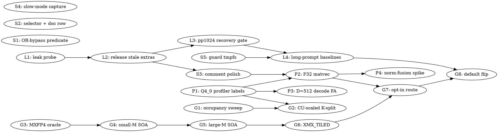

# SYCL Performance Follow-ups (post-pktr wave) Implementation Plan

> **Execution:** Use `team-driven-development` in Claude Code, `pi-team-driven-development` in pi.dev, or `codex-team-driven-development` in Codex.

**Goal:** Close the follow-ups the 2026-09-04 profiling pass opened — first the host-memory leak that collapses prefill past one ubatch (llama.cpp-dfo0, P1), then the measured decode and prefill levers on GPT-OSS and gemma4, the profiler blind spot, and five small hygiene fixes — each landed with hardware evidence on both Arc cards.

**Architecture:** Six independent tracks sharing one rule: implementers write code, tests and builds in their own worktrees; the lead runs every GPU/model-loading step (gates, profiles, A/Bs) serially under `GPU.lock`. Track L fixes the SYCL compute-buffer extra leak inside the backend (no llama-side hook), then re-establishes prefill at realistic prompt lengths. Track C makes the kernel profiler complete and shrinks gemma4's decode tail. Track D scales the MXFP4 gate/up decode kernel to the B70. Track F builds the owner-ruled option C (a custom large-N MXFP4 GEMM on the stored expert layout) in six shippable steps. Track E carries the small fixes. Every task keeps the fork's conventions: one layout per weight, allocations only through the unified cache, opt-in env for new routes until same-build gates pass on both cards.

**Tech Stack:** C++17 / SYCL (oneAPI 2026.1, icpx), ESIMD + XMX DPAS intrinsics, oneDNN 3.11, ggml, CMake + Ninja via `scripts/sycl-build.sh`, pure-Python source gates (pytest-style functions run as scripts), ctest.

**Test Infrastructure:** `ctest --test-dir build -R <name>` (source oneAPI first; GPU tests pin `ONEAPI_DEVICE_SELECTOR=level_zero:1` via their registration and return 77 when no device); pure-Python source gates under `tests/test-sycl-*-source.py`; host unit tests under `tests/`; GPU numerics tests modelled on `tests/test-sycl-mmvq-q8-0-soa-numerics.cpp`; benchmarks through `scripts/bench-guard.sh` (VALID/SUSPECT stamp) once Task S5 lands; correctness gates in CLAUDE.md (Mistral completion `1, 2, 3, …, 10`; GPT-OSS chat `-c 4096`; gemma4 completion byte-identity vs a control binary via the session's `gemma4-gate.sh`). Kernel profiler: `GGML_SYCL_KERNEL_PROFILE=1 GGML_SYCL_KERNEL_PROFILE_FORMAT=both GGML_SYCL_KERNEL_PROFILE_RAW=1 GGML_SYCL_KERNEL_PROFILE_OUTPUT=<prefix>`; analysis script `prof-analyze2.py` (session scratchpad; copy into `scripts/` in Task L4).

**Safety rules that bind every task (from this pass's own incidents):** never loop a model-loading binary; any prefill run past one ubatch (pp>512 at default `-ub`) gets `-r ≤ 5` with `RssAnon` of the bench pid sampled during the run and an abort above 40 GB — a 240-repetition pp1024 run reached 200 GB and the OOM killer took the interactive session down twice; pin the selector; sample `Shmem`/`MemAvailable` before and 5 s after; check `throttle/status` and `reason_pl2` on the B50 before trusting a number.

---

## Team Topology

**Recommended implementers:** 3 concurrent (six tracks, but `ggml-sycl.cpp` and `mmvq.cpp` serialise L/E/C/D/F at their hotspots — see the File Ownership Map; execution spawns one ephemeral implementer PER TASK)
**Reviewers:** spec + quality, spawned FRESH per review (not a standing pair; see team-driven-development)

### Parallel Tracks

| Track | Tasks | Description |
|-------|-------|-------------|
| L | L1, L2, L2b (added 2026-09-04), L3, L4 | P1: compute-buffer extra leak → prefill collapse past one ubatch; long-prompt baselines |
| E | S1, S2, S3, S4, S5, S6 (added 2026-09-04) | Small fixes: tolerance predicate, selector fallback + doc row, comment polish, slow-mode capture script, bench-guard tmpfs |
| C | P1, P2, P3, P4, P5 (added 2026-09-04) | Profiler coverage for Q4_0 decode; gemma4 decode tail (F32 matvec, D=512 attention, norm-fusion spike) |
| D | G1, G2 | GPT-OSS decode: gate/up occupancy sweep, CU-scaled K-split |
| F | G3, G4, G5, G6, G7, G8 | MXFP4 prefill option C: oracle → small-M SOA → large-M SOA → XMX_TILED → dispatch (opt-in) → default flip |

### Dependency Graph



### File Ownership Map

| File/Directory | Tasks | Conflict Risk |
|----------------|-------|---------------|
| `ggml/src/ggml-sycl/ggml-sycl.cpp` | L2, S3, P2, G7 | **Hotspot** — strictly sequential in that order (L2 → S3 → P2 → G7); one implementer at a time holds it |
| `ggml/src/ggml-sycl/mmvq.cpp` | P1, G2 | Sequential (P1 then G2) |
| `ggml/src/ggml-sycl/common.hpp`, `common.cpp` | L2 (accessor), G2 (accessor), G7 (accessor) | Sequential via the ggml-sycl.cpp order; each adds one function at the end of the file |
| `ggml/src/ggml-sycl/dmmv.cpp` | P2 | None |
| `ggml/src/ggml-sycl/fattn-tile.hpp`, `fattn.cpp` | P3 | None |
| `ggml/src/ggml-sycl/mxfp4-stored-gemm.{hpp,cpp}` (new) | G4, G5, G6 | Sequential (same track) |
| `ggml/src/ggml-sycl/CMakeLists.txt` | P2, P3, G4 | Append-only registrations; rebase trivially |
| `tests/CMakeLists.txt` | S4, G3 | Append-only |
| `tests/test-q8-0-layout-cache-path-mmvq.cpp` | S1 | None |
| `tests/test-sycl-mmvq-q8-0-soa-numerics.cpp` | S2 | None |
| `tests/test-sycl-layout-choice.cpp`, `tests/test-sycl-onednn-woq-q8-source.py` | S3 | None |
| `tests/test-sycl-kernel-profiler-source-mmvq.py` | P1 | None |
| `scripts/bench-guard.sh`, `tests/test-bench-guard.sh` | S5 | None |
| `scripts/sycl-decode-mode-capture.sh` (new) | S4 | None |
| `docs/backend/sycl-env-vars.md` | S2, G2, G7, G8 | Row additions; sequential by dependency order |
| `docs/backend/sycl-perf-baselines.md` | S5, L4, G8 | Sequential (S5 → L4 → G8) |

---

### Task L1: Leak probe — count preserved compute-buffer extras per decode (llama.cpp-dfo0, step 1)

**Track:** L
**Depends on:** None
**File scope:**
- Modify: `ggml/src/ggml-sycl/ggml-sycl.cpp:34855-34861` (the COMPUTE-usage early return in `ggml_backend_sycl_buffer_reset`)
- Create: `tests/test-sycl-extra-leak-probe-source.py` (pure-Python source gate: the probe exists, is a WARN, and is gated by an env var so it costs nothing by default)

**Description:**

Mechanism (read-only investigation, verified in code): `ggml_gallocr_alloc_graph` (`ggml/src/ggml-alloc.c:1070-1096`) calls `ggml_vbuffer_reset` → `ggml_backend_sycl_buffer_reset` and then `ggml_gallocr_init_tensor` for every leaf/src/node; a tensor with `data == NULL` goes through `ggml_backend_tensor_alloc` → `ggml_backend_sycl_buffer_init_tensor` (`ggml-sycl.cpp:24690-24703`), which does `new ggml_tensor_extra_gpu{}` and `ctx->tensor_extras.push_back` whenever `tensor->extra == nullptr`. `llm_graph_result::reset()` (`src/llama-graph.cpp:1322-1353`) re-inits the ggml context on every rebuild, so every activation tensor is a fresh struct with `extra == nullptr`. `ggml_backend_sycl_buffer_reset` (`ggml-sycl.cpp:34839-34881`) returns early for COMPUTE buffers and PRESERVES the vector on the premise that `init_tensor` is not called again — false on a rebuild. There is one reuse slot (`llama_context::gf_res_prev`, `src/llama-context.h:370`); a pp1024 decode alternates two shapes (n_kv 512 then 1024), so both ubatches rebuild every call. `ggml_tensor_extra_gpu` (`common.hpp:3408-4161`) carries 33 `GGML_SYCL_MAX_DEVICES`(=48)-sized arrays including four `mem_handle[48]`, `events[48][MAX_STREAMS]`, `std::mutex[48]` — tens of KB each. Measured: ~1.0 GB of RssAnon retained per pp1024 decode, 0 per pp512 decode after the first. This task confirms the mechanism with one counter before anything is changed.

**Acceptance Criteria:**

- [ ] With `GGML_SYCL_EXTRA_LEAK_PROBE=1`, every COMPUTE-buffer reset logs one WARN line `[EXTRA-LEAK-PROBE] buf=<p> preserving <n> extras this call, cumulative=<N> (~<MB> MB @ sizeof=<bytes>)`; without the env var nothing is logged and no code runs beyond one `getenv` cached in a function-local static.
- [ ] Lead's run (`ONEAPI_DEVICE_SELECTOR=level_zero:0 llama-bench -m /models/mistral-7b-v0.1.Q4_0.gguf -p 1024 -n 0 -r 5` with RssAnon sampled every 0.5 s): the cumulative-MB series and the RssAnon series are recorded side by side on llama.cpp-dfo0; the same for `-p 512 -r 5` (expect `preserving` to stop growing after the first call).
- [ ] The commit message states the measured `sizeof(ggml_tensor_extra_gpu)` and extras-per-rebuild, and whether cumulative-MB explains the RSS growth (≥ 80% of it) or not — if NOT, Task L2 is re-scoped by the lead before it is spawned (the residual then needs a `mallinfo2()` delta at the same site; add it in this task only if the first run leaves ≥ 20% unexplained).
- [ ] `python3 tests/test-sycl-extra-leak-probe-source.py` passes (probe present, WARN level, env-gated); 4/4 existing pktr gates and the woq gate unchanged.

**Implementation Guide:**

1. **RED:** `tests/test-sycl-extra-leak-probe-source.py` (structure copied from `tests/test-sycl-q8-dense-layout-rule-source.py`: read the file, locate `ggml_backend_sycl_buffer_reset` with the whitespace-tolerant `ws_find`, assert the body contains `GGML_SYCL_EXTRA_LEAK_PROBE`, `GGML_LOG_WARN(` and `[EXTRA-LEAK-PROBE]`). Run → fails (no probe).

2. **GREEN:** replace `ggml-sycl.cpp:34855-34861` with

```cpp
    if (ggml_backend_buffer_get_usage(buffer) == GGML_BACKEND_BUFFER_USAGE_COMPUTE) {
        GGML_ASSERT(ggml_backend_buffer_has_stable_base(buffer) &&
                    "COMPUTE buffer_reset skip requires STABLE_BASE: tensor->data pointers must be stable");
        ggml_backend_sycl_buffer_context * ctx = (ggml_backend_sycl_buffer_context *) buffer->context;
        // llama.cpp-dfo0 probe: a graph REBUILD (llm_graph_result::reset re-inits the ggml
        // context) mints fresh tensor structs, so init_tensor allocates a new extra per tensor
        // and the ones preserved here become unreachable. Count them so the leak is measurable.
        static const bool leak_probe = [] {
            const char * e = std::getenv("GGML_SYCL_EXTRA_LEAK_PROBE");
            return e != nullptr && e[0] == '1';
        }();
        if (leak_probe && ctx != nullptr) {
            static std::atomic<size_t> preserved_total{ 0 };
            const size_t n     = ctx->tensor_extras.size();
            const size_t total = preserved_total.fetch_add(n, std::memory_order_relaxed) + n;
            GGML_LOG_WARN("[EXTRA-LEAK-PROBE] buf=%p preserving %zu extras this call, cumulative=%zu (~%.1f MB @ sizeof=%zu)\n",
                          (void *) buffer, n, total, (double) total * sizeof(ggml_tensor_extra_gpu) / (1024.0 * 1024.0),
                          sizeof(ggml_tensor_extra_gpu));
        }
        GGML_SYCL_DEBUG("[SOA-DEBUG] buffer_reset: PRESERVING %zu extras for compute buffer=%p\n",
                        ctx ? ctx->tensor_extras.size() : (size_t) 0, (void *) buffer);
        return;
    }
```

   (`<atomic>` and `<cstdlib>` are already included by this TU — verify with `cat ggml/src/ggml-sycl/ggml-sycl.cpp | grep -n '#include <atomic>\|#include <cstdlib>'`.) Run the source gate → GREEN.

3. Build `./scripts/sycl-build.sh llama-bench` (mega-TU, ~15 min, BUILD.lock). Lead runs the two probed benches with the RSS sampler (the sampler command is in the session scratchpad's `rss-pp1024.trace` producer — reproduce it in `scripts/sycl-rss-sample.sh` if Task S4 has not landed yet; otherwise reuse S4's sampler).

**Commit:**

```bash
git add ggml/src/ggml-sycl/ggml-sycl.cpp tests/test-sycl-extra-leak-probe-source.py
git commit -m "diag(sycl): env-gated probe counting compute-buffer extras preserved across graph rebuilds (llama.cpp-dfo0)"
```

**Gotchas:**
- WARN, not INFO: INFO is dropped at default verbosity in every tool (CLAUDE.md, `common/log.cpp:444`).
- Do not "fix" anything in this task; the probe's numbers decide L2's design.
- `-r 5` cap and RSS abort are mandatory; the process reaches 7 GB in 7 decodes.

---

### Task L2: Release stale compute-buffer extras on graph rebuild (llama.cpp-dfo0, step 2)

**Track:** L
**Depends on:** Task L1
**File scope:**
- Modify: `ggml/src/ggml-sycl/ggml-sycl.cpp:24690-24703` (`ggml_backend_sycl_buffer_init_tensor`: stamp a generation on the extra), `:34839-34881` (`ggml_backend_sycl_buffer_reset`: release extras from an older generation), and the `ggml_backend_sycl_buffer_context` struct (grep `struct ggml_backend_sycl_buffer_context` in ggml-sycl.cpp; add `uint64_t alloc_generation = 0;`)
- Modify: `ggml/src/ggml-sycl/common.hpp:3408` region (add `uint64_t alloc_generation = 0;` to `ggml_tensor_extra_gpu`)
- Create: `tests/test-sycl-compute-buffer-extra-reuse.cpp` (GPU test, `level_zero:1`, SKIP 77: alternate two graph shapes through `ggml_backend_sched` 20 times; assert the compute buffer's extras count stays ≤ 2× the larger graph's tensor count via a new debug accessor `ggml_backend_sycl_buffer_debug_extra_count(ggml_backend_buffer_t)` declared in `ggml/include/ggml-sycl.h` under `#ifdef GGML_SYCL_PRIVATE_TESTING` — the same private-testing define `tests/test-layout-cache`'s registration passes, see `tests/CMakeLists.txt:2279-2312`)

**Description:**

The early return's premise ("init_tensor is not called again") is true for a REUSED graph (no alloc_graph call at all) and false for a REBUILT one (every tensor re-inits). Distinguish them with a generation counter: `buffer_reset` increments `ctx->alloc_generation`; `init_tensor` stamps `extra->alloc_generation = ctx->alloc_generation`. At the next `buffer_reset`, every extra whose generation is older than the current one belonged to a graph that has since been rebuilt (its tensor structs were re-initialised by `ggml_init` over the same meta buffer), so release it and drop it from the vector — without dereferencing the old `ggml_tensor *`. Extras from the current generation are kept, preserving the fast path the comment protects. No llama-side hook, no change to the WEIGHTS path (`:34864-34880`).

**Acceptance Criteria:**

- [ ] The GPU test passes: extras count bounded across 20 alternating rebuilds; the same test with the fix reverted (scratch) fails (count grows by ~one graph's tensors per iteration) — record both counts in the commit.
- [ ] Lead: `-p 1024 -n 0 -r 5` RssAnon flat after the first decode (± 50 MB), probe line shows `preserving` = current graph size only; `-p 512` unchanged.
- [ ] Prefill recovery: pp1024 and pp2048 within 10% of pp512 tok/s at default `-ub` on both cards for Mistral Q4_0 (interleaved two-binary A/B vs the L1 binary, 2 pairs each; expected B70 pp1024 ≈ 3000+ vs 1437) — if the number moves less than that, the remaining per-ubatch cost is a different mechanism and L3 records it; this task still lands on the leak evidence alone.
- [ ] All correctness gates unchanged (Mistral Q4/Q8 both cards, GPT-OSS chat, gemma4 identity).
- [ ] The `[SOA-DEBUG]` and probe lines updated to report `released=<n> kept=<m>`.

**Implementation Guide:**

1. **RED:** `tests/test-sycl-compute-buffer-extra-reuse.cpp` — init the SYCL backend (`ggml_backend_sycl_init(0)`), create a sched with `ggml_backend_sched_new(&backend, nullptr, 1, 4096, false, true)`, build graph A (`x[512,4096] → rms_norm → mul_mat with a Q8_0 weight`) and graph B (same with `x[1024,4096]`) in fresh `ggml_init` contexts each iteration (mirror `llm_graph_result::reset`: `no_alloc = true`, same `mem_buffer` reused), alternate `ggml_backend_sched_alloc_graph(sched, gf)` + `ggml_backend_sched_graph_compute` 20 times; after each, read `ggml_backend_sycl_debug_last_compute_buffer_extra_count()` — a TU-static in `ggml-sycl.cpp` that `buffer_reset` updates with the post-release vector size, declared in `ggml/include/ggml-sycl.h` under `#ifdef GGML_SYCL_PRIVATE_TESTING` (the sched API does not hand out the compute buffer, so the accessor is process-global by design). Assert `count <= 2 * n_tensors_B`. Run today → fails (count grows).

2. **GREEN:** in `init_tensor` after `ctx->tensor_extras.push_back({ tensor, extra });` add `extra->alloc_generation = ctx->alloc_generation;` and for the reuse branch (`tensor->extra != nullptr`) also stamp. In `buffer_reset`'s COMPUTE branch, replace the early `return` with:

```cpp
        ctx->alloc_generation++;
        size_t released = 0, kept = 0;
        auto & v = ctx->tensor_extras;
        for (size_t i = 0; i < v.size();) {
            ggml_tensor_extra_gpu * extra = v[i].second;
            if (extra->alloc_generation + 1 < ctx->alloc_generation) {
                // stamped by an allocation two generations back: its ggml_tensor was re-initialised
                // by a graph rebuild since; never dereference v[i].first
                release_extra_gpu(extra);
                v[i] = v.back();
                v.pop_back();
                ++released;
            } else {
                ++i;
                ++kept;
            }
        }
        GGML_SYCL_DEBUG("[SOA-DEBUG] buffer_reset: compute buffer=%p released=%zu kept=%zu gen=%llu\n",
                        (void *) buffer, released, kept, (unsigned long long) ctx->alloc_generation);
        g_sycl_debug_last_compute_buffer_extra_count = v.size();  // TU-static read by the GGML_SYCL_PRIVATE_TESTING accessor
        return;
```

   The `+ 1` keeps the previous generation's extras alive through the reset that precedes the rebuild that will re-init them (they are stamped again if reused, released one reset later otherwise); this bounds the vector at ≤ 2 graphs. Read `release_extra_gpu` (grep it) to confirm it is safe on an extra whose tensor is gone (it must not touch `tensor`).

3. Build `llama-bench llama-completion llama-cli test-sycl-compute-buffer-extra-reuse`; lead runs the test, probes, gates, A/B.

**Commit:**

```bash
git add ggml/src/ggml-sycl/ggml-sycl.cpp ggml/src/ggml-sycl/common.hpp ggml/include/ggml-sycl.h tests/test-sycl-compute-buffer-extra-reuse.cpp ggml/src/ggml-sycl/CMakeLists.txt
git commit -m "fix(sycl): release compute-buffer tensor extras orphaned by graph rebuilds -- bounds host RSS and restores multi-ubatch prefill (llama.cpp-dfo0)"
```

**Gotchas:**
- Never dereference `v[i].first` for a stale entry; the struct memory was re-initialised.
- `release_extra_gpu` must run with no device work in flight that references the extra's handles. **Amendment 2026-09-04 (llama.cpp-kqy7 c-cnko/c-2d63):** the original wording here claimed "sched synchronises" before the reset; that is false on the ordinary path (the only synchronize is the realloc fallback at ggml-backend.cpp:~2297; graph_compute is async). The real argument, which the landed comment states: the one-generation lag means a released extra's graph was rebuilt a full generation earlier, and `release_extra_gpu` is called with an empty streams vector so no device-storage release runs (the arena lease stays owned by the buffer). Keep the WEIGHTS path untouched.
- `ggml-sycl.cpp` hotspot: this task holds it first; S3/P2/G7 rebase after.

---

> **Amendment 2026-09-04 (execution, llama.cpp-kqy7 / llama.cpp-dfo0 c-hwke):** L2 bounds the COMPUTE-buffer
> extras (hardware: `released=838 kept=582` every rebuild vs the L1 control growing to 9218) but the pp1024
> RssAnon still grows ~300 MB per decode. A jemalloc heap profile attributed the residual to
> `tiered_kv_buffer_init_tensor`, which allocates a fresh `ggml_tensor_extra_gpu` for every KV VIEW tensor on every
> rebuild (96 per rebuild) and never releases it. That is **Task L2b** (llama.cpp-asdt, Track L, depends on L2,
> before S3 in the ggml-sycl.cpp hotspot order); the "RssAnon flat after the first decode" acceptance moves from
> L2 to L2b. Graph replay, oneDNN (GEMM/PP/SDPA), the unified-kernel dispatch and glibc retention were each tested
> and refuted for the residual (kqy7 c-53px, c-8r4m, c-vufg).

> **Amendment 2026-09-04 (execution, llama.cpp-asdt c-qnq7, commit 50f075464): L2b lands but does NOT close the
> pp1024 acceptance.** The KV-view-extras fix is correct and tested (ctest GREEN on both cards; a design review
> found and closed a real same-graph collision -- two DIFFERENT, both-live views of the same K tensor at the
> same offset within one graph, e.g. `get_k`'s attention window vs `cpy_k`'s `ggml_set_rows()` whole-tensor
> result -- via a process-wide rebuild epoch instead of the unsafe key-only release-and-replace a first draft
> used). Measured on hardware (level_zero:1, `-p 1024 -n 0 -r 5`, RssAnon sampled on the bench pid): the fix
> reduces the L2-alone residual from ~310 to ~250 MB/decode, a ~60 MB/decode drop that lines up closely with the
> naive prediction for the mechanism it targets (`sizeof(ggml_tensor_extra_gpu)=277,704 B * 96 views/rebuild *
> 2 rebuilds/pp1024-decode` =~ 51 MB/decode; `process_ubatch()` calls `ggml_backend_sched_alloc_graph()` once per
> ubatch, so `n_ubatch=512` gives exactly 2 rebuilds for a pp1024 decode). So the fix is closing the mechanism it
> was built for, but that mechanism was never the dominant contributor to the ~300 MB/decode this amendment's own
> predecessor attributed to it: ~250 of that ~300 MB/decode remains unaccounted for. The **acceptance criterion
> stays open** pending a fresh jemalloc profile on the post-L2b binary to attribute the true dominant residual;
> do not re-close L2b's acceptance line until that lands. Code-only checks (no GPU) ruled out three candidate
> causes for the gap: layer K/V tensors are roots, not views-of-views (`src/llama-kv-cache.cpp` constructor,
> `ggml_new_tensor_3d`, `view_src == nullptr`); the per-rebuild epoch counter demonstrably advances twice per
> pp1024 decode as designed; and the debug accessor reads the same `view_extras` container the release path
> prunes (single-KV-buffer models only -- an ISWA/SWA model with two live tiered KV buffers would need its own
> check, not applicable to the Mistral gate this was measured against).

> **Amendment 2026-09-04 (attribution complete, lead): the ~250 MB/decode residual is NOT a further leak.**
> A real bug was found and fixed in the same round: the older-epoch release branch called `release_extra_gpu()`
> exactly once regardless of `kv_view_extra_entry::share_count`, so a shared entry's refcount (1 + share_count)
> never reached zero and the object leaked, invisible to the entries-only `kv_view_extras` accessor -- fixed by
> looping the release `1 + share_count` times, with a new live-object counter
> (`ggml_backend_sycl_debug_live_kv_view_extra_count`, GGML_SYCL_PRIVATE_TESTING) that catches this class of bug
> where a container-membership count cannot. But in-process jemalloc dumps plus the L1 probe (kept=838/
> released=838 at every one of 12 resets) show the residual is explained without any further leak: growth tracks
> RSS through L2's bounded two-generation COMPUTE-buffer window (1676 x 277 KB =~ 465 MB) plus the KV views, then
> decelerates after the ramp (+120/+60/+90/+90 MB) -- i.e. the residual is the SIZE of that bounded window and the
> allocator churn of 277,704 B objects, not an unbounded leak. The lever is **llama.cpp-h9uv** (right-size
> `ggml_tensor_extra_gpu`, currently 277,704 B because `GGML_SYCL_MAX_DEVICES=48` sizes 33 device-indexed arrays
> on a 3-device box): the "RssAnon flat after the first decode" acceptance moves there. L2b closes as designed
> (its own GPU test's flat `kv_view_extras`/`kv_view_extras_live` across 20 rebuilds), with the share_count bug
> fixed in the same round. Five candidate mechanisms were checked and ruled out or found inapplicable to this
> benchmark before the attribution above closed the search: the graph-lifetime handle-retention list
> (`mem-handle.cpp` `graph_unwaitable`, cleared only at a PP<->TG phase boundary or backend teardown -- inapplicable
> to a pure `-p 1024 -n 0` prefill-only run, which has no such transition); nine tensor-pointer-keyed maps in
> `ggml-sycl.cpp` (all function-local, freed every call); `UnifiedKernel::plan_cache_valid_` (a single bounded
> slot, not a growing map); the oneDNN scratch pointer tables in `unified-cache.hpp` (matched insert/erase pairs);
> and `g_moe_down_sum_shadow_entries` (properly cleared, and MoE-only -- never populated for dense Mistral).

### Task L3: Prefill scaling gate and per-ubatch residual (llama.cpp-dfo0, step 3)

**Track:** L
**Depends on:** Task L2
**File scope:**
- Create: `scripts/sycl-prefill-scaling.sh` (wraps `llama-bench -p 128,512,1024,2048 -n 0 -r 2` per model/card through `scripts/bench-guard.sh`, prints the 6×4 tok/s table and a PASS/FAIL against "pp1024 ≥ 0.9 × pp512")
- Create: `tests/test-sycl-prefill-scaling.sh` (fake-bench unit test of the table parser and the ratio verdict; registered in `tests/CMakeLists.txt` like `test-bench-guard`)

**Description:** turns the 2026-09-04 scaling table into a runnable gate so the collapse cannot return unseen, and records what remains of the per-ubatch cost after L2 (the ~78 ms fixed cost per decode seen at pp128 is not explained by the leak and stays on the ticket).

**Acceptance Criteria:**

- [ ] The script prints, for each of the six model/card pairs, pp128/512/1024/2048 and `ratio1024=<pp1024/pp512>`; exit 1 if any ratio < 0.9.
- [ ] Unit test: fed canned `llama-bench` markdown rows, the parser extracts the four values and the verdict flips at 0.9.
- [ ] Lead runs it on master after L2: all six ratios ≥ 0.9 (else the ticket stays open with the table).
- [ ] The pp128 row's per-decode fixed cost is computed (`t128 = 128/pp128`, `t512 = 512/pp512`, intercept) and recorded on llama.cpp-dfo0 as the residual.

**Commit:** `scripts(sycl): prefill scaling gate (pp128..pp2048 per model/card) with the pp1024/pp512 floor (llama.cpp-dfo0)`.

**Gotchas:** every run goes through bench-guard (S5 must have landed or the guard will refuse on tmpfs Shmem); no `-r` above 2 at pp2048.

---

### Task L4: Long-prompt baseline rows (pp2048 / pp8192) in the baselines doc (llama.cpp-bn5k item 3, unblocked by L2 + S5)

**Track:** L
**Depends on:** Task L3, Task S5
**File scope:**
- Modify: `docs/backend/sycl-perf-baselines.md` (replace the 2026-09-04 snapshot's scaling table with a guard-VALID "Long-Prompt Baselines" section using the skeleton recorded on llama.cpp-bn5k c-mjuq: `| card | model | PP2048 | TG128 | PP8192 | TG128 | ctx achieved | notes |`)
- Modify: `scripts/parse-sycl-bench-matrix.py` (add arms `b70-gemma4`, `b50-gemma4` and the pp2048 test name; extend `--self-test`)

**Acceptance Criteria:**

- [ ] 5 guarded processes per cell (`bench-guard.sh --log`, all `VALID`), mean ± sd across processes, on both cards for Mistral Q4_0, gemma4 E4B Q8_0 (`/Storage/GenAI/models/stock-gemma-4-E4B-it.Q8_0.gguf`), GPT-OSS 20B; pp8192 rows note the achieved `n_ctx` if the KV refusal (llama.cpp-uize) forces a smaller `-c`.
- [ ] `python3 scripts/parse-sycl-bench-matrix.py --self-test` passes with the new arms; `--dir artifacts/perf-<sha>` returns 0.
- [ ] The doc's "2026-09-04 snapshot" section is demoted to a dated note pointing at the new table.

**Commit:** `docs(sycl): long-prompt baselines (pp2048/pp8192) on both cards, guard-VALID (llama.cpp-bn5k item 3)` plus the `artifacts/perf-<sha>/` logs.

**Gotchas:** pp8192 with 5 processes per cell is ~30 GPU-minutes per model/card; run it as a detached driver the lead polls, never inside one Bash call (10-minute ceiling); RSS sampler on for every run until L2 is proven on pp8192 too.
### Task S1: Fix the OR-bypass tolerance predicate in `test-q8-0-layout-cache-path-mmvq` (llama.cpp-16xg)

**Track:** E (small fixes)
**Depends on:** None
**File scope:**
- Modify: `tests/test-q8-0-layout-cache-path-mmvq.cpp:238-251` (the compare loop and `pass` predicate)
- Test: the file is its own ctest (`test-q8-0-layout-cache-path-mmvq`, registered in `ggml/src/ggml-sycl/CMakeLists.txt`; GPU, `level_zero:1`)

**Description:**

The pass predicate is `pass = (max_rel < rel_tol || max_diff < abs_tol) && min_abs > 1.0f`. The OR lets a kernel that is wrong on a subset of elements pass whenever the OTHER aggregate stays small, and `min_abs > 1.0f` refuses to judge small-magnitude outputs. Port the per-element form that `tests/test-sycl-mmvq-q8-0-soa-numerics.cpp` (`compare()`, lines ~360-390) uses: count violations of `diff > abs_tol + rel_tol * |ref|` and fail on any.

**Acceptance Criteria:**

- [ ] The predicate is per-element; the test prints `violations=<n>/<total>` and fails when `n > 0`.
- [ ] RED shown: with a deliberately corrupted output (see step 1) the OLD predicate passes and the NEW one fails.
- [ ] `ONEAPI_DEVICE_SELECTOR=level_zero:1 ctest --test-dir build -R '^test-q8-0-layout-cache-path-mmvq$' --output-on-failure` passes on the real kernel (lead runs it).
- [ ] `clang-format-19 --dry-run -Werror tests/test-q8-0-layout-cache-path-mmvq.cpp` reports nothing new on the changed lines.

**Implementation Guide:**

1. **RED (positive control for the new predicate, done as a scratch copy, not committed):** copy the file to the session scratchpad, add after the GPU readback

```cpp
    // scratch-only mutant: corrupt 1% of outputs by 10% of their magnitude
    for (int i = 0; i < nrows * batch; i += 100) {
        gpu_output[i] *= 1.10f;
    }
```

   build that copy against the same target (`cmake --build build --target test-q8-0-layout-cache-path-mmvq` after temporarily pointing the CMake source at the copy, or simply apply the mutant in-tree, build, run, then revert) and run it: the OLD predicate prints `Result: PASS` (max_rel is large but max_diff for those elements is under abs_tol=1e-2 only if outputs are small — if it FAILS instead, scale the mutant to `*= 1.001f` until the old predicate passes; record the mutant that passes the old predicate in the commit message). This is the fail-open the task exists to close.

2. **GREEN:** replace lines 238-251 with

```cpp
    const float rel_tol = 1e-3f;
    const float abs_tol = 1e-2f;
    int   violations = 0;
    float max_diff   = 0.0f;
    float max_rel    = 0.0f;
    for (int i = 0; i < nrows * batch; ++i) {
        const float ref  = ref_output[i];
        const float diff = std::fabs(gpu_output[i] - ref);
        max_diff = std::max(max_diff, diff);
        if (std::fabs(ref) > 1e-6f) {
            max_rel = std::max(max_rel, diff / std::fabs(ref));
        }
        if (diff > abs_tol + rel_tol * std::fabs(ref)) {
            if (violations < 8) {
                printf("  violation[%d] ref=%.6e got=%.6e diff=%.6e\n", i, ref, gpu_output[i], diff);
            }
            ++violations;
        }
    }
    const bool pass = violations == 0;
    printf("Max diff: %.6e, max rel: %.6e, violations=%d/%d (tol rel=%.1e abs=%.1e)\n",
           max_diff, max_rel, violations, nrows * batch, rel_tol, abs_tol);
    printf("Result: %s\n", pass ? "PASS" : "FAIL");
```

   (drop `min_abs` entirely — it is not read anywhere else in the file; verify with `cat tests/test-q8-0-layout-cache-path-mmvq.cpp | grep -n min_abs`). Re-run the step-1 mutant: must print `FAIL` with `violations=` > 0. Revert the mutant.

3. Build only this target: `./scripts/sycl-build.sh test-q8-0-layout-cache-path-mmvq` (under the worktree's BUILD.lock; end backgrounded builds with `exit $rc`). The lead runs the ctest on the B50.

**Commit:**

```bash
git add tests/test-q8-0-layout-cache-path-mmvq.cpp
git commit -m "test(sycl): per-element tolerance in test-q8-0-layout-cache-path-mmvq -- the OR-bypass passed a corrupted output (llama.cpp-16xg)"
```

**Gotchas:**
- Implementers do not run GPU binaries; report the sha and the lead runs the ctest.
- Keep `rel_tol`/`abs_tol` values; only the predicate shape changes. The numerics test's header (`tests/test-sycl-mmvq-q8-0-soa-numerics.cpp:31-46`) records why abs_tol dominates at these magnitudes.
- `clang-format-19 -i` is forbidden on this tree (180 lines of unrelated drift); use `--dry-run -Werror` on the file and fix only your lines.

---

### Task S2: Device-selector fallback in `test-sycl-mmvq-q8-0-soa-numerics` and the ONEDNN_SOA doc row (llama.cpp-wti1)

> **Amendment 2026-09-04 (execution, llama.cpp-2x3m c-oftt / c-tb0e):** two corrections to the text below.
> (1) The RED probe `grep -c 'Arrow Lake'` returns 0 even when the iGPU is enumerated: the runtime names it
> `Intel Graphics`; probe `grep -c 'level_zero:gpu:2'` (1 when unpinned) instead. (2) The prescribed
> `if (!getenv) setenv(...)` prologue (the `test-sycl-zone-reset-live-refusal.cpp:258-265` form) is a
> silent no-op in every binary linked against `libccl.so.1`: oneCCL's static initializer
> (`_GLOBAL__sub_I_comm.cpp`) constructs a `sycl::event` at load, so libsycl memoizes
> `ONEAPI_DEVICE_SELECTOR` before `main()` (gdb-traced). The landed form re-execs:
> `int main(int, char ** argv)`; if unset, `setenv(...) == 0 && execv("/proc/self/exe", argv)`, warn and
> fall through on failure. The twenty siblings carrying the old form are fail-open the same way; that sweep is
> **Task S6** (llama.cpp-5q1r, Track E, depends on S2), not part of S2.


**Track:** E
**Depends on:** None
**File scope:**
- Modify: `tests/test-sycl-mmvq-q8-0-soa-numerics.cpp:390` (`int main()` prologue) and its header comment lines 12-17
- Modify: `docs/backend/sycl-env-vars.md:36` (the `GGML_SYCL_Q8_ONEDNN_SOA=0` row)

**Description:**

Under ctest the registration pins `level_zero:1`, but the header's direct-invocation command runs unpinned and enumerates the iGPU (llama.cpp-403s: 127.8 GB Shmem unpinned vs 2.4 GB pinned). Twenty sibling GPU tests already carry the fallback; use the `tests/test-sycl-zone-reset-live-refusal.cpp:258-265` form (B50, with the comment). Separately, the doc row says the gate admits "Q8_0 dense weights in SOA layout" but the code (`ggml-sycl.cpp` ONEDNN_SOA eligibility at the priority table and `pick_kernel_for_layout`) admits ANY SOA-resident Q8_0 weight; measured 2026-09-04 that is worth +32% GPT-OSS pp512 on the B70 (1772 vs 1342 with `=0`) at no tg cost, so the row is corrected, not the code.

**Acceptance Criteria:**

- [ ] `main()` sets `ONEAPI_DEVICE_SELECTOR=level_zero:1` only when unset, before any SYCL call.
- [ ] Header command block still correct (it already sources oneAPI; keep it).
- [ ] Doc row states "any Q8_0 weight resident in SOA layout (pktr demotions, the `GGML_SYCL_Q8_DENSE_LAYOUT=soa` opt-in set, the os8k tied head)" and cites the +32% B70 GPT-OSS pp512 number; notes `GGML_SYCL_Q8_DENSE_LAYOUT=soa` users get oneDNN PP by default and opt out with `GGML_SYCL_Q8_ONEDNN_SOA=0`.
- [ ] `python3 tests/test-sycl-onednn-woq-q8-source.py` still 9/9 (it does not parse the doc, but run it to be sure nothing else moved).

**Implementation Guide:**

1. **RED (observable, not a unit test):** `unset ONEAPI_DEVICE_SELECTOR; ./build/bin/test-sycl-mmvq-q8-0-soa-numerics 2>&1 | grep -c 'Arrow Lake'` — the lead runs this once on the current binary and records the count (expected ≥ 1: the iGPU is enumerated). Do NOT loop it.

2. **GREEN:** at the top of `main()` (line 390):

```cpp
int main() {
    // ctest supplies ONEAPI_DEVICE_SELECTOR via the registration's ENVIRONMENT; this is
    // only a fallback for bare invocation and must be set before the SYCL runtime
    // enumerates devices (unpinned, the iGPU's 231 GB "VRAM" is claimed -- llama.cpp-403s).
    if (!std::getenv("ONEAPI_DEVICE_SELECTOR")) {
        setenv("ONEAPI_DEVICE_SELECTOR", "level_zero:1", 1);
    }
```

   `<cstdlib>` was removed from this file in c1c67633b; `setenv`/`getenv` need it back — add `#include <cstdlib>` to the include block (the earlier removal was correct then; this task re-adds it for a real use).

3. Doc row: edit line 36 of `docs/backend/sycl-env-vars.md` in place; keep the row's existing shape, change only the scope sentence and add the measured number with the date and sha (`2c2570fe3`, B70, `-p 512 -n 128`, 3 interleaved pairs: 1772/1769/1774 vs 1344/1340/1343).

**Commit:**

```bash
git add tests/test-sycl-mmvq-q8-0-soa-numerics.cpp docs/backend/sycl-env-vars.md
git commit -m "test+docs(sycl): selector fallback for the Q8_0 numerics test; ONEDNN_SOA row states the real gate scope (llama.cpp-wti1)"
```

**Gotchas:**
- The header's process-language rule from c-x0ab: no session/agent names in the comment.
- Rebuild only `test-sycl-mmvq-q8-0-soa-numerics`; the lead reruns it on the B50 after (`ctest -R '^test-sycl-mmvq-q8-0-soa-numerics$'`, expect 30/30 violations=0).

---

### Task S3: Comment-accuracy polish left over from pktr (llama.cpp-nyse)

**Track:** E
**Depends on:** None (but shares `ggml-sycl.cpp` with nothing else in this plan — verify at spawn time)
**File scope:**
- Modify: `tests/test-sycl-layout-choice.cpp:1795` (one sentence)
- Modify: `ggml/src/ggml-sycl/ggml-sycl.cpp:42884-42885` (one sentence)
- Modify: `tests/test-sycl-onednn-woq-q8-source.py:394` (wrap a 130-char assert message)

**Description:** three comment/message-only corrections recorded on the ticket. No behaviour change; the two Python gates and `test-sycl-layout-choice`'s dense cases are the checks.

**Acceptance Criteria:**

- [ ] `tests/test-sycl-layout-choice.cpp:1795` no longer claims the case "exercises the ordinary layout_policy::get_optimal() path"; it says the case passes `GGML_LAYOUT_COALESCED` as the target and `ggml_sycl_adjust_layout_for_tensor` validates/demotes a caller-supplied target (it never calls `get_optimal`).
- [ ] `ggml-sycl.cpp:42884-42885` names the tickets: "separate pre-existing questions tracked as llama.cpp-zq23 (dkw0 full_tensor gap) and llama.cpp-kpvf (planned-SOA fp32 path), not fixed here".
- [ ] The assert message at `test-sycl-onednn-woq-q8-source.py:394` is split across two string literals so no line exceeds 120 columns; `python3 tests/test-sycl-onednn-woq-q8-source.py` 9/9, `python3 tests/test-sycl-q8-dense-layout-rule-source.py` 4/4.
- [ ] `git diff --stat` shows exactly those three files; no non-comment change under `ggml/` (`git diff -- ggml/ | grep -E '^[+-]' | grep -vE '^(\+\+\+|---)' | grep -vE '^[+-]\s*(//|/\*|\*|$)'` is empty).

**Implementation Guide:** RED = the three current texts (quote them in the commit); GREEN = the replacement sentences above. Build: `./scripts/sycl-build.sh llama-bench` is required because `ggml-sycl.cpp` changes (comment-only, ~15 min); the lead runs the four Mistral gates afterwards (gates-only, no A/B, per the round-6 precedent).

**Commit:**

```bash
git add tests/test-sycl-layout-choice.cpp ggml/src/ggml-sycl/ggml-sycl.cpp tests/test-sycl-onednn-woq-q8-source.py
git commit -m "docs(sycl): pktr comment-accuracy polish from quality re-review 7 (llama.cpp-nyse)"
```

**Gotchas:**
- `ggml-sycl.cpp` is the 60k-line TU: BUILD.lock before the first edit, single ninja, never `clang-format-19 -i`.
- Do not touch the `#include <exception>` order in common.hpp (accepted pre-existing drift, decision recorded in 2e2b8fc9c).

---

### Task S4: B70 GPT-OSS slow-mode capture script (llama.cpp-gvu7)

**Track:** E
**Depends on:** None
**File scope:**
- Create: `scripts/sycl-decode-mode-capture.sh`
- Create: `tests/test-sycl-decode-mode-capture.sh` (pure-shell test with fake sysfs, mirroring `tests/test-bench-guard.sh`'s `mk_tree`/`mk_meminfo` pattern)
- Modify: `tests/CMakeLists.txt` (register the shell test next to `test-bench-guard`, labels `sycl;source`)

**Description:** the ~28 vs ~39-40 tok/s B70 GPT-OSS decode mode cannot be reproduced on demand; the ticket's next step is a capture that records, PER RUN and DURING decode, everything needed to diff a slow run against a fast one: `uptime`/loadavg, `pgrep -c ffmpeg`, B70 `act_freq`/`cur_freq`/throttle sampled every 0.5 s while the bench runs, RssAnon of the bench pid, and a kernel-profile CSV. The script wraps ONE `llama-bench` invocation (like `bench-guard.sh`), never loops, and writes one directory per run.

**Acceptance Criteria:**

- [ ] `scripts/sycl-decode-mode-capture.sh --out <dir> -- <llama-bench args>` runs the bench once under `timeout -k 15 900`, samples `<card>/device/tile0/gt0/freq0/{act_freq,cur_freq,throttle/status,throttle/reason_pl2}` and `/proc/<pid>/status` RssAnon every 0.5 s into `<dir>/timeline.tsv`, records `<dir>/host.txt` (loadavg, ffmpeg count, Shmem, MemAvailable) before and after, sets `GGML_SYCL_KERNEL_PROFILE=1 GGML_SYCL_KERNEL_PROFILE_FORMAT=csv GGML_SYCL_KERNEL_PROFILE_OUTPUT=<dir>/kprof` for the run, and prints the tg128 value plus `mode=slow|fast|unknown` using the thresholds 32 / 36 tok/s.
- [ ] The card is derived live from the PCI symlink (copy `bench-guard.sh`'s derivation, `0000:03:00.0` = B70), never a static `cardN`.
- [ ] Refuses (exit 3) with the same three preflight classes as `bench-guard.sh`, by invoking it rather than re-implementing it: the capture script runs `scripts/bench-guard.sh --log <dir>/bench.log -- llama-bench <args>` as its child, so the VALID/SUSPECT verdict comes for free.
- [ ] Shell test: with `--sysfs-card <fake>` and `--pgrep-cmd false` and a fake bench command that prints a canned tg128 row and sleeps 2 s, the timeline has ≥ 3 samples and the mode line is computed correctly for 28.0 (slow) and 39.5 (fast).

**Implementation Guide:** RED = write `tests/test-sycl-decode-mode-capture.sh` first (structure copied from `tests/test-bench-guard.sh`: `mk_tree`, `expect_status`), run it: fails with "no such file". GREEN = the script. The sampler is a background `while kill -0 $pid; do ...; sleep 0.5; done` loop started after `bench-guard.sh` launches the bench; find the bench pid with `pgrep -P $guard_pid -x llama-bench` (bench-guard runs the command as its child under `timeout`, so walk `pgrep -P` twice — verify with `pstree -p` on a real run; the lead does that once).

**Commit:**

```bash
git add scripts/sycl-decode-mode-capture.sh tests/test-sycl-decode-mode-capture.sh tests/CMakeLists.txt
git commit -m "scripts(sycl): one-run decode-mode capture (freq/throttle/RSS timeline + kprof) for the B70 GPT-OSS slow mode (llama.cpp-gvu7)"
```

**Gotchas:**
- Never loop the bench inside the script; the ticket's rule is three separate runs by the lead, each its own capture.
- `pgrep`-based pid discovery must not match the script's own command line (use `-x llama-bench`).

---

### Task S5: bench-guard: subtract tmpfs file usage from the Shmem ceiling check

**Track:** E
**Depends on:** None
**File scope:**
- Modify: `scripts/bench-guard.sh:33-34,77-78,118` (ceiling check and postflight growth)
- Modify: `tests/test-bench-guard.sh:18-19,38-50` (fake meminfo + a new `--df-cmd` override)
- Modify: `docs/backend/sycl-perf-baselines.md` "Measurement protocol" section (one paragraph)

**Description:** on 2026-09-04 the guard refused every baseline run because other sessions held ~9.7 GB of ordinary tmpfs files (`/tmp`, `/dev/shm`), which `/proc/meminfo` Shmem counts alongside TTM GPU-BO backing. The hazard the ceiling exists for is GPU-BO shmem; tmpfs files are not it. Subtract the summed "Used" of tmpfs mounts (`df -k -t tmpfs`) from Shmem before comparing, keep the ceiling at 10 GB, and expose `--df-cmd` for the test (like `--meminfo`/`--pgrep-cmd`).

**Acceptance Criteria:**

- [ ] `effective_shmem_kb = Shmem_kb - sum(tmpfs Used kB)` clamped at 0; refusal message prints both numbers: `Shmem 10506304 kB minus tmpfs 9900000 kB = 606304 kB (ceiling 10485760 kB)`.
- [ ] Postflight growth uses the same effective figure pre and post.
- [ ] `tests/test-bench-guard.sh` gains: (a) high Shmem + high tmpfs → allowed; (b) high Shmem + zero tmpfs → refused (existing case, must still fail with status 3); (c) `--df-cmd` unset falls back to `df -k -t tmpfs` and a failing df is treated as tmpfs=0 (fail closed toward the old behaviour).
- [ ] `ctest --test-dir build -R '^test-bench-guard$'` passes.

**Implementation Guide:**

1. **RED:** add to `tests/test-bench-guard.sh` after line 50:

```bash
# tmpfs files are not GPU-BO shmem: Shmem 30 GB with 29 GB of tmpfs files must run
mk_meminfo 30000000
printf 'Filesystem 1K-blocks Used Available Use%% Mounted on\ntmpfs 33554432 29000000 4554432 87%% /tmp\n' > "$T/df.txt"
expect_status 0 "high Shmem explained by tmpfs must run" -- "$GUARD" --sysfs-card "$T/sys/class/drm/card9" --meminfo "$T/meminfo" --pgrep-cmd false --df-cmd "cat $T/df.txt" --max-wait 1 -- true
```

   Run `bash tests/test-bench-guard.sh`: fails (`unknown arg --df-cmd`, exit 2).

2. **GREEN** in `scripts/bench-guard.sh`: add `DF_CMD=""` to the variable block (line 31-32), the parser case `--df-cmd) DF_CMD="$2"; shift 2;;`, and replace lines 77-78 with

```bash
shmem_kb()  { awk '/^Shmem:/{print $2}' "$MEMINFO"; }
tmpfs_kb()  { { if [ -n "$DF_CMD" ]; then eval "$DF_CMD"; else df -k -t tmpfs 2>/dev/null; fi; } | awk 'NR>1{s+=$3} END{print s+0}'; }
eff_shmem_kb() { local s t; s=$(shmem_kb); t=$(tmpfs_kb); [ "$s" -gt "$t" ] && echo $((s - t)) || echo 0; }
[ "$(eff_shmem_kb)" -le "$SHMEM_CEIL_KB" ] || refuse "Shmem $(shmem_kb) kB minus tmpfs $(tmpfs_kb) kB = $(eff_shmem_kb) kB above ceiling $SHMEM_CEIL_KB kB"
```

   and use `eff_shmem_kb` for `pre_shmem`/`post_shmem` at the postflight site (line ~118; find the two assignments with `grep -n 'pre_shmem=\|post_shmem=' scripts/bench-guard.sh`). Header comment lines 5-7: add one sentence. Re-run the test: all cases pass.

3. Doc paragraph in `sycl-perf-baselines.md` under "Measurement protocol": one sentence that the ceiling is on Shmem net of tmpfs files since this change, and why (2026-09-04 refusal with other sessions' tmpfs).

**Commit:**

```bash
git add scripts/bench-guard.sh tests/test-bench-guard.sh docs/backend/sycl-perf-baselines.md
git commit -m "scripts(bench-guard): compare Shmem net of tmpfs file usage -- other sessions' /tmp files are not GPU-BO backing"
```

**Gotchas:**
- The guard is a safety script: keep the refusal on high effective Shmem; the test case (b) proves it still fires.
- `df -t tmpfs` lists `/run`, `/dev/shm`, `/tmp`, per-user runtime dirs; summing "Used" of all of them is intended.
### Task P1: Profiler coverage for the Q4_0 / K-quant decode matvec launches (llama.cpp-0av5)

**Track:** C (profiler + gemma4 tail)
**Depends on:** None
**File scope:**
- Modify: `ggml/src/ggml-sycl/mmvq.cpp:3490-3519` (`reorder_mul_mat_vec_q4_0_q8_1_sycl`, SOA arm), `:3877-3905` (`coalesced_mul_mat_vec_q4_0_q8_1_sycl`), `:4586-4622` (`mul_mat_vec_q4_0_q8_1_sycl`, AOS multirow — the `dispatched-tg-fast` executor), `:4941-4971` (`reorder_mul_mat_vec_q4_k_q8_1_sycl`), `:4997-5021` (`reorder_mul_mat_vec_q6_k_q8_1_sycl`)
- Modify: `tests/test-sycl-kernel-profiler-source-mmvq.py` (add one test function)

**Description:**

The Q8_0 arms already wrap their `stream->submit` in `ggml_sycl_profile_submit` with a `mulmat.mmvq.q8_0_{aos,coalesced,soa}` label (template: `mmvq.cpp:3524-3566`, the llama.cpp-os8k pattern). The Q4_0 and K-quant arms call `stream->submit(...)` bare, so Mistral Q4_0 decode has no device row in any `GGML_SYCL_KERNEL_PROFILE` capture. Port the pattern mechanically; label/metadata only, no launch change.

**Acceptance Criteria:**

- [ ] Each of the five functions builds `ggml_sycl_profile_label{name="mulmat.mmvq.<type>_<layout>", category="mulmat", queue_kind="compute", metadata="ncols=<ncols>;nrows=<nrows>", device=ggml_sycl_get_device_id_from_queue(*stream)}` and wraps its EXISTING submit lambda unchanged inside `(void) ggml_sycl_profile_submit(*stream, profile_label, [&](sycl::queue & profiled_queue) { return profiled_queue.submit(<the existing lambda>); });` exactly as `mmvq.cpp:3546-3565` does. Names: `mulmat.mmvq.q4_0_soa`, `mulmat.mmvq.q4_0_coalesced`, `mulmat.mmvq.q4_0_aos`, `mulmat.mmvq.q4_k_soa`, `mulmat.mmvq.q6_k_soa`.
- [ ] New source test `test_mmvq_q4_0_and_kquant_decode_arms_have_named_profile_labels` in `tests/test-sycl-kernel-profiler-source-mmvq.py` asserts, for each of the five function bodies (located with the file's existing body-extraction helper — see how `test_active_packed_q8_m2_metadata_preserves_route_context` at line 38 slices a function), that the label string is present AND `"ggml_sycl_profile_submit(" in body`. RED on the current tree (5 failures), GREEN after.
- [ ] `python3 tests/test-sycl-kernel-profiler-source-mmvq.py` passes; `ctest -R test-sycl-kernel-profiler-source-mmvq` passes.
- [ ] Lead's GPU check (after the build): `GGML_SYCL_KERNEL_PROFILE=1 GGML_SYCL_KERNEL_PROFILE_FORMAT=csv GGML_SYCL_KERNEL_PROFILE_OUTPUT=<scratch>/q4 ONEAPI_DEVICE_SELECTOR=level_zero:1 llama-bench -m /models/mistral-7b-v0.1.Q4_0.gguf -p 0 -n 32 -r 2` produces rows `mulmat.mmvq.q4_0_*` with count ≈ eager tokens × 224 and bandwidth ≥ 80% of 224 GB/s (ncols×nrows×18/32 bytes / mean_ns).
- [ ] Interleaved A/B of tg128 with and without `GGML_SYCL_KERNEL_PROFILE` unset shows the wrapper itself costs nothing when profiling is off (the Q8_0 arms already establish this; one pair per card is enough).

**Implementation Guide:**

1. **RED:** append to `tests/test-sycl-kernel-profiler-source-mmvq.py`:

```python
def test_mmvq_q4_0_and_kquant_decode_arms_have_named_profile_labels() -> None:
    mmvq = _read_mmvq()  # the module's existing loader (see test_mmvq_mxfp4_hot_submits_have_named_profile_labels)
    expected = {
        "reorder_mul_mat_vec_q4_0_q8_1_sycl":   "mulmat.mmvq.q4_0_soa",
        "coalesced_mul_mat_vec_q4_0_q8_1_sycl": "mulmat.mmvq.q4_0_coalesced",
        "mul_mat_vec_q4_0_q8_1_sycl":           "mulmat.mmvq.q4_0_aos",
        "reorder_mul_mat_vec_q4_k_q8_1_sycl":   "mulmat.mmvq.q4_k_soa",
        "reorder_mul_mat_vec_q6_k_q8_1_sycl":   "mulmat.mmvq.q6_k_soa",
    }
    for fn, label in expected.items():
        body = _function_body(mmvq, fn)  # the module's existing body slicer used by the mxfp4 tests
        assert f'"{label}"' in body, f"{fn}: missing profile label {label}"
        assert "ggml_sycl_profile_submit(" in body, f"{fn}: launch is not wrapped in ggml_sycl_profile_submit"
```

   (Use the helper names the file actually defines — read lines 1-60 first; if the loader/slicer are inline expressions, factor nothing: copy the two-line pattern the neighbouring test uses.) Run: `python3 tests/test-sycl-kernel-profiler-source-mmvq.py` → the new test FAILS five ways.

2. **GREEN** for `reorder_mul_mat_vec_q4_0_q8_1_sycl` (`mmvq.cpp:3510-3518`): replace the bare submit with

```cpp
    // P4 TG-cost-visibility (llama.cpp-0av5): Q4_0 SOA decode arm, previously
    // dark to GGML_SYCL_KERNEL_PROFILE; same wrapper as the Q8_0 arms below.
    ggml_sycl_profile_label profile_label{};
    profile_label.name                 = "mulmat.mmvq.q4_0_soa";
    profile_label.category             = "mulmat";
    profile_label.queue_kind           = "compute";
    const std::string profile_metadata = "ncols=" + std::to_string(ncols) + ";nrows=" + std::to_string(nrows);
    profile_label.metadata             = profile_metadata.c_str();
    profile_label.device               = ggml_sycl_get_device_id_from_queue(*stream);

    (void) ggml_sycl_profile_submit(*stream, profile_label, [&](sycl::queue & profiled_queue) {
        return profiled_queue.submit([&](sycl::handler & cgh) {
            cgh.parallel_for<mmvq_reorder_kernel_name<GGML_TYPE_Q4_0>>(
                sycl::nd_range<3>(global_size, workgroup_size),
                [=](sycl::nd_item<3> nd_item) [[sycl::reqd_sub_group_size(WARP_SIZE)]] {
                    mul_mat_vec_q_reorder<reorder_vec_dot_q_sycl<GGML_TYPE_Q4_0>>(
                        vx, vy, dst, ncols, nrows, total_nrows, row_low, nd_item, fused_add, fused_add_ne0,
                        fused_add_nb0, fused_add_row_base);
                });
        });
    });
```

   Repeat for the other four with their own label names; for `mul_mat_vec_q4_0_q8_1_sycl` the local accessors stay inside the inner `submit` lambda exactly as at `mmvq.cpp:4606-4620`. Run the Python test → GREEN.

3. Build: `./scripts/sycl-build.sh llama-bench` (mmvq.cpp is not the mega-TU; ~10 min with ccache). Lead runs the profiled capture and the A/B.

**Commit:**

```bash
git add ggml/src/ggml-sycl/mmvq.cpp tests/test-sycl-kernel-profiler-source-mmvq.py
git commit -m "feat(sycl): profile labels on the Q4_0 and K-quant decode matvec launches (llama.cpp-0av5)"
```

**Gotchas:**
- `mmvq.cpp` is shared with Task G1 (the gate/up geometry work) — same track C, sequential; do not run both implementers at once.
- The `profile_metadata` std::string must outlive the `ggml_sycl_profile_submit` call (it does when declared as above; do not inline a temporary `.c_str()`).
- Q4_1/Q5_0/Q5_1/Q2_K/Q3_K/IQ* arms and the MMQ persistent-TG / XMX f16 paths stay dark; file them as a follow-up ticket in the commit message, do not widen this task.

---

> **Amendment 2026-09-04 (execution, llama.cpp-qmwx c-njp3):** P1 landed (bfc2a5fac). The Q4_0 decode arm that
> actually runs for Mistral Q4_0 on this build is the COALESCED one (81-96% of 224 GB/s on the B50), not the AOS
> arm named in P1's file-scope line. **Task P5** (llama.cpp-jnfo, Track C, depends on P1): convert all eight
> hand-rolled label blocks in mmvq.cpp to `mmvq_profile_label()` and set `profile_label.bytes` so bandwidth reads
> off the CSV.

### Task P2: Native F32 matvec for F32 weights at batch 1 (gemma4 altup projections) (llama.cpp-ebxw part 1)

**Track:** C
**Depends on:** Task P1 (same file family and the profiler rows are how this task is measured)
**File scope:**
- Modify: `ggml/src/ggml-sycl/dmmv.cpp:1944-1990` (add an F32 sibling of `convert_mul_mat_vec_f16_sycl`) and `:3445-3449` (the type switch — add `case GGML_TYPE_F32`)
- Modify: `ggml/src/ggml-sycl/ggml-sycl.cpp:50774-50791` (`ggml_sycl_supports_dmmv`: add `case GGML_TYPE_F32`)
- Create: `tests/test-sycl-dmmv-f32.cpp` (+ registration in `ggml/src/ggml-sycl/CMakeLists.txt` next to the other GPU unit tests, label `sycl;mmvq;gpu-serial`, `level_zero:1`, `SKIP_RETURN_CODE 77`)

**Description:**

gemma4 (`src/models/gemma3n.cpp:66-67`) creates `per_layer_inp_gate` `[n_embd, n_embd_altup]` and `per_layer_proj` `[n_embd_altup, n_embd]` as F32 weights and multiplies them every layer (`gemma3n.cpp:234, 242`). SYCL has no F32 matvec (`ggml_sycl_supports_dmmv` lists quantized types and F16 only; `can_use_mul_mat_vec_q` requires a quantized src0), so at M=1 these 42 products per token fall to the general path and land in oneDNN's cached GEMM (`mulmat.onednn_gemm.unbatched src0=f32`, 7.9 + 4.8 µs each on the B70 = 0.53 ms/token, 3.7% of decode; 10.1 + 6.4 µs on the B50). Add the F32 dmmv arm (the F16 arm is `convert_mul_mat_vec_f16_sycl`, dmmv.cpp:1944) so batch-1 F32 weights take the matvec path.

**Acceptance Criteria:**

- [ ] `tests/test-sycl-dmmv-f32.cpp` computes `dst = W(F32, [K=2560, N=256]) · x(F32)` and `[K=256, N=2560]` through `ggml_mul_mat` on the SYCL backend at batch 1 and compares to a double-precision CPU reference with per-element `diff > 1e-4 + 1e-5*|ref|` counted as a violation; 0 violations for both shapes plus a random-shape case (K=1024, N=64).
- [ ] With `GGML_SYCL_KERNEL_PROFILE=1` on gemma4 `-p 0 -n 32`, the `mulmat.onednn_gemm.unbatched src0=f32` rows are gone and a `dmmv_f32` row (or whatever name the dmmv profile label uses — check `dmmv.cpp` for the F16 arm's label; if the dmmv arms are unlabelled, add the same `ggml_sycl_profile_submit` wrapper with name `mulmat.dmmv.f32`) appears with count = 84 × eager tokens.
- [ ] gemma4 completion gate output byte-identical to the pre-change binary on both cards (the lead's `gemma4-gate.sh` identity check); Mistral and GPT-OSS gates unchanged (they carry no F32 weights, so no rows change).
- [ ] Interleaved A/B gemma4 tg128, 3 pairs per card: not slower; expected +2-4%.

**Implementation Guide:**

1. **RED:** write the test (structure copied from `tests/test-sycl-mmvq-q8-0-soa-numerics.cpp`: init backend, `ggml_backend_alloc_ctx_tensors`, build a tiny graph with one `ggml_mul_mat`, compute, read back). The test asserts numerics only; the "which path ran" proof is the profiler row in the acceptance list, checked by the lead. Register the test; build it; run: it passes numerically even today (oneDNN is correct), so the RED that matters is the profiler-row check, recorded by the lead BEFORE the change (`mulmat.onednn_gemm.unbatched src0=f32` rows present) and AFTER (rows gone, `mulmat.dmmv.f32` rows present). Record both captures' row lines in the commit message.

2. **GREEN:** in `dmmv.cpp`, next to `convert_mul_mat_vec_f16_sycl` (1944), add

```cpp
static void convert_f32(const void * vx, const int64_t ib, const int iqs, dfloat2 & v) {
    const float * x = (const float *) vx;
    v.x() = x[ib + iqs + 0];
    v.y() = x[ib + iqs + 1];
}

static void convert_mul_mat_vec_f32_sycl(const void *    vx,
                                         const dfloat *  y,
                                         float *         dst,
                                         const int       ncols,
                                         const int       nrows,
                                         dpct::queue_ptr stream) {
    GGML_ASSERT(ncols % GGML_SYCL_DMMV_X == 0);
    const int            block_num_y = (nrows + GGML_SYCL_MMV_Y - 1) / GGML_SYCL_MMV_Y;
    const sycl::range<3> block_nums(1, 1, block_num_y);
    const sycl::range<3> block_dims(1, GGML_SYCL_MMV_Y, WARP_SIZE);
    stream->parallel_for(sycl::nd_range<3>(block_nums * block_dims, block_dims),
                         [=](sycl::nd_item<3> item_ct1) [[sycl::reqd_sub_group_size(WARP_SIZE)]] {
                             dequantize_mul_mat_vec<1, 1, convert_f32>(vx, y, dst, ncols, nrows, item_ct1);
                         });
}
```

   modelled line-for-line on the F16 arm (read `convert_mul_mat_vec_f16_sycl` and its `convert_f16` helper first and copy their exact template arguments — the `<qk, qr, dequantize_kernel>` triple and the `dfloat2` accessor spelling must match what the F16 arm uses in THIS tree; do not trust the sketch above over the file). Add `case GGML_TYPE_F32:` to the switch at `dmmv.cpp:3445` calling it, and `case GGML_TYPE_F32:` to `ggml_sycl_supports_dmmv` (`ggml-sycl.cpp:50774`). Then check the dispatcher that chooses dmmv for `src1->ne[1] == 1` also accepts F32 src0 (grep `ggml_sycl_supports_dmmv(` call sites — there are few; read each condition).

3. Build `llama-bench llama-completion test-sycl-dmmv-f32`; lead runs the test, the gemma4 identity gate, the profiler capture, and the A/B.

**Commit:**

```bash
git add ggml/src/ggml-sycl/dmmv.cpp ggml/src/ggml-sycl/ggml-sycl.cpp tests/test-sycl-dmmv-f32.cpp ggml/src/ggml-sycl/CMakeLists.txt
git commit -m "feat(sycl): F32 dmmv arm so batch-1 F32 weights (gemma4 altup projections) skip the oneDNN GEMM (llama.cpp-ebxw)"
```

**Gotchas:**
- `ggml-sycl.cpp` edit is two lines but forces the mega-TU rebuild; take BUILD.lock first, single ninja.
- Blast radius: any model with F32 mul_mat weights at batch 1 changes path — the numerics test plus the three gates are the guard; mention in the commit which other GGUFs in /models carry F32 2-D weights (grep the gguf dumps: `gguf_dump.py` with `/usr/bin/python3`, since the conda python's numpy is broken).
- `GGML_SYCL_F16=ON` makes `dfloat` = `sycl::half` in this build; the F32→dfloat conversion in `convert_f32` therefore rounds to half exactly like the F16 arm does for its inputs — acceptable for altup at the test's tolerance; if the test's tolerance fails, widen to 1e-3 relative and record why.

---

### Task P3: Decode-shaped D=512 attention (spike: measure, then specialise) (llama.cpp-ebxw part 2)

**Track:** C
**Depends on:** Task P1
**File scope:**
- Modify: `ggml/src/ggml-sycl/fattn-tile.hpp:1181-1298` (`submit_fattn_tile_d512` tiering) and the D=512 dispatch site in `ggml/src/ggml-sycl/fattn.cpp` (grep `ggml_sycl_fattn_d512_onednn_admissible\|tile_d512` there)
- Create: `tests/test-sycl-fattn-tile-d512-decode.cpp` (numerics vs CPU reference at ne01=1 for n_kv in {32, 512, 4096}, D=512, H_q=8, H_kv=1 or the gemma4 GQA ratio — read `fattn-tile.hpp` for the ncols2 rule)

**Description:**

gemma4's seven D=512 global-attention layers run `fattn.decode.tile_d512` at 116-125 µs per call at n_kv=32 (0.8 ms/token = 5.6% of B70 decode), while the D≤256 layers use `esimd_partitioned` at 9 µs. `submit_fattn_tile_d512` picks `ncols1` from the GQA ratio only (`fattn-tile.hpp:1181-1200`), the same tiering prefill uses; there is no decode-specialised tier, and the D≤256 ESIMD partitioned family caps at D=256. This task is a SPIKE first: measure where the 116 µs goes (launch/occupancy vs compute) with the existing microbench tooling, then implement the cheapest fix that the measurement supports — either a split-KV decode tier for D=512 inside the tile kernel (grid dim1 is currently fixed at 1, see the comment at `fattn-tile.hpp:1188-1191`) or a D=512 instantiation of the partitioned ESIMD decode kernel.

**Acceptance Criteria:**

- [ ] Spike output (lead, GPU): a table of `fattn.decode.tile_d512` mean µs at n_kv ∈ {32, 128, 512, 2048} on both cards from `GGML_SYCL_KERNEL_PROFILE` captures of gemma4 `-p <n_kv> -n 8`; if the cost is flat in n_kv, the launch is the cost and the split-KV/partitioned route is the fix; if it scales, the kernel is compute-bound and the fix is the ESIMD instantiation.
- [ ] New numerics test passes at 0 violations with tolerance `1e-3 + 1e-3*|ref|` (f16 accumulators under `GGML_SYCL_F16=ON`).
- [ ] After the fix: `fattn.decode.tile_d512` (or its replacement row) mean ≤ 30 µs at n_kv=32 on the B70; gemma4 completion gate byte-identical; interleaved A/B gemma4 tg128 3 pairs/card not slower (expected +3-5%).
- [ ] Prefill unchanged: `-p 512` gemma4 pp512 within noise (the D=512 prefill path is the same function at ne01=512; the decode tier must only engage at `ne01 <= 8`).

**Implementation Guide:**

1. **RED:** the numerics test (batch-1 FA at D=512 against a double CPU softmax(QKᵀ·scale)·V reference); it must pass on the current kernel first (it is a regression guard), then be re-run on the new tier.
2. Spike: no code; lead runs the captures. Record the table on llama.cpp-ebxw.
3. **GREEN** (split-KV variant, if the spike says launch-bound): add a `ncols1 == 1` specialisation branch in the D=512 dispatch that sets grid dim1 = `n_kv_partitions = clamp(ne11 / 256, 1, 8)` and a second reduction pass over the partial (m, l, O) triples — mirror how `fattn.decode.esimd_partitioned` combines partitions (find its combine kernel in `fattn.cpp`/`fattn-esimd*.hpp` and reuse it rather than writing a new one). Keep it behind `GGML_SYCL_FA_TILE_D512_DECODE_SPLITKV` default ON with `=0` as the opt-out, per the fork's convention of leaving a toggle in a behavioural change.
4. Build `llama-bench llama-completion test-sycl-fattn-tile-d512-decode`; lead runs everything in the acceptance list.

**Commit:**

```bash
git add ggml/src/ggml-sycl/fattn-tile.hpp ggml/src/ggml-sycl/fattn.cpp tests/test-sycl-fattn-tile-d512-decode.cpp ggml/src/ggml-sycl/CMakeLists.txt
git commit -m "perf(sycl): decode-shaped D=512 flash-attention tier for gemma4's global layers (llama.cpp-ebxw)"
```

**Gotchas:**
- `llama.cpp-bn5k` measured oneDNN SDPA at ne01=1 as a 3.8% LOSS (partition-cache churn on ne11); do not route decode to oneDNN.
- `llama.cpp-81gx`'s fusion bug lives in the same graph region; the bisection env vars `GGML_SYCL_FUSION_MASK`/`GGML_SYCL_FUSION_BIT1_REACH_DEBUG` exist — use them if the gate text changes.
- The tile kernel's profile wrapper (llama.cpp-86a7, `fattn-tile.hpp:1222-1230`) must stay on the new tier so the acceptance row is visible.

---

### Task P4: Decode norm fusion spike — does bit3/bit4 engage at M=1, and what would it save (llama.cpp-ebxw part 3)

**Track:** C
**Depends on:** Task P2
**File scope:**
- Read-only spike on `ggml/src/ggml-sycl/ggml-sycl.cpp:80956-81010` (`ggml_sycl_can_fuse_rmsnorm_mulmat`, declines `nrows < 8`), `:81200-81262` (`can_fuse_all_projections`, unconditionally `return false`, and its executor `execute_per_projection_fusion` at `:82280` routes to `mmq_generic` — 7.7x slower than oneDNN for prefill per llama.cpp-1etg), `:87688-87698` (the 8-bit fusion mask documentation), `mmvq.cpp:37-46` (`ggml_sycl_mmvq_set_fused_add` — the matvec+residual epilogue that DOES engage at decode)
- Output: a ticket comment + a decision, no code unless the spike finds a ≥ 3% lever

**Description:**

The explorer's suggestion to "re-enable per-projection fusion" is a prefill mechanism (`nrows < 8 → false`) with a known-slow executor; it is not the decode lever. What remains for decode is the 125 `rms_norm_mul_add` + 85 `rms_norm_mul` launches (~0.8 ms/token on the B70, 5.5%) and the rope/set_rows/binbcast launches. This spike answers, with numbers, whether the existing `fused_add` epilogue already absorbs the residual adds at decode (count `sycl.binbcast.add` rows in the gemma4 capture: 0 means yes), and whether a `rms_norm_mul` → next-matvec-prologue fusion at M=1 is worth a kernel (the matvec reads x once per row-group; folding the norm scale into the Q8_1 activation quantisation step is the mechanical fusion — find `quantize_row_q8_1_sycl`'s call in the tg-fast dispatch).

**Acceptance Criteria:**

- [ ] Comment on llama.cpp-ebxw with: per-token counts and µs of `norm.*`, `sycl.rope`, `sycl.set_rows.*`, `sycl.binbcast.*` from the existing B70/B50 captures (`prof-master-gemma4-tg-*.json` in the 2026-09-04 session scratchpad, or a fresh capture); which of them the existing fusion bits already remove; the estimated saving of folding `rms_norm_mul` into the activation quantise (launch count × mean); and a go/no-go.
- [ ] If go: a follow-up task written to this plan's standard (RED numerics test on the fused quantise, GREEN kernel edit) filed as a child of llama.cpp-ebxw; if no-go: the ticket records why with the numbers.

**Implementation Guide:** read-only; the analysis script `prof-analyze2.py` from the session scratchpad prints the category breakdown per token (`python3 prof-analyze2.py prof-master`). No commit unless a doc is added.

**Gotchas:** do not touch `can_fuse_all_projections`; llama.cpp-1etg documents why re-enabling it as-is regresses prefill 7.7x.
### Task G1: Occupancy sweep of the MXFP4 gate/up decode kernel on both cards (llama.cpp-30ak7 lever 2, measurement)

**Track:** D (GPT-OSS decode)
**Depends on:** None (GPU-only; the lead runs it; an implementer only writes the sweep driver if the microbench needs a new knob)
**File scope:**
- Read: `ggml/src/ggml-sycl/mmvq.cpp:10034-10095` (`mxfp4_pair_glu_xmx_tiled_dpas_m2_sycl`: `tiles = total_batches * m_tile_pairs`, launched as `nd_range<1>(range<1>(tiles), range<1>(1))` — 720 ESIMD threads for GPT-OSS 20B decode, identical on both cards), `:6775-6802` (`mmvq.mxfp4.soa.batched` down launch, `block_num_z = ceil(nrows/MOE_MMV_Y)` × `total_batches` groups), `common.hpp:993-996` (`GGML_SYCL_MXFP4_MOE_XMX_M=8`, N=16, K=32), `common.cpp:945` (`caps.compute_units` captured, unused by these kernels)
- Tooling: `tools/sycl-mxfp4-moe-bench`, `scripts/run-sycl-mxfp4-tg-microbenches.py` (existing region-ablation microbench used in the 30ak7 history)

**Description:**

Measured 2026-09-04: gate/up reaches 70% of bandwidth on the B50 (128 CU) but 32% on the B70 (256 CU) at a fixed 720-thread launch; down is 26-32% on both. The 2.2x B70 gap tracks the 2x CU ratio, which is the textbook underfill signature — but nobody has swept this kernel (llama.cpp-fuo6 retired the "256-CU occupancy" line for a DIFFERENT path, unified-kernel.cpp's ESIMD-dpas MUL_MAT, which owns 0% of MoE decode; that closure must not be cited against this). This task establishes the elbow: achieved GB/s of `mxfp4.gateup.xmx_tiled_dpas_m2` versus launched thread count on each card, by driving `total_batches` synthetically (1, 2, 4, 8, 16, 32 → 180 … 5760 threads).

**Acceptance Criteria:**

- [ ] A table on llama.cpp-30ak7 (new child ticket "gateup occupancy sweep") with, per card, `total_batches`, `tiles`, mean µs, bytes read, GB/s, % of peak — from `scripts/run-sycl-mxfp4-tg-microbenches.py` (or `tools/sycl-mxfp4-moe-bench` directly if the script cannot vary `total_batches`; in that case the implementer adds a `--total-batches` knob to the bench with a unit test of its argument parsing, nothing else).
- [ ] The same sweep for `mxfp4.soa.batched` (down) so the card-independent inefficiency is quantified alongside.
- [ ] Verdict written: either "B70 saturates at N threads ≥ 2x the decode launch → geometry lever real, expected recovery X ms/token" or "no elbow → occupancy is not the cause"; each run ONCE per point, memory sampled before/after, no loops.

**Implementation Guide:** the lead runs `scripts/run-sycl-mxfp4-tg-microbenches.py --help` first; if `total_batches`/expert-count is already a parameter, no code task exists. Otherwise the implementer's RED is a Python argparse test in `tests/` for the new flag (`test-sycl-mxfp4-tg-microbench-args.py`, pure Python) and GREEN is the flag plumbed to the bench binary's existing `total_batches` argument (`tools/sycl-mxfp4-moe-bench` source — grep it for `total_batches`).

**Commit (only if the knob was needed):**

```bash
git add scripts/run-sycl-mxfp4-tg-microbenches.py tools/sycl-mxfp4-moe-bench/ tests/test-sycl-mxfp4-tg-microbench-args.py
git commit -m "bench(sycl): --total-batches knob on the MXFP4 TG microbench for occupancy sweeps (llama.cpp-30ak7)"
```

**Gotchas:**
- The B50 PL2 throttle latch: check `reason_pl2` before every point; a latched reading is discarded, not averaged.
- Do not reopen llama.cpp-fuo6; file the sweep as a fresh child of 30ak7 and say why fuo6 does not apply.

---

### Task G2: CU-scaled K-split for the gate/up DPAS m2 kernel, opt-in (llama.cpp-30ak7 lever 2, implementation)

**Track:** D
**Depends on:** Task G1 (only if G1 finds an elbow; otherwise this task is closed as not-applicable with G1's table)
**File scope:**
- Modify: `ggml/src/ggml-sycl/mmvq.cpp:10034-10160` (the m2 kernel and its launch), `:14721` (`mxfp4_pair_glu_xmx_tiled_dpas_m2_submit<repeat>` wrapper), decode call sites `:18728`, `:18744`
- Modify: `ggml/src/ggml-sycl/common.hpp` (new accessor `ggml_sycl_mxfp4_gateup_ksplit(int device)` reading `GGML_SYCL_MXFP4_GATEUP_KSPLIT` — default 1 = today's behaviour; `auto` = `clamp(compute_units / 128, 1, 4)`)
- Create: `tests/test-sycl-mxfp4-gateup-ksplit-numerics.cpp` (GPU numerics: ksplit ∈ {1, 2, 4} must agree with each other and with a CPU reference at the tolerance the existing `tests/test-mxfp4-xmx-tiled.cpp` uses)
- Modify: `docs/backend/sycl-env-vars.md` (one row)

**Description:**

Split each M-tile-pair's K reduction (`for kt in 0..k_tiles`, `k_tiles = ncols / 32 = 90` for GPT-OSS) across `S` work-items instead of 1, so the launch becomes `tiles * S` threads; partial accumulators are combined by a second tiny reduction kernel (or atomics on the f32 GLU output if the GLU epilogue can be deferred — read the kernel's epilogue at `mmvq.cpp:10095-10160` first: the GLU nonlinearity must be applied AFTER the full sum, so the partials must be summed before `alpha/limit` is applied; a two-kernel design is the safe one). `S` comes from `ggml_sycl_info().devices[device].xmx_caps.compute_units` (captured at `common.cpp:945`), the same idiom `unified-kernel.cpp:~7545` uses (`clamp(max_compute_units/4, 8, 32)`), with `S=1` whenever `compute_units <= 128` so the B50 path is untouched.

**Acceptance Criteria:**

- [ ] Numerics test: for the GPT-OSS gate/up shape (K=2880, N=2880, 4 experts, one token) outputs for `S=2` and `S=4` match `S=1` within `1e-4 + 1e-3*|ref|` per element (DPAS int8 accumulation is exact; the float combine reorders additions, so require tolerance, not bit-equality) — RED before the kernel exists (the env var is unknown → test fails on "S=2 produced identical launch count" via the profiler row's `tiles` metadata; simpler: the test asserts the new `metadata` string contains `ksplit=2`).
- [ ] Profile row `mxfp4.gateup.xmx_tiled_dpas_m2` metadata gains `ksplit=<S>`; at `S=auto` on the B70 the row's mean drops from 179.5 µs toward the G1 elbow value; on the B50 `S=1` and the mean is unchanged.
- [ ] Interleaved A/B GPT-OSS tg128, 3 pairs per card: B70 faster by the amount G1 predicted (± noise), B50 unchanged; GPT-OSS chat gate correct (`-c 4096`), Mistral gates unchanged.
- [ ] Default stays `1` (opt-in `GGML_SYCL_MXFP4_GATEUP_KSPLIT=auto`) until both gates pass on the same build per the fork's opt-in rule; the default flip is its own one-line follow-up task.

**Implementation Guide:**

1. **RED:** the numerics test builds the same tiny MoE graph `tests/test-xmx-moe-mxfp4.cpp` builds (copy its setup), runs it three times with `setenv("GGML_SYCL_MXFP4_GATEUP_KSPLIT", s, 1)` for s in {"1","2","4"} in separate processes (env is read once per process — use `fork()`+`execv` of self with an argv flag, the pattern `tests/test-sycl-model-repro.cpp:42` uses for env-dependent runs), compares outputs; fails today because `S=2` is silently `S=1` and the metadata assertion fails.
2. **GREEN:** (a) accessor in `common.hpp` + `.cpp`; (b) kernel: add template/int parameter `ksplit`, index `k_part = tile_idx % ksplit`, loop `kt` from `k_part * k_tiles/ksplit` to the next boundary, write partials to a `float * partial` scratch of `tiles * ksplit * Repeat * exec_n` floats allocated through `unified_allocate` (never `sycl::malloc_device`; see CLAUDE.md memory rules) and owned by a `mem_handle` for the launch's lifetime; (c) combine kernel: sum partials, apply the GLU epilogue exactly as the current kernel's tail does (move that code into a shared inline function so both paths call one implementation); (d) wrapper `mxfp4_pair_glu_xmx_tiled_dpas_m2_submit` reads the accessor and passes `S`; profile metadata appends `;ksplit=<S>`.
3. Build `llama-bench llama-cli test-sycl-mxfp4-gateup-ksplit-numerics`; lead runs the test, gates, profile, A/B.

**Commit:**

```bash
git add ggml/src/ggml-sycl/mmvq.cpp ggml/src/ggml-sycl/common.hpp ggml/src/ggml-sycl/common.cpp tests/test-sycl-mxfp4-gateup-ksplit-numerics.cpp ggml/src/ggml-sycl/CMakeLists.txt docs/backend/sycl-env-vars.md
git commit -m "perf(sycl): opt-in CU-scaled K-split for the MXFP4 gate/up decode kernel (llama.cpp-30ak7)"
```

**Gotchas:**
- `mmvq.cpp` is shared with Task P1 (track C): P1 lands first (small, mechanical); G2 rebases on it.
- The GLU epilogue (`alpha`, `limit`, `gate_bias`/`up_bias`) is nonlinear — partial sums must be combined BEFORE it; a wrong order passes small-magnitude tests and fails the chat gate.
- Scratch for partials: 720 × 4 × 8 × 16 × 4 B = 1.5 MB per launch; allocate once per context via the existing MoE scratch zone (grep `moe_scratch` / `RUNTIME` zone helpers in unified-cache.cpp) rather than per call.

---

### Task G3: CPU-reference oracle for MXFP4 expert GEMMs on the STORED layouts (llama.cpp-vtfs task 1)

**Track:** F (MXFP4 prefill, option C)
**Depends on:** None
**File scope:**
- Create: `tests/test-sycl-mxfp4-stored-layout-gemm-oracle.cpp` (host-only reference + a device-independent layout reader; registered as a plain host ctest, label `sycl;mxfp4;host`)
- Read: `ggml/src/ggml-sycl/quants.hpp:190-211` (SOA MXFP4 block layout: `[qs0..qsN][scale0..scaleN]`, 16 B packed nibbles per 32-element block, E8M0 scale byte at `(ncols/2*nrows) + block_index`, `block_index = row * n_k_blocks + k_block`), `ggml/src/ggml-sycl/moe-tile-convert.cpp:24-173` + `moe-xmx-fused.hpp:118-153` (XMX_TILED: tile-group-major, group = `tile_n_total` E8M0 bytes then `tile_n_total * 16` qs bytes, `tile_n_total = 16` here, group offset `(k_block * n_tile_groups_n + tg_n) * group_bytes`)

**Description:**

Option C (owner ruling 2026-08-23) is a large-N MXFP4 GEMM reading the stored SOA (down) / XMX_TILED (gate/up) expert layouts directly, replacing the per-graph `mxfp4.pp.repack.*` (82 ms of a 291 ms B70 pp512 graph; 197 of 596 ms on the B50) plus the oneDNN 2-D WOQ primitive. Every later kernel is scored against ONE oracle: this task writes it. It decodes both stored layouts on the host, computes `Y[M,N] = X[M,K] · W[N,K]ᵀ` in double for int8-quantized activations (`quantize_row_q8_1`-style, matching what the DPAS path consumes) and for f16 activations, for M ∈ {1, 2, 4, 8, 32, 128, 512} at the GPT-OSS shapes (K=2880, N=2880, 32 experts, top-4), and self-checks the two layout decoders against each other (same logical weights → identical dequantized matrices).

**Acceptance Criteria:**

- [ ] `decode_soa_mxfp4(const uint8_t * buf, int64_t nrows, int64_t ncols) -> std::vector<float>` and `decode_xmx_tiled_mxfp4(const uint8_t * buf, int64_t nrows, int64_t ncols, int tile_n_total) -> std::vector<float>` produce identical matrices for a weight tensor materialized both ways by the existing converters (`reorder_mxfp4_to_xmx_tiled` in `moe-tile-convert.cpp` and the SOA reorder in `convert.cpp`), tested on a random MXFP4 tensor built with `ggml_quantize_chunk`. The converters are SYCL device kernels, so this host test constructs both layouts itself from the documented formulas (`quants.hpp:190-211` for SOA; `moe-xmx-fused.hpp:118-153` and the inverse map at `convert.cpp:2111-2146` for XMX_TILED) and uses `dequantize_row_mxfp4` on the AOS source as the third, independent decode — all three matrices must be identical.
- [ ] `reference_gemm(X, W_decoded, M, N, K, act = {f16 | q8_1})` returns doubles; a deterministic seed; runtime under 10 s for M=512 (use OpenMP-free plain loops; 512×2880×2880 = 4.2 GFLOP in double is ~4 s).
- [ ] Tolerance contract documented in the header: the 0.0258 max_rel bound is the sr83 hardware verdict recorded at `ggml/src/ggml-sycl/gemm.hpp:1324` (echoed at `ggml-sycl.cpp:75996` and in `docs/backend/sycl-env-vars.md`; the woq bench file itself uses abs 0.01 / rel 0.02 OR-ed); the oracle exposes `max_rel_violations(out, ref, 0.0258, abs_floor = 0.01)` — a violation only when `rel > tol && abs > abs_floor`, because an fp32 device epilogue against a double reference carries ~1e-6 absolute error that is a large relative error on near-zero cells — as the shared scorer every later task calls; a size mismatch between `out` and `ref` is a hard failure, never scored over the overlap.
- [ ] Registered and green: `ctest -R '^test-sycl-mxfp4-stored-layout-gemm-oracle$'`.

**Implementation Guide:** RED = the cross-decoder equality test (fails until both decoders exist); GREEN = the two decoders and the reference GEMM. Copy the E8M0 scale decode (`2^(e-127)`) and the FP4 e2m1 value table from `ggml-common.h`'s `kvalues_mxfp4` — do not hand-type the table.

**Commit:**

```bash
git add tests/test-sycl-mxfp4-stored-layout-gemm-oracle.cpp tests/CMakeLists.txt
git commit -m "test(sycl): host oracle for MXFP4 GEMMs on the stored SOA/XMX_TILED expert layouts (llama.cpp-vtfs)"
```

**Gotchas:**
- The oracle is the only source of truth for tracks F's kernels; a bug here propagates. The cross-decoder equality check plus a third decode via `ggml`'s own `dequantize_row_mxfp4` on the AOS source is the positive control — include it.
- No GPU in this task; it must run in a subagent without oneAPI sourced.

---

### Task G4: Large-N, small-M MXFP4 GEMM on the SOA layout (down role, M ≤ 8) (llama.cpp-vtfs task 2)

**Track:** F
**Depends on:** Task G3
**File scope:**
- Create: `ggml/src/ggml-sycl/mxfp4-stored-gemm.hpp/.cpp` (new kernel family `mxfp4_soa_gemm_int8_dpas<M_TILE>`; starting point `mxfp4_pair_glu_soa_dpas_m4_sycl` at `mmvq.cpp:11447`)
- Create: `tests/test-sycl-mxfp4-stored-gemm-soa-small-m.cpp` (GPU numerics vs the G3 oracle for M ∈ {1,2,4,8}, full N=2880, 4 experts)
- Modify: `ggml/src/ggml-sycl/CMakeLists.txt` (add the .cpp to the library sources and the test registration)

**Description:** generalise the decode SOA DPAS kernel to cover the FULL N (all output rows of an expert, not the persistent-TG target subset) at small M, keeping int8-quantized activations and int8×int8 DPAS. Isolates "does the DPAS accumulation generalise to full-N" before large M. Default-off (no dispatch wiring yet; the test calls the kernel directly through a small exported entry point `ggml_sycl_mxfp4_soa_gemm_dpas(queue, ...)`).

**Acceptance Criteria:**

- [ ] Numerics: 0 violations from the G3 scorer (rel 0.0258 with the 0.01 absolute floor) vs the G3 oracle for the four M values, both cards (lead runs).
- [ ] Bandwidth: at M=8 the kernel reads each expert's bytes once; profile row `mxfp4.stored_gemm.soa` shows ≥ 50% of peak on the B50 (the decode kernel's own level).
- [ ] No production dispatch touched; `ggml-sycl.cpp` unchanged in this task.

**Implementation Guide:** RED = the numerics test calling the not-yet-existing entry point (link error); GREEN = kernel + entry point. Tile plan: work-group = one M-tile (8 rows of activations, pre-packed as the decode path's `b_packed` is, see `mxfp4.pack_q8.single_col`) × 16 output rows; loop K in 32-element blocks reading SOA qs (`row_qs_offset = row*blocks_per_row*16`) and E8M0 scales; accumulate int32 via `xmx::dpas<8,...>`; epilogue multiplies by `2^(e-127) * y_scale`. Read `mmvq.cpp:11447-11600` and keep its scale handling; only the N-range and the M loop change.

**Commit:**

```bash
git add ggml/src/ggml-sycl/mxfp4-stored-gemm.hpp ggml/src/ggml-sycl/mxfp4-stored-gemm.cpp tests/test-sycl-mxfp4-stored-gemm-soa-small-m.cpp ggml/src/ggml-sycl/CMakeLists.txt
git commit -m "feat(sycl): full-N small-M MXFP4 GEMM on the stored SOA expert layout (llama.cpp-vtfs, option C step 2)"
```

**Gotchas:** new .cpp files need the SYCL compile flags the sibling entries in `ggml/src/ggml-sycl/CMakeLists.txt` use (copy an existing `mmvq.cpp` line); the kernel-name type must be unique (a duplicate SYCL kernel name across TUs is a link-time failure — 6cgq hit this).

---

### Task G5: Large-M (≤ 512) MXFP4 GEMM on the SOA layout (down role) (llama.cpp-vtfs task 3)

**Track:** F
**Depends on:** Task G4
**File scope:** same files as G4 plus `tests/test-sycl-mxfp4-stored-gemm-soa-large-m.cpp` (M ∈ {32,128,512}) and a microbench entry in `tests/test-sycl-mxfp4-woq-gemm-bench.cpp` (add a `--stored-soa` arm so the new kernel is timed against today's repack+oneDNN cost in the same harness)

**Description:** work-group-cooperative tiling across M (activations tiled 8-row DPAS M-tiles, 4-8 per work-group with SLM staging of the activation tile) and N; K loop unchanged. This is the down-role deliverable.

**Acceptance Criteria:**

- [ ] Numerics 0 violations at 0.0258 for M ∈ {32,128,512} on both cards.
- [ ] Microbench: per-eval cost of `stored-soa` GEMM at M=512, K=N=2880, 4 experts ≤ the current `repack.soa + gemm.execute(down)` cost for the same shape on both cards (from the same bench run, same process, interleaved).
- [ ] TFLOPS reported; target ≥ 60% of the `mxfp4.pp.gemm.execute` arm's 98-140 TOPS on the B70 as a floor for proceeding to G6.

**Implementation Guide:** RED = large-M numerics test (fails on the small-M kernel's M cap assertion); GREEN = the tiled variant. Bench arm: copy how `tests/test-sycl-mxfp4-woq-gemm-bench.cpp` times the oneDNN arm (its `--arm` handling) and add the new one.

**Commit:** `git add` the same files + the bench; message `feat(sycl): large-M MXFP4 GEMM on the stored SOA layout with a repack-vs-stored microbench arm (llama.cpp-vtfs, option C step 3)`.

**Gotchas:** SLM budget 128 KB/work-group on both cards (`[SYCL] Device caps ... SLM=128KB`); an 8-tile × 32-col int8 activation stage is 2 KB — fine; do not stage weights.

---

### Task G6: Large-M MXFP4 GEMM on the XMX_TILED layout (gate/up role) (llama.cpp-vtfs task 4)

**Track:** F
**Depends on:** Task G5
**File scope:** `ggml/src/ggml-sycl/mxfp4-stored-gemm.{hpp,cpp}` (second kernel `mxfp4_xmx_tiled_gemm_int8_dpas`), `tests/test-sycl-mxfp4-stored-gemm-tiled.cpp`, bench arm `--stored-tiled`

**Description:** same generalisation for the tile-group-major layout (`group_bytes = 16*(1+16)`, k-tile-major addressing per `moe-xmx-fused.hpp:118-153`), with the GLU pairing (gate and up in one pass, as `mxfp4_pair_glu_xmx_tiled_dpas_m4_sycl` at `mmvq.cpp:11093` does). Gate/up is 92 of the 138 repacks per graph, so this is the larger half of the win.

**Acceptance Criteria:** as G5 (numerics 0 violations for M ∈ {8,32,128,512}; microbench ≤ today's `repack.tiled(nibbles+scales) + 2 × gemm.execute` for gate+up; TFLOPS floor 60% of the oneDNN arm).

**Commit:** `feat(sycl): large-M MXFP4 GLU GEMM on the stored XMX_TILED layout (llama.cpp-vtfs, option C step 4)`.

**Gotchas:** the m4 kernel's tile loader `mxfp4_xmx_tiled_v2_load_a_vec_from_group` is the addressing reference; reuse it, do not re-derive the inverse map.

---

### Task G7: Dispatch integration behind `GGML_SYCL_MOE_PP_STORED_GEMM` (default OFF) (llama.cpp-vtfs task 5)

**Track:** F
**Depends on:** Task G6
**File scope:**
- Modify: `ggml/src/ggml-sycl/ggml-sycl.cpp:75108-75860` (the `try_pp_mxfp4_soa_onednn_f16_batched` lambda: add a route that, when the env is on and the shape/caps gate holds, calls the G5/G6 kernels instead of `repack_* + DnnlGemmWrapper::woq_gemm_batch_mxfp4`), `:25138-25148` (leave the XMX_TILED_PP plan as is)
- Modify: `ggml/src/ggml-sycl/common.hpp/.cpp` (accessor), `docs/backend/sycl-env-vars.md` (row)
- Create: `tests/test-sycl-mxfp4-stored-gemm-route-source.py` (pure-Python gate: the route is reachable only under the env, falls back to the repack path otherwise; mirrors `tests/test-sycl-onednn-woq-q8-source.py`'s structure)

**Acceptance Criteria:**

- [ ] With the env off: zero behaviour change (route trace identical; `mxfp4.pp.repack.*` counts unchanged).
- [ ] With the env on, GPT-OSS `-p 512 -n 1 -r 2` profile: `mxfp4.pp.repack.*` count per graph = 0; GPT-OSS chat gate correct (`-c 4096`); pp512 ≥ today's on both cards (interleaved two-binary A/B vs the pre-change binary, 3 pairs); per-eval cost ≤ 82 ms B70 / ≤ 203 ms B50 (the ticket's bar).
- [ ] Mistral gates unchanged (the route is MoE-only).

**Commit:** `feat(sycl): opt-in stored-layout MXFP4 GEMM route for MoE prefill, repack-free (llama.cpp-vtfs, option C step 5)`.

**Gotchas:** `ggml-sycl.cpp` mega-TU: BUILD.lock, single ninja, ~15 min builds; the lambda is 750 lines — add the new route as a separate static function called from ONE `if` at the top of the lambda, not inline.

---

### Task G8: Default flip + repack retirement (llama.cpp-vtfs task 6)

**Track:** F
**Depends on:** Task G7 (and the lead's two-card gate evidence recorded on the ticket)
**File scope:** `common.cpp` (default → on), `docs/backend/sycl-env-vars.md`, `docs/backend/sycl-perf-baselines.md` (new GPT-OSS pp512 rows, guard-VALID once S5 has landed), the repack call sites in `ggml-sycl.cpp:75596-75671` (leave the kernels in `convert.cpp` for the tests; delete only the production call path if nothing else reaches it — `cat ggml/src/ggml-sycl/ggml-sycl.cpp | grep -n repack_mxfp4_` must list only the removed block)

**Acceptance Criteria:** default on; both canonical gates green on the same build; pp512 and pp1024 (after Task L-series lands) ≥ pre-flip on both cards; `mxfp4.pp.repack.*` rows absent from a default-env profile.

**Commit:** `perf(sycl): stored-layout MXFP4 GEMM is the default MoE prefill route; per-graph repack retired (llama.cpp-vtfs)`.

**Gotchas:** separate from G7 on purpose — the default flip is reviewed on its own evidence.

---

## End-to-End Validation (on the user's machine) — MANDATORY

> Run AFTER all task tests pass, BEFORE declaring the work done. Owned by the lead at teardown.
> **The active coding agent must be able to run this validation ITSELF.** Every step below is a shell command the lead issues on this host, serially under `GPU.lock`, with `Shmem`/`MemAvailable` sampled before and 5 s after each model-loading run, `throttle/status` and `reason_pl2` checked on the B50, and — for any prefill run past one ubatch — `RssAnon` of the bench pid sampled every 0.5 s with a 40 GB abort.

**Environment:** this host — Arc Pro B70 (`level_zero:0`, 256 CU, ~32.6 GB, 608 GB/s) and Arc Pro B50 (`level_zero:1`, 128 CU, ~16 GB, 224 GB/s), compute-runtime 26.31 (`libze_intel_gpu.so.1.17.39395`), oneAPI 2026.1, master built by `./scripts/sycl-build.sh` with `GGML_SYCL=ON` confirmed (`grep -E '^GGML_SYCL:' build/CMakeCache.txt`; `ldd build/bin/llama-completion | grep -cE 'libggml-sycl|libsycl'` ≥ 2). Models: `/models/mistral-7b-v0.1.Q4_0.gguf`, `/models/mistral-7b-v0.1.Q8_0.gguf`, `/models/gpt-oss-20b-mxfp4.gguf`, `/Storage/GenAI/models/stock-gemma-4-E4B-it.Q8_0.gguf`. Ambient load ~17 is permanent (owner ruling 2026-08-07): interleaved A/Bs decide, absolutes are not baselines unless guard-VALID.

**Steps the coding agent runs itself** (after `source /opt/intel/oneapi/setvars.sh --force`):

1. Correctness gates on the final build, both cards:
   - `ONEAPI_DEVICE_SELECTOR=level_zero:{0,1} ./build/bin/llama-completion -m /models/mistral-7b-v0.1.Q4_0.gguf -p '1, 2, 3, 4, 5,' -n 15 --seed 42 --temp 0` → output starts `1, 2, 3, 4, 5, 6, 7, 8, 9, 10`; same with the Q8_0 file.
   - `ONEAPI_DEVICE_SELECTOR=level_zero:1 ./build/bin/llama-cli -m /models/gpt-oss-20b-mxfp4.gguf -ngl 99 -st --simple-io --no-display-prompt -c 4096 --chat-template-kwargs '{"reasoning_effort":"medium"}' --reasoning-format none --reasoning-budget 0 -p 'Count from 1 to 5. Answer with only: 1, 2, 3, 4, 5' -n 48 --seed 42 --temp 0` → a line `1, 2, 3, 4, 5`, rc 0, zero `ggml-sycl.cpp:[0-9]+:` abort lines.
   - gemma4 completion (`--jinja -no-cnv`, `-p '1, 2, 3, 4, 5,' -n 15 --seed 42 --temp 0`) on both cards: byte-identical to the same command on the pre-plan control binary (`/Apps/llama.cpp-wt-combined/build/bin/llama-completion` at c1c67633b) — `cmp` the two `.out` files.
2. Leak and prefill (Track L): `GGML_SYCL_EXTRA_LEAK_PROBE=1 ONEAPI_DEVICE_SELECTOR=level_zero:0 ./build/bin/llama-bench -m /models/mistral-7b-v0.1.Q4_0.gguf -p 1024 -n 0 -r 5` with the RSS sampler → RssAnon flat after the first decode (± 50 MB), probe `released=` > 0 and `kept=` ≈ one graph's tensors; then `scripts/sycl-prefill-scaling.sh` → all six `ratio1024` ≥ 0.9 and exit 0.
3. Profiler (Track C): `GGML_SYCL_KERNEL_PROFILE=1 GGML_SYCL_KERNEL_PROFILE_FORMAT=csv GGML_SYCL_KERNEL_PROFILE_OUTPUT=<scratch>/q4 ONEAPI_DEVICE_SELECTOR=level_zero:1 ./build/bin/llama-bench -m /models/mistral-7b-v0.1.Q4_0.gguf -p 0 -n 32 -r 2` → CSV rows `mulmat.mmvq.q4_0_*` present with bandwidth ≥ 80% of 224 GB/s; gemma4 `-p 0 -n 32` profile shows no `mulmat.onednn_gemm.unbatched src0=f32` rows and a `fattn.decode.tile_d512` (or successor) mean ≤ 30 µs on the B70.
4. GPT-OSS decode (Track D): interleaved two-binary A/B (`ab-binary.sh` pattern: new vs control, 3 pairs per card, `-p 512 -n 128`) with `GGML_SYCL_MXFP4_GATEUP_KSPLIT=auto` → B70 tg128 ≥ control by the G1-predicted margin, B50 unchanged; profile row `mxfp4.gateup.xmx_tiled_dpas_m2` metadata carries `ksplit=`.
5. MXFP4 prefill (Track F, when G7/G8 land): `GGML_SYCL_KERNEL_PROFILE=1 ... llama-bench -m /models/gpt-oss-20b-mxfp4.gguf -p 512 -n 1 -r 2` with the route on → zero `mxfp4.pp.repack.*` rows; pp512 ≥ pre-plan on both cards in an interleaved A/B; per-eval GEMM cost ≤ 82 ms (B70) / ≤ 203 ms (B50).
6. Hygiene (Track E): `ctest --test-dir build -R 'test-bench-guard|test-sycl-prefill-scaling|test-sycl-decode-mode-capture|test-sycl-extra-leak-probe-source|test-sycl-kernel-profiler-source-mmvq|test-sycl-onednn-woq-q8-source|test-sycl-q8-dense-layout-rule'` → 100% passed; `ONEAPI_DEVICE_SELECTOR=level_zero:1 ctest --test-dir build -R '^test-q8-0-layout-cache-path-mmvq$|^test-sycl-mmvq-q8-0-soa-numerics$'` → both Passed; `scripts/bench-guard.sh -- true` returns 0 on this host with other sessions' tmpfs present.
7. Baselines (Track L4): `python3 scripts/parse-sycl-bench-matrix.py --self-test` then `--dir artifacts/perf-<sha>` → exit 0; every archived log begins `# bench-guard: VALID`.

**Steps requiring the user (minimize — ideally none):** none. (If the B70 GPT-OSS slow mode appears during step 4, the lead runs three more pairs before concluding; the `scripts/sycl-decode-mode-capture.sh` output from S4 is attached to llama.cpp-gvu7 either way.)

**Observed success:** the gate strings above verbatim on both cards; RssAnon flat across five pp1024 decodes; all six prefill ratios ≥ 0.9; the named profiler rows present/absent as stated; A/B verdicts with the raw pair lists recorded on the tickets; ctest lines `100% tests passed`. The lead records each command's observed output on the owning ticket before closing it.
