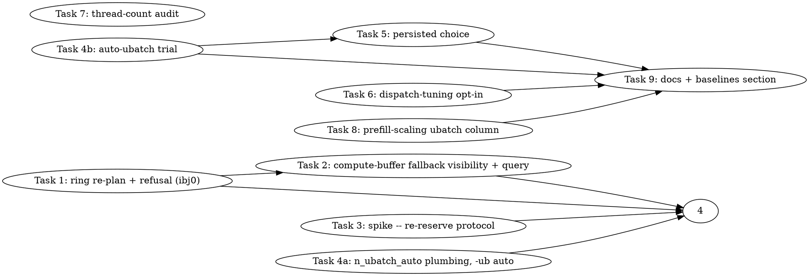

# Auto Micro-Batch Selection Implementation Plan (llama.cpp-nphx item 1 + llama.cpp-ibj0)

> **Execution:** Use `team-driven-development` in Claude Code, `pi-team-driven-development` in pi.dev, or `codex-team-driven-development` in Codex.

**Goal:** A bare `llama-bench -m model.gguf` / `llama-cli -m model.gguf` on either Arc card picks the largest micro-batch (`n_ubatch`) that fits all-VRAM for that model and context, an explicit `-ub` that does not fit is refused at context init with a message naming the largest that does, and the choice is persisted so later starts skip the search.

**Architecture:** The backend cannot hand a smaller micro-batch back to `llama_context` (there is no negotiation hook; the runtime-context transaction only accepts or refuses), so selection lives in the `llama_context` constructor, under SYCL only, as an ascending trial over a fixed ladder `{512, 1024, 2048, 4096}` capped by `n_batch` and `n_ctx`: for each candidate the SYCL runtime-context transaction validates every micro-batch-scaled zone (SWA KV, oneDNN Graph scratch, non-FA scratch, MMID workspace, and, after Task 1, the PP MoE oneDNN scratch ring), then `graph_reserve` allocates the compute buffers and a new backend query reports whether any compute buffer fell back to host-pinned memory; the last candidate that passes both wins. Explicit `-ub` skips the trial entirely and is validated once, refusing with a "largest that fits" figure when it fails. The chosen value is written to the already-implemented but unwired `tuning-cache-io.hpp` store under `~/.cache/llama.cpp/sycl-tuning/`, keyed by device name + driver version + model identity + context shape, and a later start validates the cached value first.

**Why the trial rather than a formula:** the compute-buffer size is only known after `graph_reserve` (it was 808 MiB at `-ub 1024` for GPT-OSS on the B50, against a 512 MB RUNTIME zone, and the arena's fallback to the KV zone and then to host-pinned memory is logged at INFO, i.e. invisibly). A formula would have to model `ggml_gallocr`; the trial asks it. Measured motivation (master e1253b403, B70, Mistral Q4_0, pp2048, bench-guard VALID): `-ub 512` 2834 tok/s, `-ub 1024` 3709, `-ub 2048` 4337 (+31% / +53%). Decode is batch-1 and is untouched by any of this.

**Standing rulings that bind this plan:**
- `docs/plans/2026-04-22-unified-memory-placement-plan.md:639`: never silently shrink `n_ctx`, `n_batch`, `n_ubatch`, or any user value. Auto applies only when the user did not set `-ub`; an explicit value is honoured or refused, never shrunk.
- llama.cpp-nphx comment c-uc54 (owner ruling 2026-08-31): context is never shrunk; KV that does not fit is placed to host tiers. Consequence here: a candidate micro-batch that forces KV demotion is NOT "fitting" -- the trial keeps KV all-VRAM (the transaction already demotes KV before refusing; the trial must read the demotion result and treat a demoted plan as a failed candidate).
- CLAUDE.md "GPU work is serialised through the lead": every `llama-bench`/`llama-completion`/device-test run below is lead-run under `GPU.lock`; implementers build and run host-only gates.
- The auto choice is a **default**, never a lock-in: explicit flags always win (`-ub N`), and `-ub auto` spells the default out.

**Tech Stack:** C++17 (ggml-sycl backend, llama_context, common, llama-bench), Python 3 pytest source-contract gates, bash gate scripts (`bench-guard.sh`, `sycl-prefill-scaling.sh`).

**Test Infrastructure:** host-only C++ unit tests linked against `ggml-sycl` (pattern: `tests/test-sycl-nonfa-attn-scratch-demand.cpp`, registered at `tests/CMakeLists.txt:2375-2417`, labels `"sycl"`, `SKIP_RETURN_CODE 77`); pytest source-contract gates (`tests/test-sycl-*-source.py`, registered via `llama_test_pytest`, `LABEL "sycl;python;source-assert"`); `tests/test-arg-parser.cpp` for `common_params_parse`; the GPU-free script harness `tests/test-sycl-prefill-scaling.sh`; the full family `ctest --test-dir build -R 'source|contract|census' -j 1` against the 19-gate llama.cpp-uv62 baseline; GPU acceptance through `scripts/bench-guard.sh` on both cards.

**Research this plan is grounded in** (session scratchpad, `plan-research/`): `ubatch-planner.md` (the n_ubatch path, zone formulas, refusal templates), `ubatch-tests.md` (test/gate infrastructure, env-var conventions, hardcoded `-ub` inventory), `tuning-cache.md` (the two tuning systems, the dead persistence layer, device identity). Line numbers cited below were verified at master `e1253b403`; `ggml-sycl.cpp` and `unified-cache.cpp` drift constantly -- re-grep before editing (inside `ggml-sycl.cpp` the codescout index is blind; use `cat file | grep -n`).

---

## Team Topology

**Recommended implementers:** 3-4 concurrent (Tasks 1, 3, 4a, 6, 7, 8 are dependency-free at the start; the host loses throughput past three concurrent FIRST builds, so at most two build-heavy tasks (1, 4a) start together and the host-only ones (3, 6, 7, 8) fill the remaining slots)
**Reviewers:** spec + quality, spawned FRESH per review (opus), per the session's standing rules; minor findings are not optional; every merge gets a fresh final integration review.

### Parallel Tracks

| Track | Tasks | Description |
|-------|-------|-------------|
| A | 1, 2 | Backend: re-plan the PP MoE oneDNN scratch ring for the runtime micro-batch and refuse with a largest-fitting figure (llama.cpp-ibj0); make compute-buffer host fallbacks visible and queryable |
| B | 3, 4a, 4b, 5 | Context/CLI: the re-reserve protocol spike, the `n_ubatch_auto` plumbing (`-ub auto` in common and llama-bench), the auto-selection trial in `llama_context`, then the persisted choice |
| C | 6, 7 | Hygiene from nphx item 3/4: dispatch-tuning JSON becomes opt-in (kills the every-start WARN); thread-count audit |
| D | 8, 9 | Gates and docs: micro-batch column in the prefill-scaling gate; env-var rows, design-doc section, baselines section |

### Dependency Graph



### File Ownership Map

| File/Directory | Tasks | Conflict Risk |
|----------------|-------|---------------|
| `ggml/include/ggml-sycl.h` (inventory struct, new query decls; 4a: `ggml_backend_sycl_auto_ubatch_enabled` decl) | 1, 2, 4a | Sequential (track A); 4a's decl is one hunk, merged after 1 |
| `src/llama-model.cpp` (inventory per-row bytes) | 1 | None |
| `ggml/src/ggml-sycl/unified-cache.{cpp,hpp}` (ring slot helpers, planned atomics; 4a: the `GGML_SYCL_AUTO_UBATCH` accessor, step 6) | 1, 4a | Disjoint hunks; merged 1 then 4a (Task 5 touches only `tuning-cache-io.hpp` and a new `.cpp`) |
| `ggml/src/ggml-sycl/ggml-sycl.cpp` | 1 (runtime transaction ~17040-17110, `populate_inventory_globals` ~15781-15862, refusal WARN ~76341), 2 (buffer alloc ~35700-35845, new query), 4a (accessor wrapper ~17112, adjacent to Task 1's region) | Sequential (track A); disjoint regions; the 4a wrapper may conflict textually with Task 1's transaction hunk, resolved by the lead in the second merge (rev-y8xv-spec-1 F6, 2026-09-10) |
| `include/llama.h`, `src/llama-context.{cpp,h}` | 4a (`n_ubatch_auto` param + default), 4b (constructor ~560/~713/~1195), 5 (cache lookup/save around the trial) | Sequential (track B) |
| `common/common.{h,cpp}`, `common/arg.cpp` | 4a | None |
| `tools/llama-bench/llama-bench.cpp` | 4a | None |
| `ggml/src/ggml-sycl/tuning-cache-io.hpp` + new `ggml/src/ggml-sycl/ubatch-tuning-cache.cpp` | 5 | None |
| `ggml/src/ggml-sycl/dispatch-tuning.cpp` | 6 | None |
| `tests/test-arg-parser.cpp` | 4a | None |
| `tests/test-sycl-ubatch-*.cpp`, `tests/test-sycl-*-source.py` (new) | 1, 2, 4b, 5, 6 | Each task creates its own file; registrations are appended blocks in `tests/CMakeLists.txt` (see gotcha) |
| `tests/CMakeLists.txt` | 1, 2, 4b, 5, 6, 8 | Shared hotspot: each task appends ONE self-contained block at the end of the SYCL section and rebases; never edit another task's block |
| `scripts/sycl-prefill-scaling.sh`, `tests/test-sycl-prefill-scaling.sh` | 8 | None |
| `docs/backend/sycl-env-vars.md`, `docs/backend/sycl-memory-design.md`, `docs/backend/sycl-perf-baselines.md`, `CLAUDE.md` | 9 (plus the one env-var row each of 4a, 5, 6 adds for its own variable) | Rows are single lines appended to the table; Task 9 owns prose sections |

---

### Task 1: Re-plan the PP MoE oneDNN scratch ring for the runtime micro-batch; refuse an oversized explicit `-ub` with a largest-fitting figure (llama.cpp-ibj0)

**Track:** A
**Depends on:** None
**File scope:**
- Modify: `ggml/include/ggml-sycl.h` (`struct ggml_sycl_tensor_inventory`, ~`:227`) -- two new fields
- Modify: `src/llama-model.cpp:404-413` -- compute and store the per-row bytes next to the existing slot formulas
- Modify: `ggml/src/ggml-sycl/unified-cache.hpp` (declarations near `:1596`), `ggml/src/ggml-sycl/unified-cache.cpp` (planned atomics near `:750`, setter near `:2095`, new pure functions near the nonfa family `:1739-1869`)
- Modify: `ggml/src/ggml-sycl/ggml-sycl.cpp` -- `populate_inventory_globals` (`:15781-15862`), the runtime-context transaction (`ggml_backend_sycl_set_runtime_context`, `:16833-17110`; the nonfa check call at `:17049` is the anchor), the once-per-process refusal log at `:76341` (INFO -> WARN)
- Create: `tests/test-sycl-ubatch-ring-plan.cpp` (host-only unit test), `tests/test-sycl-ubatch-ring-replan-source.py` (source gate)
- Modify: `tests/CMakeLists.txt` (one appended block for the two registrations)

**Description:**

The loader sizes the PP MoE oneDNN scratch ring at model load from a hardcoded 512-row micro-batch (`src/llama-model.cpp:333` sets `inventory.n_ubatch = 512`; `:404-413` derive `activation_slot = align256(n_ubatch * n_expert * max_k * 2)` and `output_slot = align256(n_ubatch * n_expert * max_n * 4)`). Those slot sizes are copied into per-device atomics by `populate_inventory_globals` (`ggml-sycl.cpp:15853-15860` -> `unified_cache_set_planned_pp_moe_onednn_scratch`, `unified-cache.cpp:2095-2110`). The runtime-context transaction re-plans KV (`:16883`), the non-FA scratch (`:17049`), and the MMID workspace, but never the ring, so the first prefill at `-ub 1024` refuses the under-sized ring (`ggml-sycl.cpp:76341`, `reason=activation-cap required=[.,153354240,306708480] planned_cap=[.,94371840,188743680]`), the serialized-route fallback then throws (`:76026`), and `llama_decode` returns -3 with no visible diagnostic (`scratchpad/ibj0-repro-ub1024-v.log:1805-1811`). Dense models are unaffected (only the MoE PP path uses the ring), which is why the B70 Mistral sweep ran `-ub 2048` fine.

This task carries the per-row sizes into the backend, re-plans the ring at the runtime update from the real `n_ubatch`, and refuses the transaction -- with the arithmetic and the largest fitting `-ub` -- when the re-planned ring cannot be reserved.

**Acceptance Criteria:**

- [ ] `ggml_sycl_tensor_inventory` carries `pp_moe_onednn_activation_bytes_per_row` and `pp_moe_onednn_output_bytes_per_row` (both `size_t`, 0 for dense models), filled by `src/llama-model.cpp` next to the existing slot formulas, so that `align256(n_ubatch * per_row)` reproduces the existing slot bytes exactly at `n_ubatch = 512` (unit-tested).
- [ ] New pure functions in `unified-cache.cpp`, declared in `unified-cache.hpp`:
  - `void unified_cache_set_planned_pp_moe_onednn_row_bytes(int device_id, size_t activation_bytes_per_row, size_t output_bytes_per_row)` and the two getters, backed by per-device atomics like `g_planned_pp_moe_onednn_activation_slot_bytes` (`unified-cache.cpp:750`).
  - `bool unified_cache_pp_moe_onednn_slots_for_ubatch(int device_id, uint32_t n_ubatch, size_t * activation_slot_bytes, size_t * output_slot_bytes)` -- returns false when the per-row bytes are 0 (dense) or the multiplication would overflow; otherwise `align256(n_ubatch * per_row)` for both.
  - `uint32_t unified_cache_largest_fitting_n_ubatch_for_pp_moe_onednn(size_t capacity_bytes, size_t weight_slot_bytes, size_t activation_bytes_per_row, size_t output_bytes_per_row, uint32_t ring_depth)` -- `floor(((capacity / effective_ring_depth) - weight_slot) / (act_per_row + out_per_row))`, rounded DOWN to a multiple of 32 (llama's BLAS minimum, and `llama_context` applies no 256-padding to `n_ubatch`), 0 when nothing fits; the same "hold the constant terms, divide the remainder by the per-unit cost, round to the allocator granularity" method as `ggml_sycl_largest_fitting_n_ctx` (`ggml-sycl.cpp:16537-16561`).
- [ ] In `ggml_backend_sycl_set_runtime_context`, after the nonfa check (`:17049-17053`) and before the MMID reaccount, when the device has a planned ring (`unified_cache_get_planned_pp_moe_onednn_weight_slot_bytes(device) > 0`) and the runtime `n_ubatch` differs from the ring's planned micro-batch: compute the new slots; if `unified_cache::reserve_pp_moe_onednn_scratch(weight, act, out, depth)` (`unified-cache.cpp:17503`) can reserve them, call `unified_cache_set_planned_pp_moe_onednn_scratch(...)` with the new sizes and log ONE `GGML_LOG_WARN` line `[SYCL-PLAN] PP MoE oneDNN scratch ring re-planned for n_ubatch=%u: activation %.1f MB, output %.1f MB, weights %.1f MB, depth %u`; else log `GGML_LOG_ERROR("[SYCL-PLAN] runtime context update rejected: PP MoE oneDNN scratch ring for n_ubatch=%u needs %.1f MB (weights %.1f + activation %.1f + output %.1f, ring depth %u) but the %s zone has %.1f MB available; the largest -ub that fits is about %u\n", ...)` (omit the last clause when the figure is < 32) and return through the same refusal path the KV refusals use (`return;` inside the transaction so `llama_context` sees a non-OK lifecycle result and throws at `src/llama-context.cpp:1017`).
- [ ] The ring's planned micro-batch is recorded (`g_planned_pp_moe_onednn_n_ubatch[device]`) so the comparison "differs from planned" is exact and the re-plan is idempotent on repeated transactions with the same `n_ubatch`.
- [ ] `ggml-sycl.cpp:76341` (`refusing unplanned PP MoE oneDNN batched scratch (reported once per process)`) is `GGML_LOG_WARN`, so if the admission ever refuses again the reason is visible at default verbosity.
- [ ] Source gate `tests/test-sycl-ubatch-ring-replan-source.py` pins: the transaction body calls the ring re-plan AFTER `ggml_sycl_check_nonfa_attn_scratch(` and BEFORE the MMID reaccount call, with a mutation witness (delete the re-plan -> check False); the refusal string contains `n_ubatch=%u` and `the largest -ub that fits`; the `:76341` call is `GGML_LOG_WARN`; the loader stores both per-row fields. Comment-stripped, whitespace-normalised bodies, in the style of `tests/test-sycl-nonfa-attn-scratch-guard-source.py`.
- [ ] Host-only unit test `tests/test-sycl-ubatch-ring-plan.cpp` (pattern: `tests/test-sycl-nonfa-attn-scratch-demand.cpp`): slots at 512 reproduce the loader's formula for GPT-OSS 20B's shape (`n_expert=32`, `max_k=2880`, `max_n=2880`, from the repro log: activation 90.0 MB = align256(512*32*2880*2), output 180.0 MB = align256(512*32*2880*4)); slots at 1024 double; largest-fitting inverse round-trips (`largest(capacity(ub)) == ub` for ub in {512,1024,2048}) and returns 0 for a capacity below the weight slot; dense (per-row 0) returns false.
- [ ] GPU acceptance (lead, both cards, bench-guard VALID): B50 GPT-OSS `llama-bench -p 2048 -n 0 -ub 512,1024 -r 3` either runs both rows (record tok/s) or refuses the 1024 instance at context init with the new ERROR naming the largest fitting `-ub` (record which); `-ub 8192` on the B50 refuses with a figure; B70 Mistral `-ub 512,1024,2048` unchanged (within spread of 2834/3709/4337); the four canonical gates (CLAUDE.md) unchanged; `test-sycl-runtime-alloc` 38/38, pool test 79/0, probe 5/0 on both cards.
- [ ] Source-contract family on the branch = the 19-gate uv62 baseline (+ Not Run for unbuilt binaries on a target-subset build).

**Implementation Guide:**

1. **Test (RED, host-only): the pure functions.** Create `tests/test-sycl-ubatch-ring-plan.cpp` by copying the skeleton of `tests/test-sycl-nonfa-attn-scratch-demand.cpp` (the `#if !defined(GGML_USE_SYCL)` skip, `g_failures`, `check()`), with:

```cpp
#include "ggml-sycl/unified-cache.hpp"
// ...
static void test_slots_reproduce_loader_formula() {
    // GPT-OSS 20B MXFP4: n_expert=32, max_k=max_n=2880 (ibj0 repro log: activation 90.0 MB, output 180.0 MB at 512)
    const size_t act_per_row = 32ull * 2880ull * 2ull;   // n_expert * max_k * sizeof(f16)
    const size_t out_per_row = 32ull * 2880ull * 4ull;   // n_expert * max_n * sizeof(float)
    ggml_sycl::unified_cache_set_planned_pp_moe_onednn_row_bytes(0, act_per_row, out_per_row);
    size_t act = 0, out = 0;
    check(ggml_sycl::unified_cache_pp_moe_onednn_slots_for_ubatch(0, 512, &act, &out), "slots computed at 512");
    check(act == 94371840, "activation slot at 512 = 90.0 MB (matches loader)");
    check(out == 188743680, "output slot at 512 = 180.0 MB (matches loader)");
    check(ggml_sycl::unified_cache_pp_moe_onednn_slots_for_ubatch(0, 1024, &act, &out) && act == 188743680 && out == 377487360,
          "slots at 1024 double (align256(1024*32*2880*2), align256(1024*32*2880*4))");
    // ...largest-fitting round trips, dense returns false, overflow returns false
}
```
   (The repro's `required=[.,153354240,306708480]` is the EXECUTOR's demand for the real active-expert count, which is smaller than the worst case the plan sizes for -- the plan must size for the worst case, so the test pins the plan formula, not the executor's demand.) Register it in `tests/CMakeLists.txt` as a copy of the block at `:2375-2417` with ONE arm (no env var), `LABELS "sycl"`, `SKIP_RETURN_CODE 77`, `TIMEOUT 60`.
   Run: `ctest --test-dir build -R '^test-sycl-ubatch-ring-plan$' --output-on-failure` after building the target. Expected: link error (functions undeclared) -> RED.

2. **Implement the inventory fields and the loader.** `ggml/include/ggml-sycl.h`, inside `struct ggml_sycl_tensor_inventory` next to `pp_moe_onednn_activation_slot_bytes`:

```c
    size_t pp_moe_onednn_activation_bytes_per_row; // n_expert * max_k * sizeof(f16); 0 = no MoE PP ring
    size_t pp_moe_onednn_output_bytes_per_row;     // n_expert * max_n * sizeof(float)
```
   `src/llama-model.cpp:404-413`: alongside `max_rows`, store
```cpp
            inventory.pp_moe_onednn_activation_bytes_per_row = static_cast<size_t>(hparams.n_expert) * max_k * sizeof(ggml_fp16_t);
            inventory.pp_moe_onednn_output_bytes_per_row     = static_cast<size_t>(hparams.n_expert) * max_n * sizeof(float);
```
   and keep the existing slot computations (they must equal `align256(512 * per_row)`; add a `GGML_ASSERT` to that effect right there so the two formulas cannot drift).

3. **Implement the pure functions** in `unified-cache.cpp` next to the nonfa family, with the atomics next to `:750`, the setter next to `:2095`, declarations in `unified-cache.hpp` next to `:1596`. `align256` is `llama_model_sycl_align_up(x, 256)` in the loader; in the backend use the existing `pp_moe_onednn_checked_align_slot_bytes()` (`moe-scratch-admission.hpp`, tested at `ggml/src/ggml-sycl/tests/test-moe-scratch-admission.cpp:65-80`) so alignment and overflow handling are shared, not re-implemented.

4. **Wire `populate_inventory_globals`** (`ggml-sycl.cpp:15853-15860`): after the existing `unified_cache_set_planned_pp_moe_onednn_scratch(...)`, add `unified_cache_set_planned_pp_moe_onednn_row_bytes(ctx->device, inventory->pp_moe_onednn_activation_bytes_per_row, inventory->pp_moe_onednn_output_bytes_per_row);` and record the planned micro-batch (`inventory->n_ubatch`).

5. **Test (RED, source gate).** Create `tests/test-sycl-ubatch-ring-replan-source.py` modelled on `tests/test-sycl-nonfa-attn-scratch-guard-source.py` (the `_env_mb_override_body_norm`-style bounded-body accessor at `:684-700`, shared fragment constants at `:681-682`): extract `ggml_backend_sycl_set_runtime_context`'s body from comment-stripped `ggml-sycl.cpp`; assert `find("ggml_sycl_check_nonfa_attn_scratch(") < find(RING_REPLAN_CALL) < find(MMID_REACCOUNT_CALL)` (name the MMID call by its real identifier after reading `:17054-17075`); mutation witness deletes `RING_REPLAN_CALL`; assert the refusal fragments; assert the `:76341` log macro is `GGML_LOG_WARN`. Register with `llama_test_pytest` (`LABEL "sycl;python;source-assert"`, `TIMEOUT 120`). Run `python3 -m pytest tests/test-sycl-ubatch-ring-replan-source.py -q` -> RED.

6. **Implement the re-plan in the transaction.** In `ggml_backend_sycl_set_runtime_context`, after the nonfa block that ends at `:17053` (`return;` on failure), insert:

```cpp
    // llama.cpp-ibj0: the PP MoE oneDNN scratch ring was sized at model load
    // for inventory.n_ubatch (512, src/llama-model.cpp); a larger runtime
    // n_ubatch must re-plan it here, in the same transaction that re-plans
    // KV, or the first prefill refuses the under-sized ring and llama_decode
    // returns -3 with nothing printed.
    if (!ggml_sycl_replan_pp_moe_onednn_ring(ctx->device, next_kv_info.n_ubatch)) {
        return;  // refusal already logged with the largest fitting -ub
    }
```
   with `static bool ggml_sycl_replan_pp_moe_onednn_ring(int device, uint32_t n_ubatch)` placed next to `ggml_sycl_check_nonfa_attn_scratch` (`:16666`): read the planned weight slot / depth / per-row bytes; early-return true when weight slot == 0 (dense) or `n_ubatch == planned_n_ubatch`; compute slots; find the capacity the ring reserves from by reading `unified_cache::reserve_pp_moe_onednn_scratch` (`unified-cache.cpp:17503-17560`; its log at `:17681` says `reserved from %s` -- cite the zone and its `zone_available()` accessor in the commit message); attempt the reserve; on success set the planned sizes + micro-batch and WARN; on failure ERROR with the arithmetic and `unified_cache_largest_fitting_n_ubatch_for_pp_moe_onednn(...)`, return false. Mirror the nonfa guard's structure (`:16666-16830`) including the "read capacity BEFORE any re-plan" rule in its comment at `:16701-16709`.

7. **Promote `:76341` to `GGML_LOG_WARN`.** One-token change; keep the "reported once per process" latch.

8. **GREEN:** unit test passes; source gate passes (13-ish checks); `clang-format-19 --dry-run -Werror` on your ranges; build the targets `test-sycl-ubatch-ring-plan test-sycl-runtime-alloc test-sycl-onednn-graph-scratch-direct test-sycl-event-status-blocking-probe llama-bench llama-completion` detached in the worktree (exact command in the implementer brief); report SHAs.

**Commit:**

```bash
git add ggml/include/ggml-sycl.h src/llama-model.cpp ggml/src/ggml-sycl/unified-cache.hpp ggml/src/ggml-sycl/unified-cache.cpp ggml/src/ggml-sycl/ggml-sycl.cpp tests/test-sycl-ubatch-ring-plan.cpp tests/test-sycl-ubatch-ring-replan-source.py tests/CMakeLists.txt
git commit -m "sycl: re-plan the PP MoE oneDNN scratch ring for the runtime n_ubatch, refuse an oversized -ub with the largest that fits (llama.cpp-ibj0)"
```

**Gotchas:**
- `ggml-sycl.cpp` is ~105k lines and the codescout index is blind inside it; every anchor above must be re-grepped with `cat file | grep -n` before editing.
- The executor's admission (`pp_moe_onednn_admit_scratch`, `moe-scratch-admission.cpp:48-52`) compares the executor's REQUIRED shape against the PLANNED caps; the plan sizes for the worst case (`n_ubatch * n_expert` rows, comment at `src/llama-model.cpp:396-406`). Do not "fix" the mismatch by lowering the plan to the executor's demand.
- The reserve grows the ring inside the unified cache's zone accounting; check whether `reserve_pp_moe_onednn_scratch` can be called a second time for a LARGER size on a live cache (read `:17503-17560` and the `reserved from` log at `:17681`); if it cannot, the re-plan must release-and-re-reserve under the same lock, and the spec reviewer must see that path.
- `GGML_LOG_INFO` is dropped at default verbosity in every tool; the refusal is ERROR and the re-plan notice is WARN, deliberately (`ggml-sycl.cpp:16977-16980` records the same reasoning for the KV refusal).
- Never loop model-loading binaries; the GPU acceptance is one `llama-bench` per (card, model) with `-ub` as its sweep axis.

---

### Task 2: Make compute-buffer host fallbacks visible and queryable

**Track:** A
**Depends on:** Task 1 (same file; rebase on it)
**File scope:**
- Modify: `ggml/src/ggml-sycl/ggml-sycl.cpp:35700-35845` (`ggml_backend_sycl_buffer_type_alloc_buffer` fallback chain), `ggml/include/ggml-sycl.h` (new query declaration)
- Create: `tests/test-sycl-compute-buffer-fallback-source.py`
- Modify: `tests/CMakeLists.txt` (one appended registration)

**Description:**

`ggml_backend_sycl_buffer_type_alloc_buffer` (`ggml-sycl.cpp:35574`) falls from the RUNTIME zone to the shared KV zone (INFO, `:35702-35704`), to a host-pinned allocation for oversize requests (INFO, `:35799-35801`), and to a host-pinned retry after a device failure (INFO, `:35837`). A run whose compute buffers silently landed in host memory looks identical to a healthy run at default verbosity, and Task 4b's trial needs to know. This task promotes the two host-pinned fallbacks to WARN (the KV-zone fallback stays INFO: it is still device memory) and adds a per-device counter with a public query.

**Second deliverable (added 2026-09-10 from the Task 3 spike, llama.cpp-nphx comment c-wgxn): a NON-PUBLISHING PROBE of the runtime-context transaction.** KV demotion is sticky: the transaction sets `kv_device[l] = -1` for demoted layers (~`ggml-sycl.cpp:16612`) and publishes that plan; `update_runtime_kv_sizes` (`unified-cache.hpp:821-827`) never restores it and no runtime path re-promotes a layer. A trial that PUBLISHES a larger candidate therefore permanently demotes KV the settled winner never needed, which violates the c-uc54 ruling. So Task 2 adds `ggml_backend_sycl_probe_runtime_context_for_model(backend, token, n_ctx, n_ubatch, n_seq_max, flash_attn, ggml_sycl_runtime_context_probe * out)` sharing ONE static body with the publishing entry point up to (not including) the compare-and-swap at ~`:17081`, filling `accepted`, `would_demote_kv`, `host_kv_bytes`, `reason`; in probe mode candidate refusals log at INFO, not ERROR (this is also how Task 4b avoids printing three refusals per start), and any device-state side effect before the CAS (ring reserve, zone growth) either does not happen in probe mode or is released before return -- the implementer states which, with cites. The publishing entry point's behaviour is unchanged.

**Acceptance Criteria:**

- [ ] `:35799-35801` and `:35837` log at `GGML_LOG_WARN`; the message text is unchanged apart from the level.
- [ ] A per-device `std::atomic<uint64_t> g_compute_buffer_host_fallbacks[GGML_SYCL_MAX_DEVICES]` is incremented on both host-pinned paths; `uint64_t ggml_backend_sycl_compute_buffer_host_fallbacks(int device)` (declared in `ggml/include/ggml-sycl.h` next to `ggml_backend_sycl_set_runtime_context`, `:376-380`) returns it; it is reset to 0 by the runtime-context transaction's success path so Task 4b can read "fallbacks since the last transaction".
- [ ] Source gate pins the two levels, the two increments, the reset site, and the declaration; mutation witnesses for the increments.
- [ ] The probe: declared in `ggml/include/ggml-sycl.h` next to the publishing entry (`:1034-1039`); the probe and the publisher share one static body (the gate pins that the probe never reaches the CAS and that refusals in probe mode are INFO); `probe(512)` on B50 GPT-OSS returns accepted with no demotion and leaves the published plan byte-identical in its `[SYCL-PLAN]` snapshot lines; `probe(8192)` returns refused with the ring reason and prints no ERROR (lead-run).
- [ ] No behaviour change on any gate (host-only verification + the Task 1 GPU acceptance re-run on the merged branch by the lead).

**Implementation Guide:**

1. **RED:** write the gate asserting `GGML_LOG_WARN(` precedes `"SYCL: Large buffer (%zu MB) exceeds safe alloc"` and `"SYCL: Alloc failed (%zu MB), retrying with host-pinned fallback"` in the comment-stripped file, and that `g_compute_buffer_host_fallbacks[` appears with `fetch_add(1` twice inside the alloc function's body and `.store(0` inside the transaction's body. Run -> RED.
2. **GREEN:** the two level changes, the atomic array (next to the other per-device atomics in `ggml-sycl.cpp`, e.g. near `g_tensor_inventory_*` at `:14571`), the increments, the reset (in the transaction right before the plan is published), the query, the header declaration.
3. Build `llama-completion` in the worktree; run the gate; `clang-format` dry-run.

**Commit:**

```bash
git add ggml/src/ggml-sycl/ggml-sycl.cpp ggml/include/ggml-sycl.h tests/test-sycl-compute-buffer-fallback-source.py tests/CMakeLists.txt
git commit -m "sycl: WARN on compute-buffer host-pinned fallbacks and expose a per-device fallback counter (llama.cpp-nphx)"
```

**Gotchas:**
- The function is a function-try-block (catch at `:35905`); do not put the increment after a `return`.
- The KV-zone fallback at `:35702` is deliberately left INFO -- it is device memory and it is the design (the "shared zone").

---

### Task 3: Spike -- the safe re-reserve protocol for a micro-batch trial in `llama_context`

**Track:** B
**Depends on:** None (read-only; runs in parallel with Task 1)
**File scope:**
- Read: `ggml/src/ggml-alloc.c` (`ggml_gallocr_reserve_n`, `ggml_gallocr_alloc_graph`), `ggml/src/ggml-backend.cpp` (`ggml_backend_sched_reserve`, `ggml_backend_sched_reset`), `src/llama-context.cpp:1150-1210` and `:1420-1440` (`graph_reserve`), `:980-1035` (`sycl_resync_runtime_context_flash_attn`), `:1035-1060` (`sycl_recheck_runtime_context_flash_attn`)
- Deliverable: a comment on llama.cpp-nphx (id it `c-spike-ubatch`) and the exact loop Task 4b implements

**Description:**

Task 4b needs to try several micro-batches in one `llama_context` constructor. Two unknowns decide the protocol: (1) what `ggml_backend_sched_reserve` does when called again with a LARGER graph (does galloc free and re-allocate, and what state is left on failure?), and (2) whether the SYCL runtime-context transaction is idempotent and monotone (calling it for 512 after 1024 must not shrink zones that a later graph_reserve at 512 relies on, and calling it for 1024 after a refused 2048 must recover).

**Acceptance Criteria:**

- [ ] The comment states, with file:line cites: galloc's behaviour on a larger re-reserve (grow: free + realloc, or grow in place), on a smaller re-reserve (no-op or shrink), and on allocation failure (which buffers are NULL, whether a subsequent smaller reserve recovers); whether `ggml_backend_sched_reset` is required between reserves; whether the SYCL transaction can be re-run with a smaller `n_ubatch` after a refused larger one and what it does to the ring/zones (Task 1's re-plan must be monotone-safe or restore the previous plan on refusal).
- [ ] The recommended loop, written out in C++ against `llama_context`'s real members (`sched`, `cparams`, `graph_reserve(...)` signature at `:1195`), ascending ladder with "last good" recovery, and a statement of its cost in reserve calls (bounded by ladder length + 1).
- [ ] An explicit answer to: can the trial run BEFORE `sched` is first created (so the failed larger attempt never leaves a half-allocated sched), or must it re-reserve an existing sched?

**Implementation Guide:**

Read-only; no build. Use codescout (`read_symbol` for `ggml_gallocr_reserve_n`, `ggml_backend_sched_reserve`; `ask_codebase` for "what happens when ggml_backend_sched_reserve is called twice with a bigger graph"), then cite. If the answer cannot be settled by reading, propose a 30-line probe (`tests/`-style, lead-run on a GPU) and the lead runs it under `GPU.lock` before Task 4b starts.

**Commit:** none (tracker comment only).

**Gotchas:**
- `graph_reserve` is called with `n_tokens = min(cparams.n_ctx, cparams.n_ubatch)` (`src/llama-context.cpp:1195`, `:1432`); the ladder must be capped by `n_ctx` too.
- The narrow flash-attn re-check (`:1035`) already re-runs part of the transaction after `sched_reserve` -- study its ordering constraints; the trial must not break it.

---

### Task 4a: `n_ubatch_auto` plumbing -- params, `-ub auto` in common and llama-bench, the switch variable

**Track:** B
**Depends on:** None (pure plumbing; no behaviour change until Task 4b)
**File scope:**
- Modify: `include/llama.h` (`struct llama_context_params`: `bool n_ubatch_auto`), `src/llama-context.cpp` (defaults `:4119`; resolution `:560`; constructor `:713`, `:988-1018`, `:1150-1210`), `src/llama-context.h` (a member recording the resolved value and how it was chosen)
- Modify: `common/common.h:443-444` (+ `bool n_ubatch_auto`), `common/arg.cpp` (`-ub` parsing: integer sets `n_ubatch` and clears auto; the literal `auto` sets auto), `common/common.cpp` (`common_context_params_to_llama` copies the flag)
- Modify: `tools/llama-bench/llama-bench.cpp:338-339, 382-383, 453-454, 619, 1125-1129, 1291-1292, 1457-1458, 1496-1497` (`-ub auto` token, default auto under `GGML_USE_SYCL`, resolved value printed)
- Modify: `tests/test-arg-parser.cpp` (after `:193`)
- Create: `tests/test-sycl-auto-ubatch-source.py`
- Modify: `tests/CMakeLists.txt` (one appended registration)
- Docs (one row): `docs/backend/sycl-env-vars.md` row for `GGML_SYCL_AUTO_UBATCH` (see below)

**Description (4a + 4b together; 4a lands the plumbing with no behaviour change, 4b lands the trial):**

Under SYCL, when the user did not set `-ub`, `llama_context` tries the ladder `{512, 1024, 2048, 4096}` ascending, each candidate capped by `n_batch` and `n_ctx`. Per the Task 3 spike (c-wgxn): the trial runs AFTER memory creation (`src/llama-context.cpp:772`) and REPLACES the unconditional `sched_reserve()` at `:914`; each candidate is first checked with Task 2's NON-PUBLISHING probe (`accepted && !would_demote_kv`), then published with the real transaction, then given a full `sched_reserve()` cycle (a fresh sched + galloc every call, `:1204`), then checked against Task 2's host-fallback counter; the last candidate that passes all four wins, and the settle step re-publishes and re-reserves at that value (Task 1's ring re-plan is bidirectional, so the settle shrinks the ring back). Cost: reserves <= ladder + 1, transactions <= 2 x ladder + 1. No `throw_on_refusal` parameter is needed: the probe answers without throwing and the publisher is only called for candidates the probe accepted. The last candidate that (a) is accepted by the transaction, (b) did not demote KV, (c) reserved without a host-pinned compute-buffer fallback, wins; the constructor then settles on it per Task 3's protocol. Explicit `-ub N` (or `n_ubatch_auto == false`) takes today's single path unchanged. One WARN line reports the choice. `GGML_SYCL_AUTO_UBATCH=0` disables the trial (falls back to 512) for bisecting.

**Acceptance Criteria:**

- [ ] `llama_context_params::n_ubatch_auto` exists (fork-local; recorded in `docs/merge/briefs/llama-common.md` next to the `fit_params` hunks at `:102-105`), default `false` in `llama_context_default_params()`; `common_params::n_ubatch_auto` defaults `true` under `GGML_USE_SYCL` and `false` otherwise; `-ub N` sets `n_ubatch = N` and `n_ubatch_auto = false`; `-ub auto` sets `n_ubatch_auto = true`; `common_context_params_to_llama` copies it.
- [ ] `tests/test-arg-parser.cpp` gains three cases after `:193`: `--ubatch-size 777` -> `n_ubatch == 777 && !n_ubatch_auto`; no `-ub` -> `n_ubatch_auto == (GGML_USE_SYCL defined)`; `-ub auto` -> `n_ubatch_auto`. `ctest -R '^test-arg-parser$'` green.
- [ ] With Task 4a alone, `n_ubatch_auto == true` has NO effect: `llama_context` ignores it (the flag is plumbed, the trial is Task 4b), so every existing gate is byte-identical; llama-bench's `auto` resolves to the library default 512 until 4b lands, and the printed column already shows the resolved value.
- [ ] `ctest -R '^test-arg-parser$'` green; family = baseline; clang-format clean.

**Implementation Guide (4a):** steps 1, 2, 5 (llama-bench) and 6 (the env-var accessor + doc row) below; commit with the FIRST of the two commit lines.

---

### Task 4b: The auto-selection trial in `llama_context`

**Track:** B
**Depends on:** Tasks 1, 2, 3, 4a
**File scope:** `src/llama-context.{cpp,h}` (constructor `:560`, `:713`, `:988-1018`, `:1150-1210`), `ggml/include/ggml-sycl.h` + `ggml/src/ggml-sycl/ggml-sycl.cpp` (the `ggml_backend_sycl_runtime_context_demoted_kv` query, next to the transaction), `tests/test-sycl-auto-ubatch-source.py` (new), `tests/CMakeLists.txt` (one appended registration)

**Acceptance Criteria (4b):**

- [ ] `llama_context` constructor: when `params.n_ubatch_auto && llama_context_dev_is_sycl(dev) && ggml_sycl_auto_ubatch_enabled()` (env `GGML_SYCL_AUTO_UBATCH`, default on, `0` disables; read through a memoized accessor like `nonfa_attn_scratch_mb_override()` at `unified-cache.cpp:1676`), run the trial per Task 3; otherwise behave exactly as today. The resolved value is what `llama_n_ubatch(ctx)` returns and what the `n_ubatch = ...` startup log line prints.
- [ ] Exactly one `GGML_LOG_WARN` at the end of a trial: `[SYCL-PLAN] auto n_ubatch=%u for n_ctx=%u n_batch=%u (tried %s; %s); pass -ub N to override` where the second `%s` names why the next candidate lost (`transaction refused` / `KV would be demoted` / `compute buffer fell back to host`), or `ladder exhausted` when the cap won.
- [ ] llama-bench: `-ub auto` accepted (sentinel `-1` in the int list); default `{-1}` under `GGML_USE_SYCL` else `{512}`; the printed `n_ubatch` column and the CSV/JSON field carry the RESOLVED `llama_n_ubatch(ctx)` value (read after context creation at `:1291-1292`'s instance), never `-1`; help text at `:454` documents `auto`.
- [ ] Source gate `tests/test-sycl-auto-ubatch-source.py`: the trial is gated on all three conditions; the ladder literal is `{512, 1024, 2048, 4096}`; the candidate cap uses both `n_batch` and `n_ctx`; the host-fallback query (Task 2) and the demotion result are both consulted; the WARN fragment is present; mutation witnesses for the gate condition and the ladder.
- [ ] GPU acceptance (lead, both cards, bench-guard VALID): bare `llama-bench -m mistral -p 2048 -n 128` on the B70 prints `n_ubatch` 2048 and pp2048 within spread of 4337; on the B50 prints the chosen value and runs; bare `llama-bench -m gpt-oss -p 2048 -n 128` on both cards prints the chosen value (B50 expected 512 or 1024 depending on Task 1's result) with correct output; the Mistral completion gate and the GPT-OSS chat gate (CLAUDE.md, with `-c 4096`) produce their canonical outputs; `GGML_SYCL_AUTO_UBATCH=0` reproduces today's 512 rows; explicit `-ub 512` reproduces the current baselines; the trial adds < 1 s to context creation (measure `load time` from `common_perf_print` with and without).
- [ ] `test-arg-parser`, the family sweep, clang-format: green.

**Implementation Guide (shared numbering; 4a does 1, 2, 5, 6; 4b does 3, 4, 7):**

1. **RED (arg parser):** add the three cases to `tests/test-arg-parser.cpp` -> build fails (field missing) -> RED.
2. **GREEN (params plumbing):** `include/llama.h` field + default; `common/common.h` field with the `#ifdef GGML_USE_SYCL` default (same shape as `fit_params` at `common/common.h:468-472`); `common/arg.cpp`: in the `-ub` handler, `if (value == "auto") { params.n_ubatch_auto = true; } else { params.n_ubatch = std::stoi(value); params.n_ubatch_auto = false; }` (keep the existing error path for non-integers otherwise); `common/common.cpp`: `cparams.n_ubatch_auto = params.n_ubatch_auto;`.
3. **RED (source gate):** write `tests/test-sycl-auto-ubatch-source.py` against `src/llama-context.cpp`: extract the constructor body (`llama_context::llama_context(` ... first file-scope function after it), assert the three-condition gate, the ladder literal, the two queries, the WARN fragment, with witnesses. Run -> RED.
4. **GREEN (the trial):** in `src/llama-context.cpp`, implement `llama_context::sycl_select_auto_ubatch()` per Task 3's protocol, called from the constructor right where `cparams.n_ubatch` is finalised (`:560`) if the trial can run before `sched` exists, else right after the first `graph_reserve` (`:1195`) -- Task 3 decides which. Sketch (adjust to Task 3):

```cpp
// src/llama-context.cpp -- fork-local (llama.cpp-nphx): SYCL auto micro-batch.
void llama_context::sycl_select_auto_ubatch(ggml_backend_dev_t dev) {
    static const uint32_t ladder[] = { 512, 1024, 2048, 4096 };
    const uint32_t cap = std::min<uint32_t>(cparams.n_batch, cparams.n_ctx);
    uint32_t last_good = 0; std::string tried; const char * stop = "ladder exhausted";
    for (uint32_t c : ladder) {
        if (c > cap) { break; }
        cparams.n_ubatch = c;
        tried += (tried.empty() ? "" : ",") + std::to_string(c);
        ggml_sycl_runtime_context_probe probe{};
        ggml_backend_sycl_probe_runtime_context_for_model(backend.get(), token, cparams.n_ctx, c, cparams.n_seq_max, cparams.flash_attn, &probe);
        if (!probe.accepted)       { stop = "transaction refused";  break; }
        if (probe.would_demote_kv) { stop = "KV would be demoted";  break; }
        sycl_resync_runtime_context_flash_attn(dev);   // publish (accepted by the probe, so it cannot refuse)
        if (!sched_reserve())      { stop = "compute buffers did not fit"; break; }   // full cycle per c-wgxn
        if (ggml_backend_sycl_compute_buffer_host_fallbacks(dev_index) > 0) { stop = "compute buffer fell back to host"; break; }
        last_good = c;
    }
    if (last_good == 0) { last_good = 512; }
    cparams.n_ubatch = last_good;
    // settle: re-run the transaction and reserve at last_good (Task 3 protocol)
    LLAMA_LOG_WARN("[SYCL-PLAN] auto n_ubatch=%u for n_ctx=%u n_batch=%u (tried %s; %s); pass -ub N to override\n", ...);
}
```
   The probe (Task 2) replaces both the demotion query and any `throw_on_refusal` parameter; the exact loop with last-good recovery is in c-wgxn.
5. **llama-bench:** parse `auto` in the `-ub` handler (`:619`); default list under `GGML_USE_SYCL`; set `cparams.n_ubatch_auto = (n_ubatch < 0)` and `cparams.n_ubatch = n_ubatch < 0 ? 0 : n_ubatch` at `:1291-1292`; after `llama_init_from_model`, write `llama_n_ubatch(ctx)` into the instance/test record so the table and CSV show the resolved value.
6. **Env var + doc row:** `GGML_SYCL_AUTO_UBATCH` (default on; `0` disables the trial, falling back to the library default 512; any other value ignored with one WARN) read through a memoized accessor in `unified-cache.cpp` (pattern `:1673-1679`), exported via `unified-cache.hpp`, and called from `llama-context.cpp` through a new `ggml_backend_sycl_auto_ubatch_enabled()` in `ggml-sycl.h`. Add the single-line row to `docs/backend/sycl-env-vars.md` in the style of `:331` (state what `0` does, that explicit `-ub` always wins, that the trial is SYCL-only, and that the refusal for an explicit `-ub` comes from Task 1).
7. **GREEN:** gates pass; build `llama-bench llama-completion llama-cli test-arg-parser` in the worktree; report.

**Commit (two commits):**

```bash
git add include/llama.h src/llama-context.cpp src/llama-context.h common/common.h common/common.cpp common/arg.cpp tests/test-arg-parser.cpp docs/merge/briefs/llama-common.md
git commit -m "llama: SYCL auto micro-batch -- n_ubatch_auto param, -ub auto, ascending fit trial in llama_context (llama.cpp-nphx)"
git add tools/llama-bench/llama-bench.cpp tests/test-sycl-auto-ubatch-source.py tests/CMakeLists.txt docs/backend/sycl-env-vars.md ggml/include/ggml-sycl.h ggml/src/ggml-sycl/unified-cache.hpp ggml/src/ggml-sycl/unified-cache.cpp ggml/src/ggml-sycl/ggml-sycl.cpp
git commit -m "llama-bench: -ub auto (SYCL default), print the resolved n_ubatch; GGML_SYCL_AUTO_UBATCH switch + source gate (llama.cpp-nphx)"
```

**Gotchas:**
- `cparams.n_ubatch` is clamped to `n_batch` at `:560`; the ladder cap must apply before, not after, that line.
- `-ub 0` today means "use n_batch" (`:560`); do not reuse 0 as the auto sentinel -- that is why the flag exists.
- The narrow flash-attn re-check (`:1035`, called at `:1156` inside `sched_reserve`) runs the transaction again with the plan's own `planner_n_ubatch`; after the trial settles, that value must equal the chosen one (Task 1's ring re-plan records it).
- The "never silently shrink" rule: when auto lands on 512 because nothing larger fits, that is not a shrink of a user value (the user set nothing); the WARN says so explicitly.
- Keep the trial's log lines to ONE WARN; the transaction's own ERROR refusals for candidates that lose must be suppressed in trial mode (pass a `quiet` flag, or downgrade to INFO inside the trial) or the user sees three scary refusals on every start. The spec reviewer will check this.
- `test-arg-parser` has no labels (default `main`) -- run it by name; do not run a bare `ctest`.

---

### Task 5: Persist the chosen micro-batch in the (already written, unwired) tuning cache

**Track:** B
**Depends on:** Task 4b
**File scope:**
- Modify: `ggml/src/ggml-sycl/tuning-cache-io.hpp` (`CACHE_VERSION` -> 2; an `ubatch` entry kind; the device key gains the driver version)
- Create: `ggml/src/ggml-sycl/ubatch-tuning-cache.cpp` (lookup/save API) and its declaration in `ggml/include/ggml-sycl.h`
- Modify: `ggml/src/ggml-sycl/ggml-sycl.cpp:23449, 23729` (store the driver version next to `device_name`; `common.hpp:1480`)
- Modify: `src/llama-context.cpp` (the trial: try the cached value first; save the result)
- Modify: `tests/test-tuning-cache-io.cpp` (extend: v2 round-trip, key composition, v1 file rejected)
- Modify: `tests/CMakeLists.txt` if the registration needs the new source
- Docs (rows): `docs/backend/sycl-env-vars.md` rows for `GGML_SYCL_TUNING_CACHE` (`0` disables read and write) and `GGML_SYCL_TUNING_CACHE_DIR`

**Description:**

`tuning-cache-io.hpp` already implements a versioned, atomic-write JSON store at `~/.cache/llama.cpp/sycl-tuning/<sanitized device name>.json` with zero production callers (`plan-research/tuning-cache.md` §1C). This task wires it for exactly one entry kind: the chosen micro-batch, keyed by `(device name, driver version, model identity, n_ctx, n_batch, flash_attn)`. On an auto start the cached value is tried FIRST through the same validate path as any ladder candidate (transaction + reserve + fallback check); if it passes, the ladder is skipped (the sub-second hit path the ticket asks for); if not, the ladder runs and the result overwrites the entry. The store is advisory: a stale or corrupt file can only cost one extra validation, never a wrong choice.

**Acceptance Criteria:**

- [ ] Device key = `sanitize_device_name(name) + "@" + driver_version` (both queried at init: `ggml-sycl.cpp:23449`, `:23729`; the driver version is currently printed and discarded -- store it in `info.devices[i]` next to `device_name`). No PCI id (it moves across boots on this host; `plan-research/tuning-cache.md` §4).
- [ ] Model identity = the GGUF's `general.name` + file size + a 64-bit hash of the tensor inventory (names and byte sizes), computed once at model load from `ggml_sycl_tensor_inventory` (a cheap FNV-1a over `tensors[i].name` and bytes); the same model file copied elsewhere hits, a re-quantised file misses.
- [ ] Entry = `{ key fields..., "n_ubatch": N, "reason": "ladder|cached", "created": ISO8601 }`; `CACHE_VERSION = 2`; a v1 file is rejected (existing behaviour at `tuning-cache-io.hpp:380-384`) and rewritten.
- [ ] `src/llama-context.cpp`: before the ladder, `if (ggml_backend_sycl_ubatch_cache_lookup(key, &cached))` try `cached` through the same validate step; on pass, `last_good = cached`, `stop = "cached"`, skip the ladder; after any ladder run, `ggml_backend_sycl_ubatch_cache_store(key, last_good)` (atomic write; failure to write is one WARN, never fatal). `GGML_SYCL_TUNING_CACHE=0` disables both; `GGML_SYCL_TUNING_CACHE_DIR` overrides the directory (falls back to XDG per `get_cache_dir()` at `tuning-cache-io.hpp:54-65`).
- [ ] One WARN per start: `[SYCL-PLAN] tuning cache %s: n_ubatch=%u (%s)` with `hit`/`miss`/`disabled` and the file path (the alloc-caps precedent at `ggml-sycl.cpp:23505-23511` explains why WARN not INFO).
- [ ] `tests/test-tuning-cache-io.cpp` extended: round-trip a v2 entry, key equality/inequality on each field, v1 rejection, unwritable dir -> lookup false / store false without throwing.
- [ ] GPU (lead): first bare start of Mistral on the B70 logs `miss` and the ladder; second start logs `hit` and `load time` drops by the trial's cost; `-ub 1024` explicit does not touch the cache; a corrupted file (lead edits one byte) yields `miss` + rewrite.

**Implementation Guide:**

1. **RED:** extend `tests/test-tuning-cache-io.cpp` with the v2 round-trip against the new API names -> compile fails -> RED.
2. **GREEN:** implement `ubatch-tuning-cache.cpp` on top of `tuning-cache-io.hpp`'s `save_cache`/`load_cache` (`:315`, `:367`), bump `CACHE_VERSION`, add the entry kind; store the driver version at init; the two env vars through the memoized accessor pattern; wire `llama-context.cpp`.
3. Doc rows; source gate additions to `tests/test-sycl-auto-ubatch-source.py` (the lookup precedes the ladder; the store follows it; the `=0` disable).

**Commit:**

```bash
git add ggml/src/ggml-sycl/tuning-cache-io.hpp ggml/src/ggml-sycl/ubatch-tuning-cache.cpp ggml/include/ggml-sycl.h ggml/src/ggml-sycl/ggml-sycl.cpp ggml/src/ggml-sycl/common.hpp src/llama-context.cpp tests/test-tuning-cache-io.cpp tests/test-sycl-auto-ubatch-source.py tests/CMakeLists.txt docs/backend/sycl-env-vars.md ggml/src/ggml-sycl/CMakeLists.txt
git commit -m "sycl: persist the auto-selected n_ubatch in ~/.cache/llama.cpp/sycl-tuning (wires tuning-cache-io, v2) (llama.cpp-nphx)"
```

**Gotchas:**
- `load_cache` deliberately does NOT enforce the stored device name (`tuning-cache-io.hpp:386-389`); the v2 key must be checked by the new lookup, not by the loader.
- `ggml/src/ggml-sycl/CMakeLists.txt` uses globs in places (memory: "upstream globs swallow fork-local entries"); confirm the new `.cpp` is actually compiled into `ggml-sycl` (check the build's object list), not silently ignored.
- Never write to the cache from a subagent's test run against the real `$HOME`; the unit test uses a temp dir via `GGML_SYCL_TUNING_CACHE_DIR`.

---

### Task 6: Make the dispatch-tuning JSON opt-in and document its variables (nphx item 3 hygiene)

**Track:** C
**Depends on:** None
**File scope:**
- Modify: `ggml/src/ggml-sycl/dispatch-tuning.cpp:261-276, 356-390`
- Create: `tests/test-sycl-dispatch-tuning-optin-source.py`
- Modify: `tests/CMakeLists.txt` (one appended registration), `docs/backend/sycl-env-vars.md` (two rows)

**Description:**

`ensure_model_loaded` (`dispatch-tuning.cpp:356-390`) tries `/tmp/onednn_unified_bench.json` on every model load and WARNs when it is missing (`:385`), which is every run on this machine (197 occurrences in committed logs). The file's key has no device or driver in it, so applying it across cards is unsafe anyway. This task makes loading conditional on `GGML_SYCL_DISPATCH_TUNING_JSON` being set: no path, no load, no WARN; a set path that fails still WARNs; a successful load logs at WARN (one line, so it is visible). Both env vars get doc rows.

**Acceptance Criteria:**

- [ ] With `GGML_SYCL_DISPATCH_TUNING_JSON` unset, `ensure_model_loaded` returns without touching the filesystem and without logging; the default path constant is removed.
- [ ] With it set: unchanged load behaviour; success line promoted to `GGML_LOG_WARN` (one per model); failure WARNs as today.
- [ ] `GGML_SYCL_DISPATCH_TUNING` (default on) semantics unchanged and documented; the doc rows state the key's lack of device identity as a caveat ("a JSON measured on one card is applied to every card").
- [ ] Source gate pins: no `/tmp/onednn_unified_bench.json` literal remains; the early return on unset; the WARN level of the success line; mutation witness on the early return.
- [ ] `sycl-dispatch-tuning` (the existing unit test, registered without the `test-` prefix) still green; the Mistral gate log on the lead's post-merge run contains no `dispatch tuning:` line.

**Implementation Guide:** RED gate -> GREEN edit (`tuning_path()` returns empty when unset; `ensure_model_loaded` checks it before `load_dispatch_tuning_from_file`) -> doc rows -> run `ctest --test-dir build -R 'dispatch-tuning'` (selects BOTH the existing `sycl-dispatch-tuning` unit test, #107, and the new source gate; expect 2 tests. The earlier pattern `test-sycl-dispatch-tuning` matched only the new gate because the existing test is registered without the `test-` prefix: rev-final-22 R1, 2026-09-10).

**Commit:**

```bash
git add ggml/src/ggml-sycl/dispatch-tuning.cpp tests/test-sycl-dispatch-tuning-optin-source.py tests/CMakeLists.txt docs/backend/sycl-env-vars.md
git commit -m "sycl: dispatch-tuning JSON is opt-in via GGML_SYCL_DISPATCH_TUNING_JSON; no per-start WARN; document both variables (llama.cpp-nphx)"
```

**Gotchas:**
- `loaded` is latched before the file read (`:356-390`) so a failed load is not retried; keep that.
- Do not touch `tuning-engine.cpp` (system B); its stub is out of scope and separately documented in `plan-research/tuning-cache.md` §1B.

---

### Task 7: Thread-count audit under SYCL (nphx item 4)

**Track:** C
**Depends on:** None
**File scope:**
- Read: `common/common.cpp` (thread defaults, `cpu_get_num_math`), `src/llama-context.cpp` (`n_threads`/`n_threads_batch`), `ggml/src/ggml-sycl/ggml-sycl.cpp` (CPU-expert / host paths reading thread counts), recent gate logs (`n_threads` lines)
- Deliverable: a comment on llama.cpp-nphx; a new ticket only if a default is demonstrably wrong

**Description:** The ticket claims the logs show `n_threads=4` on a 20-core box. Establish what the CPU-expert/host paths actually use, where the default comes from, and whether it is deliberate. No code change in this task.

**Acceptance Criteria:**
- [ ] The comment cites the default's origin, every consumer on the SYCL host paths, and what the four canonical gate logs report; states whether a change is warranted and, if so, files it as its own ticket with a measurement plan (interleaved A/B, both cards).

**Commit:** none.

---

### Task 8: A micro-batch column in the prefill-scaling gate

**Track:** D
**Depends on:** None (Task 4b changes what the default measures; this task makes the measurement say what it ran)
**File scope:**
- Modify: `scripts/sycl-prefill-scaling.sh` (`:116-129` flags, `:171-173` constants, `:309` header, `:369` invocation, `:447-461` verdict), `tests/test-sycl-prefill-scaling.sh` (fake llama-bench output and parser cases)

**Description:** The gate inherits llama-bench's `-ub` default and does not record it; after Task 4b the default varies per card and model. Add `--ubatch VALUE` (default: unset, i.e. llama-bench's default) forwarded as `-ub VALUE`, and an `ub` column populated from llama-bench's `n_ubatch` output column (which after Task 4a carries the resolved value). The `ratio1024` verdict is unchanged; the column is report-only.

**Acceptance Criteria:**
- [ ] `--ubatch N|auto` accepted; `-ub` forwarded only when given; the table gains `ub` right after `card`; the parser reads it from the markdown row (column position, not a regex on the number); the unit test covers: default (column shows what the fake bench printed), `--ubatch 1024`, and a row whose `n_ubatch` cell is missing (exit 2, never a silent blank).
- [ ] `ctest -R '^test-sycl-prefill-scaling$'` green; `ctest -R '^test-bench-guard$'` untouched and green.

**Implementation Guide:** RED in `tests/test-sycl-prefill-scaling.sh` (extend the fake `llama-bench` to print an `n_ubatch` column; add the three cases) -> GREEN in the script -> run both suites.

**Commit:**

```bash
git add scripts/sycl-prefill-scaling.sh tests/test-sycl-prefill-scaling.sh
git commit -m "scripts(sycl): prefill-scaling gate records the micro-batch it ran with (--ubatch, ub column) (llama.cpp-nphx)"
```

**Gotchas:**
- `llama_test_cmd`'s `LABEL` is single-valued; labels are set via `set_tests_properties` (`tests/CMakeLists.txt:899-901`).
- Do not raise `-r` above 2 at pp2048 (script header `:49`).

---

### Task 9: Documentation and the baselines section

**Track:** D
**Depends on:** Tasks 4b, 5, 6, 8 (and the lead's E2E numbers)
**File scope:**
- Modify: `docs/backend/sycl-memory-design.md` (new subsection "Auto micro-batch" after the zone-sizing material near `:318-410`), `docs/backend/sycl-env-vars.md` (consistency pass over the rows Tasks 4/5/6 added), `docs/backend/sycl-perf-baselines.md` (new section "Auto-ubatch long-prompt baselines", report-only, in the exact structure of `:147-215`), `CLAUDE.md` (one paragraph under "Verification Commands": llama-bench now reports the resolved `n_ubatch`; pass `-ub 512` to reproduce pre-auto rows; the refusal message shape for an oversized `-ub`)
- Modify: `docs/plans/2026-09-01-sycl-utilization-plan.md:181` (P4 row: status)

**Acceptance Criteria:**
- [ ] The design-doc subsection states: why selection lives in `llama_context` (no negotiation hook), the ladder and its caps, the three fitness checks (transaction accepted, KV not demoted, no host-pinned compute buffer), the ring re-plan (Task 1) with the loader's 512 origin, the refusal message shape, the cache key, and the two rulings (never shrink a user value; KV placement wins over a larger micro-batch).
- [ ] The baselines section carries the lead's E2E table (below) with the heading stamp (date, master sha, driver, guard VALID), a Protocol paragraph, the `ub` column recording what actually ran, the report-only disclaimer, and numbered notes for any partial cell.
- [ ] Every new env var (`GGML_SYCL_AUTO_UBATCH`, `GGML_SYCL_TUNING_CACHE`, `GGML_SYCL_TUNING_CACHE_DIR`, `GGML_SYCL_DISPATCH_TUNING`, `GGML_SYCL_DISPATCH_TUNING_JSON`) has exactly one row; a fragment of each is pinned by the task's own source gate (per-ticket convention; no generic catalog gate exists).
- [ ] Greedy reflow at each block's width; no Markdown-looking line starts inside paragraphs; the prose-check script from the session (`pvjr-prose-check.sh`) passes on the two doc files.

**Commit:**

```bash
git add docs/backend/sycl-memory-design.md docs/backend/sycl-env-vars.md docs/backend/sycl-perf-baselines.md CLAUDE.md docs/plans/2026-09-01-sycl-utilization-plan.md
git commit -m "docs(sycl): auto micro-batch -- design section, env-var rows, auto-ub long-prompt baselines, CLAUDE.md note (llama.cpp-nphx)"
```

---

## End-to-End Validation (on the user's machine) — MANDATORY

> Run AFTER all task tests pass, BEFORE declaring the work done. Owned by the lead at teardown. Every step is a shell command the lead issues on this host, serially under `GPU.lock`, through `scripts/bench-guard.sh --log`, with `Shmem`/`MemAvailable` sampled before and 5 s after each model-loading run, never two GPU workloads at once, never a looped model-loading binary, and any pp>512 run at `-r <= 5` with the bench pid's `RssAnon` sampled.

**Environment:** this host, master after the final merge, driver 26.31, Arc Pro B70 (`level_zero:0`) and Arc Pro B50 (`level_zero:1`), models `/models/mistral-7b-v0.1.Q4_0.gguf`, `/models/gpt-oss-20b-mxfp4.gguf`, `/Storage/GenAI/models/stock-gemma-4-E4B-it.Q8_0.gguf`, ambient load ~5-10 with the codescout indexer idle (check `top -bn1 -o %CPU | head` in the same second as each decode run; a ~700% indexer burst depresses GPT-OSS decode by ~25%, memory note b70-gptoss-decode-has-intermittent-slow-mode).

**Steps the coding agent runs itself:**

1. Family: `ctest --test-dir build -R 'source|contract|census' -j 1` on the merged master build -> failed set byte-identical to the uv62 baseline (19), `extra=[]`.
2. Refusal (Task 1): `ONEAPI_DEVICE_SELECTOR=level_zero:1 ./build/bin/llama-bench -m /models/gpt-oss-20b-mxfp4.gguf -p 2048 -n 0 -ub 8192 -r 1` -> the process exits non-zero at context init with `[SYCL-PLAN] runtime context update rejected: PP MoE oneDNN scratch ring for n_ubatch=8192 ... the largest -ub that fits is about N` on stderr; no `res = -3` line.
3. Explicit `-ub` still honoured (Task 1): B70 Mistral `-p 2048 -n 0 -ub 512,1024,2048 -r 3` -> three rows within spread of 2834 / 3709 / 4337; B50 GPT-OSS `-ub 512,1024 -r 3` -> both rows run, or the 1024 instance refuses with the figure (record which, with the figure).
4. Auto (Task 4b): bare `llama-bench -m <model> -p 2048 -n 128 -r 3` for the three models on both cards -> the `n_ubatch` column shows the chosen value per (card, model); the WARN line `[SYCL-PLAN] auto n_ubatch=...` appears once per context in a `-v` run; B70 Mistral chooses 2048 and pp2048 >= 4000.
5. Auto is off / explicit reproduces today: `GGML_SYCL_AUTO_UBATCH=0` and `-ub 512` each reproduce the pre-auto pp2048 rows within spread.
6. Cache (Task 5): the second bare start of each (card, model) logs `tuning cache hit`; `ls ~/.cache/llama.cpp/sycl-tuning/` shows one file per device key; `load time` from `common_perf_print` on the hit run is within 1 s of the explicit `-ub` run.
7. Canonical gates unchanged: the Mistral completion gate (B50) prints `1, 2, 3, 4, 5, 6, 7, 8, 9, 10` (use the interleave-robust probe from `merge-nyin.sh`); the GPT-OSS chat gate with `-c 4096` prints `1, 2, 3, 4, 5`; `test-sycl-runtime-alloc` 38/38, `test-sycl-onednn-graph-scratch-direct` 79/0, `test-sycl-event-status-blocking-probe` 5/0 on both cards; kernel journal 0 fault lines.
8. No dispatch-tuning WARN (Task 6): `grep -c 'dispatch tuning' <any gate log>` = 0.
9. Long-prompt table at auto (Task 9's data): for each of the six (card, model) pairs, five separate `llama-bench -p 2048 -n 128 -r 1` processes and five `-p 8192 -n 128 -r 1` processes, round-robin, bench-guard VALID, parsed by `scripts/parse-sycl-bench-matrix.py --matrix long-prompt` with the resolved `ub` recorded per cell; pp512 rows re-measured once per pair to confirm they are unchanged (512 tokens is one micro-batch at every ladder value).
10. `scripts/sycl-prefill-scaling.sh --models-dir /Storage/GenAI/models` -> exit 0 or 1 with the `ub@pp512` column filled with the pp512 row's own resolved n_ubatch value (post-Task-4a, always present under SYCL, per pair -- not the requested value, and not necessarily uniform across that pair's own pp128/pp1024/pp2048 rows); ratios recorded on llama.cpp-dfo0 as the auto-ub residual.

**Steps requiring the user (minimize — ideally none):** none.

**Observed success:** every family/gate step green; B70 Mistral pp2048 at auto within spread of the explicit `-ub 2048` row (>= 4000 tok/s vs 2834 today); B50 GPT-OSS at auto >= its explicit `-ub 512` row (802) with correct output; an oversized explicit `-ub` refused with a figure, never a bare `res = -3`; second starts hit the cache; decode rows within the documented spread on both cards; no `dispatch tuning` WARN anywhere.
